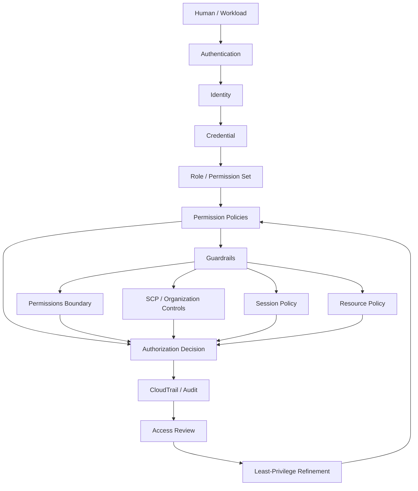
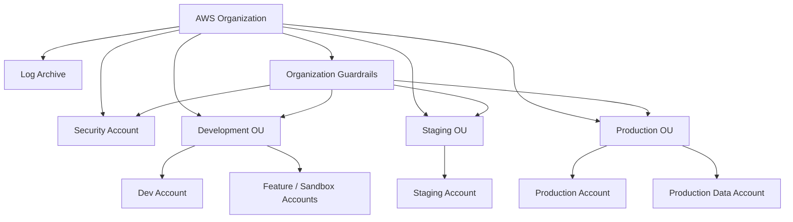
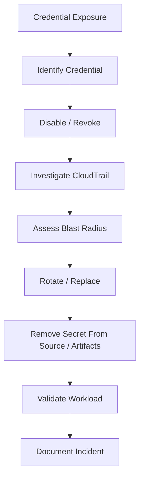
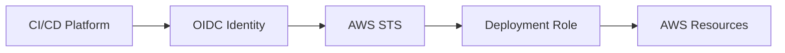
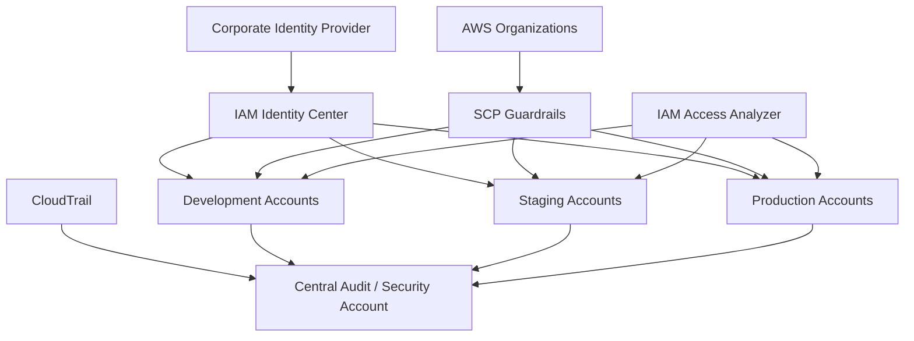
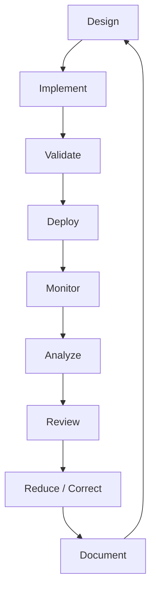

# 04- Security and Governance Questions

## Overview

AWS IAM security and governance questions test whether you can move beyond individual permissions and design an access-control system that remains secure as an organization, application estate, and AWS footprint grow.

The core governance model is:

```text
Identity
    ↓
Credential
    ↓
Role / Permission Set
    ↓
Policy
    ↓
Authorization Guardrails
    ↓
Resource Access
    ↓
Audit + Monitoring
    ↓
Review + Remediation
```

A strong senior-level answer should connect:

```text
Least privilege
+
Temporary credentials
+
Strong authentication
+
Workload identity
+
Centralized governance
+
Policy guardrails
+
Continuous analysis
+
Auditability
+
Incident response
```

AWS currently recommends federation with an identity provider and temporary credentials for human access, IAM roles and temporary credentials for workloads, MFA, least privilege, IAM Access Analyzer, regular removal of unused access, and organization-wide permission guardrails. ([AWS: IAM security best practices](https://docs.aws.amazon.com/IAM/latest/UserGuide/best-practices.html))

---

## Security Mental Model

Think of IAM security as several independent controls:



A secure IAM design therefore asks:

```text
Who can authenticate?
How do they obtain credentials?
What identity do they receive?
What can that identity do?
What can constrain it?
How is access monitored?
How is stale access removed?
```

---

## Human Identity Security

### How should human users authenticate to AWS?

For a modern organization, prefer:

```text
Corporate Identity Provider
        ↓
IAM Identity Center
        ↓
Permission Set
        ↓
AWS account role
        ↓
Temporary credentials
```

This avoids creating a separate long-lived IAM user and access key for every employee.

AWS recommends federating human users and using temporary credentials. ([AWS: IAM security best practices](https://docs.aws.amazon.com/IAM/latest/UserGuide/best-practices.html))

---

### Why should IAM users be minimized?

IAM users can have long-lived credentials:

```text
Password
Access key
Secret access key
```

These require ongoing:

```text
Rotation
Storage
Distribution
Revocation
Monitoring
Incident response
```

Human users generally benefit from centralized identity because employee lifecycle changes then happen at the identity-provider layer rather than through dozens of separate AWS IAM users.

---

### When is an IAM user still justified?

Avoid saying:

> IAM users should never exist.

A better answer is:

> IAM users should be minimized and retained only for specific requirements that cannot reasonably use federation or temporary credentials.

Possible examples include:

```text
Legacy integration
Specific compatibility requirement
Specialized programmatic access
Emergency recovery requirement
```

Any such identity should have:

```text
Owner
Purpose
Least privilege
MFA where applicable
Credential lifecycle
Monitoring
```

---

## MFA Questions

### Why is MFA important?

MFA adds another authentication factor in addition to the primary credential.

Conceptually:

```text
Password / primary credential
+
MFA factor
=
Stronger authentication
```

AWS recommends MFA and currently recommends phishing-resistant MFA such as passkeys and security keys wherever possible. ([AWS: IAM security best practices](https://docs.aws.amazon.com/IAM/latest/UserGuide/best-practices.html))

---

### Where should MFA be enforced?

For human access, prefer the centralized workforce identity system when possible.

For IAM users and root access:

```text
MFA should be required
```

For sensitive authorization paths, policies can also use request-context conditions such as:

```text
aws:MultiFactorAuthPresent
```

The precise implementation depends on whether the identity is a federated user, IAM user, or role session.

---

### What is phishing-resistant MFA?

Phishing-resistant MFA uses authentication methods that are bound to the legitimate origin or cryptographic challenge rather than relying solely on a code that can be socially engineered.

Examples include:

```text
Passkeys
Security keys
```

AWS explicitly recommends phishing-resistant MFA where possible. ([AWS: IAM security best practices](https://docs.aws.amazon.com/IAM/latest/UserGuide/best-practices.html))

---

## Root User Security

### Why is the root user dangerous?

The account root user has full access to the AWS account and is not constrained by ordinary IAM identity policies.

AWS strongly recommends avoiding root-user access except for tasks that require root credentials. ([AWS: Root user best practices](https://docs.aws.amazon.com/IAM/latest/UserGuide/root-user-best-practices.html))

The root account should therefore be treated as:

```text
Break-glass / exceptional identity
```

rather than:

```text
Daily administrator identity
```

---

### What are the most important root-user controls?

At minimum:

```text
Do not use root routinely
Protect root credentials
Enable strong MFA
Do not create root access keys
Protect recovery mechanisms
Monitor and audit root activity
```

AWS specifically recommends not creating access keys for the root user. ([AWS: Root user best practices](https://docs.aws.amazon.com/IAM/latest/UserGuide/root-user-best-practices.html))

For AWS Organizations, AWS also recommends reducing or removing root credentials for member accounts where the supported account-recovery model permits it. ([AWS: Root user best practices](https://docs.aws.amazon.com/IAM/latest/UserGuide/root-user-best-practices.html))

---

### Why should root access keys not exist?

An access key for root creates a permanent programmatic credential with full account-level authority.

If exposed:

```text
Root access key
    ↓
Full account control
```

There is no normal permission-policy layer that meaningfully narrows it.

AWS explicitly recommends not creating root access keys. ([AWS: Root user best practices](https://docs.aws.amazon.com/IAM/latest/UserGuide/root-user-best-practices.html))

---

## Access Key Security

### What are the risks of long-lived access keys?

Long-lived credentials can be exposed through:

```text
Git repositories
Docker images
`.env` files
CI/CD variables
Application logs
Shell history
Developer machines
Shared configuration files
Build artifacts
```

The risk is amplified by:

```text
Long lifetime
Broad permissions
Poor ownership
Weak rotation
Unknown deployment locations
```

---

### How should long-lived credentials be handled?

When they are unavoidable:

```text
Inventory
    ↓
Assign owner
    ↓
Limit permissions
    ↓
Store securely
    ↓
Rotate
    ↓
Monitor
    ↓
Replace with temporary credentials
```

AWS recommends using temporary credentials and avoiding long-term access keys for workloads where possible. ([AWS: IAM security best practices](https://docs.aws.amazon.com/IAM/latest/UserGuide/best-practices.html))

---

### How would you rotate an access key without downtime?

Use two-key rotation:


CLI:

```bash
aws iam create-access-key \
    --user-name deploy-user
```

After migrating the workload:

```bash
aws iam update-access-key \
    --user-name deploy-user \
    --access-key-id <OLD_KEY_ID> \
    --status Inactive
```

Only delete the old key after the replacement is confirmed.

---

## Temporary Credential Security

### Why are temporary credentials safer?

Temporary credentials have an expiration time.

If exposed:

```text
Exposure
    ↓
Attacker obtains temporary credentials
    ↓
Credential expires
```

rather than:

```text
Exposure
    ↓
Long-lived access key
    ↓
Valid until manually revoked
```

Temporary credentials do not eliminate risk, but they reduce credential lifetime and simplify workload identity.

AWS recommends temporary credentials for humans and workloads. ([AWS: IAM security best practices](https://docs.aws.amazon.com/IAM/latest/UserGuide/best-practices.html))

---

### Where are temporary credentials commonly used?

```text
IAM Identity Center
AssumeRole
EC2 instance roles
ECS task roles
Lambda execution roles
EKS Pod Identity
IRSA
OIDC-based CI/CD
Federated access
```

---

## Least Privilege

### What is least privilege?

Least privilege means granting only the permissions required for the intended task.

Example:

Instead of:

```json
{
  "Effect": "Allow",
  "Action": "s3:*",
  "Resource": "*"
}
```

prefer:

```json
{
  "Effect": "Allow",
  "Action": [
    "s3:GetObject",
    "s3:ListBucket"
  ],
  "Resource": [
    "arn:aws:s3:::orders-data",
    "arn:aws:s3:::orders-data/*"
  ]
}
```

AWS explicitly recommends applying least privilege and regularly removing unused permissions. ([AWS: IAM security best practices](https://docs.aws.amazon.com/IAM/latest/UserGuide/best-practices.html))

---

### How do you implement least privilege in practice?

Use several stages:

```text
Start with functional permissions
    ↓
Observe access
    ↓
Review CloudTrail
    ↓
Use Access Analyzer / last accessed data
    ↓
Narrow actions
    ↓
Narrow resources
    ↓
Add conditions
    ↓
Validate
    ↓
Monitor
```

AWS recommends using IAM Access Analyzer to help generate and refine least-privilege policies from access activity. ([AWS: IAM security best practices](https://docs.aws.amazon.com/IAM/latest/UserGuide/best-practices.html))

---

### Why is least privilege not simply "fewest permissions possible"?

Because a production system also needs:

```text
Reliability
Operability
Disaster recovery
Maintainability
Deployment access
Observability
```

A permission used only during:

```text
Regional failover
Database restore
Emergency rollback
```

may be intentionally rare.

The correct goal is:

```text
Minimum required access
+
Operational completeness
```

---

## IAM Access Analyzer

### What is IAM Access Analyzer?

IAM Access Analyzer provides several security and governance capabilities, including:

```text
External access analysis
Internal access analysis
Unused access analysis
Policy validation
Custom policy checks
Policy generation
```

AWS currently describes Access Analyzer as a core mechanism for detecting unintended access and validating policies against AWS best practices. ([AWS: IAM Access Analyzer](https://docs.aws.amazon.com/IAM/latest/UserGuide/what-is-access-analyzer.html))

---

### How does Access Analyzer help with external access?

External access analyzers can identify supported resources that are shared with principals outside the relevant organization or account boundary.

Typical security concern:

```text
S3 bucket
    ↓
Resource policy
    ↓
External AWS account
```

Access Analyzer can produce a finding for unintended external access.

This is especially useful in large organizations where resource policies are difficult to review manually. ([AWS: IAM Access Analyzer](https://docs.aws.amazon.com/IAM/latest/UserGuide/what-is-access-analyzer.html))

---

### How does Access Analyzer help with unused access?

Unused access analyzers continuously examine IAM users and roles for unused access patterns.

Findings can include:

```text
Unused roles
Unused access keys
Unused passwords
Unused services
Unused actions
```

AWS states that unused access analysis uses last accessed information to identify unused access within the configured analysis period. ([AWS: IAM Access Analyzer findings](https://docs.aws.amazon.com/IAM/latest/UserGuide/access-analyzer-concepts.html))

---

### How is Access Analyzer different from Access Advisor?

| Access Advisor / Last Accessed | IAM Access Analyzer |
|---|---|
| Historical access information | Analysis and findings |
| Service/action usage | Unused/external/internal access |
| Useful for manual reviews | Useful for continuous governance |
| One evidence source | Broader access-analysis capability |
| Access history | Policy/access analysis |

A strong answer is:

> Access Advisor provides last-accessed evidence, while Access Analyzer turns access and policy analysis into findings and also provides validation and external-access analysis.

---

## Policy Validation

### How should IAM policies be validated?

Use IAM Access Analyzer policy validation before production deployment.

CLI:

```bash
aws accessanalyzer validate-policy \
    --policy-document file://policy.json \
    --policy-type IDENTITY_POLICY
```

The validator checks policy grammar and AWS best-practice-related findings, returning errors, security warnings, general warnings, and suggestions. ([AWS: Validate policies with IAM Access Analyzer](https://docs.aws.amazon.com/IAM/latest/UserGuide/access-analyzer-policy-validation.html))

---

### Should policy validation be part of CI/CD?

Yes.

A production workflow can be:

```text
Policy change
    ↓
Pull request
    ↓
Validate JSON
    ↓
Access Analyzer validation
    ↓
Security checks
    ↓
Policy review
    ↓
Deployment
```

This makes IAM policy governance similar to application code governance.

---

## Permissions Boundaries

### Why are permissions boundaries a governance control?

A permissions boundary sets the maximum permissions available to an IAM user or role through its identity-based policies.

Example:

```text
Platform engineer
    ↓
Can create roles
    ↓
Boundary required
    ↓
Created role cannot exceed approved permission ceiling
```

This enables delegated administration without giving every delegated engineer unrestricted IAM authority.

AWS recommends permissions boundaries as a way to delegate permissions management within an account. ([AWS: IAM security best practices](https://docs.aws.amazon.com/IAM/latest/UserGuide/best-practices.html))

---

### What is a common permissions-boundary governance pattern?

```text
Central Security Team
    ↓
Defines boundary policy
    ↓
Platform Team
    ↓
Creates application roles
    ↓
Every role has required boundary
```

The platform team can then manage application-specific permission policies while the security team controls the maximum capability.

---

## Service Control Policies

### Why are SCPs important for governance?

SCPs provide organization-level guardrails.

Example:

```text
Organization
    ↓
Production OU
    ↓
Production accounts
    ↓
SCP
    ↓
Restrict selected actions
```

SCPs do not grant permissions. They limit the maximum available permissions for IAM users and roles in affected member accounts. ([AWS: Service control policies](https://docs.aws.amazon.com/organizations/latest/userguide/orgs_manage_policies_scps.html))

---

### What is a good SCP use case?

Common guardrails include:

```text
Deny access to unsupported Regions
Prevent disabling critical security services
Restrict destructive account operations
Restrict changes to central security configuration
Prevent use of unapproved services
```

The SCP should be:

```text
Simple
Well-tested
Documented
Organization-aware
```

AWS strongly recommends testing SCP effects before attaching restrictive policies broadly. ([AWS: Service control policies](https://docs.aws.amazon.com/organizations/latest/userguide/orgs_manage_policies_scps.html))

---

### What is the danger of an overly broad SCP?

Because it affects many workloads simultaneously.

Example:

```text
SCP deployed at Organization Root
    ↓
Incorrect Deny
    ↓
All member accounts affected
```

Potential blast radius:

```text
Every production account
Every development account
Every deployment pipeline
```

Use staged rollout:

```text
Sandbox OU
    ↓
Development OU
    ↓
Staging OU
    ↓
Production OU
```

and validate before wider attachment. AWS recommends testing SCPs in smaller scopes before attaching them broadly. ([AWS: Service control policies](https://docs.aws.amazon.com/organizations/latest/userguide/orgs_manage_policies_scps.html))

---

## Multi-Account Governance

### Why use multiple AWS accounts?

Accounts provide strong isolation boundaries for:

```text
Production
Development
Security
Shared services
Data
Networking
Logging
Sandbox
```

A common governance architecture is:



The exact topology depends on organizational requirements, but account-level isolation combined with centralized identity and governance scales better than one account with thousands of unrelated roles.

---

## IAM Identity Center Governance

### Why use IAM Identity Center in multi-account environments?

It provides centralized workforce access.

A typical model is:

```text
Corporate IdP
    ↓
IAM Identity Center
    ↓
Permission Sets
    ↓
Multiple AWS Accounts
```

This centralizes:

```text
Human identity lifecycle
Account access assignment
Permission-set management
Temporary credentials
MFA integration
```

AWS recommends centralized federation/IAM Identity Center for workforce access. ([AWS: IAM security best practices](https://docs.aws.amazon.com/IAM/latest/UserGuide/best-practices.html))

---

### What is a permission set?

A permission set defines the permissions a workforce identity receives when accessing an AWS account through IAM Identity Center.

Conceptually:

```text
User / Group
    ↓
Permission Set
    ↓
Account
    ↓
AWS role session
```

Examples:

```text
Developer
ReadOnly
SecurityAudit
ProductionOperator
DatabaseAdministrator
```

A common governance mistake is giving everyone:

```text
AdministratorAccess
```

instead of defining purpose-specific permission sets.

---

## Workload Identity Governance

### How should workload identities be governed?

Each workload should have:

```text
Owner
Purpose
Environment
Role
Permissions
Trust relationship
Deployment mechanism
Review cadence
```

Example:

```text
Role:
OrdersApiTaskRole

Owner:
Orders Team

Purpose:
Orders API

Environment:
Production

Allowed:
s3:GetObject
sqs:SendMessage
secretsmanager:GetSecretValue
```

This creates traceability between:

```text
Application
    ↓
IAM role
    ↓
Permissions
```

---

## Role Trust Governance

### Why is the trust policy as important as the permission policy?

A highly privileged role with a tightly scoped trust policy may still be secure within its intended delegation boundary.

A highly privileged role with:

```text
Broad trust
```

can be dangerous even if its permission policy appears intentional.

Example risk:

```text
ProductionAdminRole
    ↓
Trusted by entire external account
```

If the external account is compromised:

```text
Compromised account
    ↓
Assume ProductionAdminRole
    ↓
Production access
```

Therefore review:

```text
Who can assume?
From which account?
Under which conditions?
For how long?
With what session attributes?
```

---

## External IDs and Confused Deputy Protection

### Why is `ExternalId` important?

When a third-party service assumes a role in your account, the external service may serve multiple customers.

Without customer-specific context:

```text
Customer A
Customer B
Vendor
```

could create a confused-deputy risk.

An `ExternalId` allows the trust policy to require an expected customer-specific value.

Typical pattern:

```text
Customer Account
    ↓
Vendor assumes role
    ↓
sts:ExternalId required
```

Use this for appropriate third-party cross-account role assumptions.

---

## Service-to-Service Governance

### What is a confused deputy problem?

A confused deputy occurs when a trusted intermediary with permissions is tricked into using those permissions on behalf of an unintended party.

AWS provides request-context mechanisms such as:

```text
aws:SourceArn
aws:SourceAccount
ExternalId
```

to help constrain service-to-service or third-party delegation patterns.

The correct control depends on the architecture and AWS service.

---

## `aws:SourceArn` and `aws:SourceAccount`

### Why use `aws:SourceArn`?

It restricts a service-to-service request based on the source resource ARN when the service supplies that context.

Example concept:

```text
Only this SNS topic
    ↓
Can invoke this target
```

rather than:

```text
Any SNS topic
```

### Why use `aws:SourceAccount`?

It narrows access to resources originating from a specified AWS account.

Using both can provide stronger protection:

```text
Source account
+
Specific source resource
```

AWS documents these as global condition keys used to help constrain service-to-service access. ([AWS: Global condition keys](https://docs.aws.amazon.com/IAM/latest/UserGuide/reference_policies_condition-keys.html))

---

## ABAC Governance

### What is the governance benefit of ABAC?

Attribute-Based Access Control can reduce policy duplication when identities and resources have consistent attributes.

Example:

```text
Principal:
Environment=production
Team=payments

Resource:
Environment=production
Team=payments
```

Policy:

```text
Allow when attributes satisfy condition
```

This can support large environments with many dynamic resources.

---

### What is the governance risk of ABAC?

ABAC increases dependence on attribute correctness.

If a resource is incorrectly tagged:

```text
Environment=development
```

instead of:

```text
Environment=production
```

the authorization decision can change unexpectedly.

Therefore ABAC requires:

```text
Mandatory tags
Tag validation
Ownership
Automation
Monitoring
```

---

## Privilege Escalation

### What is IAM privilege escalation?

Privilege escalation occurs when a principal can use its existing permissions to obtain greater permissions than intended.

One common pattern is:

```text
Create or modify resource
+
iam:PassRole
+
Privileged role
```

Example:

```text
Developer
    ↓
Can create Lambda
    +
Can pass AdminRole
    ↓
Lambda executes with AdminRole
```

Other escalation risks can involve:

```text
iam:AttachRolePolicy
iam:PutRolePolicy
iam:CreatePolicyVersion
iam:UpdateAssumeRolePolicy
iam:CreateAccessKey
```

The exact exploitability depends on the available permission combinations and target role configuration.

---

### How should privilege escalation be prevented?

Use:

```text
Least privilege
+
Permissions boundaries
+
Narrow iam:PassRole
+
Controlled IAM administration
+
SCP guardrails
+
Policy review
+
Access Analyzer
+
CloudTrail
```

AWS provides policy evaluation guidelines specifically for security-sensitive services and IAM-sensitive permissions. ([AWS: Policy evaluation guidelines](https://docs.aws.amazon.com/IAM/latest/UserGuide/temporary-delegation-policy-evaluation-guidelines.html))

---

## `iam:PassRole` Governance

### How should `iam:PassRole` be scoped?

Avoid:

```json
{
  "Effect": "Allow",
  "Action": "iam:PassRole",
  "Resource": "*"
}
```

when a narrower scope is possible.

Prefer specific roles:

```json
{
  "Effect": "Allow",
  "Action": "iam:PassRole",
  "Resource": "arn:aws:iam::123456789012:role/OrdersLambdaRole"
}
```

Also consider the trust relationship and service that will receive the role.

---

## Credential Exposure

### What should you do if an access key is exposed?

Treat it as compromised.

A production incident workflow is:



Do not wait for proof of misuse before containing a known exposed long-lived credential.

---

### What evidence should be reviewed after credential exposure?

Check:

```text
CloudTrail events
Credential last-used information
Source repository
CI/CD logs
Docker registry/image history
Secret stores
Application logs
Network/security telemetry
```

Then determine:

```text
Which account?
Which services?
Which resources?
Which actions?
Which time period?
```

---

## Credential Governance

A mature credential lifecycle is:

```text
Create
    ↓
Assign owner
    ↓
Use
    ↓
Monitor
    ↓
Rotate
    ↓
Deactivate
    ↓
Delete
```

For long-lived credentials:

```text
Prefer migration
    ↓
Temporary credentials
    ↓
Remove permanent credential
```

Use credential reports and access-analysis tooling as evidence during lifecycle review. ([AWS: IAM security best practices](https://docs.aws.amazon.com/IAM/latest/UserGuide/best-practices.html))

---

## Unused Access

### How do you identify unused permissions?

Use:

```text
IAM Access Analyzer unused access
IAM last accessed information
CloudTrail
Application/IaC review
```

Access Analyzer's unused-access analysis can identify unused roles, keys, passwords, services, and actions based on the configured monitoring period. ([AWS: IAM Access Analyzer](https://docs.aws.amazon.com/IAM/latest/UserGuide/what-is-access-analyzer.html))

---

### Can you automatically delete every unused permission?

No.

Possible false assumptions include:

```text
Rare DR permission
Break-glass role
Monthly batch job
Rollback permission
Migration role
Operational repair path
```

A better process is:

```text
Finding
    ↓
Owner review
    ↓
CloudTrail validation
    ↓
Architecture review
    ↓
Controlled reduction
    ↓
Monitoring
```

---

## Access Reviews

### What should an IAM access review contain?

At minimum:

```text
Users
Roles
Permission sets
Groups
Access keys
MFA state
Trust policies
Permission policies
Resource policies
Boundaries
SCPs
Unused access
External access
Cross-account access
```

For high-risk identities, include:

```text
Break-glass roles
Production administrators
CI/CD deployment roles
Security roles
Database access
Secrets access
```

---

## IAM Governance Through Infrastructure as Code

### Why should IAM be managed as code?

Infrastructure-as-code provides:

```text
Version control
Peer review
Change history
Automated validation
Repeatability
Rollback
Environment consistency
```

Example:

```text
Terraform / CloudFormation / CDK
    ↓
IAM policy
    ↓
Pull request
    ↓
Security review
    ↓
Deployment
```

This is preferable to creating critical production roles through ad-hoc console operations.

---

### What should an IAM code review check?

Review:

```text
Action scope
Resource scope
Principal scope
Conditions
Trust policy
iam:PassRole
Permissions boundary
Cross-account access
Public access
Wildcards
Sensitive services
```

Use IAM Access Analyzer validation in the pipeline where practical. ([AWS: Validate policies with IAM Access Analyzer](https://docs.aws.amazon.com/IAM/latest/UserGuide/access-analyzer-policy-validation.html))

---

## CI/CD Governance

### How should a CI/CD platform authenticate to AWS?

Prefer:



This avoids storing long-lived AWS access keys in CI/CD.

The trust policy should narrow:

```text
Repository
Branch
Environment
Organization
Subject / claims
```

where supported by the provider's OIDC claims.

---

### Should every pipeline use the same deployment role?

Not necessarily.

For stronger isolation:

```text
Frontend deployment
    → FrontendDeployRole

Backend deployment
    → BackendDeployRole

Infrastructure
    → InfrastructureDeployRole

Security tooling
    → SecurityAuditRole
```

Separate roles reduce blast radius and make audit events easier to attribute.

---

## Monitoring and Audit

### Why is CloudTrail important for IAM governance?

CloudTrail provides runtime evidence of AWS API activity.

It can answer:

```text
Who made the request?
What API was called?
When?
From which account?
Against which resource?
Did it succeed or fail?
```

This makes CloudTrail a key source for:

```text
Credential investigations
Privilege escalation detection
Policy validation
Incident response
Access review
Compliance evidence
```

---

### What IAM-related events deserve special attention?

Examples include:

```text
CreateAccessKey
CreateLoginProfile
UpdateLoginProfile
CreateUser
CreateRole
DeleteRole
AttachRolePolicy
AttachUserPolicy
PutRolePolicy
PutUserPolicy
UpdateAssumeRolePolicy
PassRole-related activity
AssumeRole
AssumeRoleWithWebIdentity
```

Monitor especially for unexpected operations performed by low-privilege identities.

---

## Detective Controls vs Preventive Controls

A useful governance distinction is:

| Control type | Examples |
|---|---|
| Preventive | SCPs, permissions boundaries, policy conditions, least-privilege policies |
| Detective | CloudTrail, Access Analyzer findings, IAM credential reports, access reviews |
| Corrective | Credential rotation, role policy reduction, deactivation, revocation |
| Compensating | Break-glass controls, approval workflows, additional monitoring |

A mature security architecture uses all four.

---

## Governance Architecture

A production enterprise IAM architecture can be modeled as:



The core principles are:

```text
Central workforce identity
+
Account isolation
+
Organization guardrails
+
Workload roles
+
Least privilege
+
Continuous analysis
+
Centralized audit
```

---

## Security Account Pattern

A dedicated security account can host:

```text
CloudTrail analysis
Security tooling
Centralized findings
Audit roles
Incident-response tooling
Security dashboards
```

Application workloads should not normally run in the same account as central security tooling.

This separation reduces:

```text
Blast radius
Administrative coupling
Audit conflicts
```

---

## Management Account Security

AWS notes that SCPs do not apply to the organization management account. Therefore, the management account should contain only the resources and data that genuinely need to be there, with strong restrictions on routine use. ([AWS: Best practices for the management account](https://docs.aws.amazon.com/organizations/latest/userguide/orgs_best-practices_mgmt-acct.html))

Interview answer:

> Treat the management account as a high-value control-plane account, minimize workload resources there, and avoid using it as a general-purpose production account.

---

## Break-Glass Access

### What is a break-glass role?

A break-glass role is an emergency access mechanism reserved for situations where normal access paths are unavailable or insufficient.

Typical characteristics:

```text
Rarely used
Highly privileged
Strongly monitored
MFA protected
Explicitly owned
Documented
Approval controlled
```

Never treat:

```text
Unused
```

as:

```text
Unnecessary
```

A break-glass role may be intentionally unused for long periods.

---

## Disaster Recovery and IAM

IAM governance must account for:

```text
Regional failover
Backup restoration
Account recovery
Security incidents
Identity-provider outage
Deployment recovery
```

A secure architecture should ensure that the organization can still reach critical administrative functions when the normal identity path is unavailable.

This may require:

```text
Break-glass access
Offline recovery procedures
Multi-person approval
Independent recovery factors
Documented root recovery
```

---

## Availability of Identity Systems

A centralized identity architecture introduces an important trade-off:

```text
Centralized identity
    +
Centralized governance
```

improves consistency but makes the identity plane operationally important.

A production governance design should document:

```text
Identity-provider outage procedure
IAM Identity Center outage procedure
Emergency AWS access
MFA recovery
Break-glass access
Cross-account administrative access
```

Security should not create an unrecoverable operational dependency.

---

## Security and Governance Trade-Offs

| Design choice | Security benefit | Trade-off |
|---|---|---|
| Strict least privilege | Smaller blast radius | More policy maintenance |
| Many workload roles | Strong isolation | More IAM objects |
| Centralized identity | Consistent workforce access | Identity-platform dependency |
| SCP guardrails | Organization-wide control | Large blast radius if wrong |
| ABAC | Scales policy patterns | Requires strong tag governance |
| Short-lived credentials | Lower exposure window | More dependency on credential refresh |
| Break-glass controls | Recovery capability | Very high privilege must be tightly controlled |
| Broad managed policies | Easy administration | Harder least privilege |
| Customer-managed policies | Stronger control | Higher maintenance effort |

Senior candidates should show that security design is an engineering trade-off rather than simply "more restrictions are better."

---

## Common Security Questions

### What is the most important IAM security principle?

Least privilege is foundational, but a strong answer should combine it with:

```text
Temporary credentials
Strong authentication
MFA
Root protection
Federation
Workload identity
Continuous auditing
Guardrails
```

AWS's current IAM best-practice guidance emphasizes this combination. ([AWS: IAM security best practices](https://docs.aws.amazon.com/IAM/latest/UserGuide/best-practices.html))

---

### Why are temporary credentials better than permanent access keys?

They reduce:

```text
Credential lifetime
Rotation burden
Long-term exposure
Secret-distribution surface
```

They also align naturally with:

```text
Roles
Federation
Workload identity
OIDC
STS
```

---

### What should you do when an IAM key is leaked?

```text
Contain
    ↓
Revoke / disable
    ↓
Investigate
    ↓
Rotate
    ↓
Remove from source/artifacts
    ↓
Migrate to temporary credentials
    ↓
Monitor
```

Do not simply rotate the key and leave the insecure architecture unchanged.

---

### How do you prevent users from creating privileged roles?

Use a combination of:

```text
Restricted IAM administration
+
Permissions boundaries
+
SCP guardrails
+
iam:PassRole controls
+
Code review
+
Access Analyzer
+
CloudTrail
```

---

### How would you secure an AWS organization?

A strong answer includes:

```text
Organizations
+
Multiple accounts
+
IAM Identity Center
+
Permission sets
+
SCPs
+
Dedicated security account
+
Centralized logging
+
Access Analyzer
+
Least-privilege workload roles
+
OIDC-based CI/CD
+
Break-glass controls
```

---

## Security Scenario Questions

### Scenario: A developer can create an EC2 instance and pass an administrator role.

Why is this dangerous?

```text
Create EC2
+
iam:PassRole(AdminRole)
=
Potential privilege escalation
```

The developer may cause EC2 to run with administrator permissions.

The fix is to:

```text
Restrict PassRole
Restrict which roles can be passed
Restrict resource creation
Use permissions boundaries
Review trust policies
```

---

### Scenario: A developer has `iam:AttachRolePolicy`.

Why is this dangerous?

If the developer can modify a role used by a workload or can assume the role, they may be able to attach a more privileged policy.

The access path should therefore be reviewed as a potential privilege-escalation route.

---

### Scenario: An S3 bucket is accidentally shared with an external account.

How would you detect it?

Use:

```text
IAM Access Analyzer external access analyzer
+
S3 bucket policy review
+
CloudTrail
```

Access Analyzer can identify supported resources that are shared externally based on resource-policy analysis. ([AWS: IAM Access Analyzer](https://docs.aws.amazon.com/IAM/latest/UserGuide/what-is-access-analyzer.html))

---

### Scenario: A production role has not been used for six months.

Should it be deleted?

Not automatically.

Check:

```text
Break-glass purpose
DR workflow
Scheduled jobs
Rollback
Owner
Access Analyzer
CloudTrail
Application architecture
```

If it is truly obsolete:

```text
Disable / remove access
    ↓
Observe
    ↓
Delete
```

---

### Scenario: A policy grants `Action: "*"` but only one service is used.

What would you do?

```text
1. Identify the actual service operations.
2. Review CloudTrail.
3. Use Access Advisor / Access Analyzer.
4. Refine actions.
5. Refine resources.
6. Add conditions where appropriate.
7. Test.
8. Deploy incrementally.
```

Do not simply replace `*` with random individual actions without understanding the workload.

---

## Security Interview Traps

| Question | Trap | Correct direction |
|---|---|---|
| Is MFA enough? | Treating MFA as the whole IAM security model | Combine MFA with least privilege and temporary credentials |
| Is root safe behind a strong password? | Using root operationally | Avoid routine root access |
| Is an unused role safe to delete? | Ignoring DR/break-glass use | Validate purpose and operational paths |
| Does an SCP grant access? | Confusing guardrail with permission | SCP limits permissions |
| Does a boundary grant access? | Confusing ceiling with permission | Boundary limits identity-policy grants |
| Does Access Analyzer replace CloudTrail? | Treating findings as runtime evidence | Use CloudTrail for actual API activity |
| Can `iam:PassRole` be ignored? | Missing privilege escalation paths | Review it explicitly |
| Is `Action: "*"` always wrong? | Ignoring service semantics | Scope where practical and justify exceptions |
| Does IAM user MFA protect access keys? | MFA does not automatically protect every API use of long-lived keys | Prefer temporary credentials |
| Is a shared admin role simpler? | Ignoring blast radius | Use dedicated workload and operational roles |

---

## Audit Questions

### What should be audited regularly?

At minimum:

```text
Root access
IAM users
MFA
Access keys
Role trust policies
Privileged roles
Permissions boundaries
SCPs
External resource sharing
Unused access
Cross-account access
CI/CD identities
Break-glass identities
```

---

### What tools should be part of the audit process?

A mature toolset includes:

```text
IAM Credential Report
IAM Access Advisor
IAM Access Analyzer
CloudTrail
AWS Organizations
IAM policy validation
Policy Simulator
Infrastructure as Code
```

No single tool provides complete IAM governance coverage.

---

## Governance Metrics

A security team can track:

```text
IAM users with long-lived credentials
IAM users without MFA
Active root credentials
Root access events
Unused IAM roles
Unused access keys
Unused passwords
External-access findings
Overly broad policies
Privileged roles
Roles without owners
Cross-account trust relationships
IAM policy validation findings
Privilege-escalation findings
Audit coverage by account
```

Useful trend metrics include:

```text
Unused access findings over time
Long-lived credentials over time
Privileged identities over time
External access findings over time
```

The objective is to reduce unmanaged access and shorten remediation time.

---

## Security Governance Lifecycle

A mature organization can operate IAM as a continuous loop:



Security is therefore not:

```text
Create IAM policy once
```

It is:

```text
Design
+
Validation
+
Runtime monitoring
+
Continuous review
```

---

## Production IAM Security Checklist

Before approving a production identity or role:

```text
[ ] Human or workload identity is clearly defined
[ ] Temporary credentials are used where practical
[ ] IAM user use is justified
[ ] MFA is enforced for applicable human access
[ ] Root credentials are protected
[ ] Access key ownership is documented
[ ] Trust policy is narrow
[ ] Permission policy is least privilege
[ ] Resource scope is narrow
[ ] Wildcards are justified
[ ] Conditions are used where useful
[ ] Permissions boundary considered
[ ] SCP/RCP impact understood
[ ] iam:PassRole reviewed
[ ] Cross-account access reviewed
[ ] Access Analyzer validation completed
[ ] CloudTrail monitoring exists
[ ] Break-glass/DR impact reviewed
[ ] Owner and review cadence documented
```

---

## Senior-Level Governance Architecture

A strong senior-level answer should converge on:

```text
Human access
    → Federation / IAM Identity Center
    → Temporary credentials

Workloads
    → Dedicated IAM roles
    → Temporary credentials

CI/CD
    → OIDC
    → Deployment roles

Accounts
    → AWS Organizations
    → SCP guardrails

Delegated IAM administration
    → Permissions boundaries

Resource sharing
    → Narrow resource policies
    → Access Analyzer

Monitoring
    → CloudTrail
    → Security findings

Credential governance
    → Credential reports
    → Access reviews

Least privilege
    → Access Analyzer
    → Last accessed data
    → Policy refinement
```

This separates:

```text
Authentication
Authorization
Governance
Detection
Remediation
```

instead of treating IAM as one large policy file.

---

## Recommended Interview Answer Framework

For security and governance questions, use:

```text
Threat
    ↓
Control
    ↓
Implementation
    ↓
Operational trade-off
    ↓
Detection
    ↓
Recovery
```

Example:

> **How would you secure an AWS production environment?**
>
> I would centralize workforce access through IAM Identity Center or federation, use temporary credentials, assign dedicated roles to workloads, enforce MFA, protect root access, apply least privilege, use SCPs and permissions boundaries as guardrails where appropriate, validate policies with Access Analyzer, monitor activity with CloudTrail, continuously review unused and external access, and maintain controlled break-glass access for recovery.

This demonstrates architecture-level reasoning rather than a list of isolated security controls.

---

## AWS Documentation Links

- [IAM Security Best Practices](https://docs.aws.amazon.com/IAM/latest/UserGuide/best-practices.html)
- [Root User Best Practices](https://docs.aws.amazon.com/IAM/latest/UserGuide/root-user-best-practices.html)
- [IAM Access Analyzer](https://docs.aws.amazon.com/IAM/latest/UserGuide/what-is-access-analyzer.html)
- [IAM Access Analyzer Concepts](https://docs.aws.amazon.com/IAM/latest/UserGuide/access-analyzer-concepts.html)
- [IAM Access Analyzer Policy Validation](https://docs.aws.amazon.com/IAM/latest/UserGuide/access-analyzer-policy-validation.html)
- [IAM Policy Validation Checks](https://docs.aws.amazon.com/IAM/latest/UserGuide/access-analyzer-reference-policy-checks.html)
- [Permissions Boundaries](https://docs.aws.amazon.com/IAM/latest/UserGuide/access_policies_boundaries.html)
- [AWS Organizations SCPs](https://docs.aws.amazon.com/organizations/latest/userguide/orgs_manage_policies_scps.html)
- [SCP Evaluation](https://docs.aws.amazon.com/organizations/latest/userguide/orgs_manage_policies_scps_evaluation.html)
- [AWS Organizations Management Account Best Practices](https://docs.aws.amazon.com/organizations/latest/userguide/orgs_best-practices_mgmt-acct.html)
- [IAM Policy Evaluation Guidelines](https://docs.aws.amazon.com/IAM/latest/UserGuide/temporary-delegation-policy-evaluation-guidelines.html)
- [IAM Global Condition Keys](https://docs.aws.amazon.com/IAM/latest/UserGuide/reference_policies_condition-keys.html)
- [IAM Secure Access Keys](https://docs.aws.amazon.com/IAM/latest/UserGuide/securing_access-keys.html)
- [IAM Access Advisor / Last Accessed Information](https://docs.aws.amazon.com/IAM/latest/UserGuide/access_policies_last-accessed.html)
- [IAM Credential Reports](https://docs.aws.amazon.com/IAM/latest/UserGuide/id_credentials_getting-report.html)
- [AWS CloudTrail](https://docs.aws.amazon.com/awscloudtrail/latest/userguide/cloudtrail-user-guide.html)
- [AWS IAM Identity Center](https://docs.aws.amazon.com/singlesignon/latest/userguide/what-is.html)

## Key Takeaways

- **Treat IAM as a governance system, not only a permission system:** secure authentication, temporary credentials, least privilege, guardrails, monitoring, access reviews, and incident response must work together.
- **Protect the highest-value identities first:** avoid routine root access, require strong MFA for applicable human access, minimize long-lived IAM-user credentials, and tightly control privileged role trust relationships. ([AWS: IAM security best practices](https://docs.aws.amazon.com/IAM/latest/UserGuide/best-practices.html))
- **Use layered guardrails:** permissions boundaries, SCPs/RCPs, narrow resource policies, policy conditions, and `iam:PassRole` controls provide different governance boundaries and should be designed deliberately.
- **Continuously analyze and audit access:** use IAM Access Analyzer, last-accessed information, credential reports, CloudTrail, and policy validation to identify unused, external, stale, or risky access. ([AWS: IAM Access Analyzer](https://docs.aws.amazon.com/IAM/latest/UserGuide/what-is-access-analyzer.html))
- **Design for both security and recovery:** preserve controlled break-glass, disaster-recovery, and emergency-access paths while continuously reducing unnecessary privilege.