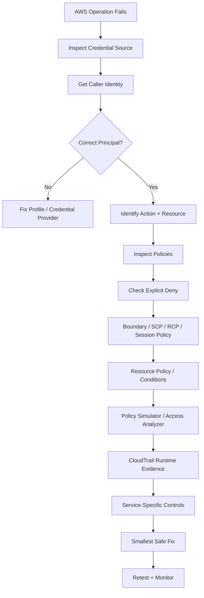
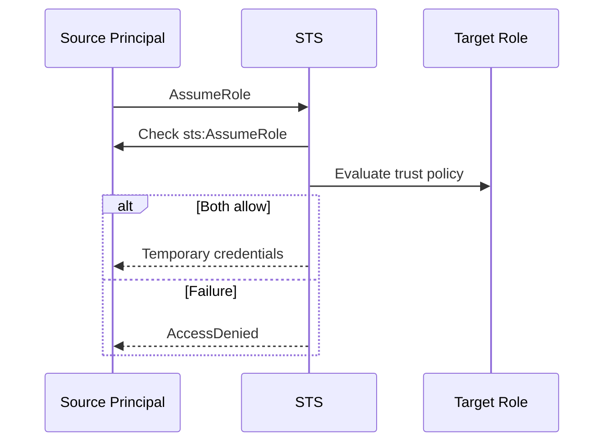
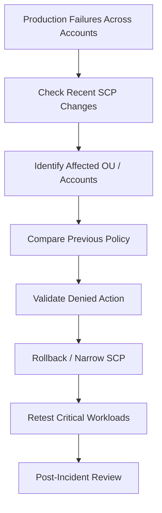
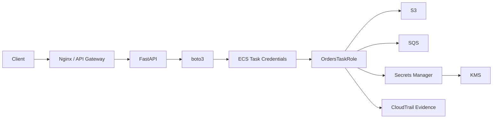

# 05- Troubleshooting Scenarios

## Overview

IAM troubleshooting questions are among the strongest indicators of senior-level AWS knowledge because they test whether you can reason through an authorization failure instead of simply adding permissions.

A reliable IAM troubleshooting model is:

```text
Credential / profile
    ↓
Caller identity
    ↓
AWS API operation
    ↓
Action
    ↓
Resource
    ↓
Request context
    ↓
Applicable policies
    ↓
Explicit deny?
    ↓
Applicable allow?
    ↓
Organization / boundary / session constraints
    ↓
Service-specific authorization
    ↓
Final result
```

AWS evaluates applicable policy layers for a request and returns a deny if an applicable explicit deny is found. Otherwise, an applicable allow must exist for the request to succeed. ([AWS: IAM enforcement logic](https://docs.aws.amazon.com/IAM/latest/UserGuide/reference_policies_evaluation-logic_policy-eval-denyallow.html))

The interview objective is not to memorize every possible AWS error code. It is to demonstrate a repeatable diagnostic method:

```text
Who is calling?
What are they trying to do?
Against what resource?
From which account / Region?
Which credentials are being used?
Which policies apply?
Which control is denying the request?
```

---

## Troubleshooting Framework

### The Five-Layer Model

Classify IAM failures before changing anything.

| Layer | Typical failure |
|---|---|
| Credential discovery | `Unable to locate credentials` |
| Authentication | `InvalidClientTokenId`, `InvalidAccessKeyId`, `ExpiredToken` |
| Identity / role assumption | `AccessDenied` during `AssumeRole` |
| Authorization | `AccessDenied`, `UnauthorizedOperation` |
| Service-specific authorization | S3, KMS, EKS, SQS, Secrets Manager policy interactions |

A production investigation should move through these layers in order.

---

## First Diagnostic Commands

Start with:

```bash
aws configure list
```

Then:

```bash
aws sts get-caller-identity
```

For a named profile:

```bash
aws configure list \
    --profile production

aws sts get-caller-identity \
    --profile production
```

These commands answer two critical questions:

```text
Where are credentials coming from?
Who does AWS think I am?
```

AWS recommends `aws configure list` for determining where the CLI is resolving credentials and configuration from, especially when multiple credential sources exist. ([AWS CLI troubleshooting](https://docs.aws.amazon.com/cli/latest/userguide/cli-chap-troubleshooting.html))

---

## General Troubleshooting Sequence

Use this sequence in interviews and production incidents:



This is superior to:

```text
AccessDenied
    ↓
Add AdministratorAccess
```

---

## Scenario: `AccessDenied` for an AWS API

### Problem

A backend service receives:

```text
AccessDeniedException:
User is not authorized to perform:
s3:GetObject
```

### Diagnostic approach

First:

```bash
aws sts get-caller-identity
```

Then determine:

```text
Principal
Action
Resource
Account
Region
```

Inspect the relevant role:

```bash
aws iam get-role \
    --role-name BackendRole
```

Inspect attached policies:

```bash
aws iam list-attached-role-policies \
    --role-name BackendRole
```

Inspect inline policies:

```bash
aws iam list-role-policies \
    --role-name BackendRole
```

Then evaluate:

```text
Explicit deny?
Permissions boundary?
SCP/RCP?
Session policy?
Resource policy?
Condition mismatch?
KMS authorization?
```

AWS's troubleshooting guidance specifically recommends checking missing allows and explicit denies in the relevant policies. ([AWS: Troubleshoot access denied error messages](https://docs.aws.amazon.com/IAM/latest/UserGuide/troubleshoot_access-denied.html))

### Senior-level answer

> I would first verify the actual caller identity, then identify the exact action and resource, inspect all applicable authorization layers, and use policy simulation and CloudTrail to identify the root cause before modifying permissions.

---

## Scenario: `AccessDenied` During `AssumeRole`

### Problem

The command:

```bash
aws sts assume-role \
    --role-arn arn:aws:iam::123456789012:role/ProductionRole \
    --role-session-name deployment
```

returns:

```text
AccessDenied
```

### Separate the two checks

The source principal must be allowed to perform:

```text
sts:AssumeRole
```

and the target role's trust policy must trust the source principal.

Think:



AWS's troubleshooting documentation explicitly distinguishes implicit and explicit denial in role trust policies. ([AWS: Troubleshoot access denied due to role trust policies](https://docs.aws.amazon.com/IAM/latest/UserGuide/troubleshoot_access-denied.html))

### What to inspect

Source side:

```text
sts:AssumeRole permission
Principal identity
SCP / boundary / session restrictions
```

Target side:

```bash
aws iam get-role \
    --role-name ProductionRole
```

Inspect:

```text
AssumeRolePolicyDocument
Principal
Conditions
ExternalId
MFA
OIDC claims
```

---

## Scenario: `AssumeRole` Works but S3 Access Fails

This is a classic interview scenario.

### Situation

```text
User
    ↓
AssumeRole
    ↓
ProductionRole
    ↓
s3:GetObject
    ↓
AccessDenied
```

### Explanation

Role assumption and resource access are different authorization events.

```text
Phase 1:
Can I assume the role?

Phase 2:
Can the role access the resource?
```

A successful `AssumeRole` only proves that the target role session was created.

Now inspect:

```text
Role permission policies
Permissions boundary
SCP/RCP
Session policy
Resource policy
Conditions
KMS permissions
```

---

## Scenario: Role Policy Allows Access but Request Is Denied

### Example

Role policy:

```json
{
  "Effect": "Allow",
  "Action": "s3:GetObject",
  "Resource": "arn:aws:s3:::backend-data/*"
}
```

Request:

```text
s3:GetObject
arn:aws:s3:::backend-data/config.json
```

Yet the call fails.

### Possible causes

```text
Wrong role
Wrong account
Wrong object ARN
Explicit deny
Permissions boundary
SCP
RCP
Session policy
Bucket policy
Condition mismatch
KMS key policy
VPC endpoint policy
Service-specific authorization
```

The correct interview answer is:

> An allow in the identity policy is only one part of authorization. I would inspect the complete policy evaluation context.

AWS documents identity policies, resource policies, boundaries, SCPs, RCPs, and session policies as applicable policy sources. ([AWS: IAM policy evaluation](https://docs.aws.amazon.com/IAM/latest/UserGuide/reference_policies_evaluation-logic.html))

---

## Scenario: Permissions Boundary Blocks a Valid Role Policy

### Situation

```text
Role policy:
Allow secretsmanager:GetSecretValue

Boundary:
Does not permit secretsmanager:GetSecretValue
```

### Result

```text
Denied
```

A permissions boundary defines the maximum permissions available to a user or role through identity-based policies. ([AWS: Permissions boundaries](https://docs.aws.amazon.com/IAM/latest/UserGuide/access_policies_boundaries.html))

### Diagnostic command

```bash
aws iam get-role \
    --role-name BackendRole \
    --query 'Role.PermissionsBoundary'
```

### Interview answer

> I would not add more permissions to the role policy first. I would inspect the permissions boundary because the boundary may be restricting the identity policy's effective permissions.

---

## Scenario: SCP Blocks a Request

### Situation

```text
Role policy:
Allow ec2:RunInstances

SCP:
Restricts the requested operation or Region

Result:
AccessDenied
```

### Diagnostic approach

Check:

```text
Account
OU
Attached SCPs
Requested Region
Action
Resource
SCP conditions
```

The key interview point is:

```text
SCP does not grant access.
SCP constrains maximum available permissions.
```

AWS Organizations evaluates SCPs as part of IAM authorization. ([AWS: SCP evaluation](https://docs.aws.amazon.com/organizations/latest/userguide/orgs_manage_policies_scps_evaluation.html))

---

## Scenario: Resource Policy Causes the Denial

Consider:

```text
IAM role:
Allow s3:GetObject

Bucket policy:
Deny access from unapproved network
```

The role policy alone cannot explain the final result.

Inspect:

```text
Bucket policy
Principal
Condition
aws:SourceIp
aws:PrincipalOrgID
aws:SourceVpc
```

For resource-based policies, the exact evaluation behavior depends on the resource type, principal type, account relationship, and applicable policy rules. ([AWS: IAM enforcement logic](https://docs.aws.amazon.com/IAM/latest/UserGuide/reference_policies_evaluation-logic_policy-eval-denyallow.html))

---

## Scenario: Policy Condition Does Not Match

### Example

```json
{
  "Effect": "Allow",
  "Action": "s3:GetObject",
  "Resource": "arn:aws:s3:::backend-data/*",
  "Condition": {
    "StringEquals": {
      "aws:PrincipalOrgID": "o-example"
    }
  }
}
```

The role may have the expected permissions, but if the request does not contain a matching organization context value:

```text
Statement does not apply
```

which can result in:

```text
Implicit deny
```

### Common condition failures

```text
aws:SourceIp
aws:RequestedRegion
aws:PrincipalOrgID
aws:PrincipalArn
aws:SourceArn
aws:SourceAccount
aws:MultiFactorAuthPresent
aws:CurrentTime
Tag-based conditions
```

---

## Scenario: Wrong AWS Account

### Symptom

An engineer believes they are operating in:

```text
Production account
```

but receives unexpected `AccessDenied`.

### First check

```bash
aws sts get-caller-identity
```

Example output:

```json
{
  "Account": "111111111111",
  "Arn": "arn:aws:sts::111111111111:assumed-role/DeveloperRole/session"
}
```

If the expected production account is:

```text
222222222222
```

the IAM policy is not the first problem.

The active identity context is wrong.

### Interview insight

> Always confirm account and principal before changing IAM permissions.

---

## Scenario: Wrong AWS CLI Profile

### Problem

An engineer expects:

```text
production-readonly
```

but the CLI uses:

```text
default
```

or another profile.

Run:

```bash
aws configure list
aws configure list-profiles
```

Then:

```bash
aws sts get-caller-identity \
    --profile production-readonly
```

A profile issue is a credential-resolution problem, not an IAM authorization problem.

---

## Scenario: `AWS_PROFILE` Is Pointing to the Wrong Identity

Check:

```bash
echo "$AWS_PROFILE"
```

PowerShell:

```powershell
$env:AWS_PROFILE
```

Then:

```bash
aws configure list
```

A stale shell variable can change the account or role used by every command.

For high-risk operations, prefer:

```bash
aws iam get-role \
    --role-name ProductionRole \
    --profile production-security
```

rather than relying on whatever profile happens to be active.

---

## Scenario: `aws login` Uses Old Credentials

### Problem

The engineer runs:

```bash
aws login --profile development
```

but subsequent commands still fail with:

```text
ExpiredToken
```

or access the unexpected identity.

### Diagnostic command

```bash
aws configure list \
    --profile development
```

If the credential type is:

```text
shared-credentials-file
```

instead of:

```text
login
```

another credential source may be taking precedence.

AWS specifically documents that existing shared credentials can take precedence over `aws login` credentials and recommends using `aws configure list` to identify the source. ([AWS CLI sign-in troubleshooting](https://docs.aws.amazon.com/cli/latest/userguide/cli-configure-sign-in-troubleshoot.html))

---

## Scenario: `ExpiredToken`

### Error

```text
An error occurred (ExpiredToken):
The security token included in the request is expired
```

### Common causes

```text
Expired STS credentials
Expired IAM Identity Center session
Stale cached credentials
Expired CI session
Credential provider failed to refresh
```

### Diagnostic sequence

```bash
aws configure list
aws sts get-caller-identity
```

Then refresh the appropriate credential provider:

```bash
aws sso login --profile <profile>
```

or:

```bash
aws login --profile <profile>
```

depending on the configured authentication method.

Do not blindly run:

```bash
aws configure
```

when the actual problem is an expired temporary session.

AWS documents `ExpiredToken` troubleshooting for CLI login and recommends checking which credential source the CLI is resolving. ([AWS CLI sign-in troubleshooting](https://docs.aws.amazon.com/cli/latest/userguide/cli-configure-sign-in-troubleshoot.html))

---

## Scenario: `InvalidClientTokenId`

### Error

```text
InvalidClientTokenId
```

### Likely causes

```text
Invalid access key / security token
Stale temporary credentials
Wrong credential file
Wrong environment variables
Incorrect profile
Corrupted session information
```

First:

```bash
aws configure list
```

Then:

```bash
aws sts get-caller-identity
```

If the CLI cannot establish identity, the problem is usually authentication or credential resolution rather than authorization.

AWS's CLI troubleshooting documentation lists invalid credentials and unexpected credential locations as common causes. ([AWS CLI troubleshooting](https://docs.aws.amazon.com/cli/latest/userguide/cli-chap-troubleshooting.html))

---

## Scenario: `InvalidAccessKeyId`

### Error

```text
The AWS Access Key Id you provided does not exist in our records.
```

Possible causes:

```text
Deleted key
Incorrect key
Old profile
Wrong environment variables
Wrong secret injected into container
Wrong CI/CD secret
```

Check:

```bash
aws configure list
```

Then inspect the credential source.

For IAM user keys:

```bash
aws iam list-access-keys \
    --user-name <USER>
```

Do not assume:

```text
InvalidAccessKeyId
```

means the IAM policy is wrong.

The request may not have reached authorization.

---

## Scenario: `SignatureDoesNotMatch`

### What does it mean?

It generally means the signature calculated by AWS does not match the signature supplied by the client.

AWS identifies common causes such as:

```text
Incorrect credentials
Canonical request mismatch
Credential scope mismatch
Incorrect signing process
Modified headers
Modified query string
Proxy/intermediary changes
```

([AWS: Troubleshoot Signature Version 4](https://docs.aws.amazon.com/IAM/latest/UserGuide/reference_sigv-troubleshooting.html))

### Diagnostic path

```text
Credential correctness
        ↓
Region
        ↓
Service
        ↓
Endpoint
        ↓
Request headers
        ↓
Canonical request
        ↓
Proxy / load balancer
        ↓
Clock synchronization
```

For custom SigV4 implementations, AWS recommends using the SDK or CLI when possible because manual signing is error-prone. ([AWS: Troubleshoot Signature Version 4](https://docs.aws.amazon.com/IAM/latest/UserGuide/reference_sigv-troubleshooting.html))

---

## Scenario: `SignatureDoesNotMatch` in an S3 Presigned URL

Check:

```text
System time
URL expiration
HTTP method
Signed headers
Content-Type
Query parameters
Bucket Region
Proxy modifications
```

AWS specifically calls out clock synchronization, URL modifications, content type, Region, and proxies as common presigned-URL causes. ([AWS: Troubleshoot presigned URL signature errors](https://docs.aws.amazon.com/AmazonS3/latest/userguide/PresignedUrlUploadObject.html))

A presigned URL is not an independent permission system:

```text
IAM credentials used to sign
    ↓
Presigned URL
    ↓
S3 request
```

If the signing credentials or request parameters are invalid, the URL can fail.

---

## Scenario: Clock Skew

### Symptoms

Possible errors include:

```text
SignatureDoesNotMatch
RequestTimeTooSkewed
Authentication failures
```

### Why?

SigV4 signing includes a timestamp.

If the client's clock is significantly wrong:

```text
Client time
    ≠
AWS expected time
```

the signature or authentication context can fail.

### Fix

Synchronize the host/container clock using an appropriate time source.

This is especially important for:

```text
Self-managed servers
Docker hosts
Custom AWS signing
Presigned URLs
CI runners
```

---

## Scenario: CLI Works but Python/Boto3 Fails

### Problem

```bash
aws s3 ls
```

works, but:

```python
boto3.client("s3").list_buckets()
```

fails.

### Likely causes

The CLI and Boto3 may resolve credentials from different sources or profiles.

Compare:

```text
AWS_PROFILE
Environment variables
Shared credentials
AWS_CONFIG_FILE
AWS_SHARED_CREDENTIALS_FILE
Explicit profile in code
Workload credential provider
```

Python diagnostic:

```python
import boto3

session = boto3.Session()

print("profile:", session.profile_name)
print("region:", session.region_name)

sts = session.client("sts")
print(sts.get_caller_identity())
```

The key is to compare actual caller identities rather than assuming both tools use the same credentials.

---

## Scenario: Works Locally, Fails in Docker

### Problem

```text
Host:
AWS request succeeds

Container:
AccessDenied / NoCredentials
```

Possible causes:

```text
No credential provider inside container
Wrong profile
Host credentials not mounted
Environment variable mismatch
Different AWS Region
No workload credential source
```

Do not solve production container problems by copying:

```text
~/.aws/credentials
```

into the image.

Prefer:

```text
ECS task role
EC2 role
EKS Pod Identity
IRSA
```

depending on runtime.

---

## Scenario: ECS Application Has No AWS Permissions

### Problem

A FastAPI container in ECS gets:

```text
AccessDeniedException
```

### Common mistake

The permission was added to:

```text
Task execution role
```

instead of:

```text
Task role
```

The ECS task role provides permissions to the application containers, while the task execution role is used by ECS/Fargate agents for platform operations. ([AWS: ECS task IAM role](https://docs.aws.amazon.com/AmazonECS/latest/developerguide/task-iam-roles.html), [AWS: ECS task execution IAM role](https://docs.aws.amazon.com/AmazonECS/latest/developerguide/task_execution_IAM_role.html))

### Diagnostic sequence

```text
1. Inspect task definition.
2. Identify taskRoleArn.
3. Identify executionRoleArn.
4. Verify caller from the container.
5. Inspect task-role policies.
6. Check resource policy / SCP / boundary.
```

---

## Scenario: Lambda Has the Correct Policy but Still Fails

Check:

```text
Lambda function execution role
Trust policy
Permission policy
Resource policy
KMS
SCP
Region
Secret/resource ARN
```

Inspect the function:

```bash
aws lambda get-function-configuration \
    --function-name backend-api \
    --query 'Role' \
    --output text
```

Then:

```bash
aws iam get-role \
    --role-name <ROLE_NAME>
```

A common interview mistake is assuming that a role name seen in infrastructure code is necessarily the role currently attached to the function.

---

## Scenario: EKS Pod Has Unexpected AWS Permissions

### Problem

A pod accesses an AWS service that the node role does not appear to permit.

### Possible reason

The pod is using:

```text
EKS Pod Identity
```

or:

```text
IRSA
```

rather than the node role.

EKS Pod Identity associates an IAM role with a Kubernetes service account, allowing applications in the pod to use the role's credentials. ([AWS: EKS Pod Identity](https://docs.aws.amazon.com/eks/latest/userguide/pod-identities.html))

### Diagnostic path

```text
Pod
    ↓
Service account
    ↓
Pod identity / IRSA configuration
    ↓
IAM role
    ↓
Temporary credentials
```

From the workload, verify:

```bash
aws sts get-caller-identity
```

---

## Scenario: EKS `SignatureDoesNotMatch`

AWS documents a specific EKS case where pods receive:

```text
SignatureDoesNotMatch:
Credential should be scoped to a valid region
```

when application code explicitly uses the STS global endpoint while the EKS workload is configured for a Regional STS endpoint.

Potential fixes include using the correct regional endpoint or removing hard-coded STS endpoint configuration so the SDK can select the appropriate endpoint. ([AWS: Troubleshoot IAM in Amazon EKS](https://docs.aws.amazon.com/eks/latest/userguide/security-iam-troubleshoot.html))

This is a good example of a failure that looks like an IAM authentication problem but is actually an endpoint/credential-scope configuration problem.

---

## Scenario: CI/CD OIDC Deployment Fails

### Problem

A CI pipeline attempts:

```text
AssumeRoleWithWebIdentity
```

and receives:

```text
AccessDenied
```

### Inspect

```text
OIDC provider
Role trust policy
Principal
aud claim
sub claim
Repository / branch conditions
Account
Role ARN
Token audience
```

Typical trust relationship:

```json
{
  "Effect": "Allow",
  "Principal": {
    "Federated": "arn:aws:iam::123456789012:oidc-provider/example"
  },
  "Action": "sts:AssumeRoleWithWebIdentity",
  "Condition": {
    "StringEquals": {
      "example:aud": "sts.amazonaws.com"
    }
  }
}
```

The exact condition keys depend on the OIDC provider.

AWS documents that trust policies for shared OIDC providers may require provider-specific controls and claims. ([AWS: Identity-provider controls for shared OIDC providers](https://docs.aws.amazon.com/IAM/latest/UserGuide/id_roles_providers_oidc_secure-by-default.html))

---

## Scenario: `iam:PassRole` Causes a Deployment Failure

### Problem

A deployment role can create a Lambda function but receives:

```text
not authorized to perform iam:PassRole
```

### Why?

Creating or updating a resource that uses an execution role may require permission to pass that role.

Check:

```bash
aws iam simulate-principal-policy \
    --policy-source-arn arn:aws:iam::123456789012:role/DeploymentRole \
    --action-names iam:PassRole \
    --resource-arns arn:aws:iam::123456789012:role/ApplicationLambdaRole
```

Also inspect:

```text
Which role is being passed?
Does trust allow the target service?
Is PassRole scoped correctly?
```

Do not respond by granting:

```text
iam:PassRole
Resource: *
```

without understanding the deployment architecture.

---

## Scenario: `MalformedPolicyDocument`

### Error

```text
MalformedPolicyDocument
```

This generally indicates that the policy document is syntactically or structurally invalid.

AWS returns this error for malformed IAM policies in operations such as `CreatePolicy` and `UpdateAssumeRolePolicy`. ([AWS: CreatePolicy](https://docs.aws.amazon.com/IAM/latest/APIReference/API_CreatePolicy.html), [AWS: UpdateAssumeRolePolicy](https://docs.aws.amazon.com/IAM/latest/APIReference/API_UpdateAssumeRolePolicy.html))

### Diagnostic steps

Validate:

```text
JSON syntax
Version
Statement array
Effect
Action
Resource
Principal
Condition
ARN syntax
Policy-specific requirements
```

Use:

```bash
aws accessanalyzer validate-policy \
    --policy-document file://policy.json \
    --policy-type IDENTITY_POLICY
```

IAM Access Analyzer validates policy grammar and AWS best practices. ([AWS: IAM Access Analyzer policy validation](https://docs.aws.amazon.com/IAM/latest/UserGuide/access-analyzer-policy-validation.html))

---

## Scenario: `NoSuchEntity`

### Error

```text
NoSuchEntity
```

This means the referenced IAM entity does not exist.

Examples:

```text
Role does not exist
User does not exist
Policy does not exist
```

AWS documents `NoSuchEntity` for IAM operations when a referenced entity is absent. ([AWS: UpdateAssumeRolePolicy](https://docs.aws.amazon.com/IAM/latest/APIReference/API_UpdateAssumeRolePolicy.html))

### Common causes

```text
Typo
Wrong account
Wrong role path
Wrong AWS profile
Resource deleted
Wrong IaC environment
```

Check:

```bash
aws sts get-caller-identity
```

Then:

```bash
aws iam list-roles \
    --query 'Roles[].Arn'
```

or:

```bash
aws iam get-role \
    --role-name <ROLE_NAME>
```

---

## Scenario: `EntityAlreadyExists`

### Problem

An IaC deployment tries to create:

```text
BackendRole
```

but it already exists.

Potential causes:

```text
Manual resource creation
Previous deployment
Different IaC stack
Name collision
Incorrect import strategy
Wrong account
```

### Correct response

Do not automatically delete the entity.

First determine:

```text
Who owns the resource?
Which stack created it?
Is the existing configuration compatible?
Should the resource be imported?
Is the deployment pointed at the correct account?
```

Treat ownership as an infrastructure-management problem, not simply an IAM syntax problem.

---

## Scenario: `DeleteConflict`

### Problem

Deleting a role returns:

```text
DeleteConflict
```

The role may still have attached or embedded resources, such as:

```text
Managed policies
Inline policies
Instance profiles
```

or may otherwise have dependencies that prevent deletion.

The correct approach is to inventory dependencies before deleting the role.

Typical commands:

```bash
aws iam list-attached-role-policies \
    --role-name BackendRole

aws iam list-role-policies \
    --role-name BackendRole
```

AWS documents `DeleteConflict` for IAM resources that cannot be deleted while dependencies remain. ([AWS: DeleteRole](https://docs.aws.amazon.com/IAM/latest/APIReference/API_DeleteRole.html))

---

## Scenario: `UnmodifiableEntity`

### Problem

An IAM role cannot be modified and returns:

```text
UnmodifiableEntity
```

A common example is a service-linked role.

AWS documents service-linked roles as protected IAM resources that are modified or deleted by the associated service rather than directly by customers. ([AWS: UpdateAssumeRolePolicy](https://docs.aws.amazon.com/IAM/latest/APIReference/API_UpdateAssumeRolePolicy.html))

### Interview answer

> I would first determine whether the role is a service-linked role before attempting to modify or delete it.

---

## Scenario: Policy Validation Succeeds but Deployment Fails

This happens because:

```text
Syntax validity
    ≠
Authorization correctness
```

Access Analyzer can validate policy grammar and best-practice findings, but this does not prove:

```text
Correct principal
Correct resource
Correct trust
Correct SCP
Correct boundary
Correct runtime context
```

The next step is to inspect the authorization environment and, when applicable, simulate the request.

---

## Scenario: Policy Simulator Says Allow but Live Request Is Denied

This is a senior-level scenario.

AWS explicitly states that policy simulator results can differ from the live environment. ([AWS: IAM policy simulator](https://docs.aws.amazon.com/IAM/latest/UserGuide/access_policies_testing-policies.html))

Possible causes:

```text
Different request context
Different resource policy
RCP behavior
VPC endpoint policy
Service-specific authorization
Different credential/session
Different Region
Runtime resource state
```

### Correct response

```text
1. Verify caller identity.
2. Compare real request with simulation.
3. Inspect live resource policy.
4. Inspect CloudTrail.
5. Check service-specific controls.
6. Reproduce under the actual runtime identity.
```

Do not keep modifying the simulator until it "looks right."

---

## Scenario: CloudTrail Shows a Different Principal Than Expected

### Problem

The application is believed to use:

```text
OrdersTaskRole
```

but CloudTrail shows:

```text
SomeOtherRole
```

This explains why the expected IAM policy is not being used.

Check:

```text
Credential provider
Task role
Instance role
Pod identity
Environment variables
Assumed-role chain
CI profile
```

CloudTrail events include identity information such as:

```text
userIdentity.type
userIdentity.arn
userIdentity.accountId
```

and can be queried with `lookup-events`. ([AWS: Viewing recent management events with the AWS CLI](https://docs.aws.amazon.com/awscloudtrail/latest/userguide/view-cloudtrail-events-cli.html))

---

## Scenario: Need to Determine What Actually Happened

Use CloudTrail.

Example:

```bash
aws cloudtrail lookup-events \
    --lookup-attributes \
        AttributeKey=EventName,AttributeValue=PutObject
```

You can also search by:

```text
AccessKeyId
EventId
EventName
EventSource
ResourceName
ResourceType
Username
```

AWS currently documents a two-requests-per-second lookup limit per account per Region for `LookupEvents`. ([AWS CLI `lookup-events`](https://docs.aws.amazon.com/cli/latest/reference/cloudtrail/lookup-events.html))

For a large investigation, use CloudTrail Lake or your centralized event store rather than repeatedly polling `lookup-events`.

---

## Scenario: Encoded Authorization Message

Some AWS operations return an encoded authorization message alongside a denial.

Example:

```text
UnauthorizedOperation
+ encoded authorization message
```

Decode it with:

```bash
aws sts decode-authorization-message \
    --encoded-message '<ENCODED_MESSAGE>'
```

The decoded information can include:

```text
Explicit deny vs absence of allow
Principal
Action
Resource
Condition-key values
```

AWS requires `sts:DecodeAuthorizationMessage` permission to decode the message, and only certain AWS APIs return such messages. ([AWS: DecodeAuthorizationMessage](https://docs.aws.amazon.com/STS/latest/APIReference/API_DecodeAuthorizationMessage.html))

---

## Scenario: S3 `AccessDenied`

### Investigation sequence

```text
1. Caller identity
2. Bucket ARN
3. Object ARN
4. s3:GetObject / ListBucket
5. IAM policy
6. Bucket policy
7. SCP/RCP
8. Permissions boundary
9. VPC endpoint policy
10. KMS if SSE-KMS
11. Object ownership / service-specific behavior
12. CloudTrail
```

Common ARN mistake:

```text
s3:GetObject
    → arn:aws:s3:::bucket/*
```

versus:

```text
s3:ListBucket
    → arn:aws:s3:::bucket
```

Always validate resource type against the service authorization model.

---

## Scenario: S3 `ListBucket` Works but `GetObject` Fails

This commonly means the application has:

```text
s3:ListBucket
```

but does not have:

```text
s3:GetObject
```

or the object ARN is incorrect.

Example:

```text
Bucket:
arn:aws:s3:::orders-data

Object:
arn:aws:s3:::orders-data/2026/order.json
```

Policy:

```json
{
  "Effect": "Allow",
  "Action": "s3:ListBucket",
  "Resource": "arn:aws:s3:::orders-data"
}
```

does not automatically grant:

```text
s3:GetObject
```

on the object.

---

## Scenario: Secrets Manager `AccessDenied`

### Problem

A FastAPI service receives:

```text
AccessDeniedException:
secretsmanager:GetSecretValue
```

Check:

```text
Caller identity
Role permission
Secret ARN
Secret resource policy
SCP/RCP
Permissions boundary
KMS key policy
```

If the secret uses a customer-managed KMS key, the application may need appropriate KMS authorization in addition to Secrets Manager permission.

Architecture:

```text
FastAPI
    ↓
Workload Role
    ↓
Secrets Manager
    ↓
KMS
```

A common troubleshooting mistake is checking only:

```text
secretsmanager:GetSecretValue
```

---

## Scenario: KMS `AccessDenied`

KMS authorization can involve:

```text
IAM identity policy
KMS key policy
Grants
SCP/RCP
Encryption context
Key state
Region
```

A role may have:

```text
kms:Decrypt
```

and still fail if the KMS key policy does not authorize the principal according to the applicable model.

For KMS problems, inspect the key policy directly rather than treating KMS like a generic IAM-only service.

---

## Scenario: SQS Cross-Account Access Fails

Suppose:

```text
Account A
    ↓
Consumer role

Account B
    ↓
SQS queue
```

Check:

```text
Consumer role permission
SQS queue policy
Source account
Principal ARN
SCP/RCP
Condition keys
Region
Queue ARN
```

For cross-account access, do not inspect only the consumer role.

The queue's resource policy is part of the authorization model.

---

## Scenario: SNS Publish Works From One Account but Not Another

Possible causes:

```text
Different caller role
Topic policy
SCP
Condition
Region
KMS key if applicable
Environment-specific role
```

First compare:

```bash
aws sts get-caller-identity --profile account-a
aws sts get-caller-identity --profile account-b
```

Then compare:

```text
Topic ARN
Principal
Policy
Region
```

---

## Scenario: CloudFormation Deployment Fails With `iam:PassRole`

CloudFormation may need to pass execution/service roles.

Check:

```text
CloudFormation execution role
Caller
iam:PassRole
Target role trust policy
```

The deployment role may be able to create:

```text
CloudFormation stack
```

but fail because it cannot pass the target role.

Do not grant broad:

```text
iam:PassRole *
```

without reviewing which roles should be delegated.

---

## Scenario: Terraform `GetCallerIdentity` Fails

### Error

```text
InvalidClientTokenId
```

### Likely causes

```text
Expired local session
Wrong AWS profile
Stale environment variables
Incorrect credentials
Wrong role configuration
CI environment mismatch
```

First:

```bash
aws configure list
aws sts get-caller-identity
```

Then compare Terraform's credential source with the CLI's.

The Terraform provider often calls `sts:GetCallerIdentity` specifically to validate credentials, so a failure there usually occurs before IAM resource authorization is even being evaluated. ([AWS: Troubleshooting invalid security tokens](https://docs.aws.amazon.com/cli/v1/userguide/cli-chap-troubleshooting.html))

---

## Scenario: GitHub Actions Works for Dev but Fails for Production

Possible differences:

```text
OIDC trust conditions
Repository
Branch
Environment
Account ID
Role ARN
Audience claim
Subject claim
Production SCP
Deployment role permissions
iam:PassRole
```

Compare the roles:

```text
DevDeploymentRole
ProdDeploymentRole
```

Do not assume that because the workflow configuration is identical, the IAM trust relationship is identical.

---

## Scenario: User Can Access AWS Console but CLI Fails

This usually means the two paths are using different credential systems.

Possible situation:

```text
Console:
IAM Identity Center

CLI:
Old access key
```

or:

```text
Console:
Federated role

CLI:
Wrong profile
```

Check:

```bash
aws configure list
aws configure list-profiles
aws sts get-caller-identity
```

Then verify the intended CLI login/session mechanism.

---

## Scenario: CLI Works but CI Fails

Compare:

```text
Credential provider
AWS account
AWS Region
Role ARN
Trust policy
Environment variables
OIDC
Profile
```

Run in CI:

```bash
aws sts get-caller-identity
```

Do not expose secrets.

A useful diagnostic step is:

```bash
aws configure list
```

because it shows where the CLI is resolving credentials from without printing the full secret values.

---

## Scenario: Application Works in Development but Not Production

This is often an identity-difference problem.

Example:

```text
Development:
Developer profile
    ↓
Admin-like access

Production:
ECS task role
    ↓
Least-privilege access
```

The application code is identical, but the authorization context is different.

Compare:

```text
Caller ARN
Account
Role
Policy
Resource
Region
Secrets
SCP
Boundary
```

This is a common real-world explanation for "works on my machine."

---

## Scenario: Wrong Role Due to Credential Provider Chain

A Python application might unexpectedly use:

```text
Environment variables
```

instead of:

```text
ECS task role
```

or:

```text
Local profile
```

instead of:

```text
IAM Identity Center
```

Diagnose with:

```python
import boto3

session = boto3.Session()

sts = session.client("sts")
print(sts.get_caller_identity())
```

The goal is to identify the actual runtime identity rather than infer it from configuration files.

---

## Scenario: IAM Policy Is Valid but Too Broad

Access Analyzer may report a security warning even though the JSON is syntactically valid.

For example:

```json
{
  "Effect": "Allow",
  "Action": "s3:*",
  "Resource": "*"
}
```

Validate:

```bash
aws accessanalyzer validate-policy \
    --policy-document file://policy.json \
    --policy-type IDENTITY_POLICY
```

IAM Access Analyzer policy validation checks policy grammar and AWS best practices and returns categories such as security warnings, errors, general warnings, and suggestions. ([AWS: IAM Access Analyzer policy validation](https://docs.aws.amazon.com/IAM/latest/UserGuide/access-analyzer-policy-validation.html))

---

## Scenario: Policy Syntax Is Valid but Security Review Fails

A policy can be syntactically correct but still unsafe.

Examples:

```text
Resource: *
Action: *
Broad Principal
Public resource policy
Overly broad PassRole
Unrestricted external access
```

This is why:

```text
JSON validation
```

and:

```text
Security analysis
```

are different steps.

---

## Scenario: Need to Prevent a Policy From Granting New Access

IAM Access Analyzer custom policy checks can compare a proposed policy against a reference policy or test whether specific actions/resources are granted.

This is useful in CI/CD:

```text
Existing policy
    ↓
Pull request
    ↓
Proposed policy
    ↓
Custom Access Analyzer check
    ↓
No unexpected new access
    ↓
Approve
```

AWS documents custom policy checks for reference-policy comparisons and action/resource restrictions. ([AWS: IAM Access Analyzer custom policy checks](https://docs.aws.amazon.com/IAM/latest/UserGuide/access-analyzer-custom-policy-checks.html))

---

## Scenario: A Role Is Not Found in Terraform

### Error

```text
NoSuchEntity
```

Check:

```text
AWS account
AWS profile
Role path
Role name
Region assumptions
Workspace
State
```

IAM roles can have paths.

The full ARN can therefore be:

```text
arn:aws:iam::123456789012:role/application/backend/OrdersRole
```

rather than simply:

```text
arn:aws:iam::123456789012:role/OrdersRole
```

When troubleshooting IaC, inspect the exact role ARN rather than relying only on the short name.

---

## Scenario: IAM Role Deletion Fails

### Error

```text
DeleteConflict
```

Inventory dependencies:

```bash
aws iam list-attached-role-policies \
    --role-name BackendRole

aws iam list-role-policies \
    --role-name BackendRole
```

Also check whether the role is referenced by:

```text
EC2 instance profile
Lambda function
ECS task definition
CloudFormation stack
Step Functions
Other AWS services
```

Do not force deletion without understanding ownership and dependencies.

---

## Scenario: Service-Linked Role Cannot Be Modified

### Error

```text
UnmodifiableEntity
```

Determine whether the role is a service-linked role.

AWS documents service-linked roles as protected resources managed by the associated AWS service. ([AWS: UpdateAssumeRolePolicy errors](https://docs.aws.amazon.com/IAM/latest/APIReference/API_UpdateAssumeRolePolicy.html))

The correct response is usually:

```text
Identify owning service
    ↓
Use service-specific configuration
```

rather than editing the IAM role directly.

---

## Scenario: Cross-Account Role Works From One User but Not Another

Compare:

```text
Source role/user
Source permissions
Target trust policy
ExternalId
MFA requirement
Source identity conditions
SCP
Session policy
```

A target trust policy might allow:

```text
RoleA
```

but not:

```text
UserB
```

Even if both are in the same source account.

Trust is principal-specific.

---

## Scenario: Role Trust Uses Organization Conditions

Example:

```json
{
  "Effect": "Allow",
  "Principal": {
    "AWS": "arn:aws:iam::111111111111:root"
  },
  "Action": "sts:AssumeRole",
  "Condition": {
    "StringEquals": {
      "aws:PrincipalOrgID": "o-example"
    }
  }
}
```

A request can fail when:

```text
Principal is correct
+
Account is correct
+
Role exists
```

but:

```text
Principal is not in the expected organization
```

When troubleshooting trust conditions, inspect the actual caller organization context.

---

## Scenario: Third-Party Vendor Cannot Assume Role

Check:

```text
ExternalId
Vendor source account
Trust policy
Principal
sts:AssumeRole
Role ARN
Session duration
MFA if applicable
```

For third-party access:

```text
ExternalId
```

is often central to avoiding confused-deputy problems.

Do not remove it merely because the vendor says:

```text
"AssumeRole works without it."
```

Validate the trust model first.

---

## Scenario: Role Session Expires Too Quickly

### Situation

A deployment job:

```text
AssumeRole
    ↓
Long build
    ↓
Temporary credentials expire
```

Potential issue:

```text
Session duration too short
Role chaining
Credential refresh not working
```

AWS limits role-chained sessions to one hour. ([AWS STS `AssumeRole`](https://docs.aws.amazon.com/STS/latest/APIReference/API_AssumeRole.html))

For long-running automation:

```text
Prefer fresh role sessions
Avoid unnecessary chaining
Use provider-managed refresh where supported
```

Do not simply increase role session duration without understanding whether chaining is involved.

---

## Scenario: Application Gets `ExpiredToken` After Long Runtime

This often means temporary credentials were cached without proper refresh.

Bad pattern:

```python
credentials = get_credentials_once()

# Reuse forever
```

Better:

```text
Use AWS SDK credential provider
    ↓
Automatic credential resolution
    ↓
Automatic refresh
```

For ECS, EC2, Lambda, and EKS, rely on the supported workload credential provider rather than implementing static credential storage inside application code.

---

## Scenario: `AccessDenied` Appears Intermittently

Intermittent authorization failures require checking whether identity or policy state changes between requests.

Possible causes:

```text
Credential refresh
Role assumption
Multiple application instances
Different task/pod roles
Different Regions
Different accounts
Different resource replicas
Eventual consistency after IAM changes
Session rotation
```

First compare failing and successful requests:

```text
Caller ARN
Action
Resource
Region
Timestamp
```

CloudTrail can help correlate the actual API events.

---

## Scenario: One ECS Task Works, Another Fails

Compare:

```text
Task definition revision
Task role ARN
Task execution role
Environment
Cluster
Region
Secrets
Network path
```

A deployment may have:

```text
Task A:
OrdersTaskRole-v2

Task B:
OrdersTaskRole-v1
```

The application image can be identical while IAM behavior differs.

---

## Scenario: One EKS Pod Works, Another Fails

Compare:

```text
Namespace
ServiceAccount
Pod Identity association
IRSA annotation
Role ARN
Container credential environment
Cluster
Region
```

EKS Pod Identity associates roles with Kubernetes service accounts. Therefore, the Kubernetes identity configuration is part of the AWS authorization path. ([AWS: EKS Pod Identity](https://docs.aws.amazon.com/eks/latest/userguide/pod-identities.html))

---

## Scenario: Production Policy Change Causes Outage

### Immediate response

```text
1. Identify changed policy.
2. Identify affected role/resources.
3. Check CloudTrail.
4. Compare previous and current policy version.
5. Revert safely if necessary.
6. Validate dependent workloads.
7. Perform root-cause analysis.
```

For customer-managed managed policies, inspect:

```bash
aws iam list-policy-versions \
    --policy-arn arn:aws:iam::123456789012:policy/BackendPolicy
```

Then:

```bash
aws iam get-policy-version \
    --policy-arn arn:aws:iam::123456789012:policy/BackendPolicy \
    --version-id <VERSION_ID>
```

---

## Scenario: SCP Change Breaks Multiple Accounts

An organization-level SCP can have a much larger blast radius than a role-policy change.

### Incident sequence



Do not debug dozens of roles independently when the same organization policy changed immediately before the incident.

---

## Scenario: IAM Policy Change Is Not Visible Immediately

IAM is a distributed service, and changes may require propagation before all requests observe the new state.

If an automation workflow immediately performs:

```text
Create role
    ↓
Attach policy
    ↓
Assume role
```

the next operation can occasionally encounter transient behavior related to policy propagation.

A robust automation workflow should use:

```text
Bounded retry
+
Backoff
+
Idempotency
+
Meaningful error classification
```

Do not build unbounded sleep loops.

---

## Scenario: Access Works After Retrying

If a permission starts working after several seconds, consider:

```text
IAM policy propagation
Credential refresh
STS session refresh
Service resource propagation
Network path
```

Treat this as evidence to investigate, not as permission to add arbitrary sleeps to production code.

---

## Scenario: `AccessDenied` With KMS and S3

A common architecture is:

```text
Application
    ↓
S3 PutObject
    ↓
SSE-KMS
    ↓
KMS key
```

The application may need authorization for both:

```text
S3 operation
+
KMS operation
```

Therefore an error that appears to be:

```text
S3 AccessDenied
```

may actually require investigation of the KMS key authorization path.

---

## Scenario: Backend Secret Access Works Locally but Fails in Production

Possible difference:

```text
Local:
Developer identity

Production:
ECS task role
```

The local user may have:

```text
secretsmanager:GetSecretValue
```

while the production role lacks it.

This is another case where:

```bash
aws sts get-caller-identity
```

is the fastest first step.

---

## Scenario: Nginx or Application Gateway Is Blamed for an IAM Failure

If an application receives:

```text
AccessDeniedException
```

from an AWS API, Nginx is usually not the IAM authorization engine.

Separate:

```text
HTTP request path
```

from:

```text
AWS API authorization
```

Example:

```text
Client
    ↓
Nginx
    ↓
FastAPI
    ↓
boto3
    ↓
AWS IAM authorization
```

Debug the AWS identity and request after the application layer.

---

## Scenario: Redis/Kafka/PostgreSQL Works but AWS Call Fails

Do not assume a general network issue.

A backend application can successfully reach:

```text
Redis
Kafka
PostgreSQL
```

while AWS IAM rejects:

```text
S3
SQS
Secrets Manager
```

because network connectivity and AWS authorization are separate layers.

---

## Scenario: Need to Compare Working and Failing Calls

Capture for each request:

```text
Caller ARN
Account
Region
Action
Resource
Time
Request ID
Credential source
Role
Policy version
```

Create a comparison:

| Dimension | Working | Failing |
|---|---|---|
| Account | | |
| Caller ARN | | |
| Role | | |
| Region | | |
| Action | | |
| Resource | | |
| Credential source | | |
| Boundary | | |
| SCP | | |
| Resource policy | | |
| Condition context | | |

This is often faster than inspecting every policy statement manually.

---

## Scenario: Need to Diagnose With `--debug`

When normal commands do not explain credential resolution:

```bash
aws sts get-caller-identity \
    --debug
```

or:

```bash
aws s3api head-bucket \
    --bucket backend-data \
    --debug
```

Debug output can help identify:

```text
Credential provider
Endpoint
Region
Signing
Retries
HTTP response
```

Do not share raw debug logs without reviewing them for sensitive information.

AWS recommends CLI debug output when you need to understand credential resolution or request processing. ([AWS CLI sign-in troubleshooting](https://docs.aws.amazon.com/cli/latest/userguide/cli-configure-sign-in-troubleshoot.html))

---

## Scenario: Need to Prove a Permission Is Missing

Use the policy simulator.

Example:

```bash
aws iam simulate-principal-policy \
    --policy-source-arn arn:aws:iam::123456789012:role/OrdersRole \
    --action-names s3:GetObject \
    --resource-arns arn:aws:s3:::orders-data/config.json
```

If the result is:

```text
implicitDeny
```

look for:

```text
Missing allow
Missing context
Boundary
SCP
Resource policy
```

The IAM Policy Simulator can evaluate supplied identity policies, boundaries, SCPs, and resource policies within its supported model, but AWS warns that simulation can differ from live behavior. ([AWS: IAM policy simulator](https://docs.aws.amazon.com/IAM/latest/UserGuide/access_policies_testing-policies.html))

---

## Scenario: Need to Find the Matching Policy Statement

Use the simulator and inspect:

```text
MatchedStatements
EvalDecisionDetails
```

For an encoded authorization failure:

```bash
aws sts decode-authorization-message \
    --encoded-message '<ENCODED_MESSAGE>'
```

This can reveal:

```text
Principal
Action
Resource
Condition values
Explicit deny
Missing allow
```

([AWS: DecodeAuthorizationMessage](https://docs.aws.amazon.com/STS/latest/APIReference/API_DecodeAuthorizationMessage.html))

---

## Scenario: Need to Validate a Policy Before Deployment

Run:

```bash
aws accessanalyzer validate-policy \
    --policy-document file://policy.json \
    --policy-type IDENTITY_POLICY
```

For a resource policy:

```bash
aws accessanalyzer validate-policy \
    --policy-document file://bucket-policy.json \
    --policy-type RESOURCE_POLICY
```

IAM Access Analyzer validates policy grammar and AWS best-practice-related findings. ([AWS: IAM Access Analyzer policy validation](https://docs.aws.amazon.com/IAM/latest/UserGuide/access-analyzer-policy-validation.html))

---

## Scenario: Need to Prevent Unexpected New Access

Use IAM Access Analyzer custom policy checks.

The concept is:

```text
Reference policy
    ↓
Proposed policy
    ↓
Check for new access
    ↓
Fail CI if unexpected permissions are introduced
```

AWS supports custom checks against reference policies and specific actions/resources. ([AWS: IAM Access Analyzer custom policy checks](https://docs.aws.amazon.com/IAM/latest/UserGuide/access-analyzer-custom-policy-checks.html))

This is useful for:

```text
Terraform PRs
CloudFormation changes
Security review
Shared managed policies
Deployment roles
```

---

## Scenario: Access Analyzer Finds External Access

A finding may indicate:

```text
S3 bucket
    ↓
Resource policy
    ↓
External principal
```

Do not immediately remove the principal.

First determine:

```text
Is the access intentional?
Which team owns the integration?
Is it vendor access?
Is it cross-account architecture?
Does the trust relationship still match requirements?
```

Then remediate:

```text
Narrow principal
Narrow resource
Add conditions
Remove obsolete access
```

IAM Access Analyzer is designed to identify supported resources shared with external entities. ([AWS: IAM Access Analyzer](https://docs.aws.amazon.com/IAM/latest/UserGuide/what-is-access-analyzer.html))

---

## Scenario: Access Analyzer Finds Unused Access

Do not automatically delete the access.

Review:

```text
Break-glass
DR
Scheduled jobs
Rare migrations
Rollback procedures
Incident response
```

AWS uses last-accessed information as part of unused-access analysis, but usage evidence should still be combined with application and operational knowledge. ([AWS: IAM Access Analyzer](https://docs.aws.amazon.com/IAM/latest/UserGuide/what-is-access-analyzer.html))

---

## Scenario: Access Key Is Found in Git

### Immediate workflow

```text
Credential exposure
    ↓
Disable / revoke
    ↓
Review CloudTrail
    ↓
Assess affected resources
    ↓
Rotate dependent secrets
    ↓
Remove credential from active systems
    ↓
Remove credential from source history where required
    ↓
Migrate workload to role / OIDC
```

Do not assume deleting the Git commit alone invalidates an already exposed key.

Treat the key as compromised once exposure is confirmed.

---

## Scenario: Docker Image Contains AWS Credentials

Treat the image as compromised if credentials are present.

Do:

```text
1. Revoke credentials.
2. Review image registry access.
3. Review CloudTrail.
4. Remove credentials from Dockerfile/source.
5. Rebuild image.
6. Rotate secrets.
7. Deploy workload identity.
8. Scan image and repository.
```

Preferred pattern:

```text
Docker container
    ↓
ECS task role / EKS Pod Identity
    ↓
Temporary credentials
```

rather than credentials baked into the image.

---

## Scenario: Application Uses a Shared IAM Role

### Problem

```text
orders-api
billing-api
notification-worker
    ↓
SharedApplicationRole
```

This creates:

```text
Large blast radius
Difficult attribution
Hard-to-review policy
Coupled deployments
```

Prefer:

```text
OrdersRole
BillingRole
NotificationRole
```

where separate authorization boundaries are valuable.

For ECS, AWS specifically recommends task roles for application permissions. ([AWS: ECS task IAM role](https://docs.aws.amazon.com/AmazonECS/latest/developerguide/task-iam-roles.html))

---

## Scenario: Break-Glass Role Appears Unused

Do not delete it immediately.

Verify:

```text
Purpose
Owner
Recovery documentation
MFA
Approval path
CloudTrail
DR plan
Identity-provider outage procedure
```

A role can be intentionally unused during normal operations and still be critical during an emergency.

---

## Scenario: IAM Changes Broke CI/CD

Compare:

```text
Previous role policy
Current role policy
Trust policy
iam:PassRole
OIDC trust conditions
SCP
Target service policy
```

Check CloudTrail for the exact failing operation.

For example:

```bash
aws cloudtrail lookup-events \
    --lookup-attributes \
        AttributeKey=EventName,AttributeValue=PassRole
```

Then validate the deployment role's actual caller identity.

---

## Scenario: An IAM User Can Access Production Directly

This may be a governance issue even when authorization technically works.

A stronger architecture might be:

```text
Human
    ↓
IAM Identity Center
    ↓
Production permission set
    ↓
Temporary role
```

rather than:

```text
Human
    ↓
IAM user
    ↓
Permanent access key
    ↓
Production
```

AWS recommends centralized federation and temporary credentials for workforce access. ([AWS: IAM security best practices](https://docs.aws.amazon.com/IAM/latest/UserGuide/best-practices.html))

---

## Scenario: Role Trust Policy Is Too Broad

Example:

```json
{
  "Effect": "Allow",
  "Principal": "*",
  "Action": "sts:AssumeRole"
}
```

The immediate security response is to determine:

```text
Intended callers
```

and replace the broad trust with:

```text
Specific account
Specific role
Specific service
Required claims
Required conditions
```

Then validate with Access Analyzer and test the role-assumption path.

---

## Scenario: `AssumeRoleWithWebIdentity` Fails

Check:

```text
OIDC provider ARN
Trust policy
Principal
aud claim
sub claim
Issuer
Role ARN
Token expiration
Clock synchronization
Session name requirements
Provider-specific conditions
```

If the token is valid but the trust policy does not match the claims:

```text
STS denies role assumption
```

For CI/CD, compare the actual token claims with the trust policy rather than guessing which value is wrong.

---

## Scenario: Temporary Credentials Stop Working Mid-Request

Possible causes:

```text
Credentials expired
Credential refresh failed
Role session expired
Network access to credential provider failed
Clock skew
Provider cache issue
```

For long-running processes:

```text
Use SDK-managed credential refresh
```

rather than manually caching temporary credentials forever.

---

## Scenario: IAM Works in One Region but Not Another

Check:

```text
AWS Region
aws:RequestedRegion condition
Regional endpoint
Service resource Region
STS endpoint
SCP Region restrictions
```

For EKS specifically, AWS documents region-specific STS endpoint issues that can surface as `SignatureDoesNotMatch`. ([AWS: Troubleshoot IAM in Amazon EKS](https://docs.aws.amazon.com/eks/latest/userguide/security-iam-troubleshoot.html))

---

## Scenario: `AccessDenied` After Adding Permission

If adding an `Allow` did not help, do not continue adding permissions randomly.

Look for:

```text
Explicit deny
Boundary
SCP
RCP
Session policy
Resource policy
Condition
Wrong principal
Wrong account
Wrong role
Wrong resource
```

An additional allow cannot override an applicable explicit deny.

---

## Scenario: Same Policy Works for User but Not Role

Investigate principal semantics.

Possible differences:

```text
User
Role
Role session
Federated principal
Resource policy principal type
Boundary
Session policy
Trust relationship
```

Do not assume all principals have identical resource-policy evaluation behavior.

AWS documents special resource-policy evaluation behavior for different principal/session types. ([AWS: Enforcement logic](https://docs.aws.amazon.com/IAM/latest/UserGuide/reference_policies_evaluation-logic_policy-eval-denyallow.html))

---

## Scenario: Production Incident With Unknown IAM Root Cause

Use this runbook:

```text
1. Record timestamp.
2. Record account.
3. Record Region.
4. Record API operation.
5. Record resource ARN.
6. Run GetCallerIdentity.
7. Capture error code.
8. Search CloudTrail.
9. Inspect principal policies.
10. Inspect resource policy.
11. Inspect boundary/SCP/RCP/session policy.
12. Inspect conditions.
13. Run policy simulation.
14. Decode authorization message if available.
15. Identify smallest corrective change.
16. Deploy / rollback.
17. Monitor.
18. Document root cause.
```

This process scales from local CLI debugging to production distributed-system incidents.

---

## Diagnostic Command Reference

### Identity

```bash
aws sts get-caller-identity
```

### CLI credential source

```bash
aws configure list
```

### Profiles

```bash
aws configure list-profiles
```

### Role

```bash
aws iam get-role \
    --role-name BackendRole
```

### Managed policies

```bash
aws iam list-attached-role-policies \
    --role-name BackendRole
```

### Inline policies

```bash
aws iam list-role-policies \
    --role-name BackendRole
```

### Policy versions

```bash
aws iam list-policy-versions \
    --policy-arn arn:aws:iam::123456789012:policy/BackendPolicy
```

### Active policy version

```bash
aws iam get-policy-version \
    --policy-arn arn:aws:iam::123456789012:policy/BackendPolicy \
    --version-id v3
```

### Policy simulation

```bash
aws iam simulate-principal-policy \
    --policy-source-arn arn:aws:iam::123456789012:role/BackendRole \
    --action-names s3:GetObject \
    --resource-arns arn:aws:s3:::backend-data/config.json
```

### Policy validation

```bash
aws accessanalyzer validate-policy \
    --policy-document file://policy.json \
    --policy-type IDENTITY_POLICY
```

### CloudTrail

```bash
aws cloudtrail lookup-events \
    --lookup-attributes \
        AttributeKey=EventName,AttributeValue=GetObject
```

### Authorization message

```bash
aws sts decode-authorization-message \
    --encoded-message '<ENCODED_MESSAGE>'
```

---

## Senior-Level Diagnostic Matrix

| Symptom | First check | Next checks |
|---|---|---|
| `Unable to locate credentials` | `aws configure list` | Credential provider, profile, environment |
| `ExpiredToken` | Credential source | SSO/login refresh, STS session |
| `InvalidClientTokenId` | Credential validity | Profile, environment, session token |
| `InvalidAccessKeyId` | Actual access key source | Key existence, profile, CI secret |
| `SignatureDoesNotMatch` | Credentials + Region + time | Endpoint, headers, proxy, signing |
| `AccessDenied` | Caller identity | Policies, boundary, SCP, resource policy |
| `AssumeRole` denied | Trust + `sts:AssumeRole` | Conditions, ExternalId, source principal |
| `iam:PassRole` denied | PassRole permission | Target role, resource scope, trust |
| `NoSuchEntity` | Account + ARN/name | Path, deletion, IaC workspace |
| `EntityAlreadyExists` | Existing ownership | Import/state/resource collision |
| `DeleteConflict` | Dependencies | Policies, instance profiles, references |
| `UnmodifiableEntity` | Service-linked role? | Service-specific management |
| Policy malformed | JSON + policy structure | Access Analyzer validation |
| Simulator says Allow | Live identity/context | CloudTrail, service-specific controls |
| EKS pod unexpectedly has access | Pod identity | Service account, role, credentials |
| ECS container lacks access | Task role | Execution role distinction |
| S3 access denied | ARN + policy layers | Bucket, KMS, endpoint, SCP |
| Secrets access denied | Secret + role | Resource policy, KMS |
| Multi-account failure | Both accounts | Trust, source permissions, SCP/RCP |

---

## Interview Answer Pattern

For any IAM troubleshooting scenario, answer in this order:

```text
1. Classify the failure.
2. Verify caller identity.
3. Identify action and resource.
4. Identify account and Region.
5. Inspect credential source if necessary.
6. Inspect applicable policy layers.
7. Check explicit deny.
8. Check missing allow / condition mismatch.
9. Check service-specific authorization.
10. Verify with simulation and runtime evidence.
11. Apply the smallest safe change.
12. Retest and monitor.
```

This demonstrates:

```text
Structured diagnosis
+
IAM fundamentals
+
Security awareness
+
Production discipline
```

---

## Interview Trap: "Just Add AdministratorAccess"

This is almost always a poor troubleshooting answer.

It fails because it:

```text
Hides root cause
Increases blast radius
May not bypass an explicit deny
Creates long-term security debt
Makes future auditing harder
```

Better:

```text
Identify the exact missing or blocked authorization path.
```

---

## Interview Trap: "The Role Has the Permission, So AWS Must Allow It"

False.

The role policy is only one input.

A request can still fail because of:

```text
Explicit deny
Permissions boundary
SCP
RCP
Session policy
Resource policy
Condition
Wrong caller
KMS
Service-specific policy
```

A senior engineer should always reason across the complete authorization path.

---

## Interview Trap: "AccessDenied Means IAM Policy Is Missing"

Not necessarily.

`AccessDenied` can result from:

```text
Wrong principal
Explicit deny
Trust policy
Resource policy
SCP
Boundary
Session policy
Condition
Service-specific authorization
```

The error code identifies a broad class of authorization failures, not the exact root cause.

---

## Interview Trap: "ExpiredToken Means the IAM Policy Expired"

False.

The credentials expired.

Possible underlying mechanism:

```text
STS session
SSO session
Web identity
ECS credentials
EC2 credentials
CI temporary credentials
```

Policy documents do not normally "expire" when an STS session expires.

---

## Interview Trap: "A Valid IAM Policy Is Automatically Safe"

False.

A policy can be:

```text
Valid JSON
+
Valid IAM grammar
+
Overly broad
```

Use:

```text
Access Analyzer
+
Security review
+
Least privilege
```

to evaluate security quality.

---

## Interview Trap: "Policy Simulator Is the Source of Truth"

False.

The simulator is a policy-testing tool.

AWS explicitly warns that simulation results can differ from the live AWS environment. ([AWS: IAM policy simulator](https://docs.aws.amazon.com/IAM/latest/UserGuide/access_policies_testing-policies.html))

Use:

```text
Simulator
+
Live identity
+
CloudTrail
+
Service-specific evidence
```

---

## Interview Trap: "CloudTrail Is Only for Security Audits"

False.

CloudTrail is also a powerful IAM troubleshooting tool because it lets engineers reconstruct:

```text
Who
What
When
Where
Resource
Outcome
```

The CLI's `lookup-events` command can search recent management events by several attributes. ([AWS: CloudTrail lookup-events](https://docs.aws.amazon.com/awscloudtrail/latest/userguide/view-cloudtrail-events-cli.html))

---

## Production Troubleshooting Checklist

```text
[ ] Confirm AWS CLI / SDK version
[ ] Confirm profile
[ ] Confirm credential source
[ ] Run GetCallerIdentity
[ ] Confirm AWS account
[ ] Confirm Region
[ ] Identify API action
[ ] Identify resource ARN
[ ] Check trust policy if AssumeRole is involved
[ ] Check identity-based policies
[ ] Check resource-based policies
[ ] Check permissions boundary
[ ] Check SCP
[ ] Check RCP where applicable
[ ] Check session policy
[ ] Check conditions
[ ] Check iam:PassRole
[ ] Check KMS if relevant
[ ] Check service-specific controls
[ ] Run policy simulation
[ ] Validate policy with Access Analyzer
[ ] Inspect CloudTrail
[ ] Decode authorization message if available
[ ] Apply smallest safe fix
[ ] Retest
[ ] Monitor
[ ] Document root cause
```

---

## Production Architecture Example

Consider a FastAPI service running on ECS:



When an AWS request fails:

```text
FastAPI
    ↓
boto3
    ↓
Credential provider
    ↓
OrdersTaskRole
    ↓
AWS service
```

Troubleshoot from left to right.

Do not start by modifying the S3 or SQS policy before proving that the container is actually using `OrdersTaskRole`.

---

## Security Considerations

IAM troubleshooting data can be sensitive.

Protect:

```text
Debug output
Credential reports
Policy documents
Trust relationships
CloudTrail events
Authorization messages
Access Analyzer findings
```

Before sharing logs, remove:

```text
Credentials
Session material
Secrets
Sensitive resource names
Internal endpoints
```

Do not paste raw `--debug` output into public issue trackers.

---

## Reliability Considerations

IAM troubleshooting automation should use:

```text
Bounded retries
Exponential backoff
Explicit failure states
Idempotent remediation
Request IDs
CloudTrail correlation
```

Avoid:

```text
Infinite retries
Blind sleeps
Automatic AdministratorAccess
Automatic policy broadening
Automatic deletion of "unused" roles
```

An IAM automation failure should be visible as:

```text
Audit failed
```

rather than silently appearing as:

```text
No IAM issues
```

---

## Common Production Pitfalls

| Pitfall | Why it happens | Better approach |
|---|---|---|
| Wrong profile | Multiple local identities | `configure list` + `get-caller-identity` |
| Wrong role | Multiple workloads | Verify runtime caller |
| Broad fix | Pressure during incident | Identify exact denied action |
| Trust/permission confusion | Both are called "role policy" informally | Separate assumption and authorization |
| Ignoring boundaries | Policy looks correct | Inspect boundary |
| Ignoring SCP | Account-level controls are hidden | Inspect Organizations |
| Ignoring resource policy | S3/SQS/SNS/KMS complexity | Inspect resource side |
| Ignoring KMS | Service is encrypted | Trace full authorization chain |
| Copying credentials into containers | Fast local workaround | Use workload identity |
| Debug-only troubleshooting | Runtime evidence missing | Use CloudTrail |
| Over-relying on simulator | Simulation differs from live | Validate in actual environment |
| No post-fix monitoring | Permission changes can break rare paths | Observe after remediation |

---

## Recommended Senior-Level Thought Process

When you receive:

```text
AccessDenied
```

do not think:

```text
"What permission should I add?"
```

Think:

```text
Who is the principal?
        ↓
Which credentials produced it?
        ↓
What action was requested?
        ↓
Which resource was targeted?
        ↓
What request context was present?
        ↓
Which policies apply?
        ↓
Is there an explicit deny?
        ↓
Is there a missing allow?
        ↓
Is another guardrail narrowing access?
        ↓
Is a service-specific policy involved?
        ↓
What does CloudTrail show?
```

This is the reasoning pattern that separates operational IAM troubleshooting from simple permission editing.

---

## AWS Documentation Links

- [Troubleshoot access denied error messages](https://docs.aws.amazon.com/IAM/latest/UserGuide/troubleshoot_access-denied.html)
- [Troubleshooting errors for the AWS CLI](https://docs.aws.amazon.com/cli/latest/userguide/cli-chap-troubleshooting.html)
- [Troubleshoot CLI sign-in](https://docs.aws.amazon.com/cli/latest/userguide/cli-configure-sign-in-troubleshoot.html)
- [IAM policy evaluation logic](https://docs.aws.amazon.com/IAM/latest/UserGuide/reference_policies_evaluation-logic.html)
- [AWS enforcement logic](https://docs.aws.amazon.com/IAM/latest/UserGuide/reference_policies_evaluation-logic_policy-eval-denyallow.html)
- [Permissions boundaries](https://docs.aws.amazon.com/IAM/latest/UserGuide/access_policies_boundaries.html)
- [IAM Policy Simulator](https://docs.aws.amazon.com/IAM/latest/UserGuide/access_policies_testing-policies.html)
- [IAM Access Analyzer](https://docs.aws.amazon.com/IAM/latest/UserGuide/what-is-access-analyzer.html)
- [IAM Access Analyzer policy validation](https://docs.aws.amazon.com/IAM/latest/UserGuide/access-analyzer-policy-validation.html)
- [IAM Access Analyzer custom policy checks](https://docs.aws.amazon.com/IAM/latest/UserGuide/access-analyzer-custom-policy-checks.html)
- [DecodeAuthorizationMessage](https://docs.aws.amazon.com/STS/latest/APIReference/API_DecodeAuthorizationMessage.html)
- [AWS CloudTrail lookup-events](https://docs.aws.amazon.com/cli/latest/reference/cloudtrail/lookup-events.html)
- [Viewing recent management events with the AWS CLI](https://docs.aws.amazon.com/awscloudtrail/latest/userguide/view-cloudtrail-events-cli.html)
- [Troubleshoot Signature Version 4](https://docs.aws.amazon.com/IAM/latest/UserGuide/reference_sigv-troubleshooting.html)
- [ECS task IAM role](https://docs.aws.amazon.com/AmazonECS/latest/developerguide/task-iam-roles.html)
- [ECS task execution IAM role](https://docs.aws.amazon.com/AmazonECS/latest/developerguide/task_execution_IAM_role.html)
- [EKS Pod Identity](https://docs.aws.amazon.com/eks/latest/userguide/pod-identities.html)
- [EKS IAM troubleshooting](https://docs.aws.amazon.com/eks/latest/userguide/security-iam-troubleshoot.html)
- [EKS IAM roles for service accounts](https://docs.aws.amazon.com/eks/latest/userguide/iam-roles-for-service-accounts.html)
- [IAM `CreatePolicy` API errors](https://docs.aws.amazon.com/IAM/latest/APIReference/API_CreatePolicy.html)
- [IAM `UpdateAssumeRolePolicy` API errors](https://docs.aws.amazon.com/IAM/latest/APIReference/API_UpdateAssumeRolePolicy.html)

## Key Takeaways

- **Start with identity, not permissions:** `aws configure list` and `aws sts get-caller-identity` establish the credential source, account, and actual AWS principal before deeper authorization analysis.
- **Separate authentication, role assumption, and authorization:** valid credentials do not guarantee `AssumeRole`, successful role assumption does not guarantee resource access, and a role policy allow does not guarantee the final authorization decision.
- **Trace every authorization layer:** inspect explicit denies, identity/resource policies, permissions boundaries, SCPs/RCPs, session policies, conditions, `iam:PassRole`, KMS, and service-specific controls as applicable.
- **Use runtime evidence to validate your theory:** combine Policy Simulator and Access Analyzer with CloudTrail, actual caller identity, and service-specific diagnostics; AWS warns that simulation can differ from live behavior. ([AWS: IAM policy simulator](https://docs.aws.amazon.com/IAM/latest/UserGuide/access_policies_testing-policies.html))
- **Fix the smallest root cause:** avoid broad permission grants, preserve least privilege, verify the change in the real runtime, and monitor afterward for rare or overlooked production paths.