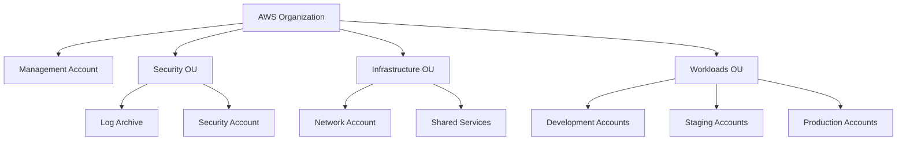
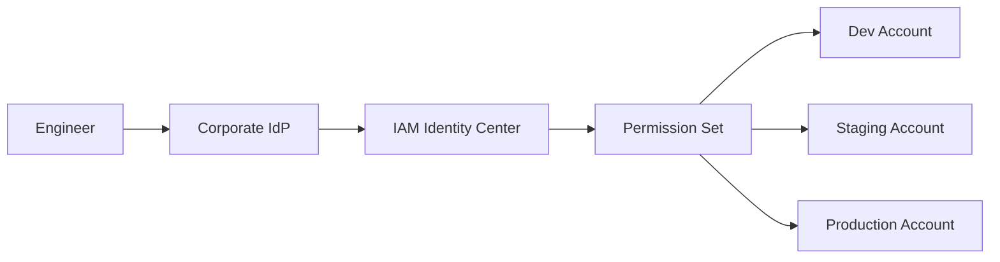
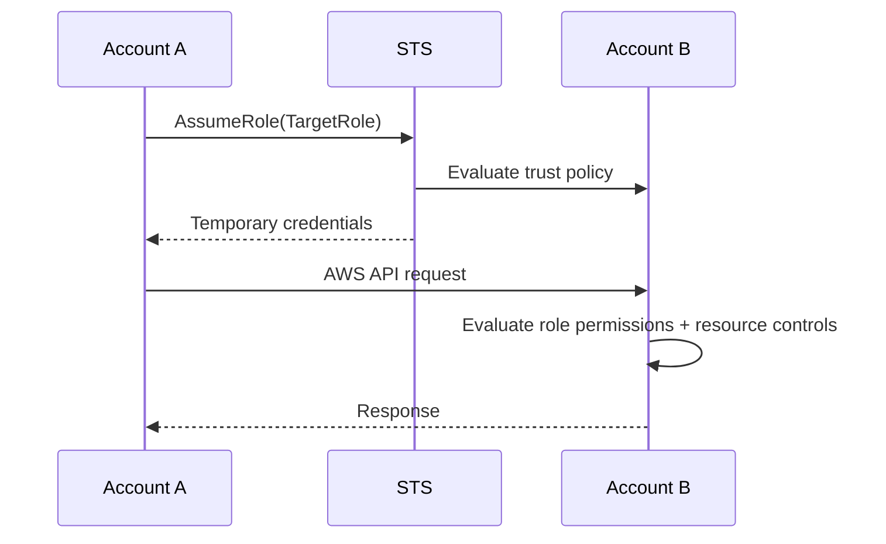
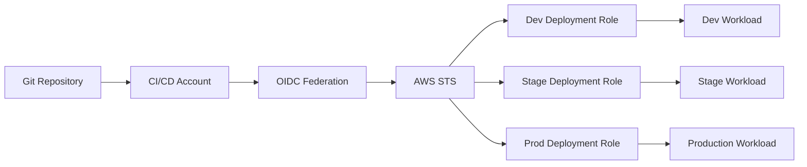
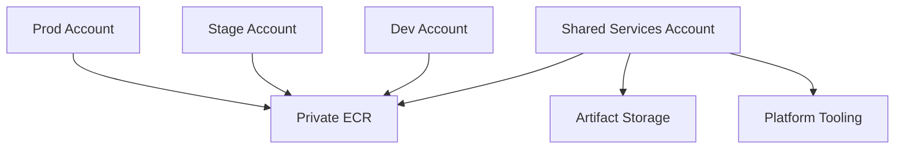
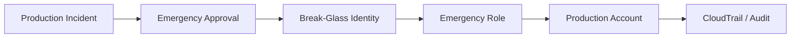
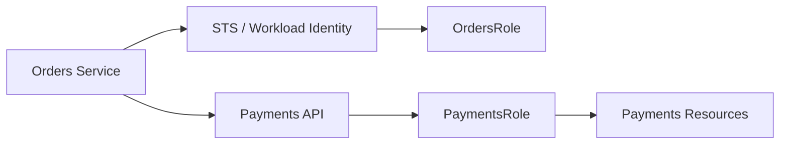
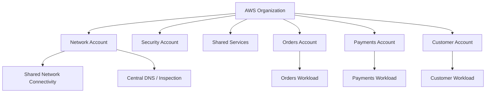
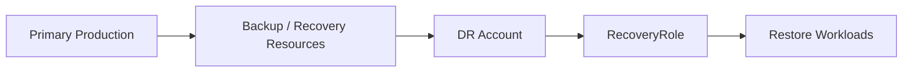
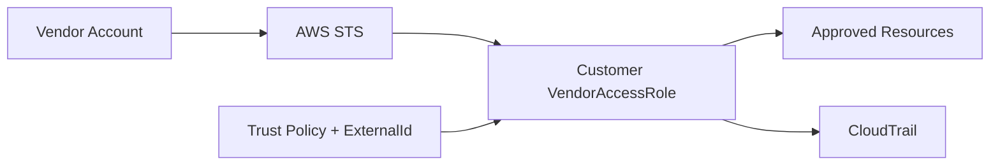

# 06- Architecture and Cross-Account Scenarios

## Overview

AWS IAM architecture becomes significantly more important as an organization moves from a single AWS account to multiple environments, workloads, teams, and security domains.

A senior engineer should be able to reason about IAM at three levels:

```text
Identity
    ↓
Account
    ↓
Organization
```

At the identity level, the question is:

```text
Which principal is making the request?
```

At the account level:

```text
Which account owns the principal?
Which account owns the resource?
```

At the organization level:

```text
Which SCPs/RCPs, organizational controls,
identity systems, and account boundaries apply?
```

Cross-account authorization is not a single policy decision. For common cross-account patterns, the principal's account and the resource-owning account both participate in the authorization model. AWS documents cross-account role assumption and resource-based access as distinct patterns. ([AWS: Cross-account resource access in IAM](https://docs.aws.amazon.com/IAM/latest/UserGuide/access_policies-cross-account-resource-access.html))

The architectural goal is to make access:

```text
Explicit
Least-privilege
Temporary where possible
Auditable
Scalable
Isolated
Recoverable
```

---

## Core Multi-Account Mental Model

An AWS account is a security, access, billing, and operational boundary.

As environments grow, a typical architecture separates:

```text
Management
Security
Log Archive
Network
Shared Services
Development
Staging
Production
Data / Analytics
Sandbox
```

AWS recommends using multiple accounts as workloads and organizational complexity grow because accounts provide isolation boundaries and allow controls to be applied according to workload requirements. ([AWS: AWS Organizations](https://docs.aws.amazon.com/organizations/latest/userguide/orgs_introduction.html), [AWS: Security Reference Architecture](https://docs.aws.amazon.com/prescriptive-guidance/latest/security-reference-architecture/organizations.html))

A useful conceptual model is:



The exact account structure should follow business, security, compliance, workload, and operational requirements rather than copying a fixed template.

---

## Account Boundaries

An account boundary provides isolation that is stronger than simply placing resources into different IAM roles.

For example:

```text
Development Account
    └── dev-orders-api

Production Account
    └── prod-orders-api
```

A compromise in the development environment does not automatically grant access to production resources.

The attacker still has to overcome:

```text
Account boundary
+
Trust relationship
+
Permissions
+
Organization guardrails
+
Resource policies
+
Other service-specific controls
```

This is one of the major reasons multi-account architecture is useful for production systems.

---

## Management Account Architecture

The management account is special.

It is responsible for organization-level operations such as:

```text
Organizations
Billing
Organization policies
Account management
Certain centralized administration functions
```

AWS recommends limiting the management account to tasks that actually require it and avoiding deployment of ordinary application workloads there. SCPs do not restrict principals in the management account in the same way they restrict member accounts. ([AWS: Management account best practices](https://docs.aws.amazon.com/organizations/latest/userguide/orgs_best-practices_mgmt-acct.html))

A common architecture is:

```text
Management Account
    ├── Organizations
    ├── Billing
    └── Organization Administration

Security Account
    ├── Security tooling
    ├── Detection
    └── Investigation

Log Archive Account
    └── Centralized logs

Network Account
    └── Shared networking

Workload Accounts
    ├── Development
    ├── Staging
    └── Production
```

Avoid:

```text
Management Account
    ├── Production database
    ├── Customer S3 bucket
    ├── Application ECS cluster
    └── Developer workloads
```

---

## Centralized Identity Architecture

For workforce access, IAM Identity Center is designed to centrally manage access to multiple AWS accounts in an organization.

A common architecture is:



Permission sets define the access level assigned to users or groups and can be provisioned across multiple AWS accounts. ([AWS: IAM Identity Center permission sets](https://docs.aws.amazon.com/singlesignon/latest/userguide/permissionsetsconcept.html))

This avoids creating separate long-lived IAM users for every employee in every account.

### Production design

```text
Corporate identity
    ↓
IAM Identity Center
    ↓
Groups
    ↓
Permission sets
    ↓
AWS accounts
    ↓
Temporary role sessions
```

Typical groups:

```text
Platform-ReadOnly
Platform-Admin
Developers
Security-Audit
Database-Operators
Incident-Response
```

---

## IAM Identity Center vs Direct Cross-Account Roles

Both patterns can exist.

| Pattern | Typical use |
|---|---|
| IAM Identity Center | Workforce access across many accounts |
| Cross-account IAM role | Application, automation, or specialized access |
| Resource-based policy | Direct sharing of supported resources |
| Workload role | Runtime application identity |
| OIDC federation | CI/CD workload identity |

AWS's current account-access guidance distinguishes IAM Identity Center permission sets, account access manager, and direct federation according to use case. ([AWS: Configure access to AWS accounts](https://docs.aws.amazon.com/singlesignon/latest/userguide/manage-your-accounts.html))

---

## Cross-Account Access Fundamentals

Assume:

```text
Account A
    Principal

Account B
    Resource
```

Account A is the account containing the principal.

Account B owns the resource.

A cross-account request can be implemented using:

```text
Cross-account IAM role
```

or, where supported:

```text
Resource-based policy
```

AWS documents these as the two major cross-account access patterns. ([AWS: Cross-account resource access](https://docs.aws.amazon.com/IAM/latest/UserGuide/access_policies-cross-account-resource-access.html))

---

## Cross-Account Role Pattern

The most general pattern is:



The target role contains two logically separate policies:

```text
Trust policy
    ↓
Who may assume me?

Permission policy
    ↓
What may the assumed role do?
```

A common interview error is treating them as one authorization mechanism.

---

## Cross-Account Role Example

### Account B: Trust policy

```json
{
  "Version": "2012-10-17",
  "Statement": [
    {
      "Sid": "AllowDeploymentAccount",
      "Effect": "Allow",
      "Principal": {
        "AWS": "arn:aws:iam::111111111111:role/DeploymentRole"
      },
      "Action": "sts:AssumeRole"
    }
  ]
}
```

### Account B: Permission policy

```json
{
  "Version": "2012-10-17",
  "Statement": [
    {
      "Sid": "ReadDeploymentArtifacts",
      "Effect": "Allow",
      "Action": [
        "s3:GetObject",
        "s3:ListBucket"
      ],
      "Resource": [
        "arn:aws:s3:::production-artifacts",
        "arn:aws:s3:::production-artifacts/*"
      ]
    }
  ]
}
```

### Account A: Permission to assume

```json
{
  "Version": "2012-10-17",
  "Statement": [
    {
      "Sid": "AssumeProductionDeploymentRole",
      "Effect": "Allow",
      "Action": "sts:AssumeRole",
      "Resource": "arn:aws:iam::222222222222:role/ProductionDeploymentRole"
    }
  ]
}
```

The effective flow is:

```text
DeploymentRole in Account A
        ↓
sts:AssumeRole
        ↓
ProductionDeploymentRole in Account B
        ↓
Temporary credentials
        ↓
Production resources
```

---

## Who Trusts Whom?

The trust direction is one of the most important cross-account interview concepts.

If:

```text
Account A principal
```

assumes:

```text
Account B role
```

then:

```text
Account B role
```

must trust the principal from Account A.

Think:

```text
Resource owner
    ↓
decides whom to trust
```

not:

```text
Source account
    ↓
automatically gains access
```

The target role's trust policy is the resource-based policy that controls who can assume the role. ([AWS: Cross-account policy evaluation](https://docs.aws.amazon.com/IAM/latest/UserGuide/reference_policies_evaluation-logic-cross-account.html))

---

## Cross-Account Authorization Model

A cross-account role scenario typically requires:

```text
Source account
    │
    ├── Principal exists
    └── Principal can call sts:AssumeRole
                 │
                 ▼
Target account
    │
    ├── Trust policy allows principal
    └── Target role has required permissions
                 │
                 ▼
Target resource
```

For direct cross-account resource access, the source principal and target resource policy participate in the authorization model. ([AWS: Cross-account policy evaluation](https://docs.aws.amazon.com/IAM/latest/UserGuide/reference_policies_evaluation-logic-cross-account.html))

---

## Scenario: Developer Account Accesses Production S3

### Architecture

```text
Developer Account
    └── DeveloperRole
            │
            │ AssumeRole
            ▼
Production Account
    └── ReadOnlyProductionRole
            │
            ▼
        S3 Bucket
```

### Design

The developer does not receive:

```text
s3:*
```

directly.

Instead:

```text
DeveloperRole
    ↓
Assume ReadOnlyProductionRole
    ↓
GetObject from approved bucket
```

Advantages:

```text
Centralized production permission
Short-lived credentials
Auditability
Clear separation of duties
Reduced blast radius
```

---

## Scenario: CI/CD Account Deploys to Production

A strong multi-account architecture separates the CI/CD control plane from application accounts.



The CI system should not require:

```text
Permanent IAM user access key
+
AdministratorAccess
```

Instead:

```text
CI identity
    ↓
OIDC
    ↓
Assume deployment role
    ↓
Temporary credentials
```

### Production controls

Use:

```text
Repository restrictions
Branch restrictions
Environment restrictions
OIDC subject conditions
Separate deployment roles
Least privilege
iam:PassRole restrictions
SCP guardrails
Manual approval for sensitive production changes
```

---

## Scenario: CI Can Deploy to Development but Not Production

Suppose:

```text
Development deployment:
Works

Production deployment:
AccessDenied
```

Do not immediately change the application policy.

Compare:

```text
OIDC trust policy
Production role
Repository condition
Branch/environment condition
Account
SCP
Permissions boundary
iam:PassRole
Target resource policy
```

A typical architecture deliberately makes production harder to access than development.

That difference is a security control, not necessarily a defect.

---

## Scenario: Shared Services Account

A shared services account may contain:

```text
Container registry
Internal artifacts
Shared automation
Centralized tooling
Internal service infrastructure
```

Example:



Cross-account access should be narrowly scoped.

For example:

```text
Production workload
    ↓
ecr:BatchGetImage
ecr:GetDownloadUrlForLayer
    ↓
Approved repositories only
```

Avoid:

```text
ECR *
```

across every account.

---

## Scenario: Centralized S3 Logging

A security or log archive account can own:

```text
Central S3 log bucket
```

Other accounts send logs into it.

Architecture:

```text
Account A ─┐
Account B ─┼──> Log Archive Account
Account C ─┘          │
                      ▼
                 S3 Log Bucket
```

The bucket policy can restrict:

```text
Allowed source accounts
Allowed services
Specific prefixes
Required encryption
Required TLS
```

This is a classic example of a resource-based policy supporting cross-account architecture.

---

## Scenario: Shared ECR Repository

Suppose:

```text
Platform Account
    └── ECR repository

Production Account
    └── ECS service
```

The production workload may need to pull images from the shared repository.

The design should explicitly define:

```text
Which account
Which role/service
Which repository
Which ECR actions
```

Avoid giving the consuming role broad permissions across all repositories.

---

## Scenario: Central Secrets Account

A centralized secrets account can sometimes be used to manage sensitive configuration, but this introduces additional authorization and operational complexity.

Flow:

```text
Production ECS Task
    ↓
Task Role
    ↓
Secrets Manager
    ↓
Secret in security/shared account
```

Consider:

```text
Secret resource policy
Task role
KMS key policy
SCP/RCP
Cross-account conditions
Rotation
Network access
Audit logging
```

Do not centralize secrets merely because centralization sounds cleaner. Evaluate ownership, latency, blast radius, recovery, and operational complexity.

---

## Scenario: Cross-Account S3 Access Using a Bucket Policy

Some AWS services support direct resource policies.

Architecture:

```text
Account A
    └── ApplicationRole
           │
           │ cross-account request
           ▼
Account B
    └── S3 Bucket
           └── Bucket Policy
```

Conceptually:

```json
{
  "Version": "2012-10-17",
  "Statement": [
    {
      "Sid": "AllowApplicationRole",
      "Effect": "Allow",
      "Principal": {
        "AWS": "arn:aws:iam::111111111111:role/ApplicationRole"
      },
      "Action": [
        "s3:GetObject"
      ],
      "Resource": "arn:aws:s3:::shared-data/*"
    }
  ]
}
```

The exact authorization behavior depends on the service and principal type, so do not generalize S3 behavior to every AWS service.

AWS explicitly notes that not all AWS services support resource-based policies for cross-account access. ([AWS: Cross-account resource access](https://docs.aws.amazon.com/IAM/latest/UserGuide/access_policies-cross-account-resource-access.html))

---

## Role Proxy vs Direct Resource Policy

The decision can be summarized as:

| Requirement | Preferred pattern |
|---|---|
| Access several services in another account | Cross-account role |
| Service supports direct resource policy | Resource policy may be appropriate |
| Need central permission management | Target-account role |
| Need third-party delegated access | Role + ExternalId |
| Need workforce access | IAM Identity Center |
| Need CI/CD workload access | OIDC + role |
| Need application runtime identity | Workload role |
| Resource does not support resource policy | Cross-account role |

---

## Scenario: Service Does Not Support Resource-Based Cross-Account Access

Use a role as a proxy:

```text
Account A
    Principal
       │
       │ AssumeRole
       ▼
Account B
    TargetRole
       │
       ▼
AWS Service
```

The role absorbs the authorization complexity.

AWS specifically recommends using a cross-account role when a target service does not support resource-based policies. ([AWS: Cross-account resource access](https://docs.aws.amazon.com/IAM/latest/UserGuide/access_policies-cross-account-resource-access.html))

---

## Scenario: Third-Party SaaS Needs Customer Account Access

A third-party provider may operate:

```text
Vendor Account
```

and need limited access to:

```text
Customer Account
```

Use:

```text
Customer Account
    └── VendorAccessRole
            │
            ├── Trust: Vendor Account
            ├── ExternalId condition
            └── Least-privilege permissions
```

Example trust policy:

```json
{
  "Version": "2012-10-17",
  "Statement": [
    {
      "Sid": "VendorAssumeRole",
      "Effect": "Allow",
      "Principal": {
        "AWS": "arn:aws:iam::999999999999:root"
      },
      "Action": "sts:AssumeRole",
      "Condition": {
        "StringEquals": {
          "sts:ExternalId": "vendor-customer-7f4c9a"
        }
      }
    }
  ]
}
```

The external ID primarily addresses the confused-deputy problem. AWS recommends customer-specific external IDs for multi-tenant third-party integrations. ([AWS: Third-party access](https://docs.aws.amazon.com/IAM/latest/UserGuide/id_roles_common-scenarios_third-party.html))

An external ID is not a password and should not be treated as a secret. ([AWS: Third-party access](https://docs.aws.amazon.com/IAM/latest/UserGuide/id_roles_common-scenarios_third-party.html))

---

## Scenario: One Vendor Serves Many Customers

A vendor might have:

```text
Vendor Account

Customer A
Customer B
Customer C
```

The vendor should not use one unrestricted role session for all customers.

A better model is:

```text
Customer A
    ↓
VendorAssumeRole
    ↓
ExternalId = customer-A identifier

Customer B
    ↓
VendorAssumeRole
    ↓
ExternalId = customer-B identifier
```

The external ID lets the vendor assert the intended customer context when assuming the customer's role. ([AWS: External IDs for third-party access](https://docs.aws.amazon.com/IAM/latest/UserGuide/id_roles_common-scenarios_third-party.html))

---

## Scenario: Cross-Account Role With MFA

For sensitive human access, the target role can require MFA through trust-policy conditions.

Conceptually:

```json
{
  "Effect": "Allow",
  "Principal": {
    "AWS": "arn:aws:iam::111111111111:role/HumanAccessRole"
  },
  "Action": "sts:AssumeRole",
  "Condition": {
    "Bool": {
      "aws:MultiFactorAuthPresent": "true"
    }
  }
}
```

This is useful for sensitive administrative access, but workforce architecture should generally prefer centralized federation and temporary sessions rather than building a large IAM-user-based system.

---

## Scenario: Role Chaining

Consider:

```text
DeveloperRole
    ↓
DeploymentRole
    ↓
ProductionRole
```

This is role chaining.

The problem is not only complexity.

It can also affect session duration. AWS documents that role chaining sessions are limited to one hour. ([AWS STS `AssumeRole`](https://docs.aws.amazon.com/STS/latest/APIReference/API_AssumeRole.html))

Prefer:

```text
Human / CI identity
    ↓
Target role
```

when practical, rather than:

```text
Human
    ↓
Role A
    ↓
Role B
    ↓
Role C
```

Deep chains make:

```text
Auditing
Troubleshooting
Credential lifetime management
Access reviews
```

more difficult.

---

## Scenario: Many Accounts Need the Same Workforce Access

Suppose:

```text
50 AWS accounts
```

and:

```text
500 engineers
```

Creating individual IAM users in every account is operationally expensive and difficult to govern.

A more scalable model is:

```text
Corporate IdP
    ↓
IAM Identity Center
    ↓
Groups
    ↓
Permission Sets
    ↓
Multiple AWS Accounts
```

Permission sets allow a centrally defined access model to be assigned across accounts. ([AWS: Manage AWS accounts with permission sets](https://docs.aws.amazon.com/singlesignon/latest/userguide/permissionsetsconcept.html))

---

## Scenario: Developers Need Different Permissions Per Account

Use account-aware assignments.

Example:

| Group | Development | Staging | Production |
|---|---|---|---|
| Developers | Power User | ReadOnly | No access |
| Platform | Admin | Admin | Admin |
| Security | ReadOnly | ReadOnly | Security access |
| Support | ReadOnly | ReadOnly | Limited support |

Permission sets can be assigned to different users/groups and accounts according to organizational requirements.

This is preferable to embedding every environment-specific authorization decision into application code.

---

## Scenario: Production Administration Must Be Highly Restricted

A production design might use:

```text
Corporate IdP
    ↓
Security / Platform Group
    ↓
Production Admin Permission Set
    ↓
Production Account
```

Additional controls:

```text
MFA
Privileged group membership
Approval workflow
Session duration limits
CloudTrail auditing
Break-glass procedure
SCP guardrails
Separate production account
```

The objective is not simply "deny developers."

The objective is:

```text
Normal developer workflow
+
Controlled privileged escalation
+
Strong auditability
```

---

## Scenario: Break-Glass Access Across Accounts

A resilient production environment should have a documented emergency path.

Example:



Break-glass architecture should include:

```text
Strong authentication
Restricted access
Clear ownership
Emergency procedure
Monitoring
Auditing
Periodic validation
Recovery from identity-provider outage
```

Avoid making the break-glass role an undocumented copy of everyday administrator access.

---

## Scenario: Security Account Needs Access to All Workloads

A centralized security account may require access to member accounts for:

```text
Investigation
Security tooling
Configuration assessment
Incident response
Audit
```

A common pattern is:

```text
Security Account
    │
    ├── SecurityAuditRole
    ├── IncidentResponseRole
    └── AutomationRole
             │
             ├── AssumeRole → Account A
             ├── AssumeRole → Account B
             └── AssumeRole → Account C
```

The workload account's trust policy determines which central security roles are trusted.

Keep these roles separate by purpose.

---

## Scenario: Network Account Is Centralized

A network account may own:

```text
Transit Gateway
Shared DNS
Network inspection
Central networking services
```

Workload accounts consume the shared networking architecture without necessarily receiving administrative rights over it.

This creates a useful separation:

```text
Network administrators
    ≠
Application developers
```

IAM should reinforce this separation.

---

## Scenario: Application Account Needs Network Administration

Avoid granting application deployment roles:

```text
ec2:*
networking:*
transit-gateway:*
```

when the application only requires:

```text
Deploy ECS service
Update task definition
Pass approved execution roles
```

Central network administration should remain with a dedicated platform/network identity.

---

## Scenario: Cross-Account SQS Consumer

Architecture:

```text
Account A
    └── ECS Consumer
            │
            │ Cross-account access
            ▼
Account B
    └── SQS Queue
```

Check:

```text
Consumer task role
SQS queue resource policy
Queue ARN
Region
SCP/RCP
Conditions
Encryption/KMS if applicable
```

Do not assume the task role policy alone determines access.

---

## Scenario: Cross-Account SNS Publisher

Architecture:

```text
Account A
    └── Producer
          │
          ▼
Account B
    └── SNS Topic
```

Use a resource policy where the service supports it and restrict:

```text
Principal
Action
Topic ARN
Source account
Source ARN
```

Do not use:

```text
Principal: "*"
```

without a deliberate architecture and strong conditions.

---

## Scenario: Cross-Account Secrets Manager Access

This requires more deliberate design than simply adding:

```text
secretsmanager:GetSecretValue
```

Check:

```text
Caller role
Secret resource policy
IAM permission
KMS key policy
SCP/RCP
Secret ARN
Region
```

If encryption uses a customer-managed KMS key:

```text
Application
    ↓
Secrets Manager
    ↓
KMS
```

the end-to-end authorization chain must succeed.

---

## Scenario: Cross-Account KMS Access

KMS should be treated as a distinct security boundary.

For example:

```text
Production workload
    ↓
kms:Decrypt
    ↓
Customer-managed KMS key
```

Cross-account encryption architectures require coordination between:

```text
IAM permissions
KMS key policy
Grants where applicable
SCP/RCP
Encryption context
Resource Region
```

Never assume that:

```text
Allow kms:Decrypt
```

in an IAM policy automatically means the key can be used cross-account.

---

## Scenario: Central Artifact Bucket

A platform account may own:

```text
s3://company-build-artifacts
```

CI pipelines from multiple workload accounts need access.

Use:

```text
CI role
    ↓
Specific S3 actions
    ↓
Specific artifact prefixes
```

Example scope:

```text
arn:aws:s3:::company-build-artifacts/team-a/*
```

rather than:

```text
arn:aws:s3:::company-build-artifacts/*
```

for every producer.

---

## Scenario: Cross-Account Access Through Resource Sharing

Not every cross-account relationship needs an IAM role.

Depending on the service:

```text
AWS RAM
Resource policy
Service-specific sharing mechanism
```

may be appropriate.

Always check the service's documented cross-account mechanism instead of assuming IAM role assumption is mandatory.

AWS distinguishes resource-based sharing from IAM role delegation and notes that supported mechanisms vary by service. ([AWS: Cross-account resource access](https://docs.aws.amazon.com/IAM/latest/UserGuide/access_policies-cross-account-resource-access.html))

---

## Scenario: Multi-Account Microservices

A mature architecture might use:

```text
Orders Account
    └── Orders API

Payments Account
    └── Payments API

Notifications Account
    └── Notification Worker

Data Account
    └── Analytics
```

Service-to-service access should use workload identity rather than shared static credentials.

Example:



For application-to-application authorization, consider two different layers:

```text
Network/application authentication
+
AWS resource authorization
```

IAM does not replace application-level authorization.

---

## Scenario: REST API Between Accounts

Suppose:

```text
Account A
    Orders Service

Account B
    Payments Service
```

The HTTP request might be:

```text
Orders
  ↓
Private networking
  ↓
Payments API
```

IAM can authenticate/authorize access to supporting AWS infrastructure, but the application should still define:

```text
Service authentication
JWT / mTLS / signed requests
Application authorization
Tenant boundaries
Rate limits
```

Do not attempt to encode every business authorization rule into IAM.

---

## Scenario: gRPC Service-to-Service Architecture

For gRPC microservices:

```text
orders-service
    ↓
mTLS / service identity
    ↓
payments-service
```

IAM may authorize access to:

```text
Secrets Manager
ECR
SQS
KMS
CloudWatch
S3
```

while service-level identity handles:

```text
Which service may call which RPC
Which tenant is being accessed
Which operation is permitted
```

Use IAM where AWS resource authorization is the actual problem.

---

## Scenario: Kubernetes Workload Accesses a Different Account

Architecture:

```text
EKS Cluster
    ↓
Kubernetes ServiceAccount
    ↓
EKS Pod Identity / IRSA
    ↓
IAM Role
    ↓
Cross-account AssumeRole
    ↓
Target Account
```

The complete trust chain may contain:

```text
Kubernetes identity
→ IAM workload role
→ sts:AssumeRole
→ target-account role
→ target resource
```

Each hop should be deliberate.

EKS Pod Identity provides a mechanism for associating IAM roles with Kubernetes service accounts. ([AWS: EKS Pod Identity](https://docs.aws.amazon.com/eks/latest/userguide/pod-identities.html))

---

## Scenario: ECS Workload Accesses Another Account

Example:

```text
ECS Task
    ↓
Task Role
    ↓
STS AssumeRole
    ↓
Target Account Role
    ↓
S3 / SQS / Secrets Manager
```

Do not put application permissions into the ECS execution role.

The task role is the application workload identity. ([AWS: ECS task IAM role](https://docs.aws.amazon.com/AmazonECS/latest/developerguide/task-iam-roles.html))

---

## Scenario: Lambda Accesses Another Account

Architecture:

```text
Lambda
    ↓
Execution Role
    ↓
sts:AssumeRole
    ↓
Target Account Role
    ↓
AWS resource
```

The Lambda execution role should contain only the permissions required to:

```text
Assume the target role
```

while the target role contains:

```text
Permissions on target resources
```

This cleanly separates:

```text
Identity in source account
```

from:

```text
Authorization in target account
```

---

## Scenario: Centralized CI/CD With Multiple Production Accounts

A platform organization may have:

```text
CI/CD Account
    ├── Development Account
    ├── Staging Account
    ├── Production Account A
    ├── Production Account B
    └── Production Account C
```

A scalable pattern is:

```text
CI identity
    ↓
OIDC
    ↓
Account-specific deployment role
```

Each target role should restrict:

```text
Allowed CI repository
Allowed branch/environment
Allowed deployment actions
Allowed resources
Allowed PassRole targets
```

The CI account should not hold permanent credentials for every target account.

---

## Scenario: Centralized Deployment Role vs Per-Account Roles

### Centralized role

```text
CI
 ↓
One role
 ↓
Many accounts
```

Advantages:

```text
Simpler CI configuration
Centralized permissions
```

Limitations:

```text
Larger blast radius
Harder isolation
More complex conditions
Potentially broader trust
```

### Per-account roles

```text
CI
 ├── DevRole
 ├── StageRole
 ├── ProdRoleA
 ├── ProdRoleB
 └── ProdRoleC
```

Advantages:

```text
Strong isolation
Clear auditing
Independent permissions
Smaller blast radius
```

Limitations:

```text
More role objects
More configuration
More lifecycle management
```

For sensitive environments, per-account roles generally provide cleaner isolation.

---

## Scenario: Cross-Account Data Platform

Consider:

```text
Data Account
    ├── S3 Data Lake
    ├── Glue Catalog
    └── Analytics Resources

Application Accounts
    ├── Orders
    ├── Payments
    └── Customers
```

Applications may need to:

```text
Write events
Read curated datasets
Publish metadata
```

Avoid creating one role with unrestricted access to the whole data account.

Instead separate:

```text
OrdersDataWriterRole
PaymentsDataWriterRole
AnalyticsReaderRole
```

and constrain:

```text
Actions
Resources
Prefixes
Tables
Databases
Accounts
Conditions
```

---

## Scenario: Kafka or MSK Across Accounts

Cross-account event architecture introduces additional layers beyond IAM.

Example:

```text
Orders Account
    └── Producer
          ↓
      Cross-account MSK
          ↓
Payments Account
    └── Consumer
```

The design may involve:

```text
IAM authentication
Cluster authorization
Network connectivity
Security groups
Private DNS
VPC connectivity
Topic-level permissions
```

Do not treat:

```text
Network reachability
```

and:

```text
IAM authorization
```

as the same problem.

---

## Scenario: PostgreSQL Database Across Accounts

A PostgreSQL connection does not typically use IAM in exactly the same way as S3 or SQS.

There are separate layers:

```text
Network connectivity
    ↓
TLS
    ↓
Database authentication
    ↓
Database authorization
```

AWS IAM may be involved in database authentication for supported configurations, but:

```text
IAM authorization
≠
PostgreSQL GRANT
```

Do not give an application broad AWS permissions simply because it needs database access.

---

## SCP as an Organization-Level Guardrail

SCPs define the maximum available permissions for IAM principals within member accounts; they do not grant permissions themselves. AWS recommends them as organization-level guardrails. ([AWS: IAM security best practices](https://docs.aws.amazon.com/IAM/latest/UserGuide/best-practices.html), [AWS: SCPs](https://docs.aws.amazon.com/organizations/latest/userguide/orgs_manage_policies_scps.html))

Architecture:

```text
Organization
    ↓
Root / OU
    ↓
SCP
    ↓
Member Accounts
    ↓
IAM Roles
    ↓
Resources
```

A common design is:

```text
Identity policy
+
SCP
=
Effective authorization boundary
```

The SCP should contain organizational guardrails, not every application-specific permission.

---

## RCP as a Resource-Level Organization Guardrail

Resource control policies are organization policies that control the maximum available permissions for resources.

AWS describes SCPs and RCPs as complementary:

```text
SCP
    ↓
Constrain principals

RCP
    ↓
Constrain resources
```

RCPs are particularly relevant when controlling access to resources from principals outside the organization. ([AWS: Resource control policies](https://docs.aws.amazon.com/organizations/latest/userguide/orgs_manage_policies_rcps.html))

Do not treat RCPs as replacements for resource policies or IAM policies.

---

## Permissions Boundary in a Multi-Account Architecture

Suppose platform engineers are allowed to create application roles.

Without controls:

```text
Developer
    ↓
Create Role
    ↓
AdministratorAccess
```

A permissions boundary can constrain the maximum permissions of the roles they create.

Architecture:

```text
Platform Guardrail
    ↓
Permissions Boundary
    ↓
Developer-Created Workload Role
    ↓
Application Permissions
```

This is useful when delegated administration is required without giving the developer unrestricted privilege escalation.

---

## SCP vs Permissions Boundary

| Dimension | SCP | Permissions Boundary |
|---|---|---|
| Scope | Organization / OU / account | Individual IAM principal |
| Applies to | Member-account principals | User or role |
| Grants permissions | No | No |
| Primary purpose | Organization guardrail | Delegated principal guardrail |
| Typical owner | Platform/security | IAM/platform |
| Main use | Prevent unsafe account-wide actions | Limit what a role can receive |
| Cross-account architecture | Often relevant | Depends on target identity |

Use them at different architectural layers.

---

## ABAC in Multi-Account Architecture

Attribute-Based Access Control can reduce policy duplication.

Example:

```text
Principal tag:
Project = payments

Resource tag:
Project = payments
```

Policy logic:

```text
Allow when Project attributes match
```

ABAC is useful when:

```text
Many teams
Many resources
Predictable ownership metadata
Consistent tagging
```

It requires strong tag governance.

A malformed or missing tag can produce:

```text
Unexpected access denial
```

while poorly controlled tags can create:

```text
Privilege expansion
```

---

## Organization-Based Conditions

A resource policy may use organizational conditions such as:

```text
aws:PrincipalOrgID
```

to limit access to principals that belong to a specific AWS Organization.

This is useful for:

```text
Central S3 resources
Shared services
Cross-account organization access
```

But organization membership alone should not be treated as sufficient least privilege.

Combine it with:

```text
Specific principal
Specific action
Specific resource
Additional conditions
```

where appropriate.

---

## `aws:PrincipalArn` in Cross-Account Design

Conditions involving:

```text
aws:PrincipalArn
```

can be useful for restricting access based on the calling principal's ARN.

This can be preferable in some resource-policy designs to embedding large lists of individual principals.

However, always verify the exact service's documented condition-key behavior before standardizing a policy pattern.

---

## `aws:SourceAccount` and `aws:SourceArn`

For AWS service-to-service access, conditions such as:

```text
aws:SourceAccount
aws:SourceArn
```

can help reduce confused-deputy risk.

A common pattern is:

```text
AWS service
    ↓
Source resource
    ↓
Target resource
```

The target policy constrains which source resource and account may invoke it.

Use both when the service documentation supports them and the architecture requires them.

---

## Single Account vs Multi-Account Architecture

| Dimension | Single account | Multi-account |
|---|---|---|
| Initial complexity | Lower | Higher |
| Isolation | Lower | Higher |
| Governance | Centralized | Hierarchical |
| Blast radius | Larger | Smaller |
| Billing separation | Limited | Stronger |
| Team autonomy | Lower | Higher |
| SCP guardrails | Not applicable to account itself | Strong |
| Cross-account complexity | Minimal | Significant |
| Operational overhead | Lower | Higher |
| Large-scale suitability | Limited | Strong |

Multi-account architecture introduces more operational work, but can provide stronger isolation and more precise governance.

AWS recommends multi-account strategies as workloads grow in size and complexity. ([AWS: AWS Organizations](https://docs.aws.amazon.com/organizations/latest/userguide/orgs_introduction.html))

---

## Scenario: Separate Production From Non-Production

A simple starting point:

```text
Organization
    ├── NonProd OU
    │   ├── Dev
    │   └── Staging
    │
    └── Prod OU
        ├── Application A
        └── Application B
```

Different SCPs can enforce:

```text
NonProd:
More developer flexibility

Prod:
Stricter Regions
Restricted IAM changes
Restricted organization actions
Restricted networking changes
```

Do not rely on naming conventions such as:

```text
prod-account
```

for security.

Enforce boundaries through actual controls.

---

## Scenario: Production Is Compromised

Suppose:

```text
Production Account
```

is compromised.

If development and production share:

```text
Same credentials
Same IAM users
Same privileged role
Same account
```

the blast radius expands.

A multi-account architecture provides additional barriers:

```text
Compromised workload
    ↓
Production account boundary
    ↓
Cross-account trust required
    ↓
SCP / resource controls
    ↓
Target account
```

Account separation does not make lateral movement impossible, but it creates additional authorization boundaries that an attacker must cross.

---

## Scenario: Developer Accidentally Deletes Production Resources

Architecture should not rely only on developers remembering:

```text
"Don't run this command in prod."
```

Instead combine:

```text
Separate production account
+
Limited production permissions
+
Permission sets
+
SCP guardrails
+
Approval workflows
+
CloudTrail
```

The goal is to make dangerous actions difficult to perform accidentally and detectable when they occur.

---

## Scenario: Central Security Needs Read Access Across Accounts

Use dedicated audit/security roles.

Example:

```text
Security Account
    ↓
SecurityAuditRole
    ↓
AssumeRole
    ↓
MemberAccount
    ↓
SecurityReadOnlyRole
```

Avoid giving the central security team unrestricted administrative permissions when read-only access satisfies the use case.

For incident response, maintain a separate elevated role with stronger controls.

---

## Scenario: Central Platform Team Needs Deployment Access

Separate:

```text
PlatformAdministrationRole
```

from:

```text
ApplicationDeploymentRole
```

The first may manage infrastructure patterns.

The second might only:

```text
Update ECS service
Register task definition
Pass approved execution role
Read ECR
Publish configuration
```

This is a practical separation-of-duties pattern.

---

## Scenario: Shared Network + Isolated Applications

A mature architecture might look like:



IAM responsibilities are separated:

```text
Network roles
    → Network resources

Security roles
    → Security tooling

Application roles
    → Application resources
```

---

## Scenario: Cross-Account Access Request From a Developer

Suppose an engineer asks:

> "Can you give my development role access to the production S3 bucket?"

A senior engineer should first ask:

```text
Why is development accessing production?
What operation is required?
Who owns the production data?
Is the access read-only?
Can a sanitized dataset be used instead?
Can a dedicated cross-account role be used?
Should the access be temporary?
Should approval be required?
```

The correct architecture may be:

```text
Developer
    ↓
Temporary ProductionReadRole
    ↓
Specific bucket
    ↓
Read-only access
```

rather than modifying the developer role into a permanent production identity.

---

## Scenario: Temporary Cross-Account Access

For incidents, migrations, and one-time operations:

```text
Source Identity
    ↓
AssumeRole
    ↓
Temporary credentials
    ↓
Target Account
```

Advantages:

```text
Short lifetime
Audit trail
No long-lived access key
Easy revocation through trust/policy changes
Clear session identity
```

This is generally preferable to creating an IAM user solely for a temporary task.

---

## Scenario: Cross-Account Data Migration

Suppose:

```text
Old Account
    ↓
S3
    ↓
New Account
```

Do not create permanent full-access credentials.

Use:

```text
MigrationRole
```

with:

```text
Read source bucket
Write target bucket
```

and no access to unrelated resources.

After migration:

```text
Disable trust
Remove migration role
Verify no remaining dependencies
Review CloudTrail
```

Temporary infrastructure should have an explicit lifecycle.

---

## Scenario: Cross-Account Disaster Recovery

A production recovery account may need controlled access to:

```text
Backups
Snapshots
S3
KMS
Secrets
Container images
Infrastructure definitions
```

The DR architecture should be tested periodically.

Example:



Check cross-account dependencies for:

```text
IAM trust
KMS policies
S3 policies
ECR access
Secrets
DNS
Networking
Organizations guardrails
```

IAM architecture is part of disaster recovery, not merely a security concern.

---

## Scenario: Production Account Cannot Reach Shared Resource

For any cross-account failure, decompose the request:

```text
Source Principal
    ↓
Source Account
    ↓
STS / direct service request
    ↓
Target Account
    ↓
Target Resource
```

Then inspect:

```text
Source permissions
Target trust/resource policy
SCP/RCP
Conditions
Resource ARN
Region
Service-specific controls
```

This decomposition avoids random policy editing.

---

## Cross-Account Troubleshooting Matrix

| Symptom | Primary area | Common root causes |
|---|---|---|
| `AssumeRole` denied | Trust | Wrong principal, trust condition, ExternalId |
| Role assumed but API denied | Target role | Missing permission, boundary, SCP |
| S3 cross-account denied | Resource policy | Bucket policy, wrong ARN, condition |
| SQS cross-account denied | Queue policy | Principal or action mismatch |
| KMS denied | KMS | Key policy, IAM, grant, context |
| Vendor access denied | Trust | ExternalId, vendor account, principal |
| CI production deploy denied | OIDC / target role | Subject claim, trust, PassRole |
| EKS cross-account denied | Workload identity | Pod role, trust, AssumeRole |
| ECS cross-account denied | Task role | Wrong task role, trust, permissions |
| Access works in one account only | Organization | SCP, account-specific policy |
| Access works for one principal | Identity | Role/user/session differences |
| Access stops after policy change | Guardrail | SCP, boundary, resource policy |
| Cross-account access works unexpectedly | Resource policy | Broad principal, organization trust |
| Role chain fails after long job | STS | One-hour role-chaining limit |

---

## Cross-Account Scenario: Trust Policy Allows Account Root

A trust policy might contain:

```json
{
  "Effect": "Allow",
  "Principal": {
    "AWS": "arn:aws:iam::111111111111:root"
  },
  "Action": "sts:AssumeRole"
}
```

This does not mean:

```text
Only the account root user
```

will necessarily be the effective operational caller.

The account principal in a trust policy can represent delegation from that account, subject to permissions and other controls.

This is why cross-account trust should be designed carefully.

Where appropriate, prefer narrower principal conditions or explicit role principals.

---

## Scenario: Trust Entire Account vs Specific Role

### Entire source account

```text
Principal:
arn:aws:iam::111111111111:root
```

Advantages:

```text
Simpler
Flexible
Useful for controlled delegation
```

Risks:

```text
Broader trust
More dependent on source-account governance
```

### Specific role

```text
Principal:
arn:aws:iam::111111111111:role/DeploymentRole
```

Advantages:

```text
Narrower trust
Clearer intent
Smaller blast radius
```

Limitations:

```text
More role lifecycle management
More explicit configuration
```

For high-value resources, the narrower trust boundary is often easier to reason about.

---

## Scenario: Multiple Workload Accounts Need One Shared Resource

Suppose:

```text
Account A ─┐
Account B ─┼──> Shared S3 Bucket
Account C ─┘
```

Do not use:

```text
Principal: "*"
```

unless the resource architecture truly requires public/general access.

Prefer:

```text
Explicit principals
+
Organization constraints
+
Source conditions
+
Least privilege
```

Then review external access using IAM Access Analyzer.

AWS recommends analyzing public and cross-account access as part of IAM security practices. ([AWS: IAM security best practices](https://docs.aws.amazon.com/IAM/latest/UserGuide/best-practices.html))

---

## Scenario: Large Organization Needs Account-Level Governance

At scale, governance should operate hierarchically:

```text
Organization
    ↓
OU
    ↓
Account
    ↓
IAM principal
    ↓
Resource
```

Example:

```text
Organization
    ├── Security OU
    ├── Infrastructure OU
    └── Workloads OU
         ├── NonProd OU
         └── Prod OU
```

Controls should be applied at the narrowest appropriate layer.

For example:

```text
Organization-wide:
Prevent unsupported Regions

Prod OU:
Additional production restrictions

Account:
Application-specific policy

Role:
Application-specific permissions
```

This avoids putting every authorization rule into one massive policy.

---

## Scenario: Organization Growth Creates Policy Sprawl

A common failure mode is:

```text
50 accounts
+
hundreds of roles
+
thousands of policy statements
```

without governance.

Control policy growth through:

```text
Naming conventions
Policy libraries
Permission boundaries
Reusable permission sets
Terraform / CloudFormation modules
Policy validation
Access Analyzer
Policy ownership
Review lifecycle
```

The objective is not minimal policy count.

The objective is understandable and auditable authorization.

---

## Scenario: Cross-Account Role Naming and Ownership

Use descriptive naming.

Examples:

```text
ProductionDeploymentRole
SecurityAuditRole
IncidentResponseRole
VendorReadOnlyRole
DataLakeAnalyticsRole
NetworkOperationsRole
```

Avoid:

```text
Role1
AdminRole2
TempRole
FinalRole
NewRole
```

Track:

```text
Owner
Purpose
Source account
Target account
Trust relationship
Permission scope
Creation mechanism
Review date
```

IAM architecture becomes much easier to operate when role ownership is explicit.

---

## Scenario: Infrastructure as Code Manages Cross-Account Roles

Define both sides in source control:

```text
Source account:
AssumeRole permission

Target account:
Trust policy
Target permission policy
```

Avoid manually changing one side in the console.

A useful repository structure is:

```text
iam/
├── organization/
│   ├── scps/
│   └── rcps/
├── workforce/
│   └── permission-sets/
├── cross-account/
│   ├── deployment/
│   ├── security/
│   └── data/
└── workload/
    ├── orders/
    └── payments/
```

Use automated policy validation and security checks in CI/CD.

---

## Scenario: Cross-Account Trust Is Modified Accidentally

A trust policy is often more sensitive than it looks.

Changing:

```json
"Principal": {
  "AWS": "arn:aws:iam::111111111111:role/DeploymentRole"
}
```

to:

```json
"Principal": {
  "AWS": "*"
}
```

can dramatically expand who can attempt role assumption, depending on surrounding conditions and policy behavior.

Treat trust-policy changes as security-sensitive changes.

Require:

```text
Code review
Security review where appropriate
Automated policy validation
Change audit
Post-change testing
```

---

## Scenario: Cross-Account Access Must Be Temporarily Suspended

During an incident, options include:

```text
Modify trust policy
Disable specific source permission
Apply targeted resource policy deny
Apply account-level guardrail where appropriate
Rotate/revoke credentials
```

Choose the smallest control with the required containment scope.

For example:

```text
Vendor compromise
```

may justify disabling:

```text
VendorAccessRole trust
```

without disrupting unrelated internal cross-account roles.

---

## Scenario: Cross-Account Access Is No Longer Required

Treat access removal as a lifecycle event.

Review:

```text
Trust relationship
Source permission
Target permission
Resource policy
KMS policy
Scheduled jobs
CI/CD workflows
Service dependencies
```

Then remove:

```text
Unused trust
Unused role
Unused policy
Unused resource-policy statement
```

Cross-account access tends to persist longer than intended unless explicitly lifecycle-managed.

---

## Scenario: Multi-Account Architecture for Backend Teams

A practical backend organization might use:

```text
Management Account
    ↓
Security Account
    ↓
Infrastructure Account
    ↓
Shared Services Account
    ↓
Orders Dev Account
    ↓
Orders Prod Account
    ↓
Payments Dev Account
    ↓
Payments Prod Account
```

Application permissions remain local:

```text
OrdersTaskRole
PaymentsTaskRole
```

Cross-account access is explicit:

```text
Orders → Shared ECR
Orders → Central Logs
CI → Orders Prod
Security → Orders Prod
```

This is much easier to reason about than:

```text
Every application role
    ↓
Every account
    ↓
AdministratorAccess
```

---

## Architecture Principles for Senior Engineers

### Separate trust from permissions

```text
Trust policy:
Who can become this identity?

Permission policy:
What can this identity do?
```

### Separate workforce from workloads

```text
Humans:
IAM Identity Center / federation

Applications:
Workload roles

CI/CD:
OIDC + temporary roles
```

### Separate accounts by security boundary

```text
Production
≠
Development
```

where organizational risk justifies isolation.

### Centralize identity, decentralize workload authorization

```text
Central:
Workforce identity
Governance
Guardrails

Local:
Application roles
Application resource policies
Workload-specific permissions
```

### Make cross-account access explicit

```text
No accidental trust
No shared static credentials
No broad wildcard principals
```

---

## Architecture Decision Matrix

| Requirement | Recommended architectural approach |
|---|---|
| Employee AWS access | IAM Identity Center |
| Developer access to production | Temporary privileged role / permission set |
| ECS application access | ECS task role |
| Lambda AWS access | Lambda execution role |
| EKS application access | EKS Pod Identity / supported workload identity |
| GitHub/GitLab CI access | OIDC federation |
| Third-party SaaS | Cross-account role + ExternalId |
| Shared S3 resource | Bucket policy where appropriate |
| Unsupported direct resource sharing | Cross-account role |
| Organization-wide restriction | SCP |
| Resource-oriented organization guardrail | RCP where supported |
| Delegated role creation | Permissions boundary |
| Multi-account workforce governance | IAM Identity Center + Organizations |
| Central security access | Dedicated security roles |
| Emergency access | Controlled break-glass role |

---

## High Availability and Reliability Considerations

IAM architecture can become a hidden availability dependency.

For critical systems, consider:

```text
Identity-provider outage
AWS Organizations outage
STS dependency
Credential refresh
Cross-account trust
KMS authorization
Central security account availability
```

For workloads:

```text
Do not hard-code temporary credentials.

Use SDK-managed credential providers.

Avoid unnecessary role chains.

Keep critical trust relationships simple.

Test credential refresh.

Test disaster-recovery paths.
```

For human access:

```text
Maintain emergency recovery procedures.
```

A production DR test should include:

```text
Can the recovery role be assumed?
Can recovery resources be accessed?
Can KMS keys be used?
Can backup data be read?
Can workloads be restored?
```

---

## Security Considerations

Cross-account authorization should be treated as a high-risk boundary because an incorrectly trusted account can delegate access to many principals within that account, subject to the applicable authorization model.

Use:

```text
Least privilege
Explicit trust
Temporary credentials
MFA for sensitive human access
ExternalId for third-party integrations
OIDC for CI/CD
Access Analyzer
CloudTrail
SCP/RCP guardrails
Permissions boundaries
Regular access reviews
```

AWS recommends centralized federation for human access, workload roles for applications, least privilege, Access Analyzer, and organization-level permission guardrails. ([AWS: IAM security best practices](https://docs.aws.amazon.com/IAM/latest/UserGuide/best-practices.html))

---

## Monitoring and Auditability

For cross-account architecture, audit:

```text
AssumeRole
AssumeRoleWithWebIdentity
CreateRole
UpdateAssumeRolePolicy
PutRolePolicy
AttachRolePolicy
DetachRolePolicy
PassRole
```

CloudTrail should provide enough evidence to answer:

```text
Who assumed the role?
From which account?
Which role was assumed?
When?
For which request?
What resource was accessed?
```

For large-scale environments, centralize audit data and establish account-level logging controls.

---

## Cost Considerations

IAM itself is not usually the dominant cost driver in a multi-account architecture.

The operational costs come from:

```text
More accounts
More logging
More networking
More monitoring
More automation
More policy management
More CI/CD infrastructure
More operational tooling
```

The architectural trade-off is:

```text
Higher operational complexity
        versus
Stronger isolation and governance
```

Do not create accounts solely because "more accounts is better."

Use account boundaries when they provide meaningful security, operational, compliance, ownership, or billing value.

---

## Disaster Recovery Considerations

For cross-account architectures, disaster recovery must include IAM dependencies.

Verify:

```text
Cross-account trust policies
Recovery roles
KMS key policies
S3 access
Backup access
ECR access
Secrets access
Route 53 / DNS access
Network administration roles
Organization guardrails
Break-glass access
```

A recovery environment that cannot assume the required roles is not actually recoverable.

---

## Common Architecture Mistakes

| Mistake | Why it is dangerous | Better approach |
|---|---|---|
| Permanent cross-account access keys | Long-lived credential exposure | STS roles |
| Shared admin role | Large blast radius | Purpose-specific roles |
| IAM users in every account | Identity sprawl | Identity Center |
| Broad account trust | Excessive delegation | Specific roles / conditions |
| One CI role for everything | Huge blast radius | Environment/account-specific roles |
| `iam:PassRole` on `*` | Privilege escalation risk | Restrict target roles |
| Production and development in one account | Weak isolation | Separate accounts where justified |
| One giant SCP | Hard to understand/test | Layered guardrails |
| One giant IAM policy | Poor reviewability | Purpose-specific policies |
| Manual console changes | Configuration drift | IaC |
| Deep role chains | Audit/session complexity | Direct target-role assumption |
| No ownership metadata | Access survives indefinitely | Explicit lifecycle ownership |
| No break-glass path | Identity outage can become production outage | Tested emergency access |

---

## Interview Scenario: Design a Multi-Account AWS Architecture

### Question

> Design IAM for an organization with development, staging, production, security, networking, and shared services accounts.

### Strong reasoning

Start with:

```text
AWS Organizations
    ↓
OUs
    ↓
Dedicated accounts
```

Then:

```text
Human access:
IAM Identity Center

Workload access:
IAM roles

CI/CD:
OIDC

Organization controls:
SCP/RCP

Delegated role creation:
Permissions boundaries

Audit:
CloudTrail / centralized logging
```

Then define cross-account relationships:

```text
CI/CD → Workload Accounts
Security → Workload Accounts
Workloads → Shared Services
Network → Workload Networking
```

Finally define guardrails:

```text
No long-lived workload credentials
Restricted production access
Explicit role trusts
Least privilege
Central auditing
Break-glass access
Policy validation
```

---

## Interview Scenario: How Would You Design Cross-Account Access?

A strong answer should separate the problem into:

```text
1. Who is the caller?
2. Which account owns the caller?
3. Which account owns the resource?
4. Does the service support resource-based cross-account access?
5. If yes, should direct resource policy be used?
6. If not, should the caller assume a target-account role?
7. What should the trust policy allow?
8. What permissions should the target role receive?
9. Are SCPs/RCPs involved?
10. Is the access temporary?
11. How is the access audited?
12. How is the access eventually removed?
```

This demonstrates architectural reasoning rather than policy memorization.

---

## Interview Scenario: Why Use Multiple AWS Accounts?

A strong answer should include:

```text
Security isolation
Blast-radius reduction
Environment separation
Billing boundaries
Team autonomy
Compliance boundaries
Independent quotas
Operational separation
Organization-level guardrails
```

Avoid answering only:

```text
"Because AWS recommends it."
```

The architecture should be justified by the isolation and governance requirements.

---

## Interview Scenario: Why Not Give CI AdministratorAccess?

Because CI/CD is a highly privileged machine identity.

If compromised:

```text
AdministratorAccess
    ↓
Potentially every resource
    ↓
Potentially every workload account
```

Prefer:

```text
CI identity
    ↓
OIDC
    ↓
Specific account role
    ↓
Specific deployment permissions
```

Then constrain:

```text
PassRole
Resource scope
Repository
Branch/environment
Account
Region
```

---

## Interview Scenario: Trust Policy vs Permission Policy

| Question | Trust policy | Permission policy |
|---|---|---|
| Primary purpose | Control who can assume role | Control what role can do |
| Attached to | Role | User/role/resource depending on policy type |
| Common action | `sts:AssumeRole` | `s3:GetObject`, `ec2:DescribeInstances` |
| Cross-account relevance | Defines trusted principals | Defines target permissions |
| Typical failure | `AssumeRole` denied | Target API denied |

Remember:

```text
Trust:
Who are you allowed to become?

Permission:
What are you allowed to do after becoming it?
```

---

## Interview Scenario: Permissions Boundary vs SCP

```text
SCP:
Organization-level guardrail

Permissions boundary:
Principal-level guardrail
```

Example:

```text
SCP
    ↓
Prevents any workload account from using unsupported Region

Boundary
    ↓
Prevents developer-created roles from exceeding approved service scope
```

Neither is a permission grant by itself.

---

## Interview Scenario: IAM Role vs Access Key

Prefer roles for:

```text
EC2
ECS
Lambda
EKS
CI/CD
Cross-account access
Federated users
```

Use access keys only where a specific integration requires them and where a safer temporary/federated mechanism is unavailable.

AWS recommends temporary credentials and workload roles rather than long-term credentials for workloads. ([AWS: IAM security best practices](https://docs.aws.amazon.com/IAM/latest/UserGuide/best-practices.html))

---

## Interview Scenario: Cross-Account Access Is Denied Even Though Both Policies Allow

Investigate:

```text
Trust policy
Source identity policy
Target role policy
Resource policy
SCP
RCP
Permissions boundary
Session policy
Condition keys
Wrong account
Wrong role
Wrong resource
KMS
Service-specific controls
```

A good senior answer does not assume:

```text
Two Allow statements
=
Guaranteed access
```

Authorization is contextual.

---

## Interview Scenario: How Would You Reduce Cross-Account Blast Radius?

Use:

```text
Dedicated target roles
Specific source principals
Specific actions
Specific resources
Conditions
ExternalId for third parties
OIDC for CI
Short-lived STS credentials
SCP/RCP guardrails
Permissions boundaries
Central auditing
Periodic access reviews
```

Also separate accounts where the security boundary itself matters.

---

## Interview Scenario: How Would You Secure a SaaS Vendor Integration?

A strong architecture:



Controls:

```text
Vendor account principal
ExternalId
Least-privilege permission policy
Specific resources
CloudTrail
Access reviews
Offboarding procedure
Credential/session controls
```

---

## Interview Scenario: Developer Needs Production Read Access for an Incident

Prefer:

```text
Developer
    ↓
Identity Center / privileged access path
    ↓
Temporary production read role
    ↓
Specific production resources
```

Avoid:

```text
Permanent DeveloperProductionAdminRole
```

The access should be:

```text
Justified
Temporary
Audited
Least-privilege
Revocable
```

---

## Interview Scenario: Security Team Needs Emergency Admin Access

Design a break-glass mechanism with:

```text
Strong authentication
Restricted ownership
Separate role
Emergency approval
CloudTrail monitoring
Periodic testing
Identity-provider outage fallback
Post-incident review
```

Do not make break-glass access part of everyday workflows.

---

## Interview Trap: "Cross-Account Means IAM Role"

Not always.

Cross-account access can be implemented through:

```text
IAM roles
Resource-based policies
AWS RAM
Service-specific sharing
Other AWS-supported mechanisms
```

The correct design depends on the service and access requirements. ([AWS: Cross-account resource access](https://docs.aws.amazon.com/IAM/latest/UserGuide/access_policies-cross-account-resource-access.html))

---

## Interview Trap: "Trust Policy Grants S3 Permissions"

False.

The trust policy answers:

```text
Who can assume the role?
```

The permission policy answers:

```text
What can the assumed role do?
```

These are different authorization stages.

---

## Interview Trap: "If Account A Trusts Account B, Everyone in B Can Access Everything"

False.

Trust does not automatically grant arbitrary resource access.

The final result still depends on:

```text
Assumption permissions
Trust relationship
Target role permissions
Resource policy
Organization guardrails
Conditions
```

---

## Interview Trap: "SCP Gives Permissions"

False.

SCPs constrain the maximum available permissions in member accounts; they do not grant service permissions. ([AWS: SCPs](https://docs.aws.amazon.com/organizations/latest/userguide/orgs_manage_policies_scps.html))

---

## Interview Trap: "ExternalId Is a Secret"

AWS explicitly notes that an external ID should not be treated as a secret like a password or access key. Its primary purpose is to mitigate confused-deputy scenarios in third-party access. ([AWS: Third-party access](https://docs.aws.amazon.com/IAM/latest/UserGuide/id_roles_common-scenarios_third-party.html))

---

## Interview Trap: "Role Chaining Is Always Fine"

Role chaining can introduce:

```text
Additional trust relationships
Harder auditing
Credential/session complexity
One-hour session-duration constraints
```

Avoid unnecessary chains.

---

## Production Architecture Checklist

```text
[ ] AWS Organizations is established
[ ] Management account has limited workload usage
[ ] Workloads are isolated into appropriate accounts
[ ] Workforce identity is centralized
[ ] IAM Identity Center is used where appropriate
[ ] Workloads use IAM roles
[ ] CI/CD uses federation/OIDC where supported
[ ] Cross-account roles have explicit trust
[ ] Third-party roles use ExternalId where appropriate
[ ] Resource policies are narrowly scoped
[ ] SCP/RCP guardrails are tested
[ ] Permissions boundaries protect delegated role creation where required
[ ] Production permissions are restricted
[ ] iam:PassRole is narrowly scoped
[ ] Cross-account access is auditable
[ ] CloudTrail captures privileged operations
[ ] IAM Access Analyzer is used
[ ] Role ownership is documented
[ ] Unused cross-account trust is removed
[ ] Break-glass access exists
[ ] DR access is tested
[ ] IAM configuration is managed as code
```

---

## AWS Documentation Links

- [Cross-account resource access in IAM](https://docs.aws.amazon.com/IAM/latest/UserGuide/access_policies-cross-account-resource-access.html)
- [Cross-account policy evaluation logic](https://docs.aws.amazon.com/IAM/latest/UserGuide/reference_policies_evaluation-logic-cross-account.html)
- [IAM security best practices](https://docs.aws.amazon.com/IAM/latest/UserGuide/best-practices.html)
- [AWS Organizations](https://docs.aws.amazon.com/organizations/latest/userguide/orgs_introduction.html)
- [Management account best practices](https://docs.aws.amazon.com/organizations/latest/userguide/orgs_best-practices_mgmt-acct.html)
- [SCPs](https://docs.aws.amazon.com/organizations/latest/userguide/orgs_manage_policies_scps.html)
- [Resource control policies](https://docs.aws.amazon.com/organizations/latest/userguide/orgs_manage_policies_rcps.html)
- [IAM Identity Center account access](https://docs.aws.amazon.com/singlesignon/latest/userguide/manage-your-accounts.html)
- [IAM Identity Center permission sets](https://docs.aws.amazon.com/singlesignon/latest/userguide/permissionsetsconcept.html)
- [IAM Identity Center](https://docs.aws.amazon.com/prescriptive-guidance/latest/security-reference-architecture-identity-management/workforce-iam-identity-center.html)
- [AWS Security Reference Architecture](https://docs.aws.amazon.com/prescriptive-guidance/latest/security-reference-architecture/introduction.html)
- [Organizations, accounts, and guardrails](https://docs.aws.amazon.com/prescriptive-guidance/latest/security-reference-architecture/organizations.html)
- [AWS SRA account structure](https://docs.aws.amazon.com/prescriptive-guidance/latest/security-reference-architecture/account-structure.html)
- [IAM resources in AWS SRA](https://docs.aws.amazon.com/prescriptive-guidance/latest/security-reference-architecture/iam-resources.html)
- [Third-party access and ExternalId](https://docs.aws.amazon.com/IAM/latest/UserGuide/id_roles_common-scenarios_third-party.html)
- [ECS task IAM roles](https://docs.aws.amazon.com/AmazonECS/latest/developerguide/task-iam-roles.html)
- [EKS Pod Identity](https://docs.aws.amazon.com/eks/latest/userguide/pod-identities.html)
- [STS AssumeRole](https://docs.aws.amazon.com/STS/latest/APIReference/API_AssumeRole.html)

## Key Takeaways

- **Treat accounts as architectural security boundaries:** separate production, security, infrastructure, and other workloads when isolation, governance, compliance, or blast-radius requirements justify it.
- **Separate trust from authorization:** a target role's trust policy controls who can assume it; the role's permission policy controls what the resulting identity can access.
- **Prefer temporary, purpose-specific identities:** use IAM Identity Center for workforce access, workload roles for applications, and OIDC-based federation for CI/CD rather than long-lived shared credentials.
- **Design cross-account access explicitly:** choose between roles, resource-based policies, and service-specific sharing based on the target service, then constrain principals, actions, resources, conditions, and organizational guardrails.
- **Design for operations as well as security:** cross-account access needs ownership, auditing, lifecycle management, incident response, and tested disaster-recovery and break-glass paths.