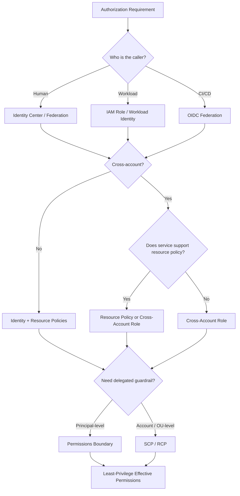
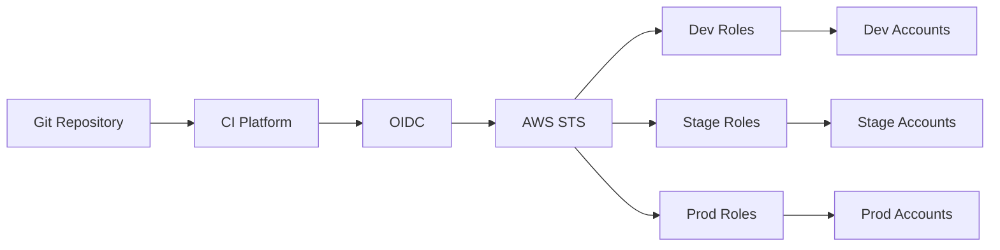

# 07- Comparison and Tradeoff Questions

## Overview

IAM interview questions at senior level rarely ask only for definitions. They usually ask:

> "Which approach would you choose, and why?"

The correct answer depends on:

```text
Identity type
Security boundary
Resource ownership
Credential lifetime
Blast radius
Operational complexity
Auditability
Scalability
AWS service capabilities
```

A strong comparison should therefore avoid absolute statements such as:

```text
"Roles are always better."
"SCPs are better than boundaries."
"Resource policies are better than roles."
"ABAC is better than RBAC."
```

Instead, identify the constraint and then choose the authorization mechanism that best fits it.

A useful decision model is:



AWS's IAM guidance emphasizes federation and temporary credentials for human identities, workload roles for applications, least privilege, Access Analyzer, and permission guardrails for multi-account environments. ([AWS IAM Security Best Practices](https://docs.aws.amazon.com/IAM/latest/UserGuide/best-practices.html))

---

## How to Answer IAM Comparison Questions

A strong senior-level answer usually follows this structure:

```text
1. Define both mechanisms.
2. Identify the authorization layer where each operates.
3. Explain the primary use case for each.
4. Compare security and blast radius.
5. Compare operational complexity.
6. Explain important limitations.
7. Give a production example.
8. State the conditions under which you would choose each.
```

Avoid:

```text
A is better than B.
```

Prefer:

```text
For human workforce access, A is generally more appropriate because...
For delegated workload access, B is usually more appropriate because...
```

---

## IAM User vs IAM Role

### Comparison

| Dimension | IAM User | IAM Role |
|---|---|---|
| Identity type | Long-lived IAM identity | Assumable identity |
| Credentials | Can use password/access keys | Temporary credentials after assumption |
| Typical use | Legacy or exceptional cases | Workforce, workloads, CI/CD, cross-account |
| Credential lifetime | Potentially long-lived | Usually temporary |
| Cross-account | Possible, but role delegation is usually cleaner | Primary cross-account mechanism |
| Rotation burden | Higher for access keys | Lower with temporary credentials |
| Blast radius | Depends on permissions and credential lifetime | Usually reduced through short-lived sessions |
| Workload suitability | Poor default | Preferred |
| Auditability | Identity-based | Role/session-based |
| Modern AWS recommendation | Minimize | Prefer where appropriate |

AWS recommends federation and temporary credentials for human users and IAM roles with temporary credentials for workloads. ([AWS IAM Security Best Practices](https://docs.aws.amazon.com/IAM/latest/UserGuide/best-practices.html))

### When an IAM user may still exist

Some environments still require long-lived credentials because a workload or integration cannot use a role-based mechanism.

Even then:

```text
Scope permissions tightly
+
Protect credentials
+
Rotate when necessary
+
Monitor usage
+
Plan migration to temporary credentials
```

### Interview answer

> I would prefer IAM roles for workloads, federated workforce access, and cross-account access because roles provide temporary credentials and reduce long-lived credential exposure. IAM users remain relevant for specific legacy or compatibility scenarios where roles are not practical.

---

## IAM Role vs Access Key

This is a common interview comparison, but the two are not equivalent abstractions.

```text
IAM role
    ↓
Identity / authorization model

Access key
    ↓
Credential mechanism for signing API requests
```

An IAM user can have an access key.

A role can produce temporary access key material through STS.

### Comparison

| Concern | IAM role with temporary credentials | Long-lived access key |
|---|---|---|
| Lifetime | Short | Potentially long |
| Rotation | Usually automatic/provider-managed | Explicit lifecycle |
| Exposure window | Smaller | Larger |
| Workload identity | Strong | Weak |
| CI/CD | OIDC/role preferred | Avoid where possible |
| Local development | Profile/federated role | Prefer federation |
| Incident response | Revoke trust/session path | Disable/rotate key |
| Operational burden | Lower | Higher |

### Production preference

```text
EC2        → Instance role
ECS        → Task role
Lambda     → Execution role
EKS        → Pod Identity / supported workload identity
CI/CD      → OIDC + role
Human      → Identity Center / federation
```

AWS explicitly recommends temporary credentials and IAM roles instead of long-term credentials for workloads. ([AWS IAM Security Best Practices](https://docs.aws.amazon.com/IAM/latest/UserGuide/best-practices.html))

---

## IAM Identity Center vs IAM Users

### IAM Identity Center

Best suited to:

```text
Employees
Developers
Operators
Administrators
Security teams
Multi-account workforce access
```

Typical flow:

```text
Corporate IdP
    ↓
IAM Identity Center
    ↓
Groups
    ↓
Permission sets
    ↓
AWS accounts
    ↓
Temporary role sessions
```

### IAM Users

Typical model:

```text
IAM User
    ↓
Password / access key
    ↓
One AWS account
```

### Tradeoff

| Requirement | IAM Identity Center | IAM Users |
|---|---|---|
| Workforce federation | Strong fit | Poor fit |
| Multi-account access | Strong | Operationally expensive |
| Temporary credentials | Strong | Not the default model |
| Centralized lifecycle | Strong | More fragmented |
| Employee offboarding | Centralized | Many user objects/keys |
| Legacy compatibility | Sometimes unnecessary | Useful |
| Long-lived API credentials | Not the target pattern | Supported |

For modern workforce access, Identity Center reduces identity sprawl and centralizes account access. AWS recommends centralized access management with IAM Identity Center for workforce identities. ([AWS IAM Security Best Practices](https://docs.aws.amazon.com/IAM/latest/UserGuide/best-practices.html))

---

## IAM Role vs IAM Identity Center Permission Set

These are related but operate at different layers.

A permission set is a workforce access configuration used by IAM Identity Center.

An IAM role is an AWS identity that can be assumed.

Conceptually:

```text
Corporate User
    ↓
Identity Center Permission Set
    ↓
AWS Account
    ↓
Provisioned / assigned role
    ↓
Temporary session
```

### Interview distinction

> A permission set is a workforce access-management abstraction. An IAM role is the AWS identity used during the resulting session or for other role-based access patterns.

Do not describe a permission set as if it were simply another type of IAM role.

---

## Trust Policy vs Permission Policy

This is one of the most important IAM comparisons.

| Question | Trust policy | Permission policy |
|---|---|---|
| Purpose | Who can assume the role? | What can the identity do? |
| Attached to | IAM role | IAM identity/resource depending on policy type |
| Typical action | `sts:AssumeRole` | `s3:GetObject`, `sqs:SendMessage` |
| Main failure | `AssumeRole` denied | Target API denied |
| Cross-account relevance | Critical | Critical |
| Evaluated before target workload access | Yes | During target authorization |

Think:

```text
Trust policy
    ↓
"Who may become this identity?"

Permission policy
    ↓
"After becoming it, what may it access?"
```

### Common mistake

Adding:

```json
{
  "Effect": "Allow",
  "Action": "s3:*",
  "Resource": "*"
}
```

to a role's permission policy will not fix:

```text
AccessDenied on sts:AssumeRole
```

because the failure occurs at role assumption.

---

## Identity-Based Policy vs Resource-Based Policy

### Identity-based policy

Attached to:

```text
User
Group
Role
```

It answers:

```text
What can this identity do?
```

### Resource-based policy

Attached to supported resources such as:

```text
S3 bucket
SQS queue
SNS topic
```

It answers:

```text
Which principals may access this resource?
```

### Comparison

| Dimension | Identity-based | Resource-based |
|---|---|---|
| Attached to | IAM identity | AWS resource |
| Main focus | Principal permissions | Resource sharing |
| Typical syntax includes | `Action`, `Resource` | `Principal`, `Action`, `Resource` |
| Excellent for | Workload permissions | Shared resources |
| Cross-account | Yes | Yes, where supported |
| Service support | Broad IAM concept | Service-dependent |
| Ownership model | Identity owner | Resource owner |

AWS supports resource-based policies only for services and resources that expose them. When a service does not support the required cross-account resource policy, a role can be used as a proxy. ([AWS: Cross-account resource access](https://docs.aws.amazon.com/IAM/latest/UserGuide/access_policies-cross-account-resource-access.html))

---

## Resource Policy vs Cross-Account Role

This is a particularly important architecture tradeoff.

### Resource-based policy

```text
Account A Principal
       │
       ▼
Account B Resource Policy
       │
       ▼
Resource
```

### Cross-account role

```text
Account A Principal
       │
       │ AssumeRole
       ▼
Account B Role
       │
       ▼
Resource
```

### Comparison

| Dimension | Resource policy | Cross-account role |
|---|---|---|
| Service support required | Yes | Broadly applicable |
| Central permission model | Resource owner | Role owner |
| Multiple AWS services | Less convenient | Strong fit |
| Direct resource sharing | Excellent | Indirect |
| Temporary session | Not always required | Built into role assumption |
| Third-party access | Possible | Strong fit |
| Complex multi-service delegation | Less convenient | Usually easier |
| Audit identity | Original principal | Assumed role session |

AWS documents both approaches and recommends using a role as a proxy when the target service does not support resource-based cross-account access. ([AWS: Cross-account resource access](https://docs.aws.amazon.com/IAM/latest/UserGuide/access_policies-cross-account-resource-access.html))

### Practical rule

Use a resource policy when:

```text
The service supports it
+
Direct resource sharing is the natural ownership model
```

Use a cross-account role when:

```text
Multiple resources/services are involved
+
You need centralized permissions on a target identity
+
The service does not support the required resource policy
```

---

## AWS Managed Policy vs Customer Managed Policy

### AWS managed policy

Managed and maintained by AWS.

Advantages:

```text
Easy to adopt
AWS maintains updates
Useful for broad starting permissions
```

Limitations:

```text
Permission scope can change as AWS updates the policy
May be broader than your least-privilege requirement
Less control over lifecycle
```

### Customer managed policy

Managed by your organization.

Advantages:

```text
Explicit ownership
Version control
Controlled changes
Least-privilege design
Reusable
```

Limitations:

```text
Requires governance
Requires maintenance
Policy lifecycle becomes your responsibility
```

### Typical production model

```text
Start with AWS-managed policy where appropriate
        ↓
Observe actual usage
        ↓
Refine permissions
        ↓
Move toward customer-managed least-privilege policy
```

AWS recommends moving toward least-privilege permissions and provides Access Analyzer capabilities to help refine policies. ([AWS IAM Security Best Practices](https://docs.aws.amazon.com/IAM/latest/UserGuide/best-practices.html))

---

## Customer Managed vs Inline Policies

| Dimension | Customer managed | Inline |
|---|---|---|
| Reusability | High | One entity |
| Central management | Strong | Weak |
| Versioning | Explicit managed policy versions | Coupled to entity |
| Policy lifecycle | Independent | Tied to identity |
| Repeated permissions | Good fit | Poor fit |
| Operational governance | Easier | Harder at scale |

### Production preference

Use customer-managed policies when:

```text
Permissions are reusable
+
Policy lifecycle should be independent
+
Multiple identities need similar access
```

Inline policies can be appropriate for tightly coupled, one-off permissions where deletion with the identity is desirable.

Do not create hundreds of near-identical inline policies as a substitute for policy architecture.

---

## Permissions Boundary vs SCP

These are often confused because both constrain permissions.

### Permissions boundary

Applied to an individual IAM user or role.

Conceptually:

```text
Identity policy
        ∩
Permissions boundary
        =
Maximum effective permissions
```

AWS describes a permissions boundary as a maximum-permissions policy for an IAM entity. ([AWS: Permissions boundaries](https://docs.aws.amazon.com/IAM/latest/UserGuide/access_policies_boundaries.html))

### SCP

Applied through AWS Organizations to accounts/organizational units.

Conceptually:

```text
Identity permissions
        ∩
SCP constraints
        =
Available account-level permissions
```

SCPs do not grant permissions.

### Comparison

| Dimension | Permissions boundary | SCP |
|---|---|---|
| Scope | Individual IAM user/role | Account / OU / organization |
| Main purpose | Delegated permission control | Organization guardrail |
| Grants permissions | No | No |
| Typical owner | Platform/IAM team | Organization/security team |
| Good for | Developer-created roles | Account-wide restrictions |
| Blast radius | Individual principal | Potentially entire account/OU |

AWS documents SCPs as organizational guardrails and permissions boundaries as principal-level maximum-permission controls. ([AWS: SCPs](https://docs.aws.amazon.com/organizations/latest/userguide/orgs_manage_policies_scps.html), [AWS: Permissions boundaries](https://docs.aws.amazon.com/IAM/latest/UserGuide/access_policies_boundaries.html))

---

## SCP vs RCP

SCPs and RCPs operate at organization level but control different sides of the authorization model.

```text
SCP
    ↓
Constrains principals

RCP
    ↓
Constrains resources
```

### Comparison

| Dimension | SCP | RCP |
|---|---|---|
| Primary target | Principals/accounts | Resources |
| Scope | Organization hierarchy | Organization hierarchy |
| Main purpose | Limit what principals can do | Limit access available to resources |
| Grants permission | No | No |
| Typical use | Region/action guardrails | Resource access guardrails |

AWS describes RCPs as organization policies that establish maximum available permissions for resources, complementing SCPs. ([AWS: Resource control policies](https://docs.aws.amazon.com/organizations/latest/userguide/orgs_manage_policies_rcps.html))

### Interview answer

> SCPs are principal-oriented organization guardrails, while RCPs are resource-oriented organization guardrails. Neither replaces the underlying identity or resource authorization policy.

---

## Session Policy vs Permissions Boundary

Both can further restrict effective permissions, but their lifecycle is different.

### Permissions boundary

```text
Applied to:
IAM user or role
```

### Session policy

```text
Passed when creating a temporary session
```

AWS evaluates session policies as an additional constraint on temporary sessions. ([AWS: Policy evaluation logic](https://docs.aws.amazon.com/IAM/latest/UserGuide/reference_policies_evaluation-logic.html))

### Comparison

| Dimension | Permissions boundary | Session policy |
|---|---|---|
| Lifetime | Attached to identity | Session-specific |
| Defined by | Identity configuration | Session creator |
| Scope | User/role maximum | Current session |
| Useful for | Delegated administration | Temporary narrowing |
| Typical use | Guardrail | Restrict delegated session |

### Example

A deployment system may have:

```text
DeploymentRole
```

with a broad but controlled policy.

A specific deployment session can receive a narrower session policy:

```text
This session:
Only deploy account service A
```

---

## IAM Role vs STS Session

These should not be treated as the same object.

```text
IAM Role
    ↓
Identity definition
    ↓
AssumeRole
    ↓
Role session
    ↓
Temporary credentials
```

The role defines:

```text
Trust
+
Permissions
+
Configuration
```

The session represents a particular temporary use of that role.

This distinction matters for:

```text
CloudTrail
Credential lifetime
Session policy
Session name
Role chaining
Incident investigation
```

---

## `AssumeRole` vs `AssumeRoleWithWebIdentity`

### `AssumeRole`

Typical use:

```text
AWS principal
    ↓
STS AssumeRole
    ↓
Target IAM role
```

Examples:

```text
Cross-account access
Deployment automation
Security tooling
Human privileged access
```

### `AssumeRoleWithWebIdentity`

Typical use:

```text
OIDC token
    ↓
STS
    ↓
IAM role
```

Examples:

```text
GitHub Actions
Kubernetes workload identity
External federated workloads
```

### Comparison

| Dimension | AssumeRole | AssumeRoleWithWebIdentity |
|---|---|---|
| Caller credential | AWS principal/session | OIDC/web identity token |
| Typical use | AWS-to-AWS role delegation | Federated workloads |
| Cross-account | Strong fit | Possible |
| CI/CD | Possible | Excellent |
| Kubernetes | Possible | Common federation pattern |
| Long-lived AWS key | Not required | Not required |

AWS documents `AssumeRoleWithWebIdentity` as an STS path for identities represented by web identity tokens. ([AWS STS](https://docs.aws.amazon.com/STS/latest/APIReference/API_AssumeRoleWithWebIdentity.html))

---

## OIDC Federation vs Long-Lived CI Access Keys

### OIDC

```text
CI platform
    ↓
OIDC token
    ↓
STS
    ↓
Deployment role
    ↓
Temporary credentials
```

### Access key

```text
CI platform
    ↓
Stored AWS access key
    ↓
AWS API
```

### Tradeoff

| Concern | OIDC | Long-lived access key |
|---|---|---|
| Credential lifetime | Temporary | Long-lived |
| Secret storage | Reduced | Required |
| Rotation | Automatic/session-based | Manual |
| Repository compromise impact | Time-bounded | Potentially long |
| Multi-account CI | Strong | Operationally expensive |
| AWS recommendation | Preferred | Avoid where possible |

AWS recommends temporary credentials and workload roles, and modern CI/CD commonly uses federation rather than static keys. ([AWS IAM Security Best Practices](https://docs.aws.amazon.com/IAM/latest/UserGuide/best-practices.html))

---

## RBAC vs ABAC

### RBAC

Access is based primarily on role or group membership.

```text
Developer
    ↓
DeveloperRole
    ↓
ProductionReadOnly
```

### ABAC

Access is based on attributes.

Example:

```text
Principal tag:
Project = payments

Resource tag:
Project = payments
```

Policy evaluates matching attributes.

### Comparison

| Dimension | RBAC | ABAC |
|---|---|---|
| Main input | Role/group | Tags/attributes |
| Policy count | Can grow with roles | Can scale with metadata |
| Governance | Simpler | More metadata-dependent |
| Dynamic environments | Moderate | Strong |
| Tag quality dependency | Low | High |
| Debugging | Often simpler | Can be harder |
| Best for | Stable organizational roles | Large resource sets with strong metadata |

AWS supports ABAC through tags and policy condition keys. It is most effective when tagging and ownership metadata are consistently governed.

---

## RBAC vs ABAC in a Large Backend Organization

Suppose you have:

```text
500 services
20 teams
10,000 AWS resources
```

A pure RBAC model can produce many policies:

```text
OrdersDeveloper
OrdersPlatform
PaymentsDeveloper
PaymentsPlatform
...
```

ABAC can instead use:

```text
Team
Environment
Project
DataClassification
```

and a smaller number of policies.

But ABAC introduces operational dependencies:

```text
Tag creation
Tag modification
Tag inheritance
Resource tagging coverage
Tag governance
```

If users can modify tags that control authorization, the tag-management path itself becomes security-sensitive.

---

## Group-Based Access vs Role-Based Access

IAM groups are primarily useful for organizing IAM users.

Roles are more appropriate for:

```text
Workloads
Federated users
Cross-account access
Temporary credentials
Delegated administration
```

A mature workforce architecture therefore tends toward:

```text
Corporate groups
    ↓
Identity Center
    ↓
Permission sets / roles
```

rather than:

```text
IAM users
    ↓
IAM groups
    ↓
Permanent access
```

---

## Least Privilege vs Operational Simplicity

A common interview tradeoff is:

> "Why not just give the service read/write access to everything it might need?"

Because broad access improves short-term deployment convenience but increases:

```text
Blast radius
Privilege escalation opportunities
Incident impact
Audit complexity
```

Very narrow policies can also become operationally difficult if every deployment frequently changes permissions.

The production target is:

```text
Least privilege
+
Predictable policy lifecycle
+
Automation
+
Usage-based refinement
```

AWS recommends using access activity and Access Analyzer to progressively refine permissions. ([AWS IAM Security Best Practices](https://docs.aws.amazon.com/IAM/latest/UserGuide/best-practices.html))

---

## Explicit ARNs vs Wildcards

### Explicit

```json
{
  "Effect": "Allow",
  "Action": "s3:GetObject",
  "Resource": "arn:aws:s3:::orders-prod/config/*"
}
```

### Wildcard

```json
{
  "Effect": "Allow",
  "Action": "s3:*",
  "Resource": "*"
}
```

### Tradeoff

| Approach | Advantages | Risks |
|---|---|---|
| Explicit | Strong least privilege | More policy maintenance |
| Wildcard | Simple and flexible | Large blast radius |
| Action wildcard | Convenient | Can include future/unneeded actions |
| Resource wildcard | Easy to configure | Poor isolation |

Use wildcards intentionally.

A wildcard is not inherently invalid, but the broader it is, the more careful the threat model and governance must be.

---

## One Shared Application Role vs Dedicated Roles

### Shared role

```text
Orders
Payments
Notifications
    ↓
SharedApplicationRole
```

Advantages:

```text
Fewer identities
Simpler initial configuration
```

Risks:

```text
Large blast radius
Poor attribution
Difficult least privilege
Coupled permission changes
```

### Dedicated roles

```text
OrdersRole
PaymentsRole
NotificationRole
```

Advantages:

```text
Smaller blast radius
Better attribution
Independent lifecycle
Clearer ownership
```

Costs:

```text
More IAM objects
More policy management
More IaC
```

For production microservices, dedicated workload identities are usually easier to secure and audit.

---

## Centralized IAM Policies vs Service-Owned Policies

### Centralized

```text
Platform team
    ↓
Global policy library
    ↓
Many services
```

Advantages:

```text
Consistency
Governance
Reusable controls
```

Risks:

```text
Tight coupling
Slow team changes
One policy change affects many services
```

### Service-owned

```text
Orders team
    ↓
OrdersRole + policies
```

Advantages:

```text
Autonomy
Clear ownership
Local lifecycle
Faster iteration
```

Risks:

```text
Policy drift
Inconsistent security
Duplicated patterns
```

A mature architecture often combines both:

```text
Central guardrails
+
Service-owned least-privilege policies
```

---

## One Large Policy vs Multiple Purpose-Specific Policies

### One policy

```text
ApplicationPolicy
    ├── S3
    ├── SQS
    ├── Secrets Manager
    ├── KMS
    ├── CloudWatch
    └── ECR
```

### Purpose-specific

```text
OrdersS3Policy
OrdersSQSPolicy
OrdersSecretsPolicy
OrdersKMSPolicy
OrdersObservabilityPolicy
```

### Tradeoff

| Dimension | One large policy | Purpose-specific |
|---|---|---|
| Initial setup | Easier | More work |
| Reviewability | Lower | Higher |
| Ownership | Blurry | Clear |
| Change impact | Larger | Smaller |
| Reuse | Variable | Easier to organize |

The best choice depends on lifecycle boundaries. A policy should have a coherent purpose rather than being split mechanically into dozens of tiny documents.

---

## IAM Policy Variables vs Explicit Resource Lists

Policy variables can reduce duplication.

Example:

```text
home/${aws:username}/*
```

This can be useful in identity-centric access models.

But resource variables can make reasoning harder when:

```text
Users are federated
Role sessions are involved
ABAC is used
Resource ownership is dynamic
```

At senior level, the tradeoff is not:

```text
Dynamic is better.
```

It is:

```text
Dynamic policy
vs
Predictable and auditable policy
```

Choose the mechanism that makes the security boundary easiest to prove.

---

## Conditions vs Separate Roles

Suppose two applications need nearly identical access except:

```text
One environment may access production.
Another may not.
```

You could use:

```text
One role
+
Complex conditions
```

or:

```text
Separate roles
```

### Conditions

Advantages:

```text
Fewer roles
Centralized logic
Flexible authorization
```

Risks:

```text
More complex policy evaluation
Harder debugging
Context-sensitive behavior
```

### Separate roles

Advantages:

```text
Clear identities
Simple policy reasoning
Better isolation
```

Risks:

```text
More IAM objects
Potential duplication
```

For high-risk production boundaries, separate roles often make security intent easier to audit.

---

## Single Account vs Multi-Account Architecture

### Single account

Advantages:

```text
Lower operational complexity
Simpler networking
Simpler IAM
Simpler billing
```

Risks:

```text
Larger blast radius
Weak environment isolation
Harder separation of duties
More complicated shared controls
```

### Multi-account

Advantages:

```text
Strong isolation
Environment separation
Security boundaries
Billing separation
Independent governance
```

Costs:

```text
More account management
Cross-account IAM
Cross-account networking
Centralized logging
More automation
```

### Decision

Use multiple accounts when the isolation boundary provides real value.

Do not use multi-account architecture simply because it appears more sophisticated.

AWS Organizations is designed to centrally manage and govern multiple AWS accounts. ([AWS Organizations](https://docs.aws.amazon.com/organizations/latest/userguide/orgs_introduction.html))

---

## Production vs Non-Production in One Account vs Separate Accounts

### Same account

```text
Account
├── Dev
├── Staging
└── Prod
```

Advantages:

```text
Lower management overhead
Simpler shared services
```

Risks:

```text
Weaker isolation
More complex permission separation
Higher blast radius
```

### Separate accounts

```text
Dev Account
Stage Account
Prod Account
```

Advantages:

```text
Strong account boundary
Independent SCPs
Separate billing
Clearer incident containment
```

Costs:

```text
Cross-account permissions
More networking complexity
More account lifecycle management
```

For high-risk production systems, separate production accounts can provide a much stronger security boundary.

---

## Centralized Shared Services vs Service Duplication

Consider ECR, artifacts, DNS, or logging.

### Centralized

```text
Shared Services Account
    ↓
Multiple workload accounts
```

Advantages:

```text
Lower duplication
Central governance
Shared platform capabilities
```

Risks:

```text
Cross-account dependencies
Shared failure domains
Higher authorization complexity
```

### Per-account

```text
Each workload account
    ↓
Own resources
```

Advantages:

```text
Isolation
Independent lifecycle
Reduced cross-account IAM
```

Costs:

```text
Duplication
More operational resources
Potentially higher cost
```

Centralize when consistency and operational efficiency matter more than strict isolation.

Decentralize when isolation and independent lifecycle matter more.

---

## Cross-Account Role vs Resource-Based Policy: Interview Scenario

### Question

> Account A needs access to an S3 bucket in Account B. Would you use a role or a bucket policy?

A strong answer:

> S3 supports resource-based policies, so direct bucket sharing is possible. I would choose between a bucket policy and a target-account role based on resource ownership, number of services involved, principal lifecycle, audit requirements, and whether I need the target account to own a reusable identity. If the workflow spans multiple resources or services, a cross-account role may provide a cleaner authorization boundary.

AWS explicitly supports both patterns for services that provide resource-based policies. ([AWS: Cross-account resource access](https://docs.aws.amazon.com/IAM/latest/UserGuide/access_policies-cross-account-resource-access.html))

---

## Session Credentials vs Long-Lived Credentials

Temporary credentials improve security because the credentials are time-bounded.

### Temporary

```text
AccessKeyId
SecretAccessKey
SessionToken
Expiration
```

### Long-lived

```text
AccessKeyId
SecretAccessKey
```

The operational tradeoff is:

```text
Temporary credentials
    ↓
More secure
+
Provider refresh required

Long-lived credentials
    ↓
Simpler for unsupported integrations
-
Rotation and exposure burden
```

For modern workloads, prefer temporary credentials unless a compatibility constraint requires otherwise.

---

## Direct AWS API Authorization vs Application Authorization

IAM controls access to AWS resources.

It should not replace application-level authorization.

Example:

```text
FastAPI
    ↓
Application authorization
    ↓
Tenant = customer-123
    ↓
AWS SDK
    ↓
IAM
    ↓
S3
```

IAM may establish:

```text
This service can access the bucket.
```

Application authorization establishes:

```text
This request may access this tenant's data.
```

Trying to encode business-level authorization entirely into IAM often creates complex, fragile policies.

---

## IAM Authorization vs Network Security

These are different layers.

```text
Security Group / NACL / routing
    ↓
Can traffic reach the endpoint?

IAM
    ↓
Is the principal authorized?

Application authorization
    ↓
Is this operation allowed for this tenant/user/service?
```

For a FastAPI service accessing S3:

```text
Network
+
AWS identity
+
IAM authorization
```

all matter, but they solve different problems.

A request can be:

```text
Network reachable
+
IAM denied
```

or:

```text
Network blocked
+
IAM would have allowed it
```

---

## IAM vs PostgreSQL Authorization

For a backend using PostgreSQL:

```text
AWS IAM
    ↓
AWS infrastructure/resource authorization

PostgreSQL roles
    ↓
Database authentication/authorization

Application authorization
    ↓
Business-level permissions
```

Do not grant broad AWS permissions merely because a service needs:

```text
SELECT
INSERT
UPDATE
```

against PostgreSQL.

The correct authorization layer should own the permission.

---

## IAM vs Kubernetes RBAC

These systems solve different scopes of authorization.

| Dimension | AWS IAM | Kubernetes RBAC |
|---|---|---|
| Primary scope | AWS APIs/resources | Kubernetes API |
| Principal source | AWS identities/federation | Kubernetes users/service accounts |
| Example | `s3:GetObject` | `get pods` |
| Runtime workload access | IAM role | Kubernetes ServiceAccount |
| Typical deployment | AWS | Kubernetes cluster |

An EKS workload may need both:

```text
Kubernetes RBAC
+
AWS IAM
```

For example:

```text
ServiceAccount
    ↓
Kubernetes permissions

Pod Identity
    ↓
IAM role
    ↓
S3 permissions
```

Do not assume one replaces the other.

---

## IAM Role Chaining vs Direct Role Assumption

### Direct

```text
CI
    ↓
ProductionRole
```

### Chained

```text
CI
    ↓
IntermediateRole
    ↓
ProductionRole
```

### Direct advantages

```text
Simpler
Better auditability
Fewer trust relationships
Fewer session constraints
```

### Chaining may be useful when

```text
Central delegation
Intermediate security boundary
Existing trust architecture
Organizational separation
```

### Main risks

```text
More moving parts
Harder debugging
One-hour role-chaining session constraint
More trust relationships
```

AWS documents a one-hour maximum for role-chaining sessions. ([AWS STS `AssumeRole`](https://docs.aws.amazon.com/STS/latest/APIReference/API_AssumeRole.html))

---

## Cross-Account Role vs Role Chaining Through a Hub Account

A centralized access model can introduce:

```text
User
    ↓
HubRole
    ↓
TargetRole
```

versus:

```text
User
    ↓
TargetRole
```

The hub can provide:

```text
Centralized control
Strong segregation
Delegated access
```

But it also adds:

```text
Another trust relationship
Another session
More audit complexity
Potential session-duration constraints
```

Use a hub when organizational architecture benefits from it, not merely to make the topology look centralized.

---

## Permissions Boundary vs IAM Identity Center Permission Set

These are not alternatives.

```text
Permission Set
    ↓
Workforce access assignment

Permissions Boundary
    ↓
Maximum permission guardrail for IAM entity
```

A mature architecture can use both:

```text
Identity Center
    +
Permission Set
    +
Account-level guardrails
    +
Principal-level boundaries
```

The mechanisms can be complementary.

---

## SCP vs IAM Policy

An IAM identity policy says:

```text
This identity may perform X.
```

An SCP says:

```text
Principals in this account/OU cannot exceed this organizational guardrail.
```

A useful mental model:

```text
Identity policy
    ∩
SCP constraints
    =
Available authorization
```

An SCP does not replace the identity policy.

---

## Resource Policy vs SCP

A resource policy says:

```text
These principals may access this resource.
```

An SCP says:

```text
These organizational principals are constrained to this maximum boundary.
```

Therefore:

```text
Resource policy
=
Resource-level authorization

SCP
=
Organization-level principal guardrail
```

These mechanisms can work together.

---

## Permissions Boundary vs Resource Policy

This is a more subtle comparison.

A permissions boundary constrains an IAM entity's identity-based permissions.

A resource-based policy may authorize a principal directly, but evaluation depends on principal type and service-specific behavior. AWS documents cases where resource-based policies can interact differently with permissions boundaries and implicit denies, so the exact service and principal must be considered. ([AWS: Enforcement logic](https://docs.aws.amazon.com/IAM/latest/UserGuide/reference_policies_evaluation-logic_policy-eval-denyallow.html), [AWS: Permissions boundaries](https://docs.aws.amazon.com/IAM/latest/UserGuide/access_policies_boundaries.html))

### Interview lesson

Do not use a simplistic formula such as:

```text
Identity policy ∩ boundary ∩ resource policy
```

for every IAM request.

The exact evaluation path depends on:

```text
Principal type
Resource type
Policy type
Account relationship
Explicit denies
Service-specific authorization behavior
```

---

## Explicit Deny vs Missing Allow

These produce similar symptoms:

```text
AccessDenied
```

but the reasoning is different.

### Missing allow

```text
No applicable Allow
    ↓
Implicit deny
```

### Explicit deny

```text
Applicable Deny
    ↓
Final deny
```

An explicit deny overrides an allow. AWS evaluates applicable policies for the request context and checks for explicit denies before reaching an allow decision. ([AWS: Enforcement logic](https://docs.aws.amazon.com/IAM/latest/UserGuide/reference_policies_evaluation-logic_policy-eval-denyallow.html))

### Interview answer

> I would distinguish an implicit deny caused by a missing applicable allow from an explicit deny caused by a blocking statement. The remediation is different.

---

## Allow List vs Deny List Policy Strategy

### Allow-oriented design

```json
{
  "Effect": "Allow",
  "Action": [
    "s3:GetObject"
  ],
  "Resource": "arn:aws:s3:::orders-prod/*"
}
```

Typical least-privilege pattern.

### Deny-oriented guardrail

```json
{
  "Effect": "Deny",
  "Action": "ec2:*",
  "Resource": "*",
  "Condition": {
    "StringNotEquals": {
      "aws:RequestedRegion": [
        "ap-south-1"
      ]
    }
  }
}
```

Useful for:

```text
Organization guardrails
Region restrictions
Security controls
Explicitly prohibited operations
```

### Tradeoff

Allow policies define:

```text
What is permitted
```

Deny guardrails define:

```text
What is prohibited even if another policy allows it
```

A mature architecture frequently uses both.

---

## Many Narrow Roles vs One Flexible Role

### One flexible role

```text
PlatformRole
    ↓
Many services
```

Advantages:

```text
Simple onboarding
Fewer IAM objects
```

Risks:

```text
Large blast radius
Harder attribution
Permission coupling
```

### Many narrow roles

```text
OrdersRole
PaymentsRole
ReportingRole
MigrationRole
```

Advantages:

```text
Least privilege
Independent lifecycle
Better attribution
```

Costs:

```text
More IAM lifecycle work
More policy objects
Potential role sprawl
```

The answer is not to minimize role count at all costs.

The answer is to align role boundaries with:

```text
Security boundaries
Ownership boundaries
Deployment boundaries
Operational boundaries
```

---

## Temporary Migration Role vs Permanent Application Role

A migration often requires permissions that the steady-state application does not.

Example:

```text
MigrationRole
    ├── Read old database export
    ├── Write new S3 location
    └── Validate records
```

Once migration completes:

```text
Retire MigrationRole
```

Do not leave temporary permissions attached to the permanent application role merely because the application had them during migration.

---

## Shared Production Role vs Break-Glass Role

A normal production role should support:

```text
Expected operational duties
```

A break-glass role should support:

```text
Emergency recovery
```

Combining them produces:

```text
Everyday identity
+
Emergency privilege
```

which increases standing privilege.

Keep emergency authorization separate and auditable.

---

## Centralized Secrets vs Per-Account Secrets

### Centralized

```text
Security Account
    ↓
Secrets Manager
    ↓
Many workload accounts
```

Advantages:

```text
Central ownership
Central rotation
Central governance
```

Costs:

```text
Cross-account IAM
KMS complexity
Higher dependency on central account
Potential operational coupling
```

### Per-account

```text
Workload Account
    ↓
Local Secrets Manager
```

Advantages:

```text
Isolation
Simpler local authorization
Smaller failure domain
```

Costs:

```text
More duplicated configuration
More local lifecycle management
```

Use centralization when organizational control is more important than local isolation.

---

## Centralized Logging vs Per-Account Logging

Cross-account security architecture often centralizes logs:

```text
Workload accounts
    ↓
Central log archive
```

Advantages:

```text
Tamper resistance
Central audit
Security investigation
Simpler retention governance
```

Costs:

```text
Cross-account resource policies
Storage costs
Central account dependencies
Data lifecycle complexity
```

The design should ensure workload administrators cannot easily delete or alter the centralized security evidence they are being monitored by.

---

## Tradeoff: Security vs Developer Velocity

A strong IAM architecture should not force developers to request manual permissions for every minor operation.

Compare:

```text
Maximum restriction
```

with:

```text
Operational usability
```

A scalable solution can provide:

```text
Reusable permission sets
Reusable workload-role modules
Approved IAM policy patterns
Automated policy validation
Self-service role creation within boundaries
Temporary privileged access
```

This allows:

```text
Security guardrails
+
Developer autonomy
```

rather than choosing only one.

---

## Tradeoff: Central Governance vs Team Autonomy

### Highly centralized

```text
Security team owns all IAM
```

Advantages:

```text
Consistency
Governance
Central expertise
```

Risks:

```text
Bottlenecks
Slow delivery
Limited service-team ownership
```

### Highly decentralized

```text
Each team owns all IAM
```

Advantages:

```text
Fast iteration
Strong ownership
```

Risks:

```text
Policy inconsistency
Security drift
Duplicated patterns
Higher audit effort
```

A strong operating model is usually:

```text
Central guardrails
+
Standard templates
+
Service-owned least privilege
+
Automated validation
```

---

## Tradeoff: Strict Least Privilege vs Policy Churn

A policy that is too broad is risky.

A policy that is too narrow can also become operationally expensive when every small application change requires an IAM deployment.

The goal is:

```text
Stable permission boundaries
+
Narrow resource scope
+
Purpose-specific actions
+
Automated policy updates
```

Use Access Analyzer and access activity to refine policies based on real workload behavior rather than guessing every possible action. ([AWS IAM Security Best Practices](https://docs.aws.amazon.com/IAM/latest/UserGuide/best-practices.html))

---

## Tradeoff: Explicit Resource Scope vs Future Expansion

Consider:

```text
arn:aws:s3:::orders-prod/reports/*
```

versus:

```text
arn:aws:s3:::orders-prod/*
```

The first is safer.

The second is easier to evolve.

For security-sensitive resources, prefer the narrowest scope consistent with the application design.

For highly dynamic resource sets, use controlled naming or tags when they provide a clearer authorization model.

---

## Tradeoff: One Policy Per Team vs One Policy Per Service

### Team policy

```text
PaymentsTeamPolicy
```

Advantages:

```text
Simple ownership
Shared capabilities
```

Risks:

```text
Cross-service privilege
Larger blast radius
```

### Service policy

```text
PaymentsApiPolicy
PaymentsWorkerPolicy
PaymentsMigrationPolicy
```

Advantages:

```text
Service isolation
Clear lifecycle
```

Costs:

```text
More policy objects
More automation
```

Service-level identities are generally easier to secure when the services have materially different runtime permissions.

---

## Tradeoff: Wildcard Actions vs Exact Actions

### Exact

```text
s3:GetObject
s3:ListBucket
```

### Wildcard

```text
s3:Get*
```

or:

```text
s3:*
```

Exact actions provide better least privilege and reviewability.

Wildcard actions can be reasonable when:

```text
The complete action family is intentionally required
+
Service evolution makes exact enumeration operationally expensive
+
Risk is understood
```

Avoid wildcard permissions merely because they are easier to configure.

---

## Tradeoff: Account-Level Isolation vs Shared Infrastructure

A multi-account architecture can isolate:

```text
Production
Development
Security
Networking
Data
```

but shared infrastructure can reduce duplication.

A useful principle is:

```text
Centralize capabilities
when consistency matters.

Separate resources
when security isolation matters.
```

For example:

```text
Centralized:
Identity
Logging
Security tooling

Potentially decentralized:
Application databases
Application secrets
Application compute
```

---

## Architecture Comparison Matrix

| Requirement | IAM User | IAM Role | Resource Policy | Identity Center | OIDC | SCP | Boundary |
|---|---:|---:|---:|---:|---:|---:|---:|
| Human workforce | Limited | Strong | No | Strong | Limited | Guardrail | Guardrail |
| Application workload | Poor default | Strong | Sometimes | No | Limited | Guardrail | Guardrail |
| CI/CD | Poor | Strong | Sometimes | Not primary | Strong | Guardrail | Guardrail |
| Cross-account | Possible | Strong | Strong where supported | Strong for workforce | Strong for CI | Guardrail | Target-specific |
| Temporary credentials | Not inherent | Strong | Not inherent | Strong | Strong | No | No |
| Resource ownership | No | No | Strong | No | No | No | No |
| Org-wide restriction | No | No | No | No | No | Strong | No |
| Delegated IAM administration | Poor | Strong | No | Strong | No | No | Strong |

The table is a decision aid, not a claim that the mechanisms are interchangeable.

---

## Senior Interview Scenario: Choose an IAM Mechanism for a FastAPI Service

### Situation

A FastAPI service runs on ECS and needs:

```text
Read S3 objects
Consume SQS
Read Secrets Manager
Publish CloudWatch logs
```

### Preferred architecture

```text
ECS
    ↓
Task Role
    ├── S3 read
    ├── SQS consume
    ├── Secrets Manager read
    └── CloudWatch logging permissions as required
```

Do not:

```text
Store access key in .env
```

Do not:

```text
Use administrator credentials
```

Do not:

```text
Reuse a developer IAM user
```

AWS recommends workload roles with temporary credentials for applications. ([AWS IAM Security Best Practices](https://docs.aws.amazon.com/IAM/latest/UserGuide/best-practices.html))

---

## Senior Interview Scenario: Developer Needs Temporary Production Access

### Requirement

A developer needs read-only production access for debugging.

### Options

```text
A. Give developer permanent production permissions
B. Create permanent access key
C. Use temporary federated/role-based access
D. Add developer to production AdministratorAccess
```

The architecture should generally favor temporary, least-privilege role-based access.

Reasoning:

```text
Short duration
+
Auditability
+
Limited actions
+
Production separation
```

The implementation may use IAM Identity Center permission assignments or a controlled privileged role depending on the organization's workforce-access design.

---

## Senior Interview Scenario: Vendor Needs S3 Access

### Options

```text
IAM user access key
Cross-account role
Direct bucket policy
```

A strong answer considers:

```text
Does the vendor need one resource or many?
Does S3 resource-based access fit the ownership model?
Does the vendor need cross-account role assumption?
Is ExternalId appropriate?
How will access be revoked?
How will usage be audited?
```

For third-party role assumption, AWS recommends external IDs to mitigate confused-deputy risks. ([AWS: Third-party access](https://docs.aws.amazon.com/IAM/latest/UserGuide/id_roles_common-scenarios_third-party.html))

---

## Senior Interview Scenario: Design CI/CD for 30 AWS Accounts

A strong architecture is:



Each environment/account role should have:

```text
Narrow trust conditions
Least-privilege deployment permissions
Restricted PassRole
Repository/branch/environment constraints
CloudTrail auditing
SCP guardrails
```

This is significantly easier to contain than storing 30 long-lived AWS access keys in CI.

---

## Senior Interview Scenario: Prevent Developers From Creating Admin Roles

A common delegated-administration problem is:

```text
Developer
    ↓
CreateRole
    ↓
AdminRole
    ↓
Privilege escalation
```

A permissions boundary can constrain roles created by delegated administrators so their effective permissions cannot exceed the approved boundary. ([AWS: Permissions boundaries](https://docs.aws.amazon.com/IAM/latest/UserGuide/access_policies_boundaries.html))

Combine:

```text
Role creation permissions
+
Permissions boundary
+
Restricted PassRole
+
Policy validation
+
CloudTrail
```

The boundary is a guardrail, not a permission grant.

---

## Senior Interview Scenario: Multi-Account Security Model

A practical architecture can be:

```text
Management Account
    ↓
Security Account
    ↓
Log Archive
    ↓
Network Account
    ↓
Shared Services
    ↓
Workload Accounts
```

Human access:

```text
Identity Center
```

Workloads:

```text
IAM roles
```

CI/CD:

```text
OIDC
```

Guardrails:

```text
SCP / RCP
```

Delegated role creation:

```text
Permissions boundaries
```

Analysis:

```text
Access Analyzer
```

Audit:

```text
CloudTrail
```

This separates:

```text
Identity
Governance
Workload authorization
Security operations
Application ownership
```

---

## Common Comparison Mistakes

| Mistake | Why it is wrong | Better reasoning |
|---|---|---|
| "Roles are always better" | Use case matters | Prefer roles where temporary identity is appropriate |
| "SCP grants permissions" | It does not | SCP constrains maximum available permissions |
| "Boundary grants permissions" | It does not | Boundary limits identity-based grants |
| "Resource policy replaces IAM" | Service and context matter | Evaluate both authorization paths |
| "Identity Center is just IAM users in a UI" | Different workforce model | Federation + temporary sessions |
| "ABAC is always more scalable" | Governance may dominate | Use when attributes are reliable |
| "More policies means more security" | Fragmentation can increase complexity | Use coherent policy boundaries |
| "One role is simpler" | It may increase blast radius | Align roles with workload/security boundaries |
| "Wildcard permissions are always wrong" | Some legitimate broad controls exist | Use intentional, reviewed wildcards |
| "Cross-account always requires a role" | Resource policies exist | Check service capabilities |
| "Role chaining is harmless" | Adds trust/session complexity | Prefer direct assumption where practical |
| "Simulator proves runtime access" | Live context can differ | Combine simulation with runtime evidence |
| "Temporary roles remove all risk" | Authorization can still be excessive | Apply least privilege and guardrails |

---

## Common Interview Traps

### "Which is better: IAM user or IAM role?"

Do not answer:

```text
Role.
```

Answer in context:

```text
For workloads, federated workforce access, and cross-account delegation,
I would normally use roles and temporary credentials.

IAM users remain for exceptional compatibility cases.
```

---

### "Which is better: SCP or permissions boundary?"

They solve different problems:

```text
SCP
→ Organization/account guardrail

Boundary
→ Individual principal guardrail
```

They can coexist.

---

### "Which is better: resource policy or role?"

First ask:

```text
Which AWS service?
How many resources?
One account or multiple?
Who owns the resource?
Is direct sharing supported?
Do we need a reusable target identity?
```

Then choose.

---

### "Which is better: RBAC or ABAC?"

Ask:

```text
How many resources?
How stable are ownership relationships?
How good is metadata governance?
How often do resources change?
How important is centralized policy reuse?
```

Then choose.

---

### "Which is better: one role or many roles?"

Ask:

```text
Do these workloads have the same permissions?
Same owner?
Same deployment lifecycle?
Same security boundary?
Same audit requirements?
```

Role boundaries should reflect meaningful security and operational boundaries.

---

## IAM Decision Framework

When comparing two approaches, score the design mentally across:

| Dimension | Questions |
|---|---|
| Security | What is the blast radius? |
| Identity | Who receives the credentials? |
| Lifetime | Are credentials temporary? |
| Authorization | Where is the permission enforced? |
| Isolation | Is the boundary account, role, resource, or organization? |
| Auditability | Can the action be attributed? |
| Scalability | Does it work for hundreds of services/accounts? |
| Operations | How difficult is lifecycle management? |
| Reliability | Does access depend on another control plane? |
| Cost | What infrastructure and operational costs are added? |
| DR | Can the access model work during recovery? |
| Developer experience | Can teams use it without constant manual intervention? |

This framework makes comparison questions easier because it converts:

```text
A vs B
```

into:

```text
Requirement → Constraint → Tradeoff → Decision
```

---

## Production Decision Checklist

Before selecting an IAM pattern, ask:

```text
[ ] Is the caller human or workload?
[ ] Can temporary credentials be used?
[ ] Does federation solve the identity problem?
[ ] Is the workload using a role?
[ ] Is access cross-account?
[ ] Does the service support resource-based policies?
[ ] Who owns the resource?
[ ] Who owns the identity?
[ ] Is the trust boundary explicit?
[ ] Is least privilege practical?
[ ] Do we need a permissions boundary?
[ ] Do organization guardrails apply?
[ ] Does the design introduce role chaining?
[ ] Can the access be audited?
[ ] Can the access be revoked?
[ ] Can policy changes be automated?
[ ] Can the architecture scale?
[ ] Can the design be recovered during an outage?
```

---

## Practical Backend Architecture Mapping

| Backend component | Preferred AWS IAM pattern |
|---|---|
| Django on ECS | ECS task role |
| FastAPI on ECS | ECS task role |
| Lambda API | Lambda execution role |
| Celery worker on ECS | ECS task role |
| Celery worker on EKS | Pod Identity / workload role |
| GitHub Actions | OIDC + deployment role |
| Jenkins with AWS integration | Federation/role-based credentials where supported |
| EC2 backend | Instance role |
| Kubernetes workload | Pod Identity / supported workload identity |
| Human developer | Identity Center |
| Security auditor | Identity Center / dedicated audit role |
| Cross-account vendor | Cross-account role + ExternalId |
| Shared S3 | Bucket policy or cross-account role |
| Shared SQS | Queue resource policy or role |
| Shared SNS | Topic resource policy or role |
| Central logging | Resource-based policies + centralized account |
| Delegated IAM administration | Roles + permissions boundaries |
| Organization guardrails | SCP / RCP |

---

## Security and Operational Tradeoffs

### Temporary credentials

**Advantages**

```text
Reduced exposure window
Better workload identity
Less manual rotation
```

**Limitations**

```text
Credential refresh must work
Long-running processes need correct provider configuration
```

### Centralized identity

**Advantages**

```text
Consistent workforce lifecycle
Central account access
Better offboarding
```

**Limitations**

```text
Identity-provider dependency
More centralized governance
```

### Multi-account

**Advantages**

```text
Isolation
Blast-radius reduction
Independent governance
```

**Limitations**

```text
Cross-account IAM
Cross-account networking
More operational tooling
```

### ABAC

**Advantages**

```text
Policy reuse
Dynamic access
Scales with metadata
```

**Limitations**

```text
Tag governance becomes security-critical
Harder debugging
```

### Resource-based policies

**Advantages**

```text
Natural resource ownership
Direct sharing
Useful for S3/SQS/SNS-style resources
```

**Limitations**

```text
Service-dependent
Can become complex with many principals
```

---

## High Availability and Reliability Tradeoffs

IAM architecture can introduce operational dependencies.

Consider:

```text
Identity provider availability
STS credential issuance
Credential refresh
Cross-account trust
KMS authorization
Centralized security account
Central logging
```

A production design should avoid unnecessary authentication chains.

For example:

```text
Preferred:

Workload
    ↓
Task role
    ↓
AWS service
```

can be simpler than:

```text
Workload
    ↓
Role A
    ↓
Role B
    ↓
Role C
    ↓
AWS service
```

Every additional identity hop adds:

```text
Trust relationship
Session management
Failure modes
Audit complexity
```

---

## Disaster Recovery Tradeoffs

A DR architecture must replicate more than application infrastructure.

It may also need:

```text
IAM roles
Trust policies
Permission policies
KMS access
S3 access
Cross-account trust
Break-glass access
Deployment roles
Identity-provider integration
```

A common DR mistake is:

```text
Infrastructure restored
+
IAM trust not restored
=
Recovery blocked
```

Validate IAM dependencies during DR exercises.

---

## Cost Tradeoffs

IAM mechanisms themselves are rarely the dominant AWS cost.

The larger costs come from architectural complexity:

```text
More accounts
More logging
More networking
More CI/CD
More policy automation
More monitoring
More security tooling
```

The correct question is not:

```text
"Which IAM pattern is cheapest?"
```

It is:

```text
"What is the total cost of secure operation at this scale?"
```

A slightly more complex IAM architecture can be cheaper overall if it materially reduces:

```text
Incident impact
Manual operations
Credential rotation
Privilege reviews
Configuration drift
```

---

## Senior-Level Reasoning Pattern

For any comparison question, translate:

```text
A vs B
```

into:

```text
What problem does A solve?
What problem does B solve?
Where does each policy operate?
Who owns the configuration?
What happens during compromise?
What happens during an outage?
How does it scale?
How is it audited?
How is it revoked?
What happens when the organization reaches 100 or 1,000 workloads?
```

The senior answer is usually conditional rather than absolute.

---

## AWS Documentation Links

- [IAM Security Best Practices](https://docs.aws.amazon.com/IAM/latest/UserGuide/best-practices.html)
- [IAM Policy Evaluation Logic](https://docs.aws.amazon.com/IAM/latest/UserGuide/reference_policies_evaluation-logic.html)
- [IAM Enforcement Logic](https://docs.aws.amazon.com/IAM/latest/UserGuide/reference_policies_evaluation-logic_policy-eval-denyallow.html)
- [Processing the Request Context](https://docs.aws.amazon.com/IAM/latest/UserGuide/reference_policies_evaluation-logic_policy-eval-reqcontext.html)
- [Cross-Account Resource Access](https://docs.aws.amazon.com/IAM/latest/UserGuide/access_policies-cross-account-resource-access.html)
- [Cross-Account Policy Evaluation](https://docs.aws.amazon.com/IAM/latest/UserGuide/reference_policies_evaluation-logic-cross-account.html)
- [Permissions Boundaries](https://docs.aws.amazon.com/IAM/latest/UserGuide/access_policies_boundaries.html)
- [Service Control Policies](https://docs.aws.amazon.com/organizations/latest/userguide/orgs_manage_policies_scps.html)
- [Resource Control Policies](https://docs.aws.amazon.com/organizations/latest/userguide/orgs_manage_policies_rcps.html)
- [AWS Organizations](https://docs.aws.amazon.com/organizations/latest/userguide/orgs_introduction.html)
- [IAM Identity Center](https://docs.aws.amazon.com/singlesignon/latest/userguide/what-is.html)
- [IAM Identity Center Permission Sets](https://docs.aws.amazon.com/singlesignon/latest/userguide/permissionsetsconcept.html)
- [IAM Access Analyzer](https://docs.aws.amazon.com/IAM/latest/UserGuide/what-is-access-analyzer.html)
- [Third-Party Access and External IDs](https://docs.aws.amazon.com/IAM/latest/UserGuide/id_roles_common-scenarios_third-party.html)
- [STS AssumeRole](https://docs.aws.amazon.com/STS/latest/APIReference/API_AssumeRole.html)
- [STS AssumeRoleWithWebIdentity](https://docs.aws.amazon.com/STS/latest/APIReference/API_AssumeRoleWithWebIdentity.html)
- [ECS Task IAM Roles](https://docs.aws.amazon.com/AmazonECS/latest/developerguide/task-iam-roles.html)
- [EKS Pod Identity](https://docs.aws.amazon.com/eks/latest/userguide/pod-identities.html)

## Key Takeaways

- **Choose IAM mechanisms by authorization problem, not by preference:** workforce access, workloads, cross-account sharing, delegated administration, and organizational guardrails operate at different layers.
- **Temporary identities are the modern default:** use federation and Identity Center for humans, IAM roles for workloads, and OIDC-based role assumption for CI/CD rather than long-lived credentials.
- **Understand the policy boundary:** identity policies, resource policies, permissions boundaries, SCPs, RCPs, and session policies are complementary controls with different scopes and evaluation behavior.
- **Use architecture tradeoffs explicitly:** evaluate security, blast radius, ownership, auditability, operational complexity, scalability, reliability, and disaster recovery before selecting roles, resource policies, ABAC, multi-account patterns, or centralized services.
- **Senior IAM reasoning is conditional:** the strongest interview answer explains when each mechanism is appropriate, what it costs operationally, and which constraints would cause the design to change.