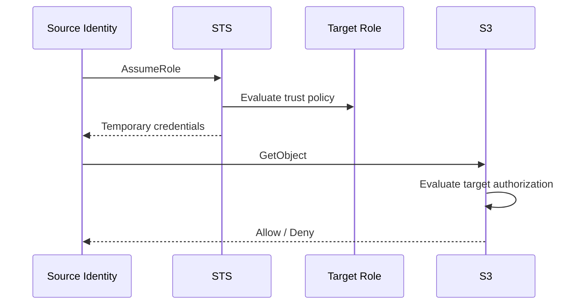
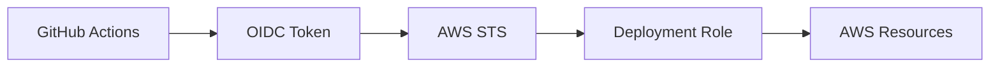
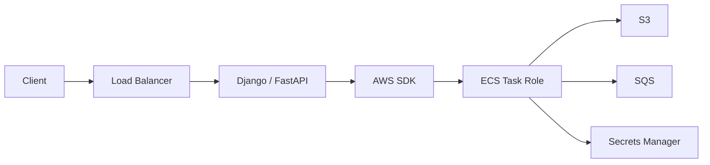
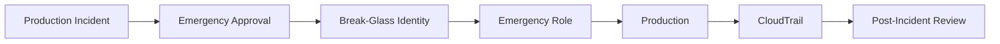
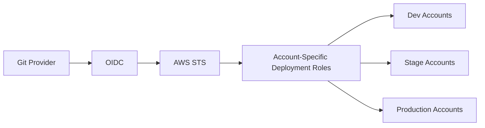
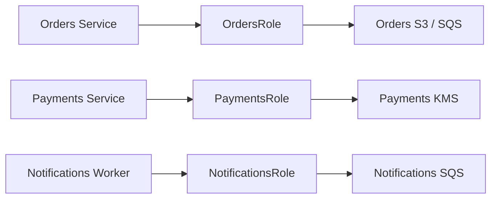
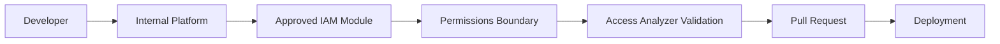
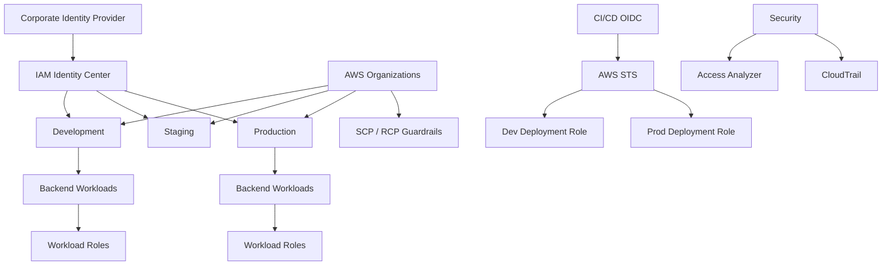

# 08- Senior-Level Questions and Interview Traps

## Overview

Senior AWS IAM interviews focus less on memorizing policy syntax and more on reasoning about authorization boundaries, temporary identities, delegation, cross-account access, privilege escalation, and production failures.

A senior engineer should be able to move from:

```text
"What is an IAM role?"
```

to:

```text
"Why did this request fail even though the role policy allows it,
and what is the smallest safe production fix?"
```

The most useful IAM mental model is:

```text
Principal
    ↓
Credential source
    ↓
Account
    ↓
Action
    ↓
Resource
    ↓
Request context
    ↓
Applicable policies
    ↓
Explicit deny?
    ↓
Applicable allow?
    ↓
Service-specific authorization
    ↓
Final decision
```

AWS evaluates the request context against applicable identity-based policies, resource-based policies, permissions boundaries, Organizations SCPs/RCPs, and session policies. The exact behavior depends on the principal, policy types, resource, account relationship, and AWS service. An applicable explicit deny overrides an allow. ([AWS: Processing the request context](https://docs.aws.amazon.com/IAM/latest/UserGuide/reference_policies_evaluation-logic_policy-eval-reqcontext.html), [AWS: Enforcement logic](https://docs.aws.amazon.com/IAM/latest/UserGuide/reference_policies_evaluation-logic_policy-eval-denyallow.html))

The interview goal is to demonstrate:

```text
Authorization reasoning
+
Security awareness
+
Architecture judgment
+
Operational discipline
```

---

## Senior-Level Answer Framework

For difficult questions, use a consistent structure:

```text
1. Identify the identity.
2. Identify how credentials were obtained.
3. Identify the AWS account.
4. Identify the requested action.
5. Identify the target resource.
6. Identify trust relationships.
7. Identify applicable policy layers.
8. Check explicit denies.
9. Check missing or conditional allows.
10. Check service-specific authorization.
11. Evaluate blast radius and privilege escalation.
12. Explain operational ownership and lifecycle.
13. Explain how the design would be validated and audited.
```

This is stronger than:

```text
"Add this permission."
```

because the same reasoning works across:

```text
S3
SQS
SNS
KMS
Secrets Manager
Lambda
ECS
EKS
ECR
CloudFormation
CI/CD
Cross-account systems
```

---

## Senior Question: Explain AWS IAM Policy Evaluation

### Strong answer

AWS starts from an implicit deny unless an applicable authorization path allows the request. It evaluates policies that apply to the request context and checks for explicit denies. If an applicable explicit deny exists, the request is denied. Otherwise, the request must satisfy the applicable allow requirements for the specific policy model. ([AWS: Enforcement logic](https://docs.aws.amazon.com/IAM/latest/UserGuide/reference_policies_evaluation-logic_policy-eval-denyallow.html))

The request context can include:

```text
Principal
Action
Resource
Account
Region
Source identity
IP address
VPC / VPC endpoint context
Tags
MFA state
Source account
Source resource
Other condition keys
```

Applicable policy types can include:

```text
Identity-based policies
Resource-based policies
Permissions boundaries
SCPs
RCPs
Session policies
```

### Interview trap

Do not reduce IAM to:

```text
Role policy says Allow
→ request succeeds
```

That is incomplete.

---

## Senior Question: What Is an Implicit Deny?

An implicit deny means no applicable policy has produced the required allow.

Example:

```text
Role policy:
No s3:GetObject permission

Request:
s3:GetObject

Result:
Implicit deny
```

There may be no explicit:

```json
{
  "Effect": "Deny"
}
```

The absence of an applicable allow is sufficient to deny the request.

---

## Senior Question: What Is an Explicit Deny?

An explicit deny is an applicable statement containing:

```json
{
  "Effect": "Deny"
}
```

Example:

```json
{
  "Version": "2012-10-17",
  "Statement": [
    {
      "Sid": "DenyUnapprovedRegions",
      "Effect": "Deny",
      "Action": "ec2:*",
      "Resource": "*",
      "Condition": {
        "StringNotEquals": {
          "aws:RequestedRegion": [
            "ap-south-1"
          ]
        }
      }
    }
  ]
}
```

An applicable explicit deny overrides an allow.

This is why adding another allow statement does not fix every `AccessDenied` error.

---

## Senior Question: How Do You Troubleshoot `AccessDenied`?

Start with identity rather than policy editing.

```bash
aws configure list
aws sts get-caller-identity
```

Then establish:

```text
Caller
Account
Role/session
Action
Resource
Region
```

Next inspect:

```text
Identity-based policy
Resource-based policy
Permissions boundary
SCP
RCP
Session policy
Conditions
Service-specific controls
```

Then use:

```text
IAM Policy Simulator
IAM Access Analyzer
CloudTrail
```

where appropriate.

The production principle is:

```text
Evidence first
→
Root cause
→
Smallest safe fix
```

Not:

```text
AccessDenied
→
AdministratorAccess
```

---

## Senior Question: Why Can a Role With an Allow Still Be Denied?

An identity policy allow is only one authorization input.

Other controls may restrict the request:

```text
Explicit deny
Permissions boundary
SCP
RCP
Session policy
Resource policy
Condition mismatch
Wrong caller
Wrong resource
KMS authorization
Service-specific authorization
```

AWS documents permissions boundaries, SCPs, resource policies, RCPs, and session policies as part of the effective authorization model. ([AWS: Policy evaluation](https://docs.aws.amazon.com/IAM/latest/UserGuide/reference_policies_evaluation-logic.html))

---

## Senior Question: Trust Policy vs Permission Policy

### Trust policy

Answers:

```text
Who can assume this role?
```

Typical action:

```text
sts:AssumeRole
```

### Permission policy

Answers:

```text
What can this role do?
```

Examples:

```text
s3:GetObject
sqs:SendMessage
secretsmanager:GetSecretValue
kms:Decrypt
```

Conceptually:

```text
Source Principal
    ↓
Can I become this role?
    ↓
Trust policy

Assumed role session
    ↓
What can I access?
    ↓
Permission policies
```

### Interview trap

Adding:

```text
s3:GetObject
```

to the role permission policy cannot fix a failure where:

```text
sts:AssumeRole
```

is denied.

---

## Senior Question: What Happens When `AssumeRole` Succeeds but S3 Access Fails?

These are two separate authorization events.



Successful role assumption proves:

```text
The target role session was created.
```

It does not prove:

```text
The session can access S3.
```

A senior engineer should independently troubleshoot:

```text
Assumption
```

and:

```text
Resource authorization
```

---

## Senior Question: IAM Role vs IAM User

| Dimension | IAM User | IAM Role |
|---|---|---|
| Identity | Long-lived IAM identity | Assumable identity |
| Typical credential | Password/access key | Temporary credentials |
| Workforce use | Legacy/exceptional | Federation/Identity Center |
| Workload use | Poor default | Preferred |
| Cross-account use | Possible | Common |
| Credential rotation | Explicit for keys | Provider/session managed |
| Blast radius | Depends on permissions/lifetime | Often reduced through temporary sessions |

AWS recommends federation and temporary credentials for human users and IAM roles with temporary credentials for workloads. ([AWS IAM security best practices](https://docs.aws.amazon.com/IAM/latest/UserGuide/best-practices.html))

### Strong answer

> I would generally prefer roles for workloads, federated workforce access, CI/CD, and cross-account delegation. IAM users still exist for specific compatibility or long-term credential use cases, but they should be minimized.

---

## Senior Question: IAM Role vs Access Key

The two are not equivalent concepts.

```text
IAM role
    ↓
Identity and authorization model

Access key
    ↓
Credential used to authenticate/sign requests
```

A role can be used to obtain temporary credentials containing access-key material plus a session token.

### Production preference

```text
EC2
→ Instance role

ECS
→ Task role

Lambda
→ Execution role

EKS
→ Pod Identity / workload identity

CI/CD
→ OIDC + role

Human
→ Identity Center / federation
```

AWS recommends temporary credentials instead of long-lived access keys where possible. ([AWS IAM security best practices](https://docs.aws.amazon.com/IAM/latest/UserGuide/best-practices.html))

---

## Senior Question: IAM Identity Center vs IAM Users

IAM Identity Center is designed for centrally managing workforce access across AWS accounts.

Typical model:

```text
Corporate IdP
    ↓
IAM Identity Center
    ↓
Groups
    ↓
Permission Sets
    ↓
AWS Accounts
    ↓
Temporary Sessions
```

This scales better than creating and maintaining individual IAM users across many accounts.

### Use IAM users only when

```text
A specific compatibility requirement exists
+
Federation/roles cannot reasonably be used
```

AWS's current IAM guidance recommends workforce federation and temporary credentials, with IAM Identity Center recommended for centralized workforce access. ([AWS IAM security best practices](https://docs.aws.amazon.com/IAM/latest/UserGuide/best-practices.html))

---

## Senior Question: Permission Set vs IAM Role

A permission set is an IAM Identity Center workforce-access abstraction.

An IAM role is an AWS identity.

A typical flow is:

```text
Human
    ↓
Identity Center
    ↓
Permission Set
    ↓
AWS account access
    ↓
AWS role/session
```

Do not describe permission sets as simply another name for IAM roles.

They solve different lifecycle and management problems.

---

## Senior Question: Why Use Temporary Credentials?

Temporary credentials are time-bounded:

```text
AccessKeyId
SecretAccessKey
SessionToken
Expiration
```

The security advantage is reduced credential lifetime.

This limits the exposure window if temporary credentials are copied or leaked.

However:

```text
Temporary
≠
Least privilege
```

This remains dangerous:

```text
Temporary credentials
+
AdministratorAccess
```

Temporary credentials address credential lifetime; least privilege addresses authorization scope.

---

## Senior Question: What Is Role Chaining?

Role chaining means:

```text
Identity
    ↓
Role A
    ↓
Role B
```

rather than:

```text
Identity
    ↓
Role B
```

Chaining may provide useful delegation boundaries but adds:

```text
Trust relationships
Session management
Audit complexity
Failure modes
Credential hops
```

AWS documents that role chaining limits the resulting CLI/API role session to one hour. ([AWS STS `AssumeRole`](https://docs.aws.amazon.com/STS/latest/APIReference/API_AssumeRole.html))

### Senior design principle

Use direct assumption where practical.

Add intermediate roles only when the architectural boundary provides meaningful value.

---

## Senior Question: What Is the Difference Between `AssumeRole` and `AssumeRoleWithWebIdentity`?

### `AssumeRole`

Commonly used for:

```text
Cross-account AWS access
Deployment roles
Security automation
Delegated AWS access
```

### `AssumeRoleWithWebIdentity`

Commonly used for:

```text
OIDC federation
CI/CD
Kubernetes workloads
External web identities
```

The key difference is the credential or identity source used to obtain the temporary AWS session.

---

## Senior Question: How Would You Secure GitHub Actions Against AWS?

Use OIDC rather than storing long-lived AWS access keys.



Trust policy controls:

```text
OIDC provider
Repository
Branch/environment
Audience
Subject claims
```

The deployment role controls:

```text
Allowed actions
Allowed resources
iam:PassRole
Target environment
```

### Interview trap

OIDC prevents the need for a permanent AWS secret, but it does not automatically provide least privilege.

A compromised CI workflow can still abuse:

```text
AdministratorAccess
Broad trust
Broad PassRole
Broad deployment permissions
```

---

## Senior Question: What Is `iam:PassRole` and Why Is It Dangerous?

`iam:PassRole` allows an identity to pass an IAM role to an AWS service when creating or configuring a resource.

Example:

```text
DeploymentRole
    ↓
Create Lambda
    ↓
Pass LambdaExecutionRole
```

If the deployment identity has:

```text
iam:PassRole
Resource: *
```

it may be able to attach highly privileged execution roles to resources it can create.

A safer pattern is:

```text
iam:PassRole
    ↓
Only approved execution-role ARNs
```

and separate:

```text
Create/update resource permissions
```

from:

```text
Role delegation permissions
```

This is an important privilege-escalation path to identify in reviews.

---

## Senior Question: How Do You Prevent Developers From Creating Admin Roles?

A common delegated administration model is:

```text
Developer
    ↓
CreateRole
    ↓
Application role
```

The platform team can enforce:

```text
Permissions boundary
+
Restricted CreateRole
+
Restricted PassRole
+
Policy validation
+
CloudTrail
```

The permissions boundary sets the maximum permissions that the developer-created role can obtain through applicable identity-based policies. ([AWS: Permissions boundaries](https://docs.aws.amazon.com/IAM/latest/UserGuide/access_policies_boundaries.html))

---

## Senior Question: SCP vs Permissions Boundary

| Dimension | SCP | Permissions Boundary |
|---|---|---|
| Scope | Account / OU / organization | IAM user or role |
| Main purpose | Organizational guardrail | Principal-level guardrail |
| Grants permissions | No | No |
| Typical use | Restrict dangerous actions account-wide | Limit delegated IAM creation |
| Blast radius | Potentially large | Specific principal |

Think:

```text
SCP
→ "This account must not exceed this organizational boundary."

Boundary
→ "This role must not exceed this principal boundary."
```

AWS documents both as maximum-permission controls operating at different scopes. ([AWS: SCPs](https://docs.aws.amazon.com/organizations/latest/userguide/orgs_manage_policies_scps.html), [AWS: Permissions boundaries](https://docs.aws.amazon.com/IAM/latest/UserGuide/access_policies_boundaries.html))

---

## Senior Question: SCP vs RCP

The distinction is:

```text
SCP
→ Principal-oriented organization guardrail

RCP
→ Resource-oriented organization guardrail
```

SCPs constrain what principals in member accounts can do.

RCPs constrain the maximum available permissions for resources.

Both are organization-level controls and neither replaces the underlying identity/resource permissions. ([AWS: Processing the request context](https://docs.aws.amazon.com/IAM/latest/UserGuide/reference_policies_evaluation-logic_policy-eval-reqcontext.html))

---

## Senior Question: What Is a Resource-Based Policy?

A resource-based policy is attached to a resource and specifies principals and permissions for that resource.

Examples include:

```text
S3 bucket policy
SQS queue policy
SNS topic policy
```

Example:

```json
{
  "Version": "2012-10-17",
  "Statement": [
    {
      "Sid": "AllowOrdersRole",
      "Effect": "Allow",
      "Principal": {
        "AWS": "arn:aws:iam::111111111111:role/OrdersRole"
      },
      "Action": "s3:GetObject",
      "Resource": "arn:aws:s3:::orders-data/*"
    }
  ]
}
```

Resource policies are service-dependent. Not every AWS service supports them for every access pattern.

---

## Senior Question: Resource Policy vs Cross-Account Role

### Resource policy

```text
Source Principal
    ↓
Target Resource Policy
    ↓
Resource
```

### Cross-account role

```text
Source Principal
    ↓
AssumeRole
    ↓
Target Role
    ↓
Resource
```

### Choose based on:

```text
Service support
Resource ownership
Number of resources
Number of services
Principal lifecycle
Auditability
Need for a reusable target identity
```

AWS documents both cross-account patterns and recommends roles when the target service does not provide the needed resource-based access mechanism. ([AWS: Cross-account resource access](https://docs.aws.amazon.com/IAM/latest/UserGuide/access_policies-cross-account-resource-access.html))

---

## Senior Question: Can a Resource Policy Bypass a Permissions Boundary?

Do not answer with an unconditional yes or no.

The exact behavior depends on:

```text
Principal type
Policy form
Resource type
Same-account vs cross-account
Session principal behavior
Service authorization
```

AWS documents nuanced interactions between resource-based policies, permissions boundaries, and role/user/session principals. ([AWS: Enforcement logic](https://docs.aws.amazon.com/IAM/latest/UserGuide/reference_policies_evaluation-logic_policy-eval-denyallow.html), [AWS: Permissions boundaries](https://docs.aws.amazon.com/IAM/latest/UserGuide/access_policies_boundaries.html))

### Senior answer

> I would inspect the principal type and exact resource-policy form before concluding how the boundary participates in the decision.

This is safer than memorizing an oversimplified intersection formula.

---

## Senior Question: What Is ABAC?

Attribute-Based Access Control makes authorization decisions using attributes such as tags.

Example:

```text
Principal tag:
Project=payments

Resource tag:
Project=payments
```

A policy can compare these values.

ABAC is useful when:

```text
Many resources exist
Ownership follows consistent metadata
Resource creation is dynamic
Tag governance is mature
```

### Limitations

```text
Tag governance becomes security-critical
Debugging becomes more contextual
Tag mutation can become privilege-sensitive
Poor metadata can break authorization
```

ABAC shifts complexity from:

```text
Role management
```

toward:

```text
Attribute governance
```

---

## Senior Question: Why Can Tag-Based Authorization Become a Privilege-Escalation Risk?

Suppose:

```text
Project=payments
```

determines access.

If a user can modify the authorization-sensitive tag, they may change the policy input itself.

Therefore:

```text
Tag permissions
```

can become part of the security boundary.

Protect operations such as:

```text
TagResource
UntagResource
CreateTags
DeleteTags
```

when tags influence authorization.

---

## Senior Question: RBAC vs ABAC

| Dimension | RBAC | ABAC |
|---|---|---|
| Access model | Role/group | Attributes/tags |
| Policy reuse | Moderate | Potentially high |
| Metadata dependency | Low | High |
| Debugging | Usually simpler | More contextual |
| Governance | Role lifecycle | Attribute lifecycle |
| Large dynamic resource sets | Can create role growth | Often useful |
| Main risk | Role explosion | Attribute abuse/misconfiguration |

### Strong answer

> I would use ABAC when authorization naturally follows trusted attributes and the organization can govern those attributes. I would not choose ABAC simply because it sounds more scalable.

---

## Senior Question: What Is Least Privilege at Senior Level?

Least privilege is not merely:

```text
Few actions
```

It is a combination of:

```text
Action scope
+
Resource scope
+
Principal scope
+
Context scope
+
Credential lifetime
```

Example progression:

```text
s3:*
```

→

```text
s3:GetObject
```

→

```text
s3:GetObject
Resource = specific bucket prefix
```

→

```text
s3:GetObject
Resource = specific prefix
Condition = expected organizational context
```

The correct level depends on the application requirement.

AWS recommends refining permissions toward least privilege and provides Access Analyzer capabilities to help with that process. ([AWS IAM security best practices](https://docs.aws.amazon.com/IAM/latest/UserGuide/best-practices.html))

---

## Senior Question: How Would You Secure an ECS Backend?

For a Django or FastAPI container:



Use the task role for application AWS permissions.

The execution role is used by ECS/Fargate infrastructure for platform operations such as pulling images or interacting with supported AWS services; its credentials are not directly exposed to application containers. ([AWS: ECS task execution IAM role](https://docs.aws.amazon.com/AmazonECS/latest/developerguide/task_execution_IAM_role.html))

### Interview trap

Do not grant application permissions to:

```text
ECS execution role
```

and assume the container will inherit them.

The application identity is:

```text
ECS task role
```

---

## Senior Question: How Would You Secure an EKS Workload?

A modern pattern is:

```text
Pod
    ↓
Kubernetes ServiceAccount
    ↓
EKS Pod Identity / supported workload identity
    ↓
IAM role
    ↓
AWS service
```

AWS EKS guidance recommends using an IAM role per application for strong isolation and least privilege, while noting that ABAC can support cases where a common role is deliberately shared across applications with session attributes. ([AWS EKS IAM best practices](https://docs.aws.amazon.com/eks/latest/best-practices/identity-and-access-management.html))

### Senior point

Do not confuse:

```text
Kubernetes RBAC
```

with:

```text
AWS IAM
```

A workload may need both.

---

## Senior Question: How Would You Secure a Lambda Workload?

Use the Lambda execution role:

```text
Lambda
    ↓
Execution Role
    ↓
S3 / SQS / Secrets Manager / KMS
```

Keep:

```text
Runtime permissions
```

separate from:

```text
Deployment permissions
```

For cross-account access:

```text
Lambda execution role
    ↓
sts:AssumeRole
    ↓
Target account role
```

The source execution role needs only the ability to assume the target role; the target role owns the target-resource permissions.

---

## Senior Question: How Would You Secure a Celery Worker?

Treat the worker as a workload.

Avoid:

```text
Django API
+
Celery workers
+
Migration jobs
    ↓
SharedAdministratorRole
```

Prefer identities aligned with authorization boundaries:

```text
WebTaskRole
CeleryWorkerRole
MigrationRole
```

For example:

```text
CeleryWorkerRole
    ├── SQS receive/delete
    ├── Secrets Manager read
    └── Required application data permissions
```

This reduces blast radius when a worker is compromised.

---

## Senior Question: Does IAM Replace Application Authorization?

No.

Consider:

```text
FastAPI
    ↓
Tenant authorization
    ↓
IAM role
    ↓
S3
```

IAM may establish:

```text
This service may access the bucket.
```

The application must establish:

```text
This request may access tenant A's object.
```

IAM should not become the only authorization layer for:

```text
Tenant isolation
Business roles
Object ownership
Workflow permissions
Domain policies
```

---

## Senior Question: Does IAM Replace Kubernetes RBAC?

No.

```text
Kubernetes RBAC
→ Kubernetes API authorization

AWS IAM
→ AWS API/resource authorization
```

An EKS workload can require both:

```text
ServiceAccount
+
Kubernetes RBAC
+
IAM workload identity
```

They solve different authorization problems.

---

## Senior Question: Does IAM Replace PostgreSQL Authorization?

No.

A backend interacting with PostgreSQL may have:

```text
AWS IAM
    ↓
Secret retrieval / AWS resource access

PostgreSQL
    ↓
Database authentication + GRANTs

Application
    ↓
Business authorization
```

Do not give broad AWS permissions just because the application needs:

```text
SELECT
INSERT
UPDATE
```

on PostgreSQL.

Authorization belongs at the layer that owns the resource.

---

## Senior Question: How Would You Design a Multi-Account Backend Platform?

A common high-level structure is:

```text
AWS Organization
├── Management
├── Security
├── Log Archive
├── Network
├── Shared Services
├── Non-Production
└── Production
```

Workforce identity:

```text
Corporate IdP
    ↓
IAM Identity Center
    ↓
Permission Sets
    ↓
Accounts
```

Workload identity:

```text
ECS / Lambda / EKS / EC2
    ↓
Workload Role
```

CI/CD:

```text
OIDC
    ↓
Deployment Role
```

Governance:

```text
SCP / RCP
+
Permissions boundaries where delegation requires them
```

Audit:

```text
CloudTrail
+
Access Analyzer
```

The architecture separates:

```text
Workforce
Workloads
Governance
Security
Application ownership
```

---

## Senior Question: Why Use Multiple AWS Accounts?

Account boundaries can provide:

```text
Blast-radius reduction
Production isolation
Security boundaries
Compliance separation
Billing separation
Independent operational ownership
Organization-level controls
```

But multi-account systems also add:

```text
Cross-account IAM
Network complexity
Centralized logging
Account lifecycle management
Operational overhead
```

The correct answer is not:

```text
"More accounts are always better."
```

It is:

> Use account separation when the isolation and governance value justifies the additional operational complexity.

AWS Organizations provides centralized management and governance for multiple AWS accounts. ([AWS Organizations](https://docs.aws.amazon.com/organizations/latest/userguide/orgs_introduction.html))

---

## Senior Question: Why Keep Application Workloads Out of the Management Account?

The management account has organization-level authority and is a special governance boundary.

AWS recommends limiting the management account to organization-management activities rather than ordinary application workloads. ([AWS: Management account best practices](https://docs.aws.amazon.com/organizations/latest/userguide/orgs_best-practices_mgmt-acct.html))

A useful principle is:

```text
Organization administration
    ≠
Application execution
```

This reduces the consequences of an application or developer identity compromise.

---

## Senior Question: How Would You Secure Production Access for Developers?

Prefer:

```text
Corporate IdP
    ↓
IAM Identity Center
    ↓
Privileged permission set / role
    ↓
Temporary production session
```

Controls may include:

```text
MFA
Short session duration
Read-only by default
Approval workflow
Privileged role separation
CloudTrail
Break-glass procedure
```

Avoid:

```text
Permanent production AdministratorAccess
```

for normal development workflows.

---

## Senior Question: How Would You Design Break-Glass Access?

Break-glass access should be:

```text
Separate
Restricted
Strongly authenticated
Audited
Tested
Rarely used
Clearly owned
```

Example:



The break-glass path should also be tested during disaster-recovery exercises.

---

## Senior Question: How Would You Design Third-Party SaaS Access?

Use a dedicated target-account role:

```text
Vendor Account
    ↓
STS AssumeRole
    ↓
Customer VendorAccessRole
```

Use:

```text
Specific vendor principal
ExternalId
Least privilege
Specific resources
CloudTrail
Access reviews
Explicit offboarding
```

An external ID helps distinguish the intended customer relationship in multi-tenant vendor integrations and helps mitigate confused-deputy risk. AWS notes that external IDs are identifiers, not secrets like passwords or access keys. ([AWS: Third-party access](https://docs.aws.amazon.com/IAM/latest/UserGuide/id_roles_common-scenarios_third-party.html))

---

## Senior Question: What Is the Confused-Deputy Problem?

Suppose a SaaS provider serves:

```text
Customer A
Customer B
```

Both customers delegate access to the vendor.

The vendor could unintentionally use delegated authority in the wrong customer context.

The external ID adds customer-specific context:

```text
Vendor
    ↓
AssumeRole
    ↓
ExternalId
    ↓
Customer role
```

The exact trust policy still needs:

```text
Correct vendor principal
+
Correct conditions
+
Least privilege
```

---

## Senior Question: How Would You Design Cross-Account Access?

First ask:

```text
Does the target service support a suitable resource-based policy?
```

If yes, direct resource sharing may be appropriate.

If not:

```text
Source principal
    ↓
sts:AssumeRole
    ↓
Target role
    ↓
Target resource
```

Then verify:

```text
Source permissions
Target trust
Target permissions
Resource policy if applicable
SCP
RCP
Boundary
Session policy
Conditions
```

AWS documents both resource-based and role-based cross-account authorization patterns. ([AWS: Cross-account resource access](https://docs.aws.amazon.com/IAM/latest/UserGuide/access_policies-cross-account-resource-access.html))

---

## Senior Question: How Would You Design CI/CD Across Hundreds of Accounts?

Avoid:

```text
Hundreds of long-lived access keys
```

Prefer:



Each account/environment role should have:

```text
Narrow trust
Repository restrictions
Branch/environment restrictions
Least-privilege deployment actions
Restricted PassRole
CloudTrail auditing
Organization guardrails
```

This architecture also makes compromised CI credentials more bounded in time and scope.

---

## Senior Question: How Would You Prevent Cross-Environment Access?

Avoid relying on names such as:

```text
prod
staging
dev
```

alone.

Use actual boundaries:

```text
Separate accounts
Separate roles
SCP guardrails
Permission sets
Resource policies
Deployment controls
CI trust restrictions
```

For example:

```text
DevelopmentRole
    ↓
Development account

ProductionRole
    ↓
Production account
```

The separation exists in AWS authorization rather than in naming conventions.

---

## Senior Question: How Would You Design Shared Services?

Examples:

```text
ECR
Artifact storage
Central logging
Shared platform tooling
```

A common model is:

```text
Shared Services Account
    ↓
Resource
    ↓
Specific workload account roles
```

The resource owner should grant only the required operations.

Example:

```text
Production ECS task
    ↓
ecr:GetDownloadUrlForLayer
ecr:BatchGetImage
    ↓
Specific repository
```

Avoid:

```text
ecr:*
Resource: *
```

for all workloads.

---

## Senior Question: Centralized Secrets or Per-Account Secrets?

### Centralized

Advantages:

```text
Central governance
Central rotation
Central ownership
```

Costs:

```text
Cross-account authorization
KMS complexity
Central dependency
```

### Per-account

Advantages:

```text
Isolation
Local ownership
Simpler local authorization
Smaller failure domain
```

Costs:

```text
More duplicated management
More local lifecycle work
```

The choice should follow:

```text
Security boundary
Data ownership
Operational model
Recovery requirements
Latency
Cross-account dependency
```

---

## Senior Question: How Would You Design a Security Account?

A security account can centralize:

```text
Security tooling
Detection
Investigation
Incident response
Central security automation
```

Workload accounts can trust dedicated roles:

```text
SecurityAccount
    ↓
SecurityAuditRole
    ↓
AssumeRole
    ↓
MemberAccount
```

Keep:

```text
Read-only audit
```

separate from:

```text
Emergency response
```

when operational requirements justify elevated privileges.

---

## Senior Question: What Should Be Centralized and What Should Stay Local?

A useful architectural split is:

### Centralize

```text
Workforce identity
Organization guardrails
Security tooling
Audit
Policy standards
Reusable IAM modules
```

### Keep local

```text
Application runtime roles
Application-specific permissions
Service-owned resources
Workload lifecycle
```

The objective is:

```text
Central governance
+
Local authorization ownership
```

---

## Senior Question: How Would You Reduce IAM Blast Radius?

Use independent boundaries:

```text
Organization
    ↓
Account
    ↓
Workload role
    ↓
Resource scope
    ↓
Action scope
    ↓
Condition scope
    ↓
Credential lifetime
```

For example:

```text
Compromised Orders API
    ↓
OrdersTaskRole
    ↓
Orders-specific permissions
    ↓
Orders resources
```

The objective is to prevent compromise of one service from becoming compromise of the entire organization.

---

## Senior Question: How Would You Design IAM for 500 AWS Accounts?

A scalable model is:

```text
AWS Organizations
    ↓
OUs
    ↓
Accounts
    ↓
Central workforce access
```

Use:

```text
IAM Identity Center
Permission sets
Workload roles
Cross-account roles/resource policies
SCP/RCP guardrails
Permissions boundaries for delegated IAM
CloudTrail
Access Analyzer
```

Avoid:

```text
One IAM user per engineer per account
```

and:

```text
One administrator role shared across all workloads
```

The architecture should optimize for:

```text
Isolation
Automation
Auditability
Delegation
Scalability
```

---

## Senior Question: How Would You Prevent IAM Policy Sprawl?

Use:

```text
Reusable modules
Customer-managed policies where lifecycle ownership matters
Policy naming conventions
Policy ownership
Permission sets
Access Analyzer
Unused-access analysis
CI validation
Infrastructure as Code
Regular review
```

Avoid:

```text
Manual console policies
Unowned inline policies
Near-duplicate policies
One-off production exceptions
```

A mature IAM platform has a lifecycle:

```text
Create
→
Review
→
Deploy
→
Observe
→
Refine
→
Retire
```

---

## Senior Question: How Would You Implement IAM as Code?

Store:

```text
Roles
Trust policies
Permission policies
Permission sets
SCPs
RCPs
Cross-account relationships
```

in source control.

A CI flow can be:

```text
Pull Request
    ↓
Syntax validation
    ↓
Access Analyzer validation
    ↓
Custom policy checks
    ↓
Code review
    ↓
IaC plan
    ↓
Deployment
    ↓
CloudTrail
```

IAM Access Analyzer can validate policies against IAM grammar and AWS best practices, while custom policy checks can compare updated policies against reference policies or test for specific access. ([AWS: Access Analyzer policy validation](https://docs.aws.amazon.com/IAM/latest/UserGuide/access-analyzer-policy-validation.html), [AWS: Custom policy checks](https://docs.aws.amazon.com/IAM/latest/UserGuide/access-analyzer-custom-policy-checks.html))

---

## Senior Question: What Is a Custom Access Analyzer Policy Check?

Custom policy checks can be used to test security standards before a policy is deployed.

For example:

```text
Existing policy
        ↓
Proposed policy
        ↓
Check for new access
        ↓
Fail validation if unexpected access appears
```

AWS supports checks for:

```text
New access compared to a reference policy
Specific actions/resources
Potential public access in supported resource-policy checks
```

Custom checks are useful in CI/CD for sensitive permission changes. AWS currently charges for custom policy checks, so large-scale automation should account for that operational cost. ([AWS: Custom policy checks](https://docs.aws.amazon.com/IAM/latest/UserGuide/access-analyzer-custom-policy-checks.html))

---

## Senior Question: What Is IAM Access Analyzer Policy Generation?

Access Analyzer can generate policies from observed access activity recorded in CloudTrail.

Conceptually:

```text
Workload
    ↓
CloudTrail
    ↓
Observed API activity
    ↓
Access Analyzer
    ↓
Candidate policy
    ↓
Review
    ↓
Refine permissions
```

Generated policies should be treated as a starting point.

Observed activity may not cover:

```text
Rare workflows
Disaster recovery
Break-glass operations
Future application paths
```

Therefore:

```text
Generated policy
≠
Automatically approved least-privilege policy
```

AWS documents policy generation as a capability for refining IAM permissions using CloudTrail activity. ([AWS: IAM Access Analyzer](https://docs.aws.amazon.com/IAM/latest/UserGuide/what-is-access-analyzer.html))

---

## Senior Question: What Is the Difference Between Access Analyzer and CloudTrail?

### Access Analyzer

Primarily answers:

```text
What access is possible?
What access is unused?
Does this policy introduce prohibited access?
```

depending on the analyzer capability.

### CloudTrail

Primarily answers:

```text
What AWS API activity actually occurred?
Who made the request?
When?
Against what resource?
```

A mature IAM program uses both:

```text
Possible access analysis
+
Observed activity
```

rather than treating either tool as a replacement for the other.

---

## Senior Question: How Would You Review an IAM Policy Pull Request?

Review:

```text
Principal
Effect
Action
Resource
Condition
Wildcard scope
Cross-account exposure
Privilege escalation paths
PassRole
Secrets access
KMS access
Production scope
Environment scope
Organization controls
```

Run:

```bash
aws accessanalyzer validate-policy \
    --policy-document file://policy.json \
    --policy-type IDENTITY_POLICY
```

For higher assurance, add:

```text
Custom Access Analyzer checks
Policy simulation
IaC testing
Security review
```

AWS recommends policy validation as part of policy authoring and review. ([AWS: Validate policies with Access Analyzer](https://docs.aws.amazon.com/IAM/latest/UserGuide/access-analyzer-policy-validation.html))

---

## Senior Question: How Would You Detect Privilege Escalation?

Look for permission combinations rather than isolated actions.

High-risk examples can include:

```text
iam:CreateRole
iam:PutRolePolicy
iam:AttachRolePolicy
iam:PassRole
lambda:CreateFunction
cloudformation:CreateStack
ec2:RunInstances
```

The question to ask is:

```text
Can this principal create or modify a resource
that runs with more privilege than the principal itself?
```

This is why privilege-escalation analysis must consider combinations of permissions.

---

## Senior Question: How Would You Secure a Migration Role?

Use a dedicated temporary identity:

```text
MigrationRole
    ├── Read old data
    ├── Write new data
    └── Validate migration
```

After completion:

```text
Disable/remove trust
Remove role if no longer needed
Remove supporting policies
Review CloudTrail
Record completion
```

Do not add migration permissions permanently to:

```text
ProductionApplicationRole
```

simply because that role already exists.

---

## Senior Question: What Is the Difference Between Security and Operational Simplicity?

The goal is not:

```text
Maximum restriction
```

or:

```text
Maximum convenience
```

A mature IAM design makes secure access easy.

For example:

```text
Reusable deployment roles
+
Approved IAM modules
+
Self-service within permissions boundaries
+
Automated validation
+
Temporary privileged access
```

This is better than:

```text
Every permission requires manual security-team intervention
```

and also better than:

```text
Everyone gets AdministratorAccess
```

---

## Senior Question: How Do You Balance Least Privilege With Developer Velocity?

Use automation.

Instead of manual permission requests:

```text
Developer
    ↓
Approved IAM module
    ↓
Pull Request
    ↓
Automated policy validation
    ↓
Review
    ↓
Deploy
```

Use:

```text
Standard role templates
+
Resource-specific modules
+
Permissions boundaries
+
Policy checks
```

The secure path becomes the easy path.

---

## Senior Question: How Would You Handle an IAM Exception?

Examples:

```text
Legacy workload needs an access key
Vendor requires unusual access
Migration needs temporary elevated permissions
A service lacks a preferred authorization mechanism
```

Document:

```text
Reason
Owner
Scope
Duration
Compensating controls
Monitoring
Review date
Exit plan
```

Do not make the exception invisible.

An exception without an owner tends to become permanent.

---

## Senior Question: How Would You Review Unused IAM Access?

Review:

```text
Unused users
Unused roles
Unused keys
Unused actions
Unused service permissions
Unused cross-account trust
```

IAM Access Analyzer includes unused-access analysis and can identify unused roles, access keys, passwords, and permissions based on the analyzer configuration. ([AWS: IAM Access Analyzer](https://docs.aws.amazon.com/IAM/latest/UserGuide/what-is-access-analyzer.html))

### Interview trap

Do not say:

```text
Unused = immediately delete
```

An unused role may be:

```text
Break-glass
DR
Migration
Incident response
Rare scheduled job
```

Usage data should be combined with owner and operational context.

---

## Senior Question: What Is the Difference Between Credential Security and Authorization Security?

### Credential security

Controls:

```text
Who gets credentials?
Where are they stored?
How long are they valid?
How can they be revoked?
```

### Authorization security

Controls:

```text
What can those credentials do?
```

A secure architecture needs both.

Example:

```text
Temporary credentials
+
AdministratorAccess
```

has good credential lifetime but poor authorization scope.

---

## Senior Question: Does MFA Replace Least Privilege?

No.

MFA strengthens:

```text
Authentication
```

Least privilege controls:

```text
Authorization
```

An identity can be strongly authenticated and still have excessive permissions.

AWS recommends MFA alongside other controls such as federation, temporary credentials, and least privilege. ([AWS IAM security best practices](https://docs.aws.amazon.com/IAM/latest/UserGuide/best-practices.html))

---

## Senior Question: Does Temporary Credential Rotation Solve Security Problems?

No.

Temporary credentials reduce:

```text
Credential lifetime
```

but do not prevent:

```text
Overly broad trust
Overly broad permissions
Privilege escalation
Resource-policy exposure
Compromised runtime
```

Temporary identity is one layer of a defense-in-depth architecture.

---

## Senior Question: How Would You Secure Tags Used for ABAC?

Identify all permissions that can modify authorization-sensitive attributes:

```text
CreateTags
DeleteTags
TagResource
UntagResource
```

Then restrict:

```text
Who may create tags
Which tag keys may be modified
Which resources may be tagged
Which values are permitted
```

If:

```text
Project=payments
```

determines access, then the ability to manipulate `Project` is security-sensitive.

---

## Senior Question: What Are `aws:SourceArn` and `aws:SourceAccount` Used For?

They are commonly used to constrain AWS service-to-service access based on the originating resource/account.

Conceptually:

```text
Approved source resource
+
Approved source account
        ↓
Target resource
```

They can help reduce confused-deputy risk when supported by the service.

The exact condition keys and semantics should always be checked against the target AWS service documentation.

---

## Senior Question: What Is `aws:PrincipalArn`?

`aws:PrincipalArn` is a global condition key representing the principal ARN in the request context.

It can be used to express conditions based on the calling principal.

The important interview point is:

```text
Principal element
≠
PrincipalArn condition key
```

Do not assume their evaluation behavior is interchangeable across every service or policy form.

---

## Senior Question: What Is a Data Perimeter?

A data perimeter uses organizational and network controls to reduce unintended access paths to resources and data.

Conceptually:

```text
Trusted identities
+
Trusted resources
+
Trusted network paths
```

AWS documents data-perimeter approaches using controls such as:

```text
SCP
RCP
Resource policies
VPC endpoint policies
Condition keys
```

A data perimeter complements least privilege; it does not replace fine-grained authorization. ([AWS: Data perimeters](https://docs.aws.amazon.com/IAM/latest/UserGuide/access_policies_data-perimeters.html))

---

## Senior Question: Why Are Data Perimeters Relevant to IAM?

Traditional least privilege asks:

```text
Can this role call S3 GetObject?
```

A data perimeter can add:

```text
Can it access only expected organizational resources?
Can it access only from expected network paths?
Can resources be accessed only by trusted principals?
```

This creates defense in depth:

```text
Fine-grained permissions
+
Organizational boundaries
+
Network/resource perimeter
```

---

## Senior Question: How Would You Prevent a Compromised Developer Environment From Accessing Production?

Use multiple controls:

```text
Separate production account
+
No permanent production keys
+
Identity Center
+
Restricted production permission set
+
MFA
+
SCP guardrails
+
Temporary privileged role
+
CloudTrail
+
Break-glass isolation
```

If CI/CD deploys production:

```text
OIDC
+
Production-specific deployment role
+
Repository/environment restrictions
```

Do not rely on a developer's workstation being trustworthy.

---

## Senior Question: How Would You Respond to an AWS Access Key Leak?

Treat the credential as compromised.

Immediate sequence:

```text
1. Disable/revoke the credential.
2. Determine exposure location.
3. Inspect CloudTrail.
4. Identify affected resources.
5. Rotate dependent secrets.
6. Remove the credential from active systems.
7. Replace with temporary credentials where possible.
8. Review policy scope.
9. Investigate root cause.
```

If the key appeared in Git, rewriting history does not invalidate the credential.

Credential revocation is the first security control.

---

## Senior Question: How Would You Diagnose Wrong Identity in Python?

For Boto3:

```python
import boto3

session = boto3.Session()

print("profile:", session.profile_name)
print("region:", session.region_name)

sts = session.client("sts")

print(sts.get_caller_identity())
```

Compare this with:

```bash
aws configure list
aws sts get-caller-identity
```

If the CLI and Python identities differ, investigate:

```text
Environment variables
AWS_PROFILE
Shared credentials
AWS_CONFIG_FILE
AWS_SHARED_CREDENTIALS_FILE
Credential provider chain
Container metadata
Workload role
```

The caller identity is more reliable than assumptions about configuration.

---

## Senior Question: Why Does "Works Locally" Often Mean "Wrong Identity"?

A local developer may be using:

```text
Admin-like federated role
```

while production uses:

```text
Least-privilege task role
```

The application code may be identical.

The authorization context is not.

Compare:

```text
Caller ARN
Account
Role
Policy
Resource
SCP
Boundary
Region
```

before changing application code.

---

## Senior Question: Why Can Policy Validation Pass While Production Still Fails?

Policy validation checks the policy's grammar and AWS best-practice findings.

It does not prove:

```text
Correct runtime principal
Correct resource
Correct trust
Correct SCP/RCP
Correct boundary
Correct service behavior
Correct request context
```

AWS Access Analyzer policy validation is therefore a pre-deployment control, not complete end-to-end authorization proof. ([AWS: Access Analyzer policy validation](https://docs.aws.amazon.com/IAM/latest/UserGuide/access-analyzer-policy-validation.html))

---

## Senior Question: Why Can Policy Simulator Say Allow While Production Says Deny?

Possible causes include:

```text
Different caller
Different request context
Missing resource policy input
SCP/RCP differences
Service-specific authorization
Different Region
Different runtime configuration
```

Use:

```text
Policy Simulator
+
GetCallerIdentity
+
CloudTrail
+
Service-specific diagnostics
```

AWS explicitly notes that policy simulation results can differ from live behavior. ([AWS: IAM policy simulator](https://docs.aws.amazon.com/IAM/latest/UserGuide/access_policies_testing-policies.html))

---

## Senior Question: What Is the Difference Between Access Analyzer and Policy Simulator?

| Tool | Main purpose |
|---|---|
| Policy Simulator | Test authorization decisions for specified policies/context |
| Access Analyzer policy validation | Validate policy grammar and AWS best practices |
| Access Analyzer external analysis | Identify resource sharing with external principals |
| Access Analyzer internal analysis | Analyze which internal principals can access selected resources |
| Access Analyzer unused analysis | Identify unused access |
| Access Analyzer custom checks | Test policies against defined security standards |
| Access Analyzer policy generation | Generate candidate policies from CloudTrail activity |

AWS documents these as distinct IAM Access Analyzer and IAM policy-testing capabilities. ([AWS: IAM Access Analyzer](https://docs.aws.amazon.com/IAM/latest/UserGuide/what-is-access-analyzer.html))

---

## Senior Question: What Is the Difference Between Access Analyzer and CloudTrail?

CloudTrail provides historical API activity:

```text
Who
What
When
Where
Resource
```

Access Analyzer can evaluate policy-based access possibilities or unused access, depending on analyzer type.

Think:

```text
CloudTrail
→ What happened?

Access Analyzer
→ What access is possible, exposed, unused, or policy-invalid?
```

Use both for mature IAM governance.

---

## Senior Question: How Would You Monitor IAM Privilege Changes?

Monitor events such as:

```text
CreateRole
DeleteRole
UpdateAssumeRolePolicy
PutRolePolicy
AttachRolePolicy
DetachRolePolicy
CreatePolicyVersion
SetDefaultPolicyVersion
PassRole
AssumeRole
AssumeRoleWithWebIdentity
CreateAccessKey
```

Use:

```text
CloudTrail
+
Centralized monitoring
+
Security alerts
```

Pay particular attention to:

```text
New trust relationships
New wildcard permissions
PassRole expansion
AdministratorAccess attachment
External principals
Production role changes
```

---

## Senior Question: How Would You Manage IAM Drift?

Drift can originate from:

```text
Console changes
Manual CLI changes
Legacy automation
Emergency remediation
Multiple IaC stacks
```

A strong model is:

```text
Infrastructure as Code
+
CI validation
+
CloudTrail monitoring
+
Drift detection
+
Periodic review
```

Emergency changes should eventually be reconciled back into the source-of-truth configuration.

---

## Senior Question: How Would You Design IAM for Disaster Recovery?

A DR environment must preserve:

```text
Identity
Trust
Permissions
KMS access
Backup access
Deployment roles
Cross-account trust
Break-glass access
```

Test:

```text
Assume recovery role
    ↓
Read backup
    ↓
Decrypt
    ↓
Restore
    ↓
Deploy workload
```

An infrastructure recovery plan without working IAM paths is incomplete.

---

## Senior Question: How Would You Design IAM for a Microservice Platform?

Use security boundaries aligned with service ownership.



The roles should be independently reviewable.

Do not share one role simply to minimize the number of IAM objects.

Role boundaries should reflect:

```text
Permissions
Ownership
Lifecycle
Risk
Data sensitivity
```

AWS EKS guidance similarly recommends one IAM role per application as a best practice for workload isolation, while noting that ABAC can be used deliberately in some scale-oriented designs. ([AWS EKS IAM best practices](https://docs.aws.amazon.com/eks/latest/best-practices/identity-and-access-management.html))

---

## Senior Question: One Role Per Microservice or Shared Role?

There is no universal role-count rule.

Use separate roles when services differ in:

```text
Permissions
Ownership
Risk
Deployment lifecycle
Data access
```

Shared roles may be reasonable when:

```text
Workloads genuinely share the same authorization boundary
+
The shared identity is intentional
+
Audit requirements are satisfied
```

The decision should be security-boundary driven.

---

## Senior Question: How Would You Design IAM for Django + Celery?

Treat the web application and worker as separate workloads if their AWS capabilities differ.

```text
Django API
    ↓
WebTaskRole

Celery Worker
    ↓
WorkerTaskRole

Migration job
    ↓
MigrationRole
```

Example:

```text
WebTaskRole
    ├── Secrets Manager read
    └── S3 read

WorkerTaskRole
    ├── SQS consume
    ├── S3 write
    └── Secrets Manager read

MigrationRole
    ├── Database migration support
    └── Temporary elevated permissions
```

This reduces the consequences of a compromised web container or worker.

---

## Senior Question: What Does IAM Have to Do With Nginx?

Usually, IAM is downstream of Nginx.

Typical path:

```text
Client
    ↓
Nginx / Load Balancer
    ↓
Django / FastAPI
    ↓
AWS SDK
    ↓
IAM authorization
```

These are different layers:

```text
HTTP authentication
Application authorization
AWS authentication
AWS authorization
```

An S3 `AccessDenied` error is not normally solved by changing Nginx configuration.

---

## Senior Question: What Does IAM Have to Do With Kafka?

For AWS-integrated messaging such as Amazon MSK, distinguish:

```text
Network reachability
IAM authentication
Kafka authorization
Topic permissions
Application authorization
```

A principal may authenticate successfully and still lack permission to:

```text
Produce to topic A
Consume from topic B
```

IAM does not erase the authorization model of the underlying application protocol.

---

## Senior Question: What Does IAM Have to Do With PostgreSQL?

IAM may participate in some AWS database-authentication patterns, but database authorization remains a separate concern.

Typical architecture:

```text
FastAPI
    ↓
IAM role
    ↓
Secrets Manager / database authentication mechanism
    ↓
PostgreSQL
    ↓
Database role + GRANT
```

Keep:

```text
AWS authorization
```

separate from:

```text
Database authorization
```

---

## Senior Question: What Is the Difference Between Authentication and Authorization in a Microservice?

For a service call:

```text
Service A
    ↓
Authentication
"Who is Service A?"
    ↓
Authorization
"Can Service A call this operation?"
```

Then, independently:

```text
Service A
    ↓
AWS IAM
    ↓
Can Service A access SQS/S3/KMS?
```

For gRPC, this may involve:

```text
mTLS / service identity
+
application authorization
+
AWS IAM
```

Do not make IAM responsible for every layer of microservice authorization.

---

## Senior Question: How Would You Handle Cross-Account S3 Access?

First decide whether a bucket policy is appropriate.

Possible patterns:

```text
Account A role
    ↓
Account B bucket policy
    ↓
S3 object
```

or:

```text
Account A role
    ↓
AssumeRole
    ↓
Account B role
    ↓
S3
```

Then inspect:

```text
Principal
Action
Bucket ARN
Object ARN
Account
SCP/RCP
Conditions
KMS
VPC endpoint policy if relevant
```

Do not confuse:

```text
s3:ListBucket
```

with:

```text
s3:GetObject
```

Their resource scope is different.

---

## Senior Question: Why Can KMS Create a Second Authorization Failure?

Consider:

```text
Application
    ↓
S3
    ↓
SSE-KMS
    ↓
KMS key
```

The application may require both:

```text
S3 authorization
+
KMS authorization
```

Therefore:

```text
S3 policy correct
```

does not necessarily mean:

```text
encrypted object access succeeds
```

When KMS is involved, inspect:

```text
IAM permissions
Key policy
Grants where applicable
Region
Encryption context
SCP/RCP
```

---

## Senior Question: How Would You Explain `aws:PrincipalArn` vs `Principal`?

`Principal` is a policy element identifying the principal to which a resource/trust statement applies.

`aws:PrincipalArn` is a condition key representing the principal ARN in the request context.

The senior-level lesson is:

```text
Policy element
≠
Request-context condition key
```

Do not copy patterns without checking the service-specific authorization semantics.

---

## Senior Question: What Is the Difference Between `aws:SourceArn` and `aws:PrincipalArn`?

Conceptually:

```text
aws:PrincipalArn
→ Who is making the request?

aws:SourceArn
→ Which source AWS resource initiated the request?
```

`aws:SourceAccount` can further constrain the source account.

These are particularly useful in AWS service-to-service trust patterns.

Always verify whether the target service supplies and evaluates the requested condition key.

---

## Senior Question: What Is a Data Perimeter and When Would You Use One?

A data perimeter adds organization-level controls around access paths to sensitive resources.

AWS describes controls involving:

```text
SCPs
RCPs
Resource policies
VPC endpoint policies
Network/global condition keys
```

A data perimeter is useful when the organization wants controls such as:

```text
Only organization identities may access sensitive resources
Only expected resources may be reached
Only expected network paths may be used
```

It complements, rather than replaces:

```text
Least privilege
```

and fine-grained application authorization. ([AWS: Data perimeters](https://docs.aws.amazon.com/IAM/latest/UserGuide/access_policies_data-perimeters.html))

---

## Senior Question: How Would You Design IAM for a SaaS Multi-Tenant Backend?

Keep tenant-level business authorization inside the application.

```text
Request
    ↓
FastAPI
    ↓
Authenticate user/service
    ↓
Authorize tenant
    ↓
AWS SDK
    ↓
IAM workload role
    ↓
AWS resource
```

IAM can control:

```text
Which AWS resources the service may access
```

The application controls:

```text
Which tenant's records the request may access
```

Do not attempt to encode all tenant business logic into IAM policies.

---

## Senior Question: How Do You Balance Central Governance and Team Autonomy?

A mature operating model is:

```text
Central platform/security
    ↓
Guardrails
    ↓
Reusable modules
    ↓
Automated validation
```

while:

```text
Application teams
    ↓
Own service-specific permissions
```

This avoids both extremes:

```text
Everything centrally approved
```

and:

```text
Everyone manages IAM without guardrails
```

---

## Senior Question: How Would You Build a Self-Service IAM Platform?

A platform can provide safe primitives:

```text
Create workload role
Create deployment role
Request temporary production access
Create approved cross-account trust
Validate policy
Review permissions
```

Architecture:



The secure path should be easier than manually constructing IAM policies.

---

## Senior Question: What Is Zero Standing Privilege?

Zero or reduced standing privilege aims to minimize permanently active privileged access.

Conceptually:

```text
Normal Identity
    ↓
Privileged Request
    ↓
Approval / Policy
    ↓
Temporary Role Session
    ↓
Expiration
```

This can reduce:

```text
Standing privilege
Credential exposure
Accidental misuse
Long-lived administrative access
```

The exact implementation depends on the organization's privileged-access tooling.

---

## Senior Question: Does MFA Replace Temporary Credentials?

No.

They address different controls:

```text
MFA
→ Authentication assurance

Temporary credentials
→ Credential lifetime

Least privilege
→ Authorization scope
```

A strong architecture can use all three.

---

## Senior Question: What Is the Most Important IAM Security Principle?

A strong practical answer is:

```text
Grant only the access required for the specific identity,
resource, action, and context, and minimize credential lifetime.
```

In production this becomes:

```text
Least privilege
+
Temporary identities
+
Explicit trust
+
Defense in depth
+
Auditing
```

---

## Senior Question: How Would You Design IAM for Disaster Recovery?

Include:

```text
Recovery roles
Cross-account trust
KMS authorization
Backup access
ECR access
Secrets access
Deployment roles
Security roles
Break-glass access
Identity-provider recovery
```

A useful DR test is:

```text
Can the recovery identity:
    ↓
Assume the required roles?
    ↓
Read backup data?
    ↓
Decrypt it?
    ↓
Deploy infrastructure?
    ↓
Restore application access?
```

If IAM fails during this sequence, the DR plan is incomplete.

---

## Senior Question: How Would You Handle a Production IAM Incident?

Use an evidence-driven workflow:

```text
1. Identify operation.
2. Capture error.
3. Confirm caller identity.
4. Confirm account and Region.
5. Identify resource ARN.
6. Search recent IAM changes.
7. Inspect policy layers.
8. Inspect CloudTrail.
9. Check service-specific dependencies.
10. Apply smallest safe fix.
11. Verify the real workload.
12. Monitor.
13. Document root cause.
```

Avoid:

```text
Blind policy expansion
AdministratorAccess
Unreviewed trust widening
Deleting roles during an incident
Undocumented console changes
```

---

## Senior Question: What Would You Check When `GetCallerIdentity` Shows the Wrong Role?

Check:

```text
AWS_PROFILE
Environment variables
Shared credentials
SSO/login state
Container credential provider
EC2 role
ECS task role
EKS workload identity
CI configuration
Explicit SDK profile
```

Use:

```bash
aws configure list
aws sts get-caller-identity
```

The actual principal is the starting point for authorization debugging.

---

## Senior Question: What Would You Check When a Policy Simulator Says Allow but Production Says Deny?

Check:

```text
Caller identity
Resource policy
SCP/RCP
Boundary
Session policy
Conditions
Service-specific authorization
Request Region
Actual resource ARN
Actual runtime credentials
```

Also compare the simulation inputs with the live request.

The simulator is evidence, not the entire runtime environment.

---

## Senior Question: What Would You Check When Access Works Locally but Fails in ECS?

Compare:

```text
Local identity
ECS task role
Execution role
Task definition revision
Account
Region
Policy
Resource policy
SCP
Credentials
```

Verify the workload identity from inside the environment where practical:

```bash
aws sts get-caller-identity
```

The most common senior-level insight is:

```text
The application code is not necessarily the difference.
The identity often is.
```

---

## Senior Question: What Would You Check When Access Works in ECS but Fails in EKS?

Compare:

```text
ECS task role
EKS Pod Identity / IRSA role
ServiceAccount
Trust policy
Credential provider
Account
Region
```

Do not assume:

```text
"Both are AWS workloads, so they use the same identity."
```

They use different workload identity mechanisms.

---

## Senior Question: What Would You Check When CI Works in Dev but Fails in Prod?

Compare:

```text
OIDC trust
Repository
Branch/environment
Audience
Subject claims
Target role
Account
SCP
PassRole
Resource policy
```

Production should normally be intentionally more constrained.

Therefore:

```text
Dev works
+
Prod fails
```

does not automatically mean production IAM is misconfigured.

It may indicate that an intended production guardrail is working.

---

## Senior Question: What Are the Biggest IAM Privilege-Escalation Traps?

Look for combinations such as:

```text
iam:PassRole
iam:CreateRole
iam:PutRolePolicy
iam:AttachRolePolicy
lambda:CreateFunction
cloudformation:CreateStack
ec2:RunInstances
```

The important question is:

```text
Can this identity cause an AWS service to execute
under a more privileged IAM role?
```

Privilege escalation often comes from combinations of permissions rather than one obviously dangerous policy statement.

---

## Senior Question: How Would You Review a Security-Sensitive Trust Policy?

Check:

```text
Principal
Action
Conditions
ExternalId
Organization restrictions
Source account
Source resource
MFA requirements
Session conditions
```

Look for:

```text
Principal: *
Broad account trust
Missing ExternalId
Missing source conditions
Unexpected external accounts
Unexpected federated identities
```

Trust policies should be treated as security-sensitive configuration.

---

## Senior Question: How Would You Review a Customer-Managed Policy?

Check:

```text
Actions
Resources
Conditions
Wildcards
Sensitive services
PassRole
IAM actions
KMS actions
Secrets access
Cross-account exposure
Production scope
```

Then:

```bash
aws accessanalyzer validate-policy \
    --policy-document file://policy.json \
    --policy-type IDENTITY_POLICY
```

Use Access Analyzer custom checks where organizational standards require automated regression testing. ([AWS: Access Analyzer policy validation](https://docs.aws.amazon.com/IAM/latest/UserGuide/access-analyzer-policy-validation.html), [AWS: Custom policy checks](https://docs.aws.amazon.com/IAM/latest/UserGuide/access-analyzer-custom-policy-checks.html))

---

## Senior Question: What Does a Good IAM Policy Review Look Like?

A good review asks:

```text
What is the smallest action set?
What is the smallest resource set?
Why does this identity need it?
Can it be temporary?
Can it be scoped by condition?
Does it enable privilege escalation?
Could a resource policy replace some permissions?
What happens if the credentials are compromised?
Who owns this policy?
How will it be removed?
```

The final question is important.

IAM should be lifecycle-managed:

```text
Create
→
Use
→
Review
→
Refine
→
Retire
```

---

## Senior Question: How Would You Manage Legacy IAM Users?

Inventory:

```text
Owner
Purpose
Password
Access keys
Last access
Permissions
Applications
```

Then migrate:

```text
IAM User
    ↓
Federation / Identity Center / workload role
```

For unavoidable long-lived credentials:

```text
Least privilege
Access-key lifecycle
Monitoring
Owner
Rotation/revocation
Exit plan
```

AWS recommends temporary credentials whenever possible and supports last-access information to help manage long-term credentials that remain necessary. ([AWS IAM security best practices](https://docs.aws.amazon.com/IAM/latest/UserGuide/best-practices.html))

---

## Senior Question: What Does "Unused IAM Access" Mean?

Unused access may include:

```text
Inactive role
Unused access key
Unused password
Unused service access
Unused action permissions
```

IAM Access Analyzer's unused-access analyzer can identify unused access based on the configured analysis period. ([AWS: IAM Access Analyzer](https://docs.aws.amazon.com/IAM/latest/UserGuide/what-is-access-analyzer.html))

Do not automatically remove every finding.

Classify:

```text
Business-critical but rare
Temporary
DR
Break-glass
Actually obsolete
```

Then remediate appropriately.

---

## Senior Question: How Would You Protect Root Credentials?

The root user has full access and should not be used for routine operations.

Production protection includes:

```text
MFA
No root access keys
Strong recovery controls
Restricted usage
Monitoring where supported
```

The management/root boundary is distinct from ordinary IAM identities and requires separate operational procedures.

See: [AWS root user best practices](https://docs.aws.amazon.com/IAM/latest/UserGuide/root-user-best-practices.html)

---

## Senior Question: Can MFA Prevent a Privileged Role From Being Assumed?

A trust policy can require MFA for supported role-assumption patterns.

Conceptually:

```json
{
  "Effect": "Allow",
  "Principal": {
    "AWS": "arn:aws:iam::111111111111:role/PrivilegedAccessRole"
  },
  "Action": "sts:AssumeRole",
  "Condition": {
    "Bool": {
      "aws:MultiFactorAuthPresent": "true"
    }
  }
}
```

However, the correct control depends on whether the caller is:

```text
Human
Federated user
Role session
Workload
```

Do not apply human MFA patterns blindly to machine identities.

---

## Senior Question: Why Should Workloads Not Depend on Human IAM Users?

A workload using a human access key creates:

```text
Identity ambiguity
Long-lived credential exposure
Offboarding risk
Poor ownership
Manual rotation
Difficult incident response
```

Instead:

```text
Application
    ↓
Workload role
    ↓
Temporary credentials
```

This makes the identity:

```text
Machine-specific
Purpose-specific
Auditable
Revocable
```

---

## Senior Question: Why Is a Shared IAM Role Sometimes a Bad Design?

Suppose:

```text
Orders
Payments
Notifications
```

all use:

```text
SharedApplicationRole
```

The role becomes a coupling point.

A permission change for Payments may unintentionally affect Orders.

A compromise of one workload can expose the others.

Separate roles provide stronger security boundaries:

```text
OrdersRole
PaymentsRole
NotificationsRole
```

The tradeoff is additional IAM lifecycle management.

---

## Senior Question: When Is a Shared Role Acceptable?

A shared role may be reasonable when:

```text
Workloads have identical authorization requirements
+
Same ownership boundary
+
Same lifecycle
+
Same risk profile
+
Shared attribution is acceptable
```

It should be an intentional design decision.

The rule is not:

```text
One role per process.
```

It is:

```text
One identity boundary per meaningful security boundary.
```

---

## Senior Question: Why Can Too Many IAM Roles Also Be a Problem?

Role sprawl creates:

```text
More lifecycle work
More policy duplication
More trust relationships
More access-review burden
More confusing audit records
```

Avoid both extremes:

```text
One role for everything
```

and:

```text
Every tiny operation gets its own role
```

Choose role boundaries based on:

```text
Security
Ownership
Lifecycle
Risk
```

---

## Senior Question: How Would You Design IAM for 1,000 Microservices?

Do not create:

```text
1,000 manually managed policies
```

Use:

```text
Reusable role modules
+
Standard policy patterns
+
Service-owned permissions
+
Central guardrails
+
Automated validation
+
Access Analyzer
+
IaC
```

A common model:

```text
Central platform
    ↓
IAM modules + boundaries + standards

Service teams
    ↓
Service-specific role policies
```

The challenge at scale is not only creating permissions; it is maintaining them safely.

---

## Senior Question: How Would You Handle IAM Policy Changes During an Incident?

First identify:

```text
What changed?
When?
Who changed it?
What resource failed?
Which principal is affected?
```

Then inspect:

```text
CloudTrail
IAM policy versions
Trust policies
SCP/RCP changes
Deployment history
```

Do not assume the newest policy is the cause until runtime evidence supports it.

---

## Senior Question: What Is the Role of CloudTrail in IAM Troubleshooting?

CloudTrail answers:

```text
Who made the API request?
When?
What API?
What resource?
From where?
What identity/session?
```

It is particularly valuable for:

```text
AccessDenied analysis
Role assumptions
PassRole
Policy changes
Credential misuse
Cross-account access
Privilege escalation investigations
```

The key distinction is:

```text
Policy analysis
→ What should happen?

CloudTrail
→ What actually happened?
```

---

## Senior Question: What Is the Role of IAM Access Analyzer in Production Governance?

Access Analyzer can support:

```text
External-access analysis
Internal-access analysis
Unused-access analysis
Policy validation
Custom policy checks
Policy generation
```

It can identify resources shared with external principals and help refine permissions based on access activity. ([AWS: IAM Access Analyzer](https://docs.aws.amazon.com/IAM/latest/UserGuide/what-is-access-analyzer.html))

The senior-level point is:

```text
Use Access Analyzer continuously,
not only during initial IAM setup.
```

---

## Senior Question: How Would You Build IAM Guardrails for Delegated Administration?

Use layers:

```text
Organization
    ↓
SCP/RCP
    ↓
Account
    ↓
Permissions boundary
    ↓
Developer-created role
    ↓
Application policy
```

This allows:

```text
Local autonomy
+
Central security constraints
```

while limiting privilege-escalation paths.

---

## Senior Question: What Is the Difference Between a Security Boundary and a Policy Boundary?

### Security boundary

An architectural isolation boundary, such as:

```text
AWS account
VPC
application trust domain
organization boundary
```

### Policy boundary

An authorization constraint, such as:

```text
Permissions boundary
SCP
RCP
```

A production architecture should use policy controls to reinforce meaningful architectural boundaries.

---

## Senior Question: Why Is Account Separation Stronger Than Role Separation?

Two roles in one account still share:

```text
Account boundary
Organization context
Many shared service controls
```

Separate accounts introduce:

```text
Independent credentials
Cross-account trust
Separate billing
Separate guardrails
Additional security boundary
```

This creates more isolation but also more operational cost.

Therefore:

```text
Role separation
→ Fine-grained identity boundary

Account separation
→ Stronger infrastructure/security boundary
```

---

## Senior Question: How Would You Decide Between One Account and Multiple Accounts?

Evaluate:

```text
Blast radius
Compliance
Team ownership
Environment isolation
Billing
Operational independence
Network complexity
Cross-account access
Security controls
DR
```

Use an account boundary when:

```text
Its security/organizational value
outweighs the additional operational complexity.
```

---

## Senior Question: How Would You Design a Production IAM Architecture?

A practical model:



Design principles:

```text
Central workforce identity
Local workload identity
Temporary credentials
Cross-account trust only where needed
Organization-level guardrails
Least privilege
Continuous analysis
Central audit
Break-glass access
```

---

## Senior Question: How Would You Explain Effective Permissions Without Oversimplifying?

A safe answer is:

> Effective permissions come from all applicable policy types and request context. Identity policies, permissions boundaries, SCPs, RCPs, and session policies can constrain authorization, while resource-based policies can contribute grants and have service- and principal-specific interactions. An applicable explicit deny overrides an allow. ([AWS: Request context and policy evaluation](https://docs.aws.amazon.com/IAM/latest/UserGuide/reference_policies_evaluation-logic_policy-eval-reqcontext.html))

Avoid teaching a single universal formula like:

```text
Everything = simple intersection
```

because AWS documents exceptions based on principal and policy type.

---

## Senior Question: What Is the Biggest IAM Interview Mistake?

Giving an absolute answer when the correct answer is conditional.

Examples:

```text
"Roles are always better."

"ABAC is always better."

"Resource policies are better."

"SCPs solve permissions."

"More accounts are safer."

"Temporary credentials solve IAM security."

"One role per microservice is mandatory."
```

Senior IAM questions are usually testing:

```text
Context
Tradeoffs
Failure modes
Security boundaries
Operational consequences
```

not memorized winners.

---

## Interview Trap: "Just Add AdministratorAccess"

This indicates weak authorization reasoning.

Problems:

```text
Larger blast radius
Root cause remains unknown
Least privilege is violated
Future audits become harder
Explicit denies may still block access
Privilege escalation risk increases
```

A stronger response:

```text
Find the exact authorization failure.
Fix the smallest missing or blocking condition.
```

---

## Interview Trap: "SCP Grants Permission"

Incorrect.

SCPs constrain maximum available permissions in member accounts.

They do not grant:

```text
s3:GetObject
```

or:

```text
ec2:RunInstances
```

by themselves.

---

## Interview Trap: "Permissions Boundary Grants Permission"

Incorrect.

A boundary limits what identity-based policies can grant to the IAM entity.

The underlying permission still needs an applicable allow.

---

## Interview Trap: "Trust Policy Grants AWS Service Access"

Incorrect.

Trust controls:

```text
Who may assume the role?
```

Permission policy controls:

```text
What the role may do?
```

---

## Interview Trap: "ExternalId Is a Secret"

Not in the same sense as:

```text
Password
Access key
Secret token
```

It is contextual information used in third-party role-assumption designs.

It helps address the confused-deputy problem. ([AWS: External IDs](https://docs.aws.amazon.com/IAM/latest/UserGuide/id_roles_common-scenarios_third-party.html))

---

## Interview Trap: "Temporary Credentials Automatically Provide Least Privilege"

Incorrect.

Temporary credentials solve:

```text
Credential lifetime
```

not:

```text
Authorization scope
```

---

## Interview Trap: "MFA Solves IAM Security"

Incorrect.

MFA improves authentication assurance.

It does not replace:

```text
Least privilege
Temporary credentials
Resource-policy controls
Organization guardrails
Monitoring
```

---

## Interview Trap: "Cross-Account Always Means AssumeRole"

Incorrect.

Cross-account access can use:

```text
Cross-account role
Resource-based policy
AWS RAM
Service-specific sharing mechanisms
```

The correct pattern depends on the service and resource ownership model. ([AWS: Cross-account resource access](https://docs.aws.amazon.com/IAM/latest/UserGuide/access_policies-cross-account-resource-access.html))

---

## Interview Trap: "More AWS Accounts Always Improve Security"

Incorrect.

More accounts can improve:

```text
Isolation
Blast-radius control
Governance
```

but add:

```text
Operational complexity
Cross-account IAM
Network dependencies
Centralization overhead
```

Account boundaries should be intentional.

---

## Interview Trap: "ABAC Is Always More Scalable"

Incorrect.

ABAC can reduce role/policy growth, but only when:

```text
Attributes are trustworthy
Tags are consistently managed
Tag permissions are protected
```

Otherwise, the authorization model can become difficult to reason about.

---

## Interview Trap: "Policy Validation Means the Policy Is Secure"

Incorrect.

A valid policy can still be:

```text
Too broad
Dangerous
Incompatible with business requirements
Excessive for production
```

Policy validation is one control among:

```text
Review
Simulation
Access analysis
CloudTrail observation
Runtime testing
```

---

## Interview Trap: "Access Analyzer Says the Policy Is Safe"

Incorrect.

Access Analyzer provides powerful analysis, but security intent still requires human and organizational context.

A generated or validated policy should still be reviewed for:

```text
Business purpose
Resource sensitivity
Operational necessity
Privilege escalation
Long-term lifecycle
```

---

## Interview Trap: "Unused Means Delete It"

Incorrect.

Some unused identities are intentionally dormant:

```text
Break-glass
DR
Migration
Rare jobs
Incident response
```

Use access information together with owner and operational context.

---

## Interview Trap: "Policy Simulator Says Allow, So Production Is Fine"

Incorrect.

Live authorization can differ because of:

```text
Resource policies
Runtime context
Service-specific behavior
SCP/RCP
Boundary
Credentials
Actual resource
```

Use simulation as evidence, not absolute proof.

---

## Interview Trap: "Role Chaining Adds Security by Default"

Incorrect.

Chaining adds another trust boundary, but also:

```text
More complexity
More session management
More audit complexity
One-hour chaining limitation
```

Use it only when the additional boundary is valuable.

---

## Interview Trap: "One IAM Role Per Microservice Is Mandatory"

Incorrect.

The actual design criterion is:

```text
Does this workload require a distinct security boundary?
```

Separate roles are useful when permissions, ownership, lifecycle, or risk differ.

Shared roles can be valid when authorization boundaries are intentionally shared.

---

## Interview Trap: "IAM Handles All Backend Authorization"

Incorrect.

A backend typically needs:

```text
Network authorization
Application authentication
Application authorization
AWS IAM authorization
Database authorization
Messaging authorization
```

IAM is one layer in the system.

---

## Interview Trap: "If the AWS Endpoint Is Reachable, IAM Should Allow It"

Incorrect.

These are separate layers:

```text
Network reachability
    ↓
Authentication
    ↓
Authorization
```

An endpoint can be reachable while the principal is still unauthorized.

---

## Interview Trap: "The AWS SDK Handles IAM, So IAM Problems Are Not Application Problems"

Incorrect.

The SDK handles credential retrieval and request signing, but the application architecture still determines:

```text
Which workload identity is used
Which role is attached
Which profile is loaded
Which credentials are injected
Which resource is requested
```

Backend configuration can therefore create IAM failures.

---

## Senior Rapid-Fire Questions

| Question | Senior-level answer |
|---|---|
| ECS workload identity? | Task role |
| ECS execution role? | ECS/Fargate infrastructure permissions, not application identity |
| Lambda workload identity? | Execution role |
| EKS workload identity? | Pod Identity or supported workload identity |
| EC2 workload identity? | Instance role/profile |
| CI/CD identity? | OIDC + temporary role where supported |
| Human AWS access? | Federation / IAM Identity Center |
| Cross-account third party? | Role + ExternalId where appropriate |
| Resource policy vs role? | Depends on service and resource ownership |
| Trust policy? | Who can assume the role |
| Permission policy? | What the identity can do |
| SCP? | Organization-level permission guardrail |
| RCP? | Resource-oriented organization guardrail |
| Boundary? | Principal-level maximum-permission guardrail |
| Session policy? | Session-specific restriction |
| Implicit deny? | No applicable allow |
| Explicit deny? | Applicable `Deny` statement |
| Why PassRole matters? | Can delegate a role to an AWS service |
| Temporary credentials? | Reduce credential lifetime |
| MFA? | Strengthens authentication |
| ABAC? | Attribute-driven authorization |
| CloudTrail? | Runtime AWS API evidence |
| Access Analyzer? | Access exposure, unused access, policy validation, custom checks, policy generation |
| `GetCallerIdentity`? | Verify actual principal |
| Why multi-account? | Isolation and governance |
| Why not unlimited accounts? | Operational complexity |

---

## Production IAM Review Checklist

```text
[ ] Human users use federation where appropriate
[ ] IAM users are minimized
[ ] MFA protects sensitive workforce access
[ ] Root account is strongly protected
[ ] Workloads use temporary credentials
[ ] Workload roles are purpose-specific
[ ] Trust policies are explicit
[ ] Resource policies are reviewed
[ ] Permission policies are least-privilege
[ ] iam:PassRole is narrowly scoped
[ ] Delegated IAM uses permissions boundaries where needed
[ ] SCP/RCP guardrails are tested
[ ] Cross-account access is intentional
[ ] Third-party integrations use appropriate ExternalId controls
[ ] CI/CD uses OIDC where supported
[ ] ABAC tags are protected
[ ] Access Analyzer is integrated
[ ] Policy validation is automated
[ ] CloudTrail captures privileged operations
[ ] Unused access is periodically reviewed
[ ] IAM ownership is documented
[ ] Break-glass access exists
[ ] DR IAM paths are tested
[ ] IAM configuration is managed as code
```

---

## Senior Interview Preparation Method

Do not prepare IAM by memorizing definitions only.

Use scenario drills:

```text
AssumeRole denied
S3 AccessDenied
KMS AccessDenied
PassRole denied
SCP blocks action
Boundary blocks action
Wrong ECS task role
Wrong EKS workload role
OIDC trust failure
Cross-account resource-policy failure
Expired STS credentials
Wrong CLI profile
Privilege escalation
Compromised access key
Production policy regression
```

For every scenario, force yourself to answer:

```text
Who?
How authenticated?
Which account?
Which action?
Which resource?
Which trust relationship?
Which policies?
Which conditions?
Which guardrails?
What evidence?
What root cause?
What is the smallest safe fix?
```

Then practice answering at three depths:

```text
30 seconds
→ direct interview answer

2 minutes
→ reasoning and example

5 minutes
→ production architecture, failure modes, and operational controls
```

---

## Senior IAM Mental Model

When the question becomes complicated, reduce it to:

```text
IDENTITY
Who is calling?

CREDENTIAL
How did the caller obtain credentials?

ACCOUNT
Which account contains the principal?

TRUST
Can the principal assume or obtain the required identity?

ACTION
What AWS API operation is requested?

RESOURCE
What exact ARN or resource is targeted?

CONTEXT
What conditions and attributes are present?

POLICIES
Which identity/resource policies apply?

GUARDRAILS
Do boundaries, SCPs, RCPs, or session policies constrain access?

SERVICE
Does the AWS service add another authorization layer?

RISK
What is the blast radius if this identity is compromised?

OPERATIONS
How is the access validated, monitored, reviewed, revoked, and recovered?
```

This model is portable across:

```text
S3
SQS
SNS
KMS
Secrets Manager
Lambda
ECS
EKS
ECR
CloudFormation
CI/CD
Multi-account architectures
Backend microservices
```

The senior-level skill is not memorizing every IAM edge case. It is reconstructing the authorization decision from first principles and knowing where AWS service-specific rules can change the result.

---

## AWS Documentation Links

- [IAM Security Best Practices](https://docs.aws.amazon.com/IAM/latest/UserGuide/best-practices.html)
- [IAM Policy Evaluation Logic](https://docs.aws.amazon.com/IAM/latest/UserGuide/reference_policies_evaluation-logic.html)
- [Processing the Request Context](https://docs.aws.amazon.com/IAM/latest/UserGuide/reference_policies_evaluation-logic_policy-eval-reqcontext.html)
- [IAM Enforcement Logic](https://docs.aws.amazon.com/IAM/latest/UserGuide/reference_policies_evaluation-logic_policy-eval-denyallow.html)
- [Permissions Boundaries](https://docs.aws.amazon.com/IAM/latest/UserGuide/access_policies_boundaries.html)
- [Cross-Account Resource Access](https://docs.aws.amazon.com/IAM/latest/UserGuide/access_policies-cross-account-resource-access.html)
- [Third-Party Access and External IDs](https://docs.aws.amazon.com/IAM/latest/UserGuide/id_roles_common-scenarios_third-party.html)
- [IAM Access Analyzer](https://docs.aws.amazon.com/IAM/latest/UserGuide/what-is-access-analyzer.html)
- [IAM Access Analyzer Policy Validation](https://docs.aws.amazon.com/IAM/latest/UserGuide/access-analyzer-policy-validation.html)
- [IAM Access Analyzer Custom Policy Checks](https://docs.aws.amazon.com/IAM/latest/UserGuide/access-analyzer-custom-policy-checks.html)
- [IAM Policy Simulator](https://docs.aws.amazon.com/IAM/latest/UserGuide/access_policies_testing-policies.html)
- [AWS Organizations](https://docs.aws.amazon.com/organizations/latest/userguide/orgs_introduction.html)
- [Service Control Policies](https://docs.aws.amazon.com/organizations/latest/userguide/orgs_manage_policies_scps.html)
- [Resource Control Policies](https://docs.aws.amazon.com/organizations/latest/userguide/orgs_manage_policies_rcps.html)
- [Management Account Best Practices](https://docs.aws.amazon.com/organizations/latest/userguide/orgs_best-practices_mgmt-acct.html)
- [AWS STS AssumeRole](https://docs.aws.amazon.com/STS/latest/APIReference/API_AssumeRole.html)
- [AWS STS AssumeRoleWithWebIdentity](https://docs.aws.amazon.com/STS/latest/APIReference/API_AssumeRoleWithWebIdentity.html)
- [ECS Task IAM Role](https://docs.aws.amazon.com/AmazonECS/latest/developerguide/task-iam-roles.html)
- [ECS Task Execution IAM Role](https://docs.aws.amazon.com/AmazonECS/latest/developerguide/task_execution_IAM_role.html)
- [EKS IAM Best Practices](https://docs.aws.amazon.com/eks/latest/best-practices/identity-and-access-management.html)
- [AWS EKS Pod Identity](https://docs.aws.amazon.com/eks/latest/userguide/pod-identities.html)
- [AWS Data Perimeters](https://docs.aws.amazon.com/IAM/latest/UserGuide/access_policies_data-perimeters.html)
- [AWS Root User Best Practices](https://docs.aws.amazon.com/IAM/latest/UserGuide/root-user-best-practices.html)

## Key Takeaways

- **Senior IAM interviews test authorization reasoning, not policy memorization:** reconstruct the request from identity and credential source through action, resource, context, applicable policies, guardrails, and service-specific authorization.
- **Keep identity, trust, and permission concepts separate:** workforce identity, workload roles, `AssumeRole`, trust policies, permission policies, and temporary sessions solve different parts of the security model.
- **Think in security boundaries and blast radius:** use account separation, purpose-specific workload roles, permissions boundaries, SCP/RCP guardrails, explicit cross-account trust, and narrow resource scope where they provide meaningful isolation.
- **Treat IAM as an operational system:** combine Access Analyzer, policy validation, CloudTrail, Infrastructure as Code, lifecycle reviews, incident response, and disaster-recovery testing rather than relying on static policy inspection.
- **Avoid absolute answers:** the strongest senior response explains the constraints, tradeoffs, principal/resource behavior, service-specific rules, and operational consequences that determine which IAM pattern is appropriate.