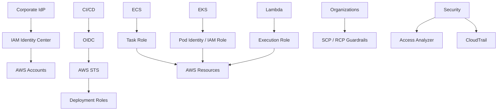

# 09- Quick Revision

## Overview

AWS IAM is the authorization system used to control who or what can access AWS resources.

For quick revision, think in this order:

```text
Who?
    ↓
How authenticated?
    ↓
What action?
    ↓
Which resource?
    ↓
Which account?
    ↓
What request context?
    ↓
Which policies apply?
    ↓
Explicit deny?
    ↓
Applicable allow?
```

The five IAM concepts that dominate senior interviews are:

```text
Identity
Policy
Role
STS
Authorization evaluation
```

The modern production model is:

```text
Humans
→ Federation / IAM Identity Center
→ Temporary credentials

Workloads
→ IAM roles
→ Temporary credentials

CI/CD
→ OIDC
→ Temporary role sessions

Cross-account
→ Resource policy or AssumeRole

Governance
→ SCP / RCP / Permissions Boundary

Analysis
→ Access Analyzer + CloudTrail
```

AWS currently recommends federation and temporary credentials for human identities, IAM roles with temporary credentials for workloads, least privilege, MFA, Access Analyzer, unused-access review, and permission guardrails. ([AWS IAM Security Best Practices](https://docs.aws.amazon.com/IAM/latest/UserGuide/best-practices.html))

---

## IAM Fundamentals

### Authentication vs Authorization

```text
Authentication
→ Who are you?

Authorization
→ What can you do?
```

Example:

```text
STS session
    ↓
Authenticated principal
    ↓
s3:GetObject on bucket/object
    ↓
Authorization decision
```

---

## IAM Entities

| Concept | Quick definition | Typical use |
|---|---|---|
| User | Long-lived IAM identity | Legacy / exceptional human access |
| Group | Collection of IAM users | Legacy user organization |
| Role | Assumable identity | Workloads, federation, cross-account |
| Principal | Identity making a request | User, role, session, service, federated identity |
| Resource | AWS object being accessed | S3 bucket, SQS queue, KMS key |
| Action | API operation | `s3:GetObject` |
| Permission | Authorization to perform an action on a resource | Allow `s3:GetObject` |

### Modern default

```text
Human
→ Federation / Identity Center

Workload
→ Role

CI/CD
→ OIDC + Role
```

---

## ARN Quick Reference

Typical ARN:

```text
arn:partition:service:region:account-id:resource
```

Examples:

```text
arn:aws:iam::123456789012:role/OrdersRole

arn:aws:s3:::orders-data

arn:aws:s3:::orders-data/*

arn:aws:lambda:ap-south-1:123456789012:function:orders-api
```

Remember:

```text
S3 bucket ARN
→ arn:aws:s3:::bucket

S3 object ARN
→ arn:aws:s3:::bucket/*
```

Many IAM bugs are simply incorrect resource ARNs.

---

## IAM Global vs Regional

IAM itself is a global service.

Other AWS services and resources can be regional.

Example:

```text
IAM role
→ Global

ECS cluster
→ Regional

S3 bucket
→ Global namespace with regional placement

Lambda function
→ Regional
```

Do not assume every AWS ARN contains a Region.

---

## IAM Policy Structure

Basic structure:

```json
{
  "Version": "2012-10-17",
  "Statement": [
    {
      "Sid": "ReadOrders",
      "Effect": "Allow",
      "Action": [
        "s3:GetObject"
      ],
      "Resource": "arn:aws:s3:::orders-data/*"
    }
  ]
}
```

Key fields:

| Field | Meaning |
|---|---|
| `Version` | Policy language version |
| `Statement` | One or more policy statements |
| `Sid` | Optional statement identifier |
| `Effect` | `Allow` or `Deny` |
| `Action` | AWS API action |
| `Resource` | Target resource |
| `Principal` | Who the statement applies to; used in relevant resource/trust policies |
| `Condition` | Context-based restriction |

---

## Identity-Based vs Resource-Based Policy

### Identity-based

Attached to:

```text
User
Group
Role
```

Answers:

```text
What can this identity do?
```

### Resource-based

Attached to supported resources.

Examples:

```text
S3 bucket policy
SQS queue policy
SNS topic policy
```

Answers:

```text
Which principals can access this resource?
```

### Quick comparison

| | Identity-based | Resource-based |
|---|---|---|
| Main subject | Identity | Resource |
| Uses `Principal` | No | Yes |
| Common use | Workload permissions | Resource sharing |
| Cross-account | Supported | Supported where service allows |
| Service support | Broad | Service-dependent |

AWS documents resource policies and cross-account roles as the primary IAM cross-account patterns, with role delegation available when a service does not support the required resource policy. ([AWS: Cross-account resource access](https://docs.aws.amazon.com/IAM/latest/UserGuide/access_policies-cross-account-resource-access.html))

---

## Managed vs Inline Policies

### AWS managed

```text
Maintained by AWS
```

### Customer managed

```text
Maintained by your organization
```

### Inline

```text
Embedded directly into one IAM entity
```

Production preference:

```text
Reusable permission
→ Customer-managed policy

One tightly coupled exception
→ Inline policy can be appropriate
```

Avoid large-scale inline-policy sprawl.

---

## Policy Evaluation

The simplest useful model is:

```text
Default
→ Deny

Applicable explicit Deny?
→ Deny

Applicable authorization path?
→ Allow

Otherwise
→ Deny
```

AWS evaluates applicable identity policies, resource policies, SCPs, RCPs, permissions boundaries, and session policies according to the request context and applicable policy model. ([AWS: Policy evaluation](https://docs.aws.amazon.com/IAM/latest/UserGuide/reference_policies_evaluation-logic.html))

### Critical rule

```text
Explicit Deny
>
Allow
```

---

## Implicit vs Explicit Deny

### Implicit deny

```text
No applicable Allow
```

Example:

```text
Role has no s3:GetObject permission
```

### Explicit deny

```json
{
  "Effect": "Deny",
  "Action": "s3:GetObject",
  "Resource": "*"
}
```

Adding another `Allow` does not override an applicable explicit deny.

---

## Important Policy Layers

| Policy type | Main purpose |
|---|---|
| Identity policy | Grant identity permissions |
| Resource policy | Grant resource access |
| Permissions boundary | Limit maximum identity permissions |
| SCP | Organization/account guardrail |
| RCP | Resource-oriented organization guardrail |
| Session policy | Limit a temporary session |

Permissions boundaries define the maximum permissions an IAM user or role can have through applicable identity-based permissions. ([AWS: Permissions boundaries](https://docs.aws.amazon.com/IAM/latest/UserGuide/access_policies_boundaries.html))

---

## Permissions Boundary

Think:

```text
Identity policy
    +
Permissions boundary
    ↓
Effective identity permissions
```

A boundary:

```text
Does grant permission? → No
Limits maximum permission? → Yes
```

Typical use:

```text
Allow developers to create roles
+
Prevent them from creating unrestricted admin roles
```

---

## SCP

SCP = Service Control Policy.

Think:

```text
Organization-level guardrail
```

Example:

```text
Production OU
→ Restrict unsupported Regions
```

Important:

```text
SCP grants permissions? → No
SCP limits available permissions? → Yes
```

AWS documents SCPs as maximum-permission guardrails for principals in member accounts. ([AWS: SCPs](https://docs.aws.amazon.com/organizations/latest/userguide/orgs_manage_policies_scps.html))

---

## RCP

RCP = Resource Control Policy.

Think:

```text
Organization-level resource guardrail
```

Quick distinction:

```text
SCP
→ Principal-oriented constraint

RCP
→ Resource-oriented constraint
```

RCPs complement SCPs and resource policies. ([AWS: RCPs](https://docs.aws.amazon.com/organizations/latest/userguide/orgs_manage_policies_rcps.html))

---

## IAM Roles

A role contains two important policy concepts:

```text
Trust policy
    ↓
Who can assume me?

Permission policy
    ↓
What can I do?
```

Typical role flow:

```text
Caller
    ↓
STS AssumeRole
    ↓
Role session
    ↓
Temporary credentials
```

---

## Trust Policy

Example:

```json
{
  "Version": "2012-10-17",
  "Statement": [
    {
      "Effect": "Allow",
      "Principal": {
        "AWS": "arn:aws:iam::111111111111:role/DeploymentRole"
      },
      "Action": "sts:AssumeRole"
    }
  ]
}
```

Think:

```text
Trust
→ Identity acquisition

Permission
→ Resource access
```

---

## Temporary Credentials

STS can issue:

```text
AccessKeyId
SecretAccessKey
SessionToken
Expiration
```

Temporary credentials are preferred for modern workload and workforce access because they reduce long-lived credential exposure. ([AWS IAM Security Best Practices](https://docs.aws.amazon.com/IAM/latest/UserGuide/best-practices.html))

Important:

```text
Temporary credentials
≠
Least privilege
```

A temporary AdministratorAccess session is still highly privileged.

---

## STS Quick Reference

| API | Purpose |
|---|---|
| `GetCallerIdentity` | Identify current principal |
| `AssumeRole` | Obtain temporary credentials for a role |
| `AssumeRoleWithWebIdentity` | Obtain credentials from a web identity token |
| `AssumeRoleWithSAML` | SAML federation |

### Identity check

```bash
aws sts get-caller-identity
```

This is usually the first IAM troubleshooting command.

---

## Session Duration

Standard role sessions can be configured up to the role's maximum session duration, subject to the requested duration and caller/context.

Current STS documentation allows role sessions from:

```text
15 minutes
→
Up to 12 hours
```

depending on the role configuration.

### Role chaining

```text
Role A
    ↓
Role B
```

Role chaining limits the CLI/API role session to:

```text
Maximum 1 hour
```

([AWS STS `AssumeRole`](https://docs.aws.amazon.com/STS/latest/APIReference/API_AssumeRole.html))

---

## ExternalId

Used primarily for third-party cross-account access.

Typical model:

```text
Vendor
    ↓
AssumeRole
    ↓
ExternalId condition
    ↓
Customer role
```

Main purpose:

```text
Confused-deputy mitigation
```

ExternalId is contextual information, not an access-key equivalent secret. ([AWS: External IDs](https://docs.aws.amazon.com/IAM/latest/UserGuide/id_roles_common-scenarios_third-party.html))

---

## Cross-Account Access

Two major patterns:

### Role-based

```text
Account A
    ↓
AssumeRole
    ↓
Account B role
    ↓
Resource
```

### Resource-based

```text
Account A principal
    ↓
Account B resource policy
    ↓
Resource
```

Use a role when:

```text
Service does not support resource policy
Multiple resources/services are involved
Reusable target identity is useful
```

Use resource policies when:

```text
The service supports them
Direct resource sharing is appropriate
```

([AWS: Cross-account access](https://docs.aws.amazon.com/IAM/latest/UserGuide/access_policies-cross-account-resource-access.html))

---

## Cross-Account Mental Model

If:

```text
Account A
→ Principal
```

needs:

```text
Account B
→ Resource
```

ask:

```text
Who is trusted?
Can the principal assume the target role?
What permissions does the target role have?
Does the resource policy participate?
Do SCP/RCP/boundary/session policies constrain access?
```

---

## Human Identity

Modern workforce pattern:

```text
Corporate IdP
    ↓
IAM Identity Center
    ↓
Permission set
    ↓
AWS account
    ↓
Temporary session
```

Prefer:

```text
Federation
+
Temporary credentials
+
MFA
```

over:

```text
IAM user
+
Long-lived access key
```

AWS recommends centralized federation and IAM Identity Center for workforce access. ([AWS IAM Security Best Practices](https://docs.aws.amazon.com/IAM/latest/UserGuide/best-practices.html))

---

## Workload Identity

### EC2

```text
Instance
→ IAM role / instance profile
```

### ECS

```text
Application
→ Task role

ECS infrastructure
→ Execution role
```

### Lambda

```text
Function
→ Execution role
```

### EKS

```text
Pod
→ Pod Identity / supported workload identity
→ IAM role
```

### CI/CD

```text
CI provider
→ OIDC
→ IAM role
```

Never bake AWS access keys into:

```text
Docker image
Git repository
Source code
Kubernetes Secret
CI pipeline file
```

when a role/federation model is available.

---

## ECS Task Role vs Execution Role

| Role | Used by |
|---|---|
| Task role | Application container |
| Execution role | ECS/Fargate infrastructure |

FastAPI example:

```text
FastAPI
    ↓
boto3
    ↓
ECS task role
    ↓
S3 / SQS / Secrets Manager
```

Do not grant application permissions only to the execution role.

---

## EKS Identity

Think:

```text
Kubernetes ServiceAccount
    ↓
EKS Pod Identity
    ↓
IAM role
    ↓
AWS resource
```

Separate:

```text
Kubernetes RBAC
```

from:

```text
AWS IAM
```

They solve different authorization problems.

AWS provides EKS-specific workload identity mechanisms and recommends least-privilege IAM roles for workloads. ([AWS EKS IAM best practices](https://docs.aws.amazon.com/eks/latest/best-practices/identity-and-access-management.html))

---

## CI/CD Identity

Preferred model:

```text
GitHub / GitLab / CI provider
    ↓
OIDC token
    ↓
AWS STS
    ↓
Deployment role
    ↓
AWS resources
```

Restrict:

```text
Repository
Branch
Environment
Audience
Subject
Account
Actions
Resources
PassRole
```

Avoid permanent AWS access keys in CI where federation is supported.

---

## Least Privilege

Least privilege has multiple dimensions:

```text
Action
Resource
Principal
Context
Credential lifetime
```

Bad:

```json
{
  "Effect": "Allow",
  "Action": "*",
  "Resource": "*"
}
```

Better:

```json
{
  "Effect": "Allow",
  "Action": "s3:GetObject",
  "Resource": "arn:aws:s3:::orders-data/reports/*"
}
```

Then consider whether conditions can narrow access further.

---

## ABAC

ABAC = Attribute-Based Access Control.

Example:

```text
Principal tag:
Team=payments

Resource tag:
Team=payments
```

Useful when:

```text
Many resources
Dynamic infrastructure
Reliable tagging
Metadata-driven ownership
```

Risk:

```text
Authorization-sensitive tag modification
```

If a tag controls access, tag permissions are security-sensitive.

---

## RBAC vs ABAC

| | RBAC | ABAC |
|---|---|---|
| Input | Role/group | Attributes/tags |
| Simplicity | Usually higher | Usually lower |
| Metadata dependency | Low | High |
| Large dynamic fleets | Moderate | Often useful |
| Main risk | Role explosion | Tag governance |

ABAC is not automatically superior; it moves complexity into attribute governance.

---

## `iam:PassRole`

Critical privilege-escalation concept.

Think:

```text
DeploymentRole
    ↓
Create Lambda
    ↓
PassRole
    ↓
Highly privileged execution role
```

Therefore:

```text
iam:PassRole
Resource: *
```

can be dangerous.

Prefer:

```text
iam:PassRole
→ Approved execution-role ARNs only
```

---

## Privilege Escalation

Look for combinations such as:

```text
iam:CreateRole
iam:PutRolePolicy
iam:AttachRolePolicy
iam:PassRole
lambda:CreateFunction
cloudformation:CreateStack
ec2:RunInstances
```

Senior question:

```text
Can this principal cause a resource to execute
under a more privileged role?
```

Do not inspect IAM actions in isolation.

---

## Policy Conditions

Common condition keys:

```text
aws:PrincipalArn
aws:SourceArn
aws:SourceAccount
aws:PrincipalOrgID
aws:RequestedRegion
aws:SourceIp
aws:MultiFactorAuthPresent
aws:CurrentTime
```

Conditions can reduce broad permissions.

They can also increase policy complexity.

Production rule:

```text
Use conditions where they express a real security boundary.
Do not add conditions simply to make policies look sophisticated.
```

---

## IAM and AWS Service Integrations

### S3

```text
s3:GetObject
→ object ARN

s3:ListBucket
→ bucket ARN
```

### SQS

```text
sqs:ReceiveMessage
sqs:DeleteMessage
sqs:GetQueueAttributes
```

### SNS

```text
sns:Publish
```

### Secrets Manager

```text
secretsmanager:GetSecretValue
```

### KMS

```text
kms:Decrypt
kms:Encrypt
```

KMS introduces additional authorization considerations such as key policies and grants.

---

## S3 Quick Trap

These are not equivalent:

```text
s3:ListBucket
→ arn:aws:s3:::orders-data
```

and:

```text
s3:GetObject
→ arn:aws:s3:::orders-data/*
```

Always match:

```text
Action
+
Resource type
```

---

## KMS Quick Trap

```text
S3 permission
```

does not automatically mean:

```text
KMS permission
```

For SSE-KMS, investigate:

```text
S3 authorization
+
KMS authorization
```

Potential controls include:

```text
IAM policy
KMS key policy
Grant
SCP/RCP
Encryption context
```

---

## Secrets Manager Quick Trap

For:

```text
secretsmanager:GetSecretValue
```

check:

```text
Identity policy
Secret resource policy if present
SCP/RCP
Permissions boundary
KMS if relevant
Secret ARN
```

---

## CloudFormation Quick Trap

Deployments can fail because of:

```text
iam:PassRole
```

even when the caller can otherwise create the resource.

Separate:

```text
Create/update resource
```

from:

```text
Pass execution role
```

---

## IAM CLI Quick Reference

### Current identity

```bash
aws sts get-caller-identity
```

### Credential source

```bash
aws configure list
```

### Profiles

```bash
aws configure list-profiles
```

### Role

```bash
aws iam get-role \
    --role-name OrdersRole
```

### Attached policies

```bash
aws iam list-attached-role-policies \
    --role-name OrdersRole
```

### Inline policies

```bash
aws iam list-role-policies \
    --role-name OrdersRole
```

### Policy versions

```bash
aws iam list-policy-versions \
    --policy-arn arn:aws:iam::123456789012:policy/OrdersPolicy
```

### Simulate policy

```bash
aws iam simulate-principal-policy \
    --policy-source-arn arn:aws:iam::123456789012:role/OrdersRole \
    --action-names s3:GetObject \
    --resource-arns arn:aws:s3:::orders-data/config.json
```

### Validate policy

```bash
aws accessanalyzer validate-policy \
    --policy-document file://policy.json \
    --policy-type IDENTITY_POLICY
```

---

## IAM Troubleshooting Flow

Use:

```text
1. aws configure list
2. aws sts get-caller-identity
3. Confirm account
4. Confirm role/session
5. Identify action
6. Identify resource ARN
7. Check explicit deny
8. Check identity policy
9. Check resource policy
10. Check boundary
11. Check SCP/RCP
12. Check session policy
13. Check conditions
14. Check service-specific authorization
15. Use simulator
16. Use Access Analyzer
17. Check CloudTrail
18. Apply smallest safe fix
```

---

## Common AWS IAM Errors

| Error | First thought |
|---|---|
| `Unable to locate credentials` | Credential provider/configuration |
| `ExpiredToken` | Temporary credentials expired |
| `InvalidClientTokenId` | Invalid/stale credentials |
| `InvalidAccessKeyId` | Key/profile/environment problem |
| `AccessDenied` | Authorization path |
| `UnauthorizedOperation` | Authorization failure |
| `MalformedPolicyDocument` | Policy syntax/structure |
| `NoSuchEntity` | Wrong/missing IAM entity |
| `EntityAlreadyExists` | Resource already exists |
| `DeleteConflict` | IAM dependency exists |
| `UnmodifiableEntity` | Service-linked/protected entity |
| `SignatureDoesNotMatch` | Signing/Region/time/request mismatch |

---

## AccessDenied Troubleshooting

When you see:

```text
AccessDenied
```

do not immediately add permissions.

Ask:

```text
Who?
What?
Where?
Which credentials?
Which account?
Which policy?
Which condition?
Which boundary?
Which organization control?
Which resource policy?
Which service dependency?
```

The first command should usually be:

```bash
aws sts get-caller-identity
```

---

## `GetCallerIdentity`

Use:

```bash
aws sts get-caller-identity
```

It tells you the current:

```text
Account
ARN
UserId
```

Example:

```json
{
  "UserId": "AROAEXAMPLE:session",
  "Account": "123456789012",
  "Arn": "arn:aws:sts::123456789012:assumed-role/OrdersRole/session"
}
```

This is one of the most useful IAM debugging commands.

---

## CloudTrail

Think:

```text
IAM policy
→ What should be allowed?

CloudTrail
→ What actually happened?
```

Useful operations to monitor:

```text
AssumeRole
AssumeRoleWithWebIdentity
PassRole
CreateRole
DeleteRole
UpdateAssumeRolePolicy
AttachRolePolicy
DetachRolePolicy
PutRolePolicy
CreatePolicyVersion
CreateAccessKey
```

CloudTrail is essential for IAM incident investigation.

---

## Access Analyzer

Use Access Analyzer for:

```text
External access
Internal access analysis
Unused access
Policy validation
Custom policy checks
Policy generation
```

It complements CloudTrail.

Think:

```text
CloudTrail
→ Observed activity

Access Analyzer
→ Access analysis / policy analysis
```

---

## Policy Simulator

Use when asking:

```text
Would this principal be allowed
to perform this action on this resource?
```

Example:

```bash
aws iam simulate-principal-policy \
    --policy-source-arn arn:aws:iam::123456789012:role/OrdersRole \
    --action-names s3:GetObject \
    --resource-arns arn:aws:s3:::orders-data/config.json
```

Important:

```text
Simulation result
≠
Guaranteed production result
```

Always verify the live identity, resource, context, and service behavior.

---

## Credential Exposure Response

If an access key leaks:

```text
1. Revoke/disable key
2. Search CloudTrail
3. Assess impact
4. Rotate dependencies
5. Remove credential
6. Move workload to role/federation
7. Review policy scope
8. Investigate root cause
```

Removing the key from Git is not enough.

The credential must be invalidated.

---

## Production IAM Architecture

A common backend architecture:



Principles:

```text
Central workforce identity
+
Local workload identity
+
Temporary credentials
+
Explicit cross-account trust
+
Least privilege
+
Organization guardrails
+
Continuous audit
```

---

## Multi-Account Quick Model

Typical structure:

```text
AWS Organization
├── Management
├── Security
├── Log Archive
├── Network
├── Shared Services
├── Non-Production
└── Production
```

Purpose:

```text
Management
→ Organization governance

Security
→ Security operations

Log Archive
→ Central audit

Network
→ Shared networking

Shared Services
→ Platform resources

Workload accounts
→ Application isolation
```

The exact topology should follow actual security, ownership, and operational requirements.

---

## Cross-Account Role Quick Model

```text
Account A
    Principal
       │
       │ sts:AssumeRole
       ▼
Account B
    TargetRole
       │
       ▼
Target Resource
```

Requirements may include:

```text
Source permission to assume role
+
Target trust policy
+
Target role permissions
+
Organization/resource controls
```

For third-party integrations:

```text
ExternalId
```

may be part of the trust condition.

---

## Cross-Account Resource Policy Quick Model

```text
Account A Principal
       │
       ▼
Account B Resource Policy
       │
       ▼
Resource
```

Use only where the target service supports the required resource-based authorization pattern.

---

## Human vs Workload vs CI/CD Identity

| Identity | Preferred pattern |
|---|---|
| Employee | Federation / IAM Identity Center |
| Administrator | Federation + privileged role |
| ECS application | Task role |
| EC2 application | Instance role |
| Lambda | Execution role |
| EKS pod | Pod Identity / workload role |
| CI/CD | OIDC + deployment role |
| Third-party vendor | Cross-account role + ExternalId where appropriate |
| Legacy integration | Long-lived key only when unavoidable |

---

## Senior Comparison Matrix

| Compare | Key distinction |
|---|---|
| User vs Role | Long-lived identity vs assumable identity |
| Role vs Access Key | Authorization identity vs credential |
| Trust vs Permission policy | Who can assume vs what can be done |
| Identity vs Resource policy | Identity permissions vs resource sharing |
| Boundary vs SCP | Principal guardrail vs organization guardrail |
| SCP vs RCP | Principal-oriented vs resource-oriented |
| RBAC vs ABAC | Role-driven vs attribute-driven |
| AssumeRole vs WebIdentity | AWS principal vs web/OIDC identity source |
| Task role vs Execution role | Application vs ECS infrastructure |
| Identity Center vs IAM user | Central workforce federation vs IAM user |
| Resource policy vs Role | Direct sharing vs target identity |
| Temporary vs Long-lived credentials | Short-lived vs persistent credential lifetime |

---

## Interview Traps

### Trap: "Just use AdministratorAccess"

Correct reasoning:

```text
Find exact missing permission
or blocking policy.
```

### Trap: "SCP grants permissions"

Correct:

```text
SCP limits maximum available permissions.
```

### Trap: "Boundary grants permissions"

Correct:

```text
Boundary limits maximum permissions.
```

### Trap: "Trust policy grants S3 access"

Correct:

```text
Trust controls role assumption.
Permission policy controls role authorization.
```

### Trap: "MFA replaces least privilege"

Correct:

```text
MFA protects authentication.
Least privilege limits authorization.
```

### Trap: "Temporary credentials solve IAM security"

Correct:

```text
Temporary credentials reduce credential lifetime,
not excessive permissions.
```

### Trap: "Cross-account always requires AssumeRole"

Correct:

```text
Role or resource-based pattern depending on service.
```

### Trap: "More accounts always mean more security"

Correct:

```text
More accounts improve isolation but increase operational complexity.
```

### Trap: "ABAC is always better"

Correct:

```text
ABAC is useful when attributes are trustworthy and well governed.
```

### Trap: "Unused means delete"

Correct:

```text
Check DR, break-glass, migration, and rare operational uses.
```

---

## Senior-Level One-Liners

```text
IAM role
→ Assumable identity.

Trust policy
→ Who can assume the role.

Permission policy
→ What the identity can do.

STS
→ Temporary credential/session service.

AssumeRole
→ Obtain temporary credentials for a role.

GetCallerIdentity
→ Verify current AWS identity.

Explicit deny
→ Overrides an applicable allow.

Implicit deny
→ No applicable allow.

Permissions boundary
→ Maximum permissions for a user/role.

SCP
→ Organization-level principal guardrail.

RCP
→ Organization-level resource guardrail.

Resource policy
→ Resource-owned authorization policy.

ExternalId
→ Third-party confused-deputy protection mechanism.

ABAC
→ Authorization using attributes.

iam:PassRole
→ Permission to pass a role to an AWS service.

CloudTrail
→ Runtime AWS API evidence.

Access Analyzer
→ Access and policy analysis.

IAM Identity Center
→ Central workforce access management.

OIDC
→ Federation mechanism for temporary workload credentials.
```

---

## Production Pitfalls

| Pitfall | Why it is dangerous |
|---|---|
| Access keys in source | Credential exposure |
| Access keys in Docker image | Credential propagation |
| Shared admin role | Large blast radius |
| `iam:PassRole` on `*` | Privilege escalation |
| Broad trust policy | Excessive delegation |
| `Principal: "*"` | Potential public/external exposure |
| Overly broad S3 permissions | Data exposure |
| Shared workload roles | Poor isolation |
| No MFA for sensitive human access | Weaker authentication |
| No CloudTrail review | Poor incident visibility |
| No ownership | Permissions become permanent |
| No IaC | Configuration drift |
| No DR IAM testing | Recovery failure |
| Blind wildcard permissions | Excessive access |
| Complex ABAC without tag governance | Authorization instability |

---

## Senior Troubleshooting Formula

When an AWS request fails:

```text
WHO
→ Caller identity

HOW
→ Credential source

WHAT
→ Action

WHERE
→ Resource

ACCOUNT
→ Source/target account

CONTEXT
→ Conditions

POLICIES
→ Identity + resource + session

GUARDRAILS
→ Boundary + SCP + RCP

SERVICE
→ Service-specific controls

EVIDENCE
→ CloudTrail / simulator / Access Analyzer

FIX
→ Smallest safe change
```

---

## Senior Architecture Formula

For a production AWS backend:

```text
Human
→ Federation

Workload
→ Role

CI/CD
→ OIDC

Cross-account
→ Role or resource policy

Organization
→ SCP / RCP

Delegated IAM
→ Permissions Boundary

Least privilege
→ Narrow actions/resources/conditions

Analysis
→ Access Analyzer

Audit
→ CloudTrail

Emergency
→ Break-glass

Recovery
→ Tested IAM path
```

---

## 30-Second Interview Revision

If asked:

> "How do you approach IAM?"

Answer:

```text
I start with the principal and credential source,
then identify the action, resource, account, and request context.
I inspect the applicable identity and resource policies,
then check explicit denies, permissions boundaries,
SCPs/RCPs, session policies, and service-specific controls.
For production, I use temporary credentials, least privilege,
federation for humans, workload roles for applications,
OIDC for CI/CD, and CloudTrail plus Access Analyzer for governance.
```

---

## 2-Minute Interview Revision

```text
Human access
→ IAM Identity Center / federation + MFA

Workload access
→ Temporary IAM role credentials

CI/CD
→ OIDC + deployment role

Cross-account
→ Resource policy when appropriate,
   otherwise AssumeRole

Policy evaluation
→ Default deny
→ Explicit deny wins
→ Applicable allow required

Guardrails
→ Permissions Boundary
→ SCP
→ RCP
→ Session policy

Security
→ Least privilege
→ No hard-coded keys
→ Access Analyzer
→ CloudTrail
→ Access reviews

Troubleshooting
→ GetCallerIdentity
→ Identify action/resource
→ Trace all policy layers
→ Validate with evidence
```

---

## 5-Minute Senior Revision

Be able to explain these without notes:

```text
Authentication vs authorization
Users vs roles
Trust vs permission policies
STS and temporary credentials
AssumeRole
Role chaining
ExternalId
Identity vs resource policies
Policy evaluation
Implicit vs explicit deny
Permissions boundaries
SCPs
RCPs
Session policies
ABAC
Cross-account access
IAM Identity Center
Workload identity
ECS task vs execution role
EKS Pod Identity
Lambda execution role
OIDC CI/CD
iam:PassRole
Privilege escalation
Access Analyzer
Policy Simulator
CloudTrail
S3 authorization
KMS authorization
Secrets Manager authorization
Multi-account architecture
Break-glass access
IAM incident response
DR IAM design
```

---

## Key Commands

```bash
# Current AWS identity
aws sts get-caller-identity

# Credential/configuration source
aws configure list

# Profiles
aws configure list-profiles

# Inspect role
aws iam get-role --role-name OrdersRole

# Attached policies
aws iam list-attached-role-policies --role-name OrdersRole

# Inline policies
aws iam list-role-policies --role-name OrdersRole

# Policy versions
aws iam list-policy-versions \
    --policy-arn arn:aws:iam::123456789012:policy/OrdersPolicy

# Validate policy
aws accessanalyzer validate-policy \
    --policy-document file://policy.json \
    --policy-type IDENTITY_POLICY

# Simulate principal
aws iam simulate-principal-policy \
    --policy-source-arn arn:aws:iam::123456789012:role/OrdersRole \
    --action-names s3:GetObject \
    --resource-arns arn:aws:s3:::orders-data/config.json
```

---

## AWS Documentation Links

- [IAM Security Best Practices](https://docs.aws.amazon.com/IAM/latest/UserGuide/best-practices.html)
- [IAM Policy Evaluation Logic](https://docs.aws.amazon.com/IAM/latest/UserGuide/reference_policies_evaluation-logic.html)
- [IAM Enforcement Logic](https://docs.aws.amazon.com/IAM/latest/UserGuide/reference_policies_evaluation-logic_policy-eval-denyallow.html)
- [Permissions Boundaries](https://docs.aws.amazon.com/IAM/latest/UserGuide/access_policies_boundaries.html)
- [Cross-Account Resource Access](https://docs.aws.amazon.com/IAM/latest/UserGuide/access_policies-cross-account-resource-access.html)
- [IAM Access Analyzer](https://docs.aws.amazon.com/IAM/latest/UserGuide/what-is-access-analyzer.html)
- [IAM Access Analyzer Policy Validation](https://docs.aws.amazon.com/IAM/latest/UserGuide/access-analyzer-policy-validation.html)
- [IAM Policy Simulator](https://docs.aws.amazon.com/IAM/latest/UserGuide/access_policies_testing-policies.html)
- [Service Control Policies](https://docs.aws.amazon.com/organizations/latest/userguide/orgs_manage_policies_scps.html)
- [Resource Control Policies](https://docs.aws.amazon.com/organizations/latest/userguide/orgs_manage_policies_rcps.html)
- [AWS STS AssumeRole](https://docs.aws.amazon.com/STS/latest/APIReference/API_AssumeRole.html)
- [Third-Party Access and External IDs](https://docs.aws.amazon.com/IAM/latest/UserGuide/id_roles_common-scenarios_third-party.html)
- [ECS Task IAM Role](https://docs.aws.amazon.com/AmazonECS/latest/developerguide/task-iam-roles.html)
- [ECS Task Execution IAM Role](https://docs.aws.amazon.com/AmazonECS/latest/developerguide/task_execution_IAM_role.html)
- [EKS IAM Best Practices](https://docs.aws.amazon.com/eks/latest/best-practices/identity-and-access-management.html)
- [AWS Data Perimeters](https://docs.aws.amazon.com/IAM/latest/UserGuide/access_policies_data-perimeters.html)
- [AWS Root User Best Practices](https://docs.aws.amazon.com/IAM/latest/UserGuide/root-user-best-practices.html)

## Key Takeaways

- **Think from the request outward:** identify the caller, credentials, action, resource, account, context, and applicable policy layers before diagnosing an IAM problem.
- **Prefer temporary identities:** use federation for humans, workload roles for applications, and OIDC for CI/CD; avoid long-lived access keys when a role-based alternative exists.
- **Remember the major guardrails:** permissions boundaries constrain principals, SCPs constrain organization-level principal permissions, RCPs constrain resource permissions, and explicit denies override applicable allows.
- **For production troubleshooting, prove the identity first:** `aws sts get-caller-identity`, policy analysis, Access Analyzer, and CloudTrail provide the evidence needed to avoid blind permission broadening.
- **The senior IAM goal is least privilege with operational scalability:** narrow authorization boundaries, explicit trust, auditable changes, lifecycle management, and tested recovery paths.