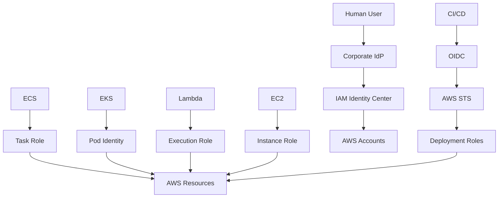

# README

## Overview

This folder contains the AWS IAM interview-preparation material for the Backend Engineering Playbook.

The content is structured to progress from IAM fundamentals to senior-level authorization reasoning:

```text
Core Concepts
    ↓
Identity and Roles
    ↓
Policies and Authorization
    ↓
Security and Governance
    ↓
Troubleshooting
    ↓
Architecture and Cross-Account Design
    ↓
Comparison and Tradeoffs
    ↓
Senior-Level Scenarios
    ↓
Quick Revision
```

The emphasis is on practical AWS IAM reasoning rather than isolated definition memorization.

The central mental model used throughout the folder is:

```text
Principal
    ↓
Credential source
    ↓
Account
    ↓
Action
    ↓
Resource
    ↓
Request context
    ↓
Applicable policies
    ↓
Explicit deny?
    ↓
Applicable allow?
    ↓
Service-specific authorization
    ↓
Final decision
```

AWS evaluates applicable identity-based policies, resource-based policies, permissions boundaries, Organizations SCPs/RCPs, and session policies according to the request context and policy type. An applicable explicit deny overrides an allow. ([AWS: Processing the request context](https://docs.aws.amazon.com/IAM/latest/UserGuide/reference_policies_evaluation-logic_policy-eval-reqcontext.html), [AWS: Enforcement logic](https://docs.aws.amazon.com/IAM/latest/UserGuide/reference_policies_evaluation-logic_policy-eval-denyallow.html))

---

## Navigation

| # | File | Description |
|---|---|---|
| 01 | [01- Core IAM Questions](./01-%20Core%20IAM%20Questions.md) | IAM fundamentals, authentication vs authorization, principals, roles, policies, STS, and core concepts |
| 02 | [02- Identity and Role Questions](./02-%20Identity%20and%20Role%20Questions.md) | Users, roles, trust policies, role sessions, AssumeRole, workload identity, and instance profiles |
| 03 | [03- Policy and Authorization Questions](./03-%20Policy%20and%20Authorization%20Questions.md) | Policy structure, evaluation logic, resource policies, permission boundaries, SCPs, and conditions |
| 04 | [04- Security and Governance Questions](./04-%20Security%20and%20Governance%20Questions.md) | IAM security, least privilege, MFA, access keys, Access Analyzer, governance, and multi-account controls |
| 05 | [05- Troubleshooting Scenarios](./05-%20Troubleshooting%20Scenarios.md) | AccessDenied, credential failures, AssumeRole errors, CLI issues, and service-specific authorization failures |
| 06 | [06- Architecture and Cross-Account Scenarios](./06-%20Architecture%20and%20Cross-Account%20Scenarios.md) | Multi-account IAM, cross-account roles, workforce and workload identity architecture, and guardrails |
| 07 | [07- Comparison and Tradeoff Questions](./07-%20Comparison%20and%20Tradeoff%20Questions.md) | IAM design decisions, architectural tradeoffs, and when to choose one IAM mechanism over another |
| 08 | [08- Senior-Level Questions and Interview Traps](./08-%20Senior-Level%20Questions%20and%20Interview%20Traps.md) | Deep policy reasoning, privilege escalation, production architecture, and common interview traps |
| 09 | [09- Quick Revision](./09-%20Quick%20Revision.md) | Condensed IAM revision covering mental models, commands, comparisons, and senior-level scenarios |

---

## IAM Interview Learning Path

The recommended progression is:

```text
01- Core IAM Questions
        ↓
02- Identity and Role Questions
        ↓
03- Policy and Authorization Questions
        ↓
04- Security and Governance Questions
        ↓
05- Troubleshooting Scenarios
        ↓
06- Architecture and Cross-Account Scenarios
        ↓
07- Comparison and Tradeoff Questions
        ↓
08- Senior-Level Questions and Interview Traps
        ↓
09- Quick Revision
```

The first four files establish the concepts.

The next four files focus on applying those concepts to production systems and senior-level interview scenarios.

The final file is intended for rapid revision immediately before an interview.

---

## Folder Contents

| File | Focus | Primary level |
|---|---|---|
| `01- Core IAM Questions.md` | IAM fundamentals, policies, roles, STS, core concepts | Intermediate |
| `02- Identity and Role Questions.md` | Users, roles, trust policies, role sessions, workload identity | Intermediate → Senior |
| `03- Policy and Authorization Questions.md` | Policy structure, evaluation, boundaries, SCPs, conditions | Intermediate → Senior |
| `04- Security and Governance Questions.md` | IAM security, least privilege, MFA, Access Analyzer, governance | Senior |
| `05- Troubleshooting Scenarios.md` | AccessDenied, credentials, AssumeRole, CLI, service-specific failures | Senior |
| `06- Architecture and Cross-Account Scenarios.md` | Multi-account IAM, cross-account roles, workforce and workload architecture | Senior |
| `07- Comparison and Tradeoff Questions.md` | IAM design decisions and architecture tradeoffs | Senior |
| `08- Senior-Level Questions and Interview Traps.md` | Deep reasoning, privilege escalation, production architecture, interview traps | Senior |
| `09- Quick Revision.md` | Condensed IAM revision, commands, traps, mental models | All levels |

---

## File Navigation

### Core Concepts

[01- Core IAM Questions.md](./01-%20Core%20IAM%20Questions.md)

Covers the IAM fundamentals required before moving into deeper interview questions:

```text
Authentication vs authorization
IAM users
IAM groups
IAM roles
Principals
Resources
Actions
Permissions
ARNs
IAM policies
STS
Temporary credentials
Basic policy evaluation
```

Start here if IAM concepts are not yet fully internalized.

---

### Identity and Roles

[02- Identity and Role Questions.md](./02-%20Identity%20and%20Role%20Questions.md)

Focuses on the identity model:

```text
IAM users
IAM groups
IAM roles
Trust policies
Permission policies
AssumeRole
Role sessions
Role chaining
ExternalId
Instance profiles
Service roles
Service-linked roles
Human identities
Workload identities
```

This file is particularly relevant for:

```text
EC2
ECS
Lambda
EKS
CI/CD
Cross-account workloads
```

---

### Policies and Authorization

[03- Policy and Authorization Questions.md](./03-%20Policy%20and%20Authorization%20Questions.md)

Focuses on the core authorization engine:

```text
Policy JSON
Effect
Action
Resource
Principal
Condition
Policy variables
Wildcards
Identity policies
Resource policies
Managed policies
Inline policies
Session policies
Implicit deny
Explicit deny
Explicit allow
Permissions boundaries
SCPs
RCPs
```

This is one of the most important files for understanding why an AWS request is allowed or denied.

---

### Security and Governance

[04- Security and Governance Questions.md](./04-%20Security%20and%20Governance%20Questions.md)

Focuses on production IAM security:

```text
Root account
MFA
Access keys
Credential exposure
Least privilege
Temporary credentials
Access Analyzer
Privilege escalation
Permissions boundaries
SCPs
ABAC
Access reviews
Multi-account governance
CI/CD security
Break-glass access
```

Use this file when preparing for security-focused interview questions.

---

### Troubleshooting

[05- Troubleshooting Scenarios.md](./05-%20Troubleshooting%20Scenarios.md)

Focuses on diagnosing IAM failures systematically.

Key scenarios include:

```text
AccessDenied
ExpiredToken
InvalidClientTokenId
InvalidAccessKeyId
SignatureDoesNotMatch
AssumeRole failures
Trust policy failures
Permissions boundary failures
SCP failures
Resource policy failures
Credential/profile issues
ECS task-role issues
EKS workload-identity issues
Lambda role issues
S3 authorization
KMS authorization
Secrets Manager authorization
iam:PassRole
CloudTrail investigation
Policy Simulator
Access Analyzer
```

Core troubleshooting pattern:

```text
Verify identity
    ↓
Identify action/resource
    ↓
Inspect policy layers
    ↓
Check explicit deny
    ↓
Check conditions and guardrails
    ↓
Validate with evidence
    ↓
Apply smallest safe fix
```

---

### Architecture and Cross-Account

[06- Architecture and Cross-Account Scenarios.md](./06-%20Architecture%20and%20Cross-Account%20Scenarios.md)

Focuses on production IAM architecture:

```text
AWS Organizations
Multi-account design
IAM Identity Center
Workforce identity
Workload identity
Cross-account roles
Resource policies
ExternalId
Shared services
Security accounts
Network accounts
CI/CD accounts
Production isolation
SCP/RCP guardrails
Disaster recovery
Break-glass access
```

This file connects IAM concepts to real backend architecture.

---

### Comparison and Tradeoffs

[07- Comparison and Tradeoff Questions.md](./07-%20Comparison%20and%20Tradeoff%20Questions.md)

Focuses on questions that ask:

```text
When would you choose A over B?
What are the tradeoffs?
What changes at scale?
What is the security impact?
What is the operational cost?
```

Key comparisons include:

```text
IAM user vs IAM role
IAM role vs access key
Trust policy vs permission policy
Identity policy vs resource policy
Resource policy vs cross-account role
Permissions boundary vs SCP
SCP vs RCP
RBAC vs ABAC
AssumeRole vs web identity
OIDC vs access keys
Task role vs execution role
Single account vs multi-account
Shared role vs dedicated roles
Centralized vs decentralized IAM
```

The goal is to develop conditional architectural reasoning rather than memorized preferences.

---

### Senior-Level Questions and Interview Traps

[08- Senior-Level Questions and Interview Traps.md](./08-%20Senior-Level%20Questions%20and%20Interview%20Traps.md)

This is the deepest interview-oriented file in the folder.

It focuses on:

```text
Policy evaluation
Privilege escalation
iam:PassRole
Cross-account authorization
ABAC
SCP/RCP
Permissions boundaries
IAM Identity Center
OIDC
Workload identity
Microservices
ECS
EKS
Lambda
Django/FastAPI
Celery
KMS
Secrets Manager
CloudTrail
Access Analyzer
IAM as code
IAM drift
DR
Break-glass access
Production incidents
```

It also highlights common interview traps such as:

```text
"Just add AdministratorAccess."
"SCP grants permissions."
"Trust policies grant resource access."
"Temporary credentials solve IAM security."
"ABAC is always better."
"More accounts are always better."
"Policy Simulator proves production access."
```

Use this file after completing the preceding topics.

---

### Quick Revision

[09- Quick Revision.md](./09-%20Quick%20Revision.md)

This is the condensed revision sheet.

Use it for:

```text
Interview day revision
Last-minute preparation
Rapid concept recall
CLI command review
IAM troubleshooting recall
Senior-level mental models
Interview traps
```

It intentionally compresses the material into:

```text
Definitions
Mental models
Comparison tables
Commands
Troubleshooting flow
Architecture patterns
Interview one-liners
```

---

## Topic Coverage Map

| IAM area | Primary file |
|---|---|
| IAM fundamentals | `01- Core IAM Questions.md` |
| Users and groups | `01- Core IAM Questions.md` |
| Roles | `02- Identity and Role Questions.md` |
| Trust policies | `02- Identity and Role Questions.md` |
| STS | `02- Identity and Role Questions.md` |
| Temporary credentials | `02- Identity and Role Questions.md` |
| Policy structure | `03- Policy and Authorization Questions.md` |
| Policy evaluation | `03- Policy and Authorization Questions.md` |
| Resource policies | `03- Policy and Authorization Questions.md` |
| Permission boundaries | `03- Policy and Authorization Questions.md` |
| SCPs | `03- Policy and Authorization Questions.md` |
| RCPs | `03- Policy and Authorization Questions.md` |
| IAM security | `04- Security and Governance Questions.md` |
| Least privilege | `04- Security and Governance Questions.md` |
| MFA | `04- Security and Governance Questions.md` |
| Access Analyzer | `04- Security and Governance Questions.md` |
| Privilege escalation | `04- Security and Governance Questions.md` |
| Troubleshooting | `05- Troubleshooting Scenarios.md` |
| AccessDenied | `05- Troubleshooting Scenarios.md` |
| CLI diagnostics | `05- Troubleshooting Scenarios.md` |
| CloudTrail | `05- Troubleshooting Scenarios.md` |
| Cross-account | `06- Architecture and Cross-Account Scenarios.md` |
| Multi-account | `06- Architecture and Cross-Account Scenarios.md` |
| IAM Identity Center | `06- Architecture and Cross-Account Scenarios.md` |
| Workload identity | `06- Architecture and Cross-Account Scenarios.md` |
| CI/CD IAM | `06- Architecture and Cross-Account Scenarios.md` |
| Architecture tradeoffs | `07- Comparison and Tradeoff Questions.md` |
| IAM comparisons | `07- Comparison and Tradeoff Questions.md` |
| Senior interview scenarios | `08- Senior-Level Questions and Interview Traps.md` |
| Interview traps | `08- Senior-Level Questions and Interview Traps.md` |
| Rapid revision | `09- Quick Revision.md` |

---

## Core Mental Models

### Identity Model

```text
Human
    → Federation / Identity Center
    → Temporary session

Workload
    → IAM role
    → Temporary credentials

CI/CD
    → OIDC
    → STS
    → Deployment role

Third party
    → Cross-account role
    → ExternalId where appropriate
```

---

### Authorization Model

```text
Principal
    ↓
Action
    ↓
Resource
    ↓
Request context
    ↓
Applicable policies
    ↓
Explicit deny?
    ↓
Applicable allow?
    ↓
Service-specific authorization
```

AWS documents the request context as the information used to compare the request against applicable policy statements. ([AWS: Processing the request context](https://docs.aws.amazon.com/IAM/latest/UserGuide/reference_policies_evaluation-logic_policy-eval-reqcontext.html))

---

### Guardrail Model

```text
Organization
    ↓
SCP / RCP
    ↓
Account
    ↓
IAM principal
    ↓
Permissions boundary
    ↓
Identity policy
    ↓
Session policy
    ↓
Resource policy
```

The exact interaction depends on the policy types and principal/resource behavior. Avoid reducing every authorization decision to a single universal intersection formula. ([AWS: IAM enforcement logic](https://docs.aws.amazon.com/IAM/latest/UserGuide/reference_policies_evaluation-logic_policy-eval-denyallow.html))

---

## Production Identity Model

For a modern backend platform:



The common principle is:

```text
Use identities appropriate to the caller type.
Prefer temporary credentials.
Avoid hard-coded long-lived credentials.
```

AWS currently recommends federation for humans and IAM roles with temporary credentials for workloads. ([AWS IAM Security Best Practices](https://docs.aws.amazon.com/IAM/latest/UserGuide/best-practices.html))

---

## Production Authorization Model

A production IAM architecture typically combines:

```text
Identity
    +
Least privilege
    +
Temporary credentials
    +
Resource policies
    +
Permissions boundaries
    +
SCP/RCP guardrails
    +
Conditions
    +
Access Analyzer
    +
CloudTrail
```

No individual mechanism should be treated as the complete security model.

---

## Senior Troubleshooting Mental Model

When an AWS request fails:

```text
WHO
→ GetCallerIdentity

HOW
→ Credential source

WHAT
→ Action

WHERE
→ Resource

ACCOUNT
→ Source / target account

CONTEXT
→ Conditions

POLICIES
→ Identity / resource / session

GUARDRAILS
→ Boundary / SCP / RCP

SERVICE
→ Service-specific authorization

EVIDENCE
→ CloudTrail / Access Analyzer / Simulator

FIX
→ Smallest safe change
```

First diagnostic commands:

```bash
aws configure list
aws sts get-caller-identity
```

The actual runtime identity should be established before changing permissions.

---

## Senior Architecture Mental Model

A scalable multi-account platform can be represented as:

```text
AWS Organization
│
├── Management
├── Security
├── Log Archive
├── Network
├── Shared Services
├── Non-Production
└── Production
```

Workforce:

```text
Identity Center
→ Permission Sets
→ Accounts
```

Workloads:

```text
ECS / EKS / Lambda / EC2
→ IAM Roles
```

CI/CD:

```text
OIDC
→ STS
→ Deployment Roles
```

Guardrails:

```text
SCP / RCP
```

Delegated administration:

```text
Permissions Boundaries
```

Analysis and auditing:

```text
Access Analyzer
+
CloudTrail
```

---

## Common Interview Traps

Keep these answers ready:

| Question | Correct mental model |
|---|---|
| "Does an SCP grant permissions?" | No; it constrains available permissions |
| "Does a boundary grant permissions?" | No; it limits principal permissions |
| "Does a trust policy grant S3 access?" | No; it controls role assumption |
| "Do temporary credentials provide least privilege?" | No; they reduce credential lifetime |
| "Does MFA replace least privilege?" | No; authentication and authorization are different |
| "Does every cross-account request require AssumeRole?" | No; resource-based policies may be available |
| "Is ABAC always better?" | No; it depends on attribute governance and access patterns |
| "Are more AWS accounts always safer?" | No; they improve isolation but increase operations |
| "Does a valid policy guarantee access?" | No; runtime context and other policy layers matter |
| "Does Access Analyzer automatically make a policy least privilege?" | No; business intent still requires review |
| "Does unused access always mean delete?" | No; DR and break-glass roles may be intentionally dormant |
| "Does Policy Simulator prove production behavior?" | No; live context and service behavior can differ |

---

## Essential CLI Commands

### Identity

```bash
aws sts get-caller-identity
```

### Credential source

```bash
aws configure list
```

### Profiles

```bash
aws configure list-profiles
```

### Role inspection

```bash
aws iam get-role \
    --role-name OrdersRole
```

### Managed policies

```bash
aws iam list-attached-role-policies \
    --role-name OrdersRole
```

### Inline policies

```bash
aws iam list-role-policies \
    --role-name OrdersRole
```

### Policy validation

```bash
aws accessanalyzer validate-policy \
    --policy-document file://policy.json \
    --policy-type IDENTITY_POLICY
```

### Policy simulation

```bash
aws iam simulate-principal-policy \
    --policy-source-arn arn:aws:iam::123456789012:role/OrdersRole \
    --action-names s3:GetObject \
    --resource-arns arn:aws:s3:::orders-data/config.json
```

These commands should be familiar enough to use without searching during an interview.

---

## AWS Service Focus

The IAM interview material repeatedly connects IAM with the backend services most likely to appear in production architectures:

| Service | IAM focus |
|---|---|
| S3 | Identity/bucket policies, object vs bucket ARNs, cross-account access |
| SQS | Queue policies, producer/consumer roles |
| SNS | Topic policies, publisher roles |
| KMS | Key policies, IAM permissions, grants |
| Secrets Manager | Secret access, KMS dependency |
| ECR | Repository access for workloads and CI/CD |
| EC2 | Instance roles |
| ECS | Task role vs execution role |
| Lambda | Execution roles, `iam:PassRole` |
| EKS | Pod Identity / workload identity |
| CloudFormation | Service roles and `iam:PassRole` |
| CloudWatch | Workload logging and service permissions |
| Organizations | SCP/RCP guardrails |
| IAM Identity Center | Workforce access |

---

## Backend Engineering Mapping

### Django / FastAPI

```text
Application
    ↓
AWS SDK / boto3
    ↓
Workload IAM role
    ↓
S3 / SQS / Secrets Manager / KMS
```

### Celery

```text
Celery Worker
    ↓
Dedicated workload role where permissions differ
    ↓
SQS / S3 / Secrets Manager
```

### Docker

```text
Container
    ↓
Runtime credential provider
    ↓
Temporary credentials
```

Do not bake AWS keys into the image.

### Kubernetes

```text
ServiceAccount
    ↓
Pod Identity / supported workload identity
    ↓
IAM role
```

### CI/CD

```text
Git provider
    ↓
OIDC
    ↓
STS
    ↓
Deployment role
```

### Microservices

```text
OrdersRole
PaymentsRole
NotificationsRole
```

Prefer identities aligned with meaningful security boundaries.

---

## Recommended Revision Sequence

### First pass

Read:

```text
01
02
03
04
```

Focus on understanding the vocabulary and policy model.

### Second pass

Read:

```text
05
06
```

Focus on applying the concepts to failures and production architecture.

### Third pass

Read:

```text
07
08
```

Focus on tradeoffs, design reasoning, privilege escalation, and senior interview questions.

### Final revision

Read:

```text
09
```

Focus on:

```text
Mental models
Commands
Comparisons
Troubleshooting
Interview traps
```

---

## Interview Readiness Checklist

Before considering the IAM topic interview-ready, be able to explain:

```text
[ ] Authentication vs authorization
[ ] User vs role
[ ] Principal vs resource
[ ] ARN structure
[ ] Identity vs resource policy
[ ] Policy JSON
[ ] Explicit vs implicit deny
[ ] Policy evaluation
[ ] Permissions boundaries
[ ] SCPs
[ ] RCPs
[ ] Session policies
[ ] Trust policy
[ ] Permission policy
[ ] STS
[ ] AssumeRole
[ ] Role chaining
[ ] ExternalId
[ ] Temporary credentials
[ ] IAM Identity Center
[ ] MFA
[ ] Least privilege
[ ] Access Analyzer
[ ] Access keys
[ ] Workload identity
[ ] ECS task vs execution role
[ ] Lambda execution role
[ ] EKS workload identity
[ ] OIDC CI/CD
[ ] iam:PassRole
[ ] Privilege escalation
[ ] Cross-account access
[ ] S3 bucket policies
[ ] SQS/SNS resource policies
[ ] KMS authorization
[ ] Secrets Manager authorization
[ ] CloudTrail
[ ] Policy Simulator
[ ] Multi-account architecture
[ ] Break-glass access
[ ] IAM incident response
[ ] IAM disaster recovery
```

---

## Recommended AWS References

- [IAM Security Best Practices](https://docs.aws.amazon.com/IAM/latest/UserGuide/best-practices.html)
- [IAM Policy Evaluation Logic](https://docs.aws.amazon.com/IAM/latest/UserGuide/reference_policies_evaluation-logic.html)
- [IAM Enforcement Logic](https://docs.aws.amazon.com/IAM/latest/UserGuide/reference_policies_evaluation-logic_policy-eval-denyallow.html)
- [Processing the Request Context](https://docs.aws.amazon.com/IAM/latest/UserGuide/reference_policies_evaluation-logic_policy-eval-reqcontext.html)
- [Cross-Account Policy Evaluation](https://docs.aws.amazon.com/IAM/latest/UserGuide/reference_policies_evaluation-logic-cross-account.html)
- [Cross-Account Resource Access](https://docs.aws.amazon.com/IAM/latest/UserGuide/access_policies-cross-account-resource-access.html)
- [Permissions Boundaries](https://docs.aws.amazon.com/IAM/latest/UserGuide/access_policies_boundaries.html)
- [IAM Access Analyzer](https://docs.aws.amazon.com/IAM/latest/UserGuide/what-is-access-analyzer.html)
- [IAM Access Analyzer Policy Validation](https://docs.aws.amazon.com/IAM/latest/UserGuide/access-analyzer-policy-validation.html)
- [IAM Access Analyzer Custom Policy Checks](https://docs.aws.amazon.com/IAM/latest/UserGuide/access-analyzer-custom-policy-checks.html)
- [IAM Policy Simulator](https://docs.aws.amazon.com/IAM/latest/UserGuide/access_policies_testing-policies.html)
- [AWS STS](https://docs.aws.amazon.com/STS/latest/APIReference/welcome.html)
- [AWS Organizations](https://docs.aws.amazon.com/organizations/latest/userguide/orgs_introduction.html)
- [Service Control Policies](https://docs.aws.amazon.com/organizations/latest/userguide/orgs_manage_policies_scps.html)
- [Resource Control Policies](https://docs.aws.amazon.com/organizations/latest/userguide/orgs_manage_policies_rcps.html)
- [IAM Identity Center](https://docs.aws.amazon.com/singlesignon/latest/userguide/what-is.html)
- [Third-Party Access and External IDs](https://docs.aws.amazon.com/IAM/latest/UserGuide/id_roles_common-scenarios_third-party.html)
- [ECS Task IAM Role](https://docs.aws.amazon.com/AmazonECS/latest/developerguide/task-iam-roles.html)
- [ECS Task Execution IAM Role](https://docs.aws.amazon.com/AmazonECS/latest/developerguide/task_execution_IAM_role.html)
- [EKS IAM Best Practices](https://docs.aws.amazon.com/eks/latest/best-practices/identity-and-access-management.html)
- [EKS Pod Identity](https://docs.aws.amazon.com/eks/latest/userguide/pod-identities.html)

## Key Takeaways

- **Study IAM as an authorization system, not a collection of isolated services:** understand principals, credentials, actions, resources, request context, policy types, and evaluation behavior.
- **Use the folder progressively:** fundamentals first, then policies and identity, followed by security, troubleshooting, architecture, tradeoffs, senior scenarios, and finally rapid revision.
- **Anchor production IAM around temporary identities and least privilege:** federation for humans, workload roles for applications, OIDC for CI/CD, explicit cross-account trust, and organization-level guardrails.
- **Make troubleshooting evidence-driven:** establish the caller identity first, trace all applicable authorization layers, and use Access Analyzer, Policy Simulator, and CloudTrail to validate conclusions.
- **Use `09- Quick Revision.md` as the final interview reference:** it consolidates mental models, commands, service-specific traps, comparisons, architecture patterns, and senior-level IAM reasoning.