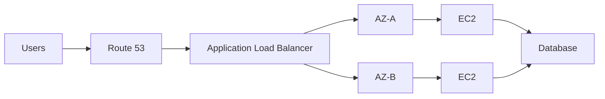

# 01- Quick Revision

## Overview

This document is a rapid revision sheet for AWS EC2 interview preparation.

It focuses on the concepts most frequently used when discussing:

- EC2 architecture
- Instance types and sizing
- Networking
- Security
- Storage
- Load balancing
- Auto Scaling
- Monitoring
- High availability
- Troubleshooting
- Cost optimization
- AWS CLI
- Production backend architecture

Use this document for final revision before an interview rather than as the primary learning material.

---

## EC2 Mental Model

EC2 provides resizable compute capacity as virtual servers.

A production EC2 deployment can be viewed as:

```text
                    Internet
                       |
                       v
                 Route 53 / DNS
                       |
                       v
                 Load Balancer
                       |
             +---------+---------+
             |                   |
          AZ-A                  AZ-B
             |                   |
          EC2-A                EC2-B
             |                   |
             +---------+---------+
                       |
                PostgreSQL / Redis
```

An EC2 instance is only one part of the system.

For backend engineering, always think about:

```text
Compute
Networking
Security
Storage
Scaling
Observability
Application
Dependencies
Cost
```

---

## Instance Fundamentals

An EC2 instance is a virtual server with resources such as:

- vCPUs
- Memory
- Network capacity
- EBS bandwidth
- Instance storage where applicable

Common instance families include:

| Family | Primary characteristic | Typical workload |
|---|---|---|
| `t` | Burstable | APIs, development, variable CPU |
| `m` | General purpose | Web applications, services |
| `c` | Compute optimized | CPU-intensive workloads |
| `r` | Memory optimized | Memory-heavy applications |
| `i` | Storage optimized | High local-storage workloads |
| `g` | Accelerated computing | GPU workloads |

Instance family selection should be based on the workload profile rather than simply choosing the cheapest instance.

---

## Instance Sizing

Consider:

```text
CPU
Memory
Network
EBS throughput
IOPS
Workload concurrency
Latency requirements
```

For a Django or FastAPI service:

```text
Requests
   |
   v
Nginx / ALB
   |
   v
Gunicorn / Uvicorn
   |
   v
Application
   |
   +--> PostgreSQL
   +--> Redis
   +--> External APIs
```

Do not size EC2 based only on CPU.

A service can be:

- CPU-bound
- Memory-bound
- I/O-bound
- Network-bound
- Database-bound

---

## T-Series and CPU Credits

T-series instances are burstable.

They have a CPU baseline and can burst above it using CPU credits.

```text
Below baseline
      |
      v
Earn credits

Above baseline
      |
      v
Spend credits
```

Important metrics:

| Metric | Purpose |
|---|---|
| `CPUUtilization` | CPU utilization |
| `CPUCreditUsage` | Credits consumed |
| `CPUCreditBalance` | Available burst credits |
| `CPUSurplusCreditBalance` | Surplus credits for Unlimited mode |
| `CPUSurplusCreditsCharged` | Surplus credits that result in charges |

High CPU does not automatically mean throttling.

For T-series troubleshooting, correlate:

```text
CPUUtilization
+
CPUCreditBalance
+
Credit mode
```

---

## EC2 Purchasing Options

Common purchasing models include:

| Option | Use case |
|---|---|
| On-Demand | Flexible workloads |
| Reserved Instances | Predictable long-term usage |
| Savings Plans | Long-term compute commitment with flexibility |
| Spot Instances | Fault-tolerant workloads |
| Dedicated Hosts | Dedicated physical host requirements |
| Dedicated Instances | Dedicated hardware tenancy without host-level control |

For production backend services, the choice depends on:

- Predictability
- Availability requirements
- Workload interruption tolerance
- Cost objectives
- Commitment horizon

---

## Instance Lifecycle

Typical lifecycle:

```text
pending
   |
   v
running
   |
   +--> stopping --> stopped
   |                    |
   |                    v
   |                 starting
   |                    |
   |                    v
   |                 running
   |
   +--> rebooting --> running
   |
   +--> shutting-down --> terminated
```

Important operations:

```text
start
stop
reboot
terminate
```

### Stop vs Reboot

**Reboot**

- Restarts the operating system.
- Instance remains allocated.
- Useful for OS/application recovery.

**Stop**

- Stops the instance.
- EBS-backed instances can normally be started again.
- Instance-hosted ephemeral state may not survive.

**Terminate**

- Permanently removes the instance.
- Requires particular care in production.

---

## AMIs

An AMI is a machine image used to launch EC2 instances.

It can contain:

- Operating system
- Installed packages
- Application artifacts
- Configuration
- Block device mappings

Typical production workflow:

```text
Build
  |
  v
Test
  |
  v
Create AMI
  |
  v
Launch Template
  |
  v
Auto Scaling Group
  |
  v
EC2 fleet
```

For immutable infrastructure, prefer building validated AMIs rather than manually modifying every production instance.

---

## Launch Templates

Launch Templates define how instances should be launched.

Common configuration includes:

- AMI
- Instance type
- Key pair
- Security Groups
- IAM instance profile
- User Data
- Block device mappings
- Network configuration

A typical architecture is:

```text
Launch Template
       |
       v
Auto Scaling Group
       |
       +--> EC2
       +--> EC2
       +--> EC2
```

Version Launch Templates carefully.

A new template version does not automatically mean every existing instance is replaced.

---

## User Data

User Data runs bootstrap commands during instance initialization.

Typical uses:

- Install packages
- Pull application artifacts
- Configure services
- Start applications
- Register agents

Example:

```bash
#!/bin/bash

dnf update -y
dnf install -y nginx
systemctl enable nginx
systemctl start nginx
```

Production considerations:

- Make scripts idempotent where possible.
- Log bootstrap output.
- Avoid hard-coded credentials.
- Prefer IAM roles and Systems Manager where appropriate.
- Keep complex provisioning logic in image-building or configuration-management workflows.

---

## Instance Metadata

EC2 Instance Metadata provides information about the running instance.

Common metadata includes:

- Instance ID
- Instance type
- Availability Zone
- Private IP
- IAM role credentials
- Network information

Modern workloads should use IMDSv2 where possible.

Conceptually:

```text
Application
    |
    v
IMDSv2
    |
    v
EC2 metadata
```

Avoid exposing metadata access unnecessarily to untrusted processes.

---

## IAM Roles for EC2

Applications running on EC2 should generally use an IAM role rather than static AWS access keys.

```text
EC2
 |
 v
IAM Instance Profile
 |
 v
IAM Role
 |
 v
AWS API
```

Example:

```text
Django
   |
   v
boto3
   |
   v
IAM role credentials
   |
   v
S3
```

Advantages:

- No long-lived credentials in source code
- Automatic credential rotation
- Centralized permissions
- Easier operational management

Follow least privilege.

---

## Security Groups

Security Groups are stateful virtual firewalls associated with resources such as EC2 instances.

They contain allow rules.

Example:

```text
Internet
   |
   | TCP 443
   v
ALB
   |
   | TCP 8000
   v
EC2
```

Recommended pattern:

```text
ALB SG
  |
  +--> Allow 443 from Internet

EC2 SG
  |
  +--> Allow 8000 from ALB SG

DB SG
  |
  +--> Allow 5432 from EC2 SG
```

Avoid:

```text
0.0.0.0/0
```

for internal database and service ports unless there is a deliberate security requirement.

---

## Security Group Characteristics

| Property | Security Group |
|---|---|
| Level | Resource / ENI |
| Stateful | Yes |
| Rules | Allow |
| Explicit deny | No |
| Return traffic | Automatically allowed |
| Rule evaluation | Aggregate allow behavior |

A Security Group is not the same as a NACL.

---

## NACL vs Security Group

| Feature | Security Group | NACL |
|---|---|---|
| Scope | Resource | Subnet |
| Stateful | Yes | No |
| Allow rules | Yes | Yes |
| Deny rules | No | Yes |
| Rule ordering | No | Yes |
| Return traffic | Automatic | Must be explicitly permitted |

A common troubleshooting mistake is checking only the Security Group and ignoring NACLs and routing.

---

## Ports and Bind Addresses

A service must actually listen on the expected address and port.

Check:

```bash
ss -lntp
```

For a FastAPI service:

```text
Uvicorn
   |
   +--> 0.0.0.0:8000
```

Binding to:

```text
127.0.0.1:8000
```

means the service is accessible only locally.

Binding to:

```text
0.0.0.0:8000
```

allows connections through the instance's network interfaces, subject to firewall and Security Group rules.

---

## Connection Refused vs Timeout

| Symptom | Typical meaning |
|---|---|
| Connection refused | Host reachable but service/port rejected connection |
| Connection timeout | Traffic cannot complete the connection path |
| DNS failure | Name resolution problem |
| HTTP 4xx | Application/client-side request issue |
| HTTP 5xx | Server/application/dependency issue |

### Connection Refused

Investigate:

```text
Process running?
Port correct?
Listening address correct?
Host firewall?
Container port mapping?
```

### Connection Timeout

Investigate:

```text
DNS
Route table
Security Group
NACL
Network ACL return path
NAT
Firewall
Load balancer
Target health
```

---

## Elastic IP

An Elastic IP is a static public IPv4 address allocated to an AWS account.

Typical use:

- Stable public endpoint for specific EC2 designs
- Legacy applications requiring a fixed public IP
- Network allowlists where a static source/destination IP is required

For highly available application architectures, prefer DNS and load balancers rather than using one Elastic IP as the primary availability mechanism.

---

## Private vs Public IP

### Private IP

Used inside the VPC.

```text
EC2 A
10.0.1.10
   |
   v
EC2 B
10.0.2.10
```

### Public IP

Used for Internet connectivity through AWS networking.

Production architectures should generally keep backend resources private where possible.

Typical design:

```text
Internet
   |
   v
Public ALB
   |
   v
Private EC2
   |
   v
Private Database
```

---

## EBS

Amazon EBS provides persistent block storage for EC2.

Common uses:

- Root filesystem
- Application data
- Database storage
- Persistent workloads

Key concepts:

```text
Volume
Snapshot
IOPS
Throughput
Encryption
Availability Zone
```

An EBS volume is associated with a specific Availability Zone.

---

## EBS Volume Types

Common families include:

| Type | Typical use |
|---|---|
| `gp3` | General-purpose workloads |
| `io2` | High-performance / critical I/O |
| `st1` | Throughput-oriented workloads |
| `sc1` | Low-cost, infrequently accessed data |

For many general-purpose workloads, `gp3` provides independent configuration of IOPS and throughput.

---

## EBS Snapshots

EBS snapshots provide point-in-time backup mechanisms for EBS volumes.

Typical workflow:

```text
EBS Volume
    |
    v
Snapshot
    |
    v
New EBS Volume
    |
    v
Recovery
```

Snapshots are regional resources.

For disaster recovery across regions, copy snapshots to the required destination region.

---

## Instance Store

Instance store provides temporary local block storage physically associated with the host.

Characteristics:

- Very high performance for supported workloads
- Ephemeral
- Data can be lost when the instance lifecycle requires movement or termination

Use instance store only when the application can tolerate data loss or reconstruct the data.

Suitable examples can include:

- Temporary caches
- Scratch space
- Intermediate processing data

---

## EFS

Amazon EFS provides shared file storage accessible by multiple compute resources.

Typical architecture:

```text
EC2-A ----+
          |
EC2-B ----+---- EFS
          |
EC2-C ----+
```

Use EFS when multiple instances need shared filesystem semantics.

Do not use EFS automatically for every storage problem. It has different latency, throughput, and cost characteristics from EBS.

---

## Load Balancers

AWS Elastic Load Balancing distributes traffic across targets.

Common types:

| Load Balancer | Primary use |
|---|---|
| ALB | HTTP/HTTPS applications |
| NLB | High-performance TCP/UDP/TLS |
| GWLB | Network virtual appliances |

For Django/FastAPI REST APIs, ALB is a common choice.

```text
Client
  |
  v
ALB
  |
  +--> EC2
  +--> EC2
  +--> EC2
```

---

## ALB Request Flow

```text
Client
  |
  v
DNS
  |
  v
ALB Listener :443
  |
  v
Target Group
  |
  v
EC2 :8000
  |
  v
Gunicorn / Uvicorn
  |
  v
Django / FastAPI
```

The Security Group relationships should reflect this flow.

---

## Target Health

An ALB does not consider an instance healthy simply because EC2 reports it as `running`.

The target must pass the configured health check.

Example:

```text
ALB
 |
 | GET /health
 v
EC2
 |
 v
Application
 |
 +--> 200 OK
```

A failing health endpoint can cause the ALB to stop sending traffic to an otherwise running instance.

---

## Health Check Design

A health endpoint should generally be:

- Fast
- Lightweight
- Deterministic
- Authentication-aware where appropriate
- Free from unnecessary expensive operations

Example:

```text
GET /health
```

Avoid making a simple liveness check dependent on every external system unless that is explicitly intended.

Separate concepts when useful:

```text
/liveness
/readiness
```

---

## Sticky Sessions

Sticky sessions route a client repeatedly to the same target for a configured period.

They can simplify legacy stateful applications but reduce flexibility in load distribution.

For modern Django/FastAPI applications, prefer externalized state:

```text
EC2
 |
 +--> Redis sessions/cache
 +--> PostgreSQL
```

This allows instances to remain stateless.

---

## Auto Scaling Groups

An Auto Scaling Group maintains a desired number of instances.

Key values:

```text
Minimum capacity
Desired capacity
Maximum capacity
```

Example:

```text
Min = 2
Desired = 3
Max = 6
```

If one instance becomes unhealthy:

```text
3 instances
   |
   v
1 unhealthy
   |
   v
Replacement
   |
   v
3 healthy instances
```

---

## Scaling Policies

Common approaches include:

- Target tracking
- Step scaling
- Simple scaling
- Scheduled scaling

Example target tracking:

```text
Average CPU target = 50%
```

The ASG adjusts capacity based on observed workload.

For production services, scaling on application-specific metrics can sometimes be better than CPU alone.

Examples:

- ALB request count
- Queue depth
- Kafka lag
- Custom business throughput

---

## Desired vs Minimum vs Maximum

| Setting | Meaning |
|---|---|
| Minimum | Lowest allowed capacity |
| Desired | Current target capacity |
| Maximum | Highest allowed capacity |

Example:

```text
Min = 2
Desired = 4
Max = 10
```

The ASG attempts to maintain four instances while respecting the configured bounds and scaling policies.

---

## High Availability

A production EC2 service should avoid depending on one instance or one Availability Zone.

Preferred architecture:



Key principles:

- Multiple Availability Zones
- Load balancing
- Auto Scaling
- Stateless application nodes
- Externalized state
- Automated replacement
- Monitoring and alerting

---

## AMI vs Snapshot

| Resource | Purpose |
|---|---|
| AMI | Launch template for EC2 instances |
| EBS Snapshot | Point-in-time backup of an EBS volume |

An AMI can reference snapshots for its block devices.

Do not treat an AMI and an EBS snapshot as interchangeable concepts.

---

## Monitoring

CloudWatch is central to EC2 monitoring.

Common metrics include:

```text
CPUUtilization
NetworkIn
NetworkOut
NetworkPacketsIn
NetworkPacketsOut
StatusCheckFailed
```

For T-series instances:

```text
CPUCreditBalance
CPUCreditUsage
```

Disk and memory visibility often requires additional OS-level monitoring because EC2's standard metrics do not expose every filesystem and memory metric.

---

## CloudWatch Alarms

Alarms can trigger actions or notifications when metrics cross configured thresholds.

Examples:

```text
CPU > 80%
StatusCheckFailed > 0
CPUCreditBalance < threshold
ALB unhealthy targets > 0
```

Use meaningful thresholds and evaluation periods rather than alerting on every transient spike.

---

## Troubleshooting High CPU

Use:

```bash
top
```

```bash
ps -eo pid,cmd,%cpu,%mem --sort=-%cpu | head -n 20
```

For T-series also inspect:

```text
CPUUtilization
CPUCreditBalance
CPUCreditUsage
```

For application workloads, investigate:

```text
Python processes
Gunicorn workers
Uvicorn workers
Celery workers
Docker containers
Database clients
Recent deployments
```

---

## Troubleshooting Disk Full

Start with:

```bash
df -h
```

Then identify large directories:

```bash
sudo du -xhd1 / | sort -h
```

Check:

```text
Logs
Docker layers
Temporary files
Application uploads
Database files
Core dumps
```

A full filesystem can cause:

- Application failures
- Database failures
- Logging failures
- SSH problems
- Package-management failures

Do not simply increase the EBS volume without understanding what consumed the space.

---

## Troubleshooting Memory Pressure

Check:

```bash
free -h
```

Processes:

```bash
ps -eo pid,cmd,%mem --sort=-%mem | head -n 20
```

Look for:

- Memory leaks
- Excessive Gunicorn workers
- Large Python processes
- PostgreSQL memory usage
- Docker containers
- OOM killer events

Check kernel messages:

```bash
dmesg | grep -i -E 'oom|killed process'
```

---

## Status Checks

EC2 has two important status-check categories:

| Check | Indicates |
|---|---|
| System status check | Underlying AWS infrastructure issue |
| Instance status check | Instance / OS-level issue |

A running instance can still fail a status check.

Typical response depends on the failure:

```text
System issue
   |
   v
Recovery / AWS infrastructure response

Instance issue
   |
   v
Investigate OS / instance state
```

---

## EC2 CLI Quick Reference

### List Instances

```bash
aws ec2 describe-instances \
  --query 'Reservations[].Instances[].{ID:InstanceId,State:State.Name,Type:InstanceType}' \
  --output table
```

### Start

```bash
aws ec2 start-instances \
  --instance-ids i-0123456789abcdef0
```

### Stop

```bash
aws ec2 stop-instances \
  --instance-ids i-0123456789abcdef0
```

### Reboot

```bash
aws ec2 reboot-instances \
  --instance-ids i-0123456789abcdef0
```

### Terminate

```bash
aws ec2 terminate-instances \
  --instance-ids i-0123456789abcdef0
```

Treat termination as a destructive operation.

---

## Querying EC2 With JMESPath

The AWS CLI `--query` option is useful for operational scripts.

Example:

```bash
aws ec2 describe-instances \
  --query 'Reservations[].Instances[].{
    ID:InstanceId,
    Type:InstanceType,
    PrivateIP:PrivateIpAddress,
    State:State.Name
  }' \
  --output table
```

Filter by running instances:

```bash
aws ec2 describe-instances \
  --filters Name=instance-state-name,Values=running \
  --query 'Reservations[].Instances[].InstanceId'
```

Querying is preferable to manually parsing large JSON responses in many operational scripts.

---

## Tag-Based Instance Discovery

Tags are critical for production operations.

Example:

```bash
aws ec2 describe-instances \
  --filters \
    Name=tag:Environment,Values=production \
    Name=tag:Service,Values=api \
    Name=instance-state-name,Values=running \
  --query 'Reservations[].Instances[].{
    ID:InstanceId,
    Type:InstanceType,
    PrivateIP:PrivateIpAddress
  }' \
  --output table
```

Recommended tags include:

```text
Environment
Service
Application
Owner
Team
CostCenter
ManagedBy
```

Use consistent tagging standards across environments.

---

## AWS CLI Profiles

Use separate AWS CLI profiles for different accounts or environments.

Example:

```bash
aws configure --profile production
```

Then:

```bash
aws ec2 describe-instances \
  --profile production \
  --region ap-south-1
```

Avoid accidentally running destructive commands against production because the wrong profile was selected.

Before high-impact operations, verify:

```bash
aws sts get-caller-identity
```

---

## IAM and EC2 Security

Follow least privilege.

An application that only reads from S3 should not have:

```text
ec2:*
s3:*
iam:*
```

Use narrowly scoped permissions.

Prefer:

```text
EC2
 |
 v
IAM Role
 |
 v
Required AWS APIs only
```

Avoid:

- Static access keys on instances
- Credentials in Git
- Credentials in User Data
- Overly broad IAM policies
- Publicly exposed administrative ports

---

## SSH Security

Traditional SSH access commonly uses key pairs.

Preferred practices include:

- Restrict SSH access to trusted sources.
- Avoid exposing port `22` to the entire Internet.
- Use Systems Manager Session Manager where appropriate.
- Rotate access mechanisms.
- Disable unnecessary password authentication.
- Maintain auditable access.

For emergency access, avoid creating permanent broad firewall rules.

---

## Nginx + EC2

A common backend deployment is:

```text
Internet
   |
   v
ALB
   |
   v
Nginx :80
   |
   v
Gunicorn / Uvicorn :8000
   |
   v
Django / FastAPI
```

Nginx can provide:

- Reverse proxying
- TLS termination in some architectures
- Request buffering
- Static-file serving
- Connection management

The exact placement of TLS depends on the architecture.

---

## Docker + EC2

EC2 can host Docker workloads:

```text
EC2
 |
 +--> Docker
       |
       +--> API
       +--> Worker
       +--> Nginx
```

Troubleshoot at both levels:

```text
EC2 host
   |
   v
Docker daemon
   |
   v
Container
   |
   v
Application
```

A healthy EC2 instance does not guarantee that its containers are healthy.

---

## EC2 + Kubernetes

When EC2 is used as Kubernetes worker capacity:

```text
Kubernetes Control Plane
          |
          v
       Scheduler
          |
          v
      EC2 Nodes
          |
          v
         Pods
```

Troubleshooting must distinguish:

- EC2 node failure
- kubelet failure
- container runtime failure
- pod failure
- service failure
- application failure

Do not troubleshoot every Kubernetes issue as an EC2 issue.

---

## Cost Optimization

Common EC2 cost controls:

- Right-size instances.
- Remove unused instances.
- Remove unnecessary EBS volumes.
- Review snapshots.
- Review Elastic IP usage.
- Use Auto Scaling.
- Evaluate Savings Plans or Reserved Instances for predictable workloads.
- Use Spot where interruption is acceptable.
- Shut down non-production environments when appropriate.

Cost optimization should not compromise required availability or performance.

---

## Production Checklist

Before considering an EC2 production deployment mature, verify:

```text
[ ] Multi-AZ where required
[ ] Auto Scaling configured where appropriate
[ ] Load balancer configured
[ ] Security Groups follow least privilege
[ ] IAM role used instead of static credentials
[ ] SSH access restricted
[ ] Monitoring configured
[ ] CloudWatch alarms configured
[ ] Application health checks configured
[ ] Logs centralized
[ ] Backup strategy defined
[ ] AMI / deployment process reproducible
[ ] EBS volumes encrypted where required
[ ] Tags standardized
[ ] Cost monitoring enabled
[ ] Incident procedures documented
[ ] Recovery procedure tested
```

---

## High-Value Interview Questions

### What is EC2?

A managed AWS service providing resizable virtual compute capacity.

### What is the difference between stopping and terminating an instance?

Stopping shuts down an EBS-backed instance while retaining the instance resource for later restart. Termination permanently removes the instance and can delete associated resources depending on configuration.

### What is an AMI?

An Amazon Machine Image is a template used to launch EC2 instances.

### What is EBS?

Elastic Block Store provides persistent block storage for EC2.

### What is the difference between EBS and instance store?

EBS is persistent network-attached block storage. Instance store is local ephemeral storage tied to the underlying host lifecycle.

### What is a Security Group?

A stateful resource-level virtual firewall that controls allowed inbound and outbound traffic.

### Why use an IAM role on EC2?

It provides temporary AWS credentials to applications without storing long-lived access keys on the instance.

### What is an Auto Scaling Group?

A service configuration that maintains and scales a fleet of EC2 instances according to desired, minimum, maximum, and scaling-policy settings.

### Why use an ALB?

An Application Load Balancer distributes HTTP/HTTPS traffic across healthy targets and integrates with target groups and health checks.

### What is the difference between ALB health and EC2 status checks?

EC2 status checks assess instance/infrastructure health, while ALB health checks determine whether the application target responds correctly to the configured health-check request.

### What happens when a T-series instance runs out of CPU credits?

Behavior depends on credit mode. Standard mode restricts sustained bursting above baseline, while Unlimited mode permits continued bursting under its additional-credit billing model.

### How would you troubleshoot an unreachable EC2 instance?

Check:

```text
Instance state
Status checks
Route tables
Security Groups
NACLs
Public/private addressing
DNS
Host firewall
Listening ports
Application process
Load balancer health
```

### How would you design a highly available EC2 API?

A typical architecture is:

```text
Route 53
   |
   v
ALB
   |
   +--> EC2 ASG in AZ-A
   |
   +--> EC2 ASG in AZ-B
   |
   v
Database / Cache
```

Keep application nodes stateless and distribute them across Availability Zones.

---

## Interview Traps

| Question | Common Wrong Answer | Better Reasoning |
|---|---|---|
| Is `running` equivalent to healthy? | Yes | Check status and application health |
| Is high CPU always bad? | Yes | Check workload, instance family, and CPU credits |
| Are Security Groups stateless? | Yes | They are stateful |
| Do NACLs have explicit deny rules? | No | NACLs support allow and deny rules |
| Is EBS local disk? | Yes | EBS is network-attached block storage |
| Does reboot recreate an instance? | Yes | Reboot restarts the OS |
| Does stopping mean termination? | Yes | Stop and terminate have different lifecycle semantics |
| Is an ALB health check the same as EC2 status? | Yes | They measure different layers |
| Should applications store AWS keys on EC2? | Yes | Prefer IAM roles |
| Does Unlimited mean free unlimited CPU? | Yes | Sustained surplus usage can incur charges |
| Does one unhealthy EC2 instance mean the service is down? | Yes | HA architecture should route around unhealthy targets |

---

## Rapid Revision Table

| Area | Remember |
|---|---|
| EC2 | Virtual compute capacity |
| Instance family | Match workload characteristics |
| T-series | Burstable CPU with credits |
| AMI | Instance launch template/image |
| Launch Template | Defines instance launch configuration |
| User Data | Bootstrap configuration |
| IAM Role | Temporary AWS credentials |
| Security Group | Stateful resource firewall |
| NACL | Stateless subnet-level firewall |
| EBS | Persistent block storage |
| Snapshot | Point-in-time EBS backup |
| Instance Store | Ephemeral local storage |
| EFS | Shared managed filesystem |
| Elastic IP | Static public IPv4 |
| ALB | HTTP/HTTPS load balancing |
| Target Group | Backend targets and health checks |
| ASG | Fleet management and scaling |
| CloudWatch | Metrics and alarms |
| Status Checks | Infrastructure / instance health |
| Multi-AZ | High availability |
| Tags | Resource identification and operations |
| `--query` | JMESPath output filtering |
| IAM least privilege | Minimize permissions |
| Auto Scaling | Match capacity to workload |
| Immutable AMI | Reproducible infrastructure |

---

## Final Interview Checklist

Before an EC2 interview, be able to explain without notes:

```text
[ ] EC2 fundamentals
[ ] Instance families
[ ] Instance sizing
[ ] T-series CPU credits
[ ] Purchasing options
[ ] Instance lifecycle
[ ] AMIs
[ ] Launch Templates
[ ] User Data
[ ] Instance Metadata / IMDSv2
[ ] IAM roles
[ ] Security Groups
[ ] NACLs
[ ] Public vs private IP
[ ] Elastic IP
[ ] EBS
[ ] EBS volume types
[ ] EBS snapshots
[ ] Instance Store
[ ] EFS
[ ] ALB / NLB
[ ] Target Groups
[ ] Health checks
[ ] Sticky sessions
[ ] Auto Scaling Groups
[ ] Scaling policies
[ ] Multi-AZ architecture
[ ] CloudWatch
[ ] Status checks
[ ] High CPU troubleshooting
[ ] Disk troubleshooting
[ ] Memory troubleshooting
[ ] Network troubleshooting
[ ] AWS CLI
[ ] JMESPath queries
[ ] Cost optimization
[ ] Backup and recovery
[ ] Production security
```

## Key Takeaways

- **Think of EC2 as one component in a larger system involving compute, networking, storage, security, scaling, observability, and application dependencies.**
- **For production workloads, prioritize Multi-AZ deployment, load balancing, Auto Scaling, least-privilege IAM, monitoring, backups, and reproducible infrastructure.**
- **For troubleshooting, separate AWS infrastructure health from OS, network, storage, load-balancer, application, and dependency failures.**
- **Know the operational distinctions between Security Groups and NACLs, EBS and instance store, ALB health and EC2 status checks, and Standard and Unlimited T-series behavior.**
- **For interviews, explain not only what each EC2 feature does but why it exists, where it belongs in an architecture, and how you would operate and troubleshoot it in production.**