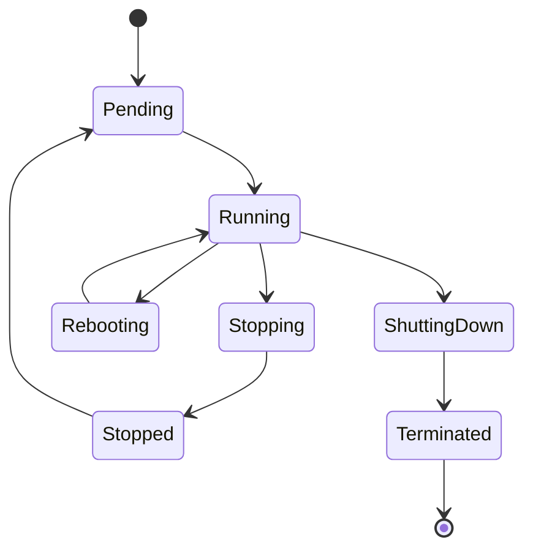
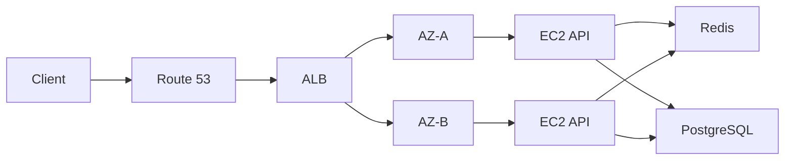

# 02- Core EC2 Interview Questions

## Overview

This document covers core AWS EC2 interview questions for backend engineers, with emphasis on practical architecture, operations, security, scalability, and troubleshooting.

The goal is not to memorize definitions. A strong EC2 interview answer should explain:

```text
What it is
   |
   v
Why it exists
   |
   v
How it works
   |
   v
Where it fits in an architecture
   |
   v
Operational trade-offs
```

The questions progress from core EC2 concepts to production architecture and troubleshooting.

---

## EC2 Fundamentals

### What is Amazon EC2?

Amazon EC2 provides virtual compute capacity that can be provisioned and managed through AWS.

An EC2 instance provides resources such as:

- vCPUs
- Memory
- Network interfaces
- EBS volumes
- Instance-store storage where supported

A typical backend architecture might be:

```text
Client
  |
  v
Route 53
  |
  v
ALB
  |
  +----------------+
  |                |
 EC2              EC2
  |                |
  +-------+--------+
          |
      PostgreSQL
```

EC2 provides compute, but production availability depends on networking, storage, security, scaling, monitoring, and application architecture.

---

### What is an EC2 instance?

An EC2 instance is a virtual server launched from an AMI with a selected instance type and configuration.

Important properties include:

```text
AMI
Instance type
VPC / subnet
Security Groups
IAM role
EBS volumes
Network interfaces
User Data
Key pair
```

The instance type determines the available compute, memory, network, and storage characteristics.

---

### What is an AMI?

An Amazon Machine Image is a template used to launch EC2 instances.

An AMI can define:

- Operating system
- Installed software
- Application artifacts
- Block device mappings
- Boot configuration

Typical immutable deployment:

```text
Source Code
    |
    v
CI/CD
    |
    v
Build AMI
    |
    v
Launch Template
    |
    v
Auto Scaling Group
    |
    v
EC2 Fleet
```

AMI-based deployments provide reproducibility and reduce configuration drift.

---

### What is an instance type?

An instance type defines the hardware characteristics exposed to the EC2 instance.

Examples of families include:

| Family | Workload |
|---|---|
| `t` | Burstable workloads |
| `m` | General purpose |
| `c` | Compute optimized |
| `r` | Memory optimized |
| `i` | Storage optimized |
| `g` | Accelerated computing |

Choosing an instance type should be based on measured workload characteristics rather than simply CPU requirements.

---

### How do you choose an EC2 instance type?

Evaluate:

```text
CPU
Memory
Network throughput
EBS throughput
IOPS
Workload concurrency
Latency requirements
Scaling model
Cost
```

For example:

```text
FastAPI API
   |
   +--> CPU-bound
   |       -> Compute-oriented
   |
   +--> Memory-bound
   |       -> Memory-oriented
   |
   +--> Variable CPU
           -> Burstable
```

Load testing and production metrics should validate the selection.

---

## EC2 Lifecycle

### What are the major EC2 instance states?

Common states include:

```text
pending
running
stopping
stopped
shutting-down
terminated
```

A simplified lifecycle:



---

### What is the difference between stop, reboot, and terminate?

| Operation | Meaning | Typical use |
|---|---|---|
| Reboot | Restarts the OS | OS/application recovery |
| Stop | Powers down the instance | Maintenance / cost control |
| Terminate | Deletes the instance | Permanent removal |

A reboot does not create a replacement instance.

Termination is destructive and should be treated as a high-impact operation.

---

### What happens to EBS volumes when an instance is terminated?

It depends on the volume's `DeleteOnTermination` configuration.

The root EBS volume is commonly configured to be deleted when the instance terminates, but additional volumes can be configured differently.

Therefore, do not assume:

```text
Terminate instance
    =
Delete every EBS volume
```

Inspect the block device mappings before destructive operations.

---

### What is instance store?

Instance store is ephemeral local storage physically associated with the host.

It provides high-performance local storage but is not designed as durable storage.

Use cases can include:

- Temporary files
- Scratch data
- Caches
- Intermediate processing

Do not store the only copy of important business data on instance store.

---

## EC2 Networking

### What is a VPC in relation to EC2?

A VPC provides the logical network environment in which EC2 instances operate.

The relationship is:

```text
Region
  |
  v
VPC
  |
  +--> Subnet
        |
        +--> EC2
```

A subnet belongs to one Availability Zone.

---

### What is the difference between public and private subnets?

A public subnet has a routing path to an Internet Gateway.

A private subnet does not directly expose instances through an Internet Gateway for inbound Internet connectivity.

Typical production architecture:

```text
Internet
   |
   v
Public ALB
   |
   v
Private EC2
   |
   v
Private Database
```

Backend instances should generally remain private unless there is a specific reason to expose them.

---

### What is a public IP?

A public IPv4 address provides Internet-reachable addressing through AWS networking.

It can change when an instance is stopped and started.

For systems requiring a stable public IPv4 address, an Elastic IP can be used, although DNS/load-balancer-based architectures are generally preferable for highly available services.

---

### What is a private IP?

A private IP is used for communication within the VPC and connected networks.

Example:

```text
EC2 A
10.0.1.10
   |
   v
EC2 B
10.0.2.20
```

Private communication is preferred for internal service-to-service traffic.

---

### What is an Elastic IP?

An Elastic IP is a static public IPv4 address allocated to an AWS account.

It can be associated with supported AWS resources such as EC2.

Typical use cases include:

- Stable public endpoint
- Legacy allowlisting requirements
- Specific network architectures

For highly available web applications, use a load balancer and DNS rather than making one EC2 instance the permanent public endpoint.

---

## Security Groups

### What is a Security Group?

A Security Group is a stateful virtual firewall associated with resources such as EC2 network interfaces.

It controls allowed inbound and outbound traffic.

Example:

```text
Internet
   |
 TCP 443
   |
   v
ALB
   |
 TCP 8000
   |
   v
EC2
```

Recommended rules:

```text
ALB SG:
  443 from Internet

EC2 SG:
  8000 from ALB SG

DB SG:
  5432 from EC2 SG
```

---

### Why are Security Groups stateful?

If an inbound connection is allowed, the corresponding return traffic is automatically allowed.

For example:

```text
Client
  |
  | Request
  v
EC2
  |
  | Response
  v
Client
```

The return traffic does not require a separate reverse rule merely because the connection is stateful.

---

### Are Security Groups stateful or stateless?

Security Groups are **stateful**.

NACLs are **stateless**.

This is a common interview question.

---

### Can a Security Group explicitly deny traffic?

No.

Security Groups define allowed traffic.

They do not provide explicit deny rules.

If explicit allow/deny behavior at the subnet boundary is required, NACLs may be involved.

---

### Can one Security Group reference another?

Yes.

This is useful for service-to-service authorization.

For example:

```text
ALB-SG
   |
   | TCP 8000
   v
API-SG
   |
   | TCP 5432
   v
DB-SG
```

The API Security Group can allow PostgreSQL traffic from the application Security Group rather than from a fixed IP range.

This is generally more maintainable in dynamic EC2 environments.

---

## Security Groups vs NACLs

### What is the difference between Security Groups and NACLs?

| Feature | Security Group | NACL |
|---|---|---|
| Scope | Resource / ENI | Subnet |
| Stateful | Yes | No |
| Allow rules | Yes | Yes |
| Deny rules | No | Yes |
| Rule ordering | No | Yes |
| Return traffic | Automatically handled | Must be explicitly permitted |

A common troubleshooting mistake is checking only Security Groups.

A network path may also depend on:

```text
Route table
NACL
Internet Gateway
NAT Gateway
Transit Gateway
VPC Peering
DNS
Host firewall
```

---

## Storage

### What is EBS?

Amazon EBS provides persistent block storage for EC2.

Typical uses:

- Root filesystem
- Application storage
- Database storage
- Persistent application data

Conceptually:

```text
EC2
 |
 v
EBS Volume
 |
 v
Filesystem
 |
 v
Application Data
```

---

### What is the difference between EBS and instance store?

| Feature | EBS | Instance Store |
|---|---|---|
| Storage type | Network-attached block storage | Local host storage |
| Persistence | Persistent | Ephemeral |
| Snapshots | Yes | No |
| Typical use | OS/data | Scratch/cache |
| Survives instance lifecycle changes | Generally, depending on configuration | No guarantee |

Use EBS when durability is required.

---

### What is an EBS snapshot?

An EBS snapshot is a point-in-time backup of an EBS volume.

Typical recovery workflow:

```text
EBS Volume
    |
    v
Snapshot
    |
    v
New EBS Volume
    |
    v
Attach to EC2
    |
    v
Restore
```

Snapshots are useful for:

- Backup
- Disaster recovery
- Environment cloning
- Volume migration

---

### What are IOPS and throughput?

**IOPS** represents the number of input/output operations per second.

**Throughput** represents the amount of data transferred per second.

A workload can be:

```text
IOPS-bound
```

or:

```text
Throughput-bound
```

Database workloads often require careful evaluation of both.

---

## CPU and T-Series

### What is a burstable EC2 instance?

A burstable instance can temporarily operate above its baseline CPU performance by using accumulated CPU credits.

```text
Low CPU
  |
  v
Earn credits

High CPU
  |
  v
Spend credits
```

T-series instances are the primary example.

---

### What happens when CPU credits are depleted?

The behavior depends on the configured credit mode.

In Standard mode, sustained CPU usage above the baseline becomes constrained after accrued credits are exhausted.

In Unlimited mode, the instance can continue bursting, but sustained surplus usage can result in additional charges.

Monitor:

```text
CPUUtilization
CPUCreditBalance
CPUCreditUsage
CPUSurplusCreditBalance
CPUSurplusCreditsCharged
```

---

### Is high CPU always a problem?

No.

A temporary CPU spike can be normal.

The important questions are:

```text
Is the spike expected?
Is it sustained?
Is the instance CPU-bound?
Are T-series credits declining?
Is application latency increasing?
Is scaling available?
```

---

## AMI and Launch Templates

### What is a Launch Template?

A Launch Template defines how EC2 instances should be launched.

It can contain:

- AMI
- Instance type
- Security Groups
- IAM instance profile
- User Data
- Key pair
- EBS mappings
- Network configuration

Typical relationship:

```text
Launch Template
       |
       v
Auto Scaling Group
       |
       +--> EC2
       +--> EC2
       +--> EC2
```

---

### Why use Launch Templates?

They provide a consistent and versioned launch configuration.

This is important for:

- Auto Scaling
- Immutable infrastructure
- CI/CD
- Instance replacement
- Reproducibility

A production deployment should avoid manually configuring every EC2 instance differently.

---

## User Data

### What is EC2 User Data?

User Data is bootstrap configuration supplied during instance launch.

Typical uses:

```text
Install packages
Configure services
Pull application artifacts
Start processes
Install monitoring agents
```

Example:

```bash
#!/bin/bash

dnf install -y nginx
systemctl enable nginx
systemctl start nginx
```

For complex production provisioning, prefer immutable AMIs, configuration management, or automated deployment pipelines rather than putting the entire infrastructure setup into a large User Data script.

---

## IAM

### How should an EC2 application access AWS services?

Prefer an IAM role attached through an instance profile.

Example:

```text
Django
  |
  v
boto3
  |
  v
EC2 IAM Role
  |
  v
S3
```

Avoid:

```python
AWS_ACCESS_KEY = "..."
AWS_SECRET_KEY = "..."
```

in application code or configuration files.

IAM roles provide temporary credentials and eliminate the need for long-lived credentials embedded in the application.

---

### Why is least privilege important?

Suppose a Django service only needs to read objects from one S3 bucket.

Its IAM policy should grant only the required actions and resources.

Avoid:

```text
AdministratorAccess
```

when a narrowly scoped policy is sufficient.

Least privilege reduces the impact of credential compromise or application compromise.

---

## Instance Metadata

### What is EC2 Instance Metadata?

Instance Metadata provides information about the running EC2 instance.

Examples include:

- Instance ID
- Instance type
- Availability Zone
- Network information
- IAM role credentials

Modern applications should use IMDSv2 where possible.

A common security concern is unintended access to instance metadata from vulnerable applications or SSRF paths.

---

## Load Balancing

### Why use a load balancer with EC2?

A load balancer provides:

- Traffic distribution
- Health checking
- Horizontal scaling support
- Connection management
- Integration with Auto Scaling

Typical architecture:

```text
Clients
   |
   v
ALB
   |
   +--> EC2-A
   +--> EC2-B
   +--> EC2-C
```

If EC2-A becomes unhealthy, the ALB can stop routing traffic to it.

---

### What is a Target Group?

A Target Group defines the backend targets and health-check configuration used by a load balancer.

Example:

```text
ALB Listener :443
       |
       v
Target Group
       |
       +--> EC2-A:8000
       +--> EC2-B:8000
       +--> EC2-C:8000
```

The target group also determines how target health is evaluated.

---

### What is the difference between EC2 health and ALB target health?

They operate at different layers.

```text
EC2 Status
    |
    v
Instance / infrastructure health

ALB Target Health
    |
    v
Application endpoint health
```

An EC2 instance can be healthy according to EC2 status checks while its application is returning `500`.

---

### How should a health-check endpoint be designed?

A health endpoint should be fast and predictable.

Example:

```http
GET /health
```

Potential response:

```json
{
  "status": "ok"
}
```

Separate liveness and readiness when appropriate:

```text
/liveness
/readiness
```

Do not make a basic liveness endpoint perform expensive database queries unless that behavior is intentional.

---

## Auto Scaling

### What is an Auto Scaling Group?

An Auto Scaling Group manages a fleet of EC2 instances and maintains capacity according to configured limits and scaling policies.

Important values:

```text
Minimum capacity
Desired capacity
Maximum capacity
```

Example:

```text
Min     = 2
Desired = 4
Max     = 10
```

---

### How does Auto Scaling improve availability?

Suppose:

```text
Desired = 3
```

and one instance becomes unhealthy.

The ASG can replace it according to its configured health checks and lifecycle behavior.

```text
3 instances
    |
    v
1 unhealthy
    |
    v
Replacement
    |
    v
3 healthy instances
```

This works best when application instances are stateless and reproducibly launchable.

---

### What is the difference between vertical and horizontal scaling?

**Vertical scaling:**

```text
t3.medium
    |
    v
m7i.large
```

Increase resources on the instance.

**Horizontal scaling:**

```text
1 EC2
  |
  v
3 EC2
```

Add more instances.

For stateless web APIs, horizontal scaling is often more flexible because it improves both capacity and availability.

---

### What scaling metrics can be used?

Possible signals include:

- CPU utilization
- ALB request count per target
- Network traffic
- Queue depth
- Custom CloudWatch metrics
- Application-specific workload metrics

For Celery:

```text
Queue depth
   |
   v
Scale workers
```

For Kafka:

```text
Consumer lag
   |
   v
Scale consumers
```

CPU is useful but is not always the best representation of application demand.

---

## High Availability

### How would you design a highly available EC2 application?

A common architecture is:



Key principles:

- Multiple Availability Zones
- Load balancing
- Auto Scaling
- Stateless application instances
- Externalized sessions
- Durable database
- Monitoring
- Automated deployment

---

### Why should EC2 application servers be stateless?

If any instance can handle any request:

```text
Request
  |
  +--> EC2-A
  |
  +--> EC2-B
  |
  +--> EC2-C
```

then instances can be replaced or scaled without losing application state.

Store state in appropriate external systems:

```text
Sessions -> Redis / database
Files    -> S3
Data     -> PostgreSQL
Events   -> Kafka
```

Statelessness simplifies Auto Scaling and disaster recovery.

---

## Networking Troubleshooting

### How would you troubleshoot an unreachable EC2 service?

Use a layered approach:

```text
Instance state
    |
    v
Status checks
    |
    v
DNS
    |
    v
Route table
    |
    v
Security Group
    |
    v
NACL
    |
    v
Host firewall
    |
    v
Listening port
    |
    v
Application
```

On the instance:

```bash
ss -lntp
```

Test locally:

```bash
curl http://127.0.0.1:8000/health
```

Test TCP connectivity remotely:

```bash
nc -vz <host> 8000
```

---

### What is the difference between connection refused and connection timeout?

| Symptom | Likely interpretation |
|---|---|
| Connection refused | Destination reachable, but connection rejected |
| Connection timeout | Connection cannot complete |
| DNS failure | Name resolution problem |

For refused connections, investigate:

```text
Process
Port
Bind address
Host firewall
Container port mapping
```

For timeouts, investigate:

```text
DNS
Routing
Security Groups
NACLs
Firewall
NAT
Return path
Load balancer
```

---

## Storage Troubleshooting

### How would you troubleshoot a full EC2 filesystem?

Start with:

```bash
df -h
```

Then:

```bash
sudo du -xhd1 / | sort -h
```

Investigate:

- Application logs
- Docker images
- Temporary files
- Uploads
- Database files
- Core dumps

If the EBS volume is genuinely undersized, increase the volume and then expand the partition/filesystem as required.

Do not confuse increasing EBS capacity with fixing an application that continuously generates uncontrolled data.

---

## CPU Troubleshooting

### How would you troubleshoot high CPU on EC2?

Start with:

```bash
top
```

Then:

```bash
ps -eo pid,cmd,%cpu,%mem --sort=-%cpu | head -n 20
```

For T-series:

```text
CPUUtilization
CPUCreditBalance
CPUCreditUsage
```

Investigate:

```text
Python processes
Gunicorn
Uvicorn
Celery
Docker containers
Database activity
Recent deployments
Traffic growth
```

Then determine whether the solution is:

```text
Optimize
Scale horizontally
Resize
Change instance family
Separate workloads
```

---

## Memory Troubleshooting

### How would you troubleshoot memory pressure?

Check:

```bash
free -h
```

Find high-memory processes:

```bash
ps -eo pid,cmd,%mem --sort=-%mem | head -n 20
```

Investigate OOM events:

```bash
dmesg | grep -i -E 'oom|killed process'
```

Potential causes:

- Memory leak
- Too many application workers
- Large Python objects
- Database workload
- Container memory usage
- Incorrect worker sizing

Increasing EC2 memory may help, but first identify the consumer.

---

## EC2 Monitoring

### What should you monitor on EC2?

At minimum:

```text
CPU
Network
Status checks
Disk utilization
Memory
Application latency
Application errors
Load balancer target health
Database connectivity
```

For T-series:

```text
CPUCreditBalance
CPUCreditUsage
```

Application-level metrics are often as important as infrastructure metrics.

For an API:

```text
Request rate
Latency
Error rate
Saturation
```

---

## CloudWatch

### What is CloudWatch used for with EC2?

CloudWatch provides monitoring and observability capabilities for AWS resources.

Typical EC2 use cases:

- Metrics
- Alarms
- Dashboards
- Log collection where configured
- Operational visibility

An important distinction is that standard EC2 metrics do not expose every OS-level metric.

For example, memory and filesystem utilization generally require additional monitoring mechanisms.

---

## EC2 and Docker

### How would you troubleshoot a Dockerized application on EC2?

Use layered diagnosis:

```text
EC2
 |
 v
Docker daemon
 |
 v
Container
 |
 v
Application
```

Check containers:

```bash
docker ps
```

Check resource usage:

```bash
docker stats
```

Check logs:

```bash
docker logs <container>
```

A healthy EC2 instance does not imply that the application container is healthy.

---

## EC2 and Kubernetes

### How does EC2 relate to Kubernetes?

EC2 can provide compute capacity for Kubernetes worker nodes.

Conceptually:

```text
Kubernetes
    |
    v
EC2 Worker Nodes
    |
    v
Pods
```

When troubleshooting Kubernetes workloads, distinguish:

```text
EC2 node problem
Kubernetes node problem
Container runtime problem
Pod problem
Application problem
```

Do not automatically treat pod failures as EC2 failures.

---

## Cost and Capacity

### How would you optimize EC2 costs?

Consider:

- Right-sizing
- Auto Scaling
- Savings Plans
- Reserved Instances where appropriate
- Spot Instances for fault-tolerant workloads
- Removing idle resources
- EBS cleanup
- Snapshot lifecycle management
- Elastic IP usage
- Non-production scheduling

Cost optimization should be based on utilization and workload requirements rather than simply choosing the smallest instance.

---

### When would you use Spot Instances?

Spot Instances are suitable for workloads that can tolerate interruption.

Examples:

- Batch processing
- Distributed workers
- CI workloads
- Fault-tolerant compute
- Stateless processing

Avoid depending exclusively on Spot for workloads that cannot tolerate interruption unless the architecture explicitly handles capacity loss.

---

## EC2 CLI

### How do you list EC2 instances using AWS CLI?

```bash
aws ec2 describe-instances \
  --query 'Reservations[].Instances[].{
    ID:InstanceId,
    Type:InstanceType,
    State:State.Name
  }' \
  --output table
```

---

### How do you inspect the current AWS identity?

```bash
aws sts get-caller-identity
```

This is especially useful before executing high-impact production commands.

---

### How do you filter instances by tags?

```bash
aws ec2 describe-instances \
  --filters \
    Name=tag:Environment,Values=production \
    Name=tag:Service,Values=api \
  --query 'Reservations[].Instances[].InstanceId'
```

Use tags consistently for operational automation.

---

## Production Architecture Questions

### How would you deploy Django on EC2?

A typical architecture:

```text
Internet
   |
   v
Route 53
   |
   v
ALB :443
   |
   v
EC2 Auto Scaling Group
   |
   +--> Nginx
   |      |
   |      v
   |   Gunicorn
   |      |
   |      v
   |   Django
   |
   +--> Nginx
          |
          v
       Gunicorn
          |
          v
       Django

Django --> PostgreSQL
Django --> Redis
```

Production concerns include:

- Multi-AZ deployment
- HTTPS
- Security Groups
- IAM roles
- Auto Scaling
- Health checks
- Centralized logging
- Database backups
- Stateless instances
- CI/CD

---

### How would you deploy FastAPI on EC2?

A typical request path is:

```text
Client
  |
  v
ALB
  |
  v
Nginx
  |
  v
Uvicorn / Gunicorn
  |
  v
FastAPI
  |
  +--> PostgreSQL
  +--> Redis
```

For high availability, run multiple instances behind the ALB.

---

### How would you handle background jobs?

For Celery:

```text
API
 |
 v
Redis / RabbitMQ
 |
 v
Celery Worker ASG
 |
 v
Task
```

Do not necessarily run CPU-heavy Celery workers on the same small EC2 fleet as latency-sensitive APIs.

Separate worker capacity when resource profiles differ.

---

## Scenario-Based Questions

### An EC2 instance is `running`, but the website is unavailable. What do you check?

Check in order:

```text
EC2 state
Status checks
ALB target health
DNS
Security Groups
NACLs
Routes
Listening ports
Nginx
Gunicorn/Uvicorn
Application logs
Database connectivity
```

The important interview point is that:

```text
running != application healthy
```

---

### An EC2 instance has 100% CPU. What do you do?

Do not immediately reboot.

First:

```text
Identify instance type
Check CPU credits if T-series
Identify CPU-consuming process
Check recent deployment
Check traffic
Check worker count
Check application logs
Check database behavior
```

Then choose:

```text
Optimization
Scale-out
Resize
Instance-family change
Workload separation
```

---

### The application works locally on EC2 but not through the ALB. What do you check?

Check:

```text
Application bind address
Application port
Target Group port
Security Group
Health check path
Health check status
Nginx configuration
Listener rules
Target registration
```

For example, an application listening on:

```text
127.0.0.1:8000
```

will not accept traffic arriving through the instance network interface.

---

### One instance in an Auto Scaling Group repeatedly becomes unhealthy. What do you investigate?

Compare the unhealthy instance with a healthy one:

```text
AMI
Launch Template version
User Data
Security Groups
Subnet
AZ
Instance type
Application version
Environment variables
Logs
Health-check configuration
```

If multiple new instances fail identically, suspect a shared configuration or deployment problem rather than individual hardware failure.

---

### The application becomes slow after traffic increases. How do you investigate?

Correlate:

```text
Traffic
CPU
Memory
Network
Database latency
Connection pools
Application latency
ALB request count
Error rate
Auto Scaling events
```

Possible bottlenecks:

```text
EC2 CPU
EC2 memory
Database
Redis
Network
Connection pool
Application code
External dependency
```

Do not assume EC2 is the bottleneck simply because the application runs there.

---

## Common Interview Traps

| Question | Weak Answer | Stronger Answer |
|---|---|---|
| Is a `running` instance healthy? | Yes | Check status and application health |
| Are Security Groups stateless? | Yes | They are stateful |
| Can Security Groups deny traffic? | Yes | They provide allow rules |
| Is EBS local storage? | Yes | EBS is network-attached block storage |
| Is instance store persistent? | Yes | It is ephemeral |
| Does 100% CPU always mean failure? | Yes | Check workload and instance characteristics |
| Does Unlimited mean free unlimited CPU? | Yes | Sustained surplus usage can incur charges |
| Does ALB health equal EC2 health? | Yes | They measure different layers |
| Should EC2 applications store access keys? | Yes | Prefer IAM roles |
| Does Auto Scaling only add instances? | Yes | It can scale out and in and replace unhealthy instances |
| Does reboot replace an instance? | Yes | It restarts the OS |
| Is one EC2 instance sufficient for HA? | Yes | Use multiple instances/AZs where required |
| Does increasing CPU fix every latency issue? | Yes | Latency may be caused by DB, I/O, network, or application code |

---

## Senior-Level Discussion Points

### Immutable vs Mutable EC2 Infrastructure

**Mutable:**

```text
Launch instance
    |
    v
SSH into instance
    |
    v
Manually modify
    |
    v
Production state
```

**Immutable:**

```text
Code
 |
 v
CI/CD
 |
 v
AMI
 |
 v
Launch Template
 |
 v
New EC2 fleet
 |
 v
Replace old fleet
```

Immutable infrastructure improves reproducibility and reduces configuration drift.

---

### Why Stateless EC2 Matters

Stateless application nodes allow:

```text
Scale out
Replace
Terminate
Recreate
Deploy
```

without losing critical application state.

Externalize:

```text
Sessions -> Redis
Files    -> S3
Database -> PostgreSQL
Events   -> Kafka
```

This is one of the most important architectural principles behind reliable Auto Scaling.

---

### When Should You Replace Instead of Repair?

For immutable, stateless application instances:

```text
Unhealthy instance
       |
       v
Replace
```

is often safer than:

```text
Unhealthy instance
       |
       v
SSH
       |
       v
Manual repair
```

Manual repair can create configuration drift and makes future incidents harder to reproduce.

Repair may still be appropriate for stateful systems or when evidence must be preserved for incident investigation.

---

### How Would You Design EC2 for Failure?

Assume:

```text
Instance failure
AZ failure
Deployment failure
Dependency failure
```

Then design accordingly:

```text
ALB
 |
 +--> AZ-A EC2
 |
 +--> AZ-B EC2
 |
 +--> AZ-C EC2

EC2 --> Managed / replicated dependencies
```

Use:

- Multiple Availability Zones
- Auto Scaling
- Health checks
- Automated deployment
- Backups
- Monitoring
- Tested recovery procedures

High availability is an architectural property, not a feature of an individual EC2 instance.

---

## Rapid Interview Answer Framework

For scenario-based EC2 questions, structure the answer as:

```text
1. Identify the symptom
2. Establish scope
3. Check AWS-level health
4. Check networking
5. Check OS resources
6. Check application
7. Check dependencies
8. Correlate with recent changes
9. Apply least-disruptive remediation
10. Validate and prevent recurrence
```

For architecture questions:

```text
Requirement
    |
    v
Compute choice
    |
    v
Networking
    |
    v
Security
    |
    v
Storage
    |
    v
Scaling
    |
    v
Observability
    |
    v
Failure handling
    |
    v
Cost
```

This demonstrates engineering reasoning rather than feature memorization.

## Key Takeaways

- **EC2 interview questions should be answered in terms of architecture, lifecycle, networking, security, storage, scaling, observability, and failure handling rather than isolated AWS definitions.**
- **For production systems, combine EC2 with ALB, Auto Scaling, Multi-AZ deployment, IAM roles, appropriate storage, monitoring, and stateless application design.**
- **Security Groups, NACLs, EBS, instance store, AMIs, Launch Templates, IAM roles, and T-series CPU credits are core concepts that require clear operational distinctions.**
- **For troubleshooting scenarios, use a layered evidence-driven process from AWS infrastructure through networking, OS resources, application processes, and dependencies.**
- **Strong senior-level answers explain trade-offs and failure modes: why a design works, what can break, how it scales, how it is secured, and how it is operated in production.**