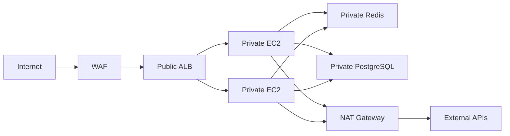

# 03- Networking and Security Questions

## Overview

This document covers AWS EC2 networking and security interview questions, with emphasis on how traffic flows through a VPC and how EC2 workloads are protected in production.

The core mental model is:

```text
Client
  |
  v
DNS
  |
  v
Load Balancer
  |
  v
Route Table
  |
  v
Network Interface
  |
  v
Security Group
  |
  v
NACL / Subnet
  |
  v
EC2
  |
  v
Application
```

A strong interview answer should distinguish between:

- VPC and subnet routing
- Public and private connectivity
- Security Groups and NACLs
- Internet Gateway and NAT Gateway
- Public and private IP addressing
- Load balancers
- DNS
- Network interfaces
- Host-level firewalls
- Application-level ports and binding
- Service-to-service security

---

## VPC and EC2 Networking

### What is a VPC?

A VPC is a logically isolated virtual network in AWS where resources such as EC2 instances can operate.

A VPC provides the networking boundary for:

- IP addressing
- Subnets
- Route tables
- Network interfaces
- Security Groups
- Network ACLs
- Internet connectivity
- Private connectivity

Typical structure:

```text
AWS Region
    |
    v
VPC
    |
    +--------------------+
    |                    |
 Subnet-A             Subnet-B
    |                    |
   EC2                  EC2
```

A VPC is regional, while each subnet belongs to one Availability Zone.

---

### What is a subnet?

A subnet is an IP address range inside a VPC.

For example:

```text
VPC: 10.0.0.0/16

Public Subnet:
10.0.1.0/24

Private Subnet:
10.0.2.0/24
```

A subnet is associated with one Availability Zone.

Production architectures commonly distribute resources across multiple subnets and Availability Zones.

---

### What makes a subnet public?

A subnet is considered public when its route table contains a route that provides connectivity to an Internet Gateway.

Conceptually:

```text
Public Subnet
10.0.1.0/24
      |
      v
Route Table
0.0.0.0/0 -> Internet Gateway
```

A subnet is not public merely because an EC2 instance has a public IP.

Routing and addressing must both be considered.

---

### What is a private subnet?

A private subnet does not have a direct route for inbound Internet traffic through an Internet Gateway.

A typical backend architecture is:

```text
Internet
   |
   v
Public ALB
   |
   v
Private EC2
   |
   v
Private PostgreSQL
```

Private subnets are commonly used for:

- Application servers
- Internal services
- Databases
- Workers
- Internal microservices

---

## Internet Gateway

### What is an Internet Gateway?

An Internet Gateway provides a VPC with connectivity to the Internet.

Typical public-subnet flow:

```text
Client
  |
  v
Internet
  |
  v
Internet Gateway
  |
  v
Route Table
  |
  v
Public Subnet
  |
  v
EC2
```

The route table must contain an appropriate route, commonly:

```text
0.0.0.0/0 -> Internet Gateway
```

The EC2 resource also needs appropriate public addressing and security controls for direct Internet communication.

---

## NAT Gateway

### What is a NAT Gateway?

A NAT Gateway allows resources in private subnets to initiate connections to external destinations without making those resources directly reachable from the Internet.

Typical architecture:

```text
Private EC2
    |
    v
Private Route Table
    |
    v
NAT Gateway
    |
    v
Internet Gateway
    |
    v
Internet
```

A common use case is:

```text
Private EC2
    |
    +--> Download OS packages
    +--> Call external API
    +--> Access AWS endpoints
```

The Internet cannot initiate a new connection through the NAT Gateway to the private EC2 instance.

---

### Why is NAT Gateway used instead of a public IP?

A private application server can make outbound connections without receiving direct inbound Internet traffic.

This reduces the public attack surface.

Typical architecture:

```text
Internet
   |
   v
ALB
   |
   v
Private EC2
   |
   v
NAT Gateway
   |
   v
External API
```

---

### NAT Gateway vs Internet Gateway

| Feature | Internet Gateway | NAT Gateway |
|---|---|---|
| VPC connectivity | Internet | Internet |
| Typical use | Public resources | Private resources |
| Allows inbound Internet connections | Yes, when routing/addressing/security permit | No direct inbound initiation |
| Typical placement | VPC attachment | Public subnet |
| Typical private-subnet usage | No | Yes |

A NAT Gateway does not replace an Internet Gateway.

---

## Route Tables

### What is a route table?

A route table determines where network traffic is sent.

Example:

```text
Destination       Target

10.0.0.0/16       local
0.0.0.0/0         igw-xxxx
```

For a private subnet:

```text
Destination       Target

10.0.0.0/16       local
0.0.0.0/0         nat-xxxx
```

Routing is evaluated before the destination service can successfully receive the traffic.

---

### What is the `local` route?

Every VPC route table contains a route for the VPC's CIDR range through the `local` target.

Example:

```text
10.0.0.0/16 -> local
```

This enables communication between resources using addresses within the VPC's routed address space, subject to security controls.

---

### How do you troubleshoot a routing problem?

Check:

```text
Source subnet
    |
    v
Route table
    |
    v
Destination
    |
    v
Return route
```

Then inspect:

- Route tables
- Subnet association
- Internet Gateway
- NAT Gateway
- Transit Gateway
- VPC Peering
- NACLs
- Security Groups
- Destination addressing

A valid forward route is not enough when the return path is missing.

---

## Public and Private IP Addresses

### What is a private IP?

A private IP is used for communication within private network paths such as a VPC.

Example:

```text
EC2-A: 10.0.1.10
EC2-B: 10.0.2.20

EC2-A ---> EC2-B
```

Private addresses are preferred for internal service communication.

---

### What is a public IP?

A public IPv4 address allows Internet-facing communication through AWS networking when routing and security controls permit it.

Public IP addresses are generally not ideal as service-to-service identifiers inside a VPC.

Prefer:

```text
Private IP
Private DNS
Service discovery
Load balancer
```

for internal communication.

---

### What is an Elastic IP?

An Elastic IP is a static public IPv4 address allocated to an AWS account.

It can be associated with supported resources.

Typical use cases include:

- Fixed public IP requirements
- Legacy systems
- Specific allowlisting requirements

For highly available applications, prefer:

```text
Route 53
   |
   v
ALB
   |
   v
EC2 ASG
```

rather than relying on one EC2 instance and one Elastic IP.

---

## Network Interfaces

### What is an ENI?

An Elastic Network Interface is a virtual network interface attached to an EC2 instance or used by other AWS services.

An ENI can have:

- Private IPv4 addresses
- Secondary private IP addresses
- Security Groups
- MAC address
- Public addressing associations where applicable

Conceptually:

```text
EC2
 |
 v
ENI
 |
 +--> Private IP
 +--> Security Groups
 +--> Network connectivity
```

Understanding ENIs is useful when troubleshooting EC2 networking.

---

### Why are ENIs important?

Security Groups are associated with network interfaces.

Therefore:

```text
Application
    |
    v
EC2
    |
    v
ENI
    |
    v
Security Groups
```

An EC2 networking issue may require inspecting the network interface rather than only the instance object.

---

## Security Groups

### What is a Security Group?

A Security Group is a stateful virtual firewall associated with resources such as EC2 network interfaces.

It controls allowed inbound and outbound traffic.

Example:

```text
Internet
   |
  443
   |
   v
ALB
   |
  8000
   |
   v
EC2
```

Security Groups should represent application communication boundaries.

---

### Are Security Groups stateful?

Yes.

If traffic is allowed in one direction, the response traffic for that established flow is automatically allowed.

Example:

```text
Client
  |
  | TCP request
  v
EC2
  |
  | TCP response
  v
Client
```

You do not need to create a separate reverse rule solely for the response traffic of the established connection.

---

### Can Security Groups contain deny rules?

No.

Security Groups provide allow rules.

They do not support explicit deny rules.

If explicit allow and deny rules are required at the subnet level, NACLs may be appropriate.

---

### Are Security Group rules evaluated in order?

No.

Security Group rules are evaluated collectively.

The important question is whether an applicable rule permits the traffic.

This differs from NACL rule evaluation.

---

### Can Security Groups reference other Security Groups?

Yes.

This is useful for dynamic service-to-service authorization.

Example:

```text
ALB-SG
   |
   | TCP 8000
   v
API-SG
   |
   | TCP 5432
   v
DB-SG
```

The database Security Group can allow port `5432` from the API Security Group rather than from a hard-coded IP range.

This is especially useful with Auto Scaling because EC2 instance IPs can change.

---

## NACLs

### What is a Network ACL?

A Network ACL is a stateless subnet-level network filter.

It supports:

- Allow rules
- Deny rules
- Inbound rules
- Outbound rules
- Rule ordering

Unlike Security Groups, NACLs are stateless.

---

### Security Group vs NACL

| Characteristic | Security Group | NACL |
|---|---|---|
| Scope | Resource / ENI | Subnet |
| Stateful | Yes | No |
| Allow | Yes | Yes |
| Deny | No | Yes |
| Rule ordering | No | Yes |
| Return traffic | Automatically handled | Must be explicitly allowed |
| Typical role | Workload firewall | Subnet boundary control |

A useful mental model:

```text
NACL
  |
  v
Subnet boundary
  |
  v
Security Group
  |
  v
EC2
```

---

### Why can NACLs cause intermittent-looking connectivity problems?

Because NACLs are stateless.

For a TCP connection:

```text
Client -> Server
Server -> Client
```

both directions must be permitted.

Ephemeral ports are therefore important when designing restrictive NACLs.

A common mistake is allowing the destination port inbound while accidentally blocking return traffic.

---

## Security Group Example

Consider:

```text
Internet
    |
    | HTTPS 443
    v
ALB
    |
    | HTTP 8000
    v
EC2
    |
    | PostgreSQL 5432
    v
Database
```

A reasonable Security Group model is:

| Resource | Port | Source |
|---|---:|---|
| ALB | 443 | Internet |
| EC2 | 8000 | ALB Security Group |
| PostgreSQL | 5432 | EC2 Security Group |

This is preferable to:

```text
Database
5432
0.0.0.0/0
```

which unnecessarily exposes the database.

---

## Port Security

### Which ports are commonly important?

| Port | Protocol | Typical use |
|---:|---|---|
| 22 | TCP | SSH |
| 80 | TCP | HTTP |
| 443 | TCP | HTTPS |
| 8000 | TCP | Django/FastAPI development/application server |
| 5432 | TCP | PostgreSQL |
| 6379 | TCP | Redis |
| 9092 | TCP | Kafka |

Actual ports depend on the deployment.

The important principle is:

```text
Only expose the ports required by the architecture.
```

---

### Should port 22 be open to `0.0.0.0/0`?

Generally, avoid broad Internet exposure of SSH.

Prefer:

- Systems Manager Session Manager
- Restricted source IPs
- Bastion architecture where justified
- VPN/private connectivity
- Short-lived administrative access

Administrative ports should have stricter controls than application ports.

---

## Load Balancer Security

### How should Security Groups be designed for an ALB?

A common pattern is:

```text
Internet
   |
   | 443
   v
ALB-SG
   |
   | 8000
   v
EC2-SG
```

The EC2 Security Group should allow application traffic from the load balancer's Security Group rather than from the entire Internet.

This creates an explicit trust boundary:

```text
Internet
   |
   v
ALB
   |
   v
Application
```

---

## ALB vs NLB

### What is the difference between ALB and NLB?

| Feature | ALB | NLB |
|---|---|---|
| Layer | Application | Transport |
| Common protocols | HTTP/HTTPS | TCP/UDP/TLS |
| HTTP routing | Yes | No application-layer routing |
| Host/path routing | Yes | No |
| Typical use | REST APIs, web apps | High-performance network traffic |
| WebSocket support | Yes | Yes |

For Django and FastAPI REST APIs, ALB is commonly appropriate.

For raw TCP services, NLB may be more appropriate.

---

## DNS and EC2

### Why should applications avoid hard-coding EC2 IP addresses?

EC2 instances can be replaced or scaled.

Hard-coding:

```text
10.0.1.10
```

creates operational coupling.

Prefer:

```text
api.internal.example.com
```

or a load balancer/service-discovery endpoint.

This is especially important with Auto Scaling.

---

### Route 53 and EC2

Route 53 can provide DNS resolution for application endpoints.

Typical public architecture:

```text
Client
  |
  v
Route 53
  |
  v
ALB
  |
  v
EC2
```

For internal systems:

```text
Service A
   |
   v
Internal DNS
   |
   v
Service B
```

DNS allows infrastructure to change without requiring application code to change.

---

## Private DNS

Private DNS is useful for internal service communication.

Example:

```text
api.internal.example.com
worker.internal.example.com
db.internal.example.com
```

Applications can use stable names while the underlying instances change.

For microservices, service discovery or internal load balancers can provide a better abstraction than individual EC2 addresses.

---

## Connectivity Troubleshooting

### An EC2 instance cannot connect to PostgreSQL. What do you check?

Assume:

```text
EC2
 |
 | TCP 5432
 v
PostgreSQL
```

Check:

```text
1. PostgreSQL is running
2. PostgreSQL is listening on the expected address
3. Destination IP / DNS is correct
4. EC2 route table
5. PostgreSQL subnet route
6. EC2 Security Group
7. Database Security Group
8. NACLs
9. Host firewall
10. Database connection limits
```

From EC2:

```bash
nc -vz <database-host> 5432
```

A successful TCP connection does not prove authentication or application-level connectivity.

---

### An EC2 instance cannot reach an external API. What do you check?

For a private EC2 instance:

```text
EC2
 |
 v
Private Route Table
 |
 v
NAT Gateway
 |
 v
Internet Gateway
 |
 v
Internet
 |
 v
External API
```

Check:

- Route table
- NAT Gateway
- Internet Gateway
- NAT subnet routing
- NACLs
- Security Groups
- DNS
- External API availability
- Network firewall controls

---

### An external client cannot reach EC2. What do you check?

Use:

```text
DNS
  |
  v
Public IP / ALB
  |
  v
Route
  |
  v
Security Group
  |
  v
NACL
  |
  v
Host firewall
  |
  v
Listening process
  |
  v
Application
```

Check locally:

```bash
ss -lntp
```

Then:

```bash
curl http://127.0.0.1:<port>/health
```

This distinguishes application failure from network failure.

---

## Connection Refused vs Connection Timeout

### What does connection refused mean?

A TCP connection was actively rejected.

Common causes:

- No process listening
- Incorrect port
- Incorrect bind address
- Host firewall rejection
- Container port mapping issue

Example:

```text
Client
  |
  | TCP SYN
  v
EC2
  |
  X
TCP RST
```

The host is generally reachable, but the connection cannot be established to the requested service.

---

### What does a connection timeout mean?

A connection attempt did not complete within the configured timeout.

Common causes:

- Missing route
- Security Group
- NACL
- Firewall
- NAT issue
- Incorrect destination
- Return-path problem
- Unreachable dependency

Conceptually:

```text
Client
  |
  | SYN
  v
Network
  |
  X
No successful response
```

Timeouts are often more useful as evidence of a network-path problem than an application process problem.

---

## Ephemeral Ports

### Why are ephemeral ports important?

Client-side TCP connections generally use temporary source ports.

Example:

```text
Client
10.0.1.10:49152
       |
       v
Server
10.0.2.20:5432
```

The server port is:

```text
5432
```

The client source port may be dynamically selected.

This matters when configuring:

- NACLs
- Firewalls
- NAT
- High-connection workloads

Overly restrictive network rules can accidentally block return traffic.

---

## NAT and Ephemeral Ports

High outbound connection rates through a NAT Gateway can create scaling and port-utilization considerations.

For applications making many external connections:

```text
EC2
 |
 v
NAT Gateway
 |
 v
External services
```

Monitor:

- Connection count
- NAT Gateway metrics
- Application connection pooling
- Retry behavior

Connection pooling can reduce unnecessary connection churn.

---

## Connection Pooling

For Django/FastAPI services:

```text
Application
    |
    v
Connection Pool
    |
    +--> PostgreSQL
    +--> Redis
```

Without appropriate pooling:

```text
100 application workers
    |
    v
100+ database connections
```

This can exhaust database connection limits.

Network architecture and application connection management must therefore be considered together.

---

## TLS and HTTPS

### Where should TLS terminate?

Common architecture:

```text
Client
  |
 HTTPS
  v
ALB
  |
 HTTP or HTTPS
  v
EC2
```

TLS can terminate at the ALB, reducing certificate-management responsibilities on each EC2 instance.

Alternatively:

```text
Client
  |
 HTTPS
  v
ALB
  |
 HTTPS
  v
Nginx
  |
 HTTPS
  v
Application
```

may be appropriate when encryption is required throughout internal network paths.

The decision depends on security requirements, trust boundaries, compliance, and operational complexity.

---

## Security Architecture

A common production pattern is:



The security boundaries are:

```text
Internet
   |
   v
WAF / ALB
   |
   v
Application tier
   |
   +--> Cache
   |
   +--> Database
   |
   +--> External services
```

Each layer should expose only the communication it requires.

---

## Defense in Depth

Security should not rely on one control.

A production EC2 environment can use:

```text
IAM
 |
 v
VPC
 |
 v
NACL
 |
 v
Security Group
 |
 v
Host Firewall
 |
 v
Application Authentication
 |
 v
Authorization
```

Each layer addresses different risks.

For example:

- IAM controls AWS API permissions.
- NACLs control subnet-level network traffic.
- Security Groups control resource-level network access.
- Host firewalls control OS-level traffic.
- Application authentication controls user identity.
- Application authorization controls what authenticated users can do.

---

## Least Privilege Networking

A useful rule is:

```text
Who needs to communicate?
        |
        v
Which protocol?
        |
        v
Which port?
        |
        v
From which source?
        |
        v
To which destination?
```

Example:

```text
EC2 API
  |
  | TCP 5432
  v
PostgreSQL
```

The database does not need to allow:

```text
0.0.0.0/0
```

It only needs to allow the application tier.

---

## Security Misconfigurations

### Public Database

Bad:

```text
PostgreSQL
5432
0.0.0.0/0
```

Better:

```text
PostgreSQL
5432
EC2-SG
```

---

### Public Redis

Avoid exposing Redis directly to the Internet.

Redis should normally reside on a private network and accept traffic only from authorized application resources.

---

### Public SSH

Avoid:

```text
TCP 22
0.0.0.0/0
```

Prefer restricted administrative access or Systems Manager where practical.

---

### Overly Broad Application Ports

Avoid:

```text
TCP 8000
0.0.0.0/0
```

when the application should only receive traffic from an ALB.

Use:

```text
TCP 8000
Source: ALB-SG
```

---

## Security Group Design for Microservices

Suppose:

```text
API
 |
 +--> Auth Service
 +--> Order Service
 +--> Redis
 +--> PostgreSQL
```

Define communication boundaries:

```text
API-SG
  |
  +--> Auth-SG : 8080
  +--> Order-SG : 8080
  +--> Redis-SG : 6379
  +--> DB-SG : 5432
```

This provides more precise network authorization than allowing broad VPC-wide access.

---

## gRPC and EC2 Networking

gRPC commonly runs over HTTP/2.

A microservice architecture might be:

```text
API Service
    |
    | HTTP/2 / gRPC
    v
Order Service
```

Security Groups should permit the gRPC service port only from authorized service sources.

The exact port is application-defined.

Do not assume that using gRPC changes the fundamental EC2 networking model:

```text
DNS
  |
  v
Routing
  |
  v
Security
  |
  v
TCP connection
  |
  v
HTTP/2
  |
  v
gRPC
```

---

## Kubernetes Networking on EC2

When Kubernetes runs on EC2:

```text
Internet
   |
   v
Load Balancer
   |
   v
Kubernetes Service
   |
   v
Pod
   |
   v
Application
```

There are additional networking layers:

- Node networking
- Pod networking
- Kubernetes Services
- Network Policies
- Security Groups
- VPC routing

Do not confuse Kubernetes NetworkPolicy with AWS Security Groups.

They operate at different layers.

---

## Network Security and Logging

For production environments, consider visibility into:

- VPC Flow Logs
- Load balancer access logs
- CloudWatch logs
- Application logs
- OS logs
- Security events

A useful incident path is:

```text
Client failure
    |
    v
ALB access log
    |
    v
VPC / network evidence
    |
    v
EC2 logs
    |
    v
Application logs
```

Logs should be correlated using timestamps, request IDs, connection information, and other identifiers where available.

---

## Interview Scenario: ALB Works but EC2 Does Not

Suppose:

```text
Client -> ALB = successful
ALB -> EC2 = timeout
```

Investigate:

```text
Target Group port
Health check
EC2 Security Group
ALB Security Group
NACL
Route table
Application bind address
Application process
Host firewall
```

A common configuration mistake is:

```text
FastAPI listening on:
127.0.0.1:8000
```

while the ALB expects:

```text
EC2:8000
```

The application must listen on an appropriate network interface.

---

## Interview Scenario: EC2 Can Reach Internet but Cannot Reach Database

Possible flow:

```text
EC2
 |
 v
Route
 |
 v
Database subnet
 |
 v
Database
```

Check:

```text
EC2 outbound Security Group
Database inbound Security Group
NACLs
Routes
Database listener
Database availability
DNS
Port
```

Do not focus only on outbound rules.

The destination must permit the incoming connection.

---

## Interview Scenario: EC2 Can Reach Database but Application Times Out

If:

```bash
nc -vz <db-host> 5432
```

succeeds but the application still times out, networking may already be working.

Investigate:

- Database authentication
- Connection pool exhaustion
- Application timeout
- Database query latency
- Connection limits
- TLS configuration
- DNS behavior
- ORM configuration

This demonstrates an important senior-level principle:

```text
TCP connectivity != application health
```

---

## Interview Scenario: Private EC2 Cannot Download Packages

Expected architecture:

```text
Private EC2
    |
    v
Private Route Table
    |
    v
NAT Gateway
    |
    v
Internet Gateway
    |
    v
Internet
```

Check:

```text
Private subnet route
NAT Gateway
NAT subnet route
Internet Gateway
NACL
Security Group
DNS
```

If the workload only needs AWS services, VPC endpoints can sometimes reduce dependency on Internet/NAT paths.

---

## Common Interview Traps

| Question | Weak Answer | Better Answer |
|---|---|---|
| Are Security Groups stateless? | Yes | They are stateful |
| Can Security Groups deny traffic? | Yes | They provide allow rules |
| Are NACLs stateful? | Yes | They are stateless |
| Is a public IP enough to make an instance public? | Yes | Routing and other controls also matter |
| Does NAT allow inbound connections to private EC2? | Yes | NAT is for outbound-initiated connectivity |
| Does a private subnet have no Internet access? | Always | It can have outbound access through NAT |
| Is EC2 health the same as ALB health? | Yes | They represent different layers |
| Can internal services use public IPs? | Yes | Prefer private networking |
| Should a DB Security Group allow the Internet? | Yes | Restrict it to required sources |
| Does a route table provide security? | Yes | Routing and access control are separate concerns |
| Is a successful TCP connection proof the application works? | Yes | It only proves network-level connectivity |
| Does NACL rule order matter? | No | It matters |
| Do NACLs automatically allow return traffic? | Yes | They are stateless |
| Should SSH be globally open? | Yes | Restrict administrative access |

---

## Senior-Level Security Discussion

### Security Groups as Application Boundaries

Security Groups can model application communication boundaries:

```text
ALB-SG
   |
   v
API-SG
   |
   +--> DB-SG
   |
   +--> Redis-SG
```

This provides a network-level expression of service dependencies.

It becomes particularly valuable when instances are dynamically created by Auto Scaling.

---

### Network Security Is Not Authentication

A Security Group rule such as:

```text
TCP 5432 from API-SG
```

means the network path is allowed.

It does not mean:

```text
Database authentication succeeds
```

Application security still requires:

- Authentication
- Authorization
- TLS where required
- Credential management
- Database permissions

Network controls and application controls solve different problems.

---

### Zero Trust Considerations

A private network should not automatically be treated as a trusted network.

A service should still validate:

```text
Identity
Authentication
Authorization
Encryption
Input
```

Private addressing reduces exposure but does not replace application-level security.

---

## Production Networking Checklist

```text
[ ] VPC CIDR planned
[ ] Subnets distributed across Availability Zones
[ ] Public and private tiers separated
[ ] Route tables reviewed
[ ] Internet Gateway used only where required
[ ] NAT architecture reviewed
[ ] Security Groups follow least privilege
[ ] NACLs understood and tested
[ ] Databases kept private where appropriate
[ ] Administrative access restricted
[ ] Internal traffic uses private connectivity
[ ] DNS names preferred over hard-coded IPs
[ ] ALB/NLB selected based on protocol requirements
[ ] Health checks configured
[ ] VPC Flow Logs considered
[ ] Network troubleshooting procedures documented
[ ] Connection pooling configured appropriately
[ ] High-availability architecture tested
```

## Key Takeaways

- **EC2 networking is a layered system involving VPCs, subnets, route tables, ENIs, Security Groups, NACLs, gateways, load balancers, DNS, and the application itself.**
- **Security Groups are stateful resource-level allow controls, while NACLs are stateless subnet-level controls that support ordered allow and deny rules.**
- **Production architectures should keep backend and database resources private where possible, expose only required ports, and use Security Group references to express service-to-service trust boundaries.**
- **When troubleshooting connectivity, distinguish routing, network security, TCP connectivity, and application health; a successful TCP connection does not prove that the application or dependency is functioning correctly.**
- **Senior-level EC2 security design combines least-privilege networking, IAM, private connectivity, controlled administrative access, observability, encryption, and application-level authentication and authorization.**