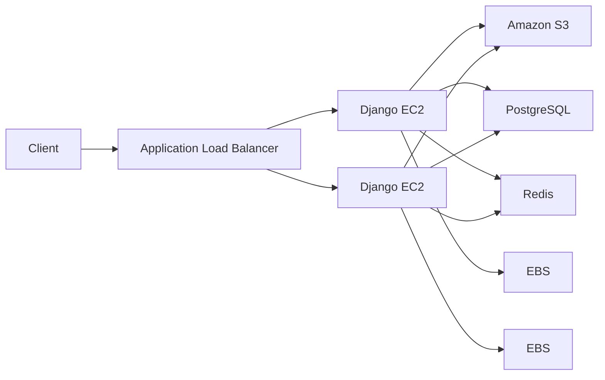

# 04- Storage Questions

## Overview

EC2 storage interview questions usually test whether you understand the difference between compute-local storage, persistent block storage, shared file storage, snapshots, AMIs, and application-level persistence.

The key storage model is:

```text
                    EC2
                     |
          +----------+----------+
          |                     |
      Instance Store           EBS
          |                     |
      Ephemeral              Persistent
          |                     |
          |              +------+------+
          |              |             |
        Local          Root          Data
                       Volume        Volume
                                      |
                                      v
                                  Snapshot
                                      |
                                      v
                                     AMI
```

For production backend systems, storage decisions affect:

- Data durability
- Performance
- Availability
- Recovery time
- Backup strategy
- Application architecture
- Scaling
- Cost
- Disaster recovery

A strong interview answer should not stop at "EBS is persistent." Explain **what persists, across which lifecycle events, how the storage is accessed, and what happens during failure or replacement**.

---

## EBS vs Instance Store

### What is EBS?

Amazon Elastic Block Store (EBS) provides persistent block storage for EC2 instances.

An EBS volume behaves like a block device attached to an EC2 instance.

Typical architecture:

```text
EC2
 |
 +---- Root EBS Volume
 |
 +---- Data EBS Volume
 |
 +---- Logs EBS Volume
```

Inside Linux, an attached volume may appear as:

```text
/dev/nvme0n1
/dev/nvme1n1
```

The application or operating system can create filesystems on these block devices.

---

### What is Instance Store?

Instance store provides temporary block-level storage physically associated with the host running the EC2 instance.

It is intended for temporary or ephemeral data.

Typical use cases include:

- Temporary processing data
- Caches
- Scratch space
- Temporary files
- High-performance local workloads where supported

It should not be the sole location for durable business data.

---

### EBS vs Instance Store

| Feature | EBS | Instance Store |
|---|---|---|
| Persistence | Persistent | Ephemeral |
| Independent lifecycle | Yes | No |
| Snapshot support | Yes | No EBS-style snapshots |
| Can survive instance stop | Generally yes | No |
| Can survive instance termination | Depends on configuration and deletion behavior | No |
| Network-attached | Yes | Host-local |
| Typical use | OS, databases, application data | Temporary/scratch data |
| Backup strategy | Snapshots/backup services | Application-level regeneration |

The important interview distinction is:

> EBS is persistent block storage; instance store is ephemeral local storage.

---

## What Happens to EBS When an EC2 Instance Stops?

Stopping an EC2 instance generally preserves its EBS volumes.

For example:

```text
Running EC2
    |
    | stop
    v
Stopped EC2
    |
    +--> Root EBS preserved
    +--> Data EBS preserved
```

When the instance starts again, the volumes can be reattached and used.

However, whether a volume is automatically deleted when an instance is terminated depends on the volume's `DeleteOnTermination` configuration.

---

## What Happens to EBS When an EC2 Instance Terminates?

EBS volumes can have different termination behavior.

For example:

```text
Root Volume
DeleteOnTermination = true

Data Volume
DeleteOnTermination = false
```

After termination:

```text
EC2 terminated
     |
     +--> Root EBS deleted
     |
     +--> Data EBS retained
```

This is useful for separating disposable operating-system storage from persistent application data.

For production systems, do not rely on accidental retention behavior. Explicitly design the lifecycle and backup strategy.

---

## Root Volume vs Data Volume

A production EC2 architecture commonly separates:

```text
EC2
 |
 +---- /dev/root
 |       |
 |       +--> OS
 |       +--> Application runtime
 |
 +---- /dev/data
         |
         +--> Application data
         +--> Logs
         +--> Other persistent files
```

The exact layout depends on the workload.

For immutable infrastructure, the root volume should generally contain reproducible system and application state, while persistent business data should live in a deliberately managed storage system.

---

## What is an EBS Volume?

An EBS volume is a persistent block device that can be attached to an EC2 instance.

It is useful when an application requires:

- Block storage semantics
- Filesystem access
- Persistent data
- Predictable storage performance
- Independent volume lifecycle

Typical backend workloads include:

- PostgreSQL on EC2
- Application files
- Build artifacts
- Large local datasets
- Persistent worker data

---

## EBS Volume Types

Common EBS volume families include:

| Type | Typical characteristic | Common use |
|---|---|---|
| `gp3` | General-purpose SSD | Most application workloads |
| `io2` | Provisioned IOPS SSD | High-performance / critical databases |
| `st1` | Throughput-oriented HDD | Large sequential workloads |
| `sc1` | Cold HDD | Infrequently accessed sequential data |

For most general-purpose backend workloads, `gp3` is a common starting point.

The correct choice depends on:

- IOPS
- Throughput
- Latency
- Capacity
- Workload pattern
- Availability requirements
- Cost

---

## IOPS vs Throughput

### What are IOPS?

IOPS means Input/Output Operations Per Second.

It measures how many I/O operations a storage system can process per second.

High-IOPS workloads often involve:

```text
Many small random reads/writes
```

Examples:

- OLTP databases
- PostgreSQL indexes
- Transaction-heavy applications

---

### What is throughput?

Throughput measures how much data can be transferred per second.

Typical unit:

```text
MiB/s
```

High-throughput workloads often involve:

```text
Large sequential reads/writes
```

Examples:

- Data processing
- Large file processing
- ETL workloads
- Log processing

---

### IOPS vs Throughput

| Workload | Important characteristic |
|---|---|
| Database random I/O | IOPS + latency |
| Large sequential file processing | Throughput |
| Small API writes | IOPS + latency |
| Batch analytics | Throughput |
| PostgreSQL transactional workload | IOPS + latency |

Do not automatically increase volume size or IOPS without measuring the actual bottleneck.

---

## What is EBS Provisioned IOPS?

Provisioned IOPS allows workloads to provision a specific level of I/O performance supported by the selected volume type.

This is useful for predictable, performance-sensitive workloads.

Examples:

- Critical database workloads
- High transaction rates
- Latency-sensitive systems

The tradeoff is cost and operational complexity.

Use measured workload requirements rather than selecting provisioned IOPS simply because the application is considered "production."

---

## What is an EBS Snapshot?

An EBS snapshot is a point-in-time backup mechanism for an EBS volume.

Conceptually:

```text
EBS Volume
    |
    v
Snapshot
    |
    +--> Restore to new volume
    |
    +--> Copy to another Region
    |
    +--> Build AMI workflows
```

Snapshots are useful for:

- Backup
- Disaster recovery
- Data migration
- Creating new volumes
- AMI workflows

---

## How Do EBS Snapshots Work?

EBS snapshots are incremental at the storage layer after the initial snapshot.

Conceptually:

```text
Snapshot 1
    |
    +--> Initial data

Snapshot 2
    |
    +--> Changed blocks

Snapshot 3
    |
    +--> Further changed blocks
```

The operational interface presents snapshots as complete restore points even though AWS optimizes the underlying storage of snapshot data.

Do not design application logic around assumptions about the physical implementation of snapshot storage.

---

## Crash-Consistent vs Application-Consistent Backups

A storage snapshot captures storage state, but a database may have in-flight transactions or buffered writes.

For critical databases, consider application-aware backup procedures.

For example:

```text
Application
    |
    v
PostgreSQL
    |
    +--> Database-native backup
    |
    +--> EBS snapshot strategy
```

Database-native backups can provide recovery capabilities that a raw storage snapshot alone may not provide.

The appropriate strategy depends on:

- RPO
- RTO
- Database technology
- Workload
- Recovery requirements

---

## Can an EBS Snapshot Be Used as a Backup?

Yes, but a snapshot should be treated as one component of a broader backup strategy.

A production strategy should define:

- Backup frequency
- Retention
- Cross-Region strategy
- Encryption
- Restore testing
- Recovery procedures
- RPO
- RTO

A backup that has never been restored is not fully validated.

---

## EBS Encryption

EBS volumes can be encrypted.

Encryption helps protect:

- Data at rest
- Snapshots
- Data copies derived from encrypted volumes

AWS KMS can be used to manage encryption keys.

A production architecture should establish:

```text
EBS
 |
 v
Encryption
 |
 v
KMS
 |
 v
IAM permissions
```

Access to encrypted storage is therefore both a storage and identity/security concern.

---

## Can an Encrypted EBS Volume Be Snapshotted?

Yes.

Snapshots of encrypted EBS volumes remain encrypted.

When copying or restoring encrypted storage, key permissions and key-management configuration must also be considered.

Do not treat encryption as purely a storage setting; operational access to the relevant KMS keys matters.

---

## EBS Availability and Availability Zones

An EBS volume is associated with a specific Availability Zone.

For example:

```text
us-east-1a
    |
    +--> EC2
    |
    +--> EBS
```

An EBS volume is not a regional shared disk that can simply be attached to an arbitrary EC2 instance in another Availability Zone.

For cross-AZ recovery, snapshots or other replication mechanisms may be required.

This is an important interview distinction.

---

## Can an EBS Volume Be Attached to Multiple EC2 Instances?

Certain EBS configurations support Multi-Attach.

However, Multi-Attach does not automatically make a normal filesystem safe for concurrent writes from multiple independent operating systems.

For example:

```text
EC2-A ----+
          |
          v
       EBS Volume
          ^
          |
EC2-B ----+
```

The application and filesystem must support the required concurrent-access semantics.

A common interview mistake is:

> "EBS Multi-Attach means multiple EC2 instances can safely mount the same filesystem."

That is not generally true.

---

## EBS Multi-Attach

Multi-Attach can be useful for specialized clustered applications that understand shared block-device access.

Potential requirements include:

- Supported EBS volume configuration
- Compatible EC2 instances
- Cluster-aware software
- Appropriate filesystem or application semantics
- Correct locking

For ordinary Django, FastAPI, PostgreSQL, or file-based applications, shared block storage should not be introduced casually.

---

## EFS vs EBS

### Why use EFS instead of EBS?

EFS provides shared file storage that multiple compute resources can access concurrently.

Typical architecture:

```text
EC2-A ----+
          |
EC2-B ----+----> EFS
          |
EC2-C ----+
```

This differs fundamentally from typical EBS usage:

```text
EC2 ----> EBS
```

---

### EBS vs EFS

| Feature | EBS | EFS |
|---|---|---|
| Storage model | Block | File |
| Typical attachment | Instance-oriented | Shared |
| Multi-instance access | Specialized configurations | Native shared filesystem model |
| Common use | OS/data volumes | Shared application files |
| Scaling model | Volume-oriented | Elastic file storage |
| Typical database use | Common | Usually not the default database storage model |

Use EBS when the application needs block-device semantics.

Use EFS when multiple compute resources need shared file-system access.

---

## EBS vs S3

S3 is object storage, not block storage.

```text
EBS
Application
   |
   v
Block device
   |
   v
Filesystem
```

Versus:

```text
S3
Application
   |
   v
HTTP/API
   |
   v
Object
```

S3 is usually better for:

- Backups
- Media
- Documents
- Static assets
- Data lakes
- Large immutable objects

EBS is better for:

- Filesystems
- OS disks
- Database block storage
- Low-level block I/O

---

## Storage Selection

| Requirement | Typical AWS storage |
|---|---|
| EC2 OS disk | EBS |
| Persistent application block storage | EBS |
| High-performance database block storage | EBS |
| Shared filesystem across EC2 | EFS |
| Object storage | S3 |
| Temporary local scratch data | Instance Store |
| Backup/archive objects | S3 / backup services |
| Static web assets | S3 |
| User-uploaded media | S3 |

The architecture should select storage based on access semantics rather than simply storage capacity.

---

## Database Storage on EC2

Consider PostgreSQL running on EC2:

```text
EC2
 |
 +---- OS EBS
 |
 +---- PostgreSQL data EBS
 |
 +---- PostgreSQL WAL/storage
 |
 +---- Backup strategy
```

The database workload may be sensitive to:

- IOPS
- Latency
- Throughput
- Queue depth
- Volume capacity
- Filesystem configuration
- Database connection count
- Memory/cache behavior

Increasing EBS performance will not solve a database bottleneck caused by inefficient SQL, insufficient memory, locking, or excessive connections.

---

## Django and FastAPI Storage

Django and FastAPI applications should generally avoid treating an EC2 local filesystem as durable application state.

For example:

```text
User upload
    |
    v
Django / FastAPI
    |
    v
S3
```

rather than:

```text
User upload
    |
    v
EC2 local filesystem
```

This becomes especially important with Auto Scaling:

```text
               ALB
              /   \
             v     v
           EC2-A EC2-B
             |     |
             X     X
        Local files differ
```

Object storage or shared storage prevents instance-local state from becoming a scaling problem.

---

## Auto Scaling and Persistent Storage

An Auto Scaling Group expects instances to be replaceable.

This architecture is problematic:

```text
ASG
 |
 +--> EC2-A
       |
       +--> Important application data
```

If EC2-A is terminated:

```text
EC2-A
  |
  X
Terminated
```

the application may lose state.

A better design is:

```text
ASG
 |
 +---- EC2-A
 |
 +---- EC2-B
 |
 +---- EC2-C
 |
 +--------> S3 / EFS / Database
```

Compute instances should ideally be disposable.

---

## Storage and Containerized Applications

Docker containers should generally not rely on container-local storage for durable business data.

Example:

```text
Docker Container
       |
       X
Container filesystem
```

Instead:

```text
Container
   |
   +--> PostgreSQL
   +--> Redis
   +--> S3
   +--> EFS
```

depending on the data requirements.

When Docker runs on EC2, EBS may still be used underneath the host, but application-level persistence should be intentionally designed.

---

## Kubernetes and Persistent Volumes

In Kubernetes, persistent storage is abstracted through resources such as:

```text
Pod
 |
 v
PersistentVolumeClaim
 |
 v
Storage implementation
 |
 v
EBS / EFS / other storage
```

The important distinction is between:

- Pod lifecycle
- Volume lifecycle
- Application data lifecycle

A pod being replaced should not automatically mean business data is lost.

---

## Storage Performance Troubleshooting

When storage performance is poor, investigate multiple layers:

```text
Application
    |
    v
Database
    |
    v
Filesystem
    |
    v
Block device
    |
    v
EBS
    |
    v
AWS infrastructure
```

Useful Linux commands include:

```bash
lsblk
df -h
df -i
iostat -xz 1
vmstat 1
```

For database workloads, also inspect:

- Query latency
- Slow queries
- Lock contention
- Buffer/cache behavior
- Connection count
- Checkpoint behavior
- WAL activity

---

## Disk Full vs Inode Exhaustion

A filesystem can fail because:

```text
Disk capacity = full
```

or:

```text
Inodes = exhausted
```

Check both:

```bash
df -h
df -i
```

A common mistake is checking only disk capacity.

Applications generating millions of small files can exhaust inodes before exhausting total storage capacity.

---

## EBS Volume Expansion

EBS volumes can be modified to increase capacity and, for supported configurations, performance characteristics.

A typical operational flow is:

```text
Measure usage
    |
    v
Modify EBS volume
    |
    v
Wait for modification
    |
    v
Extend partition if required
    |
    v
Grow filesystem
    |
    v
Validate
```

Increasing the EBS volume does not necessarily mean the operating system filesystem automatically consumes the new space.

For Linux, validation commonly includes:

```bash
lsblk
df -h
```

The exact partition and filesystem commands depend on the operating system and filesystem.

---

## Snapshot-Based Recovery

A typical recovery workflow is:

```text
EBS Volume
    |
    v
Snapshot
    |
    v
Create New EBS Volume
    |
    v
Attach to EC2
    |
    v
Mount
    |
    v
Validate Data
```

Do not consider the operation complete until:

- Files are accessible
- Permissions are correct
- Filesystem is healthy
- Application can read/write as expected
- Data integrity is validated

---

## Cross-Region Disaster Recovery

A single-region backup strategy may not satisfy stronger disaster recovery requirements.

A simplified cross-region model is:

```text
Primary Region
    |
    v
EBS Snapshot
    |
    v
Snapshot Copy
    |
    v
Secondary Region
    |
    v
Restore EBS Volume
    |
    v
Recovery EC2
```

Cross-Region recovery introduces additional concerns:

- Replication/copy time
- Storage cost
- KMS keys
- AMIs
- Networking
- IAM
- DNS
- Application configuration
- Dependency availability
- RPO/RTO

---

## Backup Strategy for EC2

A production backup strategy should define:

| Concern | Example decision |
|---|---|
| Frequency | Hourly / daily |
| Retention | 7 / 30 / 90 days |
| Cross-Region | Required / not required |
| Encryption | KMS-encrypted |
| Automation | AWS Backup / scheduled workflow |
| Validation | Periodic restore tests |
| RPO | Maximum acceptable data loss |
| RTO | Maximum acceptable recovery time |

The correct values depend on business requirements.

---

## Storage Security

Storage security should cover:

- Encryption at rest
- KMS key access
- IAM permissions
- Snapshot permissions
- Backup access
- Least privilege
- Data classification
- Secure deletion requirements

Snapshots can contain sensitive data.

Therefore, treating snapshots as harmless infrastructure metadata is a security mistake.

---

## Cost Considerations

Storage cost is affected by more than volume capacity.

Consider:

```text
Volume capacity
+
Provisioned performance
+
Snapshots
+
Cross-Region copies
+
Backup retention
+
Unused volumes
+
Unused snapshots
```

Common cost problems include:

- Detached EBS volumes left indefinitely
- Unnecessary high-performance volumes
- Excessive snapshot retention
- Duplicate backups
- Oversized volumes
- Unused development environments

Tag storage resources so ownership and lifecycle can be identified.

---

## Common Storage Interview Questions

### When would you choose EBS over EFS?

Use EBS when the workload requires block storage semantics and typically has instance-oriented attachment requirements.

Use EFS when multiple compute resources need shared file-system access.

---

### When would you choose EBS over S3?

Use EBS when the application requires a block device or filesystem.

Use S3 when the application can work with objects through an API.

---

### Why should application servers not store user uploads locally?

Because EC2 instances can be replaced, scaled horizontally, or terminated.

A local filesystem creates instance-specific state.

For scalable applications:

```text
Client
  |
  v
API
  |
  v
S3
```

is generally preferable for durable user-uploaded objects.

---

### What happens to data if an EC2 instance is terminated?

The answer depends on where the data resides.

| Storage | Typical result |
|---|---|
| Instance store | Lost |
| EBS with `DeleteOnTermination=true` | Deleted with instance |
| EBS with `DeleteOnTermination=false` | Volume retained |
| EFS | Independent of EC2 lifecycle |
| S3 | Independent of EC2 lifecycle |

The key interview skill is to ask **where the data actually resides**.

---

### Can you use EBS as a shared filesystem?

EBS is fundamentally block storage.

Some EBS configurations support Multi-Attach, but safe concurrent access requires software and filesystem semantics designed for shared block access.

Do not equate Multi-Attach with a general-purpose shared filesystem.

---

### What is the difference between a snapshot and an AMI?

An EBS snapshot represents a point-in-time backup of an EBS volume.

An AMI is an image definition used to launch EC2 instances and can reference one or more snapshots for EBS-backed storage.

Conceptually:

```text
EBS Volume
    |
    v
Snapshot
    |
    v
AMI
    |
    v
New EC2 Instance
```

An AMI therefore represents a launchable machine image rather than merely a single volume backup.

---

## Interview Scenario: EC2 Instance Terminated and Application Data Disappeared

First identify the storage location.

```text
Application
    |
    +--> Instance Store?
    |
    +--> EBS?
    |
    +--> EFS?
    |
    +--> S3?
    |
    +--> Database?
```

Then inspect:

- Instance termination behavior
- `DeleteOnTermination`
- Existing snapshots
- Backup system
- Application architecture
- Recovery options

Do not assume that "EC2 storage" is one type of storage.

---

## Interview Scenario: EBS Volume Is Full

A senior-level troubleshooting sequence is:

```text
df -h
    |
    v
Identify full filesystem
    |
    v
du / find large files
    |
    v
Check deleted-but-open files
    |
    v
Check inode usage
    |
    v
Determine cleanup vs expansion
    |
    v
Modify volume if required
    |
    v
Expand partition/filesystem
    |
    v
Validate application
```

For deleted-but-open files, tools such as `lsof` can help identify processes still holding file descriptors.

---

## Interview Scenario: Database Is Slow After Moving to EC2

Do not immediately increase EBS IOPS.

Investigate:

```text
Application latency
       |
       v
Database query latency
       |
       v
CPU / memory
       |
       v
Database locks
       |
       v
Connection count
       |
       v
Disk latency / IOPS
       |
       v
EBS performance
```

Storage may be the bottleneck, but it should be demonstrated through metrics.

---

## Interview Scenario: Auto Scaling Causes Missing Files

Suppose:

```text
EC2-A
  |
  +--> /uploads/file.pdf

EC2-B
  |
  X--> file.pdf does not exist
```

The problem is local instance state.

Possible solutions include:

- S3 for object storage
- EFS for shared filesystem semantics
- Database for metadata
- External durable storage

The solution depends on how the application consumes the data.

---

## Storage Architecture for a Django Application

A production-oriented Django deployment might use:



Here:

- EBS provides instance-level block storage.
- S3 stores durable application objects.
- PostgreSQL stores relational application state.
- Redis provides cache/session/temporary state depending on architecture.
- EC2 instances remain replaceable.

This separation prevents the EC2 filesystem from becoming the source of truth for business data.

---

## Production Storage Checklist

```text
[ ] Storage requirements identified
[ ] EBS vs EFS vs S3 decision documented
[ ] Root and data volumes intentionally designed
[ ] EBS volume types selected from workload metrics
[ ] IOPS and throughput requirements measured
[ ] EBS encryption enabled where required
[ ] KMS permissions reviewed
[ ] DeleteOnTermination behavior verified
[ ] Snapshot strategy configured
[ ] Backup retention defined
[ ] Restore testing performed
[ ] Cross-Region DR requirements evaluated
[ ] Auto Scaling does not depend on local persistent state
[ ] Disk and inode usage monitored
[ ] EBS performance monitored
[ ] Detached volumes reviewed
[ ] Snapshot lifecycle reviewed
[ ] Storage resources tagged
```

## Key Takeaways

- **EBS provides persistent block storage, instance store is ephemeral host-local storage, EFS provides shared file storage, and S3 provides object storage; choose based on access semantics rather than capacity alone.**
- **EBS lifecycle behavior matters: stopping an instance generally preserves EBS volumes, while termination can delete volumes configured with `DeleteOnTermination=true`.**
- **Storage performance must be analyzed using IOPS, throughput, latency, filesystem behavior, database behavior, and application metrics rather than increasing EBS performance blindly.**
- **Production EC2 instances should be replaceable; durable application state should live in deliberately managed storage such as EBS with an appropriate lifecycle, EFS, S3, or a database.**
- **Backups are only useful when recovery is tested; production storage design should explicitly address encryption, retention, RPO, RTO, cross-Region recovery, cost, and restore validation.**