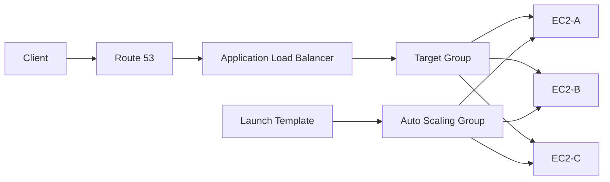

# 05- Auto Scaling and Load Balancing Questions

## Overview

EC2 Auto Scaling and load balancing solve different but complementary problems:

- **Load balancing** distributes incoming traffic across healthy application targets.
- **Auto Scaling** changes the number of compute instances based on demand, health, or operational requirements.
- **Health checks** determine whether a target or instance should receive traffic or remain in service.
- **Launch Templates** define how new EC2 instances are created.
- **Auto Scaling Groups (ASGs)** maintain the desired compute capacity.
- **Load Balancers** provide a stable entry point while instances are added, removed, or replaced.

A typical production architecture is:

```text
                         Internet
                            |
                            v
                         Route 53
                            |
                            v
                       Load Balancer
                            |
                 +----------+----------+
                 |                     |
                 v                     v
              EC2-A                 EC2-B
                 |                     |
                 +----------+----------+
                            |
                            v
                     Application Tier
                            |
                +-----------+-----------+
                |                       |
                v                       v
            PostgreSQL                Redis
```

The key interview principle is:

> The load balancer manages traffic distribution; the Auto Scaling Group manages compute capacity.

---

## What Is an Auto Scaling Group?

An Auto Scaling Group is a logical collection of EC2 instances that maintains a configured capacity range.

Typical configuration:

```text
Minimum capacity: 2
Desired capacity: 4
Maximum capacity: 10
```

The ASG attempts to maintain:

```text
2 <= Running Instances <= 10
```

depending on scaling policies, health state, lifecycle events, and other configuration.

---

## Why Use an Auto Scaling Group?

Without an ASG:

```text
Client
  |
  v
EC2
```

If the instance fails:

```text
EC2
  |
  X
Failure
```

the application may become unavailable.

With an ASG:

```text
              Auto Scaling Group
             /        |        \
            v         v         v
          EC2-A     EC2-B     EC2-C
```

If one instance becomes unhealthy, the ASG can replace it according to its configured health checks and lifecycle behavior.

---

## Minimum, Desired, and Maximum Capacity

| Setting | Meaning |
|---|---|
| Minimum | Lowest capacity the ASG should maintain |
| Desired | Target number of instances |
| Maximum | Upper capacity limit |

Example:

```text
min = 2
desired = 4
max = 10
```

The desired capacity is not necessarily a permanent fixed number.

Scaling policies can change it.

```text
Normal load
desired = 4

High load
desired = 8

Low load
desired = 3
```

---

## What Is a Launch Template?

A Launch Template defines how EC2 instances should be launched.

It can specify:

- AMI
- Instance type
- IAM instance profile
- Security Groups
- EBS configuration
- User Data
- Network settings
- Key pair
- Metadata configuration
- Purchasing-related options where supported

Conceptually:

```text
Launch Template
       |
       v
Auto Scaling Group
       |
       +----> EC2
       +----> EC2
       +----> EC2
```

The ASG uses the launch template as the instance creation blueprint.

---

## Launch Template vs AMI

An AMI is primarily the machine image.

A Launch Template describes how that image should be launched.

```text
AMI
 |
 +--> OS
 +--> Installed packages
 +--> Application artifacts
 |
 v
Launch Template
 |
 +--> Instance type
 +--> Security Groups
 +--> IAM role
 +--> EBS
 +--> User Data
 |
 v
EC2
```

A production deployment commonly combines a versioned AMI with a versioned Launch Template.

---

## Why Are Launch Template Versions Important?

Suppose:

```text
Launch Template v1
    |
    +--> Old application

Launch Template v2
    |
    +--> New application
```

The ASG can be updated to use the newer version.

This supports controlled infrastructure changes and makes configuration history easier to reason about.

A common mistake is modifying infrastructure manually on individual instances and assuming future instances will inherit those changes.

They will not unless the launch configuration is updated.

---

## What Is a Load Balancer?

A load balancer provides a stable endpoint and distributes network traffic across registered targets.

Typical architecture:

```text
Client
  |
  v
Load Balancer
  |
  +----> EC2-A
  |
  +----> EC2-B
  |
  +----> EC2-C
```

The client does not need to know the individual EC2 addresses.

This is essential when instances are dynamically created and terminated.

---

## Why Is a Load Balancer Needed with Auto Scaling?

An ASG may create and terminate instances.

Therefore, clients should not directly depend on individual EC2 addresses.

Without a load balancer:

```text
Client
  |
  +----> EC2-A
  +----> EC2-B
  +----> EC2-C
```

The client needs to discover changing instances.

With a load balancer:

```text
Client
  |
  v
Stable Load Balancer
  |
  +----> EC2-A
  +----> EC2-B
  +----> EC2-C
```

The infrastructure can change behind the stable endpoint.

---

## Auto Scaling and Load Balancing Relationship

A common architecture is:



The responsibilities are separated:

```text
Route 53
    |
    +--> DNS resolution

ALB
    |
    +--> Traffic distribution

Target Group
    |
    +--> Target registration and health

ASG
    |
    +--> Instance capacity and replacement

Launch Template
    |
    +--> Instance configuration
```

---

## What Is a Target Group?

A target group is a logical collection of targets used by a load balancer.

For an EC2-backed application:

```text
ALB
 |
 v
Target Group
 |
 +--> EC2-A
 +--> EC2-B
 +--> EC2-C
```

A target group also defines health-check behavior and the port/protocol used to communicate with targets.

---

## How Does an ASG Register Instances with a Load Balancer?

An ASG can be associated with a target group.

When an instance is launched:

```text
ASG
 |
 v
Launch EC2
 |
 v
Register target
 |
 v
Health check
 |
 v
Receive traffic
```

When an instance is removed:

```text
ASG
 |
 v
Terminate / detach instance
 |
 v
Remove target
 |
 v
Stop receiving traffic
```

This allows compute capacity to change without manually updating the load balancer.

---

## What Is a Health Check?

A health check determines whether a target is healthy enough to receive traffic.

For an HTTP application:

```text
ALB
 |
 | GET /health
 v
EC2
 |
 +--> 200 OK
```

The target can be considered healthy when it satisfies the configured health-check requirements.

---

## What Should a Health Endpoint Do?

A health endpoint should be:

- Fast
- Lightweight
- Deterministic
- Safe to call frequently
- Representative of the service's ability to serve requests

Example:

```python
from fastapi import FastAPI

app = FastAPI()


@app.get("/health")
def health() -> dict[str, str]:
    return {"status": "ok"}
```

A simple liveness endpoint should not necessarily execute expensive database queries on every health check.

For deeper dependency validation, use a separate readiness or dependency-health mechanism where appropriate.

---

## Liveness vs Readiness

A useful production distinction is:

```text
Liveness
    |
    +--> Is the process alive?

Readiness
    |
    +--> Can this instance safely receive traffic?
```

For example:

```text
/health/live
/health/ready
```

Readiness may check critical dependencies when appropriate.

Avoid making every dependency a hard requirement if the service can legitimately operate without it.

---

## What Happens When a Target Becomes Unhealthy?

A typical flow is:

```text
ALB
 |
 | Health check
 v
EC2
 |
 X
Failure
 |
 v
Target marked unhealthy
 |
 v
ALB stops routing new requests
```

The instance itself may still be running.

This distinction is important:

> A target can be unhealthy from the load balancer's perspective while the EC2 instance remains in the `running` state.

---

## EC2 Health vs ALB Health vs ASG Health

These represent different layers.

| Health signal | Primary concern |
|---|---|
| EC2 system status check | Underlying AWS infrastructure |
| EC2 instance status check | Instance/OS-level condition |
| ALB target health | Application/network endpoint |
| ASG health | Whether an instance should remain in the group |

For troubleshooting:

```text
EC2 healthy
   |
   X
ALB target unhealthy
```

means you should investigate the application path, port, listener, Security Groups, NACLs, routing, and health-check configuration.

---

## Scaling Policies

Auto Scaling can use different scaling strategies.

Common approaches include:

- Target tracking
- Step scaling
- Simple scaling
- Scheduled scaling
- Predictive scaling

The appropriate strategy depends on workload characteristics.

---

## Target Tracking Scaling

Target tracking attempts to maintain a metric near a configured target.

For example:

```text
Target CPU utilization = 50%
```

Conceptually:

```text
CPU increases
    |
    v
Scaling policy
    |
    v
Desired capacity increases
    |
    v
More EC2 instances
    |
    v
Average CPU decreases
```

Target tracking is useful when a relatively stable metric correlates with capacity requirements.

---

## Step Scaling

Step scaling changes capacity according to the magnitude of a metric breach.

Example:

```text
CPU < 50%       -> no scaling

CPU 50-70%      -> +1 instance

CPU 70-85%      -> +2 instances

CPU > 85%       -> +4 instances
```

This provides more explicit control than a simple one-threshold model.

---

## Scheduled Scaling

Scheduled scaling is useful when demand follows predictable patterns.

Example:

```text
08:00 -> increase capacity
18:00 -> reduce capacity
```

Typical workloads include:

- Business-hour applications
- Batch processing
- Predictable traffic patterns

Scheduled scaling should complement rather than replace reactive scaling when traffic can vary unexpectedly.

---

## Scaling Based Only on CPU

CPU is useful, but it is not universally the correct scaling signal.

An API may become constrained by:

- Request rate
- Response latency
- Database connections
- Queue depth
- Memory
- Network throughput
- Concurrent requests

For example:

```text
API requests
     |
     v
Queue depth
     |
     v
Worker count
```

For Celery workers, queue depth may be a more meaningful scaling signal than CPU.

---

## Application Load Balancer Request-Based Scaling

For web applications, metrics related to traffic can sometimes provide a better scaling signal than CPU alone.

Conceptually:

```text
Request rate increases
       |
       v
Requests per target increase
       |
       v
Scale out
       |
       v
More targets
       |
       v
Requests per target decrease
```

The metric should be chosen based on how the application consumes compute capacity.

---

## Scaling Policies and Cooldowns

Scaling too aggressively can cause oscillation:

```text
Scale out
   |
   v
Traffic/CPU decreases
   |
   v
Scale in
   |
   v
Traffic/CPU increases
   |
   v
Scale out again
```

This is called scaling thrash.

Production scaling requires:

- Appropriate evaluation periods
- Cooldown behavior
- Instance warm-up
- Stabilization
- Sensible scale-in thresholds
- Sufficient capacity headroom

---

## Instance Warm-Up

A new instance may not immediately be ready to serve traffic.

Startup can involve:

```text
EC2 launch
   |
   v
OS boot
   |
   v
User Data
   |
   v
Docker startup
   |
   v
Django/FastAPI startup
   |
   v
Database/cache initialization
   |
   v
Health check
   |
   v
Receive traffic
```

Scaling policies should account for this startup time.

Otherwise, the ASG may launch additional instances before earlier instances have become useful, causing unnecessary scale-out.

---

## Connection Draining and Instance Termination

When an instance is removed from service, active requests should be allowed to complete where supported by the load-balancing configuration.

Conceptually:

```text
Instance marked for removal
        |
        v
Stop new traffic
        |
        v
Existing requests complete
        |
        v
Instance terminates
```

This is particularly important for:

- Long-running API requests
- File downloads
- WebSockets
- Streaming
- gRPC connections

Application shutdown behavior should also be graceful.

---

## Auto Scaling with Django

A typical Django deployment is:

```text
Route 53
   |
   v
ALB
   |
   v
Target Group
   |
   +---- Django EC2
   +---- Django EC2
   +---- Django EC2
```

The Django application should ideally be stateless.

Avoid storing:

- User uploads
- Session state
- Important generated files
- Application state

only on the local instance filesystem.

Use appropriate external services such as:

- S3
- Redis
- PostgreSQL
- EFS

depending on the data type.

---

## Auto Scaling with FastAPI

A FastAPI service can similarly scale horizontally:

```text
ALB
 |
 +--> FastAPI-1
 +--> FastAPI-2
 +--> FastAPI-3
```

Each application instance should be independently replaceable.

For example, avoid relying on:

```python
global_state = {}
```

as durable shared application state.

Use external storage for state that must be shared between instances.

---

## Auto Scaling and Celery

Celery workers are a good example where queue depth may be more meaningful than HTTP request rate.

Architecture:

```text
Django / FastAPI
       |
       v
      Redis
       |
       v
   Celery Queue
       |
       +---- Worker
       +---- Worker
       +---- Worker
```

Scaling can be driven by:

```text
Queue depth
    |
    v
Worker capacity
```

This demonstrates why scaling metrics should reflect workload characteristics rather than being selected arbitrarily.

---

## Load Balancer Types

| Load Balancer | Primary layer | Typical use |
|---|---|---|
| ALB | Application | HTTP/HTTPS APIs and web applications |
| NLB | Transport | TCP/UDP/TLS workloads |
| Gateway Load Balancer | Network/security appliance integration | Network virtual appliances |

For a typical Django or FastAPI REST API, an ALB is commonly appropriate.

For TCP-based services or specialized high-performance networking, NLB may be more appropriate.

---

## ALB Listener and Target Group

The request path can be modeled as:

```text
Client
  |
  v
ALB Listener :443
  |
  v
Listener Rule
  |
  v
Target Group
  |
  v
EC2 :8000
```

For example:

```text
HTTPS :443
     |
     v
ALB
     |
     | HTTP :8000
     v
FastAPI
```

TLS termination can occur at the ALB depending on the architecture.

---

## Path-Based Routing

ALB can route requests based on application-layer properties such as paths.

Example:

```text
/api/orders/*
        |
        v
Order Service

/api/users/*
        |
        v
User Service
```

This can support service decomposition without exposing every backend service directly to the Internet.

---

## Host-Based Routing

Traffic can also be separated by hostname.

Example:

```text
api.example.com
    |
    v
API Target Group

admin.example.com
    |
    v
Admin Target Group
```

This allows multiple applications to share a load balancer while maintaining separate routing rules.

---

## Security Group Design

A common architecture is:

```text
Internet
   |
   | 443
   v
ALB-SG
   |
   | 8000
   v
EC2-SG
```

The EC2 Security Group should allow application traffic from the ALB Security Group rather than broadly from the Internet.

For example:

```text
ALB-SG
Inbound:
443 from Internet

EC2-SG
Inbound:
8000 from ALB-SG
```

This creates a clear network trust boundary.

---

## Availability Zone Distribution

A production ASG should normally distribute capacity across multiple Availability Zones.

Example:

```text
Region
 |
 +---- AZ-A
 |      |
 |      +--> EC2
 |      +--> EC2
 |
 +---- AZ-B
        |
        +--> EC2
        +--> EC2
```

If one Availability Zone experiences an infrastructure problem, the remaining zones can continue serving traffic if sufficient capacity remains.

---

## Load Balancer and Availability Zones

The load balancer should be configured across appropriate Availability Zones.

The application targets should also be distributed across those zones.

This avoids creating a single-zone dependency:

```text
Bad:

ALB
 |
 +--> AZ-A only
       |
       +--> EC2
```

Prefer:

```text
ALB
 |
 +----> AZ-A -> EC2
 |
 +----> AZ-B -> EC2
```

---

## What Happens During an Availability Zone Failure?

A resilient architecture should have:

```text
AZ-A
 |
 +--> EC2
 +--> EC2

AZ-B
 |
 +--> EC2
 +--> EC2
```

If AZ-A becomes unavailable:

```text
AZ-A
 |
 X

AZ-B
 |
 +--> EC2
 +--> EC2
```

The remaining capacity can continue serving traffic.

The ASG and load balancer should be configured so that recovery is not dependent on manual instance creation.

---

## Health Checks and Auto Scaling Replacement

A critical interview distinction is:

> Load balancer health and Auto Scaling health are related but not identical.

An ASG can use load balancer health information when configured appropriately.

The conceptual flow is:

```text
ALB
 |
 | Target health
 v
ASG
 |
 | unhealthy instance
 v
Replace instance
 |
 v
Launch from Launch Template
 |
 v
Register target
 |
 v
Health check passes
 |
 v
Receive traffic
```

The exact replacement behavior depends on the ASG and health-check configuration.

---

## Instance Refresh

Instance refresh is useful when instances need to be replaced with a new configuration.

Typical reasons include:

- New AMI
- New Launch Template version
- OS updates
- Application release
- Security patching

Conceptually:

```text
Old fleet
  |
  v
Instance Refresh
  |
  +--> Replace instances gradually
  |
  v
New fleet
```

Production refreshes should consider:

- Minimum healthy percentage
- Maximum healthy percentage
- Warm-up
- Health checks
- Deployment speed
- Rollback strategy

---

## Blue/Green Deployment

A blue/green model maintains two environments:

```text
Blue
 |
 +--> Current version

Green
 |
 +--> New version
```

Traffic can then be shifted:

```text
ALB
 |
 +----> Blue
 |
 +----> Green
```

This separates deployment from instance mutation and can make rollback easier.

---

## Rolling Deployment

A rolling strategy gradually replaces instances.

```text
Old Old Old Old

   |
   v

New Old Old Old

   |
   v

New New Old Old

   |
   v

New New New New
```

This reduces the need to replace the entire fleet at once.

However, deployment safety depends on:

- Health checks
- Capacity
- Compatibility
- Database migrations
- Graceful shutdown
- Rollback capability

---

## Database Migrations During Auto Scaling

A dangerous deployment pattern is:

```text
New application instances
       |
       v
Expect new database schema

Old application instances
       |
       v
Expect old schema
```

If the schema change is not backward compatible, rolling deployments can fail.

Prefer backward-compatible migration strategies such as:

```text
Expand
  |
  v
Deploy compatible application
  |
  v
Migrate data
  |
  v
Contract
```

This is particularly important when an ASG contains mixed application versions during deployment.

---

## Auto Scaling Failure Modes

Common failure scenarios include:

- Instances fail health checks
- Launch Template misconfiguration
- AMI boot failure
- User Data failure
- Incorrect IAM role
- Incorrect Security Group
- Insufficient capacity
- Subnet IP exhaustion
- Failed application startup
- Incorrect health-check path
- Incorrect health-check port
- Dependency unavailable
- Database connection exhaustion

A repeated replacement loop is a signal to investigate the common configuration rather than repeatedly terminating instances.

---

## Instance Replacement Loop

Example:

```text
Launch instance
      |
      v
Health check fails
      |
      v
Terminate instance
      |
      v
Launch replacement
      |
      v
Health check fails
      |
      v
Repeat
```

Common root causes include:

```text
Launch Template
       |
       +--> Wrong AMI
       +--> Wrong port
       +--> Wrong Security Group
       +--> Broken User Data
       +--> Missing IAM permissions
       +--> Application startup failure
       +--> Incorrect health endpoint
```

The correct response is to inspect logs and configuration before continuing disruptive actions.

---

## Load Balancer Health Check Failures

Suppose the application listens on:

```text
127.0.0.1:8000
```

but the ALB expects:

```text
EC2:8000
```

The ALB may fail to connect.

For production application servers, ensure the service binds to an appropriate interface.

For example, Uvicorn might be configured as:

```bash
uvicorn app.main:app --host 0.0.0.0 --port 8000
```

For Gunicorn:

```bash
gunicorn config.wsgi:application \
    --bind 0.0.0.0:8000 \
    --workers 4
```

The exact worker configuration should be based on workload and resource measurements.

---

## Scaling Based on Latency

Latency can be a valuable operational signal.

For example:

```text
P95 latency increases
        |
        v
More capacity required
        |
        v
Scale out
```

However, latency is often a downstream symptom.

Before scaling solely on latency, investigate:

- Database latency
- External API latency
- Lock contention
- CPU
- Memory
- Connection pools
- Network constraints

Scaling application instances cannot fix every source of latency.

---

## Queue-Based Scaling

For asynchronous systems:

```text
Producer
   |
   v
Kafka / SQS / Redis
   |
   v
Workers
```

A useful scaling signal can be:

```text
Queue depth
      +
Message age
      |
      v
Worker capacity
```

This is often more representative than CPU utilization for background workloads.

---

## Load Balancing WebSockets and Long-Lived Connections

Long-lived connections behave differently from short HTTP requests.

Examples:

- WebSockets
- Server-sent events
- Streaming
- gRPC streams

Consider:

- Connection duration
- Target deregistration
- Graceful shutdown
- Connection draining
- Idle timeouts
- Reconnection logic
- Client retry behavior

Scaling a fleet with long-lived connections requires more careful lifecycle handling than a short-request REST API.

---

## Sticky Sessions

Sticky sessions cause a client to continue being routed to the same target for a configured period.

Example:

```text
Client-A
   |
   v
ALB
   |
   v
EC2-A
```

The same client may continue reaching EC2-A.

Sticky sessions can simplify stateful legacy applications, but they reduce the flexibility of load distribution.

For modern backend systems, prefer externalizing session state where practical:

```text
EC2-A \
EC2-B  ---> Redis
EC2-C /
```

This allows requests to be served by any healthy instance.

---

## Stateless Application Design

A horizontally scalable application should ideally satisfy:

```text
Request
   |
   v
Any healthy instance
   |
   v
External shared state
```

instead of:

```text
Request
   |
   v
Specific instance
   |
   v
Local state
```

Externalize:

- Sessions
- Uploads
- Shared cache
- Persistent data
- Background job state

where appropriate.

---

## Monitoring Auto Scaling

Important signals include:

### EC2

- CPU utilization
- Memory where collected
- Network traffic
- Disk usage
- Disk I/O
- Status checks

### Load Balancer

- Request count
- Target response time
- HTTP error rates
- Target health
- Connection metrics
- Rejected connections where applicable

### ASG

- Desired capacity
- Current capacity
- Pending instances
- Terminating instances
- Scaling activities
- Instance health

Monitoring should answer:

```text
Do we have enough capacity?
Are instances healthy?
Are users receiving successful responses?
Why did scaling happen?
Was scaling fast enough?
```

---

## Cost Considerations

Auto Scaling can reduce cost by matching compute capacity to demand, but poor scaling configuration can increase costs.

Common causes include:

- Maximum capacity set too high
- Scaling policies too aggressive
- Instances remaining idle
- Overly long scale-in delays
- Large instance types
- Duplicate environments
- Unnecessary baseline capacity

Cost optimization should not compromise the capacity required for the application's SLOs.

---

## Common Mistakes

### Treating ASG as a Load Balancer

An ASG does not distribute application requests.

```text
ASG
 |
 +--> manages EC2 capacity
```

The load balancer handles traffic distribution.

---

### Treating a Load Balancer as an Auto Scaling System

A load balancer can detect unhealthy targets, but it does not replace the ASG's responsibility for maintaining compute capacity.

```text
Load Balancer
    |
    +--> Traffic distribution

ASG
    |
    +--> Capacity management
```

---

### Using CPU as the Only Scaling Metric

CPU may not correlate with actual demand.

For API workloads, consider:

- Requests per target
- Latency
- Queue depth
- Application concurrency
- Database pressure

---

### Storing State on EC2

This breaks horizontal scaling when requests can reach different instances.

Use external state where required.

---

### Incorrect Health Check

Bad:

```text
/health
```

implemented as an expensive database query executed every few seconds against every instance.

Better:

- Keep liveness checks lightweight.
- Use readiness checks when dependency validation is necessary.
- Monitor deeper dependency health separately.

---

### Scaling Faster Than Instances Can Start

If instances require several minutes to become healthy, aggressive scaling can cause:

```text
Traffic spike
    |
    v
Scale out
    |
    v
Instances boot slowly
    |
    v
Traffic continues increasing
    |
    v
Scale out again
```

This can produce unnecessary capacity growth.

---

### Ignoring Database Capacity

Scaling from:

```text
4 EC2 instances
```

to:

```text
20 EC2 instances
```

may multiply database connections.

For example:

```text
4 instances x 20 connections = 80

20 instances x 20 connections = 400
```

The database may become the bottleneck before EC2 does.

Scaling decisions must therefore consider downstream dependencies.

---

## Senior-Level Interview Questions

### How would you design a highly available EC2 application?

A typical answer should include:

```text
Route 53
    |
    v
ALB across AZs
    |
    v
ASG across multiple AZs
    |
    +--> EC2
    +--> EC2
    +--> EC2
    |
    +--> Externalized state
```

Then discuss:

- Health checks
- Multi-AZ distribution
- Stateless application design
- Database HA
- Caching
- Monitoring
- Backup
- Deployment strategy
- Failure recovery

---

### How would you handle a sudden 10x traffic increase?

A strong approach is:

```text
Traffic increase
      |
      v
Load balancer absorbs distribution
      |
      v
Scaling policy detects demand
      |
      v
ASG launches instances
      |
      v
Health checks validate targets
      |
      v
New targets receive traffic
```

Then evaluate whether downstream systems can scale:

```text
EC2
 |
 +--> PostgreSQL
 +--> Redis
 +--> Kafka
 +--> External APIs
```

Scaling only the application tier can move the bottleneck elsewhere.

---

### How would you prevent a bad AMI from breaking an entire fleet?

Use:

- Immutable/versioned AMIs
- Launch Template versions
- Instance refresh controls
- Health checks
- Staged deployments
- Deployment validation
- Rollback strategy
- Automated testing

A deployment system should make it possible to stop or roll back a bad rollout before the entire fleet is replaced.

---

### How would you diagnose an ASG continuously replacing instances?

Start with:

```text
ASG activity history
        |
        v
Instance status
        |
        v
Target health
        |
        v
Launch Template
        |
        v
User Data / startup logs
        |
        v
Application logs
```

Investigate common configuration rather than manually repairing every new instance.

---

## Production Architecture Checklist

```text
[ ] ASG spans multiple Availability Zones
[ ] Minimum capacity supports failure scenarios
[ ] Maximum capacity is intentionally bounded
[ ] Launch Template is versioned
[ ] AMIs are reproducible
[ ] Application is stateless where practical
[ ] Load balancer spans appropriate AZs
[ ] Target groups have correct ports
[ ] Health checks are lightweight and meaningful
[ ] Security Groups follow least privilege
[ ] Scaling metric matches workload behavior
[ ] Instance warm-up is accounted for
[ ] Scale-in behavior is safe
[ ] Graceful shutdown is implemented
[ ] Database connection capacity is considered
[ ] Redis/cache capacity is considered
[ ] Queue capacity is considered
[ ] Monitoring and alarms are configured
[ ] Deployment and rollback procedures are tested
[ ] Backup and DR strategy is independent of EC2 lifecycle
```

## Key Takeaways

- **Auto Scaling Groups manage EC2 capacity and replacement, while load balancers distribute traffic across healthy targets; production architectures normally use both together.**
- **Launch Templates provide reproducible instance configuration, while target groups provide the load balancer's logical collection of application targets and health checks.**
- **Scaling metrics should reflect the actual workload: CPU may be appropriate for some services, while request rate, latency, queue depth, or downstream capacity may be more meaningful for others.**
- **Highly available EC2 architectures distribute ASG capacity across Availability Zones, keep applications replaceable, externalize persistent state, and account for database and other downstream bottlenecks.**
- **Senior-level troubleshooting focuses on the complete lifecycle—launch, bootstrap, registration, health checks, traffic, scaling, graceful termination, and replacement—rather than treating individual EC2 instances as permanent servers.**