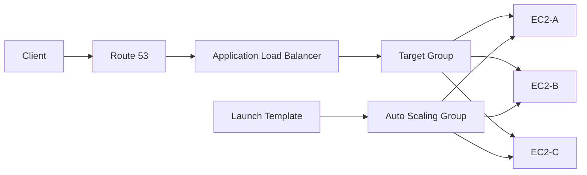
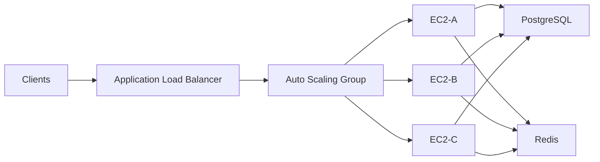
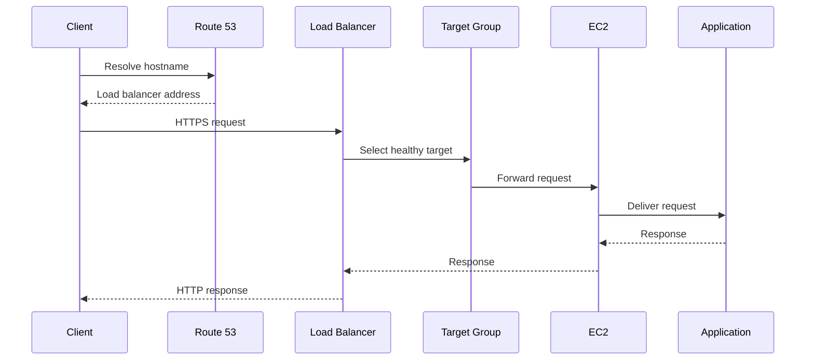
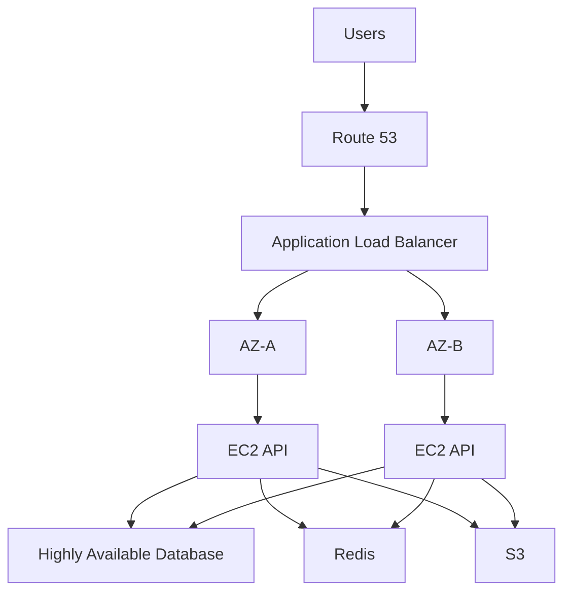

# 05- Auto Scaling and Load Balancing Questions

## Overview

EC2 Auto Scaling and load balancing solve different but complementary problems:

- **Load balancing** distributes incoming traffic across healthy application targets.
- **Auto Scaling** changes the number of compute instances based on demand, health, or operational requirements.
- **Health checks** determine whether a target or instance should receive traffic or remain in service.
- **Launch Templates** define how new EC2 instances are created.
- **Auto Scaling Groups (ASGs)** maintain the desired compute capacity.
- **Load Balancers** provide a stable entry point while instances are added, removed, or replaced.

A typical production architecture is:

```text
                         Internet
                            |
                            v
                         Route 53
                            |
                            v
                       Load Balancer
                            |
                 +----------+----------+
                 |                     |
                 v                     v
              EC2-A                 EC2-B
                 |                     |
                 +----------+----------+
                            |
                            v
                     Application Tier
                            |
                +-----------+-----------+
                |                       |
                v                       v
            PostgreSQL                Redis
```

The key interview principle is:

> The load balancer manages traffic distribution; the Auto Scaling Group manages compute capacity.

---

## What Is an Auto Scaling Group?

An Auto Scaling Group is a logical collection of EC2 instances that maintains a configured capacity range.

Typical configuration:

```text
Minimum capacity: 2
Desired capacity: 4
Maximum capacity: 10
```

The ASG attempts to maintain:

```text
2 <= Running Instances <= 10
```

depending on scaling policies, health state, lifecycle events, and other configuration.

---

## Why Use an Auto Scaling Group?

Without an ASG:

```text
Client
  |
  v
EC2
```

If the instance fails:

```text
EC2
  |
  X
Failure
```

the application may become unavailable.

With an ASG:

```text
              Auto Scaling Group
             /        |        \
            v         v         v
          EC2-A     EC2-B     EC2-C
```

If one instance becomes unhealthy, the ASG can replace it according to its configured health checks and lifecycle behavior.

---

## Minimum, Desired, and Maximum Capacity

| Setting | Meaning |
|---|---|
| Minimum | Lowest capacity the ASG should maintain |
| Desired | Target number of instances |
| Maximum | Upper capacity limit |

Example:

```text
min = 2
desired = 4
max = 10
```

The desired capacity is not necessarily a permanent fixed number.

Scaling policies can change it.

```text
Normal load
desired = 4

High load
desired = 8

Low load
desired = 3
```

---

## What Is a Launch Template?

A Launch Template defines how EC2 instances should be launched.

It can specify:

- AMI
- Instance type
- IAM instance profile
- Security Groups
- EBS configuration
- User Data
- Network settings
- Key pair
- Metadata configuration
- Purchasing-related options where supported

Conceptually:

```text
Launch Template
       |
       v
Auto Scaling Group
       |
       +----> EC2
       +----> EC2
       +----> EC2
```

The ASG uses the launch template as the instance creation blueprint.

---

## Launch Template vs AMI

An AMI is primarily the machine image.

A Launch Template describes how that image should be launched.

```text
AMI
 |
 +--> OS
 +--> Installed packages
 +--> Application artifacts
 |
 v
Launch Template
 |
 +--> Instance type
 +--> Security Groups
 +--> IAM role
 +--> EBS
 +--> User Data
 |
 v
EC2
```

A production deployment commonly combines a versioned AMI with a versioned Launch Template.

---

## Why Are Launch Template Versions Important?

Suppose:

```text
Launch Template v1
    |
    +--> Old application

Launch Template v2
    |
    +--> New application
```

The ASG can be updated to use the newer version.

This supports controlled infrastructure changes and makes configuration history easier to reason about.

A common mistake is modifying infrastructure manually on individual instances and assuming future instances will inherit those changes.

They will not unless the launch configuration is updated.

---

## What Is a Load Balancer?

A load balancer provides a stable endpoint and distributes network traffic across registered targets.

Typical architecture:

```text
Client
  |
  v
Load Balancer
  |
  +----> EC2-A
  |
  +----> EC2-B
  |
  +----> EC2-C
```

The client does not need to know the individual EC2 addresses.

This is essential when instances are dynamically created and terminated.

---

## Why Is a Load Balancer Needed with Auto Scaling?

An ASG may create and terminate instances.

Therefore, clients should not directly depend on individual EC2 addresses.

Without a load balancer:

```text
Client
  |
  +----> EC2-A
  +----> EC2-B
  +----> EC2-C
```

The client needs to discover changing instances.

With a load balancer:

```text
Client
  |
  v
Stable Load Balancer
  |
  +----> EC2-A
  +----> EC2-B
  +----> EC2-C
```

The infrastructure can change behind the stable endpoint.

---

## Auto Scaling and Load Balancing Relationship

A common architecture is:



The responsibilities are separated:

```text
Route 53
    |
    +--> DNS resolution

ALB
    |
    +--> Traffic distribution

Target Group
    |
    +--> Target registration and health

ASG
    |
    +--> Instance capacity and replacement

Launch Template
    |
    +--> Instance configuration
```

---

## What Is a Target Group?

A target group is a logical collection of targets used by a load balancer.

For an EC2-backed application:

```text
ALB
 |
 v
Target Group
 |
 +--> EC2-A
 +--> EC2-B
 +--> EC2-C
```

A target group also defines health-check behavior and the port/protocol used to communicate with targets.

---

## How Does an ASG Register Instances with a Load Balancer?

An ASG can be associated with a target group.

When an instance is launched:

```text
ASG
 |
 v
Launch EC2
 |
 v
Register target
 |
 v
Health check
 |
 v
Receive traffic
```

When an instance is removed:

```text
ASG
 |
 v
Terminate / detach instance
 |
 v
Remove target
 |
 v
Stop receiving traffic
```

This allows compute capacity to change without manually updating the load balancer.

---

## What Is a Health Check?

A health check determines whether a target is healthy enough to receive traffic.

For an HTTP application:

```text
ALB
 |
 | GET /health
 v
EC2
 |
 +--> 200 OK
```

The target can be considered healthy when it satisfies the configured health-check requirements.

---

## What Should a Health Endpoint Do?

A health endpoint should be:

- Fast
- Lightweight
- Deterministic
- Safe to call frequently
- Representative of the service's ability to serve requests

Example:

```python
from fastapi import FastAPI

app = FastAPI()


@app.get("/health")
def health() -> dict[str, str]:
    return {"status": "ok"}
```

A simple liveness endpoint should not necessarily execute expensive database queries on every health check.

For deeper dependency validation, use a separate readiness or dependency-health mechanism where appropriate.

---

## Liveness vs Readiness

A useful production distinction is:

```text
Liveness
    |
    +--> Is the process alive?

Readiness
    |
    +--> Can this instance safely receive traffic?
```

For example:

```text
/health/live
/health/ready
```

Readiness may check critical dependencies when appropriate.

Avoid making every dependency a hard requirement if the service can legitimately operate without it.

---

## What Happens When a Target Becomes Unhealthy?

A typical flow is:

```text
ALB
 |
 | Health check
 v
EC2
 |
 X
Failure
 |
 v
Target marked unhealthy
 |
 v
ALB stops routing new requests
```

The instance itself may still be running.

This distinction is important:

> A target can be unhealthy from the load balancer's perspective while the EC2 instance remains in the `running` state.

---

## EC2 Health vs ALB Health vs ASG Health

These represent different layers.

| Health signal | Primary concern |
|---|---|
| EC2 system status check | Underlying AWS infrastructure |
| EC2 instance status check | Instance/OS-level condition |
| ALB target health | Application/network endpoint |
| ASG health | Whether an instance should remain in the group |

For troubleshooting:

```text
EC2 healthy
   |
   X
ALB target unhealthy
```

means you should investigate the application path, port, listener, Security Groups, NACLs, routing, and health-check configuration.

---

## Scaling Policies

Auto Scaling can use different scaling strategies.

Common approaches include:

- Target tracking
- Step scaling
- Simple scaling
- Scheduled scaling
- Predictive scaling

The appropriate strategy depends on workload characteristics.

---

## Target Tracking Scaling

Target tracking attempts to maintain a metric near a configured target.

For example:

```text
Target CPU utilization = 50%
```

Conceptually:

```text
CPU increases
    |
    v
Scaling policy
    |
    v
Desired capacity increases
    |
    v
More EC2 instances
    |
    v
Average CPU decreases
```

Target tracking is useful when a relatively stable metric correlates with capacity requirements.

---

## Step Scaling

Step scaling changes capacity according to the magnitude of a metric breach.

Example:

```text
CPU < 50%       -> no scaling

CPU 50-70%      -> +1 instance

CPU 70-85%      -> +2 instances

CPU > 85%       -> +4 instances
```

This provides more explicit control than a simple one-threshold model.

---

## Scheduled Scaling

Scheduled scaling is useful when demand follows predictable patterns.

Example:

```text
08:00 -> increase capacity
18:00 -> reduce capacity
```

Typical workloads include:

- Business-hour applications
- Batch processing
- Predictable traffic patterns

Scheduled scaling should complement rather than replace reactive scaling when traffic can vary unexpectedly.

---

## Scaling Based Only on CPU

CPU is useful, but it is not universally the correct scaling signal.

An API may become constrained by:

- Request rate
- Response latency
- Database connections
- Queue depth
- Memory
- Network throughput
- Concurrent requests

For example:

```text
API requests
     |
     v
Queue depth
     |
     v
Worker count
```

For Celery workers, queue depth may be a more meaningful scaling signal than CPU.

---

## Application Load Balancer Request-Based Scaling

For web applications, metrics related to traffic can sometimes provide a better scaling signal than CPU alone.

Conceptually:

```text
Request rate increases
       |
       v
Requests per target increase
       |
       v
Scale out
       |
       v
More targets
       |
       v
Requests per target decrease
```

The metric should be chosen based on how the application consumes compute capacity.

---

## Scaling Policies and Cooldowns

Scaling too aggressively can cause oscillation:

```text
Scale out
   |
   v
Traffic/CPU decreases
   |
   v
Scale in
   |
   v
Traffic/CPU increases
   |
   v
Scale out again
```

This is called scaling thrash.

Production scaling requires:

- Appropriate evaluation periods
- Cooldown behavior
- Instance warm-up
- Stabilization
- Sensible scale-in thresholds
- Sufficient capacity headroom

---

## Instance Warm-Up

A new instance may not immediately be ready to serve traffic.

Startup can involve:

```text
EC2 launch
   |
   v
OS boot
   |
   v
User Data
   |
   v
Docker startup
   |
   v
Django/FastAPI startup
   |
   v
Database/cache initialization
   |
   v
Health check
   |
   v
Receive traffic
```

Scaling policies should account for this startup time.

Otherwise, the ASG may launch additional instances before earlier instances have become useful, causing unnecessary scale-out.

---

## Connection Draining and Instance Termination

When an instance is removed from service, active requests should be allowed to complete where supported by the load-balancing configuration.

Conceptually:

```text
Instance marked for removal
        |
        v
Stop new traffic
        |
        v
Existing requests complete
        |
        v
Instance terminates
```

This is particularly important for:

- Long-running API requests
- File downloads
- WebSockets
- Streaming
- gRPC connections

Application shutdown behavior should also be graceful.

---

## Auto Scaling with Django

A typical Django deployment is:

```text
Route 53
   |
   v
ALB
   |
   v
Target Group
   |
   +---- Django EC2
   +---- Django EC2
   +---- Django EC2
```

The Django application should ideally be stateless.

Avoid storing:

- User uploads
- Session state
- Important generated files
- Application state

only on the local instance filesystem.

Use appropriate external services such as:

- S3
- Redis
- PostgreSQL
- EFS

depending on the data type.

---

## Auto Scaling with FastAPI

A FastAPI service can similarly scale horizontally:

```text
ALB
 |
 +--> FastAPI-1
 +--> FastAPI-2
 +--> FastAPI-3
```

Each application instance should be independently replaceable.

For example, avoid relying on:

```python
global_state = {}
```

as durable shared application state.

Use external storage for state that must be shared between instances.

---

## Auto Scaling and Celery

Celery workers are a good example where queue depth may be more meaningful than HTTP request rate.

Architecture:

```text
Django / FastAPI
       |
       v
      Redis
       |
       v
   Celery Queue
       |
       +---- Worker
       +---- Worker
       +---- Worker
```

Scaling can be driven by:

```text
Queue depth
    |
    v
Worker capacity
```

This demonstrates why scaling metrics should reflect workload characteristics rather than being selected arbitrarily.

---

## Load Balancer Types

| Load Balancer | Primary layer | Typical use |
|---|---|---|
| ALB | Application | HTTP/HTTPS APIs and web applications |
| NLB | Transport | TCP/UDP/TLS workloads |
| Gateway Load Balancer | Network/security appliance integration | Network virtual appliances |

For a typical Django or FastAPI REST API, an ALB is commonly appropriate.

For TCP-based services or specialized high-performance networking, NLB may be more appropriate.

---

## ALB Listener and Target Group

The request path can be modeled as:

```text
Client
  |
  v
ALB Listener :443
  |
  v
Listener Rule
  |
  v
Target Group
  |
  v
EC2 :8000
```

For example:

```text
HTTPS :443
     |
     v
ALB
     |
     | HTTP :8000
     v
FastAPI
```

TLS termination can occur at the ALB depending on the architecture.

---

## Path-Based Routing

ALB can route requests based on application-layer properties such as paths.

Example:

```text
/api/orders/*
        |
        v
Order Service

/api/users/*
        |
        v
User Service
```

This can support service decomposition without exposing every backend service directly to the Internet.

---

## Host-Based Routing

Traffic can also be separated by hostname.

Example:

```text
api.example.com
    |
    v
API Target Group

admin.example.com
    |
    v
Admin Target Group
```

This allows multiple applications to share a load balancer while maintaining separate routing rules.

---

## Security Group Design

A common architecture is:

```text
Internet
   |
   | 443
   v
ALB-SG
   |
   | 8000
   v
EC2-SG
```

The EC2 Security Group should allow application traffic from the ALB Security Group rather than broadly from the Internet.

For example:

```text
ALB-SG
Inbound:
443 from Internet

EC2-SG
Inbound:
8000 from ALB-SG
```

This creates a clear network trust boundary.

---

## Availability Zone Distribution

A production ASG should normally distribute capacity across multiple Availability Zones.

Example:

```text
Region
 |
 +---- AZ-A
 |      |
 |      +--> EC2
 |      +--> EC2
 |
 +---- AZ-B
        |
        +--> EC2
        +--> EC2
```

If one Availability Zone experiences an infrastructure problem, the remaining zones can continue serving traffic if sufficient capacity remains.

---

## Load Balancer and Availability Zones

The load balancer should be configured across appropriate Availability Zones.

The application targets should also be distributed across those zones.

This avoids creating a single-zone dependency:

```text
Bad:

ALB
 |
 +--> AZ-A only
       |
       +--> EC2
```

Prefer:

```text
ALB
 |
 +----> AZ-A -> EC2
 |
 +----> AZ-B -> EC2
```

---

## What Happens During an Availability Zone Failure?

A resilient architecture should have:

```text
AZ-A
 |
 +--> EC2
 +--> EC2

AZ-B
 |
 +--> EC2
 +--> EC2
```

If AZ-A becomes unavailable:

```text
AZ-A
 |
 X

AZ-B
 |
 +--> EC2
 +--> EC2
```

The remaining capacity can continue serving traffic.

The ASG and load balancer should be configured so that recovery is not dependent on manual instance creation.

---

## Health Checks and Auto Scaling Replacement

A critical interview distinction is:

> Load balancer health and Auto Scaling health are related but not identical.

An ASG can use load balancer health information when configured appropriately.

The conceptual flow is:

```text
ALB
 |
 | Target health
 v
ASG
 |
 | unhealthy instance
 v
Replace instance
 |
 v
Launch from Launch Template
 |
 v
Register target
 |
 v
Health check passes
 |
 v
Receive traffic
```

The exact replacement behavior depends on the ASG and health-check configuration.

---

## Instance Refresh

Instance refresh is useful when instances need to be replaced with a new configuration.

Typical reasons include:

- New AMI
- New Launch Template version
- OS updates
- Application release
- Security patching

Conceptually:

```text
Old fleet
  |
  v
Instance Refresh
  |
  +--> Replace instances gradually
  |
  v
New fleet
```

Production refreshes should consider:

- Minimum healthy percentage
- Maximum healthy percentage
- Warm-up
- Health checks
- Deployment speed
- Rollback strategy

---

## Blue/Green Deployment

A blue/green model maintains two environments:

```text
Blue
 |
 +--> Current version

Green
 |
 +--> New version
```

Traffic can then be shifted:

```text
ALB
 |
 +----> Blue
 |
 +----> Green
```

This separates deployment from instance mutation and can make rollback easier.

---

## Rolling Deployment

A rolling strategy gradually replaces instances.

```text
Old Old Old Old

   |
   v

New Old Old Old

   |
   v

New New Old Old

   |
   v

New New New New
```

This reduces the need to replace the entire fleet at once.

However, deployment safety depends on:

- Health checks
- Capacity
- Compatibility
- Database migrations
- Graceful shutdown
- Rollback capability

---

## Database Migrations During Auto Scaling

A dangerous deployment pattern is:

```text
New application instances
       |
       v
Expect new database schema

Old application instances
       |
       v
Expect old schema
```

If the schema change is not backward compatible, rolling deployments can fail.

Prefer backward-compatible migration strategies such as:

```text
Expand
  |
  v
Deploy compatible application
  |
  v
Migrate data
  |
  v
Contract
```

This is particularly important when an ASG contains mixed application versions during deployment.

---

## Auto Scaling Failure Modes

Common failure scenarios include:

- Instances fail health checks
- Launch Template misconfiguration
- AMI boot failure
- User Data failure
- Incorrect IAM role
- Incorrect Security Group
- Insufficient capacity
- Subnet IP exhaustion
- Failed application startup
- Incorrect health-check path
- Incorrect health-check port
- Dependency unavailable
- Database connection exhaustion

A repeated replacement loop is a signal to investigate the common configuration rather than repeatedly terminating instances.

---

## Instance Replacement Loop

Example:

```text
Launch instance
      |
      v
Health check fails
      |
      v
Terminate instance
      |
      v
Launch replacement
      |
      v
Health check fails
      |
      v
Repeat
```

Common root causes include:

```text
Launch Template
       |
       +--> Wrong AMI
       +--> Wrong port
       +--> Wrong Security Group
       +--> Broken User Data
       +--> Missing IAM permissions
       +--> Application startup failure
       +--> Incorrect health endpoint
```

The correct response is to inspect logs and configuration before continuing disruptive actions.

---

## Load Balancer Health Check Failures

Suppose the application listens on:

```text
127.0.0.1:8000
```

but the ALB expects:

```text
EC2:8000
```

The ALB may fail to connect.

For production application servers, ensure the service binds to an appropriate interface.

For example, Uvicorn might be configured as:

```bash
uvicorn app.main:app --host 0.0.0.0 --port 8000
```

For Gunicorn:

```bash
gunicorn config.wsgi:application \
    --bind 0.0.0.0:8000 \
    --workers 4
```

The exact worker configuration should be based on workload and resource measurements.

---

## Scaling Based on Latency

Latency can be a valuable operational signal.

For example:

```text
P95 latency increases
        |
        v
More capacity required
        |
        v
Scale out
```

However, latency is often a downstream symptom.

Before scaling solely on latency, investigate:

- Database latency
- External API latency
- Lock contention
- CPU
- Memory
- Connection pools
- Network constraints

Scaling application instances cannot fix every source of latency.

---

## Queue-Based Scaling

For asynchronous systems:

```text
Producer
   |
   v
Kafka / SQS / Redis
   |
   v
Workers
```

A useful scaling signal can be:

```text
Queue depth
      +
Message age
      |
      v
Worker capacity
```

This is often more representative than CPU utilization for background workloads.

---

## Load Balancing WebSockets and Long-Lived Connections

Long-lived connections behave differently from short HTTP requests.

Examples:

- WebSockets
- Server-sent events
- Streaming
- gRPC streams

Consider:

- Connection duration
- Target deregistration
- Graceful shutdown
- Connection draining
- Idle timeouts
- Reconnection logic
- Client retry behavior

Scaling a fleet with long-lived connections requires more careful lifecycle handling than a short-request REST API.

---

## Sticky Sessions

Sticky sessions cause a client to continue being routed to the same target for a configured period.

Example:

```text
Client-A
   |
   v
ALB
   |
   v
EC2-A
```

The same client may continue reaching EC2-A.

Sticky sessions can simplify stateful legacy applications, but they reduce the flexibility of load distribution.

For modern backend systems, prefer externalizing session state where practical:

```text
EC2-A \
EC2-B  ---> Redis
EC2-C /
```

This allows requests to be served by any healthy instance.

---

## Stateless Application Design

A horizontally scalable application should ideally satisfy:

```text
Request
   |
   v
Any healthy instance
   |
   v
External shared state
```

instead of:

```text
Request
   |
   v
Specific instance
   |
   v
Local state
```

Externalize:

- Sessions
- Uploads
- Shared cache
- Persistent data
- Background job state

where appropriate.

---

## Monitoring Auto Scaling

Important signals include:

### EC2

- CPU utilization
- Memory where collected
- Network traffic
- Disk usage
- Disk I/O
- Status checks

### Load Balancer

- Request count
- Target response time
- HTTP error rates
- Target health
- Connection metrics
- Rejected connections where applicable

### ASG

- Desired capacity
- Current capacity
- Pending instances
- Terminating instances
- Scaling activities
- Instance health

Monitoring should answer:

```text
Do we have enough capacity?
Are instances healthy?
Are users receiving successful responses?
Why did scaling happen?
Was scaling fast enough?
```

---

## Cost Considerations

Auto Scaling can reduce cost by matching compute capacity to demand, but poor scaling configuration can increase costs.

Common causes include:

- Maximum capacity set too high
- Scaling policies too aggressive
- Instances remaining idle
- Overly long scale-in delays
- Large instance types
- Duplicate environments
- Unnecessary baseline capacity

Cost optimization should not compromise the capacity required for the application's SLOs.

---

## Common Mistakes

### Treating ASG as a Load Balancer

An ASG does not distribute application requests.

```text
ASG
 |
 +--> manages EC2 capacity
```

The load balancer handles traffic distribution.

---

### Treating a Load Balancer as an Auto Scaling System

A load balancer can detect unhealthy targets, but it does not replace the ASG's responsibility for maintaining compute capacity.

```text
Load Balancer
    |
    +--> Traffic distribution

ASG
    |
    +--> Capacity management
```

---

### Using CPU as the Only Scaling Metric

CPU may not correlate with actual demand.

For API workloads, consider:

- Requests per target
- Latency
- Queue depth
- Application concurrency
- Database pressure

---

### Storing State on EC2

This breaks horizontal scaling when requests can reach different instances.

Use external state where required.

---

### Incorrect Health Check

Bad:

```text
/health
```

implemented as an expensive database query executed every few seconds against every instance.

Better:

- Keep liveness checks lightweight.
- Use readiness checks when dependency validation is necessary.
- Monitor deeper dependency health separately.

---

### Scaling Faster Than Instances Can Start

If instances require several minutes to become healthy, aggressive scaling can cause:

```text
Traffic spike
    |
    v
Scale out
    |
    v
Instances boot slowly
    |
    v
Traffic continues increasing
    |
    v
Scale out again
```

This can produce unnecessary capacity growth.

---

### Ignoring Database Capacity

Scaling from:

```text
4 EC2 instances
```

to:

```text
20 EC2 instances
```

may multiply database connections.

For example:

```text
4 instances x 20 connections = 80

20 instances x 20 connections = 400
```

The database may become the bottleneck before EC2 does.

Scaling decisions must therefore consider downstream dependencies.

---

## Senior-Level Interview Questions

### How would you design a highly available EC2 application?

A typical answer should include:

```text
Route 53
    |
    v
ALB across AZs
    |
    v
ASG across multiple AZs
    |
    +--> EC2
    +--> EC2
    +--> EC2
    |
    +--> Externalized state
```

Then discuss:

- Health checks
- Multi-AZ distribution
- Stateless application design
- Database HA
- Caching
- Monitoring
- Backup
- Deployment strategy
- Failure recovery

---

### How would you handle a sudden 10x traffic increase?

A strong approach is:

```text
Traffic increase
      |
      v
Load balancer absorbs distribution
      |
      v
Scaling policy detects demand
      |
      v
ASG launches instances
      |
      v
Health checks validate targets
      |
      v
New targets receive traffic
```

Then evaluate whether downstream systems can scale:

```text
EC2
 |
 +--> PostgreSQL
 +--> Redis
 +--> Kafka
 +--> External APIs
```

Scaling only the application tier can move the bottleneck elsewhere.

---

### How would you prevent a bad AMI from breaking an entire fleet?

Use:

- Immutable/versioned AMIs
- Launch Template versions
- Instance refresh controls
- Health checks
- Staged deployments
- Deployment validation
- Rollback strategy
- Automated testing

A deployment system should make it possible to stop or roll back a bad rollout before the entire fleet is replaced.

---

### How would you diagnose an ASG continuously replacing instances?

Start with:

```text
ASG activity history
        |
        v
Instance status
        |
        v
Target health
        |
        v
Launch Template
        |
        v
User Data / startup logs
        |
        v
Application logs
```

Investigate common configuration rather than manually repairing every new instance.

---

## Production Architecture Checklist

```text
[ ] ASG spans multiple Availability Zones
[ ] Minimum capacity supports failure scenarios
[ ] Maximum capacity is intentionally bounded
[ ] Launch Template is versioned
[ ] AMIs are reproducible
[ ] Application is stateless where practical
[ ] Load balancer spans appropriate AZs
[ ] Target groups have correct ports
[ ] Health checks are lightweight and meaningful
[ ] Security Groups follow least privilege
[ ] Scaling metric matches workload behavior
[ ] Instance warm-up is accounted for
[ ] Scale-in behavior is safe
[ ] Graceful shutdown is implemented
[ ] Database connection capacity is considered
[ ] Redis/cache capacity is considered
[ ] Queue capacity is considered
[ ] Monitoring and alarms are configured
[ ] Deployment and rollback procedures are tested
[ ] Backup and DR strategy is independent of EC2 lifecycle
```

## Key Takeaways

- **Auto Scaling Groups manage EC2 capacity and replacement, while load balancers distribute traffic across healthy targets; production architectures normally use both together.**
- **Launch Templates provide reproducible instance configuration, while target groups provide the load balancer's logical collection of application targets and health checks.**
- **Scaling metrics should reflect the actual workload: CPU may be appropriate for some services, while request rate, latency, queue depth, or downstream capacity may be more meaningful for others.**
- **Highly available EC2 architectures distribute ASG capacity across Availability Zones, keep applications replaceable, externalize persistent state, and account for database and other downstream bottlenecks.**
- **Senior-level troubleshooting focuses on the complete lifecycle—launch, bootstrap, registration, health checks, traffic, scaling, graceful termination, and replacement—rather than treating individual EC2 instances as permanent servers.**
```
```
# 06- Scenario Based Questions

## Overview

EC2 scenario-based interview questions test whether you can reason across multiple AWS layers instead of troubleshooting one service in isolation.

A production incident rarely looks like:

```text
"EC2 is broken."
```

It usually looks like:

```text
Users report API failures
        |
        v
Load Balancer
        |
        v
Target Health
        |
        v
EC2
        |
        +--> OS
        +--> Network
        +--> Storage
        +--> Application
        +--> Dependencies
```

A strong senior-level answer should:

1. Clarify the symptom and scope.
2. Identify the affected layer.
3. Gather evidence before changing infrastructure.
4. Separate symptoms from root causes.
5. Check dependencies and return paths.
6. Prefer reversible actions first.
7. Consider availability and blast radius.
8. Validate recovery after remediation.
9. Capture preventive improvements.

The central troubleshooting model is:

```text
Client
  |
  v
DNS
  |
  v
Load Balancer
  |
  v
Network
  |
  v
EC2
  |
  +--> OS
  +--> Application
  +--> Storage
  +--> Dependencies
```

---

## Scenario: EC2 Instance Is Running but Application Is Unreachable

### Problem

An EC2 instance shows:

```text
State: running
```

but users cannot access the application.

### Investigation

Do not assume `running` means healthy.

Check in layers:

```text
EC2 state
   |
   v
EC2 status checks
   |
   v
Route / network
   |
   v
Security Group
   |
   v
NACL
   |
   v
Host firewall
   |
   v
Listening process
   |
   v
Application
```

On the instance:

```bash
ss -lntp
```

Then test locally:

```bash
curl -f http://127.0.0.1:8000/health
```

If local access works but remote access fails, focus on networking.

If local access fails, focus on the application or process.

### Common Causes

| Symptom | Likely area |
|---|---|
| No listening port | Application |
| Local request fails | Application |
| Local request succeeds, remote fails | Network/security |
| ALB target unhealthy | Target/application/network |
| SSH unavailable | Network/OS/access |
| CPU saturated | Application/system |
| Disk full | Storage/OS |

### Interview Trap

Do not immediately reboot the instance.

A reboot may temporarily hide the symptom while destroying valuable diagnostic evidence.

---

## Scenario: ALB Shows Unhealthy EC2 Targets

### Problem

The EC2 instances are running, but the ALB target group reports:

```text
unhealthy
```

### Investigation

Check:

```text
ALB listener
    |
    v
Target group
    |
    +--> Protocol
    +--> Port
    +--> Health-check path
    +--> Success codes
    |
    v
EC2
    |
    +--> Security Group
    +--> Application
    +--> Listening address
```

For FastAPI:

```bash
ss -lntp | grep 8000
curl -f http://127.0.0.1:8000/health
```

For Gunicorn:

```bash
ss -lntp | grep 8000
```

A common configuration error is binding only to loopback:

```text
127.0.0.1:8000
```

while the ALB connects through the instance network interface.

For example:

```bash
uvicorn app.main:app --host 0.0.0.0 --port 8000
```

### Security Group Check

A common architecture is:

```text
ALB-SG
   |
   | TCP 8000
   v
EC2-SG
```

The EC2 Security Group should permit the application port from the ALB Security Group.

### Senior-Level Consideration

Do not make a health endpoint unnecessarily dependent on every downstream service.

If `/health` performs expensive database queries and the database has a temporary issue, the entire fleet can become unhealthy simultaneously.

Use separate liveness/readiness semantics when appropriate.

---

## Scenario: EC2 Cannot Reach PostgreSQL

### Problem

The application reports:

```text
connection timeout
```

when connecting to PostgreSQL.

### Investigation

Start with DNS and TCP:

```bash
getent hosts <database-host>
nc -vz <database-host> 5432
```

Then inspect:

```text
EC2 route table
       |
       v
Destination subnet
       |
       v
Database Security Group
       |
       v
NACL
       |
       v
PostgreSQL listener
```

Check PostgreSQL:

```bash
ss -lntp | grep 5432
```

Then investigate:

- PostgreSQL availability
- Database listener address
- Database port
- Security Group
- NACL
- Route tables
- DNS
- Connection limits

### Key Distinction

If:

```bash
nc -vz <database-host> 5432
```

succeeds, the network path is probably functional.

Then investigate:

- Authentication
- TLS
- Connection pool
- Database permissions
- Query latency
- Application timeout

A successful TCP connection does not prove database connectivity at the application layer.

---

## Scenario: EC2 Can Reach the Internet but Cannot Reach One External API

### Problem

The instance can access:

```text
https://example-a.com
```

but requests to:

```text
https://example-b.com
```

time out.

### Investigation

Because general Internet access works, do not immediately assume the NAT Gateway is broken.

Check:

```text
DNS resolution
    |
    v
Destination IP
    |
    v
Routing
    |
    v
NAT / egress
    |
    v
Firewall
    |
    v
Remote service
```

Useful commands:

```bash
getent hosts example-b.com
curl -v https://example-b.com/health
```

Investigate:

- DNS result
- IPv4/IPv6 behavior
- Destination IP
- Network firewall rules
- NAT behavior
- Remote allowlisting
- TLS negotiation
- Remote service availability

### Senior-Level Consideration

If the external service allowlists source IPs, verify the actual egress IP.

A private EC2 instance behind a NAT Gateway does not necessarily appear externally using its private address.

---

## Scenario: Private EC2 Cannot Download Packages

### Problem

A private EC2 instance cannot run package installation successfully.

Example:

```bash
sudo apt-get update
```

fails with a network error.

### Expected Architecture

```text
Private EC2
    |
    v
Private Route Table
    |
    v
NAT Gateway
    |
    v
Internet Gateway
    |
    v
Internet
```

### Investigation

Check:

```text
Private subnet route
NAT Gateway state
NAT subnet route
Internet Gateway
NACL
Security Group
DNS
```

The NAT Gateway must itself reside in an appropriate public subnet with Internet connectivity.

### AWS Service Access

If the workload primarily accesses AWS services, VPC endpoints can sometimes reduce dependence on NAT-based Internet paths.

For example:

```text
Private EC2
    |
    v
VPC Endpoint
    |
    v
AWS Service
```

This can also improve security and cost characteristics depending on the workload.

---

## Scenario: EC2 Has High CPU

### Problem

CloudWatch reports:

```text
CPUUtilization = 95%
```

### Investigation

Start at the host:

```bash
top
```

Then:

```bash
ps -eo pid,ppid,cmd,%cpu,%mem --sort=-%cpu | head
```

For more detailed CPU analysis:

```bash
mpstat -P ALL 1
```

Determine whether the load comes from:

- Application workers
- Background jobs
- Database processing
- Unexpected processes
- Traffic increase
- Infinite loops
- Excessive concurrency
- Cryptographic or compression workloads

### Backend Example

A Django deployment might look like:

```text
ALB
 |
 v
Gunicorn
 |
 +--> Worker 1
 +--> Worker 2
 +--> Worker 3
 +--> Worker 4
```

If all workers are CPU-bound, increasing workers on the same instance may make contention worse.

### Remediation

Possible options:

- Scale horizontally
- Use a larger instance
- Optimize application code
- Reduce unnecessary work
- Move asynchronous work to Celery
- Tune worker counts
- Investigate downstream bottlenecks

Do not automatically increase the instance size without identifying the workload.

---

## Scenario: T-Series Instance Has High CPU

### Problem

A burstable EC2 instance has sustained CPU usage and application performance is degrading.

### Investigation

Check:

```text
CPUUtilization
CPUCreditBalance
CPUCreditUsage
```

For supported configurations, also inspect surplus-credit metrics when applicable.

The key distinction is:

```text
High CPU
```

versus:

```text
High CPU + depleted CPU credits
```

A T-series instance can temporarily burst above its baseline, but sustained workloads may consume accumulated CPU credits.

### Remediation

Depending on workload:

- Optimize CPU usage
- Scale horizontally
- Select a more appropriate instance family
- Evaluate unlimited-mode economics where applicable
- Move sustained CPU workloads to a non-burstable family

---

## Scenario: EC2 Disk Is Full

### Problem

The application begins returning:

```text
No space left on device
```

### Investigation

Check capacity:

```bash
df -h
```

Check inode usage:

```bash
df -i
```

Find large directories:

```bash
sudo du -xhd1 /var | sort -h
```

Look for deleted-but-open files:

```bash
sudo lsof +L1
```

### Common Causes

- Application logs
- Docker layers
- Temporary files
- Large uploads
- Core dumps
- Package caches
- Rotated logs not being removed
- Database files

### Remediation

First identify what consumed the space.

Do not blindly run:

```bash
rm -rf /var/*
```

Production recovery should preserve system integrity and evidence.

If additional storage is required:

```text
EBS
 |
 v
Increase volume capacity
 |
 v
Expand partition
 |
 v
Grow filesystem
 |
 v
Validate
```

---

## Scenario: EBS Volume Is Slow

### Problem

Application latency increases and storage operations appear slow.

### Investigation

Check:

```bash
iostat -xz 1
```

Also inspect:

- EBS volume type
- Provisioned IOPS
- Throughput
- Queue depth
- Volume utilization
- Instance EBS bandwidth limits
- Filesystem behavior
- Database workload

Architecture:

```text
Application
    |
    v
Filesystem
    |
    v
Block Device
    |
    v
EBS
    |
    v
AWS storage infrastructure
```

### Senior-Level Consideration

Do not assume EBS is automatically the bottleneck.

For PostgreSQL, also inspect:

- Slow queries
- Locks
- Connection count
- Buffer/cache behavior
- Checkpoint activity
- CPU
- Memory

Storage optimization should be evidence-driven.

---

## Scenario: EC2 Instance Terminates and Important Data Is Lost

### Problem

An instance is terminated and application data disappears.

### Investigation

Identify where the data was stored:

```text
Instance Store?
EBS?
EFS?
S3?
Database?
```

### Common Root Cause

The application stored important data on:

```text
EC2 local filesystem
```

or:

```text
Instance Store
```

### Better Architecture

```text
EC2
 |
 +--> S3       -> objects
 |
 +--> Database -> structured state
 |
 +--> Redis    -> cache/temporary state
 |
 +--> EFS      -> shared filesystem where appropriate
```

EC2 instances in an Auto Scaling architecture should generally be replaceable.

---

## Scenario: Auto Scaling Group Continuously Replaces Instances

### Problem

The ASG launches instances, but they repeatedly become unhealthy and are terminated.

### Investigation

Do not repeatedly terminate the replacement instances.

Inspect:

```text
ASG Activity History
        |
        v
Launch Template
        |
        +--> AMI
        +--> Instance type
        +--> Security Groups
        +--> IAM role
        +--> User Data
        |
        v
EC2 startup
        |
        v
Application
        |
        v
ALB health check
```

Common causes:

- Broken AMI
- User Data failure
- Application does not start
- Wrong port
- Wrong health-check path
- Security Group blocks ALB
- Insufficient IAM permissions
- Missing environment configuration
- Database unavailable
- Incorrect application bind address

### Senior-Level Principle

If every new instance fails in the same way, investigate the shared configuration.

The problem is likely not the individual instance.

---

## Scenario: New EC2 Instances Launch but Never Become Healthy

### Problem

The ASG successfully launches instances, but the target group never reports them healthy.

### Investigation

Check:

```text
Instance launched?
    |
    v
Network interface attached?
    |
    v
Security Group correct?
    |
    v
Application started?
    |
    v
Correct port?
    |
    v
Health endpoint reachable?
    |
    v
Health check succeeds?
```

On the instance:

```bash
systemctl status <service>
ss -lntp
curl -f http://127.0.0.1:8000/health
```

Then test the network path from the load balancer configuration.

---

## Scenario: ALB Returns 502

### Problem

Clients receive:

```text
HTTP 502
```

from an ALB-backed application.

### Investigation

Possible causes include:

- Target unavailable
- Application connection failure
- Incorrect target port
- Application process failure
- Connection reset
- Protocol mismatch
- Incorrect listener or target configuration

Investigate:

```text
Client
  |
  v
ALB
  |
  v
Target Group
  |
  v
EC2
  |
  v
Application
```

Then correlate:

- ALB access logs
- Target health
- Application logs
- EC2 metrics
- Network configuration

Do not treat every 5xx response as an EC2 problem.

---

## Scenario: ALB Returns 504

### Problem

Clients receive:

```text
HTTP 504
```

### Investigation

A timeout-oriented response requires examining latency across the request path:

```text
Client
  |
  v
ALB
  |
  v
Application
  |
  +--> PostgreSQL
  |
  +--> Redis
  |
  +--> External API
```

Potential causes include:

- Slow application processing
- Database query latency
- External API timeout
- Connection pool exhaustion
- Network issue
- Insufficient capacity

### Senior-Level Approach

Measure where time is spent rather than simply increasing ALB or application timeouts.

---

## Scenario: Traffic Spike Causes Application Failure

### Problem

Traffic suddenly increases by 10x.

The application starts returning errors.

### Investigation

Check:

```text
ALB request count
        |
        v
Target response time
        |
        v
EC2 CPU / memory
        |
        v
ASG desired capacity
        |
        v
Database connections
        |
        v
Redis
        |
        v
External dependencies
```

### Scaling Architecture



The important senior-level question is:

> Can the downstream dependencies scale with the application tier?

Adding 20 EC2 instances may make a database connection bottleneck worse.

---

## Scenario: Auto Scaling Is Too Slow

### Problem

Traffic rises faster than the ASG can add capacity.

### Investigation

Measure:

```text
Traffic spike
    |
    v
Scaling alarm
    |
    v
Scaling decision
    |
    v
Instance launch
    |
    v
OS boot
    |
    v
Application startup
    |
    v
Health check
    |
    v
Traffic eligibility
```

If this takes several minutes, reactive scaling alone may be insufficient for sudden spikes.

### Possible Improvements

- Maintain sufficient baseline capacity
- Improve instance startup time
- Optimize AMI/User Data
- Configure appropriate warm-up
- Use scheduled scaling for predictable peaks
- Use caching
- Optimize application initialization
- Consider other AWS scaling architectures where appropriate

---

## Scenario: Auto Scaling Creates Too Many Instances

### Problem

The ASG scales out aggressively and then scales back in.

This repeats frequently.

### Likely Causes

- Scaling threshold too sensitive
- Incorrect metric
- Insufficient warm-up
- Scaling policy oscillation
- Application workload naturally fluctuates
- Health checks are unstable

Conceptually:

```text
Scale out
   |
   v
Capacity increases
   |
   v
Metric drops
   |
   v
Scale in
   |
   v
Metric rises
   |
   v
Scale out
```

### Remediation

Review:

- Scaling metric
- Evaluation periods
- Target value
- Warm-up
- Scale-in policy
- Cooldown/stabilization behavior
- Application workload pattern

---

## Scenario: One Availability Zone Fails

### Problem

An Availability Zone becomes unavailable.

### Fragile Architecture

```text
ALB
 |
 v
AZ-A
 |
 +--> EC2
 +--> EC2
```

### Resilient Architecture

```text
ALB
 |
 +--------+--------+
 |                 |
 v                 v
AZ-A              AZ-B
 |                 |
EC2               EC2
EC2               EC2
```

The ASG should maintain capacity across multiple Availability Zones.

### Senior-Level Consideration

Do not only ask:

> "Are there instances in two AZs?"

Also ask:

- Is the load balancer distributed appropriately?
- Is enough capacity available after losing one AZ?
- Can the database survive the same failure?
- Are caches and queues available?
- Are dependencies regional or zonal?
- Is the recovery process tested?

---

## Scenario: One EC2 Instance Fails

### Problem

One application instance becomes unhealthy.

Expected architecture:

```text
ALB
 |
 +----> EC2-A
 |
 +----> EC2-B
 |
 +----> EC2-C
```

If EC2-B fails:

```text
ALB
 |
 +----> EC2-A
 |
 +----> EC2-C

EC2-B
  |
  X
```

The ALB should stop routing new requests to an unhealthy target.

The ASG can then replace the instance according to its health-check configuration.

### Important Principle

High availability means the system can tolerate individual failures without requiring manual intervention.

---

## Scenario: SSH Suddenly Stops Working

### Problem

You can no longer SSH into an EC2 instance.

### Investigation

Check from outside:

```text
DNS / IP
   |
   v
Route
   |
   v
Security Group :22
   |
   v
NACL
   |
   v
Instance
```

If the network path appears valid, investigate:

- SSH daemon
- Host firewall
- CPU exhaustion
- Memory pressure
- Disk full
- OS failure
- User configuration
- Key configuration

On Linux, if console or alternate access is available:

```bash
systemctl status ssh
ss -lntp | grep ':22'
df -h
free -h
```

### Better Production Practice

Avoid making SSH the only administrative access path.

Consider Systems Manager Session Manager or other controlled administrative mechanisms.

---

## Scenario: EC2 Has a Public IP but Cannot Be Reached

A public IP alone does not guarantee Internet connectivity.

Check:

```text
Public IP
    |
    v
Subnet route table
    |
    v
Internet Gateway
    |
    v
Security Group
    |
    v
NACL
    |
    v
Host firewall
    |
    v
Application
```

Also verify that the service is actually listening on the expected interface and port.

---

## Scenario: EC2 Can Reach Another EC2 but Not the Internet

### Problem

Internal communication works:

```text
EC2-A ---> EC2-B
```

but Internet access fails:

```text
EC2-A -X-> Internet
```

### Investigation

For a public instance:

```text
Subnet route
    |
    v
Internet Gateway
```

For a private instance:

```text
Subnet route
    |
    v
NAT Gateway
    |
    v
Internet Gateway
```

Check:

- Route table
- Internet Gateway
- NAT Gateway
- Public/private addressing
- Security Groups
- NACLs
- DNS

Internal VPC routing working does not prove Internet routing is configured correctly.

---

## Scenario: Application Works Locally but Not Through Nginx

### Problem

The backend responds directly:

```bash
curl http://127.0.0.1:8000/health
```

but fails through Nginx.

### Investigation

```text
Client
  |
  v
Nginx
  |
  v
Backend
```

Check:

- Nginx listener
- Upstream address
- Upstream port
- Proxy headers
- Timeouts
- Host firewall
- Backend bind address
- SELinux/AppArmor where applicable
- Application logs
- Nginx logs

Useful commands:

```bash
sudo nginx -t
sudo systemctl status nginx
sudo journalctl -u nginx --since "10 minutes ago"
```

---

## Scenario: Dockerized FastAPI Works Inside Container but Not Through ALB

### Problem

FastAPI responds inside the container but the ALB reports an unhealthy target.

### Investigation

Check the layers:

```text
ALB
 |
 v
EC2
 |
 v
Docker published port
 |
 v
Container
 |
 v
FastAPI
```

Inside the container:

```bash
curl http://127.0.0.1:8000/health
```

On the host:

```bash
ss -lntp
```

Inspect Docker port mapping:

```bash
docker ps
```

A typical mapping might be:

```text
0.0.0.0:8000 -> container:8000
```

The ALB must connect to the host's reachable port.

---

## Scenario: Docker Container Keeps Restarting on EC2

### Investigation

Check:

```bash
docker ps -a
docker logs <container>
docker inspect <container>
```

Potential causes:

- Application startup exception
- Missing environment variables
- Database unavailable
- Wrong command
- Permission problem
- OOM kill
- Health check failure

Then correlate with:

```bash
dmesg
free -h
df -h
```

The container problem may actually originate from the host's resource limits.

---

## Scenario: Database Connections Exhaust After Scaling

### Problem

The application works with 2 EC2 instances but starts failing after scaling to 20.

Suppose each instance creates 20 database connections:

```text
2 instances x 20 = 40 connections

20 instances x 20 = 400 connections
```

If PostgreSQL supports fewer usable connections, scaling the application tier creates a database bottleneck.

### Better Approach

Consider:

- Connection pooling
- Lower per-instance connection limits
- Database capacity
- Query optimization
- Read replicas where appropriate
- Caching
- Queue-based workload reduction

Horizontal scaling is not isolated from downstream capacity.

---

## Scenario: Redis Becomes the Bottleneck After Scaling

Suppose:

```text
2 EC2 instances
   |
   v
Redis
```

becomes:

```text
20 EC2 instances
   |
   v
Redis
```

The application fleet increased 10x, but Redis capacity did not.

Investigate:

- CPU
- Memory
- Network
- Commands per second
- Hot keys
- Connection count
- Evictions
- Data size

The correct scaling boundary may need to include the cache tier.

---

## Scenario: Health Checks Pass but Users Still See Errors

This is a common senior-level scenario.

Suppose:

```text
ALB health = healthy
```

but:

```text
Users = HTTP 500
```

The health check may be too shallow.

For example:

```text
GET /health
    |
    v
200 OK
```

while:

```text
GET /orders
    |
    v
PostgreSQL
    |
    X
Database failure
```

The health endpoint proves only what it was designed to prove.

Use:

- Application metrics
- Request-level logs
- Dependency metrics
- Error-rate alarms
- Distributed tracing where appropriate

Do not turn health checks into expensive full-stack transactions simply to make them "more accurate."

---

## Scenario: Deployment Causes a Partial Outage

### Problem

A new release is deployed while old and new instances coexist.

```text
ASG
 |
 +--> Old version
 +--> Old version
 +--> New version
 +--> New version
```

Potential issues:

- Incompatible database schema
- Different environment variables
- Changed API contract
- Different cache format
- Incompatible message schema

### Better Deployment Strategy

Use backward-compatible changes:

```text
Database
   |
   v
Expand schema
   |
   v
Deploy compatible application
   |
   v
Migrate data
   |
   v
Remove old schema
```

This allows mixed application versions during rolling deployments.

---

## Scenario: AMI Is Broken

### Problem

A new AMI is deployed through a Launch Template and all new instances fail.

### Investigation

Compare:

```text
Previous AMI
    |
    +--> boots successfully

New AMI
    |
    +--> boot failure
```

Inspect:

- AMI build pipeline
- Installed packages
- Startup services
- User Data
- IAM instance profile
- Environment configuration
- Network configuration
- Application artifacts

### Better Practice

Treat AMIs as versioned deployment artifacts.

Test them before broad fleet rollout.

---

## Scenario: User Data Script Fails

User Data often performs:

```text
OS configuration
    |
    v
Package installation
    |
    v
Application setup
    |
    v
Service startup
```

If the script fails halfway, the instance may launch successfully but never become application-ready.

Inspect:

```bash
sudo journalctl
sudo cloud-init status
```

and the relevant cloud-init logs on supported Linux distributions.

### Production Practice

Make bootstrap logic:

- Idempotent
- Observable
- Fast
- Failure-aware
- Minimal

Move complex application deployment logic into tested images or deployment tooling when appropriate.

---

## Scenario: EC2 Subnet Runs Out of IP Addresses

### Problem

The ASG cannot launch additional instances.

Potential cause:

```text
Subnet has insufficient available IP addresses
```

This can happen when:

- Subnet CIDR is too small
- Many resources consume addresses
- Other interfaces consume addresses
- Scaling requirements were underestimated

### Investigation

Review:

- Subnet CIDR
- Available IP addresses
- ENIs
- Load balancers
- Other resources using subnet addresses

### Senior-Level Principle

Capacity planning includes network capacity, not only CPU and memory.

---

## Scenario: Auto Scaling Cannot Launch Instances

Possible causes include:

| Cause | Investigation |
|---|---|
| Subnet IP exhaustion | Available subnet addresses |
| IAM issue | Instance profile and permissions |
| Launch Template issue | Template/version |
| AMI issue | AMI availability/configuration |
| Capacity issue | EC2 capacity errors |
| Security Group issue | Network configuration |
| Quota | Service quotas |
| EBS issue | Volume configuration |
| AZ issue | Alternate AZ capacity |

Check ASG activity history first because it often provides the immediate reason for failed launches.

---

## Scenario: EC2 System Status Check Fails

### Problem

The EC2 system status check reports failure.

This indicates a problem associated with the underlying AWS infrastructure or system-level availability rather than simply an application endpoint failure.

Possible actions depend on the status and recovery mechanism available for the instance.

Investigate:

```text
System status
Instance status
Scheduled events
CloudWatch
AWS Health information
```

Do not confuse this with:

```text
ALB target unhealthy
```

which indicates a different layer.

---

## Scenario: Instance Status Check Fails

An instance status check relates more closely to the instance or operating system.

Potential causes can include:

- OS networking issues
- Kernel problems
- Resource exhaustion
- Boot problems
- Misconfiguration

Investigate through available console/management access and logs.

If the instance is part of an ASG and is intended to be disposable, replacement may be safer than prolonged manual repair.

---

## Scenario: EC2 Instance Becomes Unresponsive

A disciplined response is:

```text
Confirm impact
    |
    v
Check monitoring
    |
    v
Check status checks
    |
    v
Check CPU / memory / disk
    |
    v
Check network
    |
    v
Check application
    |
    v
Attempt safe recovery
```

Avoid immediately:

```text
Terminate
```

unless the architecture and incident procedure support replacement.

First determine whether evidence is needed for root-cause analysis.

---

## Scenario: One Instance Has High Latency While Others Are Healthy

Suppose:

```text
EC2-A -> P95 200 ms
EC2-B -> P95 220 ms
EC2-C -> P95 5 s
```

Do not scale the entire fleet immediately.

Compare:

- CPU
- Memory
- Disk
- Network
- Application logs
- Target health
- Instance type
- Processes
- Database connection behavior

Possible causes include:

- Noisy process
- Disk issue
- Memory pressure
- Broken application process
- Different configuration
- Instance-level degradation

The correct action may be to drain and replace only the problematic instance after collecting sufficient evidence.

---

## Scenario: Requests Are Unevenly Distributed

### Problem

One EC2 target receives substantially more traffic than others.

Investigate:

- Target health
- Sticky sessions
- Connection duration
- Load-balancer algorithm
- Long-lived connections
- Target registration
- Client behavior

For stateful applications, sticky sessions may create uneven distribution.

For long-lived WebSocket or streaming connections, connection counts may remain uneven even when request distribution appears correct.

---

## Scenario: Application Uses Long-Lived Connections During Scale-In

Suppose an instance is selected for termination while it has:

```text
WebSocket connections
gRPC streams
Long-running requests
```

A graceful termination strategy is required.

Conceptually:

```text
Scale-in
   |
   v
Stop new traffic
   |
   v
Drain existing connections
   |
   v
Graceful application shutdown
   |
   v
Terminate instance
```

Client reconnection behavior should also be designed.

---

## Scenario: EC2 Instances Are Healthy but Users Cannot Connect

Use a request-path investigation:



Check each boundary.

This avoids assuming the problem is necessarily EC2.

---

## Scenario: Application Has Intermittent Timeouts

Intermittent failures often require correlation rather than a single configuration check.

Investigate:

```text
Time
 |
 +--> Request rate
 +--> Error rate
 +--> Target health
 +--> CPU
 +--> Memory
 +--> Disk
 +--> Network
 +--> Database
 +--> Redis
 +--> External APIs
```

Compare healthy and unhealthy instances.

Look for:

- Resource saturation
- Connection pool exhaustion
- Slow dependencies
- Retry storms
- Network packet loss
- GC/runtime pauses
- Uneven target distribution

---

## Scenario: Retry Storm Causes More Failures

A downstream service becomes slow:

```text
API
 |
 v
Database
 |
 X
Slow
```

The API retries aggressively:

```text
Request
 |
 +--> DB attempt 1
 +--> DB attempt 2
 +--> DB attempt 3
```

Traffic increases instead of decreasing.

This can create a positive feedback loop:

```text
Dependency slowdown
       |
       v
Retries
       |
       v
More load
       |
       v
More slowdown
       |
       v
More retries
```

Production systems should use:

- Bounded retries
- Exponential backoff
- Jitter
- Appropriate timeouts
- Circuit-breaking patterns where appropriate
- Dependency-aware concurrency limits

---

## Scenario: EC2 Application Is Memory Exhausted

### Investigation

Check:

```bash
free -h
vmstat 1
ps -eo pid,cmd,%mem --sort=-%mem | head
```

Also inspect:

- OOM killer events
- Application worker count
- Python process memory
- Cache size
- Container memory limits
- Memory leaks

For Python applications, increasing worker count can multiply memory consumption.

For example:

```text
4 workers x 500 MB = ~2 GB
```

before considering other processes and system memory.

### Remediation

Possible actions:

- Reduce worker count
- Fix memory leak
- Optimize application memory
- Increase instance memory
- Scale horizontally
- Adjust caching
- Configure container limits

---

## Scenario: EC2 Cost Suddenly Increases

Investigate:

```text
Running instances
    |
    +--> Instance count
    +--> Instance types
    +--> Regions
    +--> Idle instances
    |
    v
EBS
    |
    +--> Detached volumes
    +--> Oversized volumes
    +--> Snapshots
    |
    v
Networking
    |
    +--> NAT usage
    +--> Data transfer
```

Also inspect ASG scaling history.

A runaway scaling policy can increase compute cost rapidly.

Cost incidents should be investigated alongside workload and scaling behavior.

---

## Scenario: Production EC2 Fleet Needs Emergency Patching

A senior-level approach avoids manually patching dozens of instances independently.

Prefer:

```text
Patch definition
      |
      v
Test
      |
      v
Canary / limited rollout
      |
      v
Fleet rollout
      |
      v
Health validation
```

Use automation and repeatable configuration.

For immutable infrastructure:

```text
New AMI
   |
   v
Launch Template version
   |
   v
Instance Refresh
   |
   v
Validated fleet
```

This reduces configuration drift.

---

## Scenario: Security Group Was Accidentally Made Public

Suppose:

```text
TCP 5432
0.0.0.0/0
```

was added to a database Security Group.

Immediate priorities:

1. Remove unnecessary exposure.
2. Verify the intended source.
3. Review logs and access evidence.
4. Check whether credentials or data may have been exposed.
5. Correct the infrastructure definition.
6. Prevent recurrence through policy or CI/CD controls.

Do not assume that a private subnet alone protects a service if the network path and security controls permit unintended access.

---

## Scenario: Need to Find Which EC2 Instance Serves a Request

Use correlated metadata.

Possible signals include:

- Load balancer logs
- Request IDs
- Target information
- Application logs
- Instance IDs
- Hostnames
- Structured logging

A useful log format might include:

```text
request_id
timestamp
instance_id
service
route
status_code
latency_ms
```

This makes fleet-level debugging much easier.

---

## Scenario: Need to Drain an Instance Before Maintenance

A safe maintenance workflow is:

```text
Identify instance
    |
    v
Stop new traffic
    |
    v
Drain existing connections
    |
    v
Monitor active requests
    |
    v
Perform maintenance
    |
    v
Validate
    |
    v
Return to service
```

For ASG-managed infrastructure, understand whether manually modifying an instance conflicts with the intended immutable lifecycle.

---

## Scenario: EC2 Is Not the Real Bottleneck

Suppose:

```text
EC2 CPU = 30%
```

but:

```text
API latency = 5 seconds
```

Possible bottlenecks include:

```text
PostgreSQL
Redis
External API
Network
Connection pool
Lock contention
Queue
```

This is a common senior-level interview test.

Low CPU does not imply that the system has spare end-to-end capacity.

---

## Scenario: Design a Highly Available EC2 API

A production architecture might be:



Key properties:

- Multi-AZ compute
- Load balancing
- Auto Scaling
- Stateless application tier
- Externalized durable state
- Health checks
- Monitoring
- Backup and recovery
- Controlled deployments

---

## Scenario: Design for Zero-Downtime Deployment

A practical approach is:

```text
Build artifact
    |
    v
Create AMI
    |
    v
Launch Template version
    |
    v
Test instance
    |
    v
Rolling replacement
    |
    v
Health validation
    |
    v
Complete rollout
```

For critical systems, consider:

- Canary deployment
- Blue/green deployment
- Automated rollback
- Backward-compatible database changes
- Application readiness checks
- Graceful termination

---

## Scenario: Design an EC2-Based Microservices Platform

A simplified architecture:

```text
                         ALB
                          |
              +-----------+-----------+
              |                       |
           Service A               Service B
              |                       |
              +-----------+-----------+
                          |
                    Internal Network
                          |
              +-----------+-----------+
              |                       |
            Redis                  PostgreSQL
```

Each service should have:

- Clear network boundaries
- Independent health checks
- Independent deployment
- Appropriate scaling metrics
- Least-privilege Security Groups
- Centralized logging
- Externalized persistent state

For synchronous service communication, HTTP/REST or gRPC may be used depending on requirements.

For asynchronous workloads, Kafka, SQS, or another messaging system may be more appropriate.

---

## Scenario: How Would You Troubleshoot an EC2 Incident?

Use a repeatable workflow.

### Establish Scope

Determine:

```text
One instance?
One AZ?
One service?
Entire application?
All users?
Specific endpoints?
```

### Check External Symptoms

Inspect:

- Error rate
- Latency
- Request rate
- Load balancer health
- DNS
- Application availability

### Check Infrastructure

Inspect:

- EC2 status
- CPU
- Memory
- Disk
- Network
- Status checks
- ASG events

### Check Application

Inspect:

- Logs
- Exceptions
- Worker utilization
- Thread/process counts
- Dependency latency

### Check Dependencies

Inspect:

- PostgreSQL
- Redis
- Kafka
- External APIs
- DNS
- Network services

### Remediate Safely

Prefer:

```text
Evidence
   |
   v
Smallest safe change
   |
   v
Validation
   |
   v
Broader remediation
```

---

## Senior Interview Answer Framework

For almost any EC2 scenario, structure the answer around:

```text
1. Clarify the symptom
2. Establish scope
3. Check monitoring
4. Identify the failing layer
5. Validate the network path
6. Inspect application behavior
7. Inspect dependencies
8. Apply the least disruptive remediation
9. Validate recovery
10. Prevent recurrence
```

A strong answer should distinguish:

```text
Symptom
   |
   v
Evidence
   |
   v
Hypothesis
   |
   v
Validation
   |
   v
Remediation
   |
   v
Prevention
```

Avoid jumping directly from symptom to remediation.

---

## Common Scenario-Based Interview Traps

| Trap | Better reasoning |
|---|---|
| EC2 is `running`, so it is healthy | Check status checks and application health |
| Restart the server immediately | Preserve evidence and identify the failing layer |
| CPU is low, so infrastructure is fine | Check latency, dependencies, connections, and I/O |
| ALB health is green, so the application is healthy | Health checks only validate what they test |
| Add more EC2 instances | Verify downstream capacity first |
| Open `0.0.0.0/0` to fix connectivity | Identify the correct source and port |
| Store uploads on EC2 | Use durable external storage |
| Terminate unhealthy instances manually | Let the ASG lifecycle handle replacement when appropriate |
| Increase timeouts for every timeout | Identify the actual slow dependency |
| Scale only on CPU | Choose metrics that correlate with workload |
| Use one AZ to reduce cost | Evaluate availability requirements and failure tolerance |
| Patch instances manually | Prefer repeatable automation and immutable replacement |

## Production Incident Checklist

```text
[ ] Confirm user impact
[ ] Establish affected scope
[ ] Check ALB / target health
[ ] Check EC2 status checks
[ ] Check CPU / memory / disk
[ ] Check network connectivity
[ ] Check Security Groups and NACLs
[ ] Check route tables
[ ] Check application processes
[ ] Check application logs
[ ] Check database
[ ] Check Redis / queues
[ ] Check external dependencies
[ ] Check ASG activity
[ ] Check recent deployments
[ ] Check recent infrastructure changes
[ ] Avoid unnecessary destructive actions
[ ] Apply the smallest safe remediation
[ ] Validate recovery
[ ] Capture root cause
[ ] Implement preventive controls
```

## Key Takeaways

- **Treat EC2 incidents as layered failures involving DNS, load balancing, networking, security, compute, storage, applications, and dependencies rather than assuming the EC2 instance is the root cause.**
- **Use evidence-driven troubleshooting: establish scope, identify the failing layer, validate the hypothesis, apply the smallest safe remediation, and verify recovery.**
- **Auto Scaling and load balancing provide resilience only when applications are stateless, health checks are meaningful, downstream dependencies can handle scale, and capacity is distributed across Availability Zones.**
- **Senior-level troubleshooting considers second-order effects such as database connection exhaustion, retry storms, subnet IP exhaustion, slow startup, scaling oscillation, and dependency bottlenecks.**
- **Production reliability depends on repeatable infrastructure, observability, least-privilege security, graceful lifecycle management, tested backups, and deployment strategies that minimize blast radius.**
```
```
# 06- Scenario Based Questions

## Overview

EC2 scenario-based interview questions test whether you can troubleshoot and operate a production system rather than simply recall AWS service definitions.

A strong answer should move from **symptom → evidence → isolation → root cause → remediation → prevention**. For EC2, this usually means reasoning across multiple layers:

- Application
- Process and runtime
- Operating system
- Instance health
- Storage
- Network interfaces
- Security Groups and NACLs
- Load balancers
- Auto Scaling
- DNS
- IAM
- Monitoring and logging
- Deployment configuration

The key interview skill is knowing which layer to investigate first and avoiding disruptive actions before collecting evidence.

A useful production troubleshooting model is:

```text
User
  |
  v
DNS
  |
  v
Load Balancer
  |
  v
Target / Security Group
  |
  v
EC2 Instance
  |
  +--> OS / Network
  |
  +--> Nginx / Application
  |
  +--> Redis / Database / External APIs
  |
  +--> EBS / Filesystem
```

For most incidents, start with the narrowest observable failure and work toward the dependency that explains it.

---

## Scenario: EC2 Instance Is Running but the Application Is Unreachable

### Situation

An EC2 instance shows:

```text
Instance state: running
```

Users cannot access the application.

### Investigation

Do not assume `running` means healthy.

Check the EC2 status checks:

```bash
aws ec2 describe-instance-status \
    --instance-ids i-0123456789abcdef0 \
    --include-all-instances
```

Then inspect the network path:

```text
Client
  |
  v
DNS
  |
  v
ALB / Internet Gateway
  |
  v
Security Group
  |
  v
EC2 ENI
  |
  v
Port 80/443
  |
  v
Nginx
  |
  v
Application
```

On the instance:

```bash
sudo ss -lntp
sudo systemctl status nginx
sudo systemctl status myapp
```

Test locally:

```bash
curl -v http://127.0.0.1:8000/health
```

### Possible Root Causes

- Application process stopped
- Nginx stopped
- Application listening on `127.0.0.1` instead of the required interface
- Security Group does not allow the required port
- NACL blocks traffic
- Incorrect load balancer target configuration
- Application crashed
- Host firewall blocks traffic
- DNS points to the wrong destination

### Senior-Level Answer

Separate the problem into layers:

1. Is EC2 healthy?
2. Is the network path available?
3. Is the required port reachable?
4. Is the application listening?
5. Is the application returning a valid response?

Avoid terminating or rebooting the instance before collecting evidence.

---

## Scenario: ALB Reports Unhealthy Targets

### Situation

EC2 instances are running, but the Application Load Balancer shows:

```text
Target: unhealthy
```

### Investigation

Check target health:

```bash
aws elbv2 describe-target-health \
    --target-group-arn <target-group-arn>
```

Verify:

- Target port
- Health-check protocol
- Health-check path
- Expected response code
- Security Group rules
- Application listener
- Nginx configuration
- Application startup
- Health-check dependencies

Test directly from the instance:

```bash
curl -i http://127.0.0.1:8000/health
```

If Nginx is the target:

```bash
curl -i http://127.0.0.1/health
```

### Common Failure

The ALB checks:

```text
GET /health
```

but the application only exposes:

```text
GET /api/health
```

The instance is healthy, but the target is correctly considered unhealthy because the configured health check does not succeed.

### Production Recommendation

Keep health endpoints lightweight.

A health endpoint should generally verify that the application process is functioning. Do not make every dependency a mandatory health-check dependency unless the service truly cannot serve traffic without that dependency.

---

## Scenario: EC2 Cannot Connect to PostgreSQL

### Situation

A Django or FastAPI application on EC2 cannot connect to PostgreSQL.

The error may look like:

```text
connection timed out
```

### Investigation

First identify where PostgreSQL runs:

```text
EC2
 |
 +----> PostgreSQL on another EC2
 |
 +----> RDS PostgreSQL
 |
 +----> External PostgreSQL
```

For an AWS-hosted database, verify the database Security Group allows traffic from the EC2 Security Group on port `5432`.

Preferred model:

```text
EC2 Security Group
        |
        | TCP 5432
        v
PostgreSQL Security Group
```

Avoid broad rules such as:

```text
0.0.0.0/0 -> 5432
```

Test connectivity:

```bash
nc -vz <db-host> 5432
```

or:

```bash
timeout 5 bash -c '</dev/tcp/<db-host>/5432'
```

### Distinguish Errors

| Symptom | Likely Investigation |
|---|---|
| Connection timeout | Routing, SG, NACL, network path |
| Connection refused | Host reachable but service/port unavailable |
| Authentication failed | Database credentials/authentication |
| DNS resolution failure | DNS/configuration |
| Too many connections | Database capacity/connection pooling |

### Backend Consideration

When EC2 capacity scales horizontally, database connections can multiply:

```text
20 EC2 instances
×
20 DB connections
=
400 potential DB connections
```

Use bounded connection pools and size database connections based on database capacity, not merely application instance count.

---

## Scenario: EC2 Can Reach the Internet but One External API Fails

### Situation

The application can access:

```text
https://example.com
```

but cannot access:

```text
https://api.partner.example
```

### Investigation

Do not immediately assume the EC2 network is broken.

Check:

```bash
curl -v https://api.partner.example
```

DNS:

```bash
dig api.partner.example
```

TLS:

```bash
openssl s_client -connect api.partner.example:443 \
    -servername api.partner.example
```

Investigate:

- DNS resolution
- Destination IP
- TLS negotiation
- Egress Security Group
- NACL
- NAT Gateway
- Partner allowlist
- Proxy configuration
- IPv4/IPv6 behavior
- Partner-side outage

### Senior-Level Reasoning

If other external APIs work, the failure is probably specific to the destination path or service rather than proof that the EC2 instance has no Internet access.

---

## Scenario: Private EC2 Cannot Download Packages

### Situation

An EC2 instance in a private subnet needs to install packages but cannot reach public repositories.

### Expected Architecture

```text
Private EC2
    |
    v
Route Table
    |
    v
NAT Gateway
    |
    v
Internet Gateway
    |
    v
Internet
```

The private subnet normally does not route directly to an Internet Gateway for Internet-bound traffic.

Check:

```bash
ip route
```

Then inspect the AWS route table.

Typical private-subnet route:

```text
0.0.0.0/0 -> NAT Gateway
```

Also verify:

- NAT Gateway availability
- NAT subnet routing
- Internet Gateway
- Security Group egress
- NACL rules
- DNS resolution

### Production Consideration

For production environments, consider private AWS service access through VPC endpoints where appropriate rather than sending every AWS API interaction through NAT.

---

## Scenario: EC2 CPU Is Consistently High

### Situation

CPU utilization reaches:

```text
95%+
```

### Investigation

First determine whether the CPU is caused by:

- Legitimate traffic
- Infinite loops
- Expensive queries
- Serialization
- Compression
- Background jobs
- Memory pressure
- Traffic imbalance
- Deployment regression

On Linux:

```bash
top
```

or:

```bash
ps aux --sort=-%cpu | head
```

For Python applications, investigate:

- Worker count
- CPU-heavy synchronous code
- Excessive serialization
- Large JSON responses
- Expensive ORM operations
- Celery workloads
- Garbage collection
- Blocking work inside web workers

### Scaling Decision

Do not automatically increase instance size.

Ask:

```text
Is CPU actually the bottleneck?
```

If traffic increased proportionally, horizontal scaling may be more appropriate.

If one inefficient code path consumes CPU, scaling out can hide the defect while increasing infrastructure cost.

---

## Scenario: T-Series Instance Has High CPU and Poor Performance

### Situation

A burstable instance experiences high CPU and degraded performance.

### Investigation

Check CPU credit metrics in CloudWatch.

The important distinction is:

```text
CPU utilization
        !=
CPU credit availability
```

A workload can sustain high CPU and exhaust its burst capacity depending on instance configuration and workload pattern.

### Possible Actions

- Reduce CPU-intensive workload
- Optimize application code
- Scale horizontally
- Move to a more appropriate instance family
- Resize the instance
- Review workload characteristics

### Interview Trap

Do not say:

> "High CPU always means the EC2 instance needs more CPU."

The correct answer is to determine whether the workload is expected and whether CPU is the actual bottleneck.

---

## Scenario: Disk Is Full

### Situation

The application starts failing because the EC2 filesystem is out of space.

Check:

```bash
df -h
```

Then locate large directories:

```bash
sudo du -xhd1 / | sort -h
```

Check inode exhaustion:

```bash
df -i
```

### Possible Causes

- Application logs
- Nginx logs
- Docker layers
- Temporary files
- Core dumps
- Database files
- Old deployment artifacts
- Large application uploads

### Important Distinction

A filesystem can fail because:

```text
Disk capacity = exhausted
```

or:

```text
Inodes = exhausted
```

These are different failure modes.

### Production Response

Do not blindly delete files.

Identify:

1. What consumed the storage?
2. Whether the data is required.
3. Whether log rotation is working.
4. Whether the EBS volume should be expanded.
5. Whether the workload should move to durable object/storage services.

---

## Scenario: EBS Volume Is Slow

### Situation

Application latency increases and storage operations become slow.

### Investigation

Check:

```bash
iostat -xz 1
```

Look for:

- High utilization
- High await
- Queue depth
- Throughput saturation
- IOPS saturation

Then inspect the EBS configuration.

Important dimensions include:

- Volume type
- Provisioned IOPS
- Throughput
- Volume size
- Workload pattern

### Senior-Level Reasoning

Do not assume:

```text
larger EBS volume = faster storage
```

Storage performance depends on the selected volume type and provisioned characteristics.

For database workloads, benchmark realistic read/write patterns rather than relying only on theoretical limits.

---

## Scenario: EC2 Instance Was Terminated and Application Data Disappeared

### Situation

An instance was terminated and locally stored data was lost.

### Root Cause

EC2 instances are not generally the right place for durable application state.

Possible storage:

| Storage | Typical Use |
|---|---|
| Instance store | Temporary/high-performance local data |
| EBS | Persistent block storage attached to instances |
| EFS | Shared filesystem |
| S3 | Durable object storage |
| RDS | Relational database |

### Production Architecture

```text
EC2
 |
 +--> Stateless application
 |
 +--> EBS for required instance-local persistent block storage
 |
 +--> RDS for relational state
 |
 +--> S3 for object storage
 |
 +--> Redis for cache
```

For Auto Scaling environments, design instances so that losing one instance does not mean losing application state.

---

## Scenario: Auto Scaling Group Continuously Replaces Instances

### Situation

Instances launch and are terminated repeatedly.

### Investigation

Inspect:

- ASG activity history
- EC2 status checks
- Target health
- Launch Template
- User Data
- AMI
- Security Groups
- Health-check grace period
- Application startup
- Target group configuration

Example:

```bash
aws autoscaling describe-scaling-activities \
    --auto-scaling-group-name <asg-name>
```

### Common Root Causes

- Application never starts
- Wrong application port
- Broken AMI
- User Data failure
- Missing IAM permissions
- Target health check failure
- Security Group misconfiguration
- Startup takes longer than health-check grace period
- Application exits immediately

### Senior-Level Principle

If every newly launched instance fails in the same way, investigate the common configuration rather than treating each instance as an independent failure.

---

## Scenario: New Instances Launch but Never Become Healthy

### Situation

The ASG launches instances successfully, but ALB targets remain unhealthy.

### Investigation Flow

```text
ASG launches EC2
      |
      v
User Data executes
      |
      v
Application starts
      |
      v
Port listens
      |
      v
Security Group permits ALB
      |
      v
ALB health check succeeds
      |
      v
Target becomes healthy
```

Check each transition.

On the instance:

```bash
sudo journalctl -u nginx
sudo systemctl status nginx
sudo ss -lntp
curl -i http://localhost/health
```

Review User Data logs:

```bash
sudo cat /var/log/cloud-init-output.log
```

### Common Mistake

Testing only:

```bash
curl localhost
```

does not prove the ALB can reach the instance.

You need to validate the complete network path.

---

## Scenario: ALB Returns 502

### Situation

The ALB returns:

```text
502 Bad Gateway
```

### Investigation

Check:

- Target health
- Target port
- Backend listener
- Nginx
- Application process
- Connection reset behavior
- Protocol mismatch

For example:

```text
ALB -> HTTP : 8000
```

but the application listens on:

```text
HTTPS : 8443
```

This protocol/port mismatch can cause failures.

### Backend Example

```text
Client
  |
 HTTPS
  v
ALB
  |
 HTTP
  v
Nginx
  |
 HTTP
  v
Gunicorn/Uvicorn
  |
  v
Django/FastAPI
```

Every hop needs compatible protocol and port configuration.

---

## Scenario: ALB Returns 504

### Situation

The ALB returns:

```text
504 Gateway Timeout
```

### Investigation

Determine where time is spent:

```text
ALB
 |
 v
Nginx
 |
 v
Application
 |
 +--> PostgreSQL
 |
 +--> Redis
 |
 +--> External API
```

Potential causes:

- Slow database query
- External API timeout
- Thread/worker exhaustion
- Connection pool exhaustion
- Application deadlock
- Network issue
- Long-running request

### Senior-Level Approach

Do not simply increase the ALB timeout.

First determine:

```text
Which dependency consumes the latency budget?
```

Increasing timeouts can hide the underlying bottleneck and increase resource occupancy.

---

## Scenario: Traffic Suddenly Increases

### Situation

Traffic increases from:

```text
1,000 requests/min
```

to:

```text
20,000 requests/min
```

### Investigation

Monitor:

- Request count
- Latency
- Error rate
- CPU
- Memory
- Network
- Database connections
- Database CPU
- Redis
- Queue depth

### Scaling Path

```text
Traffic spike
    |
    v
ALB
    |
    v
ASG
    |
    +--> EC2
    |
    +--> EC2
    |
    +--> EC2
    |
    v
Database
```

Scaling EC2 instances does not automatically scale PostgreSQL, Redis, or external dependencies.

### Senior-Level Question

Always ask:

> What becomes the bottleneck after the web tier scales?

---

## Scenario: Auto Scaling Is Too Slow During Traffic Spikes

### Situation

Traffic increases quickly, but new instances take several minutes to become healthy.

### Investigation

Measure:

```text
Instance launch
      ->
AMI boot
      ->
User Data
      ->
Package installation
      ->
Application startup
      ->
ALB registration
      ->
Health check
```

### Improvements

- Build application dependencies into the AMI
- Minimize User Data
- Avoid downloading large dependencies during boot
- Use fast health checks
- Keep application startup deterministic
- Tune scaling policies
- Maintain appropriate baseline capacity

### Production Principle

Auto Scaling is not instantaneous capacity.

Your system must survive the time between detecting demand and producing healthy capacity.

---

## Scenario: ASG Launches Too Many Instances

### Situation

The ASG repeatedly scales out and scales in.

This is often called scaling oscillation or thrashing.

### Possible Causes

- Aggressive thresholds
- Incorrect metric
- Short evaluation windows
- Long startup time
- Poorly tuned cooldown/warm-up behavior
- CPU affected by instance initialization
- Scaling based on a metric that does not represent user demand

### Better Metric

For an API service, useful metrics may include:

- Requests per target
- Queue depth
- Request latency
- Concurrent requests

CPU may be useful but is not always the best demand signal.

---

## Scenario: One Availability Zone Fails

### Situation

Instances in one AZ become unavailable.

### Required Architecture

```text
                 ALB
                  |
          +-------+-------+
          |               |
        AZ-A            AZ-B
          |               |
        EC2             EC2
          |               |
          +-------+-------+
                  |
              Database
```

Use multiple Availability Zones for production workloads that require high availability.

### Investigation

Verify:

- ASG subnet configuration
- Desired capacity
- Instance distribution
- Load balancer availability
- Database availability
- Remaining capacity

### Senior-Level Principle

High availability means designing for failure, not simply adding more instances.

---

## Scenario: One EC2 Instance Fails

### Situation

One instance in a load-balanced fleet stops responding.

### Expected Behavior

If health checks are correctly configured:

```text
Unhealthy instance
       |
       v
Removed from traffic
       |
       v
ASG replaces instance
```

The remaining instances continue serving traffic if sufficient capacity exists.

### Investigation

Determine whether the failure is isolated or systemic.

If several instances fail simultaneously, investigate common infrastructure or deployment changes.

---

## Scenario: SSH Is Not Working

### Situation

You cannot connect:

```bash
ssh -i app.pem ec2-user@<public-ip>
```

### Investigation

Check:

1. Instance state
2. System status check
3. Public IP or reachable private address
4. Route path
5. Security Group
6. NACL
7. SSH service
8. Host firewall
9. Username
10. Key permissions

Example:

```bash
chmod 400 app.pem
```

Test with verbose output:

```bash
ssh -vvv -i app.pem ec2-user@<public-ip>
```

### Common Mistakes

- Wrong username
- Wrong key
- Port 22 not allowed
- Instance has no public path
- SSH service stopped
- NACL blocks return traffic
- Using a public IP that changed after restart

---

## Scenario: EC2 Has a Public IP but Is Still Unreachable

A public IP alone does not guarantee Internet reachability.

Validate:

```text
Internet
   |
   v
Internet Gateway
   |
   v
Route Table
   |
   v
Subnet
   |
   v
NACL
   |
   v
Security Group
   |
   v
ENI
   |
   v
EC2
```

The subnet needs an appropriate route to an Internet Gateway.

The Security Group must permit the required inbound traffic.

The NACL must permit both relevant directions.

The operating system must also have the service listening.

---

## Scenario: EC2 Can Communicate Internally but Not with the Internet

### Situation

Two private EC2 instances can communicate, but one cannot access public endpoints.

### Investigation

Check the default route.

For a private subnet:

```text
0.0.0.0/0 -> NAT Gateway
```

For a public subnet:

```text
0.0.0.0/0 -> Internet Gateway
```

Then inspect:

- NAT Gateway
- NAT subnet
- Internet Gateway
- Route tables
- NACLs
- DNS
- Egress rules

### Common Mistake

Assuming:

```text
Private subnet + Internet Gateway = Internet access
```

Private subnet workloads normally require a NAT path for outbound Internet access when using IPv4.

---

## Scenario: Nginx Is Running but API Requests Fail

### Investigation

Check:

```bash
sudo nginx -t
sudo systemctl status nginx
sudo ss -lntp
```

Inspect logs:

```bash
sudo tail -f /var/log/nginx/access.log
sudo tail -f /var/log/nginx/error.log
```

Test the upstream directly:

```bash
curl -v http://127.0.0.1:8000/health
```

### Possible Causes

- Incorrect upstream port
- Uvicorn/Gunicorn stopped
- Nginx configuration error
- Socket permission problem
- Timeout
- Incorrect proxy headers
- Application crash

A useful isolation pattern is:

```text
Client -> Nginx -> Application
             |
             X
```

Determine whether the failure occurs before Nginx, inside Nginx, or between Nginx and the application.

---

## Scenario: Dockerized FastAPI Application Behind an ALB Is Unhealthy

### Architecture

```text
ALB
 |
 v
EC2
 |
 v
Docker
 |
 v
FastAPI
```

Check the container:

```bash
docker ps
docker logs <container>
```

Check port mappings:

```bash
docker port <container>
```

Test inside the host:

```bash
curl http://127.0.0.1:<published-port>/health
```

### Common Failure

FastAPI listens on:

```text
127.0.0.1
```

inside the container instead of:

```text
0.0.0.0
```

For Uvicorn:

```bash
uvicorn app.main:app --host 0.0.0.0 --port 8000
```

The application must be reachable through the container networking path.

---

## Scenario: Docker Container Keeps Restarting

Check:

```bash
docker ps -a
docker logs <container>
docker inspect <container>
```

Potential causes:

- Application crash
- Missing environment variables
- Invalid configuration
- Dependency failure
- OOM kill
- Incorrect command
- Port conflict

Check memory-related events:

```bash
docker inspect <container> \
    --format '{{.State.OOMKilled}}'
```

### Production Principle

Do not solve repeated crashes by simply increasing restart frequency.

Identify why the process exits.

---

## Scenario: Database Connections Are Exhausted After Scaling EC2

### Situation

The API scales from:

```text
5 instances
```

to:

```text
30 instances
```

Database connections become exhausted.

### Root Cause

If each instance creates:

```text
20 connections
```

then:

```text
30 × 20 = 600 connections
```

The database may not support that concurrency.

### Solutions

- Reduce per-instance connection pool size
- Use appropriate Django database connection settings
- Use connection pooling where appropriate
- Scale the database
- Reduce unnecessary long-lived connections
- Tune worker counts
- Monitor connection utilization

### Senior-Level Insight

Application horizontal scaling can create downstream saturation.

Always evaluate the entire dependency chain.

---

## Scenario: Redis Becomes the Bottleneck After EC2 Scaling

### Situation

EC2 scales successfully, but API latency increases because Redis is saturated.

### Investigation

Monitor:

- CPU
- Memory
- Network
- Command latency
- Connected clients
- Evictions
- Cache hit ratio

### Root Cause Pattern

```text
More EC2 instances
       |
       v
More application workers
       |
       v
More Redis requests
       |
       v
Redis saturation
       |
       v
API latency
```

### Production Principle

Caching does not remove system load automatically.

A cache can become a shared bottleneck when application capacity grows.

---

## Scenario: Health Checks Are Green but Users See Errors

### Situation

The ALB reports all targets healthy, but users receive intermittent application errors.

### Reason

Health checks prove only that the configured health-check request succeeds.

They do not prove that every user request path works.

For example:

```text
/health -> 200
/api/orders -> 500
```

### Investigation

Check:

- Application logs
- Error rate
- Request latency
- Database
- Redis
- External APIs
- Specific endpoints
- User traffic distribution

### Senior-Level Principle

Infrastructure health and application correctness are different signals.

Use multiple observability layers.

---

## Scenario: Deployment Causes a Partial Outage

### Situation

A new version is deployed while traffic continues.

Some requests succeed and others fail.

### Possible Causes

- Mixed application versions
- Database schema incompatibility
- Incompatible API contracts
- Missing environment variables
- Bad configuration
- Cache incompatibility
- Long-running requests
- Incomplete rollout

### Safer Deployment Pattern

```text
Old Version
    |
    +----------------+
                     |
                 Load Balancer
                     |
                     +--> Old
                     |
                     +--> New
```

During rolling deployment, ensure old and new versions can coexist safely.

### Database Migration Principle

Prefer backward-compatible database migrations:

```text
Add new field
    |
Deploy application supporting old + new
    |
Backfill data
    |
Switch reads/writes
    |
Remove old field later
```

Avoid migrations that immediately break older application instances during rolling deployment.

---

## Scenario: New AMI Causes Every Instance to Fail

### Situation

A new AMI is deployed through a Launch Template. Every newly launched instance becomes unhealthy.

### Investigation

Compare:

```text
Known-good AMI
       vs
New AMI
```

Check:

- Application binaries
- Packages
- Nginx configuration
- Environment configuration
- IAM role
- Startup services
- File permissions
- Security configuration
- Health-check endpoint

### Recovery

If the previous AMI is known to work, roll back the Launch Template version rather than manually repairing every new instance.

### Production Principle

Immutable infrastructure works because replacement instances are reproducible.

---

## Scenario: User Data Did Not Run Correctly

### Situation

The instance launches, but the application is not configured.

Check:

```bash
sudo cat /var/log/cloud-init-output.log
sudo journalctl -u cloud-init
```

Common problems:

- Script syntax errors
- Missing permissions
- Incorrect package commands
- Network unavailable during initialization
- Environment assumptions
- Commands running as the wrong user
- Non-idempotent scripts

### Better Design

User Data should be:

- Minimal
- Deterministic
- Idempotent where possible
- Observable
- Safe to rerun where practical

Move complex provisioning into an image-building or configuration-management process when startup scripts become difficult to maintain.

---

## Scenario: Subnet Runs Out of IP Addresses

### Situation

The ASG cannot launch additional instances.

### Investigation

Check available subnet addresses and determine whether the subnet is approaching exhaustion.

Possible causes:

- Large number of EC2 ENIs
- Load balancer ENIs
- NAT Gateway-related resources
- Container networking
- Reserved addresses
- Excessive scaling

### Production Consideration

Subnet sizing is a capacity-planning decision.

Do not wait until an autoscaling event occurs to discover that the subnet cannot provide enough addresses.

---

## Scenario: ASG Cannot Launch Instances

### Investigation

Check ASG activity:

```bash
aws autoscaling describe-scaling-activities \
    --auto-scaling-group-name <asg-name>
```

Investigate:

- Instance type availability
- Subnet capacity
- Service quotas
- Launch Template
- AMI availability
- Security Groups
- IAM instance profile
- EBS configuration
- Availability Zone capacity
- Purchasing constraints

### Senior-Level Principle

"ASG wants another instance" does not mean AWS can necessarily launch one immediately.

Scaling depends on capacity, configuration, quotas, and regional/AZ availability.

---

## Scenario: EC2 System Status Check Fails

### Meaning

A system status check failure generally indicates a problem associated with the underlying AWS infrastructure or the instance's ability to communicate with required infrastructure.

### Investigation

Check:

```bash
aws ec2 describe-instance-status \
    --instance-ids i-0123456789abcdef0 \
    --include-all-instances
```

Then inspect:

- Scheduled events
- AWS Health information
- Instance recovery options
- Whether the issue is transient or persistent

### Important Distinction

```text
System status check
    |
    v
Underlying infrastructure / platform

Instance status check
    |
    v
Instance / OS-level problem
```

Do not treat both failures as the same class of incident.

---

## Scenario: EC2 Instance Status Check Fails

### Possible Causes

- OS failure
- Kernel issue
- Boot failure
- Network configuration issue
- Resource exhaustion
- Corrupted filesystem

### Investigation

If accessible, inspect:

```bash
journalctl -p err
dmesg
df -h
free -m
```

If inaccessible, use the appropriate AWS recovery or instance troubleshooting mechanisms.

### Senior-Level Principle

Use the status-check signal to determine which layer failed before selecting a recovery action.

---

## Scenario: EC2 Instance Becomes Unresponsive

### Symptoms

- SSH unavailable
- Application unavailable
- Monitoring stops
- Status checks may fail

### Investigation

Use external evidence first:

```text
CloudWatch
   |
EC2 status checks
   |
AWS events
   |
Application metrics
   |
System logs
```

If the instance is recoverable, collect diagnostics before rebooting where possible.

### Avoid

Repeatedly:

```text
reboot
reboot
terminate
relaunch
```

without identifying the failure pattern.

This destroys evidence and can make recurring incidents harder to diagnose.

---

## Scenario: One Target Has Much Higher Latency

### Situation

Nine targets have:

```text
p95 = 150 ms
```

One target has:

```text
p95 = 4 s
```

### Investigation

Compare:

- CPU
- Memory
- Network
- Disk
- Application logs
- Request distribution
- Connection pools
- Garbage collection
- Background workloads

Check whether traffic is actually distributed evenly.

### Possible Causes

- Instance degradation
- Noisy neighbor/resource contention
- Uneven connection behavior
- Long-running requests
- Local cache differences
- Application-level state

### Action

Do not immediately terminate the instance.

Determine whether it is an infrastructure problem or application-specific behavior.

---

## Scenario: Requests Are Unevenly Distributed Across Instances

### Possible Causes

Load-balancing behavior does not necessarily mean every instance receives exactly the same number of requests.

Investigate:

- Connection reuse
- Keep-alive behavior
- Sticky sessions
- Long-lived connections
- Target health
- Target registration timing
- Request distribution
- Client behavior

### Production Principle

For scalable APIs, design application instances to be interchangeable and avoid unnecessary stateful routing dependencies.

---

## Scenario: Long-Lived Connections During Scale-In

### Situation

An instance is selected for termination while clients maintain long-lived connections.

Examples include:

- WebSockets
- Streaming APIs
- Long polling
- Long-running HTTP requests

### Risk

Immediate termination can interrupt active clients.

### Mitigation

Use appropriate connection draining and lifecycle handling.

The application should tolerate instance removal without assuming an instance will remain available indefinitely.

---

## Scenario: Intermittent Connection Timeouts

### Investigation Matrix

| Layer | Questions |
|---|---|
| DNS | Does hostname resolution change or fail intermittently? |
| ALB | Are targets healthy? |
| Network | Are routes and NACLs correct? |
| Security Group | Are required ports allowed? |
| EC2 | Is the host resource-constrained? |
| Application | Are workers saturated? |
| Database | Are connections or queries exhausted? |
| Redis | Is cache latency increasing? |
| External API | Is the dependency unstable? |

Use timestamps to correlate:

```text
Request
  |
  +--> ALB logs
  |
  +--> Application logs
  |
  +--> DB metrics
  |
  +--> Redis metrics
```

Correlation is often more valuable than inspecting individual logs in isolation.

---

## Scenario: Retry Storm Makes the Incident Worse

### Situation

An external dependency becomes slow.

The application retries aggressively.

```text
API
 |
 +--> Request
 |
 +--> Retry
 |
 +--> Retry
 |
 +--> Retry
 v
Dependency overloaded
```

This can amplify load.

### Production Controls

Use:

- Bounded retries
- Exponential backoff
- Jitter
- Timeouts
- Circuit breakers where appropriate
- Idempotency
- Retry budgets

Do not retry every failure indefinitely.

---

## Scenario: Application Runs Out of Memory

### Symptoms

- OOM kills
- Process restarts
- High latency
- Swap activity
- Instance instability

Check:

```bash
free -h
```

Processes:

```bash
ps aux --sort=-%mem | head
```

Kernel messages:

```bash
dmesg | grep -i -E 'oom|killed process'
```

### Python Backend Considerations

Investigate:

- Large in-memory datasets
- Unbounded caches
- Large JSON responses
- Worker count
- Memory leaks
- Pandas processing inside API workers
- Large file uploads
- Celery concurrency

Increasing RAM may relieve symptoms but does not prove the application is correctly managing memory.

---

## Scenario: EC2 Cost Suddenly Increases

### Investigation

Check for:

- Unexpected instance count
- Incorrect ASG maximum
- Idle instances
- Larger instance types
- EBS growth
- Snapshots
- Elastic IP resources
- NAT-related costs
- Data transfer
- Development environments left running

Correlate cost changes with deployment and scaling events.

### Production Principle

Cost is an operational signal.

Unexpected infrastructure growth can indicate both a financial problem and an architectural problem.

---

## Scenario: Emergency Security Patch Is Required

### Situation

A vulnerability affects software running on production EC2 instances.

### Immediate Questions

- Which instances are affected?
- Which AMI versions are vulnerable?
- Which package versions are installed?
- Can instances be replaced instead of manually patched?
- Is a rolling replacement possible?
- Is there a temporary mitigation?
- Can traffic be drained safely?

### Preferred Pattern

```text
Build patched AMI
      |
      v
Update Launch Template
      |
      v
Instance Refresh / controlled rollout
      |
      v
Health validation
      |
      v
Retire vulnerable instances
```

For immutable infrastructure, rebuilding and replacing instances is often more reproducible than manually patching individual servers.

---

## Scenario: Security Group Was Accidentally Opened to the Internet

### Situation

A production Security Group contains:

```text
0.0.0.0/0 -> TCP 22
```

### Immediate Response

Determine:

- Which instances use the Security Group?
- Whether SSH was exposed
- Whether access logs show suspicious activity
- Whether credentials or keys may be compromised
- Whether the rule was intentional
- Who or what changed it

Then restrict the rule according to the required access model.

### Better Access Model

Prefer:

```text
Bastion / SSM / controlled administrative path
```

rather than exposing SSH broadly.

Security Groups should follow least privilege.

---

## Scenario: You Need to Find Which EC2 Instance Is Serving a Request

### Investigation

Start with:

```text
Client
  |
  v
ALB
  |
  v
Target
```

Use:

- ALB access logs
- Application request IDs
- Instance IDs
- Hostname headers where appropriate
- Correlation IDs

A useful application response during controlled diagnostics may include an instance identifier or hostname, but avoid exposing infrastructure details to untrusted clients in normal production responses.

### Senior-Level Principle

Observability should let you map:

```text
User request
    ->
Load balancer
    ->
Instance
    ->
Application
    ->
Dependency
```

without manually guessing.

---

## Scenario: You Need to Remove One Instance Safely

### Situation

An EC2 instance requires maintenance.

### Preferred Flow

```text
Instance
   |
   v
Stop receiving new traffic
   |
   v
Drain connections
   |
   v
Perform maintenance
   |
   v
Validate
   |
   v
Return to service
```

For ASG-managed fleets, use the appropriate lifecycle and instance-management mechanisms instead of manually changing infrastructure state in a way that conflicts with the ASG.

### Important

Do not terminate an instance without understanding whether:

- It belongs to an ASG
- It holds unique state
- It has active connections
- It has local data
- It is part of a quorum

---

## Scenario: EC2 Is Not the Bottleneck

### Situation

CPU is only:

```text
35%
```

but request latency is:

```text
5 seconds
```

### Investigation

Check:

```text
Application
    |
    +--> PostgreSQL
    |
    +--> Redis
    |
    +--> External API
    |
    +--> Disk
    |
    +--> Network
```

Potential causes:

- Slow SQL
- Database lock contention
- Connection pool exhaustion
- External API latency
- Redis latency
- Application worker starvation
- Disk I/O
- Network problems

### Senior-Level Principle

Low EC2 CPU does not mean the system is healthy.

Monitor the complete request path.

---

## Scenario: Design a Highly Available EC2-Based API

A common production architecture is:

```text
                         Internet
                            |
                            v
                       Route 53
                            |
                            v
                           ALB
                      /           \
                     /             \
                   AZ-A           AZ-B
                    |               |
                   EC2             EC2
                    |               |
                    +-------+-------+
                            |
                       PostgreSQL/RDS
                            |
                     +------+------+
                     |             |
                   Redis          S3
```

### Important Properties

- Multiple Availability Zones
- Load balancing
- Auto Scaling
- Stateless application instances
- Durable external state
- Health checks
- Centralized logs and metrics
- Controlled deployments
- Backup and recovery strategy

The architecture should continue operating when an individual EC2 instance fails.

---

## Scenario: Design Zero-Downtime EC2 Deployments

A production deployment should avoid replacing all capacity simultaneously.

Typical approach:

```text
Version N
  |
  +-------------------+
                      |
                    ALB
                      |
             +--------+--------+
             |                 |
          Version N         Version N+1
             |                 |
          Healthy           Healthy
             |                 |
             +--------+--------+
                      |
              Remove Version N
```

Validate:

- New targets become healthy
- Error rates remain normal
- Latency remains acceptable
- Database compatibility is maintained
- Rollback is possible

### Senior-Level Principle

A deployment strategy is also a reliability strategy.

---

## Scenario: Design an EC2-Based Microservices Platform

A simplified architecture:

```text
                    ALB
                     |
              API / Gateway
                     |
        +------------+------------+
        |            |            |
     Service A    Service B    Service C
        |            |            |
      Redis        Kafka       PostgreSQL
```

Each service should have:

- Appropriate Security Group boundaries
- Independent scaling characteristics
- Health checks
- Structured logs
- Metrics
- Timeouts
- Controlled retries
- Deployment strategy
- Dependency protection

Avoid creating a flat network where every service can communicate with every other service.

---

## Incident Response Framework

For almost any EC2 production scenario, use this sequence:

### Establish the Symptom

Define:

```text
What is failing?
Who is affected?
When did it start?
Is it constant or intermittent?
```

### Determine the Scope

Ask:

```text
One instance?
One AZ?
One service?
Entire application?
One dependency?
```

### Collect Evidence

Useful sources include:

- CloudWatch metrics
- EC2 status checks
- ALB target health
- ALB access logs
- Application logs
- Nginx logs
- OS logs
- Database metrics
- Redis metrics
- VPC/network telemetry

### Isolate the Layer

```text
DNS
 |
Network
 |
Load Balancer
 |
EC2
 |
OS
 |
Process
 |
Application
 |
Dependency
```

### Mitigate

Prefer reversible actions:

- Remove unhealthy targets
- Roll back deployment
- Reduce traffic
- Scale capacity
- Disable faulty feature
- Restore known-good configuration

### Validate

Confirm:

- Error rate recovered
- Latency recovered
- Capacity is stable
- Dependencies are healthy
- No secondary failure is developing

### Prevent Recurrence

Identify whether the long-term fix requires:

- Monitoring
- Alerting
- Automation
- Configuration change
- Capacity planning
- Application change
- Deployment improvement
- Architecture change

---

## Scenario Decision Matrix

| Symptom | First Checks | Common Root Causes |
|---|---|---|
| EC2 running but unreachable | Status checks, port, SG, process | Network/app failure |
| ALB target unhealthy | Target health, health path, port | App/SG/config |
| Connection timeout | Route, SG, NACL | Network path |
| Connection refused | Listening socket/service | Application/service |
| High CPU | Process, traffic, workload | CPU saturation/code |
| High latency with low CPU | DB, Redis, external APIs | Dependency bottleneck |
| Disk full | `df -h`, `df -i` | Logs/data/inodes |
| EBS slow | `iostat`, volume metrics | IOPS/throughput |
| ASG replaces instances | Activity history, health checks | AMI/User Data/app |
| SSH fails | SG, route, SSH service | Access/network |
| ALB 502 | Target port/protocol | Backend connection |
| ALB 504 | Application/dependencies | Request timeout |
| Scaling oscillates | Scaling metrics/events | Poor policy |
| New AMI fails | Compare previous AMI | Image/config regression |
| Database connections exhausted | Connection counts | Per-instance pool size |
| Private EC2 cannot reach Internet | Route/NAT | Missing outbound path |

---

## Common Interview Traps

### "The EC2 Instance Is Running, So the Server Is Healthy"

Incorrect.

`running` is only one state signal.

Check:

- System status
- Instance status
- Application process
- Target health
- Network connectivity

### "Restart the Instance"

A reboot can hide evidence and does not fix configuration defects.

First collect diagnostics unless immediate recovery is required.

### "Increase the Instance Size"

Vertical scaling may help, but first determine the actual bottleneck.

The problem may be:

- Database
- Redis
- Network
- Disk
- External API
- Application code

### "Add More Instances"

Horizontal scaling can move the bottleneck downstream.

Always inspect:

```text
EC2 -> DB
EC2 -> Redis
EC2 -> external APIs
EC2 -> storage
```

### "Open the Security Group to 0.0.0.0/0"

This may make connectivity work while creating an unnecessary security exposure.

Use the narrowest required source.

### "Increase the Timeout"

A larger timeout can increase resource occupancy and hide slow dependencies.

Measure where the latency originates first.

### "Health Check Is Green, So the Application Is Healthy"

Health checks cover only the configured endpoint.

Application correctness requires broader observability.

---

## Production Incident Checklist

### Application

- [ ] Application process running
- [ ] Correct port listening
- [ ] Health endpoint responding
- [ ] Error rate normal
- [ ] Application logs checked
- [ ] Worker saturation checked

### EC2

- [ ] Instance state verified
- [ ] System status check verified
- [ ] Instance status check verified
- [ ] CPU checked
- [ ] Memory checked
- [ ] Disk checked
- [ ] Network checked

### Networking

- [ ] Route table verified
- [ ] Security Group verified
- [ ] NACL verified
- [ ] DNS verified
- [ ] NAT path verified where required
- [ ] Load balancer target health verified

### Dependencies

- [ ] PostgreSQL/RDS healthy
- [ ] Database connections checked
- [ ] Redis healthy
- [ ] External APIs checked
- [ ] Queue depth checked where applicable

### Auto Scaling

- [ ] Desired/min/max capacity checked
- [ ] Scaling events checked
- [ ] Health-check configuration checked
- [ ] Launch Template version checked
- [ ] Instance replacement behavior checked

### Recovery

- [ ] Evidence collected
- [ ] Blast radius identified
- [ ] Mitigation is reversible where possible
- [ ] Rollback path available
- [ ] Recovery validated
- [ ] Preventive action identified

## Key Takeaways

- **Treat EC2 troubleshooting as layered diagnosis:** distinguish DNS, networking, load balancing, instance, OS, application, and dependency failures instead of jumping directly to remediation.
- **Use evidence before disruptive actions:** status checks, target health, CloudWatch metrics, logs, and connectivity tests should guide recovery.
- **Design EC2 fleets to be disposable:** use Auto Scaling, immutable images, stateless applications, durable external storage, and controlled deployments.
- **Always investigate downstream bottlenecks:** scaling EC2 can expose limits in PostgreSQL, Redis, Kafka, storage, external APIs, or network capacity.
- **Senior-level answers include prevention:** after restoring service, address observability, capacity planning, deployment safety, security, automation, and failure isolation.