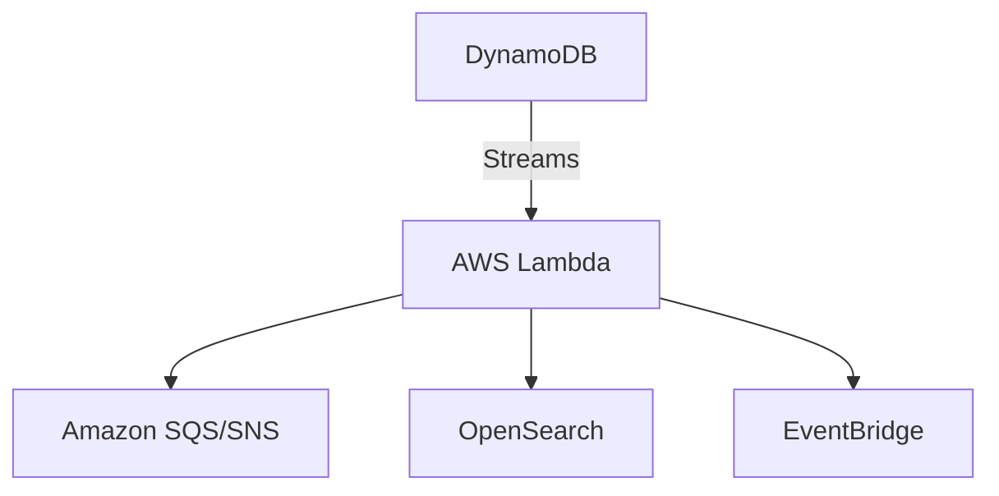

# 01- Integration Patterns (DynamoDB)

## Overview

This section explores how Amazon DynamoDB integrates with the broader AWS ecosystem, particularly serverless compute and event routers.

## 01- Integration Patterns (DynamoDB) Files

| File | Topic | Primary Focus |
|---|---|---|
| [01- DynamoDB + AWS Lambda](./01-%20DynamoDB%20%2B%20AWS%20Lambda.md) | DynamoDB + AWS Lambda | Amazon DynamoDB and AWS Lambda are one of the most common... |
| [02- DynamoDB + Amazon SQS](./02-%20DynamoDB%20%2B%20Amazon%20SQS.md) | DynamoDB + Amazon SQS | Amazon DynamoDB and Amazon SQS are commonly integrated to... |
| [03- DynamoDB + Amazon SNS](./03-%20DynamoDB%20%2B%20Amazon%20SNS.md) | DynamoDB + Amazon SNS | Amazon DynamoDB and Amazon SNS (Simple Notification Servi... |
| [04- DynamoDB + Amazon EventBridge](./04-%20DynamoDB%20%2B%20Amazon%20EventBridge.md) | DynamoDB + Amazon EventBridge | Amazon EventBridge is AWS's event bus service that enable... |
| [05- DynamoDB + AWS Step Functions](./05-%20DynamoDB%20%2B%20AWS%20Step%20Functions.md) | DynamoDB + AWS Step Functions | While Amazon SQS, SNS, and EventBridge help applications ... |
| [06- DynamoDB + API Gateway](./06-%20DynamoDB%20%2B%20API%20Gateway.md) | DynamoDB + API Gateway | Amazon API Gateway and Amazon DynamoDB form one of the mo... |
| [07- DynamoDB + Kinesis](./07-%20DynamoDB%20%2B%20Kinesis.md) | DynamoDB + Kinesis | Amazon DynamoDB and Amazon Kinesis are commonly used toge... |
| [08- CQRS with DynamoDB](./08-%20CQRS%20with%20DynamoDB.md) | CQRS with DynamoDB | CQRS (Command Query Responsibility Segregation) is an arc... |
| [09- Event-Driven Microservices](./09-%20Event-Driven%20Microservices.md) | Driven Microservices | Modern distributed systems are increasingly built using *... |
| [10- Production Integration Patterns](./10-%20Production%20Integration%20Patterns.md) | Production Integration Patterns | Building a production-grade backend is more than connecti... |

## Progression

The documentation in this section builds conceptually according to the following flow:



## Core Concepts

### DynamoDB Streams
A time-ordered sequence of item-level modifications.

### Event Sourcing
Using DynamoDB as the immutable source of truth and fanning out state changes to other microservices.

## Engineering Patterns

- **Strangler Fig Pattern:** Gradually migrating from RDS to DynamoDB by double-writing or streaming changes.
- **Materialized Views:** Using Streams and Lambda to aggregate data into another DynamoDB table for fast reads.

## Practical Considerations

Stream consumers must be idempotent because Lambda can occasionally process the same stream record more than once.

## Common Mistakes

- Processing streams synchronously, blocking the shard.
- Forgetting to configure a Dead Letter Queue (DLQ) for stream processing failures.

## Recommended Reading Order

To maximize comprehension, study the files in this sequence:

1. [01- DynamoDB + AWS Lambda](./01-%20DynamoDB%20%2B%20AWS%20Lambda.md)
2. [02- DynamoDB + Amazon SQS](./02-%20DynamoDB%20%2B%20Amazon%20SQS.md)
3. [03- DynamoDB + Amazon SNS](./03-%20DynamoDB%20%2B%20Amazon%20SNS.md)
4. [04- DynamoDB + Amazon EventBridge](./04-%20DynamoDB%20%2B%20Amazon%20EventBridge.md)
5. [05- DynamoDB + AWS Step Functions](./05-%20DynamoDB%20%2B%20AWS%20Step%20Functions.md)
6. [06- DynamoDB + API Gateway](./06-%20DynamoDB%20%2B%20API%20Gateway.md)
7. [07- DynamoDB + Kinesis](./07-%20DynamoDB%20%2B%20Kinesis.md)
8. [08- CQRS with DynamoDB](./08-%20CQRS%20with%20DynamoDB.md)
9. [09- Event-Driven Microservices](./09-%20Event-Driven%20Microservices.md)
10. [10- Production Integration Patterns](./10-%20Production%20Integration%20Patterns.md)

## Decision Checklist

- [ ] Are stream processing Lambdas idempotent?
- [ ] Is error handling in place to prevent poison pill messages?
- [ ] Are batch sizes optimized for the Lambda consumer?

## Mental Model

DynamoDB integrations transform the database from a passive storage bin into an active participant in your system's architecture.

## Key Takeaways

- Master the concepts before writing code.
- Understand the capacity implications of your designs.
- Continuously monitor production metrics.

## Folder Structure

```text
01- Integration Patterns/
    01- DynamoDB + AWS Lambda.md
    02- DynamoDB + Amazon SQS.md
    03- DynamoDB + Amazon SNS.md
    04- DynamoDB + Amazon EventBridge.md
    05- DynamoDB + AWS Step Functions.md
    06- DynamoDB + API Gateway.md
    07- DynamoDB + Kinesis.md
    08- CQRS with DynamoDB.md
    09- Event-Driven Microservices.md
    10- Production Integration Patterns.md
    README.md
```

---

## Repository Navigation

- [AWS Concepts](../../../01-%20Concepts/README.md)
- [AWS Architecture](../../../02-%20Architecture/README.md)
- [AWS Operations](../../../04-%20Operations/README.md)
- [AWS Security](../../../05-%20Security/README.md)
- [AWS Troubleshooting](../../../07-%20Troubleshooting/README.md)
- [AWS Interview Questions](../../../08-%20Interview%20Questions/README.md)
- [AWS Integrations](../../../09-%20Integrations/README.md)
