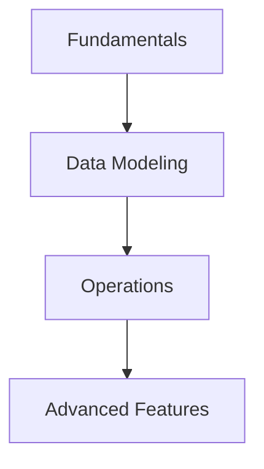

# 02- Python SDK (DynamoDB)

## Overview

This section covers the fundamental building blocks and theoretical concepts of Amazon DynamoDB.

## 02- Python SDK (DynamoDB) Files

| File | Topic | Primary Focus |
|---|---|---|
| [01- Boto3 Introduction](./01-%20Boto3%20Introduction.md) | Boto3 Introduction | Boto3 is the official AWS SDK for Python |
| [02- Configuring AWS Credentials](./02-%20Configuring%20AWS%20Credentials.md) | Configuring AWS Credentials | Before Boto3 can interact with Amazon DynamoDB or any oth... |
| [03- Sessions, Clients & Resources](./03-%20Sessions%2C%20Clients%20%26%20Resources.md) | Sessions, Clients & Resources | Boto3 provides three fundamental building blocks for inte... |
| [04- CRUD Operations with Boto3](./04-%20CRUD%20Operations%20with%20Boto3.md) | CRUD Operations with Boto3 | CRUD (Create, Read, Update, Delete) operations form the f... |
| [05- Querying Data](./05-%20Querying%20Data.md) | Querying Data | Retrieving data efficiently is one of the most important ... |
| [06- Batch Operations](./06-%20Batch%20Operations.md) | Batch Operations | In production systems, applications rarely read or write ... |
| [07- Conditional Writes](./07-%20Conditional%20Writes.md) | Conditional Writes | In distributed systems, multiple users or services may at... |
| [08- Transactions](./08-%20Transactions.md) | Transactions | Most DynamoDB operations are **atomic at the individual i... |
| [09- Pagination](./09-%20Pagination.md) | Pagination | Amazon DynamoDB is designed to scale to virtually unlimit... |
| [10- Error Handling & Retries](./10-%20Error%20Handling%20%26%20Retries.md) | Error Handling & Retries | Distributed systems are inherently unreliable |
| [11- Performance Optimization](./11-%20Performance%20Optimization.md) | Performance Optimization | One of the biggest advantages of Amazon DynamoDB is its a... |
| [12- Advanced Boto3 Patterns](./12-%20Advanced%20Boto3%20Patterns.md) | Advanced Boto3 Patterns | Most tutorials teach developers how to call: |
| [13- Building a Production Repository Layer](./13-%20Building%20a%20Production%20Repository%20Layer.md) | Building a Production Repository Layer | Most DynamoDB tutorials stop after demonstrating CRUD ope... |
| [14- Async Access with aioboto3](./14-%20Async%20Access%20with%20aioboto3.md) | Async Access with aioboto3 | Modern backend applications increasingly rely on **asynch... |
| [15- Unit Testing DynamoDB Code](./15-%20Unit%20Testing%20DynamoDB%20Code.md) | Unit Testing DynamoDB Code | Writing production code without tests is risky |
| [16- Local Development with DynamoDB Local](./16-%20Local%20Development%20with%20DynamoDB%20Local.md) | Local Development with DynamoDB Local | Developing directly against AWS during local development ... |
| [17- Production Best Practices](./17-%20Production%20Best%20Practices.md) | Production Best Practices | Building a DynamoDB application that works is relatively ... |
| [18- Interview Questions](./18-%20Interview%20Questions.md) | Interview Questions | This chapter contains interview questions commonly asked ... |

## Progression

The documentation in this section builds conceptually according to the following flow:



## Core Concepts

### NoSQL Paradigms
Understanding how DynamoDB diverges from relational models is critical.

### Partitioning Mechanics
Data is distributed across storage nodes based on the partition key hash.

## Engineering Patterns

Embracing eventual consistency for high throughput.
Designing for access patterns rather than entity normalization.

## Practical Considerations

Provisioning capacity vs using on-demand mode based on workload predictability.
Handling throttling exceptions elegantly with exponential backoff.

## Common Mistakes

- Attempting to normalize data across multiple tables.
- Failing to understand the difference between Scan and Query.
- Choosing a partition key with low cardinality.

## Recommended Reading Order

To maximize comprehension, study the files in this sequence:

1. [01- Boto3 Introduction](./01-%20Boto3%20Introduction.md)
2. [02- Configuring AWS Credentials](./02-%20Configuring%20AWS%20Credentials.md)
3. [03- Sessions, Clients & Resources](./03-%20Sessions%2C%20Clients%20%26%20Resources.md)
4. [04- CRUD Operations with Boto3](./04-%20CRUD%20Operations%20with%20Boto3.md)
5. [05- Querying Data](./05-%20Querying%20Data.md)
6. [06- Batch Operations](./06-%20Batch%20Operations.md)
7. [07- Conditional Writes](./07-%20Conditional%20Writes.md)
8. [08- Transactions](./08-%20Transactions.md)
9. [09- Pagination](./09-%20Pagination.md)
10. [10- Error Handling & Retries](./10-%20Error%20Handling%20%26%20Retries.md)
11. [11- Performance Optimization](./11-%20Performance%20Optimization.md)
12. [12- Advanced Boto3 Patterns](./12-%20Advanced%20Boto3%20Patterns.md)
13. [13- Building a Production Repository Layer](./13-%20Building%20a%20Production%20Repository%20Layer.md)
14. [14- Async Access with aioboto3](./14-%20Async%20Access%20with%20aioboto3.md)
15. [15- Unit Testing DynamoDB Code](./15-%20Unit%20Testing%20DynamoDB%20Code.md)
16. [16- Local Development with DynamoDB Local](./16-%20Local%20Development%20with%20DynamoDB%20Local.md)
17. [17- Production Best Practices](./17-%20Production%20Best%20Practices.md)
18. [18- Interview Questions](./18-%20Interview%20Questions.md)

## Decision Checklist

- [ ] Are all access patterns documented?
- [ ] Is the partition key highly distributed?
- [ ] Do we need strong consistency, or is eventual consistency acceptable?

## Mental Model

Think of DynamoDB as a massive, distributed hash table where the Hash Key determines the server, and the Sort Key acts as a B-tree index on that specific server.

## Key Takeaways

- Master the concepts before writing code.
- Understand the capacity implications of your designs.
- Continuously monitor production metrics.

## Folder Structure

```text
02- Python SDK/
    01- Boto3 Introduction.md
    02- Configuring AWS Credentials.md
    03- Sessions, Clients & Resources.md
    04- CRUD Operations with Boto3.md
    05- Querying Data.md
    06- Batch Operations.md
    07- Conditional Writes.md
    08- Transactions.md
    09- Pagination.md
    10- Error Handling & Retries.md
    11- Performance Optimization.md
    12- Advanced Boto3 Patterns.md
    13- Building a Production Repository Layer.md
    14- Async Access with aioboto3.md
    15- Unit Testing DynamoDB Code.md
    16- Local Development with DynamoDB Local.md
    17- Production Best Practices.md
    18- Interview Questions.md
    README.md
```

---

## Repository Navigation

- [AWS Concepts](../../../01-%20Concepts/README.md)
- [AWS Architecture](../../../02-%20Architecture/README.md)
- [AWS Operations](../../../04-%20Operations/README.md)
- [AWS Security](../../../05-%20Security/README.md)
- [AWS Troubleshooting](../../../07-%20Troubleshooting/README.md)
- [AWS Interview Questions](../../../08-%20Interview%20Questions/README.md)
- [AWS Integrations](../../../09-%20Integrations/README.md)
