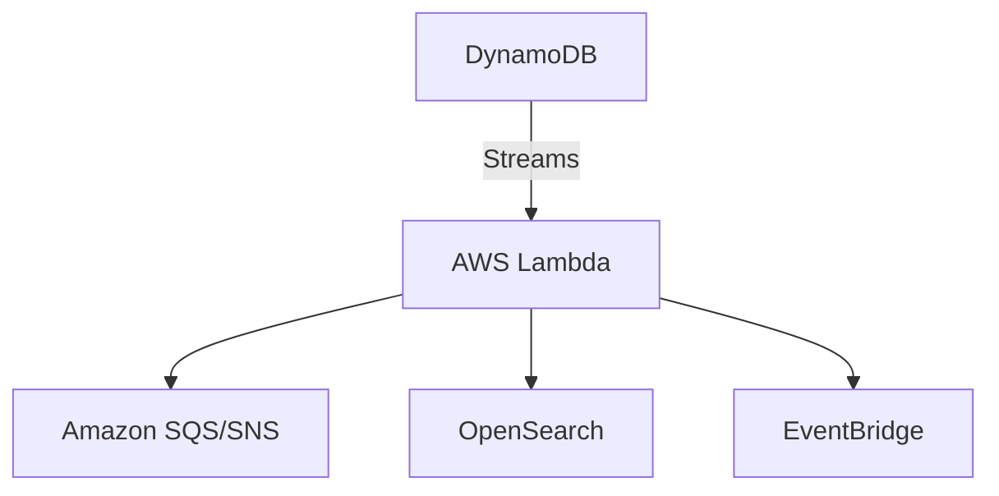

# 02- AWS DynamoDB

## Overview

This section explores how Amazon DynamoDB integrates with the broader AWS ecosystem, particularly serverless compute and event routers.

## Progression

The documentation in this section builds conceptually according to the following flow:



## Core Concepts

### DynamoDB Streams
A time-ordered sequence of item-level modifications.

### Event Sourcing
Using DynamoDB as the immutable source of truth and fanning out state changes to other microservices.

## Engineering Patterns

- **Strangler Fig Pattern:** Gradually migrating from RDS to DynamoDB by double-writing or streaming changes.
- **Materialized Views:** Using Streams and Lambda to aggregate data into another DynamoDB table for fast reads.

## Practical Considerations

Stream consumers must be idempotent because Lambda can occasionally process the same stream record more than once.

## Common Mistakes

- Processing streams synchronously, blocking the shard.
- Forgetting to configure a Dead Letter Queue (DLQ) for stream processing failures.

## Decision Checklist

- [ ] Are stream processing Lambdas idempotent?
- [ ] Is error handling in place to prevent poison pill messages?
- [ ] Are batch sizes optimized for the Lambda consumer?

## Mental Model

DynamoDB integrations transform the database from a passive storage bin into an active participant in your system's architecture.

## Key Takeaways

- Master the concepts before writing code.
- Understand the capacity implications of your designs.
- Continuously monitor production metrics.

## Folder Structure

```text
02- AWS DynamoDB/
    01- Integration Patterns/
    02- Python SDK/
    README.md
```

---

## Repository Navigation

- [AWS Concepts](../../01-%20Concepts/README.md)
- [AWS Architecture](../../02-%20Architecture/README.md)
- [AWS Operations](../../04-%20Operations/README.md)
- [AWS Security](../../05-%20Security/README.md)
- [AWS Troubleshooting](../../07-%20Troubleshooting/README.md)
- [AWS Interview Questions](../../08-%20Interview%20Questions/README.md)
- [AWS Integrations](../../09-%20Integrations/README.md)
