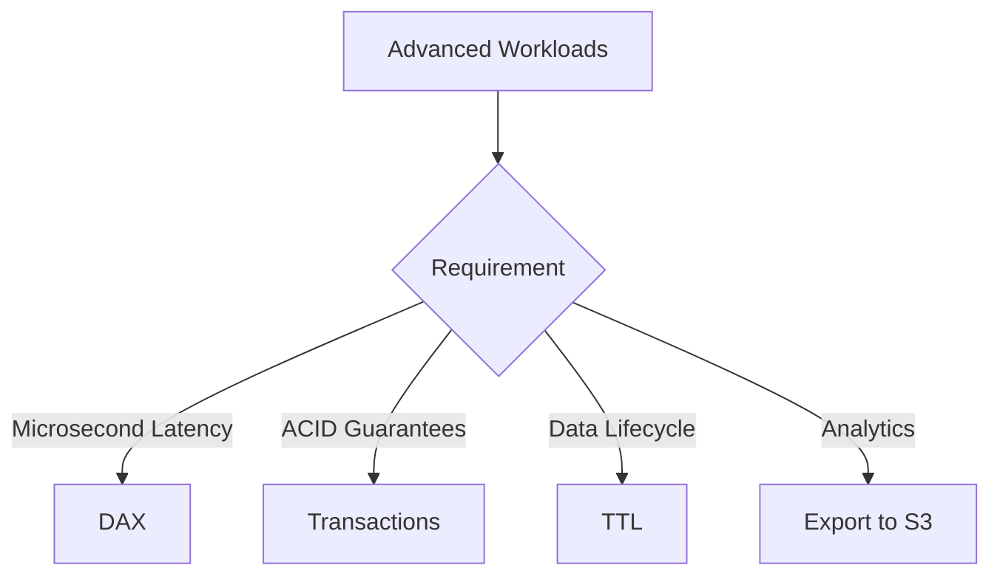

# 01- AWS DynamoDB

## Overview

This section explores advanced capabilities designed for edge cases, massive scale, and strict enterprise requirements.

## 01- AWS DynamoDB Files

| File | Topic | Primary Focus |
|---|---|---|
| [01- Export to Amazon S3](./01-%20Export%20to%20Amazon%20S3.md) | Export to Amazon S3 | Amazon DynamoDB Export to Amazon S3 allows you to export ... |
| [02- Import from Amazon S3](./02-%20Import%20from%20Amazon%20S3.md) | Import from Amazon S3 | Amazon DynamoDB Import from Amazon S3 allows you to **bul... |
| [03- Time-to-Live Design Patterns](./03-%20Time-to-Live%20Design%20Patterns.md) | Live Design Patterns | Time To Live (TTL) is more than an automatic deletion mec... |
| [04- Streams Design Patterns](./04-%20Streams%20Design%20Patterns.md) | Streams Design Patterns | DynamoDB Streams is one of the most powerful features of ... |
| [05- Global Tables Best Practices](./05-%20Global%20Tables%20Best%20Practices.md) | Global Tables Best Practices | Amazon DynamoDB Global Tables make it possible to build *... |
| [06- Advanced DynamoDB Patterns](./06-%20Advanced%20DynamoDB%20Patterns.md) | Advanced DynamoDB Patterns | By the time a system reaches millions of users, the chall... |
| [07- DynamoDB Accelerator (DAX)](./07-%20DynamoDB%20Accelerator%20%28DAX%29.md) | DynamoDB Accelerator (DAX) | As applications scale, database reads often become the pr... |
| [08- Streams](./08-%20Streams.md) | Streams | In traditional relational databases, applications often r... |
| [09- Time To Live (TTL)](./09-%20Time%20To%20Live%20%28TTL%29.md) | Time To Live (TTL) | Not every piece of data should live forever |
| [10- Transactions](./10-%20Transactions.md) | Transactions | One of the biggest criticisms of early NoSQL databases wa... |
| [11- Global Tables](./11-%20Global%20Tables.md) | Global Tables | Modern applications often serve users from multiple geogr... |
| [12- PartiQL](./12-%20PartiQL.md) | PartiQL | One of the biggest challenges developers face when learni... |
| [13- Backup, Restore and Export](./13-%20Backup%2C%20Restore%20and%20Export.md) | Backup, Restore and Export | Data is one of the most valuable assets of any application |
| [14- Security and Encryption](./14-%20Security%20and%20Encryption.md) | Security and Encryption | Security is one of the most critical aspects of any produ... |
| [15- Point-in-Time Recovery (PITR)](./15-%20Point-in-Time%20Recovery%20%28PITR%29.md) | Time Recovery (PITR) | Imagine your production application has been running flaw... |

## Progression

The documentation in this section builds conceptually according to the following flow:



## Core Concepts

### Transactions
ACID-compliant, synchronous read/write operations across multiple items.

### DAX (DynamoDB Accelerator)
A fully managed, highly available, in-memory cache for DynamoDB.

## Engineering Patterns

- **Time-to-Live (TTL):** Automatically expiring session data or temporary records to save storage costs without consuming WCUs.
- **S3 Exports:** Pushing DynamoDB table data to S3 for Athena analytics without consuming RCUs.

## Practical Considerations

Transactions cost exactly 2x the capacity of standard operations. They should be used sparingly.

## Common Mistakes

- Using DAX to solve bad data modeling (it won't help if your queries are inherently flawed).
- Relying on TTL for exact, second-level precision (TTL deletions can take up to 48 hours).

## Recommended Reading Order

To maximize comprehension, study the files in this sequence:

1. [01- Export to Amazon S3](./01-%20Export%20to%20Amazon%20S3.md)
2. [02- Import from Amazon S3](./02-%20Import%20from%20Amazon%20S3.md)
3. [03- Time-to-Live Design Patterns](./03-%20Time-to-Live%20Design%20Patterns.md)
4. [04- Streams Design Patterns](./04-%20Streams%20Design%20Patterns.md)
5. [05- Global Tables Best Practices](./05-%20Global%20Tables%20Best%20Practices.md)
6. [06- Advanced DynamoDB Patterns](./06-%20Advanced%20DynamoDB%20Patterns.md)
7. [07- DynamoDB Accelerator (DAX)](./07-%20DynamoDB%20Accelerator%20%28DAX%29.md)
8. [08- Streams](./08-%20Streams.md)
9. [09- Time To Live (TTL)](./09-%20Time%20To%20Live%20%28TTL%29.md)
10. [10- Transactions](./10-%20Transactions.md)
11. [11- Global Tables](./11-%20Global%20Tables.md)
12. [12- PartiQL](./12-%20PartiQL.md)
13. [13- Backup, Restore and Export](./13-%20Backup%2C%20Restore%20and%20Export.md)
14. [14- Security and Encryption](./14-%20Security%20and%20Encryption.md)
15. [15- Point-in-Time Recovery (PITR)](./15-%20Point-in-Time%20Recovery%20%28PITR%29.md)

## Decision Checklist

- [ ] Are Transactions absolutely necessary, or can we use eventual consistency?
- [ ] Is TTL configured to manage data growth?
- [ ] Are we exporting to S3 instead of scanning the table for analytics?

## Mental Model

Advanced features provide powerful tools, but they introduce new operational complexities and distinct pricing models that require careful cost-benefit analysis.

## Key Takeaways

- Master the concepts before writing code.
- Understand the capacity implications of your designs.
- Continuously monitor production metrics.

## Folder Structure

```text
01- AWS DynamoDB/
    01- Export to Amazon S3.md
    02- Import from Amazon S3.md
    03- Time-to-Live Design Patterns.md
    04- Streams Design Patterns.md
    05- Global Tables Best Practices.md
    06- Advanced DynamoDB Patterns.md
    07- DynamoDB Accelerator (DAX).md
    08- Streams.md
    09- Time To Live (TTL).md
    10- Transactions.md
    11- Global Tables.md
    12- PartiQL.md
    13- Backup, Restore and Export.md
    14- Security and Encryption.md
    15- Point-in-Time Recovery (PITR).md
    README.md
```

---

## Repository Navigation

- [AWS Concepts](../../01-%20Concepts/README.md)
- [AWS Architecture](../../02-%20Architecture/README.md)
- [AWS Operations](../../04-%20Operations/README.md)
- [AWS Security](../../05-%20Security/README.md)
- [AWS Troubleshooting](../../07-%20Troubleshooting/README.md)
- [AWS Interview Questions](../../08-%20Interview%20Questions/README.md)
- [AWS Integrations](../../09-%20Integrations/README.md)
