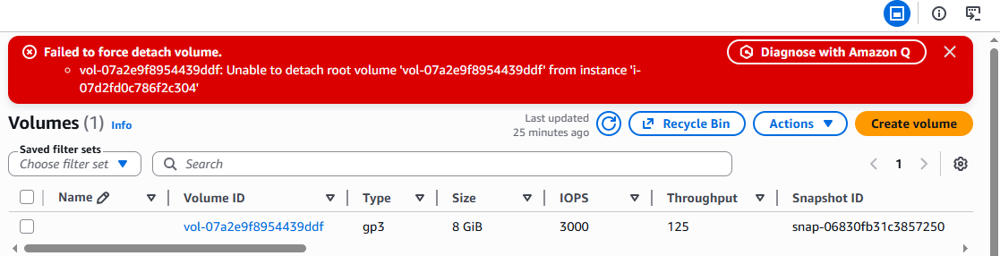

# Troubleshooting

Created by: aranya majumdar

---

# **Problem Statement - 1**

### AWS EC2 Root EBS Volume Detach Failure



### Error

```
Failed to force detach volume.

Unable to detach root volume
vol-07a2e9f8954439ddf
from instance
i-07d2fd0c786f2c304
```

### Root Cause

The EBS volume is attached as the **Root Device Volume** of the EC2 instance.

AWS does not allow detaching a root volume from a running instance because it can cause:

- Filesystem corruption
- Operating system failure
- Data loss


# Troubleshooting Steps

## Step 1: Verify Instance State

Navigate to:

```
EC2 Console
→ Instances
→ Select Instance
```

Check the instance state:

```
Running
Stopped
Stopping
Shutting-down
Terminated
```

## Scenario 1: Instance is Running

### Cause

Root volume cannot be detached while the instance is running.

### Solution

```
Actions
→ Instance State
→ Stop Instance
```

Wait until the state becomes:

```
Stopped
```

Then detach the volume:

```
Storage
→ Select Volume
→ Actions
→ Detach Volume
```

## Scenario 2: Instance is Stuck in "Stopping"

### Cause

Instance shutdown process is hung.

### Solution

Force stop the instance:

```
Actions
→ Instance State
→ Force Stop
```

Wait a few minutes and verify the state becomes:

```
Stopped
```

Then retry the volume detach operation.

## Scenario 3: Instance Already Terminated

### Cause

Volume attachment metadata may still exist.

### Verification

```bash
aws ec2 describe-volumes \
--volume-ids vol-07a2e9f8954439ddf
```

Check:

```json
"State": "in-use"
```

and attachment details.

# CLI Verification Commands

## Check Volume Details

```bash
aws ec2 describe-volumes \
--volume-ids vol-07a2e9f8954439ddf
```

## Check Instance Details

```bash
aws ec2 describe-instances \
--instance-ids i-07d2fd0c786f2c304
```

# Free Tier Cost Optimization

If the goal is to stop AWS charges:

## Option 1 (Recommended)

Terminate the EC2 instance.

```
EC2
→ Instances
→ Select Instance
→ Actions
→ Instance State
→ Terminate
```

If DeleteOnTermination is enabled, the root volume is automatically deleted.

## Option 2

Keep the data but stop charges.

### Procedure

```
1. Stop Instance
2. Create Snapshot
3. Delete EBS Volume
```

Flow:

```
EC2 Instance
      ↓
Stop
      ↓
Create Snapshot
      ↓
Delete Volume
```

# Important Exam Note

### Can a Root EBS Volume Be Detached from a Running Instance?

```
No
```

The instance must first be stopped.

### Can a Non-Root EBS Volume Be Detached While Running?

```
Yes
```

Data volumes can usually be detached from a running instance.

# Quick Revision

```
Error:
Unable to detach root volume

Reason:
Root EBS volume attached to EC2

Fix:
Stop Instance → Detach Volume

If Stuck:
Force Stop Instance

For Cost Savings:
Terminate Instance
OR
Snapshot → Delete Volume

Interview Question:
Root Volume Detach from Running Instance?
Answer: No
```

---