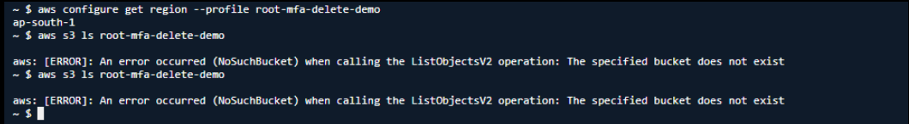

# Problem Statement - 1

### AWS S3 NoSuchBucket Error While Using AWS CLI Profile



### Error

```bash
aws s3 ls root-mfa-delete-demo

aws: [ERROR]: An error occurred (NoSuchBucket) when calling the ListObjectsV2 operation:
The specified bucket does not exist
```

### Root Cause

The AWS CLI interpreted:

```bash
root-mfa-delete-demo
```

as an S3 bucket name instead of an AWS CLI profile.

The profile name was mistakenly passed as a bucket name.

Existing buckets:

```text
elasticbeanstalk-ap-south-1-508931100893
s3-log-bucket-508931100893-ap-south-1-an
test-508931100893-ap-south-1-an
```

No bucket named:

```text
root-mfa-delete-demo
```

exists.

# Troubleshooting Steps

## Step 1: Verify Existing Buckets

```bash
aws s3 ls --profile root-mfa-delete-demo
```

Expected Output:

```text
2026-06-18 elasticbeanstalk-ap-south-1-508931100893
2026-06-11 s3-log-bucket-508931100893-ap-south-1-an
2026-06-11 test-508931100893-ap-south-1-an
```

## Step 2: Verify Profile Configuration

```bash
aws configure list --profile root-mfa-delete-demo
```

Expected:

```text
profile     root-mfa-delete-demo
region      ap-south-1
```

## Step 3: Access an Existing Bucket

```bash
aws s3 ls s3://test-508931100893-ap-south-1-an \
--profile root-mfa-delete-demo
```

# Verification Commands

## Verify Profile Identity

```bash
aws sts get-caller-identity \
--profile root-mfa-delete-demo
```

## Verify Buckets

```bash
aws s3 ls \
--profile root-mfa-delete-demo
```

# Important Exam Note

### Is AWS CLI Profile Name the Same as an S3 Bucket Name?

```text
No
```

Profile names are used for authentication.

Bucket names are AWS storage resources.

# Quick Revision

```text
Error:
NoSuchBucket

Reason:
Profile name used as bucket name

Wrong:
aws s3 ls root-mfa-delete-demo

Correct:
aws s3 ls --profile root-mfa-delete-demo

Interview Question:
Can AWS CLI profile names be used as bucket names?

Answer:
No
```

---