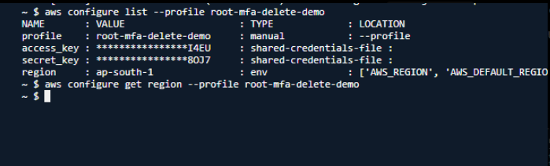

# Problem Statement - 2

### AWS S3 MFA Delete Enablement Failure



### Error

```bash
aws s3api put-bucket-versioning \
--bucket test-508931100893-ap-south-1-an \
--versioning-configuration Status=Enabled,MFADelete=Enabled \
--mfa "arn-of-mfa-device mfa-code"

aws: [ERROR]: An error occurred (NotDeviceOwnerError)
when calling the PutBucketVersioning operation:
The device with serial number arn-of-mfa-device
that generated token mfa-code is not owned by the authenticated user
```

### Root Cause

Placeholder values were used instead of actual MFA information.

Incorrect:

```bash
--mfa "arn-of-mfa-device mfa-code"
```

AWS expected:

```bash
--mfa "<MFA_DEVICE_ARN> <CURRENT_6_DIGIT_TOKEN>"
```

The MFA device ARN supplied did not belong to the authenticated account.

# Troubleshooting Steps

## Step 1: Verify Current Identity

```bash
aws sts get-caller-identity \
--profile root-mfa-delete-demo
```

Expected:

```json
{
  "Account": "508931100893",
  "Arn": "arn:aws:iam::508931100893:root"
}
```

## Step 2: Retrieve MFA Device ARN

Navigate:

```text
AWS Console
→ IAM
→ Security Credentials
→ MFA Devices
```

Example:

```text
arn:aws:iam::508931100893:mfa/root-account-mfa-device
```

## Step 3: Generate Current MFA Code

Open:

```text
Google Authenticator
Microsoft Authenticator
Authy
```

Example:

```text
123456
```

## Step 4: Retry Command

```bash
aws s3api put-bucket-versioning \
--bucket test-508931100893-ap-south-1-an \
--versioning-configuration Status=Enabled,MFADelete=Enabled \
--mfa "arn:aws:iam::508931100893:mfa/root-account-mfa-device 123456" \
--profile root-mfa-delete-demo
```

# Verification Commands

## Check Versioning Status

```bash
aws s3api get-bucket-versioning \
--bucket test-508931100893-ap-south-1-an
```

Expected:

```json
{
  "Status": "Enabled",
  "MFADelete": "Enabled"
}
```

# Important Exam Note

### Can MFA Delete Be Enabled Using an IAM User?

```text
No
```

Only the bucket owner's Root Account can enable or disable MFA Delete.

# Quick Revision

```text
Error:
NotDeviceOwnerError

Reason:
Invalid MFA ARN

Fix:
Use actual MFA device ARN
Use current MFA token

Interview Question:
Who can enable MFA Delete?

Answer:
Root Account Only
```

---
