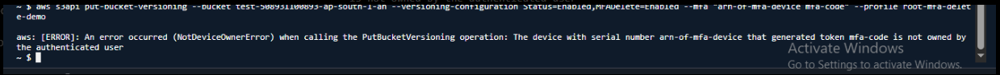

# Problem Statement - 3

### AWS S3 MFA Delete Cannot Be Disabled After Root Access Key Deletion



### Problem

Root access key was accidentally deleted after configuring MFA Delete.

Need to disable MFA Delete on the bucket.

### Root Cause

AWS requires:

```text
Root Credentials
+
Root MFA Device
+
Root Access Key
```

to disable MFA Delete.

After deleting the root access key:

```text
CLI access no longer available
```

for MFA Delete management operations.

# Troubleshooting Steps

## Step 1: Verify MFA Delete Status

```bash
aws s3api get-bucket-versioning \
--bucket test-508931100893-ap-south-1-an
```

Expected:

```json
{
  "Status": "Enabled",
  "MFADelete": "Enabled"
}
```

## Step 2: Attempt to Create New Root Access Key

Navigate:

```text
AWS Console
→ Account
→ Security Credentials
→ Access Keys
```

If allowed:

```text
Create New Root Access Key
```

## Step 3: Reconfigure CLI

```bash
aws configure --profile root-mfa-delete-demo
```

Provide:

```text
Access Key
Secret Access Key
Region
```

## Step 4: Disable MFA Delete

```bash
aws s3api put-bucket-versioning \
--bucket test-508931100893-ap-south-1-an \
--versioning-configuration Status=Enabled,MFADelete=Disabled \
--mfa "arn:aws:iam::508931100893:mfa/root-account-mfa-device 123456" \
--profile root-mfa-delete-demo
```

## Step 5: Open AWS Support Case

If root access key creation is restricted:

```text
AWS Support
→ Create Case
→ Account and Billing
```

Request assistance for MFA Delete management.

# Verification Commands

## Check Current Versioning Configuration

```bash
aws s3api get-bucket-versioning \
--bucket test-508931100893-ap-south-1-an
```

# Important Exam Note

### Can MFA Delete Be Disabled From AWS Console?

```text
No
```

AWS Console does not support MFA Delete management.

Only AWS CLI/API with Root Credentials can perform this operation.

### Can IAM Users Disable MFA Delete?

```text
No
```

Root Account Only.

# Quick Revision

```text
Problem:
Root Access Key Deleted

Impact:
Cannot manage MFA Delete via CLI

Requirements:
Root Account
Root MFA Device
Root Access Key

Fix:
Create New Root Access Key
OR
Contact AWS Support

Interview Question:
Can MFA Delete be disabled from AWS Console?

Answer:
No
```

---
