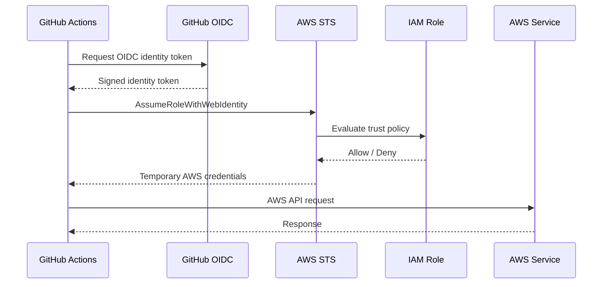
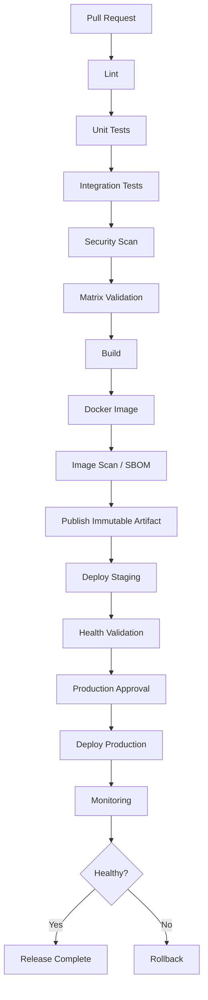

# 01- Introduction to GitHub Actions

## Overview

GitHub Actions is GitHub's native automation platform for implementing continuous integration (CI), continuous delivery (CD), testing, security checks, release automation, and deployment workflows directly from a GitHub repository.

For a backend engineer, GitHub Actions should be viewed as an execution and orchestration platform rather than simply a YAML configuration mechanism. A production workflow coordinates source checkout, dependency installation, linting, unit tests, integration tests, security validation, artifact creation, container builds, registry publishing, environment promotion, deployment, and rollback.

A typical backend pipeline can evolve from:

```text
Pull Request
    ↓
Lint
    ↓
Unit Tests
    ↓
Integration Tests
    ↓
Security Checks
    ↓
Build
    ↓
Docker Image
    ↓
Registry
    ↓
Staging
    ↓
Approval
    ↓
Production
    ↓
Health Validation
    ↓
Rollback if Required
```

The value of GitHub Actions comes from controlling this lifecycle consistently, reproducibly, securely, and with explicit dependencies between stages.

GitHub Actions is particularly useful for backend systems built with Python, Django, FastAPI, Docker, PostgreSQL, Redis, and AWS because the same workflow can validate application code, construct immutable artifacts, authenticate to AWS using OIDC, and promote the resulting artifact across environments.

## CI/CD Fundamentals

### Continuous Integration

Continuous Integration means integrating changes frequently and automatically validating them.

For a Python backend, CI commonly performs:

```text
Source Change
    ↓
Checkout
    ↓
Dependency Installation
    ↓
Lint
    ↓
Unit Tests
    ↓
Integration Tests
    ↓
Security Checks
    ↓
Build
```

The objective is not merely to prove that a developer's code runs locally. CI establishes a repeatable validation environment that runs independently of the developer's workstation.

Typical CI checks include:

| Stage | Purpose |
|---|---|
| Lint | Detect style and static-quality issues |
| Unit tests | Validate isolated application behavior |
| Integration tests | Validate interactions with databases, queues, caches, and services |
| API tests | Validate HTTP/API behavior |
| Security scanning | Detect known vulnerabilities or insecure configuration |
| Build | Prove that the deployable artifact can be produced |
| Artifact creation | Produce output that later stages can consume |

### Continuous Delivery

Continuous Delivery extends CI by ensuring that validated software can be released to an environment in a controlled manner.

A delivery pipeline may look like:

```text
CI
 ↓
Build immutable artifact
 ↓
Deploy staging
 ↓
Validate
 ↓
Approval
 ↓
Deploy production
```

The important principle is that production should preferably receive the **same artifact that was validated earlier**, rather than rebuilding the application separately for production.

### Continuous Deployment

Continuous Deployment automatically promotes changes into production after all configured controls pass.

This can be appropriate for systems where automated validation and deployment controls are sufficiently mature.

The decision to use automatic production deployment depends on factors such as:

- Application risk
- Test coverage
- Deployment strategy
- Regulatory requirements
- Required approval controls
- Rollback capability
- Monitoring quality
- Business tolerance for automated releases

GitHub Actions provides the mechanisms for all three models. The engineering decision is how those mechanisms should be combined.

## GitHub Actions Architecture

A GitHub Actions workflow is composed of several execution layers:

```text
Repository
    │
    ├── Workflow
    │      │
    │      ├── Job
    │      │    │
    │      │    ├── Step
    │      │    │    └── Action / Shell Command
    │      │    │
    │      │    └── Runner
    │      │
    │      └── Job
    │
    └── Workflow
```

The relationship is:

```text
Workflow
    ↓
Job
    ↓
Step
    ↓
Action or command
    ↓
Runner executes it
```

### Workflow

A workflow is a YAML-defined automation process stored under:

```text
.github/workflows/
```

Example:

```yaml
name: Backend CI

on:
  pull_request:
  push:
    branches:
      - main

permissions:
  contents: read

jobs:
  test:
    runs-on: ubuntu-latest

    steps:
      - uses: actions/checkout@v4

      - uses: actions/setup-python@v5
        with:
          python-version: "3.12"

      - run: pip install -r requirements.txt

      - run: pytest -q
```

A repository can contain multiple workflows, for example:

```text
.github/
    workflows/
        ci.yml
        security.yml
        docker.yml
        deploy.yml
        release.yml
```

Separating workflows can make ownership, execution, permissions, and operational troubleshooting clearer.

### Job

A job is an independently executed unit within a workflow.

Example:

```yaml
jobs:
  lint:
    runs-on: ubuntu-latest
    steps:
      - uses: actions/checkout@v4
      - run: ruff check .

  test:
    runs-on: ubuntu-latest
    steps:
      - uses: actions/checkout@v4
      - run: pytest
```

Unless dependencies are explicitly declared, jobs can execute independently.

Dependencies are expressed using `needs`:

```yaml
jobs:
  test:
    runs-on: ubuntu-latest
    steps:
      - run: pytest

  build:
    needs: test
    runs-on: ubuntu-latest
    steps:
      - run: docker build .
```

This creates:

```text
test
  ↓
build
```

### Step

A step is an individual operation inside a job.

A step can execute a shell command:

```yaml
- name: Run tests
  run: pytest -q
```

or invoke an action:

```yaml
- name: Checkout repository
  uses: actions/checkout@v4
```

Steps within the same job execute on the same runner environment, subject to the job's execution model.

### Action

An action is a reusable unit of automation.

Examples include:

```yaml
- uses: actions/checkout@v4
- uses: actions/setup-python@v5
- uses: docker/setup-buildx-action@v3
```

Actions can be:

- Marketplace actions
- Public repository actions
- Private or organization actions
- Composite actions
- JavaScript actions
- Docker actions

An action is not the same thing as a workflow. A workflow orchestrates jobs, while an action packages reusable automation.

### Runner

A runner is the compute environment that executes a job.

GitHub-hosted runners provide managed environments such as:

```yaml
runs-on: ubuntu-latest
```

Other possibilities include Windows and macOS runners, as well as self-hosted runners.

The runner provides the operating system, installed tools, filesystem, network environment, and execution context required by the job.

## Workflow Execution Model

A workflow starts when its configured event occurs.

For example:

```text
git push
   ↓
GitHub event
   ↓
Workflow trigger matches
   ↓
Workflow created
   ↓
Jobs evaluated
   ↓
Eligible jobs queued
   ↓
Runner assigned
   ↓
Steps execute
   ↓
Outputs/artifacts generated
   ↓
Dependent jobs become eligible
   ↓
Workflow completes
```

A job is not simply a collection of commands. It is an execution boundary.

This matters because:

- Different jobs can run on different runners.
- Jobs do not automatically share filesystem state.
- Job dependencies must be explicitly declared.
- Data must be passed through supported mechanisms.
- Artifacts are required when files need to move between jobs.
- Outputs are appropriate for small structured values.
- Secrets and permissions must be explicitly considered.

## Job Execution Lifecycle

A simplified job lifecycle is:

```text
Job queued
    ↓
Runner selected
    ↓
Runner environment initialized
    ↓
Job container initialized if configured
    ↓
Steps evaluated
    ↓
Step execution
    ↓
Outputs/environment updates
    ↓
Post-step processing
    ↓
Job result
```

A job can end in states such as:

- Success
- Failure
- Cancelled
- Skipped

A downstream job using `needs` can inspect upstream results and conditionally execute.

Example:

```yaml
jobs:
  test:
    runs-on: ubuntu-latest
    steps:
      - run: pytest

  report:
    needs: test
    if: ${{ failure() }}
    runs-on: ubuntu-latest
    steps:
      - run: echo "Test job failed"
```

## Step Execution Lifecycle

Steps execute sequentially within a job unless their conditions cause them to be skipped.

For example:

```yaml
steps:
  - name: Checkout
    uses: actions/checkout@v4

  - name: Install dependencies
    run: pip install -r requirements.txt

  - name: Test
    run: pytest

  - name: Build
    run: docker build .
```

Conceptually:

```text
Checkout
   ↓
Install
   ↓
Test
   ↓
Build
```

If an ordinary step fails, subsequent steps are generally skipped unless their conditions allow execution.

This distinction becomes important when implementing cleanup, diagnostics, reporting, and rollback-related workflows.

## GitHub-Hosted Runners

GitHub-hosted runners are managed compute environments supplied by GitHub.

Example:

```yaml
runs-on: ubuntu-latest
```

Advantages include:

- No runner infrastructure to maintain
- Fresh execution environments
- Convenient preinstalled tooling
- Easy horizontal scaling
- Good isolation for normal CI workloads

Limitations include:

- Execution time constraints
- Resource constraints
- Network restrictions
- Ephemeral filesystem state
- Limited control over the underlying machine
- Potential cost at larger scale depending on usage and plan

A workflow should not depend on files left behind by an earlier workflow run.

If a later job needs a generated file, explicitly transfer it using artifacts or another external storage mechanism.

## Workflow Files and YAML Structure

A basic workflow consists of:

```yaml
name: Backend CI

on:
  pull_request:

permissions:
  contents: read

jobs:
  test:
    runs-on: ubuntu-latest

    steps:
      - uses: actions/checkout@v4

      - run: pytest
```

The main structural elements are:

| Element | Purpose |
|---|---|
| `name` | Human-readable workflow name |
| `on` | Events that trigger the workflow |
| `permissions` | Token permissions |
| `env` | Environment variables |
| `jobs` | Execution units |
| `runs-on` | Runner selection |
| `steps` | Operations inside a job |
| `uses` | Invoke an action |
| `run` | Execute shell commands |
| `needs` | Define job dependencies |
| `if` | Conditional execution |
| `strategy` | Matrix/parallel execution |
| `environment` | Deployment environment |

## Workflow Triggers

The `on` section determines when a workflow can start.

### push

Runs when commits are pushed.

```yaml
on:
  push:
    branches:
      - main
```

A common production use is triggering CI or deployment after changes reach `main`.

### pull_request

Runs in response to pull request activity.

```yaml
on:
  pull_request:
```

This is commonly used for validation before merging.

For untrusted pull request code, especially from forks, the security boundary must be considered carefully.

### pull_request_target

Runs in the context of the target repository rather than the merge commit's untrusted execution environment.

```yaml
on:
  pull_request_target:
```

This event requires particular caution. It can have access to repository-level permissions and potentially secrets that normal `pull_request` workflows do not expose to forked code.

Never casually checkout and execute untrusted pull request code inside a privileged `pull_request_target` workflow.

### workflow_dispatch

Allows manual execution.

```yaml
on:
  workflow_dispatch:
    inputs:
      environment:
        required: true
        type: choice
        options:
          - staging
          - production
```

This is useful for:

- Manual deployments
- Rollbacks
- Operational workflows
- Maintenance operations
- Controlled production actions

### schedule

Runs according to a cron schedule.

```yaml
on:
  schedule:
    - cron: "0 2 * * *"
```

Typical uses include:

- Scheduled dependency checks
- Nightly tests
- Periodic maintenance
- Scheduled reporting

Scheduled workflows should be designed with the possibility of delayed or missed execution around platform availability and repository activity.

### workflow_call

Allows another workflow to invoke a reusable workflow.

```yaml
on:
  workflow_call:
```

This is useful for centralized CI/CD standards.

### workflow_run

Triggers after another workflow completes.

```yaml
on:
  workflow_run:
    workflows:
      - CI
    types:
      - completed
```

This can be useful when separating validation and deployment workflows, but security boundaries must be considered before using artifacts or data generated by an untrusted workflow.

### repository_dispatch

Allows an external system to trigger a repository workflow through GitHub's API.

It is useful for controlled integrations where another system needs to signal a workflow.

### release

Workflows can react to release events.

```yaml
on:
  release:
    types:
      - published
```

This is commonly used for release-specific packaging and publication.

## Event Filters

Triggers can be narrowed using branches, tags, and paths.

Example:

```yaml
on:
  push:
    branches:
      - main
    paths:
      - "app/**"
      - "requirements.txt"
```

A deployment workflow might instead use:

```yaml
on:
  push:
    tags:
      - "v*.*.*"
```

Filters are useful because unnecessary workflow execution increases:

- CI cost
- Queue utilization
- Developer feedback time
- Operational noise

Path filtering should not be used as a substitute for understanding dependency relationships. A change in a shared library can affect services outside the immediately changed directory.

## Expressions

GitHub Actions expressions use:

```text
${{ ... }}
```

Example:

```yaml
name: ${{ github.workflow }}
```

Expressions can evaluate contexts, operators, and functions.

Example:

```yaml
if: ${{ github.ref == 'refs/heads/main' }}
```

Logical operators include:

```text
&&
||
!
==
!=
>
>=
<
<=
```

Example:

```yaml
if: ${{ github.event_name == 'push' && github.ref == 'refs/heads/main' }}
```

Expressions are evaluated by GitHub Actions. They are not shell commands.

Compare:

```yaml
if: ${{ github.ref == 'refs/heads/main' }}
```

with:

```yaml
run: |
  if [ "$GITHUB_REF" = "refs/heads/main" ]; then
    echo "main"
  fi
```

The first is a GitHub Actions expression. The second is shell execution on the runner.

Mixing the two mental models is a common source of workflow errors.

## Important Expression Functions

### success()

Returns true when preceding relevant execution has succeeded.

```yaml
if: ${{ success() }}
```

It is commonly useful when making success-dependent execution explicit.

### failure()

Evaluates true when an earlier relevant step or dependency has failed.

```yaml
if: ${{ failure() }}
```

Useful for diagnostics or failure reporting.

### always()

`always()` evaluates to true regardless of the normal success/failure state.

```yaml
if: ${{ always() }}
```

It is commonly used for cleanup or reporting.

It should not be interpreted as a guarantee that execution survives cancellation. A cancelled workflow or job can terminate execution before a step gets to run.

### cancelled()

Evaluates true when the workflow or job has been cancelled.

```yaml
if: ${{ cancelled() }}
```

Useful when cancellation-specific behavior is required.

### contains()

```yaml
if: ${{ contains(github.event.pull_request.labels.*.name, 'deploy') }}
```

Checks whether a value contains another value.

### startsWith() and endsWith()

```yaml
if: ${{ startsWith(github.ref, 'refs/tags/v') }}
```

```yaml
if: ${{ endsWith(github.repository, '-backend') }}
```

### format()

```yaml
env:
  IMAGE_TAG: ${{ format('{0}-{1}', github.ref_name, github.sha) }}
```

### fromJSON()

Useful for converting generated JSON into structured workflow data.

```yaml
strategy:
  matrix: ${{ fromJSON(needs.generate.outputs.matrix) }}
```

### toJSON()

Useful when inspecting or passing structured context information.

```yaml
- run: echo '${{ toJSON(github.event) }}'
```

Care should be taken not to expose sensitive context information in logs.

### hashFiles()

Generates a hash based on matching files.

```yaml
key: ${{ runner.os }}-python-${{ hashFiles('**/requirements*.txt') }}
```

This is especially useful for dependency cache keys.

## GitHub Actions Contexts

Contexts provide structured information about the current workflow execution.

| Context | Typical information |
|---|---|
| `github` | Repository, event, ref, SHA, actor, workflow metadata |
| `env` | Environment variables available through workflow configuration |
| `vars` | Repository/organization/environment variables |
| `secrets` | Secrets available to the workflow |
| `steps` | Outputs and status of completed steps |
| `needs` | Outputs and results from dependent jobs |
| `job` | Current job information |
| `runner` | Runner information |
| `matrix` | Current matrix combination |
| `strategy` | Matrix strategy information |
| `inputs` | Inputs supplied to reusable/manual workflows |

Example:

```yaml
- name: Print commit
  run: echo "Commit: ${{ github.sha }}"
```

A context should be used where GitHub Actions needs to evaluate workflow state. Shell variables should be used where the command itself needs runtime environment data.

## Conditions

Conditions can be applied at step or job level.

### Step-level condition

```yaml
- name: Deploy
  if: ${{ github.ref == 'refs/heads/main' }}
  run: ./deploy.sh
```

### Job-level condition

```yaml
deploy:
  if: ${{ github.ref == 'refs/heads/main' }}
  runs-on: ubuntu-latest
  steps:
    - run: ./deploy.sh
```

### continue-on-error

```yaml
- name: Optional analysis
  continue-on-error: true
  run: ./analysis.sh
```

This changes failure handling. It should not be used simply to make a broken pipeline appear green.

For production pipelines, distinguish between:

- Required validation
- Advisory validation
- Cleanup
- Diagnostics
- Deployment gates

rather than marking everything as non-blocking.

## Environment Variables and Variables

Environment variables can be defined at multiple levels.

### Workflow level

```yaml
env:
  APP_NAME: payments-api
```

### Job level

```yaml
jobs:
  test:
    env:
      APP_ENV: test
```

### Step level

```yaml
- name: Test
  env:
    DATABASE_URL: postgresql://localhost/test
  run: pytest
```

More specific configuration can override broader environment configuration.

GitHub Actions also provides configuration variables through `vars`.

Example:

```yaml
env:
  AWS_REGION: ${{ vars.AWS_REGION }}
```

This is useful for non-sensitive configuration.

Secrets should not be placed in `env` as plain repository configuration.

## Secrets

Secrets can exist at different scopes, including:

- Repository
- Organization
- Environment

Example:

```yaml
env:
  API_TOKEN: ${{ secrets.API_TOKEN }}
```

Secrets should be treated as sensitive inputs, not general configuration.

Important practices include:

- Never commit credentials.
- Never echo secrets.
- Avoid placing secrets directly in command arguments where possible.
- Use environment-specific secrets for deployment credentials.
- Grant the smallest required permissions.
- Prefer short-lived credentials over long-lived credentials.

### Secret Inheritance

Reusable workflows can receive secrets explicitly or through:

```yaml
secrets: inherit
```

Inheritance should be used deliberately. A reusable workflow should not receive broad secret access merely because it happens to need one credential.

## GitHub Environments

Environments provide a deployment boundary such as:

```text
development
staging
production
```

An environment can provide:

- Environment variables
- Environment secrets
- Deployment protection rules
- Required reviewers
- Deployment history
- Branch restrictions

A deployment can specify:

```yaml
jobs:
  deploy:
    environment: production
```

This is valuable because production configuration and authorization become associated with the deployment environment instead of being scattered throughout workflow YAML.

## Matrix Strategies

A matrix allows one job definition to execute against multiple configurations.

Example:

```yaml
strategy:
  matrix:
    python-version:
      - "3.11"
      - "3.12"
      - "3.13"
```

This can produce:

```text
Python 3.11
Python 3.12
Python 3.13
```

For backend systems, matrix testing can cover:

- Python versions
- Database versions
- Operating systems
- Framework versions
- Configuration variants

### Multiple Dimensions

```yaml
strategy:
  matrix:
    python-version: ["3.11", "3.12"]
    database: ["postgres", "mysql"]
```

This produces four combinations.

Matrix size should be controlled because combinations grow multiplicatively.

### include

`include` can add or modify specific combinations.

```yaml
strategy:
  matrix:
    python-version: ["3.11", "3.12"]
    include:
      - python-version: "3.12"
        experimental: true
```

### exclude

```yaml
strategy:
  matrix:
    python-version: ["3.11", "3.12"]
    database: ["postgres", "mysql"]
    exclude:
      - python-version: "3.11"
        database: "mysql"
```

### fail-fast

```yaml
strategy:
  fail-fast: false
```

With `false`, one matrix failure does not immediately cancel other matrix jobs.

This is useful when you want complete compatibility information from a test run.

### max-parallel

```yaml
strategy:
  max-parallel: 2
```

This controls the number of matrix jobs executing concurrently.

It can help manage:

- Runner consumption
- Database load
- External service rate limits
- Cost

## Dynamic Matrices

A matrix can be generated dynamically from another job.

Example:

```yaml
jobs:
  generate:
    runs-on: ubuntu-latest
    outputs:
      matrix: ${{ steps.matrix.outputs.value }}
    steps:
      - id: matrix
        run: |
          echo 'value={"python-version":["3.11","3.12","3.13"]}' >> "$GITHUB_OUTPUT"

  test:
    needs: generate
    runs-on: ubuntu-latest
    strategy:
      matrix: ${{ fromJSON(needs.generate.outputs.matrix) }}
    steps:
      - run: echo "Python ${{ matrix.python-version }}"
```

This pattern is useful when the matrix comes from configuration or repository metadata.

It should not be used merely to make simple static configuration more complicated.

## Outputs and Data Flow

A workflow often needs to pass information between steps and jobs.

Modern GitHub Actions uses `$GITHUB_OUTPUT` for step outputs.

Example:

```yaml
- name: Generate image tag
  id: metadata
  run: echo "tag=${GITHUB_SHA}" >> "$GITHUB_OUTPUT"
```

The output can then be referenced:

```yaml
- run: echo "Image tag: ${{ steps.metadata.outputs.tag }}"
```

### Job Outputs

```yaml
jobs:
  build:
    runs-on: ubuntu-latest
    outputs:
      image-tag: ${{ steps.metadata.outputs.tag }}

    steps:
      - id: metadata
        run: echo "tag=${GITHUB_SHA}" >> "$GITHUB_OUTPUT"

  deploy:
    needs: build
    runs-on: ubuntu-latest
    steps:
      - run: echo "Deploy ${{ needs.build.outputs.image-tag }}"
```

The data flow is:

```text
Build Job
    │
    └── step output
          │
          ↓
       job output
          │
          ↓
      needs.build
          │
          ↓
     Deploy Job
```

### Structured Data

JSON can be used when multiple values must be transferred.

```yaml
- id: metadata
  run: |
    echo 'value={"image":"payments-api","tag":"abc123"}' >> "$GITHUB_OUTPUT"
```

Then:

```yaml
${{ fromJSON(needs.build.outputs.metadata).image }}
```

Keep outputs reasonably small. Artifacts or external storage are more appropriate for large files.

## `$GITHUB_ENV`

`$GITHUB_ENV` allows a step to make an environment variable available to subsequent steps in the same job.

```yaml
- name: Set version
  run: echo "APP_VERSION=${GITHUB_SHA}" >> "$GITHUB_ENV"

- name: Use version
  run: echo "$APP_VERSION"
```

This is different from `$GITHUB_OUTPUT`.

| Mechanism | Scope |
|---|---|
| `$GITHUB_ENV` | Environment variable for later steps in the same job |
| `$GITHUB_OUTPUT` | Step output consumed through the `steps` context |
| Job output | Data passed to dependent jobs |
| Artifact | Files passed between jobs/workflows |

## `$GITHUB_PATH`

`$GITHUB_PATH` can add directories to the runner's `PATH`.

```yaml
- run: echo "$HOME/.local/bin" >> "$GITHUB_PATH"
```

This is preferable to relying on undocumented runner state.

## Step Summaries and Annotations

A workflow can publish a human-readable summary:

```yaml
- name: Write summary
  run: |
    {
      echo "## Test Results"
      echo ""
      echo "- Status: Passed"
      echo "- Commit: $GITHUB_SHA"
    } >> "$GITHUB_STEP_SUMMARY"
```

Annotations can highlight warnings or errors in the workflow UI.

These mechanisms are useful for operational visibility without forcing engineers to inspect raw logs for every run.

## Artifacts

Artifacts are files produced by a workflow that need to be retained or consumed later.

Examples include:

- Test reports
- Coverage reports
- Build packages
- Debug logs
- Generated documentation
- Deployment manifests

Example:

```yaml
- name: Upload test reports
  uses: actions/upload-artifact@v4
  with:
    name: test-reports
    path: |
      reports/
      coverage.xml
```

A later job can download them:

```yaml
- name: Download test reports
  uses: actions/download-artifact@v4
  with:
    name: test-reports
```

Artifacts are persistent workflow outputs. They are not dependency caches.

## Artifacts vs Caches

| Feature | Artifact | Cache |
|---|---|---|
| Primary purpose | Preserve/share outputs | Speed up repeated work |
| Example | Test report | pip cache |
| Intended as deployment input | Yes | No |
| Key-based lookup | No | Yes |
| Restored for performance | No | Yes |
| Deterministic application output | Yes | No |

A Docker image, compiled package, test report, or generated deployment manifest is an artifact.

A downloaded dependency directory is normally cache data.

Do not use caches as a deployment artifact store.

## Artifact Retention

Artifact retention should reflect operational requirements.

Consider:

- Storage cost
- Debugging requirements
- Release retention
- Compliance
- Incident investigation
- Data sensitivity

Avoid retaining large artifacts indefinitely without an operational reason.

## Dependency Caching

Caching reduces repeated dependency installation.

For Python:

```yaml
- uses: actions/setup-python@v5
  with:
    python-version: "3.12"
    cache: pip
```

A manual cache can use:

```yaml
- uses: actions/cache@v4
  with:
    path: ~/.cache/pip
    key: ${{ runner.os }}-pip-${{ hashFiles('**/requirements*.txt') }}
```

A good cache key changes when the dependency definition changes.

Conceptually:

```text
Operating System
      +
Dependency Definition
      ↓
Cache Key
      ↓
Cache Hit / Miss
```

A stale cache should not be treated as authoritative application state.

## Docker Build Caching

Docker builds can also use BuildKit/Buildx caching.

Example:

```yaml
- uses: docker/setup-buildx-action@v3

- uses: docker/build-push-action@v6
  with:
    context: .
    push: false
    tags: backend-api:ci
    cache-from: type=gha
    cache-to: type=gha,mode=max
```

Caching can significantly reduce repeated Docker build time, especially when dependency layers remain unchanged.

## Reusable Workflows

Reusable workflows allow workflow orchestration to be centralized.

Example:

```yaml
on:
  workflow_call:
    inputs:
      python-version:
        required: true
        type: string
```

A caller can use:

```yaml
jobs:
  ci:
    uses: ./.github/workflows/reusable-ci.yml
    with:
      python-version: "3.12"
```

Reusable workflows can contain multiple jobs.

This makes them appropriate for organization-wide standards such as:

```text
Repository A ─┐
Repository B ─┼──> Shared CI Workflow
Repository C ─┘
```

### Reusable Workflow Inputs

```yaml
on:
  workflow_call:
    inputs:
      environment:
        type: string
        required: true
```

### Reusable Workflow Outputs

A reusable workflow can expose outputs from its jobs.

This allows a shared workflow to produce information such as:

- Image tag
- Artifact identifier
- Deployment URL
- Test result
- Build metadata

### Secrets

Secrets can be explicitly defined or inherited.

```yaml
on:
  workflow_call:
    secrets:
      AWS_ROLE_ARN:
        required: true
```

A caller can provide:

```yaml
secrets:
  AWS_ROLE_ARN: ${{ secrets.AWS_ROLE_ARN }}
```

`secrets: inherit` can be used where appropriate, but broad inheritance should be avoided when a reusable workflow only needs a small subset of secrets.

## Reusable Workflow vs Composite Action

These are related but solve different problems.

| Capability | Reusable Workflow | Composite Action |
|---|---|---|
| Multiple jobs | Yes | No |
| Orchestrate dependencies | Yes | No |
| Job-level permissions | Yes | No |
| Environment/deployment orchestration | Yes | Limited |
| Package reusable steps | Yes, at workflow level | Yes |
| Used inside a job | As a job | As a step |
| Best use | Pipeline standardization | Step standardization |

A composite action is appropriate for:

```text
Setup Python
→ Install dependencies
→ Run standard checks
```

A reusable workflow is appropriate for:

```text
Lint
   ↓
Test
   ↓
Build
   ↓
Security Scan
   ↓
Publish
```

The distinction is important in large organizations.

## Concurrency

Concurrency prevents conflicting workflow executions.

Example:

```yaml
concurrency:
  group: production-deployment
  cancel-in-progress: false
```

This prevents multiple production deployments from running concurrently.

For pull requests:

```yaml
concurrency:
  group: ci-${{ github.ref }}
  cancel-in-progress: true
```

This allows a newer commit to supersede an older CI run for the same branch.

### Deployment Race Conditions

Without concurrency:

```text
Deployment A ────────────────>
Deployment B ────────>
                         ↑
                    race condition
```

A may finish after B and accidentally deploy older code.

With concurrency:

```text
Deployment A ────────────────>
                              │
Deployment B waits ───────────┘
```

Concurrency is particularly important for:

- Production
- Staging
- Infrastructure changes
- Database migrations
- Release workflows

## Workflow Dependency Graphs

Production pipelines frequently use fan-out and fan-in execution.

Example:

```text
                 ┌── Unit Tests ──────┐
                 │                    │
Pull Request ────┼── Integration ─────┼── Build
                 │                    │
                 └── Security Scan ──┘
```

GitHub Actions models this with `needs`.

```yaml
build:
  needs:
    - unit-tests
    - integration-tests
    - security
```

This allows independent checks to execute in parallel while enforcing a build gate.

## Containers in GitHub Actions

A job can execute inside a container.

Conceptually:

```yaml
jobs:
  test:
    runs-on: ubuntu-latest

    container:
      image: python:3.12-slim

    steps:
      - uses: actions/checkout@v4
      - run: pip install -r requirements.txt
      - run: pytest
```

This provides a more controlled execution environment.

Container jobs are useful when:

- Tool versions need consistency
- The application already has a standard runtime image
- Linux-based execution is sufficient
- Reproducibility is important

However, containers do not automatically provide all infrastructure dependencies. PostgreSQL, Redis, Kafka, and similar services still require explicit service configuration or external infrastructure.

## Service Containers

Integration tests often require databases or caches.

A backend pipeline may use:

```text
Python Test Job
    │
    ├── PostgreSQL
    │
    └── Redis
```

Example:

```yaml
jobs:
  integration:
    runs-on: ubuntu-latest

    services:
      postgres:
        image: postgres:16
        env:
          POSTGRES_DB: testdb
          POSTGRES_USER: testuser
          POSTGRES_PASSWORD: testpassword
        ports:
          - 5432:5432

      redis:
        image: redis:7
        ports:
          - 6379:6379

    steps:
      - uses: actions/checkout@v4

      - uses: actions/setup-python@v5
        with:
          python-version: "3.12"

      - run: pip install -r requirements.txt

      - run: pytest
```

For a Django or FastAPI application, this allows tests to exercise real database and cache behavior.

## Database Readiness

Starting a service container does not necessarily mean the application inside it is immediately ready to accept connections.

Use health checks where appropriate:

```yaml
options: >-
  --health-cmd="pg_isready -U testuser -d testdb"
  --health-interval=5s
  --health-timeout=5s
  --health-retries=20
```

This is more reliable than blindly inserting arbitrary sleep commands.

## Testing Strategy

A mature backend pipeline generally separates:

```text
Unit Tests
    ↓
Integration Tests
    ↓
API Tests
    ↓
End-to-End Tests
```

Not every commit requires every test at maximum scope, but the pipeline should make the validation strategy explicit.

### Python Example

```text
FastAPI/Django Application
        │
        ├── Unit Tests
        │
        ├── PostgreSQL Integration Tests
        │
        ├── Redis Integration Tests
        │
        └── API Tests
```

Matrix testing can then validate supported Python versions.

## GitHub Actions Security Model

Security is one of the most important differences between a laboratory workflow and a production workflow.

The primary questions are:

- What code is executing?
- Who controls that code?
- What permissions does the workflow have?
- What secrets are available?
- What external actions are trusted?
- What network access does the runner have?
- What artifacts are being produced?

## GITHUB_TOKEN

GitHub provides a token to workflows through the `github.token` mechanism and `secrets.GITHUB_TOKEN`.

Permissions should be explicitly minimized.

Example:

```yaml
permissions:
  contents: read
```

A workflow that only checks out source code normally does not need broad write permissions.

More specific jobs can request additional access:

```yaml
jobs:
  publish:
    permissions:
      contents: read
      packages: write
```

For AWS OIDC:

```yaml
permissions:
  contents: read
  id-token: write
```

The `id-token` permission enables the workflow to request an OIDC identity token. It does not itself grant AWS access; the AWS IAM trust policy determines whether that identity can assume a role.

## Least Privilege

A useful progression is:

```text
Broad default permissions
        ↓
Workflow-level permissions
        ↓
Job-level permissions
        ↓
Minimum required access
```

For example:

```yaml
permissions:
  contents: read
```

is preferable to unnecessarily granting write permissions across the workflow.

## Script Injection

GitHub event data can contain user-controlled content.

Examples include:

- Pull request titles
- Branch names
- Issue titles
- Commit messages
- User-provided inputs

Dangerous pattern:

```yaml
- run: echo "Deploying ${{ github.event.pull_request.title }}"
```

If the value is interpreted as shell syntax, attacker-controlled content can potentially alter command execution.

A safer pattern is to pass data through an environment variable:

```yaml
- name: Print title
  env:
    PR_TITLE: ${{ github.event.pull_request.title }}
  run: |
    printf '%s\n' "$PR_TITLE"
```

The key principle is:

> Treat GitHub event data as untrusted input unless its trust boundary is explicitly established.

## pull_request vs pull_request_target

`pull_request` is generally the safer boundary for executing untrusted pull request code because the workflow runs with the pull request event context and secrets are restricted for forked repositories.

`pull_request_target` executes in the context of the target repository and therefore requires much greater care.

A dangerous design is:

```text
pull_request_target
    ↓
checkout untrusted PR code
    ↓
execute untrusted scripts
    ↓
access privileged secrets
```

This can turn a pull request into a path toward repository or deployment credentials.

Use `pull_request_target` only when its security model is explicitly understood.

## Third-Party Actions

An action is executable code.

Using:

```yaml
- uses: some-org/some-action@v1
```

means the workflow is trusting code maintained outside the workflow itself.

Risks include:

- Compromised maintainer account
- Malicious release
- Vulnerable dependency
- Unexpected behavior
- Supply-chain compromise

Prefer trusted actions, controlled versions, and appropriate pinning.

For high-assurance environments, pinning an action to a full commit SHA provides stronger immutability than relying only on a mutable tag.

## Supply Chain Security

Production pipelines should consider the integrity of:

```text
Source Code
    ↓
Dependencies
    ↓
Actions
    ↓
Build Environment
    ↓
Artifact
    ↓
Registry
    ↓
Deployment
```

Relevant controls include:

- Dependabot
- Dependency review
- Action pinning
- Trusted action sources
- SBOM generation
- Vulnerability scanning
- Artifact attestations
- Artifact signing
- Provenance
- Least-privilege workflow permissions

The goal is not simply to scan the final Docker image. The entire build chain should have identifiable trust boundaries.

## Runner Security

GitHub-hosted runners are generally suitable for untrusted CI workloads because jobs execute in managed, ephemeral environments.

Self-hosted runners require more caution.

A persistent self-hosted runner can potentially retain:

- Files
- Credentials
- Docker state
- SSH keys
- Cloud credentials
- Build artifacts
- Cached dependencies

If untrusted code can execute on the runner, the runner itself becomes part of the security boundary.

For sensitive environments, consider:

- Ephemeral runners
- Runner groups
- Restricted labels
- Network isolation
- Minimal installed credentials
- Restricted repository access

## Production CI/CD Pipeline

A production backend pipeline can be structured as:

```text
Pull Request
    ↓
Lint
    ↓
Unit Tests
    ↓
Integration Tests
    ↓
Security Scan
    ↓
Matrix Tests
    ↓
Build
    ↓
Docker Image
    ↓
Vulnerability Scan
    ↓
SBOM / Provenance
    ↓
ECR
    ↓
Staging
    ↓
Health Validation
    ↓
Approval
    ↓
Production
    ↓
Monitoring
    ↓
Rollback if Required
```

The key design principle is **build once, promote many**.

## Immutable Artifacts

A production pipeline should preferably build:

```text
Source Commit
    ↓
Docker Image
    ↓
SHA-based tag
    ↓
ECR
    ↓
Staging
    ↓
Production
```

For example:

```text
payments-api:a81f5e7...
```

The same image can then be promoted to production.

Avoid:

```text
Build for staging
    ↓
Rebuild for production
```

because the two images may differ even when generated from the same source reference.

## Docker Builds

Docker Buildx is commonly used for modern image builds.

Example:

```yaml
- uses: docker/setup-buildx-action@v3

- uses: docker/build-push-action@v6
  with:
    context: .
    push: true
    tags: |
      ${{ env.REGISTRY }}/payments-api:${{ github.sha }}
    cache-from: type=gha
    cache-to: type=gha,mode=max
```

### Image Tags

Useful tagging approaches include:

| Tag | Purpose |
|---|---|
| Commit SHA | Immutable deployment identity |
| Semantic version | Human-readable release |
| Branch tag | Development convenience |
| `latest` | Mutable pointer; avoid as deployment identity |

Production deployment should use an immutable identifier whenever possible.

## AWS Integration

GitHub Actions can interact with AWS services including:

- IAM
- STS
- ECR
- ECS
- EC2
- S3
- Lambda
- CloudFormation
- Terraform-managed AWS infrastructure

The preferred authentication model for many GitHub-to-AWS pipelines is OIDC rather than long-lived AWS access keys stored as GitHub secrets.

## GitHub Actions to AWS OIDC Flow

The authentication flow is:



The important distinction is:

```text
OIDC token
    ≠
AWS credentials
```

The token allows AWS STS to evaluate the identity. STS then issues temporary credentials if the IAM role's trust policy allows the request.

Example:

```yaml
permissions:
  contents: read
  id-token: write

steps:
  - uses: actions/checkout@v4

  - uses: aws-actions/configure-aws-credentials@v4
    with:
      role-to-assume: ${{ secrets.AWS_ROLE_ARN }}
      aws-region: ${{ vars.AWS_REGION }}

  - run: aws sts get-caller-identity
```

The IAM trust policy should restrict which GitHub repository, branch, tag, or environment can assume the role.

## ECR

A typical container pipeline is:

```text
GitHub Actions
    ↓
OIDC
    ↓
AWS STS
    ↓
IAM Role
    ↓
ECR Login
    ↓
Docker Build
    ↓
ECR Push
```

An ECR image can then be referenced by an ECS, EKS, or other deployment mechanism.

## Deployment Strategies

### Rolling Deployment

Instances are replaced progressively.

```text
Old Version
Old Version
Old Version
    ↓
Old + New
Old + New
New
    ↓
New
New
New
```

Advantages:

- Straightforward
- Efficient resource usage
- Supported naturally by many orchestration platforms

Risks:

- Old and new versions coexist temporarily
- Backward compatibility may be required
- Database migrations require careful design

### Blue/Green Deployment

Two environments are maintained:

```text
Blue  → Current Production
Green → New Version
```

Traffic can move after validation.

Advantages:

- Fast rollback
- Strong environment isolation
- Easier pre-production validation

Trade-off:

- Higher infrastructure cost

### Canary Deployment

Only a subset of traffic reaches the new version initially.

```text
Users
  │
  ├── 95% → Stable
  │
  └── 5%  → Canary
```

Traffic can increase after health and business metrics remain acceptable.

Canary deployments require strong observability.

## Rollback

Rollback should be based on immutable artifact identity.

Example:

```text
Production
    ↓
Version A
    ↓
Deploy Version B
    ↓
Health failure
    ↓
Restore Version A
```

A rollback workflow can accept an immutable image tag:

```yaml
on:
  workflow_dispatch:
    inputs:
      image-tag:
        description: Previously known-good image
        required: true
        type: string
```

The rollback process should not require rebuilding the old version.

## GitHub Releases

Release automation can be triggered using tags such as:

```text
v1.4.0
```

Example:

```yaml
on:
  push:
    tags:
      - "v*.*.*"
```

A release pipeline may:

```text
Git Tag
    ↓
Validate
    ↓
Build
    ↓
Test
    ↓
Package
    ↓
Publish Release
    ↓
Publish Deployment Artifact
```

Semantic versioning provides a predictable release identity:

```text
MAJOR.MINOR.PATCH
```

Pre-releases can be represented using versions such as:

```text
v2.0.0-rc.1
```

## Runners and Operations

### GitHub-Hosted Runners

Use them when:

- Standard operating systems are sufficient
- Public GitHub connectivity is acceptable
- Jobs do not need private network access
- Infrastructure management should remain minimal

### Self-Hosted Runners

Use them when jobs require:

- Private network access
- Custom software
- Specialized hardware
- Internal systems
- Restricted network routes

Self-hosted runners increase operational responsibility.

### Runner Labels

Labels allow jobs to target specific runner capabilities.

Conceptually:

```yaml
runs-on:
  - self-hosted
  - linux
  - private-network
```

### Runner Groups

Runner groups provide governance over which repositories or organizations can access runner pools.

This becomes important when multiple teams share infrastructure.

## Persistent vs Ephemeral Runners

Persistent runners remain available across jobs.

Ephemeral runners are created for limited execution and then discarded.

For sensitive CI/CD workloads, ephemeral execution can reduce the persistence of:

- Credentials
- Workspace files
- Docker layers
- Temporary secrets
- Compromised state

Runner architecture should therefore be treated as part of CI/CD security architecture.

## Operational Governance

At organizational scale, GitHub Actions requires governance over:

- Workflow permissions
- Marketplace actions
- Reusable workflows
- Runner access
- Secrets
- Environments
- Artifact retention
- Cache usage
- Workflow execution
- Deployment authorization

Useful controls include:

- Organization action policies
- Trusted action allowlists
- Standard reusable workflows
- Restricted production environments
- Least-privilege permissions
- Controlled self-hosted runner groups
- Dependency management
- Security scanning

## Cost and Scalability

Workflow design affects both execution time and cost.

Consider:

- Matrix size
- Runner duration
- Unnecessary triggers
- Cache effectiveness
- Docker build duration
- Parallelism
- Self-hosted infrastructure
- Artifact retention
- Repeated builds

A matrix of:

```text
3 Python versions
×
3 database versions
×
2 operating systems
```

creates up to:

```text
18 combinations
```

Matrix testing should therefore reflect actual compatibility requirements rather than every theoretically possible combination.

## Common Mistakes

### Treating GitHub Actions as a Shell Script Runner

A workflow has execution boundaries, permissions, contexts, outputs, dependencies, and security controls.

Design the pipeline rather than simply accumulating shell commands.

### Rebuilding for Every Environment

Avoid:

```text
Build staging
Build production
```

Prefer:

```text
Build once
    ↓
Artifact
    ↓
Staging
    ↓
Production
```

### Using Caches as Artifacts

Caches are performance optimizations.

They should not be the source of truth for production deployment artifacts.

### Overusing `always()`

`always()` is useful for cleanup and reporting but should not be applied indiscriminately.

A diagnostic step that must run after a failure is different from a deployment step that should run regardless of previous failures.

### Giving Every Job Write Permissions

Avoid broad permissions such as unrestricted repository write access.

Prefer:

```yaml
permissions:
  contents: read
```

and grant additional permissions only to jobs that need them.

### Storing Long-Lived AWS Credentials

For GitHub-to-AWS deployments, OIDC with short-lived STS credentials generally provides a stronger security model than storing long-lived AWS access keys as GitHub secrets.

### Executing Untrusted Data as Shell Code

Avoid interpolating user-controlled GitHub event values directly into shell syntax.

Use environment variables and safe argument handling.

### Using Mutable Deployment Tags

Do not use `latest` as the only production deployment identity.

Prefer immutable identifiers such as:

```text
github.sha
```

### Running Production Deployments Concurrently

Without concurrency controls, two deployments can race.

Use a production deployment group:

```yaml
concurrency:
  group: production-deployment
  cancel-in-progress: false
```

### Making Every Test Blocking

Not every diagnostic or experimental check needs to block deployment.

Classify checks deliberately as:

- Required
- Advisory
- Diagnostic
- Deployment gate

## Production Design Reference

A mature backend pipeline can be represented as:



The architecture separates:

- Validation
- Artifact creation
- Artifact storage
- Environment promotion
- Production authorization
- Deployment
- Observability
- Recovery

This separation makes failures easier to isolate.

## Troubleshooting Methodology

When a workflow fails, avoid changing multiple things at once.

Use:

```text
Symptom
   ↓
Possible Causes
   ↓
Isolation Strategy
   ↓
Commands / Checks
   ↓
Root Cause
   ↓
Corrective Action
   ↓
Prevention
```

### Workflow Does Not Start

Check:

- Event type
- Branch filter
- Path filter
- Tag filter
- Workflow file location
- YAML validity
- Repository/workflow configuration

### Job Is Skipped

Check:

- `if` condition
- `needs`
- Upstream job result
- Event context
- Branch/ref value
- Matrix configuration

### Expression Behaves Unexpectedly

Check:

- Context name
- Expression syntax
- String vs boolean values
- Whether evaluation happens before runner execution
- Whether the required value exists in that event payload

### Secret Is Empty

Check:

- Secret scope
- Environment assignment
- Repository/organization permissions
- Fork behavior
- Reusable workflow secret declaration
- Whether the workflow is allowed to access the environment

Do not solve a missing secret by printing it.

### Permission Denied

Inspect the workflow's `permissions` block.

Example:

```yaml
permissions:
  contents: read
  packages: write
```

Only grant the required permission.

### Matrix Failure

Check:

- Matrix dimensions
- `include`
- `exclude`
- `fail-fast`
- `max-parallel`
- Dynamic JSON
- `fromJSON()`
- Unsupported combinations

### Artifact Failure

Check:

- Artifact name
- File path
- Working directory
- Upload job result
- Download job dependency
- Retention configuration

### Cache Failure

Check:

- Cache key
- `hashFiles()`
- Dependency file location
- Runner OS
- Cache path
- Whether a cache miss is actually causing correctness failure

A cache miss should normally affect performance, not correctness.

### Service Container Failure

Check:

- Port mapping
- Environment variables
- Service health
- Database credentials
- Hostname/network configuration
- Application startup timing

### Docker Build Failure

Check:

```bash
docker build .
docker image ls
docker history <image>
```

Also inspect:

- Build context
- `.dockerignore`
- Dockerfile stages
- Dependency installation
- BuildKit cache
- Architecture/platform

### AWS OIDC Failure

Check:

```bash
aws sts get-caller-identity
```

Then verify:

- `id-token: write`
- IAM OIDC provider
- IAM trust policy
- Repository condition
- Branch/tag/environment condition
- Role ARN
- AWS region
- Token audience/subject restrictions

### Deployment Failure

Determine whether the failure is in:

```text
Artifact
    ↓
Authentication
    ↓
Registry
    ↓
Infrastructure
    ↓
Application Startup
    ↓
Health Check
    ↓
Traffic Routing
```

Do not immediately rerun the entire workflow without identifying which stage failed.

## GitHub CLI for Actions Operations

GitHub CLI can be used for common operational tasks.

List workflows:

```bash
gh workflow list
```

Run a workflow:

```bash
gh workflow run deploy.yml
```

List workflow runs:

```bash
gh run list
```

Inspect a run:

```bash
gh run view <run-id>
```

View logs:

```bash
gh run view <run-id> --log
```

Rerun a failed run:

```bash
gh run rerun <run-id>
```

List artifacts for a run:

```bash
gh run view <run-id> --json artifacts
```

List repository secrets:

```bash
gh secret list
```

Set a secret interactively:

```bash
gh secret set AWS_ROLE_ARN
```

List repository variables:

```bash
gh variable list
```

Set a variable:

```bash
gh variable set AWS_REGION --body ap-south-1
```

The CLI is particularly useful during incidents because it allows workflow inspection and reruns without navigating manually through the GitHub UI.

## Architecture Considerations

### CI Architecture

A scalable CI architecture separates independent validation stages:

```text
                    ┌── Lint ────────────┐
                    │                    │
Pull Request ───────┼── Unit Tests ──────┼── Build
                    │                    │
                    ├── Integration ─────┤
                    │                    │
                    └── Security ────────┘
```

Parallelism reduces feedback time while `needs` provides the necessary synchronization.

### Artifact Promotion Architecture

```text
Source Commit
     ↓
Build
     ↓
Immutable Artifact
     ↓
Artifact Registry
     ↓
Staging
     ↓
Validation
     ↓
Production
```

This provides stronger release consistency than rebuilding independently per environment.

### Failure Domains

Separate failure domains wherever possible:

```text
Source
  ↓
CI
  ↓
Artifact
  ↓
Registry
  ↓
Deployment
  ↓
Runtime
```

This makes incidents easier to diagnose and reduces the temptation to rerun unrelated stages.

### High Availability of CI/CD

CI/CD itself should be designed for operational resilience.

Consider:

- Idempotent deployment commands
- Immutable artifacts
- Retry-safe operations
- Deployment concurrency
- Explicit rollback
- External state where appropriate
- Monitoring of failed workflows
- Avoiding hidden runner state

A deployment pipeline should not depend on a particular runner having executed a previous job.

## Senior-Level Engineering Considerations

At senior level, GitHub Actions questions are rarely about remembering YAML syntax.

The important questions are:

- What should run in parallel?
- What must be sequential?
- Which data crosses job boundaries?
- Which outputs should be artifacts?
- Which values should be outputs?
- Which credentials are actually required?
- Which code is trusted?
- Which actions are trusted?
- Where are deployment authorization boundaries?
- How is production concurrency controlled?
- How is rollback performed?
- How is the exact production artifact identified?
- How does the pipeline behave when a runner disappears?
- How does the organization govern third-party actions?
- How does the system scale as repository count increases?

A production pipeline is an engineering system with its own reliability and security requirements.

## Interview Scenarios

### Scenario: Production Deployment Must Not Run Twice

Use deployment concurrency:

```yaml
concurrency:
  group: production-deployment
  cancel-in-progress: false
```

Explain why cancelling an active production deployment may be unsafe.

### Scenario: Multiple Python Versions

Use a matrix:

```yaml
strategy:
  matrix:
    python-version:
      - "3.11"
      - "3.12"
      - "3.13"
```

Discuss:

- Compatibility
- Matrix cost
- `fail-fast`
- `max-parallel`

### Scenario: PostgreSQL and Redis Are Required

Use service containers and explicit readiness checks.

Explain the difference between:

```text
Service started
```

and:

```text
Service ready
```

### Scenario: AWS Credentials Must Not Be Long-Lived

Use:

```text
GitHub OIDC
    ↓
AWS STS
    ↓
IAM Role
    ↓
Temporary Credentials
```

Then restrict the IAM trust policy to the required repository and deployment context.

### Scenario: Shared CI Across Repositories

Use a reusable workflow.

Explain why a reusable workflow is preferable when the standard requires multiple jobs and orchestration.

### Scenario: A Third-Party Action Is Compromised

Discuss:

- Action trust
- SHA pinning
- Permissions
- Secret exposure
- Action allowlists
- Dependency governance
- Runner isolation

The important question is not simply whether the action is trusted. It is what the action can do if it becomes compromised.

### Scenario: Production Requires Rollback

Use immutable image/artifact identifiers.

```text
Current production
    ↓
Image SHA A

Deploy
    ↓
Image SHA B

Failure
    ↓
Restore SHA A
```

Do not rebuild SHA A during rollback.

### Scenario: Docker Image Must Be Promoted Without Rebuilding

Use:

```text
Build once
    ↓
ECR
    ↓
Staging
    ↓
Production
```

The deployment references the same immutable image digest or tag.

### Scenario: Self-Hosted Runner Requires Private Network Access

Discuss:

- Runner network placement
- Runner groups
- Labels
- Ephemeral runners
- Network segmentation
- Credential exposure
- Untrusted code
- Runner cleanup

The private network requirement is not itself sufficient justification for a persistent runner.

## Production Checklist

Before considering a GitHub Actions pipeline production-ready, verify:

### Workflow Design

- Workflows are separated by responsibility.
- Job dependencies are explicit.
- Independent jobs execute in parallel where useful.
- Concurrency is configured for deployment-sensitive workflows.
- Workflow triggers are intentionally scoped.

### Testing

- Unit tests run automatically.
- Integration tests cover critical dependencies.
- Database and Redis integration is validated where required.
- Supported runtime versions are tested.
- Test results and important reports are retained appropriately.

### Security

- `GITHUB_TOKEN` permissions are minimized.
- Secrets are not printed.
- Untrusted GitHub data is not directly executed as shell syntax.
- `pull_request_target` is used only with a clear security model.
- Third-party actions are controlled.
- Dependencies are monitored.
- AWS authentication uses OIDC where appropriate.

### Artifacts

- Production artifacts are immutable.
- Docker images have identifiable versions.
- Artifact promotion does not rebuild the application.
- SBOM/provenance controls are considered for high-assurance workloads.

### Deployment

- Staging and production are distinct environments.
- Production has appropriate protection rules.
- Deployment concurrency prevents races.
- Health validation occurs after deployment.
- Rollback uses a known-good immutable artifact.

### Operations

- Workflow logs are useful.
- Step summaries are used where appropriate.
- Failures can be isolated by stage.
- Runner requirements are documented.
- Artifact and cache retention is intentional.
- Production deployments are observable.

## Key Takeaways

- **GitHub Actions is a CI/CD execution platform, not merely a YAML automation tool; workflows should be designed around explicit execution boundaries, dependencies, security controls, and deployment states.**
- **Production pipelines should build immutable artifacts once and promote the same artifact across environments rather than rebuilding separately for staging and production.**
- **Workflow security depends heavily on least-privilege permissions, careful secret handling, untrusted-input protection, controlled third-party actions, and secure runner architecture.**
- **Advanced workflow design relies on matrices, reusable workflows, outputs, artifacts, caching, concurrency, environments, and explicit job dependency graphs to achieve scalable and reliable automation.**
- **A senior engineer should be able to reason through the complete lifecycle from pull request validation to AWS deployment, observability, failure isolation, and rollback.**