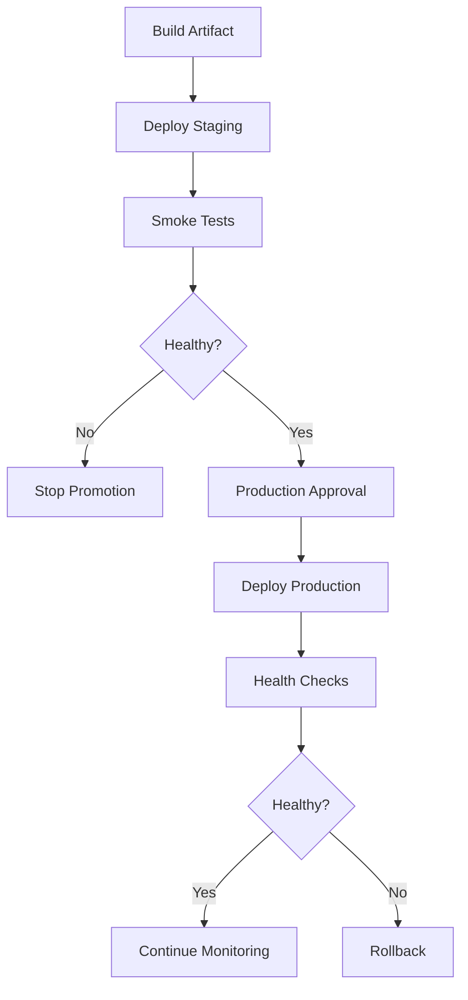
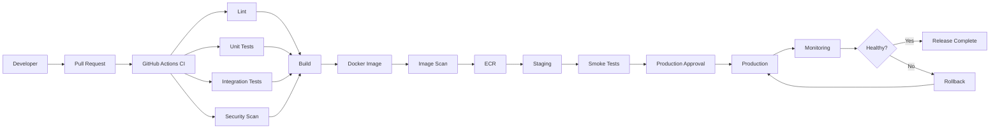

# 02- CI CD Fundamentals

## Overview

Continuous Integration and Continuous Delivery/Deployment (CI/CD) is the engineering discipline of automatically validating, packaging, releasing, and deploying software through a repeatable pipeline.

For backend systems, CI/CD connects source control with the complete software delivery lifecycle:

```text
Developer Change
      ↓
Pull Request
      ↓
Continuous Integration
      ↓
Build
      ↓
Artifact
      ↓
Continuous Delivery
      ↓
Staging
      ↓
Validation
      ↓
Production
      ↓
Monitoring
      ↓
Rollback / Recovery
```

GitHub Actions provides the execution platform for implementing these practices inside GitHub repositories, but CI/CD itself is broader than GitHub Actions. CI/CD principles apply regardless of whether the implementation uses GitHub Actions, GitLab CI, Jenkins, CircleCI, AWS CodePipeline, or another platform.

A senior backend engineer should understand both:

- **CI/CD as an engineering process**
- **GitHub Actions as an implementation platform**

This distinction prevents workflows from becoming collections of YAML commands without a coherent delivery strategy.

## Why CI/CD Matters

Without automation, a backend release may involve:

```text
Developer
   ↓
Manual Testing
   ↓
Manual Build
   ↓
Manual Configuration
   ↓
Manual Deployment
   ↓
Manual Verification
```

Each manual boundary introduces opportunities for:

- Human error
- Inconsistent environments
- Forgotten validation
- Configuration drift
- Deployment mistakes
- Unrepeatable releases
- Slow feedback
- Difficult rollback

CI/CD moves these activities into repeatable, observable automation.

The objective is not to automate everything blindly. The objective is to make software delivery:

- Repeatable
- Fast
- Observable
- Secure
- Reversible
- Consistent
- Auditable

## CI/CD Terminology

| Term | Meaning |
|---|---|
| CI | Continuous Integration |
| CD | Continuous Delivery or Continuous Deployment |
| Pipeline | Automated sequence of software delivery stages |
| Workflow | GitHub Actions automation definition |
| Job | Execution unit within a GitHub Actions workflow |
| Step | Individual operation inside a job |
| Runner | Compute environment executing a GitHub Actions job |
| Artifact | Output produced by a build or validation process |
| Environment | Deployment target such as staging or production |
| Promotion | Moving an already-built artifact to another environment |
| Rollback | Restoring a previously known-good version |
| Deployment | Making a software version available in an environment |
| Release | A version made available for distribution or deployment |

## Continuous Integration

### What CI Is

Continuous Integration is the practice of integrating changes frequently and automatically validating them.

A backend CI pipeline commonly performs:

```text
Pull Request
    ↓
Checkout
    ↓
Dependency Installation
    ↓
Lint
    ↓
Unit Tests
    ↓
Integration Tests
    ↓
Security Checks
    ↓
Build Validation
```

The core idea is that every change should be validated in a consistent environment before it becomes part of the shared codebase.

### Why CI Exists

CI reduces the cost of discovering integration problems.

Consider a Django application where multiple developers modify:

- Models
- REST APIs
- Celery tasks
- Database migrations
- Redis integration
- Authentication
- Docker configuration

If changes are integrated manually and tested only near release time, incompatibilities can accumulate.

CI moves validation closer to the change that introduced the problem.

### When CI Is Used

CI should normally run on events such as:

```text
Pull Request
Push to protected branch
Merge
```

A typical GitHub Actions trigger is:

```yaml
name: Backend CI

on:
  pull_request:
  push:
    branches:
      - main
```

The exact trigger strategy depends on repository and branching conventions.

## Continuous Delivery

### What Continuous Delivery Means

Continuous Delivery means that validated code remains in a deployable state and can be released through a controlled process.

A delivery pipeline may look like:

```text
CI
 ↓
Build
 ↓
Immutable Artifact
 ↓
Staging
 ↓
Validation
 ↓
Production Approval
 ↓
Production
```

The critical concept is **deployability**.

A successful CI run should not merely mean that tests passed. It should provide confidence that the software can be packaged and deployed.

### Delivery vs Deployment

Continuous Delivery does not necessarily mean automatic production deployment.

For example:

```text
Pull Request
    ↓
CI
    ↓
Build
    ↓
Staging
    ↓
Manual Approval
    ↓
Production
```

The production approval remains a controlled human decision.

## Continuous Deployment

Continuous Deployment automatically deploys validated changes to production.

A simplified pipeline is:

```text
Commit
   ↓
CI
   ↓
Build
   ↓
Security Validation
   ↓
Deploy
   ↓
Production
```

Continuous Deployment requires stronger automation around:

- Testing
- Monitoring
- Deployment safety
- Rollback
- Infrastructure
- Security
- Incident response

The important distinction is:

| Model | Production deployment |
|---|---|
| Continuous Integration | Not necessarily performed |
| Continuous Delivery | Ready for controlled deployment |
| Continuous Deployment | Automatically deployed |

## CI/CD Pipeline Stages

A production backend pipeline commonly contains:

```text
Source
  ↓
Validate
  ↓
Test
  ↓
Secure
  ↓
Build
  ↓
Package
  ↓
Publish
  ↓
Deploy
  ↓
Verify
  ↓
Monitor
```

Each stage should have a clear responsibility.

| Stage | Typical responsibility |
|---|---|
| Source | Obtain the exact source revision |
| Validate | Lint and static analysis |
| Test | Unit/integration/API tests |
| Secure | Dependency and security scanning |
| Build | Create deployable output |
| Package | Create immutable artifact |
| Publish | Store artifact in registry/storage |
| Deploy | Release artifact into an environment |
| Verify | Run health and smoke checks |
| Monitor | Observe runtime behavior |

Avoid creating stages simply because they sound like standard CI/CD terminology. Each stage should provide meaningful validation or delivery value.

## CI/CD and GitHub Actions

GitHub Actions represents CI/CD using workflows.

The conceptual relationship is:

```text
CI/CD Process
     ↓
GitHub Actions Workflow
     ↓
Jobs
     ↓
Steps
     ↓
Commands / Actions
     ↓
Runner
```

Example:

```yaml
name: Backend CI

on:
  pull_request:

permissions:
  contents: read

jobs:
  test:
    runs-on: ubuntu-latest

    steps:
      - name: Checkout
        uses: actions/checkout@v4

      - name: Setup Python
        uses: actions/setup-python@v5
        with:
          python-version: "3.12"

      - name: Install dependencies
        run: pip install -r requirements.txt

      - name: Run tests
        run: pytest -q
```

The YAML is the implementation mechanism. The CI process is the engineering design behind it.

## Source Control as the CI/CD Entry Point

Modern CI/CD normally starts with a version-controlled change.

For a backend repository:

```text
Developer
   ↓
Git commit
   ↓
Push branch
   ↓
Pull Request
   ↓
CI
```

Git provides the identity of the source revision.

Important identifiers include:

```text
Branch
Commit SHA
Tag
Pull Request
Release
```

For production deployments, the commit SHA or immutable artifact digest is generally more reliable than a mutable branch name.

## Pull Requests and CI

Pull request validation provides a quality gate before changes enter protected branches.

A typical process is:

```text
Feature Branch
      ↓
Pull Request
      ↓
Lint
      ↓
Unit Tests
      ↓
Integration Tests
      ↓
Security Checks
      ↓
Review
      ↓
Merge
```

The purpose of pull-request CI is to detect problems before integration.

Typical checks include:

- Formatting
- Linting
- Type checking
- Unit tests
- Integration tests
- Dependency checks
- Security scanning
- Build validation

## CI for Python Backend Systems

A Python backend pipeline may use:

```text
Python
├── Ruff
├── MyPy
├── Pytest
├── Coverage
└── Build
```

Example:

```yaml
jobs:
  quality:
    runs-on: ubuntu-latest

    steps:
      - uses: actions/checkout@v4

      - uses: actions/setup-python@v5
        with:
          python-version: "3.12"
          cache: pip

      - run: pip install -r requirements.txt
      - run: ruff check .
      - run: pytest --cov=app --cov-report=term-missing
```

For larger systems, quality and test stages can execute independently and converge before the build stage.

## CI for Django

A Django application may require:

```text
Django
  ↓
PostgreSQL
  ↓
Migrations
  ↓
pytest
```

The pipeline should test the same categories of dependencies used in production.

For example:

```text
Django API
    │
    ├── PostgreSQL
    │
    └── Redis
```

Using SQLite in CI when production uses PostgreSQL can hide database-specific behavior.

The test environment should therefore reflect production dependencies where those differences matter.

## CI for FastAPI

A FastAPI service may require:

```text
FastAPI
   ↓
PostgreSQL
   ↓
Redis
   ↓
pytest
   ↓
API Tests
```

Example test execution:

```bash
pytest -q
```

API-level validation can use the framework's testing facilities or HTTP clients to validate:

- Status codes
- Authentication
- Request validation
- Database behavior
- Serialization
- Error handling

## CI and Integration Testing

Unit tests validate isolated behavior.

Integration tests validate interactions between components.

For a backend system:

```text
Application
    │
    ├── PostgreSQL
    ├── Redis
    ├── Kafka
    └── External APIs
```

CI should determine which dependencies need to be real and which can be replaced by controlled test doubles.

A common GitHub Actions model is:

```yaml
jobs:
  integration:
    runs-on: ubuntu-latest

    services:
      postgres:
        image: postgres:16
        env:
          POSTGRES_DB: testdb
          POSTGRES_USER: testuser
          POSTGRES_PASSWORD: testpassword
        ports:
          - 5432:5432

      redis:
        image: redis:7
        ports:
          - 6379:6379

    steps:
      - uses: actions/checkout@v4
      - uses: actions/setup-python@v5
        with:
          python-version: "3.12"

      - run: pip install -r requirements.txt
      - run: pytest tests/integration
```

The goal is to validate actual integration behavior rather than merely test isolated Python functions.

## Build Stage

The build stage transforms source code into a deployable artifact.

Depending on the application, this may mean:

- Python package
- Docker image
- Static frontend bundle
- Lambda deployment package
- Helm chart
- Infrastructure package

For containerized backends:

```text
Source
  ↓
Docker Build
  ↓
Docker Image
```

The resulting image should have a unique identity.

For example:

```text
payments-api:8f31c2e
```

or preferably an immutable registry digest:

```text
payments-api@sha256:<digest>
```

## Build Once, Promote Many

One of the most important production CI/CD principles is:

```text
Build
  ↓
Immutable Artifact
  ↓
Staging
  ↓
Production
```

Avoid:

```text
Build Staging
      ↓
Build Production
```

Rebuilding separately can produce different outputs because of:

- Dependency changes
- Base image changes
- Build timestamps
- Toolchain changes
- External package availability
- Environment differences

A better model is:

```text
Git Commit
    ↓
Build
    ↓
Artifact A
    ├──→ Staging
    │
    └──→ Production
```

The artifact is validated first and then promoted.

## Artifact Identity

A production artifact should be uniquely identifiable.

Useful identifiers include:

- Commit SHA
- Semantic version
- Docker image digest
- Release identifier

Example:

```text
Commit:
8f31c2e...

Image:
payments-api:8f31c2e

Digest:
sha256:...
```

This allows an operator to answer:

> Exactly what code is running in production?

That question becomes critical during incidents.

## Artifact Repository

Artifacts need durable storage.

Typical locations include:

- GitHub Actions artifacts
- Amazon ECR
- Amazon S3
- Package registries
- Container registries

For Docker-based AWS deployments:

```text
GitHub Actions
      ↓
Docker Build
      ↓
ECR
      ↓
ECS / EC2 / EKS
```

The registry becomes the controlled handoff between CI and CD.

## Deployment Environments

Production systems commonly use multiple environments:

```text
Development
    ↓
Staging
    ↓
Production
```

Each environment serves a different purpose.

| Environment | Purpose |
|---|---|
| Development | Fast local/early integration |
| CI/Test | Automated validation |
| Staging | Production-like deployment validation |
| Production | Real user traffic |

The exact environment model varies by organization.

Avoid treating staging as simply "production with fewer users." Its value comes from reproducing important production characteristics while allowing safe validation.

## Environment Configuration

Application code should remain separate from environment-specific configuration.

Conceptually:

```text
Application Artifact
       │
       ├── Development Configuration
       ├── Staging Configuration
       └── Production Configuration
```

The same artifact can therefore be promoted without rebuilding it.

Examples of environment-specific values include:

```text
DATABASE_URL
REDIS_URL
AWS_REGION
LOG_LEVEL
EXTERNAL_API_ENDPOINT
```

Sensitive values should use secure secret management rather than source control.

## Secrets and CI/CD

Secrets are required for some deployment operations, but they should not become the default mechanism for every configuration value.

Separate:

```text
Configuration
```

from:

```text
Secrets
```

For example:

| Value | Classification |
|---|---|
| AWS region | Configuration |
| Application environment | Configuration |
| Log level | Configuration |
| Database password | Secret |
| API private key | Secret |
| AWS long-lived access key | Avoid where possible |

For GitHub-to-AWS authentication, OIDC can eliminate the need for long-lived AWS credentials.

## OIDC-Based AWS Authentication

A production AWS deployment can use:

```text
GitHub Actions
      ↓
GitHub OIDC
      ↓
AWS STS
      ↓
IAM Role
      ↓
Temporary Credentials
      ↓
AWS API
```

Example:

```yaml
permissions:
  contents: read
  id-token: write

steps:
  - uses: actions/checkout@v4

  - name: Configure AWS credentials
    uses: aws-actions/configure-aws-credentials@v4
    with:
      role-to-assume: ${{ secrets.AWS_ROLE_ARN }}
      aws-region: ${{ vars.AWS_REGION }}

  - name: Verify identity
    run: aws sts get-caller-identity
```

The IAM trust policy should restrict the identities allowed to assume the role.

## Deployment Strategies

CI/CD does not prescribe a single deployment strategy.

Common approaches include:

### Rolling Deployment

```text
Old Old Old
   ↓
Old New Old
   ↓
New New Old
   ↓
New New New
```

This replaces instances progressively.

Advantages:

- Lower infrastructure overhead
- Straightforward operational model

Limitations:

- Old and new versions coexist
- Backward compatibility can be required
- Rollback may take time

### Blue/Green Deployment

```text
             ┌── Blue ── Current
Traffic ─────┤
             └── Green ─ New
```

Traffic is switched after the new environment is validated.

Advantages:

- Fast rollback
- Strong environment isolation

Limitations:

- Higher infrastructure cost
- Requires traffic switching capability

### Canary Deployment

```text
Traffic
   │
   ├── 95% → Stable
   │
   └── 5%  → New
```

Traffic is gradually increased after validation.

Advantages:

- Reduced blast radius
- Real production validation

Limitations:

- More complex routing
- Requires strong observability
- Requires careful rollback

## Zero-Downtime Deployment

Zero-downtime deployment means the system continues serving users while a new version is introduced.

This usually requires:

- Multiple application instances
- Health checks
- Load balancing
- Backward-compatible changes
- Controlled traffic movement

For example:

```text
Nginx / Load Balancer
        │
        ├── Instance A — Version 1
        ├── Instance B — Version 1
        └── Instance C — Version 2
```

A deployment should not route traffic to an instance until its readiness conditions are satisfied.

## Database Migrations

Database migrations are one of the most difficult parts of production deployment.

Consider:

```text
Application V1
    ↓
Database Schema V1
```

A deployment that immediately changes the schema to an incompatible version can break currently running instances.

Prefer backward-compatible migration strategies.

For example:

```text
Expand
  ↓
Deploy application compatible with old + new schema
  ↓
Migrate data
  ↓
Switch behavior
  ↓
Contract
```

This becomes especially important during rolling deployments where multiple application versions can temporarily coexist.

## Deployment Approval

Production deployments can require explicit approval.

Conceptually:

```text
CI
 ↓
Build
 ↓
Staging
 ↓
Validation
 ↓
Production Approval
 ↓
Production
```

GitHub Actions environments can be used to enforce deployment protection rules and manage environment-specific secrets.

The important engineering distinction is that approval should protect a meaningful production boundary rather than merely add manual clicks to every pipeline stage.

## Deployment Concurrency

Two production deployments should generally not modify the same deployment target concurrently unless the deployment system explicitly supports safe parallelism.

Example:

```yaml
concurrency:
  group: production-deployment
  cancel-in-progress: false
```

Without concurrency:

```text
Deployment A ────────────────>
Deployment B ────────>
                           ↑
                       race condition
```

With controlled concurrency:

```text
Deployment A ────────────────>
Deployment B ─────────────────────>
```

The exact behavior should reflect deployment semantics. For example, cancelling a running production deployment may itself be unsafe.

## Rollback

Rollback is the ability to restore a known-good application version.

A robust rollback process uses an existing artifact:

```text
Production
    ↓
Version A
    ↓
Deploy Version B
    ↓
Health Check Failure
    ↓
Rollback to Version A
```

Avoid:

```text
Failure
  ↓
Rebuild Version A
  ↓
Deploy
```

The rebuild may not reproduce the original artifact.

For Docker workloads, deployment should reference an immutable image identity.

## Monitoring and CI/CD

CI/CD does not end when deployment succeeds.

A successful deployment means:

```text
Deployment Command Succeeded
```

It does not necessarily mean:

```text
Application Is Healthy
```

Post-deployment validation should consider:

- HTTP health checks
- Error rates
- Latency
- CPU/memory
- Database connectivity
- Queue processing
- Redis connectivity
- Business metrics

For a FastAPI service, a smoke test might call:

```text
GET /health
```

For a Django API, validation might include an authenticated endpoint and database-backed request.

## Deployment Health Model

A production deployment can follow:



This is safer than treating the deployment command itself as the final validation.

## CI/CD Reliability

A pipeline is itself a production system.

Reliability considerations include:

- Idempotent operations
- Explicit dependencies
- Retry-safe operations
- Immutable artifacts
- Controlled concurrency
- Clear failure boundaries
- Deterministic builds
- Observability
- Rollback capability

For example, an infrastructure deployment should be safe to retry where possible.

A failed workflow should not leave the system in an unknown state simply because the operator clicked "rerun."

## Idempotency

A deployment operation is idempotent when repeating it does not produce unintended additional effects.

For example:

```text
Deploy image X
Deploy image X
```

should result in the same intended application state rather than creating duplicate resources or conflicting infrastructure.

This is particularly important for:

- Terraform
- CloudFormation
- ECS deployments
- Kubernetes
- Database migration orchestration
- Infrastructure automation

## Failure Domains

A mature CI/CD system separates failure domains.

```text
Source
  ↓
CI
  ↓
Artifact
  ↓
Registry
  ↓
Deployment
  ↓
Application
  ↓
Runtime
```

If a Docker build fails, there is no reason to investigate ECS health checks.

If an application starts but returns HTTP 500 responses, rerunning linting is unlikely to help.

This separation makes troubleshooting faster.

## Pipeline Parallelism

Independent CI tasks should execute in parallel when there is no dependency between them.

For example:

```text
             ┌── Lint ────────────┐
             │                    │
Pull Request ├── Unit Tests ──────┼── Build
             │                    │
             └── Security Scan ──┘
```

This reduces feedback time.

Sequential execution should be used where ordering matters:

```text
Build
  ↓
Deploy Staging
  ↓
Validate
  ↓
Approval
  ↓
Production
```

The goal is not maximum parallelism. It is **correct parallelism**.

## CI/CD Performance

Pipeline performance is affected by:

- Dependency installation
- Docker build time
- Test duration
- Matrix size
- Runner startup
- Network downloads
- Artifact transfer
- Unnecessary workflow triggers

Caching can reduce repeated work.

For Python:

```yaml
- uses: actions/setup-python@v5
  with:
    python-version: "3.12"
    cache: pip
```

Docker Buildx can also cache layers:

```yaml
- uses: docker/build-push-action@v6
  with:
    context: .
    cache-from: type=gha
    cache-to: type=gha,mode=max
```

Caching should improve performance without becoming a correctness dependency.

## Matrix Testing

Matrix testing is useful when compatibility across multiple configurations is part of the product contract.

Example:

```yaml
strategy:
  matrix:
    python-version:
      - "3.11"
      - "3.12"
      - "3.13"
```

This creates separate executions for each supported Python version.

A multi-dimensional matrix might test:

```text
Python 3.11 × PostgreSQL
Python 3.11 × MySQL
Python 3.12 × PostgreSQL
Python 3.12 × MySQL
```

Matrix size must be balanced against execution cost.

For example:

```text
3 Python versions
×
3 database versions
×
2 operating systems
=
18 jobs
```

Not every theoretical combination necessarily provides meaningful coverage.

## Security in CI/CD

Security should exist throughout the delivery lifecycle.

```text
Source
 ↓
Dependencies
 ↓
CI
 ↓
Build
 ↓
Artifact
 ↓
Registry
 ↓
Deployment
```

Important controls include:

- Least-privilege GitHub permissions
- Secret protection
- Dependency scanning
- Trusted actions
- Action version/SHA pinning
- Container vulnerability scanning
- SBOM generation
- Artifact provenance
- OIDC-based cloud authentication
- Restricted production environments

## Supply Chain Security

The software supply chain includes more than application source code.

A production pipeline may depend on:

```text
Application
    ↓
Python packages
    ↓
Base Docker image
    ↓
GitHub Actions
    ↓
Build tools
    ↓
Container registry
```

A compromise at any layer can affect the final artifact.

Supply-chain controls therefore include:

- Dependabot
- Dependency review
- Trusted package sources
- Action pinning
- Container scanning
- SBOM
- Artifact attestations
- Provenance
- Restricted workflow permissions

## GitHub Actions Security Boundary

The security model should answer:

```text
Who triggered the workflow?
        ↓
What code is executing?
        ↓
What permissions exist?
        ↓
What secrets are accessible?
        ↓
What network can the runner reach?
        ↓
What artifacts can be published?
```

This is especially important for pull requests originating from forks.

Untrusted code should not automatically receive access to production credentials.

## `pull_request` vs `pull_request_target`

For untrusted pull request code, `pull_request` generally provides a safer execution boundary.

`pull_request_target` executes with the context of the target repository and therefore requires careful design.

A dangerous pattern is:

```text
pull_request_target
       ↓
Checkout attacker-controlled code
       ↓
Execute scripts
       ↓
Access privileged secrets
```

The workflow itself may be trusted, but the checked-out code may not be.

The security boundary must therefore be explicit.

## CI/CD Cost Management

Pipeline cost comes from more than runner minutes.

Consider:

- Number of workflow executions
- Matrix combinations
- Artifact storage
- Cache storage
- Docker build time
- Self-hosted infrastructure
- Network transfer
- Unnecessary scheduled workflows

Useful optimization techniques include:

- Path filters
- Appropriate branch filters
- Dependency caching
- Docker layer caching
- Parallel execution
- Appropriate matrix scope
- Artifact retention policies

Avoid optimizing CI by removing important validation merely to reduce execution time.

## Common CI/CD Mistakes

### Treating CI as Only Unit Testing

A backend can pass unit tests while failing because:

- PostgreSQL configuration is wrong
- Redis is unavailable
- Docker image is broken
- Environment variables are missing
- Database migrations fail

CI should validate the important production integration boundaries.

### Rebuilding for Production

Rebuilding separately creates artifact drift.

Prefer:

```text
Build once
   ↓
Immutable artifact
   ↓
Promote
```

### Using `latest` as the Deployment Version

`latest` is mutable.

A production incident becomes harder to investigate if the deployment identity cannot be determined precisely.

Prefer immutable identifiers.

### Storing AWS Access Keys in GitHub Secrets

Long-lived credentials increase the impact of credential leakage.

Prefer OIDC and temporary STS credentials where supported.

### Ignoring Database Migration Compatibility

Application and schema changes can overlap during rolling deployments.

Use backward-compatible migration strategies.

### Using Arbitrary Sleep for Readiness

Avoid:

```bash
sleep 30
```

when a real health check can determine readiness.

### Making Every Stage Sequential

This creates unnecessarily slow pipelines.

Independent validation should normally execute concurrently.

### Making Everything Parallel

Some stages have strict dependencies.

Production deployment should not begin before required validation and artifact creation have completed.

### Treating Deployment Success as Application Success

A deployment command returning exit code `0` does not prove that the application is healthy.

Always include appropriate post-deployment validation.

## Production CI/CD Reference Architecture

A backend system using Python, Docker, and AWS can use:



This architecture separates:

- Validation
- Build
- Artifact creation
- Artifact storage
- Environment promotion
- Authorization
- Deployment
- Monitoring
- Recovery

## CI/CD with AWS

A common AWS-oriented architecture is:

```text
GitHub Actions
      │
      ├── OIDC → STS → IAM
      │
      ├── Docker → ECR
      │
      ├── ECS Deployment
      │
      ├── S3 Artifacts
      │
      └── Infrastructure → CloudFormation / Terraform
```

The pipeline should keep infrastructure deployment and application deployment conceptually distinct even when they are executed from the same workflow.

## CI/CD with Docker

A containerized pipeline commonly follows:

```text
Git Commit
    ↓
Docker Build
    ↓
Test Image
    ↓
Security Scan
    ↓
SBOM
    ↓
Push ECR
    ↓
Deploy
```

A multi-stage Dockerfile can separate build dependencies from runtime dependencies.

Example:

```dockerfile
FROM python:3.12-slim AS builder

WORKDIR /app

COPY requirements.txt .
RUN pip install --no-cache-dir --prefix=/install -r requirements.txt

FROM python:3.12-slim

WORKDIR /app

COPY --from=builder /install /usr/local
COPY . .

CMD ["python", "-m", "app"]
```

The CI pipeline should build and validate the same image that will be deployed.

## CI/CD with Kubernetes

For Kubernetes deployments, the artifact flow can be:

```text
GitHub Actions
    ↓
Docker Build
    ↓
Container Registry
    ↓
Kubernetes Manifest / Helm
    ↓
Deployment
    ↓
Readiness Checks
    ↓
Monitoring
```

The deployment system should use immutable image references where practical.

Kubernetes adds additional deployment concerns such as:

- Readiness probes
- Liveness probes
- Rolling updates
- Replica management
- Resource limits
- Rollout status
- Rollback

## Senior-Level CI/CD Design Principles

A senior engineer should design the pipeline around system properties rather than YAML convenience.

### Reproducibility

The same source revision should produce a predictable artifact.

### Immutability

Once an artifact is published, its identity should not change.

### Traceability

Every production deployment should be traceable to:

```text
Repository
→ Commit
→ Build
→ Artifact
→ Deployment
```

### Least Privilege

Each workflow and job should have only the permissions it needs.

### Isolation

Untrusted code should not share sensitive credentials or infrastructure unnecessarily.

### Idempotency

Retrying an operation should not create unintended state.

### Observability

Failures should expose enough information to determine where the pipeline stopped.

### Recoverability

A failed deployment should have a known recovery path.

## Interview Scenarios

### Design a Production Pipeline

A suitable answer should cover:

```text
PR
 ↓
Lint
 ↓
Unit Tests
 ↓
Integration Tests
 ↓
Security
 ↓
Build
 ↓
Immutable Artifact
 ↓
Staging
 ↓
Approval
 ↓
Production
 ↓
Monitoring
 ↓
Rollback
```

Then explain why each boundary exists.

### Multiple Python Versions

Use matrix testing and discuss:

- Supported versions
- Execution cost
- `fail-fast`
- `max-parallel`
- Compatibility failures

### PostgreSQL and Redis

Use service containers and discuss:

- Networking
- Ports
- Environment variables
- Health/readiness
- Integration tests

### AWS Without Long-Lived Credentials

Use:

```text
GitHub OIDC
 ↓
AWS STS
 ↓
IAM Role
 ↓
Temporary Credentials
```

Then explain IAM trust-policy restrictions.

### Production Deployment Must Not Run Twice

Use deployment concurrency and explain why production deployments must be serialized or otherwise coordinated.

### Production Rollback

Use the previously published immutable artifact rather than rebuilding an older source revision.

### Docker Image Promotion

Build once:

```text
Docker Build
    ↓
ECR
    ↓
Staging
    ↓
Production
```

Do not rebuild for production.

### Third-Party Action Compromise

Discuss:

- Action trust
- SHA pinning
- Permissions
- Secret exposure
- Runner isolation
- Marketplace governance

The key question is:

> What is the maximum damage the action could cause if it were compromised?

## CI/CD Operational Checklist

### Source

- Changes are version controlled.
- Pull requests trigger appropriate validation.
- Production deployments reference immutable revisions.

### CI

- Linting runs automatically.
- Unit tests run automatically.
- Integration tests cover important dependencies.
- Security checks are integrated.
- Matrix testing covers supported versions.

### Build

- Builds are reproducible.
- Artifacts are immutable.
- Docker images have identifiable versions.
- Build metadata can be traced to source.

### Delivery

- Staging exists where appropriate.
- The same artifact is promoted across environments.
- Production deployments are protected.
- Deployment concurrency is controlled.
- Rollback is documented and tested.

### Security

- Workflow permissions use least privilege.
- Secrets are protected.
- Untrusted input is handled safely.
- Third-party actions are controlled.
- AWS authentication uses OIDC where appropriate.

### Operations

- Deployment health is validated.
- Logs and workflow summaries are available.
- Failures have clear boundaries.
- Artifacts have appropriate retention.
- CI/CD costs are monitored.
- Recovery procedures are operationally tested.

## Key Takeaways

- **CI/CD is an engineering delivery discipline; GitHub Actions is one platform for implementing it.**
- **A production pipeline should validate code, produce an immutable artifact, promote that artifact through environments, verify runtime health, and provide a reliable rollback path.**
- **Build-once-and-promote avoids artifact drift and improves traceability, reproducibility, and production confidence.**
- **Security, concurrency, least privilege, environment protection, and supply-chain controls are core CI/CD design concerns rather than optional additions.**
- **Senior-level CI/CD design focuses on reliability, failure isolation, observability, scalability, security, and recovery—not merely writing workflow YAML.**