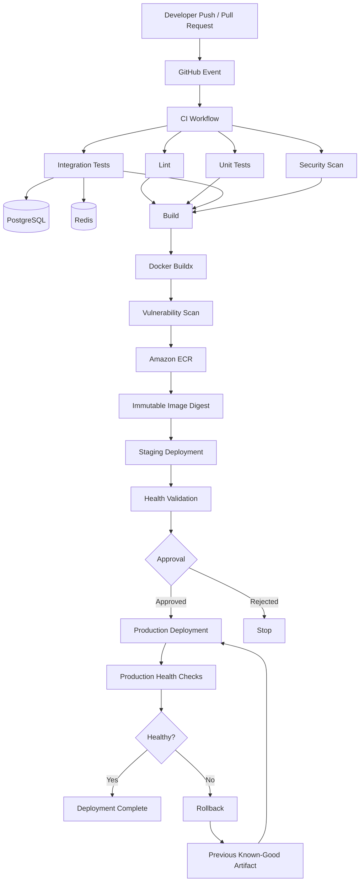

# 03- GitHub Actions Architecture

## Overview

GitHub Actions is a workflow execution platform built around event-driven automation. In a production CI/CD system, it is more useful to think of GitHub Actions as a distributed execution and orchestration layer than as a YAML file format.

A typical backend delivery system can be modeled as:

```text
Git Event / Manual Trigger / Schedule
                │
                ▼
           Workflow
                │
        ┌───────┴────────┐
        ▼                ▼
   Validation         Build
   Jobs               Job
        │                │
        └───────┬────────┘
                ▼
          Artifact/Image
                │
                ▼
          Deployment
          Workflow
                │
        ┌───────┴────────┐
        ▼                ▼
      Staging         Production
        │                │
        └───────┬────────┘
                ▼
       Health Validation
                │
        ┌───────┴────────┐
        ▼                ▼
       Success         Rollback
```

The important architectural concern is not simply whether a workflow succeeds. A production-grade design must also answer:

- Where does execution happen?
- Which jobs can run in parallel?
- Which jobs depend on other jobs?
- How is data transferred between jobs?
- Where are artifacts stored?
- How are credentials obtained?
- How are environments protected?
- How are deployments serialized?
- What happens when a job or runner fails?
- How is the exact production artifact identified?
- How can the system be rolled back?
- How does the architecture scale across repositories and teams?

A useful mental model is:

> **GitHub Actions provides orchestration; runners provide execution; artifacts provide durable delivery inputs; environments provide deployment boundaries; external systems provide application infrastructure.**

---

## GitHub Actions Architectural Model

At a high level, GitHub Actions consists of several cooperating components:

```text
┌──────────────────────────────────────────────────────────────┐
│                         GitHub Repository                     │
│                                                              │
│  Source Code     .github/workflows/*.yml     Actions Config  │
└──────────────────────────────┬───────────────────────────────┘
                               │
                               │ Event
                               ▼
┌──────────────────────────────────────────────────────────────┐
│                    GitHub Actions Service                    │
│                                                              │
│  Workflow Parsing                                            │
│  Trigger Evaluation                                          │
│  Job Dependency Graph                                        │
│  Matrix Expansion                                            │
│  Permissions / Context                                       │
│  Environment / Approval Coordination                         │
│  Queueing / Concurrency                                      │
└──────────────────────────────┬───────────────────────────────┘
                               │
                         Job Assignment
                               │
                               ▼
┌──────────────────────────────────────────────────────────────┐
│                           Runner                             │
│                                                              │
│  Runner Agent                                                │
│      │                                                       │
│      ├── Step 1                                               │
│      ├── Step 2                                               │
│      ├── Action                                                │
│      ├── Shell Command                                         │
│      └── Cleanup                                               │
└──────────────┬───────────────────────┬───────────────────────┘
               │                       │
               ▼                       ▼
        External Services          Artifact Storage
        ├── AWS                    ├── Artifacts
        ├── ECR                    └── Logs / Reports
        ├── PostgreSQL
        ├── Redis
        ├── Kubernetes
        └── Cloud APIs
```

The GitHub Actions service coordinates execution, but the actual commands in a job execute on a runner.

This distinction becomes important when designing:

- self-hosted runners
- private-network deployments
- Docker builds
- credentials
- network access
- runner isolation
- performance
- cost controls

---

## Core Architectural Relationship

The fundamental hierarchy is:

```text
Workflow
   │
   ├── Job
   │     │
   │     ├── Step
   │     │     └── Action / Shell Command
   │     │
   │     └── Step
   │
   └── Job
         │
         └── Step
```

The execution relationship can be summarized as:

| Component | Responsibility | Execution boundary |
|---|---|---|
| Workflow | Defines automation | GitHub Actions service |
| Job | Defines a unit of execution | One runner |
| Step | Defines an operation | Same runner as its job |
| Action | Reusable implementation | Inside a step |
| Runner | Executes the job | GitHub-hosted or self-hosted |
| Artifact | Durable workflow output | GitHub artifact storage |
| Environment | Deployment boundary | GitHub environment controls |
| External service | Application infrastructure | AWS, Kubernetes, databases, etc. |

A key architectural rule is:

> **Steps in the same job share the runner environment; separate jobs do not.**

This explains why files created in one job should not be assumed to exist in another job unless they are transferred explicitly through artifacts, caches, or another external storage mechanism.

---

## Workflow Architecture

A workflow is the top-level automation definition stored under:

```text
.github/
    workflows/
        ci.yml
        cd.yml
        release.yml
```

A workflow normally contains:

```yaml
name: Backend CI

on:
  pull_request:
    branches:
      - main

permissions:
  contents: read

jobs:
  test:
    runs-on: ubuntu-latest

    steps:
      - name: Checkout
        uses: actions/checkout@v4

      - name: Set up Python
        uses: actions/setup-python@v5
        with:
          python-version: "3.12"

      - name: Install dependencies
        run: pip install -r requirements.txt

      - name: Run tests
        run: pytest
```

Architecturally, this means:

```text
Pull Request
     │
     ▼
Workflow Trigger
     │
     ▼
Workflow
     │
     ▼
test Job
     │
     ├── Checkout
     ├── Setup Python
     ├── Install dependencies
     └── pytest
```

The workflow itself does not execute Python commands directly. The workflow defines the execution plan, while a runner performs the work.

---

## Workflow Execution Lifecycle

A simplified workflow lifecycle is:

```text
Event
  │
  ▼
Trigger Matching
  │
  ▼
Workflow Selected
  │
  ▼
YAML Parsed
  │
  ▼
Jobs Expanded
  │
  ├── Matrix expansion
  ├── Conditions
  └── Dependencies
  │
  ▼
Job Queue
  │
  ▼
Runner Assigned
  │
  ▼
Job Initialization
  │
  ├── Repository checkout
  ├── Environment setup
  └── Context initialization
  │
  ▼
Steps Execute
  │
  ├── Actions
  └── Shell commands
  │
  ▼
Job Result
  │
  ▼
Dependent Jobs
  │
  ▼
Workflow Result
```

The exact internal implementation is managed by GitHub, but this execution model is useful when troubleshooting.

For example, if a workflow does not start at all, debugging the Python test command is premature. The failure is likely earlier in the lifecycle:

```text
Event
→ Trigger
→ Workflow discovery
→ Job scheduling
```

---

## Event-Driven Architecture

GitHub Actions workflows are event-driven.

Common triggers include:

| Trigger | Typical use |
|---|---|
| `push` | Continuous integration after commits |
| `pull_request` | PR validation |
| `pull_request_target` | Controlled automation requiring base-repository context |
| `workflow_dispatch` | Manual execution |
| `schedule` | Scheduled maintenance |
| `workflow_call` | Reusable workflow invocation |
| `workflow_run` | Trigger based on another workflow |
| `repository_dispatch` | External system integration |
| `release` | Release automation |

Example:

```yaml
on:
  push:
    branches:
      - main

  pull_request:
    branches:
      - main

  workflow_dispatch:
```

Architecturally, triggers should represent meaningful lifecycle events rather than simply every possible event.

For example:

```text
Developer
    │
    ▼
Pull Request
    │
    ▼
CI Validation
    │
    ├── Lint
    ├── Unit Tests
    ├── Integration Tests
    └── Security Scan
    │
    ▼
Merge
    │
    ▼
Build
    │
    ▼
Deploy Staging
    │
    ▼
Approval
    │
    ▼
Deploy Production
```

---

## Workflow Separation

A production system does not necessarily need one enormous workflow.

A useful separation is:

```text
.github/workflows/

    ci.yml
        ├── lint
        ├── unit tests
        ├── integration tests
        └── security checks

    build.yml
        ├── build
        ├── package
        └── publish artifact

    deploy-staging.yml
        └── deploy staging

    deploy-production.yml
        ├── approval
        ├── deploy production
        └── health validation

    release.yml
        ├── version
        ├── changelog
        └── release artifacts
```

This can be preferable to a monolithic workflow because each workflow has a clearer responsibility.

However, excessive fragmentation also creates operational complexity.

A useful principle is:

> **Split workflows around lifecycle boundaries, security boundaries, ownership boundaries, or independently reusable processes—not merely to make YAML files shorter.**

---

## Job Architecture

A job is the primary execution unit in GitHub Actions.

Example:

```yaml
jobs:
  lint:
    runs-on: ubuntu-latest
    steps:
      - uses: actions/checkout@v4
      - run: ruff check .

  test:
    runs-on: ubuntu-latest
    steps:
      - uses: actions/checkout@v4
      - run: pytest
```

These jobs can execute independently.

```text
             Workflow
                 │
        ┌────────┴────────┐
        ▼                 ▼
      lint               test
        │                 │
        └────────┬────────┘
                 ▼
              build
```

To express the dependency:

```yaml
jobs:
  lint:
    runs-on: ubuntu-latest
    steps:
      - uses: actions/checkout@v4
      - run: ruff check .

  test:
    runs-on: ubuntu-latest
    steps:
      - uses: actions/checkout@v4
      - run: pytest

  build:
    needs:
      - lint
      - test
    runs-on: ubuntu-latest

    steps:
      - uses: actions/checkout@v4
      - run: docker build -t backend:${{ github.sha }} .
```

The dependency graph becomes:

```text
       ┌── lint ──┐
       │          │
       │          ▼
Start ─┤         build
       │          ▲
       │          │
       └── test ──┘
```

---

## Dependency Graphs

`needs` creates explicit job dependencies.

```yaml
jobs:
  test:
    runs-on: ubuntu-latest
    steps:
      - run: pytest

  build:
    needs: test
    runs-on: ubuntu-latest
    steps:
      - run: docker build .
```

Without `needs`, independent jobs can run concurrently.

With `needs`, execution becomes ordered.

### Fan-Out

```text
             ┌── Unit Tests
             │
             ├── Integration Tests
Start ───────┤
             ├── Security Scan
             │
             └── Lint
```

### Fan-In

```text
Unit Tests ────────┐
Integration Tests ─┤
Security Scan ─────┤──► Build
Lint ──────────────┘
```

This pattern is important because CI pipelines should maximize safe parallelism while preserving required dependencies.

---

## Job Isolation

Each job normally receives its own runner environment.

For example:

```yaml
jobs:
  generate:
    runs-on: ubuntu-latest
    steps:
      - run: echo "hello" > output.txt

  consume:
    needs: generate
    runs-on: ubuntu-latest
    steps:
      - run: cat output.txt
```

The second job should not be expected to find `output.txt`.

The correct architecture is to transfer it explicitly:

```text
generate job
     │
     ▼
Upload Artifact
     │
     ▼
Artifact Storage
     │
     ▼
Download Artifact
     │
     ▼
consume job
```

This isolation improves reproducibility but requires explicit data flow design.

---

## Step Architecture

Steps execute sequentially within a job.

```yaml
jobs:
  test:
    runs-on: ubuntu-latest

    steps:
      - name: Checkout
        uses: actions/checkout@v4

      - name: Install dependencies
        run: pip install -r requirements.txt

      - name: Run tests
        run: pytest

      - name: Generate coverage
        run: coverage xml
```

The execution model is:

```text
Step 1
  │
  ▼
Step 2
  │
  ▼
Step 3
  │
  ▼
Step 4
```

Steps in the same job can share:

- filesystem state
- environment variables
- installed software
- generated files
- workspace
- outputs

This makes jobs useful for grouping operations that intentionally share execution state.

---

## Actions vs Shell Commands

A GitHub Action is a reusable unit of automation.

Example:

```yaml
- uses: actions/checkout@v4
```

A shell command executes directly on the runner:

```yaml
- run: pytest
```

They solve different problems.

| Mechanism | Purpose |
|---|---|
| `uses` | Reuse an action |
| `run` | Execute shell commands |
| Composite action | Package multiple steps |
| Reusable workflow | Reuse one or more jobs |

A production workflow commonly combines them:

```text
Workflow
   │
   ▼
Job
   │
   ├── Action: checkout
   ├── Action: setup-python
   ├── Shell: pip install
   ├── Shell: pytest
   └── Action: upload-artifact
```

---

## Runner Architecture

A runner is the execution environment for a job.

The two major models are:

```text
GitHub-hosted Runner
        │
        └── Managed infrastructure

Self-hosted Runner
        │
        └── Organization-controlled infrastructure
```

### GitHub-Hosted Runner

A typical architecture is:

```text
GitHub Actions
      │
      ▼
Hosted Runner
      │
      ├── Checkout repository
      ├── Install dependencies
      ├── Execute commands
      └── Destroy/clean up environment
```

Advantages:

- minimal infrastructure management
- standardized environments
- easy horizontal scaling
- useful for public and standard CI workloads

Limitations:

- less control over networking
- limited customization compared with self-hosted infrastructure
- job execution depends on available hosted runner capabilities
- unsuitable for some private-network requirements

### Self-Hosted Runner

```text
GitHub Actions
      │
      ▼
Runner Registration
      │
      ▼
Self-Hosted Machine
      │
      ├── Internal Network
      ├── Custom Tools
      ├── Private Databases
      └── Internal Services
```

Self-hosted runners are useful when workloads require:

- private network access
- custom software
- specialized hardware
- internal infrastructure
- controlled execution environments

They also introduce additional security responsibilities.

---

## Runner Security Boundary

A runner should be treated as an execution boundary.

This becomes critical when executing untrusted pull requests.

```text
Untrusted PR
     │
     ▼
Workflow
     │
     ▼
Runner
     │
     ├── Repository code
     ├── Environment variables
     ├── Credentials
     └── Network access
```

If an attacker can execute arbitrary code on a persistent self-hosted runner, the impact can extend beyond the repository.

For self-hosted runners:

- avoid persistent state where possible
- isolate workloads
- restrict network access
- avoid exposing long-lived credentials
- use ephemeral runners for untrusted workloads
- separate trusted deployment runners from general CI runners
- control runner groups and labels

A useful architectural rule is:

> **Do not give untrusted code the same runner trust boundary as production deployment credentials.**

---

## Matrix Architecture

A matrix expands one logical job into multiple execution variants.

Example:

```yaml
jobs:
  test:
    runs-on: ubuntu-latest

    strategy:
      fail-fast: false
      matrix:
        python-version:
          - "3.11"
          - "3.12"
          - "3.13"

    steps:
      - uses: actions/checkout@v4

      - uses: actions/setup-python@v5
        with:
          python-version: ${{ matrix.python-version }}

      - run: pip install -r requirements.txt
      - run: pytest
```

Conceptually:

```text
test
 │
 ├── Python 3.11
 ├── Python 3.12
 └── Python 3.13
```

A multi-dimensional matrix can represent combinations such as:

```text
Python × Database

             PostgreSQL    MySQL
Python 3.11     ✓            ✓
Python 3.12     ✓            ✓
Python 3.13     ✓            ✓
```

Matrix execution is powerful for compatibility testing but increases runner consumption and pipeline duration if poorly controlled.

---

## Dynamic Matrix Architecture

A matrix can be generated dynamically.

```text
Configuration Job
       │
       ▼
Generate JSON
       │
       ▼
Job Output
       │
       ▼
fromJSON()
       │
       ▼
Dynamic Matrix
       │
 ┌─────┼─────┐
 ▼     ▼     ▼
Job A Job B Job C
```

Example:

```yaml
jobs:
  generate:
    runs-on: ubuntu-latest
    outputs:
      matrix: ${{ steps.matrix.outputs.matrix }}

    steps:
      - id: matrix
        shell: bash
        run: |
          matrix='{"include":[{"python":"3.11"},{"python":"3.12"},{"python":"3.13"}]}'
          echo "matrix=$matrix" >> "$GITHUB_OUTPUT"

  test:
    needs: generate
    runs-on: ubuntu-latest

    strategy:
      matrix: ${{ fromJSON(needs.generate.outputs.matrix) }}

    steps:
      - uses: actions/setup-python@v5
        with:
          python-version: ${{ matrix.python }}
```

This pattern is useful when the test configuration is generated from:

- repository configuration
- supported service versions
- changed components
- deployment targets
- generated environment metadata

---

## Data Flow Between Jobs

Job isolation means data must be deliberately transferred.

Common mechanisms include:

```text
Step → Step
    │
    ├── Environment variables
    ├── Step outputs
    └── Workspace files

Job → Job
    │
    ├── Job outputs
    ├── Artifacts
    └── External storage

Workflow → Workflow
    │
    ├── Reusable workflow inputs/outputs
    ├── Artifacts
    ├── Repository state
    └── External systems
```

### Step Output

```yaml
- id: version
  run: echo "version=1.2.3" >> "$GITHUB_OUTPUT"

- run: echo "${{ steps.version.outputs.version }}"
```

### Job Output

```yaml
jobs:
  build:
    runs-on: ubuntu-latest

    outputs:
      image: ${{ steps.meta.outputs.image }}

    steps:
      - id: meta
        run: echo "image=my-app:${GITHUB_SHA}" >> "$GITHUB_OUTPUT"
```

A dependent job can consume it:

```yaml
deploy:
  needs: build
  runs-on: ubuntu-latest

  steps:
    - run: echo "Deploying ${{ needs.build.outputs.image }}"
```

---

## Artifacts vs Caches

Artifacts and caches solve different architectural problems.

| Feature | Artifact | Cache |
|---|---|---|
| Primary purpose | Transfer/store outputs | Accelerate repeated work |
| Intended lifetime | Explicit retention | Eviction-based |
| Typical content | Test reports, packages, build output | Dependencies |
| Deterministic delivery | Yes | No |
| Production deployment input | Appropriate | Generally inappropriate |
| Cache miss | Should not break correctness | Expected |
| Example | Docker metadata/report/package | pip/npm dependency cache |

A production pipeline should not depend on a cache for correctness.

For example:

```text
Build
  │
  ▼
Immutable Artifact
  │
  ├── Staging
  └── Production
```

is fundamentally different from:

```text
Build
  │
  ▼
Cache
  │
  └── Production
```

Caches are performance optimizations, not authoritative release storage.

---

## Artifact Promotion Architecture

A robust CD architecture follows:

```text
Source
  │
  ▼
Build
  │
  ▼
Immutable Artifact
  │
  ├──────────────► Staging
  │
  └──────────────► Production
```

The alternative is:

```text
Source
  │
  ├── Build for Staging
  │
  └── Build again for Production
```

The second model creates artifact drift.

For Docker:

```text
Git SHA
   │
   ▼
Docker Build
   │
   ▼
Image
   │
   ▼
Registry / ECR
   │
   ▼
Image Digest
   │
   ├── Staging
   │
   └── Production
```

The digest identifies the exact artifact.

---

## Environment Architecture

GitHub environments can represent deployment boundaries:

```text
Repository
    │
    ├── Development
    │
    ├── Staging
    │
    └── Production
```

Production can have additional controls:

```text
Production
    │
    ├── Required reviewers
    ├── Environment secrets
    ├── Deployment branch restrictions
    └── Deployment history
```

A deployment job can target an environment:

```yaml
deploy:
  runs-on: ubuntu-latest
  environment:
    name: production

  steps:
    - run: ./deploy.sh
```

This creates a stronger boundary between CI and production deployment.

---

## CI Architecture

A typical backend CI pipeline can be designed as:

```text
Pull Request
     │
     ▼
┌─────────────┐
│ Checkout    │
└──────┬──────┘
       │
       ▼
 ┌─────┴─────────────────────────────┐
 │                                   │
 ▼             ▼             ▼       ▼
Lint       Unit Tests   Integration  Security
                           Tests       Scan
 │             │             │       │
 └─────────────┴─────────────┴───────┘
               │
               ▼
            Build
```

Parallel validation reduces unnecessary pipeline latency.

The build should execute only after required validation succeeds.

---

## Python Backend CI Architecture

For a Django or FastAPI application:

```text
Pull Request
     │
     ▼
Checkout
     │
     ▼
Python Setup
     │
     ▼
Dependency Installation
     │
     ├──────────────┐
     ▼              ▼
Lint           Unit Tests
                    │
                    ▼
              Integration Tests
                    │
          ┌─────────┴─────────┐
          ▼                   ▼
     PostgreSQL             Redis
          │                   │
          └─────────┬─────────┘
                    ▼
                 pytest
                    │
                    ▼
               Coverage
                    │
                    ▼
                 Artifact
```

For integration tests, PostgreSQL and Redis can run as service containers.

---

## Containerized CI Architecture

A backend job can execute directly on the runner or inside a container.

```yaml
jobs:
  test:
    runs-on: ubuntu-latest

    container:
      image: python:3.12-slim

    steps:
      - uses: actions/checkout@v4
      - run: pip install -r requirements.txt
      - run: pytest
```

This provides a more controlled application runtime.

The runner remains responsible for executing the job, while the commands execute inside the specified container environment.

---

## Service Container Architecture

A Django or FastAPI integration test might require:

```text
                 GitHub Actions Job
                         │
              ┌──────────┴──────────┐
              │                     │
              ▼                     ▼
        Application Job        Service Containers
              │                     │
              │              ┌──────┴──────┐
              │              ▼             ▼
              │         PostgreSQL       Redis
              │
              └──────────► Tests
```

Typical services include:

- PostgreSQL
- MySQL
- Redis

The application must use the correct service hostname and port model for the job configuration.

Production-oriented tests should also account for:

- startup readiness
- credentials
- database initialization
- migrations
- connection retries
- cleanup

---

## Docker CI/CD Architecture

A production Docker pipeline can be modeled as:

```text
Pull Request
     │
     ▼
CI Validation
     │
     ▼
Docker Build
     │
     ▼
Security Scan
     │
     ├── SBOM
     └── Vulnerability Scan
     │
     ▼
Push to ECR
     │
     ▼
Immutable Image Digest
     │
     ▼
Staging
     │
     ▼
Health Validation
     │
     ▼
Approval
     │
     ▼
Production
```

The image should be built once and promoted.

Example tag:

```text
123456789012.dkr.ecr.region.amazonaws.com/backend:7d9e3f2
```

The commit SHA provides a traceable reference to the source revision.

For production deployments, the image digest is even stronger:

```text
backend@sha256:<digest>
```

---

## AWS Authentication Architecture

Long-lived AWS credentials should generally not be embedded into GitHub Actions secrets when OIDC can be used.

The architecture is:

```text
GitHub Actions
      │
      │ OIDC token
      ▼
GitHub OIDC Provider
      │
      ▼
AWS STS
      │
      │ AssumeRoleWithWebIdentity
      ▼
IAM Role
      │
      ▼
Temporary AWS Credentials
      │
      ├── ECR
      ├── ECS
      ├── S3
      ├── EC2
      └── CloudFormation
```

The important security property is that the workflow receives temporary credentials rather than storing a permanent AWS access key.

The IAM trust policy should restrict which GitHub repositories, branches, tags, or environments can assume the role.

---

## Production CI/CD Architecture

A mature backend pipeline can be structured as:

```text
                         Pull Request
                              │
                              ▼
                     ┌─────────────────┐
                     │       CI        │
                     └────────┬────────┘
                              │
            ┌─────────────────┼─────────────────┐
            ▼                 ▼                 ▼
          Lint             Testing          Security
                              │
                    ┌─────────┴─────────┐
                    ▼                   ▼
                PostgreSQL            Redis
                    │                   │
                    └─────────┬─────────┘
                              ▼
                            Build
                              │
                              ▼
                       Docker Image
                              │
                              ▼
                        Vulnerability
                           Scan
                              │
                              ▼
                            ECR
                              │
                              ▼
                     Immutable Digest
                              │
                              ▼
                          Staging
                              │
                              ▼
                     Health Validation
                              │
                              ▼
                       Approval Gate
                              │
                              ▼
                        Production
                              │
                              ▼
                     Health Validation
                              │
                     ┌────────┴────────┐
                     │                 │
                  Success            Failure
                     │                 │
                     ▼                 ▼
                 Complete           Rollback
```

This architecture separates:

- source validation
- build
- artifact creation
- artifact storage
- deployment
- approval
- production validation
- recovery

---

## Deployment Strategies

GitHub Actions orchestrates deployments, but the actual deployment strategy is implemented by the target platform.

### Rolling Deployment

```text
Version A: [A][A][A][A]

Deploy B:

[A][B][A][A]
[B][B][A][A]
[B][B][B][A]
[B][B][B][B]
```

Advantages:

- incremental replacement
- relatively low infrastructure overhead

Risks:

- mixed application versions during rollout
- backward-incompatible schema changes can cause failures

### Blue/Green Deployment

```text
                Load Balancer
                     │
             ┌───────┴───────┐
             ▼               ▼
          Blue              Green
        Version A          Version B
             │               │
             │          Health Check
             │               │
             └───────┬───────┘
                     ▼
                Traffic Switch
```

Advantages:

- fast traffic switching
- simpler rollback

Trade-off:

- requires additional infrastructure capacity

### Canary Deployment

```text
             Load Balancer
                  │
          ┌───────┴───────┐
          ▼               ▼
       Version A        Version B
          95%              5%
                           │
                      Validate
                           │
                           ▼
                     Increase B
```

Canary deployments reduce blast radius but require stronger monitoring and traffic management.

---

## Database Migration Architecture

Application deployment and database migration must be designed together.

A dangerous sequence is:

```text
Deploy New Code
      │
      ▼
Run Destructive Migration
```

A safer approach for incompatible schema changes is often an expand-and-contract pattern:

```text
Expand
  │
  ├── Add new schema
  └── Keep old schema compatible
  │
  ▼
Deploy application
  │
  ▼
Migrate data
  │
  ▼
Switch application behavior
  │
  ▼
Contract
  │
  └── Remove obsolete schema later
```

This is particularly important for rolling and canary deployments where multiple application versions can coexist temporarily.

---

## Deployment Concurrency

Two production deployments should generally not modify the same environment simultaneously.

Example:

```yaml
concurrency:
  group: production-deployment
  cancel-in-progress: false
```

Conceptually:

```text
Deployment A ────────────────► Production
                                 │
Deployment B ── queued ──────────┘
```

Without concurrency control:

```text
Deployment A ────────┐
                     ├──► Production
Deployment B ────────┘
```

This can create:

- race conditions
- inconsistent application versions
- conflicting migrations
- rollback confusion
- unpredictable infrastructure state

For pull request validation, cancellation may be appropriate:

```yaml
concurrency:
  group: ci-${{ github.workflow }}-${{ github.ref }}
  cancel-in-progress: true
```

For production deployment, cancellation should be chosen carefully because terminating an in-progress deployment can itself create an inconsistent state.

---

## Reusable Workflow Architecture

Reusable workflows allow organizations to standardize complete job-level processes.

```text
Repository A ─────┐
                  │
Repository B ─────┼──► Shared CI Workflow
                  │
Repository C ─────┘
```

Example:

```yaml
jobs:
  ci:
    uses: organization/platform-workflows/.github/workflows/python-ci.yml@v1
    with:
      python-version: "3.12"
    secrets: inherit
```

A reusable workflow can contain multiple jobs:

```text
Reusable Workflow
      │
      ├── lint
      ├── unit-tests
      ├── integration-tests
      ├── security
      └── build
```

This is different from a composite action.

---

## Reusable Workflow vs Composite Action

| Capability | Reusable Workflow | Composite Action |
|---|---|---|
| Reuses | Workflow/job orchestration | Steps |
| Multiple jobs | Yes | No |
| `needs` graph | Yes | No |
| Matrix at workflow level | Yes | Limited by caller/job context |
| Environment/deployment orchestration | Yes | No |
| Encapsulates commands | Indirectly | Yes |
| Best use | Standard pipelines | Reusable step groups |

A useful rule:

> **Use a reusable workflow when you want to standardize a pipeline; use a composite action when you want to standardize steps inside a job.**

---

## Enterprise Workflow Architecture

For multiple repositories, a centralized architecture can reduce duplicated CI/CD logic.

```text
                   Platform Engineering
                          │
             ┌────────────┴────────────┐
             ▼                         ▼
      Reusable CI Workflows      Reusable CD Workflows
             │                         │
      ┌──────┼──────┐           ┌──────┼──────┐
      ▼      ▼      ▼           ▼      ▼      ▼
    API A  API B  API C       Dev    Stage   Prod
```

Shared workflows can standardize:

- Python setup
- dependency installation
- linting
- testing
- security scanning
- Docker builds
- ECR publishing
- deployment
- notifications

However, centralization introduces governance concerns.

A shared workflow change can affect many repositories.

Therefore:

- version shared workflows
- review breaking changes carefully
- use stable references
- document inputs and outputs
- maintain compatibility expectations

---

## Failure Domains

A senior CI/CD design should identify independent failure domains.

```text
                   Pipeline
                      │
        ┌─────────────┼─────────────┐
        ▼             ▼             ▼
     GitHub         Runner        AWS
     Services       Infra        Services
        │             │             │
        ▼             ▼             ▼
    Workflow       Docker        ECR/ECS
    Scheduling     Runtime       IAM/STS
```

Other failure domains include:

- repository configuration
- third-party actions
- package registries
- Docker registry
- database services
- network connectivity
- authentication
- deployment platform
- application health

Troubleshooting should identify the failing boundary before changing configuration.

---

## Reliability Architecture

CI/CD should be treated as production infrastructure.

Important reliability properties include:

### Idempotency

A deployment should ideally be safe to retry.

```text
Deploy v1.4.2
     │
     ▼
Failure
     │
     ▼
Retry
     │
     ▼
Deploy v1.4.2
```

The second execution should not corrupt the deployment state.

### Determinism

The same source revision should produce the same logical artifact.

This requires controlling:

- dependency versions
- build inputs
- container base images
- environment configuration
- generated files

### Traceability

A production deployment should answer:

```text
Production
    │
    ▼
Image Digest
    │
    ▼
Commit SHA
    │
    ▼
Pull Request
    │
    ▼
Source Changes
```

---

## Security Architecture

A production GitHub Actions system should enforce least privilege.

Example:

```yaml
permissions:
  contents: read
```

A deployment job can request only what it requires:

```yaml
jobs:
  deploy:
    permissions:
      contents: read
      id-token: write
```

The `id-token: write` permission is required when the workflow obtains an OIDC token for cloud authentication.

Avoid granting broad permissions globally when only one job requires them.

---

## Untrusted Input Boundary

GitHub event data can contain attacker-controlled values.

Examples include:

- pull request titles
- branch names
- issue titles
- commit messages
- issue body
- manually supplied inputs

Unsafe shell construction can allow command injection.

Avoid patterns such as:

```yaml
- run: echo "PR title: ${{ github.event.pull_request.title }}"
```

when the interpolated value is directly inserted into shell syntax.

Prefer passing values through environment variables:

```yaml
- name: Print PR title
  env:
    PR_TITLE: ${{ github.event.pull_request.title }}
  run: |
    printf '%s\n' "$PR_TITLE"
```

The architectural principle is:

> **Treat GitHub event payloads as untrusted input whenever they can be influenced by external users.**

---

## `pull_request` vs `pull_request_target`

These triggers create different security boundaries.

### `pull_request`

The workflow is associated with the pull request's code context.

This is generally safer for executing untrusted PR code because sensitive repository credentials should not automatically be exposed to arbitrary fork code.

### `pull_request_target`

The workflow executes in the context of the base repository.

This can be useful for controlled automation that needs access to repository-level resources, but it requires careful handling.

A dangerous pattern is:

```text
pull_request_target
       │
       ▼
Checkout attacker-controlled code
       │
       ▼
Execute code
       │
       ▼
Repository credentials
```

That can turn a workflow into a credential-exposure boundary.

Use `pull_request_target` only when its security model is deliberately understood.

---

## Supply Chain Architecture

Third-party actions introduce dependencies into the pipeline.

```text
Workflow
   │
   ├── Official Action
   ├── Organization Action
   └── Third-Party Action
            │
            ▼
       External Code
```

A compromised action can execute with the permissions available to the job.

Controls include:

- minimize third-party actions
- review action source
- pin important actions to immutable SHAs where appropriate
- use trusted organizational actions
- restrict allowed actions through organizational policy
- minimize `GITHUB_TOKEN` permissions
- separate build and deployment trust boundaries
- monitor dependencies
- review action updates

The key risk is not merely the action itself. It is:

```text
Action
  +
Job Permissions
  +
Secrets
  +
Network Access
  =
Potential Blast Radius
```

---

## OIDC Security Boundary

For AWS:

```text
GitHub Repository
      │
      │ OIDC
      ▼
AWS IAM Trust Policy
      │
      ▼
STS AssumeRole
      │
      ▼
Temporary Credentials
```

The trust policy should constrain:

- repository
- branch or tag
- environment where appropriate
- organization
- other relevant claims

The role itself should have only the AWS permissions needed for the deployment.

This creates two independent controls:

```text
Who may assume the role?
        +
What can the role do?
```

Both must be restricted.

---

## Runner Architecture for Production Deployments

A useful architecture is to separate general CI runners from privileged deployment runners.

```text
                 GitHub Actions
                       │
             ┌─────────┴─────────┐
             ▼                   ▼
        CI Runners         Deployment Runners
             │                   │
             ▼                   ▼
       Unprivileged         Restricted Access
       Build/Test           AWS / Private Network
```

This reduces the blast radius of arbitrary CI workloads.

For highly sensitive deployment environments:

```text
Production Runner
     │
     ├── Ephemeral
     ├── Restricted network
     ├── Minimal software
     ├── Minimal credentials
     └── Limited repository access
```

---

## High Availability Considerations

GitHub Actions itself is a managed service, but the pipeline architecture still needs resilience.

Avoid making a single runner or machine a critical dependency when possible.

For self-hosted runners:

```text
Runner Pool
   │
   ├── Runner A
   ├── Runner B
   └── Runner C
```

rather than:

```text
Single Runner
      │
      └── All Production Workloads
```

For deployment systems, resilience should also exist outside GitHub Actions:

```text
GitHub Actions
      │
      ▼
AWS Deployment Platform
      │
      ├── Multiple Instances
      ├── Health Checks
      └── Load Balancer
```

CI/CD availability cannot compensate for an unreliable deployment target.

---

## Scalability Considerations

Pipeline scalability is affected by:

- number of repositories
- workflow frequency
- matrix size
- runner availability
- dependency installation time
- Docker build time
- artifact size
- cache effectiveness
- deployment frequency

A simple approximation is:

```text
Pipeline Load
≈
Workflow Frequency
×
Jobs per Workflow
×
Average Job Runtime
×
Matrix Expansion
```

For example, a matrix with:

```text
4 Python versions
×
3 operating systems
×
2 database versions
```

can expand to:

```text
4 × 3 × 2 = 24 jobs
```

Matrix design should therefore be deliberate.

Use broader compatibility matrices where compatibility is important and narrower matrices for expensive integration or deployment stages.

---

## Performance Architecture

A pipeline should optimize critical-path duration rather than merely individual job duration.

Example:

```text
Serial:

Lint
  ↓
Unit Tests
  ↓
Security
  ↓
Build

Total ≈ Lint + Tests + Security + Build
```

Parallelized:

```text
          ┌── Lint ───────┐
          │               │
          ├── Unit Tests ─┤
Start ────┤               ├──► Build
          └── Security ───┘
```

Total duration becomes approximately:

```text
max(Lint, UnitTests, Security) + Build
```

Use:

- `needs` only where dependencies exist
- matrix parallelism
- dependency caching
- Docker layer caching
- appropriate `max-parallel`
- artifact reuse

Do not parallelize steps that have a genuine ordering dependency.

---

## Caching Architecture

Caching should improve performance without becoming a correctness dependency.

For Python:

```yaml
- uses: actions/setup-python@v5
  with:
    python-version: "3.12"
    cache: pip
```

For custom caching, keys should incorporate dependency state:

```yaml
key: ${{ runner.os }}-python-${{ hashFiles('**/requirements*.txt') }}
```

The architectural model is:

```text
Dependency Definition
        │
        ▼
    hashFiles()
        │
        ▼
     Cache Key
        │
   ┌────┴────┐
   ▼         ▼
 Cache Hit  Cache Miss
   │         │
   ▼         ▼
Reuse      Download
```

A cache miss must still result in a correct build.

---

## Release Architecture

A release workflow can be triggered by a Git tag or GitHub release event.

```text
Merge to Main
      │
      ▼
Version / Tag
      │
      ▼
Release Workflow
      │
      ├── Build
      ├── Test
      ├── Package
      ├── Generate Changelog
      └── Publish Release
```

A release can produce:

- source archives
- Python packages
- Docker images
- deployment metadata
- changelog
- SBOM
- provenance information

The release should reference an immutable source revision.

---

## Rollback Architecture

Rollback should be treated as a first-class workflow capability.

```text
Production
    │
    ▼
Current Version
    │
    ▼
Health Check Failure
    │
    ▼
Rollback Decision
    │
    ▼
Previous Known-Good Artifact
    │
    ▼
Deploy
    │
    ▼
Health Validation
```

For containerized applications, rollback can often mean redeploying a previously known-good image digest.

Example:

```text
Current:
backend@sha256:AAA

Previous:
backend@sha256:BBB

Rollback:
Production → backend@sha256:BBB
```

This is significantly safer than rebuilding an older commit during an incident.

---

## Monitoring and Observability

A CI/CD system should expose enough information to answer:

- Which workflow failed?
- Which job failed?
- Which step failed?
- Which commit triggered it?
- Which runner executed it?
- Which artifact was generated?
- Which environment was targeted?
- Which deployment version is running?
- Which approval was required?
- Was a rollback performed?

A useful traceability chain is:

```text
Workflow Run
     │
     ▼
Commit SHA
     │
     ▼
Build ID
     │
     ▼
Artifact / Image Digest
     │
     ▼
Deployment
     │
     ▼
Environment
     │
     ▼
Runtime Version
```

Without this chain, production incident investigation becomes significantly harder.

---

## Operational Architecture

CI/CD operations should be treated as an engineering system.

Operational areas include:

| Area | Important concerns |
|---|---|
| Workflows | Failures, execution time, trigger correctness |
| Runners | Capacity, isolation, availability |
| Artifacts | Retention, storage, traceability |
| Caches | Hit rate, invalidation, storage |
| Secrets | Rotation, access, exposure |
| Variables | Scope and precedence |
| Environments | Protection and approvals |
| Deployments | Concurrency, rollback |
| Actions | Versioning and trust |
| AWS | IAM, STS, OIDC, service access |
| Docker | Build performance, scanning, provenance |
| Costs | Runner time, storage, execution volume |

---

## Governance Architecture

For organizations with many repositories, governance becomes important.

A platform team may define:

```text
Organization Policies
        │
        ├── Action Allowlist
        ├── Permission Standards
        ├── Runner Policies
        ├── Environment Policies
        ├── Security Standards
        └── Reusable Workflows
                │
                ▼
          Application Repositories
```

Governance should standardize security-sensitive controls without preventing teams from implementing legitimate application-specific requirements.

Examples:

- default restrictive `GITHUB_TOKEN` permissions
- approved action sources
- standardized deployment workflows
- protected production environments
- restricted self-hosted runner groups
- OIDC-based cloud authentication
- artifact retention policies

---

## Troubleshooting by Architectural Boundary

A useful troubleshooting model is:

```text
Symptom
   │
   ▼
Failure Domain
   │
   ▼
Isolation Strategy
   │
   ▼
Evidence
   │
   ▼
Root Cause
   │
   ▼
Corrective Action
   │
   ▼
Prevention
```

### Workflow Does Not Start

**Possible causes**

- incorrect event
- branch filter mismatch
- path filter mismatch
- workflow syntax issue
- workflow disabled
- permissions or repository policy

**Isolation**

```text
Event
→ Trigger
→ Branch
→ Path
→ Workflow configuration
```

### Job Does Not Run

**Possible causes**

- `needs` dependency failed
- `if` condition evaluated to false
- matrix expansion failed
- concurrency behavior
- environment protection

Inspect the dependency graph before changing commands inside the job.

### Step Fails

Determine whether the failure is:

```text
Action
or
Shell Command
or
External Service
```

Then inspect:

- exit code
- logs
- environment
- permissions
- network
- dependency versions

### Artifact Missing

Check:

```text
Was upload step executed?
        │
        ▼
Was the path correct?
        │
        ▼
Did the step fail?
        │
        ▼
Was the artifact retained?
        │
        ▼
Was the correct run inspected?
```

### Cache Miss

A cache miss is not necessarily an error.

Check:

- cache key
- dependency lockfile
- operating system
- Python/Node version
- cache scope
- cache eviction

Correctness should not depend on a cache hit.

---

## OIDC and AWS Failure Isolation

When AWS authentication fails, isolate the chain:

```text
GitHub Workflow
      │
      ▼
id-token Permission
      │
      ▼
OIDC Token
      │
      ▼
AWS IAM OIDC Provider
      │
      ▼
IAM Trust Policy
      │
      ▼
STS AssumeRole
      │
      ▼
Temporary Credentials
      │
      ▼
AWS API
```

A failure at each layer has a different diagnosis.

For example:

```text
AccessDenied
```

does not automatically mean the IAM policy is missing. The trust relationship may also be incorrect.

Check:

- `id-token: write`
- IAM OIDC provider
- role ARN
- trust policy
- repository/branch/environment claims
- role permissions
- AWS account
- region
- credentials configuration

---

## Docker Build Failure Isolation

Use a layered model:

```text
Workflow
   │
   ▼
Runner
   │
   ▼
Docker / Buildx
   │
   ▼
Dockerfile
   │
   ▼
Base Image
   │
   ▼
Dependencies
   │
   ▼
Application Build
   │
   ▼
Registry Push
```

Determine whether the failure is:

- Docker installation
- Buildx configuration
- authentication
- Dockerfile
- package installation
- network access
- registry authentication
- registry permissions
- image size
- build resource constraints

Avoid treating every Docker failure as a Dockerfile problem.

---

## GitHub CLI Operational Architecture

GitHub CLI is useful for operating GitHub Actions without navigating the web interface.

List workflows:

```bash
gh workflow list
```

List workflow runs:

```bash
gh run list
```

Inspect a run:

```bash
gh run view <run-id>
```

View logs:

```bash
gh run view <run-id> --log
```

Rerun a workflow:

```bash
gh run rerun <run-id>
```

Run a manually triggered workflow:

```bash
gh workflow run ci.yml
```

List artifacts:

```bash
gh run view <run-id> --json artifacts
```

The CLI is particularly useful for operational debugging and automation scripts.

---

## Architecture Decision Guidelines

When designing a GitHub Actions system, evaluate decisions using these questions:

### Execution

- Which jobs can run independently?
- Which jobs must be serialized?
- Which runner should execute each job?
- Is the runner trusted to execute the workload?

### Data Flow

- What data moves between jobs?
- Is it a step output, job output, artifact, cache, or external object?
- Does the data need durable retention?

### Security

- What permissions does each job require?
- Are secrets exposed to untrusted code?
- Can OIDC replace long-lived credentials?
- Which third-party actions are trusted?

### Deployment

- What artifact is being deployed?
- Is the artifact immutable?
- Can staging and production use the same artifact?
- Can deployments race with each other?
- How is rollback performed?

### Reliability

- Is the pipeline idempotent?
- Can failed jobs be safely retried?
- Are external dependencies resilient?
- Is there a clear recovery path?

### Scalability

- Will matrix expansion create excessive jobs?
- Can runner capacity support peak workload?
- Can shared workflows support many repositories?
- Are caches reducing execution cost?

---

## Production Reference Architecture

The following architecture combines the major concepts:



The architectural properties are:

- parallel CI validation
- explicit job dependencies
- containerized integration testing
- security scanning before deployment
- immutable Docker artifacts
- ECR as the image registry
- environment promotion
- production approval
- health validation
- rollback capability

---

## Senior-Level Architecture Principles

### Build Once, Promote Many

Do not rebuild the application separately for each environment when the objective is to promote the same release.

```text
Source
  ↓
Build
  ↓
Artifact
  ├── Staging
  └── Production
```

### Separate Trust Boundaries

Keep:

```text
Untrusted CI
      ≠
Privileged Deployment
```

Use different permissions, environments, and runner boundaries where appropriate.

### Make Data Flow Explicit

Prefer explicit:

```text
outputs
artifacts
caches
external storage
```

over assumptions about filesystem state between jobs.

### Make Deployment Serialization Explicit

Use concurrency controls where multiple deployments can interfere.

### Prefer Temporary Credentials

Use OIDC and short-lived cloud credentials where supported.

### Treat Actions as Dependencies

Every third-party action expands the software supply chain.

### Design for Failure

A pipeline is incomplete if it defines only:

```text
Success
```

It should also define:

```text
Failure
Retry
Rollback
Recovery
```

### Optimize the Critical Path

Parallelize independent validation while keeping stateful or conflicting operations serialized.

### Preserve Traceability

A production deployment should be traceable from:

```text
Environment
→ Artifact
→ Build
→ Commit
→ Pull Request
```

---

## Common Architectural Mistakes

| Mistake | Why it happens | Better approach |
|---|---|---|
| One huge workflow | Easy initial setup | Separate meaningful lifecycle boundaries |
| Rebuilding for production | Environment-specific pipelines | Promote the same immutable artifact |
| Using cache as artifact storage | Confusing performance with delivery | Use artifacts or registry storage |
| Broad `GITHUB_TOKEN` permissions | Defaults copied blindly | Use least-privilege permissions |
| Long-lived AWS credentials | Traditional AWS setup | Prefer OIDC |
| Shared persistent runner | Easy infrastructure setup | Use isolation and ephemeral runners where appropriate |
| Production deployments run concurrently | No concurrency policy | Configure deployment concurrency |
| Secrets passed through shell arguments | Convenient syntax | Use environment variables carefully |
| Trusting all marketplace actions | Convenience | Review and pin trusted actions |
| Executing fork code with privileged credentials | Misunderstanding event security | Separate trusted and untrusted execution |
| Rebuilding during rollback | Lack of artifact retention | Redeploy known-good immutable artifact |
| Excessive matrix expansion | Testing every combination | Design matrices around meaningful compatibility requirements |
| Serializing independent tests | Simple YAML | Use job-level parallelism |
| Over-centralizing workflows | Avoiding duplication | Version reusable workflows and define ownership |
| No deployment health checks | Assuming deployment success means application health | Validate runtime health before completion |

---

## Interview Architecture Scenarios

### Scenario: Prevent Two Production Deployments

Requirements:

- multiple developers can merge changes
- only one production deployment should execute at a time
- later deployments must not corrupt the current deployment

Expected design considerations:

```text
Production Environment
        │
        ▼
Concurrency Group
        │
        ▼
Deployment Job
```

Discuss:

- `concurrency`
- queueing vs cancellation
- deployment idempotency
- rollback behavior

---

### Scenario: Test Python Versions

Requirements:

- support Python 3.11 and 3.12
- execute tests concurrently

Architecture:

```text
CI
 │
 └── Matrix
      ├── Python 3.11
      └── Python 3.12
```

Discuss:

- matrix strategy
- `fail-fast`
- `max-parallel`
- dependency caching
- test artifacts

---

### Scenario: Django Integration Testing

Requirements:

- Django application
- PostgreSQL
- Redis
- pytest

Architecture:

```text
Runner
  │
  ├── Django
  ├── PostgreSQL Service
  └── Redis Service
          │
          ▼
        pytest
```

Discuss:

- service containers
- networking
- readiness
- migrations
- test isolation

---

### Scenario: AWS Authentication

Requirement:

> Deploy to AWS without storing long-lived AWS access keys.

Architecture:

```text
GitHub Actions
      │
      ▼
OIDC
      │
      ▼
AWS STS
      │
      ▼
IAM Role
      │
      ▼
ECR / ECS / Other AWS APIs
```

Discuss:

- `id-token: write`
- IAM trust policy
- temporary credentials
- least privilege

---

### Scenario: Production Image Promotion

Requirement:

> The production image must be exactly the image tested in staging.

Architecture:

```text
Build
  │
  ▼
Docker Image
  │
  ▼
ECR
  │
  ▼
Immutable Digest
  │
  ├── Staging
  │
  └── Production
```

Do not rebuild the image for production.

---

### Scenario: Private Network Deployment

Requirement:

> Deployment requires access to an internal network.

Possible architecture:

```text
GitHub Actions
      │
      ▼
Restricted Self-Hosted Runner
      │
      ▼
Private Network
      │
      ├── Internal API
      ├── Kubernetes
      └── Internal Services
```

Discuss:

- runner isolation
- runner groups
- network controls
- ephemeral runners
- credential handling
- untrusted code restrictions

---

## Operational Checklist

Before considering a GitHub Actions architecture production-ready, verify:

### Workflow Design

- [ ] Workflows have clear ownership.
- [ ] Triggers match the intended lifecycle.
- [ ] Job dependencies are explicit.
- [ ] Independent jobs execute in parallel where appropriate.
- [ ] Conditions are deliberate.
- [ ] Matrix expansion is controlled.

### Data Flow

- [ ] Job outputs are used for small structured values.
- [ ] Artifacts are used for durable build/test outputs.
- [ ] Caches are used only for performance.
- [ ] Build artifacts are immutable.
- [ ] Deployment inputs are traceable.

### Security

- [ ] `GITHUB_TOKEN` permissions are minimized.
- [ ] Secrets are not exposed to untrusted code.
- [ ] `pull_request_target` is used only with a deliberate security model.
- [ ] Third-party actions are reviewed.
- [ ] Important actions are pinned appropriately.
- [ ] OIDC is used instead of long-lived cloud credentials where possible.
- [ ] Self-hosted runners have appropriate isolation.

### Deployment

- [ ] Staging and production are separate environments.
- [ ] Production requires appropriate protection.
- [ ] Deployment concurrency is configured.
- [ ] Health checks validate deployment success.
- [ ] Rollback is defined.
- [ ] Production can redeploy a known-good artifact.

### Reliability

- [ ] Jobs can be safely retried.
- [ ] Deployments are idempotent where possible.
- [ ] Failure domains are understood.
- [ ] Logs provide sufficient diagnostic information.
- [ ] Critical artifacts have appropriate retention.

### Operations

- [ ] Runner capacity is monitored.
- [ ] Artifact and cache storage are controlled.
- [ ] Workflow execution time is monitored.
- [ ] Shared workflows are versioned.
- [ ] Organization-level governance is documented.

## Key Takeaways

- **GitHub Actions is an event-driven orchestration platform where workflows define execution graphs, jobs provide isolation, steps perform operations, actions provide reusable automation, and runners execute the workload.**
- **Production pipelines should make dependencies, data flow, trust boundaries, concurrency, artifact promotion, and rollback explicit rather than relying on implicit runner state.**
- **Build-once-and-promote architectures improve traceability and deployment consistency by promoting the same immutable artifact or Docker image digest across environments.**
- **Security architecture must separate untrusted CI execution from privileged deployment operations through least-privilege permissions, protected environments, runner isolation, trusted actions, and OIDC-based cloud authentication.**
- **Senior-level GitHub Actions design optimizes the entire delivery system for reliability, scalability, observability, maintainability, failure recovery, and controlled production change.**