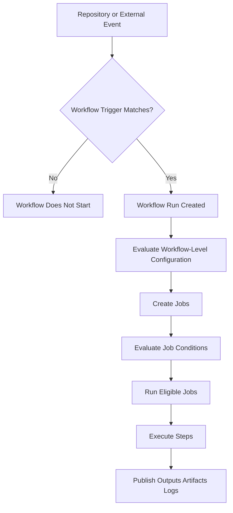
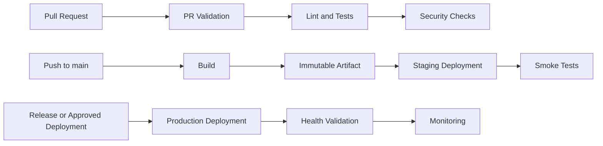

# 05- Events and Triggers

## Overview

GitHub Actions workflows are event-driven. A workflow does not execute merely because its YAML file exists; it executes when one or more configured events occur and the event satisfies the workflow's filters.

A well-designed trigger strategy determines when CI runs, when deployments are allowed to start, which changes require validation, and which workflows can be invoked by other workflows or external systems.

For a production backend repository, triggers should be designed around engineering intent:

```text
Pull Request
    ↓
Validate proposed changes

Push to main
    ↓
Build and deploy eligible changes

Manual Dispatch
    ↓
Controlled operational action

Schedule
    ↓
Periodic maintenance or verification

Reusable Workflow
    ↓
Shared CI/CD capability

Release
    ↓
Release-specific automation

External Event
    ↓
Integrate with another system
```

The trigger configuration is therefore part of the CI/CD architecture, not just YAML syntax.

---

## Event-Driven Workflow Model

A GitHub Actions workflow typically follows this lifecycle:



The important distinction is between an **event** and a **workflow condition**.

For example:

```yaml
on:
  pull_request:
    branches:
      - main
```

determines **when the workflow can start**.

This:

```yaml
if: github.event.pull_request.draft == false
```

determines **whether a particular job should execute after the workflow has started**.

A trigger controls workflow invocation. An `if` condition controls execution within an already-created workflow run.

---

## What Is a GitHub Actions Event?

An event is an activity that GitHub exposes to GitHub Actions as a workflow trigger.

Examples include:

| Event | Typical Purpose |
|---|---|
| `push` | CI after commits are pushed |
| `pull_request` | Validate proposed changes |
| `pull_request_target` | Run privileged workflow logic in the base repository context |
| `workflow_dispatch` | Manual operational execution |
| `schedule` | Periodic automation |
| `workflow_call` | Invoke a reusable workflow |
| `workflow_run` | React to completion of another workflow |
| `repository_dispatch` | Receive externally initiated events |
| `release` | Release lifecycle automation |

The event also provides information through the `github` context and the event payload.

For example:

```yaml
jobs:
  inspect:
    runs-on: ubuntu-latest

    steps:
      - name: Show event
        run: echo "Event: ${{ github.event_name }}"
```

The same workflow can therefore behave differently depending on the event that started it.

---

## Workflow Trigger Configuration

A workflow declares its events under the `on` key.

```yaml
name: Backend CI

on:
  push:
    branches:
      - main

  pull_request:
    branches:
      - main
```

This workflow can run for:

- pushes to `main`
- pull requests targeting `main`

The `on` section determines the initial entry points into the workflow.

A production workflow should keep trigger rules explicit. Overly broad triggers increase CI cost and can create unnecessary deployment paths.

---

## The `push` Event

The `push` event runs when commits or tags are pushed to the repository.

A basic configuration:

```yaml
name: CI

on:
  push:
    branches:
      - main
```

This is commonly used for:

- Continuous integration after merges
- Building deployable artifacts
- Docker image creation
- Staging deployments
- Production deployment workflows
- Release automation

### Branch Filtering

```yaml
on:
  push:
    branches:
      - main
      - develop
```

The workflow runs only when the push targets one of these branches.

You can use patterns:

```yaml
on:
  push:
    branches:
      - 'release/**'
```

This can support branch conventions such as:

```text
release/1.2
release/2.0
```

### Tag Filtering

```yaml
on:
  push:
    tags:
      - 'v*'
```

A push such as:

```text
v1.4.0
```

can therefore trigger a release workflow.

For semantic versioning:

```yaml
on:
  push:
    tags:
      - 'v*.*.*'
```

Tag-triggered workflows are useful for release pipelines where the Git tag represents the immutable release point.

---

## Path Filters

Path filters prevent a workflow from running when irrelevant files change.

```yaml
on:
  push:
    branches:
      - main
    paths:
      - 'backend/**'
      - 'requirements.txt'
      - '.github/workflows/backend-ci.yml'
```

For example, in a repository containing:

```text
backend/
frontend/
infrastructure/
docs/
```

a backend workflow does not necessarily need to run when only documentation changes.

### Path Exclusions

```yaml
on:
  push:
    branches:
      - main
    paths-ignore:
      - 'docs/**'
      - '*.md'
```

Use `paths` or `paths-ignore` deliberately. A poorly designed filter can accidentally prevent required validation.

### Production Consideration

Path filtering is useful in monorepos, but it introduces dependency-analysis problems.

Suppose:

```text
services/
    users/
    payments/
shared/
    auth/
```

A change to:

```text
shared/auth/
```

may affect multiple services even though the service directories themselves were not modified.

Therefore, path filtering should account for shared libraries, infrastructure, generated code, and workflow files.

---

## Combining Branch and Path Filters

A workflow can combine branch and path restrictions:

```yaml
name: Backend CI

on:
  push:
    branches:
      - main
    paths:
      - 'backend/**'
      - 'shared/**'
      - 'pyproject.toml'
      - '.github/workflows/backend-ci.yml'
```

The workflow runs only when both categories match:

```text
Push
  │
  ├── Branch matches main?
  │       │
  │       └── Yes
  │
  └── Changed paths match?
          │
          └── Yes → Workflow runs
```

This is particularly useful for large repositories where independent components have different CI requirements.

---

## The `pull_request` Event

The `pull_request` event is the standard trigger for validating proposed changes.

```yaml
on:
  pull_request:
    branches:
      - main
```

Typical jobs include:

```text
Checkout
   ↓
Install dependencies
   ↓
Lint
   ↓
Unit tests
   ↓
Integration tests
   ↓
Security checks
```

A Python backend might use:

```yaml
name: Pull Request CI

on:
  pull_request:
    branches:
      - main

jobs:
  test:
    runs-on: ubuntu-latest

    steps:
      - name: Checkout
        uses: actions/checkout@v4

      - name: Set up Python
        uses: actions/setup-python@v5
        with:
          python-version: '3.12'

      - name: Install dependencies
        run: |
          python -m pip install --upgrade pip
          pip install -r requirements.txt
          pip install pytest

      - name: Run tests
        run: pytest
```

### Pull Request Branch Filtering

```yaml
on:
  pull_request:
    branches:
      - main
      - develop
```

The `branches` filter for `pull_request` refers to the **target/base branch**, not the source branch.

For example:

```text
feature/payment-api
        │
        │ Pull Request
        ▼
      main
```

The filter:

```yaml
branches:
  - main
```

matches the pull request targeting `main`.

This distinction is a common interview and troubleshooting issue.

---

## Pull Request Activity Types

The pull request event can be restricted to specific activity types.

```yaml
on:
  pull_request:
    types:
      - opened
      - synchronize
      - reopened
```

Typical activities include:

| Activity | Meaning |
|---|---|
| `opened` | Pull request created |
| `synchronize` | New commits pushed to the PR |
| `reopened` | Previously closed PR reopened |
| `closed` | PR closed or merged |
| `labeled` | Label added |
| `unlabeled` | Label removed |
| `ready_for_review` | Draft becomes ready |

For normal CI, the default pull request activity behavior is often sufficient. Explicit `types` should be used when the workflow has a specific event-driven purpose.

---

## Pull Request Security Boundary

Pull requests are an important security boundary because code may originate from contributors or forks.

A CI workflow should assume that code checked out from a pull request can be untrusted.

Avoid patterns where untrusted values are directly inserted into shell commands:

```yaml
- name: Dangerous command
  run: echo "${{ github.event.pull_request.title }}"
```

A malicious pull request title could contain shell metacharacters.

Prefer passing values through environment variables:

```yaml
- name: Inspect pull request title
  env:
    PR_TITLE: ${{ github.event.pull_request.title }}
  run: |
    printf '%s\n' "$PR_TITLE"
```

The broader rule is:

```text
GitHub event data
      ↓
Potentially untrusted
      ↓
Never assume shell-safe
      ↓
Treat as data
```

This becomes especially important when handling:

- PR titles
- branch names
- commit messages
- issue content
- labels
- manual inputs
- repository dispatch payloads

---

## The `pull_request_target` Event

`pull_request_target` runs in the context of the base repository rather than the merge commit's workflow context.

It exists for scenarios where trusted repository automation needs to respond to pull requests, including some workflows involving:

- Labels
- Comments
- Metadata
- Repository-level operations
- Controlled automation requiring base-repository permissions

Example:

```yaml
name: PR Metadata

on:
  pull_request_target:
    types:
      - opened
      - synchronize

permissions:
  pull-requests: write
  contents: read

jobs:
  label:
    runs-on: ubuntu-latest

    steps:
      - name: Add label
        env:
          GH_TOKEN: ${{ secrets.GITHUB_TOKEN }}
          PR_NUMBER: ${{ github.event.pull_request.number }}
        run: |
          gh pr edit "$PR_NUMBER" --add-label "needs-review"
```

### Why `pull_request_target` Is Dangerous

The event can have access to privileges that should not be exposed to untrusted fork code.

A dangerous pattern is:

```yaml
on:
  pull_request_target:

jobs:
  build:
    steps:
      - uses: actions/checkout@v4
      - run: pip install -r requirements.txt
      - run: pytest
```

If the workflow checks out and executes attacker-controlled pull request code while privileged secrets or write permissions are available, the workflow can become a credential-exfiltration path.

The key rule is:

> Do not execute untrusted pull request code in a privileged `pull_request_target` workflow.

Use `pull_request` for normal code validation and reserve `pull_request_target` for carefully designed trusted automation.

---

## The `workflow_dispatch` Event

`workflow_dispatch` provides manual workflow execution.

```yaml
name: Deploy Backend

on:
  workflow_dispatch:
```

A developer can start the workflow manually from GitHub.

Manual inputs make the workflow operationally useful:

```yaml
name: Deploy Backend

on:
  workflow_dispatch:
    inputs:
      environment:
        description: Deployment environment
        required: true
        type: choice
        options:
          - staging
          - production

      version:
        description: Artifact version
        required: true
        type: string
```

The values are available through the `inputs` context:

```yaml
jobs:
  deploy:
    runs-on: ubuntu-latest

    steps:
      - name: Display deployment target
        run: |
          echo "Environment: ${{ inputs.environment }}"
          echo "Version: ${{ inputs.version }}"
```

### Production Use

Manual dispatch is useful for:

- Re-running controlled deployments
- Deploying an already-built artifact
- Operational maintenance
- Disaster recovery procedures
- Rollback workflows
- Administrative tasks

Manual execution should not become a substitute for a properly designed deployment pipeline.

For production deployments, combine manual inputs with:

- Environment protection
- Required reviewers
- Least-privilege permissions
- Concurrency controls
- Artifact validation
- Deployment health checks

---

## The `schedule` Event

`schedule` runs a workflow according to a POSIX cron expression.

```yaml
name: Scheduled Maintenance

on:
  schedule:
    - cron: '0 2 * * *'
```

This represents a recurring schedule using UTC-based cron semantics.

Typical uses include:

- Dependency checks
- Periodic integration tests
- Data validation
- Cache maintenance
- Security checks
- Scheduled reports
- Operational verification

A scheduled workflow should be designed to tolerate delayed execution and should not assume exact wall-clock execution.

### Multiple Schedules

```yaml
on:
  schedule:
    - cron: '0 2 * * 1-5'
    - cron: '0 8 * * 6'
```

A workflow can contain multiple scheduled events.

The event schedule can be inspected through the event context when different behavior is required.

---

## Schedule Limitations

Scheduled workflows are not equivalent to a dedicated enterprise scheduler.

Consider:

- Repository activity
- Runner availability
- GitHub Actions capacity
- Workflow execution duration
- Scheduling delays
- Repository activity requirements for scheduled workflows

Do not use GitHub Actions `schedule` as the primary scheduler for latency-sensitive production workloads.

For backend systems requiring strong scheduling guarantees, consider dedicated infrastructure such as:

```text
EventBridge
Cloud Scheduler
Airflow
Kubernetes CronJob
Dedicated job scheduler
```

The appropriate choice depends on the workload and reliability requirements.

---

## The `workflow_call` Event

`workflow_call` makes a workflow reusable by another workflow.

```yaml
name: Reusable Python CI

on:
  workflow_call:
    inputs:
      python-version:
        required: true
        type: string
```

A caller can invoke it:

```yaml
name: Backend CI

on:
  pull_request:

jobs:
  ci:
    uses: organization/shared-workflows/.github/workflows/python-ci.yml@v1
    with:
      python-version: '3.12'
```

Reusable workflows are useful when many repositories share the same CI architecture.

For example:

```text
Repository A ─┐
Repository B ─┼──> Shared Python CI
Repository C ─┤
Repository D ─┘
```

This reduces duplicated pipeline logic.

---

## Reusable Workflow Inputs

Inputs should be explicitly typed.

```yaml
on:
  workflow_call:
    inputs:
      python-version:
        required: false
        type: string
        default: '3.12'

      run-integration-tests:
        required: false
        type: boolean
        default: true
```

Inside the workflow:

```yaml
jobs:
  test:
    runs-on: ubuntu-latest

    steps:
      - name: Set up Python
        uses: actions/setup-python@v5
        with:
          python-version: ${{ inputs.python-version }}

      - name: Integration tests
        if: inputs.run-integration-tests
        run: pytest tests/integration
```

This creates a reusable contract rather than requiring callers to duplicate YAML.

---

## Reusable Workflow Outputs

Reusable workflows can expose outputs to their callers.

Conceptually:

```text
Caller Workflow
      ↓
Reusable Workflow
      ↓
Job Output
      ↓
Workflow Output
      ↓
Caller
```

Example:

```yaml
name: Build

on:
  workflow_call:
    outputs:
      image:
        description: Built image reference
        value: ${{ jobs.build.outputs.image }}

jobs:
  build:
    runs-on: ubuntu-latest

    outputs:
      image: ${{ steps.metadata.outputs.image }}

    steps:
      - id: metadata
        run: echo "image=ghcr.io/example/backend:${GITHUB_SHA}" >> "$GITHUB_OUTPUT"
```

The caller can consume the reusable workflow's output.

This pattern is useful for:

- Docker image references
- Artifact identifiers
- Release versions
- Deployment metadata
- Generated configuration

---

## Reusable Workflows vs Composite Actions

These mechanisms solve different problems.

| Feature | Reusable Workflow | Composite Action |
|---|---|---|
| Invocation | `jobs.<job>.uses` | `steps[].uses` |
| Can contain multiple jobs | Yes | No |
| Job orchestration | Yes | No |
| Can define runners for jobs | Yes | No |
| Packages multiple steps | Yes | Yes |
| Reusable pipeline | Yes | Limited |
| Reusable step sequence | Possible | Primary purpose |
| Suitable for organization-wide CI | Excellent | Useful for common steps |

A reusable workflow is appropriate for:

```text
Checkout
→ Test
→ Security Scan
→ Build
→ Artifact
```

A composite action is appropriate for packaging a repeated step sequence such as:

```text
Install Python
→ Install project dependencies
→ Configure test environment
```

---

## The `workflow_run` Event

`workflow_run` triggers a workflow based on another workflow's completion.

```yaml
name: Deployment

on:
  workflow_run:
    workflows:
      - Backend CI
    types:
      - completed
```

A common architecture is:

```text
Backend CI
    ↓
completed
    ↓
Deployment Workflow
```

The downstream workflow should inspect the result before proceeding.

```yaml
jobs:
  deploy:
    if: ${{ github.event.workflow_run.conclusion == 'success' }}
    runs-on: ubuntu-latest

    steps:
      - name: Deploy
        run: ./scripts/deploy.sh
```

This creates separation between CI and deployment workflows.

### Production Consideration

Do not assume that `workflow_run` automatically means the preceding workflow produced a trusted deployable artifact.

A production deployment should validate:

- Workflow conclusion
- Commit SHA
- Artifact identity
- Environment
- Deployment authorization
- Security checks
- Release state

The artifact promoted to production should be traceable to the exact source revision that passed CI.

---

## The `repository_dispatch` Event

`repository_dispatch` allows an external system to trigger a workflow through GitHub's API.

```yaml
name: External Deployment Trigger

on:
  repository_dispatch:
    types:
      - deploy
```

The external system can send event-specific data.

Conceptually:

```text
External System
      │
      │ GitHub API
      ▼
repository_dispatch
      │
      ▼
GitHub Actions
```

This is useful when GitHub Actions needs to integrate with:

- External release systems
- Internal orchestration systems
- Infrastructure automation
- Other repositories
- Enterprise tooling

Payload data should be treated as untrusted input.

Do not directly insert arbitrary payload values into shell commands.

---

## The `release` Event

The `release` event allows workflows to react to GitHub Releases.

```yaml
name: Release Automation

on:
  release:
    types:
      - published
```

Common uses include:

- Publishing release artifacts
- Deploying a released version
- Generating release metadata
- Updating external systems
- Publishing packages

Release workflows can distinguish lifecycle activities such as:

```text
created
published
edited
deleted
prereleased
released
```

The exact event type should match the intended release lifecycle.

---

## Event Filters

GitHub Actions provides several filter categories.

| Filter | Used For | Example |
|---|---|---|
| `branches` | Branch selection | `main` |
| `branches-ignore` | Branch exclusion | `docs/**` |
| `tags` | Tag selection | `v*.*.*` |
| `tags-ignore` | Tag exclusion | `beta-*` |
| `paths` | Changed paths | `backend/**` |
| `paths-ignore` | Excluded paths | `docs/**` |
| `types` | Activity types | `opened`, `closed` |

Filters are event-specific. Not every event supports every filter.

Always verify the event's supported configuration rather than assuming that a filter valid for `push` is valid for every other event.

---

## Branch Filter Design

A typical backend repository might use:

```yaml
on:
  push:
    branches:
      - main
      - develop

  pull_request:
    branches:
      - main
```

This produces:

```text
Feature Branch
      │
      └── Pull Request → main → CI

develop
   │
   └── Push → CI

main
   │
   └── Push → Build / Deployment
```

A common production separation is:

```text
pull_request
    ↓
Validation only

push to main
    ↓
Build
    ↓
Artifact
    ↓
Staging

release/tag
    ↓
Production
```

The exact architecture depends on the team's release model.

---

## Tag-Based Releases

Tags provide a useful immutable reference for releases.

```yaml
name: Release

on:
  push:
    tags:
      - 'v*.*.*'
```

For example:

```text
v1.0.0
v1.1.0
v2.0.0
```

A release workflow can then:

```text
Git Tag
   ↓
Checkout exact commit
   ↓
Run release validation
   ↓
Build artifact
   ↓
Publish artifact
   ↓
Create or publish release
```

For containerized applications, the tag can also become an image tag:

```text
backend:v1.4.0
```

However, production deployments should also retain an immutable commit-based reference such as:

```text
backend:git-8f31c2a
```

This improves traceability and rollback.

---

## Multiple Events in One Workflow

A workflow can have multiple triggers:

```yaml
name: Backend CI

on:
  push:
    branches:
      - main

  pull_request:
    branches:
      - main

  workflow_dispatch:
```

This is convenient when the same pipeline logic is appropriate for:

```text
Pull Request
Push
Manual Execution
```

However, event differences should be handled explicitly.

For example:

```yaml
jobs:
  deploy:
    if: github.event_name == 'push' && github.ref == 'refs/heads/main'
    runs-on: ubuntu-latest

    steps:
      - run: ./deploy.sh
```

This prevents a manually triggered or pull-request workflow from unintentionally entering a deployment path.

---

## Event Context

The `github` context exposes event information.

Useful values include:

```yaml
${{ github.event_name }}
${{ github.ref }}
${{ github.sha }}
${{ github.repository }}
${{ github.actor }}
```

For pull requests:

```yaml
${{ github.event.pull_request.number }}
${{ github.event.pull_request.title }}
${{ github.event.pull_request.base.ref }}
${{ github.event.pull_request.head.ref }}
```

For manual workflows:

```yaml
${{ inputs.environment }}
```

The available fields depend on the event that triggered the workflow.

---

## Expressions vs Shell Commands

GitHub Actions expressions are evaluated by the workflow engine:

```yaml
if: ${{ github.ref == 'refs/heads/main' }}
```

Shell commands execute on the runner:

```yaml
run: |
  echo "$GITHUB_SHA"
```

These are different execution layers.

```text
GitHub Actions Engine
    │
    ├── Evaluates expressions
    │
    ▼
Runner
    │
    └── Executes shell commands
```

Do not confuse:

```yaml
if: github.event_name == 'push'
```

with:

```yaml
run: github.event_name == 'push'
```

The first is an Actions expression. The second attempts to execute a shell command named `github.event_name`.

---

## Useful Event Expressions

### Check the Event Type

```yaml
if: github.event_name == 'push'
```

### Check the Main Branch

```yaml
if: github.ref == 'refs/heads/main'
```

### Combine Conditions

```yaml
if: >
  github.event_name == 'push' &&
  github.ref == 'refs/heads/main'
```

### Check Pull Request Titles

For data inspection:

```yaml
if: contains(github.event.pull_request.title, '[deploy]')
```

Do not treat event strings as trusted shell input merely because they are used safely in an expression.

---

## Important Expression Functions

GitHub Actions provides functions useful for event-driven workflow logic.

| Function | Purpose |
|---|---|
| `success()` | Previous steps/jobs succeeded |
| `failure()` | A previous step/job failed |
| `always()` | Attempts to run regardless of prior result |
| `cancelled()` | Detects cancellation |
| `contains()` | Searches a value |
| `startsWith()` | Prefix check |
| `endsWith()` | Suffix check |
| `format()` | Formats a string |
| `fromJSON()` | Converts JSON into an Actions value |
| `toJSON()` | Serializes a value as JSON |
| `hashFiles()` | Creates a hash from matching files |

Example:

```yaml
if: startsWith(github.ref, 'refs/tags/v')
```

Another example:

```yaml
if: contains(github.event.head_commit.message, '[skip-ci]')
```

Event-driven conditions should remain understandable. Complex expressions scattered across many jobs become difficult to troubleshoot.

---

## Status Functions and Event-Driven Conditions

Status functions affect whether steps execute.

```yaml
- name: Upload diagnostics
  if: ${{ failure() }}
  uses: actions/upload-artifact@v4
  with:
    name: diagnostics
    path: logs/
```

A failure-only step is appropriate for diagnostics.

`always()` can be used for cleanup or diagnostic operations:

```yaml
- name: Collect logs
  if: ${{ always() }}
  run: ./scripts/collect-logs.sh
```

However, `always()` does not mean "guaranteed to execute under every circumstance." Cancellation and runner termination can prevent execution.

For critical cleanup or production orchestration, design cancellation behavior explicitly.

---

## Conditional Execution Based on Events

A workflow can share common CI logic while selectively executing deployment jobs.

```yaml
name: Backend Pipeline

on:
  pull_request:
    branches:
      - main

  push:
    branches:
      - main

jobs:
  test:
    runs-on: ubuntu-latest

    steps:
      - uses: actions/checkout@v4
      - run: pytest

  deploy:
    needs: test
    if: >
      github.event_name == 'push' &&
      github.ref == 'refs/heads/main'
    runs-on: ubuntu-latest

    steps:
      - name: Deploy
        run: ./scripts/deploy.sh
```

This creates:

```text
Pull Request
    │
    └── Test

Push to main
    │
    ├── Test
    │
    └── Deploy
```

This is a common pattern for separating validation from deployment.

---

## Event Payloads and Data Flow

An event provides the initial workflow data.

```text
GitHub Event
      │
      ▼
Event Payload
      │
      ▼
github Context
      │
      ├── Event name
      ├── SHA
      ├── Ref
      ├── Actor
      ├── PR metadata
      └── Event-specific data
```

Workflow logic can transform this data into outputs:

```text
Event
  ↓
Context
  ↓
Step
  ↓
$GITHUB_OUTPUT
  ↓
Job Output
  ↓
needs.<job>.outputs
```

Example:

```yaml
jobs:
  metadata:
    runs-on: ubuntu-latest

    outputs:
      image-tag: ${{ steps.version.outputs.tag }}

    steps:
      - id: version
        run: echo "tag=git-${GITHUB_SHA::7}" >> "$GITHUB_OUTPUT"

  build:
    needs: metadata
    runs-on: ubuntu-latest

    steps:
      - name: Display image tag
        run: echo "Building ${{ needs.metadata.outputs.image-tag }}"
```

This pattern becomes important when event information determines later pipeline behavior.

---

## Dynamic Matrix Selection From Event Data

Event information can influence a matrix.

For example:

```yaml
jobs:
  prepare:
    runs-on: ubuntu-latest

    outputs:
      versions: ${{ steps.matrix.outputs.versions }}

    steps:
      - id: matrix
        run: |
          echo 'versions=["3.11","3.12","3.13"]' >> "$GITHUB_OUTPUT"

  test:
    needs: prepare
    runs-on: ubuntu-latest

    strategy:
      matrix:
        python-version: ${{ fromJSON(needs.prepare.outputs.versions) }}

    steps:
      - uses: actions/setup-python@v5
        with:
          python-version: ${{ matrix.python-version }}

      - run: pytest
```

The event can therefore become the input to a larger execution graph:

```text
Event
  ↓
Prepare Configuration
  ↓
Generate JSON
  ↓
fromJSON()
  ↓
Dynamic Matrix
  ↓
Parallel Tests
```

This is useful for repositories where the test configuration changes based on the branch, release type, or repository metadata.

---

## Manual Inputs vs Repository Variables

Do not use repository variables as a substitute for manual workflow inputs.

Use `workflow_dispatch` inputs when the operator needs to choose something at execution time:

```yaml
on:
  workflow_dispatch:
    inputs:
      environment:
        required: true
        type: choice
        options:
          - staging
          - production
```

Use repository or organization variables for stable configuration:

```text
AWS_REGION
DOCKER_REGISTRY
DEFAULT_PYTHON_VERSION
```

Use secrets for sensitive values:

```text
API_TOKEN
DATABASE_PASSWORD
```

The distinction is:

| Mechanism | Primary Purpose |
|---|---|
| `inputs` | Execution-time user input |
| `vars` | Non-sensitive configuration |
| `secrets` | Sensitive configuration |
| `env` | Environment variables available to execution |
| `github` | Event and repository metadata |

---

## Event-Specific Deployment Design

A mature CI/CD pipeline should avoid allowing every event to deploy.

Example:

```yaml
name: Backend Delivery

on:
  pull_request:
    branches:
      - main

  push:
    branches:
      - main

  workflow_dispatch:
    inputs:
      deploy:
        required: true
        type: boolean
        default: false

jobs:
  test:
    runs-on: ubuntu-latest

    steps:
      - uses: actions/checkout@v4
      - run: pytest

  deploy:
    needs: test
    if: >
      github.event_name == 'push' &&
      github.ref == 'refs/heads/main'
    runs-on: ubuntu-latest

    steps:
      - run: ./scripts/deploy.sh
```

The important design principle is:

```text
All code changes
    ↓
Validation

Only authorized event
    ↓
Deployment
```

This prevents accidental deployment paths.

---

## Event Selection for Common Backend Scenarios

| Requirement | Event |
|---|---|
| Test every PR | `pull_request` |
| Build after merge | `push` |
| Deploy after merge to main | `push` |
| Deploy a selected version manually | `workflow_dispatch` |
| Run periodic maintenance | `schedule` |
| Reuse organization CI | `workflow_call` |
| Start deployment after CI completes | `workflow_run` |
| Integrate external automation | `repository_dispatch` |
| Publish release automation | `release` |
| Release on Git tag | `push` with `tags` |

The correct event depends on the source of truth for the operation.

---

## Production Trigger Architecture

A production backend can separate validation, artifact creation, and deployment.



This architecture avoids coupling every event to every pipeline stage.

A pull request should generally validate code rather than deploy production.

A push to the protected deployment branch can create the artifact.

A controlled release or approved deployment can promote the already-built artifact.

---

## Event Selection and Security

Trigger choice directly affects the security boundary.

| Trigger | Main Security Consideration |
|---|---|
| `push` | Repository contributors can influence executed code |
| `pull_request` | PR code should be treated as potentially untrusted |
| `pull_request_target` | Privileged base-repository context requires extreme care |
| `workflow_dispatch` | Inputs are operator-controlled but still require validation |
| `schedule` | Workflow runs without a human at execution time |
| `workflow_call` | Caller permissions and supplied secrets matter |
| `workflow_run` | Downstream workflow must validate upstream results and artifacts |
| `repository_dispatch` | External payload should be treated as untrusted |
| `release` | Release lifecycle should be protected |

Trigger design should therefore be considered alongside:

```yaml
permissions:
  contents: read
```

and environment protection, secret access, action trust, and runner isolation.

---

## Preventing Accidental Deployment

Do not rely only on the trigger.

For example:

```yaml
on:
  push:
    branches:
      - main
      - develop
```

If the workflow contains:

```yaml
deploy:
  runs-on: ubuntu-latest
```

the deployment job may become eligible for both branches.

Instead:

```yaml
deploy:
  if: github.ref == 'refs/heads/main'
  runs-on: ubuntu-latest
```

For production, add environment protection:

```yaml
deploy:
  environment:
    name: production
```

The deployment architecture then has multiple controls:

```text
Event Filter
    ↓
Job Condition
    ↓
Environment Protection
    ↓
Permissions
    ↓
Deployment
```

Defense in depth is preferable to depending on a single YAML condition.

---

## Triggering on Changes to Shared Infrastructure

In a monorepo, deployment workflows may need to react to infrastructure changes.

```yaml
on:
  push:
    branches:
      - main
    paths:
      - 'backend/**'
      - 'infrastructure/**'
      - 'Dockerfile'
      - 'requirements.txt'
      - '.github/workflows/**'
```

This prevents an infrastructure change from bypassing the backend deployment pipeline merely because no backend source file changed.

Typical dependency categories include:

```text
Application source
Shared libraries
Docker configuration
Dependency manifests
Infrastructure
Workflow configuration
Database migrations
Deployment scripts
```

A senior engineer should define trigger rules around **dependency boundaries**, not just directory boundaries.

---

## Monorepo Trigger Strategy

For a repository containing multiple services:

```text
services/
    users/
    payments/
    orders/

shared/
infrastructure/
```

A service-specific workflow can use paths:

```yaml
on:
  pull_request:
    paths:
      - 'services/payments/**'
      - 'shared/**'
      - 'pyproject.toml'
      - '.github/workflows/payments.yml'
```

A change to shared code can therefore trigger multiple service pipelines.

For large monorepos, eventually consider:

- Dependency graphs
- Generated matrices
- Change detection
- Shared reusable workflows
- Service-specific deployment pipelines

Path filters should reduce unnecessary work without allowing affected systems to escape validation.

---

## Common Trigger Mistakes

### Mistake: Deploying From Every Push

```yaml
on:
  push:
```

Combined with an unrestricted deployment job, this can create accidental deployment paths.

Prefer explicit deployment conditions.

---

### Mistake: Confusing PR Base and Head Branch

For:

```text
feature/login
      ↓
Pull Request
      ↓
main
```

this:

```yaml
on:
  pull_request:
    branches:
      - main
```

targets `main`.

It does not mean the source branch is named `main`.

---

### Mistake: Overusing Path Filters

A workflow may stop running because an important dependency was not included in the path list.

Review path filters whenever:

- Shared libraries change
- Docker configuration changes
- Infrastructure changes
- Dependency manifests change
- Workflow definitions change

---

### Mistake: Using `pull_request_target` for CI

A common dangerous pattern is:

```text
pull_request_target
      ↓
Checkout PR code
      ↓
Execute PR code
      ↓
Privileged credentials
```

This can cross a security boundary.

Use `pull_request` for untrusted code validation unless there is a specific and carefully controlled reason to use `pull_request_target`.

---

### Mistake: Treating Event Data as Trusted Shell Input

Avoid:

```yaml
run: echo "${{ github.event.pull_request.title }}"
```

Prefer:

```yaml
env:
  PR_TITLE: ${{ github.event.pull_request.title }}
run: printf '%s\n' "$PR_TITLE"
```

The general rule is to separate:

```text
Data
```

from:

```text
Executable shell syntax
```

---

### Mistake: Rebuilding on Every Event

A pipeline may accidentally build multiple artifacts:

```text
PR build
    ↓
main build
    ↓
release build
```

For production delivery, prefer:

```text
Validate
   ↓
Build once
   ↓
Immutable artifact
   ↓
Promote artifact
```

Events should control the lifecycle around the artifact rather than cause uncontrolled rebuilds.

---

### Mistake: Using Manual Dispatch as an Unprotected Production Backdoor

A workflow such as:

```yaml
on:
  workflow_dispatch:
```

does not automatically make production execution safe.

Production manual workflows should still use:

- Environment protection
- Appropriate permissions
- Artifact validation
- Deployment concurrency
- Auditability
- Rollback procedures

---

## Trigger Troubleshooting

Use a failure-domain approach.

### Workflow Does Not Start

**Symptom**

A developer pushes code, but no workflow run appears.

**Possible causes**

- Wrong branch filter
- Wrong path filter
- Wrong event
- Workflow file is not on the relevant branch
- Tag/branch pattern mismatch
- Event activity type mismatch

**Isolation strategy**

Start with the simplest trigger:

```yaml
on:
  workflow_dispatch:
```

If manual execution works, investigate event filtering.

Then inspect:

```text
Event
→ Branch
→ Paths
→ Tags
→ Activity Type
```

---

### Workflow Starts on the Wrong Changes

**Possible causes**

- Broad `paths` configuration
- Missing exclusions
- Shared dependency changes
- Workflow file changes
- Misunderstood branch filter

**Isolation strategy**

Inspect the exact changed files and compare them with the configured filter.

For a monorepo, build a dependency map rather than relying only on folder names.

---

### Deployment Runs for a Pull Request

Inspect the deployment condition:

```yaml
if: >
  github.event_name == 'push' &&
  github.ref == 'refs/heads/main'
```

Do not assume that because the workflow has a `push` trigger, every job automatically knows it is executing a push.

A workflow can have multiple events, so deployment jobs should explicitly enforce their allowed event.

---

### Scheduled Workflow Does Not Run

Check:

```text
Cron expression
Workflow location
Repository activity
Workflow enabled state
Runner availability
```

Also verify that the schedule uses the intended UTC time.

---

### Manual Input Is Not Available

Verify:

```yaml
on:
  workflow_dispatch:
    inputs:
      environment:
        required: true
        type: choice
        options:
          - staging
          - production
```

Then consume it through:

```yaml
${{ inputs.environment }}
```

rather than treating it as a shell variable automatically.

---

## Trigger Debugging Techniques

A temporary diagnostic job can expose event metadata:

```yaml
jobs:
  debug:
    runs-on: ubuntu-latest

    steps:
      - name: Print workflow context
        env:
          EVENT_NAME: ${{ github.event_name }}
          REF: ${{ github.ref }}
          SHA: ${{ github.sha }}
          REPOSITORY: ${{ github.repository }}
          ACTOR: ${{ github.actor }}
        run: |
          printf 'Event: %s\n' "$EVENT_NAME"
          printf 'Ref: %s\n' "$REF"
          printf 'SHA: %s\n' "$SHA"
          printf 'Repository: %s\n' "$REPOSITORY"
          printf 'Actor: %s\n' "$ACTOR"
```

Avoid dumping the complete event payload into logs when it could contain sensitive information.

For production debugging, inspect only the fields needed to establish the failure.

---

## Event Design and Concurrency

Trigger configuration and concurrency should be designed together.

For pull requests:

```yaml
concurrency:
  group: pr-${{ github.event.pull_request.number }}
  cancel-in-progress: true
```

If a developer pushes five commits quickly:

```text
Commit 1 → CI
Commit 2 → CI
Commit 3 → CI
Commit 4 → CI
Commit 5 → CI
```

older runs can be cancelled so resources are focused on the latest revision.

For production deployment:

```yaml
concurrency:
  group: production
  cancel-in-progress: false
```

This prevents two production deployments from running simultaneously.

The desired behavior differs:

```text
PR validation
→ Prefer latest run

Production deployment
→ Protect deployment ordering
```

---

## Event Design and Artifacts

Events should map cleanly to artifact lifecycle stages.

A mature pipeline might use:

```text
pull_request
    ↓
Tests only

push main
    ↓
Build immutable artifact

workflow_run
    ↓
Deploy validated artifact

release
    ↓
Publish release metadata
```

The important property is traceability:

```text
Event
  ↓
Commit SHA
  ↓
Build
  ↓
Artifact
  ↓
Environment
  ↓
Deployment
```

A production system should be able to answer:

- Which event triggered the build?
- Which commit produced the artifact?
- Which workflow run produced it?
- Which artifact was deployed?
- Which environment received it?
- Which deployment approved it?

---

## Event Design for Python Backend CI/CD

A practical Python backend repository might use:

```yaml
name: Backend CI/CD

on:
  pull_request:
    branches:
      - main
    paths:
      - 'app/**'
      - 'tests/**'
      - 'pyproject.toml'
      - 'uv.lock'
      - 'Dockerfile'
      - '.github/workflows/**'

  push:
    branches:
      - main
    paths:
      - 'app/**'
      - 'tests/**'
      - 'pyproject.toml'
      - 'uv.lock'
      - 'Dockerfile'
      - '.github/workflows/**'

  workflow_dispatch:
    inputs:
      environment:
        description: Deployment environment
        required: true
        type: choice
        options:
          - staging
          - production
```

The pipeline can then distinguish:

```text
Pull Request
    ↓
Lint + Test + Security

Push main
    ↓
Lint + Test + Build + Staging

Manual
    ↓
Controlled operational workflow
```

For Django or FastAPI applications, this pattern works well when combined with PostgreSQL, Redis, pytest, Docker, and an AWS deployment target.

---

## Production Trigger Checklist

Before deploying a workflow, verify:

### Event Selection

- Is the workflow triggered by the correct event?
- Are branch filters explicit?
- Are tag filters required?
- Are path filters complete?
- Are event activity types appropriate?

### Security

- Is pull request code treated as untrusted?
- Is `pull_request_target` actually necessary?
- Are event payloads kept out of shell syntax?
- Are permissions minimized?
- Are secrets unavailable to workflows that do not require them?

### Deployment

- Can a PR trigger production?
- Can an unexpected branch trigger deployment?
- Is production protected by an environment?
- Is deployment concurrency configured?
- Is the artifact immutable?

### Operations

- Can the workflow be manually invoked safely?
- Are scheduled workflows appropriate for the workload?
- Are reusable workflows versioned?
- Can event failures be diagnosed?
- Are logs and artifacts sufficient for troubleshooting?

---

## Event Selection Decision Table

| Requirement | Recommended Pattern |
|---|---|
| Validate proposed code | `pull_request` |
| Validate merged code | `push` |
| Build after merge | `push` on protected branch |
| Deploy selected artifact | `workflow_dispatch` |
| Scheduled maintenance | `schedule` |
| Shared CI logic | `workflow_call` |
| Trigger after another workflow | `workflow_run` |
| External orchestration | `repository_dispatch` |
| Release automation | `release` |
| Semantic-version release | `push` with tag filter |
| Restrict monorepo CI | `paths` / `paths-ignore` |
| Restrict deployment source | Branch filter + job `if` |
| Prevent concurrent deployments | Concurrency group |

---

## Senior Engineering Perspective

Events and triggers define the control plane of a GitHub Actions system.

A senior engineer should not ask only:

```text
"What event makes this workflow run?"
```

The more important questions are:

```text
What is the source of truth?
Who can cause the event?
What code will execute?
What permissions will be available?
What secrets can be accessed?
What artifact will be produced?
Can the event cause a deployment?
Can two executions race?
Can an attacker influence the event payload?
Can the workflow be safely retried?
How can the resulting deployment be traced and rolled back?
```

A production trigger architecture should therefore follow these principles:

```text
Explicit Events
      ↓
Precise Filters
      ↓
Trusted Execution Boundary
      ↓
Least Privilege
      ↓
Deterministic Artifact
      ↓
Controlled Promotion
      ↓
Concurrency Protection
      ↓
Observable Deployment
```

The goal is not to maximize automation from every possible event. The goal is to create predictable, secure, auditable execution paths where each event has a clearly defined responsibility.

## Key Takeaways

- GitHub Actions events determine when workflows can start; job and step conditions determine what executes after the workflow has started.
- `push`, `pull_request`, `workflow_dispatch`, `schedule`, `workflow_call`, `workflow_run`, `repository_dispatch`, and `release` serve different CI/CD control-flow requirements and should be selected deliberately.
- Branch, tag, path, and activity filters reduce unnecessary execution, but overly restrictive filters can bypass required validation, especially in monorepos with shared dependencies.
- `pull_request_target` requires particular caution because privileged workflow execution combined with untrusted pull request code can create a serious security boundary violation.
- Production trigger design should connect events to immutable artifacts, least-privilege permissions, protected environments, concurrency controls, observability, and controlled deployment or rollback paths.