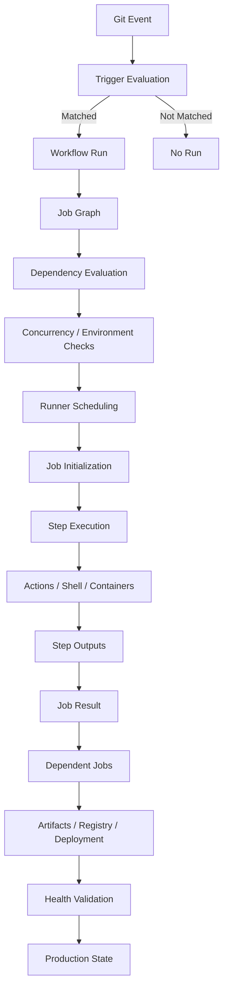
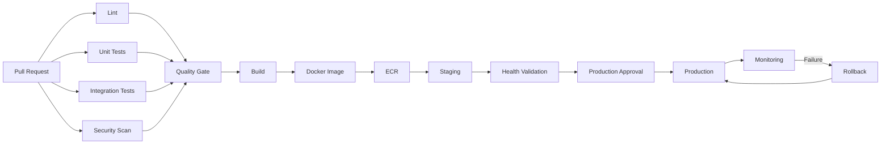

# 09- Workflow Execution Model

## Overview

The GitHub Actions workflow execution model describes how GitHub turns a workflow definition into an actual CI/CD execution: an event triggers a workflow, jobs are scheduled, runners execute those jobs, steps run in order, actions provide reusable behavior, outputs move data between execution units, and status determines whether downstream work proceeds.

Understanding this model is more important than memorizing YAML syntax. Production failures frequently come from incorrect assumptions about:

- When a workflow is created.
- Which jobs are eligible to run.
- How `needs` changes execution.
- When expressions are evaluated.
- How matrix jobs expand.
- What a runner actually executes.
- How step failures affect later steps.
- How outputs cross job boundaries.
- How cancellation propagates.
- How concurrency changes scheduling.
- Where secrets and permissions become available.

The fundamental model is:

```text
Event
  ↓
Workflow Trigger
  ↓
Workflow Run
  ↓
Job Graph
  ↓
Job Scheduling
  ↓
Runner Assignment
  ↓
Job Initialization
  ↓
Step Execution
  ↓
Action / Shell Execution
  ↓
Outputs + Status
  ↓
Dependent Jobs
  ↓
Artifacts / Deployment / Result
```

For a backend engineer, this model explains why a pipeline such as:

```text
Pull Request
    ↓
Lint
    ↓
Unit Tests
    ↓
Integration Tests
    ↓
Security Scan
    ↓
Build
    ↓
Docker Image
    ↓
ECR
    ↓
Staging
    ↓
Approval
    ↓
Production
```

behaves the way it does under success, failure, cancellation, retries, matrix expansion, and concurrency.

---

## GitHub Actions Execution Hierarchy

The execution hierarchy can be expressed as:

```text
Workflow
   │
   ├── Trigger
   │
   ├── Job A
   │    ├── Step 1
   │    ├── Step 2
   │    └── Step 3
   │
   ├── Job B
   │    ├── Step 1
   │    └── Step 2
   │
   └── Job C
        ├── Step 1
        └── Step 2
```

Each layer has a different responsibility.

| Layer | Responsibility |
|---|---|
| Event | Describes what happened |
| Trigger | Determines whether the workflow should start |
| Workflow | Defines the automation |
| Job | Defines an execution boundary |
| `needs` | Defines job dependencies |
| Matrix | Expands one job into multiple executions |
| Runner | Provides execution environment |
| Step | Defines an ordered operation |
| Action | Provides reusable step implementation |
| Shell command | Executes directly on the runner |
| Output | Transfers data between execution scopes |
| Artifact | Persists workflow-produced files |

A common mistake is to think of the YAML file as a sequential script.

It is not.

The workflow defines an **execution graph**.

---

## From Git Event to Workflow Run

Consider:

```yaml
name: Backend CI

on:
  push:
    branches:
      - main
  pull_request:
    branches:
      - main
```

A push to `main` can cause GitHub to evaluate the workflow against the `push` event.

A pull request targeting `main` can cause GitHub to evaluate the workflow against the `pull_request` event.

Conceptually:

```text
GitHub Event
     │
     ▼
Workflow Trigger Matching
     │
     ├── No match ──► No workflow run
     │
     └── Match
          │
          ▼
      Workflow Run
```

The trigger therefore controls whether a workflow run is created.

This distinction matters when debugging a workflow that "did not run."

If the workflow never started, job-level debugging is irrelevant. The investigation must begin with the event and trigger configuration.

---

## Workflow Trigger Evaluation

A workflow may have several trigger conditions.

Example:

```yaml
on:
  push:
    branches:
      - main
    paths:
      - "src/**"

  pull_request:
    branches:
      - main
```

The `push` workflow above is constrained by both:

```text
branch = main
AND
changed path matches src/**
```

A change only to:

```text
README.md
```

does not satisfy the `paths` filter.

The workflow execution model therefore starts with trigger evaluation:

```text
Event
  │
  ├── Event type matches?
  │
  ├── Branch/tag filter matches?
  │
  ├── Path filter matches?
  │
  └── Event-specific conditions match?
        │
        ▼
     Run created
```

---

## Workflow Run

A workflow run is a concrete execution of a workflow definition for a particular event.

For example:

```text
Workflow: Backend CI
Commit: 8a71c3f
Event: push
Branch: main
Run: #842
```

Two executions of the same workflow can therefore have different:

- Commits.
- Branches.
- Event types.
- Inputs.
- Context values.
- Matrix combinations.
- Secrets available through environments.
- Execution results.

A workflow file is static configuration.

A workflow run is a runtime execution.

---

## Workflow Run Lifecycle

A simplified lifecycle is:

```text
Triggered
   ↓
Queued
   ↓
Jobs Evaluated
   ↓
Jobs Scheduled
   ↓
Runner Assigned
   ↓
Job Started
   ↓
Steps Executed
   ↓
Job Completed
   ↓
Dependent Jobs Evaluated
   ↓
Workflow Completed
```

The actual platform contains more scheduling and infrastructure details, but this model is sufficient for reasoning about CI/CD behavior.

---

## Job Graph

Jobs form a dependency graph.

Example:

```yaml
jobs:
  lint:
    runs-on: ubuntu-latest

  test:
    runs-on: ubuntu-latest

  build:
    needs:
      - lint
      - test
    runs-on: ubuntu-latest
```

The graph is:

```text
Lint ───────┐
            ├──► Build
Tests ──────┘
```

`lint` and `test` can run independently.

`build` waits for both.

This is called **fan-in**.

---

## Parallel Job Execution

If there is no dependency between jobs, GitHub Actions can schedule them independently.

```yaml
jobs:
  lint:
    runs-on: ubuntu-latest
    steps:
      - run: ruff check .

  unit-tests:
    runs-on: ubuntu-latest
    steps:
      - run: pytest tests/unit

  security:
    runs-on: ubuntu-latest
    steps:
      - run: pip-audit
```

The conceptual execution is:

```text
             ┌── Lint ────────┐
             │                │
Trigger ─────┼── Unit Tests ──┼──► Completion
             │                │
             └── Security ────┘
```

Parallelism reduces total pipeline latency.

However, the jobs also consume runner capacity concurrently.

Therefore:

```text
More parallelism
      ↓
Lower latency
      ↓
Higher runner demand
      ↓
Potentially higher cost
```

Senior-level pipeline design balances latency, capacity, and reliability.

---

## Sequential Job Execution

Use `needs` when one job requires another to complete.

```yaml
jobs:
  test:
    runs-on: ubuntu-latest
    steps:
      - run: pytest

  build:
    needs: test
    runs-on: ubuntu-latest
    steps:
      - run: docker build -t backend:${GITHUB_SHA} .
```

Execution:

```text
Test
 ↓
Build
```

This prevents the build from starting until the test job reaches a successful state that satisfies its dependency condition.

---

## Multiple Dependencies

A production build often depends on multiple validation jobs.

```yaml
jobs:
  lint:
    runs-on: ubuntu-latest
    steps:
      - run: ruff check .

  unit-tests:
    runs-on: ubuntu-latest
    steps:
      - run: pytest tests/unit

  integration-tests:
    runs-on: ubuntu-latest
    steps:
      - run: pytest tests/integration

  build:
    needs:
      - lint
      - unit-tests
      - integration-tests
    runs-on: ubuntu-latest
    steps:
      - run: docker build -t backend:${GITHUB_SHA} .
```

Graph:

```text
             ┌── Lint ───────────────┐
             │                       │
             ├── Unit Tests ─────────┤
Trigger ─────┤                       ├──► Build
             └── Integration Tests ──┘
```

This creates a clear quality gate.

---

## Job Dependency Semantics

`needs` does more than express ordering.

It also creates a data and status dependency.

For example:

```yaml
build:
  needs: test
```

means:

```text
Test result
    ↓
Build eligibility
```

If `test` fails, the dependent `build` job normally does not execute.

This is one of the most important properties of GitHub Actions job graphs.

---

## Fan-Out and Fan-In

A common production pattern is:

```text
                ┌── Python 3.11 ──┐
                │                 │
Build Source ───┼── Python 3.12 ──┼──► Aggregate
                │                 │
                └── Python 3.13 ──┘
```

This is:

```text
Fan-out → Parallel work → Fan-in
```

A matrix is often used to implement the fan-out.

```yaml
jobs:
  test:
    strategy:
      matrix:
        python-version:
          - "3.11"
          - "3.12"
          - "3.13"

    runs-on: ubuntu-latest

    steps:
      - uses: actions/checkout@v4

      - uses: actions/setup-python@v5
        with:
          python-version: ${{ matrix.python-version }}

      - run: pytest
```

---

## Matrix Expansion

A matrix does not create one job that loops internally.

It expands the job into multiple job executions.

Given:

```yaml
matrix:
  python-version:
    - "3.11"
    - "3.12"
    - "3.13"
```

the logical expansion is:

```text
test[python=3.11]
test[python=3.12]
test[python=3.13]
```

Each matrix execution has its own:

- Job execution.
- Runner.
- Workspace.
- Step lifecycle.
- Result.

This is important when reasoning about state.

A file created by one matrix job is not automatically present in another matrix job.

---

## Matrix with Multiple Dimensions

Example:

```yaml
strategy:
  matrix:
    python-version:
      - "3.11"
      - "3.12"
    database:
      - postgres
      - mysql
```

This produces:

```text
3.11 + postgres
3.11 + mysql
3.12 + postgres
3.12 + mysql
```

The total number of combinations is:

```text
2 × 2 = 4
```

Large matrices can multiply runner demand rapidly.

For production systems, matrix size should therefore be treated as a capacity concern.

---

## `fail-fast`

Matrix jobs support:

```yaml
strategy:
  fail-fast: true
```

With fail-fast enabled, GitHub can cancel in-progress and queued matrix jobs when a matrix job fails, subject to the strategy configuration.

This is useful when:

```text
One failure
    ↓
Remaining combinations provide little additional value
```

For diagnostic-heavy test matrices, you may intentionally choose:

```yaml
strategy:
  fail-fast: false
```

so that all environments produce results.

The correct setting depends on whether the goal is:

```text
Fast feedback
```

or:

```text
Complete compatibility information
```

---

## `max-parallel`

Matrix concurrency can be bounded:

```yaml
strategy:
  max-parallel: 2
  matrix:
    python-version:
      - "3.11"
      - "3.12"
      - "3.13"
      - "3.14"
```

This produces four matrix jobs but limits concurrent execution.

Conceptually:

```text
4 jobs total

Runner capacity:
[Job 1] [Job 2]
   ↓       ↓
[Job 3] [Job 4]
```

This is useful when:

- Tests consume significant CPU.
- Integration environments are expensive.
- Self-hosted runner capacity is limited.
- External systems have rate limits.
- You want to control cost.

---

## Job Lifecycle

A job can be viewed as:

```text
Job Created
    ↓
Condition Evaluated
    ↓
Dependency Status Evaluated
    ↓
Queued
    ↓
Runner Selected
    ↓
Runner Allocates Workspace
    ↓
Environment Prepared
    ↓
Steps Execute
    ↓
Job Cleanup
    ↓
Job Result
```

Important job-level operations include:

- Selecting `runs-on`.
- Evaluating `if`.
- Resolving `needs`.
- Expanding matrix combinations.
- Applying environment protection.
- Applying permissions.
- Allocating a runner.
- Executing steps.
- Performing cleanup.

---

## Runner Assignment

A job needs a runner:

```yaml
jobs:
  test:
    runs-on: ubuntu-latest
```

GitHub schedules the job onto a compatible GitHub-hosted runner.

For self-hosted runners:

```yaml
runs-on:
  - self-hosted
  - linux
  - private-network
```

The runner must satisfy the requested labels.

The execution model is:

```text
Job
 │
 │ runs-on
 ▼
Runner Selection
 │
 ├── Compatible hosted runner
 │
 └── Compatible self-hosted runner
       │
       ▼
    Job starts
```

If no compatible runner is available, the job remains queued.

---

## GitHub-Hosted Runner Lifecycle

GitHub-hosted runners generally provide an ephemeral execution environment for each job.

Conceptually:

```text
Job
 ↓
Fresh Runner
 ↓
Checkout
 ↓
Setup
 ↓
Execute
 ↓
Cleanup
 ↓
Runner Released
```

This isolation is valuable because one job does not normally depend on filesystem state left behind by another job.

For production CI, this encourages:

- Reproducibility.
- Explicit dependency installation.
- Reduced state leakage.
- Better isolation.

---

## Self-Hosted Runner Lifecycle

Self-hosted runners require more operational responsibility.

A persistent runner may behave more like:

```text
Runner
  │
  ├── Job 1
  ├── Job 2
  ├── Job 3
  └── Job 4
```

This introduces risks from:

- Workspace residue.
- Cached credentials.
- Installed packages.
- Docker state.
- Temporary files.
- Malicious modifications.
- Configuration drift.

Ephemeral self-hosted runners reduce this risk:

```text
Job
 ↓
Ephemeral Runner
 ↓
Execute
 ↓
Destroy
```

---

## Step Lifecycle

Inside a job, steps execute sequentially unless conditional logic changes whether a step runs.

Example:

```yaml
steps:
  - name: Checkout
    uses: actions/checkout@v4

  - name: Install dependencies
    run: pip install -r requirements.txt

  - name: Run tests
    run: pytest

  - name: Upload coverage
    uses: actions/upload-artifact@v4
```

Conceptually:

```text
Step 1
  ↓
Step 2
  ↓
Step 3
  ↓
Step 4
```

A step can:

- Execute a shell command.
- Invoke an action.
- Set environment variables.
- Produce outputs.
- Modify the workspace.
- Fail.
- Be skipped.

---

## `run` vs `uses`

A step can execute a command:

```yaml
- name: Run tests
  run: pytest
```

or invoke an action:

```yaml
- name: Set up Python
  uses: actions/setup-python@v5
  with:
    python-version: "3.12"
```

The execution model differs:

```text
run
 ↓
Shell
 ↓
Command

uses
 ↓
Action implementation
 ↓
Action execution
```

Actions may themselves execute commands, call APIs, manipulate files, or run containers.

---

## Step Failure Semantics

By default, a failed step causes subsequent ordinary steps in the job to be skipped.

Example:

```yaml
steps:
  - name: Test
    run: pytest

  - name: Build
    run: docker build .
```

If `pytest` exits with a non-zero status:

```text
Test → Failed
          ↓
Build → Skipped
```

This creates a natural fail-fast behavior for most CI pipelines.

---

## Step Conditions

A step can explicitly control execution.

```yaml
- name: Upload diagnostics
  if: ${{ failure() }}
  uses: actions/upload-artifact@v4
  with:
    name: diagnostics
    path: logs/
```

This is useful for failure diagnostics.

Another example:

```yaml
- name: Deploy
  if: ${{ github.ref == 'refs/heads/main' }}
  run: ./scripts/deploy.sh
```

The condition is evaluated before the step executes.

---

## Job Conditions

Conditions can be applied to jobs.

```yaml
jobs:
  deploy:
    if: ${{ github.ref == 'refs/heads/main' }}
    needs: build
    runs-on: ubuntu-latest

    steps:
      - run: ./scripts/deploy.sh
```

The distinction is important:

```text
Job-level if
    ↓
Determines whether the job runs

Step-level if
    ↓
Determines whether a step inside an executing job runs
```

---

## Status Functions

GitHub Actions provides status-check functions such as:

- `success()`
- `failure()`
- `always()`
- `cancelled()`

These influence whether conditional work executes.

### `success()`

Runs when previous required execution state is successful.

Example:

```yaml
- name: Deploy
  if: ${{ success() }}
  run: ./deploy.sh
```

For ordinary steps, successful execution is already the default behavior, so explicitly writing `success()` is often unnecessary.

---

## `failure()`

Useful for diagnostics or recovery steps.

```yaml
- name: Collect logs
  if: ${{ failure() }}
  run: |
    mkdir -p diagnostics
    cp -r logs diagnostics/
```

This is appropriate for:

- Diagnostic collection.
- Failure reports.
- Debugging artifacts.
- Cleanup that is meaningful specifically after failure.

---

## `always()`

`always()` can cause a step or job condition to be evaluated regardless of the normal success/failure status.

Example:

```yaml
- name: Upload diagnostics
  if: ${{ always() }}
  uses: actions/upload-artifact@v4
  with:
    name: diagnostics
    path: diagnostics/
```

However, `always()` should not be interpreted as:

```text
Guaranteed execution under every possible condition.
```

Cancellation can prevent queued work from starting or otherwise affect execution.

This is particularly important for cleanup and production deployment workflows.

Do not use:

```yaml
if: ${{ always() }}
```

as a blanket replacement for correct dependency design.

---

## `cancelled()`

This function is useful when cancellation itself matters.

For example:

```yaml
- name: Record cancellation
  if: ${{ cancelled() }}
  run: echo "Workflow was cancelled"
```

Cancellation can originate from:

- Manual cancellation.
- Concurrency cancellation.
- Platform behavior.
- A newer run replacing an older run when `cancel-in-progress` is enabled.

---

## `continue-on-error`

A step can be allowed to fail without failing the entire job:

```yaml
- name: Optional static analysis
  continue-on-error: true
  run: ./scripts/non-blocking-analysis.sh
```

This changes failure propagation.

Without it:

```text
Step fails
   ↓
Job fails
```

With it:

```text
Step fails
   ↓
Job may continue
```

Use this carefully.

A security scan that is genuinely a release gate should not silently become non-blocking.

---

## Job-Level `continue-on-error`

A matrix job can use:

```yaml
continue-on-error: ${{ matrix.experimental }}
```

Example:

```yaml
strategy:
  matrix:
    python-version:
      - "3.12"
      - "3.13"
    experimental:
      - false

continue-on-error: ${{ matrix.experimental }}
```

More commonly, `include` is used to attach experimental behavior to selected matrix entries.

The important principle is:

```text
Expected experimental failure
        ≠
Unexpected production failure
```

Do not use `continue-on-error` to hide unstable production infrastructure.

---

## Cancellation Model

Cancellation is a distinct state from failure.

Conceptually:

```text
Running
  │
  ├── Success
  │
  ├── Failure
  │
  └── Cancellation
```

These states can trigger different conditional behavior.

A deployment workflow must account for cancellation because cancellation can occur while:

- Jobs are queued.
- A runner is being allocated.
- A deployment is executing.
- Matrix jobs are running.
- Another run supersedes the current run.

---

## Concurrency and Execution

Concurrency changes which workflow runs are allowed to execute simultaneously.

Example:

```yaml
concurrency:
  group: production
  cancel-in-progress: false
```

This can prevent two production deployments from running concurrently.

Conceptually:

```text
Deployment A
     │
     ▼
Production Group
     │
     ├── Running A
     │
     └── Deployment B waits
```

Without concurrency control:

```text
Deployment A ──► Production
Deployment B ──► Production
       │
       └──── race condition
```

This is a critical production concern.

---

## Pull Request Concurrency

For pull requests, stale runs can often be cancelled.

```yaml
concurrency:
  group: pr-${{ github.event.pull_request.number }}
  cancel-in-progress: true
```

Example:

```text
Commit A
  ↓
PR workflow running

Commit B
  ↓
New PR workflow
  ↓
Older PR run cancelled
```

This reduces wasted runner capacity.

For production deployments, cancellation is often more dangerous because cancelling an active deployment can leave the system in an undesirable intermediate state.

---

## Environment Protection in Execution

Deployment environments can introduce an approval boundary.

Conceptually:

```text
Build
  ↓
Staging
  ↓
Validation
  ↓
Production Environment
  ↓
Approval / Protection
  ↓
Deployment
```

The production environment can control access to environment-specific:

- Secrets.
- Variables.
- Protection rules.
- Deployment history.

This creates a runtime boundary between CI and production deployment.

---

## Environment Secrets

A deployment job may reference:

```yaml
environment:
  name: production
```

The environment can provide production-specific configuration and protection.

A useful separation is:

```text
Repository
   │
   ├── General CI configuration
   │
   └── Production Environment
          ├── Secrets
          ├── Variables
          └── Protection rules
```

This prevents production credentials from being treated like ordinary repository configuration.

---

## Expression Evaluation

GitHub Actions expressions use:

```text
${{ expression }}
```

Example:

```yaml
if: ${{ github.ref == 'refs/heads/main' }}
```

Expressions can inspect contexts and calculate values.

Examples:

```yaml
${{ github.sha }}
```

```yaml
${{ matrix.python-version }}
```

```yaml
${{ needs.build.outputs.image-tag }}
```

```yaml
${{ hashFiles('requirements.txt') }}
```

Expressions are evaluated by GitHub Actions.

They are not shell commands.

---

## Expressions vs Shell Commands

This distinction is essential.

GitHub expression:

```yaml
if: ${{ github.ref == 'refs/heads/main' }}
```

Shell command:

```yaml
run: echo "$GITHUB_SHA"
```

Expression evaluation occurs in the workflow execution system.

Shell expansion occurs inside the runner's shell.

Conceptually:

```text
Workflow YAML
    │
    ▼
GitHub Expression Evaluation
    │
    ▼
Rendered Step Configuration
    │
    ▼
Runner
    │
    ▼
Shell
    │
    ▼
Command Execution
```

Confusing these layers causes many quoting and security problems.

---

## Context Availability

Common contexts include:

| Context | Runtime information |
|---|---|
| `github` | Repository, event, commit, actor, workflow metadata |
| `env` | Environment variables |
| `vars` | Configuration variables |
| `secrets` | Secret values |
| `steps` | Outputs and status of earlier steps |
| `needs` | Dependent job results and outputs |
| `job` | Current job metadata |
| `runner` | Runner metadata |
| `matrix` | Current matrix combination |
| `strategy` | Matrix strategy information |
| `inputs` | Workflow or action inputs |

A context is not simply a global variable dictionary. Availability depends on where the expression is evaluated.

This is why an expression that works in one location may not be valid in another.

---

## Step Environment

Values can be provided through:

```yaml
env:
  APP_ENV: production
```

at workflow, job, or step scope.

Example:

```yaml
jobs:
  test:
    runs-on: ubuntu-latest
    env:
      APP_ENV: test

    steps:
      - name: Run tests
        env:
          DATABASE_URL: postgresql://localhost/test
        run: pytest
```

Conceptually:

```text
Workflow env
      ↓
Job env
      ↓
Step env
```

More specific scopes can override broader values.

---

## `$GITHUB_ENV`

`$GITHUB_ENV` allows a step to make an environment variable available to later steps in the same job.

Example:

```yaml
- name: Set image tag
  shell: bash
  run: |
    echo "IMAGE_TAG=${GITHUB_SHA}" >> "$GITHUB_ENV"

- name: Build image
  shell: bash
  run: |
    docker build -t "backend:${IMAGE_TAG}" .
```

The data flow is:

```text
Step A
  │
  │ $GITHUB_ENV
  ▼
Job environment
  │
  ▼
Step B
```

It does not automatically transfer values to another job.

For cross-job data, use job outputs.

---

## `$GITHUB_PATH`

`$GITHUB_PATH` modifies the `PATH` for subsequent steps.

Example:

```bash
echo "$HOME/.local/bin" >> "$GITHUB_PATH"
```

This is useful when a tool is installed into a directory that is not already on the runner's `PATH`.

The effect is job-local rather than a mechanism for sharing state between independent jobs.

---

## `$GITHUB_OUTPUT`

Use `$GITHUB_OUTPUT` when the value represents a step result.

Example:

```yaml
- name: Generate version
  id: version
  shell: bash
  run: |
    echo "value=1.4.2" >> "$GITHUB_OUTPUT"
```

Later:

```yaml
- name: Use version
  run: |
    echo "${{ steps.version.outputs.value }}"
```

The distinction is:

| Mechanism | Primary purpose | Scope |
|---|---|---|
| `$GITHUB_ENV` | Environment variable | Later steps in same job |
| `$GITHUB_OUTPUT` | Step output | Later steps / job outputs |
| `$GITHUB_PATH` | Modify `PATH` | Later steps in same job |
| Artifact | Persist files | Across jobs/runs according to artifact lifecycle |
| Cache | Reuse data for performance | Future workflow executions |

---

## Job Outputs

Job outputs expose values to dependent jobs.

```yaml
jobs:
  build:
    runs-on: ubuntu-latest

    outputs:
      image-tag: ${{ steps.metadata.outputs.image-tag }}

    steps:
      - name: Generate image tag
        id: metadata
        run: |
          echo "image-tag=${GITHUB_SHA}" >> "$GITHUB_OUTPUT"

  deploy:
    needs: build
    runs-on: ubuntu-latest

    steps:
      - name: Deploy
        run: |
          echo "Deploying ${{ needs.build.outputs.image-tag }}"
```

Execution:

```text
Build
 │
 ├── Step output
 │
 └── Job output
       │
       ▼
Deploy
```

This is preferable to attempting to share runner filesystem state.

---

## Artifacts and Execution Boundaries

Jobs normally execute in isolated runner environments.

Therefore:

```yaml
jobs:
  build:
    steps:
      - run: echo "binary" > app.bin

  deploy:
    needs: build
    steps:
      - run: ./app.bin
```

does not mean that `deploy` automatically receives `app.bin`.

The second job needs the artifact explicitly:

```yaml
- name: Upload build
  uses: actions/upload-artifact@v4
  with:
    name: application
    path: app.bin
```

Then:

```yaml
- name: Download build
  uses: actions/download-artifact@v4
  with:
    name: application
```

This is a core execution-model principle:

```text
Job A workspace
      │
      │ artifact
      ▼
GitHub artifact storage
      │
      ▼
Job B workspace
```

---

## Artifacts vs Caches

Artifacts and caches solve different problems.

| Characteristic | Artifact | Cache |
|---|---|---|
| Purpose | Preserve workflow output | Accelerate future execution |
| Typical data | Build/test output | Dependencies/layers |
| Required for correctness | Often | No |
| Cross-job transfer | Yes | Not the primary purpose |
| Lifecycle | Explicit retention | Cache lifecycle |
| Example | Docker metadata, reports | pip/npm cache |

A production pipeline should never rely on a cache for the only copy of a required build output.

---

## Step State vs Job State

Within a job:

```text
Step 1
  ↓
Workspace
  ↓
Step 2
  ↓
Workspace
  ↓
Step 3
```

Steps normally share the job's workspace and environment modifications made through supported mechanisms.

Across jobs:

```text
Job A workspace       Job B workspace
       │                      │
       └── no automatic ─────┘
```

Explicit mechanisms are required:

- Job outputs.
- Artifacts.
- External storage.
- Registries.
- GitHub APIs.
- Cloud storage.

---

## Workspace Lifecycle

A job generally operates within a runner workspace.

For a typical application:

```text
Runner
 └── Workspace
      ├── source
      ├── virtual environment
      ├── build output
      └── test output
```

The workspace can be modified by steps:

```yaml
- name: Build
  run: python -m build

- name: Inspect
  run: ls -la dist/
```

The second step can observe files produced by the first.

However, jobs should not rely on undocumented runner state.

---

## Containerized Jobs

A job can run inside a container.

Example:

```yaml
jobs:
  test:
    runs-on: ubuntu-latest

    container:
      image: python:3.12-slim

    steps:
      - uses: actions/checkout@v4

      - run: python --version
      - run: pip install -r requirements.txt
      - run: pytest
```

The execution model becomes:

```text
GitHub Runner
    │
    ▼
Job Container
    │
    ├── Checkout
    ├── Install
    └── Test
```

This helps standardize the application execution environment.

---

## Service Containers

Backend integration tests often require services.

Example:

```yaml
services:
  postgres:
    image: postgres:16
    env:
      POSTGRES_USER: app
      POSTGRES_PASSWORD: test-password
      POSTGRES_DB: app_test
    ports:
      - 5432:5432
```

A more complete test topology is:

```text
Runner
 │
 ├── Application/Test Process
 │
 ├── PostgreSQL
 │
 └── Redis
```

The application can then run integration tests against real service instances.

This is useful for Django, FastAPI, Celery, and other backend systems where mocking every dependency would miss important integration behavior.

---

## Service Readiness

Starting a service container does not automatically mean the service is ready to accept requests.

PostgreSQL example:

```yaml
options: >-
  --health-cmd "pg_isready -U app -d app_test"
  --health-interval 5s
  --health-timeout 5s
  --health-retries 10
```

The execution sequence should be understood as:

```text
Start PostgreSQL
      ↓
Container running
      ↓
Database initialization
      ↓
Health check passes
      ↓
Tests
```

Ignoring readiness can create intermittent CI failures.

---

## Python Backend Execution Flow

A realistic backend test job might execute:

```text
Workflow Trigger
      ↓
Runner
      ↓
Checkout
      ↓
Python Setup
      ↓
Dependency Cache
      ↓
Install Dependencies
      ↓
Start PostgreSQL/Redis
      ↓
Django/FastAPI Initialization
      ↓
Database Migration
      ↓
pytest
      ↓
Coverage
      ↓
Artifact Upload
```

For Django:

```yaml
- name: Django checks
  run: python manage.py check

- name: Apply migrations
  run: python manage.py migrate --noinput

- name: Run tests
  run: pytest
```

For FastAPI:

```yaml
- name: Run tests
  run: pytest tests/ -v
```

The execution model explains why environment variables, service readiness, dependency installation, and working directory must be configured before the application tests run.

---

## Failure Propagation

Consider:

```text
Lint
  │
  ▼
Unit Tests
  │
  ▼
Build
  │
  ▼
Deploy
```

If unit tests fail:

```text
Lint ──► Success
           │
           ▼
       Unit Tests
           │
           X Failure
           │
           ▼
         Build
        Skipped
           │
           ▼
        Deploy
        Skipped
```

This is desirable when build and deployment depend on successful tests.

A senior engineer should intentionally design failure propagation rather than accidentally relying on it.

---

## Failure Propagation with Multiple Dependencies

Suppose:

```yaml
deploy:
  needs:
    - unit
    - integration
    - security
```

Then:

```text
Unit ─────────┐
Integration ──┼──► Deploy
Security ─────┘
```

If one dependency fails, the deploy job is normally prevented from running.

This creates a release gate:

```text
All required quality signals
           ↓
       Deployment
```

---

## Conditional Recovery

Sometimes failure should trigger diagnostic collection.

```yaml
jobs:
  test:
    runs-on: ubuntu-latest

    steps:
      - name: Run tests
        id: tests
        continue-on-error: true
        run: pytest

      - name: Collect diagnostics
        if: ${{ failure() }}
        run: ./scripts/collect-diagnostics.sh
```

However, `continue-on-error` changes the failure semantics.

For release-critical tests, it is usually better to let the test fail normally and use a separate conditional diagnostic step:

```yaml
- name: Run tests
  run: pytest

- name: Upload diagnostics
  if: ${{ failure() }}
  uses: actions/upload-artifact@v4
  with:
    name: diagnostics
    path: diagnostics/
```

---

## Status Checks and Required Gates

A production branch can require CI checks before merge.

Conceptually:

```text
Pull Request
      ↓
CI Workflow
      │
      ├── Lint
      ├── Unit Tests
      ├── Integration Tests
      └── Security
      ↓
Required Checks
      ↓
Merge Eligibility
```

The CI workflow therefore becomes part of the repository's change-control system.

A failed required check should prevent the change from progressing.

---

## Workflow Outputs

Reusable workflows can expose outputs to callers.

Conceptually:

```text
Application Workflow
       │
       ▼
Reusable Workflow
       │
       ├── Build
       ├── Scan
       └── Package
       │
       ▼
Workflow Output
       │
       ▼
Caller Workflow
```

This enables organization-wide pipeline components to return structured data such as:

```text
image-tag
artifact-name
deployment-id
version
```

---

## Reusable Workflow Execution

A reusable workflow can be invoked using:

```yaml
jobs:
  ci:
    uses: organization/platform-workflows/.github/workflows/python-ci.yml@v1
    with:
      python-version: "3.12"
```

The caller does not execute the reusable workflow as a normal step.

It invokes another workflow at the job level.

That distinction is important:

```text
Composite Action
    ↓
Step-level reuse

Reusable Workflow
    ↓
Job/workflow-level reuse
```

---

## Workflow-Level Concurrency

Concurrency can operate at workflow level:

```yaml
concurrency:
  group: ${{ github.workflow }}-${{ github.ref }}
  cancel-in-progress: true
```

This can prevent redundant runs for the same branch.

For production:

```yaml
concurrency:
  group: production
  cancel-in-progress: false
```

The execution scheduler then becomes part of the deployment safety mechanism.

---

## Job-Level Concurrency

Concurrency can also be applied to a specific job.

Conceptually:

```text
Workflow
 ├── Test
 ├── Build
 └── Deploy
       │
       └── concurrency group
```

This is useful when only deployment operations must be serialized while CI remains parallel.

Example:

```yaml
deploy:
  concurrency:
    group: production-deployment
    cancel-in-progress: false
```

This allows:

```text
Test A ──┐
Test B ──┼──► Build
Test C ──┘
             │
             ▼
         Deploy Queue
```

---

## Deployment Race Conditions

Without deployment concurrency:

```text
Commit A
   ↓
Deploy A ───────────────► Production

Commit B
   ↓
Deploy B ───────────────► Production
```

If Deploy B starts before Deploy A completes, the final production state can depend on timing.

With concurrency:

```text
Deploy A
   │
   ▼
Production Lock
   │
   └── Deploy B waits
```

This is particularly important for:

- ECS deployments.
- Kubernetes deployments.
- Terraform applies.
- Database migrations.
- Infrastructure changes.
- Stateful deployments.

---

## Build Once, Promote

A mature workflow should separate build identity from environment promotion.

```text
Source
  ↓
Build
  ↓
Artifact
  ↓
Staging
  ↓
Approval
  ↓
Production
```

The artifact should be immutable.

For Docker:

```text
backend:${GITHUB_SHA}
```

rather than:

```text
backend:latest
```

The execution model becomes:

```text
Build Job
   │
   ▼
Immutable Image
   │
   ├── Staging
   │
   └── Production
```

This makes deployment behavior reproducible.

---

## Docker Image Execution Flow

A typical container deployment pipeline is:

```text
Git Commit
    ↓
GitHub Actions
    ↓
Docker Buildx
    ↓
Image
    ↓
ECR
    ↓
ECS
    ↓
Task Definition
    ↓
Service Deployment
    ↓
Health Check
    ↓
Production Traffic
```

If deployment fails:

```text
Health Validation
       │
       X
       │
       ▼
Rollback Previous Artifact
```

This architecture separates:

```text
Build correctness
```

from:

```text
Deployment correctness
```

---

## AWS OIDC Execution Flow

A production AWS deployment should avoid long-lived access keys where possible.

Execution:

```text
GitHub Actions Job
       │
       ▼
OIDC Identity Token
       │
       ▼
AWS IAM Trust Policy
       │
       ▼
STS AssumeRole
       │
       ▼
Temporary Credentials
       │
       ▼
AWS API
       │
       ├── ECR
       ├── ECS
       ├── S3
       ├── Lambda
       └── CloudFormation
```

The workflow permission:

```yaml
permissions:
  contents: read
  id-token: write
```

enables OIDC token issuance.

The AWS trust policy determines whether that identity is allowed to assume the deployment role.

---

## State Transfer Across Jobs

There are four common categories of state:

| State | Recommended mechanism |
|---|---|
| Environment variable for later step | `$GITHUB_ENV` |
| Step result | `$GITHUB_OUTPUT` |
| Small value for dependent job | Job output + `needs` |
| Files/build output | Artifact or external registry/storage |
| Dependency acceleration | Cache |
| Container image | Container registry |
| Infrastructure state | External state backend |

Do not force every kind of state through GitHub outputs.

For example, a Docker image should not be serialized into a job output.

Push it to a registry and pass its immutable reference.

---

## Structured Data Between Jobs

For small structured values, JSON can be passed through outputs.

Example:

```yaml
jobs:
  prepare:
    runs-on: ubuntu-latest

    outputs:
      config: ${{ steps.config.outputs.config }}

    steps:
      - name: Generate configuration
        id: config
        shell: bash
        run: |
          config='{"environment":"staging","region":"ap-south-1"}'
          echo "config=${config}" >> "$GITHUB_OUTPUT"

  deploy:
    needs: prepare
    runs-on: ubuntu-latest

    steps:
      - name: Display configuration
        env:
          CONFIG: ${{ needs.prepare.outputs.config }}
        run: |
          echo "$CONFIG"
```

Structured data should remain small enough for outputs to be appropriate.

Large data belongs in artifacts, object storage, or another dedicated system.

---

## Expression Evaluation and Data Flow

Consider:

```yaml
jobs:
  build:
    outputs:
      image-tag: ${{ steps.meta.outputs.tag }}
```

and:

```yaml
steps:
  - id: meta
    run: echo "tag=${GITHUB_SHA}" >> "$GITHUB_OUTPUT"
```

The data path is:

```text
GITHUB_SHA
   ↓
Shell
   ↓
$GITHUB_OUTPUT
   ↓
steps.meta.outputs.tag
   ↓
jobs.build.outputs.image-tag
   ↓
needs.build.outputs.image-tag
   ↓
Deploy Job
```

Each boundary matters.

If the output is not declared at the job level, a dependent job cannot access the step output through `needs`.

---

## Execution and Security Context

Security configuration participates in execution.

A job can define:

```yaml
permissions:
  contents: read
  packages: read
```

Another deployment job can define:

```yaml
permissions:
  contents: read
  id-token: write
```

This creates different security boundaries:

```text
Test Job
 └── Read source

Build Job
 └── Read source
 └── Read packages

Deploy Job
 └── Read source
 └── OIDC
```

Do not grant deployment privileges to the entire workflow simply because only one job needs them.

---

## Fork Pull Requests and Execution Trust

A pull request from a fork is untrusted input.

A safe conceptual model is:

```text
Fork PR
  ↓
Untrusted Source
  ↓
Restricted CI
  ↓
No production credentials
```

Privileged deployment should happen only after code enters a trusted repository context.

The dangerous architecture is:

```text
Fork PR
  ↓
Checkout attacker code
  ↓
Privileged runner
  ↓
Secrets / write permissions
```

This is why `pull_request_target` must be handled carefully.

---

## Workflow Execution and Runners

The runner is not the workflow.

The workflow defines what should happen.

The runner provides the environment in which the job actually executes.

```text
Workflow Definition
        │
        ▼
Job Configuration
        │
        ▼
Scheduler
        │
        ▼
Runner
        │
        ▼
Shell / Action / Container
```

This distinction becomes important when diagnosing:

- Runner capacity.
- Missing tools.
- Operating system differences.
- Network access.
- Docker availability.
- Workspace state.
- Self-hosted runner contamination.

---

## GitHub-Hosted vs Self-Hosted Execution

| Characteristic | GitHub-hosted | Self-hosted |
|---|---|---|
| Infrastructure management | GitHub | Organization |
| Isolation | Generally strong/ephemeral | Organization-dependent |
| Private network access | Limited by architecture | Stronger |
| Custom software | Limited to runner capabilities | Full control |
| Operational burden | Lower | Higher |
| Security responsibility | Shared with GitHub | Much greater |
| Autoscaling | Platform-managed | Organization-managed |

For untrusted pull requests, self-hosted runners require particular caution.

A persistent self-hosted runner can become a security boundary failure if untrusted code can modify the host and later jobs inherit that state.

---

## Execution Time and Cost

The execution model directly affects cost.

Suppose a matrix produces:

```text
3 Python versions
×
2 databases
×
2 operating systems
=
12 jobs
```

If each job takes 8 minutes:

```text
12 × 8 = 96 runner-minutes
```

Parallel execution may reduce wall-clock duration, but total runner consumption remains significant.

Optimization should therefore consider:

```text
Wall-clock latency
+
Runner consumption
+
Queue time
+
Developer feedback time
```

Useful optimizations include:

- Matrix reduction.
- `max-parallel`.
- Dependency caching.
- Docker layer caching.
- Parallel independent jobs.
- Avoiding unnecessary workflow triggers.
- Cancelling obsolete PR runs.

---

## Workflow Queuing

A workflow can be valid but still remain queued.

Possible causes include:

- Runner capacity.
- Self-hosted labels.
- Concurrency group.
- Environment protection.
- Organization limits.
- Repository limits.
- Platform availability.

The diagnostic sequence should be:

```text
Workflow triggered?
      ↓
Job created?
      ↓
Job eligible?
      ↓
Concurrency blocking?
      ↓
Environment approval blocking?
      ↓
Runner available?
      ↓
Runner compatible?
      ↓
Job starts?
```

This avoids incorrectly treating every queued job as a runner problem.

---

## Execution Observability

For production CI/CD, observe:

- Workflow duration.
- Queue time.
- Job duration.
- Step duration.
- Failure rate.
- Retry rate.
- Cancellation rate.
- Cache hit rate.
- Artifact volume.
- Runner utilization.
- Deployment frequency.
- Deployment duration.
- Rollback frequency.

A useful pipeline performance model is:

```text
Total Time
=
Queue Time
+
Runner Startup
+
Dependency Setup
+
Test Execution
+
Build
+
Artifact Transfer
+
Deployment
+
Health Validation
```

Optimizing the wrong component provides little benefit.

---

## Debugging Workflow Execution

When a workflow behaves unexpectedly, inspect it in this order:

```text
Event
 ↓
Trigger
 ↓
Workflow Run
 ↓
Job Graph
 ↓
Job Conditions
 ↓
Needs
 ↓
Matrix
 ↓
Runner
 ↓
Step
 ↓
Action / Shell
 ↓
External Dependency
```

This ordering prevents random changes to YAML.

---

## Practical Diagnostic Commands

Inside a job:

```yaml
- name: Inspect execution environment
  shell: bash
  run: |
    set -euxo pipefail
    pwd
    uname -a
    python --version || true
    node --version || true
    docker version || true
    git --version
    env | sort
```

Do not print secrets.

For GitHub CLI:

```bash
gh run list
```

Inspect a run:

```bash
gh run view <run-id>
```

View logs:

```bash
gh run view <run-id> --log
```

The objective is to isolate the execution layer that differs from expectation.

---

## Common Execution Model Mistakes

### Assuming Jobs Share Files

Incorrect assumption:

```text
Build job creates file
      ↓
Deploy job automatically sees it
```

Correct model:

```text
Build
 ↓
Artifact / Registry
 ↓
Deploy
```

---

### Assuming Jobs Run Sequentially

Without `needs`, independent jobs can run concurrently.

Do not depend on YAML ordering to create sequencing.

Use:

```yaml
needs:
  - test
```

when ordering is required.

---

### Treating Matrix as a Loop

A matrix creates independent job executions.

Each combination has its own runner lifecycle.

Do not expect filesystem state from one matrix combination to appear in another.

---

### Assuming `always()` Means Guaranteed Execution

Cancellation and scheduling state still matter.

Use `always()` intentionally for diagnostics or cleanup that genuinely should run when possible.

Do not use it to bypass dependency design.

---

### Using `continue-on-error` for Required Gates

This can make the pipeline appear green while a required validation actually failed.

Use it only for explicitly non-blocking work.

---

### Putting All Permissions at Workflow Level

This gives every job the same security boundary.

Prefer job-level permissions for privileged operations.

---

### Rebuilding for Production

This breaks artifact identity.

Prefer:

```text
Build once
   ↓
Immutable artifact
   ↓
Promote
```

---

### Depending on Runner State

A workflow that succeeds only because a runner happens to contain:

```text
old package
old Docker image
old credentials
old generated file
```

is not reproducible.

Make dependencies explicit.

---

## Senior-Level Execution Architecture

A production CI/CD system can be modeled as:



This architecture highlights that workflow execution is not simply:

```text
YAML → shell
```

It is:

```text
Event
→ policy
→ dependency graph
→ scheduler
→ runner
→ execution
→ state transfer
→ deployment
```

---

## Production CI/CD Execution Graph

A realistic backend pipeline can be structured as:



The execution model provides the mechanics behind each transition.

---

## Failure Domains

A production workflow should be divided into failure domains.

| Failure domain | Examples |
|---|---|
| Trigger | Incorrect event/filter |
| Workflow | Syntax/configuration |
| Dependency graph | Incorrect `needs` |
| Expression | Invalid context/value |
| Runner | Capacity/tool/network |
| Step | Shell command failure |
| Action | Action implementation/dependency |
| Service | PostgreSQL/Redis unavailable |
| Artifact | Upload/download failure |
| Registry | ECR authentication/push |
| Deployment | ECS/Kubernetes/AWS failure |
| Environment | Approval/protection |
| Concurrency | Race/cancellation |
| Security | Permission/token/secret issue |

This creates a systematic troubleshooting model:

```text
Symptom
   ↓
Identify failure domain
   ↓
Inspect relevant layer
   ↓
Isolate
   ↓
Correct
   ↓
Add prevention
```

---

## Recovery and Rollback

The execution model should support recovery.

For an application deployment:

```text
Build
 ↓
Immutable Artifact
 ↓
Staging
 ↓
Production
 ↓
Health Check
 │
 ├── Pass → Continue
 │
 └── Fail
       ↓
    Rollback
       ↓
Previous Artifact
```

For ECS, rollback may involve deploying a previous task definition revision.

For Kubernetes, rollback may involve restoring a previous deployment revision.

For infrastructure changes, recovery may involve reverting the infrastructure version or state through the infrastructure-as-code system.

The common principle is:

```text
Known-good artifact
+
Known deployment state
+
Deterministic rollback
```

---

## Disaster Recovery Considerations

CI/CD is part of the production recovery system.

Consider what happens if:

- GitHub Actions is temporarily unavailable.
- A runner image changes unexpectedly.
- An action release is compromised.
- AWS authentication fails.
- ECR is unavailable.
- A deployment artifact is corrupted.
- A deployment partially completes.
- A production environment is locked by a failed workflow.

A resilient design should preserve:

- Immutable release artifacts.
- Deployment metadata.
- Previous production versions.
- Infrastructure definitions.
- Rollback procedures.
- Action versions.
- Workflow source.
- Appropriate logs and artifacts.

The ability to deploy is not sufficient.

The organization must also be able to **recover predictably**.

---

## Interview Scenarios

### Production Deployment Must Never Run Twice

Design:

```text
Production Deployment Job
        │
        ▼
Concurrency Group
        │
        ▼
One active deployment
```

Use:

```yaml
concurrency:
  group: production-deployment
  cancel-in-progress: false
```

Explain why cancelling an active production deployment may be more dangerous than allowing the next deployment to wait.

---

### Multiple Python Versions Must Be Tested

Use matrix expansion:

```yaml
strategy:
  matrix:
    python-version:
      - "3.11"
      - "3.12"
      - "3.13"
```

Explain:

- Parallel execution.
- Runner consumption.
- `fail-fast`.
- `max-parallel`.
- Test result aggregation.

---

### PostgreSQL and Redis Are Required

Use service containers:

```text
Runner
 ├── pytest
 ├── PostgreSQL
 └── Redis
```

Explain:

- Ports.
- Environment variables.
- Health/readiness.
- Network behavior.
- Test isolation.

---

### AWS Credentials Must Not Be Long-Lived Secrets

Use:

```text
GitHub
 ↓
OIDC
 ↓
IAM
 ↓
STS
 ↓
Temporary Credentials
```

Explain:

- `id-token: write`.
- IAM trust policy.
- Least privilege.
- Repository/branch/environment restrictions.

---

### Docker Image Must Be Promoted Without Rebuilding

Use:

```text
Source
 ↓
Build
 ↓
Image:${GITHUB_SHA}
 ↓
ECR
 ├── Staging
 └── Production
```

Explain why rebuilding for production can produce artifact drift.

---

### Reusable CI Across Multiple Repositories

Use:

```text
Repository Workflow
        ↓
Reusable Workflow
        ↓
Lint + Test + Security + Build
```

Use composite actions for smaller repeated step groups.

---

### Third-Party Action Becomes Compromised

Evaluate:

```text
Action version
 ↓
Permissions
 ↓
Secrets
 ↓
Runner trust
 ↓
Action source
 ↓
Pinning
 ↓
Organization policy
```

The goal is to limit blast radius even if an action is compromised.

---

### Self-Hosted Runner Needs Private Network Access

Design:

```text
GitHub
  ↓
Runner Control Plane
  ↓
Ephemeral Self-Hosted Runner
  ↓
Private Network
  ├── Internal API
  ├── Database
  └── Private Registry
```

Explain:

- Runner isolation.
- Ephemeral lifecycle.
- Network segmentation.
- Secret exposure.
- Autoscaling.
- Cleanup.

---

## Senior Engineer Mental Model

A useful mental model is:

```text
Trigger
  ↓
Eligibility
  ↓
Graph
  ↓
Scheduling
  ↓
Runner
  ↓
Job
  ↓
Steps
  ↓
State
  ↓
Result
  ↓
Dependent Work
```

At each boundary ask:

### Trigger

```text
Why did this workflow start?
```

### Eligibility

```text
Why is this job allowed or not allowed to run?
```

### Graph

```text
What does this job depend on?
```

### Scheduling

```text
Is concurrency or capacity blocking execution?
```

### Runner

```text
Where does the job execute?
```

### Job

```text
What permissions, environment, and services exist?
```

### Steps

```text
What executes, in what order, and under what conditions?
```

### State

```text
How does information move to the next execution unit?
```

### Result

```text
What happens after success, failure, or cancellation?
```

This mental model scales from a small Python CI workflow to a multi-environment AWS deployment platform.

---

## Production Execution Checklist

Before considering a workflow production-ready, verify:

### Trigger

- [ ] Events are intentional.
- [ ] Branch filters are correct.
- [ ] Path filters are understood.
- [ ] Tag/release behavior is explicit.

### Graph

- [ ] Job dependencies use `needs`.
- [ ] Independent work can run in parallel.
- [ ] Required quality gates block deployment.
- [ ] Fan-out/fan-in behavior is intentional.

### Runner

- [ ] Runner type is appropriate.
- [ ] Required tools are explicit.
- [ ] Self-hosted runners are isolated.
- [ ] Runner capacity is understood.

### Steps

- [ ] Step order is intentional.
- [ ] Failure behavior is understood.
- [ ] `if` conditions are correct.
- [ ] `continue-on-error` is used only intentionally.
- [ ] Diagnostic steps exist where useful.

### State

- [ ] `$GITHUB_ENV` is used for step-to-step environment values.
- [ ] `$GITHUB_OUTPUT` is used for outputs.
- [ ] Job outputs are used for small cross-job values.
- [ ] Artifacts or registries are used for files and build outputs.
- [ ] Caches are not treated as authoritative build storage.

### Security

- [ ] Permissions use least privilege.
- [ ] Secrets are protected.
- [ ] Untrusted GitHub data is handled safely.
- [ ] Third-party actions are controlled.
- [ ] AWS uses OIDC where appropriate.

### Deployment

- [ ] Build artifacts are immutable.
- [ ] Staging and production use the same artifact.
- [ ] Production concurrency is controlled.
- [ ] Approval/protection is configured.
- [ ] Health validation exists.
- [ ] Rollback is deterministic.

### Operations

- [ ] Workflow duration is observable.
- [ ] Queue time is understood.
- [ ] Failure domains are identifiable.
- [ ] Logs and diagnostics are available.
- [ ] Runner capacity is monitored.
- [ ] Recovery procedures are documented.

## Key Takeaways

- GitHub Actions executes a dependency graph rather than treating the workflow YAML as a simple sequential script; triggers, `needs`, conditions, matrices, runners, and concurrency determine what actually executes.
- Jobs provide execution boundaries, steps share job-local state, and cross-job data must move through explicit mechanisms such as outputs, artifacts, registries, or external storage.
- Failure, success, and cancellation are different execution states; `failure()`, `success()`, `always()`, `cancelled()`, and `continue-on-error` must be used according to the intended failure-propagation model.
- Production execution should separate validation, immutable artifact creation, environment promotion, and deployment while using concurrency, permissions, environment protection, and deterministic rollback to control operational risk.
- The senior-level mental model is `Trigger → Eligibility → Graph → Scheduling → Runner → Job → Steps → State → Result → Dependent Work`; troubleshooting becomes much faster when each failure is isolated to the correct execution layer.