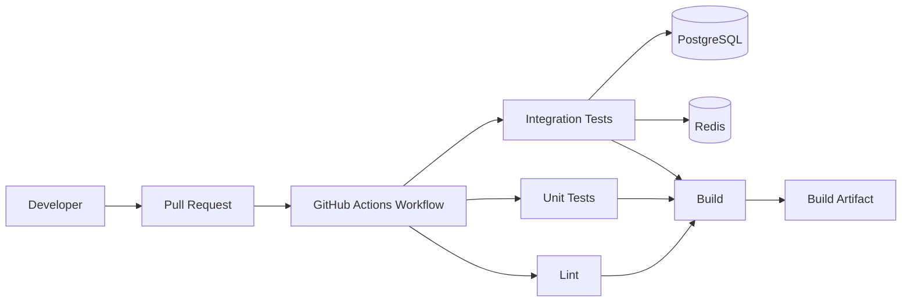
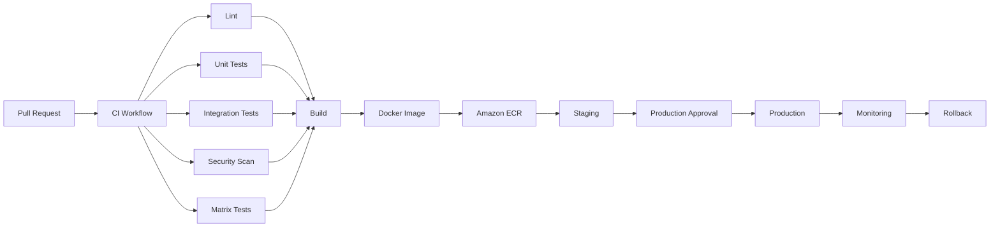
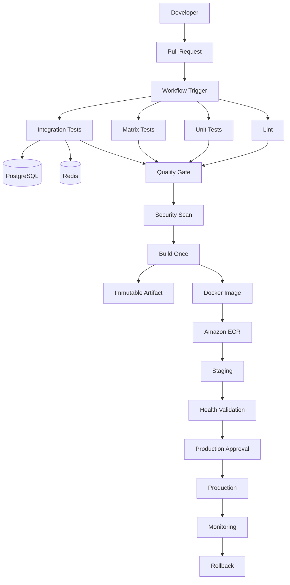

# README.md

## Overview

This folder contains the foundational GitHub Actions knowledge required to understand how workflows are defined, triggered, scheduled, executed, and operated in production CI/CD systems.

The material progresses from the core execution model to workflow configuration, expressions, contexts, matrices, outputs, artifacts, caches, workflow limits, and the operational constraints that influence production pipeline design.

The goal is not to treat GitHub Actions as a YAML syntax exercise. The focus is understanding how GitHub Actions behaves as a CI/CD execution platform and how those behaviors affect backend systems built with Python, Django, FastAPI, Docker, PostgreSQL, Redis, AWS, and microservices.

## Navigation

| # | File | Description |
|---|---|---|
| 01 | [01- Introduction to GitHub Actions](./01-%20Introduction%20to%20GitHub%20Actions.md) | GitHub Actions is GitHub's native automation platform for implementing continuous integration (CI), continuous delivery (CD), testing, secur... |
| 02 | [02- CI CD Fundamentals](./02-%20CI%20CD%20Fundamentals.md) | Continuous Integration and Continuous Delivery/Deployment (CI/CD) is the engineering discipline of automatically validating, packaging, rele... |
| 03 | [03- GitHub Actions Architecture](./03-%20GitHub%20Actions%20Architecture.md) | GitHub Actions is a workflow execution platform built around event-driven automation. |
| 04 | [04- Workflows](./04-%20Workflows.md) | A GitHub Actions workflow is a version-controlled automation definition that describes when automation starts, what jobs execute, how those... |
| 05 | [05- Events and Triggers](./05-%20Events%20and%20Triggers.md) | GitHub Actions workflows are event-driven. |
| 06 | [06- Jobs and Steps](./06-%20Jobs%20and%20Steps.md) | Jobs and steps are the primary execution units inside a GitHub Actions workflow. |
| 07 | [07- Runners](./07-%20Runners.md) | A GitHub Actions runner is the execution environment that runs the steps defined by a workflow job. |
| 08 | [08- Actions](./08-%20Actions.md) | GitHub Actions are reusable automation components that encapsulate CI/CD logic inside a workflow. |
| 09 | [09- Workflow Execution Model](./09-%20Workflow%20Execution%20Model.md) | The GitHub Actions workflow execution model describes how GitHub turns a workflow definition into an actual CI/CD execution: an event trigge... |
| 10 | [10- Workflow Limits and Constraints](./10-%20Workflow%20Limits%20and%20Constraints.md) | GitHub Actions provides a flexible execution model for CI/CD, but workflows operate within platform limits and resource constraints. |

## Learning Path

The recommended progression through this folder is:

```text
GitHub Actions Fundamentals
        ↓
Workflows and Configuration
        ↓
Events and Triggers
        ↓
Jobs and Steps
        ↓
Runners
        ↓
Actions
        ↓
Workflow Execution Model
        ↓
Workflow Limits and Constraints
```

Each document introduces concepts required by the next stage.

---

## Documents

| File | Focus |
|---|---|
| [04- Workflows.md](./04-%20Workflows.md) | Workflow fundamentals, workflow files, YAML structure, workflow configuration, and production workflow organization |
| [05- Events and Triggers.md](./05-%20Events%20and%20Triggers.md) | Workflow triggers including `push`, `pull_request`, manual dispatch, schedules, releases, reusable workflows, and event filtering |
| [06- Jobs and Steps.md](./06-%20Jobs%20and%20Steps.md) | Jobs, steps, dependencies, execution order, conditions, outputs, and job-level design |
| [07- Runners.md](./07-%20Runners.md) | GitHub-hosted and self-hosted runners, labels, environments, isolation, capacity, and runner operations |
| [08- Actions.md](./08-%20Actions.md) | Marketplace actions, composite actions, JavaScript actions, Docker actions, inputs, outputs, security, and reusable automation |
| [09- Workflow Execution Model.md](./09-%20Workflow%20Execution%20Model.md) | Workflow lifecycle, dependency graphs, scheduling, job and step execution, contexts, status handling, concurrency, and failure propagation |
| [10- Workflow Limits and Constraints.md](./10-%20Workflow%20Limits%20and%20Constraints.md) | Execution limits, matrix expansion, runner capacity, concurrency, artifacts, caches, storage, cost, queueing, and production constraints |

---

## Core Execution Model

The most important relationship to understand is:

```text
Workflow
    ↓
Jobs
    ↓
Steps
    ↓
Actions / Shell Commands
    ↓
Runner
```

A workflow defines the overall automation.

A job represents an independently scheduled unit of work.

A step performs an individual operation.

An action packages reusable automation.

A runner provides the execution environment.

This model becomes important when designing dependencies, parallel execution, matrix testing, caching, artifacts, concurrency, and deployment pipelines.

---

## Recommended Reading Order

### Workflow Fundamentals

Start with:

```text
04- Workflows.md
```

Understand:

- Workflow files
- YAML structure
- Workflow configuration
- Jobs
- Steps
- Actions
- Runners
- Basic CI/CD structure

The objective is to understand what a workflow represents before working with more advanced execution behavior.

### Events and Triggers

Continue with:

```text
05- Events and Triggers.md
```

Understand how GitHub events start workflows.

Important triggers include:

- `push`
- `pull_request`
- `pull_request_target`
- `workflow_dispatch`
- `schedule`
- `workflow_call`
- `workflow_run`
- `repository_dispatch`
- `release`

Also understand:

- Branch filters
- Path filters
- Tag filters
- Manual inputs
- Security implications of different events

Trigger design directly affects CI cost, execution frequency, security boundaries, and deployment behavior.

### Jobs and Steps

Continue with:

```text
06- Jobs and Steps.md
```

Focus on:

- Job dependencies
- `needs`
- Sequential execution
- Parallel execution
- Conditions
- Step failure
- Job failure
- Outputs
- Environment variables
- Job-level configuration

This is where a workflow starts becoming a dependency graph rather than a linear YAML script.

### Runners

Continue with:

```text
07- Runners.md
```

Understand the infrastructure executing the workflow:

- GitHub-hosted runners
- Self-hosted runners
- Runner labels
- Runner groups
- Operating systems
- Custom software
- Private network access
- Persistent runners
- Ephemeral runners
- Runner security
- Runner capacity

Runner selection directly affects performance, isolation, cost, and network access.

### Actions

Continue with:

```text
08- Actions.md
```

Understand reusable automation and the three major custom action types:

```text
Composite Action
JavaScript Action
Docker Action
```

Also understand:

- `action.yml`
- Inputs
- Outputs
- Action versioning
- Third-party action trust
- Action permissions
- Supply-chain security
- Composite actions vs reusable workflows

### Workflow Execution Model

Then study:

```text
09- Workflow Execution Model.md
```

This document connects the previous concepts into an execution model.

Focus on:

```text
Event
  ↓
Workflow Run
  ↓
Job Graph
  ↓
Runner Scheduling
  ↓
Job
  ↓
Steps
  ↓
Outputs / Status
  ↓
Dependent Jobs
```

This model is essential for understanding why jobs run in parallel, why dependent jobs wait, how failures propagate, and how workflow state moves between jobs.

### Workflow Limits and Constraints

Finally, study:

```text
10- Workflow Limits and Constraints.md
```

This document focuses on the constraints that become important when scaling workflows.

Key areas include:

- Matrix expansion
- Runner concurrency
- Queueing
- Workflow execution limits
- Concurrency groups
- Artifact storage
- Cache behavior
- Runner CPU and memory
- Docker resource usage
- Workflow cost
- Self-hosted runner capacity
- Production deployment constraints

---

## Concepts That Must Be Understood Together

Some GitHub Actions concepts are tightly coupled and should be studied as a group.

| Concept Group | Why It Matters |
|---|---|
| Workflows + Events | Determines when automation starts |
| Jobs + `needs` | Defines the dependency graph |
| Steps + Actions | Defines the work performed by a job |
| Runners + Jobs | Determines where execution occurs |
| Matrix + Runners | Determines parallel test capacity |
| Outputs + `needs` | Transfers data between jobs |
| Artifacts + Jobs | Transfers persistent build/test outputs |
| Caches + Dependencies | Reduces repeated setup cost |
| Expressions + Contexts | Controls dynamic workflow behavior |
| Environments + Secrets | Protects deployments |
| Concurrency + Deployments | Prevents deployment races |
| Limits + Architecture | Determines whether the workflow scales |

---

## Foundational GitHub Actions Architecture

A basic backend CI pipeline can be represented as:



A production deployment pipeline extends this model:



The foundational documents explain the individual components required to implement this architecture.

---

## Core GitHub Actions Terminology

| Term | Meaning |
|---|---|
| Workflow | YAML-defined automation triggered by an event |
| Workflow Run | One execution instance of a workflow |
| Job | Independently scheduled unit of work |
| Step | Individual operation within a job |
| Action | Reusable automation package |
| Runner | Machine that executes a job |
| Event | GitHub activity that can trigger a workflow |
| Matrix | Mechanism for generating multiple job variations |
| Context | Runtime information exposed to workflow expressions |
| Expression | GitHub Actions expression evaluated using `${{ }}` |
| Artifact | Stored output produced by a workflow |
| Cache | Reusable data intended to accelerate future runs |
| Environment | Deployment boundary with configuration and protection controls |
| Secret | Sensitive value exposed through the secrets mechanism |
| Variable | Non-secret configuration value |
| Concurrency | Mechanism for controlling overlapping workflow or job executions |
| Reusable Workflow | Workflow that can be called by another workflow |

---

## Workflow Data Flow

A senior engineer should understand how information moves through a workflow.

Typical flow:

```text
Trigger
   ↓
Workflow Context
   ↓
Job Inputs
   ↓
Step Execution
   ↓
Step Outputs
   ↓
Job Outputs
   ↓
needs.<job>.outputs
   ↓
Dependent Job
```

For example:

```yaml
jobs:
  build:
    runs-on: ubuntu-latest

    outputs:
      image: ${{ steps.image.outputs.image }}

    steps:
      - id: image
        run: |
          echo "image=123456789012.dkr.ecr.us-east-1.amazonaws.com/api:${GITHUB_SHA}" >> "$GITHUB_OUTPUT"

  deploy:
    needs: build
    runs-on: ubuntu-latest

    steps:
      - name: Deploy image
        run: echo "Deploying ${{ needs.build.outputs.image }}"
```

This pattern is important when passing:

- Docker image references
- Build versions
- Test results
- Environment information
- Generated configuration
- Dynamic matrix definitions

---

## Artifacts and Caches

Artifacts and caches are frequently confused.

```text
Artifact
    ↓
Workflow output
    ↓
Persist / transfer / inspect

Cache
    ↓
Reusable dependency data
    ↓
Accelerate future runs
```

Typical artifacts:

- Test reports
- Coverage reports
- Build packages
- Debug logs
- Release files

Typical caches:

- Python packages
- Node dependencies
- Docker build layers
- Tool downloads

The key distinction is:

> Artifacts represent outputs. Caches represent performance optimization.

Production deployment should use an authoritative artifact or registry image, not a cache.

---

## Security Baseline

GitHub Actions should be treated as code execution infrastructure.

At minimum, understand:

```yaml
permissions:
  contents: read
```

and grant additional permissions only when required.

For AWS OIDC:

```yaml
permissions:
  contents: read
  id-token: write
```

Important security areas include:

- `GITHUB_TOKEN`
- Least privilege
- Secrets
- Environment protection
- Fork pull requests
- `pull_request_target`
- Third-party actions
- Action pinning
- Script injection
- Self-hosted runner isolation
- AWS OIDC
- IAM role permissions

Untrusted GitHub data should never be assumed to be safe shell input.

---

## Production Pipeline Pattern

The concepts in this folder provide the foundation for a pipeline such as:

```text
Pull Request
    ↓
Lint
    ↓
Unit Tests
    ↓
Integration Tests
    ├── PostgreSQL
    └── Redis
    ↓
Security Scan
    ↓
Matrix Testing
    ↓
Build
    ↓
Docker Image
    ↓
Amazon ECR
    ↓
Staging
    ↓
Production Approval
    ↓
Production
    ↓
Health Validation
    ↓
Monitoring
    ↓
Rollback
```

A production implementation should additionally enforce:

- Minimal permissions
- Immutable artifacts
- Controlled concurrency
- Environment protection
- Deterministic deployments
- Dependency caching
- Failure diagnostics
- Runner isolation
- Rollback capability

---

## Practical Backend Stack

The foundational examples are designed to map naturally to backend systems such as:

```text
Python
    ↓
Django / FastAPI
    ↓
pytest
    ↓
PostgreSQL
    ↓
Redis
    ↓
Docker
    ↓
GitHub Actions
    ↓
Amazon ECR
    ↓
Amazon ECS / EC2 / Lambda
```

For a Django or FastAPI application, GitHub Actions can validate the application before deployment:

```text
Code
 ↓
Lint
 ↓
Unit Tests
 ↓
Database Integration Tests
 ↓
Redis Integration Tests
 ↓
Security Scan
 ↓
Docker Build
 ↓
Registry
```

The CI system should validate the same operational assumptions that matter in production wherever practical.

---

## Production Design Principles

### Build Once, Promote the Same Artifact

Prefer:

```text
Source
 ↓
Build
 ↓
Immutable Artifact
 ↓
Staging
 ↓
Approval
 ↓
Production
```

rather than rebuilding independently:

```text
Source
 ├── Build → Staging
 └── Build → Production
```

This improves traceability and rollback reliability.

### Control Parallelism

More jobs do not automatically mean faster CI.

Use:

- Matrix strategies
- `max-parallel`
- Concurrency groups
- Appropriate runner capacity
- Test sharding

to control resource consumption.

### Make Caches Optional

A cache miss should slow a workflow, not break it.

```text
Cache hit
   ↓
Fast build

Cache miss
   ↓
Normal dependency installation
   ↓
Successful build
```

### Protect Production Deployments

Production deployment should normally have:

- Environment protection
- Appropriate approvals
- Minimal permissions
- Deployment concurrency
- Immutable artifacts
- Health validation
- Rollback capability

---

## Common Mistakes

Avoid these patterns while working through the fundamentals:

| Mistake | Problem |
|---|---|
| Treating workflows as shell scripts | Ignores jobs, dependencies, contexts, and execution boundaries |
| Putting everything into one job | Reduces parallelism and makes failure isolation harder |
| Using `latest` as the only image identifier | Weakens traceability and rollback |
| Using artifacts as caches | Mixes persistence and optimization semantics |
| Using caches as deployment sources | Caches are not authoritative artifacts |
| Granting broad `GITHUB_TOKEN` permissions | Increases workflow blast radius |
| Storing AWS long-lived credentials unnecessarily | Creates avoidable credential-management risk |
| Running every workflow on every event | Increases execution time and cost |
| Creating huge matrices | Increases runner demand and failure surface |
| Ignoring runner capacity | Creates queueing and slow feedback |
| Printing environment variables during debugging | Can expose secrets |
| Using `pull_request_target` without understanding its security boundary | Can expose privileged workflow capabilities to unsafe code paths |

---

## How to Use This Folder

When learning or troubleshooting GitHub Actions, identify which execution layer is involved.

```text
Trigger problem
    → Events and Triggers

Workflow structure problem
    → Workflows

Job dependency problem
    → Jobs and Steps

Execution environment problem
    → Runners

Reusable automation problem
    → Actions

Unexpected execution behavior
    → Workflow Execution Model

Performance / capacity / quota problem
    → Workflow Limits and Constraints
```

This makes troubleshooting more systematic than changing YAML until the workflow happens to succeed.

---

## Senior-Level Perspective

At the senior engineering level, GitHub Actions should be evaluated as a distributed CI/CD execution system rather than as a collection of YAML commands.

The important questions become:

- Where should work execute?
- Which jobs can run in parallel?
- Which jobs must depend on other jobs?
- What information crosses job boundaries?
- What should be cached?
- What should become an immutable artifact?
- Which permissions does each job require?
- Which workflows can execute untrusted code?
- How should production deployments be serialized?
- How should runner capacity scale?
- What happens when a runner disappears?
- What happens when an artifact cannot be retrieved?
- What happens when AWS authentication fails?
- How can the deployment be rolled back?
- How can the pipeline remain maintainable across multiple repositories?

These questions are the foundation for the advanced GitHub Actions topics covered elsewhere in the playbook.

---

## Reference Pipeline

The foundational concepts can be combined into the following production-oriented model:



The implementation details become progressively more advanced as the playbook moves beyond fundamentals into workflow design, security, deployment, operations, troubleshooting, architecture, and interview preparation.

## Key Takeaways

- GitHub Actions is an execution platform built around workflows, jobs, steps, actions, and runners; understanding these boundaries is more important than memorizing YAML syntax.
- Events determine when workflows execute, while jobs, dependencies, matrices, and concurrency determine how work is scheduled and coordinated.
- Artifacts, caches, outputs, contexts, environments, and secrets solve different problems and should be used according to their intended lifecycle and security boundary.
- Production CI/CD requires controlled permissions, immutable artifacts, bounded parallelism, protected deployments, reliable rollback, and observable failure handling.
- The foundational concepts in this folder provide the execution model required to design scalable GitHub Actions pipelines for Python, Docker, AWS, Django, FastAPI, and other backend systems.