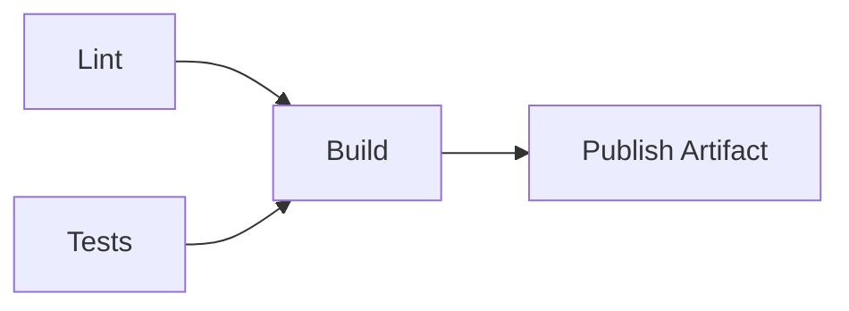

# 01- Expressions and Operators

## Overview

GitHub Actions expressions provide the evaluation layer used to make workflows dynamic. They allow a workflow to inspect event data, job results, environment values, secrets, matrix values, outputs, and repository metadata, then make decisions based on that information.

Expressions are primarily used inside `${{ }}` and are especially important for:

- Conditional job and step execution
- Selecting behavior based on branches, events, or environments
- Passing values between jobs
- Generating dynamic matrices
- Reading workflow inputs and outputs
- Controlling deployments
- Computing cache keys
- Inspecting workflow execution state

A production workflow commonly combines three different execution mechanisms:

```text
GitHub Actions YAML
        |
        +-- Expressions
        |      |
        |      +-- Evaluate workflow data
        |
        +-- Actions
        |      |
        |      +-- Execute reusable functionality
        |
        +-- Shell commands
               |
               +-- Execute inside the runner
```

Expressions are evaluated by GitHub Actions. Shell commands such as `bash`, `pwsh`, or `python` execute later inside the runner. Confusing these two execution layers is a common source of workflow failures and security problems.

---

## Why Expressions Matter

Static workflows are easy to understand but quickly become repetitive.

For example, a deployment job may only be appropriate when:

```text
event = push
branch = main
tests = successful
environment = production
```

Expressions allow these conditions to be represented directly in the workflow.

```yaml
jobs:
  deploy:
    if: ${{ github.event_name == 'push' && github.ref == 'refs/heads/main' }}
    runs-on: ubuntu-latest

    steps:
      - name: Deploy
        run: ./scripts/deploy.sh
```

The expression determines whether the job is created for execution. The shell command performs the actual deployment.

This separation is important for production CI/CD because workflow decisions and application commands operate in different execution contexts.

---

## Expression Syntax

The standard expression syntax is:

```text
${{ expression }}
```

Example:

```yaml
if: ${{ github.ref == 'refs/heads/main' }}
```

Expressions can also appear inside strings.

```yaml
name: Deploy ${{ github.ref_name }}
```

Another example:

```yaml
run: echo "Deploying version ${{ github.sha }}"
```

Expressions can access contexts, operators, functions, literals, and other expression values.

Conceptually:

```text
Expression
    |
    +-- Literals
    +-- Operators
    +-- Contexts
    +-- Functions
    +-- Property access
    +-- Index access
```

---

## Expression Evaluation

GitHub evaluates expressions before the relevant workflow element executes.

For a job-level condition:

```yaml
jobs:
  deploy:
    if: ${{ needs.tests.result == 'success' }}
```

GitHub evaluates the condition before starting the `deploy` job.

For a step:

```yaml
steps:
  - name: Publish
    if: ${{ success() }}
    run: ./publish.sh
```

The condition is evaluated before the step executes.

The important distinction is:

```text
Expression evaluation
        ↓
Workflow decision
        ↓
Action or shell execution
```

An expression does not execute a shell command.

---

## Expressions vs Shell Commands

This distinction is fundamental.

### GitHub Actions Expression

```yaml
if: ${{ github.ref == 'refs/heads/main' }}
```

GitHub evaluates this.

### Shell Command

```yaml
run: |
  if [ "$ENVIRONMENT" = "production" ]; then
    ./deploy.sh
  fi
```

The runner's shell evaluates this.

These are different languages and different execution environments.

| Aspect | GitHub Expression | Shell Command |
|---|---|---|
| Evaluated by | GitHub Actions | Runner shell |
| Typical syntax | `${{ }}` | Bash / PowerShell / CMD |
| Primary purpose | Workflow decisions/data | Execute commands |
| Access to contexts | Yes | Indirectly through environment variables |
| Access to filesystem | No | Yes |
| Access to installed tools | No | Yes |
| Typical use | `if`, `env`, `with`, outputs | Build, test, deploy |

A common mistake is expecting an expression to execute shell syntax.

Incorrect:

```yaml
if: ${{ git status --porcelain }}
```

Correct approach:

```yaml
- name: Check repository
  run: git status --porcelain
```

If the result must influence a later step, write the result to `$GITHUB_OUTPUT` and consume it through an expression.

---

## Literals

Expressions support several literal types.

### String

```yaml
if: ${{ github.event_name == 'push' }}
```

### Number

```yaml
if: ${{ matrix.python-version == 3.12 }}
```

For version identifiers, strings are generally clearer:

```yaml
matrix:
  python-version:
    - "3.11"
    - "3.12"
    - "3.13"
```

### Boolean

```yaml
if: ${{ inputs.deploy == true }}
```

### Null

```yaml
if: ${{ some_context.some_value != null }}
```

### Arrays and Objects

Structured values commonly appear through contexts and JSON conversion rather than being manually constructed in expressions.

For example:

```yaml
strategy:
  matrix:
    python-version: ${{ fromJSON(needs.generate-matrix.outputs.python) }}
```

---

## Operators

GitHub Actions expressions provide operators for comparison, logical evaluation, and value selection.

### Comparison Operators

| Operator | Meaning |
|---|---|
| `==` | Equal |
| `!=` | Not equal |
| `>` | Greater than |
| `>=` | Greater than or equal |
| `<` | Less than |
| `<=` | Less than or equal |

Example:

```yaml
if: ${{ github.ref_name == 'main' }}
```

Another:

```yaml
if: ${{ github.run_attempt > 1 }}
```

---

## Logical Operators

### AND

```text
&&
```

Example:

```yaml
if: ${{ github.event_name == 'push' && github.ref_name == 'main' }}
```

Both conditions must be true.

### OR

```text
||
```

Example:

```yaml
if: ${{ github.ref_name == 'main' || github.ref_name == 'develop' }}
```

At least one condition must be true.

### NOT

```text
!
```

Example:

```yaml
if: ${{ !cancelled() }}
```

Logical operators are particularly useful for deployment gates.

```yaml
if: >-
  ${{
    github.event_name == 'push' &&
    github.ref_name == 'main' &&
    needs.tests.result == 'success'
  }}
```

---

## Operator Precedence

When an expression becomes complex, use parentheses instead of relying on precedence.

Prefer:

```yaml
if: >-
  ${{
    (github.ref_name == 'main' || github.ref_name == 'release') &&
    github.event_name == 'push'
  }}
```

Rather than:

```yaml
if: ${{ github.ref_name == 'main' || github.ref_name == 'release' && github.event_name == 'push' }}
```

Explicit grouping improves maintainability and reduces production mistakes.

---

## Truthiness and Loose Comparisons

Expressions perform type coercion in some comparisons. Values that appear similar can therefore behave differently from strongly typed programming languages such as Python.

For example, repository configuration values frequently arrive as strings.

Prefer explicit normalization or explicit comparison when the type matters.

```yaml
if: ${{ inputs.deploy == true }}
```

For values passed through JSON, use `fromJSON()` when a real boolean or number is required.

```yaml
if: ${{ fromJSON(inputs.retries) > 3 }}
```

Do not assume that every value in a GitHub Actions context behaves like a native Python or JavaScript value.

---

## Property and Index Access

Context properties are normally accessed using dot notation.

```yaml
${{ github.repository }}
```

```yaml
${{ github.sha }}
```

```yaml
${{ github.actor }}
```

Index notation can be useful when property names are dynamic.

```yaml
${{ github.event.pull_request.labels[0].name }}
```

The referenced property must exist for the event being processed. A workflow triggered by `push` does not have the same event payload as one triggered by `pull_request`.

---

## Core GitHub Actions Contexts

Contexts expose workflow execution data.

| Context | Primary purpose |
|---|---|
| `github` | Repository, event, commit, actor, workflow and run information |
| `env` | Environment variables available through workflow configuration |
| `vars` | Repository, organization and environment configuration variables |
| `secrets` | Secrets exposed to the workflow |
| `steps` | Outputs and results from completed steps |
| `needs` | Outputs and results from dependent jobs |
| `job` | Current job information |
| `runner` | Runner environment information |
| `matrix` | Current matrix combination |
| `strategy` | Matrix strategy information |
| `inputs` | Manual or reusable-workflow inputs |

Understanding these contexts is more important than memorizing individual properties.

---

## The `github` Context

The `github` context exposes information about the workflow execution and triggering event.

Common properties include:

```yaml
${{ github.repository }}
${{ github.repository_owner }}
${{ github.ref }}
${{ github.ref_name }}
${{ github.sha }}
${{ github.actor }}
${{ github.event_name }}
${{ github.workflow }}
${{ github.run_id }}
${{ github.run_number }}
${{ github.run_attempt }}
```

Example:

```yaml
- name: Display build metadata
  run: |
    echo "Repository: ${{ github.repository }}"
    echo "Commit: ${{ github.sha }}"
    echo "Branch: ${{ github.ref_name }}"
    echo "Event: ${{ github.event_name }}"
```

A common production use is creating an immutable build identifier.

```yaml
env:
  IMAGE_TAG: ${{ github.sha }}
```

This makes the Git commit directly traceable to the container image.

---

## `github.ref` vs `github.ref_name`

These values are related but different.

For a branch such as `main`:

```text
github.ref
    refs/heads/main

github.ref_name
    main
```

For a tag such as `v1.4.0`:

```text
github.ref
    refs/tags/v1.4.0

github.ref_name
    v1.4.0
```

Use `github.ref_name` when only the short branch or tag name is required.

Use `github.ref` when the complete Git reference is relevant.

---

## The `env` Context

The `env` context exposes environment variables configured through workflow configuration.

```yaml
env:
  APP_ENV: production

jobs:
  deploy:
    runs-on: ubuntu-latest

    steps:
      - name: Show environment
        run: echo "${{ env.APP_ENV }}"
```

Environment variables can be defined at:

- Workflow level
- Job level
- Step level

Example:

```yaml
env:
  LOG_LEVEL: INFO

jobs:
  test:
    runs-on: ubuntu-latest
    env:
      DATABASE_NAME: testdb

    steps:
      - name: Test
        env:
          TEST_MODE: integration
        run: |
          echo "$LOG_LEVEL"
          echo "$DATABASE_NAME"
          echo "$TEST_MODE"
```

More specific scopes override broader scopes for the same variable name.

Conceptually:

```text
Workflow env
     ↓
Job env
     ↓
Step env
```

---

## The `vars` Context

The `vars` context exposes GitHub configuration variables.

These can be configured at organization, repository, and environment scopes.

Example:

```yaml
env:
  AWS_REGION: ${{ vars.AWS_REGION }}
```

Variables are appropriate for non-sensitive configuration.

Examples:

```text
AWS_REGION
ECR_REPOSITORY
DEPLOYMENT_TIMEOUT
SERVICE_NAME
```

Do not store credentials or sensitive values in `vars`.

Use `secrets` for sensitive values.

---

## `env` vs `vars`

| Requirement | Recommended mechanism |
|---|---|
| Non-sensitive runtime value | `env` |
| Shared repository configuration | `vars` |
| Organization-wide configuration | Organization variables |
| Environment-specific configuration | Environment variables |
| Password/token/private key | `secrets` |
| Temporary value between steps | `$GITHUB_ENV` |
| Value between jobs | `$GITHUB_OUTPUT` + job output |

A useful production distinction is:

```text
vars
    = configuration

secrets
    = sensitive configuration

env
    = environment exposed to execution
```

---

## The `secrets` Context

Secrets provide sensitive values without storing them directly in workflow source.

Example:

```yaml
- name: Authenticate
  env:
    API_TOKEN: ${{ secrets.API_TOKEN }}
  run: ./scripts/authenticate.sh
```

Secrets can exist at:

- Organization level
- Repository level
- Environment level

Environment secrets become particularly useful for protected deployments.

```text
Development
    ↓
development secrets

Staging
    ↓
staging secrets

Production
    ↓
production secrets
```

The workflow should not expose production credentials to pull-request validation jobs unnecessarily.

---

## Secret Masking

GitHub attempts to mask secrets in logs.

However, masking is not a substitute for safe secret handling.

Avoid:

```yaml
- run: echo "${{ secrets.API_TOKEN }}"
```

Do not intentionally print secrets even when masking is enabled.

Prefer passing secrets through environment variables:

```yaml
- name: Deploy
  env:
    AWS_ROLE_ARN: ${{ secrets.AWS_ROLE_ARN }}
  run: ./scripts/deploy.sh
```

Also avoid placing sensitive values directly into command-line arguments when the command or child process may expose them.

---

## `steps` Context

The `steps` context provides information from previous steps in the same job.

It is commonly used for step outputs.

```yaml
- name: Generate version
  id: version
  run: echo "value=1.4.0" >> "$GITHUB_OUTPUT"

- name: Use version
  run: echo "Version is ${{ steps.version.outputs.value }}"
```

The important relationship is:

```text
Step
  |
  +-- id
       |
       +-- output
             |
             +-- steps.<id>.outputs.<name>
```

A step output is available within the job. To transfer the value to another job, expose it as a job output.

---

## The `needs` Context

The `needs` context exposes results and outputs from dependent jobs.

Example:

```yaml
jobs:
  build:
    runs-on: ubuntu-latest

    outputs:
      image-tag: ${{ steps.metadata.outputs.image-tag }}

    steps:
      - id: metadata
        run: echo "image-tag=${GITHUB_SHA}" >> "$GITHUB_OUTPUT"

  deploy:
    needs: build
    runs-on: ubuntu-latest

    steps:
      - run: echo "Deploying ${{ needs.build.outputs.image-tag }}"
```

This creates a data path:

```text
build job
    |
    +-- step output
           |
           +-- job output
                  |
                  +-- needs.build.outputs.image-tag
                         |
                         +-- deploy job
```

This pattern is fundamental for multi-job CI/CD pipelines.

---

## `needs.<job>.result`

A dependent job can inspect the result of another job.

Typical values include:

```text
success
failure
cancelled
skipped
```

Example:

```yaml
if: ${{ needs.tests.result == 'success' }}
```

This is useful when a deployment must only proceed after validation.

```yaml
jobs:
  deploy:
    needs:
      - lint
      - tests
      - security

    if: >-
      ${{
        needs.lint.result == 'success' &&
        needs.tests.result == 'success' &&
        needs.security.result == 'success'
      }}

    runs-on: ubuntu-latest

    steps:
      - run: ./deploy.sh
```

---

## The `job` Context

The `job` context contains information about the current job.

It is less frequently used than `github`, `steps`, `needs`, and `matrix`, but can be useful when building dynamic workflows.

For example:

```yaml
- name: Display job status
  run: echo "${{ job.status }}"
```

The status can be used for diagnostics and conditional behavior.

---

## The `runner` Context

The `runner` context exposes information about the runner executing the job.

Examples include:

```yaml
${{ runner.os }}
${{ runner.arch }}
${{ runner.name }}
${{ runner.temp }}
${{ runner.tool_cache }}
```

Example:

```yaml
- name: Show runner
  run: |
    echo "OS: ${{ runner.os }}"
    echo "Architecture: ${{ runner.arch }}"
```

A matrix can combine operating-system and language versions:

```yaml
strategy:
  matrix:
    os:
      - ubuntu-latest
      - windows-latest

runs-on: ${{ matrix.os }}
```

---

## The `matrix` Context

The `matrix` context contains the current combination generated by a matrix strategy.

Example:

```yaml
strategy:
  matrix:
    python-version:
      - "3.11"
      - "3.12"
      - "3.13"

steps:
  - name: Set up Python
    uses: actions/setup-python@v6
    with:
      python-version: ${{ matrix.python-version }}
```

Each matrix combination becomes an independent job execution.

Conceptually:

```text
Python 3.11 ──┐
Python 3.12 ──┼── Test Job
Python 3.13 ──┘
```

This is a major mechanism for scalable test coverage.

---

## The `strategy` Context

The `strategy` context provides information about matrix execution.

It is useful when reasoning about matrix behavior, including:

- Matrix combinations
- Fail-fast behavior
- Parallelism

A typical matrix configuration is:

```yaml
strategy:
  fail-fast: false
  max-parallel: 3
  matrix:
    python-version:
      - "3.11"
      - "3.12"
      - "3.13"
```

`fail-fast` controls cancellation behavior for matrix jobs when one combination fails.

`max-parallel` controls how many matrix jobs can execute concurrently.

---

## The `inputs` Context

The `inputs` context provides inputs supplied to:

- Manually dispatched workflows
- Reusable workflows

Example:

```yaml
on:
  workflow_dispatch:
    inputs:
      environment:
        description: Deployment environment
        required: true
        type: choice
        options:
          - staging
          - production

jobs:
  deploy:
    runs-on: ubuntu-latest

    steps:
      - name: Display target
        run: echo "Deploying to ${{ inputs.environment }}"
```

Inputs are useful for controlled operational workflows.

For production deployments, validate the input against an explicit set of supported environments rather than treating arbitrary user input as a deployment target.

---

## Context Availability

Not every context is available everywhere.

For example:

- `matrix` exists only where a matrix strategy is active.
- `steps` refers to steps in the current job.
- `needs` requires declared job dependencies.
- `inputs` depends on the workflow trigger and configuration.
- Event-specific properties under `github.event` depend on the triggering event.

A production workflow should not assume that a property available during `pull_request` also exists during `push`.

This is a common source of:

```text
null values
skipped jobs
unexpected conditions
invalid property access
```

---

## Built-in Functions

GitHub Actions provides functions for common expression operations.

Important functions include:

| Function | Purpose |
|---|---|
| `success()` | Checks whether previous execution completed successfully |
| `failure()` | Checks whether a previous step or job failed |
| `always()` | Allows execution regardless of normal success/failure state |
| `cancelled()` | Checks whether execution was cancelled |
| `contains()` | Checks whether a string or collection contains a value |
| `startsWith()` | Checks string prefix |
| `endsWith()` | Checks string suffix |
| `format()` | Formats a string |
| `fromJSON()` | Converts JSON into an expression value |
| `toJSON()` | Converts a value into JSON representation |
| `hashFiles()` | Generates a hash from matching files |

---

## `success()`

`success()` evaluates whether the workflow element's preceding execution state is successful.

Example:

```yaml
- name: Deploy
  if: ${{ success() }}
  run: ./deploy.sh
```

For normal sequential steps, a step failure causes subsequent steps to be skipped unless their conditions explicitly allow execution.

A deployment pipeline therefore naturally behaves like:

```text
Lint
  ↓ success
Tests
  ↓ success
Build
  ↓ success
Deploy
```

For job dependencies, `needs` establishes the dependency relationship.

```yaml
deploy:
  needs:
    - tests
    - build
```

---

## `failure()`

`failure()` is useful for diagnostics and cleanup after failures.

Example:

```yaml
- name: Upload diagnostic logs
  if: ${{ failure() }}
  uses: actions/upload-artifact@v4
  with:
    name: diagnostic-logs
    path: logs/
```

A production pipeline can use this pattern to preserve evidence after failed tests.

Typical flow:

```text
Test
  |
  +-- failure
        |
        +-- Collect logs
        +-- Upload reports
        +-- Preserve diagnostics
```

---

## `always()`

`always()` allows a step or job condition to evaluate independently of the normal success requirement.

Example:

```yaml
- name: Upload test results
  if: ${{ always() }}
  uses: actions/upload-artifact@v4
  with:
    name: test-results
    path: reports/
```

This is useful for collecting diagnostic information even when a previous test step failed.

However, `always()` must not be interpreted as:

> "This will execute no matter what happens."

Cancellation and workflow termination can prevent execution.

It should also be used carefully for critical deployment logic. GitHub's documentation recommends avoiding `always()` for tasks that could hang or create unsafe behavior after cancellation.

A better mental model is:

```text
Normal failure
    ↓
always() may still permit execution

Cancellation / termination
    ↓
Execution may stop
```

---

## `cancelled()`

`cancelled()` evaluates whether the workflow execution has been cancelled.

Example:

```yaml
- name: Cleanup
  if: ${{ cancelled() }}
  run: ./scripts/cleanup.sh
```

Cancellation is especially relevant when using concurrency.

For example:

```yaml
concurrency:
  group: deploy-${{ github.ref }}
  cancel-in-progress: true
```

A newer workflow run may cancel an older run.

Deployment and cleanup logic therefore needs to consider cancellation explicitly.

---

## `failure()` vs `cancelled()`

These states should not be treated as equivalent.

| State | Meaning |
|---|---|
| `success()` | Previous execution succeeded |
| `failure()` | A relevant previous execution failed |
| `cancelled()` | Execution was cancelled |
| `always()` | Evaluate despite normal success/failure gating |

A diagnostic workflow may need to preserve artifacts after failure but behave differently after explicit cancellation.

---

## `contains()`

`contains()` checks whether a value exists in a string or collection.

Example:

```yaml
if: ${{ contains(github.event.pull_request.labels.*.name, 'deploy') }}
```

It can also be used with strings:

```yaml
if: ${{ contains(github.ref_name, 'release') }}
```

Be careful with broad string matching.

For production branch controls, exact comparisons are often safer:

```yaml
if: ${{ github.ref_name == 'main' }}
```

rather than:

```yaml
if: ${{ contains(github.ref_name, 'main') }}
```

The latter can unintentionally match names such as:

```text
main-hotfix
feature-main
```

---

## `startsWith()`

`startsWith()` checks a string prefix.

Example:

```yaml
if: ${{ startsWith(github.ref, 'refs/tags/v') }}
```

This is useful for release tag detection.

```text
v1.0.0
v1.2.3
v2.0.0
```

A workflow can therefore distinguish version tags from arbitrary tags.

---

## `endsWith()`

`endsWith()` checks a string suffix.

Example:

```yaml
if: ${{ endsWith(github.ref_name, '-rc') }}
```

This can be useful for release conventions, although exact tag naming rules should be designed carefully.

---

## `format()`

`format()` creates strings from placeholders.

Example:

```yaml
env:
  IMAGE_URI: ${{ format('{0}/{1}:{2}', vars.ECR_REGISTRY, vars.ECR_REPOSITORY, github.sha) }}
```

This can produce:

```text
registry.example.com/backend-api:commit-sha
```

A useful production pattern is constructing immutable artifact identifiers from:

```text
registry
+
repository
+
commit SHA
```

---

## `fromJSON()`

`fromJSON()` converts JSON into a value that expressions can use.

This is particularly important for dynamic matrices.

Example:

```yaml
strategy:
  matrix:
    python-version: ${{ fromJSON(needs.generate-matrix.outputs.versions) }}
```

If the previous job outputs:

```json
["3.11", "3.12", "3.13"]
```

GitHub can use the resulting array as a matrix dimension.

---

## Dynamic Matrix Example

A dynamic matrix is useful when test targets are generated rather than hard-coded.

```yaml
jobs:
  generate-matrix:
    runs-on: ubuntu-latest

    outputs:
      versions: ${{ steps.matrix.outputs.versions }}

    steps:
      - id: matrix
        run: |
          echo 'versions=["3.11","3.12","3.13"]' >> "$GITHUB_OUTPUT"

  test:
    needs: generate-matrix

    strategy:
      fail-fast: false
      matrix:
        python-version: ${{ fromJSON(needs.generate-matrix.outputs.versions) }}

    runs-on: ubuntu-latest

    steps:
      - uses: actions/checkout@v5

      - uses: actions/setup-python@v6
        with:
          python-version: ${{ matrix.python-version }}

      - run: python -m pytest
```

The data flow is:

```text
Generate Matrix
      |
      | JSON output
      v
needs.generate-matrix.outputs.versions
      |
      | fromJSON()
      v
Matrix expansion
      |
      +---- Python 3.11
      +---- Python 3.12
      +---- Python 3.13
```

This pattern is powerful but should be used when dynamic configuration provides real operational value. Static matrices are easier to review when the supported combinations are stable.

---

## `toJSON()`

`toJSON()` converts a value to JSON representation.

It is useful for debugging contexts.

For example:

```yaml
- name: Inspect matrix
  env:
    MATRIX_CONTEXT: ${{ toJSON(matrix) }}
  run: echo "$MATRIX_CONTEXT"
```

This is preferable to trying to print complex context objects directly.

Do not use `toJSON()` to dump sensitive contexts into logs.

For example, avoid indiscriminately printing:

```yaml
${{ toJSON(secrets) }}
```

Secrets should never be treated as diagnostic data.

---

## `hashFiles()`

`hashFiles()` calculates a hash based on files matching specified patterns.

It is particularly useful for dependency caches.

Example:

```yaml
key: ${{ runner.os }}-python-${{ hashFiles('**/requirements.txt') }}
```

If dependency files change, the cache key changes.

Conceptually:

```text
requirements.txt
        |
        v
    hashFiles()
        |
        v
dependency cache key
        |
        +-- unchanged → cache reuse
        |
        +-- changed → new cache
```

This is more reliable than using only a static key.

---

## Cache Example

A Python project can use:

```yaml
- name: Set up Python
  uses: actions/setup-python@v6
  with:
    python-version: "3.12"
    cache: pip
    cache-dependency-path: requirements.txt
```

When explicit cache configuration is required:

```yaml
- name: Cache pip
  uses: actions/cache@v4
  with:
    path: ~/.cache/pip
    key: ${{ runner.os }}-pip-${{ hashFiles('requirements.txt') }}
    restore-keys: |
      ${{ runner.os }}-pip-
```

The key should represent the dependencies that determine cache validity.

---

## Conditional Execution with `if`

Conditions can be attached to jobs and steps.

### Step-Level Condition

```yaml
steps:
  - name: Deploy
    if: ${{ github.ref_name == 'main' }}
    run: ./deploy.sh
```

### Job-Level Condition

```yaml
jobs:
  deploy:
    if: ${{ github.ref_name == 'main' }}
    runs-on: ubuntu-latest

    steps:
      - run: ./deploy.sh
```

The difference is operationally important.

A job-level condition prevents the job from running at all.

A step-level condition starts the job but selectively executes steps.

---

## Production Deployment Condition

A deployment job can combine multiple conditions.

```yaml
deploy:
  needs:
    - lint
    - tests
    - security

  if: >-
    ${{
      github.event_name == 'push' &&
      github.ref_name == 'main' &&
      needs.lint.result == 'success' &&
      needs.tests.result == 'success' &&
      needs.security.result == 'success'
    }}

  runs-on: ubuntu-latest

  steps:
    - name: Deploy
      run: ./scripts/deploy.sh
```

This expresses a clear promotion rule:

```text
Push to main
     |
     v
Lint ──────┐
Tests ─────┼── all successful ──> Deploy
Security ──┘
```

---

## Conditions and Skipped Jobs

A job can be skipped because its `if` condition evaluates to false.

For example:

```yaml
deploy:
  if: ${{ github.ref_name == 'main' }}
```

A feature-branch run may therefore show:

```text
lint       success
tests      success
deploy     skipped
```

A skipped job is not the same as a failed job.

This distinction matters when building dependency graphs and interpreting pipeline results.

---

## `continue-on-error`

`continue-on-error` changes failure handling.

Example:

```yaml
- name: Experimental test
  continue-on-error: true
  run: python -m pytest tests/experimental/
```

The step can fail without necessarily failing the entire job.

At job level:

```yaml
experimental:
  continue-on-error: true
  runs-on: ubuntu-latest
  steps:
    - run: ./experimental-checks.sh
```

This should be used deliberately.

Do not use it to hide required production quality gates.

A security scan that is required for production should normally fail the pipeline rather than being silently tolerated.

---

## `continue-on-error` and Matrix Testing

Matrix testing can combine `continue-on-error` with experimental versions.

For example:

```yaml
strategy:
  matrix:
    python-version:
      - "3.11"
      - "3.12"
      - "3.13"
    experimental:
      - false

continue-on-error: ${{ matrix.experimental }}
```

This allows an explicitly designated experimental combination to fail without blocking stable combinations.

The important engineering principle is:

```text
Explicitly tolerated failure
        ≠
Ignored failure
```

The workflow should make the distinction visible.

---

## Environment Variables Across Scopes

Example:

```yaml
env:
  APP_ENV: development

jobs:
  test:
    env:
      APP_ENV: test

    runs-on: ubuntu-latest

    steps:
      - name: Run tests
        env:
          APP_ENV: ci
        run: echo "$APP_ENV"
```

The effective value for the step is:

```text
ci
```

because the step-level value is more specific.

A useful precedence model is:

```text
Workflow
    ↓
Job
    ↓
Step
```

For production systems, avoid excessive overriding of the same variable at multiple levels. It makes debugging significantly harder.

---

## `$GITHUB_ENV` and Expression Evaluation

`$GITHUB_ENV` allows a step to create or update an environment variable for subsequent steps in the same job.

```yaml
- name: Set deployment environment
  run: echo "DEPLOY_ENV=staging" >> "$GITHUB_ENV"

- name: Deploy
  run: echo "Deploying to $DEPLOY_ENV"
```

The variable becomes available to later steps.

Do not expect the variable to magically exist inside the expression evaluation of the same step that writes it.

Prefer:

```text
Step A
    ↓
write GITHUB_ENV
    ↓
Step B
    ↓
consume environment variable
```

---

## `$GITHUB_OUTPUT`

`$GITHUB_OUTPUT` is the supported mechanism for step outputs.

```yaml
- name: Generate image tag
  id: metadata
  run: echo "tag=${GITHUB_SHA}" >> "$GITHUB_OUTPUT"

- name: Use image tag
  run: echo "${{ steps.metadata.outputs.tag }}"
```

The distinction is:

```text
GITHUB_ENV
    → environment variable for later steps

GITHUB_OUTPUT
    → step output
```

For values crossing job boundaries:

```text
GITHUB_OUTPUT
    ↓
step output
    ↓
job output
    ↓
needs.<job>.outputs.<name>
```

---

## Structured Outputs

Outputs can contain structured JSON.

Example:

```yaml
- name: Generate deployment metadata
  id: metadata
  run: |
    echo 'config={"environment":"staging","region":"ap-south-1"}' >> "$GITHUB_OUTPUT"
```

A later step can consume it:

```yaml
- name: Display configuration
  env:
    CONFIG: ${{ steps.metadata.outputs.config }}
  run: echo "$CONFIG"
```

For expressions that need to inspect the structure:

```yaml
${{ fromJSON(steps.metadata.outputs.config).environment }}
```

This is useful for dynamic pipeline configuration.

---

## Context Security

Not every context should be treated as trusted input.

Potentially attacker-controlled values can originate from:

- Pull request titles
- Branch names
- Commit messages
- Issue content
- Workflow inputs
- Repository content from forks

A dangerous pattern is interpolating untrusted data directly into a shell command.

For example:

```yaml
- name: Process title
  run: echo "${{ github.event.pull_request.title }}"
```

A pull request title can contain shell-sensitive characters.

A safer approach is to pass the value through an environment variable:

```yaml
- name: Process title
  env:
    PR_TITLE: ${{ github.event.pull_request.title }}
  run: |
    printf '%s\n' "$PR_TITLE"
```

The shell receives the value as data rather than as part of the command source.

This distinction is critical for script-injection prevention.

---

## Avoiding Script Injection

Consider:

```yaml
- name: Process branch
  run: ./deploy.sh ${{ github.head_ref }}
```

The value is inserted directly into the shell script.

Prefer:

```yaml
- name: Process branch
  env:
    HEAD_REF: ${{ github.head_ref }}
  run: ./deploy.sh "$HEAD_REF"
```

For Python:

```yaml
- name: Process PR title
  env:
    PR_TITLE: ${{ github.event.pull_request.title }}
  run: python scripts/process_title.py
```

Then Python reads the value from the environment.

```python
import os

title = os.environ["PR_TITLE"]
```

The principle is:

```text
Untrusted GitHub data
        ↓
Environment variable
        ↓
Explicitly quoted input
        ↓
Application processing
```

Do not construct executable shell syntax from untrusted repository metadata.

---

## `pull_request` and Expression Security

Pull requests from forks require special consideration because the workflow may process untrusted code.

A workflow such as:

```yaml
on:
  pull_request:
```

is generally the safer model for validation because the workflow runs in the context intended for pull-request testing, with important restrictions around secrets.

Do not assume that a pull request should have access to production credentials simply because the workflow needs to run tests.

A strong architecture separates:

```text
PR validation
    |
    +-- lint
    +-- tests
    +-- security checks
    |
    X
    |
    +-- production credentials
```

Production deployment should occur only after trusted repository events and protected deployment conditions.

---

## `pull_request_target`

`pull_request_target` runs in the context of the base repository and therefore requires particular caution.

It can provide access to repository-level workflow permissions and secrets that ordinary fork pull-request workflows cannot safely expose.

The dangerous pattern is combining:

```text
pull_request_target
        +
checkout of untrusted PR code
        +
secrets
        +
write permissions
```

For example, avoid architectures where a `pull_request_target` workflow checks out attacker-controlled code and then executes it with access to secrets.

The security boundary should be:

```text
Trusted workflow logic
        |
        +-- Trusted repository context
        |
        +-- Carefully controlled data from PR
```

not:

```text
Untrusted PR code
        |
        +-- Secrets
        +-- Write permissions
        +-- Production credentials
```

---

## Expression-Based Event Routing

Expressions can route different events to different behavior.

Example:

```yaml
jobs:
  test:
    runs-on: ubuntu-latest

    steps:
      - run: python -m pytest

  deploy-staging:
    needs: test
    if: ${{ github.event_name == 'push' && github.ref_name == 'develop' }}
    runs-on: ubuntu-latest

    steps:
      - run: ./deploy-staging.sh

  deploy-production:
    needs: test
    if: ${{ github.event_name == 'push' && github.ref_name == 'main' }}
    runs-on: ubuntu-latest

    steps:
      - run: ./deploy-production.sh
```

This creates a simple environment promotion model:

```text
develop
   |
   v
Tests
   |
   v
Staging

main
 |
 v
Tests
 |
 v
Production
```

In a mature system, production deployment should additionally use protected environments, approvals, permissions, concurrency controls, and immutable artifacts.

---

## Expressions in `env`

Expressions can populate environment variables.

```yaml
env:
  COMMIT_SHA: ${{ github.sha }}
  BRANCH_NAME: ${{ github.ref_name }}
  BUILD_ID: ${{ github.run_id }}
```

This is useful when a shell command needs GitHub metadata.

```yaml
- name: Print build metadata
  run: |
    echo "Commit: $COMMIT_SHA"
    echo "Branch: $BRANCH_NAME"
    echo "Build: $BUILD_ID"
```

This approach keeps the expression layer separate from the shell layer.

---

## Expressions in `with`

Actions commonly receive expression values through `with`.

```yaml
- name: Set up Python
  uses: actions/setup-python@v6
  with:
    python-version: ${{ matrix.python-version }}
```

Another example:

```yaml
- name: Upload artifact
  uses: actions/upload-artifact@v4
  with:
    name: test-results-${{ github.run_id }}
    path: reports/
```

---

## Expressions in Action Inputs

Action inputs are evaluated before the action executes.

```yaml
- name: Build Docker image
  uses: docker/build-push-action@v7
  with:
    context: .
    push: true
    tags: |
      ${{ vars.ECR_REGISTRY }}/${{ vars.ECR_REPOSITORY }}:${{ github.sha }}
```

The action receives the resolved value.

The action itself does not evaluate `${{ }}` as a shell expression.

---

## Expressions and Job Dependencies

A production pipeline often uses both `needs` and expressions.

```yaml
jobs:
  lint:
    runs-on: ubuntu-latest
    steps:
      - run: ruff check .

  test:
    runs-on: ubuntu-latest
    steps:
      - run: pytest

  build:
    needs:
      - lint
      - test

    if: >-
      ${{
        needs.lint.result == 'success' &&
        needs.test.result == 'success'
      }}

    runs-on: ubuntu-latest

    steps:
      - run: docker build -t backend:${GITHUB_SHA} .
```

The dependency graph is explicit:



This is preferable to putting all pipeline logic inside one large shell script.

---

## Expressions and Matrix Strategies

Expressions allow matrix values to control behavior.

```yaml
strategy:
  matrix:
    python-version:
      - "3.11"
      - "3.12"
    database:
      - postgres
      - mysql

steps:
  - name: Run tests
    env:
      DATABASE: ${{ matrix.database }}
    run: |
      python -m pytest
```

The workflow expands into:

```text
Python 3.11 + PostgreSQL
Python 3.11 + MySQL
Python 3.12 + PostgreSQL
Python 3.12 + MySQL
```

This is useful for compatibility testing but can become expensive.

A senior-level design should consider:

- Number of combinations
- Runner concurrency
- Test duration
- Database startup time
- Cost
- Failure diagnosis
- Whether every combination is actually required

---

## Expressions and Matrix `include`

`include` can add metadata to matrix combinations.

```yaml
strategy:
  matrix:
    python-version:
      - "3.11"
      - "3.12"
    include:
      - python-version: "3.13"
        experimental: true
```

The job can then use:

```yaml
continue-on-error: ${{ matrix.experimental == true }}
```

This allows stable and experimental configurations to coexist without pretending they have identical reliability requirements.

---

## Expressions and Matrix `exclude`

`exclude` removes combinations that are not supported.

```yaml
strategy:
  matrix:
    python-version:
      - "3.11"
      - "3.12"
    database:
      - postgres
      - mysql

    exclude:
      - python-version: "3.11"
        database: mysql
```

This is useful when compatibility constraints make certain combinations invalid.

---

## Expressions and Job Outputs

A common production pattern is:

```text
Build
  |
  +-- image-tag
  +-- image-digest
  +-- artifact-name
  |
  v
Deploy
```

Example:

```yaml
jobs:
  build:
    runs-on: ubuntu-latest

    outputs:
      image-tag: ${{ steps.meta.outputs.image-tag }}

    steps:
      - id: meta
        run: echo "image-tag=${GITHUB_SHA}" >> "$GITHUB_OUTPUT"

  deploy:
    needs: build
    runs-on: ubuntu-latest

    steps:
      - name: Deploy image
        env:
          IMAGE_TAG: ${{ needs.build.outputs.image-tag }}
        run: ./deploy.sh "$IMAGE_TAG"
```

This avoids rebuilding the application during deployment.

The deployment stage receives the exact artifact identifier produced by the build stage.

---

## Artifact Promotion with Expressions

A mature CI/CD pipeline should prefer:

```text
Build
   ↓
Immutable artifact
   ↓
Staging
   ↓
Approval
   ↓
Production
```

rather than:

```text
Build for staging
   ↓
Deploy staging

Build again for production
   ↓
Deploy production
```

Expressions help pass the artifact identity through the workflow.

```yaml
outputs:
  image:
    value: ${{ jobs.build.outputs.image }}
```

The production deployment can consume the same immutable image tag or digest.

This creates traceability:

```text
Git SHA
   ↓
Docker image
   ↓
ECR
   ↓
Staging
   ↓
Production
```

---

## Expressions and Environments

Environment selection can be driven by inputs or branch conditions.

```yaml
environment:
  name: ${{ inputs.environment }}
```

For controlled deployment workflows, constrain the accepted values.

```yaml
on:
  workflow_dispatch:
    inputs:
      environment:
        required: true
        type: choice
        options:
          - staging
          - production
```

Protected environments can then provide:

- Required reviewers
- Environment-specific secrets
- Deployment history
- Protection rules

The expression chooses the environment; the environment's protection configuration controls whether deployment can proceed.

---

## Expression-Based Concurrency

Expressions can create dynamic concurrency groups.

```yaml
concurrency:
  group: deploy-${{ github.ref }}
  cancel-in-progress: true
```

For production deployments, a stable environment-based group can prevent simultaneous deployments.

```yaml
concurrency:
  group: production-deployment
  cancel-in-progress: false
```

This protects against:

```text
Deployment A ────────>
Deployment B ───>
                    ↑
              race condition
```

The exact concurrency strategy depends on whether newer deployments should cancel older ones or wait for them.

---

## Common Expression Mistakes

### Treating Expressions as Shell

Incorrect:

```yaml
if: ${{ git diff --quiet }}
```

`git diff` is a shell command, not an expression.

Use a step to execute the command and expose its result.

---

### Using `contains()` for Exact Branch Matching

Avoid:

```yaml
if: ${{ contains(github.ref_name, 'main') }}
```

Prefer:

```yaml
if: ${{ github.ref_name == 'main' }}
```

when the branch must be exactly `main`.

---

### Printing Contexts Without Considering Secrets

Avoid indiscriminate debugging such as:

```yaml
- run: echo '${{ toJSON(github) }}'
```

Event payloads can contain sensitive or unexpected information.

Debug only the properties actually required.

---

### Assuming Event Payloads Are Identical

This is unsafe:

```yaml
${{ github.event.pull_request.number }}
```

when the workflow can also run on `push`.

The `push` event does not have the same pull-request payload.

Use event-specific conditions:

```yaml
if: ${{ github.event_name == 'pull_request' }}
```

before accessing event-specific data.

---

### Overusing `always()`

This:

```yaml
if: ${{ always() }}
```

should not become a universal workaround for skipped steps.

It can cause cleanup, notification, or diagnostic logic to execute in situations where it should not.

Use the narrowest condition that expresses the intended behavior.

---

### Hiding Required Failures with `continue-on-error`

Avoid:

```yaml
- name: Security scan
  continue-on-error: true
  run: ./security-scan.sh
```

if the security scan is a required production gate.

If failures are intentionally tolerated, document why and make the exception explicit.

---

### Hard-Coding Environment Decisions in Shell Scripts

Avoid hiding deployment routing inside large shell scripts:

```yaml
run: ./deploy.sh
```

where the script silently decides whether to deploy production.

Prefer exposing important workflow decisions in the workflow graph:

```yaml
if: ${{ github.ref_name == 'main' }}
```

This makes the pipeline easier to review and audit.

---

## Production Expression Patterns

### Production Branch Gate

```yaml
if: >-
  ${{
    github.event_name == 'push' &&
    github.ref_name == 'main'
  }}
```

### Successful Dependencies

```yaml
if: >-
  ${{
    needs.lint.result == 'success' &&
    needs.test.result == 'success' &&
    needs.security.result == 'success'
  }}
```

### Release Tag

```yaml
if: ${{ startsWith(github.ref, 'refs/tags/v') }}
```

### Pull Request

```yaml
if: ${{ github.event_name == 'pull_request' }}
```

### Manual Production Deployment

```yaml
if: >-
  ${{
    github.event_name == 'workflow_dispatch' &&
    inputs.environment == 'production'
  }}
```

### Matrix-Based Configuration

```yaml
python-version: ${{ matrix.python-version }}
```

### Job Output Consumption

```yaml
image: ${{ needs.build.outputs.image }}
```

### Cache Key

```yaml
key: ${{ runner.os }}-pip-${{ hashFiles('**/requirements*.txt') }}
```

---

## Backend CI Example

A realistic Python backend can combine expressions, contexts, matrix testing, outputs, and deployment conditions.

```yaml
name: Backend CI/CD

on:
  pull_request:
    branches:
      - main
  push:
    branches:
      - main
  workflow_dispatch:
    inputs:
      environment:
        description: Deployment environment
        required: true
        type: choice
        options:
          - staging
          - production

jobs:
  test:
    name: Test Python ${{ matrix.python-version }}
    runs-on: ubuntu-latest

    strategy:
      fail-fast: false
      matrix:
        python-version:
          - "3.11"
          - "3.12"
          - "3.13"

    steps:
      - name: Checkout
        uses: actions/checkout@v5

      - name: Set up Python
        uses: actions/setup-python@v6
        with:
          python-version: ${{ matrix.python-version }}
          cache: pip

      - name: Install dependencies
        run: python -m pip install -r requirements.txt

      - name: Run tests
        run: python -m pytest

  build:
    needs: test
    if: ${{ needs.test.result == 'success' }}
    runs-on: ubuntu-latest

    outputs:
      image-tag: ${{ steps.metadata.outputs.image-tag }}

    steps:
      - name: Checkout
        uses: actions/checkout@v5

      - name: Generate image metadata
        id: metadata
        run: echo "image-tag=${GITHUB_SHA}" >> "$GITHUB_OUTPUT"

      - name: Build Docker image
        env:
          IMAGE_TAG: ${{ steps.metadata.outputs.image-tag }}
        run: docker build -t "backend:${IMAGE_TAG}" .

  deploy-staging:
    needs: build
    if: >-
      ${{
        github.event_name == 'push' &&
        github.ref_name == 'main' &&
        needs.build.result == 'success'
      }}
    runs-on: ubuntu-latest
    environment: staging

    steps:
      - name: Deploy
        env:
          IMAGE_TAG: ${{ needs.build.outputs.image-tag }}
        run: ./scripts/deploy.sh staging "$IMAGE_TAG"

  deploy-production:
    needs:
      - build
      - deploy-staging

    if: >-
      ${{
        github.event_name == 'workflow_dispatch' &&
        inputs.environment == 'production' &&
        needs.build.result == 'success' &&
        needs.deploy-staging.result == 'success'
      }}

    runs-on: ubuntu-latest
    environment: production

    concurrency:
      group: production-deployment
      cancel-in-progress: false

    steps:
      - name: Deploy
        env:
          IMAGE_TAG: ${{ needs.build.outputs.image-tag }}
        run: ./scripts/deploy.sh production "$IMAGE_TAG"
```

The important part is not the YAML itself. It is the data and decision flow:

```text
Pull Request
    |
    v
Matrix Tests
    |
    v
Build
    |
    +---- image-tag
    |
    v
Staging
    |
    v
Production
```

Expressions provide the decision and data-routing layer.

---

## Debugging Expressions

Expression failures can be difficult to diagnose because the problem may occur before a shell command starts.

A controlled debugging step can expose selected values:

```yaml
- name: Debug workflow context
  env:
    EVENT_NAME: ${{ github.event_name }}
    REF_NAME: ${{ github.ref_name }}
    SHA: ${{ github.sha }}
    RUN_ID: ${{ github.run_id }}
  run: |
    echo "Event: $EVENT_NAME"
    echo "Ref: $REF_NAME"
    echo "SHA: $SHA"
    echo "Run ID: $RUN_ID"
```

For matrix debugging:

```yaml
- name: Debug matrix
  env:
    MATRIX: ${{ toJSON(matrix) }}
  run: echo "$MATRIX"
```

For step outputs:

```yaml
- name: Debug output
  env:
    VALUE: ${{ steps.metadata.outputs.value }}
  run: echo "Value: $VALUE"
```

Do not dump complete secrets or sensitive event payloads for debugging.

---

## Expression Troubleshooting Model

Use a structured approach.

```text
Symptom
   ↓
Verify workflow trigger
   ↓
Verify context availability
   ↓
Verify expression syntax
   ↓
Verify value and type
   ↓
Verify job dependencies
   ↓
Verify output generation
   ↓
Verify condition result
   ↓
Correct configuration
```

### Condition Always False

Check:

- Trigger event
- Branch/ref value
- Exact string comparison
- Context availability
- Job dependency result
- Input value

For example, inspect:

```yaml
- name: Debug ref
  run: |
    echo "ref=${{ github.ref }}"
    echo "ref_name=${{ github.ref_name }}"
```

### Step Output Is Empty

Check:

- Step has an `id`
- Output is written to `$GITHUB_OUTPUT`
- Output name matches exactly
- Consumer runs after producer
- Cross-job output is exposed through job `outputs`

### Matrix Is Invalid

Check:

- JSON syntax
- `fromJSON()` input
- Output formatting
- Matrix dimension names
- Whether the generated value is actually an array/object

### Job Is Skipped

Check:

- `if`
- `needs`
- Trigger event
- Previous job result
- Branch/ref
- Environment protection

---

## Expressions in Reusable Workflows

Reusable workflows commonly use `inputs`, `secrets`, and `needs`.

Example caller:

```yaml
jobs:
  deploy:
    uses: organization/platform-workflows/.github/workflows/deploy.yml@v1
    with:
      environment: staging
      image-tag: ${{ needs.build.outputs.image-tag }}
    secrets: inherit
```

The reusable workflow can consume:

```yaml
on:
  workflow_call:
    inputs:
      environment:
        required: true
        type: string
      image-tag:
        required: true
        type: string

jobs:
  deploy:
    runs-on: ubuntu-latest

    steps:
      - name: Deploy
        run: |
          ./deploy.sh \
            "${{ inputs.environment }}" \
            "${{ inputs.image-tag }}"
```

Expressions therefore form the data contract between workflow components.

---

## Expressions and Reusable Workflow Design

A reusable workflow should expose a small, explicit interface.

Prefer:

```text
inputs:
    environment
    image-tag

secrets:
    deployment credentials

outputs:
    deployment-id
```

rather than exposing large amounts of repository-specific implementation detail.

The reusable workflow becomes a controlled CI/CD API:

```text
Repository
     |
     | inputs + secrets
     v
Reusable Workflow
     |
     | outputs
     v
Repository
```

This improves maintainability across multiple backend repositories.

---

## Expressions and Security Boundaries

Expressions can make workflows powerful, but they can also accidentally cross security boundaries.

Treat these as potentially sensitive design points:

```text
github.event.*
inputs.*
github.head_ref
github.event.pull_request.*
secrets.*
```

Particularly dangerous combinations include:

```text
Untrusted input
      +
shell interpolation
      +
write permissions
      +
production secrets
```

A production workflow should instead establish explicit trust boundaries:

```text
Untrusted PR
    |
    +-- Read-only validation
    +-- Tests
    +-- Static analysis
    |
    X
    |
    +-- Production deployment
           |
           +-- Trusted branch
           +-- Protected environment
           +-- Least-privilege permissions
           +-- Controlled secrets
```

---

## Performance Considerations

Expressions are normally inexpensive compared with compilation, testing, Docker builds, or integration tests.

The larger performance concerns are architectural.

Avoid unnecessarily complex expressions that duplicate workflow logic.

Bad:

```yaml
if: >-
  ${{
    (
      github.event_name == 'push' &&
      github.ref_name == 'main' &&
      needs.a.result == 'success' &&
      needs.b.result == 'success'
    ) ||
    (
      github.event_name == 'workflow_dispatch' &&
      inputs.environment == 'production' &&
      needs.a.result == 'success' &&
      needs.b.result == 'success'
    )
  }}
```

Prefer moving common logic into workflow structure or reusable workflows.

The goal is:

```text
Simple expression
+
Explicit job dependencies
+
Clear workflow graph
```

rather than turning `if` statements into an application-specific rules engine.

---

## Maintainability Guidelines

Prefer:

```yaml
if: ${{ github.ref_name == 'main' }}
```

over deeply nested conditions.

Prefer explicit intermediate outputs:

```text
Generate metadata
      ↓
Expose output
      ↓
Consume output
```

over repeating complicated expressions in multiple jobs.

Prefer reusable workflows when the same decision logic appears across repositories.

Prefer explicit branch and environment conditions over broad string matching.

Keep security-sensitive decisions visible in workflow YAML.

---

## Senior-Level Design Principles

### Keep Workflow Logic Declarative

Use expressions for:

```text
routing
conditions
metadata
data flow
configuration
```

Use shell commands for:

```text
builds
tests
deployment scripts
CLI operations
application tooling
```

### Keep Data Flow Explicit

Prefer:

```text
Step output
    ↓
Job output
    ↓
needs
    ↓
Deployment
```

over hidden files and implicit runner state.

### Prefer Immutable Identifiers

Use:

```text
commit SHA
image digest
artifact ID
release version
```

for promotion and rollback.

Expressions make these values available throughout the workflow.

### Keep Security Decisions Visible

Production deployment conditions should be understandable by someone reviewing the workflow.

Avoid hiding critical authorization decisions in scripts.

### Minimize Expression Complexity

When a condition becomes difficult to review, restructure the workflow instead of making the expression more complicated.

---

## Interview Traps

### Is `${{ }}` a shell language?

No. It is GitHub Actions expression syntax evaluated by GitHub.

### What is the difference between `steps` and `needs`?

`steps` provides information from steps in the current job.

`needs` provides results and outputs from dependent jobs.

### How do you pass data between jobs?

Write a step output using `$GITHUB_OUTPUT`, expose it as a job output, then consume it through `needs`.

### Why use `fromJSON()`?

It converts JSON text into expression values, which is particularly useful for dynamic matrices and structured configuration.

### Why is `hashFiles()` useful?

It produces dependency-sensitive cache keys so dependency changes can invalidate stale caches.

### Does `always()` guarantee execution?

No. It bypasses normal success/failure gating but does not guarantee execution when the workflow is cancelled or otherwise terminated.

### Why is direct shell interpolation dangerous?

GitHub event data can contain attacker-controlled content. Injecting it directly into shell source can enable command injection.

### When should `contains()` not be used?

When an exact comparison is required. For example, branch authorization should normally use:

```yaml
if: ${{ github.ref_name == 'main' }}
```

rather than broad substring matching.

### What is the difference between `env` and `vars`?

`env` represents environment variables exposed to workflow execution. `vars` provides GitHub configuration variables. Neither should be used as a substitute for secrets.

### Why use job outputs instead of artifacts for small metadata?

Job outputs are designed for workflow data flow and are directly accessible through `needs`. Artifacts are better suited to files such as coverage reports, build packages, and diagnostic logs.

---

## Production Checklist

Before relying on expressions in a production workflow, verify:

- Conditions use exact comparisons where authorization decisions are involved.
- Event-specific contexts are only accessed for compatible events.
- Job dependencies are explicitly represented with `needs`.
- Step outputs use `$GITHUB_OUTPUT`.
- Cross-job values are exposed as job outputs.
- Environment variables are scoped deliberately.
- Non-sensitive configuration uses `vars` where appropriate.
- Secrets are never intentionally printed.
- Untrusted GitHub data is not interpolated directly into shell source.
- `pull_request_target` is used only with a clearly understood security boundary.
- `always()` is not being used as a universal execution workaround.
- `continue-on-error` is limited to explicitly tolerated failures.
- Dynamic matrices validate their generated JSON.
- Cache keys include meaningful dependency inputs.
- Production artifact identifiers are immutable.
- Deployment conditions are visible and reviewable.
- Protected environments are used for sensitive deployment stages.
- Concurrency prevents unsafe simultaneous production deployments.
- Expression debugging does not expose sensitive data.

## Key Takeaways

- GitHub Actions expressions are the workflow decision and data-routing layer; they are different from shell commands executed on the runner.
- Contexts such as `github`, `steps`, `needs`, `matrix`, `vars`, `secrets`, `runner`, and `inputs` provide the data required to build dynamic production workflows.
- `success()`, `failure()`, `always()`, and `cancelled()` have different execution semantics; `always()` does not guarantee execution after cancellation.
- `$GITHUB_OUTPUT`, job outputs, `needs`, `fromJSON()`, and `hashFiles()` enable explicit data flow, dynamic matrices, and dependency-aware caching.
- Production workflows should keep expressions simple and auditable while treating event data as potentially untrusted input and protecting deployment decisions with least privilege and explicit security boundaries.