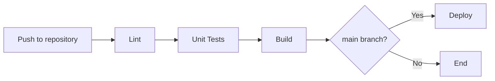
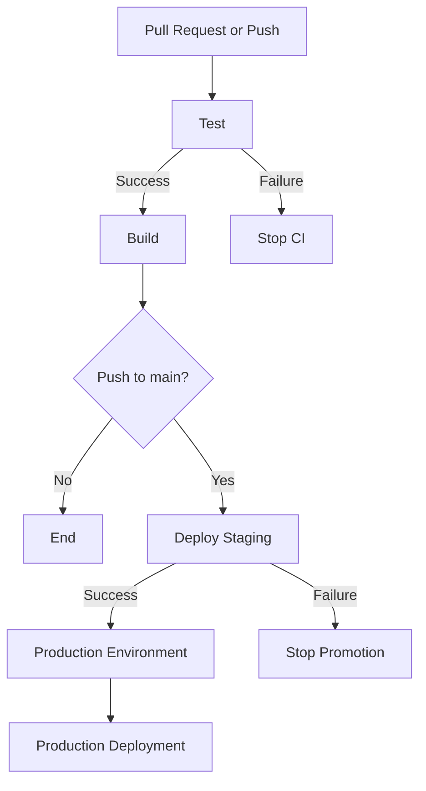
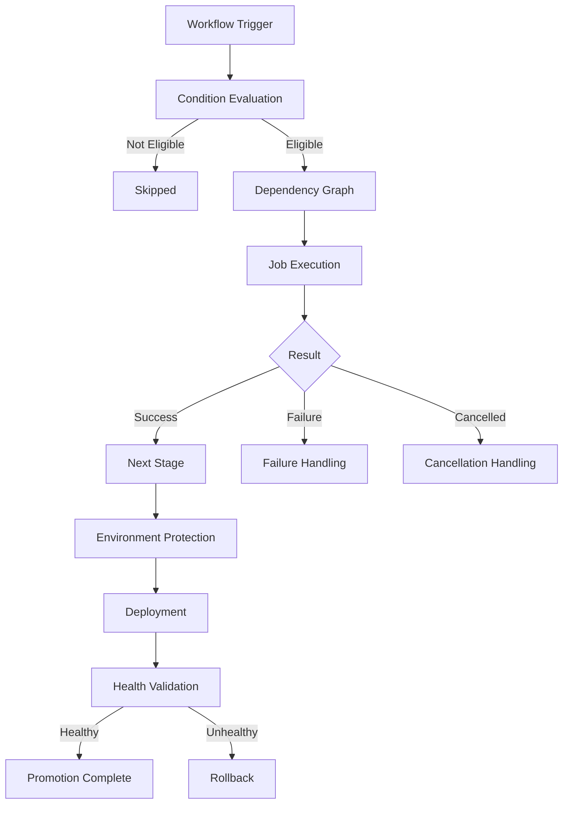

# 03- Conditions and Status Functions

## Overview

GitHub Actions conditions control whether jobs and steps execute based on the current workflow state, event data, outputs, contexts, and previous execution results.

The primary mechanism is the `if` expression:

```yaml
jobs:
  deploy:
    if: ${{ github.ref == 'refs/heads/main' }}
    runs-on: ubuntu-latest
    steps:
      - name: Deploy
        run: ./scripts/deploy.sh
```

Conditions become important as workflows move beyond simple linear execution. Production pipelines commonly need to:

- Run deployment only from specific branches.
- Execute cleanup after failures.
- Run security scans only for relevant changes.
- Continue one part of a pipeline while another part fails.
- Skip expensive jobs when they are not required.
- Execute rollback logic after deployment failures.
- Coordinate fan-out/fan-in workflows.
- Prevent production deployment unless all required jobs succeed.
- Handle manual and reusable workflow inputs.
- Distinguish failure, cancellation, success, and skipped states.

A condition is therefore part of the workflow's control plane. Incorrect conditions can cause a deployment to be skipped, execute unexpectedly, or hide an underlying failure.

---

## Conditions in GitHub Actions

A condition is normally defined with `if:`.

```yaml
jobs:
  test:
    runs-on: ubuntu-latest
    steps:
      - name: Run integration tests
        if: ${{ github.event_name == 'pull_request' }}
        run: pytest -m integration
```

Conditions can be applied at different levels.

| Level | Scope | Typical Use |
|---|---|---|
| Job | Entire job | Deploy only from `main` |
| Step | Individual step | Upload logs after failure |
| Matrix job | Matrix job instances | Run a particular combination |
| Reusable workflow | Workflow invocation | Control workflow behavior through inputs |

The scope matters because a skipped job can affect downstream jobs that depend on it through `needs`.

---

## `if` Conditions

The `if` keyword accepts GitHub Actions expressions.

```yaml
jobs:
  deploy:
    if: ${{ github.ref == 'refs/heads/main' }}
    runs-on: ubuntu-latest
    steps:
      - name: Deploy
        run: ./scripts/deploy.sh
```

For most `if` expressions, `${{ }}` may be omitted because GitHub Actions evaluates the value as an expression automatically.

```yaml
jobs:
  deploy:
    if: github.ref == 'refs/heads/main'
```

Using `${{ }}` explicitly can make the expression boundary easier to recognize, particularly in complex workflows.

### Combining Conditions

Logical operators can be used to construct more precise execution rules.

```yaml
jobs:
  deploy:
    if: ${{ github.ref == 'refs/heads/main' && github.event_name == 'push' }}
    runs-on: ubuntu-latest
    steps:
      - name: Deploy
        run: ./scripts/deploy.sh
```

Common operators include:

| Operator | Meaning | Example |
|---|---|---|
| `==` | Equal | `github.ref == 'refs/heads/main'` |
| `!=` | Not equal | `github.event_name != 'pull_request'` |
| `&&` | Logical AND | `a && b` |
| `||` | Logical OR | `a || b` |
| `!` | Logical NOT | `!cancelled()` |
| `>` | Greater than | `steps.check.outputs.count > 0` |
| `<` | Less than | `matrix.python < '3.13'` |
| `>=` | Greater than or equal | `value >= 1` |
| `<=` | Less than or equal | `value <= 10` |

Prefer readable expressions over deeply nested boolean logic.

---

## Step-Level Conditions

A step can be conditionally executed without affecting the rest of the job.

```yaml
steps:
  - name: Run tests
    id: tests
    run: pytest

  - name: Upload test results
    if: ${{ failure() }}
    uses: actions/upload-artifact@v4
    with:
      name: test-results
      path: test-results/
```

The first step can fail while the second step still executes because `failure()` changes the default success-only behavior.

This pattern is useful for diagnostics, logs, reports, and cleanup.

---

## Job-Level Conditions

A job-level condition determines whether the entire job is scheduled.

```yaml
jobs:
  deploy:
    if: ${{ github.ref == 'refs/heads/main' }}
    runs-on: ubuntu-latest

    steps:
      - uses: actions/checkout@v4

      - name: Deploy
        run: ./scripts/deploy.sh
```

Job-level conditions are particularly useful for deployment boundaries.



A production deployment should generally have explicit conditions rather than relying on an accidental branch layout.

---

## Conditions and `needs`

`needs` creates dependencies between jobs.

```yaml
jobs:
  test:
    runs-on: ubuntu-latest
    steps:
      - run: pytest

  build:
    needs: test
    runs-on: ubuntu-latest
    steps:
      - run: docker build -t backend .
```

By default, a job that `needs` another job runs only when its dependencies complete successfully.

```text
test
  │
  ▼
build
```

If `test` fails, `build` is normally skipped.

This default behavior provides an important safety property for CI/CD pipelines:

```text
Tests fail
    ↓
Build does not run
    ↓
Deployment does not run
```

---

## Using `needs.<job>.result`

The `needs` context exposes the result of a dependency.

```yaml
jobs:
  test:
    runs-on: ubuntu-latest
    steps:
      - run: pytest

  diagnostics:
    needs: test
    if: ${{ failure() || needs.test.result == 'failure' }}
    runs-on: ubuntu-latest

    steps:
      - name: Collect diagnostics
        run: ./scripts/collect-diagnostics.sh
```

Possible job results include:

- `success`
- `failure`
- `cancelled`
- `skipped`

A downstream job can use these values to implement explicit workflow behavior.

---

## Status Check Functions

GitHub Actions provides status check functions that are particularly important when overriding the default success-only behavior.

The main functions are:

| Function | Purpose |
|---|---|
| `success()` | All required previous steps/jobs succeeded |
| `failure()` | A previous step/job failed |
| `cancelled()` | The workflow or job was cancelled |
| `always()` | Attempts to run regardless of previous status |

These functions should be treated as workflow-control primitives rather than ordinary utility functions.

---

## `success()`

`success()` evaluates whether the preceding required execution path succeeded.

```yaml
steps:
  - name: Run tests
    run: pytest

  - name: Build application
    if: ${{ success() }}
    run: docker build -t backend .
```

For many normal steps, explicitly writing `success()` is unnecessary because the default behavior is effectively success-only execution.

This:

```yaml
- name: Build
  run: docker build -t backend .
```

already follows the normal success-dependent execution model.

Therefore, use `success()` when its explicit presence improves the control logic.

---

## `failure()`

`failure()` is useful for error handling and diagnostics.

```yaml
steps:
  - name: Run tests
    run: pytest

  - name: Upload failure logs
    if: ${{ failure() }}
    uses: actions/upload-artifact@v4
    with:
      name: failure-logs
      path: logs/
```

A common production pattern is:

```text
Execute operation
      │
      ├── success → continue
      │
      └── failure → collect diagnostics
```

### Failure Handling Example

```yaml
jobs:
  test:
    runs-on: ubuntu-latest

    steps:
      - uses: actions/checkout@v4

      - name: Install dependencies
        run: pip install -r requirements.txt

      - name: Run tests
        run: pytest --junitxml=test-results.xml

      - name: Upload test report
        if: ${{ failure() }}
        uses: actions/upload-artifact@v4
        with:
          name: failed-test-report
          path: test-results.xml
```

This keeps diagnostic behavior separate from the primary test execution.

---

## `always()`

`always()` is commonly used when a step should be attempted regardless of whether an earlier step succeeded or failed.

```yaml
steps:
  - name: Run tests
    run: pytest

  - name: Collect logs
    if: ${{ always() }}
    run: ./scripts/collect-logs.sh
```

It is useful for:

- Diagnostic collection
- Cleanup
- Test reports
- Debug information
- Uploading failure artifacts
- Gathering service logs

However, `always()` should not be used indiscriminately.

A workflow can be cancelled, and cancellation can prevent execution even when a condition uses `always()`. `always()` does not mean "the platform guarantees this step will execute under every possible termination condition."

For cancellation-sensitive cleanup, reason about the complete workflow lifecycle rather than assuming `always()` provides an unconditional guarantee.

---

## `cancelled()`

`cancelled()` detects cancellation.

```yaml
steps:
  - name: Notify cancellation
    if: ${{ cancelled() }}
    run: ./scripts/notify-cancellation.sh
```

This can be useful when a workflow contains explicit cancellation handling.

A common scenario is deployment concurrency:

```text
Deployment A
     │
     ├── running
     │
     └── cancelled because Deployment B superseded it
```

A cancellation-aware workflow can distinguish this from an actual deployment failure.

---

## Combining Status Functions

Status functions can be combined with ordinary expressions.

```yaml
steps:
  - name: Collect diagnostics
    if: ${{ failure() && !cancelled() }}
    run: ./scripts/collect-diagnostics.sh
```

This expresses:

```text
Run diagnostics if:
    a previous operation failed
    AND
    the workflow was not cancelled
```

This is often more precise than using `always()`.

---

## Status Functions and Default Success Behavior

One of the most important GitHub Actions concepts is that normal steps and jobs are success-dependent.

Consider:

```yaml
steps:
  - name: Test
    run: pytest

  - name: Build
    run: docker build -t backend .

  - name: Deploy
    run: ./deploy.sh
```

The intended dependency is:

```text
Test
  │
  ▼
Build
  │
  ▼
Deploy
```

If `Test` fails, later steps do not normally execute.

A condition such as:

```yaml
if: ${{ failure() }}
```

changes the normal behavior for that particular step.

This distinction is critical when reviewing a workflow because adding a status function can intentionally bypass the normal failure propagation path.

---

## `continue-on-error`

`continue-on-error` controls whether a failed step or job should cause the workflow to fail.

### Step-Level

```yaml
steps:
  - name: Optional lint check
    continue-on-error: true
    run: ./scripts/experimental-lint.sh

  - name: Run tests
    run: pytest
```

The lint step may fail without causing the job itself to fail.

### Job-Level

```yaml
jobs:
  experimental:
    continue-on-error: true
    runs-on: ubuntu-latest

    steps:
      - run: ./scripts/experimental-check.sh
```

Job-level behavior is particularly important with matrix workflows because a failing experimental matrix entry can otherwise affect the entire strategy.

### When to Use

Reasonable use cases include:

- Experimental checks
- Non-blocking diagnostics
- Compatibility testing
- Informational quality gates

Avoid using it to hide failures in:

- Production deployment
- Security scanning
- Database migrations
- Infrastructure changes
- Required integration tests

A production pipeline should make failure states visible rather than converting them into apparent success.

---

## `continue-on-error` vs `failure()`

These mechanisms solve different problems.

| Mechanism | Purpose |
|---|---|
| `continue-on-error` | Controls whether failure propagates |
| `failure()` | Detects a failure for conditional execution |
| `always()` | Allows a step to be attempted despite normal failure propagation |
| `cancelled()` | Detects cancellation |
| `success()` | Explicitly checks successful execution |

For example:

```yaml
steps:
  - name: Optional security experiment
    id: experiment
    continue-on-error: true
    run: ./scripts/experiment.sh

  - name: Report experiment failure
    if: ${{ steps.experiment.outcome == 'failure' }}
    run: echo "Experimental check failed"
```

The first step is allowed to fail, while the second step can still inspect the outcome.

---

## `outcome` vs `conclusion`

Step results can expose different execution semantics.

A step can be configured with `continue-on-error`, meaning its execution failed while the overall job is allowed to continue.

This distinction matters when building reporting logic.

```yaml
steps:
  - name: Optional check
    id: check
    continue-on-error: true
    run: ./scripts/check.sh

  - name: Report check failure
    if: ${{ steps.check.outcome == 'failure' }}
    run: echo "The optional check failed."
```

The important engineering principle is:

```text
Execution result
        ↓
Policy applied
        ↓
Workflow conclusion
```

Do not assume that "the workflow continued" means "the previous step succeeded."

---

## Conditions with Contexts

Conditions become powerful when combined with GitHub Actions contexts.

### Branch-Based Condition

```yaml
if: ${{ github.ref == 'refs/heads/main' }}
```

### Event-Based Condition

```yaml
if: ${{ github.event_name == 'pull_request' }}
```

### Repository-Based Condition

```yaml
if: ${{ github.repository == 'my-org/backend-service' }}
```

### Input-Based Condition

```yaml
if: ${{ inputs.environment == 'production' }}
```

### Matrix-Based Condition

```yaml
if: ${{ matrix.python-version == '3.13' }}
```

### Environment Variable Condition

```yaml
if: ${{ env.DEPLOY_ENABLED == 'true' }}
```

Conditions should reference explicit contexts rather than attempting to reconstruct state inside shell scripts.

---

## Conditions with Outputs

Step outputs are useful when one step calculates a decision consumed by another.

```yaml
steps:
  - name: Determine deployment
    id: decision
    shell: bash
    run: |
      if [[ "${GITHUB_REF_NAME}" == "main" ]]; then
        echo "deploy=true" >> "$GITHUB_OUTPUT"
      else
        echo "deploy=false" >> "$GITHUB_OUTPUT"
      fi

  - name: Deploy
    if: ${{ steps.decision.outputs.deploy == 'true' }}
    run: ./scripts/deploy.sh
```

This is preferable when the decision requires actual computation rather than a simple GitHub expression.

However, if GitHub Actions already exposes the required information, prefer the native context:

```yaml
if: ${{ github.ref == 'refs/heads/main' }}
```

rather than creating a shell step unnecessarily.

---

## Conditions with Job Outputs

Job outputs allow one job to make a decision for another job.

```yaml
jobs:
  determine:
    runs-on: ubuntu-latest
    outputs:
      deploy: ${{ steps.decision.outputs.deploy }}

    steps:
      - id: decision
        run: |
          echo "deploy=true" >> "$GITHUB_OUTPUT"

  deploy:
    needs: determine
    if: ${{ needs.determine.outputs.deploy == 'true' }}
    runs-on: ubuntu-latest

    steps:
      - run: ./scripts/deploy.sh
```

The data flow is:

```text
determine job
     │
     │ GITHUB_OUTPUT
     ▼
job output
     │
     │ needs.determine.outputs.deploy
     ▼
deploy condition
```

This pattern is useful for dynamic pipeline decisions.

---

## Conditions and Dynamic Matrices

Conditions can be combined with matrix strategies.

```yaml
jobs:
  test:
    strategy:
      matrix:
        python-version:
          - '3.11'
          - '3.12'
          - '3.13'

    runs-on: ubuntu-latest

    steps:
      - uses: actions/checkout@v4

      - name: Run tests
        uses: actions/setup-python@v6
        with:
          python-version: ${{ matrix.python-version }}

      - run: pytest
```

A condition can target a particular matrix entry:

```yaml
- name: Run compatibility-only check
  if: ${{ matrix.python-version == '3.11' }}
  run: ./scripts/compatibility-check.sh
```

Use this carefully. If behavior is genuinely specific to a matrix dimension, make that relationship explicit rather than creating complicated condition trees.

---

## Conditions and Pull Requests

Pull requests often require different behavior from pushes.

```yaml
jobs:
  deploy:
    if: ${{ github.event_name == 'push' && github.ref == 'refs/heads/main' }}
    runs-on: ubuntu-latest

    steps:
      - run: ./scripts/deploy.sh
```

This prevents the same deployment job from executing for pull request validation.

A common production model is:

```text
Pull Request
    │
    ├── Lint
    ├── Unit Tests
    ├── Integration Tests
    └── Security Scan

Merge to main
    │
    ├── Build
    ├── Publish Artifact
    └── Deploy
```

The condition is part of the deployment boundary.

---

## Conditions and Environments

Deployment environments can provide additional protection around production.

```yaml
jobs:
  deploy-production:
    if: ${{ github.ref == 'refs/heads/main' }}
    environment: production
    runs-on: ubuntu-latest

    steps:
      - name: Deploy
        run: ./scripts/deploy.sh
```

The environment can be configured with:

- Required reviewers
- Environment secrets
- Environment variables
- Deployment branch restrictions
- Deployment history

A branch condition and an environment protection rule solve different problems.

```text
Workflow condition
    ↓
Should the job be eligible?

Environment protection
    ↓
Is deployment authorized to proceed?
```

Use both when production deployment requires strong controls.

---

## Conditions and Manual Inputs

Manual workflows can define inputs.

```yaml
name: Deploy

on:
  workflow_dispatch:
    inputs:
      environment:
        description: Deployment environment
        required: true
        type: choice
        options:
          - staging
          - production

jobs:
  deploy:
    runs-on: ubuntu-latest
    environment: ${{ inputs.environment }}

    steps:
      - name: Deploy
        run: ./scripts/deploy.sh "${{ inputs.environment }}"
```

A production-specific condition can be added when different controls are required.

```yaml
- name: Production deployment
  if: ${{ inputs.environment == 'production' }}
  run: ./scripts/deploy-production.sh
```

For important production controls, prefer environment protection rather than relying solely on a user-provided input.

---

## Conditions and Reusable Workflows

Reusable workflows can expose inputs that affect execution.

Caller:

```yaml
jobs:
  deploy:
    uses: my-org/platform/.github/workflows/deploy.yml@v1
    with:
      environment: production
```

Reusable workflow:

```yaml
on:
  workflow_call:
    inputs:
      environment:
        required: true
        type: string

jobs:
  deploy:
    if: ${{ inputs.environment == 'production' }}
    runs-on: ubuntu-latest

    steps:
      - name: Deploy
        run: ./scripts/deploy.sh
```

This allows a centrally maintained workflow to support multiple repositories while retaining explicit control over execution paths.

---

## Conditions and Concurrency

Conditions determine whether execution is eligible. Concurrency determines whether competing executions are allowed to proceed simultaneously.

Consider two production deployments:

```text
Deployment A → production
Deployment B → production
```

Without appropriate concurrency controls, both could potentially modify production simultaneously.

```yaml
concurrency:
  group: production-deployment
  cancel-in-progress: false
```

This ensures that deployments sharing the same concurrency group do not run concurrently.

For pull requests, a different strategy may be appropriate:

```yaml
concurrency:
  group: pr-${{ github.event.pull_request.number }}
  cancel-in-progress: true
```

The latest validation can replace older validation for the same pull request.

The important distinction is:

```text
if:
    Should this execution happen?

concurrency:
    Can this execution happen at the same time as another execution?
```

These mechanisms complement each other.

---

## Conditions for Failure Handling

A production pipeline should explicitly separate normal execution from failure handling.

```yaml
jobs:
  deploy:
    runs-on: ubuntu-latest

    steps:
      - name: Deploy
        id: deployment
        run: ./scripts/deploy.sh

      - name: Validate deployment
        id: validation
        run: ./scripts/health-check.sh

      - name: Roll back
        if: ${{ failure() }}
        run: ./scripts/rollback.sh

      - name: Publish diagnostics
        if: ${{ failure() }}
        uses: actions/upload-artifact@v4
        with:
          name: deployment-diagnostics
          path: diagnostics/
```

A more robust production design should ensure rollback itself is observable and protected from accidental execution.

For example, if a deployment job contains unrelated steps that can fail, using a blanket `failure()` rollback may be too broad.

A better design can use explicit outputs and job boundaries:

```text
Build
  │
  ▼
Deploy
  │
  ▼
Health Check
  │
  ├── success → Continue
  │
  └── failure → Rollback
```

This makes the failure domain explicit.

---

## Conditions and Rollback Design

Rollback logic should be tied to a well-defined deployment state.

Avoid:

```yaml
- name: Rollback
  if: ${{ failure() }}
  run: ./rollback.sh
```

when the job contains many unrelated operations.

A failure in a notification step should not necessarily trigger a production rollback.

Prefer isolating deployment and validation:

```yaml
jobs:
  deploy:
    runs-on: ubuntu-latest

    steps:
      - name: Deploy immutable artifact
        run: ./scripts/deploy.sh

  validate:
    needs: deploy
    runs-on: ubuntu-latest

    steps:
      - name: Validate deployment
        run: ./scripts/health-check.sh

  rollback:
    needs: validate
    if: ${{ failure() }}
    runs-on: ubuntu-latest

    steps:
      - name: Roll back deployment
        run: ./scripts/rollback.sh
```

The architecture is clearer:

```text
Deploy
  │
  ▼
Validate
  │
  ├── success
  │
  └── failure
        │
        ▼
     Rollback
```

The exact rollback design should also account for workflow cancellation, concurrent deployments, immutable artifacts, database migrations, and external dependencies.

---

## Conditions and Skipped Jobs

A skipped job is not equivalent to a failed job.

Consider:

```yaml
jobs:
  security:
    if: ${{ github.event_name == 'pull_request' }}
    runs-on: ubuntu-latest
    steps:
      - run: ./security-scan.sh

  deploy:
    needs: security
    runs-on: ubuntu-latest
    steps:
      - run: ./deploy.sh
```

If the workflow is triggered by a push and `security` is skipped, `deploy` can also be affected because its dependency did not complete successfully.

This is a common source of unexpected workflow behavior.

When designing dependent jobs, explicitly decide whether a skipped dependency should prevent downstream execution.

---

## Handling Skipped Dependencies

When a downstream job must inspect dependency results, combine `needs` with an appropriate condition.

```yaml
jobs:
  security:
    if: ${{ github.event_name == 'pull_request' }}
    runs-on: ubuntu-latest
    steps:
      - run: ./security-scan.sh

  deploy:
    needs: security
    if: ${{ always() && needs.security.result != 'failure' }}
    runs-on: ubuntu-latest

    steps:
      - run: ./deploy.sh
```

This pattern should be used carefully.

`always()` changes the default dependency behavior, so every allowed result should be considered explicitly.

A safer mental model is:

```text
Dependency result
       │
       ├── success
       ├── failure
       ├── cancelled
       └── skipped
              │
              ▼
        Explicit policy
```

Do not use `always()` simply because a downstream job unexpectedly skipped.

First determine whether the dependency graph itself is correct.

---

## Conditions and Cancellation

Cancellation is different from failure.

Consider:

```text
Workflow running
      │
      ├── test fails
      │      └── failure
      │
      └── user cancels workflow
             └── cancelled
```

These states have different operational meanings.

| State | Meaning | Typical Response |
|---|---|---|
| Success | Execution completed successfully | Continue |
| Failure | An operation failed | Diagnose/rollback |
| Skipped | Condition/dependency prevented execution | Verify workflow logic |
| Cancelled | Execution was intentionally terminated | Stop safely |

Do not treat all non-success states as failures.

This is especially important for deployment workflows using concurrency:

```yaml
concurrency:
  group: production
  cancel-in-progress: true
```

A previous deployment may be cancelled because a newer deployment supersedes it. That is not necessarily an application failure.

---

## Conditions and Shell Commands Are Different

GitHub Actions expressions execute in the workflow engine.

Shell commands execute inside the runner.

This is an important boundary.

### GitHub Expression

```yaml
if: ${{ github.ref == 'refs/heads/main' }}
```

### Shell Command

```yaml
run: |
  if [[ "$GITHUB_REF_NAME" == "main" ]]; then
    ./deploy.sh
  fi
```

The first is evaluated by GitHub Actions before the step runs.

The second is evaluated by the shell on the runner.

Prefer GitHub expressions for workflow-level decisions and shell logic for application or operating-system logic.

---

## Expression Evaluation vs Runtime Execution

The workflow engine determines whether a step should run before invoking its shell command.

Conceptually:

```text
Workflow YAML
     │
     ▼
Expression evaluation
     │
     ├── condition false → step skipped
     │
     └── condition true
            │
            ▼
        Runner starts
            │
            ▼
        Shell executes
```

Therefore, this is not equivalent:

```yaml
if: ${{ env.DEPLOY == 'true' }}
run: ./deploy.sh
```

and:

```yaml
run: |
  if [[ "$DEPLOY" == "true" ]]; then
    ./deploy.sh
  fi
```

The first controls whether the GitHub Actions step exists in the execution path.

The second starts the step and lets the shell decide what to do.

---

## Security Considerations for Conditions

Conditions can use data originating from GitHub events.

Some event values can be controlled by users.

Examples include:

- Pull request titles
- Issue titles
- Branch names
- Commit messages
- Issue content
- User-provided workflow inputs

Do not blindly inject untrusted values into shell commands.

Avoid patterns such as:

```yaml
- name: Process PR title
  run: echo "${{ github.event.pull_request.title }}"
```

A safer approach is to pass the value through an environment variable and quote it appropriately:

```yaml
- name: Process PR title
  env:
    PR_TITLE: ${{ github.event.pull_request.title }}
  run: |
    printf '%s\n' "$PR_TITLE"
```

The condition itself may safely inspect data:

```yaml
if: ${{ contains(github.event.pull_request.title, '[deploy]') }}
```

but authorization decisions should not rely solely on user-controlled text.

For sensitive operations, combine conditions with:

- Protected branches
- Environment protection
- Least-privilege permissions
- Trusted event types
- Manual approval
- Deployment policies

---

## `pull_request` vs `pull_request_target`

Conditions do not remove the security boundary associated with an event.

A workflow using:

```yaml
on:
  pull_request:
```

and one using:

```yaml
on:
  pull_request_target:
```

have materially different security considerations.

`pull_request_target` executes in the context of the base repository and can have access to repository resources and secrets that are not normally available to untrusted fork code.

Do not use `pull_request_target` as a simple replacement for `pull_request` when the workflow checks out or executes untrusted pull request code.

A dangerous design is:

```text
pull_request_target
       │
       ▼
checkout attacker-controlled code
       │
       ▼
execute scripts
       │
       ▼
repository secrets / elevated permissions
```

Conditions can restrict when a workflow runs, but they do not make untrusted code trusted.

---

## Conditions and Secrets

Conditions can determine whether a deployment job runs, but secrets should remain protected by the appropriate repository or environment boundary.

Example:

```yaml
jobs:
  deploy:
    if: ${{ github.ref == 'refs/heads/main' }}
    environment: production
    runs-on: ubuntu-latest

    steps:
      - name: Deploy
        env:
          DEPLOY_TOKEN: ${{ secrets.DEPLOY_TOKEN }}
        run: ./scripts/deploy.sh
```

For production, combine:

```text
Branch restriction
      +
Workflow condition
      +
Environment protection
      +
Least-privilege permissions
      +
Secret isolation
```

Do not treat `if` as an authentication or authorization mechanism by itself.

---

## Practical Production Pipeline

A realistic backend pipeline can use conditions to create separate paths for pull requests and production deployment.

```yaml
name: Backend CI/CD

on:
  pull_request:
  push:
    branches:
      - main

permissions:
  contents: read

jobs:
  test:
    runs-on: ubuntu-latest

    steps:
      - uses: actions/checkout@v4

      - name: Set up Python
        uses: actions/setup-python@v6
        with:
          python-version: '3.12'
          cache: pip

      - name: Install dependencies
        run: pip install -r requirements.txt

      - name: Run tests
        run: pytest

  build:
    needs: test
    if: ${{ needs.test.result == 'success' }}
    runs-on: ubuntu-latest

    steps:
      - uses: actions/checkout@v4

      - name: Build image
        run: docker build -t backend:${{ github.sha }} .

  deploy-staging:
    needs: build
    if: ${{ github.event_name == 'push' && github.ref == 'refs/heads/main' }}
    environment: staging
    runs-on: ubuntu-latest

    steps:
      - uses: actions/checkout@v4

      - name: Deploy staging
        run: ./scripts/deploy.sh staging

  deploy-production:
    needs: deploy-staging
    if: ${{ needs.deploy-staging.result == 'success' }}
    environment: production
    runs-on: ubuntu-latest

    concurrency:
      group: production-deployment
      cancel-in-progress: false

    steps:
      - uses: actions/checkout@v4

      - name: Deploy production
        run: ./scripts/deploy.sh production
```

The execution model is:



The exact implementation should additionally use immutable build artifacts so that production promotes the artifact already validated in staging instead of rebuilding it.

---

## Conditions with Artifact Promotion

A production-grade deployment should ideally follow:

```text
Source
  │
  ▼
Test
  │
  ▼
Build once
  │
  ▼
Immutable artifact
  │
  ├── Staging
  │
  └── Production
```

Conditions then control promotion rather than rebuilding:

```yaml
jobs:
  promote-production:
    needs: deploy-staging
    if: ${{ needs.deploy-staging.result == 'success' }}
    environment: production
    runs-on: ubuntu-latest

    steps:
      - name: Promote tested artifact
        run: ./scripts/promote.sh "${{ github.sha }}"
```

This reduces the risk that staging and production receive different binaries or container layers.

---

## Conditions in Fan-Out and Fan-In Workflows

Matrix testing creates fan-out.

```text
              ┌── Python 3.11
              │
Build ────────┼── Python 3.12
              │
              └── Python 3.13
```

A downstream job can depend on the matrix job:

```yaml
jobs:
  test:
    strategy:
      matrix:
        python-version:
          - '3.11'
          - '3.12'
          - '3.13'

    runs-on: ubuntu-latest

    steps:
      - uses: actions/checkout@v4
      - uses: actions/setup-python@v6
        with:
          python-version: ${{ matrix.python-version }}
      - run: pytest

  build:
    needs: test
    if: ${{ needs.test.result == 'success' }}
    runs-on: ubuntu-latest

    steps:
      - run: docker build -t backend:${{ github.sha }} .
```

This creates a fan-in point:

```text
Python 3.11 ─┐
Python 3.12 ─┼── Test Matrix ── Build
Python 3.13 ─┘
```

The build should not proceed if a required matrix entry fails.

---

## Conditions and `hashFiles()`

`hashFiles()` is primarily useful for expressions involving dependency or source changes.

For example:

```yaml
jobs:
  dependency-check:
    if: ${{ hashFiles('requirements*.txt') != '' }}
    runs-on: ubuntu-latest

    steps:
      - uses: actions/checkout@v4
      - run: pip install -r requirements.txt
```

A more common use is as part of cache keys:

```yaml
- name: Set up Python
  uses: actions/setup-python@v6
  with:
    python-version: '3.12'
    cache: pip
    cache-dependency-path: requirements.txt
```

Avoid creating unnecessarily complex conditions around cache state. Caching should optimize execution, not determine whether required correctness checks run.

---

## Common Conditional Patterns

### Deploy Only from Main

```yaml
if: ${{ github.ref == 'refs/heads/main' }}
```

### Deploy Only on Push

```yaml
if: ${{ github.event_name == 'push' }}
```

### Pull Request Only

```yaml
if: ${{ github.event_name == 'pull_request' }}
```

### Production Input

```yaml
if: ${{ inputs.environment == 'production' }}
```

### Run After Failure

```yaml
if: ${{ failure() }}
```

### Run Unless Cancelled

```yaml
if: ${{ !cancelled() }}
```

### Specific Dependency Succeeded

```yaml
if: ${{ needs.build.result == 'success' }}
```

### Multiple Requirements

```yaml
if: ${{ github.ref == 'refs/heads/main' && needs.test.result == 'success' }}
```

### Failure Diagnostics

```yaml
if: ${{ failure() && !cancelled() }}
```

---

## Conditions vs Shell Logic

Use the GitHub Actions expression engine when the decision concerns workflow orchestration.

Use shell logic when the decision concerns command execution inside the runner.

| Requirement | Preferred Mechanism |
|---|---|
| Branch restriction | `if` |
| Event restriction | `if` |
| Job dependency | `needs` |
| Job result | `needs.<job>.result` |
| Step output | `steps.<id>.outputs.<name>` |
| Matrix-specific behavior | `matrix` + `if` |
| Production environment | `environment` + protection |
| Deployment serialization | `concurrency` |
| File processing | Shell/Python |
| Complex application logic | Script/application code |
| Multi-command deployment procedure | Deployment script |

Avoid embedding large business rules directly into YAML expressions.

If an expression becomes difficult to review:

```yaml
if: ${{ (github.ref == 'refs/heads/main' || github.ref == 'refs/heads/release') && github.event_name == 'push' && needs.test.result == 'success' && needs.security.result == 'success' }}
```

consider moving decision logic into a dedicated step that emits a clear output.

---

## Debugging Conditions

Conditional failures are often difficult because a skipped step may not produce an obvious runtime error.

Start with:

1. Verify the triggering event.
2. Verify the branch and tag.
3. Inspect job dependencies.
4. Inspect `needs.<job>.result`.
5. Inspect step outputs.
6. Inspect environment and repository variables.
7. Verify manual inputs.
8. Check matrix values.
9. Check concurrency behavior.
10. Determine whether the execution was skipped, failed, or cancelled.

A useful diagnostic step is:

```yaml
- name: Show workflow state
  if: ${{ always() }}
  env:
    EVENT_NAME: ${{ github.event_name }}
    REF: ${{ github.ref }}
    SHA: ${{ github.sha }}
  run: |
    printf 'event=%s\n' "$EVENT_NAME"
    printf 'ref=%s\n' "$REF"
    printf 'sha=%s\n' "$SHA"
```

For job dependencies:

```yaml
- name: Inspect dependency result
  if: ${{ always() }}
  run: |
    echo "Test result: ${{ needs.test.result }}"
```

Avoid dumping entire event payloads when they may contain sensitive or unnecessary information.

---

## Troubleshooting by Failure Domain

| Symptom | Possible Cause | Isolation Strategy | Corrective Action |
|---|---|---|---|
| Step unexpectedly skipped | `if` evaluates false | Inspect referenced contexts | Simplify and validate expression |
| Job unexpectedly skipped | Dependency failed/skipped | Check `needs.<job>.result` | Correct dependency or condition |
| Failure handler does not run | Wrong status condition | Check `failure()` scope | Adjust condition |
| Cleanup does not execute after cancellation | Workflow was cancelled | Inspect cancellation behavior | Design cancellation-aware cleanup |
| Deployment runs on PR | Missing event/branch condition | Inspect event name/ref | Restrict deployment job |
| Deployment does not run | Dependency skipped | Inspect dependency graph | Correct `needs` and condition |
| Matrix entry behaves differently | Matrix-specific condition | Inspect `matrix` values | Make matrix logic explicit |
| Manual deployment path wrong | Incorrect input condition | Inspect `inputs` | Validate input and environment |
| Rollback triggers unexpectedly | Broad `failure()` scope | Identify which step failed | Isolate deployment/validation jobs |
| Deployment races occur | Missing concurrency | Inspect concurrent runs | Add environment-specific concurrency |

The debugging model should remain:

```text
Symptom
   ↓
Possible Causes
   ↓
Isolation Strategy
   ↓
Commands / Checks
   ↓
Root Cause
   ↓
Corrective Action
   ↓
Prevention
```

---

## Production Design Principles

### Make Deployment Conditions Explicit

Avoid relying on accidental workflow structure.

Prefer:

```yaml
if: ${{ github.event_name == 'push' && github.ref == 'refs/heads/main' }}
```

over assuming only `main` will ever trigger a workflow.

### Separate Eligibility from Authorization

A condition answers:

```text
Should this job execute?
```

Environment protection answers:

```text
Is this deployment allowed to proceed?
```

These are different controls.

### Keep Conditions Small

Prefer:

```yaml
if: ${{ needs.tests.result == 'success' }}
```

over deeply nested expressions that encode an entire release policy.

### Use Outputs for Computed Decisions

When a decision requires computation, generate an explicit output:

```yaml
echo "deploy=true" >> "$GITHUB_OUTPUT"
```

and consume it through:

```yaml
if: ${{ steps.decision.outputs.deploy == 'true' }}
```

### Do Not Hide Required Failures

Avoid:

```yaml
continue-on-error: true
```

for required deployment gates merely to keep the pipeline green.

A green workflow should represent a meaningful successful state.

### Treat Cancellation as a Separate State

Cancellation can result from:

- Manual cancellation
- Concurrency replacement
- Administrative action
- Workflow termination

Do not automatically classify cancellation as application failure.

---

## Common Mistakes and Pitfalls

### Using `always()` Everywhere

Bad:

```yaml
if: ${{ always() }}
```

on nearly every step.

Why it is problematic:

- It weakens normal failure propagation.
- It makes the workflow harder to reason about.
- It can execute operations after upstream failures that should have blocked them.
- It can produce misleading pipeline behavior.

Use it primarily for diagnostics, cleanup, or carefully designed post-processing.

### Using `failure()` for Every Rollback

Bad:

```yaml
- name: Rollback
  if: ${{ failure() }}
  run: ./rollback.sh
```

if unrelated steps can fail.

A notification failure should not necessarily roll back an otherwise healthy deployment.

Isolate deployment and health validation into explicit failure domains.

### Assuming Skipped Means Success

A skipped job is not a successful job.

```text
success != skipped
```

When a downstream job depends on a skipped job, inspect the dependency graph and condition semantics.

### Confusing `continue-on-error` with Success

A workflow continuing after a failure does not mean the failed operation succeeded.

Track the actual outcome when reporting or making decisions.

### Putting Business Logic in YAML

Large expressions are difficult to test and maintain.

Move complex decisions into version-controlled scripts or application code and expose a small output to the workflow.

### Using User-Controlled Data as Authorization

A condition such as:

```yaml
if: ${{ contains(github.event.pull_request.title, '[deploy]') }}
```

can be useful as a routing signal, but the text of a pull request title should not itself authorize a sensitive production deployment.

### Ignoring Concurrency

Correct conditions do not prevent two eligible deployments from running simultaneously.

Use:

```yaml
concurrency:
  group: production-deployment
  cancel-in-progress: false
```

for deployment serialization when required.

---

## Security Checklist for Conditions

Before allowing a condition to control a sensitive operation, verify:

- The triggering event is trusted.
- The branch or tag restriction is explicit.
- User-controlled values are not treated as authorization.
- Production environments have appropriate protection.
- Secrets are not exposed to untrusted code.
- `GITHUB_TOKEN` permissions are minimal.
- `pull_request_target` is used only with a clear security model.
- Third-party actions are trusted and appropriately pinned.
- Deployment concurrency is controlled.
- Rollback conditions are scoped to actual deployment failures.
- Cancellation behavior is understood.
- Skipped dependencies have deliberate downstream behavior.

---

## Senior-Level Engineering Scenarios

### Prevent Production Deployment from Pull Requests

```yaml
deploy:
  if: ${{ github.event_name == 'push' && github.ref == 'refs/heads/main' }}
```

Reasoning:

```text
Pull request
    ↓
Validation only

Merge to main
    ↓
Deployment eligible
```

---

### Run Diagnostics Only When Tests Fail

```yaml
- name: Run tests
  run: pytest

- name: Collect diagnostics
  if: ${{ failure() }}
  run: ./scripts/collect-diagnostics.sh
```

The diagnostic path should not obscure the original test failure.

---

### Run a Job After All Required Matrix Tests

```yaml
build:
  needs: test
  if: ${{ needs.test.result == 'success' }}
```

This creates a fan-in gate after the matrix completes.

---

### Allow an Experimental Check to Fail

```yaml
- name: Experimental compatibility check
  id: compatibility
  continue-on-error: true
  run: ./scripts/compatibility-check.sh

- name: Report compatibility failure
  if: ${{ steps.compatibility.outcome == 'failure' }}
  run: echo "Compatibility check failed."
```

This is appropriate only when the check is intentionally non-blocking.

---

### Serialize Production Deployments

```yaml
concurrency:
  group: production-deployment
  cancel-in-progress: false
```

This addresses a concurrency problem rather than a conditional execution problem.

---

### Promote Only After Staging Validation

```yaml
deploy-production:
  needs: deploy-staging
  if: ${{ needs.deploy-staging.result == 'success' }}
  environment: production
  runs-on: ubuntu-latest

  steps:
    - run: ./scripts/promote.sh
```

A protected production environment can then provide an additional approval boundary.

---

## Interview Traps

### Is `if` the Same as a Shell `if`?

No.

`if:` is evaluated by the GitHub Actions workflow engine. Shell `if` statements execute after the runner starts the step.

### Does `always()` Guarantee Execution?

No.

It changes normal condition behavior but does not mean the platform guarantees execution after every possible cancellation or termination condition.

### What Happens When a `needs` Job Fails?

A dependent job normally does not execute.

Use explicit conditions when downstream behavior must inspect or handle the dependency result.

### What Is the Difference Between Failure and Cancellation?

Failure indicates that an execution path failed. Cancellation indicates that execution was intentionally terminated or superseded.

### Does `continue-on-error` Mean the Step Succeeded?

No.

It changes failure propagation behavior. The step can still have failed.

### Should Rollback Use `failure()`?

Not blindly.

The rollback condition should correspond to the deployment failure domain rather than any arbitrary failure elsewhere in the job.

### Can `if` Protect Production Secrets?

Not by itself.

Security should use appropriate events, permissions, environments, protected branches, secret boundaries, and runner isolation.

### Does a Skipped Job Count as Success?

No.

`success`, `failure`, `cancelled`, and `skipped` represent different workflow states and should be handled deliberately.

---

## Production Control Model

A mature GitHub Actions deployment pipeline separates several independent concerns:



This model helps distinguish:

- Triggering
- Eligibility
- Dependency ordering
- Execution
- Failure propagation
- Cancellation
- Authorization
- Deployment validation
- Rollback

A senior engineer should be able to reason about each layer independently.

---

## Recommended Condition Design

For production workflows:

1. Keep branch and event eligibility explicit.
2. Use `needs` to model dependency relationships.
3. Use `failure()` primarily for failure-specific handling.
4. Use `always()` selectively for diagnostics and cleanup.
5. Treat cancellation as a distinct execution state.
6. Use `continue-on-error` only for intentionally non-blocking operations.
7. Use outputs for computed decisions.
8. Keep authorization separate from conditional routing.
9. Avoid large YAML expressions.
10. Make rollback conditions correspond to actual deployment failure domains.
11. Use concurrency for deployment serialization.
12. Inspect skipped dependencies when downstream jobs unexpectedly do not run.

---

## Key Takeaways

- GitHub Actions conditions control workflow eligibility and execution, while `needs`, concurrency, environments, and permissions solve different control-plane problems.
- `success()`, `failure()`, `always()`, and `cancelled()` have different semantics; `always()` does not guarantee execution after every cancellation or termination scenario.
- `continue-on-error` changes failure propagation but does not mean the underlying operation succeeded; use explicit outcomes when making subsequent decisions.
- Production deployment conditions should be combined with protected environments, least-privilege permissions, immutable artifacts, and concurrency controls rather than treated as authorization by themselves.
- Robust workflows distinguish success, failure, skipped, and cancelled states and design explicit behavior for each failure domain.