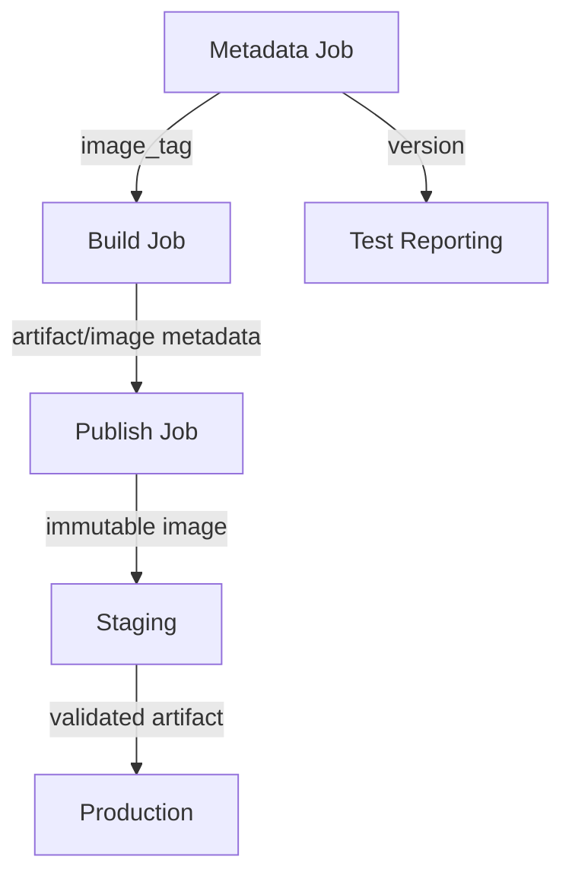
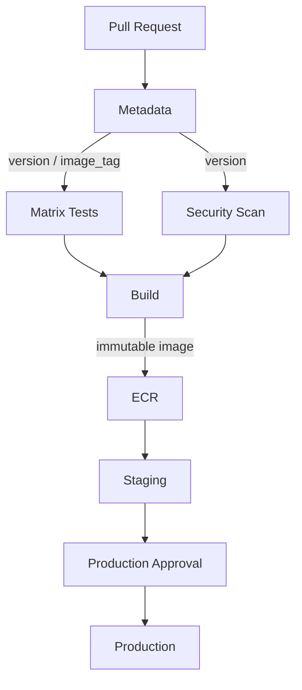

# 10- Job and Step Outputs

## Overview

GitHub Actions jobs are isolated execution units. A value created inside one step is not automatically available to another job, and shell variables do not automatically cross step or job boundaries.

GitHub Actions provides explicit output mechanisms for moving small pieces of structured state through a workflow:

```text
Step
 │
 │ $GITHUB_OUTPUT
 ▼
Step Output
 │
 │ job.outputs
 ▼
Job Output
 │
 │ needs.<job>.outputs
 ▼
Dependent Job
```

This makes outputs useful for passing:

- Generated version numbers
- Docker image tags
- Artifact names
- Deployment targets
- Test results
- Boolean decisions
- Resource identifiers
- Dynamically generated matrix definitions
- Structured JSON configuration

Outputs are particularly important when designing workflows as dependency graphs rather than as one large job.

A production pipeline might use outputs like this:

```text
Checkout
   │
   ▼
Build Metadata
   │
   ├── image_tag
   ├── version
   └── artifact_name
          │
          ▼
       Build
          │
          ▼
       Publish
          │
          ▼
      Deployment
```

The key principle is to make data flow explicit.

---

## Why Outputs Exist

Each GitHub Actions job normally runs in its own runner environment.

Consider:

```yaml
jobs:
  build:
    runs-on: ubuntu-latest

    steps:
      - name: Generate version
        run: |
          VERSION="1.4.2"
          echo "VERSION=$VERSION"

  deploy:
    needs: build
    runs-on: ubuntu-latest

    steps:
      - name: Deploy
        run: echo "$VERSION"
```

This does not work as intended.

The shell variable:

```text
VERSION
```

belongs to the process running the `Generate version` step. It is not automatically available to the `deploy` job.

Outputs provide the explicit contract:

```text
Producer
   │
   ▼
Output
   │
   ▼
Consumer
```

This makes dependencies easier to reason about and prevents workflows from relying on accidental runner state.

---

## Step Outputs

A step output is a value produced by one step and consumed by later steps in the same job.

The modern mechanism is:

```text
$GITHUB_OUTPUT
```

A step must have an `id` if another step needs to reference its outputs.

Example:

```yaml
jobs:
  build:
    runs-on: ubuntu-latest

    steps:
      - name: Generate version
        id: metadata
        shell: bash
        run: |
          version="1.4.2"
          echo "version=$version" >> "$GITHUB_OUTPUT"

      - name: Use version
        run: |
          echo "Building version ${{ steps.metadata.outputs.version }}"
```

The important relationship is:

```text
id: metadata
       │
       ▼
steps.metadata.outputs.version
```

---

## `$GITHUB_OUTPUT`

`$GITHUB_OUTPUT` is a file provided by GitHub Actions for setting step outputs.

The general pattern is:

```bash
echo "name=value" >> "$GITHUB_OUTPUT"
```

Example:

```yaml
- name: Generate image tag
  id: image
  run: |
    tag="${GITHUB_SHA::12}"
    echo "tag=$tag" >> "$GITHUB_OUTPUT"
```

A later step can consume it:

```yaml
- name: Build image
  run: |
    docker build -t "backend:${{ steps.image.outputs.tag }}" .
```

This is the supported modern mechanism for communicating step outputs.

---

## Why the Step Needs an ID

Without:

```yaml
id: image
```

there is no stable identifier for referencing the step output.

Correct:

```yaml
- name: Generate image tag
  id: image
  run: |
    echo "tag=abc123" >> "$GITHUB_OUTPUT"
```

Then:

```yaml
${{ steps.image.outputs.tag }}
```

The reference follows:

```text
steps
  └── image
       └── outputs
            └── tag
```

---

## Step Outputs vs Shell Variables

These mechanisms solve different problems.

| Mechanism | Scope | Typical Lifetime |
|---|---|---|
| Shell variable | Current shell process | Current command/step |
| `$GITHUB_ENV` | Subsequent steps in same job | Job |
| `$GITHUB_OUTPUT` | Explicit step output | Job, and potentially downstream jobs through job outputs |
| Job output | Downstream jobs | Workflow execution |
| Artifact | Files between jobs/workflows | Retained storage |
| Cache | Reusable dependency/build data | Across workflow runs |

For example:

```yaml
- name: Set environment variable
  run: echo "APP_ENV=staging" >> "$GITHUB_ENV"
```

makes `APP_ENV` available to later steps in the same job.

An output is different:

```yaml
- name: Generate deployment target
  id: target
  run: echo "environment=staging" >> "$GITHUB_OUTPUT"
```

The value is intentionally exposed as:

```yaml
${{ steps.target.outputs.environment }}
```

Use outputs when the value represents data produced by a step.

---

## Step Output Lifecycle

A simplified lifecycle is:


The shell process writes the output instruction to the file exposed through `$GITHUB_OUTPUT`. GitHub Actions processes that file and makes the resulting values available through the step's output context.

---

## Multiple Step Outputs

A step can produce multiple outputs:

```yaml
- name: Generate build metadata
  id: metadata
  shell: bash
  run: |
    version="1.4.2"
    image="backend:${GITHUB_SHA::12}"
    environment="staging"

    echo "version=$version" >> "$GITHUB_OUTPUT"
    echo "image=$image" >> "$GITHUB_OUTPUT"
    echo "environment=$environment" >> "$GITHUB_OUTPUT"
```

Later:

```yaml
- name: Display metadata
  run: |
    echo "Version: ${{ steps.metadata.outputs.version }}"
    echo "Image: ${{ steps.metadata.outputs.image }}"
    echo "Environment: ${{ steps.metadata.outputs.environment }}"
```

This is useful when a single discovery/build step produces a coherent set of metadata.

---

## Naming Outputs

Use stable, descriptive names:

```yaml
echo "image_tag=$tag" >> "$GITHUB_OUTPUT"
echo "image_digest=$digest" >> "$GITHUB_OUTPUT"
echo "artifact_name=$artifact" >> "$GITHUB_OUTPUT"
```

Prefer:

```text
image_tag
artifact_name
deployment_environment
```

over:

```text
x
data
result
value
```

Outputs form part of the workflow's internal interface, so naming should be treated similarly to an API contract.

---

## Output Values Are Strings

GitHub Actions outputs should generally be treated as strings.

For example:

```yaml
echo "count=10" >> "$GITHUB_OUTPUT"
```

does not automatically make `count` a native integer in every expression context.

If a value must be interpreted as structured data, JSON is often a better representation.

For example:

```yaml
echo 'config={"region":"us-east-1","replicas":3}' >> "$GITHUB_OUTPUT"
```

A consumer can use:

```yaml
${{ fromJSON(steps.config.outputs.config).replicas }}
```

This is especially useful for dynamic matrices and structured configuration.

---

## Passing Values Between Steps

A typical backend build workflow can generate metadata once and reuse it:

```yaml
name: Backend CI

on:
  pull_request:

jobs:
  build:
    runs-on: ubuntu-latest

    steps:
      - name: Checkout
        uses: actions/checkout@v4

      - name: Generate metadata
        id: metadata
        run: |
          short_sha="${GITHUB_SHA::12}"
          echo "image_tag=$short_sha" >> "$GITHUB_OUTPUT"

      - name: Build Docker image
        run: |
          docker build \
            -t "backend:${{ steps.metadata.outputs.image_tag }}" \
            .

      - name: Print image
        run: |
          echo "backend:${{ steps.metadata.outputs.image_tag }}"
```

The metadata is generated once and consumed by multiple steps.

---

## Job Outputs

A job output exposes a value from one job to downstream jobs.

The relationship is:

```text
Step Output
     │
     ▼
Job Output
     │
     ▼
needs.<job>.outputs.<name>
```

Example:

```yaml
jobs:
  metadata:
    runs-on: ubuntu-latest

    outputs:
      image_tag: ${{ steps.build_metadata.outputs.image_tag }}

    steps:
      - name: Generate image tag
        id: build_metadata
        run: |
          echo "image_tag=${GITHUB_SHA::12}" >> "$GITHUB_OUTPUT"

  build:
    needs: metadata
    runs-on: ubuntu-latest

    steps:
      - name: Build image
        run: |
          echo "Building image tag: ${{ needs.metadata.outputs.image_tag }}"
```

The important distinction is that the step output is promoted to a job output.

---

## Defining a Job Output

Job outputs are declared at the job level:

```yaml
jobs:
  metadata:
    runs-on: ubuntu-latest

    outputs:
      image_tag: ${{ steps.metadata.outputs.image_tag }}
      version: ${{ steps.metadata.outputs.version }}

    steps:
      - name: Generate metadata
        id: metadata
        run: |
          echo "image_tag=${GITHUB_SHA::12}" >> "$GITHUB_OUTPUT"
          echo "version=1.4.2" >> "$GITHUB_OUTPUT"
```

The syntax is:

```yaml
outputs:
  output-name: ${{ steps.step-id.outputs.output-name }}
```

This creates a job-level interface.

---

## Consuming Job Outputs

A downstream job must normally declare the producer in `needs`:

```yaml
jobs:
  metadata:
    ...

  build:
    needs: metadata
    ...
```

Then consume:

```yaml
${{ needs.metadata.outputs.image_tag }}
```

The complete flow is:

```text
metadata job
     │
     ├── step output
     │
     ▼
job output: image_tag
     │
     │ needs: metadata
     ▼
build job
     │
     └── needs.metadata.outputs.image_tag
```

Without the dependency relationship, the workflow does not have the same explicit execution contract.

---

## Why `needs` Matters

`needs` establishes both:

- Execution dependency.
- Access to upstream job outputs.

Example:

```yaml
jobs:
  test:
    ...

  build:
    needs: test
    ...
```

This means:

```text
test
 │
 ▼
build
```

The build waits for the test job and can consume its outputs.

A production pipeline often uses this to ensure that build or deployment stages consume metadata only after validation succeeds.

---

## Multiple Job Outputs

A job can expose several outputs:

```yaml
jobs:
  metadata:
    runs-on: ubuntu-latest

    outputs:
      version: ${{ steps.metadata.outputs.version }}
      image_tag: ${{ steps.metadata.outputs.image_tag }}
      artifact_name: ${{ steps.metadata.outputs.artifact_name }}

    steps:
      - name: Generate metadata
        id: metadata
        run: |
          echo "version=1.4.2" >> "$GITHUB_OUTPUT"
          echo "image_tag=${GITHUB_SHA::12}" >> "$GITHUB_OUTPUT"
          echo "artifact_name=backend-${GITHUB_SHA::12}" >> "$GITHUB_OUTPUT"
```

Downstream:

```yaml
${{ needs.metadata.outputs.version }}
${{ needs.metadata.outputs.image_tag }}
${{ needs.metadata.outputs.artifact_name }}
```

Keep outputs focused. A job should not expose dozens of unrelated values merely because it can.

---

## Fan-Out Using Job Outputs

A metadata job can feed multiple jobs:

```text
                 ┌──► Unit Tests
                 │
Metadata ────────┼──► Integration Tests
                 │
                 └──► Security Scan
```

Example:

```yaml
jobs:
  metadata:
    runs-on: ubuntu-latest

    outputs:
      version: ${{ steps.meta.outputs.version }}

    steps:
      - id: meta
        run: echo "version=1.4.2" >> "$GITHUB_OUTPUT"

  unit-tests:
    needs: metadata
    runs-on: ubuntu-latest
    steps:
      - run: echo "Testing ${{ needs.metadata.outputs.version }}"

  integration-tests:
    needs: metadata
    runs-on: ubuntu-latest
    steps:
      - run: echo "Integration testing ${{ needs.metadata.outputs.version }}"

  security:
    needs: metadata
    runs-on: ubuntu-latest
    steps:
      - run: echo "Scanning ${{ needs.metadata.outputs.version }}"
```

This avoids regenerating the same metadata independently in every job.

---

## Fan-In After Multiple Jobs

Outputs can also participate in a fan-in architecture.

```text
             ┌── Unit Tests ─────┐
             │                   │
             ├── Integration ───┼──► Build
             │                   │
             └── Security Scan ──┘
```

Example:

```yaml
jobs:
  unit:
    runs-on: ubuntu-latest
    outputs:
      status: ${{ steps.result.outputs.status }}
    steps:
      - id: result
        run: echo "status=passed" >> "$GITHUB_OUTPUT"

  integration:
    runs-on: ubuntu-latest
    outputs:
      status: ${{ steps.result.outputs.status }}
    steps:
      - id: result
        run: echo "status=passed" >> "$GITHUB_OUTPUT"

  build:
    needs: [unit, integration]
    runs-on: ubuntu-latest

    steps:
      - name: Verify upstream state
        run: |
          echo "Unit: ${{ needs.unit.outputs.status }}"
          echo "Integration: ${{ needs.integration.outputs.status }}"
```

For most CI pipelines, job success itself is a better dependency signal than manually passing `"passed"` strings. Outputs should carry information that is not already represented by the workflow dependency graph.

---

## Outputs vs Job Status

Avoid creating redundant outputs such as:

```yaml
echo "status=success" >> "$GITHUB_OUTPUT"
```

when the only purpose is to determine whether the job succeeded.

GitHub Actions already provides:

```yaml
needs.job.result
```

For example:

```yaml
- name: Inspect test result
  run: echo "${{ needs.test.result }}"
```

Use outputs for application-specific or workflow-specific data.

Use job status for execution state.

---

## Structured JSON Outputs

JSON is useful when a producer generates several related values.

Example:

```yaml
- name: Generate deployment metadata
  id: metadata
  shell: bash
  run: |
    metadata='{"environment":"staging","region":"us-east-1","replicas":3}'
    echo "config=$metadata" >> "$GITHUB_OUTPUT"
```

The downstream step can parse it:

```yaml
- name: Inspect deployment configuration
  env:
    CONFIG: ${{ steps.metadata.outputs.config }}
  run: |
    python - <<'PY'
    import json
    import os

    config = json.loads(os.environ["CONFIG"])

    print(f"Environment: {config['environment']}")
    print(f"Region: {config['region']}")
    print(f"Replicas: {config['replicas']}")
    PY
```

This is often cleaner than creating many unrelated outputs when the values represent one configuration object.

---

## JSON Outputs for Dynamic Matrices

One of the most important advanced uses of job outputs is generating a matrix dynamically.

The architecture is:

```text
Generate Configuration
        │
        │ JSON output
        ▼
Dynamic Matrix
        │
        ├── Python 3.11
        ├── Python 3.12
        └── Python 3.13
```

Example:

```yaml
jobs:
  generate-matrix:
    runs-on: ubuntu-latest

    outputs:
      matrix: ${{ steps.matrix.outputs.value }}

    steps:
      - name: Generate matrix
        id: matrix
        shell: bash
        run: |
          matrix='{"python-version":["3.11","3.12","3.13"]}'
          echo "value=$matrix" >> "$GITHUB_OUTPUT"

  test:
    needs: generate-matrix
    runs-on: ubuntu-latest

    strategy:
      matrix: ${{ fromJSON(needs.generate-matrix.outputs.matrix) }}

    steps:
      - uses: actions/checkout@v4

      - uses: actions/setup-python@v6
        with:
          python-version: ${{ matrix.python-version }}

      - run: pytest
```

This pattern separates:

```text
Matrix generation
```

from:

```text
Matrix execution
```

It is useful when the matrix comes from repository configuration or another deterministic source.

---

## Dynamic Matrix from Repository Configuration

A more maintainable approach is to store supported combinations in a configuration file.

For example:

```json
{
  "include": [
    {
      "python": "3.11",
      "database": "postgres"
    },
    {
      "python": "3.12",
      "database": "postgres"
    },
    {
      "python": "3.13",
      "database": "postgres"
    }
  ]
}
```

A workflow can read the configuration and expose it as a job output.

Conceptually:

```text
Repository Configuration
          │
          ▼
Matrix Generator
          │
          ▼
$GITHUB_OUTPUT
          │
          ▼
Job Output
          │
          ▼
fromJSON()
          │
          ▼
Matrix Jobs
```

This can be useful for repositories with frequently changing compatibility definitions.

---

## Generating JSON Safely

When generating structured output in shell, avoid fragile manual JSON construction when values can contain special characters.

For example, `jq` is preferable when it is available:

```yaml
- name: Generate matrix
  id: matrix
  shell: bash
  run: |
    matrix="$(
      jq -cn '{
        include: [
          {python: "3.11", database: "postgres"},
          {python: "3.12", database: "postgres"}
        ]
      }'
    )"

    echo "value=$matrix" >> "$GITHUB_OUTPUT"
```

This is easier to extend safely than concatenating complex JSON strings manually.

---

## Multiline Outputs

Output values can contain multiple lines using the multiline delimiter format.

Example:

```yaml
- name: Generate report
  id: report
  shell: bash
  run: |
    {
      echo 'report<<EOF'
      echo 'Tests completed'
      echo 'Coverage: 92%'
      echo 'Deployment target: staging'
      echo 'EOF'
    } >> "$GITHUB_OUTPUT"
```

Then:

```yaml
- name: Display report
  run: |
    echo "${{ steps.report.outputs.report }}"
```

Use a delimiter that cannot appear as an unintended standalone line inside the value.

For generated or untrusted content, avoid blindly choosing a fixed delimiter if delimiter collisions are possible. For complex data, JSON or an artifact is often a better transport mechanism.

---

## Outputs and Secrets

Do not use outputs as a general-purpose secret transport mechanism.

For example, avoid:

```yaml
- name: Generate token
  id: auth
  run: |
    echo "token=$SECRET_TOKEN" >> "$GITHUB_OUTPUT"
```

Outputs can appear in workflow metadata and can be propagated to downstream jobs. They are not equivalent to a secure secret store.

Prefer:

```yaml
env:
  API_TOKEN: ${{ secrets.API_TOKEN }}
```

and use the secret only where needed.

If sensitive data must be transferred between jobs, reconsider the workflow architecture rather than assuming job outputs provide a secure secret channel.

---

## Outputs and Log Exposure

An output can become exposed if it is printed:

```yaml
- run: echo "${{ steps.metadata.outputs.value }}"
```

Do not print sensitive values merely to debug output propagation.

For non-sensitive diagnostic data, logging is appropriate:

```yaml
- name: Show build metadata
  run: |
    echo "Version: ${{ steps.metadata.outputs.version }}"
    echo "Artifact: ${{ steps.metadata.outputs.artifact_name }}"
```

For secrets, never rely solely on masking as the primary security control.

---

## Outputs and Artifacts

Outputs and artifacts solve different problems.

| Requirement | Outputs | Artifacts |
|---|---|---|
| Small metadata | Yes | Usually unnecessary |
| Version string | Yes | No |
| Image tag | Yes | No |
| Boolean decision | Yes | No |
| JSON configuration | Yes | Sometimes |
| Test report | No | Yes |
| Coverage HTML | No | Yes |
| Build package | No | Yes |
| Large files | No | Yes |
| Debug logs | No | Yes |
| Deployment bundle | Usually no | Yes |

A useful rule is:

```text
Small control-plane data → Outputs
Large data-plane files → Artifacts
Reusable dependencies → Cache
Secrets → Secrets / external secret manager
```

Do not use an artifact simply to pass a small string between two jobs.

---

## Outputs and Caches

Caches are designed for reusable dependencies and build data.

For example:

```text
pip cache
npm cache
Docker build cache
```

Outputs are designed for workflow state.

```text
image_tag
version
artifact_name
matrix_json
deployment_target
```

Do not use cache entries as an inter-job state store.

---

## Outputs and `$GITHUB_ENV`

`$GITHUB_ENV` and `$GITHUB_OUTPUT` are often confused.

### `$GITHUB_ENV`

Use it when later steps in the same job need an environment variable:

```yaml
- name: Set environment
  run: echo "APP_ENV=staging" >> "$GITHUB_ENV"
```

Later:

```yaml
- run: echo "$APP_ENV"
```

### `$GITHUB_OUTPUT`

Use it when a step produces an explicit output:

```yaml
- name: Generate environment
  id: environment
  run: echo "name=staging" >> "$GITHUB_OUTPUT"
```

Later:

```yaml
- run: echo "${{ steps.environment.outputs.name }}"
```

The distinction becomes especially important when the value must eventually cross a job boundary.

---

## Outputs and `$GITHUB_PATH`

`$GITHUB_PATH` modifies the executable search path for later steps in the same job.

Example:

```yaml
- name: Add tool directory
  run: echo "$HOME/.local/bin" >> "$GITHUB_PATH"
```

This is not an output mechanism.

Use:

```text
GITHUB_ENV   → Environment variables
GITHUB_OUTPUT → Step outputs
GITHUB_PATH   → PATH modification
```

Each mechanism has a different purpose.

---

## Outputs in a Docker Build Pipeline

A practical backend workflow can generate an immutable image tag:

```yaml
jobs:
  metadata:
    runs-on: ubuntu-latest

    outputs:
      image_tag: ${{ steps.meta.outputs.image_tag }}

    steps:
      - name: Generate image tag
        id: meta
        run: |
          echo "image_tag=${GITHUB_SHA::12}" >> "$GITHUB_OUTPUT"

  build:
    needs: metadata
    runs-on: ubuntu-latest

    steps:
      - uses: actions/checkout@v4

      - name: Build Docker image
        env:
          IMAGE_TAG: ${{ needs.metadata.outputs.image_tag }}
        run: |
          docker build \
            -t "backend:${IMAGE_TAG}" \
            .
```

The same output can later be used by a publishing job:

```yaml
  publish:
    needs: [metadata, build]
    runs-on: ubuntu-latest

    steps:
      - name: Publish image
        env:
          IMAGE_TAG: ${{ needs.metadata.outputs.image_tag }}
        run: |
          echo "Publishing backend:${IMAGE_TAG}"
```

The image tag is generated once and reused throughout the workflow.

---

## Outputs in an AWS Deployment Pipeline

Outputs are useful for passing deployment metadata:

```text
Build
 │
 ├── image_tag
 ├── image_digest
 └── version
       │
       ▼
   ECR Publish
       │
       ▼
    Staging
       │
       ▼
   Production
```

Example:

```yaml
jobs:
  build:
    runs-on: ubuntu-latest

    outputs:
      image_tag: ${{ steps.meta.outputs.image_tag }}

    steps:
      - id: meta
        run: |
          echo "image_tag=${GITHUB_SHA::12}" >> "$GITHUB_OUTPUT"

  deploy-staging:
    needs: build
    runs-on: ubuntu-latest
    environment: staging

    steps:
      - name: Deploy
        env:
          IMAGE_TAG: ${{ needs.build.outputs.image_tag }}
        run: |
          echo "Deploying $IMAGE_TAG to staging"
```

For AWS deployments, the output should identify an immutable artifact rather than cause a rebuild.

For example:

```text
commit SHA
    ↓
Docker image
    ↓
ECR
    ↓
staging
    ↓
production
```

---

## Outputs and Immutable Promotion

A production deployment should ideally promote the same artifact that was validated.

For example:

```yaml
jobs:
  build:
    outputs:
      image_tag: ${{ steps.meta.outputs.image_tag }}
```

Then:

```yaml
jobs:
  deploy-staging:
    needs: build
```

and:

```yaml
jobs:
  deploy-production:
    needs: deploy-staging
```

The same:

```yaml
${{ needs.build.outputs.image_tag }}
```

can be passed through the promotion flow.

This avoids:

```text
Build staging image
        │
        ▼
Build another production image
```

which creates a risk that the production artifact differs from the tested artifact.

---

## Output Dependency Graph

A mature workflow can use outputs to construct explicit data flow:



The workflow is easier to reason about because data dependencies are visible rather than hidden in shell state.

---

## Output Design as an Interface

Treat job outputs like an internal API.

For example:

```yaml
outputs:
  image_tag: ...
  image_digest: ...
  version: ...
```

Downstream jobs depend on this contract.

Changing:

```yaml
image_tag
```

to:

```yaml
docker_tag
```

requires updating consumers.

For reusable workflows, this becomes even more important because outputs can form part of a cross-repository workflow interface.

Good output design therefore favors:

- Stable names.
- Small values.
- Explicit semantics.
- Documented contracts.
- Backward-compatible changes where possible.

---

## Reusable Workflow Outputs

Reusable workflows can expose outputs to the caller.

A reusable workflow defines outputs under `on.workflow_call`.

Example:

```yaml
name: Build Backend

on:
  workflow_call:
    outputs:
      image-tag:
        description: "Immutable Docker image tag"
        value: ${{ jobs.build.outputs.image-tag }}

jobs:
  build:
    runs-on: ubuntu-latest

    outputs:
      image-tag: ${{ steps.metadata.outputs.image-tag }}

    steps:
      - name: Generate image tag
        id: metadata
        run: |
          echo "image-tag=${GITHUB_SHA::12}" >> "$GITHUB_OUTPUT"
```

A calling workflow can consume the reusable workflow output:

```yaml
jobs:
  build:
    uses: organization/platform-workflows/.github/workflows/backend-build.yml@v1

  deploy:
    needs: build
    runs-on: ubuntu-latest

    steps:
      - name: Deploy image
        run: |
          echo "Image tag: ${{ needs.build.outputs.image-tag }}"
```

This creates a layered output contract:

```text
Step Output
    ↓
Job Output
    ↓
Reusable Workflow Output
    ↓
Calling Workflow Job Output
```

This is an important senior-level pattern for shared CI/CD platforms.

---

## Output Propagation Through Reusable Workflows

Reusable workflows can hide internal implementation details.

A repository should not need to know:

```text
which step generated the tag
which script calculated the version
which tool produced the metadata
```

It should only depend on the reusable workflow contract:

```text
build workflow
    │
    └── output: image-tag
```

This is one of the major maintainability benefits of reusable workflows.

---

## Matrix Jobs and Outputs

Matrix jobs require additional care.

Suppose:

```yaml
strategy:
  matrix:
    python-version: ["3.11", "3.12", "3.13"]
```

Each matrix execution is a separate job execution.

An output associated with the matrix job therefore does not behave like a single scalar producer with one obvious value per matrix combination.

If every matrix execution produces:

```text
result
```

there are multiple producers.

For example:

```text
Python 3.11 → result
Python 3.12 → result
Python 3.13 → result
```

A downstream job should not assume that one scalar output naturally represents all matrix results.

For aggregation, artifacts are often clearer:

```text
Python 3.11 ──► report-3.11 ──┐
Python 3.12 ──► report-3.12 ──┼──► Aggregator
Python 3.13 ──► report-3.13 ──┘
```

Alternatively, generate a deliberate aggregation output in a separate job.

---

## Outputs and Matrix Generation

The reverse direction is often simpler:

```text
Generate Matrix
       │
       │ JSON job output
       ▼
Matrix Job
```

Example:

```yaml
jobs:
  generate:
    runs-on: ubuntu-latest

    outputs:
      matrix: ${{ steps.generate.outputs.matrix }}

    steps:
      - id: generate
        run: |
          echo 'matrix={"python":["3.11","3.12"]}' >> "$GITHUB_OUTPUT"

  test:
    needs: generate
    strategy:
      matrix: ${{ fromJSON(needs.generate.outputs.matrix) }}
    runs-on: ubuntu-latest

    steps:
      - run: echo "Python ${{ matrix.python }}"
```

This pattern is especially useful for configuration-driven CI.

---

## Conditional Output Generation

A step may conditionally generate an output:

```yaml
- name: Determine deployment target
  id: target
  run: |
    if [[ "${GITHUB_REF_NAME}" == "main" ]]; then
      echo "environment=production" >> "$GITHUB_OUTPUT"
    else
      echo "environment=staging" >> "$GITHUB_OUTPUT"
    fi
```

The downstream step can use:

```yaml
- name: Deploy
  env:
    ENVIRONMENT: ${{ steps.target.outputs.environment }}
  run: ./deploy.sh
```

For privileged production deployments, do not rely solely on a computed string to provide security boundaries.

Use GitHub Environments, protection rules, permissions, and explicit deployment conditions as separate controls.

---

## Output Validation

If an output controls an important decision, validate it.

For example:

```yaml
- name: Validate deployment target
  id: validate
  env:
    TARGET: ${{ steps.target.outputs.environment }}
  shell: bash
  run: |
    case "$TARGET" in
      staging|production)
        echo "valid=true" >> "$GITHUB_OUTPUT"
        ;;
      *)
        echo "Invalid deployment target: $TARGET" >&2
        exit 1
        ;;
    esac
```

This is especially important when output values originate from:

- Repository files.
- Generated configuration.
- User-controlled input.
- Pull request metadata.
- External systems.

---

## Security Considerations

Outputs can participate in privileged workflow execution.

For example:

```yaml
environment: ${{ needs.metadata.outputs.environment }}
```

can affect where a deployment executes.

If the producer is influenced by untrusted data, an attacker may attempt to manipulate that output.

Avoid patterns where untrusted input directly determines:

- AWS account.
- AWS role.
- Production environment.
- Docker registry.
- Deployment command.
- Shell command.
- Terraform workspace.
- Kubernetes cluster.

Prefer explicit allowlists.

For example:

```bash
case "$TARGET" in
  staging)
    ;;
  production)
    ;;
  *)
    echo "Unsupported target" >&2
    exit 1
    ;;
esac
```

For production deployment, combine validation with GitHub Environment protection and least-privilege permissions.

---

## Avoid Shell Injection Through Outputs

This is unsafe when the value can be influenced by untrusted input:

```yaml
- name: Run command
  run: ./deploy.sh ${{ steps.metadata.outputs.target }}
```

A safer pattern is to place the value in an environment variable and validate it inside the shell:

```yaml
- name: Deploy
  env:
    TARGET: ${{ steps.metadata.outputs.target }}
  shell: bash
  run: |
    case "$TARGET" in
      staging)
        ./deploy.sh staging
        ;;
      production)
        ./deploy.sh production
        ;;
      *)
        echo "Invalid deployment target" >&2
        exit 1
        ;;
    esac
```

The important security boundary is not the output mechanism itself. It is how the output is consumed.

---

## Large Data Should Not Be Outputs

Outputs are designed for small control-plane values.

Avoid using them to transfer:

- Large test reports.
- Compiled binaries.
- Docker images.
- Source archives.
- Large JSON documents.
- Logs.
- Database dumps.

Use artifacts or an external storage system instead.

For example:

```text
Small metadata
     ↓
Job Output

Large build package
     ↓
Artifact
```

This keeps workflow state efficient and easier to operate.

---

## Performance Considerations

Outputs are efficient for small values because they avoid uploading and downloading files between jobs.

However, every job still runs on its own runner.

An output does not preserve:

- Installed Python packages.
- Working directory files.
- Docker images.
- Running processes.
- Database state.

For example:

```text
Job A
  │
  ├── creates venv
  ├── installs dependencies
  └── outputs image_tag
             │
             ▼
Job B
  │
  └── starts on separate runner
```

Job B does not inherit Job A's filesystem.

Use:

- Artifacts for files.
- Caches for reusable dependencies.
- Containers/registries for images.
- External services for persistent state.
- Outputs for small workflow metadata.

---

## Reliability Considerations

Outputs make data dependencies explicit, but they do not replace workflow dependency design.

A reliable pipeline should clearly distinguish:

```text
Execution dependency
```

from:

```text
Data dependency
```

For example:

```yaml
build:
  needs: test
```

means:

```text
build depends on test execution
```

while:

```yaml
${{ needs.test.outputs.coverage }}
```

means:

```text
build consumes data produced by test
```

The two concerns are related but distinct.

---

## Output Failure Modes

Common failures include:

| Symptom | Likely Cause |
|---|---|
| `steps.foo.outputs.bar` is empty | Missing/wrong step `id` |
| Job output is empty | Job output not mapped from step output |
| `needs.foo.outputs.bar` unavailable | Missing `needs` dependency |
| JSON matrix fails | Invalid JSON |
| Multiline output breaks | Incorrect delimiter |
| Value is unexpectedly truncated/changed | Encoding or shell handling issue |
| Sensitive value appears in logs | Output was printed |
| Downstream job sees stale logic | Producer and consumer contracts changed independently |

The first debugging step should be checking the data flow:

```text
Producer step
    ↓
Step output
    ↓
Job output
    ↓
needs dependency
    ↓
Consumer
```

---

## Troubleshooting Method

### Symptom

A downstream job cannot access an expected value.

### Possible Causes

- The producing step lacks an `id`.
- `$GITHUB_OUTPUT` was written incorrectly.
- The output name differs from the referenced name.
- The job output mapping is incorrect.
- `needs` is missing.
- The producer job failed.
- JSON serialization is invalid.
- A shell expansion produced an empty value.

### Isolation Strategy

Start at the producer:

```yaml
- name: Inspect generated metadata
  id: metadata
  run: |
    value="example"
    echo "value=$value" >> "$GITHUB_OUTPUT"
```

Then verify the step reference:

```yaml
${{ steps.metadata.outputs.value }}
```

Then verify job output mapping:

```yaml
outputs:
  value: ${{ steps.metadata.outputs.value }}
```

Then verify the downstream dependency:

```yaml
needs: metadata
```

Finally verify:

```yaml
${{ needs.metadata.outputs.value }}
```

### Corrective Action

Fix the first broken boundary rather than changing the consumer blindly.

### Prevention

Use consistent output naming and treat output definitions as explicit workflow interfaces.

---

## Debugging Outputs Safely

For non-sensitive values, temporary diagnostics can help:

```yaml
- name: Debug metadata
  run: |
    echo "Version: ${{ steps.metadata.outputs.version }}"
    echo "Environment: ${{ steps.metadata.outputs.environment }}"
```

For structured JSON:

```yaml
- name: Debug matrix
  env:
    MATRIX: ${{ needs.generate.outputs.matrix }}
  run: |
    printf '%s\n' "$MATRIX"
```

Do not debug secrets by printing them.

If an output may contain sensitive data, validate its existence or shape without exposing the actual value.

---

## Common Mistakes

### Using Shell Variables Across Jobs

Incorrect:

```yaml
jobs:
  build:
    steps:
      - run: VERSION=1.4.2

  deploy:
    needs: build
    steps:
      - run: echo "$VERSION"
```

The variable does not cross the job boundary.

Use job outputs instead.

---

### Forgetting the Step ID

Incorrect:

```yaml
- name: Generate version
  run: echo "version=1.4.2" >> "$GITHUB_OUTPUT"
```

There is no stable step identifier for:

```yaml
steps.<id>.outputs.version
```

Correct:

```yaml
- name: Generate version
  id: version
  run: echo "value=1.4.2" >> "$GITHUB_OUTPUT"
```

---

### Forgetting to Promote a Step Output

This is incomplete:

```yaml
jobs:
  build:
    steps:
      - id: metadata
        run: echo "tag=abc123" >> "$GITHUB_OUTPUT"
```

A downstream job cannot reference:

```yaml
needs.build.outputs.tag
```

unless the job explicitly declares:

```yaml
outputs:
  tag: ${{ steps.metadata.outputs.tag }}
```

---

### Forgetting `needs`

Incorrect:

```yaml
jobs:
  deploy:
    runs-on: ubuntu-latest
    steps:
      - run: echo "${{ needs.build.outputs.tag }}"
```

Correct:

```yaml
jobs:
  deploy:
    needs: build
    runs-on: ubuntu-latest

    steps:
      - run: echo "${{ needs.build.outputs.tag }}"
```

---

### Passing Files Through Outputs

Do not encode an entire build artifact into a job output.

Incorrect architecture:

```text
Build binary
   ↓
Convert to giant string
   ↓
Job output
   ↓
Decode binary
```

Use:

```text
Build binary
   ↓
Upload artifact
   ↓
Download artifact
```

---

### Recomputing Critical Metadata

Avoid independently generating the image tag in every job:

```text
Build → calculate tag A
Staging → calculate tag B
Production → calculate tag C
```

Generate it once:

```text
Metadata
   │
   ▼
image_tag
   │
   ├── Build
   ├── Staging
   └── Production
```

This reduces the risk of deploying a different artifact than the one that was tested.

---

## Output Design Patterns

### Pattern: Build Metadata

```text
Metadata Job
    │
    ├── version
    ├── image_tag
    └── artifact_name
```

Use when several downstream jobs need the same identifiers.

### Pattern: Dynamic Matrix

```text
Configuration
      │
      ▼
JSON Output
      │
      ▼
fromJSON()
      │
      ▼
Matrix
```

Use when the matrix is generated dynamically.

### Pattern: Deployment Promotion

```text
Build
 │
 └── image_tag
       │
       ▼
    Staging
       │
       ▼
 Production
```

Use when the same immutable artifact must be promoted.

### Pattern: Fan-Out Metadata

```text
                ┌──► Tests
                │
Metadata ───────┼──► Security
                │
                └──► Build
```

Use when multiple jobs need the same workflow metadata.

---

## Architecture Example

A production-oriented pipeline can use outputs to connect otherwise isolated jobs:



The outputs are part of the control plane:

```text
Metadata
   │
   ├── version
   ├── image_tag
   └── artifact identifiers
```

The actual application artifact remains in the artifact/registry layer.

This separation is important:

```text
Control Plane
    Outputs
    Conditions
    Dependencies
    Deployment metadata

Data Plane
    Docker images
    Packages
    Test reports
    Build artifacts
```

---

## Senior-Level Design Guidance

A senior engineer should avoid treating outputs as merely a YAML syntax feature.

Outputs are a mechanism for modeling workflow data dependencies.

Before creating an output, ask:

- Is this value actually needed by another step or job?
- Is it small enough to be workflow metadata?
- Is it sensitive?
- Should it instead be an artifact?
- Should it be represented by job status?
- Does the consumer need the producer to complete successfully?
- Does the value need validation?
- Is the output contract stable?
- Could the value be generated once instead of independently?
- Does the output affect a security-sensitive operation?
- Does a reusable workflow need to expose it?

A good pipeline has intentional data flow:

```text
Source
  │
  ▼
Metadata
  │
  ├── version
  ├── image tag
  └── matrix configuration
        │
        ▼
Validation
        │
        ▼
Build
        │
        ▼
Artifact
        │
        ▼
Promotion
```

The objective is not to maximize outputs. It is to make workflow state explicit, deterministic, and maintainable.

---

## Interview Traps

### "Can a Shell Variable Be Used by Another Job?"

No.

A shell variable belongs to the process running on the current runner. Use job outputs, artifacts, caches, or external storage depending on the type of data.

### "What Is `$GITHUB_OUTPUT` Used For?"

It is the supported mechanism for a step to publish output values that can be consumed through the step output context.

### "How Does a Step Output Reach Another Job?"

The typical path is:

```text
Step
  ↓
$GITHUB_OUTPUT
  ↓
steps.<id>.outputs.<name>
  ↓
jobs.<job>.outputs
  ↓
needs.<job>.outputs.<name>
```

### "Should Artifacts Be Used for Small Strings?"

Usually no.

Small workflow metadata belongs in outputs. Artifacts are better suited to files and larger data.

### "Are Outputs a Secret Store?"

No.

Do not use outputs as a substitute for GitHub Secrets, AWS Secrets Manager, or another dedicated secret-management system.

### "What Is the Difference Between `$GITHUB_ENV` and `$GITHUB_OUTPUT`?"

`$GITHUB_ENV` makes environment variables available to later steps in the same job.

`$GITHUB_OUTPUT` publishes explicit step outputs that can be referenced through the `steps` context and promoted to job outputs.

### "Why Is `needs` Important?"

`needs` establishes the job dependency and provides access to upstream job outputs.

### "How Would You Pass a Dynamic Matrix Between Jobs?"

Generate JSON in one job, expose it through `$GITHUB_OUTPUT` as a job output, then consume it with:

```yaml
strategy:
  matrix: ${{ fromJSON(needs.generate.outputs.matrix) }}
```

### "How Would You Pass a Docker Image Between Jobs?"

Pass the image identifier through an output:

```text
image_tag
```

and store the actual Docker image in a registry such as Amazon ECR.

Do not attempt to serialize the Docker image into an output.

---

## Production Checklist

### Step Outputs

- [ ] Steps that publish outputs have stable `id` values.
- [ ] `$GITHUB_OUTPUT` is used for step outputs.
- [ ] Output names are descriptive and stable.
- [ ] Outputs contain small control-plane values.
- [ ] Multiline outputs use safe delimiters.
- [ ] Sensitive values are not unnecessarily published as outputs.

### Job Outputs

- [ ] Required job outputs are explicitly declared.
- [ ] Step outputs are correctly promoted to job outputs.
- [ ] Downstream jobs declare the required `needs` dependency.
- [ ] Output contracts are documented when workflows are shared.
- [ ] Job status is used instead of redundant status outputs.

### Data Flow

- [ ] Metadata is generated once where possible.
- [ ] Artifacts are used for files.
- [ ] Caches are used for reusable dependencies.
- [ ] Registries are used for container images.
- [ ] Outputs are used for small workflow metadata.
- [ ] Dynamic configuration is validated before use.

### Security

- [ ] Outputs are not used as a secret store.
- [ ] Untrusted output values are not blindly interpolated into shell commands.
- [ ] Privileged deployment targets are validated.
- [ ] Production environments use independent protection controls.
- [ ] AWS authentication uses least privilege and OIDC where appropriate.

### Reliability and Operations

- [ ] Job dependencies accurately represent execution dependencies.
- [ ] Output dependencies are explicit.
- [ ] Dynamic JSON is validated.
- [ ] Matrix output behavior is understood.
- [ ] Debugging does not expose secrets.
- [ ] Critical artifact identifiers are immutable and reused across promotion stages.

## Key Takeaways

- `$GITHUB_OUTPUT` is the modern mechanism for publishing step outputs; job outputs explicitly promote those values for downstream jobs through `needs.<job>.outputs`.
- Outputs are best suited to small workflow control-plane data such as versions, image tags, artifact identifiers, deployment metadata, and dynamic matrix JSON.
- Use artifacts for files, caches for reusable dependency/build data, registries for container images, and dedicated secret stores for sensitive values rather than abusing outputs.
- Treat job outputs as workflow interfaces: keep them stable, explicit, validated, and minimal, especially when reusable workflows expose them across repositories.
- Production CI/CD should generate critical metadata once and propagate it through outputs so the same immutable artifact can be tested, published, promoted, and rolled back deterministically.