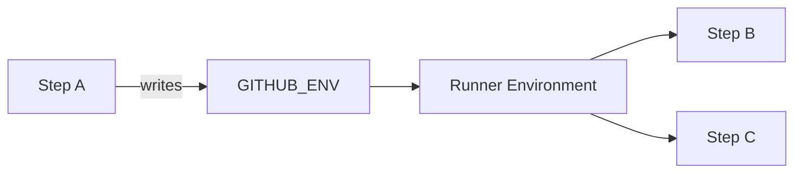
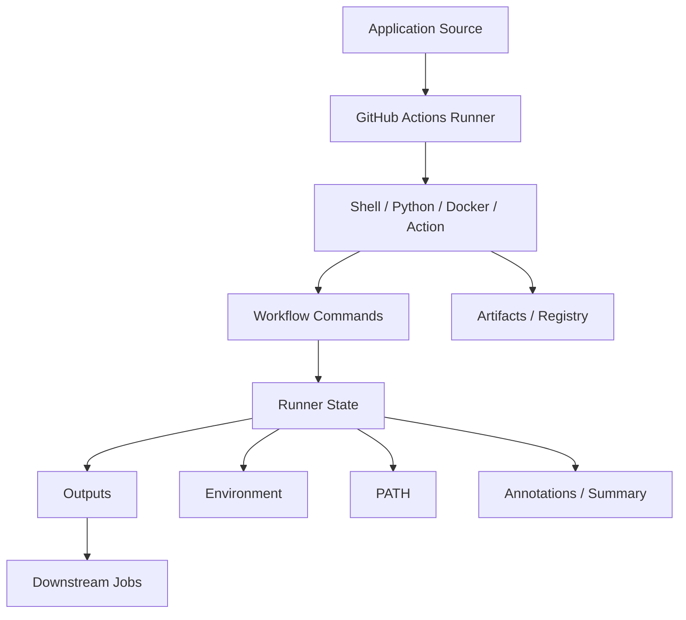

# 11- Workflow Commands

## Overview

GitHub Actions workflow commands are instructions written to the special files or command streams exposed by the runner so that a step can communicate state, metadata, diagnostics, and environment changes back to GitHub Actions.

They are different from ordinary shell commands.

For example:

```bash
echo "hello"
```

writes text to the process output, while:

```bash
echo "VERSION=1.4.2" >> "$GITHUB_ENV"
```

changes the workflow environment for subsequent steps.

The most important modern workflow mechanisms are:

| Mechanism | Primary Purpose | Scope |
|---|---|---|
| `$GITHUB_ENV` | Set environment variables | Subsequent steps in the same job |
| `$GITHUB_OUTPUT` | Publish step outputs | Step; can be promoted to job/workflow outputs |
| `$GITHUB_PATH` | Add directories to `PATH` | Subsequent steps in the same job |
| `$GITHUB_STEP_SUMMARY` | Write human-readable job summaries | Job summary |
| Workflow annotations | Highlight warnings/errors/notices | Workflow UI |
| Logging commands | Control runner log presentation and behavior | Current workflow execution |
| `::add-mask::` | Mask sensitive values in logs | Workflow logs |
| `::group::` / `::endgroup::` | Group log output | Workflow logs |
| `::stop-commands::` | Temporarily disable command processing | Current step |

The design principle is:

```text
Shell / Action
      │
      ▼
Workflow Command or Environment File
      │
      ▼
GitHub Actions Runner
      │
      ├── Environment
      ├── Outputs
      ├── PATH
      ├── Summary
      └── Annotations / Logs
```

Workflow commands are therefore part of the communication layer between application scripts and the GitHub Actions execution engine.

---

## Why Workflow Commands Matter

A CI/CD workflow is not only a sequence of shell commands.

The runner must also understand:

- Which values should be passed to later steps.
- Which values should be exposed as outputs.
- Which directories should be executable.
- Which messages should appear as warnings or errors.
- Which logs belong to a logical section.
- Which values must be masked.
- What information should appear in the job summary.

For a backend pipeline:

```text
pytest
   │
   ├── coverage.xml
   ├── test result
   └── diagnostic metadata
          │
          ▼
GitHub Actions
          │
          ├── Environment
          ├── Outputs
          ├── Artifacts
          └── Summary
```

Workflow commands provide the control-plane communication required to build this behavior.

---

## Workflow Commands vs Shell Commands

A shell command executes inside the runner's shell environment.

Examples:

```bash
pytest
docker build .
python manage.py migrate
```

A workflow command communicates with the GitHub Actions runner.

Examples:

```bash
echo "VERSION=1.4.2" >> "$GITHUB_ENV"
echo "tag=abc123" >> "$GITHUB_OUTPUT"
echo "$HOME/.local/bin" >> "$GITHUB_PATH"
```

The distinction is important:

| Category | Example | Purpose |
|---|---|---|
| Shell command | `pytest` | Execute application/tooling logic |
| Environment file | `$GITHUB_ENV` | Change future step environment |
| Output file | `$GITHUB_OUTPUT` | Publish workflow data |
| Path file | `$GITHUB_PATH` | Modify executable search path |
| Summary file | `$GITHUB_STEP_SUMMARY` | Publish human-readable results |
| Logging command | `::warning::...` | Control workflow UI/logging |

A shell command can produce the data, while a workflow command tells GitHub Actions what that data means.

---

## Modern Workflow Command Mechanisms

GitHub Actions supports environment files for the most important state-transfer operations.

The primary files are:

```text
$GITHUB_ENV
$GITHUB_OUTPUT
$GITHUB_PATH
$GITHUB_STEP_SUMMARY
```

A typical step may therefore look like:

```yaml
- name: Prepare build metadata
  id: metadata
  shell: bash
  run: |
    version="1.4.2"
    tag="${GITHUB_SHA::12}"

    echo "APP_VERSION=$version" >> "$GITHUB_ENV"
    echo "image_tag=$tag" >> "$GITHUB_OUTPUT"
```

Later steps can consume the environment variable and output independently.

---

## `$GITHUB_ENV`

`$GITHUB_ENV` is used to create or update environment variables for subsequent steps in the same job.

Example:

```yaml
steps:
  - name: Configure environment
    run: |
      echo "APP_ENV=staging" >> "$GITHUB_ENV"
      echo "LOG_LEVEL=INFO" >> "$GITHUB_ENV"

  - name: Run application checks
    run: |
      echo "Environment: $APP_ENV"
      echo "Log level: $LOG_LEVEL"
```

The second step sees:

```text
APP_ENV=staging
LOG_LEVEL=INFO
```

The important limitation is that the step writing to `$GITHUB_ENV` does not automatically see the newly written value within the same step.

For example:

```yaml
- name: Set variable
  run: |
    echo "APP_ENV=staging" >> "$GITHUB_ENV"
    echo "$APP_ENV"
```

The `echo` should not be used as proof that the new value has been loaded into the current process.

The value is intended for subsequent steps.

---

## Environment Variable Lifecycle

The flow is:



This is different from:

```text
Job A → Job B
```

`$GITHUB_ENV` does not provide cross-job state transfer.

For cross-job values use job outputs, artifacts, caches, or external storage depending on the data.

---

## `$GITHUB_ENV` Example for Python

A backend pipeline can configure environment-specific behavior:

```yaml
- name: Configure test environment
  run: |
    echo "DJANGO_SETTINGS_MODULE=config.settings.test" >> "$GITHUB_ENV"
    echo "PYTHONUNBUFFERED=1" >> "$GITHUB_ENV"

- name: Run Django tests
  run: |
    python manage.py test
```

For FastAPI:

```yaml
- name: Configure application environment
  run: |
    echo "APP_ENV=test" >> "$GITHUB_ENV"
    echo "LOG_LEVEL=INFO" >> "$GITHUB_ENV"

- name: Run tests
  run: pytest
```

This is appropriate for non-secret configuration.

Secrets should continue to come from the `secrets` context or an external secret manager.

---

## Multi-Line Environment Variables

Environment files support multiline values.

Example:

```yaml
- name: Configure application settings
  shell: bash
  run: |
    {
      echo 'APP_CONFIG<<EOF'
      echo 'database=postgres'
      echo 'cache=redis'
      echo 'environment=staging'
      echo 'EOF'
    } >> "$GITHUB_ENV"
```

A later step can access:

```bash
echo "$APP_CONFIG"
```

Use multiline environment variables carefully.

For structured configuration, JSON files or artifacts may be easier to validate and maintain than large environment variables.

---

## `$GITHUB_OUTPUT`

`$GITHUB_OUTPUT` publishes outputs from a step.

Example:

```yaml
- name: Generate image tag
  id: metadata
  run: |
    tag="${GITHUB_SHA::12}"
    echo "image_tag=$tag" >> "$GITHUB_OUTPUT"
```

A later step can use:

```yaml
- name: Build image
  run: |
    docker build \
      -t "backend:${{ steps.metadata.outputs.image_tag }}" \
      .
```

The flow is:

```text
Step
 │
 ├── calculate value
 │
 ▼
GITHUB_OUTPUT
 │
 ▼
steps.<id>.outputs.<name>
```

---

## `$GITHUB_OUTPUT` vs `$GITHUB_ENV`

These mechanisms should not be treated as interchangeable.

| Requirement | Mechanism |
|---|---|
| Environment variable for later steps | `$GITHUB_ENV` |
| Explicit step output | `$GITHUB_OUTPUT` |
| Cross-job metadata | `$GITHUB_OUTPUT` → job output |
| Add executable directory | `$GITHUB_PATH` |
| Human-readable workflow report | `$GITHUB_STEP_SUMMARY` |

Example:

```yaml
- name: Generate metadata
  id: metadata
  run: |
    echo "environment=staging" >> "$GITHUB_OUTPUT"
    echo "APP_ENV=staging" >> "$GITHUB_ENV"
```

These create two different interfaces:

```text
steps.metadata.outputs.environment
```

and:

```text
$APP_ENV
```

Use the mechanism that matches the intended scope.

---

## `$GITHUB_PATH`

`$GITHUB_PATH` adds directories to the runner's `PATH` for subsequent steps.

Example:

```yaml
- name: Add local tools
  run: |
    echo "$HOME/.local/bin" >> "$GITHUB_PATH"

- name: Verify tool
  run: |
    my-tool --version
```

This is useful when a tool is installed into a directory that is not already in `PATH`.

For example:

```yaml
- name: Install Python CLI tools
  run: |
    python -m pip install --user ruff

- name: Add Python user binaries
  run: |
    echo "$HOME/.local/bin" >> "$GITHUB_PATH"

- name: Run Ruff
  run: ruff check .
```

---

## PATH Security

Do not blindly add untrusted directories to `PATH`.

Changing `PATH` changes executable resolution.

For example:

```text
PATH
 │
 ├── trusted directory
 ├── another trusted directory
 └── untrusted directory
        │
        └── malicious executable with expected name
```

A command such as:

```bash
pytest
```

could execute an unexpected binary if `PATH` has been manipulated.

Use controlled installation directories and trusted sources.

---

## `$GITHUB_STEP_SUMMARY`

`$GITHUB_STEP_SUMMARY` allows a step to publish Markdown to the GitHub Actions job summary.

Example:

```yaml
- name: Publish test summary
  shell: bash
  run: |
    {
      echo "## Test Results"
      echo ""
      echo "- Tests: 428"
      echo "- Passed: 426"
      echo "- Failed: 2"
      echo "- Coverage: 92%"
    } >> "$GITHUB_STEP_SUMMARY"
```

This creates a readable summary without requiring engineers to inspect the complete raw log.

---

## Backend Test Summary

A Python CI pipeline can produce a useful summary:

```yaml
- name: Generate test summary
  if: ${{ always() }}
  shell: bash
  run: |
    {
      echo "## Backend Test Results"
      echo ""
      echo "| Metric | Value |"
      echo "|---|---:|"
      echo "| Test suite | pytest |"
      echo "| Python | ${{ matrix.python-version }} |"
      echo "| Database | ${{ matrix.database }} |"
    } >> "$GITHUB_STEP_SUMMARY"
```

This is especially useful for matrix pipelines because each job can publish its configuration and result context.

Do not include secrets or sensitive infrastructure details in summaries.

---

## Step Summary vs Artifact

These mechanisms solve different problems.

| Requirement | Step Summary | Artifact |
|---|---|---|
| Human-readable result | Excellent | Possible |
| Large test report | No | Yes |
| Coverage HTML | No | Yes |
| Small deployment status | Excellent | Usually unnecessary |
| Debug bundle | No | Yes |
| CI metadata | Excellent | Sometimes |
| Long-term downloadable file | No | Yes |

A useful pattern is:

```text
Summary
  → concise result

Artifact
  → complete report
```

For example:

```text
GitHub Actions Summary
    │
    ├── 426 tests passed
    ├── 92% coverage
    └── Build successful
          │
          ▼
Artifact
    └── coverage-html/
```

---

## Workflow Logging Commands

GitHub Actions also supports workflow command syntax in standard output.

The general form is:

```text
::command parameter=value::message
```

Examples include:

```text
::notice::Deployment started
::warning::Coverage below target
::error::Database migration failed
```

These commands allow a workflow to communicate structured diagnostic information to the Actions UI.

---

## Notice, Warning, and Error Annotations

### Notice

```yaml
- name: Deployment notice
  run: echo "::notice::Deploying version $GITHUB_SHA"
```

Use notices for useful informational messages.

### Warning

```yaml
- name: Coverage warning
  run: echo "::warning::Coverage is below the target threshold"
```

Use warnings when execution can continue but attention is required.

### Error

```yaml
- name: Validation error
  run: echo "::error::Invalid deployment configuration"
```

An annotation itself does not necessarily replace proper failure handling. If the workflow must fail, the command should return a non-zero exit status.

For example:

```yaml
- name: Validate configuration
  shell: bash
  run: |
    if [[ ! -f config/production.yaml ]]; then
      echo "::error file=config/production.yaml::Production configuration is missing"
      exit 1
    fi
```

---

## File and Line Annotations

Annotations can include metadata such as:

- File.
- Line.
- Column.
- End line.
- End column.
- Title.

Example:

```yaml
- name: Validate configuration
  run: |
    echo "::error file=config/settings.py,line=42,col=5,title=Configuration Error::Invalid production setting"
    exit 1
```

This makes CI failures easier to locate.

For static analysis tools, annotations can be particularly useful when a workflow translates tool output into GitHub-native diagnostics.

---

## Grouping Logs

Long CI jobs become difficult to diagnose when hundreds or thousands of lines are emitted without structure.

Use:

```text
::group::Group title
...
::endgroup::
```

Example:

```yaml
- name: Install dependencies
  shell: bash
  run: |
    echo "::group::Install Python dependencies"
    python -m pip install --upgrade pip
    pip install -r requirements.txt
    echo "::endgroup::"
```

The resulting logs can be collapsed into a logical section.

---

## Grouping Backend CI Logs

A realistic pipeline can group:

```text
Dependency installation
Database setup
Test execution
Coverage
Docker build
```

Example:

```yaml
- name: Run tests
  shell: bash
  run: |
    echo "::group::Run pytest"
    pytest -v
    echo "::endgroup::"
```

This improves operational debugging without changing application behavior.

---

## Conditional Log Groups

Log grouping can be used around commands that generate significant output:

```yaml
- name: Docker build
  shell: bash
  run: |
    echo "::group::Docker build"
    docker build -t backend:${GITHUB_SHA::12} .
    echo "::endgroup::"
```

Avoid wrapping every single shell command in a separate group. Excessive grouping makes the logs harder to navigate rather than easier.

---

## Masking Sensitive Values

The runner supports a masking command:

```text
::add-mask::value
```

Example:

```yaml
- name: Mask generated identifier
  shell: bash
  run: |
    token="sensitive-value"
    echo "::add-mask::$token"
    echo "Token generated"
```

If the value later appears in workflow logs, GitHub Actions can redact it.

However, masking is not a replacement for proper secret management.

The preferred approach is:

```text
Do not expose secret
        │
        ▼
Use secret securely
```

rather than:

```text
Expose secret
        │
        ▼
Hope masking catches it
```

---

## Masking Before Logging

If a value genuinely needs to exist in the workflow and could accidentally reach logs, register the mask before the value is printed.

Example:

```yaml
- name: Process sensitive value
  shell: bash
  run: |
    value="$(generate-sensitive-value)"
    echo "::add-mask::$value"

    ./tool --token "$value"
```

Do not print the value simply to verify that masking works.

---

## Masking Limitations

Masking should not be considered a complete security boundary.

Problems can occur when:

- Secrets are transformed.
- Secrets are encoded.
- Secrets are split across multiple values.
- Secrets are embedded in files.
- Secrets are passed to external systems.
- Third-party tools log command arguments.
- A secret is intentionally copied into an artifact.
- An action processes data outside the expected logging path.

The correct strategy is to minimize secret exposure.

```text
Least privilege
+
Minimal secret scope
+
No unnecessary logging
+
Trusted actions
+
Protected runners
```

---

## Stop Command Processing

GitHub Actions recognizes special command syntax in standard output.

If a step needs to print content that contains strings resembling workflow commands, command processing can be temporarily disabled.

The pattern is:

```text
::stop-commands::<token>
...
::<token>::
```

Example:

```yaml
- name: Print generated script safely
  shell: bash
  run: |
    token="END_COMMANDS_${GITHUB_RUN_ID}"

    echo "::stop-commands::$token"
    cat generated-script.sh
    echo "::$token::"
```

This is useful when printing arbitrary content that could contain sequences beginning with:

```text
::
```

The token should be unpredictable enough that untrusted content is unlikely to accidentally terminate the disabled-command region.

---

## Why `stop-commands` Matters

Suppose a generated file contains:

```text
::warning::something
```

If printed while command processing is active, the runner may interpret it as a workflow command rather than ordinary output.

Conceptually:

```text
Generated Content
       │
       ▼
Runner command parser
       │
       ├── normal text
       └── workflow command
```

`stop-commands` temporarily changes this behavior:

```text
Generated Content
       │
       ▼
Command processing disabled
       │
       ▼
Printed as ordinary output
```

Use this primarily for controlled debugging or displaying generated content.

---

## Writing Multi-Line Outputs Safely

Workflow commands must account for values containing:

- Newlines.
- Special characters.
- Shell metacharacters.
- JSON.
- Generated configuration.

For example:

```yaml
- name: Publish report
  id: report
  shell: bash
  run: |
    {
      echo 'content<<EOF'
      echo 'Build completed'
      echo 'Coverage: 92%'
      echo 'EOF'
    } >> "$GITHUB_OUTPUT"
```

For complex structured data, prefer JSON and parse it explicitly rather than building large ad-hoc multiline strings.

---

## Workflow Command Security

Workflow commands process data emitted by scripts.

That creates an important security boundary.

Avoid directly printing untrusted content as a workflow command.

For example, this is dangerous:

```yaml
- name: Process pull request title
  run: |
    echo "::warning::${{ github.event.pull_request.title }}"
```

A pull request title is user-controlled data.

A safer pattern is to pass it through an environment variable:

```yaml
- name: Process pull request title
  env:
    PR_TITLE: ${{ github.event.pull_request.title }}
  shell: bash
  run: |
    printf 'Pull request title: %s\n' "$PR_TITLE"
```

The value is then treated as shell data rather than directly interpolated into the command source.

---

## Workflow Command Injection

The same security principle applies to:

- Pull request titles.
- Branch names.
- Commit messages.
- Issue content.
- Workflow inputs.
- Repository-controlled configuration.
- External API responses.

Avoid:

```yaml
run: echo "Branch: ${{ github.head_ref }}"
```

when the value could contain shell-significant content.

Prefer:

```yaml
env:
  BRANCH_NAME: ${{ github.head_ref }}
run: |
  printf 'Branch: %s\n' "$BRANCH_NAME"
```

This does not make every operation automatically safe, but it creates a stronger boundary between data and shell syntax.

---

## Workflow Commands and Pull Requests

Fork-based pull requests require particular care.

A workflow may process attacker-controlled repository content.

For example:

```text
Fork PR
   │
   ▼
Workflow
   │
   ▼
Untrusted source code
   │
   ▼
Shell execution
```

If that workflow has access to privileged credentials or a powerful `GITHUB_TOKEN`, the risk increases significantly.

Workflow commands therefore belong to the broader GitHub Actions security model.

Do not treat logging or output mechanisms as isolated from:

- `pull_request`.
- `pull_request_target`.
- Token permissions.
- Secrets.
- Runner isolation.
- Third-party actions.

---

## Deprecated Workflow Commands

Older GitHub Actions workflows commonly used commands such as:

```text
::set-output
::save-state
::add-path
```

These should not be presented as the current mechanism for environment/output/path communication.

Use environment files instead:

| Older Mechanism | Modern Mechanism |
|---|---|
| `::set-output` | `$GITHUB_OUTPUT` |
| `::add-path` | `$GITHUB_PATH` |
| `::save-state` | Supported environment/state mechanisms appropriate to the action context |

For example, avoid:

```bash
echo "::set-output name=version::1.4.2"
```

Use:

```bash
echo "version=1.4.2" >> "$GITHUB_OUTPUT"
```

Likewise, avoid:

```bash
echo "::add-path::$HOME/bin"
```

Use:

```bash
echo "$HOME/bin" >> "$GITHUB_PATH"
```

When maintaining older workflows, modernize deprecated mechanisms rather than continuing to expand them.

---

## Workflow Commands in Composite Actions

Composite actions can use the same environment-file mechanisms.

Example:

```yaml
name: Setup Python Tooling

description: Install backend tooling

runs:
  using: composite
  steps:
    - name: Install Ruff
      shell: bash
      run: |
        python -m pip install ruff

    - name: Add tool path
      shell: bash
      run: |
        echo "$HOME/.local/bin" >> "$GITHUB_PATH"
```

A composite action can therefore encapsulate workflow command usage without requiring every repository workflow to repeat the same implementation.

---

## Workflow Commands in Custom JavaScript Actions

JavaScript actions commonly use the Actions toolkit rather than manually emitting command syntax.

For example, `@actions/core` provides APIs for:

- Setting outputs.
- Setting environment variables.
- Adding paths.
- Logging notices.
- Logging warnings.
- Logging errors.
- Creating groups.
- Masking secrets.

Conceptually:

```text
JavaScript Action
       │
       ▼
@actions/core
       │
       ▼
GitHub Actions Runner
```

This is generally preferable for JavaScript actions because the toolkit abstracts the runner communication protocol.

---

## Workflow Commands and Docker Actions

Docker-based actions can also interact with the runner using the supported workflow command mechanisms.

However, the container boundary matters.

```text
Runner
  │
  ▼
Docker Action
  │
  ├── action process
  └── container filesystem
          │
          ▼
      Runner command
```

Docker actions should use the supported mechanisms exposed to the action rather than relying on assumptions about persistent state outside the container.

---

## Workflow Commands and Python

Python scripts can write to the workflow command files directly.

Example:

```python
from pathlib import Path
import os

output_file = Path(os.environ["GITHUB_OUTPUT"])
output_file.write_text("version=1.4.2\n", encoding="utf-8")
```

A more realistic example:

```python
import os
from pathlib import Path

version = os.environ["APP_VERSION"]

output_file = Path(os.environ["GITHUB_OUTPUT"])
with output_file.open("a", encoding="utf-8") as file:
    file.write(f"version={version}\n")
```

However, when simple shell syntax is sufficient, using:

```bash
echo "version=$VERSION" >> "$GITHUB_OUTPUT"
```

is usually easier to read.

Use Python when the value requires substantial computation or validation.

---

## Workflow Commands and Django

A Django pipeline can use workflow commands to expose useful metadata.

Example:

```yaml
- name: Collect Django metadata
  id: django
  shell: bash
  run: |
    python --version
    python manage.py check

    echo "settings_module=$DJANGO_SETTINGS_MODULE" >> "$GITHUB_OUTPUT"
```

Then:

```yaml
- name: Add CI summary
  run: |
    {
      echo "## Django Validation"
      echo ""
      echo "- Settings: ${{ steps.django.outputs.settings_module }}"
      echo "- Django checks: passed"
    } >> "$GITHUB_STEP_SUMMARY"
```

Do not expose secrets such as database passwords or Django `SECRET_KEY` in summaries or annotations.

---

## Workflow Commands and FastAPI

For a FastAPI service, a pipeline can publish test and build metadata:

```yaml
- name: Run API tests
  id: tests
  shell: bash
  run: |
    pytest tests/api -q
    echo "status=passed" >> "$GITHUB_OUTPUT"

- name: Publish test summary
  if: ${{ always() }}
  run: |
    {
      echo "## FastAPI Test Results"
      echo ""
      echo "- API test status: ${{ steps.tests.outputs.status }}"
    } >> "$GITHUB_STEP_SUMMARY"
```

For real pipelines, coverage and JUnit reports are generally better represented through generated files and artifacts while the summary provides a concise human-readable result.

---

## Workflow Commands and Docker

Docker-heavy pipelines benefit from grouped logs and summaries.

Example:

```yaml
- name: Build Docker image
  id: docker
  shell: bash
  run: |
    tag="${GITHUB_SHA::12}"

    echo "::group::Docker build"
    docker build -t "backend:$tag" .
    echo "::endgroup::"

    echo "image_tag=$tag" >> "$GITHUB_OUTPUT"

    {
      echo "## Docker Build"
      echo ""
      echo "- Image: backend:$tag"
    } >> "$GITHUB_STEP_SUMMARY"
```

This separates:

```text
Machine-readable output
```

from:

```text
Human-readable summary
```

while retaining detailed build logs.

---

## Workflow Commands and CI/CD Architecture

Workflow commands belong primarily to the workflow control plane.

A production architecture can be viewed as:



This distinction helps prevent a common architectural mistake: using workflow commands as a replacement for artifact storage or external state management.

---

## Operational Logging Strategy

Production workflows should make logs useful without becoming excessively verbose.

A practical structure is:

```text
Job
 │
 ├── Setup
 │
 ├── Dependency installation
 │
 ├── Database readiness
 │
 ├── Tests
 │
 ├── Coverage
 │
 └── Build
```

Each major operation can be grouped:

```yaml
- name: Run tests
  run: |
    echo "::group::Pytest"
    pytest -v
    echo "::endgroup::"
```

The job summary should contain the high-value result:

```text
Tests: 428
Passed: 428
Coverage: 93%
Image: backend:abc1234
```

Detailed logs remain available for diagnosis.

---

## Annotations vs Step Summary

These mechanisms serve different operational purposes.

| Mechanism | Best For |
|---|---|
| Error annotation | Specific failure requiring attention |
| Warning annotation | Specific issue that does not necessarily fail the job |
| Notice annotation | Important informational event |
| Step summary | Aggregated human-readable result |
| Raw logs | Detailed troubleshooting |
| Artifact | Downloadable diagnostic data |

For example:

```text
Summary:
  428 tests passed
  93% coverage

Annotation:
  coverage.py:42 → coverage below target

Artifact:
  coverage-html.zip
```

This gives engineers multiple levels of diagnostic detail.

---

## Reliability Considerations

Workflow commands should not become hidden dependencies.

For example, a deployment should not depend on a human-readable summary.

This is good:

```text
Build
  │
  └── image_tag output
       │
       ▼
Deployment
```

This is fragile:

```text
Build
  │
  └── write image tag into summary
             │
             ▼
      Deployment parses summary
```

Use machine-readable mechanisms for machine-to-machine communication.

Use summaries and annotations for humans.

---

## Performance Considerations

Workflow command operations are generally lightweight, but excessive logging can make workflows harder to operate.

Avoid:

```bash
cat enormous-file.log
```

inside a workflow summary.

Instead:

```text
Summary → concise metrics
Artifact → complete log
```

Likewise, avoid generating huge environment variables or outputs when an artifact is more appropriate.

---

## Cost Considerations

Workflow commands themselves generally have negligible cost compared with:

- Runner execution time.
- Docker builds.
- Integration tests.
- External services.
- Artifact storage.
- Cache storage.

However, good command usage can indirectly reduce CI cost by making failures easier to diagnose.

For example:

```text
Useful summary
    ↓
Faster diagnosis
    ↓
Fewer unnecessary reruns
    ↓
Lower CI consumption
```

The goal is not to maximize logging but to maximize useful information per unit of runner time.

---

## Common Mistakes

### Treating Workflow Commands as Shell Commands

Incorrect mental model:

```text
GITHUB_OUTPUT = normal application file
```

It is a runner communication mechanism.

The runner interprets the information written to it.

---

### Using Deprecated Output Commands

Avoid:

```bash
echo "::set-output name=tag::$TAG"
```

Use:

```bash
echo "tag=$TAG" >> "$GITHUB_OUTPUT"
```

---

### Expecting `$GITHUB_ENV` to Cross Jobs

This does not work:

```text
Job A
  ↓
GITHUB_ENV
  ↓
Job B
```

Use:

```text
Job A
  ↓
GITHUB_OUTPUT
  ↓
Job Output
  ↓
needs
  ↓
Job B
```

for small values.

---

### Printing Secrets

Avoid:

```yaml
- run: echo "${{ secrets.AWS_SECRET_ACCESS_KEY }}"
```

Even when masking exists, intentionally exposing credentials is poor security practice.

Use the secret only where required.

---

### Printing Untrusted Data as Commands

Avoid:

```yaml
run: echo "::warning::${{ github.event.pull_request.title }}"
```

Use an environment variable:

```yaml
env:
  TITLE: ${{ github.event.pull_request.title }}
run: printf '%s\n' "$TITLE"
```

---

### Overusing Step Summaries

Do not turn the summary into a complete log dump.

A summary should answer:

- Did it pass?
- What version was built?
- What artifact was produced?
- What environment was targeted?
- What requires attention?

Detailed information belongs in logs or artifacts.

---

### Using Outputs for Large Data

Do not transfer large files through outputs.

Use:

```text
Artifact
```

or:

```text
Object storage / registry
```

instead.

---

### Forgetting Output Scope

A value written to:

```text
$GITHUB_OUTPUT
```

belongs to a step.

To make it available to another job, explicitly promote it:

```yaml
outputs:
  image_tag: ${{ steps.metadata.outputs.image_tag }}
```

---

## Troubleshooting Workflow Commands

### Symptom: Environment Variable Is Empty

**Possible causes:**

- `$GITHUB_ENV` was written incorrectly.
- The variable is being read in the same step that created it.
- Variable name mismatch.
- The value was overwritten later.

**Checks:**

```yaml
- name: Configure
  run: echo "APP_ENV=staging" >> "$GITHUB_ENV"

- name: Verify
  run: printf 'APP_ENV=%s\n' "$APP_ENV"
```

The verification should be in a subsequent step.

---

### Symptom: Step Output Is Empty

**Possible causes:**

- Missing step `id`.
- Incorrect output name.
- `$GITHUB_OUTPUT` was not written.
- Shell expansion produced an empty value.

Check:

```yaml
- name: Generate metadata
  id: metadata
  run: |
    echo "version=1.4.2" >> "$GITHUB_OUTPUT"

- name: Verify
  run: |
    echo "Version: ${{ steps.metadata.outputs.version }}"
```

---

### Symptom: Job Output Is Empty

Check the complete chain:

```text
Step ID
   ↓
Step output
   ↓
Job output mapping
   ↓
needs dependency
   ↓
Downstream reference
```

Example:

```yaml
outputs:
  version: ${{ steps.metadata.outputs.version }}
```

and:

```yaml
needs: build
```

then:

```yaml
${{ needs.build.outputs.version }}
```

---

### Symptom: Workflow Summary Is Missing

Check:

```bash
echo "## CI Results" >> "$GITHUB_STEP_SUMMARY"
```

Make sure:

- The step actually executed.
- The environment variable exists.
- The shell command did not fail before writing.
- The workflow reached the relevant step.

For failure reporting, consider:

```yaml
if: ${{ always() }}
```

when the summary should execute regardless of earlier step results.

Remember that `always()` does not mean a cancelled workflow will necessarily continue executing indefinitely; cancellation can terminate jobs and steps.

---

### Symptom: Unexpected Warning or Error Annotation

Possible causes include:

- Application output containing `::warning::`.
- Generated content containing workflow command syntax.
- A third-party tool emitting command-like output.

Use `stop-commands` when intentionally printing arbitrary content that may contain workflow command sequences.

---

### Symptom: Sensitive Data Appears in Logs

Immediately investigate:

- Which step printed it.
- Whether an action logged command arguments.
- Whether the value was placed into `$GITHUB_OUTPUT`.
- Whether it was written to `$GITHUB_STEP_SUMMARY`.
- Whether it was included in an artifact.
- Whether debug logging exposed additional information.

Rotate credentials if there is any possibility that a real secret was exposed.

Masking is not a substitute for credential rotation after exposure.

---

## Production Best Practices

### Use Environment Files

Prefer:

```text
$GITHUB_ENV
$GITHUB_OUTPUT
$GITHUB_PATH
$GITHUB_STEP_SUMMARY
```

for their intended purposes.

### Keep Machine Data and Human Data Separate

Use:

```text
Outputs → workflow data
Artifacts → files
Summary → human-readable results
Logs → diagnostics
Secrets → credentials
```

### Treat Outputs as Contracts

Use stable names:

```text
version
image_tag
image_digest
artifact_name
```

Avoid exposing unnecessary internal implementation details.

### Validate Security-Sensitive Values

Any output that influences:

- Deployment targets.
- AWS accounts.
- IAM roles.
- Production environments.
- Docker registries.
- Shell commands.

should be validated against explicit allowed values.

### Keep Logs Actionable

Use groups, annotations, and summaries to reduce diagnostic time.

### Avoid Deprecated Commands

Modernize older workflows rather than copying historical syntax into new workflows.

---

## GitHub CLI Diagnostics

GitHub CLI can complement workflow-command-based diagnostics.

List workflows:

```bash
gh workflow list
```

List recent runs:

```bash
gh run list
```

Inspect a run:

```bash
gh run view <run-id>
```

Inspect logs:

```bash
gh run view <run-id> --log
```

Watch a running workflow:

```bash
gh run watch <run-id>
```

Rerun a workflow:

```bash
gh run rerun <run-id>
```

These commands are useful when diagnosing whether a workflow command problem is local to one step or part of a broader workflow execution problem.

---

## Architecture Pattern for Production CI

A mature pipeline can combine all major mechanisms:

```text
                    Pull Request
                         │
                         ▼
                    Metadata Job
                         │
              ┌──────────┼──────────┐
              │          │          │
          version     image_tag   matrix
              │          │          │
              └──────────┼──────────┘
                         ▼
                    Matrix Tests
                         │
                         ▼
                     Build Job
                         │
                    GITHUB_OUTPUT
                         │
                         ▼
                   Publish Image
                         │
                         ▼
                      Staging
                         │
                  Step Summary
                         │
                         ▼
                   Approval
                         │
                         ▼
                    Production
```

At each stage:

```text
Outputs
  → machine-readable state

Summaries
  → human-readable state

Annotations
  → targeted diagnostics

Artifacts
  → persistent files

Registry
  → immutable deployment artifact
```

This separation produces a more maintainable CI/CD system.

---

## Senior-Level Design Principles

Workflow commands should be viewed as part of the GitHub Actions execution model.

A senior engineer should distinguish:

```text
Application execution
```

from:

```text
Workflow orchestration
```

For example:

```text
pytest
```

is application/tool execution.

```text
$GITHUB_OUTPUT
```

is workflow orchestration.

Likewise:

```text
docker build
```

builds an artifact.

```text
$GITHUB_STEP_SUMMARY
```

reports the result to humans.

This separation makes workflows easier to maintain, secure, and troubleshoot.

A strong production workflow follows these principles:

- Use the smallest communication mechanism that solves the problem.
- Keep machine-readable workflow state separate from human-readable diagnostics.
- Avoid transferring large data through outputs or environment variables.
- Never treat masking as a substitute for secret management.
- Treat untrusted output as data, not workflow syntax.
- Prefer explicit validation before privileged operations.
- Keep workflow commands close to the logic that produces the corresponding state.
- Use artifacts and registries for persistent data.
- Use summaries and annotations to reduce operational debugging time.

---

## Interview Traps

### "What Is `$GITHUB_ENV`?"

It is a runner-provided environment file used to set environment variables for subsequent steps in the same job.

It is not a cross-job storage mechanism.

### "What Is `$GITHUB_OUTPUT`?"

It is the supported environment file used by a step to publish output values that can be consumed through the step output context.

### "How Do You Pass a Value to Another Job?"

Promote the step output to a job output and consume it through `needs`:

```yaml
outputs:
  image_tag: ${{ steps.metadata.outputs.image_tag }}
```

then:

```yaml
${{ needs.build.outputs.image_tag }}
```

### "How Do You Add a Directory to PATH?"

Use:

```bash
echo "$HOME/.local/bin" >> "$GITHUB_PATH"
```

rather than the deprecated `::add-path::` mechanism.

### "How Do You Create a Workflow Summary?"

Write Markdown to:

```text
$GITHUB_STEP_SUMMARY
```

### "How Do You Mark a Specific Line as an Error?"

Use an error annotation:

```text
::error file=path/to/file.py,line=42::Invalid configuration
```

### "How Do You Prevent Arbitrary Output from Being Interpreted as Workflow Commands?"

Use `stop-commands` around content that may contain workflow-command syntax.

### "Can Workflow Commands Replace Artifacts?"

No.

Workflow commands communicate state and diagnostics. Artifacts persist files and reports.

### "Can You Use Outputs for Secrets?"

Outputs should not be treated as a secret-management mechanism. Use GitHub Secrets or an external secret manager and minimize credential exposure.

---

## Production Checklist

### Environment and State

- [ ] `$GITHUB_ENV` is used for environment variables required by later steps.
- [ ] `$GITHUB_OUTPUT` is used for explicit step outputs.
- [ ] `$GITHUB_PATH` is used for controlled PATH modifications.
- [ ] Workflow state is not incorrectly assumed to cross job boundaries.
- [ ] Large data is transferred using artifacts, registries, or external storage.

### Logging

- [ ] Important operations use logical log groups.
- [ ] Errors and warnings use appropriate annotations.
- [ ] Job summaries contain high-value operational information.
- [ ] Detailed diagnostics remain available in workflow logs.
- [ ] Large logs are not unnecessarily copied into summaries.

### Security

- [ ] Secrets are not printed intentionally.
- [ ] Sensitive output is minimized.
- [ ] Untrusted GitHub data is not directly interpolated into shell commands.
- [ ] Workflow command injection risks are considered.
- [ ] `stop-commands` is used when arbitrary command-like content must be printed.
- [ ] Privileged deployment values are validated.
- [ ] Third-party actions are trusted and appropriately pinned.

### Modernization

- [ ] `$GITHUB_OUTPUT` is used instead of deprecated `::set-output`.
- [ ] `$GITHUB_PATH` is used instead of deprecated `::add-path`.
- [ ] Modern environment-file mechanisms are used consistently.
- [ ] Legacy workflow-command syntax has been reviewed during maintenance.

### Operations

- [ ] Workflow summaries make common failures quickly understandable.
- [ ] Annotations point engineers toward the relevant file or location.
- [ ] GitHub CLI can be used to inspect and rerun workflows.
- [ ] Sensitive diagnostic data is excluded from summaries and artifacts.
- [ ] Workflow command failures are distinguishable from application failures.

## Key Takeaways

- `$GITHUB_ENV`, `$GITHUB_OUTPUT`, `$GITHUB_PATH`, and `$GITHUB_STEP_SUMMARY` are the core modern environment-file mechanisms for communicating state, outputs, executable paths, and human-readable results within GitHub Actions.
- Workflow commands are part of the runner control plane and should be clearly distinguished from ordinary shell commands, application execution, artifacts, caches, and deployment registries.
- Use outputs for small machine-readable workflow data, artifacts for files, summaries and annotations for humans, and dedicated secret-management mechanisms for credentials.
- Treat workflow-command parsing as a security boundary: never blindly emit untrusted GitHub data as workflow commands or shell source, and use validation and `stop-commands` where appropriate.
- Prefer modern environment-file mechanisms over deprecated commands, and design logs, summaries, outputs, and annotations so production failures can be diagnosed quickly without exposing sensitive information.