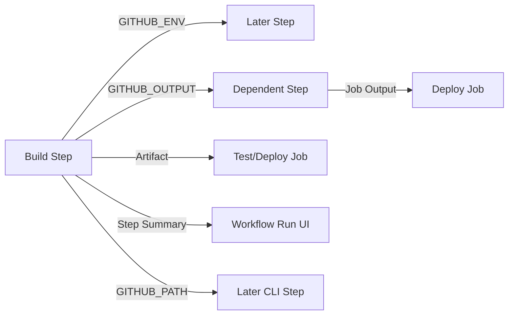
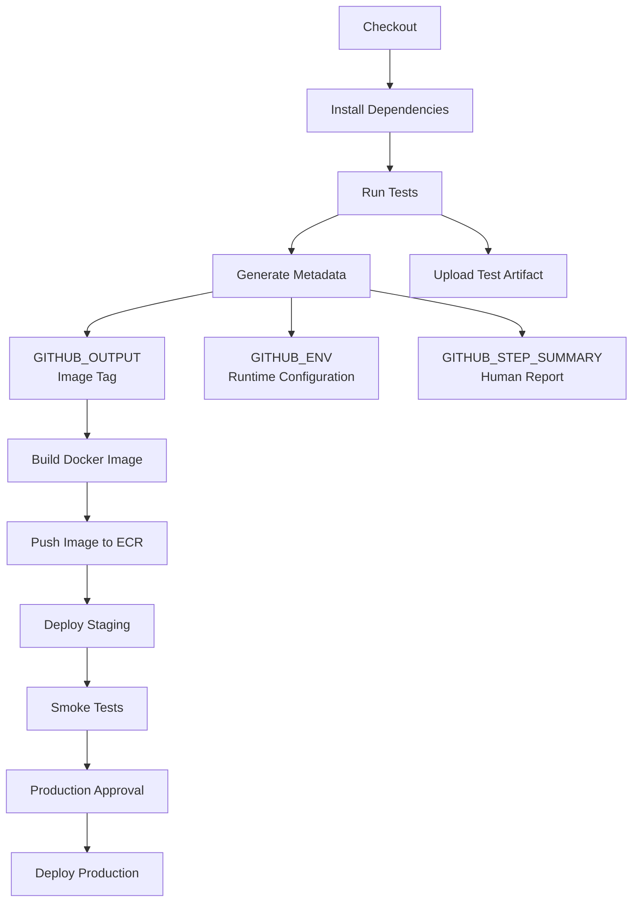

# 12- Environment Files

## Overview

GitHub Actions uses special environment files to transfer values from the runner's workflow commands back to the GitHub Actions runtime. These files provide the supported mechanism for setting environment variables, step outputs, executable paths, and step summaries during workflow execution.

The most important environment files are:

| Environment file | Primary purpose | Scope |
|---|---|---|
| `$GITHUB_ENV` | Set environment variables for later steps | Current job |
| `$GITHUB_OUTPUT` | Publish step outputs | Current step → dependent steps/jobs |
| `$GITHUB_PATH` | Add directories to `PATH` | Current job |
| `$GITHUB_STEP_SUMMARY` | Add Markdown to the job summary | Workflow run UI |

These files are different from application `.env` files or Docker Compose environment files. For example, the existing backend notes use `.env` files to provide application/container configuration such as `DB_HOST`, `DB_PORT`, and `APP_ENV`. :chatgpt-content-reference{index="0"} GitHub Actions environment files instead control communication between workflow steps and the Actions runner.

A useful mental model is:

```text
Step executes
    ↓
Step writes to special environment file
    ↓
GitHub Actions runner processes the file
    ↓
Value becomes available through the appropriate mechanism
    ↓
Later step / job / workflow consumes the value
```

Environment files are especially important when a workflow dynamically discovers information during execution, such as a generated version, build directory, Docker image tag, test result, or deployment metadata.

---

## GitHub Actions Environment Files

Environment files are runner-managed files whose paths are exposed through environment variables such as:

```text
GITHUB_ENV
GITHUB_OUTPUT
GITHUB_PATH
GITHUB_STEP_SUMMARY
```

A workflow step does not normally modify GitHub Actions' runtime environment directly. Instead, it writes commands or values to the appropriate file.

For example:

```yaml
steps:
  - name: Set application environment
    run: echo "APP_ENV=staging" >> "$GITHUB_ENV"

  - name: Use application environment
    run: echo "Deploying to $APP_ENV"
```

The first step writes to `$GITHUB_ENV`.

The runner processes the file and makes `APP_ENV` available to subsequent steps in the same job.

---

## Why Environment Files Exist

A GitHub Actions job consists of independently executed steps:

```text
Job
 ├── Step 1
 ├── Step 2
 ├── Step 3
 └── Step 4
```

Each step runs as a separate process. A shell variable created inside one step does not automatically become a shell variable in another step.

For example:

```yaml
steps:
  - name: Define variable
    run: |
      VERSION="1.4.2"

  - name: Use variable
    run: echo "$VERSION"
```

This does not provide reliable cross-step state.

Instead:

```yaml
steps:
  - name: Define variable
    run: echo "VERSION=1.4.2" >> "$GITHUB_ENV"

  - name: Use variable
    run: echo "$VERSION"
```

The distinction is fundamental:

| Mechanism | Purpose | Lifetime |
|---|---|---|
| Shell variable | Temporary shell state | Current shell/process |
| `$GITHUB_ENV` | Environment variable between steps | Remaining steps in job |
| `$GITHUB_OUTPUT` | Structured step output | Step consumers |
| Job output | Data between jobs | Dependent jobs |
| Artifact | Files between jobs/workflows | Stored artifact lifetime |
| Cache | Reusable dependencies/build data | Cache retention policy |

---

## `$GITHUB_ENV`

`$GITHUB_ENV` is used to create or update environment variables for subsequent steps in the same job.

### Basic Usage

```yaml
steps:
  - name: Configure environment
    run: echo "APP_ENV=staging" >> "$GITHUB_ENV"

  - name: Run application checks
    run: |
      echo "Environment: $APP_ENV"
```

The important behavior is:

```text
Step A
  ↓
writes APP_ENV to GITHUB_ENV
  ↓
Runner processes environment file
  ↓
Step B
  ↓
APP_ENV is available
```

### Important Scope Rule

A variable written to `$GITHUB_ENV` is available to **subsequent steps**, not the step that writes it.

For example:

```yaml
steps:
  - name: Set variable
    run: |
      echo "VERSION=1.2.3" >> "$GITHUB_ENV"
      echo "Current value: $VERSION"

  - name: Read variable
    run: echo "Version: $VERSION"
```

The first step should not be expected to see the newly written value.

The second step can consume it.

---

## `$GITHUB_ENV` and Job Boundaries

`$GITHUB_ENV` does not automatically transfer values between jobs.

This does not work as a cross-job communication mechanism:

```text
Job A
  ↓
GITHUB_ENV
  ↓
Job B
```

Jobs may run on different runners and have independent execution environments.

For job-to-job communication use:

```text
Step Output
    ↓
Job Output
    ↓
needs.<job>.outputs.<name>
```

Example:

```yaml
jobs:
  build:
    runs-on: ubuntu-latest

    outputs:
      version: ${{ steps.version.outputs.version }}

    steps:
      - id: version
        run: echo "version=1.4.2" >> "$GITHUB_OUTPUT"

  deploy:
    needs: build
    runs-on: ubuntu-latest

    steps:
      - run: echo "Deploying version ${{ needs.build.outputs.version }}"
```

---

## `$GITHUB_ENV` and Existing Variables

Environment variables can originate from several sources:

```text
Workflow-level env
        ↓
Job-level env
        ↓
Step-level env
        ↓
Dynamically generated values
```

For example:

```yaml
env:
  APP_NAME: orders-api

jobs:
  deploy:
    runs-on: ubuntu-latest
    env:
      DEPLOY_ENV: staging

    steps:
      - name: Deploy
        env:
          VERSION: "1.4.2"
        run: |
          echo "$APP_NAME"
          echo "$DEPLOY_ENV"
          echo "$VERSION"
```

Dynamic values can be added using `$GITHUB_ENV`:

```yaml
- name: Generate deployment metadata
  run: |
    echo "DEPLOYED_AT=$(date -u +%Y-%m-%dT%H:%M:%SZ)" >> "$GITHUB_ENV"
```

---

## Multiline Values with `$GITHUB_ENV`

Environment files support multiline values using a delimiter format.

```yaml
- name: Set configuration
  run: |
    {
      echo 'APP_CONFIG<<EOF'
      echo 'database=postgres'
      echo 'cache=redis'
      echo 'environment=staging'
      echo 'EOF'
    } >> "$GITHUB_ENV"
```

The resulting variable can be consumed later:

```yaml
- name: Display configuration
  run: |
    printf '%s\n' "$APP_CONFIG"
```

### Safer Delimiters for Arbitrary Data

The delimiter must not appear by itself in the value.

For data that may contain arbitrary content, generate a delimiter rather than relying on a fixed string.

For example:

```yaml
- name: Export generated JSON
  shell: bash
  run: |
    delimiter="$(openssl rand -hex 16)"
    {
      echo "CONFIG_JSON<<$delimiter"
      cat config.json
      echo "$delimiter"
    } >> "$GITHUB_ENV"
```

For structured data that needs to move between workflow steps or jobs, `$GITHUB_OUTPUT` is often a better abstraction than treating JSON as a general environment variable.

---

## `$GITHUB_OUTPUT`

`$GITHUB_OUTPUT` is used to publish outputs from a step.

It is the preferred mechanism for passing dynamically generated values to later workflow expressions.

Example:

```yaml
steps:
  - name: Determine version
    id: version
    run: echo "version=1.4.2" >> "$GITHUB_OUTPUT"

  - name: Display version
    run: echo "Version: ${{ steps.version.outputs.version }}"
```

The important distinction is:

```text
GITHUB_ENV
    ↓
Environment variable

GITHUB_OUTPUT
    ↓
Step output
```

Outputs are especially useful when the value participates in workflow logic.

For example:

```yaml
- name: Calculate image tag
  id: image
  run: |
    echo "tag=${GITHUB_SHA::12}" >> "$GITHUB_OUTPUT"

- name: Build image
  run: |
    docker build \
      -t "orders-api:${{ steps.image.outputs.tag }}" \
      .
```

---

## Environment Variables vs Step Outputs

Use `$GITHUB_ENV` when a value is primarily configuration for later shell commands.

Use `$GITHUB_OUTPUT` when a value is logically produced by a step.

| Requirement | Recommended mechanism |
|---|---|
| Set `APP_ENV` for later shell commands | `$GITHUB_ENV` |
| Generate Docker image tag | `$GITHUB_OUTPUT` |
| Generate test result | `$GITHUB_OUTPUT` |
| Pass value into an `if:` expression | `$GITHUB_OUTPUT` |
| Pass data to another job | Job output |
| Pass a file between jobs | Artifact |
| Reuse dependencies | Cache |

Example:

```yaml
- name: Determine image tag
  id: metadata
  run: |
    echo "tag=${GITHUB_SHA::12}" >> "$GITHUB_OUTPUT"

- name: Deploy
  if: steps.metadata.outputs.tag != ''
  run: |
    echo "Deploying ${{ steps.metadata.outputs.tag }}"
```

---

## `$GITHUB_PATH`

`$GITHUB_PATH` adds directories to the runner's `PATH` for subsequent steps.

Example:

```yaml
steps:
  - name: Install local CLI
    run: |
      mkdir -p "$HOME/.local/bin"
      cp scripts/my-cli "$HOME/.local/bin/my-cli"
      echo "$HOME/.local/bin" >> "$GITHUB_PATH"

  - name: Use CLI
    run: my-cli --version
```

This is useful when a workflow installs a tool into a non-standard directory.

### Common Backend Example

A Python workflow may install a CLI into a virtual environment:

```yaml
- name: Create virtual environment
  run: |
    python -m venv .venv
    echo "$PWD/.venv/bin" >> "$GITHUB_PATH"

- name: Install dependencies
  run: |
    python -m pip install --upgrade pip
    pip install -r requirements.txt

- name: Run checks
  run: |
    ruff check .
    pytest
```

The path modification applies to later steps.

---

## `$GITHUB_STEP_SUMMARY`

`$GITHUB_STEP_SUMMARY` allows a step to add Markdown content to the workflow run's job summary.

This is useful for human-readable CI/CD reporting.

Example:

```yaml
- name: Generate test summary
  run: |
    {
      echo "## Test Results"
      echo
      echo "- Environment: staging"
      echo "- Python: $(python --version)"
      echo "- Status: passed"
    } >> "$GITHUB_STEP_SUMMARY"
```

A production pipeline can use summaries for:

- Test results
- Deployment versions
- Environment information
- Security scan summaries
- Docker image metadata
- Migration status
- Smoke-test results

Example:

```yaml
- name: Deployment summary
  run: |
    {
      echo "## Deployment"
      echo
      echo "| Field | Value |"
      echo "|---|---|"
      echo "| Environment | staging |"
      echo "| Image | $IMAGE_TAG |"
      echo "| Commit | $GITHUB_SHA |"
      echo "| Status | Successful |"
    } >> "$GITHUB_STEP_SUMMARY"
```

A summary is for human-readable reporting. It should not replace outputs, artifacts, or machine-readable status signals.

---

## Environment Files vs `.env` Files

A common source of confusion is treating GitHub Actions environment files and application `.env` files as the same mechanism.

They solve different problems.

The existing backend documentation uses `.env` files for application/container configuration such as:

```text
DB_HOST=mysql
DB_PORT=3306
APP_ENV=production
```

:chatgpt-content-reference{index="1"}

GitHub Actions environment files are runner communication mechanisms:

```text
GITHUB_ENV
GITHUB_OUTPUT
GITHUB_PATH
GITHUB_STEP_SUMMARY
```

Comparison:

| Mechanism | Purpose | Example |
|---|---|---|
| `.env` | Application configuration | `DB_HOST=postgres` |
| Docker Compose `.env` | Compose variable substitution | `APP_PORT=8080` |
| `env:` | Workflow configuration | `APP_ENV: staging` |
| `$GITHUB_ENV` | Runtime environment transfer between steps | `echo "VERSION=1.2.3"` |
| `$GITHUB_OUTPUT` | Step/job data flow | `echo "tag=abc123"` |
| `$GITHUB_PATH` | Modify executable search path | `echo "$HOME/bin"` |
| `$GITHUB_STEP_SUMMARY` | Human-readable workflow report | Markdown |

Do not automatically copy a local `.env` file into GitHub Actions.

Production CI/CD should generally obtain sensitive deployment configuration from GitHub secrets, environments, AWS IAM/OIDC, AWS Secrets Manager, or another dedicated secret-management system.

---

## Data Flow Between Workflow Steps

A production workflow may use several communication mechanisms simultaneously.



Each mechanism has a different responsibility.

```text
Configuration
    → GITHUB_ENV

Structured workflow data
    → GITHUB_OUTPUT

Cross-job files
    → Artifacts

Executable discovery
    → GITHUB_PATH

Human-readable reporting
    → GITHUB_STEP_SUMMARY
```

---

## Practical Python CI Example

Consider a Python backend using Django or FastAPI.

The pipeline calculates a version, exposes it to later steps, installs a local tool, runs tests, and publishes a summary.

```yaml
name: Python CI

on:
  pull_request:
  push:
    branches:
      - main

jobs:
  test:
    runs-on: ubuntu-latest

    steps:
      - name: Checkout
        uses: actions/checkout@v4

      - name: Set Python
        uses: actions/setup-python@v6
        with:
          python-version: "3.12"
          cache: pip

      - name: Generate build metadata
        id: metadata
        shell: bash
        run: |
          version="${GITHUB_SHA::12}"

          echo "IMAGE_TAG=$version" >> "$GITHUB_ENV"
          echo "version=$version" >> "$GITHUB_OUTPUT"

      - name: Install dependencies
        run: |
          python -m pip install --upgrade pip
          pip install -r requirements.txt

      - name: Run tests
        env:
          APP_ENV: test
        run: |
          pytest --junitxml=test-results.xml

      - name: Write summary
        run: |
          {
            echo "## CI Results"
            echo
            echo "- Commit: $GITHUB_SHA"
            echo "- Image tag: $IMAGE_TAG"
            echo "- Status: Tests passed"
          } >> "$GITHUB_STEP_SUMMARY"
```

The data flow is:

```text
Git SHA
   ↓
metadata step
   ├── GITHUB_ENV
   │      ↓
   │   IMAGE_TAG
   │      ↓
   │   later shell commands
   │
   └── GITHUB_OUTPUT
          ↓
      steps.metadata.outputs.version
```

---

## Environment Files and Docker Builds

Environment files can help construct build and deployment metadata, but they should not be confused with Docker image configuration.

For example:

```yaml
- name: Generate image metadata
  id: image
  run: |
    echo "tag=${GITHUB_SHA::12}" >> "$GITHUB_OUTPUT"

- name: Build image
  env:
    IMAGE_TAG: ${{ steps.image.outputs.tag }}
  run: |
    docker build \
      -t "orders-api:$IMAGE_TAG" \
      .
```

For production deployments, prefer immutable image references.

A typical flow is:

```text
Commit
   ↓
GitHub Actions
   ↓
Build Docker Image
   ↓
Tag with commit SHA
   ↓
Push to ECR
   ↓
Deploy exact image
```

The existing CI/CD notes similarly recommend versioned images and avoiding `latest` because immutable versioning improves rollback and auditability. :chatgpt-content-reference{index="2"}

---

## Environment Files and AWS Deployments

Environment files are useful for passing deployment metadata into AWS commands.

For example:

```yaml
- name: Generate image tag
  id: image
  run: |
    echo "tag=${GITHUB_SHA::12}" >> "$GITHUB_OUTPUT"

- name: Deploy
  env:
    IMAGE_TAG: ${{ steps.image.outputs.tag }}
  run: |
    echo "Deploying image $IMAGE_TAG"
    aws ecs update-service \
      --cluster production \
      --service orders-api \
      --force-new-deployment
```

The credentials themselves should not be placed in `$GITHUB_ENV`.

For AWS authentication, a production workflow should generally use GitHub Actions OIDC with an appropriately restricted IAM role rather than long-lived AWS access keys. The existing ECS CI/CD notes explicitly recommend OIDC to avoid long-term credentials. :chatgpt-content-reference{index="3"}

---

## Security Considerations

Environment files are not a secret-management system.

Do not write secrets into `$GITHUB_ENV` merely because a later step needs them.

Avoid:

```yaml
- name: Expose credentials
  run: |
    echo "AWS_SECRET_ACCESS_KEY=${{ secrets.AWS_SECRET_ACCESS_KEY }}" >> "$GITHUB_ENV"
```

This increases the number of places where sensitive data exists.

Prefer directly scoped secrets:

```yaml
- name: Deploy
  env:
    DEPLOY_TOKEN: ${{ secrets.DEPLOY_TOKEN }}
  run: |
    ./scripts/deploy.sh
```

Better still, when supported by the deployment platform, use short-lived identity such as AWS OIDC rather than persistent credentials.

### Do Not Print Environment Variables

Avoid:

```yaml
- name: Debug
  run: env
```

A workflow may contain secrets or other sensitive values.

Instead inspect only the specific non-sensitive variable:

```yaml
- name: Debug deployment environment
  run: |
    echo "Environment: $APP_ENV"
    echo "Region: $AWS_REGION"
```

### Masking Is Not a Design Substitute

GitHub Actions provides secret masking, but masking should not be treated as permission to expose sensitive values.

The safer principle is:

```text
Do not expose
    ↓
Minimize scope
    ↓
Use short-lived credentials
    ↓
Use least privilege
```

---

## Preventing Accidental Secret Propagation

Environment files make it easy to accidentally persist values across many subsequent steps.

For example:

```yaml
- name: Authenticate
  run: |
    echo "TOKEN=$TOKEN" >> "$GITHUB_ENV"
```

Now every subsequent step in the job can potentially access `TOKEN`.

Instead scope the secret to the step that needs it:

```yaml
- name: Authenticate
  env:
    TOKEN: ${{ secrets.DEPLOY_TOKEN }}
  run: |
    ./deploy.sh
```

This reduces the blast radius.

---

## Untrusted Data and Environment Files

Never blindly write untrusted GitHub data into shell commands.

Potentially untrusted data includes:

- Pull request titles
- Branch names
- Commit messages
- Issue content
- User-provided workflow inputs

Unsafe pattern:

```yaml
- name: Set value
  run: echo "VALUE=${{ github.event.pull_request.title }}" >> "$GITHUB_ENV"
```

The expression is inserted into the generated shell script before execution. If the value contains shell metacharacters, it can alter command behavior.

A safer pattern is to pass the value through an environment variable:

```yaml
- name: Process pull request title
  env:
    PR_TITLE: ${{ github.event.pull_request.title }}
  run: |
    printf '%s\n' "$PR_TITLE"
```

For values that need to become workflow outputs or environment variables, validate and sanitize them according to their intended format.

---

## Environment Files and Pull Requests

This becomes particularly important for workflows triggered by pull requests.

A workflow that executes untrusted code should not automatically expose sensitive credentials or privileged environment data.

For example:

```text
Untrusted PR
    ↓
Workflow
    ↓
Shell command
    ↓
Environment variable
    ↓
Potential secret exposure
```

The risk is higher when workflows have:

```yaml
permissions:
  contents: write
```

or other unnecessary privileges.

Use least privilege:

```yaml
permissions:
  contents: read
```

Then grant additional permissions only where required.

---

## File Encoding and Shell Behavior

Environment files are processed by the runner, while the command that writes them is executed by the selected shell.

Therefore, shell behavior still matters.

For Bash:

```yaml
run: echo "NAME=value" >> "$GITHUB_ENV"
```

For PowerShell:

```yaml
run: "NAME=value" >> $env:GITHUB_ENV
```

A cross-platform workflow should account for differences in:

- Shell syntax
- Path separators
- Environment variable expansion
- Quoting
- Newline handling
- Encoding

When a workflow uses both Linux and Windows runners, test environment-file behavior on each supported runner.

---

## Special Characters and Quoting

This is risky:

```yaml
- run: echo "NAME=$VALUE" >> "$GITHUB_ENV"
```

if `VALUE` can contain characters that have shell significance.

For controlled values such as:

```text
staging
production
1.4.2
abc123
```

the simple form is generally sufficient.

For arbitrary content, use a multiline delimiter or a safer serialization strategy.

For structured data, JSON is often appropriate:

```yaml
- name: Generate metadata
  id: metadata
  shell: bash
  run: |
    metadata="$(jq -cn \
      --arg version "${GITHUB_SHA::12}" \
      --arg environment "staging" \
      '{version: $version, environment: $environment}')"

    {
      echo 'data<<EOF'
      echo "$metadata"
      echo 'EOF'
    } >> "$GITHUB_OUTPUT"
```

A later step can consume:

```yaml
- name: Read metadata
  env:
    METADATA: ${{ steps.metadata.outputs.data }}
  run: |
    echo "$METADATA" | jq .
```

---

## Environment Files and Composite Actions

Composite actions can use environment files just like normal workflow steps.

Example:

```yaml
name: Generate Metadata

runs:
  using: composite
  steps:
    - name: Generate version
      id: version
      shell: bash
      run: |
        echo "version=${GITHUB_SHA::12}" >> "$GITHUB_OUTPUT"
```

The composite action can encapsulate repetitive step-level logic.

Environment files therefore provide a useful interface between:

```text
Workflow
   ↓
Composite Action
   ↓
Individual Steps
```

The action should expose outputs deliberately rather than leaking unnecessary internal state.

---

## Environment Files and Reusable Workflows

Reusable workflows introduce another boundary.

A value can move through several levels:

```text
Step
  ↓
Step Output
  ↓
Job Output
  ↓
Workflow Output
  ↓
Caller Workflow
```

Example:

```yaml
jobs:
  build:
    runs-on: ubuntu-latest

    outputs:
      image_tag: ${{ steps.metadata.outputs.image_tag }}

    steps:
      - id: metadata
        run: |
          echo "image_tag=${GITHUB_SHA::12}" >> "$GITHUB_OUTPUT"
```

The caller can consume the reusable workflow's output.

This is preferable to attempting to use `$GITHUB_ENV` as a cross-workflow communication mechanism.

---

## Environment Files and Matrix Jobs

Matrix jobs create multiple job instances.

For example:

```yaml
strategy:
  matrix:
    python-version:
      - "3.11"
      - "3.12"
```

Each matrix job has its own execution environment.

A value written to `$GITHUB_ENV` in one matrix instance does not automatically appear in another.

Conceptually:

```text
Matrix
 ├── Python 3.11
 │     └── GITHUB_ENV
 │
 └── Python 3.12
       └── GITHUB_ENV
```

For data that must converge after matrix execution, use artifacts or carefully designed job outputs.

---

## Environment Files vs Artifacts

Do not use environment files to transfer files.

Bad approach:

```text
Generate coverage.xml
    ↓
Convert entire file into GITHUB_ENV
    ↓
Attempt to reconstruct file
```

Use an artifact instead:

```yaml
- name: Upload coverage
  uses: actions/upload-artifact@v4
  with:
    name: coverage
    path: coverage.xml
```

The distinction is:

```text
Small runtime values
    → Environment files / outputs

Files and build products
    → Artifacts
```

The existing CI/CD notes use artifacts for test/build outputs and separate them from the deployment pipeline's versioned container images. :chatgpt-content-reference{index="4"}

---

## Environment Files vs Caches

Caches solve a different problem.

```text
Environment file
    → Runtime communication

Artifact
    → Persist and transfer files

Cache
    → Reuse expensive-to-create dependencies
```

For example:

```text
pip download/install
    ↓
Dependency cache

pytest results
    ↓
Artifact

IMAGE_TAG
    ↓
GITHUB_OUTPUT
```

Do not use a cache as a workflow state mechanism.

---

## Production Pipeline Example

A production backend pipeline may use all of these mechanisms together.



A mature pipeline separates these responsibilities:

| Data | Mechanism |
|---|---|
| Python/runtime configuration | `env` / `$GITHUB_ENV` |
| Image tag | `$GITHUB_OUTPUT` |
| Test reports | Artifact |
| Coverage report | Artifact |
| Dependency cache | Cache |
| Deployment summary | `$GITHUB_STEP_SUMMARY` |
| AWS authentication | OIDC |
| Production secrets | Environment secrets / AWS secret management |

This supports the production flow used elsewhere in the playbook:

```text
Lint
  ↓
Tests
  ↓
Build
  ↓
Security Scan
  ↓
Push ECR
  ↓
Deploy
  ↓
Smoke Tests
```

:chatgpt-content-reference{index="5"}

---

## Environment Files and Deployment Metadata

A useful production pattern is to generate immutable deployment metadata once.

```yaml
- name: Generate deployment metadata
  id: metadata
  shell: bash
  run: |
    image_tag="${GITHUB_SHA::12}"

    echo "image_tag=$image_tag" >> "$GITHUB_OUTPUT"
    echo "DEPLOY_ENV=staging" >> "$GITHUB_ENV"

- name: Build image
  env:
    IMAGE_TAG: ${{ steps.metadata.outputs.image_tag }}
  run: |
    docker build \
      -t "orders-api:$IMAGE_TAG" \
      .

- name: Deployment summary
  env:
    IMAGE_TAG: ${{ steps.metadata.outputs.image_tag }}
  run: |
    {
      echo "## Deployment"
      echo
      echo "- Environment: $DEPLOY_ENV"
      echo "- Image: orders-api:$IMAGE_TAG"
      echo "- Commit: $GITHUB_SHA"
    } >> "$GITHUB_STEP_SUMMARY"
```

This avoids recalculating deployment metadata independently in later steps.

For a multi-environment pipeline, the same immutable image can then be promoted:

```text
Build once
    ↓
orders-api:<commit-sha>
    ↓
Staging
    ↓
Validation
    ↓
Production
```

This is safer than rebuilding separately for each environment.

---

## Common Mistakes

### Expecting `$GITHUB_ENV` to Work in the Same Step

Incorrect assumption:

```yaml
- run: |
    echo "VERSION=1.0.0" >> "$GITHUB_ENV"
    echo "$VERSION"
```

The variable is intended for subsequent steps.

Use:

```yaml
- run: |
    VERSION="1.0.0"
    echo "VERSION=$VERSION" >> "$GITHUB_ENV"
    echo "$VERSION"
```

The shell variable is available immediately, while the environment-file value is available to later steps.

---

### Using `$GITHUB_ENV` for Cross-Job Communication

Incorrect:

```text
Job A → GITHUB_ENV → Job B
```

Use job outputs:

```text
Step output
    ↓
Job output
    ↓
needs.job.outputs.value
```

---

### Using Environment Files for Large Files

Do not serialize large logs, reports, binaries, or build products into environment variables.

Use artifacts.

---

### Storing Secrets in `$GITHUB_ENV`

This unnecessarily broadens the scope of sensitive data.

Prefer:

```yaml
env:
  TOKEN: ${{ secrets.TOKEN }}
```

at the narrowest practical scope.

---

### Treating `.env` as a GitHub Actions Environment File

A repository `.env` file and `$GITHUB_ENV` solve different problems.

Do not assume:

```text
.env
```

is automatically equivalent to:

```text
$GITHUB_ENV
```

---

### Overusing Environment Variables

If a value represents output from a computation, prefer:

```text
GITHUB_OUTPUT
```

rather than creating a generic environment variable.

This makes workflow data flow explicit.

---

### Ignoring Shell Differences

A workflow that works on Ubuntu may fail on Windows because of differences in:

```text
Quoting
Paths
Environment expansion
Shell syntax
Encoding
```

Explicitly select the shell when portability matters.

---

## Troubleshooting

Use the following failure model:

```text
Symptom
   ↓
Possible Causes
   ↓
Isolation Strategy
   ↓
Commands / Checks
   ↓
Root Cause
   ↓
Corrective Action
   ↓
Prevention
```

### Variable Is Missing in a Later Step

**Symptom**

```text
$APP_ENV is empty
```

**Possible causes**

- The value was never written to `$GITHUB_ENV`.
- The variable name is incorrect.
- The value was written in a different job.
- The shell command failed.
- The value was written after the consuming step.
- The value was expected in the same step.

**Isolation**

```yaml
- name: Inspect variable
  run: |
    printf 'APP_ENV=%s\n' "${APP_ENV:-<unset>}"
```

Do not dump the entire environment when secrets may be present.

---

### Output Is Empty

**Symptom**

```text
steps.metadata.outputs.version
```

is empty.

**Possible causes**

- Missing `id`.
- Incorrect output name.
- `$GITHUB_OUTPUT` was not used.
- Output was written conditionally and the condition did not execute.

Correct:

```yaml
- name: Generate version
  id: metadata
  run: echo "version=1.2.3" >> "$GITHUB_OUTPUT"

- name: Consume version
  run: echo "${{ steps.metadata.outputs.version }}"
```

---

### `$PATH` Change Is Not Visible

Check:

```yaml
- name: Debug PATH
  run: |
    printf '%s\n' "$PATH"
```

Remember that `$GITHUB_PATH` affects subsequent steps.

---

### Multiline Value Is Corrupted

Check:

- Delimiter collision.
- Shell quoting.
- Newline handling.
- Runner operating system.
- Incorrect delimiter syntax.

For arbitrary multiline content, generate a unique delimiter.

---

### Environment Value Contains Unexpected Data

Check the command that writes it.

For example:

```yaml
- name: Generate metadata
  shell: bash
  run: |
    printf 'VERSION=%s\n' "${GITHUB_SHA::12}" >> "$GITHUB_ENV"
```

Using `printf` can make shell behavior more explicit than complex `echo` expressions.

---

## Debugging Techniques

### Verify the File Exists

```yaml
- name: Inspect environment file
  run: |
    ls -l "$GITHUB_ENV"
```

Do not expose sensitive file contents unnecessarily.

### Verify a Specific Variable

```yaml
- name: Check configuration
  run: |
    if [[ -z "${APP_ENV:-}" ]]; then
      echo "APP_ENV is not configured"
      exit 1
    fi

    echo "APP_ENV=$APP_ENV"
```

### Verify an Output

```yaml
- name: Validate output
  run: |
    echo "Version: ${{ steps.metadata.outputs.version }}"
```

### Enable Runner Debug Logging

For difficult workflow failures, GitHub Actions provides runner and step debugging facilities through repository/workflow debugging configuration. Use them temporarily and avoid enabling verbose diagnostics when they could expose sensitive information.

---

## Operational Best Practices

### Use the Narrowest Communication Mechanism

Choose the mechanism based on data ownership:

```text
Current shell
    → shell variable

Later steps
    → GITHUB_ENV

Step result
    → GITHUB_OUTPUT

Dependent job
    → Job output

Files
    → Artifact

Dependencies
    → Cache

Human-readable report
    → GITHUB_STEP_SUMMARY
```

### Keep Values Small

Environment variables and outputs should carry metadata and control information, not large payloads.

### Prefer Explicit Data Flow

Good:

```text
Build
  ↓
output.image_tag
  ↓
Deploy
```

Less maintainable:

```text
Build
  ↓
global environment state
  ↓
many unrelated steps
```

### Minimize Secret Scope

Prefer:

```yaml
- name: Deploy
  env:
    DEPLOY_TOKEN: ${{ secrets.DEPLOY_TOKEN }}
  run: ./deploy.sh
```

over making the secret available to the entire job.

### Generate Immutable Metadata Once

Use the commit SHA or another deterministic version identifier and pass it through outputs.

This supports:

- Reproducibility
- Auditing
- Rollback
- Artifact traceability
- Deployment verification

### Keep Human and Machine Interfaces Separate

Use:

```text
GITHUB_OUTPUT
```

for machine-readable workflow state.

Use:

```text
GITHUB_STEP_SUMMARY
```

for human-readable reports.

Do not parse a step summary as a workflow API.

---

## Environment File Reference

| File | Use | Cross-step | Cross-job | Typical example |
|---|---|---:|---:|---|
| `$GITHUB_ENV` | Environment variables | Yes | No | `APP_ENV=staging` |
| `$GITHUB_OUTPUT` | Step outputs | Yes | Through job outputs | `image_tag=abc123` |
| `$GITHUB_PATH` | PATH entries | Yes | No | `$HOME/.local/bin` |
| `$GITHUB_STEP_SUMMARY` | Markdown summary | N/A | Workflow UI | Deployment report |

---

## Senior-Level Design Principles

Environment files look simple, but they participate in the workflow's state and data-flow architecture.

A production workflow should answer four questions for every generated value:

1. **Who owns the value?**
2. **How long does the value need to exist?**
3. **Who consumes it?**
4. **Does the value contain sensitive information?**

For example:

| Value | Owner | Lifetime | Mechanism |
|---|---|---|---|
| `APP_ENV` | Workflow/job | Job | `env` / `GITHUB_ENV` |
| Docker image tag | Build step | Pipeline | Step/job output |
| Coverage XML | Test job | Artifact retention | Artifact |
| pip cache | CI infrastructure | Cache lifetime | Cache |
| AWS identity | Deployment job | Short-lived session | OIDC |
| Deployment report | CI system | Workflow run | Step summary |

This makes the pipeline easier to reason about and reduces accidental coupling.

The goal is not to minimize the number of mechanisms. The goal is to use each mechanism for the data lifecycle it was designed to support.

---

## Interview Traps

### What is `$GITHUB_ENV`?

It is a runner-provided environment file used to set environment variables for subsequent steps in the same job.

### Does `$GITHUB_ENV` share variables between jobs?

No. Jobs have separate execution environments. Use job outputs, artifacts, or another appropriate persistence mechanism.

### What is `$GITHUB_OUTPUT` used for?

It publishes step outputs that can be consumed by later workflow expressions and, through job outputs, by dependent jobs.

### Why not use `$GITHUB_ENV` for every value?

Because environment variables are implicit job state. Outputs make producer-consumer relationships explicit and work better for workflow orchestration.

### What is `$GITHUB_PATH`?

It adds a directory to the runner's `PATH` for subsequent steps.

### What is `$GITHUB_STEP_SUMMARY`?

It creates Markdown content displayed in the workflow run's job summary. It is intended for human-readable reporting.

### Are environment files a secret store?

No. They are workflow communication mechanisms. Sensitive data should be handled using GitHub secrets, environment protection, OIDC, or a dedicated secret-management service.

### How would you pass a generated Docker image tag to a deployment job?

Generate it as a step output, expose it as a job output, and consume it through `needs`.

```yaml
jobs:
  build:
    runs-on: ubuntu-latest

    outputs:
      image_tag: ${{ steps.metadata.outputs.image_tag }}

    steps:
      - id: metadata
        run: echo "image_tag=${GITHUB_SHA::12}" >> "$GITHUB_OUTPUT"

  deploy:
    needs: build
    runs-on: ubuntu-latest

    steps:
      - run: echo "Deploying ${{ needs.build.outputs.image_tag }}"
```

---

## Production Checklist

Before using environment files in a production workflow, verify:

- [ ] `$GITHUB_ENV` is used only for values needed by later steps in the same job.
- [ ] `$GITHUB_OUTPUT` is used for step-produced workflow data.
- [ ] Job outputs are used for cross-job values.
- [ ] Artifacts are used for files rather than environment variables.
- [ ] Caches are used for reusable dependencies rather than workflow state.
- [ ] `$GITHUB_PATH` is used only for executable search paths.
- [ ] `$GITHUB_STEP_SUMMARY` is used for human-readable reporting.
- [ ] Secrets are not unnecessarily copied into `$GITHUB_ENV`.
- [ ] Untrusted GitHub event data is not directly interpolated into shell commands.
- [ ] Multiline values use safe delimiters.
- [ ] Cross-platform workflows account for shell differences.
- [ ] Generated deployment metadata is immutable and traceable to a commit.
- [ ] AWS authentication uses OIDC where applicable instead of long-lived credentials.
- [ ] Environment-file usage is documented when it forms part of the pipeline's data flow.

## Key Takeaways

- `$GITHUB_ENV`, `$GITHUB_OUTPUT`, `$GITHUB_PATH`, and `$GITHUB_STEP_SUMMARY` solve different workflow communication problems and should not be treated as interchangeable.
- `$GITHUB_ENV` is for environment variables in subsequent steps of the same job; `$GITHUB_OUTPUT` is the preferred mechanism for explicit step-to-job data flow.
- Environment files are not substitutes for artifacts, caches, `.env` application configuration, or secret-management systems.
- Production workflows should minimize secret scope, avoid shell injection from untrusted GitHub data, and use immutable deployment metadata wherever possible.
- Clear separation of workflow state, artifacts, caches, secrets, and human-readable reporting makes CI/CD pipelines easier to operate, troubleshoot, and scale.