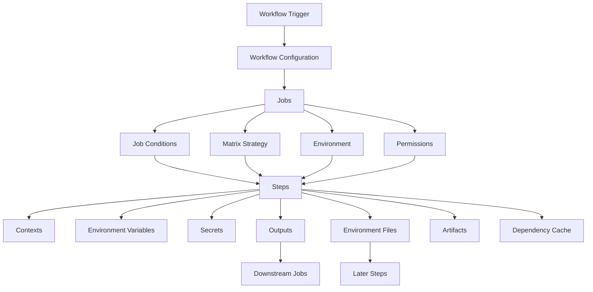
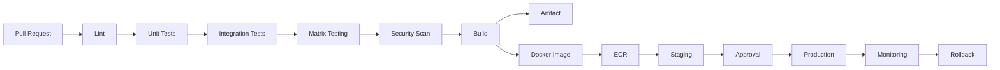

# README

## Overview

This folder documents the configuration and control mechanisms used to build production-grade GitHub Actions workflows.

The material moves beyond basic YAML syntax and focuses on how workflow behavior is controlled through triggers, expressions, contexts, conditions, environments, secrets, matrices, outputs, artifacts, workflow commands, environment files, and dependency caching.

The concepts in this folder form the configuration layer between the foundational GitHub Actions model and more advanced topics such as reusable workflows, custom actions, containers, security, deployment architecture, and production operations.

The core relationship is:

```text
Workflow
    |
    +── Trigger
    |
    +── Configuration
    |
    +── Jobs
    |     |
    |     +── Conditions
    |     +── Matrix
    |     +── Environment
    |     +── Outputs
    |     +── Steps
    |
    +── Data Flow
    |     |
    |     +── Contexts
    |     +── Environment Variables
    |     +── Outputs
    |     +── Environment Files
    |
    +── Build Optimization
          |
          +── Artifacts
          +── Dependency Caches
```

For a backend engineer, this layer is critical because workflow configuration determines:

- when automation runs
- which code is trusted
- which jobs execute
- how jobs communicate
- which secrets are available
- how multiple runtime versions are tested
- how build outputs move between jobs
- how dependency installation is optimized
- how deployments are isolated by environment
- how failures and conditional execution are handled

## Navigation

| # | File | Description |
|---|---|---|
| 01 | [01- Expressions and Operators](./01-%20Expressions%20and%20Operators.md) | GitHub Actions expressions provide the evaluation layer used to make workflows dynamic. |
| 02 | [02- Contexts](./02-%20Contexts.md) | GitHub Actions contexts provide structured information about the workflow execution environment. |
| 03 | [03- Conditions and Status Functions](./03-%20Conditions%20and%20Status%20Functions.md) | GitHub Actions conditions control whether jobs and steps execute based on the current workflow state, event data, outputs, contexts, and pre... |
| 04 | [04- Environment Variables](./04-%20Environment%20Variables.md) | Environment variables are one of the primary mechanisms for passing configuration and runtime values into GitHub Actions jobs and steps. |
| 05 | [05- Variables and Configuration](./05-%20Variables%20and%20Configuration.md) | GitHub Actions variables and configuration mechanisms control how workflows receive environment-specific settings, runtime values, secrets,... |
| 06 | [06- Secrets](./06-%20Secrets.md) | Secrets are sensitive values required by CI/CD workflows, applications, deployment systems, and external services. |
| 07 | [07- Environments](./07-%20Environments.md) | GitHub Actions environments provide a controlled boundary around deployment targets such as development, staging, and production. |
| 08 | [08- Matrix Strategies](./08-%20Matrix%20Strategies.md) | GitHub Actions matrix strategies provide controlled fan-out: one logical job definition can execute multiple job instances using different c... |
| 09 | [09- Matrix Include and Exclude](./09-%20Matrix%20Include%20and%20Exclude.md) | GitHub Actions matrix strategies are useful when the same job must run across multiple configurations such as Python versions, operating sys... |
| 10 | [10- Job and Step Outputs](./10-%20Job%20and%20Step%20Outputs.md) | GitHub Actions jobs are isolated execution units. |
| 11 | [11- Workflow Commands](./11-%20Workflow%20Commands.md) | GitHub Actions workflow commands are instructions written to the special files or command streams exposed by the runner so that a step can c... |
| 12 | [12- Environment Files](./12-%20Environment%20Files.md) | GitHub Actions uses special environment files to transfer values from the runner's workflow commands back to the GitHub Actions runtime. |
| 13 | [13- Artifacts](./13-%20Artifacts.md) | GitHub Actions artifacts provide persistent file storage for workflow outputs. |
| 14 | [14- Dependency Caching](./14-%20Dependency%20Caching.md) | GitHub-hosted runners are provisioned as clean environments for workflow jobs. |

---

## Folder Scope

The documents in this folder focus on workflow-level configuration rather than the complete GitHub Actions platform.

The major areas are:

| Area | Purpose |
|---|---|
| Expressions | Evaluate dynamic workflow conditions and values |
| Contexts | Access GitHub Actions runtime information |
| Conditions | Control job and step execution |
| Environment Variables | Pass configuration into workflow execution |
| Secrets | Protect sensitive values |
| Environments | Separate deployment targets and protection rules |
| Matrix Strategies | Execute the same workflow across multiple configurations |
| Job and Step Outputs | Transfer data between execution units |
| Workflow Commands | Communicate workflow metadata and diagnostics |
| Environment Files | Persist supported values between workflow steps |
| Artifacts | Preserve and transfer workflow outputs |
| Dependency Caching | Reduce repeated dependency download and build costs |

---

## Workflow Configuration Model

GitHub Actions evaluates workflow configuration at several levels.



This model is important because not every value is available at every point in workflow evaluation.

A senior engineer should always ask:

```text
Where is this value created?
        ↓
When is it evaluated?
        ↓
Which context contains it?
        ↓
At what scope is it available?
        ↓
Does it cross a job boundary?
```

---

## Documents

### Expressions and Operators

**File:** `01- Expressions and Operators.md`

Covers GitHub Actions expression syntax and evaluation.

Key areas include:

- `${{ }}`
- comparisons
- logical operators
- equality
- relational operators
- functions
- dynamic values
- `contains()`
- `startsWith()`
- `endsWith()`
- `format()`
- `fromJSON()`
- `toJSON()`
- `hashFiles()`

A critical distinction is between an Actions expression and a shell command:

```yaml
if: ${{ github.ref == 'refs/heads/main' }}
```

versus:

```yaml
run: echo "$GITHUB_REF"
```

The first is evaluated by GitHub Actions. The second is executed by the shell inside the runner.

---

### Contexts

**File:** `02- Contexts.md`

Documents the runtime contexts exposed by GitHub Actions.

Important contexts include:

```text
github
env
vars
secrets
steps
needs
job
runner
matrix
strategy
inputs
```

Contexts are the primary mechanism for accessing workflow metadata and values generated during execution.

A typical data flow is:

```text
github context
      |
      v
Workflow metadata

steps context
      |
      v
Step outputs

needs context
      |
      v
Upstream job outputs

matrix context
      |
      v
Current matrix combination
```

---

### Conditions and Status Functions

**File:** `03- Conditions and Status Functions.md`

Covers conditional execution using:

```yaml
if:
```

and status functions such as:

```text
success()
failure()
cancelled()
always()
```

The distinction between failure handling and cancellation is important in production workflows.

For example:

```yaml
if: ${{ failure() }}
```

can intentionally execute diagnostic or notification steps after an earlier failure.

However, `always()` should not be interpreted as an unconditional guarantee that a step will continue after every possible cancellation state.

---

### Environment Variables

**File:** `04- Environment Variables.md`

Covers workflow configuration values using:

```yaml
env:
```

at different scopes:

```text
Workflow
   ↓
Job
   ↓
Step
```

It also covers:

- repository variables
- organization variables
- environment variables
- `vars`
- `env`
- precedence
- runtime configuration

Example:

```yaml
env:
  APP_NAME: backend-api

jobs:
  test:
    runs-on: ubuntu-latest

    env:
      ENVIRONMENT: test

    steps:
      - name: Run tests
        env:
          LOG_LEVEL: INFO
        run: |
          echo "Application: $APP_NAME"
          echo "Environment: $ENVIRONMENT"
          echo "Log level: $LOG_LEVEL"
```

Use environment variables for configuration, not for secrets.

---

### Secrets

**File:** `06- Secrets.md`

Covers sensitive configuration values used by workflows.

Important areas include:

- repository secrets
- organization secrets
- environment secrets
- `secrets` context
- secret masking
- secret inheritance
- `secrets: inherit`
- fork behavior
- secret exposure
- log safety
- least-privilege access

Example:

```yaml
steps:
  - name: Deploy
    env:
      DEPLOY_TOKEN: ${{ secrets.DEPLOY_TOKEN }}
    run: ./deploy.sh
```

Avoid embedding secrets directly into shell command strings where they may become exposed through logs, process inspection, or error output.

For AWS deployments, prefer short-lived authentication through GitHub Actions OIDC and AWS STS instead of long-lived AWS credentials stored as GitHub secrets.

---

### Environments

**File:** `07- Environments.md`

Covers environment-based deployment controls such as:

```text
development
staging
production
```

GitHub Environments can provide:

- environment-specific secrets
- environment-specific variables
- deployment protection rules
- required reviewers
- deployment history
- branch restrictions

A production deployment can therefore follow:

```text
Build
  ↓
Staging
  ↓
Validation
  ↓
Production Environment
  ↓
Approval / Protection
  ↓
Production Deployment
```

This separates application configuration from deployment authorization.

---

### Matrix Strategies

**File:** `08- Matrix Strategies.md`

Covers matrix-based parallel execution.

A common backend use case is testing multiple Python versions:

```yaml
strategy:
  matrix:
    python-version:
      - "3.11"
      - "3.12"
      - "3.13"
```

Matrix configuration can include:

- multiple dimensions
- `include`
- `exclude`
- `fail-fast`
- `max-parallel`
- matrix expressions
- matrix outputs
- dynamic matrices
- JSON-generated matrices
- matrix and job dependencies

Typical backend applications include:

```text
Python versions
Database versions
Operating systems
Framework versions
Service configurations
```

Matrix testing is useful when compatibility is part of the product's support contract, but excessive dimensions can significantly increase runner consumption and CI duration.

---

### Job and Step Outputs

**File:** `10- Job and Step Outputs.md`

Covers data transfer between steps and jobs.

Modern GitHub Actions workflows use:

```text
$GITHUB_OUTPUT
```

to create step outputs.

A typical flow is:

```text
Step A
  |
  | output
  v
Step B
  |
  | job output
  v
needs
  |
  v
Downstream Job
```

Example:

```yaml
- name: Generate image tag
  id: image
  run: echo "tag=${GITHUB_SHA}" >> "$GITHUB_OUTPUT"
```

The output can then be consumed as:

```yaml
${{ steps.image.outputs.tag }}
```

Job outputs allow data to cross job boundaries through the `needs` context.

This is particularly useful for:

- dynamic Docker tags
- generated environment names
- deployment identifiers
- dynamic matrices
- structured JSON
- artifact names
- infrastructure outputs

---

### Workflow Commands

**File:** `11- Workflow Commands.md`

Covers commands used by workflow steps to communicate information back to the GitHub Actions runtime.

Important mechanisms include:

- annotations
- warnings
- errors
- debug messages
- grouping logs
- masking values
- step summaries
- environment files

Examples include:

```bash
echo "::notice::Deployment completed"
```

and:

```bash
echo "## Test Results" >> "$GITHUB_STEP_SUMMARY"
```

Workflow commands are useful for improving CI observability without embedding operational information into arbitrary application logs.

---

### Environment Files

**File:** `12- Environment Files.md`

Covers the supported environment-file mechanisms used by GitHub Actions.

The primary files are:

| File | Purpose |
|---|---|
| `$GITHUB_ENV` | Pass environment variables to later steps |
| `$GITHUB_OUTPUT` | Create step outputs |
| `$GITHUB_PATH` | Add directories to `PATH` |
| `$GITHUB_STEP_SUMMARY` | Publish rich step summaries |

Example:

```bash
echo "APP_VERSION=1.2.3" >> "$GITHUB_ENV"
```

A later step can then access:

```bash
echo "$APP_VERSION"
```

For values that need to cross job boundaries, use step outputs and job outputs rather than assuming environment variables persist between jobs.

---

### Artifacts

**File:** `13- Artifacts.md`

Artifacts represent files produced by workflow execution that need to be retained, inspected, or passed between jobs.

Typical backend artifacts include:

- test reports
- coverage reports
- logs
- packaged applications
- generated documentation
- deployment manifests
- build outputs
- diagnostic files

A common flow is:

```text
Test Job
   |
   +--> coverage.xml
   |
   +--> pytest report
   |
   +--> diagnostic logs
   |
   v
Upload Artifact
   |
   v
Build / Analysis / Review Job
```

Artifacts should be distinguished from caches:

```text
Cache
  → Optimize future execution

Artifact
  → Preserve or transfer workflow output
```

For production deployments, container images stored in a registry such as Amazon ECR are normally the deployment artifact rather than GitHub dependency caches.

---

### Dependency Caching

**File:** `14- Dependency Caching.md`

Covers caching of reusable dependency and build data.

Important concepts include:

- cache keys
- restore keys
- cache hits
- cache misses
- `hashFiles()`
- Python dependency caching
- Node.js dependency caching
- Docker build caching
- cache security
- cache invalidation
- cache retention
- cache performance
- cache poisoning risks

A typical Python cache identity is:

```text
OS
+
Python version
+
Package manager
+
Dependency file hash
```

Example:

```yaml
- name: Set up Python
  uses: actions/setup-python@v6
  with:
    python-version: "3.12"
    cache: pip
    cache-dependency-path: requirements.txt
```

The cache must remain an optimization rather than a reliability dependency.

---

## Configuration Data Flow

GitHub Actions workflows frequently need to move data across different execution scopes.

The following model is useful when deciding which mechanism to use:

```text
Same step
    |
    +--> Shell variables

Later step in same job
    |
    +--> GITHUB_ENV
    +--> Step outputs

Different job
    |
    +--> Job outputs
    +--> needs

Reusable workflow boundary
    |
    +--> Workflow inputs
    +--> Workflow outputs
    +--> Secrets

Persistent workflow output
    |
    +--> Artifact

Reusable performance data
    |
    +--> Cache
```

This distinction prevents a common class of CI/CD design errors where a value is written in one scope and incorrectly expected to exist in another.

---

## Artifacts, Outputs, and Caches

These mechanisms solve different problems.

| Mechanism | Scope | Primary Purpose | Example |
|---|---|---|---|
| Shell variable | Current shell | Temporary command data | `IMAGE_TAG` |
| `GITHUB_ENV` | Later steps in job | Environment configuration | `APP_ENV` |
| Step output | Steps in job | Structured step result | Image tag |
| Job output | Downstream jobs | Cross-job data | Deployment version |
| Artifact | Workflow/jobs | Persist or transfer files | Coverage report |
| Cache | Future execution | Speed up repeated work | pip cache |

A senior engineer should avoid using one mechanism as a substitute for another.

---

## Configuration and Production Pipeline

The configuration mechanisms in this folder support a larger production pipeline:



The workflow configuration layer controls the data and execution rules inside this pipeline.

For example:

```text
Matrix
  → determines test combinations

Contexts
  → provide workflow metadata

Conditions
  → control execution

Outputs
  → pass deployment data

Artifacts
  → preserve build/test outputs

Caches
  → accelerate repeated dependency work

Environments
  → protect deployment targets

Secrets
  → provide controlled sensitive configuration
```

---

## Recommended Configuration Principles

### Keep Scope Explicit

Prefer the narrowest scope that satisfies the requirement.

For example:

```yaml
env:
  GLOBAL_VALUE: value
```

should not be used when the value is only needed by one step.

Prefer:

```yaml
steps:
  - name: Run deployment
    env:
      DEPLOY_REGION: ap-south-1
    run: ./deploy.sh
```

This reduces accidental exposure and makes the workflow easier to reason about.

### Separate Data From Authorization

A deployment configuration value and a deployment credential are different concerns.

```text
Environment variable
    ↓
Configuration

Secret
    ↓
Sensitive value

Environment protection
    ↓
Authorization boundary
```

Do not treat a secret as proof that a deployment should be allowed.

### Prefer Immutable Build Identity

Use immutable identifiers such as:

```text
Git commit SHA
Docker image digest
Versioned artifact
```

rather than relying exclusively on:

```text
latest
```

This is particularly important when the same build is promoted from staging to production.

### Keep Caches Disposable

The workflow must still work if:

```text
Cache hit     → Yes
Cache hit     → No
Cache evicted → Yes
```

Caching should improve performance without changing correctness.

### Make Data Flow Explicit

When a value crosses a job boundary, prefer:

```text
Step Output
    ↓
Job Output
    ↓
needs
```

rather than relying on undocumented or accidental state.

---

## Security Boundaries

Workflow configuration is also a security boundary.

Important trust boundaries include:

```text
Pull Request
     |
     v
Untrusted Repository Data
     |
     v
Workflow Evaluation
     |
     v
Runner
     |
     +--> Secrets
     |
     +--> GITHUB_TOKEN
     |
     +--> AWS OIDC
     |
     +--> Deployment Systems
```

Do not directly interpolate untrusted values into shell commands.

Potentially untrusted values include:

- pull request titles
- branch names
- commit messages
- issue content
- workflow inputs
- repository-controlled files

Prefer passing values through environment variables and validating them before use.

For example:

```yaml
- name: Process title
  env:
    PR_TITLE: ${{ github.event.pull_request.title }}
  run: |
    printf 'PR title: %s\n' "$PR_TITLE"
```

rather than constructing shell syntax directly from the untrusted value.

---

## Production Configuration Checklist

Before considering a workflow production-ready, verify:

### Workflow Control

- [ ] Trigger events are intentional.
- [ ] Branch filters are correct.
- [ ] Path filters do not accidentally skip required validation.
- [ ] Manual inputs are validated.
- [ ] Conditions are explicit.
- [ ] Cancellation behavior is understood.

### Data Flow

- [ ] Contexts are used at the correct scope.
- [ ] Step outputs use `$GITHUB_OUTPUT`.
- [ ] Cross-job values use job outputs and `needs`.
- [ ] Environment variables are scoped appropriately.
- [ ] Artifacts are used for persistent workflow outputs.
- [ ] Caches are used only for reusable optimization data.

### Security

- [ ] Secrets are not hardcoded.
- [ ] Secrets are not written to logs.
- [ ] `GITHUB_TOKEN` permissions follow least privilege.
- [ ] Untrusted GitHub data is handled safely.
- [ ] Third-party actions are trusted and appropriately pinned.
- [ ] Production environments have appropriate protection rules.
- [ ] AWS authentication uses OIDC where appropriate.

### Reliability

- [ ] Cache misses do not fail the workflow.
- [ ] Matrix failures are handled intentionally.
- [ ] Artifact uploads preserve important diagnostics.
- [ ] Deployment jobs prevent unintended concurrency.
- [ ] Build outputs are immutable.
- [ ] Rollback inputs are available.

### Maintainability

- [ ] Repeated configuration is minimized.
- [ ] Workflow values have clear ownership.
- [ ] Reusable workflows are used where they reduce duplication.
- [ ] Configuration is documented.
- [ ] Cache keys are understandable.
- [ ] Job dependencies are explicit.

---

## Common Configuration Mistakes

| Mistake | Problem | Better Approach |
|---|---|---|
| Hardcoded secret | Credential exposure | GitHub Secrets or OIDC |
| Global `env` for everything | Excessive scope | Narrow environment scope |
| Commit SHA in every dependency cache key | Poor cache reuse | Hash dependency definitions |
| Cache contains secrets | Sensitive-data exposure | Cache only package-manager data |
| Artifact used as a cache | Incorrect lifecycle semantics | Separate artifacts and caches |
| Environment variable expected across jobs | Scope mismatch | Job outputs + `needs` |
| Broad `always()` usage | Unexpected execution behavior | Use targeted status conditions |
| Excessive matrix dimensions | High CI cost | Test meaningful compatibility dimensions |
| Mutable deployment tag | Difficult rollback | Immutable image/version identity |
| Untrusted value embedded in shell | Command injection risk | Environment variables + validation |

---

## Relationship With Advanced GitHub Actions Topics

The documents in this folder provide the configuration foundation for later production topics.

```text
Workflow Configuration
        |
        +--> Reusable Workflows
        |
        +--> Custom Actions
        |
        +--> Containers
        |
        +--> Security
        |
        +--> CI/CD Deployment
        |
        +--> Runners
        |
        +--> Troubleshooting
        |
        +--> Architecture
```

For example:

```text
Contexts
    ↓
Reusable workflow inputs

Outputs
    ↓
Dynamic deployment configuration

Environments
    ↓
Production approval

Secrets
    ↓
Deployment credentials

Artifacts
    ↓
Build promotion

Caching
    ↓
Faster builds

Conditions
    ↓
Deployment control
```

This makes the folder a core dependency for understanding more advanced workflow architecture.

---

## Senior-Level Design Questions

When reviewing a GitHub Actions workflow, ask:

1. What event starts this workflow?
2. Which repository data is trusted?
3. Which values are evaluated by GitHub and which are evaluated by the shell?
4. Which contexts are available at each evaluation point?
5. Which values must cross a job boundary?
6. Should the value be an environment variable, output, artifact, or cache?
7. What happens when the cache is unavailable?
8. What happens when one matrix combination fails?
9. Which secrets are actually required?
10. What permissions does `GITHUB_TOKEN` have?
11. What protects production deployment?
12. Can two deployments execute concurrently?
13. Is the build artifact immutable?
14. Can the same artifact be promoted from staging to production?
15. Can the previous version be restored quickly?
16. Which workflow state is durable and which is disposable?
17. What happens when a runner fails halfway through the workflow?
18. Can an untrusted pull request influence a privileged job?
19. How is AWS authentication performed?
20. Can the pipeline be reused safely across multiple repositories?

These questions shift workflow design from YAML configuration toward production engineering.

## Key Takeaways

- Workflow configuration defines how GitHub Actions evaluates triggers, contexts, conditions, environments, secrets, matrices, outputs, artifacts, and caches.
- Use the correct data-transfer mechanism for the required scope: environment files for later steps, outputs for structured job-to-job data, artifacts for persistent workflow outputs, and caches for disposable performance optimization.
- Production workflows should make execution, security, deployment authorization, and data flow explicit rather than relying on implicit runner state.
- Configuration choices directly affect CI/CD security, reliability, scalability, cost, and rollback behavior.
- These workflow configuration primitives form the foundation for reusable workflows, custom actions, containerized testing, AWS deployment, security controls, troubleshooting, and production CI/CD architecture.