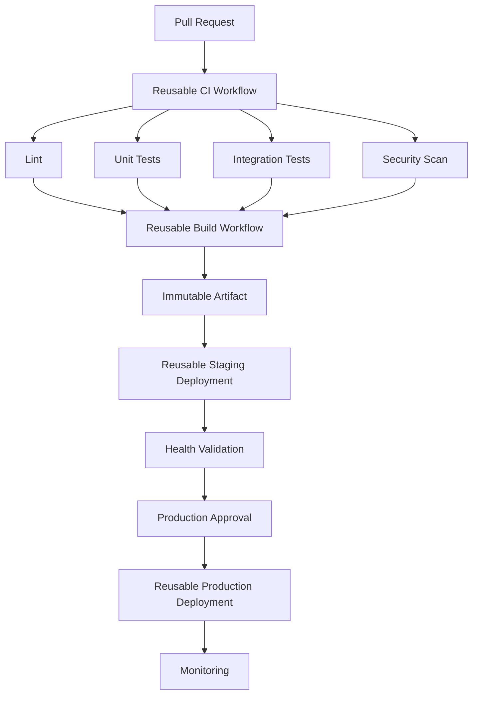

(20260928-130034).txt


Think
# 01- Reusable Workflows

## Overview

Reusable workflows are GitHub Actions workflows designed to be called by other workflows. They provide a mechanism for centralizing CI/CD orchestration so that repositories can share consistent build, test, security, deployment, and operational processes without duplicating complete workflow definitions.

For a production backend organization, reusable workflows are particularly useful when multiple Python, Django, FastAPI, Docker, or infrastructure repositories follow the same engineering standards.

Instead of maintaining:

```text
Repository A
└── .github/workflows/ci.yml

Repository B
└── .github/workflows/ci.yml

Repository C
└── .github/workflows/ci.yml
```

each repository can consume a centrally maintained workflow:

```text
                    ┌─────────────────────┐
                    │ Platform CI Workflow │
                    │   reusable workflow │
                    └──────────┬──────────┘
                               │
              ┌────────────────┼────────────────┐
              │                │                │
              ▼                ▼                ▼
         Repository A     Repository B     Repository C
```

This changes CI/CD from repository-specific YAML duplication into a reusable platform capability.

A reusable workflow is different from a custom action:

- A **reusable workflow** can orchestrate multiple jobs, dependencies, environments, matrices, approvals, and deployment stages.
- A **composite action** packages multiple steps that execute within a single job.
- A **JavaScript or Docker action** packages reusable implementation logic for an individual step.

The primary engineering concern is not simply reducing YAML duplication. It is establishing a stable, versioned, secure interface between application repositories and centralized CI/CD logic.

---

## Why Reusable Workflows Exist

Without reusable workflows, organizations often duplicate CI logic:

```text
Repository A
  ├── checkout
  ├── Python setup
  ├── dependency installation
  ├── lint
  ├── pytest
  └── coverage

Repository B
  ├── checkout
  ├── Python setup
  ├── dependency installation
  ├── lint
  ├── pytest
  └── coverage

Repository C
  ├── checkout
  ├── Python setup
  ├── dependency installation
  ├── lint
  ├── pytest
  └── coverage
```

Over time, these workflows diverge.

One repository may use a different Python version, another may forget a security scan, and another may continue using an outdated action.

Reusable workflows establish one centrally maintained implementation:

```text
                    Shared CI Workflow
                           │
          ┌────────────────┼────────────────┐
          │                │                │
          ▼                ▼                ▼
       Python API       Django API      Worker Service
```

The consuming repositories provide configuration while the platform workflow controls the common execution model.

---

## Reusable Workflow Architecture

A reusable workflow is enabled through `workflow_call`.

```yaml
name: Reusable Python CI

on:
  workflow_call:
    inputs:
      python-version:
        required: false
        type: string
        default: "3.12"

jobs:
  test:
    runs-on: ubuntu-latest

    steps:
      - name: Checkout
        uses: actions/checkout@v4

      - name: Set up Python
        uses: actions/setup-python@v5
        with:
          python-version: ${{ inputs.python-version }}

      - name: Install dependencies
        run: python -m pip install -r requirements.txt

      - name: Run tests
        run: pytest
```

A repository can call it with:

```yaml
name: CI

on:
  pull_request:

jobs:
  ci:
    uses: organization/platform-workflows/.github/workflows/python-ci.yml@v1
```

The caller does not need to duplicate the implementation of the CI jobs.

---

## `workflow_call`

`workflow_call` declares that a workflow can be invoked by another workflow.

A workflow using `workflow_call` can expose:

- inputs
- secrets
- outputs

Example:

```yaml
on:
  workflow_call:
    inputs:
      environment:
        required: true
        type: string

    secrets:
      DEPLOY_TOKEN:
        required: true
```

The called workflow becomes an internal API.

Conceptually:

```text
Caller Workflow
      │
      │ inputs + secrets
      ▼
Reusable Workflow
      │
      ├── jobs
      ├── steps
      ├── conditions
      └── outputs
      │
      ▼
Caller
```

The interface should therefore be designed as carefully as an API.

---

## Inputs

Inputs allow callers to customize reusable workflows without copying their implementation.

```yaml
on:
  workflow_call:
    inputs:
      python-version:
        required: false
        type: string
        default: "3.12"

      run-integration-tests:
        required: false
        type: boolean
        default: true
```

The values can then be used inside the reusable workflow:

```yaml
jobs:
  test:
    runs-on: ubuntu-latest

    steps:
      - name: Set up Python
        uses: actions/setup-python@v5
        with:
          python-version: ${{ inputs.python-version }}

      - name: Run integration tests
        if: ${{ inputs.run-integration-tests }}
        run: pytest tests/integration
```

Inputs should represent meaningful configuration rather than exposing every internal implementation detail.

Good interface:

```text
python-version
run-integration-tests
working-directory
deployment-environment
```

Poor interface:

```text
install-step-1-command
internal-shell-command
temporary-file-name
```

The second approach creates a workflow whose internal implementation leaks into every consumer.

---

## Input Types

Reusable workflow inputs support explicit types.

```yaml
on:
  workflow_call:
    inputs:
      environment:
        required: true
        type: string

      deploy:
        required: true
        type: boolean

      replicas:
        required: false
        type: number
        default: 2
```

Supported types include:

| Type | Typical use |
|---|---|
| `string` | Versions, paths, environment names |
| `boolean` | Feature toggles |
| `number` | Numeric configuration |
| `choice` | Available for manual dispatch inputs rather than `workflow_call` |
| `environment` | Useful for manually selected deployment environments in supported workflow-dispatch scenarios |

For reusable workflows, use the types supported by `workflow_call` rather than treating every input as a string.

---

## Input Validation

Reusable workflows should reject invalid configurations early.

For example:

```yaml
jobs:
  deploy:
    if: ${{ inputs.environment == 'staging' || inputs.environment == 'production' }}
    runs-on: ubuntu-latest

    steps:
      - name: Deploy
        run: ./deploy.sh
```

For more complex validation, a dedicated validation job can fail before privileged operations begin.

```yaml
jobs:
  validate:
    runs-on: ubuntu-latest

    steps:
      - name: Validate environment
        env:
          ENVIRONMENT: ${{ inputs.environment }}
        run: |
          case "$ENVIRONMENT" in
            staging|production)
              ;;
            *)
              echo "Unsupported environment: $ENVIRONMENT"
              exit 1
              ;;
          esac
```

This is particularly important when the reusable workflow controls production deployment.

---

## Secrets

Reusable workflows can explicitly declare secrets.

```yaml
on:
  workflow_call:
    secrets:
      DEPLOY_TOKEN:
        required: true
```

The caller supplies the secret:

```yaml
jobs:
  deploy:
    uses: organization/platform-workflows/.github/workflows/deploy.yml@v1
    secrets:
      DEPLOY_TOKEN: ${{ secrets.DEPLOY_TOKEN }}
```

Explicit secret declaration makes the security boundary visible.

The reusable workflow should receive only the credentials it actually requires.

---

## `secrets: inherit`

Trusted reusable workflows can receive inherited secrets:

```yaml
jobs:
  deploy:
    uses: organization/platform-workflows/.github/workflows/deploy.yml@v1
    secrets: inherit
```

This can simplify configuration, but it increases the reusable workflow's access to credentials.

Use it carefully.

A centralized workflow repository should be treated as highly trusted infrastructure because a compromise can affect every repository consuming the workflow.

For sensitive production pipelines, explicit secret interfaces are often easier to audit:

```yaml
secrets:
  AWS_ROLE_ARN: ${{ secrets.PRODUCTION_AWS_ROLE_ARN }}
```

---

## Outputs

Reusable workflows can expose outputs to their callers.

A workflow-level output can reference a job output:

```yaml
on:
  workflow_call:
    outputs:
      image-tag:
        description: Built image tag
        value: ${{ jobs.build.outputs.image-tag }}

jobs:
  build:
    runs-on: ubuntu-latest

    outputs:
      image-tag: ${{ steps.metadata.outputs.image-tag }}

    steps:
      - id: metadata
        run: echo "image-tag=${GITHUB_SHA}" >> "$GITHUB_OUTPUT"
```

The calling workflow can consume it:

```yaml
jobs:
  build:
    uses: organization/platform-workflows/.github/workflows/build.yml@v1

  deploy:
    needs: build
    runs-on: ubuntu-latest

    steps:
      - name: Show image
        run: echo "Deploying ${{ needs.build.outputs.image-tag }}"
```

This creates a controlled data flow:

```text
Step output
    │
    ▼
Job output
    │
    ▼
Reusable workflow output
    │
    ▼
Caller job
```

---

## Reusable Workflow Interface Design

Treat a reusable workflow like a versioned API.

A good interface should define:

| Interface element | Purpose |
|---|---|
| Inputs | Configuration supplied by caller |
| Secrets | Sensitive values explicitly required |
| Outputs | Data returned to caller |
| Permissions | Security boundary |
| Environments | Deployment boundary |
| Failure behavior | Expected failure semantics |
| Version | Compatibility contract |

Avoid exposing implementation details.

For example:

```yaml
on:
  workflow_call:
    inputs:
      python-version:
        type: string
        default: "3.12"

      run-integration-tests:
        type: boolean
        default: true

    outputs:
      test-report:
        description: Test report artifact identifier
        value: ${{ jobs.test.outputs.report }}
```

The caller should care about what the workflow does, not how every internal step is implemented.

---

## Reusable CI Workflow

A centralized Python CI workflow can standardize common backend validation.

```yaml
name: Python CI

on:
  workflow_call:
    inputs:
      python-version:
        required: false
        type: string
        default: "3.12"

jobs:
  test:
    runs-on: ubuntu-latest

    permissions:
      contents: read

    steps:
      - name: Checkout
        uses: actions/checkout@v4

      - name: Set up Python
        uses: actions/setup-python@v5
        with:
          python-version: ${{ inputs.python-version }}
          cache: pip

      - name: Install dependencies
        run: python -m pip install -r requirements.txt

      - name: Lint
        run: ruff check .

      - name: Test
        run: pytest --cov=. --cov-report=xml

      - name: Upload coverage
        uses: actions/upload-artifact@v4
        with:
          name: coverage
          path: coverage.xml
```

Repositories then use the same CI implementation:

```yaml
jobs:
  ci:
    uses: organization/platform-workflows/.github/workflows/python-ci.yml@v1
    with:
      python-version: "3.12"
```

This provides consistency without forcing every repository to maintain the same YAML.

---

## Reusable Deployment Workflow

Deployment workflows can also be centralized.

```yaml
name: Deploy

on:
  workflow_call:
    inputs:
      environment:
        required: true
        type: string

      image-tag:
        required: true
        type: string

    secrets:
      AWS_ROLE_ARN:
        required: true

jobs:
  deploy:
    runs-on: ubuntu-latest
    environment: ${{ inputs.environment }}

    permissions:
      contents: read
      id-token: write

    steps:
      - name: Configure AWS credentials
        uses: aws-actions/configure-aws-credentials@v5
        with:
          role-to-assume: ${{ secrets.AWS_ROLE_ARN }}
          aws-region: us-east-1

      - name: Deploy
        env:
          IMAGE_TAG: ${{ inputs.image-tag }}
          ENVIRONMENT: ${{ inputs.environment }}
        run: ./deploy.sh
```

The calling workflow becomes small:

```yaml
jobs:
  deploy-staging:
    uses: organization/platform-workflows/.github/workflows/deploy.yml@v1
    with:
      environment: staging
      image-tag: ${{ needs.build.outputs.image-tag }}
    secrets:
      AWS_ROLE_ARN: ${{ secrets.STAGING_AWS_ROLE_ARN }}
```

The reusable deployment workflow owns the deployment implementation while each repository owns its environment-specific configuration.

---

## Reusable Workflows and AWS OIDC

Reusable workflows are well suited to standardizing AWS authentication.

A centralized workflow can enforce:

```text
GitHub Workflow
      │
      ▼
OIDC Token
      │
      ▼
AWS STS
      │
      ▼
Temporary IAM Role
      │
      ├── ECR
      ├── ECS
      ├── S3
      ├── Lambda
      └── CloudFormation
```

The calling repositories do not need long-lived AWS access keys.

A deployment workflow can define:

```yaml
permissions:
  contents: read
  id-token: write
```

and use a tightly scoped IAM role.

This makes the reusable workflow a platform-level security control rather than merely a YAML abstraction.

---

## Versioning Reusable Workflows

Reusable workflows should be versioned.

Possible references include:

```yaml
uses: organization/platform-workflows/.github/workflows/python-ci.yml@main
```

```yaml
uses: organization/platform-workflows/.github/workflows/python-ci.yml@v1
```

```yaml
uses: organization/platform-workflows/.github/workflows/python-ci.yml@<commit-sha>
```

Using `main` is convenient but introduces change risk because consumers automatically receive future changes.

A stable release reference such as:

```text
@v1
```

provides a clearer compatibility contract.

For security-sensitive organizations, pinning to an immutable commit SHA provides stronger integrity guarantees, at the cost of additional update management.

---

## Semantic Versioning

Reusable workflow releases can follow semantic versioning:

```text
v1.0.0
v1.1.0
v1.1.1
v2.0.0
```

A practical interpretation is:

| Change | Example |
|---|---|
| Patch | Bug fix without interface change |
| Minor | Backward-compatible feature |
| Major | Breaking interface or behavior change |

For example, changing:

```yaml
inputs:
  python-version:
```

to a required input could break consumers and should be treated as a compatibility change.

---

## Breaking Changes

A centralized workflow can have a large blast radius.

Suppose 100 repositories use:

```yaml
uses: organization/platform-workflows/.github/workflows/python-ci.yml@v1
```

Changing the `v1` implementation can affect all 100 repositories.

A safer migration model is:

```text
v1
│
├── Existing repositories
│
└── Stable behavior

v2
│
├── New interface
├── New behavior
└── Migration path
```

Repositories can migrate individually:

```text
v1 → v2
```

rather than being forced into an organization-wide breaking deployment.

---

## Cross-Repository Reusable Workflows

A platform repository can centralize workflows for many application repositories:

```text
organization/
│
├── platform-workflows/
│   └── .github/workflows/
│       ├── python-ci.yml
│       ├── docker-build.yml
│       └── deploy-aws.yml
│
├── payments-api/
├── customer-api/
├── notification-service/
└── reporting-service/
```

Each application repository consumes the centralized workflow.

This pattern works particularly well when an organization has common requirements for:

- Python versions
- linting
- testing
- security scanning
- Docker builds
- image publishing
- AWS deployment
- artifact retention
- permissions

---

## Governance of Shared Workflows

Centralized workflows create governance capabilities.

A platform team can standardize:

```text
Every repository
    │
    ▼
Reusable CI
    │
    ├── lint
    ├── tests
    ├── security scan
    └── artifact creation
```

and:

```text
Production repository
    │
    ▼
Reusable deployment
    │
    ├── protected environment
    ├── OIDC
    ├── deployment concurrency
    └── health validation
```

This reduces the probability that individual teams accidentally omit important controls.

However, governance should not make the reusable workflow impossible to customize. Application-specific behavior should remain configurable through a small, stable interface.

---

## Reusable Workflows vs Composite Actions

These mechanisms solve different problems.

| Capability | Reusable Workflow | Composite Action |
|---|---|---|
| Entry point | `workflow_call` | `action.yml` |
| Can orchestrate multiple jobs | Yes | No |
| Can define job dependencies | Yes | No |
| Can contain steps | Yes | Yes |
| Can provide inputs | Yes | Yes |
| Can provide outputs | Yes | Yes |
| Best for | Pipeline orchestration | Reusable step sequences |
| Environment/deployment orchestration | Strong | Limited |
| Matrix/job-level control | Yes | No |
| Reuse scope | Workflow | Job |

For example:

A reusable workflow:

```text
Build
 ├── Test
 ├── Security Scan
 └── Package
       │
       ▼
    Deploy
```

A composite action:

```text
One Job
 └── Composite Action
      ├── Setup
      ├── Configure
      └── Execute
```

Use the reusable workflow when the abstraction crosses job boundaries.

Use a composite action when the abstraction is a reusable sequence of steps within one job.

---

## Fan-Out and Fan-In

Reusable workflows can participate in dependency graphs.

For example:

```text
                 ┌── Python 3.11 ──┐
                 │                 │
Pull Request ────┼── Python 3.12 ──┼──► Package
                 │                 │
                 └── Python 3.13 ──┘
```

A matrix can create the fan-out:

```yaml
strategy:
  matrix:
    python-version:
      - "3.11"
      - "3.12"
      - "3.13"
```

A later job can fan back in:

```yaml
jobs:
  test:
    strategy:
      matrix:
        python-version: ["3.11", "3.12", "3.13"]

  build:
    needs: test
    runs-on: ubuntu-latest
    steps:
      - run: echo "All required test jobs completed"
```

This is useful for backend libraries and services that must support multiple runtime versions.

---

## Dynamic Matrices

A reusable workflow can generate configuration dynamically.

For example:

```yaml
jobs:
  generate:
    runs-on: ubuntu-latest

    outputs:
      matrix: ${{ steps.matrix.outputs.matrix }}

    steps:
      - id: matrix
        run: |
          echo 'matrix={"python":["3.11","3.12","3.13"]}' >> "$GITHUB_OUTPUT"

  test:
    needs: generate
    strategy:
      matrix: ${{ fromJSON(needs.generate.outputs.matrix) }}
    runs-on: ubuntu-latest

    steps:
      - run: python --version
```

The important flow is:

```text
Generate Configuration
        │
        ▼
$GITHUB_OUTPUT
        │
        ▼
Job Output
        │
        ▼
fromJSON()
        │
        ▼
Dynamic Matrix
```

This is useful when the test matrix is generated from repository metadata or a configuration source.

---

## Structured Outputs

Outputs should be used for small control-plane data rather than large files.

Good output:

```text
image-tag=abc123
environment=staging
version=1.8.2
```

Structured JSON is also useful:

```yaml
- id: metadata
  run: |
    echo 'metadata={"version":"1.8.2","image":"abc123"}' >> "$GITHUB_OUTPUT"
```

Then:

```yaml
${{ fromJSON(steps.metadata.outputs.metadata).version }}
```

Large files should generally be represented as artifacts rather than workflow outputs.

---

## Artifacts vs Outputs in Reusable Workflows

| Requirement | Output | Artifact |
|---|---|---|
| Image tag | Yes | No |
| Version string | Yes | No |
| JSON metadata | Yes | Sometimes |
| Coverage XML | No | Yes |
| Build package | No | Yes |
| Test logs | No | Yes |
| Large generated file | No | Yes |

A reusable workflow should keep its output interface small and predictable.

---

## Concurrency in Reusable Workflows

Reusable deployment workflows should protect against simultaneous deployments.

A production workflow can define:

```yaml
concurrency:
  group: production-deployment
  cancel-in-progress: false
```

This prevents two deployments from entering the same deployment concurrency group simultaneously.

For environment-specific workflows:

```yaml
concurrency:
  group: deploy-${{ inputs.environment }}
  cancel-in-progress: false
```

This permits:

```text
staging deployment ──────┐
                         ├── independent
production deployment ───┘
```

while preventing two production deployments from racing.

---

## Deployment Race Conditions

Consider:

```text
Deployment A
  Build image A
  Deploy A
  Health check pending

Deployment B
  Build image B
  Deploy B
  Health check pending
```

If both run simultaneously, the final production state may depend on timing rather than intended promotion order.

Concurrency makes the deployment boundary explicit:

```text
Deployment A
     │
     ▼
Production Lock
     │
     ▼
Deploy A
     │
     ▼
Validation
     │
     ▼
Release Lock
     │
     ▼
Deployment B
```

For production systems, deployment serialization is often more important than maximizing deployment parallelism.

---

## Conditional Deployment

Reusable workflows can separate validation from deployment.

```yaml
jobs:
  deploy:
    if: ${{ inputs.environment == 'production' }}
    runs-on: ubuntu-latest

    steps:
      - name: Deploy
        run: ./deploy.sh
```

More commonly, separate workflows or jobs make the security boundary clearer.

For example:

```text
CI
 │
 ├── lint
 ├── unit tests
 ├── integration tests
 └── security scan
 │
 ▼
Build
 │
 ▼
Artifact
 │
 ├── staging
 │
 └── production
```

This prevents production credentials from being present in ordinary CI jobs.

---

## Promotion Workflows

A reusable deployment workflow can implement environment promotion:

```text
Build
  │
  ▼
Immutable Artifact
  │
  ▼
Staging
  │
  ▼
Validation
  │
  ▼
Approval
  │
  ▼
Production
```

The key principle is:

> Build once and promote the same artifact.

Do not rebuild the application independently for staging and production unless there is a deliberate reason.

Rebuilding can introduce differences in:

- dependency resolution
- base images
- compiler versions
- build tools
- generated assets
- timestamps
- external package availability

The artifact tested in staging should be the artifact deployed to production.

---

## Reusable Workflow Security

A reusable workflow may have access to:

- repository contents
- secrets
- deployment credentials
- cloud identity
- artifacts
- package registries

Therefore, it should be treated as privileged infrastructure.

Use explicit permissions:

```yaml
permissions:
  contents: read
```

For AWS OIDC:

```yaml
permissions:
  contents: read
  id-token: write
```

Avoid broad permissions such as:

```yaml
permissions: write-all
```

unless specifically required.

---

## Untrusted Inputs

Never assume that inputs are safe merely because they originate from a workflow caller.

If an input eventually reaches a shell command, treat it as data.

Avoid:

```yaml
run: ./deploy.sh ${{ inputs.environment }}
```

Prefer:

```yaml
env:
  DEPLOY_ENVIRONMENT: ${{ inputs.environment }}
run: ./deploy.sh "$DEPLOY_ENVIRONMENT"
```

The second pattern prevents direct expression interpolation from becoming part of the shell program.

For deployment inputs, validate allowed values explicitly.

---

## Third-Party Reusable Workflows

Organizations may consume reusable workflows maintained elsewhere.

Before trusting a workflow, evaluate:

- repository ownership
- source code
- permissions
- secrets required
- release process
- versioning
- action dependencies
- maintenance status
- security history
- whether the reference is mutable

A reusable workflow that receives production credentials should be treated as part of the production trusted computing base.

---

## Action and Workflow Pinning

A reusable workflow reference such as:

```yaml
uses: organization/platform-workflows/.github/workflows/deploy.yml@v1
```

provides convenient versioning.

For stronger immutability:

```yaml
uses: organization/platform-workflows/.github/workflows/deploy.yml@<full-commit-sha>
```

SHA pinning reduces the risk of a mutable reference unexpectedly changing the executed workflow.

The trade-off is maintenance: security updates and workflow fixes require explicit reference updates.

---

## Testing Reusable Workflows

A reusable workflow should be tested like production code.

Test:

- valid inputs
- invalid inputs
- missing secrets
- permissions
- matrix behavior
- failure paths
- artifact creation
- output propagation
- deployment conditions
- concurrency
- environment protection
- rollback behavior

A platform repository should have representative consumer repositories or integration tests that exercise the workflow interface.

---

## Change Management

Before changing a widely used reusable workflow:

1. Identify consumers.
2. Determine whether the change is backward compatible.
3. Add tests for the new behavior.
4. Release a new version when necessary.
5. Migrate a small set of repositories.
6. Monitor failures.
7. Continue migration.
8. Retire the old version only after consumers have moved.

For example:

```text
v1
 │
 ├── 80 existing repositories
 │
 └── stable

v2
 │
 ├── 5 pilot repositories
 │
 └── validation

v2
 │
 └── organization-wide adoption
```

This reduces the blast radius of platform-level changes.

---

## Production Architecture

A mature GitHub Actions platform can use reusable workflows as a central control layer.



The repositories provide application-specific configuration while platform workflows provide the common execution and security model.

---

## Repository Layout

A platform workflow repository might use:

```text
platform-workflows/
├── .github/
│   └── workflows/
│       ├── python-ci.yml
│       ├── docker-build.yml
│       ├── security-scan.yml
│       ├── deploy-staging.yml
│       └── deploy-production.yml
├── README.md
└── CHANGELOG.md
```

An application repository might contain only:

```text
application/
├── .github/
│   └── workflows/
│       └── ci.yml
├── src/
├── tests/
├── Dockerfile
└── pyproject.toml
```

The application workflow delegates common behavior:

```yaml
jobs:
  ci:
    uses: organization/platform-workflows/.github/workflows/python-ci.yml@v1
```

This keeps application repositories focused on application code and repository-specific configuration.

---

## Failure Domains

Reusable workflows introduce a new failure domain: the shared workflow itself.

Without centralized workflows:

```text
Repository A ── CI A
Repository B ── CI B
Repository C ── CI C
```

A failure may affect one repository.

With centralized workflows:

```text
                 Shared Workflow
                 /      |      \
                /       |       \
             Repo A   Repo B   Repo C
```

A breaking workflow change can affect all consumers.

This is the main trade-off of centralization.

The benefit is consistency and governance; the risk is increased blast radius.

Versioning, testing, staged rollout, and backward-compatible interfaces reduce this risk.

---

## Scalability Considerations

Reusable workflows improve organizational scalability but do not automatically improve workflow execution performance.

For large organizations:

- keep interfaces stable
- avoid unnecessary inputs
- minimize duplicated setup
- use matrices appropriately
- cache dependencies
- parallelize independent jobs
- serialize production deployments
- centralize common security controls
- version workflows
- monitor workflow duration and failure rates

A useful architecture separates:

```text
Platform concerns
├── CI standards
├── security
├── deployment mechanics
└── operational controls

Application concerns
├── application tests
├── service configuration
├── repository-specific build behavior
└── application deployment parameters
```

---

## Reliability Considerations

Reusable workflows should have predictable failure behavior.

For example:

```text
Build failure
     │
     ▼
Deployment blocked

Test failure
     │
     ▼
Deployment blocked

Security failure
     │
     ▼
Deployment blocked

Staging health failure
     │
     ▼
Production blocked

Production health failure
     │
     ▼
Rollback / incident response
```

Avoid designs where deployment can proceed simply because an unrelated validation job failed.

Conditions should be explicit and dependency relationships should use `needs`.

---

## Monitoring Shared Workflows

Platform teams should monitor:

- workflow success rate
- workflow duration
- queue time
- runner utilization
- deployment frequency
- deployment failure rate
- rollback frequency
- reusable workflow adoption
- deprecated workflow versions
- artifact failures
- cache performance
- authentication failures

A reusable workflow is infrastructure. It should therefore have operational ownership.

---

## Common Mistakes

### Copying Workflows Instead of Reusing Them

If multiple repositories contain almost identical CI logic, consider whether a reusable workflow should own the common behavior.

### Creating an Overly Generic Workflow

A workflow with dozens of inputs becomes difficult to understand and maintain.

Prefer a small, intentional interface.

### Using `main` as a Production Contract

Referencing:

```yaml
@main
```

means consumer behavior can change without an explicit consumer-side update.

Use a versioned reference or immutable commit when appropriate.

### Passing Every Secret

Do not use:

```yaml
secrets: inherit
```

as the default answer for every reusable workflow.

Minimize the secret interface.

### Excessive Permissions

The reusable workflow should request only the permissions it needs.

### Mixing Untrusted CI and Privileged Deployment

Do not give production credentials to jobs that execute arbitrary pull request code.

### Rebuilding During Promotion

Build once and promote the immutable artifact whenever practical.

### Ignoring Blast Radius

A workflow used by 100 repositories is production infrastructure. Test changes accordingly.

---

## Senior-Level Design Guidelines

A senior engineer designing reusable workflows should consider:

| Concern | Engineering question |
|---|---|
| Interface | What does the caller actually need to configure? |
| Security | What secrets and permissions are required? |
| Versioning | How will breaking changes be introduced? |
| Reliability | What happens when the shared workflow fails? |
| Blast radius | How many repositories can one change affect? |
| Deployment | Can the same artifact be promoted across environments? |
| Governance | Which controls must every repository inherit? |
| Scalability | Can the platform support hundreds of repositories? |
| Observability | Can failures be diagnosed centrally? |
| Rollback | Can consumers return to a known-good workflow version? |

The strongest reusable workflow designs behave like stable internal platform APIs rather than giant YAML templates.

---

## Production Pipeline Pattern

A complete backend CI/CD platform can compose reusable workflows into:

```text
Pull Request
    │
    ▼
Reusable CI
    │
    ├── Lint
    ├── Unit Tests
    ├── Integration Tests
    ├── Matrix Testing
    └── Security Scan
    │
    ▼
Reusable Build
    │
    ├── Docker Buildx
    ├── SBOM
    ├── Image Scan
    └── Immutable Image
    │
    ▼
ECR
    │
    ▼
Reusable Staging Deployment
    │
    ▼
Health Validation
    │
    ▼
Protected Production Environment
    │
    ▼
OIDC → AWS STS
    │
    ▼
Reusable Production Deployment
    │
    ▼
Monitoring
    │
    └── Rollback
```

This architecture keeps the implementation centralized while allowing application repositories to consume standardized CI/CD capabilities.

## Interview Scenarios

### Scenario: Multiple repositories need identical Python CI

**Question:** How would you avoid copying the workflow into every repository?

**Expected reasoning:**

Use a reusable workflow with `workflow_call`. Expose only meaningful configuration such as Python version or whether integration tests are required. Version the reusable workflow and provide a migration strategy for breaking changes.

---

### Scenario: Production deployment requires AWS credentials

**Question:** Would you store an AWS access key in repository secrets?

**Expected reasoning:**

Prefer GitHub OIDC with AWS STS. The workflow receives `id-token: write`, obtains an OIDC identity token, and assumes a tightly scoped IAM role. The IAM trust policy should restrict which repository/environment/workflow can assume the role.

---

### Scenario: The reusable deployment workflow needs only one secret

**Question:** Would you use `secrets: inherit`?

**Expected reasoning:**

Prefer explicit secret passing when practical. The reusable workflow should receive only the credential it needs, reducing the blast radius and making its security contract easier to audit.

---

### Scenario: A workflow change could affect 300 repositories

**Question:** How would you deploy the change safely?

**Expected reasoning:**

Treat the workflow as a versioned platform API. Test it, release a new version, migrate representative repositories first, monitor failures, and then progressively migrate the remaining repositories. Avoid silently changing a widely consumed mutable reference.

---

### Scenario: Staging and production must run the same application build

**Question:** How would you design the pipeline?

**Expected reasoning:**

Build once, create an immutable artifact such as a Docker image tagged with a commit SHA, deploy that artifact to staging, validate it, and promote the exact same artifact to production. Do not rebuild separately for production.

---

### Scenario: A pull request requires testing but production credentials exist

**Question:** How do you prevent credential exposure?

**Expected reasoning:**

Separate untrusted pull request validation from privileged deployment. Keep production credentials behind a protected environment and ensure jobs executing untrusted code do not receive production secrets or unnecessary write permissions.

---

### Scenario: Two production deployments start simultaneously

**Question:** How do you prevent a race?

**Expected reasoning:**

Use a production-specific concurrency group with `cancel-in-progress: false` when deployments must complete in order rather than canceling an active deployment. Combine concurrency with health validation and rollback.

---

### Scenario: A reusable workflow contains multiple jobs

**Question:** Why is this different from a composite action?

**Expected reasoning:**

A reusable workflow can orchestrate multiple jobs, dependencies, environments, matrices, and deployment stages. A composite action packages reusable steps that execute within a single job.

---

### Scenario: A shared workflow introduces a breaking change

**Question:** How should consumers be migrated?

**Expected reasoning:**

Release a new major workflow version, document the interface change, test representative consumers, migrate progressively, monitor failures, and retire the previous version only after consumers have migrated.

---

## Operational Checklist

Before publishing a reusable workflow, verify:

- [ ] `workflow_call` is used correctly.
- [ ] Inputs have explicit types and sensible defaults.
- [ ] Invalid inputs are rejected.
- [ ] Secrets are explicitly scoped where practical.
- [ ] Permissions use least privilege.
- [ ] Untrusted inputs are not interpolated directly into shell commands.
- [ ] Production deployment uses protected environments.
- [ ] AWS authentication uses OIDC where applicable.
- [ ] Deployment concurrency is defined.
- [ ] Outputs expose only necessary control-plane data.
- [ ] Large files use artifacts rather than outputs.
- [ ] Workflow references are versioned.
- [ ] Breaking changes have a migration strategy.
- [ ] The workflow has representative tests.
- [ ] Failure paths are understood.
- [ ] Rollback procedures are documented.
- [ ] Shared-workflow blast radius is understood.
- [ ] Consumers can identify the workflow version they are running.

## Key Takeaways

- Reusable workflows turn repeated GitHub Actions pipeline logic into versioned, centrally governed platform capabilities that can orchestrate multiple jobs and environments.
- Treat reusable workflows as internal APIs: keep inputs, secrets, outputs, permissions, and behavior intentionally small and stable.
- Separate reusable workflow orchestration from composite actions, which package reusable steps inside a single job.
- For production CI/CD, combine reusable workflows with least-privilege permissions, protected environments, OIDC, concurrency, immutable artifacts, and controlled versioning.
- Centralization improves consistency but increases blast radius, so test shared workflows, version breaking changes, and migrate consumers progressively.