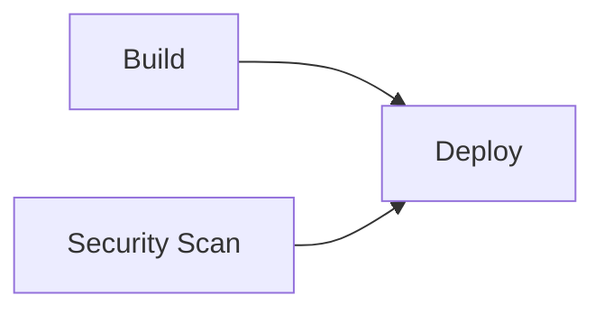
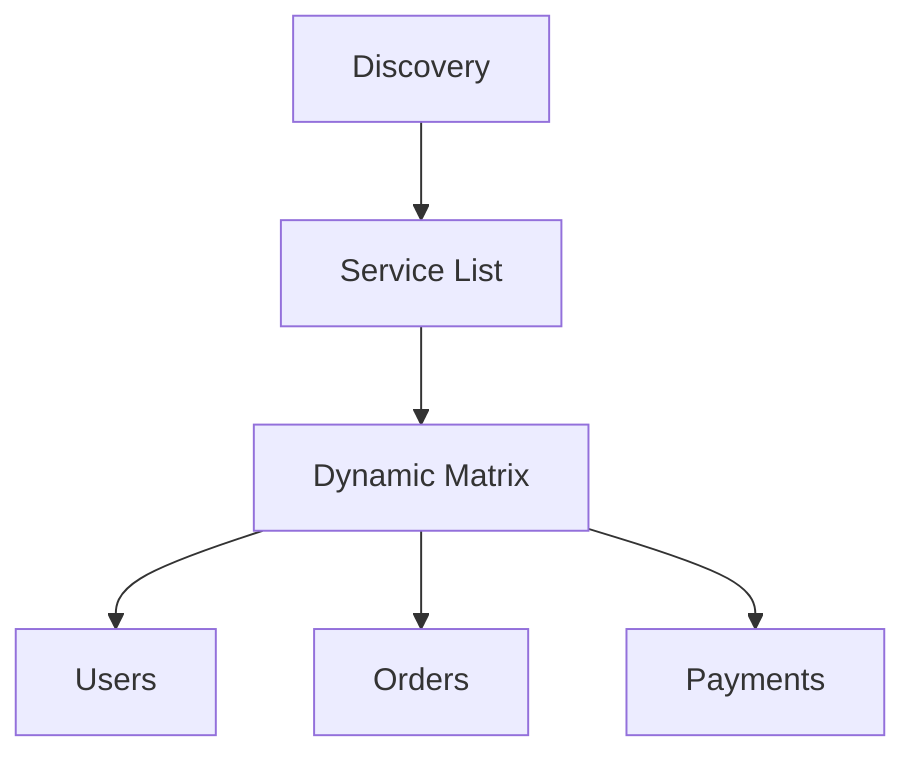
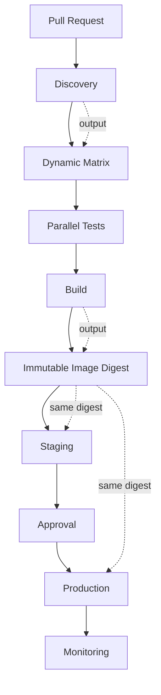

# 03- Workflow Outputs

## Overview

GitHub Actions outputs provide a controlled mechanism for passing small pieces of data through a workflow.

They are useful when one part of a pipeline produces information that another part needs to consume, such as:

- A generated Docker image tag.
- An immutable image digest.
- A deployment identifier.
- A release version.
- A dynamically generated matrix.
- A deployment environment.
- A boolean decision from a discovery job.
- Structured JSON metadata.
- Outputs exposed by reusable workflows.

The most important output scopes are:

```text
Step
  ↓
Step Output
  ↓
Job Output
  ↓
Reusable Workflow Output
  ↓
Caller Workflow
```

Outputs should be treated as **pipeline interfaces**, not as general-purpose storage.

Use outputs for small, explicit control-plane data. Use artifacts for files, caches for reusable dependencies, and secrets for sensitive values.

## Why Workflow Outputs Matter

A simple workflow can execute sequentially without passing much data:

```text
Checkout
  ↓
Test
  ↓
Build
  ↓
Deploy
```

Production pipelines are usually more dynamic:

```text
Pull Request
    ↓
Change Detection
    ↓
Dynamic Matrix
    ↓
Parallel Tests
    ↓
Build
    ↓
Image Digest
    ↓
Staging
    ↓
Approval
    ↓
Production
```

Each stage may need information generated by a previous stage.

For example:

```text
Build
  │
  └── image-digest
          ↓
       Staging
          ↓
      Production
```

Without outputs, engineers often resort to unnecessary artifacts, duplicated calculations, or hard-coded values.

## Output Scope

GitHub Actions provides several levels of data communication.

| Scope | Mechanism | Typical Use |
|---|---|---|
| Step → Step | Step output | Calculated value within one job |
| Step → Job | Job output | Promote step data to job scope |
| Job → Job | `needs.<job>.outputs` | Cross-job communication |
| Reusable workflow → Caller | Workflow output | Public reusable workflow interface |
| File → Job | Artifact | Build/test files |
| Dependency → Job | Cache | Reusable dependencies |
| Sensitive value → Job/Step | Secret | Credentials and sensitive configuration |

A useful design rule is:

> Use the smallest mechanism that correctly represents the data.

## Step Outputs

A step can publish a named output using the `GITHUB_OUTPUT` environment file.

```yaml
jobs:
  build:
    runs-on: ubuntu-latest

    steps:
      - name: Calculate version
        id: version
        run: |
          VERSION="1.4.2"
          echo "version=$VERSION" >> "$GITHUB_OUTPUT"

      - name: Use version
        run: |
          echo "Building version ${{ steps.version.outputs.version }}"
```

The important parts are:

- `id` identifies the producing step.
- `GITHUB_OUTPUT` is the supported output mechanism.
- `steps.<step_id>.outputs.<output_name>` reads the value.

The output is available to later steps in the same job.

## Step Output Lifecycle


Example:

```yaml
- name: Detect application
  id: detect
  run: |
    echo "application=backend" >> "$GITHUB_OUTPUT"
    echo "dockerfile=Dockerfile" >> "$GITHUB_OUTPUT"

- name: Build
  run: |
    echo "Application: ${{ steps.detect.outputs.application }}"
    echo "Dockerfile: ${{ steps.detect.outputs.dockerfile }}"
```

## Job Outputs

A step output is scoped to its job. To make it available to another job, expose it through `jobs.<job_id>.outputs`.

```yaml
jobs:
  build:
    runs-on: ubuntu-latest

    outputs:
      image_tag: ${{ steps.metadata.outputs.image_tag }}

    steps:
      - name: Generate image tag
        id: metadata
        run: |
          echo "image_tag=backend-${GITHUB_SHA::12}" >> "$GITHUB_OUTPUT"

  deploy:
    needs: build
    runs-on: ubuntu-latest

    steps:
      - name: Deploy
        run: |
          echo "Deploying ${{ needs.build.outputs.image_tag }}"
```

The data flow is:

```text
build
  ↓
metadata step
  ↓
steps.metadata.outputs.image_tag
  ↓
jobs.build.outputs.image_tag
  ↓
needs.build.outputs.image_tag
  ↓
deploy
```

This explicit promotion is important because it makes the workflow dependency visible.

## `GITHUB_OUTPUT`

`GITHUB_OUTPUT` is an environment variable containing the path to the file used for setting step outputs.

Use:

```bash
echo "name=value" >> "$GITHUB_OUTPUT"
```

Example:

```yaml
- name: Generate metadata
  id: metadata
  shell: bash
  run: |
    echo "version=2.1.0" >> "$GITHUB_OUTPUT"
```

Consume it with:

```yaml
- name: Display version
  run: |
    echo "${{ steps.metadata.outputs.version }}"
```

Avoid older workflow-command patterns such as manually emitting deprecated `::set-output` commands.

## Multiple Outputs

A step can publish multiple outputs.

```yaml
- name: Generate metadata
  id: metadata
  run: |
    echo "version=2.1.0" >> "$GITHUB_OUTPUT"
    echo "environment=staging" >> "$GITHUB_OUTPUT"
    echo "artifact=backend.tar.gz" >> "$GITHUB_OUTPUT"
```

They can be consumed independently:

```yaml
- name: Display metadata
  run: |
    echo "Version: ${{ steps.metadata.outputs.version }}"
    echo "Environment: ${{ steps.metadata.outputs.environment }}"
    echo "Artifact: ${{ steps.metadata.outputs.artifact }}"
```

Prefer several clearly named outputs over one ambiguous output called `result`.

## Multiline Outputs

Multiline output values can be written using the environment-file delimiter syntax.

```yaml
- name: Generate configuration
  id: config
  shell: bash
  run: |
    {
      echo 'configuration<<EOF'
      cat config.json
      echo 'EOF'
    } >> "$GITHUB_OUTPUT"
```

The consumer can then reference:

```yaml
- name: Use configuration
  run: |
    echo '${{ steps.config.outputs.configuration }}'
```

For structured data, a compact JSON representation is generally easier to reason about than large multiline values.

## Passing Data Between Jobs

The standard cross-job pattern is:

```yaml
jobs:
  producer:
    outputs:
      value: ${{ steps.generate.outputs.value }}

    steps:
      - id: generate
        run: |
          echo "value=production" >> "$GITHUB_OUTPUT"

  consumer:
    needs: producer

    steps:
      - run: |
          echo "${{ needs.producer.outputs.value }}"
```

The consumer must declare the dependency using `needs`.

This provides both:

1. Execution ordering.
2. Access to the upstream job's outputs.

## `needs` and Job Outputs

The `needs` context exposes outputs from completed prerequisite jobs.

```yaml
deploy:
  needs:
    - build
    - security

  steps:
    - name: Deploy
      run: |
        echo "Image: ${{ needs.build.outputs.image_tag }}"
        echo "Security: ${{ needs.security.outputs.status }}"
```

A dependency graph might look like:



The deployment job should depend on every job whose successful completion is required for deployment.

## Passing Structured Data

Outputs can transport structured data when represented as JSON.

Example:

```yaml
jobs:
  discover:
    runs-on: ubuntu-latest

    outputs:
      services: ${{ steps.services.outputs.services }}

    steps:
      - name: Discover services
        id: services
        run: |
          SERVICES='["users","orders","payments"]'
          echo "services=$SERVICES" >> "$GITHUB_OUTPUT"
```

A downstream job can convert the JSON into a matrix:

```yaml
  test:
    needs: discover
    runs-on: ubuntu-latest

    strategy:
      matrix:
        service: ${{ fromJSON(needs.discover.outputs.services) }}

    steps:
      - name: Test service
        run: |
          echo "Testing ${{ matrix.service }}"
```

This enables runtime-generated workflow behavior.

## Dynamic Matrices

Static matrices are appropriate when the dimensions are known ahead of time:

```yaml
strategy:
  matrix:
    python-version:
      - "3.11"
      - "3.12"
      - "3.13"
```

Dynamic matrices are useful when the values depend on repository state or earlier processing.

For example:

```yaml
jobs:
  discover:
    runs-on: ubuntu-latest

    outputs:
      python_versions: ${{ steps.matrix.outputs.python_versions }}

    steps:
      - id: matrix
        run: |
          echo 'python_versions=["3.11","3.12","3.13"]' >> "$GITHUB_OUTPUT"

  test:
    needs: discover
    runs-on: ubuntu-latest

    strategy:
      matrix:
        python-version: ${{ fromJSON(needs.discover.outputs.python_versions) }}

    steps:
      - uses: actions/setup-python@v5
        with:
          python-version: ${{ matrix.python-version }}

      - run: python --version
```

The architecture becomes:

```text
Discovery
    ↓
JSON output
    ↓
fromJSON()
    ↓
Matrix
    ├── Python 3.11
    ├── Python 3.12
    └── Python 3.13
```

## Dynamic Matrix for a Monorepo

A monorepo can discover changed services and test only those services.

```text
Repository
    ↓
Change Detection
    ↓
["users", "orders", "payments"]
    ↓
Dynamic Matrix
    ├── users
    ├── orders
    └── payments
```

Example:

```yaml
jobs:
  changes:
    runs-on: ubuntu-latest

    outputs:
      services: ${{ steps.detect.outputs.services }}

    steps:
      - uses: actions/checkout@v4

      - name: Detect changed services
        id: detect
        run: |
          echo 'services=["users","orders"]' >> "$GITHUB_OUTPUT"

  test:
    needs: changes

    strategy:
      matrix:
        service: ${{ fromJSON(needs.changes.outputs.services) }}

    runs-on: ubuntu-latest

    steps:
      - uses: actions/checkout@v4

      - name: Test service
        run: |
          ./scripts/test-service.sh "${{ matrix.service }}"
```

This reduces unnecessary work, but it also introduces more dynamic behavior. The discovery logic becomes part of the CI/CD control plane and therefore needs testing.

## `fromJSON()` and `toJSON()`

`fromJSON()` is particularly useful for turning a string output into structured workflow configuration.

```yaml
strategy:
  matrix: ${{ fromJSON(needs.discover.outputs.matrix) }}
```

`toJSON()` can serialize a context or object for inspection.

```yaml
- name: Debug metadata
  run: |
    echo '${{ toJSON(github) }}'
```

Do not dump entire contexts indiscriminately in production workflows. Contexts may contain information that should not be exposed in logs.

Prefer targeted debugging:

```yaml
- name: Debug
  run: |
    echo "Repository: ${{ github.repository }}"
    echo "Ref: ${{ github.ref }}"
    echo "SHA: ${{ github.sha }}"
```

## Output Data Modeling

Good output values are small and deterministic.

Examples:

```text
image-tag
image-digest
artifact-name
deployment-id
release-version
environment
commit-sha
deployment-url
```

Poor candidates include:

```text
large logs
database dumps
binary files
large test reports
dependency directories
complete application configuration
```

Use the correct storage mechanism instead.

| Data | Mechanism |
|---|---|
| Small scalar | Output |
| Small JSON metadata | Output |
| Build package | Artifact |
| Test report | Artifact |
| Dependency cache | Cache |
| Credentials | Secret |
| Large external data | External storage |

## Outputs vs Artifacts

Artifacts persist files and are appropriate for data that must survive beyond an individual job.

Outputs are better for small values used for workflow control.

Avoid this:

```text
Build
  ↓
Write image-tag.txt
  ↓
Upload artifact
  ↓
Download artifact
  ↓
Read image-tag.txt
  ↓
Deploy
```

Prefer:

```text
Build
  ↓
Job output
  ↓
Deploy
```

Use artifacts when the value is actually a file or build product.

## Outputs vs Cache

Outputs and caches solve different problems.

| Outputs | Cache |
|---|---|
| Pipeline communication | Dependency reuse |
| Usually small metadata | Potentially large dependency data |
| Current workflow execution | Reused across workflow executions |
| Represents calculated state | Represents reusable data |
| Explicit producer/consumer relationship | Key-based restoration |

A Python dependency cache might use:

```yaml
- uses: actions/setup-python@v5
  with:
    python-version: "3.12"
    cache: pip
```

A generated Docker tag should use an output.

Do not use a cache as a general data-passing mechanism.

## Workflow Outputs

Reusable workflows can expose outputs to their callers.

```yaml
name: Build Application

on:
  workflow_call:
    outputs:
      image-tag:
        description: "Immutable image tag"
        value: ${{ jobs.build.outputs.image-tag }}

jobs:
  build:
    runs-on: ubuntu-latest

    outputs:
      image-tag: ${{ steps.metadata.outputs.image-tag }}

    steps:
      - name: Generate image tag
        id: metadata
        run: |
          echo "image-tag=backend-${GITHUB_SHA::12}" >> "$GITHUB_OUTPUT"
```

A caller can consume the workflow output:

```yaml
jobs:
  build:
    uses: organization/platform/.github/workflows/build.yml@v1

  deploy:
    needs: build
    runs-on: ubuntu-latest

    steps:
      - name: Deploy
        run: |
          echo "Deploying ${{ needs.build.outputs.image-tag }}"
```

The complete data flow is:

```text
Step Output
    ↓
Job Output
    ↓
Reusable Workflow Output
    ↓
Caller Job
```

## Reusable Workflow Outputs as APIs

A reusable workflow should expose a small, stable interface.

For example:

```text
Inputs:
    application
    environment
    source-ref

Outputs:
    image-digest
    artifact-name
    deployment-id
```

The caller should not need to know how the reusable workflow internally:

- Builds the image.
- Installs dependencies.
- Runs tests.
- Generates metadata.
- Authenticates with AWS.
- Publishes artifacts.

This is the same abstraction principle used for application APIs.


Changing internal implementation should not require callers to change unless the public interface changes.

## Workflow Output Naming

Prefer names that describe stable concepts.

Good:

```yaml
outputs:
  image-digest:
  deployment-id:
  release-version:
```

Avoid:

```yaml
outputs:
  result:
  value:
  data:
  command-output:
```

Good names reduce cognitive load when reading complex dependency graphs.

Recommended characteristics:

- Descriptive.
- Stable.
- Domain-oriented.
- Independent of implementation details.
- Consistent across repositories.

## Outputs and Deployment Pipelines

A production pipeline commonly generates deployment metadata:

```yaml
jobs:
  build:
    runs-on: ubuntu-latest

    outputs:
      image-digest: ${{ steps.image.outputs.digest }}

    steps:
      - id: image
        run: |
          echo "digest=sha256:abc123..." >> "$GITHUB_OUTPUT"
```

The same digest can then be consumed by staging:

```yaml
staging:
  needs: build
  runs-on: ubuntu-latest

  steps:
    - name: Deploy
      env:
        IMAGE_DIGEST: ${{ needs.build.outputs.image-digest }}
      run: |
        ./deploy.sh staging "$IMAGE_DIGEST"
```

Production can use the same immutable reference:

```yaml
production:
  needs: staging
  runs-on: ubuntu-latest

  steps:
    - name: Deploy
      env:
        IMAGE_DIGEST: ${{ needs.build.outputs.image-digest }}
      run: |
        ./deploy.sh production "$IMAGE_DIGEST"
```

This supports the production principle:

```text
Build
  ↓
Immutable Artifact
  ↓
Staging
  ↓
Approval
  ↓
Production
```

rather than rebuilding the application independently for each environment.

## Outputs and Conditional Jobs

Outputs can determine whether a downstream job should execute.

```yaml
jobs:
  changes:
    runs-on: ubuntu-latest

    outputs:
      backend_changed: ${{ steps.detect.outputs.backend_changed }}

    steps:
      - uses: actions/checkout@v4

      - name: Detect backend changes
        id: detect
        run: |
          echo "backend_changed=true" >> "$GITHUB_OUTPUT"

  backend-tests:
    needs: changes
    if: ${{ needs.changes.outputs.backend_changed == 'true' }}
    runs-on: ubuntu-latest

    steps:
      - run: ./scripts/test-backend.sh
```

This pattern is particularly useful in monorepos.

The discovery job owns the decision:

```text
Discovery
    ↓
backend_changed=true
    ↓
Backend Tests
```

## Outputs and Fan-Out

Outputs can feed a dynamically generated fan-out.



The advantage is that the workflow can adapt to runtime information.

The trade-off is additional complexity in:

- Debugging.
- Observability.
- Failure analysis.
- Matrix sizing.
- Conditional behavior.

Use dynamic fan-out where it materially reduces unnecessary CI work or enables a scalable architecture.

## Outputs and Fan-In

A matrix can be followed by an aggregation job.

```yaml
jobs:
  test:
    strategy:
      matrix:
        service:
          - users
          - orders
          - payments

    runs-on: ubuntu-latest

    steps:
      - run: ./scripts/test-service.sh "${{ matrix.service }}"

  aggregate:
    needs: test
    runs-on: ubuntu-latest

    steps:
      - name: Aggregate
        run: echo "Matrix execution completed"
```

The architecture is:

```text
             ┌── users ────┐
             │             │
Discovery ───┼── orders ───┼──> Aggregate
             │             │
             └── payments ─┘
```

Fan-out improves parallelism. Fan-in provides a controlled synchronization point.

## Outputs and Failure Handling

Dependent jobs normally do not run when their required upstream job fails.

```yaml
deploy:
  needs: build
```

If `build` fails, `deploy` is skipped.

Diagnostic or cleanup jobs can use status functions where appropriate.

```yaml
cleanup:
  needs: build
  if: ${{ failure() }}
  runs-on: ubuntu-latest

  steps:
    - run: ./scripts/cleanup.sh
```

For cleanup that should run regardless of the upstream result:

```yaml
cleanup:
  needs: build
  if: ${{ always() }}
```

`always()` should be used deliberately. It is not a substitute for understanding dependency and cancellation behavior.

Production deployment should not be forced to execute after an upstream failure merely because `always()` was added.

## Outputs and Environment Variables

`GITHUB_OUTPUT` and `GITHUB_ENV` serve different purposes.

```text
GITHUB_OUTPUT
    ↓
Named workflow output

GITHUB_ENV
    ↓
Environment variable for later steps
```

Example:

```yaml
- name: Configure test environment
  run: |
    echo "DJANGO_SETTINGS_MODULE=config.settings.test" >> "$GITHUB_ENV"
```

Use an output when the value represents a result or decision:

```yaml
- name: Determine deployment target
  id: target
  run: |
    echo "environment=staging" >> "$GITHUB_OUTPUT"
```

Use environment variables for execution configuration, not as a replacement for job outputs.

## Outputs and `GITHUB_PATH`

`GITHUB_PATH` modifies the executable search path for later steps.

```yaml
- name: Add local tools
  run: |
    echo "$HOME/.local/bin" >> "$GITHUB_PATH"
```

This is unrelated to workflow outputs.

The three mechanisms should remain conceptually separate:

| File | Purpose |
|---|---|
| `GITHUB_OUTPUT` | Named step outputs |
| `GITHUB_ENV` | Environment variables |
| `GITHUB_PATH` | PATH modifications |

## Outputs and Security

Outputs must be treated carefully when their values originate from untrusted sources.

Potential sources include:

- Pull request titles.
- Branch names.
- Commit messages.
- Issue content.
- Manual workflow inputs.
- External API responses.
- Repository-controlled configuration.

The main risk occurs when output values are later interpreted by a shell.

Avoid:

```yaml
- run: |
    ./deploy.sh ${{ steps.metadata.outputs.environment }}
```

Prefer:

```yaml
- name: Deploy
  env:
    TARGET_ENV: ${{ steps.metadata.outputs.environment }}
  run: |
    ./deploy.sh "$TARGET_ENV"
```

For values that control privileged operations, validate the allowed set:

```bash
case "$TARGET_ENV" in
  staging|production)
    ;;
  *)
    echo "Invalid environment"
    exit 1
    ;;
esac
```

Do not assume that an output is trusted merely because it was produced by an earlier workflow step.

## Outputs and Secrets

Secrets should not be passed through outputs.

Avoid:

```yaml
- id: credentials
  run: |
    echo "password=${{ secrets.DB_PASSWORD }}" >> "$GITHUB_OUTPUT"
```

Use secrets directly:

```yaml
- name: Run migration
  env:
    DB_PASSWORD: ${{ secrets.DB_PASSWORD }}
  run: |
    ./scripts/migrate.sh
```

Outputs should contain pipeline metadata, not credentials.

## Output Validation

Any output that influences deployment or security-sensitive behavior should be validated.

Example:

```yaml
- name: Validate deployment target
  env:
    TARGET_ENV: ${{ needs.discovery.outputs.environment }}
  run: |
    case "$TARGET_ENV" in
      development|staging|production)
        echo "Valid environment: $TARGET_ENV"
        ;;
      *)
        echo "Unsupported environment: $TARGET_ENV"
        exit 1
        ;;
    esac
```

Validation is particularly important for:

- Environment names.
- AWS account identifiers.
- Repository names.
- Image references.
- Deployment commands.
- User-provided values.

## JSON Validation

Dynamic matrices frequently fail because the generated JSON is malformed.

Valid:

```json
["users", "orders", "payments"]
```

Invalid:

```text
[users, orders, payments]
```

When debugging locally, `jq` is useful:

```bash
echo '["users","orders","payments"]' | jq .
```

For object-based matrices:

```bash
echo '{"include":[{"service":"users"},{"service":"orders"}]}' | jq .
```

Validate generated configuration before feeding it into `fromJSON()`.

## Large Data and Output Limitations

Outputs are not intended to replace artifact storage or external data stores.

Avoid using outputs for:

- Large source archives.
- Complete logs.
- Database exports.
- Binary packages.
- Large configuration documents.
- Extensive test reports.

Use artifacts:

```text
Build
  ↓
Upload Artifact
  ↓
Download Artifact
```

Use outputs for:

```text
Build
  ↓
image-digest
  ↓
Deploy
```

The distinction is fundamental:

> Outputs communicate metadata; artifacts transport files.

## Reliability Considerations

Reliable workflow outputs should be:

- Deterministic.
- Small.
- Explicit.
- Validated.
- Immutable where possible.
- Independent of transient runner paths.
- Stable across workflow versions.

Prefer:

```text
sha256:abc...
```

over:

```text
latest
```

for production artifact identification.

Prefer:

```text
deployment-id=deploy-12345
```

over:

```text
result=success
```

when the consumer actually needs to identify a deployment.

## Scalability Considerations

Outputs become particularly valuable in large repositories.

A scalable monorepo architecture might be:

```text
Repository
    ↓
Change Detection
    ↓
Changed Services
    ↓
Dynamic Matrix
    ↓
Parallel Test Jobs
    ↓
Artifact Generation
    ↓
Aggregation
    ↓
Deployment
```

Outputs provide the control-plane communication between these stages.

However, dynamic workflows should not be introduced unnecessarily. A static matrix is easier to understand when the set of targets is stable.

The engineering goal is not maximum dynamism. It is an appropriate balance between:

- Maintainability.
- Execution speed.
- Cost.
- Debuggability.
- Flexibility.

## Monitoring and Debugging

Output-related failures should be diagnosed at the point where data crosses a workflow boundary.

A practical troubleshooting sequence is:

```text
Producer Step
    ↓
Step Output
    ↓
Job Output
    ↓
needs Dependency
    ↓
Consumer Expression
```

If the value disappears, identify the first broken boundary.

For targeted debugging:

```yaml
- name: Debug output
  run: |
    echo "Image tag: '${{ steps.metadata.outputs.image_tag }}'"
```

For a job output:

```yaml
- name: Debug dependency
  run: |
    echo "Image tag: '${{ needs.build.outputs.image_tag }}'"
```

Avoid printing entire contexts or sensitive information.

## Troubleshooting Workflow Outputs

### Symptom

A downstream job receives an empty output.

### Possible Causes

- Producer step has no `id`.
- Output name is incorrect.
- Value was not written to `GITHUB_OUTPUT`.
- Job output was not declared.
- `needs` is missing.
- Upstream job was skipped.
- Expression references the wrong context.
- Generated JSON is invalid.

### Isolation Strategy

Start with the producer:

```yaml
- name: Inspect step output
  run: |
    echo "Value: '${{ steps.metadata.outputs.image_tag }}'"
```

Then inspect the consumer:

```yaml
- name: Inspect job output
  run: |
    echo "Value: '${{ needs.build.outputs.image_tag }}'"
```

This identifies whether the problem is within the job or at the job boundary.

### Commands and Checks

List workflow runs:

```bash
gh run list
```

Inspect a specific run:

```bash
gh run view <run-id>
```

Inspect logs:

```bash
gh run view <run-id> --log
```

View workflow information:

```bash
gh workflow view <workflow-id>
```

Validate JSON:

```bash
echo '{"services":["api","worker"]}' | jq .
```

### Root Cause

Identify the first broken boundary:

```text
Producer
  ↓
Step Output
  ↓
Job Output
  ↓
needs
  ↓
Consumer
```

### Corrective Action

Fix the first broken boundary rather than introducing an artifact or environment variable unnecessarily.

### Prevention

- Use descriptive step IDs.
- Keep output names stable.
- Validate JSON.
- Keep output payloads small.
- Document reusable workflow outputs.
- Test reusable workflows.
- Keep dependencies explicit.

## Common Mistakes

### Forgetting the Step ID

Incorrect:

```yaml
- run: echo "version=1.0.0" >> "$GITHUB_OUTPUT"

- run: echo "${{ steps.version.outputs.value }}"
```

Correct:

```yaml
- id: version
  run: echo "value=1.0.0" >> "$GITHUB_OUTPUT"
```

### Forgetting Job Outputs

Incorrect:

```yaml
jobs:
  build:
    steps:
      - id: image
        run: echo "tag=abc" >> "$GITHUB_OUTPUT"

  deploy:
    needs: build
    steps:
      - run: echo "${{ needs.build.outputs.tag }}"
```

Correct:

```yaml
jobs:
  build:
    outputs:
      tag: ${{ steps.image.outputs.tag }}

    steps:
      - id: image
        run: echo "tag=abc" >> "$GITHUB_OUTPUT"
```

### Using the Wrong Context

Step outputs:

```text
steps.<id>.outputs.<name>
```

Job outputs:

```text
needs.<job>.outputs.<name>
```

Confusing the two is a common source of empty values.

### Using Artifacts for Small Values

Do not create an artifact solely to pass:

```text
version
image-tag
environment
deployment-id
```

Use outputs.

### Using Outputs for Secrets

Never treat outputs as a secure secret transport layer.

### Passing Unquoted Output to Shell

Avoid:

```yaml
run: ./deploy.sh ${{ needs.build.outputs.image_tag }}
```

Prefer:

```yaml
env:
  IMAGE_TAG: ${{ needs.build.outputs.image_tag }}
run: ./deploy.sh "$IMAGE_TAG"
```

### Generating Invalid JSON

Dynamic matrix generation requires valid JSON.

Test generated values before passing them to `fromJSON()`.

## Production Architecture Pattern

A mature backend pipeline can use outputs as its control plane.



The key principle is separation:

```text
Outputs
    → pipeline metadata

Artifacts
    → build/test files

Caches
    → reusable dependencies

Secrets
    → sensitive credentials

External storage
    → large persistent data
```

This separation makes the pipeline easier to secure, operate, and scale.

## Interview Scenarios

### Passing an Image Tag Between Jobs

**Question:** A build job generates a Docker image tag. How should a deployment job consume it?

Expected architecture:

```text
Step Output
    ↓
Job Output
    ↓
needs.build.outputs.image_tag
```

An artifact is unnecessary for a simple scalar value.

### Dynamic Microservice Testing

**Question:** A monorepo contains many services, but only changed services should be tested. How would you design it?

Expected approach:

```text
Change Detection
    ↓
JSON Service List
    ↓
Job Output
    ↓
fromJSON()
    ↓
Dynamic Matrix
    ↓
Parallel Tests
```

Senior-level considerations include:

- Matrix size.
- Service dependencies.
- Failure isolation.
- Cost.
- Runtime.
- Observability.
- Fan-in behavior.

### Immutable Deployment

**Question:** Staging succeeds and production requires approval. How should the image be selected?

Prefer:

```text
Build
  ↓
Image Digest
  ↓
Staging
  ↓
Approval
  ↓
Production
```

Do not rebuild the image after approval.

### Untrusted Output

**Question:** A pull request title becomes an output and is later passed to a shell command. What should you consider?

The value should be treated as untrusted data.

Prefer environment-variable passing and quoted shell arguments:

```yaml
- name: Process title
  env:
    PR_TITLE: ${{ steps.metadata.outputs.title }}
  run: |
    ./process-title.sh "$PR_TITLE"
```

## Operational Checklist

Before using workflow outputs in production, verify:

- Step outputs use `GITHUB_OUTPUT`.
- Producing steps have stable IDs.
- Job outputs explicitly map step outputs.
- Downstream jobs declare `needs`.
- Output names describe stable concepts.
- JSON outputs are valid.
- Dynamic matrices are validated.
- Secrets are never passed through outputs.
- Untrusted output values are handled safely.
- Shell arguments are quoted.
- Large files are transported through artifacts.
- Dependencies use caches rather than outputs.
- Immutable image digests are preferred for deployments.
- Failure and skip behavior is explicitly understood.
- Reusable workflow outputs are documented.
- Output failures can be diagnosed from workflow logs.

## Key Takeaways

- Use `GITHUB_OUTPUT` for step outputs, job outputs for cross-job communication, and workflow outputs for reusable workflow interfaces.
- Use JSON outputs with `fromJSON()` when runtime data needs to drive dynamic matrices or workflow decisions.
- Keep outputs small, explicit, deterministic, and free of secrets; use artifacts for files and caches for reusable dependencies.
- Treat outputs derived from untrusted GitHub data as untrusted input and validate or safely quote them before shell execution.
- For production deployments, propagate immutable artifact metadata such as image digests rather than rebuilding artifacts between environments.