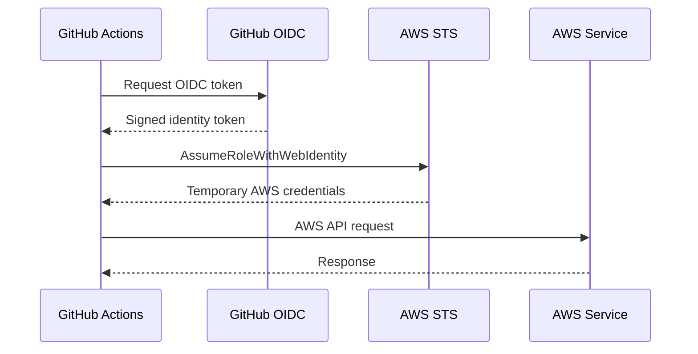
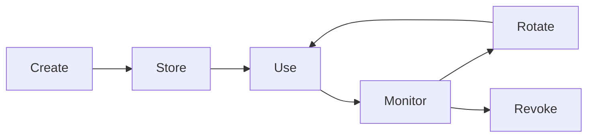
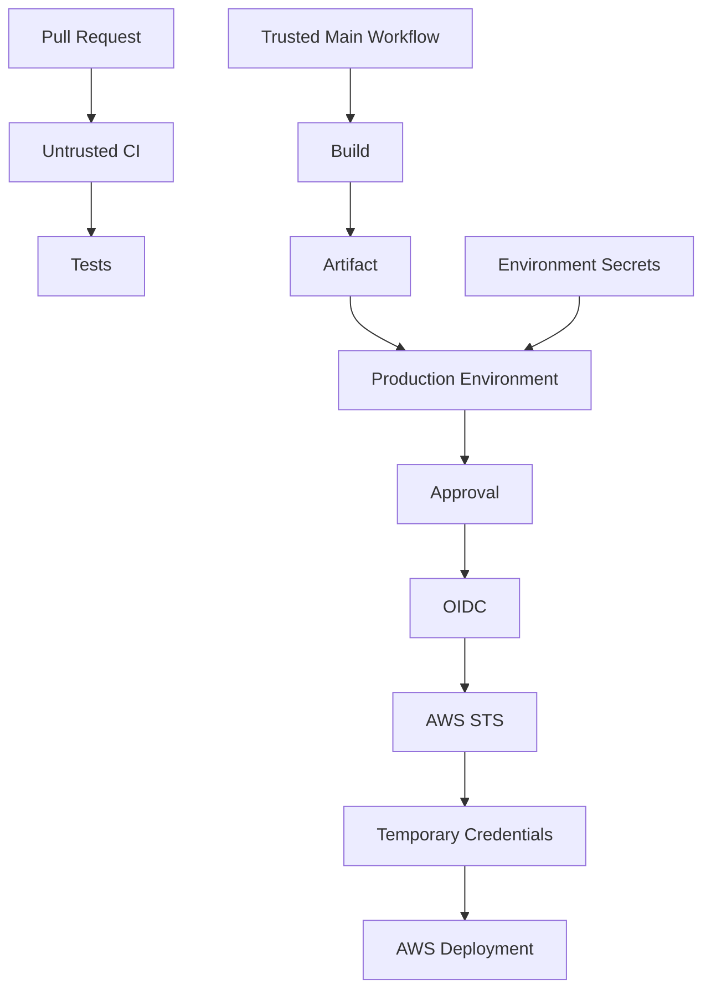

# 04- Workflow Secrets

## Overview

GitHub Actions secrets provide protected storage for sensitive values required by CI/CD workflows.

Typical examples include:

- Cloud credentials.
- API tokens.
- Database passwords.
- Registry credentials.
- Signing keys.
- Third-party service credentials.
- Deployment credentials.
- Private package repository credentials.

Secrets are not simply environment variables with a different name. They participate in GitHub Actions' security model and interact with:

- Repository access.
- Organization policies.
- Environments.
- Workflow triggers.
- `GITHUB_TOKEN`.
- Job permissions.
- Pull requests from forks.
- Reusable workflows.
- Self-hosted runners.
- Third-party actions.
- Cloud identity systems such as AWS OIDC.

A production workflow should minimize the number of long-lived secrets it needs.

The preferred architecture is generally:

```text
GitHub Actions
      │
      ├── Short-lived GITHUB_TOKEN
      │
      ├── OIDC identity token
      │        ↓
      │      AWS STS
      │        ↓
      │      Temporary AWS credentials
      │
      └── Required application secrets
               ↓
        Secret Store / GitHub Secrets
```

The security objective is not merely to hide values from workflow logs. It is to ensure that sensitive credentials are:

- Available only where required.
- Accessible only to trusted workflows.
- Granted with the minimum necessary permissions.
- Not exposed to untrusted code.
- Not unnecessarily copied into outputs, artifacts, caches, or logs.
- Rotated or replaced when appropriate.

## Why Secrets Exist

CI/CD systems frequently need credentials to perform privileged operations.

For example, a deployment may need to:

```text
Build Docker image
    ↓
Authenticate to ECR
    ↓
Push image
    ↓
Deploy to ECS
```

A naive implementation might store long-lived AWS access keys:

```yaml
env:
  AWS_ACCESS_KEY_ID: ${{ secrets.AWS_ACCESS_KEY_ID }}
  AWS_SECRET_ACCESS_KEY: ${{ secrets.AWS_SECRET_ACCESS_KEY }}
```

This works technically, but creates a long-lived credential that must be protected and rotated.

A stronger production architecture uses GitHub Actions OIDC:

```text
GitHub Actions
      ↓
OIDC Token
      ↓
AWS STS
      ↓
Temporary Credentials
      ↓
AWS API
```

This eliminates the need to store long-lived AWS access keys in GitHub Secrets.

## Types of GitHub Secrets

GitHub Actions supports secrets at several scopes.

| Scope | Typical Use |
|---|---|
| Repository secret | Application or repository-specific credential |
| Organization secret | Shared credential across selected repositories |
| Environment secret | Environment-specific deployment credential |
| `GITHUB_TOKEN` | GitHub API and repository operations |
| External secret manager | Centralized enterprise secret management |

The choice of scope should follow the principle of least privilege.

A production database password should generally not be globally available to every repository in an organization.

## Repository Secrets

Repository secrets are available to workflows in a specific repository.

A workflow can reference one through the `secrets` context:

```yaml
jobs:
  deploy:
    runs-on: ubuntu-latest

    steps:
      - name: Deploy application
        env:
          API_TOKEN: ${{ secrets.API_TOKEN }}
        run: |
          ./scripts/deploy.sh
```

Repository secrets are appropriate when:

- Only one repository needs the credential.
- The secret does not need environment-specific isolation.
- Repository-level access is sufficient.

Avoid storing every credential at repository scope simply because it is convenient.

## Organization Secrets

Organization secrets can be shared across repositories according to organization configuration.

They are useful for shared infrastructure such as:

```text
Private package registry
Shared scanning service
Common deployment service
Organization-wide API
```

However, broad sharing increases the blast radius of a compromised repository.

Prefer restricting organization secrets to only the repositories that require them.

Conceptually:

```text
Organization
    │
    ├── Repository A ── Secret
    ├── Repository B ── Secret
    └── Repository C ── No access
```

rather than:

```text
Organization
    │
    └── Secret ── All repositories
```

## Environment Secrets

Environment secrets are associated with GitHub environments such as:

```text
development
staging
production
```

Example:

```yaml
jobs:
  deploy:
    runs-on: ubuntu-latest
    environment: production

    steps:
      - name: Deploy
        env:
          DEPLOY_TOKEN: ${{ secrets.DEPLOY_TOKEN }}
        run: ./deploy.sh
```

Environment-level controls can provide an important security boundary around production deployment.

A production environment can be configured with:

- Required reviewers.
- Deployment protection rules.
- Environment-specific secrets.
- Environment-specific variables.
- Branch restrictions.
- Deployment history.

This makes the environment part of the deployment control plane.

## Development, Staging, and Production

Environment-specific secrets should not be mixed unnecessarily.

A common structure is:

```text
development
    ├── API credentials
    └── Database credentials

staging
    ├── API credentials
    └── Database credentials

production
    ├── API credentials
    └── Database credentials
```

The workflow selects the environment:

```yaml
jobs:
  deploy:
    environment: staging
```

or:

```yaml
jobs:
  deploy:
    environment: production
```

This is preferable to keeping all production credentials in repository-level secrets and deciding manually which value to use.

## Environment Protection

Production environments can require approval before a deployment proceeds.

The workflow can declare:

```yaml
jobs:
  deploy-production:
    environment:
      name: production
```

The environment configuration can then enforce approval outside the YAML itself.

The resulting flow is:

```text
Build
  ↓
Test
  ↓
Security Scan
  ↓
Staging
  ↓
Production Environment
  ↓
Required Approval
  ↓
Production Deployment
```

This creates separation between:

- Workflow execution.
- Deployment authorization.
- Secret availability.

## Secret Context

Secrets are accessed through the `secrets` context.

```yaml
${{ secrets.API_TOKEN }}
```

Example:

```yaml
- name: Call deployment API
  env:
    API_TOKEN: ${{ secrets.API_TOKEN }}
  run: |
    ./deploy.sh
```

Prefer passing secrets through the environment when the command supports environment variables.

This is generally clearer than repeatedly embedding secret expressions directly into commands.

## Avoid Secrets in Command Arguments

Avoid:

```yaml
- run: |
    curl -H "Authorization: Bearer ${{ secrets.API_TOKEN }}" \
      https://api.example.com/deploy
```

Prefer:

```yaml
- name: Deploy
  env:
    API_TOKEN: ${{ secrets.API_TOKEN }}
  run: |
    curl \
      -H "Authorization: Bearer ${API_TOKEN}" \
      https://api.example.com/deploy
```

Command-line arguments can be exposed through process inspection or debugging mechanisms depending on the environment.

Environment variables are not automatically safe, but they are generally a better interface for secret injection.

## Never Print Secrets

Avoid:

```yaml
- run: echo "${{ secrets.API_TOKEN }}"
```

Even though GitHub attempts to mask secrets in logs, masking should not be treated as a guarantee that arbitrary secret transformations will remain protected.

Do not intentionally print:

- Raw secrets.
- Encoded secrets.
- Secret-derived configuration.
- Authentication headers.
- Private keys.
- Credentials embedded in URLs.

The correct approach is to avoid logging sensitive values in the first place.

## Secret Masking

GitHub Actions attempts to redact registered secrets from logs.

For example:

```yaml
- name: Use token
  env:
    TOKEN: ${{ secrets.API_TOKEN }}
  run: |
    ./deploy.sh
```

If the token is accidentally printed, GitHub may mask the value.

However, masking is a defense mechanism, not a substitute for secure logging.

Avoid assuming that every transformation will be recognized:

```text
secret
  ↓
Base64
  ↓
substring
  ↓
JSON encoding
  ↓
log
```

The resulting value may not be automatically recognized as the original secret.

The engineering rule is:

> Do not log sensitive values even if GitHub is expected to mask them.

## Secret Masking and Derived Values

A common mistake is assuming that derived values are safe.

For example:

```bash
echo "$TOKEN" | sha256sum
```

The hash may not itself reveal the secret directly, but logging secret-derived material can still create unnecessary exposure.

Avoid logging values derived from credentials unless there is a specific operational reason.

## Secrets and Pull Requests

Pull requests create an important security boundary.

A workflow triggered by a pull request may execute code from a branch or fork that is not fully trusted.

This becomes dangerous if the workflow provides secrets to arbitrary code.

For example:

```yaml
on:
  pull_request:

jobs:
  test:
    runs-on: ubuntu-latest

    steps:
      - uses: actions/checkout@v4

      - name: Install dependencies
        run: pip install -r requirements.txt

      - name: Run tests
        env:
          API_TOKEN: ${{ secrets.API_TOKEN }}
        run: pytest
```

If the workflow executes untrusted code while secrets are available, that code may attempt to access them.

The fundamental security question is:

> Who controls the code being executed at the moment the secret becomes available?

## Fork Pull Requests

Fork-based pull requests require particular care because contributors may control the contents of the fork.

A safe design separates untrusted validation from privileged operations.

```text
Fork PR
   ↓
Untrusted Code
   ↓
Tests / Static Analysis
   ↓
No Production Secrets
```

Privileged operations should occur only after appropriate trust and authorization boundaries have been established.

Avoid making secrets available to arbitrary pull-request code merely because the job needs them for convenience.

## `pull_request` vs `pull_request_target`

The distinction is critical.

### `pull_request`

The workflow executes in the pull request context.

It is generally the safer event for running untrusted pull-request code because secrets are restricted compared with trusted repository workflows.

### `pull_request_target`

The workflow runs in the context of the base repository.

This can provide access to repository-level privileges and secrets, which makes it powerful but dangerous.

The major risk is accidentally checking out and executing attacker-controlled pull-request code while the workflow has trusted repository permissions.

Dangerous pattern:

```yaml
on:
  pull_request_target:

jobs:
  test:
    runs-on: ubuntu-latest

    steps:
      - uses: actions/checkout@v4
        with:
          ref: ${{ github.event.pull_request.head.sha }}

      - name: Run code
        env:
          TOKEN: ${{ secrets.API_TOKEN }}
        run: |
          ./build.sh
```

The workflow has a trusted execution context while executing code supplied by the pull request.

This can turn repository secrets and permissions into an attack surface.

## Secure `pull_request_target` Design

`pull_request_target` can be useful for trusted automation that needs access to the base repository context, but it should not blindly execute untrusted code.

Good uses may involve operations such as:

```text
Read trusted repository metadata
Add labels
Manage trusted workflow state
Perform controlled repository automation
```

Avoid using it as a shortcut for:

```text
Checkout arbitrary PR code
Install arbitrary dependencies
Run arbitrary scripts
Use production secrets
```

The security boundary should remain explicit.

## GITHUB_TOKEN

Every GitHub Actions workflow can receive a special `GITHUB_TOKEN`.

It is intended for authentication to GitHub APIs and repository operations.

Example:

```yaml
steps:
  - name: Create release metadata
    env:
      GH_TOKEN: ${{ secrets.GITHUB_TOKEN }}
    run: |
      gh release list
```

The token is different from user-created repository secrets.

It is automatically provided by GitHub and is scoped to the repository and workflow execution context.

## `permissions`

The `permissions` block controls what the `GITHUB_TOKEN` can do.

A production workflow should explicitly minimize permissions.

Example:

```yaml
permissions:
  contents: read
```

For a job that needs to request an OIDC token:

```yaml
permissions:
  contents: read
  id-token: write
```

The important principle is:

```text
Required capability
      ↓
Required permission
      ↓
Nothing more
```

Avoid:

```yaml
permissions: write-all
```

when only read access is required.

## Job-Level Permissions

Permissions can be restricted at the job level.

```yaml
permissions:
  contents: read

jobs:
  build:
    runs-on: ubuntu-latest

    steps:
      - uses: actions/checkout@v4

  deploy:
    permissions:
      contents: read
      id-token: write

    runs-on: ubuntu-latest

    steps:
      - name: Authenticate with AWS
        run: ./scripts/aws-login.sh
```

This creates a stronger boundary:

```text
Build Job
  └── read repository

Deploy Job
  ├── read repository
  └── request OIDC token
```

Do not grant deployment permissions to unrelated test jobs.

## Least Privilege

Least privilege applies at multiple layers:

```text
Workflow
  ↓
Job
  ↓
Action
  ↓
Token
  ↓
Cloud Role
  ↓
Cloud Resource
```

For example, a test job might need:

```yaml
permissions:
  contents: read
```

A deployment job may need:

```yaml
permissions:
  contents: read
  id-token: write
```

AWS then further restricts the assumed role:

```text
GitHub OIDC
    ↓
STS AssumeRole
    ↓
Deployment Role
    ↓
ECR / ECS only
```

Least privilege should be designed across the entire chain.

## Secrets and `secrets: inherit`

Reusable workflows can receive secrets explicitly or through inheritance.

Explicit secret passing:

```yaml
jobs:
  deploy:
    uses: organization/platform/.github/workflows/deploy.yml@v1
    secrets:
      deployment-token: ${{ secrets.DEPLOYMENT_TOKEN }}
```

A reusable workflow can define the secret under `workflow_call`.

```yaml
on:
  workflow_call:
    secrets:
      deployment-token:
        required: true
```

`secrets: inherit` can pass available secrets from the caller context to the reusable workflow:

```yaml
jobs:
  deploy:
    uses: organization/platform/.github/workflows/deploy.yml@v1
    secrets: inherit
```

This is convenient but broad.

Prefer explicit secret contracts when a reusable workflow requires only a small number of known secrets.

## Reusable Workflow Secret Design

A reusable deployment workflow might define:

```yaml
on:
  workflow_call:
    inputs:
      environment:
        required: true
        type: string

    secrets:
      deployment-token:
        required: true
```

This makes the interface explicit:

```text
Caller
  ├── environment
  └── deployment-token
          ↓
Reusable Workflow
```

Avoid making a reusable workflow depend on a large, undocumented collection of inherited secrets.

## Secret Inheritance Risks

Broad secret inheritance can create hidden coupling.

A caller may have many secrets:

```text
AWS credentials
Database password
Monitoring token
Package token
Signing key
Third-party API token
```

If a reusable workflow uses:

```yaml
secrets: inherit
```

the workflow's security boundary becomes less obvious.

Prefer explicit contracts where practical:

```yaml
secrets:
  aws-deployment-token:
    required: true
```

This makes code review and governance easier.

## Environment Secrets and Reusable Workflows

Environment-specific secrets should remain associated with the deployment environment.

Conceptually:

```text
Reusable Deployment Workflow
          ↓
     production
          ↓
Production Secrets
```

Do not copy production credentials into repository secrets merely because a reusable workflow expects a repository-level secret.

The deployment environment should remain an explicit security boundary.

## Secret Handling Limitations

GitHub Actions secrets are not a universal secret-management solution.

Consider an external secret manager when you require:

- Centralized enterprise secret management.
- Dynamic secret generation.
- Automatic short-lived credentials.
- Advanced rotation policies.
- Detailed access auditing.
- Cross-platform secret consumption.
- Database credential leasing.
- Strong separation between CI and application runtime.

For AWS deployments, OIDC with STS is often preferable to storing long-lived AWS access keys.

## GitHub Actions to AWS with OIDC

A production AWS deployment can avoid static credentials.

The architecture is:



The workflow needs:

```yaml
permissions:
  contents: read
  id-token: write
```

A credential configuration action can then exchange the identity token for temporary AWS credentials.

The security advantage is that no long-lived AWS access key needs to be stored in GitHub Secrets.

## AWS IAM and OIDC

The AWS trust relationship should restrict which GitHub workflows can assume the role.

A conceptual policy should constrain:

```text
GitHub organization
        +
Repository
        +
Branch / environment
```

rather than trusting every workflow from an entire GitHub organization.

The resulting trust boundary is:

```text
GitHub Repository
      ↓
OIDC Identity
      ↓
IAM Trust Policy
      ↓
STS
      ↓
Temporary Role Credentials
```

The IAM role should also have only the AWS permissions required by the deployment.

## Secret Rotation

Long-lived secrets require a rotation strategy.

A practical rotation process is:

```text
Generate replacement
      ↓
Store replacement
      ↓
Deploy / validate
      ↓
Switch consumers
      ↓
Revoke old credential
      ↓
Verify
```

Avoid changing credentials without understanding which workflows, applications, or external systems consume them.

For frequently rotated or short-lived credentials, external identity systems are generally easier to operate than manually rotated static secrets.

## Third-Party Actions and Secrets

Third-party actions execute inside your workflow environment.

For example:

```yaml
- uses: third-party/example-action@v1
```

If the action has access to:

- Secrets.
- `GITHUB_TOKEN`.
- Files on the runner.
- Network access.

then compromise of that action can affect the workflow.

Treat third-party actions as dependencies.

Security practices include:

- Use trusted sources.
- Review action source.
- Pin versions.
- Prefer immutable commit SHA pinning for high-security environments.
- Minimize token permissions.
- Avoid exposing secrets to steps that do not require them.
- Review action updates.

## Action Pinning

A mutable tag:

```yaml
- uses: actions/checkout@v4
```

is convenient and widely used.

SHA pinning provides stronger immutability:

```yaml
- uses: actions/checkout@<commit-sha>
```

The exact SHA should correspond to the reviewed version.

The trade-off is maintenance:

```text
Mutable version tag
    ↓
Less maintenance
    ↓
More trust in tag movement

Commit SHA
    ↓
More explicit integrity
    ↓
More update management
```

Organizations with strong supply-chain requirements may enforce SHA pinning.

## Trusted Action Sources

Prefer actions from:

- GitHub's official repositories.
- Well-maintained trusted organizations.
- Internally controlled repositories.
- Reviewed and approved third-party projects.

Do not assume marketplace availability implies security approval.

An action should be treated as executable code with the permissions of the workflow environment.

## Secret Exposure Through Dependencies

A workflow can accidentally expose secrets to a third-party action:

```yaml
- uses: third-party/action@v1
  env:
    API_TOKEN: ${{ secrets.API_TOKEN }}
```

The action receives the credential even if it does not logically require it.

Prefer:

```yaml
- uses: trusted/action@v1

- name: Deploy
  env:
    API_TOKEN: ${{ secrets.API_TOKEN }}
  run: ./deploy.sh
```

Grant secrets only to the exact step that requires them.

## Secret Exposure Through Shell Scripts

Avoid embedding credentials directly in generated files or scripts.

Dangerous pattern:

```yaml
- run: |
    cat > deploy.sh <<EOF
    curl -H "Authorization: Bearer ${{ secrets.API_TOKEN }}"
    EOF
```

Prefer passing credentials through the environment:

```yaml
- name: Deploy
  env:
    API_TOKEN: ${{ secrets.API_TOKEN }}
  run: |
    ./deploy.sh
```

Then the script can consume:

```bash
#!/usr/bin/env bash

set -euo pipefail

curl \
  -H "Authorization: Bearer ${API_TOKEN}" \
  https://api.example.com/deploy
```

## Secret Exposure Through URLs

Avoid:

```bash
curl "https://api.example.com/deploy?token=${API_TOKEN}"
```

Credentials in URLs can appear in:

- Logs.
- Proxy logs.
- Server access logs.
- Browser history in other contexts.
- Monitoring systems.

Prefer authentication headers or another mechanism supported by the service.

## Secret Exposure Through Artifacts

Never intentionally upload secrets into artifacts.

Dangerous example:

```yaml
- run: |
    echo "$API_TOKEN" > deployment.env

- uses: actions/upload-artifact@v4
  with:
    name: deployment-config
    path: deployment.env
```

Artifacts can persist after the workflow completes.

Before uploading artifacts, verify that they contain only intended data.

## Secret Exposure Through Caches

Do not put secrets into cache paths.

Caches are designed for reusable data and may have broader lifecycle and access characteristics than secrets.

Never cache:

```text
.env
credentials.json
AWS credentials
private keys
authentication tokens
```

Cache:

```text
pip download cache
npm cache
Docker build cache
```

instead.

## Secret Exposure in Debug Logging

GitHub Actions debugging can increase the amount of information visible in logs.

Do not enable diagnostic logging without considering whether commands or tools may emit credentials.

Avoid commands such as:

```bash
set -x
```

around sensitive operations.

If shell tracing is necessary elsewhere, disable it around secret-sensitive commands:

```bash
set +x
./deploy.sh
set -x
```

The better approach is to design scripts that never print credentials.

## Self-Hosted Runners and Secrets

Self-hosted runners introduce additional security considerations.

A persistent runner may retain:

- Workspace files.
- Docker layers.
- Temporary files.
- Credentials.
- Process state.
- Cached dependencies.

If a workflow executes untrusted code, a compromised runner can become a long-lived attack surface.

For sensitive environments, consider ephemeral runners:

```text
Workflow
   ↓
Ephemeral Runner
   ↓
Execute Job
   ↓
Destroy Runner
```

This reduces persistence between jobs.

## Persistent Runner Risks

A persistent runner can accidentally retain secrets:

```text
Job 1
  ↓
Credential file
  ↓
Workspace
  ↓
Job completes
  ↓
Job 2
  ↓
Credential remains
```

Cleanup scripts reduce this risk but do not provide the same isolation as destroying the runner.

Persistent self-hosted runners should therefore be carefully isolated and assigned only appropriate workloads.

## Private Network Access

Self-hosted runners are often used because deployments require access to private infrastructure:

```text
GitHub Actions
      ↓
Self-Hosted Runner
      ↓
Private Network
      ├── Internal API
      ├── Database
      └── Deployment System
```

This expands the security impact of workflow compromise.

The runner should have:

- Minimal network access.
- Minimal IAM permissions.
- Restricted inbound access.
- Controlled outbound access.
- Ephemeral lifecycle where practical.
- Strong host hardening.

## Secret Governance

At organizational scale, secrets require governance.

Useful controls include:

- Secret naming conventions.
- Environment separation.
- Repository access restrictions.
- Organization policies.
- Rotation policies.
- Audit processes.
- External secret management.
- Least-privilege access.
- Secret ownership.
- Incident response procedures.

A secret without an owner or rotation strategy is an operational liability.

## Organization and Enterprise Policies

Organizations can establish security standards for GitHub Actions.

Relevant governance areas include:

```text
Actions allowed
     ↓
Token permissions
     ↓
Secret access
     ↓
Reusable workflows
     ↓
Runner policy
     ↓
Environment protection
```

For example, an organization may restrict workflows from using arbitrary marketplace actions.

This reduces supply-chain risk but requires a process for approving legitimate dependencies.

## Dependency Review and Dependabot

Dependency security should include workflow dependencies.

Important practices include:

- Review third-party action updates.
- Use Dependabot where appropriate.
- Review dependency changes.
- Pin trusted action versions.
- Remove unused actions.
- Monitor known vulnerabilities.
- Maintain an approved action list.

Actions are part of the software supply chain even though they are written in YAML as workflow references.

## SBOM and Build Integrity

Production build pipelines can generate Software Bills of Materials and provenance information.

A high-level architecture is:

```text
Source
  ↓
Trusted Build
  ↓
Dependencies
  ↓
SBOM
  ↓
Artifact
  ↓
Provenance / Attestation
  ↓
Registry
```

The goal is to make it possible to establish:

- What was built.
- From which source.
- With which dependencies.
- By which trusted workflow.
- Which artifact was deployed.

This becomes increasingly important in regulated or security-sensitive environments.

## Artifact Attestations and Signing

For high-assurance pipelines, artifacts may be signed or accompanied by attestations.

Conceptually:

```text
Source Commit
     ↓
Trusted Workflow
     ↓
Build Artifact
     ↓
Attestation
     ↓
Registry
     ↓
Deployment Verification
```

The important distinction is:

```text
Secret
    → authenticates an operation

Attestation
    → provides evidence about an artifact
```

Do not confuse artifact provenance with secret management.

## Secret Handling with Docker

Avoid baking secrets into Docker images.

Dangerous:

```dockerfile
ARG API_TOKEN
ENV API_TOKEN=${API_TOKEN}
```

The credential can become part of image metadata or layers depending on how the image is constructed.

Instead, use runtime configuration or secret mechanisms.

For CI builds requiring private dependencies, use BuildKit-supported secret mechanisms rather than embedding credentials into layers.

The principle is:

```text
Build artifact
    ↓
No long-lived application secret
    ↓
Runtime secret injection
```

## Docker Registry Authentication

A deployment pipeline may need registry credentials.

Prefer short-lived or identity-based authentication when the registry supports it.

For AWS ECR:

```text
GitHub Actions
    ↓
OIDC
    ↓
AWS STS
    ↓
IAM Role
    ↓
ECR
```

This is preferable to storing permanent AWS access keys.

## Python Backend Example

A Django or FastAPI pipeline may need a private package registry token.

```yaml
jobs:
  test:
    runs-on: ubuntu-latest

    steps:
      - uses: actions/checkout@v4

      - uses: actions/setup-python@v5
        with:
          python-version: "3.12"

      - name: Install dependencies
        env:
          PIP_INDEX_TOKEN: ${{ secrets.PIP_INDEX_TOKEN }}
        run: |
          python -m pip install --upgrade pip
          ./scripts/install-private-dependencies.sh

      - name: Run tests
        run: |
          pytest
```

The token is available only to the step that needs it.

Avoid exporting it globally to every step.

## Secret Scope Design

A production repository can use:

```text
Repository Secrets
    ├── Repository-specific non-production credential

Environment Secrets
    ├── staging
    └── production

Organization Secrets
    └── Approved shared infrastructure credential

OIDC
    └── AWS temporary credentials
```

This keeps credentials close to the security boundary where they are used.

## Secret Lifecycle

A secret should have a lifecycle:



For every production secret, know:

- Who owns it.
- Where it is stored.
- Which workflows use it.
- What permissions it grants.
- How it is rotated.
- How it is revoked.
- What systems depend on it.

## Disaster Recovery Considerations

Secret management must be included in recovery planning.

A production recovery plan should account for:

- Secret availability.
- Credential rotation.
- IAM role recovery.
- Environment configuration.
- External secret manager availability.
- Emergency credential revocation.
- Recovery access for operators.

Do not design disaster recovery around a single engineer's local copy of production credentials.

## Cost Considerations

Secrets themselves are not usually the main CI/CD cost driver. The operational cost comes from poor architecture around them.

Examples include:

- Repeated credential provisioning.
- Excessive secret rotation work.
- Long-lived credentials requiring manual management.
- Self-hosted runner maintenance.
- External secret-management infrastructure.
- Incident response caused by credential leakage.

Short-lived identity mechanisms can reduce both security risk and operational overhead.

## Common Mistakes

### Treating Secrets as Normal Configuration

Not every configuration value is secret.

For example:

```yaml
env:
  LOG_LEVEL: INFO
```

does not require a secret.

Use variables for non-sensitive configuration and secrets only for sensitive values.

### Putting Production Secrets at Repository Scope

This can make production credentials available to workflows that do not actually deploy production.

Prefer environment-specific secrets for production deployment.

### Passing Every Secret to Every Job

Avoid:

```yaml
env:
  AWS_KEY: ${{ secrets.AWS_KEY }}
  DB_PASSWORD: ${{ secrets.DB_PASSWORD }}
  API_TOKEN: ${{ secrets.API_TOKEN }}
```

at workflow scope unless every job truly requires them.

Inject credentials at the narrowest practical scope.

### Using `secrets: inherit` Everywhere

Inheritance is convenient but can hide the actual secret contract of a reusable workflow.

Use explicit secret passing where practical.

### Storing Long-Lived AWS Keys

Prefer:

```text
GitHub OIDC
  ↓
AWS STS
  ↓
Temporary Credentials
```

over:

```text
Long-Lived AWS Access Key
  ↓
GitHub Secret
```

### Printing Credentials for Debugging

Never use:

```bash
echo "$TOKEN"
```

as a debugging technique.

Debug the authentication mechanism rather than exposing the credential.

### Using Secrets in Pull Request Code

Do not give production credentials to workflows executing untrusted pull-request code.

### Baking Secrets into Docker Images

Secrets should not become part of immutable image layers.

Inject them at runtime or use secure build-time secret mechanisms where absolutely necessary.

## Troubleshooting Secrets

### Symptom

A secret appears to be empty.

### Possible Causes

- Secret does not exist.
- Incorrect secret name.
- Wrong repository.
- Wrong organization scope.
- Environment is not attached to the job.
- Environment secret is unavailable because protection has not been satisfied.
- Workflow event does not expose the secret.
- Reusable workflow did not receive the secret.
- Secret was intentionally unavailable to an untrusted context.

### Isolation Strategy

First determine the scope:

```text
Repository
Organization
Environment
Reusable Workflow
```

Then determine whether the workflow execution context is allowed to access it.

Do not print the secret to test availability.

Instead, test presence safely:

```yaml
- name: Validate token availability
  env:
    API_TOKEN: ${{ secrets.API_TOKEN }}
  run: |
    if [[ -z "$API_TOKEN" ]]; then
      echo "API_TOKEN is unavailable"
      exit 1
    fi

    echo "API_TOKEN is available"
```

This verifies presence without exposing the value.

### Commands and Checks

List repository secrets:

```bash
gh secret list
```

List environment secrets:

```bash
gh secret list --env production
```

Set a repository secret:

```bash
gh secret set API_TOKEN
```

Set an environment secret:

```bash
gh secret set API_TOKEN --env production
```

Set an organization secret:

```bash
gh secret set SHARED_TOKEN --org my-org
```

The GitHub CLI is useful for operational management, but secret values should be supplied securely rather than passed directly on the command line.

### Root Cause

Determine which security boundary prevented access:

```text
Workflow Trigger
      ↓
Repository
      ↓
Environment
      ↓
Reusable Workflow
      ↓
Secret Scope
```

### Corrective Action

Fix the scope or workflow design rather than weakening security controls.

### Prevention

- Document secret ownership.
- Use environment-specific credentials.
- Prefer OIDC for AWS.
- Restrict secret access.
- Validate presence without printing values.
- Review reusable workflow secret contracts.

## Troubleshooting AWS OIDC

### Symptom

AWS authentication fails from GitHub Actions.

### Possible Causes

- Missing `id-token: write`.
- Incorrect IAM trust policy.
- Repository condition mismatch.
- Branch/environment condition mismatch.
- Incorrect AWS role ARN.
- Incorrect audience configuration.
- IAM permissions insufficient after role assumption.

### Isolation Strategy

Check workflow permissions:

```yaml
permissions:
  contents: read
  id-token: write
```

Then inspect the IAM trust policy and verify that the repository and workflow identity match the expected conditions.

### Root Cause

OIDC authentication has two separate authorization stages:

```text
GitHub
  ↓
Can workflow obtain OIDC token?
  ↓
AWS STS
  ↓
Does IAM trust policy accept identity?
  ↓
Temporary credentials
  ↓
Does IAM role permit requested operation?
```

Do not treat all AWS authentication failures as credential failures.

## Troubleshooting Secret Masking

### Symptom

A credential or secret-derived value appears in logs.

### Possible Causes

- Value was transformed.
- Only part of the secret was printed.
- Secret was embedded in another string.
- Secret was written into an artifact.
- Secret was included in a command or URL.
- A third-party tool logged it independently.

### Corrective Action

Remove the secret from the output path rather than depending on masking.

Rotate the credential if exposure is suspected.

## Security Architecture

A production-grade workflow should create multiple security boundaries.



The important principle is that untrusted validation and privileged deployment are separate security domains.

## Production CI/CD Secret Architecture

A mature pipeline may look like:

```text
Pull Request
    │
    ├── Read-only repository access
    ├── No production secrets
    └── Untrusted code execution
            │
            ▼
        Tests / Scan
            │
            ▼
        Main Branch
            │
            ▼
        Trusted Build
            │
            ├── Read-only repository token
            └── Build credentials where required
            │
            ▼
      Immutable Artifact
            │
            ▼
        Staging
            │
            ▼
       Production
            │
            ├── Environment approval
            ├── Environment secrets
            └── OIDC → AWS STS
```

This architecture minimizes the blast radius of a compromised pull request.

## Senior-Level Security Guidelines

For production GitHub Actions:

- Default to minimal `GITHUB_TOKEN` permissions.
- Keep privileged jobs separate from untrusted jobs.
- Avoid secrets in pull-request workflows.
- Treat `pull_request_target` as a privileged execution context.
- Prefer environment secrets for environment-specific credentials.
- Prefer explicit reusable workflow secret interfaces.
- Avoid broad `secrets: inherit` where explicit contracts are practical.
- Prefer OIDC for AWS authentication.
- Use temporary cloud credentials.
- Review third-party actions as executable dependencies.
- Pin actions according to organizational security requirements.
- Avoid printing or uploading sensitive data.
- Use ephemeral runners for high-risk workloads where practical.
- Rotate compromised credentials immediately.
- Maintain ownership and lifecycle information for production secrets.

## Interview Scenarios

### Scenario: AWS Deployment Without Long-Lived Credentials

**Question:** How would you authenticate GitHub Actions to AWS without storing access keys?

Expected architecture:

```text
GitHub Actions
    ↓
OIDC
    ↓
AWS STS
    ↓
IAM Role
    ↓
Temporary Credentials
```

The candidate should explain:

- `id-token: write`.
- IAM trust policy.
- Repository and branch/environment restrictions.
- Temporary credentials.
- Least-privilege IAM permissions.

### Scenario: Production Secret Protection

**Question:** How would you prevent pull-request code from accessing production credentials?

Expected design:

```text
Pull Request
    ↓
Untrusted CI
    ↓
No Production Secrets
```

Production deployment should happen from a trusted workflow or controlled branch/environment with appropriate protection.

### Scenario: `pull_request_target`

**Question:** Why can `pull_request_target` be dangerous?

The key issue is that it executes with the base repository's security context. If the workflow checks out and executes attacker-controlled pull-request code while privileged permissions or secrets are available, that code may gain access to those privileges.

### Scenario: Reusable Workflow Secrets

**Question:** When would you use `secrets: inherit` versus explicit secrets?

Explicit secrets are preferable when a reusable workflow has a small, stable secret contract.

`secrets: inherit` can be useful for tightly controlled organization workflows where broad inheritance is intentional and understood.

The security trade-off is interface clarity versus convenience.

### Scenario: Third-Party Action Compromise

**Question:** A marketplace action used by the organization is compromised. How do you reduce the impact?

Consider:

```text
Minimal GITHUB_TOKEN permissions
        +
No unnecessary secrets
        +
Trusted action sources
        +
Version/SHA pinning
        +
Dependency monitoring
        +
Isolated runners
```

The most important principle is reducing what the action can access.

### Scenario: Self-Hosted Runner

**Question:** A deployment requires private network access. Would you use a self-hosted runner?

The decision depends on the network and security requirements.

A self-hosted runner may be appropriate when the deployment genuinely requires private network access, but it should have:

- Restricted network permissions.
- Minimal cloud permissions.
- Strong host isolation.
- Ephemeral lifecycle where practical.
- Controlled workflow access.

## Operational Checklist

Before putting secrets into a production workflow, verify:

- The secret is actually sensitive.
- A variable is not sufficient.
- The secret has an owner.
- The secret has a rotation strategy.
- The narrowest appropriate scope is used.
- Production credentials are environment-specific.
- Secrets are not printed.
- Secrets are not included in artifacts.
- Secrets are not included in caches.
- Secrets are not embedded in Docker images.
- Secrets are not passed unnecessarily to third-party actions.
- Pull-request workflows do not receive privileged production credentials.
- `pull_request_target` is used only with a deliberate security design.
- `GITHUB_TOKEN` permissions are minimized.
- AWS authentication uses OIDC where appropriate.
- AWS IAM roles are least-privileged.
- Reusable workflows have explicit secret contracts where practical.
- Self-hosted runners are appropriately isolated.
- Suspected credential exposure triggers rotation and revocation.

## Key Takeaways

- Treat GitHub Actions secrets as privileged credentials and expose them only at the narrowest practical workflow, job, step, or environment scope.
- Keep untrusted pull-request execution separate from privileged deployment workflows, and treat `pull_request_target` as a security-sensitive execution context.
- Prefer short-lived identity mechanisms such as GitHub OIDC with AWS STS instead of storing long-lived cloud access keys.
- Minimize `GITHUB_TOKEN` permissions, restrict third-party actions and runners, and never rely on log masking as a substitute for preventing secret exposure.
- Design reusable workflows, environments, runners, and secret stores as explicit security boundaries with clear ownership, rotation, and incident-response procedures.