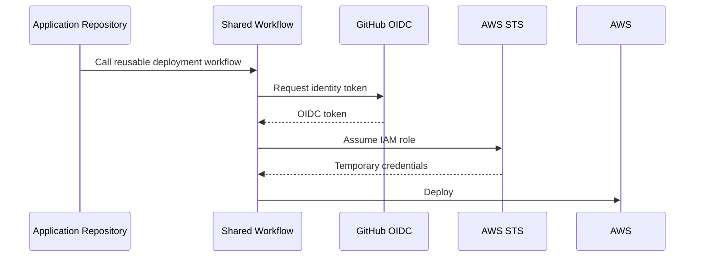
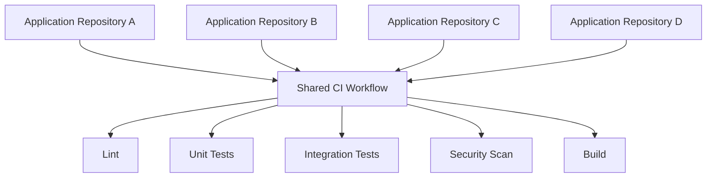
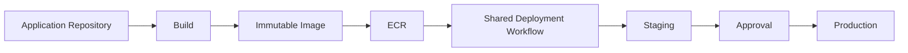
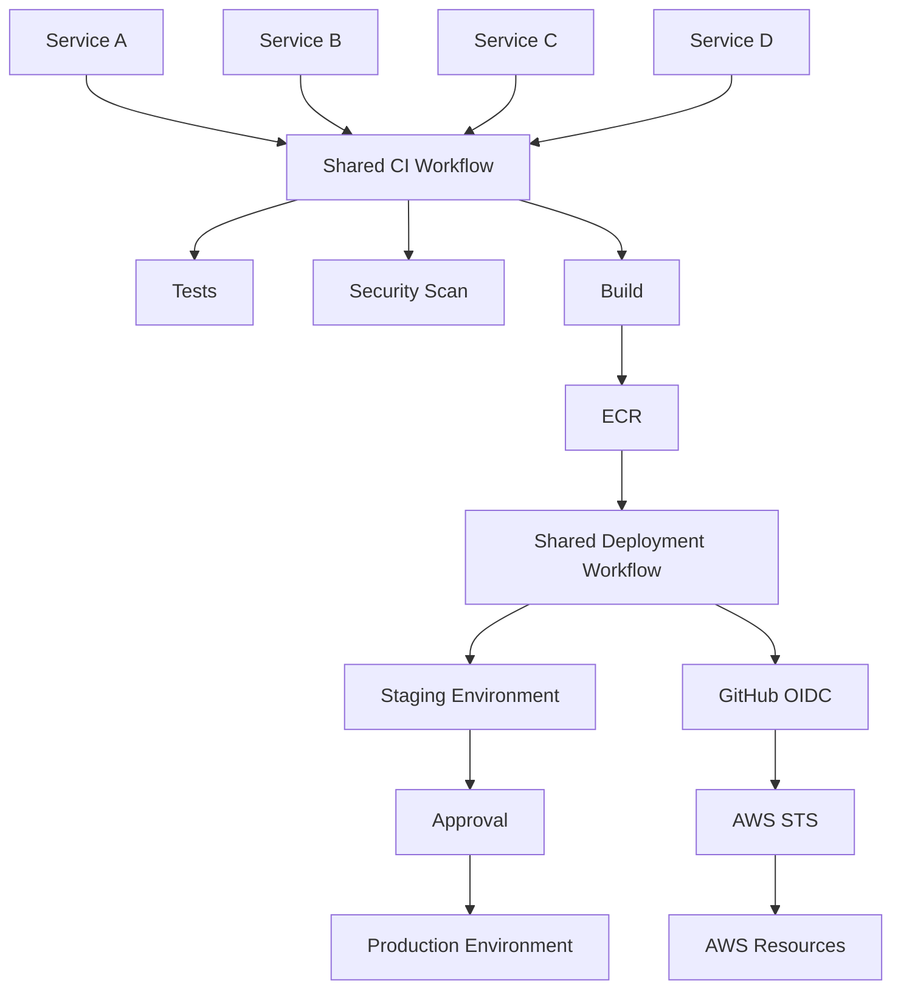

# 05- Cross Repository Workflows

## Overview

Cross-repository workflows allow GitHub Actions automation to be shared, triggered, or coordinated across repository boundaries.

They are useful when an organization has multiple backend services but wants to centralize common CI/CD capabilities such as:

- Python testing.
- Security scanning.
- Docker builds.
- Deployment workflows.
- Release automation.
- Infrastructure deployment.
- Standardized compliance checks.
- Organization-wide CI policies.

A typical organization may have:

```text
platform/
├── shared-ci
├── shared-deployment
└── infrastructure

backend-service-a/
backend-service-b/
backend-service-c/
```

Instead of duplicating the same workflow in every repository:

```text
Repository A → 200 lines
Repository B → 200 lines
Repository C → 200 lines
Repository D → 200 lines
```

a centralized reusable workflow can provide:

```text
Repository A ─┐
Repository B ─┤
Repository C ─┼──> Shared Workflow
Repository D ─┘
```

The main engineering challenge is balancing centralization with repository autonomy.

A cross-repository workflow is an API between repositories. Its inputs, outputs, secrets, permissions, versioning, and failure behavior therefore need to be designed deliberately.

## Why Cross-Repository Workflows Matter

Large backend organizations commonly operate many repositories:

```text
orders-api
payments-api
users-api
notifications-api
analytics-api
```

These repositories may share the same engineering standards:

```text
Python
Django/FastAPI
pytest
Docker
AWS
ECR
ECS
Security scanning
```

Without reusable workflows, each repository tends to develop its own variation.

That creates:

- Configuration drift.
- Different security practices.
- Repeated maintenance.
- Inconsistent deployment behavior.
- Difficult upgrades.
- Increased review overhead.

Cross-repository workflows address this by moving common orchestration into centrally maintained workflows.

## Cross-Repository Patterns

Several patterns can be used.

| Pattern | Purpose |
|---|---|
| Reusable workflow | Share multi-job CI/CD orchestration |
| Composite action | Share reusable steps within a job |
| `workflow_dispatch` | Manually trigger another repository's workflow |
| `repository_dispatch` | Send an event to another repository |
| `workflow_run` | React to workflow completion |
| Shared action repository | Centralize implementation logic |
| Organization workflow repository | Centralize reusable CI/CD workflows |

The most important distinction is between **reusable workflows** and **cross-repository event triggering**.

A reusable workflow is normally used when the caller wants to execute standardized workflow logic.

An event-based approach is more appropriate when repositories need to communicate asynchronously or independently.

## Reusable Workflows Across Repositories

A reusable workflow can be stored in one repository and invoked from another.

The called workflow must use `workflow_call`.

Example centralized workflow:

```yaml
name: Shared Python CI

on:
  workflow_call:
    inputs:
      python-version:
        required: false
        type: string
        default: "3.12"
    secrets:
      package-token:
        required: false

jobs:
  test:
    runs-on: ubuntu-latest

    steps:
      - uses: actions/checkout@v4

      - uses: actions/setup-python@v5
        with:
          python-version: ${{ inputs.python-version }}

      - name: Install dependencies
        env:
          PACKAGE_TOKEN: ${{ secrets.package-token }}
        run: |
          python -m pip install --upgrade pip
          pip install -r requirements.txt

      - name: Run tests
        run: pytest
```

Another repository can call it:

```yaml
name: CI

on:
  pull_request:
  push:
    branches:
      - main

jobs:
  ci:
    uses: organization/platform-workflows/.github/workflows/python-ci.yml@v1
    with:
      python-version: "3.12"
```

The repository becomes a consumer of the centralized workflow.

## Repository Structure

A common central workflow repository is:

```text
platform-workflows/
└── .github/
    └── workflows/
        ├── python-ci.yml
        ├── docker-build.yml
        ├── security-scan.yml
        └── deploy-aws.yml
```

Application repositories remain focused on application-specific configuration.

```text
orders-api/
└── .github/
    └── workflows/
        └── ci.yml
```

The local workflow acts as the integration layer:

```yaml
jobs:
  ci:
    uses: organization/platform-workflows/.github/workflows/python-ci.yml@v1
```

## Workflow Contract

A reusable workflow should have an explicit contract.

That contract includes:

```text
Inputs
Outputs
Secrets
Permissions
Expected repository structure
Runner requirements
Artifacts
Failure behavior
Versioning
```

For example:

```yaml
on:
  workflow_call:
    inputs:
      python-version:
        type: string
        required: true

      run-integration-tests:
        type: boolean
        required: false
        default: false

    secrets:
      package-token:
        required: false

    outputs:
      image:
        description: "Built image reference"
        value: ${{ jobs.build.outputs.image }}
```

This is similar to an API interface.

A workflow should not require callers to understand its internal implementation.

## Cross-Repository Workflow as an API

Think of a reusable workflow as:

```text
Caller Repository
       │
       │ inputs
       │ secrets
       │ permissions
       ▼
Reusable Workflow
       │
       │ outputs
       ▼
Caller Repository
```

Good interfaces are:

- Small.
- Explicit.
- Stable.
- Versioned.
- Documented.
- Backward compatible where possible.

Avoid exposing implementation-specific inputs such as:

```yaml
docker-build-internal-step-17:
```

Prefer domain-oriented inputs:

```yaml
image-name:
environment:
python-version:
```

## Inputs

Inputs should represent meaningful configuration.

Example:

```yaml
on:
  workflow_call:
    inputs:
      python-version:
        required: false
        type: string
        default: "3.12"

      working-directory:
        required: false
        type: string
        default: "."

      run-integration-tests:
        required: false
        type: boolean
        default: true
```

The caller can provide:

```yaml
jobs:
  ci:
    uses: organization/platform-workflows/.github/workflows/python-ci.yml@v1
    with:
      python-version: "3.12"
      run-integration-tests: true
```

Avoid creating dozens of configuration switches.

Excessive configurability often indicates that multiple workflow responsibilities should be separated.

## Secrets

Secrets should be explicit when possible.

Caller:

```yaml
jobs:
  deploy:
    uses: organization/platform-workflows/.github/workflows/deploy.yml@v1
    secrets:
      deployment-token: ${{ secrets.DEPLOYMENT_TOKEN }}
```

Reusable workflow:

```yaml
on:
  workflow_call:
    secrets:
      deployment-token:
        required: true
```

This creates a clear security contract.

## `secrets: inherit`

A caller can use:

```yaml
jobs:
  deploy:
    uses: organization/platform-workflows/.github/workflows/deploy.yml@v1
    secrets: inherit
```

This can be useful for trusted organization-wide workflows.

However, broad inheritance reduces visibility into which secrets a workflow actually depends on.

Prefer explicit secrets when:

- The workflow has a small secret contract.
- The workflow is shared broadly.
- Security boundaries are important.
- Different repositories contain unrelated credentials.

## Cross-Repository Secret Boundaries

Secrets should not be treated as globally available simply because repositories belong to the same organization.

Consider:

```text
Repository A
    ├── database credentials
    └── deployment credentials

Repository B
    └── monitoring credentials

Shared Workflow
```

The shared workflow should receive only the credentials required for the specific operation.

Avoid designing a central workflow that assumes it can access every secret in every caller repository.

## Permissions

Reusable workflows interact with the caller's security context.

Permissions should be deliberately designed.

A reusable workflow may require:

```yaml
permissions:
  contents: read
```

For AWS OIDC:

```yaml
permissions:
  contents: read
  id-token: write
```

The caller should not grant unnecessary permissions simply because the reusable workflow is centrally maintained.

The deployment architecture should be:

```text
Caller
   ↓
Minimal permissions
   ↓
Reusable Workflow
   ↓
Specific operation
```

## AWS OIDC Across Repositories

Cross-repository deployment workflows are particularly useful with AWS OIDC.

Architecture:



The IAM trust policy must still restrict which repositories and identities are allowed to assume the role.

Centralizing the deployment workflow does not remove the need for IAM least privilege.

## Cross-Repository Deployment Workflow

A reusable deployment workflow might expose:

```yaml
on:
  workflow_call:
    inputs:
      environment:
        required: true
        type: string

      image:
        required: true
        type: string

    secrets: {}
```

The workflow can then deploy an immutable image:

```yaml
jobs:
  deploy:
    runs-on: ubuntu-latest
    environment: ${{ inputs.environment }}

    permissions:
      contents: read
      id-token: write

    steps:
      - name: Configure AWS credentials
        uses: aws-actions/configure-aws-credentials@v5
        with:
          role-to-assume: ${{ vars.AWS_DEPLOY_ROLE }}
          aws-region: ${{ vars.AWS_REGION }}

      - name: Deploy image
        env:
          IMAGE: ${{ inputs.image }}
        run: |
          ./scripts/deploy.sh "$IMAGE"
```

The application repository only needs to provide the deployment intent.

## Build Once, Promote Across Repositories

A mature organization should avoid rebuilding the same application separately for each environment.

Preferred flow:

```text
Application Repository
        ↓
Build
        ↓
Immutable Docker Image
        ↓
ECR
        ↓
Staging
        ↓
Approval
        ↓
Production
```

The same image digest should be promoted:

```text
sha256:abc123...
```

rather than rebuilding:

```text
staging → build
production → build again
```

This reduces differences between environments.

## Cross-Repository Artifact Promotion

A centralized deployment workflow can consume an immutable artifact produced elsewhere.

For example:

```yaml
jobs:
  deploy:
    uses: organization/platform-workflows/.github/workflows/deploy.yml@v1
    with:
      environment: production
      image: "123456789012.dkr.ecr.us-east-1.amazonaws.com/orders@sha256:abc123..."
```

The deployment workflow does not need to rebuild the application.

This creates a clean separation:

```text
Build responsibility
        ↓
Application CI

Deployment responsibility
        ↓
Platform CD
```

## Cross-Repository Triggering

Not every cross-repository requirement should use `workflow_call`.

Sometimes repository A needs to tell repository B that an event occurred.

For example:

```text
Application Repository
        ↓
New Release
        ↓
Infrastructure Repository
        ↓
Deployment Workflow
```

Event-based mechanisms can be more appropriate for loosely coupled systems.

## `repository_dispatch`

`repository_dispatch` can be used to send a custom event to another repository.

Receiver:

```yaml
name: Deployment Trigger

on:
  repository_dispatch:
    types:
      - application-release

jobs:
  deploy:
    runs-on: ubuntu-latest

    steps:
      - name: Inspect release
        env:
          IMAGE: ${{ github.event.client_payload.image }}
        run: |
          echo "Deploying ${IMAGE}"
```

The sender can provide structured payload data.

Conceptually:

```text
Repository A
    │
    │ repository_dispatch
    │
    │ client_payload
    ▼
Repository B
    │
    ▼
Workflow
```

The receiving workflow should validate payloads rather than blindly trusting arbitrary values.

## Payload Design

Keep event payloads small and explicit.

Example:

```json
{
  "environment": "staging",
  "image": "123456789012.dkr.ecr.us-east-1.amazonaws.com/orders@sha256:abc123",
  "commit": "abc123"
}
```

Avoid sending large configuration documents when a small immutable reference is sufficient.

Prefer:

```text
image digest
commit SHA
release version
environment
```

over:

```text
entire generated configuration
entire source tree
temporary credentials
```

## Security of `repository_dispatch`

Cross-repository event triggering introduces an authorization boundary.

The sender needs permission to trigger the receiver.

The receiver should not assume that payload values are safe merely because they came from another repository.

Validate:

- Allowed environment names.
- Image registry.
- Image format.
- Commit references.
- Release identifiers.
- Expected repository identity.

Never use event payload values directly in shell commands without safe handling.

## Untrusted Event Payloads

Avoid:

```yaml
- run: |
    ./deploy.sh ${{ github.event.client_payload.environment }}
```

Prefer passing data through environment variables:

```yaml
- name: Deploy
  env:
    DEPLOY_ENV: ${{ github.event.client_payload.environment }}
  run: |
    ./deploy.sh "$DEPLOY_ENV"
```

The shell still needs to validate the value.

For deployment environments, an allowlist is stronger:

```bash
case "$DEPLOY_ENV" in
  staging|production)
    ;;
  *)
    echo "Unsupported environment"
    exit 1
    ;;
esac
```

## `workflow_run`

`workflow_run` can trigger a workflow after another workflow completes.

Example:

```yaml
name: Deploy After CI

on:
  workflow_run:
    workflows:
      - CI
    types:
      - completed
```

This can separate:

```text
CI Workflow
    ↓
Completed
    ↓
Deployment Workflow
```

However, the downstream workflow should inspect the upstream result before performing privileged operations.

Example:

```yaml
if: ${{ github.event.workflow_run.conclusion == 'success' }}
```

## Security Considerations with `workflow_run`

A workflow triggered by `workflow_run` can operate in a more privileged context than the upstream workflow.

This makes it important to understand:

```text
Upstream workflow
      ↓
May execute untrusted code
      ↓
Produces event
      ↓
Privileged downstream workflow
```

Do not blindly transfer untrusted artifacts or values into a privileged deployment context.

Validate provenance and deployment eligibility.

## Cross-Repository `workflow_dispatch`

Manual triggering can be useful when an operator needs to start a workflow in another repository.

For example:

```text
Application Release
      ↓
Operator
      ↓
Infrastructure Repository
      ↓
workflow_dispatch
```

A manual deployment workflow can accept controlled inputs:

```yaml
on:
  workflow_dispatch:
    inputs:
      environment:
        description: "Deployment environment"
        required: true
        type: choice
        options:
          - staging
          - production
```

Production deployments should still use environment protection and authorization controls.

## Versioning Cross-Repository Workflows

Versioning is one of the most important design decisions.

A caller might reference:

```yaml
uses: organization/platform-workflows/.github/workflows/python-ci.yml@main
```

or:

```yaml
uses: organization/platform-workflows/.github/workflows/python-ci.yml@v1
```

or a commit SHA:

```yaml
uses: organization/platform-workflows/.github/workflows/python-ci.yml@<commit-sha>
```

These choices represent different trade-offs.

| Reference | Stability | Update effort | Typical use |
|---|---|---|---|
| Branch | Low | Low | Rapid internal development |
| Major version tag | High | Moderate | Standard reusable workflow |
| Exact SHA | Highest immutability | Higher | High-assurance environments |

For production organizations, avoid allowing critical deployment behavior to change unexpectedly because a branch moved.

## Semantic Versioning

A reusable workflow can follow:

```text
v1
v1.1
v1.2
v2
```

A major version can represent breaking contract changes.

For example:

```text
v1
 ├── Python 3.11 support
 └── Python 3.12 support

v2
 ├── New input contract
 └── Changed deployment behavior
```

Repositories can upgrade deliberately rather than being forced into a breaking change.

## Backward Compatibility

A shared workflow should preserve compatibility when possible.

Suppose version `v1` accepts:

```yaml
python-version:
run-integration-tests:
```

Adding an optional input is generally less disruptive than removing or changing an existing required input.

For breaking changes:

```text
v1 → stable
v2 → new contract
```

Allow consumers time to migrate.

## Cross-Repository Dependency Management

Central workflows create dependency relationships.

```text
service-a ─┐
service-b ─┤
service-c ─┼──> platform-workflows@v1
service-d ─┘
```

A change to the shared workflow can affect many services.

Therefore:

- Test reusable workflows independently.
- Use versioning.
- Document breaking changes.
- Provide migration guidance.
- Monitor consumers.
- Avoid unnecessary interface changes.

## Testing Reusable Workflows

Reusable workflows should be tested like software libraries.

Test:

- Valid inputs.
- Missing required inputs.
- Invalid input combinations.
- Secret requirements.
- Permissions.
- Matrix behavior.
- Failure paths.
- Artifact behavior.
- Deployment behavior.
- Environment handling.

A shared workflow should not be tested only by waiting for downstream repositories to discover regressions.

## Contract Testing

Suppose the reusable workflow requires:

```yaml
inputs:
  image:
    required: true
    type: string
```

A contract test should verify that:

```text
Valid image
    → deployment proceeds

Missing image
    → workflow fails predictably

Invalid image
    → validation fails

Unsupported environment
    → deployment rejected
```

This is analogous to API contract testing.

## Centralized CI Architecture

A mature organization can structure CI as:



Repository-specific workflows remain thin:

```yaml
jobs:
  ci:
    uses: organization/platform-workflows/.github/workflows/python-ci.yml@v1
```

This is useful when repositories follow a common technology and deployment model.

## Centralized CD Architecture

Deployment can similarly be centralized:



The deployment workflow can standardize:

- AWS authentication.
- Deployment strategy.
- Health validation.
- Rollback.
- Concurrency.
- Monitoring hooks.

## Multi-Repository Monorepo-Like Governance

Even with separate repositories, organizations may want consistent standards.

For example:

```text
Platform Workflow
    │
    ├── Python CI
    ├── Docker Build
    ├── Security Scan
    ├── AWS Deploy
    └── Release
```

Individual services consume only the workflows relevant to them.

This provides centralized governance without forcing all source code into a monorepo.

## Cross-Repository Deployment Promotion

A platform repository can own deployment policy while application repositories own source code.

```text
Application Repository
        │
        │ Build
        ▼
     ECR Image
        │
        ▼
Platform Deployment Workflow
        │
        ├── Staging
        ├── Approval
        └── Production
```

This separation can be useful when the platform team controls production access.

## Environment Ownership

Cross-repository deployment becomes clearer when ownership is explicit.

For example:

```text
Application Team
    └── Build artifact

Platform Team
    └── Deployment workflow

Security Team
    └── Security policy

Operations
    └── Production environment
```

The workflow contract becomes the boundary between these responsibilities.

## Concurrency Across Repositories

Deployment concurrency becomes more important when multiple repositories can affect the same environment.

For example:

```text
service-a → production
service-b → production
service-c → production
```

If all modify shared infrastructure, application-level concurrency may not be sufficient.

A deployment workflow can define a shared concurrency group:

```yaml
concurrency:
  group: production-deployment
  cancel-in-progress: false
```

This prevents overlapping executions using the same deployment resource.

For service-specific deployment:

```yaml
concurrency:
  group: production-${{ inputs.service }}
  cancel-in-progress: false
```

The correct grouping depends on the actual deployment conflict domain.

## Race Conditions

Consider:

```text
Repository A
    ↓
Deploy production
    ↓
Workflow running

Repository B
    ↓
Deploy production
    ↓
Workflow running
```

If both modify the same infrastructure, the deployment system can enter an inconsistent state.

The solution is to identify the shared resource:

```text
Shared ECS service
Shared Terraform state
Shared Kubernetes cluster
Shared production environment
```

and serialize operations that conflict.

## Terraform Across Repositories

Infrastructure workflows are a common cross-repository use case.

For example:

```text
Application Repository
    ↓
Image
    ↓
Infrastructure Repository
    ↓
Terraform
    ↓
ECS
```

The application repository can publish an immutable image reference.

The infrastructure repository can consume it through a controlled workflow.

Avoid passing AWS credentials between repositories.

Use OIDC independently in the workflow that performs the AWS operation.

## Cross-Repository Terraform Flow

```text
Application CI
    ↓
Docker Build
    ↓
ECR
    ↓
Image Digest
    ↓
Infrastructure Deployment
    ↓
Terraform
    ↓
ECS
```

This maintains a clean boundary between application build and infrastructure deployment.

## Docker Image Promotion

The deployment workflow should preferably receive:

```text
repository
image
digest
environment
```

rather than source code.

Example:

```yaml
with:
  image: "123456789012.dkr.ecr.us-east-1.amazonaws.com/orders"
  digest: "sha256:abc123..."
  environment: "production"
```

This makes the deployment artifact explicit and immutable.

## Cross-Repository Release Workflow

A release process may look like:

```text
Application Repository
       ↓
Tag
       ↓
Build
       ↓
Docker Image
       ↓
ECR
       ↓
Release Metadata
       ↓
Deployment Repository
       ↓
Staging
       ↓
Approval
       ↓
Production
```

Release metadata should identify the exact artifact.

Avoid using only mutable tags such as:

```text
latest
production
stable
```

for production promotion.

## Cross-Repository Artifacts

Artifacts can be used for files that need to move between jobs or workflows.

Typical examples:

```text
test reports
coverage reports
generated manifests
deployment metadata
SBOM
release metadata
```

For long-lived application deployment artifacts, an artifact registry such as ECR may be more appropriate than a workflow artifact.

The distinction remains:

| Mechanism | Purpose |
|---|---|
| Workflow output | Small structured value |
| Artifact | Files produced by workflow |
| Cache | Reusable dependency/build data |
| Container registry | Immutable container artifact |
| Object storage | Durable external artifact storage |

## Security Boundaries

Cross-repository workflows increase the number of trust relationships.

A useful model is:

```text
Repository
   ↓
Workflow
   ↓
Reusable Workflow
   ↓
Action
   ↓
Runner
   ↓
Cloud Identity
   ↓
Cloud Resource
```

Each boundary should be evaluated.

Questions to ask:

- Who can modify the caller?
- Who can modify the reusable workflow?
- Who can modify referenced actions?
- Which permissions are granted?
- Which secrets are passed?
- Which AWS role can be assumed?
- Which environment can be deployed?
- Which runner executes the workflow?

## Supply Chain Security

A compromised shared workflow can affect every repository consuming it.

This creates a potentially large blast radius:

```text
Shared Workflow Compromise
          ↓
Repository A
Repository B
Repository C
Repository D
          ↓
Multiple production systems
```

Protect centralized workflow repositories with:

- Strong branch protection.
- Required reviews.
- Restricted write access.
- CODEOWNERS.
- Versioned releases.
- Security scanning.
- Action pinning.
- Minimal permissions.
- Change monitoring.

## Shared Workflow Repository Governance

The central workflow repository should be treated like production infrastructure.

Governance should include:

```text
Ownership
Versioning
Review
Testing
Security
Release management
Rollback
Documentation
```

Do not allow unrestricted changes to production deployment workflows.

## Failure Domain Analysis

Cross-repository workflows introduce additional failure domains.

| Failure Domain | Example |
|---|---|
| Caller | Invalid input |
| Shared workflow | Workflow regression |
| Action dependency | Compromised or broken action |
| Authentication | OIDC/IAM failure |
| Runner | Capacity or network failure |
| Registry | ECR unavailable |
| Deployment | ECS/Kubernetes failure |
| Environment | Approval blocked |
| Versioning | Breaking reusable workflow change |

The troubleshooting strategy should identify which boundary failed.

## Troubleshooting Cross-Repository Workflows

### Symptom

The caller cannot invoke a reusable workflow.

### Possible Causes

- Workflow is not using `workflow_call`.
- Incorrect repository reference.
- Incorrect workflow path.
- Invalid version or ref.
- Access restrictions.
- Workflow file is not available at the referenced ref.

### Isolation Strategy

Verify the reference:

```yaml
uses: organization/platform-workflows/.github/workflows/python-ci.yml@v1
```

Check:

```text
Repository
Workflow path
Reference
workflow_call
Access permissions
```

### Corrective Action

Correct the workflow contract or repository reference.

### Prevention

Version reusable workflows and validate consumers during upgrades.

## Troubleshooting Secret Passing

### Symptom

The reusable workflow cannot access a required secret.

### Possible Causes

- Secret was not passed.
- Secret name differs between caller and callee.
- Environment secret is not available in the caller context.
- Incorrect use of `secrets: inherit`.
- Workflow contract does not declare the secret.

### Diagnostic Pattern

Caller:

```yaml
secrets:
  deployment-token: ${{ secrets.DEPLOYMENT_TOKEN }}
```

Callee:

```yaml
on:
  workflow_call:
    secrets:
      deployment-token:
        required: true
```

Validate presence without printing the value.

## Troubleshooting `repository_dispatch`

### Symptom

The receiving workflow does not run.

### Possible Causes

- Event type mismatch.
- Incorrect repository.
- Insufficient token permissions.
- Event was not delivered as expected.
- Workflow trigger configuration is incorrect.

Check the receiver:

```yaml
on:
  repository_dispatch:
    types:
      - application-release
```

Then verify that the sender uses the same event type.

## Troubleshooting `workflow_run`

### Symptom

The downstream deployment does not execute after CI.

### Possible Causes

- Workflow name mismatch.
- Upstream workflow did not complete successfully.
- Condition rejects the result.
- Event configuration is incorrect.
- Security validation blocks the deployment.

Inspect:

```yaml
github.event.workflow_run.conclusion
```

and the upstream workflow identity before debugging deployment logic.

## Troubleshooting Version Changes

### Symptom

Multiple repositories begin failing after a shared workflow update.

### Possible Causes

- Breaking input change.
- Changed default.
- New required secret.
- Permission requirement changed.
- Runner dependency changed.
- Action version changed.
- Docker or Python version changed.

### Isolation Strategy

Identify the last known working workflow version:

```text
v1.2
   ↓
v1.3
   ↓
Failures
```

Pin affected repositories temporarily to the known-good version if necessary, then perform a controlled migration.

## Rollback Strategy

Shared workflow rollback should be fast.

A repository should be able to move from:

```yaml
@v2
```

back to:

```yaml
@v1
```

if the workflow contract supports it.

For production deployment workflows, version rollback is an important operational capability.

## Monitoring Cross-Repository Workflows

Monitor:

- Workflow failure rate.
- Workflow duration.
- Reusable workflow adoption.
- Deployment success rate.
- Authentication failures.
- Runner failures.
- Artifact failures.
- Environment approval delays.
- Shared workflow version usage.

For a central platform team, workflow observability should answer:

```text
Which repositories use this workflow?
Which version?
Which repositories are failing?
Did failures begin after a workflow release?
```

## Cost Considerations

Centralization does not automatically reduce CI cost.

A shared workflow can increase cost if it introduces:

- Unnecessary integration tests.
- Excessive matrix dimensions.
- Redundant security scans.
- Large Docker builds.
- Excessive artifact retention.
- Long-running self-hosted runners.

Optimize shared workflows carefully because inefficiencies are multiplied across every consumer repository.

## Scalability

A shared workflow should scale across repositories without becoming a giant conditional system.

Avoid:

```yaml
if:
  service == "orders"

if:
  service == "payments"

if:
  service == "analytics"

if:
  service == "notifications"
```

This creates a centralized monolith.

Prefer reusable abstractions:

```text
Common workflow
    +
Small explicit inputs
    +
Service-specific configuration
```

Split fundamentally different workflows rather than adding endless switches.

## When Not to Centralize

Do not centralize everything.

A repository may have specialized requirements such as:

- Custom integration testing.
- Unusual deployment topology.
- Specialized compliance controls.
- Different build technology.
- Different release lifecycle.

A good architecture centralizes stable common behavior while leaving repository-specific behavior local.

## Reusable Workflow vs Composite Action

| Capability | Reusable Workflow | Composite Action |
|---|---|---|
| Cross-repository use | Yes | Yes |
| Multiple jobs | Yes | No |
| Job orchestration | Yes | No |
| Steps within a job | Yes | Yes |
| Inputs | Yes | Yes |
| Secrets contract | Yes | Via workflow context |
| Matrix orchestration | Yes | No |
| Environment/deployment orchestration | Yes | Limited |
| Best use | CI/CD pipeline | Reusable step sequence |

Use a reusable workflow when the abstraction represents a pipeline.

Use a composite action when the abstraction represents a reusable sequence of steps.

## Cross-Repository Workflow vs `repository_dispatch`

| Requirement | Reusable Workflow | `repository_dispatch` |
|---|---|---|
| Share CI logic | Strong fit | Poor fit |
| Share deployment logic | Strong fit | Possible |
| Pass typed inputs | Strong fit | Payload-based |
| Orchestrate multiple jobs | Yes | Yes, after event starts workflow |
| Loose coupling | Moderate | Stronger |
| Event-driven architecture | Limited | Strong fit |
| Central workflow contract | Strong | Payload contract |

The choice should follow the dependency model rather than convenience.

## Production Architecture

A scalable organization can use:



This architecture separates:

```text
Application ownership
        ↓
CI standards
        ↓
Artifact production
        ↓
Deployment standards
        ↓
Production authorization
```

## Enterprise Architecture

At larger scale:

```text
                    Platform Organization
                           │
             ┌─────────────┴─────────────┐
             │                           │
       Shared CI Workflows        Shared CD Workflows
             │                           │
       ┌─────┼─────┐               ┌─────┼─────┐
       │     │     │               │     │     │
    Service Service Service      Service Service Service
       A       B      C             A      B      C
```

Platform engineering owns the reusable infrastructure while application teams retain ownership of application-specific configuration.

## High Availability Considerations

CI/CD itself can become a production dependency.

If every deployment depends on a single central workflow repository, failure or accidental corruption of that repository can block deployments across the organization.

Mitigations include:

- Stable workflow versions.
- Tested releases.
- Rollback capability.
- Repository protection.
- Minimal workflow dependencies.
- Emergency operational procedures.
- Clear ownership.
- Disaster recovery planning.

Do not make every deployment depend on an untested `main` branch.

## Disaster Recovery

A cross-repository workflow platform should have recovery procedures for:

- Accidental workflow deletion.
- Broken shared workflow release.
- Repository compromise.
- Action compromise.
- GitHub outage.
- AWS authentication failure.
- Artifact registry outage.
- Runner fleet outage.

Versioned workflow definitions and infrastructure-as-code improve recovery.

## GitHub CLI Operations

GitHub CLI is useful for inspecting and operating cross-repository workflows.

List workflows:

```bash
gh workflow list --repo organization/platform-workflows
```

List workflow runs:

```bash
gh run list --repo organization/service-a
```

Inspect a run:

```bash
gh run view <run-id> --repo organization/service-a
```

View logs:

```bash
gh run view <run-id> \
  --repo organization/service-a \
  --log
```

Rerun a workflow:

```bash
gh run rerun <run-id> --repo organization/service-a
```

List repository secrets:

```bash
gh secret list --repo organization/service-a
```

List environment secrets:

```bash
gh secret list \
  --repo organization/service-a \
  --env production
```

List variables:

```bash
gh variable list --repo organization/service-a
```

List releases:

```bash
gh release list --repo organization/service-a
```

These commands are particularly useful when debugging shared workflows across multiple repositories.

## Operational Workflow

When rolling out a new shared workflow version:

```text
Develop
  ↓
Test
  ↓
Release
  ↓
Canary Repository
  ↓
Observe
  ↓
Small Consumer Group
  ↓
Observe
  ↓
Organization Rollout
```

Do not update dozens of production repositories simultaneously unless the change has been thoroughly validated.

## Migration Strategy

For a breaking reusable workflow change:

```text
Current
  ↓
v1
  ↓
Create v2
  ↓
Test v2
  ↓
Migrate consumers
  ↓
Monitor
  ↓
Retire v1
```

Avoid changing the behavior behind an existing major version in a way that silently breaks consumers.

## Common Mistakes

### Referencing `main`

```yaml
uses: organization/platform-workflows/.github/workflows/deploy.yml@main
```

This makes production behavior mutable.

Prefer a controlled versioning strategy.

### Centralizing Too Much

A giant reusable workflow with dozens of inputs becomes difficult to understand and maintain.

Keep workflows focused.

### Broad Secret Inheritance

```yaml
secrets: inherit
```

can expose more credentials than necessary.

Use explicit secrets when practical.

### Granting Excessive Permissions

A shared workflow does not justify:

```yaml
permissions: write-all
```

Use only the permissions required by the workflow.

### Treating Payloads as Trusted

Cross-repository event payloads can contain values that should be validated before use.

### Rebuilding During Promotion

Do not rebuild an image for production simply because the deployment happens in another repository.

Promote the immutable artifact.

### No Rollback

A shared workflow must have a version rollback strategy.

### No Consumer Visibility

The platform team should know which repositories consume each workflow version.

## Interview Scenarios

### Scenario: Shared CI Across 50 Python Services

**Question:** How would you avoid maintaining 50 nearly identical GitHub Actions workflows?

A strong design would use a versioned reusable workflow:

```text
50 repositories
      ↓
Shared Python CI Workflow
      ↓
Lint
Test
Security
Build
```

Repository-specific workflows should provide only service-specific inputs.

### Scenario: Shared Deployment Workflow

**Question:** How would you centralize AWS deployments?

Use:

```text
Application CI
    ↓
Immutable Docker Image
    ↓
ECR
    ↓
Reusable Deployment Workflow
    ↓
OIDC
    ↓
STS
    ↓
IAM Role
    ↓
AWS Deployment
```

The application repository should not need long-lived AWS credentials.

### Scenario: Breaking Workflow Change

**Question:** How would you safely roll out a new reusable workflow version?

Use:

```text
v1
 ↓
Develop v2
 ↓
Test
 ↓
Canary consumers
 ↓
Gradual migration
 ↓
Retire v1
```

Maintain compatibility or provide a migration path for breaking changes.

### Scenario: Production Deployment Race

**Question:** Five repositories can deploy to a shared production environment. How would you prevent conflicting deployments?

Identify the actual shared resource and establish an appropriate concurrency boundary.

For example:

```yaml
concurrency:
  group: production-shared-environment
  cancel-in-progress: false
```

The group should correspond to the resource that cannot safely be modified concurrently.

### Scenario: Compromised Shared Workflow

**Question:** What happens if a central workflow repository is compromised?

Potential blast radius includes every consumer repository.

Controls should include:

- Restricted write access.
- Protected branches.
- Required reviews.
- CODEOWNERS.
- Versioned releases.
- Immutable references where appropriate.
- Minimal permissions.
- Limited secret access.
- Monitoring and rapid rollback.

### Scenario: Application and Infrastructure Repositories

**Question:** The application repository builds an image while another repository owns Terraform. How should they communicate?

Prefer an immutable artifact reference:

```text
Application Repository
    ↓
Build
    ↓
ECR image digest
    ↓
Infrastructure Workflow
    ↓
Terraform
```

Do not transfer cloud credentials between repositories.

### Scenario: Cross-Repository Event

**Question:** When would you use `repository_dispatch` instead of a reusable workflow?

Use `repository_dispatch` when the relationship is primarily event-driven:

```text
Release occurred
    ↓
Notify deployment repository
```

Use a reusable workflow when the relationship is primarily shared execution logic:

```text
Many repositories
    ↓
Same CI/CD implementation
```

## Senior Engineering Checklist

Before introducing a cross-repository workflow, verify:

- The shared behavior is genuinely common.
- The workflow has a small explicit interface.
- Inputs are documented.
- Outputs are documented.
- Required secrets are explicit where practical.
- Permissions are minimal.
- AWS access uses OIDC where appropriate.
- The workflow is versioned.
- Breaking changes have a migration strategy.
- Consumer repositories can roll back.
- Third-party actions are reviewed.
- Artifact references are immutable.
- Production deployments use environment protection.
- Deployment concurrency matches the actual conflict domain.
- Event payloads are validated.
- Untrusted repository code cannot obtain privileged credentials.
- Shared workflow changes are tested before broad rollout.
- Central workflow ownership is clearly defined.
- Failure and recovery procedures exist.
- Consumer repositories can be identified and monitored.

## Key Takeaways

- Treat cross-repository workflows as versioned APIs with explicit inputs, outputs, secrets, permissions, and compatibility contracts.
- Use reusable workflows for shared multi-job CI/CD orchestration and event mechanisms such as `repository_dispatch` when repositories need loosely coupled communication.
- Centralize stable engineering standards without turning a shared workflow into an unmaintainable configuration monolith.
- Protect centralized workflows aggressively because a compromise can affect every consuming repository; combine versioning, least privilege, review controls, and controlled rollout.
- Promote immutable artifacts across repositories and environments, using OIDC and least-privilege cloud identities rather than transferring long-lived credentials.