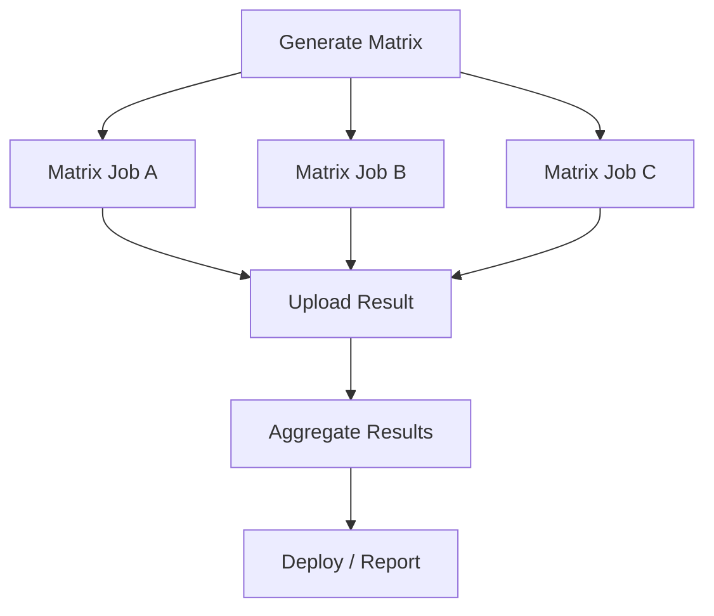
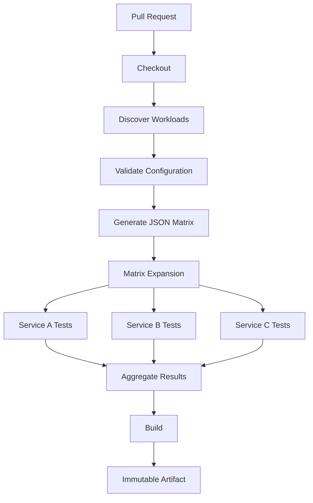

# 06- Dynamic Matrix Strategies

## Overview

GitHub Actions matrix strategies allow a workflow job to execute the same logical workload across multiple combinations of inputs.

A static matrix is straightforward:

```yaml
strategy:
  matrix:
    python-version: ["3.11", "3.12"]
```

A dynamic matrix goes further by determining the combinations at workflow runtime.

For production CI/CD, dynamic matrices are useful when the set of work items depends on:

- Repository configuration.
- Changed services.
- Supported Python versions.
- Database versions.
- Deployment targets.
- Microservices.
- Test suites.
- Generated metadata.
- External configuration.
- Build artifacts.

The basic architecture is:

```text
Generate Configuration
        ↓
Serialize as JSON
        ↓
Job Output
        ↓
fromJSON()
        ↓
Dynamic Matrix
        ↓
Parallel Jobs
```

This allows a workflow to adapt its execution plan without hard-coding every matrix combination into YAML.

## Static Matrix vs Dynamic Matrix

A static matrix is defined directly in the workflow:

```yaml
strategy:
  matrix:
    python-version: ["3.11", "3.12"]
```

A dynamic matrix is generated by an earlier job:

```text
Configuration
    ↓
Generate Matrix
    ↓
JSON Output
    ↓
fromJSON()
    ↓
Matrix Job
```

| Capability | Static Matrix | Dynamic Matrix |
|---|---|---|
| Values known at authoring time | Yes | Not necessarily |
| Runtime configuration | Limited | Strong |
| Changed-service detection | Limited | Strong |
| Generated combinations | Limited | Strong |
| Simplicity | High | Moderate |
| Debugging | Easier | More involved |
| Best use | Stable combinations | Runtime-dependent workloads |

Use a static matrix when the dimensions are stable and known.

Use a dynamic matrix when the workflow needs to determine the workload from runtime information.

## Matrix Fundamentals

A matrix expands one job definition into multiple job executions.

```yaml
jobs:
  test:
    runs-on: ubuntu-latest

    strategy:
      matrix:
        python-version:
          - "3.11"
          - "3.12"

    steps:
      - uses: actions/checkout@v4

      - uses: actions/setup-python@v5
        with:
          python-version: ${{ matrix.python-version }}

      - run: pytest
```

Conceptually:

```text
test
 ├── Python 3.11
 └── Python 3.12
```

Each matrix combination is an independent job execution.

## Multiple Matrix Dimensions

Multiple dimensions produce combinations.

```yaml
strategy:
  matrix:
    python-version:
      - "3.11"
      - "3.12"
    database:
      - postgres
      - mysql
```

This produces:

```text
Python 3.11 + PostgreSQL
Python 3.11 + MySQL
Python 3.12 + PostgreSQL
Python 3.12 + MySQL
```

The number of combinations grows multiplicatively.

For dimensions with sizes:

```text
Python = 3
Database = 2
OS = 2
```

the theoretical matrix size is:

```text
3 × 2 × 2 = 12 jobs
```

This matters for CI cost and execution time.

## Matrix with Python Testing

A realistic Python backend pipeline may test multiple supported versions:

```yaml
jobs:
  test:
    runs-on: ubuntu-latest

    strategy:
      matrix:
        python-version:
          - "3.11"
          - "3.12"
          - "3.13"

    steps:
      - uses: actions/checkout@v4

      - name: Set up Python
        uses: actions/setup-python@v5
        with:
          python-version: ${{ matrix.python-version }}
          cache: pip

      - name: Install dependencies
        run: pip install -r requirements.txt

      - name: Run tests
        run: pytest
```

This provides compatibility coverage without duplicating jobs.

## Matrix with Django

A Django application can combine Python and database versions.

```yaml
strategy:
  matrix:
    python-version:
      - "3.11"
      - "3.12"
    database:
      - postgres
      - mysql
```

The workflow can use the matrix value to configure the test environment:

```yaml
env:
  DATABASE_ENGINE: ${{ matrix.database }}
```

The application test configuration should then translate that into the appropriate Django database configuration.

## `include`

`include` allows additional or customized matrix combinations.

Example:

```yaml
strategy:
  matrix:
    python-version:
      - "3.11"
      - "3.12"

    include:
      - python-version: "3.13"
        experimental: true
```

This can add metadata to a particular combination.

For example:

```yaml
strategy:
  matrix:
    python-version:
      - "3.11"
      - "3.12"

    include:
      - python-version: "3.13"
        experimental: true
```

A step can inspect:

```yaml
if: ${{ matrix.experimental }}
```

Matrix metadata can therefore influence behavior without duplicating the entire job.

## `exclude`

`exclude` removes unwanted combinations.

```yaml
strategy:
  matrix:
    python-version:
      - "3.11"
      - "3.12"

    database:
      - postgres
      - mysql

    exclude:
      - python-version: "3.11"
        database: mysql
```

The resulting combinations are:

```text
3.11 + PostgreSQL
3.12 + PostgreSQL
3.12 + MySQL
```

Use `exclude` when most combinations are valid and only a small number need to be removed.

If the valid combinations are highly irregular, a generated matrix may be clearer.

## Matrix Metadata

A matrix can contain structured objects.

```yaml
strategy:
  matrix:
    include:
      - service: orders
        path: services/orders
        python: "3.12"

      - service: payments
        path: services/payments
        python: "3.12"
```

Then:

```yaml
- name: Test service
  working-directory: ${{ matrix.path }}
  run: pytest
```

This is useful for monorepos and service-oriented repositories.

## `fail-fast`

By default, matrix behavior can stop in-progress or pending matrix jobs when a failure occurs depending on strategy configuration.

You can explicitly configure:

```yaml
strategy:
  fail-fast: false

  matrix:
    python-version:
      - "3.11"
      - "3.12"
      - "3.13"
```

With:

```yaml
fail-fast: false
```

other matrix jobs can continue even if one combination fails.

This is useful when compatibility testing should provide the complete failure picture.

For example:

```text
Python 3.11 → PASS
Python 3.12 → FAIL
Python 3.13 → FAIL
```

This gives more diagnostic information than immediately terminating the matrix.

## When to Use `fail-fast: false`

Use it when:

- Every combination provides independent information.
- You need compatibility visibility.
- Failures need to be compared across versions.
- Matrix jobs are relatively inexpensive.

Avoid disabling fail-fast automatically for expensive workloads where subsequent jobs provide little value after a fundamental failure.

## `max-parallel`

Matrix jobs can be constrained using `max-parallel`.

```yaml
strategy:
  max-parallel: 2

  matrix:
    python-version:
      - "3.11"
      - "3.12"
      - "3.13"
      - "3.14"
```

This limits how many matrix jobs execute concurrently.

It can help control:

- CI resource consumption.
- External service load.
- Database capacity.
- Self-hosted runner utilization.
- Cloud API rate limits.

## Matrix Cost Model

Suppose:

```text
Python versions = 3
Databases = 2
Operating systems = 2
```

Then:

```text
3 × 2 × 2 = 12 jobs
```

If each job takes 8 minutes:

```text
12 × 8 = 96 runner-minutes
```

Parallelism reduces elapsed time but does not necessarily reduce total compute consumption.

Dynamic matrices should therefore be designed with cost in mind.

## Matrix and `needs`

A matrix job can depend on another job:

```yaml
jobs:
  prepare:
    runs-on: ubuntu-latest
    steps:
      - run: echo "prepare"

  test:
    needs: prepare

    strategy:
      matrix:
        python-version:
          - "3.11"
          - "3.12"

    runs-on: ubuntu-latest

    steps:
      - run: pytest
```

The dependency graph is:

```text
prepare
   │
   ├── test / Python 3.11
   └── test / Python 3.12
```

This creates a fan-out pattern.

## Fan-Out and Fan-In

Matrix strategies naturally support fan-out:

```text
                 ┌── Test A
Prepare ─────────┼── Test B
                 └── Test C
```

A downstream job can provide fan-in:

```text
                 ┌── Test A ──┐
Prepare ─────────┼── Test B ──┼── Aggregate
                 └── Test C ──┘
```

Example:

```yaml
jobs:
  test:
    strategy:
      matrix:
        python-version:
          - "3.11"
          - "3.12"

    runs-on: ubuntu-latest

    steps:
      - run: pytest

  package:
    needs: test
    runs-on: ubuntu-latest

    steps:
      - run: echo "All matrix tests completed"
```

The `package` job waits for the matrix job's required executions to complete successfully.

## Dynamic Matrix Architecture

A dynamic matrix usually has two phases:

```text
Phase 1
Generate Workload
      ↓
JSON Output

Phase 2
Consume JSON
      ↓
fromJSON()
      ↓
Matrix Expansion
      ↓
Parallel Jobs
```

Example:

```yaml
jobs:
  generate:
    runs-on: ubuntu-latest

    outputs:
      matrix: ${{ steps.matrix.outputs.matrix }}

    steps:
      - id: matrix
        run: |
          echo 'matrix={"python":["3.11","3.12"]}' >> "$GITHUB_OUTPUT"

  test:
    needs: generate
    runs-on: ubuntu-latest

    strategy:
      matrix: ${{ fromJSON(needs.generate.outputs.matrix) }}

    steps:
      - run: echo "Testing Python ${{ matrix.python }}"
```

The important data flow is:

```text
Step
 ↓
GITHUB_OUTPUT
 ↓
Job Output
 ↓
needs.generate.outputs.matrix
 ↓
fromJSON()
 ↓
strategy.matrix
```

## Why JSON Is Used

Workflow outputs are string-oriented.

A matrix needs structured data.

JSON provides a practical serialization format:

```json
{
  "python": [
    "3.11",
    "3.12"
  ]
}
```

The workflow converts the string back into a structured object:

```yaml
matrix: ${{ fromJSON(needs.generate.outputs.matrix) }}
```

This pattern is central to dynamic matrix design.

## Generating a Matrix with Python

A backend-oriented workflow may generate matrix data using Python.

```yaml
jobs:
  generate:
    runs-on: ubuntu-latest

    outputs:
      matrix: ${{ steps.generate.outputs.matrix }}

    steps:
      - uses: actions/checkout@v4

      - id: generate
        shell: bash
        run: |
          matrix="$(python scripts/generate_matrix.py)"
          echo "matrix=${matrix}" >> "$GITHUB_OUTPUT"
```

The Python program could produce:

```json
{"service":["orders","payments","users"]}
```

Then:

```yaml
jobs:
  test:
    needs: generate

    strategy:
      matrix: ${{ fromJSON(needs.generate.outputs.matrix) }}

    runs-on: ubuntu-latest

    steps:
      - uses: actions/checkout@v4

      - name: Test service
        run: pytest "services/${{ matrix.service }}"
```

## Matrix Generation from Repository Structure

A monorepo may contain:

```text
services/
├── orders/
├── payments/
├── users/
└── notifications/
```

Instead of hard-coding:

```yaml
matrix:
  service:
    - orders
    - payments
    - users
    - notifications
```

the workflow can discover services dynamically.

Conceptually:

```text
Repository
    ↓
Discover services
    ↓
Validate services
    ↓
Generate JSON
    ↓
Matrix
```

This allows the workflow to adapt when a new service is added.

## Safe Service Discovery

Do not blindly convert every directory into a production workload.

A discovery script should validate structure.

For example:

```python
from pathlib import Path
import json

services = []

for path in sorted(Path("services").iterdir()):
    if not path.is_dir():
        continue

    if (path / "pyproject.toml").exists():
        services.append(path.name)

print(json.dumps({"service": services}))
```

This makes the matrix generation rule explicit.

## Dynamic Matrix from Changed Files

A common optimization is to run tests only for affected services.

```text
Pull Request
    ↓
Changed Files
    ↓
Affected Services
    ↓
Dynamic Matrix
    ↓
Parallel Tests
```

For example:

```text
Changed:
services/orders/api.py
services/orders/models.py
```

The generated matrix may be:

```json
{
  "service": ["orders"]
}
```

Instead of running:

```text
orders
payments
users
notifications
```

only the relevant workload executes.

## Changed-Service Detection Trade-Off

Changed-service detection improves efficiency but introduces complexity.

Potential problems include:

- Shared library changes affecting multiple services.
- Configuration changes affecting the whole repository.
- Database migrations affecting multiple components.
- Docker base image changes.
- CI configuration changes.
- Cross-service contracts.

A production system should define explicit dependency rules.

For example:

```text
Shared library change
    ↓
Run all services

Service-local change
    ↓
Run affected service
```

Optimization should never compromise test coverage.

## Dynamic Matrix with Shared Dependencies

Consider:

```text
services/
├── orders/
├── payments/
└── users/

libs/
└── common/
```

A change to:

```text
libs/common/
```

may require:

```json
{
  "service": [
    "orders",
    "payments",
    "users"
  ]
}
```

A change to:

```text
services/orders/
```

may require:

```json
{
  "service": [
    "orders"
  ]
}
```

The dependency graph must therefore be part of matrix generation logic.

## JSON Matrix Structure

A matrix can contain objects:

```json
{
  "include": [
    {
      "service": "orders",
      "path": "services/orders",
      "python": "3.12"
    },
    {
      "service": "payments",
      "path": "services/payments",
      "python": "3.12"
    }
  ]
}
```

Workflow:

```yaml
strategy:
  matrix: ${{ fromJSON(needs.generate.outputs.matrix) }}
```

Then:

```yaml
working-directory: ${{ matrix.path }}
```

and:

```yaml
with:
  python-version: ${{ matrix.python }}
```

This is often more expressive than maintaining separate matrix dimensions when valid combinations are irregular.

## Matrix Dimensions vs Matrix Objects

Use dimensions when combinations are naturally Cartesian:

```text
Python × Database
```

Use objects when combinations are explicitly defined:

```text
orders → Python 3.12 → PostgreSQL
payments → Python 3.11 → MySQL
```

| Model | Best Fit |
|---|---|
| Multiple dimensions | Regular combinations |
| `include` | Small exceptions |
| `exclude` | Small number of invalid combinations |
| Object matrix | Explicit workload definitions |
| Dynamic JSON | Runtime-generated workload |

## Dynamic Matrix from Configuration

A repository can define configuration:

```yaml
services:
  - name: orders
    path: services/orders
    python: "3.12"

  - name: payments
    path: services/payments
    python: "3.11"
```

A generation step can convert this into:

```json
{
  "include": [
    {
      "name": "orders",
      "path": "services/orders",
      "python": "3.12"
    },
    {
      "name": "payments",
      "path": "services/payments",
      "python": "3.11"
    }
  ]
}
```

The matrix then becomes configuration-driven.

This is useful when service metadata changes more frequently than workflow implementation.

## Validate Generated Matrix Data

Dynamic configuration should be validated before matrix expansion.

At minimum validate:

- Required fields.
- Allowed values.
- Existing paths.
- Supported runtimes.
- Supported environments.
- Maximum workload size.

Example:

```python
allowed_python = {"3.11", "3.12", "3.13"}

for service in services:
    if service["python"] not in allowed_python:
        raise ValueError(
            f"Unsupported Python version: {service['python']}"
        )
```

Fail early in the generation job rather than producing ambiguous failures across dozens of matrix jobs.

## Matrix Size Guardrails

Dynamic generation can accidentally produce hundreds of jobs.

For example:

```text
1,000 discovered directories
        ↓
1,000 matrix jobs
```

This can cause:

- Large CI costs.
- Queue delays.
- Runner exhaustion.
- API pressure.
- Excessive logs.
- Difficult debugging.

Set an explicit guardrail.

```python
MAX_SERVICES = 50

if len(services) > MAX_SERVICES:
    raise RuntimeError(
        f"Matrix contains {len(services)} services; "
        f"maximum allowed is {MAX_SERVICES}"
    )
```

The exact limit should match the repository and runner architecture.

## Matrix and External Services

Suppose each matrix job runs integration tests against PostgreSQL and Redis.

```text
Matrix Job
   ├── PostgreSQL
   └── Redis
```

If there are 20 matrix jobs, there may be 20 PostgreSQL and Redis instances.

That can create substantial resource consumption.

Consider whether the matrix should represent:

```text
Application compatibility
```

rather than unnecessarily multiplying infrastructure.

## Matrix with Service Containers

Example:

```yaml
jobs:
  integration:
    runs-on: ubuntu-latest

    strategy:
      matrix:
        python-version:
          - "3.11"
          - "3.12"

    services:
      postgres:
        image: postgres:16
        env:
          POSTGRES_PASSWORD: postgres
          POSTGRES_DB: app
        ports:
          - 5432:5432

      redis:
        image: redis:7
        ports:
          - 6379:6379

    steps:
      - uses: actions/checkout@v4

      - uses: actions/setup-python@v5
        with:
          python-version: ${{ matrix.python-version }}

      - run: pip install -r requirements.txt
      - run: pytest
```

Each matrix job receives its own service-container environment.

## Matrix Outputs

Matrix jobs and outputs require careful design because a matrix represents multiple executions.

If every matrix execution produces a value:

```text
Job
 ├── Matrix A → output A
 ├── Matrix B → output B
 └── Matrix C → output C
```

a downstream workflow often needs aggregation rather than assuming there is one scalar output.

For production workflows, prefer:

```text
Matrix Jobs
    ↓
Artifacts / structured results
    ↓
Aggregation Job
    ↓
Single consolidated output
```

## Matrix Result Aggregation

A robust architecture is:



This avoids forcing multiple independent matrix executions into one output channel.

## Matrix and Artifacts

Artifacts are useful for matrix-specific results.

Example:

```yaml
- name: Upload test report
  uses: actions/upload-artifact@v4
  with:
    name: test-report-${{ matrix.python-version }}
    path: reports/
```

The matrix value should be part of the artifact name when multiple jobs produce similarly named files.

Otherwise, downstream consumers may not know which result belongs to which matrix execution.

## Matrix and Caching

Matrix jobs can share cache infrastructure, but cache keys should represent the relevant dimensions.

For example:

```text
Python version
OS
Dependency lock file
```

A conceptual cache key:

```text
pip-${OS}-${PythonVersion}-${hash(requirements)}
```

Avoid sharing incompatible dependency environments under the same cache key.

## `hashFiles()` with Matrix Jobs

A cache can use:

```yaml
key: >-
  ${{ runner.os }}-
  python-${{ matrix.python-version }}-
  ${{ hashFiles('**/requirements*.txt') }}
```

This ensures that dependency changes invalidate the cache.

The important principle is:

```text
Cache key
    =
Inputs that materially affect cached data
```

## Matrix and Docker Builds

A matrix can build multiple application variants:

```yaml
strategy:
  matrix:
    python:
      - "3.11"
      - "3.12"
```

However, building a production Docker image for every matrix combination may be wasteful.

A common architecture is:

```text
Matrix
    ↓
Compatibility Testing
    ↓
Select Production Runtime
    ↓
Single Production Build
```

Use matrix builds for compatibility when necessary, not simply because matrix functionality exists.

## Matrix and Deployment

Avoid automatically deploying every matrix combination.

For example:

```yaml
strategy:
  matrix:
    region:
      - us-east-1
      - eu-west-1
```

A deployment matrix can be valid for independent regional deployments, but production concurrency and rollback become more complex.

For deployment workloads, explicitly define:

- Deployment ordering.
- Failure behavior.
- Rollback.
- Health validation.
- Concurrency.
- Region dependencies.

## Matrix Deployment Strategies

A sequential regional deployment may be:

```text
Region A
   ↓
Health Check
   ↓
Region B
   ↓
Health Check
   ↓
Region C
```

A parallel deployment may be:

```text
          ┌── Region A
Artifact ─┼── Region B
          └── Region C
```

The choice depends on blast radius and recovery requirements.

## Matrix and `continue-on-error`

`continue-on-error` can be applied to experimental matrix entries.

For example:

```yaml
strategy:
  matrix:
    include:
      - python-version: "3.12"
        experimental: false

      - python-version: "3.13"
        experimental: true

continue-on-error: ${{ matrix.experimental }}
```

This allows an experimental compatibility target to fail without necessarily blocking the entire workflow.

Use this deliberately.

Do not mark production-critical matrix entries as non-blocking simply to make CI green.

## Experimental Matrix Entries

A practical use case is testing a future runtime:

```text
Supported:
Python 3.11
Python 3.12

Experimental:
Python 3.13
```

The workflow can provide visibility without making the experimental runtime a release blocker.

## Dynamic Matrix with Reusable Workflows

A reusable workflow can itself consume dynamic configuration.

Caller:

```yaml
jobs:
  ci:
    uses: organization/platform-workflows/.github/workflows/service-ci.yml@v1
    with:
      configuration: .ci/services.json
```

The reusable workflow can standardize how matrix data is generated and consumed.

However, do not expose excessively complex configuration contracts.

The reusable workflow should remain understandable to consumers.

## Dynamic Matrix in Cross-Repository CI

A central CI workflow can generate workloads based on repository content:

```text
Application Repository
        ↓
Shared CI Workflow
        ↓
Discover Components
        ↓
Generate JSON Matrix
        ↓
Matrix Testing
```

This allows many repositories to use the same orchestration while retaining repository-specific structure.

## Dynamic Matrix and Security

Dynamic matrix data can originate from:

- Pull request changes.
- Branch content.
- Repository files.
- Event payloads.
- External configuration.

Treat these sources as potentially untrusted.

Do not directly execute generated strings as shell code.

Dangerous:

```yaml
run: ./deploy-${{ matrix.service }}.sh
```

Prefer:

```yaml
env:
  SERVICE: ${{ matrix.service }}
run: |
  ./scripts/test-service.sh "$SERVICE"
```

The script should validate the service name against an allowlist.

## Avoid Shell Injection

Do not construct shell syntax from matrix values.

Bad:

```yaml
run: |
  pytest services/${{ matrix.service }}/tests -k "${{ matrix.test_filter }}"
```

A malicious or malformed value can alter shell interpretation.

Prefer environment variables:

```yaml
env:
  SERVICE: ${{ matrix.service }}
  TEST_FILTER: ${{ matrix.test_filter }}
run: |
  ./scripts/run-tests.sh "$SERVICE" "$TEST_FILTER"
```

The script should validate inputs.

## Matrix Data Validation

A production matrix should be treated like configuration.

Validate:

```text
service
path
runtime
database
environment
region
```

against known constraints.

Example:

```bash
case "$SERVICE" in
  orders|payments|users)
    ;;
  *)
    echo "Unsupported service: $SERVICE"
    exit 1
    ;;
esac
```

Validation is especially important when matrix data originates from repository content or event payloads.

## Matrix and Permissions

Each matrix execution inherits the job's permissions.

If a matrix contains untrusted or experimental workloads, do not grant broad privileges to the entire matrix.

Avoid:

```yaml
permissions:
  contents: write
  id-token: write
```

for a job that only needs to run tests.

Prefer:

```yaml
permissions:
  contents: read
```

and keep privileged deployment jobs separate.

## Matrix and OIDC

OIDC should generally be isolated to the deployment job rather than the broad test matrix.

Prefer:

```text
Matrix Tests
    ↓
No cloud write access

Build
    ↓
Artifact

Deploy
    ↓
OIDC
    ↓
AWS STS
```

rather than giving every matrix job the ability to assume a production role.

## Dynamic Matrix for AWS Environments

A deployment matrix might be generated from approved environments:

```json
{
  "include": [
    {
      "environment": "staging",
      "region": "us-east-1"
    },
    {
      "environment": "production",
      "region": "us-east-1"
    }
  ]
}
```

Before using such a matrix, validate:

- Environment is approved.
- Region is supported.
- IAM role corresponds to the environment.
- Deployment concurrency is correct.
- Production approval requirements remain intact.

Do not let arbitrary repository configuration decide which production environments receive deployments.

## Matrix and Concurrency

Matrix execution can conflict with concurrency.

For example:

```yaml
strategy:
  matrix:
    environment:
      - staging
      - production

concurrency:
  group: deploy-${{ matrix.environment }}
  cancel-in-progress: false
```

This creates environment-specific serialization.

The concurrency key should correspond to the actual resource being modified.

## Matrix Failure Handling

A matrix failure should answer:

```text
Which combination failed?
Why did it fail?
Should other combinations continue?
Is the failure blocking?
Can the matrix be retried safely?
```

Useful job naming information comes from matrix dimensions.

For example:

```text
test (3.11, postgres)
test (3.12, postgres)
test (3.11, mysql)
test (3.12, mysql)
```

This is much easier to diagnose than generic job names.

## Matrix Job Naming

GitHub Actions derives matrix job identity from matrix values.

You can also use matrix data in steps and summaries:

```yaml
- name: Test configuration
  run: |
    echo "Python: ${{ matrix.python-version }}"
    echo "Database: ${{ matrix.database }}"
```

A step summary can provide useful diagnostics:

```yaml
- name: Write summary
  run: |
    {
      echo "## Test Configuration"
      echo ""
      echo "- Python: ${{ matrix.python-version }}"
      echo "- Database: ${{ matrix.database }}"
    } >> "$GITHUB_STEP_SUMMARY"
```

## Debugging Dynamic Matrices

When a dynamic matrix fails, debug the pipeline in order:

```text
Generation
    ↓
Output
    ↓
JSON
    ↓
fromJSON()
    ↓
Matrix expansion
    ↓
Matrix job
```

Do not immediately debug the final matrix job.

First verify the generated JSON.

## Inspecting Generated JSON

A useful generation step is:

```yaml
- id: generate
  shell: bash
  run: |
    matrix="$(python scripts/generate_matrix.py)"

    python - <<'PY'
    import json
    import os

    # The actual value is passed through the shell in production code.
    # This example illustrates where validation belongs.
    PY

    echo "matrix=${matrix}" >> "$GITHUB_OUTPUT"
```

A better production design is to have the generation script validate and serialize its own output.

The workflow should then log safe metadata such as:

```text
Matrix entries: 6
Services: orders,payments,users,...
```

rather than dumping potentially sensitive configuration.

## Troubleshooting: Empty Matrix

### Symptom

The dynamic matrix job does not run as expected.

### Possible Causes

- Generation job produced invalid JSON.
- Output name is incorrect.
- `needs` dependency is missing.
- `fromJSON()` receives an empty string.
- Matrix generation returned zero workloads.

### Isolation Strategy

Check:

```text
Generation job
    ↓
Step output
    ↓
Job output
    ↓
needs.<job>.outputs.<name>
    ↓
fromJSON()
```

Confirm the exact output name at every stage.

## Troubleshooting: Invalid JSON

### Symptom

The workflow fails while evaluating:

```yaml
fromJSON(needs.generate.outputs.matrix)
```

### Possible Causes

- Invalid quoting.
- Newline corruption.
- Shell escaping.
- Empty output.
- Non-JSON diagnostic output mixed into JSON.

### Prevention

Make the generation program emit only the JSON payload to standard output:

```python
print(json.dumps(matrix))
```

Send diagnostics to standard error:

```python
print("Generated matrix", file=sys.stderr)
```

Then capture only standard output for the workflow output.

## Troubleshooting: Matrix Too Large

### Symptom

The workflow creates unexpectedly many jobs.

### Possible Causes

- Cartesian product expanded more than expected.
- Duplicate entries.
- Directory discovery includes generated directories.
- Configuration is malformed.
- A matrix dimension was unintentionally added.

### Prevention

Calculate and validate matrix size before emitting it.

```python
if len(matrix["include"]) > 50:
    raise RuntimeError("Matrix exceeds configured limit")
```

## Troubleshooting: One Matrix Combination Fails

### Symptom

Only one compatibility combination fails.

Example:

```text
Python 3.11 + PostgreSQL → PASS
Python 3.12 + PostgreSQL → PASS
Python 3.11 + MySQL      → FAIL
Python 3.12 + MySQL      → PASS
```

This suggests a combination-specific problem.

Inspect:

- Dependency versions.
- Database driver.
- Environment variables.
- Service container configuration.
- Runtime-specific behavior.
- Cache key.

Avoid disabling the entire matrix to hide one invalid combination.

## Troubleshooting: Dynamic Matrix Does Not Reflect Changes

### Symptom

A changed service is not included in testing.

### Possible Causes

- Change detection logic missed a shared dependency.
- Path matching is incorrect.
- Generated configuration is stale.
- Service metadata is incomplete.
- File was changed outside the discovery rules.

### Prevention

Maintain an explicit dependency model for shared libraries and infrastructure.

## Performance Considerations

Dynamic matrices can dramatically reduce CI time through parallelism.

For example:

```text
Sequential:
Service A → 8 min
Service B → 8 min
Service C → 8 min

Total ≈ 24 min
```

With matrix fan-out:

```text
Service A ─┐
Service B ─┼── parallel
Service C ─┘

Elapsed time ≈ 8 min
```

Actual performance depends on runner availability and queue time.

Parallelism is not free.

## Scalability Considerations

As the matrix grows:

```text
10 jobs
50 jobs
100 jobs
500 jobs
```

the bottleneck can move from computation to orchestration.

Potential constraints include:

- Runner availability.
- Workflow concurrency.
- External service capacity.
- API rate limits.
- Artifact storage.
- Log volume.
- CI budget.

Use dynamic matrices to represent useful parallelism, not maximum possible parallelism.

## Cost Optimization

Useful techniques include:

- Test only affected services where dependency analysis is reliable.
- Use appropriate matrix dimensions.
- Avoid unnecessary OS combinations.
- Use caching for dependencies.
- Use `max-parallel` to control expensive external systems.
- Avoid rebuilding identical artifacts for every matrix entry.
- Upload only required artifacts.
- Use matrix testing for compatibility rather than deployment duplication.

## Reliability Considerations

A dynamic matrix should fail deterministically.

Prefer:

```text
Invalid configuration
    ↓
Generation job fails
```

over:

```text
Invalid configuration
    ↓
50 matrix jobs start
    ↓
50 confusing failures
```

Validation should happen before expansion.

## High Availability and CI Infrastructure

Matrix workloads can create bursts.

For example:

```text
Commit
  ↓
Dynamic matrix
  ↓
100 jobs
  ↓
Runner queue
```

If CI capacity is insufficient, workflow duration may increase dramatically.

For high-volume organizations, consider:

- Appropriate runner pools.
- Autoscaling.
- Workload-specific labels.
- Separate production deployment runners.
- Concurrency controls.
- Job prioritization through workflow architecture.

## Artifact Strategy for Matrix Workloads

A large matrix can generate many artifacts:

```text
100 jobs
    ↓
100 test reports
```

This can create operational noise.

Prefer predictable artifact naming:

```text
test-report-${service}-${python}
```

and aggregate reports when useful.

Do not upload every temporary file from every matrix job.

## Dynamic Matrix and Reusable CI

A mature platform can encapsulate matrix generation inside a reusable workflow:

```text
Application Repository
        ↓
Reusable CI Workflow
        ↓
Discover Workloads
        ↓
Generate Matrix
        ↓
Test
        ↓
Aggregate
        ↓
Build Artifact
```

The application repository then supplies only configuration.

This reduces duplicated matrix logic across repositories.

## Production Architecture

A robust dynamic matrix pipeline may look like:



The important design principle is:

```text
Generate
  ↓
Validate
  ↓
Expand
  ↓
Execute
  ↓
Aggregate
  ↓
Promote
```

## Production Example: Python Microservices

Consider:

```text
services/
├── orders/
├── payments/
├── users/
└── notifications/
```

The repository contains:

```text
services/orders/pyproject.toml
services/payments/pyproject.toml
services/users/pyproject.toml
services/notifications/pyproject.toml
```

The generation step produces:

```json
{
  "include": [
    {
      "service": "orders",
      "path": "services/orders"
    },
    {
      "service": "payments",
      "path": "services/payments"
    },
    {
      "service": "users",
      "path": "services/users"
    },
    {
      "service": "notifications",
      "path": "services/notifications"
    }
  ]
}
```

The matrix consumes:

```yaml
strategy:
  matrix: ${{ fromJSON(needs.generate.outputs.matrix) }}
```

Each job runs:

```yaml
- name: Test service
  working-directory: ${{ matrix.path }}
  run: pytest
```

This creates a scalable fan-out model.

## Production Example: Python and Database Compatibility

A service might support:

```text
Python 3.11
Python 3.12

PostgreSQL 15
PostgreSQL 16
```

A regular matrix is appropriate:

```yaml
strategy:
  matrix:
    python:
      - "3.11"
      - "3.12"

    postgres:
      - "15"
      - "16"
```

The four combinations are:

```text
3.11 / PostgreSQL 15
3.11 / PostgreSQL 16
3.12 / PostgreSQL 15
3.12 / PostgreSQL 16
```

A dynamic matrix becomes useful if supported combinations are generated from a compatibility configuration.

## Production Example: Service-Specific Runtime

Suppose:

```text
orders     → Python 3.12
payments   → Python 3.11
analytics  → Python 3.12
```

A Cartesian matrix is not appropriate because each service has one runtime.

Use an object matrix:

```json
{
  "include": [
    {
      "service": "orders",
      "python": "3.12"
    },
    {
      "service": "payments",
      "python": "3.11"
    },
    {
      "service": "analytics",
      "python": "3.12"
    }
  ]
}
```

This expresses the actual workload directly.

## Common Mistakes

### Hard-Coding a Large Matrix

Large static matrices become difficult to maintain.

If workload definitions already exist elsewhere, generate the matrix from that source.

### Using Dynamic Matrices Without Validation

Generated configuration should never be trusted blindly.

Validate it before expansion.

### Creating Excessive Combinations

A matrix such as:

```text
4 Python versions
3 databases
3 operating systems
5 services
```

creates:

```text
4 × 3 × 3 × 5 = 180 jobs
```

This may be unnecessary.

### Using `exclude` for a Highly Irregular Matrix

If most combinations are invalid, `include` or an object-based dynamic matrix is clearer.

### Passing Untrusted Matrix Values Directly into Shell

Avoid:

```yaml
run: ./deploy-${{ matrix.service }}.sh
```

Use environment variables and validate inputs.

### Granting Cloud Permissions to Test Matrices

Test jobs generally should not have production cloud permissions.

Keep OIDC and deployment permissions in a separate deployment job.

### Rebuilding Artifacts in Every Matrix Job

Matrix jobs should generally validate compatibility.

A production artifact should usually be built once after required tests pass.

### Ignoring Matrix Cost

Parallel jobs reduce elapsed time but increase resource consumption.

### No Matrix Size Guardrail

Dynamic discovery can accidentally create hundreds of jobs.

Validate the workload size.

### Treating Changed-File Detection as Perfect

A local change may have global effects.

Shared libraries, configuration, schemas, infrastructure, and contracts need explicit dependency rules.

## Interview Scenarios

### Scenario: Test Three Python Versions

**Question:** How would you test a Django application against Python 3.11, 3.12, and 3.13?

Use a static matrix:

```yaml
strategy:
  matrix:
    python:
      - "3.11"
      - "3.12"
      - "3.13"
```

The interviewer should expect discussion of:

- Dependency compatibility.
- `fail-fast`.
- Caching.
- Test artifacts.
- Experimental versions.
- CI cost.

### Scenario: Matrix Comes from Repository Configuration

**Question:** How would you create a matrix from a JSON configuration file?

Use:

```text
Configuration
    ↓
Generate / validate
    ↓
$GITHUB_OUTPUT
    ↓
Job output
    ↓
fromJSON()
    ↓
strategy.matrix
```

The candidate should explain JSON serialization and output propagation.

### Scenario: Monorepo with 50 Services

**Question:** Would you test all services for every pull request?

Not necessarily.

A candidate should discuss:

- Changed-service detection.
- Dependency graphs.
- Shared libraries.
- Full-suite fallback.
- Matrix size.
- CI cost.
- Reliability of change detection.

### Scenario: Matrix Contains 500 Jobs

**Question:** What would you do?

First determine why the matrix expanded.

Then consider:

- Deduplication.
- Reducing dimensions.
- `include` instead of Cartesian products.
- Affected-service detection.
- `max-parallel`.
- Splitting workloads.
- Runner capacity.
- Cost.

Do not solve an architectural problem simply by increasing runner capacity.

### Scenario: One Matrix Entry Is Experimental

**Question:** How can an experimental runtime fail without blocking the release?

Use matrix metadata:

```yaml
continue-on-error: ${{ matrix.experimental }}
```

while keeping supported production combinations blocking.

### Scenario: Matrix Deployment to Multiple Regions

**Question:** Would you deploy to every region in parallel?

The answer depends on failure tolerance and deployment architecture.

Discuss:

- Parallel versus sequential deployment.
- Health checks.
- Blast radius.
- Rollback.
- Regional independence.
- Concurrency.
- Traffic shifting.

### Scenario: Dynamic Matrix Contains Untrusted Data

**Question:** How would you prevent shell injection?

Do not interpolate untrusted matrix values directly into shell syntax.

Use:

```yaml
env:
  SERVICE: ${{ matrix.service }}
```

then validate and quote:

```bash
./test-service.sh "$SERVICE"
```

### Scenario: Dynamic Matrix Generation Fails

**Question:** How would you debug it?

Follow the data flow:

```text
Generator
    ↓
Step Output
    ↓
Job Output
    ↓
needs
    ↓
fromJSON
    ↓
Matrix
```

Validate JSON and output names before inspecting the matrix jobs.

## GitHub CLI and Matrix Operations

GitHub CLI can help inspect matrix workflow runs.

List recent runs:

```bash
gh run list --repo organization/orders-api
```

Inspect a run:

```bash
gh run view <run-id> --repo organization/orders-api
```

View logs:

```bash
gh run view <run-id> \
  --repo organization/orders-api \
  --log
```

Rerun a failed workflow:

```bash
gh run rerun <run-id> --repo organization/orders-api
```

For matrix failures, inspect the individual matrix job logs rather than assuming the generation step is responsible.

## Operational Checklist

Before introducing a dynamic matrix, verify:

- The matrix represents a real engineering requirement.
- Static matrices are insufficient for the workload.
- Matrix data has a clearly defined source.
- Generated data is validated.
- JSON output is syntactically valid.
- `$GITHUB_OUTPUT` is used for step-to-job data transfer.
- `needs` correctly establishes the dependency.
- `fromJSON()` receives the expected structure.
- Matrix size has a guardrail.
- Invalid combinations are removed.
- `include` and `exclude` are used appropriately.
- Cartesian-product growth is understood.
- `fail-fast` behavior is intentional.
- `max-parallel` is configured where external capacity requires it.
- Matrix jobs do not receive unnecessary secrets.
- Test matrices do not receive production cloud permissions.
- Untrusted matrix values are safely passed to scripts.
- Service discovery handles shared dependencies.
- Artifact names identify matrix dimensions.
- Cache keys include relevant matrix dimensions.
- Production artifacts are built separately from compatibility testing where appropriate.
- Matrix deployment has explicit rollback and concurrency behavior.
- Failure diagnostics identify the exact matrix combination.

## Key Takeaways

- Dynamic matrices convert runtime-generated configuration into parallel GitHub Actions jobs through validated JSON and `fromJSON()`.
- Use static matrices for stable Cartesian combinations and dynamic object matrices when workloads, services, or valid combinations are determined at runtime.
- Validate generated matrix data and enforce size limits before expansion to prevent invalid configurations, excessive CI cost, and runner saturation.
- Keep matrix jobs minimally privileged, safely handle untrusted values, and separate compatibility testing from privileged artifact promotion and production deployment.
- Design matrix workflows around fan-out, controlled parallelism, aggregation, caching, artifacts, and failure isolation rather than simply maximizing the number of parallel jobs.