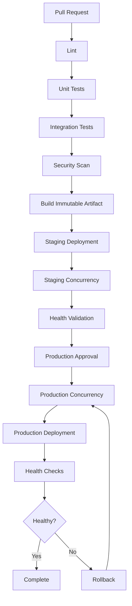

# 07- Concurrency

## Overview

GitHub Actions concurrency controls which workflow runs or jobs are allowed to execute simultaneously when they target the same logical resource.

Without concurrency control, multiple workflow runs can modify the same resource at the same time:

```text
Commit A
    ↓
Deployment A ────────────────┐
                             ├── Production
Commit B                     │
    ↓                        │
Deployment B ────────────────┘
```

This creates race conditions.

For production CI/CD, concurrency is particularly important for:

- Production deployments.
- Staging deployments.
- Pull request validation.
- Environment promotion.
- Infrastructure changes.
- Docker image publishing.
- Database migrations.
- Release workflows.
- Stateful external systems.

The core model is:

```text
Workflow / Job
      ↓
Concurrency Group
      ↓
At most one active execution for that group
      ↓
Optional cancellation of an older execution
```

Concurrency is not simply a performance feature. It is a correctness and deployment-safety mechanism.

## Why Concurrency Exists

Consider two commits:

```text
Commit A → Deployment starts
Commit B → Deployment starts
```

If deployment B finishes first:

```text
Production = B
```

but deployment A finishes afterward:

```text
Production = A
```

The environment has now regressed to an older version.

This is a deployment race.

A concurrency group can serialize these deployments:

```text
Commit A
   ↓
Deploy A ────────┐
                 │
Commit B         │
   ↓             │
Deploy B waits ──┘
```

With `cancel-in-progress: true`, the workflow can instead discard an obsolete deployment:

```text
Deploy A
   ↓
Commit B arrives
   ↓
Cancel A
   ↓
Deploy B
```

The appropriate behavior depends on the workload.

## Basic Concurrency

A simple workflow-level configuration is:

```yaml
name: CI

on:
  push:
    branches:
      - main

concurrency:
  group: main-ci
  cancel-in-progress: true

jobs:
  test:
    runs-on: ubuntu-latest

    steps:
      - uses: actions/checkout@v4

      - run: pytest
```

The group is:

```text
main-ci
```

Only one active workflow run can occupy that concurrency group.

## Concurrency Group

The `group` identifies executions that must coordinate with each other.

Static:

```yaml
concurrency:
  group: production
```

Dynamic:

```yaml
concurrency:
  group: deploy-${{ github.ref }}
```

The group should represent the resource whose concurrent modification would be unsafe.

Good examples:

```text
production
staging
deploy-production
deploy-staging
pr-123
service-orders-production
```

Poor examples:

```text
all-workflows
everything
ci
```

unless intentionally serializing the entire workload.

## `cancel-in-progress`

The second important setting is:

```yaml
cancel-in-progress: true
```

This means an active execution in the same concurrency group can be cancelled when a newer execution enters the group.

Example:

```text
Run A starts
    ↓
Run B starts
    ↓
Run A cancelled
    ↓
Run B continues
```

This is particularly useful for pull request CI where only the latest commit matters.

## Pull Request Concurrency

Suppose a developer pushes five commits quickly:

```text
Commit 1 → CI
Commit 2 → CI
Commit 3 → CI
Commit 4 → CI
Commit 5 → CI
```

Running all five full test suites may waste resources.

Use a pull-request-specific group:

```yaml
concurrency:
  group: pr-${{ github.event.pull_request.number }}
  cancel-in-progress: true
```

Now:

```text
Commit 1 ──┐
Commit 2 ──┤
Commit 3 ──┤── same PR concurrency group
Commit 4 ──┤
Commit 5 ──┘
             ↓
       latest execution
```

This is often appropriate for expensive validation workflows.

## Production Deployment Concurrency

Production deployments usually require a different policy.

Example:

```yaml
concurrency:
  group: production-deployment
  cancel-in-progress: false
```

This prevents two production deployments from running simultaneously.

Unlike pull request CI, cancelling an active production deployment may be unsafe.

The deployment may already have:

- Modified infrastructure.
- Changed database state.
- Shifted traffic.
- Updated containers.
- Started migrations.
- Changed configuration.

Therefore, cancellation policy should be based on the deployment system's ability to safely interrupt an active operation.

## Workflow-Level vs Job-Level Concurrency

Concurrency can be applied at the workflow level:

```yaml
concurrency:
  group: production
  cancel-in-progress: false
```

or at the job level:

```yaml
jobs:
  deploy:
    runs-on: ubuntu-latest

    concurrency:
      group: production
      cancel-in-progress: false

    steps:
      - run: ./deploy.sh
```

The scope determines what is serialized.

| Scope | Effect | Typical Use |
|---|---|---|
| Workflow | Coordinates entire workflow runs | PR CI, release workflows |
| Job | Coordinates specific jobs | Production deployment |
| Dynamic group | Coordinates specific resource | Environment/service deployment |

## Choosing the Correct Scope

If only deployment must be serialized:

```text
Lint ────────────────┐
Tests ───────────────┼── parallel
Security Scan ───────┘
                      ↓
                   Deploy
                      ↓
                concurrency
```

Use job-level concurrency.

Do not unnecessarily serialize unrelated jobs.

## Dynamic Concurrency Groups

Concurrency becomes more powerful when the group is derived from workflow context.

For example:

```yaml
concurrency:
  group: deploy-${{ github.ref }}
  cancel-in-progress: false
```

This gives different branches separate groups:

```text
deploy-main
deploy-release/v1
deploy-feature/foo
```

For environment-based deployments:

```yaml
concurrency:
  group: deploy-${{ inputs.environment }}
  cancel-in-progress: false
```

This can serialize deployments to the same environment.

## Environment-Specific Concurrency

Consider:

```text
staging
production
```

These environments may be deployed independently.

Use:

```yaml
concurrency:
  group: deploy-${{ inputs.environment }}
  cancel-in-progress: false
```

Then:

```text
Deploy staging ──┐
                 ├── separate groups
Deploy production┘
```

A staging deployment does not unnecessarily block production.

## Service-Specific Concurrency

In a microservices repository:

```text
orders
payments
users
```

Each service may have its own deployment lifecycle.

Use:

```yaml
concurrency:
  group: deploy-${{ matrix.service }}-${{ inputs.environment }}
  cancel-in-progress: false
```

This produces groups such as:

```text
deploy-orders-production
deploy-payments-production
deploy-users-production
```

An orders deployment does not block an unrelated payments deployment.

## Resource-Based Concurrency

The most useful mental model is:

```text
Concurrency Group ≈ Resource Lock
```

If two executions modify the same resource, consider whether they belong to the same group.

Examples:

| Resource | Possible Group |
|---|---|
| Production environment | `production` |
| Staging environment | `staging` |
| Orders production | `orders-production` |
| Terraform state | `terraform-production` |
| Release artifact | `release-main` |
| Pull request | `pr-123` |

This is more useful than thinking of concurrency as merely "one workflow at a time."

## Preventing Deployment Race Conditions

A deployment race can occur when:

```text
Deployment A starts
       ↓
Deployment B starts
       ↓
B finishes
       ↓
A finishes
```

Final state:

```text
Version A
```

even though B was newer.

Concurrency can enforce:

```text
Deployment A
       ↓
Deployment B waits
```

or:

```text
Deployment A
       ↓
Deployment B cancels A
       ↓
Deployment B
```

The correct strategy depends on deployment semantics.

## Cancel vs Queue

There are two common policies.

### Cancel Obsolete Work

```yaml
cancel-in-progress: true
```

Useful when:

- Only the latest state matters.
- Work is idempotent.
- Older CI results are obsolete.
- Pull requests receive frequent updates.

Typical example:

```text
PR validation
```

### Preserve the Current Operation

```yaml
cancel-in-progress: false
```

Useful when:

- The operation changes external state.
- Cancellation may leave partial state.
- Deployment rollback is not automatic.
- The current operation should finish before another starts.

Typical example:

```text
Production deployment
```

## Concurrency and Deployment Safety

Concurrency alone does not make deployments safe.

A production deployment should also consider:

```text
Build
  ↓
Immutable artifact
  ↓
Approval
  ↓
Concurrency control
  ↓
Deploy
  ↓
Health check
  ↓
Traffic validation
  ↓
Success / rollback
```

Concurrency prevents simultaneous operations.

Health checks determine whether the resulting state is valid.

Rollback handles failures.

These solve different problems.

## Concurrency and Environment Protection

GitHub environments can provide deployment protection such as:

- Required reviewers.
- Environment-specific secrets.
- Deployment restrictions.

Concurrency solves a different concern:

```text
Environment protection
    ↓
Who may deploy?

Concurrency
    ↓
How many deployments may execute simultaneously?
```

A production workflow can use both.

```yaml
jobs:
  deploy:
    environment:
      name: production

    concurrency:
      group: production
      cancel-in-progress: false

    runs-on: ubuntu-latest

    steps:
      - run: ./deploy.sh
```

## Approval and Concurrency

Consider two production deployments:

```text
Deployment A → waiting for approval
Deployment B → waiting for approval
```

Without an appropriate concurrency strategy, both may eventually become eligible to deploy.

A production design should define:

- Whether pending deployments should be superseded.
- Whether approvals remain valid for the exact artifact.
- Whether only one deployment may modify production.
- What happens when a newer release is created.

The approval model and concurrency model should be designed together.

## Concurrency with Immutable Artifacts

A robust deployment architecture is:

```text
Commit A
   ↓
Build image A
   ↓
ECR image digest A
   ↓
Staging
   ↓
Production

Commit B
   ↓
Build image B
   ↓
ECR image digest B
```

The deployment should promote a known artifact rather than rebuilding.

Concurrency then controls:

```text
Which artifact may change the environment?
```

This is safer than allowing every deployment job to rebuild independently.

## Concurrency and Docker

Suppose two workflows deploy:

```text
image: app:latest
```

Both may resolve `latest` differently depending on timing.

Prefer immutable references:

```text
app:<commit-sha>
```

or preferably the image digest:

```text
app@sha256:...
```

Then concurrency controls deployment ordering while artifact immutability controls artifact identity.

## Concurrency and AWS

A common architecture is:

```text
GitHub Actions
      ↓
OIDC
      ↓
AWS STS
      ↓
IAM Role
      ↓
ECS / EC2 / Lambda
```

For production deployment:

```yaml
jobs:
  deploy:
    permissions:
      contents: read
      id-token: write

    environment:
      name: production

    concurrency:
      group: production
      cancel-in-progress: false

    runs-on: ubuntu-latest

    steps:
      - name: Configure AWS credentials
        uses: aws-actions/configure-aws-credentials@v4
        with:
          role-to-assume: ${{ vars.AWS_DEPLOY_ROLE }}
          aws-region: ${{ vars.AWS_REGION }}

      - name: Deploy
        run: ./scripts/deploy.sh
```

The important separation is:

```text
Authentication
     ↓
OIDC / STS

Authorization
     ↓
IAM

Concurrency
     ↓
Deployment serialization
```

Each mechanism solves a different problem.

## Concurrency and Terraform

Infrastructure deployment can also require serialization.

Example:

```text
Terraform Run A
     ↓
Terraform state

Terraform Run B
     ↓
same state
```

Concurrent operations can conflict even if Terraform itself provides state locking.

At the CI layer:

```yaml
concurrency:
  group: terraform-${{ inputs.environment }}
  cancel-in-progress: false
```

This makes the workflow's deployment intent explicit.

Terraform's own state locking remains important because CI concurrency and infrastructure-tool locking operate at different layers.

## Concurrency and Database Migrations

Database migrations require particular caution.

Consider:

```text
Deployment A
    ↓
Migration A

Deployment B
    ↓
Migration B
```

If both execute simultaneously, migration ordering may become unsafe.

Use a dedicated deployment concurrency group:

```yaml
concurrency:
  group: production-database-migration
  cancel-in-progress: false
```

However, concurrency does not replace migration design.

Migrations should still be:

- Backward compatible where required.
- Idempotent where practical.
- Observable.
- Rollback-aware.
- Compatible with rolling deployments.

## Concurrency and Rolling Deployments

A rolling deployment may update instances gradually:

```text
Version A
 ├── Instance 1
 ├── Instance 2
 └── Instance 3

       ↓

Version B
 ├── Instance 1 updated
 ├── Instance 2 updated
 └── Instance 3 updated
```

If another deployment begins halfway through:

```text
A → B
      ↘ C
```

the deployment controller may end up with conflicting desired states.

CI-level concurrency prevents multiple deployment controllers from simultaneously modifying the same logical environment.

## Concurrency and Blue/Green Deployments

Blue/green deployments involve two environments:

```text
Blue  → Current
Green → New
```

A deployment might:

```text
Build
 ↓
Deploy Green
 ↓
Health Check
 ↓
Switch Traffic
```

Another deployment starting during the traffic switch can create conflicts.

Use:

```yaml
concurrency:
  group: production-traffic
  cancel-in-progress: false
```

This serializes operations that change production traffic.

## Concurrency and Canary Deployments

Canary deployment:

```text
100% Version A
      ↓
  5% Version B
      ↓
Health validation
      ↓
 25% Version B
      ↓
Health validation
      ↓
100% Version B
```

This is a stateful operation.

Do not assume that `cancel-in-progress: true` is safe simply because a newer commit exists.

The deployment may need to:

1. Complete.
2. Roll back.
3. Restore a known traffic state.
4. Then allow the next deployment.

The correct policy depends on the deployment controller.

## Concurrency and Releases

Release workflows may use:

```yaml
concurrency:
  group: release-${{ github.ref }}
  cancel-in-progress: false
```

This prevents two release operations from manipulating the same release stream simultaneously.

Potential operations include:

- Version generation.
- Changelog generation.
- Package publishing.
- Docker publishing.
- GitHub Release creation.
- Deployment promotion.

## Concurrency and Artifact Publishing

Suppose two jobs publish:

```text
latest
```

at the same time.

The resulting tag can become ambiguous.

Prefer immutable identifiers:

```text
app:abc1234
app:def5678
```

and use concurrency only where mutable references need coordination.

For example:

```text
Build A → immutable image A
Build B → immutable image B

Promotion → concurrency controlled
```

This reduces the amount of state that requires serialization.

## Concurrency and Caching

Caching and deployment concurrency solve different problems.

Cache:

```text
Can this reusable data be shared?
```

Concurrency:

```text
Can these operations execute simultaneously?
```

Do not use concurrency to compensate for an incorrect cache key.

Likewise, do not assume a cache guarantees exclusive access to a mutable resource.

## Concurrency with Matrix Jobs

A matrix can create multiple executions:

```yaml
strategy:
  matrix:
    service:
      - orders
      - payments
      - users
```

Concurrency can be combined with matrix values:

```yaml
concurrency:
  group: test-${{ matrix.service }}
  cancel-in-progress: true
```

This gives each service its own group.

However, the desired behavior should be explicit.

If the actual resource is the entire test environment, using separate groups per service may allow unsafe parallel operations.

## Matrix Deployment Example

Consider:

```yaml
jobs:
  deploy:
    strategy:
      matrix:
        service:
          - orders
          - payments

    concurrency:
      group: deploy-${{ matrix.service }}-production
      cancel-in-progress: false

    environment:
      name: production

    runs-on: ubuntu-latest

    steps:
      - run: ./deploy.sh "${{ matrix.service }}"
```

This allows:

```text
orders-production
payments-production
```

to deploy independently.

Use this only if the services genuinely have independent deployment resources.

## Workflow-Level Concurrency for Pull Requests

A practical CI workflow:

```yaml
name: CI

on:
  pull_request:

concurrency:
  group: ci-pr-${{ github.event.pull_request.number }}
  cancel-in-progress: true

jobs:
  test:
    runs-on: ubuntu-latest

    steps:
      - uses: actions/checkout@v4
      - run: pytest
```

If the pull request changes from:

```text
commit A
```

to:

```text
commit B
```

the previous CI execution becomes obsolete.

## Workflow-Level Concurrency for Main

For main branch validation:

```yaml
concurrency:
  group: ci-main
  cancel-in-progress: true
```

This can reduce redundant builds when many commits arrive quickly.

However, do not cancel workflows if every run represents an independently required artifact, release, or compliance record.

## Concurrency and Required Checks

A subtle issue occurs when cancelling CI runs that are associated with required pull request checks.

Consider:

```text
Run A → required check
Run B → replaces Run A
```

The repository's branch protection configuration must account for the check lifecycle.

Design the workflow so that the latest relevant run provides the required validation state.

## Concurrency and Reusable Workflows

Reusable workflows can define concurrency internally:

```yaml
jobs:
  deploy:
    concurrency:
      group: production
      cancel-in-progress: false
```

This is useful when every consumer must obey the same deployment serialization policy.

A platform team can therefore standardize:

```text
Application repository
       ↓
Reusable deployment workflow
       ↓
Standard concurrency policy
       ↓
Production
```

This reduces policy drift.

## Concurrency as a Platform Policy

Organizations can establish standard conventions:

```text
CI:
ci-${pull_request_number}

Staging:
deploy-staging

Production:
deploy-production

Service production:
deploy-${service}-production

Terraform:
terraform-${environment}
```

The exact naming convention matters less than consistent resource-oriented semantics.

## Concurrency Group Design

A good concurrency group should be:

- Deterministic.
- Stable.
- Specific to the protected resource.
- Shared by executions that truly conflict.
- Different for independent resources.

Example:

```yaml
concurrency:
  group: deploy-${{ inputs.service }}-${{ inputs.environment }}
  cancel-in-progress: false
```

This is preferable to:

```yaml
concurrency:
  group: deploy
```

if services and environments can safely operate independently.

## Avoiding Accidental Serialization

Overly broad groups reduce throughput.

Suppose:

```yaml
concurrency:
  group: production
```

is applied to all services:

```text
orders
payments
users
```

Then:

```text
orders → wait
payments → wait
users → wait
```

even if they deploy completely independent infrastructure.

A better design may be:

```text
orders-production
payments-production
users-production
```

provided those resources are actually independent.

## Avoiding Insufficient Serialization

The opposite mistake is using overly narrow groups.

For example:

```text
deploy-orders-production
deploy-orders-production-db
```

may allow two workflows to modify the same underlying database simultaneously.

Concurrency boundaries should follow actual resource dependencies, not merely workflow names.

## Concurrency and Failure Recovery

Suppose a deployment fails halfway through.

```text
Deploy A
   ↓
50% complete
   ↓
Failure
```

A new deployment B should not automatically assume that A never happened.

A safe system should know:

```text
Current deployed version
Current deployment state
Health state
Rollback state
```

Concurrency prevents overlap, but deployment state management determines recovery.

## Recovery Workflow

A production recovery pattern:

```text
Deployment
    ↓
Failure
    ↓
Mark unhealthy
    ↓
Rollback
    ↓
Health validation
    ↓
Release concurrency
```

Do not release the next deployment into an unknown environment state unless the deployment platform explicitly supports safe recovery.

## Concurrency and Rollback

Rollback should normally use the same protected resource group.

For example:

```yaml
concurrency:
  group: production
  cancel-in-progress: false
```

Both deployment and rollback should coordinate on:

```text
production
```

Otherwise:

```text
Deployment A
     ↓
Rollback B
     ↓
Deployment C
```

could race with each other.

## Concurrency and Manual Dispatch

Manual workflows often accept:

```yaml
on:
  workflow_dispatch:
    inputs:
      environment:
        required: true
        type: environment
```

The deployment job can use:

```yaml
concurrency:
  group: deploy-${{ inputs.environment }}
  cancel-in-progress: false
```

This ensures two manually triggered deployments targeting the same environment do not run simultaneously.

## Concurrency and Scheduled Workflows

Scheduled jobs may overlap if execution takes longer than expected.

For example:

```text
00:00 → Backup starts
01:00 → Backup starts again
```

If the first backup is still running, the second execution may conflict.

Use:

```yaml
concurrency:
  group: database-backup
  cancel-in-progress: false
```

This is useful for long-running scheduled operations.

## Concurrency and Long-Running Jobs

Long-running jobs need careful cancellation policy.

Examples:

- Integration test suites.
- Large Docker builds.
- Database migrations.
- Infrastructure provisioning.
- Deployment workflows.

Ask:

```text
Can the operation be safely interrupted?
```

If the answer is no, avoid blindly using:

```yaml
cancel-in-progress: true
```

## Concurrency and Idempotency

Idempotency reduces the risk associated with repeated operations.

A deployment script should ideally tolerate:

```text
retry
rerun
partial execution
```

However:

```text
Idempotency ≠ Concurrency
```

An idempotent operation may still have race conditions when two executions overlap.

Use both where appropriate:

```text
Idempotent deployment
+
Concurrency control
```

## Concurrency and Distributed Systems

GitHub Actions concurrency can be viewed as coordination around external resources.

For example:

```text
GitHub Actions
      ↓
Concurrency control
      ↓
AWS / Kubernetes / Terraform
      ↓
Production state
```

The GitHub workflow is only one participant.

Other deployment mechanisms may still modify the same resource:

```text
GitHub Actions
Jenkins
Argo CD
Terraform Cloud
Manual CLI
```

If multiple systems can deploy the same environment, GitHub Actions concurrency alone cannot guarantee global serialization.

## Global Concurrency Boundary

A senior-level design must ask:

> Is GitHub Actions the only actor modifying this resource?

If not, the true locking or coordination mechanism may need to exist closer to the resource.

For example:

```text
Multiple CI Systems
        ↓
Deployment Controller
        ↓
Production
```

The controller becomes the authoritative concurrency boundary.

## Concurrency and Kubernetes

For Kubernetes deployments, GitHub Actions may invoke:

```bash
kubectl apply
```

or a deployment controller.

Concurrency can prevent two GitHub workflows from applying changes simultaneously:

```yaml
concurrency:
  group: kubernetes-${{ inputs.cluster }}-${{ inputs.namespace }}
  cancel-in-progress: false
```

But if Argo CD or another controller also reconciles the same resources, GitHub-level concurrency is not the complete coordination model.

## Concurrency and Nginx / Traffic Changes

Traffic changes such as:

```text
Nginx upstream update
```

or:

```text
blue → green
```

can also require serialization.

The protected resource may be:

```text
production-traffic
```

rather than:

```text
application-deployment
```

This distinction matters when multiple workflows can change routing independently of application deployment.

## Observability

Concurrency behavior should be observable.

Useful information includes:

- Workflow run ID.
- Commit SHA.
- Concurrency group.
- Environment.
- Service.
- Deployment version.
- Deployment start time.
- Deployment completion time.
- Cancellation reason.
- Rollback status.

A deployment summary can include:

```yaml
- name: Deployment summary
  run: |
    {
      echo "## Deployment"
      echo ""
      echo "- Environment: ${{ inputs.environment }}"
      echo "- Commit: ${{ github.sha }}"
      echo "- Run: ${{ github.run_id }}"
    } >> "$GITHUB_STEP_SUMMARY"
```

Do not include secrets.

## Debugging Concurrency

When a workflow appears stuck, inspect:

```text
Is another run using the same group?
Is the current run pending?
Was an older run cancelled?
Is the group dynamically resolving as expected?
Is a broader workflow-level group blocking the job?
```

Use GitHub CLI:

```bash
gh run list --repo organization/repository
```

Inspect a specific run:

```bash
gh run view <run-id> --repo organization/repository
```

Inspect logs:

```bash
gh run view <run-id> \
  --repo organization/repository \
  --log
```

For persistent operational issues, inspect the workflow definition and calculate the resolved group from its context.

## Troubleshooting: Unexpected Cancellation

### Symptom

A workflow starts and is later cancelled.

### Possible Causes

- Another run entered the same concurrency group.
- `cancel-in-progress` is enabled.
- The concurrency group is broader than expected.
- A dynamic expression resolves to the same value for multiple workflows.

### Isolation Strategy

Inspect:

```text
Concurrency group expression
Workflow event
Branch / PR number
Run history
```

For example:

```yaml
group: ci-${{ github.ref }}
```

may cause all runs on the same branch to share one group.

That may be correct or may be too broad.

## Troubleshooting: Deployment Is Waiting

### Symptom

A deployment job appears pending.

### Possible Causes

- Another deployment owns the same concurrency group.
- An environment approval is pending.
- A runner is unavailable.
- A previous deployment has not completed.

Concurrency and environment protection are separate controls, so inspect both.

## Troubleshooting: Two Deployments Still Conflict

### Symptom

Two deployments modify the same resource even though concurrency is configured.

### Possible Causes

- Different group names.
- One workflow uses job-level concurrency while another has no matching group.
- Dynamic expressions produce different groups.
- Another deployment system is modifying the resource.
- Manual changes bypass the CI workflow.

### Prevention

Define the protected resource first:

```text
What exactly must be exclusive?
```

Then make every relevant workflow use the same concurrency boundary.

## Troubleshooting: Concurrency Is Too Broad

### Symptom

Unrelated deployments wait for each other.

### Example

```text
orders production
payments production
```

both resolve to:

```text
production
```

### Corrective Action

If independent:

```yaml
group: deploy-${{ inputs.service }}-${{ inputs.environment }}
```

This creates:

```text
deploy-orders-production
deploy-payments-production
```

Only use the narrower boundary if the services truly have independent deployment resources.

## Troubleshooting: Older Deployment Wins

### Symptom

An older commit becomes active after a newer deployment.

### Possible Causes

- No concurrency.
- Incorrect concurrency group.
- Deployments are running through different workflows.
- Artifact identity is mutable.
- Deployment controller ordering differs from CI ordering.

### Corrective Action

Use:

```text
Immutable artifact
+
Resource-specific concurrency
+
Deployment state validation
```

Do not rely solely on branch ordering.

## Common Mistakes

### Using a Static Group for Everything

```yaml
concurrency:
  group: deployment
```

This serializes unrelated workloads.

### Making Production `cancel-in-progress: true` Without Analysis

A deployment may be in the middle of:

- Database migration.
- Traffic transition.
- Infrastructure change.
- Stateful operation.

Cancellation may leave the environment partially changed.

### Assuming Concurrency Is a Distributed Lock

GitHub Actions concurrency coordinates GitHub Actions executions.

It does not automatically coordinate:

- Jenkins.
- Manual AWS CLI changes.
- Terraform Cloud.
- Argo CD.
- Other deployment systems.

### Ignoring Dynamic Group Resolution

This:

```yaml
group: deploy-${{ github.ref }}
```

does not mean "one deployment per environment."

It means executions with the same resolved `github.ref` share a group.

### Using Concurrency to Hide Bad Deployment Design

Concurrency cannot fix:

- Non-idempotent migrations.
- Mutable image tags.
- Missing health checks.
- Unsafe rollback.
- Inconsistent infrastructure state.

### Over-Serializing CI

Serializing every job may make CI unnecessarily slow.

Only protect the resources that require exclusive access.

### Under-Serializing Shared Resources

Separate groups for workflows that modify the same resource defeat the purpose of concurrency.

### Ignoring Rollback Concurrency

Rollback should coordinate with deployment operations targeting the same environment.

## Production CI/CD Architecture

A mature pipeline can combine concurrency with the rest of the deployment controls:



The responsibilities are separated:

| Mechanism | Responsibility |
|---|---|
| Tests | Validate application behavior |
| Security scan | Validate security properties |
| Immutable artifact | Preserve artifact identity |
| Environment | Protect deployment context |
| Approval | Control authorization |
| Concurrency | Prevent conflicting operations |
| Health checks | Validate runtime state |
| Rollback | Recover from deployment failure |

## Recommended Concurrency Patterns

| Scenario | Group | Cancellation |
|---|---|---|
| Pull request CI | PR number | Usually `true` |
| Main branch CI | Branch | Often `true` |
| Staging deployment | Environment | Usually `false` |
| Production deployment | Environment | Usually `false` |
| Service deployment | Service + environment | Usually `false` |
| Terraform | State/environment | Usually `false` |
| Database migration | Database/environment | Usually `false` |
| Release publishing | Release stream | Usually `false` |
| Scheduled backup | Backup resource | Usually `false` |

These are design patterns rather than universal rules. The correct setting depends on whether the operation is safely interruptible and whether older work remains valuable.

## Senior-Level Design Principles

### Protect the Resource, Not the Workflow Name

Ask:

```text
What can be corrupted by concurrent execution?
```

Then derive the concurrency group from that resource.

### Separate Independent Resources

If two deployments cannot affect each other:

```text
orders-production
payments-production
```

should generally not share a group.

### Serialize Stateful Operations

Examples:

```text
Database migrations
Terraform state changes
Traffic switching
Production deployment
Release publishing
```

usually deserve explicit serialization.

### Cancel Only Obsolete Work

Cancellation is appropriate when the previous execution no longer provides value and can be safely interrupted.

### Preserve Stateful Operations

For operations that modify external state, allow safe completion or perform an explicit rollback before another operation proceeds.

## Interview Scenarios

### Scenario: Two Production Deployments Start Together

**Question:** How would you prevent them from modifying production simultaneously?

Use a production-specific concurrency group:

```yaml
concurrency:
  group: production
  cancel-in-progress: false
```

Then explain that concurrency should be combined with:

- Immutable artifacts.
- Environment protection.
- Health checks.
- Rollback.
- Deployment observability.

### Scenario: A Pull Request Receives Ten Commits

**Question:** Should all ten CI runs finish?

Usually, only the latest validation may be useful if older runs are safely disposable.

A PR-specific group can use:

```yaml
concurrency:
  group: pr-${{ github.event.pull_request.number }}
  cancel-in-progress: true
```

Discuss the trade-off between CI cost and preserving historical execution evidence.

### Scenario: Orders and Payments Deploy Independently

**Question:** Should they share the same concurrency group?

If they truly modify independent resources, use separate groups:

```text
orders-production
payments-production
```

If they share infrastructure or deployment state, the concurrency boundary may need to be broader.

### Scenario: Production Deployment Is Cancelled

**Question:** Is `cancel-in-progress: true` appropriate?

Not automatically.

First determine whether the deployment is safely interruptible.

If it can leave partial state, prefer:

```yaml
cancel-in-progress: false
```

and use explicit rollback or completion semantics.

### Scenario: GitHub Actions and Argo CD Both Deploy

**Question:** Does GitHub concurrency guarantee exclusive production access?

No.

GitHub concurrency only coordinates the executions governed by that concurrency mechanism.

A system-wide deployment controller or another authoritative coordination mechanism may be required.

### Scenario: Terraform Runs Concurrently

**Question:** How should concurrency be designed?

Use a group corresponding to the Terraform state/environment:

```yaml
concurrency:
  group: terraform-${{ inputs.environment }}
  cancel-in-progress: false
```

Also rely on Terraform's own state-locking mechanisms.

The CI lock and infrastructure-state lock protect different layers.

### Scenario: Canary Deployment Is Halfway Complete

**Question:** Should a newer commit cancel it?

Not necessarily.

The candidate should discuss:

- Current traffic state.
- Safe interruption.
- Rollback.
- Health checks.
- Deployment controller semantics.
- Whether the newer release can safely supersede the current operation.

## Operational Checklist

Before deploying concurrency controls, verify:

- The protected resource is explicitly identified.
- The concurrency group maps to that resource.
- Independent resources use independent groups.
- Shared resources use the same group across all relevant workflows.
- Pull request CI uses appropriate cancellation behavior.
- Production deployments do not blindly use `cancel-in-progress: true`.
- Database migrations are serialized where required.
- Terraform state operations are serialized appropriately.
- Rollbacks share the relevant deployment concurrency boundary.
- Matrix jobs do not accidentally serialize unrelated work.
- Dynamic group expressions resolve as expected.
- Environment protection and concurrency are both understood.
- Immutable artifacts are used for deployment identity.
- Health checks validate the resulting deployment.
- Deployment state is observable.
- Other deployment systems are considered.
- Concurrency is not being used as a substitute for idempotency or rollback.
- Failure and cancellation behavior are documented.
- The concurrency policy is tested using overlapping workflow runs.

## Key Takeaways

- GitHub Actions concurrency is a resource-coordination mechanism that prevents conflicting workflow or job executions from modifying the same logical resource simultaneously.
- Use `cancel-in-progress: true` primarily for safely disposable work such as stale pull request validation; production and stateful operations generally require deliberate non-cancellation behavior.
- Design concurrency groups around actual resources such as environments, services, Terraform state, databases, or traffic controls rather than arbitrarily serializing entire workflows.
- Concurrency must be combined with immutable artifacts, environment protection, health validation, idempotency, and rollback because it prevents overlap but does not by itself guarantee deployment correctness.
- GitHub concurrency only coordinates the executions within its control; systems such as Jenkins, Argo CD, Terraform platforms, and manual operations may require an additional authoritative coordination boundary.