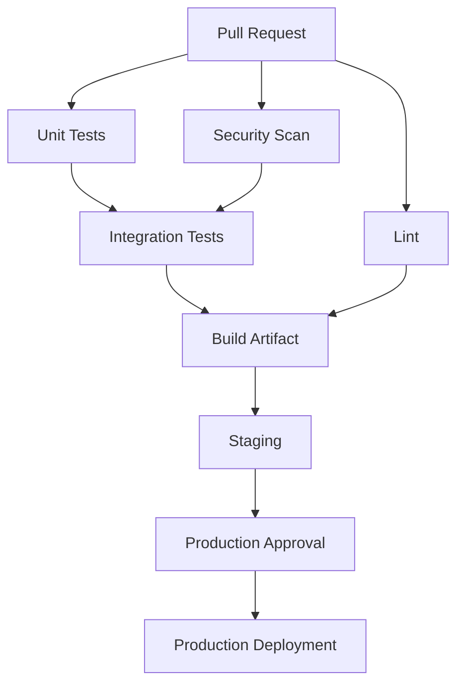
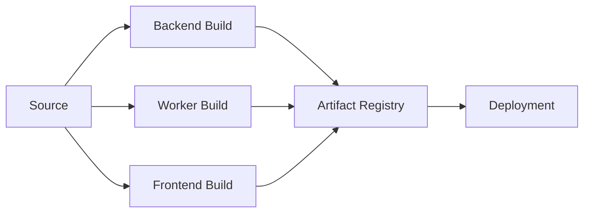
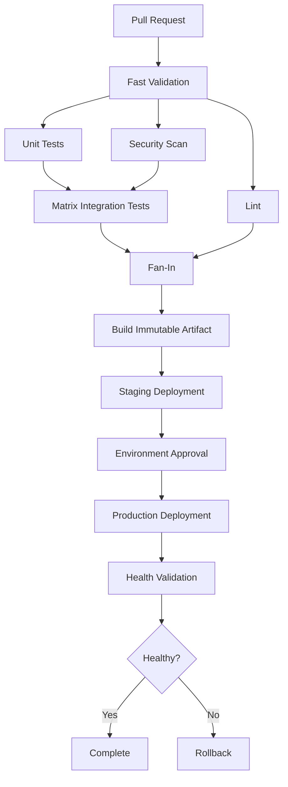
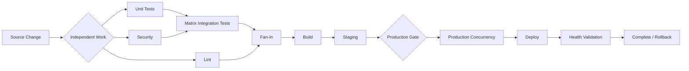

# 08- Parallelism and Execution Control

## Overview

GitHub Actions executes independent jobs in parallel by default. This parallel execution model is one of the main reasons CI/CD pipelines can remain fast as test suites, services, environments, and deployment stages grow.

A production pipeline should deliberately control:

- Which jobs can run concurrently.
- Which jobs must wait for dependencies.
- How independent work is fanned out.
- How results are collected through fan-in.
- How matrix jobs scale execution.
- How many parallel jobs are allowed.
- Which operations must be serialized.
- How failures affect parallel work.
- How parallel execution affects runner capacity and cost.

The fundamental model is:

```text
Workflow
   │
   ├── Lint
   │
   ├── Unit Tests
   │
   ├── Security Scan
   │
   └── Integration Tests
            │
            ▼
          Build
            │
            ▼
        Deployment
```

`needs` defines dependency relationships.

Matrix strategies create multiple instances of a job.

Concurrency controls conflicting executions.

Together:

```text
Dependency Graph
      +
Matrix Fan-Out
      +
Parallel Execution
      +
Concurrency Control
      =
Scalable CI/CD
```

Parallelism is therefore not simply "running more jobs." It is the controlled execution of independent work while preserving correctness for dependent or stateful operations.

## Parallelism in GitHub Actions

At the job level, jobs without dependencies can execute concurrently.

```yaml
jobs:
  lint:
    runs-on: ubuntu-latest
    steps:
      - uses: actions/checkout@v4
      - run: ruff check .

  unit-tests:
    runs-on: ubuntu-latest
    steps:
      - uses: actions/checkout@v4
      - run: pytest

  security:
    runs-on: ubuntu-latest
    steps:
      - uses: actions/checkout@v4
      - run: pip-audit
```

Conceptually:

```text
             ┌── lint ───────────┐
             │                   │
Workflow ────┼── unit-tests ─────┼── next stage
             │                   │
             └── security ──────┘
```

There is no dependency between these jobs, so GitHub Actions can schedule them independently.

## Why Parallelism Matters

Consider a pipeline with:

```text
Lint       = 2 min
Unit tests = 5 min
Security   = 3 min
Build      = 4 min
```

Sequential execution:

```text
2 + 5 + 3 + 4 = 14 minutes
```

If the first three jobs run concurrently:

```text
max(2, 5, 3) + 4 = 9 minutes
```

The theoretical improvement comes from overlapping independent work.

However, wall-clock time is not the only consideration.

Parallel execution also consumes:

- Runner capacity.
- CPU.
- Memory.
- Network bandwidth.
- Package registry bandwidth.
- Docker registry bandwidth.
- Database capacity.
- Cloud API quotas.
- CI minutes.

The objective is therefore:

```text
Maximum useful parallelism
```

rather than:

```text
Maximum possible parallelism
```

## Dependency Graphs

GitHub Actions uses `needs` to express dependencies.

```yaml
jobs:
  lint:
    runs-on: ubuntu-latest
    steps:
      - uses: actions/checkout@v4
      - run: ruff check .

  test:
    needs: lint
    runs-on: ubuntu-latest
    steps:
      - uses: actions/checkout@v4
      - run: pytest
```

The execution graph is:

```text
lint
  │
  ▼
test
```

The `test` job cannot begin until `lint` completes successfully.

## Independent Jobs vs Dependent Jobs

Independent:

```yaml
jobs:
  lint:
    ...

  test:
    ...

  security:
    ...
```

Graph:

```text
lint ──────┐
test ──────┼── parallel
security ──┘
```

Dependent:

```yaml
jobs:
  test:
    ...

  build:
    needs: test
    ...
```

Graph:

```text
test
  │
  ▼
build
```

A well-designed pipeline uses dependencies only where they represent real requirements.

## Fan-Out

Fan-out means one stage produces multiple independent execution paths.

```text
             ┌── Python 3.11
Build/Input ─┼── Python 3.12
             ├── PostgreSQL
             └── MySQL
```

In GitHub Actions, matrix strategies are the primary mechanism for structured fan-out.

```yaml
strategy:
  matrix:
    python-version:
      - "3.11"
      - "3.12"
```

## Fan-In

Fan-in means multiple parallel jobs converge into a later stage.

```text
Python 3.11 ──┐
Python 3.12 ──┤
Python 3.13 ──┼── Build
              │
Integration ──┘
```

Example:

```yaml
jobs:
  test:
    strategy:
      matrix:
        python-version:
          - "3.11"
          - "3.12"
    runs-on: ubuntu-latest

    steps:
      - uses: actions/checkout@v4
      - uses: actions/setup-python@v5
        with:
          python-version: ${{ matrix.python-version }}
      - run: pytest

  build:
    needs: test
    runs-on: ubuntu-latest

    steps:
      - uses: actions/checkout@v4
      - run: docker build -t backend:${{ github.sha }} .
```

The matrix creates fan-out and `needs` creates fan-in.

## Parallel Execution Model

A production pipeline often looks like:



The important distinction is:

```text
Dependency
    ↓
Correctness

Parallelism
    ↓
Performance

Concurrency
    ↓
Conflict prevention
```

These are related but different concerns.

## `needs` Controls Dependency, Not General Scheduling

`needs` expresses a dependency.

```yaml
build:
  needs:
    - lint
    - test
```

This means:

```text
lint ──┐
       ├── build
test ──┘
```

It does not mean that GitHub Actions will reserve a runner for `build` in advance.

The job becomes eligible once its dependencies satisfy the workflow's execution rules.

## Sequential vs Parallel Pipelines

### Sequential

```yaml
jobs:
  lint:
    ...

  test:
    needs: lint
    ...

  build:
    needs: test
    ...
```

Graph:

```text
lint → test → build
```

This is simple but may be unnecessarily slow.

### Parallelized

```yaml
jobs:
  lint:
    ...

  test:
    ...

  security:
    ...

  build:
    needs:
      - lint
      - test
      - security
```

Graph:

```text
lint ────────┐
test ────────┼── build
security ────┘
```

The independent validation stages can run concurrently.

## Designing Dependencies Correctly

Before adding `needs`, ask:

> Does this job actually require the output or successful completion of the other job?

For example:

```text
Lint ────────┐
Unit tests ──┼── Build
Security ────┘
```

If the build does not require the test output, it still may require successful tests as a quality gate.

That distinction affects architecture.

### Data Dependency

```text
Generate version
      ↓
Build
```

Build genuinely needs generated data.

### Quality Gate Dependency

```text
Tests
  ↓
Deployment
```

Deployment may not consume test output directly, but it depends on test success.

Both are valid dependencies, but they represent different reasoning.

## Matrix Parallelism

A matrix expands one job definition into multiple jobs.

```yaml
jobs:
  test:
    strategy:
      matrix:
        python-version:
          - "3.11"
          - "3.12"
          - "3.13"

    runs-on: ubuntu-latest

    steps:
      - uses: actions/checkout@v4

      - uses: actions/setup-python@v5
        with:
          python-version: ${{ matrix.python-version }}

      - run: pip install -r requirements.txt
      - run: pytest
```

Conceptually:

```text
test[3.11]
test[3.12]
test[3.13]
```

These jobs can execute independently.

## Multiple Matrix Dimensions

```yaml
strategy:
  matrix:
    python-version:
      - "3.11"
      - "3.12"
    database:
      - postgres
      - mysql
```

This produces:

```text
3.11 + postgres
3.11 + mysql
3.12 + postgres
3.12 + mysql
```

Total combinations:

```text
2 × 2 = 4
```

Matrix size grows multiplicatively.

This is important for CI cost and execution time.

## Matrix Parallelism and Cost

If a matrix has:

```text
4 Python versions
×
3 databases
×
2 operating systems
```

the theoretical number of combinations is:

```text
4 × 3 × 2 = 24
```

A single workflow can therefore create many jobs.

Before expanding a matrix, evaluate:

- Coverage value.
- Runner availability.
- Execution time.
- CI cost.
- External service capacity.
- Test isolation.
- Failure diagnosis complexity.

Do not create dimensions merely because the matrix syntax makes it easy.

## `max-parallel`

Matrix jobs can limit how many matrix combinations execute concurrently.

```yaml
strategy:
  max-parallel: 2
  matrix:
    python-version:
      - "3.11"
      - "3.12"
      - "3.13"
      - "3.14"
```

Instead of attempting to execute all combinations simultaneously:

```text
2 running
2 waiting

↓
2 running
2 waiting

↓
remaining jobs
```

This is useful when:

- Runner capacity is limited.
- Tests consume substantial CPU or memory.
- External services have rate limits.
- CI cost must be controlled.
- Parallel integration tests overload PostgreSQL or Redis.

## Parallelism vs `max-parallel`

`max-parallel` does not eliminate the matrix.

It limits the number of matrix jobs that execute simultaneously.

```text
Matrix size = 10
max-parallel = 3

Total jobs = 10
Concurrent jobs ≤ 3
```

This allows controlled throughput.

## `fail-fast`

Matrix strategies support:

```yaml
strategy:
  fail-fast: true
```

With fail-fast enabled, a failure can cause other in-progress or queued matrix work to be cancelled according to the matrix strategy behavior.

Example:

```text
Python 3.11 ── success
Python 3.12 ── failure
Python 3.13 ── cancelled
Python 3.14 ── cancelled
```

This can reduce wasted CI time.

However, it can also remove useful failure information.

For compatibility testing, you may prefer:

```yaml
strategy:
  fail-fast: false
```

This allows the matrix to complete so that all failures are visible.

## Choosing `fail-fast`

Use `fail-fast: true` when:

- Later matrix failures are unlikely to provide useful information.
- CI cost is important.
- A common failure invalidates the remaining combinations.

Use:

```yaml
fail-fast: false
```

when:

- You need a complete compatibility picture.
- Multiple environments may fail independently.
- You are debugging platform-specific failures.
- Every matrix result has diagnostic value.

## Parallelism with Integration Tests

Backend integration testing often requires:

```text
Application
PostgreSQL
Redis
pytest
```

A matrix can test multiple versions:

```yaml
jobs:
  integration:
    strategy:
      matrix:
        python-version:
          - "3.11"
          - "3.12"

    runs-on: ubuntu-latest

    services:
      postgres:
        image: postgres:16
        env:
          POSTGRES_PASSWORD: postgres
          POSTGRES_DB: app_test
          POSTGRES_USER: postgres
        ports:
          - 5432:5432
        options: >-
          --health-cmd="pg_isready -U postgres -d app_test"
          --health-interval=10s
          --health-timeout=5s
          --health-retries=5

      redis:
        image: redis:7
        ports:
          - 6379:6379

    steps:
      - uses: actions/checkout@v4

      - uses: actions/setup-python@v5
        with:
          python-version: ${{ matrix.python-version }}

      - run: pip install -r requirements.txt
      - run: pytest
```

Each matrix job receives its own service environment.

## Parallelism and External Dependencies

Parallel tests may increase load on:

- PostgreSQL.
- Redis.
- MySQL.
- External APIs.
- AWS services.
- Docker registries.
- Package indexes.

For example:

```text
8 matrix jobs
    ↓
8 PostgreSQL instances
```

may be fine for isolated GitHub-hosted service containers.

But:

```text
8 matrix jobs
    ↓
same shared staging database
```

can cause test interference.

Parallelism must therefore account for resource isolation.

## Test Isolation

Good:

```text
Job A → Database A
Job B → Database B
```

Risky:

```text
Job A ─┐
       ├── Shared database
Job B ─┘
```

Shared state can produce nondeterministic tests.

If shared infrastructure is unavoidable, use:

- Unique schemas.
- Unique database names.
- Unique Redis key prefixes.
- Test isolation mechanisms.
- Cleanup procedures.

## Parallelism and Django

A Django test matrix might use:

```yaml
strategy:
  matrix:
    python-version:
      - "3.11"
      - "3.12"
    database:
      - postgres
      - mysql
```

The test dimensions represent compatibility guarantees.

For example:

```text
Django
 ├── Python 3.11 + PostgreSQL
 ├── Python 3.11 + MySQL
 ├── Python 3.12 + PostgreSQL
 └── Python 3.12 + MySQL
```

The matrix should reflect supported production combinations rather than every technically possible combination.

## Parallelism and FastAPI

FastAPI integration tests can similarly fan out across:

```text
Python versions
Dependency versions
Database versions
Operating systems
```

For example:

```yaml
strategy:
  matrix:
    python-version:
      - "3.11"
      - "3.12"
```

Then:

```text
FastAPI
  ↓
pytest
  ↓
PostgreSQL + Redis
```

The same execution-control principles apply.

## Parallelism and Build Jobs

Build stages can also run concurrently when artifacts are independent.

Example:

```text
Backend image ─────┐
Worker image ──────┼── Publish
Frontend bundle ───┘
```

If the services are independently buildable:

```yaml
jobs:
  backend:
    ...

  worker:
    ...

  frontend:
    ...

  publish:
    needs:
      - backend
      - worker
      - frontend
```

This reduces overall pipeline duration.

## Fan-Out Build Architecture



Each build can consume the same source revision while producing an independent artifact.

## Artifact Fan-In

If parallel jobs produce artifacts:

```yaml
- name: Upload artifact
  uses: actions/upload-artifact@v4
  with:
    name: backend-build
    path: dist/
```

A downstream job can consume them after:

```yaml
needs:
  - backend
  - worker
```

The downstream stage becomes the fan-in point.

## Parallelism and Artifacts

Artifacts are appropriate for passing build outputs between jobs.

Example:

```text
Build
  ↓
artifact
  ↓
Deploy
```

Caches serve a different purpose:

```text
Cache
  ↓
speed up repeated computation
```

Do not use caches as the authoritative transport mechanism for production artifacts.

## Parallelism and Caching

Parallel jobs may all encounter the same cache.

For Python:

```yaml
- uses: actions/setup-python@v5
  with:
    python-version: "3.12"
    cache: pip
```

The cache can reduce dependency installation time.

However, a cache hit does not mean that jobs share a live filesystem.

Each GitHub-hosted runner is isolated.

Think:

```text
Job A → Runner A → cache
Job B → Runner B → cache
```

rather than:

```text
Job A ─┐
       ├── shared filesystem
Job B ─┘
```

## Parallelism and Runner Capacity

Every parallel job requires runner capacity.

If:

```text
20 jobs
```

are eligible simultaneously but only:

```text
5 runners
```

are available, jobs will queue.

Therefore:

```text
More parallel jobs
        ≠
Always faster pipeline
```

The bottleneck may simply move to runner availability.

## Runner Utilization

A useful model is:

```text
Pipeline throughput
    =
Available runner capacity
×
Job execution efficiency
```

Poorly optimized jobs can waste runner time through:

- Repeated dependency installation.
- Unnecessary Docker builds.
- Large artifact transfers.
- Inefficient test suites.
- Excessive setup work.
- Poor caching.

Parallelism should be combined with job optimization.

## Self-Hosted Runners

Self-hosted runners introduce additional capacity planning.

Suppose:

```text
Runner pool = 4
Matrix jobs = 20
```

At most four jobs can run simultaneously if the runner labels and workflow configuration constrain execution to that pool.

This creates a queue.

For private-network workloads, runner capacity can become a major CI bottleneck.

## Ephemeral Runner Architecture

For sensitive workloads:

```text
Workflow
   ↓
Ephemeral runner
   ↓
Execute job
   ↓
Destroy runner
```

This improves isolation and reduces persistent state.

Parallelism then becomes a provisioning problem as well as a workflow problem.

## Parallelism and Cost

Parallelism can reduce wall-clock time while increasing concurrent resource usage.

Consider:

```text
10 jobs × 5 minutes
```

The approximate compute consumption is:

```text
50 runner-minutes
```

Whether those jobs run sequentially or concurrently affects wall-clock duration, not the basic amount of work.

Therefore:

```text
Parallelism → lower latency
Optimization → lower compute
```

Both should be considered.

## Cost Optimization

Practical techniques include:

- Avoid unnecessary matrix dimensions.
- Use `paths` filters where appropriate.
- Cancel obsolete PR runs.
- Cache dependencies.
- Avoid rebuilding immutable artifacts.
- Use `max-parallel` when external resources are constrained.
- Run expensive integration tests only when relevant.
- Separate fast feedback from exhaustive compatibility testing.

## Fast Feedback vs Full Validation

A mature pipeline can separate:

```text
Pull Request
    ↓
Fast validation
    ├── lint
    ├── unit tests
    └── targeted integration tests

Merge / Release
    ↓
Full validation
    ├── compatibility matrix
    ├── integration tests
    ├── security scans
    └── packaging
```

This avoids forcing every developer commit through the most expensive validation path.

## Parallelism and Security

Parallel execution does not reduce security requirements.

Every parallel job can potentially access:

- Source code.
- `GITHUB_TOKEN`.
- Secrets.
- Artifacts.
- Cloud credentials.
- Internal services.

Use minimal permissions:

```yaml
permissions:
  contents: read
```

For AWS OIDC:

```yaml
permissions:
  contents: read
  id-token: write
```

Only jobs that actually need cloud authentication should receive `id-token: write`.

## Parallel Jobs and Secrets

Do not assume that splitting a workflow into parallel jobs automatically isolates secrets.

Explicitly define which jobs require sensitive information.

For example:

```text
Lint ─────────────── no secrets
Unit Tests ───────── no secrets
Security Scan ────── no secrets
Build ─────────────── no deployment secrets
Deploy ────────────── AWS OIDC
```

This creates a clearer security boundary.

## Parallelism and Untrusted Pull Requests

Pull request workflows may execute untrusted repository code.

Avoid exposing production credentials to parallel test jobs.

A safer architecture is:

```text
Pull Request
    ↓
Untrusted validation
    ├── lint
    ├── tests
    └── static analysis
         ↓
Trusted merge
         ↓
Deployment
```

Do not make parallel execution a reason to distribute privileged credentials broadly.

## Parallelism and `continue-on-error`

`continue-on-error` can allow one job to fail without blocking subsequent execution.

For example:

```yaml
jobs:
  compatibility:
    continue-on-error: true
```

This should be used deliberately.

It is appropriate for:

- Experimental compatibility checks.
- Non-blocking diagnostics.
- Informational validation.

It is generally inappropriate for mandatory production safety checks such as:

```text
Security
Deployment validation
Required tests
Infrastructure correctness
```

## Parallelism and Failure Handling

A pipeline should distinguish:

```text
Failure that should stop downstream work
```

from:

```text
Failure that should be reported but not block the pipeline
```

Example:

```text
Lint ─────── failure ───→ Build blocked
Security ─── failure ───→ Build blocked
Compatibility ─ failure ─→ maybe non-blocking
```

The decision should be encoded explicitly.

## Conditional Parallelism

Jobs can be conditionally executed:

```yaml
jobs:
  integration:
    if: ${{ github.event_name == 'pull_request' }}
    runs-on: ubuntu-latest

    steps:
      - uses: actions/checkout@v4
      - run: pytest tests/integration
```

Conditions can prevent unnecessary work.

However, be careful when conditions interact with `needs`.

A skipped upstream job can affect downstream jobs depending on the dependency graph and conditions.

## `always()` and Parallel Pipelines

For cleanup or reporting:

```yaml
jobs:
  report:
    if: ${{ always() }}
    needs:
      - lint
      - test
      - security

    runs-on: ubuntu-latest

    steps:
      - run: ./generate-report.sh
```

This is useful for final reporting.

Do not use `always()` indiscriminately.

A cleanup/reporting job may need to run after failures, but a deployment job should not accidentally execute after an unsafe failure simply because `always()` was added.

## Cancellation Behavior

Parallel execution interacts with cancellation.

For example:

```text
Workflow
 ├── lint
 ├── tests
 ├── security
 └── integration
```

If the workflow is cancelled, active jobs may be cancelled as well.

Long-running jobs should therefore be designed with cleanup behavior in mind.

Examples:

- Temporary resources.
- Cloud resources.
- Test databases.
- Temporary environments.
- Locks.
- Generated artifacts.

## Parallelism and Cleanup

If parallel jobs create external resources:

```text
Job A → DB schema A
Job B → DB schema B
Job C → DB schema C
```

cleanup should be associated with each job or with a reliable finalization stage.

Avoid assuming a final aggregation job will always execute successfully.

## Parallelism and Race Conditions

A race occurs when multiple executions access shared state and the final result depends on timing.

Examples:

```text
Job A ──┐
        ├── shared file
Job B ──┘
```

or:

```text
Deployment A ──┐
               ├── production
Deployment B ──┘
```

The solution may be:

- Separate resources.
- Explicit dependencies.
- Concurrency controls.
- Atomic operations.
- Idempotency.
- External locking.

## Parallelism vs Concurrency

These concepts should not be conflated.

| Concept | Purpose |
|---|---|
| Parallelism | Execute independent work simultaneously |
| `needs` | Define dependencies |
| Matrix | Generate structured parallel jobs |
| `max-parallel` | Limit matrix parallelism |
| `fail-fast` | Control matrix cancellation behavior |
| Concurrency | Prevent conflicting executions |
| `continue-on-error` | Control failure propagation |

A useful mental model:

```text
Parallelism asks:
"What can run together?"

Dependencies ask:
"What must wait?"

Concurrency asks:
"What must never overlap?"
```

## Execution Control Architecture

A production CI pipeline may look like:



The pipeline uses several forms of execution control:

```text
Fan-out       → matrix
Dependency    → needs
Parallelism   → independent jobs
Throttling    → max-parallel
Cancellation  → fail-fast / concurrency
Protection    → environments
Recovery      → rollback
```

## Production Example: Python Backend

A realistic backend pipeline might use:

```yaml
name: Backend CI

on:
  pull_request:
  push:
    branches:
      - main

concurrency:
  group: ci-${{ github.event.pull_request.number || github.ref }}
  cancel-in-progress: true

jobs:
  lint:
    runs-on: ubuntu-latest

    steps:
      - uses: actions/checkout@v4
      - uses: actions/setup-python@v5
        with:
          python-version: "3.12"
      - run: pip install -r requirements-dev.txt
      - run: ruff check .

  unit-tests:
    runs-on: ubuntu-latest

    steps:
      - uses: actions/checkout@v4
      - uses: actions/setup-python@v5
        with:
          python-version: "3.12"
      - run: pip install -r requirements-dev.txt
      - run: pytest tests/unit

  integration-tests:
    needs:
      - unit-tests

    strategy:
      fail-fast: false
      max-parallel: 2
      matrix:
        python-version:
          - "3.11"
          - "3.12"

    runs-on: ubuntu-latest

    services:
      postgres:
        image: postgres:16
        env:
          POSTGRES_USER: postgres
          POSTGRES_PASSWORD: postgres
          POSTGRES_DB: app_test
        ports:
          - 5432:5432
        options: >-
          --health-cmd="pg_isready -U postgres -d app_test"
          --health-interval=10s
          --health-timeout=5s
          --health-retries=5

      redis:
        image: redis:7
        ports:
          - 6379:6379

    steps:
      - uses: actions/checkout@v4

      - uses: actions/setup-python@v5
        with:
          python-version: ${{ matrix.python-version }}

      - run: pip install -r requirements-dev.txt
      - run: pytest tests/integration
```

The execution model is:

```text
               ┌── Lint ────────────────┐
               │                        │
PR ────────────┼── Unit Tests ──────────┼── Integration Matrix
               │                        │
               └── Security ───────────┘
```

The exact dependency graph should be driven by actual requirements rather than adding dependencies simply to create a visual pipeline sequence.

## Production Example: Build and Deploy

A more complete architecture:

```text
                    ┌── Lint
                    │
Pull Request ────────┼── Unit Tests
                    │
                    └── Security
                         │
                         ▼
                 Integration Matrix
                         │
                         ▼
                  Build Artifact
                         │
                         ▼
                   Staging Deploy
                         │
                         ▼
                    Approval
                         │
                         ▼
                Production Deploy
```

Production deployment should normally have a dedicated concurrency boundary:

```yaml
concurrency:
  group: production
  cancel-in-progress: false
```

## Avoiding Dependency Bottlenecks

A common mistake is:

```yaml
test:
  needs: lint

security:
  needs: lint

integration:
  needs: test

build:
  needs:
    - integration
    - security
```

This creates:

```text
lint
 ├── test
 │    └── integration
 │          │
 └── security ──┘
                ↓
              build
```

If `test` does not actually depend on `lint`, the graph is unnecessarily constrained.

Instead:

```text
lint ───────────────┐
unit tests ─────────┼── build
security ───────────┤
integration ────────┘
```

can provide faster execution while retaining the same quality gates.

## Critical Path

The critical path is the longest dependency chain that determines minimum pipeline duration.

Example:

```text
lint = 2m
unit = 5m
security = 3m
integration = 8m
build = 4m
```

If:

```text
unit → integration → build
```

then:

```text
5 + 8 + 4 = 17 minutes
```

may dominate the pipeline even if lint and security run concurrently.

Optimizing jobs outside the critical path may have little effect on total pipeline latency.

## Optimizing the Critical Path

Useful techniques include:

- Parallelize independent validation.
- Split large test suites.
- Cache dependencies.
- Reduce unnecessary setup.
- Use targeted integration tests.
- Avoid serial matrix execution unless required.
- Build only once.
- Reuse immutable artifacts.
- Move non-blocking checks off the critical path where appropriate.

The goal is not to make every job faster independently.

The goal is to reduce the critical path without weakening quality.

## Parallel Test Sharding

Large test suites can be split into shards.

```text
pytest suite
    ↓
 ┌── shard 1
 ├── shard 2
 ├── shard 3
 └── shard 4
```

Each shard runs independently.

Conceptually:

```yaml
strategy:
  matrix:
    shard:
      - 1
      - 2
      - 3
      - 4
```

The test runner must support deterministic test partitioning.

Poor sharding can create:

```text
Shard 1 = 1 minute
Shard 2 = 1 minute
Shard 3 = 1 minute
Shard 4 = 12 minutes
```

The slowest shard still determines completion time.

Balanced partitioning matters.

## Parallel Test Sharding Considerations

Before sharding:

- Measure test durations.
- Identify shared state.
- Ensure deterministic partitioning.
- Ensure each shard has isolated resources.
- Aggregate reports.
- Preserve failed-test diagnostics.
- Avoid duplicate tests.

Parallelism without isolation can create flaky CI.

## Parallelism and Test Reports

Each matrix or shard can upload an artifact:

```yaml
- name: Upload test report
  if: ${{ !cancelled() }}
  uses: actions/upload-artifact@v4
  with:
    name: test-report-${{ matrix.shard }}
    path: reports/
```

A downstream reporting job can aggregate them.

This is a common fan-out/fan-in pattern.

## Parallelism and Observability

A production CI platform should expose:

- Queue duration.
- Job duration.
- Runner utilization.
- Matrix size.
- Cache hit rate.
- Failure rate.
- Cancellation rate.
- Critical-path duration.
- Artifact transfer duration.
- Retry frequency.

For example:

```text
Pipeline duration:       11m
Critical path:            9m
Queue time:               1m
Matrix jobs:               8
Average job duration:    4.2m
Cache hit rate:            87%
```

These metrics reveal whether the bottleneck is:

```text
Workflow design
Runner capacity
Dependency installation
Tests
External services
```

## Reliability Considerations

Parallel CI should be deterministic.

Avoid:

- Shared mutable state.
- Tests depending on execution order.
- Fixed external ports where conflicts are possible.
- Shared temporary directories.
- Global database state.
- Unbounded API calls.
- Race-prone cleanup.

Prefer:

- Isolated environments.
- Unique resource identifiers.
- Idempotent setup.
- Explicit dependencies.
- Controlled concurrency.
- Deterministic test partitioning.

## Scalability Considerations

As repositories grow:

```text
10 jobs
   ↓
50 jobs
   ↓
200 jobs
```

a naive parallel design can become expensive and operationally difficult.

Use:

- Reusable workflows.
- Matrix strategies.
- Dynamic matrices.
- Selective testing.
- Path-based workflow triggers.
- Service-level pipelines.
- Runner pools.
- `max-parallel`.
- Concurrency groups.
- Artifact reuse.

The architecture should scale both technically and organizationally.

## Monorepo Parallelism

For a monorepo:

```text
services/
├── orders/
├── payments/
├── users/
└── notifications/
```

A workflow can detect changed services and execute only relevant jobs.

Conceptually:

```text
Changed files
     ↓
Service discovery
     ↓
Dynamic matrix
     ↓
orders
payments
```

This avoids rebuilding unrelated services.

The same pattern can be combined with:

```text
service × Python version
```

when compatibility testing requires it.

## Dynamic Matrix + Parallelism

A dynamic matrix can be generated as structured JSON.

Example output:

```json
{
  "include": [
    {
      "service": "orders",
      "python": "3.12"
    },
    {
      "service": "payments",
      "python": "3.12"
    }
  ]
}
```

Then:

```yaml
strategy:
  matrix: ${{ fromJSON(needs.discover.outputs.matrix) }}
```

This provides:

```text
orders   → parallel
payments → parallel
```

while avoiding irrelevant matrix combinations.

## Parallelism and Reusable Workflows

Reusable workflows can standardize execution control.

```text
Repository A ──┐
Repository B ──┼── Reusable CI workflow
Repository C ──┘
```

The reusable workflow can define:

- Standard matrix strategy.
- Runner selection.
- Caching.
- Test execution.
- Artifact handling.
- Security checks.

Deployment workflows can separately standardize:

- Environment protection.
- Concurrency.
- OIDC.
- Artifact promotion.
- Rollback.

This creates platform-level consistency.

## Parallelism and Custom Actions

Composite actions can package repeated setup steps:

```text
Checkout
↓
Setup Python
↓
Install dependencies
↓
Configure test environment
```

They reduce duplication but do not themselves create parallelism.

The execution model remains:

```text
Job
  ↓
Steps
  ↓
Composite Action
  ↓
Steps inside action
```

A composite action runs within its calling job.

## Parallelism and Containers

Containerized jobs can provide a consistent runtime:

```yaml
jobs:
  test:
    runs-on: ubuntu-latest

    container:
      image: python:3.12-slim

    steps:
      - uses: actions/checkout@v4
      - run: pip install -r requirements.txt
      - run: pytest
```

Multiple such jobs can still execute in parallel.

The container isolates the application runtime, while the runner provides the execution environment.

## Parallelism and Service Containers

For integration tests:

```text
Job
 ├── Application container
 ├── PostgreSQL service
 └── Redis service
```

Each matrix job receives its own execution context.

This is useful for:

```text
Django
FastAPI
pytest
```

integration tests.

Health checks should be used for services that require readiness before tests begin.

## Parallelism and AWS Limits

Parallel CI can create bursts against AWS.

For example:

```text
20 matrix jobs
   ↓
20 AWS API clients
```

Potential constraints include:

- API throttling.
- ECR operations.
- S3 requests.
- ECS deployments.
- STS requests.
- IAM API operations.

Use controlled parallelism where cloud APIs are involved.

Do not assume that GitHub runner capacity is the only limiting resource.

## Parallelism and Docker Registry Load

A matrix that builds many images concurrently may produce:

```text
10 jobs
   ↓
10 Docker builds
   ↓
10 pushes to ECR
```

This can increase:

- Registry traffic.
- Build cache traffic.
- Runner CPU.
- Network utilization.
- Build cost.

Use BuildKit caching and appropriate `max-parallel` limits where necessary.

## Security Boundaries

Parallel jobs should not automatically receive the same privileges.

Example:

```text
Lint
  permissions:
    contents: read

Tests
  permissions:
    contents: read

Build
  permissions:
    contents: read

Deploy
  permissions:
    contents: read
    id-token: write
```

This reduces the blast radius of a compromised job.

## Operational Best Practices

For production GitHub Actions pipelines:

- Keep independent validation jobs parallel.
- Use `needs` only for real dependencies or intentional quality gates.
- Use matrices for structured compatibility testing.
- Control large matrices with `max-parallel`.
- Use `fail-fast` based on diagnostic requirements.
- Isolate integration-test resources.
- Protect stateful deployments with concurrency.
- Avoid exposing deployment credentials to test jobs.
- Reuse immutable artifacts instead of rebuilding them.
- Measure the critical path.
- Monitor runner queue time.
- Optimize the bottleneck rather than every job equally.
- Use cancellation for safely obsolete work.
- Treat external services and API limits as part of the execution model.

## Common Mistakes

### Making Everything Sequential

```text
lint → test → security → build
```

This is simple but often unnecessarily slow.

Use parallel jobs where dependencies do not require serialization.

### Making Everything Parallel

Parallelism without dependency modeling can create incorrect pipelines.

For example:

```text
Build
Deploy
Test
```

should not all run independently if deployment requires validated artifacts.

### Using One Shared Test Database

Parallel tests can interfere with each other.

Prefer isolated databases, schemas, or test environments.

### Creating Huge Matrices

A matrix such as:

```text
5 Python versions
× 5 databases
× 4 operating systems
× 3 dependency sets
```

creates:

```text
300 combinations
```

This may be technically valid but operationally impractical.

### Ignoring the Critical Path

Reducing a 2-minute lint job to 1 minute has little value if the pipeline's critical path is dominated by a 30-minute integration suite.

### Unlimited Parallel AWS Operations

More matrix jobs can create API throttling and deployment conflicts.

External capacity must be part of the design.

### Using `continue-on-error` for Critical Gates

A production security failure should not silently become a successful pipeline.

### Assuming Parallel Jobs Share Files

GitHub-hosted jobs run on separate runner environments.

Use artifacts or outputs to transfer data.

### Treating `max-parallel` as a Global Runner Limit

`max-parallel` controls matrix execution for the relevant strategy. It is not a universal organization-wide runner limit.

### Confusing Parallelism with Concurrency

Parallelism encourages independent execution.

Concurrency prevents conflicting execution.

They solve opposite sides of execution control.

## Troubleshooting Parallel Execution

### Jobs Are Not Running in Parallel

Check:

- `needs`.
- Job-level `if`.
- Environment protection.
- Runner availability.
- Concurrency groups.
- Workflow cancellation.
- Matrix configuration.

A hidden dependency can serialize the pipeline.

### Matrix Jobs Are Waiting

Possible causes:

- `max-parallel` is too low.
- Runner capacity is exhausted.
- Self-hosted runners are unavailable.
- Environment protection is blocking execution.
- A concurrency group is preventing execution.

### Integration Tests Become Flaky

Investigate:

```text
Shared database
Shared Redis keys
Shared filesystem
Shared external service
Race condition
Test ordering
Resource cleanup
```

Do not assume the test framework is the root cause simply because failures appear only under parallel execution.

### Pipeline Became More Expensive

Check:

- Matrix size.
- Number of changed services.
- Redundant workflows.
- Dependency installation.
- Cache hit rate.
- Artifact transfer.
- Docker builds.
- Unnecessary compatibility combinations.

### Pipeline Became Faster but Less Reliable

Look for:

- Missing dependencies.
- Unsafe shared state.
- Race conditions.
- Weak test isolation.
- Incorrect `continue-on-error`.
- Overly aggressive cancellation.
- Deployment overlap.

Performance improvements should not weaken correctness.

## GitHub CLI for Execution Analysis

List recent runs:

```bash
gh run list --repo organization/repository
```

View a run:

```bash
gh run view <run-id> --repo organization/repository
```

View logs:

```bash
gh run view <run-id> \
  --repo organization/repository \
  --log
```

Rerun a failed workflow:

```bash
gh run rerun <run-id> --failed
```

Watch a running workflow:

```bash
gh run watch <run-id>
```

These commands are useful for diagnosing:

- Queueing.
- Matrix failures.
- Dependency behavior.
- Cancellation.
- Runner problems.
- Artifact and build failures.

## Interview Scenarios

### Scenario: Ten Independent Test Suites

**Question:** How would you reduce pipeline time?

Identify independent test suites and run them as separate jobs.

```text
Test A ──┐
Test B ──┤
Test C ──┼── fan-in
Test D ──┤
Test E ──┘
```

Then analyze the critical path and runner capacity.

### Scenario: Tests Must Run on Three Python Versions

Use a matrix:

```yaml
strategy:
  matrix:
    python-version:
      - "3.11"
      - "3.12"
      - "3.13"
```

Then determine whether all combinations should run concurrently.

### Scenario: Integration Tests Overload PostgreSQL

Possible controls include:

```yaml
strategy:
  max-parallel: 2
```

along with:

- Isolated databases.
- Proper connection limits.
- Smaller test batches.
- Better resource sizing.

### Scenario: Production Deployment Must Never Overlap

Use a production concurrency group:

```yaml
concurrency:
  group: production
  cancel-in-progress: false
```

Then explain why deployment state, rollback, and external deployment systems must also be considered.

### Scenario: A Matrix Has 100 Combinations

Do not simply execute all 100 simultaneously.

Evaluate:

```text
Coverage value
Runner capacity
Cost
External service capacity
Failure diagnosis
Critical path
```

Then use:

- `include`.
- `exclude`.
- Dynamic matrices.
- `max-parallel`.
- Selective execution.

### Scenario: Unit Tests Are Fast but Pipeline Is Slow

Inspect the critical path.

The bottleneck may be:

```text
Queue time
Dependency installation
Integration tests
Docker build
Artifact transfer
Deployment
```

Parallelism should be applied to the actual bottleneck.

### Scenario: Parallel Tests Fail Intermittently

Investigate shared state and race conditions before changing retry behavior.

The likely design problem is insufficient isolation or nondeterministic execution.

## Senior-Level Execution Model

A production-grade GitHub Actions pipeline can be understood through five questions:

```text
1. What can run together?
       ↓
   Parallelism

2. What must wait?
       ↓
   needs

3. What should be repeated across dimensions?
       ↓
   Matrix

4. How much parallel work is safe?
       ↓
   max-parallel / capacity controls

5. What must never overlap?
       ↓
   Concurrency
```

This produces a controlled execution graph:



The architecture should optimize the critical path while preserving explicit correctness boundaries.

## Key Takeaways

- Parallelism reduces CI/CD latency by executing independent work concurrently, while `needs` defines the dependency graph that preserves execution correctness.
- Matrix strategies provide structured fan-out, but matrix size grows multiplicatively; use `max-parallel`, selective combinations, and dynamic matrices to control cost and external resource pressure.
- Fan-out/fan-in pipelines should use artifacts and outputs to transfer data between isolated jobs rather than assuming parallel runners share filesystems or process state.
- Parallel integration testing requires resource isolation and capacity planning for PostgreSQL, Redis, Docker, AWS APIs, registries, and other shared systems.
- Parallelism, dependency control, and concurrency solve different problems: run independent work together, make dependent work wait, and prevent conflicting operations from overlapping.