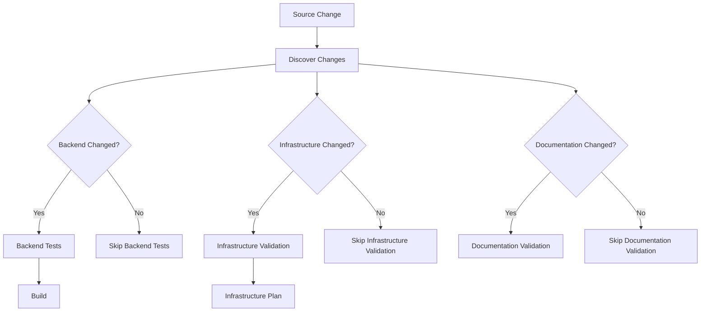
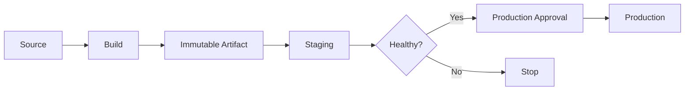
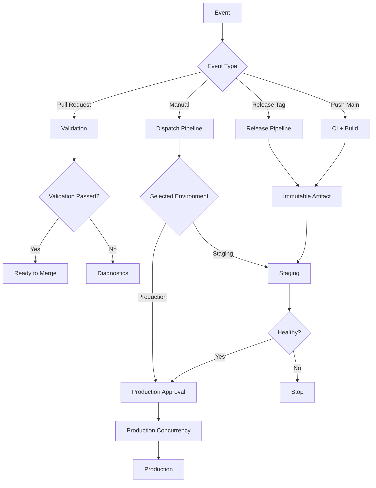
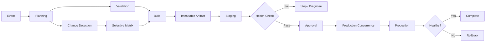

# 09- Conditional Workflow Design

## Overview

Conditional workflow design determines **when GitHub Actions should execute, skip, continue, fail, or promote work**.

A production CI/CD pipeline rarely follows one unconditional path. Different changes may require different validation, deployment, security, or release behavior.

Typical conditions include:

- Pull request vs push.
- Main branch vs feature branch.
- Changed files or directories.
- Production vs staging deployment.
- Manual workflow inputs.
- Matrix values.
- Previous job results.
- Generated outputs.
- Release tags.
- Environment-specific requirements.
- Failure or cancellation states.

A mature workflow should therefore be modeled as a controlled execution graph:

```text
Event
  ↓
Determine Context
  ↓
Evaluate Conditions
  ↓
Select Jobs / Steps
  ↓
Execute Required Work
  ↓
Evaluate Results
  ↓
Promote / Report / Roll Back
```

Conditional execution is different from dependency management.

```text
needs
  → defines dependency

if
  → defines eligibility

strategy.matrix
  → defines execution dimensions

concurrency
  → controls conflicting executions
```

These mechanisms work together to create production-grade workflow behavior.

## Why Conditional Workflows Matter

Without conditions, every workflow execution may perform every possible operation.

For a backend repository, that could mean:

```text
Documentation change
    ↓
Lint
Unit tests
Integration tests
Docker build
Security scan
Staging deployment
Production deployment
```

This is wasteful and potentially dangerous.

A better design distinguishes:

```text
Documentation change
    → documentation validation

Python source change
    → lint + tests + security

Dockerfile change
    → build + image scan

Production release
    → full validation + deployment
```

Conditional workflows improve:

- Execution time.
- CI cost.
- Security boundaries.
- Deployment safety.
- Developer feedback speed.
- Resource utilization.
- Maintainability.

## Conditions vs Triggers

Triggers determine **whether a workflow starts**.

Conditions determine **what happens after the workflow starts**.

For example:

```yaml
on:
  push:
    branches:
      - main
```

controls workflow invocation.

Inside the workflow:

```yaml
jobs:
  deploy:
    if: ${{ github.ref == 'refs/heads/main' }}
```

controls job execution.

A useful distinction is:

```text
Trigger
  ↓
Should this workflow exist for this event?

Condition
  ↓
Should this job or step execute for this workflow run?
```

## Workflow-Level Filtering

Some conditional behavior is better implemented directly at the trigger level.

Example:

```yaml
on:
  push:
    branches:
      - main
    paths:
      - "src/**"
      - "tests/**"
      - "Dockerfile"
```

This prevents the workflow from starting for unrelated changes.

Typical filters include:

- Branches.
- Tags.
- Paths.
- Path exclusions.

This is generally preferable to starting an expensive workflow and skipping almost everything later.

## Trigger Filtering vs Job Conditions

| Requirement | Prefer |
|---|---|
| Workflow should not run for unrelated files | `paths` |
| Workflow only applies to `main` | Branch filter |
| Job depends on event data | `if` |
| Step depends on previous result | `if` |
| Production only | Job/environment condition |
| Matrix-specific behavior | Matrix condition |
| Manual input controls behavior | `inputs` + `if` |
| Failure reporting | `failure()` / `always()` |
| Prevent overlapping executions | `concurrency` |

## The `if` Expression

Basic example:

```yaml
jobs:
  deploy:
    if: ${{ github.ref == 'refs/heads/main' }}
    runs-on: ubuntu-latest

    steps:
      - uses: actions/checkout@v4
      - run: ./deploy.sh
```

The job executes only when the condition evaluates to true.

Conditions can also be applied to steps:

```yaml
steps:
  - name: Deploy
    if: ${{ github.ref == 'refs/heads/main' }}
    run: ./deploy.sh
```

## Expression Syntax

GitHub Actions expressions use:

```yaml
${{ expression }}
```

Examples:

```yaml
if: ${{ github.ref == 'refs/heads/main' }}
```

```yaml
if: ${{ github.event_name == 'pull_request' }}
```

```yaml
if: ${{ github.actor == 'dependabot[bot]' }}
```

```yaml
if: ${{ needs.build.result == 'success' }}
```

The expression engine evaluates workflow contexts and functions before the relevant job or step executes.

## Shell Conditions vs Workflow Expressions

These are different evaluation systems.

GitHub Actions expression:

```yaml
if: ${{ github.ref == 'refs/heads/main' }}
```

Shell condition:

```bash
if [ "$ENVIRONMENT" = "production" ]; then
  ./deploy.sh
fi
```

The first is evaluated by GitHub Actions.

The second is evaluated by the shell running inside the job.

Prefer workflow-level conditions when the decision determines whether a job or step should exist.

Use shell conditions when the decision is inherently part of application scripting.

## Important Contexts

Conditional workflows commonly use:

| Context | Typical use |
|---|---|
| `github` | Event, repository, ref, actor, SHA |
| `env` | Environment variables |
| `vars` | Repository/org/environment variables |
| `secrets` | Sensitive configuration |
| `steps` | Outputs and results from previous steps |
| `needs` | Outputs and results from dependency jobs |
| `job` | Current job state |
| `runner` | Runner information |
| `matrix` | Current matrix combination |
| `strategy` | Matrix strategy metadata |
| `inputs` | Manual/reusable workflow inputs |

Example:

```yaml
if: ${{ matrix.python-version == '3.12' }}
```

## Branch-Based Conditions

A common deployment condition is:

```yaml
if: ${{ github.ref == 'refs/heads/main' }}
```

For pull requests:

```yaml
if: ${{ github.event_name == 'pull_request' }}
```

For tags:

```yaml
if: ${{ startsWith(github.ref, 'refs/tags/v') }}
```

For a specific branch:

```yaml
if: ${{ github.ref_name == 'main' }}
```

Prefer `github.ref_name` when the short branch or tag name is sufficient.

## Pull Request Conditions

A workflow can behave differently for pull requests:

```yaml
jobs:
  test:
    if: ${{ github.event_name == 'pull_request' }}
    runs-on: ubuntu-latest

    steps:
      - uses: actions/checkout@v4
      - run: pytest
```

Typical architecture:

```text
Pull Request
    ↓
Lint
Unit Tests
Security Scan
Integration Tests
    ↓
No Production Deployment
```

Production deployment should generally be tied to a trusted promotion event rather than simply the existence of a pull request.

## Push vs Pull Request

A workflow may handle both:

```yaml
on:
  push:
    branches:
      - main
  pull_request:
    branches:
      - main
```

Then jobs can branch behavior based on the event:

```yaml
if: ${{ github.event_name == 'push' }}
```

For example:

```text
Pull Request
    → Validation

Push to main
    → Validation
    → Build
    → Staging
```

## Tag-Based Conditions

Release workflows often use semantic-version tags:

```yaml
if: ${{ startsWith(github.ref, 'refs/tags/v') }}
```

Example:

```text
v1.2.0
v1.3.0
v2.0.0
```

A more restrictive condition can validate the tag format before release processing.

For example:

```yaml
if: >-
  ${{ startsWith(github.ref_name, 'v') &&
      github.event_name == 'push' }}
```

Do not treat arbitrary tags as trusted production release identifiers without validating the release process.

## Manual Workflow Inputs

`workflow_dispatch` can provide explicit inputs:

```yaml
on:
  workflow_dispatch:
    inputs:
      environment:
        description: Deployment environment
        required: true
        type: choice
        options:
          - staging
          - production
```

A job can use the input:

```yaml
jobs:
  deploy:
    if: ${{ inputs.environment == 'staging' }}
    runs-on: ubuntu-latest

    steps:
      - run: ./deploy-staging.sh
```

A separate production path can use:

```yaml
if: ${{ inputs.environment == 'production' }}
```

Manual inputs should still be constrained by environment protection and permissions.

## Manual Input Validation

Do not assume a manual input is inherently safe.

For example:

```yaml
environment:
  required: true
```

does not replace:

- Environment protection.
- Approval gates.
- Deployment authorization.
- Concurrency controls.
- Least-privilege credentials.

A manual workflow can be an entry point into privileged automation and must therefore be treated as an operational interface.

## Logical Operators

Conditions can combine expressions.

AND:

```yaml
if: ${{ github.ref == 'refs/heads/main' && github.event_name == 'push' }}
```

OR:

```yaml
if: ${{ github.ref == 'refs/heads/main' || github.ref == 'refs/heads/develop' }}
```

NOT:

```yaml
if: ${{ github.event_name != 'pull_request' }}
```

Parentheses improve readability for complex expressions:

```yaml
if: >-
  ${{ (github.ref == 'refs/heads/main' ||
       github.ref == 'refs/heads/release) &&
       github.event_name == 'push' }}
```

Complex conditions should usually be simplified or moved into explicit outputs when they become difficult to reason about.

## Comparison Operators

Common operators include:

```text
==
!=
>
>=
<
<=
```

Example:

```yaml
if: ${{ inputs.version != '' }}
```

Use explicit comparisons rather than relying on implicit truthiness when the distinction matters.

## Useful Expression Functions

### `contains()`

```yaml
if: ${{ contains(github.event.pull_request.labels.*.name, 'deploy') }}
```

Useful for checking collections and strings.

### `startsWith()`

```yaml
if: ${{ startsWith(github.ref_name, 'release/') }}
```

### `endsWith()`

```yaml
if: ${{ endsWith(github.ref_name, '-hotfix') }}
```

### `format()`

```yaml
run: echo "Deploying {0} to {1}"
```

with:

```yaml
${{ format('{0}-{1}', github.repository, github.sha) }}
```

### `fromJSON()`

Useful for turning generated JSON into structured workflow data:

```yaml
strategy:
  matrix: ${{ fromJSON(needs.discover.outputs.matrix) }}
```

### `toJSON()`

Useful for inspecting structured context:

```yaml
- name: Debug context
  run: echo '${{ toJSON(matrix) }}'
```

Do not print contexts containing secrets or sensitive information.

## Status Functions

GitHub Actions provides status-check functions including:

```text
success()
failure()
cancelled()
always()
```

They are important when designing conditional execution.

## `success()`

Example:

```yaml
if: ${{ success() }}
```

It represents successful preceding execution relevant to the current context.

Normal steps already execute only when preceding required execution succeeds, so explicit `success()` is often unnecessary.

## `failure()`

Useful for failure reporting:

```yaml
- name: Upload failure diagnostics
  if: ${{ failure() }}
  uses: actions/upload-artifact@v4
  with:
    name: diagnostics
    path: logs/
```

This makes failure handling explicit.

## `always()`

Useful for cleanup and reporting:

```yaml
- name: Publish test summary
  if: ${{ always() }}
  run: ./publish-summary.sh
```

`always()` should not be interpreted as:

> Run this regardless of whether doing so is safe.

For privileged or deployment operations, use explicit success conditions instead.

## `cancelled()`

Useful when behavior should respond to cancellation:

```yaml
if: ${{ cancelled() }}
```

This can be useful for diagnostics or cleanup logic.

Cancellation behavior should be tested for long-running jobs because cancellation can interrupt execution before cleanup completes.

## `continue-on-error`

Example:

```yaml
- name: Experimental compatibility test
  continue-on-error: true
  run: pytest tests/experimental
```

The step failure does not necessarily fail the overall job in the same way as a normal failing step.

Use it carefully.

Appropriate:

```text
Experimental checks
Non-blocking diagnostics
Optional compatibility validation
```

Usually inappropriate:

```text
Required unit tests
Security scanning
Production health validation
Infrastructure correctness
```

## Step-Level Conditions

Example:

```yaml
steps:
  - name: Build
    run: ./build.sh

  - name: Upload diagnostics
    if: ${{ failure() }}
    uses: actions/upload-artifact@v4
    with:
      name: build-logs
      path: logs/
```

This allows the workflow to react to the result of previous steps.

## Job-Level Conditions

Example:

```yaml
jobs:
  deploy:
    if: ${{ github.ref == 'refs/heads/main' }}
    runs-on: ubuntu-latest
```

Job-level conditions are valuable when an entire stage is optional.

They also avoid provisioning a runner for a job that should not execute.

## Job Results and `needs`

Suppose:

```yaml
jobs:
  test:
    runs-on: ubuntu-latest
    steps:
      - run: pytest

  deploy:
    needs: test
    runs-on: ubuntu-latest
    steps:
      - run: ./deploy.sh
```

The deployment depends on the result of `test`.

A downstream job can inspect:

```yaml
needs.test.result
```

For example:

```yaml
if: ${{ needs.test.result == 'success' }}
```

This is useful for explicit promotion logic.

## Job Outputs as Conditions

A discovery job can determine what should happen next.

```yaml
jobs:
  discover:
    runs-on: ubuntu-latest
    outputs:
      deploy: ${{ steps.plan.outputs.deploy }}

    steps:
      - id: plan
        run: |
          if git diff --name-only HEAD^ HEAD | grep -q '^services/api/'; then
            echo "deploy=true" >> "$GITHUB_OUTPUT"
          else
            echo "deploy=false" >> "$GITHUB_OUTPUT"
          fi
```

A downstream job can use:

```yaml
deploy:
  needs: discover
  if: ${{ needs.discover.outputs.deploy == 'true' }}
  runs-on: ubuntu-latest

  steps:
    - run: ./deploy.sh
```

This creates a data-driven workflow.

## Conditional Job Graph



The discovery stage becomes the decision point.

## Conditional Execution Based on Changed Files

Path filters are often preferable when the entire workflow is irrelevant.

Example:

```yaml
on:
  push:
    paths:
      - "services/api/**"
      - "pyproject.toml"
      - "Dockerfile"
```

However, when a single workflow handles multiple services, a discovery job can generate structured decisions.

Example:

```text
Changed paths
      ↓
Discovery
      ↓
┌───────────────┬────────────────┐
│ API changed   │ Worker changed │
│ true          │ false          │
└───────────────┴────────────────┘
      ↓
Conditional jobs
```

## Dynamic Conditional Matrices

Conditions can be combined with dynamic matrices.

A discovery job can generate:

```json
{
  "include": [
    {
      "service": "orders",
      "deploy": true
    },
    {
      "service": "payments",
      "deploy": false
    }
  ]
}
```

The workflow can then create only relevant matrix executions.

This is useful for monorepos.

## Conditional Matrix Jobs

A matrix job can conditionally run steps based on matrix values:

```yaml
strategy:
  matrix:
    include:
      - service: api
        run-integration: true
      - service: worker
        run-integration: false
```

Then:

```yaml
- name: Integration tests
  if: ${{ matrix.run-integration }}
  run: pytest tests/integration
```

This avoids duplicating entire jobs.

## Conditional Matrix Combinations

Use `include` and `exclude` when combinations have different requirements.

```yaml
strategy:
  matrix:
    python-version:
      - "3.11"
      - "3.12"
    database:
      - postgres
      - mysql
    exclude:
      - python-version: "3.11"
        database: mysql
```

This is preferable to executing unsupported combinations and skipping them later.

## Conditional Deployment Environments

A deployment pipeline may use:

```text
Pull Request
    ↓
Validation

main branch
    ↓
Build
    ↓
Staging

release tag
    ↓
Production
```

Example:

```yaml
jobs:
  staging:
    if: ${{ github.ref == 'refs/heads/main' }}
    environment: staging
    runs-on: ubuntu-latest
    steps:
      - run: ./deploy-staging.sh

  production:
    if: ${{ startsWith(github.ref, 'refs/tags/v') }}
    environment: production
    runs-on: ubuntu-latest
    steps:
      - run: ./deploy-production.sh
```

Environment protection should remain the authoritative control for protected deployments.

## Conditional Promotion

A production pipeline should generally distinguish:

```text
Build
  ↓
Validation
  ↓
Staging
  ↓
Health Check
  ↓
Approval
  ↓
Production
```

Conditions can control promotion:

```yaml
production:
  needs:
    - staging
    - validation

  if: >-
    ${{ needs.staging.result == 'success' &&
        needs.validation.result == 'success' }}

  environment: production
```

This makes promotion explicit.

## Build Once, Promote Conditionally

A production architecture should avoid:

```text
Staging → rebuild
Production → rebuild
```

Prefer:

```text
Source
  ↓
Build
  ↓
Immutable Artifact
  ├── Staging
  └── Production
```

Conditions should determine **where the artifact is promoted**, not whether the production artifact is rebuilt.



## Conditional Docker Deployment

A Docker image should be tagged immutably:

```text
backend:<commit-sha>
```

Then:

```text
Build
  ↓
ECR
  ↓
Staging deploy
  ↓
Validation
  ↓
Production deploy
```

Conditions determine whether promotion continues.

The image should not be rebuilt merely because the destination environment changed.

## Conditional AWS Authentication

Only jobs that need AWS access should request OIDC permissions.

```yaml
permissions:
  contents: read

jobs:
  test:
    runs-on: ubuntu-latest
    steps:
      - run: pytest

  deploy:
    permissions:
      contents: read
      id-token: write

    runs-on: ubuntu-latest

    steps:
      - uses: actions/checkout@v4
      - uses: aws-actions/configure-aws-credentials@v5
        with:
          role-to-assume: ${{ vars.AWS_DEPLOY_ROLE_ARN }}
          aws-region: ${{ vars.AWS_REGION }}
```

This creates a stronger security boundary.

## Conditional AWS Deployment

For example:

```yaml
deploy:
  if: >-
    ${{ github.ref == 'refs/heads/main' &&
        github.event_name == 'push' }}
```

The deployment occurs only after the required branch/event combination.

Additional gates should include:

- Environment protection.
- Deployment concurrency.
- Artifact validation.
- Health checks.
- Rollback capability.

## Conditional Rollback

A deployment pipeline may use:

```text
Deploy
  ↓
Health check
  ↓
Healthy?
 ├── Yes → Complete
 └── No  → Rollback
```

Example:

```yaml
rollback:
  needs: deploy
  if: ${{ needs.deploy.result == 'failure' }}
  runs-on: ubuntu-latest

  steps:
    - run: ./rollback.sh
```

For sophisticated deployments, rollback should also be triggered by post-deployment health validation, not only by whether the deployment command returned a non-zero status.

## Conditional Failure Diagnostics

A strong workflow captures diagnostics only when needed.

```yaml
- name: Upload logs
  if: ${{ failure() }}
  uses: actions/upload-artifact@v4
  with:
    name: failure-logs
    path: logs/
```

For test results:

```yaml
- name: Publish test report
  if: ${{ !cancelled() }}
  run: ./publish-test-report.sh
```

This prevents unnecessary diagnostic work during successful runs while preserving failure evidence.

## Conditions and Artifacts

Artifacts can be conditionally uploaded:

```yaml
- name: Upload build artifact
  if: ${{ success() }}
  uses: actions/upload-artifact@v4
  with:
    name: build
    path: dist/
```

Failure diagnostics can use:

```yaml
if: ${{ failure() }}
```

Do not use caches as conditional deployment artifacts.

Artifacts are the appropriate mechanism for passing durable build outputs between jobs.

## Conditional Caching

Caching should generally be transparent to correctness.

A cache hit should improve speed:

```text
Cache hit
  → faster install

Cache miss
  → install dependencies normally
```

The workflow should remain correct without the cache.

Do not write conditions that make successful execution dependent on a cache hit.

## Conditions and Secrets

Never use a secret as a general-purpose feature flag.

Avoid designs such as:

```yaml
if: ${{ secrets.DEPLOY_ENABLED == 'true' }}
```

Prefer variables or explicit workflow inputs for non-sensitive configuration:

```yaml
if: ${{ vars.DEPLOY_ENABLED == 'true' }}
```

Secrets should remain credentials, tokens, or sensitive values.

## Conditional Logic and Security

Conditions do not create a security boundary by themselves.

For example:

```yaml
if: ${{ github.ref == 'refs/heads/main' }}
```

does not mean that arbitrary code is trusted simply because the branch is `main`.

Security decisions should consider:

- Event type.
- Source repository.
- Fork status.
- Commit provenance.
- Token permissions.
- Environment protection.
- Trusted deployment paths.

## `pull_request` vs `pull_request_target`

This distinction is especially important for conditional workflows.

A pull request from a fork may contain untrusted code.

Avoid designs where untrusted code receives privileged secrets simply because a condition evaluates to true.

`pull_request_target` runs in the context of the base repository and therefore requires particular caution when checking out or executing pull request code.

A safer conceptual boundary is:

```text
Untrusted PR
   ↓
Read-only validation
   ↓
Trusted merge
   ↓
Privileged deployment
```

Do not use conditions as a substitute for this security boundary.

## Preventing Script Injection

This is dangerous:

```yaml
- run: echo "Branch is ${{ github.head_ref }}"
```

If untrusted input is inserted directly into a shell command, shell metacharacters can alter command behavior.

Prefer passing values through environment variables:

```yaml
- name: Print branch
  env:
    BRANCH_NAME: ${{ github.head_ref }}
  run: |
    printf 'Branch: %s\n' "$BRANCH_NAME"
```

The same principle applies to:

- PR titles.
- Commit messages.
- Issue content.
- Branch names.
- Manual inputs.
- User-controlled fields.

## Conditional Execution and Permissions

A job may be conditionally skipped, but permissions should still be minimized.

Prefer:

```yaml
permissions:
  contents: read
```

and elevate only the deployment job:

```yaml
deploy:
  permissions:
    contents: read
    id-token: write
```

This prevents unrelated conditional paths from inheriting unnecessary privileges.

## Conditional Reusable Workflows

Reusable workflows can accept inputs:

```yaml
on:
  workflow_call:
    inputs:
      environment:
        required: true
        type: string
```

The reusable workflow can then conditionally select deployment behavior:

```yaml
jobs:
  deploy-staging:
    if: ${{ inputs.environment == 'staging' }}
    ...

  deploy-production:
    if: ${{ inputs.environment == 'production' }}
    ...
```

This centralizes deployment logic while keeping environment-specific behavior explicit.

## Conditional Composite Actions

Composite actions generally package steps rather than entire job graphs.

A composite action can contain step-level conditions:

```yaml
runs:
  using: composite
  steps:
    - name: Optional setup
      if: ${{ inputs.enable-cache == 'true' }}
      shell: bash
      run: ./setup-cache.sh
```

The reusable workflow and composite action solve different problems:

| Mechanism | Conditional scope |
|---|---|
| Workflow | Workflow invocation |
| Job | Whole execution unit |
| Step | Individual operation |
| Reusable workflow | Multi-job orchestration |
| Composite action | Reusable step sequence |

## Conditional Custom Actions

A custom action should expose clear inputs rather than forcing callers to duplicate logic.

Example:

```yaml
inputs:
  run-security-scan:
    required: false
    default: "true"
```

Caller:

```yaml
- uses: ./actions/backend-validation
  with:
    run-security-scan: "false"
```

Conditional behavior should remain predictable and documented.

## Conditional Execution and Concurrency

Conditions and concurrency solve different problems.

Example:

```yaml
concurrency:
  group: production
  cancel-in-progress: false

jobs:
  deploy:
    if: ${{ github.ref == 'refs/heads/main' }}
```

The condition says:

```text
Should this deployment run?
```

Concurrency says:

```text
If it runs, can another production deployment run at the same time?
```

Both are necessary for production deployment safety.

## Conditional Pull Request Concurrency

For pull requests:

```yaml
concurrency:
  group: pr-${{ github.event.pull_request.number }}
  cancel-in-progress: true
```

Then a new commit can cancel obsolete validation for the same PR.

This is appropriate when older validation results are no longer useful.

Production deployment should generally use a different concurrency policy.

## Conditional Production Concurrency

For production:

```yaml
concurrency:
  group: production
  cancel-in-progress: false
```

The goal is to prevent overlapping production operations without arbitrarily cancelling an active deployment.

This protects stateful deployment systems from race conditions.

## Conditional Workflow Architecture

A production CI/CD workflow may be structured as:



This makes event handling and promotion paths explicit.

## Conditional Monorepo Architecture

For a large backend monorepo:

```text
Repository
├── services/
│   ├── orders/
│   ├── payments/
│   └── users/
├── infrastructure/
└── shared/
```

A discovery stage can classify changes:

```text
Source
  ↓
Change Detection
  ├── orders = true
  ├── payments = false
  ├── users = true
  └── infrastructure = false
```

Then the workflow creates only relevant execution paths.

This can significantly reduce CI workload.

## Conditional Infrastructure Validation

Infrastructure changes may require different checks from application changes.

```text
Application change
    → Unit + integration tests

Terraform change
    → fmt + validate + plan

Dockerfile change
    → Build + scan

Deployment configuration
    → Deployment validation
```

A unified workflow can route changes conditionally.

## Conditional Terraform Operations

A safe pattern is:

```text
Pull Request
    ↓
terraform fmt
    ↓
terraform validate
    ↓
terraform plan

Merge
    ↓
Approved deployment
    ↓
terraform apply
```

Do not make `terraform apply` merely conditional on:

```yaml
github.ref == 'refs/heads/main'
```

Production infrastructure should also use:

- Protected environments.
- Least-privilege AWS access.
- State locking.
- Concurrency control.
- Approval policies.
- Auditable plans.

## Conditional Kubernetes Operations

For Kubernetes deployments:

```text
Build image
   ↓
Push image
   ↓
Staging
   ↓
Health validation
   ↓
Production
```

Conditions can determine environment promotion, while Kubernetes itself remains responsible for workload orchestration.

Avoid embedding complex Kubernetes state logic into shell conditions when declarative deployment tooling already provides the appropriate control plane.

## Conditional Nginx / Traffic Promotion

Blue/green or canary deployments may use conditional traffic changes:

```text
Deploy Green
     ↓
Health Check
     ↓
Healthy?
 ├── No → Rollback
 └── Yes
      ↓
Shift Traffic
      ↓
Validate
      ↓
Complete
```

The condition should be based on explicit health signals rather than merely successful command execution.

## Conditional Kafka Deployment Considerations

For services using Kafka, deployment conditions may need to consider:

- Consumer compatibility.
- Schema compatibility.
- Migration order.
- Producer/consumer rollout sequence.

For example:

```text
Schema compatibility
      ↓
Consumer deployment
      ↓
Producer deployment
```

The condition should represent an actual compatibility requirement.

## Conditional Database Migration

Database migrations are stateful and should not be treated like ordinary parallel jobs.

A safer pattern is:

```text
Build
  ↓
Validation
  ↓
Migration
  ↓
Application Deployment
  ↓
Health Check
```

Conditions can prevent application deployment if migration fails.

Avoid:

```text
App deployment ──┐
                 ├── parallel
Migration ───────┘
```

when the application requires the migration to exist before startup.

## Conditional Celery Worker Deployment

For Django/Celery systems:

```text
Backend
Celery Worker
Celery Beat
```

may have different deployment requirements.

A source change in the API may not require rebuilding every worker image if artifacts are independently managed.

Conditional workflows can selectively build and deploy affected components.

## Conditional Release Workflows

A release workflow may require:

```text
Tag
  ↓
Validate tag
  ↓
Build artifact
  ↓
Generate release metadata
  ↓
Publish release
```

Conditions can distinguish:

```text
Pre-release
Regular release
Hotfix
```

For example:

```yaml
if: ${{ contains(github.ref_name, '-') }}
```

can identify a tag such as:

```text
v2.0.0-rc.1
```

However, production release policy should be explicit rather than relying only on string patterns.

## Conditional Security Scanning

Security checks can be conditional without becoming optional by accident.

For example:

```text
Dependency change
    → Dependency scan

Dockerfile change
    → Image scan

Release
    → Full security validation
```

The condition should determine *which* checks apply, not silently weaken mandatory security controls.

## Conditional Artifact Promotion

A robust promotion model is:

```text
Build
  ↓
Artifact
  ↓
Validation
  ↓
Staging
  ↓
Health Check
  ↓
Approval
  ↓
Production
```

The same artifact should be promoted through environments.

Conditions control transitions:

```text
Validation passed?
Staging healthy?
Approval granted?
Production allowed?
```

This is safer than rebuilding at every stage.

## Conditional Workflow Outputs

A job can expose decisions as outputs:

```yaml
jobs:
  plan:
    runs-on: ubuntu-latest
    outputs:
      deploy: ${{ steps.decision.outputs.deploy }}

    steps:
      - id: decision
        run: |
          if [[ "${GITHUB_REF_NAME}" == "main" ]]; then
            echo "deploy=true" >> "$GITHUB_OUTPUT"
          else
            echo "deploy=false" >> "$GITHUB_OUTPUT"
          fi
```

Downstream:

```yaml
deploy:
  needs: plan
  if: ${{ needs.plan.outputs.deploy == 'true' }}
```

This is easier to reason about than repeating complex logic across multiple jobs.

## Avoiding Duplicated Conditions

Avoid:

```yaml
if: ${{ github.ref == 'refs/heads/main' && github.event_name == 'push' }}
```

repeated across ten jobs.

Instead, centralize the decision:

```text
Plan
  ↓
outputs.deploy = true
```

Then:

```yaml
if: ${{ needs.plan.outputs.deploy == 'true' }}
```

This improves maintainability and makes the workflow easier to test.

## Conditional Workflow Design Principles

A senior-level design should follow these principles:

### Keep Decisions Explicit

Prefer:

```text
discover
  ↓
outputs
  ↓
conditional jobs
```

over deeply nested expressions.

### Fail Closed

When determining whether a privileged operation should run, the default should be:

```text
Unknown
  ↓
Do not deploy
```

not:

```text
Unknown
  ↓
Deploy anyway
```

### Separate Eligibility from Execution

First determine:

```text
Should this happen?
```

Then execute:

```text
Do it.
```

### Keep Security Independent

Do not let a conditional optimization accidentally bypass:

- Authentication.
- Authorization.
- Environment protection.
- Security scans.
- Required approvals.

### Keep Production Paths Narrow

Production deployment should have fewer valid entry paths than CI validation.

```text
Many validation paths
        ↓
One controlled production promotion path
```

## Common Mistakes

### Using `if` Instead of Trigger Filters

If an entire workflow is irrelevant to a path, prefer:

```yaml
on:
  push:
    paths:
      - "backend/**"
```

rather than starting the workflow and skipping all jobs.

### Building Complex One-Line Conditions

This:

```yaml
if: ${{ a && b && c && d && e && f }}
```

can become difficult to review.

Use a planning job and explicit outputs when the logic represents a meaningful business or deployment decision.

### Using Shell Logic for Job Selection

Avoid:

```yaml
run: |
  if [ "$BRANCH" = "main" ]; then
    ./deploy.sh
  fi
```

when the entire deployment job should be skipped.

Prefer a job-level `if`.

### Using `always()` for Deployment

This is dangerous:

```yaml
if: ${{ always() }}
```

on a deployment job.

A previous validation failure should normally prevent deployment.

### Treating Skipped Jobs as Successful Validation

A skipped job is not equivalent to successful execution.

Design downstream conditions carefully when skipped jobs participate in dependency graphs.

### Exposing Secrets to Conditional Jobs

Do not assume that a job that *usually* skips cannot become privileged.

If the job can execute under another event or input, its permissions and secret exposure must be reviewed.

### Trusting Manual Inputs

Manual input is not equivalent to authorization.

Production inputs should still be protected by environments and appropriate permissions.

### Rebuilding During Conditional Promotion

Avoid:

```text
Staging build
Production build
```

when the intent is to promote the same release.

Prefer:

```text
Build once
  ↓
Immutable artifact
  ↓
Conditional promotion
```

### Hiding Important Decisions in Scripts

If the pipeline's architecture depends on a deployment decision, represent that decision through workflow outputs and conditions where practical.

## Troubleshooting Conditional Workflows

Use the following model:

```text
Symptom
  ↓
Possible Causes
  ↓
Isolation Strategy
  ↓
Commands / Checks
  ↓
Root Cause
  ↓
Corrective Action
  ↓
Prevention
```

## Job Runs Unexpectedly

Possible causes:

- Incorrect branch comparison.
- Wrong event assumption.
- Expression precedence.
- Missing parentheses.
- `if` condition evaluated differently than expected.
- Manual input value differs from expected.
- Reusable workflow input not passed correctly.

Check:

```yaml
- name: Debug context
  run: |
    echo "event=${{ github.event_name }}"
    echo "ref=${{ github.ref }}"
    echo "ref_name=${{ github.ref_name }}"
```

Do not dump entire contexts if they may contain sensitive information.

## Job Is Always Skipped

Check:

- Job-level `if`.
- Event type.
- Branch or tag.
- `needs` dependencies.
- Upstream results.
- Matrix values.
- Workflow inputs.
- Job outputs.

A useful debugging approach is to simplify the condition temporarily and inspect each input independently.

## Step Is Skipped After a Failure

Check whether the step uses:

```yaml
if: ${{ success() }}
```

or an equivalent implicit success requirement.

If diagnostics must run after failure:

```yaml
if: ${{ failure() }}
```

If a final report should execute unless cancelled:

```yaml
if: ${{ !cancelled() }}
```

## Deployment Runs After an Unexpected Failure

Check for:

```yaml
if: ${{ always() }}
```

or conditions that explicitly allow failed dependencies.

Production deployment should normally require explicit successful validation.

## Manual Workflow Behaves Incorrectly

Inspect:

```text
inputs.<name>
```

and verify:

- Input type.
- Required setting.
- Default value.
- Environment selection.
- Production protection.
- Branch restrictions.

## Dynamic Condition Is Wrong

If a planning job produces an output:

```yaml
echo "deploy=true" >> "$GITHUB_OUTPUT"
```

verify:

- Step has an `id`.
- Job maps the step output.
- Downstream job declares `needs`.
- Output name matches exactly.
- Boolean-like values are treated as strings unless explicitly parsed.

Example:

```yaml
outputs:
  deploy: ${{ steps.plan.outputs.deploy }}
```

Then:

```yaml
if: ${{ needs.plan.outputs.deploy == 'true' }}
```

## Conditional Matrix Behavior Is Wrong

Inspect:

```text
matrix values
include
exclude
fromJSON()
strategy
```

A useful diagnostic:

```yaml
- name: Show matrix
  run: echo '${{ toJSON(matrix) }}'
```

Avoid exposing secrets or sensitive contexts.

## Conditional AWS Deployment Fails

Check:

- Event type.
- Branch/ref.
- Environment.
- OIDC permission.
- IAM trust policy.
- AWS role ARN.
- Environment protection.
- Concurrency.
- Artifact availability.

A condition may correctly allow the job while authentication or deployment authorization still prevents execution.

## Conditional Workflow Architecture

A scalable architecture separates:

```text
Event Handling
      ↓
Decision / Planning
      ↓
Validation
      ↓
Build
      ↓
Artifact
      ↓
Promotion Decisions
      ↓
Deployment
      ↓
Health Validation
      ↓
Rollback
```

This creates clear failure domains.



## High Availability Considerations

CI/CD itself should avoid becoming a single point of failure for deployment operations.

Consider:

- GitHub-hosted runner availability.
- Self-hosted runner capacity.
- Multiple deployment paths where justified.
- Artifact durability.
- Rollback artifacts.
- External deployment-system availability.
- Cloud API availability.
- Credential recovery.
- Operational access outside normal automation.

Conditional logic should not make the system impossible to recover when one workflow path fails.

## Disaster Recovery

A production deployment workflow should retain enough information to recover:

```text
Release version
Commit SHA
Docker image digest
Artifact
Deployment metadata
Configuration
Rollback target
```

Conditions should never depend solely on ephemeral CI state if recovery may occur later.

For example:

```text
Production
    ↓
Current version = image digest A
    ↓
New version = image digest B
```

Rollback can then explicitly select:

```text
image digest A
```

rather than rebuilding an older commit.

## Monitoring Conditional Workflows

Track:

- Workflow execution by event.
- Job skip rates.
- Conditional branch frequency.
- Deployment approval rates.
- Deployment failures.
- Rollback frequency.
- Matrix execution counts.
- Pipeline duration.
- Queue time.
- Conditional path failures.

Unexpected increases in skipped jobs can indicate broken conditions just as unexpected failures can indicate application problems.

## Governance

At organization scale, conditional workflows should be governed through:

- Reusable workflows.
- Standard permission policies.
- Environment protection.
- Approved actions.
- Required security checks.
- Standard deployment gates.
- Consistent production concurrency.
- Auditable release paths.

Avoid allowing every repository to invent a completely different production promotion model.

## Production CI/CD Example

A senior backend pipeline may look like:

```text
Pull Request
    ↓
┌─────────────────────────────┐
│ Lint                        │
│ Unit Tests                  │
│ Security Scan              │
│ Integration Matrix         │
└─────────────────────────────┘
    ↓
Validation
    ↓
Merge to main
    ↓
Build Docker Image
    ↓
Push Immutable Image to ECR
    ↓
Staging Deployment
    ↓
Health Validation
    ↓
Production Approval
    ↓
Production Concurrency
    ↓
Production Deployment
    ↓
Health Validation
    ├── Success → Complete
    └── Failure → Rollback
```

Conditional logic controls each transition while immutable artifacts, environments, concurrency, and health validation provide the surrounding safety mechanisms.

## Interview Scenarios

### Scenario: Deploy Only When Backend Code Changes

Explain the difference between:

```text
workflow trigger filtering
```

and:

```text
conditional deployment job
```

Use path filters when the workflow itself is unnecessary for unrelated changes. Use job conditions when the workflow contains multiple independent responsibilities.

### Scenario: Deploy Only From Main

Use:

```yaml
if: ${{ github.ref == 'refs/heads/main' }}
```

but explain why branch matching alone is insufficient for production authorization.

Discuss:

- Environment protection.
- Permissions.
- OIDC.
- Artifact integrity.
- Concurrency.

### Scenario: Run Production Only After Staging

Use:

```yaml
needs:
  - staging

if: ${{ needs.staging.result == 'success' }}
```

Then explain that successful command completion is not equivalent to application health.

Add health validation and explicit promotion logic.

### Scenario: Run Different Tests for Different Services

Use:

```text
Change Detection
      ↓
Dynamic Matrix
      ↓
Only affected services
```

Explain the trade-off between:

- Faster CI.
- Complexity.
- Shared dependencies.
- Missed cross-service regressions.

### Scenario: Production Deployment Must Never Run Twice

Use:

```yaml
concurrency:
  group: production
  cancel-in-progress: false
```

Then explain why concurrency complements rather than replaces conditional execution.

### Scenario: Deployment Should Run Only After Security Scan

Use:

```yaml
deploy:
  needs:
    - security
  if: ${{ needs.security.result == 'success' }}
```

Then explain whether security is a data dependency or a quality gate.

### Scenario: A Failed Test Must Still Upload Logs

Use:

```yaml
- name: Upload logs
  if: ${{ failure() }}
  uses: actions/upload-artifact@v4
```

Explain why `failure()` is appropriate and why `always()` is broader than necessary.

### Scenario: A Production Deployment Needs Manual Approval

Use:

```text
Production environment
    +
Required reviewers
    +
Deployment job
```

Do not rely on a manually entered input such as:

```text
deploy=true
```

as the sole authorization mechanism.

### Scenario: AWS Credentials Must Not Be Stored as Long-Lived Secrets

Use:

```text
GitHub Actions
    ↓
OIDC token
    ↓
AWS STS
    ↓
Short-lived role credentials
```

Conditionally grant:

```yaml
id-token: write
```

only to the jobs that require AWS access.

### Scenario: A Failed Deployment Needs Rollback

Design:

```text
Deploy
  ↓
Health Check
  ↓
Condition
 ├── success → complete
 └── failure → rollback
```

Use immutable artifacts so rollback selects a known-good artifact instead of rebuilding it.

## Senior-Level Design Principles

### Conditions Should Express Intent

Prefer:

```yaml
if: ${{ needs.plan.outputs.deploy == 'true' }}
```

over duplicating a complicated business rule throughout the workflow.

### Trigger Filters Should Prevent Unnecessary Work

If the entire workflow is irrelevant, prevent the workflow from starting.

### Job Conditions Should Control Execution Boundaries

Use job-level conditions for:

- Deployment.
- Environment promotion.
- Expensive validation.
- Service-specific workflows.

### Step Conditions Should Control Fine-Grained Behavior

Use step-level conditions for:

- Diagnostics.
- Optional setup.
- Conditional reports.
- Cleanup.

### Outputs Should Carry Decisions

If a decision is calculated dynamically, expose it as an output rather than repeating the calculation.

### Production Must Fail Closed

If the pipeline cannot confidently establish that production deployment is permitted:

```text
Do not deploy.
```

### Conditions Do Not Replace Security

A condition is workflow logic.

Security requires:

```text
Identity
+
Permissions
+
Trust boundaries
+
Environment protection
+
Artifact integrity
```

### Conditions Do Not Replace Concurrency

A condition can answer:

```text
Should this deployment run?
```

Concurrency answers:

```text
Can another deployment run simultaneously?
```

Both may be required.

## Operational Checklist

Before deploying a conditional workflow, verify:

- Workflow triggers are appropriately filtered.
- Job-level conditions represent real execution boundaries.
- Step-level conditions are not hiding mandatory failures.
- `needs` dependencies reflect actual requirements.
- Status functions are used deliberately.
- `always()` is restricted to appropriate reporting or cleanup.
- `continue-on-error` does not weaken critical gates.
- Dynamic outputs are validated.
- Matrix combinations are intentional.
- Production paths use protected environments.
- Deployment jobs use least-privilege permissions.
- OIDC permissions are limited to required jobs.
- Untrusted pull request code cannot access privileged credentials.
- Production deployments use concurrency control.
- Immutable artifacts are promoted between environments.
- Rollback does not require rebuilding artifacts.
- Failure diagnostics are preserved.
- Conditional decisions are observable and auditable.
- Recovery does not depend on ephemeral workflow state.

## Key Takeaways

- Use triggers to prevent unnecessary workflow execution, job-level `if` conditions to control execution boundaries, and step-level conditions for fine-grained behavior such as diagnostics and cleanup.
- Model complex decisions explicitly through planning jobs and outputs rather than duplicating large expressions throughout the workflow.
- Treat `needs`, status functions, matrices, environments, permissions, and concurrency as separate control mechanisms that work together to create safe CI/CD execution paths.
- Production conditions should fail closed and be combined with environment protection, least-privilege permissions, immutable artifacts, health validation, and rollback mechanisms.
- Conditional workflow design should optimize CI cost and execution time without weakening security, reliability, deployment correctness, or recovery capabilities.