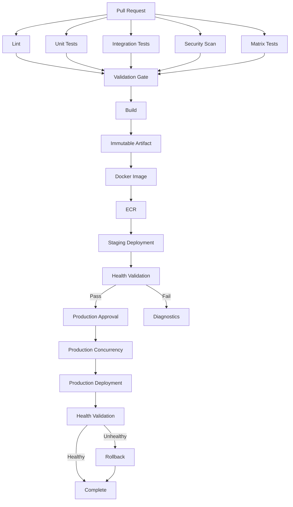

# README.md

## Overview

The `03- Advanced Workflows` section covers production-grade GitHub Actions workflow patterns used to build scalable, reusable, secure, and maintainable CI/CD systems.

The focus is on moving beyond individual workflow syntax and understanding how multiple GitHub Actions capabilities work together:

```text
Workflow Design
      ↓
Reusable Workflows
      ↓
Outputs and Data Flow
      ↓
Concurrency
      ↓
Advanced Patterns
      ↓
Custom Actions
      ↓
Containers and Testing
      ↓
Security
      ↓
Deployment
```

These topics are particularly relevant when building backend delivery pipelines for Python, Django, FastAPI, Docker, AWS, microservices, and infrastructure automation.

## Navigation

| # | File | Description |
|---|---|---|
| 01 | [01- Reusable Workflows](./01-%20Reusable%20Workflows.md) | Reusable workflows are GitHub Actions workflows designed to be called by other workflows. |
| 02 | [02- Workflow Inputs](./02-%20Workflow%20Inputs.md) | Reusable workflows are GitHub Actions workflows designed to be called by other workflows. |
| 03 | [03- Workflow Outputs](./03-%20Workflow%20Outputs.md) | GitHub Actions outputs provide a controlled mechanism for passing small pieces of data through a workflow. |
| 04 | [04- Workflow Secrets](./04-%20Workflow%20Secrets.md) | GitHub Actions secrets provide protected storage for sensitive values required by CI/CD workflows. |
| 05 | [05- Cross Repository Workflows](./05-%20Cross%20Repository%20Workflows.md) | Cross-repository workflows allow GitHub Actions automation to be shared, triggered, or coordinated across repository boundaries. |
| 06 | [06- Dynamic Matrix Strategies](./06-%20Dynamic%20Matrix%20Strategies.md) | GitHub Actions matrix strategies allow a workflow job to execute the same logical workload across multiple combinations of inputs. |
| 07 | [07- Concurrency](./07-%20Concurrency.md) | GitHub Actions concurrency controls which workflow runs or jobs are allowed to execute simultaneously when they target the same logical resource. |
| 08 | [08- Parallelism and Execution Control](./08-%20Parallelism%20and%20Execution%20Control.md) | GitHub Actions executes independent jobs in parallel by default. |
| 09 | [09- Conditional Workflow Design](./09-%20Conditional%20Workflow%20Design.md) | Conditional workflow design determines when GitHub Actions should execute, skip, continue, fail, or promote work. |
| 10 | [10- Advanced Workflow Patterns](./10-%20Advanced%20Workflow%20Patterns.md) | Advanced GitHub Actions workflow design is primarily about orchestrating execution, dependencies, data, environments, security boundaries, a... |

## Advanced Workflow Progression

The documents in this section should be approached as a progression from reusable building blocks toward complete production workflow architecture.

```text
Reusable Workflows
        ↓
Workflow Outputs
        ↓
Secrets
        ↓
Concurrency
        ↓
Advanced Workflow Patterns
```

### Reusable Workflows

Reusable workflows establish the foundation for standardizing CI/CD logic across repositories.

Important concepts include:

- `workflow_call`
- Inputs
- Outputs
- Secrets
- `secrets: inherit`
- Cross-repository workflows
- Workflow versioning
- Reusable CI workflows
- Reusable deployment workflows
- Reusable workflow governance

The key architectural distinction is:

```text
Reusable Workflow
    → Multiple jobs
    → Dependencies
    → Matrix orchestration
    → Deployment pipelines

Composite Action
    → Reusable steps
    → Runs inside a job
```

### Workflow Outputs

Workflow outputs provide explicit data flow between workflow components.

Typical use cases include:

```text
Discovery
   ↓
Generate JSON
   ↓
Job Output
   ↓
Dynamic Matrix
   ↓
Parallel Jobs
```

Outputs are appropriate for relatively small control-plane values such as:

- Versions
- Environment selections
- Deployment decisions
- Matrix definitions
- Artifact identifiers
- Image metadata

Artifacts should be used when the workflow needs to transfer files or larger build outputs.

### Workflow Secrets

Secrets form part of the security boundary of a production workflow.

The section covers:

```text
Repository Secrets
Organization Secrets
Environment Secrets
        ↓
Secrets Context
        ↓
Workflow / Job
```

Production workflows should minimize secret exposure and prefer short-lived authentication mechanisms where supported.

For AWS deployments, this commonly means:

```text
GitHub Actions
      ↓
OIDC
      ↓
AWS STS
      ↓
IAM Role
      ↓
AWS Services
```

rather than storing long-lived AWS access keys.

### Concurrency

Concurrency controls conflicting workflow or job executions.

Typical use cases include:

```text
Pull Request
    → Cancel obsolete validation

Staging
    → Prevent overlapping deployments

Production
    → Serialize deployments

Terraform
    → Protect shared state operations
```

The important design question is not simply whether concurrency should be enabled, but **which resource actually requires coordination**.

### Advanced Workflow Patterns

The advanced patterns document brings the individual mechanisms together.

It covers architectures such as:

```text
Pull Request
    ↓
Lint
    ├── Unit Tests
    ├── Integration Tests
    ├── Security Scan
    └── Matrix Tests
             ↓
          Build
             ↓
       Docker Image
             ↓
            ECR
             ↓
         Staging
             ↓
       Health Check
             ↓
          Approval
             ↓
        Production
             ↓
        Monitoring
             ↓
         Rollback
```

This is the level at which GitHub Actions becomes a production CI/CD platform rather than simply a YAML automation mechanism.

## Core Architecture Concepts

Advanced workflows should be understood as dependency graphs.

### Fan-Out

Independent work runs in parallel:

```text
             ┌── Unit Tests
             │
Validation ──┼── Integration Tests
             │
             ├── Security Scan
             │
             └── Matrix Tests
```

### Fan-In

Dependent work waits for multiple upstream jobs:

```text
Unit Tests ────────┐
Integration Tests ─┤
Security Scan ─────┼── Build
Matrix Tests ──────┘
```

### Promotion

Artifacts move through environments without being rebuilt:

```text
Build
  ↓
Immutable Artifact
  ↓
Staging
  ↓
Approval
  ↓
Production
```

### Recovery

Production workflows should include a deliberate recovery path:

```text
Deployment
    ↓
Health Validation
    ↓
Healthy?
 ┌──┴──┐
Yes    No
 ↓      ↓
Done   Rollback
```

## Production CI/CD Pipeline

The complete architecture targeted by this section is:



This architecture separates the major CI/CD responsibilities:

- Validation
- Build
- Artifact creation
- Artifact promotion
- Environment deployment
- Approval
- Concurrency
- Health validation
- Rollback

## Advanced Workflow Building Blocks

| Capability | Primary Purpose | Typical Production Use |
|---|---|---|
| `needs` | Dependency management | Fan-in and sequential deployment |
| `if` | Conditional execution | Deployment gates and selective jobs |
| Matrix | Parallel execution | Python/database compatibility |
| Outputs | Data transfer | Metadata and dynamic matrices |
| Artifacts | File transfer | Reports and build outputs |
| Cache | Performance optimization | Dependencies and Docker layers |
| Reusable workflows | Pipeline reuse | Organization-wide CI/CD |
| Composite actions | Step reuse | Standard setup sequences |
| Concurrency | Conflict prevention | Deployment serialization |
| Environments | Deployment boundaries | Staging and production |
| Permissions | Access control | Least-privilege workflows |
| OIDC | Short-lived cloud identity | AWS authentication |

## Backend Engineering Use Cases

These patterns are particularly useful for backend systems built with:

```text
Python
├── Django
├── FastAPI
└── Celery

Databases
├── PostgreSQL
└── MySQL

Infrastructure
├── Docker
├── Kubernetes
└── AWS

Supporting Systems
├── Redis
├── Kafka
└── Nginx
```

A Python service pipeline can therefore follow:

```text
Python Source
    ↓
Lint
    ↓
pytest
    ↓
PostgreSQL + Redis
    ↓
Integration Tests
    ↓
Security Scan
    ↓
Docker Build
    ↓
ECR
    ↓
Staging
    ↓
Production
```

## Security Architecture

Security should be enforced throughout the workflow rather than added as a final step.

```text
Trigger
  ↓
Untrusted Input Boundary
  ↓
Least-Privilege Permissions
  ↓
Trusted Actions
  ↓
Isolated Runner
  ↓
Build
  ↓
Artifact Integrity
  ↓
Protected Environment
  ↓
Deployment Identity
```

Important controls include:

- Least-privilege `GITHUB_TOKEN`.
- Restricted workflow permissions.
- Protected environments.
- Secret isolation.
- OIDC for AWS.
- Trusted third-party actions.
- SHA pinning where appropriate.
- Dependency review.
- SBOM generation.
- Artifact provenance.
- Ephemeral runners for sensitive workloads.
- Avoiding shell injection through untrusted GitHub data.

## Artifact Strategy

Production workflows should prefer:

```text
Build Once
    ↓
Immutable Artifact
    ↓
Promote
```

instead of:

```text
Build Staging
    ↓
Deploy

Build Production
    ↓
Deploy
```

The immutable artifact can be identified using:

```text
Commit SHA
Image Digest
Artifact Version
```

For container workloads:

```text
backend@sha256:<digest>
```

is a stronger deployment identity than:

```text
backend:latest
```

## Environment Strategy

A common environment model is:

```text
Development
     ↓
Staging
     ↓
Production
```

Each environment can have independent:

- Secrets
- Variables
- Deployment protections
- Review requirements
- AWS IAM roles
- Deployment targets
- Concurrency policies

Production should generally have stronger protection than development or staging.

## Workflow Governance

At organizational scale, advanced workflows should support centralized governance.

```text
Application Repositories
        ↓
Reusable Workflows
        ↓
Platform Standards
        ↓
Security Policies
        ↓
Deployment Controls
```

Centralized workflows can standardize:

- Permissions.
- Security scanning.
- Docker builds.
- Artifact handling.
- AWS authentication.
- Deployment patterns.
- Concurrency.
- Environment handling.

Application repositories can then focus on application-specific configuration.

## Troubleshooting Approach

Advanced workflow failures should be diagnosed by failure domain.

Use:

```text
Symptom
   ↓
Possible Causes
   ↓
Isolation Strategy
   ↓
Commands / Checks
   ↓
Root Cause
   ↓
Corrective Action
   ↓
Prevention
```

Relevant failure domains include:

- Workflow syntax.
- Triggers.
- Branch/path filters.
- Expressions.
- Contexts.
- Outputs.
- Secrets.
- Permissions.
- Matrices.
- Reusable workflows.
- Artifacts.
- Caches.
- Containers.
- Service containers.
- Runners.
- OIDC.
- AWS authentication.
- Docker.
- Registries.
- Deployments.
- Concurrency.
- Race conditions.
- Production failures.

## Operational Commands

GitHub CLI can be used to inspect and operate workflows.

List workflows:

```bash
gh workflow list
```

List workflow runs:

```bash
gh run list
```

Inspect a run:

```bash
gh run view <run-id>
```

View logs:

```bash
gh run view <run-id> --log
```

Rerun a workflow:

```bash
gh run rerun <run-id>
```

Run a workflow manually:

```bash
gh workflow run <workflow-file>
```

These commands are useful for operational debugging without turning this section into a generic GitHub CLI reference.

## Recommended Learning Order

The recommended progression through this folder is:

```text
Reusable Workflows
        ↓
Workflow Outputs
        ↓
Workflow Secrets
        ↓
Concurrency
        ↓
Advanced Workflow Patterns
```

The progression moves from reusable building blocks to complete production workflow architecture.

## Senior-Level Design Questions

When designing an advanced GitHub Actions pipeline, ask:

### Execution

- Which jobs are independent?
- Which jobs must depend on each other?
- Where can fan-out improve execution time?
- Where is fan-in required?

### Data Flow

- Which values need to cross job boundaries?
- Should the value be an output or an artifact?
- Is the data structured enough to justify JSON?

### Security

- Which jobs require credentials?
- What permissions does each job need?
- Is any GitHub event data untrusted?
- Can a third-party action access sensitive resources?
- Should the runner be ephemeral?

### Deployment

- What is the immutable artifact?
- How is it promoted?
- Can two deployments modify the same environment?
- What is the rollback mechanism?

### Scalability

- How large can the matrix become?
- How many runners can execute simultaneously?
- Which work can be cached?
- Which services actually need to be tested?

### Reliability

- What happens when staging fails?
- What happens when production health checks fail?
- What happens if the runner disappears?
- Can deployment be safely retried?

### Governance

- Which workflow behavior should be standardized?
- Which permissions should be mandatory?
- How are reusable workflow versions managed?
- Which actions are trusted?

## Folder Completion Criteria

This section should provide enough knowledge to independently design workflows that can:

- Execute parallel validation.
- Generate dynamic matrices.
- Pass structured data between jobs.
- Reuse centralized workflow logic.
- Protect secrets and permissions.
- Coordinate concurrent deployments.
- Build immutable Docker artifacts.
- Promote the same artifact through environments.
- Authenticate to AWS using OIDC.
- Run Django/FastAPI integration tests with PostgreSQL and Redis.
- Protect production deployments.
- Diagnose workflow failures.
- Roll back failed deployments.
- Scale CI/CD across multiple repositories.

## Key Takeaways

- Advanced GitHub Actions design is about orchestrating dependencies, data flow, security boundaries, environments, artifacts, and deployment behavior rather than simply writing YAML.
- Reusable workflows, outputs, secrets, and concurrency provide the core building blocks for maintainable production CI/CD systems.
- Production pipelines should build immutable artifacts once, promote those artifacts across environments, protect deployments with appropriate controls, and retain a deterministic rollback path.
- Security must be designed into every workflow stage through least-privilege permissions, controlled secrets, trusted actions, isolated execution, and short-lived cloud authentication.
- The final objective is a scalable CI/CD architecture that is observable, recoverable, governed, and suitable for production backend systems.