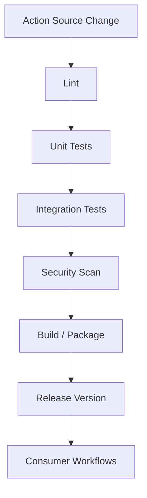

# 01- Custom Actions Overview

## Overview

GitHub Actions custom actions provide a mechanism for packaging reusable CI/CD behavior behind a consistent interface.

They are useful when the same sequence of workflow steps, API interactions, setup logic, or specialized execution environment is required across multiple workflows or repositories.

A production GitHub Actions platform commonly has three layers:

```text
Application Workflow
        ↓
Reusable Workflow
        ↓
Custom Action
        ↓
Execution Logic
```

Custom actions should not be treated as a replacement for workflows. Their primary responsibility is to encapsulate reusable execution logic, while workflows coordinate jobs, dependencies, environments, approvals, matrices, artifacts, and deployments.

GitHub Actions supports three major custom action types:

| Action type | Execution model | Primary use |
|---|---|---|
| Composite | Groups multiple workflow steps | Reusable shell/setup logic |
| JavaScript | Executes packaged JavaScript | API integrations and complex action logic |
| Docker | Executes inside a Docker container | Custom runtime or isolated dependencies |

The architectural distinction is important:

```text
Reusable Workflow
    → Orchestrates multiple jobs

Composite Action
    → Packages multiple steps within one job

JavaScript Action
    → Implements reusable action logic

Docker Action
    → Runs action logic inside a container
```

## Why Custom Actions Exist

Without custom actions, organizations frequently duplicate the same workflow steps:

```yaml
steps:
  - uses: actions/checkout@v4

  - name: Set up Python
    uses: actions/setup-python@v5
    with:
      python-version: "3.12"

  - name: Install dependencies
    run: pip install -r requirements.txt

  - name: Run lint
    run: ruff check .
```

If dozens of repositories require the same setup, maintenance becomes difficult.

A custom action can encapsulate the reusable behavior:

```yaml
steps:
  - uses: company/python-ci-setup@v1
```

This creates a stable interface between the workflow and the implementation.

## Custom Action Architecture

A custom action typically contains:

```text
custom-action/
├── action.yml
├── src/
├── dist/
├── Dockerfile
├── README.md
└── tests/
```

The exact structure depends on the action type.

The central contract is `action.yml`.

```yaml
name: "Python CI Setup"
description: "Prepare a Python environment for backend CI"

inputs:
  python-version:
    description: "Python version"
    required: false
    default: "3.12"

outputs:
  python-version:
    description: "Resolved Python version"

runs:
  using: "composite"
  steps:
    - name: Set up Python
      uses: actions/setup-python@v5
      with:
        python-version: ${{ inputs.python-version }}

    - name: Install dependencies
      shell: bash
      run: python -m pip install -r requirements.txt
```

The workflow consumes the action through its public interface rather than depending directly on its internal implementation.

## The `action.yml` Contract

`action.yml` defines the metadata and execution model of an action.

Typical fields include:

| Field | Purpose |
|---|---|
| `name` | Human-readable action name |
| `description` | Action purpose |
| `inputs` | Values supplied by the workflow |
| `outputs` | Values returned by the action |
| `runs` | Execution configuration |
| `branding` | Marketplace presentation metadata |

A minimal structure is:

```yaml
name: "Example Action"
description: "Reusable CI/CD behavior"

inputs:
  environment:
    description: "Target environment"
    required: true

outputs:
  result:
    description: "Action result"

runs:
  using: "composite"
  steps:
    - name: Execute
      shell: bash
      run: echo "Environment: ${{ inputs.environment }}"
```

The action should expose only the configuration consumers actually need.

## Inputs

Inputs provide a controlled interface between a workflow and an action.

Example:

```yaml
inputs:
  python-version:
    description: "Python runtime version"
    required: false
    default: "3.12"

  install-dev:
    description: "Install development dependencies"
    required: false
    default: "true"
```

Workflow usage:

```yaml
- name: Prepare Python environment
  uses: ./.github/actions/python-setup
  with:
    python-version: "3.12"
    install-dev: "true"
```

### Input Design Principles

Good action inputs should be:

- Explicit.
- Small in number.
- Well documented.
- Predictable.
- Backward compatible.
- Validated where practical.

Avoid exposing every internal implementation detail as an input.

Poor interface:

```yaml
with:
  shell-command-1: ...
  shell-command-2: ...
  internal-directory: ...
  temporary-file-name: ...
  implementation-flag: ...
```

A better interface represents the business or engineering capability:

```yaml
with:
  python-version: "3.12"
  dependency-file: "requirements.txt"
```

## Outputs

Actions can return values to the calling workflow.

Example:

```yaml
outputs:
  image-tag:
    description: "Built Docker image tag"
    value: ${{ steps.build.outputs.image-tag }}
```

The implementation can produce the output using `GITHUB_OUTPUT`:

```yaml
- name: Build image
  id: build
  shell: bash
  run: |
    IMAGE_TAG="${GITHUB_SHA}"
    echo "image-tag=${IMAGE_TAG}" >> "$GITHUB_OUTPUT"
```

The workflow can consume it:

```yaml
- name: Build application
  id: image
  uses: ./.github/actions/build-image

- name: Display image
  run: echo "Image: ${{ steps.image.outputs.image-tag }}"
```

Outputs are appropriate for small pieces of control-plane information.

For larger files, use artifacts rather than action outputs.

## Composite Actions

Composite actions package multiple workflow steps into a reusable action.

They are appropriate when the logic can be expressed using normal GitHub Actions steps and shell commands.

Example:

```yaml
name: "Python Backend Setup"
description: "Configure Python and install backend dependencies"

inputs:
  python-version:
    description: "Python version"
    required: false
    default: "3.12"

runs:
  using: "composite"
  steps:
    - name: Set up Python
      uses: actions/setup-python@v5
      with:
        python-version: ${{ inputs.python-version }}

    - name: Upgrade pip
      shell: bash
      run: python -m pip install --upgrade pip

    - name: Install dependencies
      shell: bash
      run: python -m pip install -r requirements.txt
```

Usage:

```yaml
- name: Configure backend environment
  uses: ./.github/actions/python-backend-setup
  with:
    python-version: "3.12"
```

### Advantages

Composite actions are useful because they:

- Are simple to implement.
- Can combine existing actions and shell commands.
- Keep workflow files smaller.
- Work well for repository-local conventions.
- Avoid requiring a separate JavaScript runtime implementation.

### Limitations

Composite actions are not full workflow orchestrators.

They cannot replace workflow-level capabilities such as:

- Multiple jobs.
- Job dependency graphs.
- Environment promotion.
- Workflow-level concurrency.
- Matrix orchestration across jobs.
- Approval architecture.

Use a reusable workflow when the responsibility is pipeline orchestration.

## JavaScript Actions

JavaScript actions execute action logic using a Node.js runtime.

They are appropriate when the action needs programmatic interaction with APIs, complex logic, or reusable behavior that is cumbersome to express using shell commands.

A typical structure is:

```text
github-action/
├── action.yml
├── src/
│   └── main.js
├── package.json
├── package-lock.json
├── dist/
│   └── index.js
└── README.md
```

Example `action.yml`:

```yaml
name: "Deployment Metadata"
description: "Generate deployment metadata"

inputs:
  environment:
    description: "Deployment environment"
    required: true

outputs:
  deployment-id:
    description: "Generated deployment identifier"

runs:
  using: "node24"
  main: "dist/index.js"
```

The runtime should follow the currently supported GitHub Actions JavaScript runtime documented for the action rather than relying on obsolete Node.js versions.

### `@actions/core`

The `@actions/core` package provides common action functionality.

Example:

```javascript
const core = require("@actions/core");

const environment = core.getInput("environment", {
  required: true,
});

const deploymentId = `${environment}-${Date.now()}`;

core.setOutput("deployment-id", deploymentId);
core.info(`Deployment ID: ${deploymentId}`);
```

### `@actions/github`

The `@actions/github` package provides GitHub API integration.

```javascript
const core = require("@actions/core");
const github = require("@actions/github");

const token = core.getInput("github-token", {
  required: true,
});

const octokit = github.getOctokit(token);

core.info(`Repository: ${process.env.GITHUB_REPOSITORY}`);
```

API access should use the minimum required token permissions.

## JavaScript Action Packaging

JavaScript actions are normally distributed with their runtime dependencies packaged into the action's distribution.

A common workflow is:

```text
Source
  ↓
npm install
  ↓
Tests
  ↓
Build / Bundle
  ↓
dist/
  ↓
Release
```

Consumers should not be required to run `npm install` before executing the action.

A repository can therefore contain:

```text
src/
package.json
package-lock.json
dist/
action.yml
```

The `dist/` output should be kept synchronized with the source implementation when the action is distributed this way.

## Docker Actions

Docker actions execute their implementation inside a Docker container.

A typical structure is:

```text
docker-action/
├── action.yml
├── Dockerfile
├── entrypoint.sh
└── README.md
```

Example `action.yml`:

```yaml
name: "Security Scanner"
description: "Run a custom security scanner"

inputs:
  target:
    description: "Directory to scan"
    required: true

runs:
  using: "docker"
  image: "Dockerfile"
  args:
    - ${{ inputs.target }}
```

Example `Dockerfile`:

```dockerfile
FROM python:3.12-slim

COPY requirements.txt /requirements.txt
RUN pip install --no-cache-dir -r /requirements.txt

COPY entrypoint.sh /entrypoint.sh
RUN chmod +x /entrypoint.sh

ENTRYPOINT ["/entrypoint.sh"]
```

Example entrypoint:

```bash
#!/usr/bin/env bash
set -euo pipefail

TARGET="${1:?target is required}"

python /app/scanner.py "$TARGET"
```

## Docker Action Runtime

Docker actions are useful when the action requires a specific runtime or system dependency set.

For example:

```text
GitHub Runner
      ↓
Docker Action
      ↓
Custom Python Runtime
      ↓
Security Scanner
```

This can provide stronger runtime consistency than relying on software already installed on the runner.

However, Docker actions introduce additional considerations:

- Container startup overhead.
- Image maintenance.
- Dependency vulnerabilities.
- Platform compatibility.
- File-system behavior.
- Network behavior.
- Container execution restrictions.

They are therefore not automatically better than composite or JavaScript actions.

## Choosing an Action Type

| Requirement | Composite | JavaScript | Docker |
|---|---:|---:|---:|
| Combine workflow steps | Excellent | Possible | Possible |
| Shell commands | Excellent | Possible | Excellent |
| GitHub API integration | Limited | Excellent | Possible |
| Custom runtime | Limited | Node.js | Excellent |
| Simple setup logic | Excellent | Often unnecessary | Usually excessive |
| Complex program logic | Limited | Excellent | Excellent |
| Container isolation | No | No | Yes |
| Startup overhead | Low | Low | Higher |
| Cross-platform behavior | Good | Good | More constrained |
| Easy maintenance | High | Medium | Medium |

A practical rule is:

```text
Reusable steps
    → Composite Action

API / programmatic logic
    → JavaScript Action

Specialized runtime
    → Docker Action
```

## Custom Actions vs Reusable Workflows

This distinction is one of the most important concepts in advanced GitHub Actions design.

| Capability | Custom Action | Reusable Workflow |
|---|---|---|
| Multiple jobs | No | Yes |
| Job dependency graph | No | Yes |
| Matrix orchestration | Limited to calling workflow | Yes |
| Environment deployment | Not an orchestrator | Yes |
| Approval architecture | No | Yes |
| Concurrency orchestration | No | Yes |
| Reusable steps | Yes | Yes |
| Workflow-level abstraction | No | Yes |
| Runs inside a job | Yes | No, it orchestrates jobs |

Example:

```text
Reusable Workflow
├── Lint Job
├── Test Job
├── Build Job
└── Deploy Job
```

A custom action might instead be used inside one of those jobs:

```text
Test Job
    ├── Checkout
    ├── Python Setup Action
    ├── Database Setup
    └── pytest
```

The action packages implementation details; the reusable workflow defines pipeline orchestration.

## Custom Actions in Backend CI

Consider a Django or FastAPI service with a standard validation process:

```text
Checkout
   ↓
Python Setup
   ↓
Dependency Installation
   ↓
Lint
   ↓
pytest
   ↓
Coverage
```

The Python setup and dependency installation can be packaged as a composite action:

```yaml
- name: Configure Python environment
  uses: company/python-backend-setup@v1
  with:
    python-version: "3.12"
```

The workflow remains responsible for pipeline structure:

```yaml
jobs:
  test:
    runs-on: ubuntu-latest

    steps:
      - uses: actions/checkout@v4

      - name: Configure Python environment
        uses: company/python-backend-setup@v1

      - name: Run tests
        run: pytest --cov
```

This separation keeps the workflow readable while preserving control over CI orchestration.

## Custom Actions with Containers

Custom actions can also be useful when testing backend systems that depend on external services.

For example:

```text
GitHub Runner
    │
    ├── PostgreSQL Service
    ├── Redis Service
    │
    └── Test Job
          │
          ├── Custom Python Setup Action
          └── pytest
```

The action should not hide critical infrastructure dependencies unnecessarily.

For example, a reusable workflow may define:

```yaml
services:
  postgres:
    image: postgres:16
    env:
      POSTGRES_PASSWORD: postgres
      POSTGRES_DB: testdb
    ports:
      - 5432:5432

  redis:
    image: redis:7
    ports:
      - 6379:6379
```

The workflow owns the service topology, while a custom action can own application-specific setup.

## Inputs and Security

Action inputs can originate from workflow expressions and potentially untrusted GitHub data.

Unsafe pattern:

```yaml
- uses: ./.github/actions/run-command
  with:
    command: ${{ github.event.pull_request.title }}
```

If the action executes the input as shell code, an attacker-controlled pull request title can become a command-injection vector.

Avoid constructing shell commands from untrusted values.

Prefer passing values as environment variables or structured arguments:

```yaml
- name: Process title
  env:
    PR_TITLE: ${{ github.event.pull_request.title }}
  run: |
    python scripts/process_title.py
```

The Python application can then treat the value as data rather than executable shell syntax.

## Secrets and Custom Actions

A custom action should receive only the credentials it actually needs.

Example:

```yaml
permissions:
  contents: read

steps:
  - name: Deploy
    uses: company/deploy-action@v1
    with:
      environment: staging
```

For AWS authentication, prefer OIDC where applicable:

```yaml
permissions:
  contents: read
  id-token: write
```

Then:

```text
GitHub Actions
      ↓
OIDC Token
      ↓
AWS STS
      ↓
IAM Role
      ↓
Temporary Credentials
      ↓
Deployment
```

Avoid designing actions around long-lived AWS access keys stored as repository secrets when short-lived federation can satisfy the requirement.

## Action Permissions

An action executes with the permissions available to the workflow or job.

Therefore:

```yaml
permissions:
  contents: read
```

is preferable to broad default access when the action only needs repository contents.

For an AWS deployment action:

```yaml
permissions:
  contents: read
  id-token: write
```

The exact permissions should reflect the operation.

A custom action should never assume that consumers will grant broad permissions.

## Action Versioning

Custom actions are dependencies and should be versioned accordingly.

Common strategies include:

```text
v1
v1.2.0
<commit SHA>
```

A production organization may expose a stable major-version reference:

```yaml
uses: company/python-backend-setup@v1
```

while internally maintaining:

```text
v1.0.0
v1.1.0
v1.2.0
```

Major-version references allow compatible updates without forcing every repository to change immediately.

For high-assurance supply-chain environments, pinning to an immutable commit SHA provides stronger protection against moving references.

## Third-Party Actions

Treat third-party actions as dependencies with execution privileges.

Before adopting an action, evaluate:

- Source repository ownership.
- Maintenance activity.
- Release process.
- Required permissions.
- Secrets access.
- External network access.
- Dependency chain.
- Container image provenance.
- Security history.
- Versioning strategy.

Avoid blindly copying marketplace examples into production workflows.

A compromised action can execute arbitrary code within the runner context available to it.

## Action Security Model

A useful security boundary is:

```text
Workflow
   ↓
Permissions
   ↓
Action
   ↓
Runner
   ↓
Repository / Cloud / Network
```

The action should receive the minimum access required at every layer.

For sensitive workflows:

- Minimize `GITHUB_TOKEN` permissions.
- Avoid unnecessary secrets.
- Pin trusted third-party actions.
- Prefer immutable references for high-risk dependencies.
- Use isolated or ephemeral runners where appropriate.
- Separate untrusted pull request validation from privileged deployment workflows.
- Do not execute untrusted input directly as shell code.

## Testing Custom Actions

Custom actions should have their own tests.

Testing should cover:

```text
Input Validation
      ↓
Execution
      ↓
Output Generation
      ↓
Error Handling
      ↓
Security Behavior
```

For a JavaScript action, tests can validate:

- Required inputs.
- Default values.
- API behavior.
- Output values.
- Error handling.

For a composite action, integration tests should execute the action in a representative workflow.

For a Docker action, test:

- Image build.
- Entrypoint behavior.
- Input handling.
- Exit codes.
- Required filesystem access.
- Network requirements.

## Production Action Repository

An organization-wide action can be maintained as a dedicated repository:

```text
company-python-action/
├── action.yml
├── src/
├── dist/
├── tests/
├── package.json
├── package-lock.json
├── README.md
└── .github/
    └── workflows/
        └── ci.yml
```

The action repository should validate itself before publishing a new version.



## Action Documentation

Every production custom action should document:

- Purpose.
- Supported action type.
- Inputs.
- Outputs.
- Required permissions.
- Required secrets.
- Supported platforms.
- Usage examples.
- Versioning policy.
- Security considerations.
- Failure behavior.
- Compatibility expectations.

Example:

```markdown
## Inputs

| Input | Required | Default | Description |
|---|---|---|---|
| `python-version` | No | `3.12` | Python runtime |
| `dependency-file` | No | `requirements.txt` | Dependency file |

## Outputs

| Output | Description |
|---|---|
| `python-version` | Resolved Python version |

## Permissions

```yaml
permissions:
  contents: read
```
```

Documentation is part of the action's API contract.

## Common Mistakes

### Building a Workflow Inside a Custom Action

A custom action should not attempt to reproduce workflow orchestration.

Bad architecture:

```text
Custom Action
 ├── Build
 ├── Test
 ├── Deploy
 ├── Approve
 └── Rollback
```

Prefer:

```text
Reusable Workflow
 ├── Build
 ├── Test
 ├── Deploy
 └── Rollback

Custom Actions
 ├── Build helper
 ├── Test helper
 └── Deployment helper
```

### Exposing Too Many Inputs

An action with dozens of configuration switches becomes difficult to understand and maintain.

Prefer a narrow API representing the reusable capability.

### Depending on Runner-Specific State

An action should avoid assuming arbitrary software or configuration exists on the runner unless explicitly documented.

### Hard-Coding Secrets

Never embed credentials in:

- Source code.
- `action.yml`.
- Dockerfiles.
- Generated distributions.
- Test fixtures.

### Using Floating Third-Party Dependencies Without Review

A moving dependency reference can introduce unexpected behavior.

Use a deliberate versioning and trust strategy.

### Ignoring Exit Codes

An action must correctly signal failure.

For shell-based actions:

```bash
set -euo pipefail
```

For programmatic actions, propagate errors rather than logging them and returning success.

## Production Considerations

### Reliability

Actions should be:

- Deterministic.
- Idempotent where possible.
- Explicit about failure.
- Safe to retry.
- Independent of unnecessary external state.

### Performance

Avoid expensive initialization when a simpler execution model is sufficient.

For example:

```text
Simple shell/setup
    → Composite

Small API operation
    → JavaScript

Heavy runtime dependency
    → Docker
```

Container startup and image download overhead can matter when an action executes hundreds of times per day.

### Scalability

Organization-wide actions become platform dependencies.

A breaking change can affect many repositories simultaneously.

Therefore:

```text
Action
  ↓
Version
  ↓
Compatibility Contract
  ↓
Consumer Repositories
```

Treat action interfaces as APIs.

### Availability

If an action depends on external APIs, consider:

- Timeouts.
- Retries.
- Rate limits.
- Backoff.
- Failure classification.
- Idempotency.

Do not retry non-idempotent operations blindly.

### Cost

Custom actions can influence CI cost through:

- Execution time.
- Container startup.
- External API calls.
- Additional build steps.
- Cache behavior.
- Runner consumption.

Measure action runtime in representative workflows.

## Troubleshooting Custom Actions

Use the standard failure model:

```text
Symptom
   ↓
Possible Causes
   ↓
Isolation Strategy
   ↓
Commands / Checks
   ↓
Root Cause
   ↓
Corrective Action
   ↓
Prevention
```

### Action Not Found

Check:

```text
Repository path
Action directory
action.yml
Reference version
Repository permissions
```

For a local action:

```yaml
uses: ./.github/actions/my-action
```

The action metadata must exist at the expected path.

### Input Is Empty

Check:

```yaml
with:
  environment: staging
```

and the action definition:

```yaml
inputs:
  environment:
    required: true
```

Then verify the reference:

```yaml
${{ inputs.environment }}
```

### Output Is Missing

Check:

```text
Step ID
   ↓
GITHUB_OUTPUT
   ↓
Action output mapping
   ↓
Caller output reference
```

For example:

```yaml
outputs:
  result:
    value: ${{ steps.execute.outputs.result }}
```

and:

```yaml
- id: execute
  shell: bash
  run: echo "result=success" >> "$GITHUB_OUTPUT"
```

### Docker Action Fails

Check:

- Dockerfile build.
- Entrypoint path.
- File permissions.
- Input arguments.
- Working directory.
- Network requirements.
- Runner platform compatibility.

### JavaScript Action Fails

Check:

- Node runtime.
- Dependencies.
- `dist/` synchronization.
- Input validation.
- API permissions.
- API rate limits.
- Error propagation.

## GitHub CLI Operational Checks

GitHub CLI can help inspect workflows consuming an action.

List workflow runs:

```bash
gh run list
```

Inspect a failed run:

```bash
gh run view <run-id>
```

Inspect logs:

```bash
gh run view <run-id> --log
```

Rerun after correcting an action:

```bash
gh run rerun <run-id>
```

For organization-wide actions, inspect consumer repositories and workflow runs when rolling out a new action version.

## Interview Scenarios

### Scenario: Reuse Python Setup Across 30 Repositories

A company has identical Python setup logic across many backend repositories.

Consider:

- Composite action for reusable steps.
- Reusable workflow for complete CI orchestration.
- Versioning strategy.
- Compatibility guarantees.
- Rollout strategy.
- Permissions.

### Scenario: Action Needs GitHub API Access

A custom action must inspect pull request metadata.

Consider:

- JavaScript action.
- `@actions/github`.
- Required `GITHUB_TOKEN` permissions.
- Rate limits.
- Error handling.
- Untrusted input.
- Token exposure.

### Scenario: Deployment Action Needs AWS

A deployment action must publish an image to ECR and deploy to ECS.

Consider:

```text
GitHub Actions
      ↓
OIDC
      ↓
AWS STS
      ↓
IAM Role
      ↓
ECR
      ↓
ECS
```

Avoid unnecessary long-lived AWS credentials.

### Scenario: Third-Party Action Is Compromised

Consider:

- Token permissions.
- Secrets available to the job.
- Environment protection.
- Action pinning.
- Runner isolation.
- Dependency review.
- Replacement or rollback strategy.

### Scenario: Composite Action Has Become Extremely Complex

Evaluate whether the abstraction should be split.

Possible architecture:

```text
Reusable Workflow
       ↓
Composite Actions
       ↓
Small Reusable Operations
```

Do not force all CI/CD logic into a single custom action.

## Custom Action Design Checklist

Before publishing a production custom action, verify:

- [ ] `action.yml` clearly defines the public interface.
- [ ] Inputs have explicit defaults or required flags.
- [ ] Outputs are documented.
- [ ] Errors correctly fail the action.
- [ ] Secrets are not embedded in source or images.
- [ ] Required permissions are documented.
- [ ] Dependencies are pinned appropriately.
- [ ] Third-party dependencies are reviewed.
- [ ] Action versions are defined.
- [ ] Tests cover success and failure paths.
- [ ] Runtime compatibility is documented.
- [ ] Docker images are scanned when applicable.
- [ ] JavaScript `dist/` output is synchronized.
- [ ] Composite actions avoid excessive complexity.
- [ ] Documentation includes production usage.
- [ ] Consumer workflows are tested before release.

## Key Takeaways

- Custom actions package reusable execution logic, while reusable workflows orchestrate jobs, dependencies, environments, and deployment pipelines.
- Use composite actions for reusable steps, JavaScript actions for programmatic or API-driven logic, and Docker actions when a specialized runtime or containerized execution model is required.
- Treat custom action inputs, outputs, permissions, and versions as a stable API contract because organization-wide actions can become dependencies for many repositories.
- Production actions require the same engineering discipline as application code: testing, versioning, least privilege, dependency trust, deterministic failures, observability, and secure handling of untrusted input.
- Keep custom actions focused and composable; move workflow orchestration, promotion, approvals, concurrency, and multi-job coordination into reusable workflows.