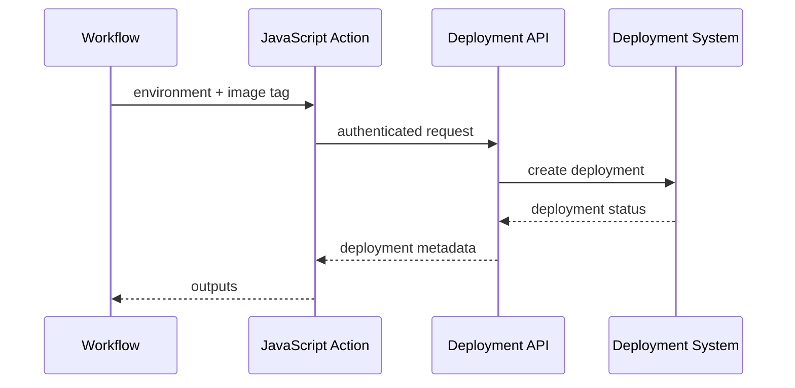

# 03- JavaScript Actions

## Overview

JavaScript actions package reusable CI/CD logic as executable JavaScript running on a GitHub Actions runner.

They are useful when a custom action needs more than shell commands or simple step composition, particularly when it must:

- Interact with the GitHub API.
- Process structured data.
- Implement non-trivial control flow.
- Produce reusable outputs.
- Integrate with external APIs.
- Handle errors programmatically.
- Encapsulate logic that would otherwise become complex shell scripting.

The basic execution model is:

```text
GitHub Workflow
      ↓
Job
      ↓
JavaScript Action
      ↓
Node.js Runtime
      ↓
Action Logic
      ↓
GitHub API / External API / Filesystem
```

A JavaScript action is different from both a composite action and a reusable workflow:

| Mechanism | Primary responsibility | Execution scope |
|---|---|---|
| Composite Action | Package reusable steps | Inside a job |
| JavaScript Action | Execute reusable programmatic logic | Inside a job |
| Docker Action | Execute logic in a containerized runtime | Inside a job |
| Reusable Workflow | Orchestrate jobs and pipeline behavior | Workflow level |

JavaScript actions are therefore best viewed as **programmable workflow components** rather than workflow orchestrators.

## When to Use JavaScript Actions

A composite action is usually sufficient when the requirement is primarily:

```text
Run command A
→ Run command B
→ Run existing action C
```

A JavaScript action becomes useful when the logic looks more like:

```text
Read input
→ Validate configuration
→ Call GitHub API
→ Process response
→ Apply decision logic
→ Produce outputs
→ Report failure
```

Typical use cases include:

- Reading pull request metadata.
- Creating or updating GitHub comments.
- Inspecting repository state.
- Querying GitHub APIs.
- Generating release metadata.
- Calling external deployment APIs.
- Processing JSON responses.
- Creating custom validation actions.
- Generating structured workflow outputs.

## JavaScript Action Architecture

A typical JavaScript action repository can use:

```text
javascript-action/
├── action.yml
├── src/
│   └── main.js
├── tests/
│   └── main.test.js
├── package.json
├── package-lock.json
├── dist/
│   └── index.js
├── README.md
└── .github/
    └── workflows/
        └── ci.yml
```

The important components are:

| File | Purpose |
|---|---|
| `action.yml` | Defines the action contract and runtime |
| `src/` | Source implementation |
| `tests/` | Automated tests |
| `package.json` | Node.js dependencies and scripts |
| `package-lock.json` | Dependency lockfile |
| `dist/` | Packaged executable action |
| `README.md` | Consumer documentation |

The action is normally distributed through its generated `dist/` output so consumers do not need to install Node.js dependencies before executing it.

## `action.yml`

A JavaScript action identifies its runtime through `runs`.

Example:

```yaml
name: "Deployment Metadata"
description: "Generate deployment metadata for CI/CD"

inputs:
  environment:
    description: "Deployment environment"
    required: true

  version:
    description: "Application version"
    required: true

outputs:
  deployment-id:
    description: "Generated deployment identifier"

runs:
  using: "node24"
  main: "dist/index.js"
```

The Node.js runtime should use a currently supported GitHub Actions JavaScript runtime rather than an obsolete runtime version.

The important distinction is:

```yaml
runs:
  using: "node24"
```

tells GitHub Actions how to execute the action, while:

```yaml
main: "dist/index.js"
```

identifies the packaged JavaScript entry point.

## Action Inputs

Inputs form the public interface of the action.

Example:

```yaml
inputs:
  environment:
    description: "Deployment environment"
    required: true

  dry-run:
    description: "Run without making changes"
    required: false
    default: "false"
```

The workflow invokes the action:

```yaml
- name: Generate deployment metadata
  uses: company/deployment-metadata@v1
  with:
    environment: staging
    dry-run: "true"
```

Inside JavaScript, use `@actions/core`:

```javascript
const core = require("@actions/core");

const environment = core.getInput("environment", {
  required: true,
});

const dryRun = core.getBooleanInput("dry-run");

core.info(`Environment: ${environment}`);
core.info(`Dry run: ${dryRun}`);
```

Inputs should represent meaningful capabilities rather than internal implementation details.

## Input Design

A well-designed JavaScript action should expose a small, stable interface.

Prefer:

```yaml
with:
  environment: production
  image-tag: abc123
```

over exposing implementation details such as:

```yaml
with:
  api-endpoint: ...
  retry-count: ...
  internal-parser: ...
  temporary-directory: ...
  shell-command: ...
```

Internal behavior should remain internal unless consumers genuinely need to configure it.

Good inputs should be:

- Explicit.
- Validated.
- Documented.
- Stable.
- Backward compatible.
- Safe by default.

## Input Validation

Validate inputs before performing external operations.

```javascript
const core = require("@actions/core");

const environment = core.getInput("environment", {
  required: true,
});

const allowedEnvironments = new Set([
  "development",
  "staging",
  "production",
]);

if (!allowedEnvironments.has(environment)) {
  core.setFailed(
    `Unsupported environment: ${environment}`,
  );

  process.exit(1);
}
```

Validation prevents configuration errors from becoming deployment or infrastructure failures later in the workflow.

For sensitive operations, validation should happen before:

- Authentication.
- Deployment.
- Resource creation.
- Destructive operations.
- External API mutations.

## Outputs

JavaScript actions can expose structured results to workflows.

Example:

```yaml
outputs:
  deployment-id:
    description: "Deployment identifier"
```

JavaScript:

```javascript
const core = require("@actions/core");

const deploymentId = `deploy-${Date.now()}`;

core.setOutput("deployment-id", deploymentId);
```

Caller:

```yaml
- name: Create deployment
  id: deployment
  uses: company/deployment-action@v1

- name: Display deployment ID
  run: |
    echo "Deployment: ${{ steps.deployment.outputs.deployment-id }}"
```

The data flow is:

```text
JavaScript
    ↓
core.setOutput()
    ↓
Action Step Output
    ↓
Workflow
```

Use outputs for compact control-plane data.

Do not attempt to transfer large files through outputs. Use artifacts for files.

## `@actions/core`

The `@actions/core` package provides the primary interface between JavaScript code and the GitHub Actions runtime.

Common functionality includes:

- Reading inputs.
- Setting outputs.
- Logging.
- Setting failures.
- Exporting environment variables.
- Adding paths.
- Creating annotations.
- Grouping logs.
- Writing summaries.

Example:

```javascript
const core = require("@actions/core");

const environment = core.getInput("environment", {
  required: true,
});

core.info(`Deploying to ${environment}`);

core.setOutput(
  "environment",
  environment,
);
```

## Logging

Use appropriate logging levels.

```javascript
core.debug("Detailed diagnostic information");
core.info("Deployment started");
core.warning("Deployment is running in dry-run mode");
core.error("Deployment API returned an error");
```

Avoid logging:

- Secrets.
- Access tokens.
- Authorization headers.
- Private credentials.
- Sensitive deployment configuration.

Logs are operational data and should be treated accordingly.

## Failure Handling

Use `core.setFailed()` for action-level failures.

```javascript
try {
  await deploy();
} catch (error) {
  core.setFailed(
    error instanceof Error
      ? error.message
      : String(error),
  );
}
```

Do not silently catch operational failures:

```javascript
try {
  await deploy();
} catch (error) {
  console.log(error);
}
```

That pattern can cause the action to appear successful even though deployment failed.

A production action should preserve the correct workflow status.

## `@actions/github`

The `@actions/github` package provides access to the GitHub API.

Example:

```javascript
const core = require("@actions/core");
const github = require("@actions/github");

const token = core.getInput("github-token", {
  required: true,
});

const octokit = github.getOctokit(token);

const [owner, repo] = process.env.GITHUB_REPOSITORY.split("/");

const { data } = await octokit.rest.repos.get({
  owner,
  repo,
});

core.info(`Repository: ${data.full_name}`);
```

This is one of the main reasons to choose a JavaScript action over a shell-based composite action.

## GitHub Token Permissions

A JavaScript action should not assume broad GitHub API permissions.

The workflow should explicitly define the minimum permissions required.

For read-only repository information:

```yaml
permissions:
  contents: read
```

For operations involving pull requests:

```yaml
permissions:
  contents: read
  pull-requests: write
```

The action should document the permissions it requires.

A useful security model is:

```text
Action Requirement
       ↓
Required API Endpoint
       ↓
Required Token Permission
       ↓
Workflow permissions
```

Grant permissions based on the actual API operations rather than the action's general purpose.

## GitHub API Interaction

A production action should handle API behavior explicitly.

Consider:

- Authentication failures.
- Authorization failures.
- Not-found responses.
- Rate limits.
- Validation errors.
- Transient failures.
- Network errors.
- API version changes.

Example:

```javascript
try {
  const response = await octokit.rest.issues.get({
    owner,
    repo,
    issue_number: issueNumber,
  });

  core.info(`Issue: ${response.data.title}`);
} catch (error) {
  core.setFailed(
    `Unable to retrieve issue: ${
      error instanceof Error ? error.message : String(error)
    }`,
  );
}
```

Do not assume every API failure represents the same class of problem.

## API Rate Limits

GitHub API operations are subject to rate limits.

An action that executes once in a repository may be harmless, while the same action executed across hundreds of repositories or matrix jobs can create significant API traffic.

Avoid unnecessary requests.

Prefer:

```text
One API request
    ↓
Process locally
    ↓
Reuse result
```

over:

```text
Matrix Job 1 → API
Matrix Job 2 → API
Matrix Job 3 → API
...
Matrix Job 50 → API
```

When appropriate, perform shared metadata collection once and pass the result through workflow outputs.

## Retry Strategy

Retries should be applied selectively.

Transient failures may justify retries:

```javascript
async function withRetry(operation, attempts = 3) {
  let lastError;

  for (let attempt = 1; attempt <= attempts; attempt += 1) {
    try {
      return await operation();
    } catch (error) {
      lastError = error;

      if (attempt === attempts) {
        throw error;
      }

      await new Promise((resolve) =>
        setTimeout(resolve, 2 ** attempt * 1000),
      );
    }
  }

  throw lastError;
}
```

Do not blindly retry:

- Authentication failures.
- Permission failures.
- Invalid input.
- Permanent API errors.
- Non-idempotent mutations.

Retry logic should be based on failure classification.

## Idempotency

Actions that mutate external systems should preferably be idempotent.

For example:

```text
Workflow retries
       ↓
JavaScript Action
       ↓
Deployment API
```

If the same deployment request is executed twice, the action should ideally identify the existing operation rather than creating duplicate resources.

Possible approaches include:

- Idempotency keys.
- Existing resource lookup.
- Commit SHA identifiers.
- Deployment IDs.
- State reconciliation.

This is particularly important for:

- AWS deployments.
- Release creation.
- Infrastructure provisioning.
- Database migrations.
- External ticket creation.
- Notifications.

## Environment Variables

JavaScript actions can access runner-provided environment variables.

```javascript
const repository = process.env.GITHUB_REPOSITORY;
const sha = process.env.GITHUB_SHA;
const ref = process.env.GITHUB_REF;
```

Common values include:

| Variable | Purpose |
|---|---|
| `GITHUB_REPOSITORY` | `owner/repository` |
| `GITHUB_SHA` | Commit SHA |
| `GITHUB_REF` | Git reference |
| `GITHUB_WORKSPACE` | Workspace directory |
| `GITHUB_RUN_ID` | Workflow run identifier |
| `GITHUB_RUN_NUMBER` | Workflow run number |

Prefer action inputs for explicit configuration and environment variables for GitHub/runtime metadata.

## GitHub Context and Action Inputs

Do not unnecessarily couple the action to one event.

A reusable action is easier to consume when it receives explicit inputs:

```yaml
with:
  environment: staging
  version: "${{ github.sha }}"
```

rather than assuming it always operates on a particular event:

```javascript
const branch = process.env.GITHUB_HEAD_REF;
```

Event-specific environment data is useful when the action's purpose genuinely depends on GitHub execution context.

## Structured Data

JavaScript actions are useful when structured JSON must be processed.

Example input:

```yaml
with:
  services: |
    ["api", "worker", "scheduler"]
```

JavaScript:

```javascript
const core = require("@actions/core");

const services = JSON.parse(
  core.getInput("services", {
    required: true,
  }),
);

if (!Array.isArray(services)) {
  core.setFailed("services must be a JSON array");
  process.exit(1);
}

core.setOutput(
  "service-count",
  String(services.length),
);
```

This is useful for dynamic CI/CD configuration.

## Generating Dynamic Workflow Data

A JavaScript action can generate structured outputs consumed by later workflow steps.

```javascript
const core = require("@actions/core");

const matrix = {
  include: [
    { python: "3.11", database: "postgres" },
    { python: "3.12", database: "postgres" },
    { python: "3.12", database: "mysql" },
  ],
};

core.setOutput(
  "matrix",
  JSON.stringify(matrix),
);
```

The workflow can then consume the JSON using `fromJSON()`:

```yaml
jobs:
  prepare:
    runs-on: ubuntu-latest
    outputs:
      matrix: ${{ steps.generate.outputs.matrix }}

    steps:
      - id: generate
        uses: company/test-matrix@v1

  test:
    needs: prepare
    strategy:
      matrix: ${{ fromJSON(needs.prepare.outputs.matrix) }}

    runs-on: ubuntu-latest

    steps:
      - run: |
          echo "Python: ${{ matrix.python }}"
          echo "Database: ${{ matrix.database }}"
```

This allows application-specific logic to generate CI configuration dynamically.

## Node.js Project Setup

A typical `package.json` may look like:

```json
{
  "name": "deployment-metadata-action",
  "version": "1.0.0",
  "description": "GitHub Action for deployment metadata",
  "main": "dist/index.js",
  "scripts": {
    "build": "ncc build src/main.js --minify",
    "test": "jest",
    "lint": "eslint ."
  },
  "dependencies": {
    "@actions/core": "^2.0.0",
    "@actions/github": "^8.0.0"
  },
  "devDependencies": {
    "@vercel/ncc": "^0.38.0",
    "eslint": "^9.0.0",
    "jest": "^30.0.0"
  }
}
```

Dependency versions should be selected and maintained according to the runtime and package ecosystem supported by the action.

## Dependency Locking

Commit the lockfile:

```text
package.json
package-lock.json
```

The lockfile improves reproducibility by recording the resolved dependency graph.

Avoid treating:

```text
package.json
```

as sufficient reproducibility for a production action.

The action itself is part of the CI/CD supply chain.

## Packaging with `ncc`

A common packaging approach is `@vercel/ncc`.

Source:

```text
src/main.js
```

Build:

```bash
ncc build src/main.js --minify
```

Output:

```text
dist/index.js
```

The action then references:

```yaml
runs:
  using: "node24"
  main: "dist/index.js"
```

The bundled distribution contains the runtime dependencies required by the action.

## Why `dist/` Matters

Consumers of a JavaScript action should normally be able to execute the action without installing its development dependencies.

Therefore:

```text
Source
  ↓
Dependencies
  ↓
Build
  ↓
dist/index.js
  ↓
GitHub Actions Consumer
```

If the source changes but `dist/` is stale, consumers can execute old logic even though the repository source appears updated.

This is a common operational failure.

## Build and Release Workflow

A JavaScript action repository should validate and package itself:

```yaml
name: Action CI

on:
  pull_request:
  push:
    branches:
      - main

permissions:
  contents: read

jobs:
  validate:
    runs-on: ubuntu-latest

    steps:
      - uses: actions/checkout@v4

      - name: Set up Node.js
        uses: actions/setup-node@v5
        with:
          node-version: 24
          cache: npm

      - name: Install dependencies
        run: npm ci

      - name: Lint
        run: npm run lint

      - name: Test
        run: npm test

      - name: Build
        run: npm run build
```

For release branches, the generated `dist/` output should be validated before publishing the action version.

## Testing JavaScript Actions

A JavaScript action should be tested like application code.

Useful layers include:

```text
Unit Tests
    ↓
Integration Tests
    ↓
Action Execution Test
    ↓
Consumer Workflow
```

### Unit Tests

Test pure logic independently:

```javascript
function normalizeEnvironment(value) {
  return value.trim().toLowerCase();
}

module.exports = {
  normalizeEnvironment,
};
```

Then:

```javascript
test("normalizes environment", () => {
  expect(normalizeEnvironment(" STAGING ")).toBe("staging");
});
```

Pure functions are easier to test than logic tightly coupled to GitHub runtime APIs.

## Mocking GitHub APIs

When using `@actions/github`, tests should avoid making real GitHub API calls.

Mock the API client and test:

```text
Input
  ↓
Action Logic
  ↓
Mock API
  ↓
Expected Output
```

This provides deterministic tests and avoids consuming API rate limits during CI.

## Integration Testing

Unit tests do not guarantee that the packaged action works correctly.

An integration workflow should execute the actual action:

```yaml
- uses: actions/checkout@v4

- name: Run action
  id: test
  uses: ./

- name: Verify result
  run: |
    test -n "${{ steps.test.outputs.result }}"
```

This catches issues involving:

- `action.yml`.
- Runtime configuration.
- `dist/index.js`.
- Inputs.
- Outputs.
- Runner behavior.

## Action Versioning

JavaScript actions should use deliberate versioning.

Typical consumer references include:

```yaml
uses: company/deployment-action@v1
```

or:

```yaml
uses: company/deployment-action@v1.2.0
```

High-assurance environments may pin an immutable commit:

```yaml
uses: company/deployment-action@<commit-sha>
```

A common release model is:

```text
v1.0.0
   ↓
v1.1.0
   ↓
v1.1.1
   ↓
v2.0.0
```

Breaking interface or behavior changes should be isolated behind a new major version.

## Third-Party JavaScript Actions

Third-party JavaScript actions execute code on the runner with the permissions and secrets available to the job.

Before adopting one, evaluate:

- Repository ownership.
- Maintenance history.
- Release process.
- Dependencies.
- Required permissions.
- Secret requirements.
- Network access.
- Security history.
- Versioning strategy.

Do not assume an action is safe merely because it is listed in the GitHub Marketplace.

## SHA Pinning

A mutable reference such as:

```yaml
uses: vendor/action@v1
```

can move to a different commit.

An immutable reference is:

```yaml
uses: vendor/action@<commit-sha>
```

SHA pinning provides stronger supply-chain integrity but increases update-management overhead.

Organizations should define whether:

```text
Major-version pinning
```

or:

```text
Immutable SHA pinning
```

is required based on the sensitivity of the workflow.

## Secrets

A JavaScript action may receive secrets as inputs:

```yaml
- name: Deploy
  uses: company/deploy-action@v1
  with:
    api-token: ${{ secrets.DEPLOY_TOKEN }}
```

The action should never log the value.

```javascript
const token = core.getInput("api-token", {
  required: true,
});

await deploy(token);
```

Do not:

```javascript
core.info(`Token: ${token}`);
```

Secret handling should be designed so sensitive values are never unnecessarily converted into logs, output values, files, or command-line arguments.

## Untrusted Input

GitHub event data can be attacker-controlled.

Potentially untrusted values include:

- Pull request titles.
- Branch names.
- Commit messages.
- Issue content.
- Workflow inputs.
- Repository dispatch payloads.

JavaScript actions should treat these values as data.

For example:

```javascript
const title = core.getInput("title");
```

is preferable to constructing shell commands from the title.

If a JavaScript action must invoke a process, prefer structured argument APIs instead of building shell command strings.

## Child Processes

When a JavaScript action needs to execute an external command, avoid shell interpolation.

Risky:

```javascript
const { execSync } = require("node:child_process");

execSync(`git checkout ${branch}`);
```

Safer:

```javascript
const { execFileSync } = require("node:child_process");

execFileSync(
  "git",
  ["checkout", "--", branch],
  {
    stdio: "inherit",
  },
);
```

The second approach separates executable arguments from shell syntax.

This is particularly important when values originate from GitHub events.

## Filesystem Access

Actions often need to inspect files in the repository:

```javascript
const fs = require("node:fs");

const packageJson = JSON.parse(
  fs.readFileSync("package.json", "utf8"),
);

console.log(packageJson.version);
```

Use `GITHUB_WORKSPACE` when an explicit repository path is needed:

```javascript
const path = require("node:path");

const workspace = process.env.GITHUB_WORKSPACE;
const packageFile = path.join(
  workspace,
  "package.json",
);
```

Do not assume a hard-coded runner filesystem path.

## External API Integration

JavaScript actions are useful for integrating external deployment or monitoring systems.

Example architecture:



The action should define:

- Authentication.
- Request timeout.
- Retry policy.
- Error handling.
- Idempotency behavior.
- Output contract.

## AWS Integration

A JavaScript action can interact with AWS SDK APIs, but authentication should preferably use short-lived credentials obtained through OIDC when supported.

The workflow can establish:

```yaml
permissions:
  contents: read
  id-token: write
```

Then authenticate through AWS STS:

```text
GitHub Actions
      ↓
OIDC Identity Token
      ↓
AWS STS
      ↓
IAM Role
      ↓
Temporary AWS Credentials
      ↓
JavaScript Action
```

The action should not require long-lived AWS access keys when workload identity federation is available for the use case.

## Docker and JavaScript Actions

JavaScript actions run directly using the GitHub Actions Node.js runtime rather than inside a custom Docker container.

Use a Docker action when the required runtime or system dependencies make containerization more appropriate.

For example:

```text
JavaScript Action
    → Node.js logic
    → GitHub APIs

Docker Action
    → Custom Linux dependencies
    → Specialized runtime
```

Do not select Docker merely because an action is complex.

## JavaScript vs Composite Actions

| Requirement | Composite | JavaScript |
|---|---:|---:|
| Shell commands | Excellent | Good |
| Combine existing actions | Excellent | Limited |
| Complex program logic | Limited | Excellent |
| GitHub API | Possible but cumbersome | Excellent |
| JSON processing | Limited | Excellent |
| Input validation | Basic | Excellent |
| External API clients | Limited | Excellent |
| Node.js ecosystem | No | Yes |
| Low implementation overhead | Excellent | Medium |
| Best for | Step composition | Programmatic logic |

A composite action is often the better abstraction when the logic is already naturally expressed as workflow steps.

## JavaScript Actions vs Reusable Workflows

A JavaScript action cannot replace a reusable workflow.

Reusable workflows handle:

```text
Job A
  ↓
Job B
  ↓
Job C
```

JavaScript actions handle:

```text
One Job
   ↓
JavaScript Action
   ↓
Programmatic Operation
```

A common production architecture is:

```text
Reusable Workflow
       │
       ├── Test Job
       │
       ├── Build Job
       │
       └── Deploy Job
              │
              └── JavaScript Deployment Action
```

## Release Automation

JavaScript actions can generate release metadata.

Example:

```javascript
const core = require("@actions/core");
const github = require("@actions/github");

const token = core.getInput("github-token", {
  required: true,
});

const tag = core.getInput("tag", {
  required: true,
});

const [owner, repo] = process.env.GITHUB_REPOSITORY.split("/");
const octokit = github.getOctokit(token);

const release = await octokit.rest.repos.createRelease({
  owner,
  repo,
  tag_name: tag,
  generate_release_notes: true,
});

core.setOutput("release-id", String(release.data.id));
core.setOutput("release-url", release.data.html_url);
```

The workflow can then publish additional artifacts or update deployment metadata.

## Production CI/CD Example

A backend platform might use:

```text
Pull Request
     ↓
Lint
     ↓
Unit Tests
     ↓
Integration Tests
     ↓
Security Scan
     ↓
Build
     ↓
Docker Image
     ↓
ECR
     ↓
Staging
     ↓
Approval
     ↓
Production
```

JavaScript actions can provide focused capabilities inside this pipeline:

```text
Reusable Workflow
   │
   ├── Test
   │
   ├── Build
   │
   ├── Generate Metadata
   │      └── JavaScript Action
   │
   └── Deploy
          └── JavaScript Action
```

The workflow remains responsible for orchestration and environment policy.

## Reliability

A production JavaScript action should account for:

- API failures.
- Network timeouts.
- Rate limits.
- Retries.
- Partial failures.
- Duplicate execution.
- Workflow cancellation.
- External system state.

Avoid assuming that a workflow run executes exactly once.

CI/CD systems can be retried manually or automatically.

Design mutation operations accordingly.

## Performance

JavaScript actions can be more efficient than large shell scripts when they process structured data or interact with APIs programmatically.

However, performance can degrade through:

- Excessive API calls.
- Repeated repository scans.
- Large JSON payloads.
- Synchronous filesystem operations.
- Excessive retries.
- Unnecessary subprocess creation.

Prefer asynchronous APIs for network operations:

```javascript
const response = await client.request();
```

Avoid repeatedly fetching the same resource when one response can be reused.

## Scalability

An action used by one repository has a different operational profile from an action used across hundreds of repositories.

At scale, consider:

```text
Action
  ↓
Consumers
  ↓
Workflow Runs
  ↓
API Calls
  ↓
External Systems
```

A small inefficiency can become significant when multiplied across:

- Repositories.
- Branches.
- Pull requests.
- Matrix jobs.
- Organizations.

For shared actions, minimize unnecessary API calls and document rate-limit behavior.

## Observability

A JavaScript action should provide enough information to diagnose failures without exposing sensitive data.

Useful logs include:

```text
Action version
Environment
Repository
Commit SHA
Operation
External resource identifier
Elapsed time
Outcome
```

Avoid logging credentials or sensitive payloads.

Example:

```javascript
const start = Date.now();

core.info(`Starting deployment for ${environment}`);

await deploy();

core.info(
  `Deployment completed in ${Date.now() - start} ms`,
);
```

For structured operational data, outputs and step summaries can provide useful visibility.

## Debug Logging

Detailed diagnostics can use:

```javascript
core.debug(
  `Repository: ${process.env.GITHUB_REPOSITORY}`,
);
```

Debug logs should not become the only source of essential failure information.

A normal workflow log should still communicate:

```text
What failed
Why it failed
What resource was involved
What corrective action is required
```

## Common Mistakes

### Forgetting to Build `dist/`

Source changes without regenerated distribution files can result in consumers executing stale code.

### Using Unsupported Node Runtimes

Do not continue using obsolete GitHub Actions Node runtimes as a compatibility shortcut.

### Calling the GitHub API Excessively

Repeated API calls inside matrix jobs can cause rate-limit problems and unnecessary latency.

### Logging Secrets

Never log authentication tokens or sensitive API responses.

### Using `execSync` with Untrusted Input

Avoid shell command construction from GitHub-controlled data.

### Ignoring API Errors

A failed API request should not silently result in successful workflow execution.

### Hard-Coding Repository Paths

Use the GitHub workspace and action runtime environment rather than assuming a particular filesystem location.

### Coupling the Action to One Workflow

A reusable action should expose explicit inputs instead of assuming one exact event or repository layout when avoidable.

### Making the Action Too Large

A JavaScript action should have a focused responsibility.

Do not turn it into a complete CI/CD platform.

## Troubleshooting

Use:

```text
Symptom
   ↓
Possible Causes
   ↓
Isolation Strategy
   ↓
Commands / Checks
   ↓
Root Cause
   ↓
Corrective Action
   ↓
Prevention
```

### Action Is Not Found

Check:

```yaml
runs:
  using: "node24"
  main: "dist/index.js"
```

Verify:

- `action.yml` exists.
- `dist/index.js` exists.
- The action reference points to the correct repository/version.
- The release contains the distribution output.

### Changes Are Not Reflected

Check whether `dist/index.js` was regenerated.

```bash
npm ci
npm run build
git diff -- dist/index.js
```

If the generated distribution is tracked, commit the updated output according to the repository's release policy.

### Input Is Missing

Check:

```yaml
with:
  environment: staging
```

and:

```javascript
const environment = core.getInput(
  "environment",
  { required: true },
);
```

Also verify the input is declared in `action.yml`.

### Output Is Missing

Check:

```javascript
core.setOutput("deployment-id", deploymentId);
```

and the workflow:

```yaml
- id: deploy
  uses: company/deploy-action@v1

- run: echo "${{ steps.deploy.outputs.deployment-id }}"
```

The step must have an `id` if the workflow needs to reference its outputs.

### GitHub API Returns 403

Investigate:

- Workflow `permissions`.
- Token scope.
- Repository policy.
- Organization policy.
- Target API endpoint.
- Whether the token is available for the triggering event.

Do not immediately grant broad permissions.

### GitHub API Returns 404

A 404 can indicate:

- Incorrect owner.
- Incorrect repository.
- Incorrect resource identifier.
- Resource genuinely does not exist.
- Token cannot access the resource.

Inspect the request parameters before changing permissions.

### Rate Limit Failure

Check:

- Number of API requests.
- Matrix fan-out.
- Retry behavior.
- Repeated requests for the same resource.

Reduce redundant requests and cache or share metadata where appropriate.

### JavaScript Runtime Failure

Check:

```text
Node runtime
↓
Dependency versions
↓
Build output
↓
API compatibility
↓
Runner environment
```

Run the same build locally:

```bash
npm ci
npm run lint
npm test
npm run build
```

Then validate the packaged action through an actual GitHub Actions workflow.

## GitHub CLI Diagnostics

List workflow runs:

```bash
gh run list
```

Inspect a specific run:

```bash
gh run view <run-id>
```

View logs:

```bash
gh run view <run-id> --log
```

Rerun after correcting the action:

```bash
gh run rerun <run-id>
```

These commands are useful when diagnosing whether a JavaScript action failure originates from:

```text
Workflow
   ↓
Action invocation
   ↓
JavaScript runtime
   ↓
External API
```

## Action Security Checklist

For a production JavaScript action:

- [ ] Use a supported Node.js runtime.
- [ ] Validate all inputs.
- [ ] Treat GitHub event data as potentially untrusted.
- [ ] Avoid shell interpolation of untrusted values.
- [ ] Use structured subprocess arguments.
- [ ] Request minimum GitHub token permissions.
- [ ] Do not log secrets.
- [ ] Review third-party dependencies.
- [ ] Commit and validate the dependency lockfile.
- [ ] Use an intentional action versioning strategy.
- [ ] Consider SHA pinning for high-assurance consumers.
- [ ] Handle API authorization failures explicitly.
- [ ] Handle API rate limits.
- [ ] Avoid unnecessary external requests.
- [ ] Test security-sensitive behavior.
- [ ] Keep the packaged distribution synchronized with source.

## Production Design Checklist

Before publishing a JavaScript action:

- [ ] `action.yml` defines a clear interface.
- [ ] Inputs are documented.
- [ ] Outputs are documented.
- [ ] Input validation is implemented.
- [ ] Failure behavior is explicit.
- [ ] GitHub API permissions are minimal.
- [ ] External API failures are classified.
- [ ] Retry behavior is deliberate.
- [ ] Mutation operations are idempotent where practical.
- [ ] Unit tests cover core logic.
- [ ] Integration tests execute the real action.
- [ ] `dist/` is generated from the current source.
- [ ] Dependencies are locked and reviewed.
- [ ] Runtime version is supported.
- [ ] Security-sensitive paths are tested.
- [ ] README documents required permissions and secrets.
- [ ] Releases use a defined versioning strategy.
- [ ] Consumer workflows are tested before major releases.

## Interview Scenarios

### Build a GitHub API Action

Design an action that reads pull request metadata and validates repository policy.

Discuss:

- `action.yml`.
- `@actions/core`.
- `@actions/github`.
- Token permissions.
- API errors.
- Rate limits.
- Input validation.
- Outputs.
- Testing.

### Create an AWS Deployment Action

Design a JavaScript action that deploys a Docker image to ECS.

Discuss:

```text
GitHub Actions
    ↓
OIDC
    ↓
AWS STS
    ↓
IAM Role
    ↓
ECR
    ↓
ECS
```

Also discuss:

- Immutable image tags.
- Deployment health checks.
- Idempotency.
- Rollback.
- Required IAM permissions.
- Deployment concurrency.

### Protect Against Script Injection

A JavaScript action receives a branch name and runs Git commands.

Explain why this is dangerous:

```javascript
execSync(`git checkout ${branch}`);
```

Then replace it with structured arguments:

```javascript
execFileSync(
  "git",
  ["checkout", "--", branch],
);
```

### Action Used by Hundreds of Repositories

A shared JavaScript action needs a breaking change.

Discuss:

- Semantic versioning.
- Major versions.
- Compatibility testing.
- Release process.
- Consumer migration.
- Rollback.
- Documentation.

### API Rate Limits Under Matrix Execution

A workflow runs a 20-job matrix and every job calls the same GitHub API.

Design an alternative:

```text
Prepare Job
    ↓
One API Request
    ↓
Structured Output
    ↓
Matrix Jobs
```

This reduces duplicate API calls and centralizes metadata retrieval.

## Key Takeaways

- JavaScript actions are reusable programmatic CI/CD components suited to GitHub API integration, structured data processing, external APIs, validation, and complex action logic.
- `action.yml`, `@actions/core`, `@actions/github`, the Node.js runtime, and the packaged `dist/` output form the core execution model of a production JavaScript action.
- Treat action inputs, outputs, token permissions, API calls, dependencies, and generated distributions as production interfaces that require validation, testing, versioning, and security controls.
- Design JavaScript actions for failure, retries, rate limits, idempotency, and observability because workflow reruns and external-system failures are normal operational conditions.
- Keep JavaScript actions focused on execution logic; use reusable workflows for multi-job orchestration, environments, approvals, concurrency, promotion, and complete CI/CD pipelines.