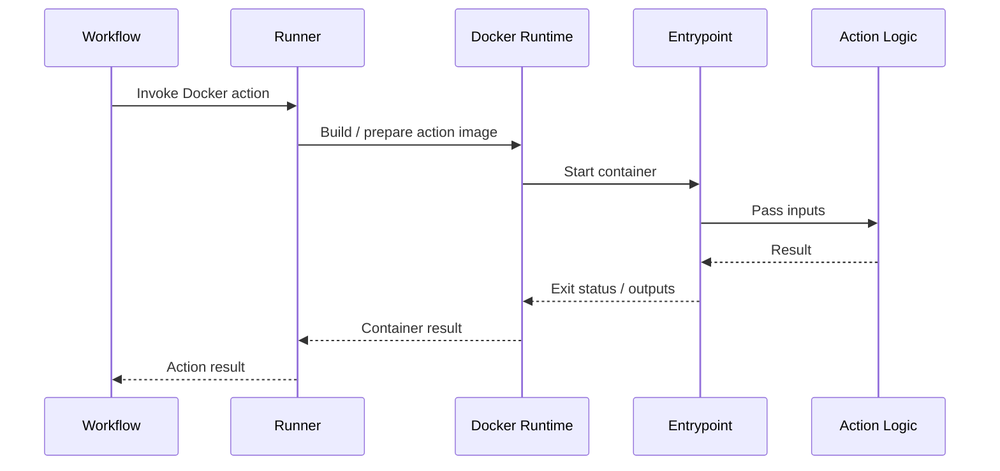
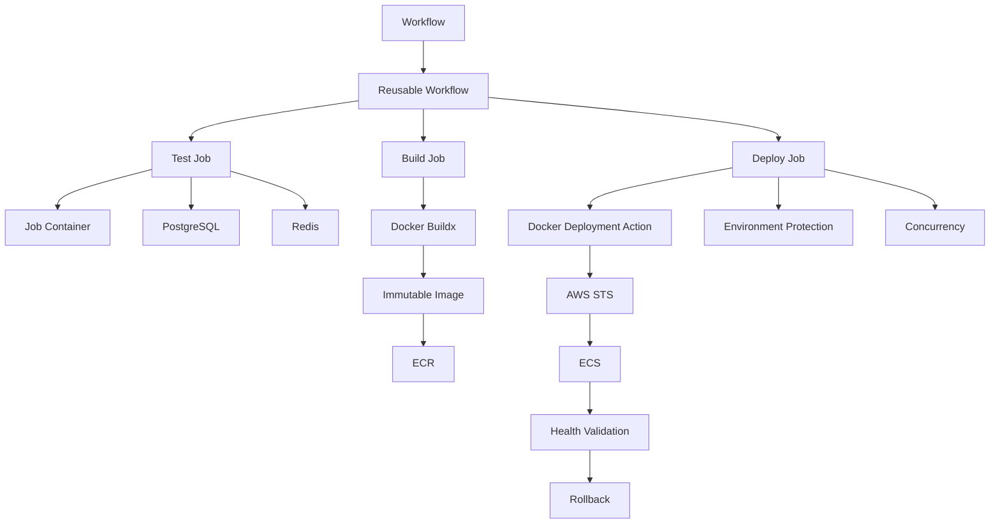

# 04- Docker Actions

## Overview

Docker actions package GitHub Actions logic inside a Docker container. They are useful when an action requires a controlled Linux runtime, system packages, specialized tooling, or dependencies that would be cumbersome to install directly on the GitHub Actions runner.

The execution model is:

```text
GitHub Workflow
      ↓
Job
      ↓
Docker Action
      ↓
Docker Image
      ↓
Entrypoint
      ↓
Action Logic
      ↓
Outputs / Exit Status
```

Docker actions are one of the three major custom action types:

| Action type | Execution model | Best suited for |
|---|---|---|
| Composite | Multiple workflow steps | Reusable setup and shell logic |
| JavaScript | Node.js runtime | API and programmatic logic |
| Docker | Container runtime | Specialized Linux runtime and dependencies |

A Docker action should solve a runtime or isolation problem. It should not be used merely because the action contains several commands.

## When to Use Docker Actions

Docker actions are useful when the action requires:

- A specific Linux distribution or userspace.
- System packages unavailable on the runner.
- A custom command-line toolchain.
- A language runtime not conveniently available on the runner.
- Consistent runtime dependencies.
- Isolation from the runner's installed software.

For example:

```text
GitHub Runner
     ↓
Docker Action
     ↓
Python Runtime
     ↓
Custom Security Scanner
     ↓
Scan Result
```

A composite action may be preferable when the same logic can be implemented directly with existing runner capabilities.

## Docker Action Architecture

A typical Docker action repository contains:

```text
security-scan-action/
├── action.yml
├── Dockerfile
├── entrypoint.sh
├── src/
├── tests/
├── README.md
└── .github/
    └── workflows/
        └── ci.yml
```

The important components are:

| Component | Responsibility |
|---|---|
| `action.yml` | Defines the action interface and Docker runtime |
| `Dockerfile` | Builds the action image |
| `entrypoint` | Starts the action logic |
| Application code | Implements the action |
| Tests | Validate behavior |
| README | Documents usage and requirements |

The basic relationship is:

```text
action.yml
    ↓
Dockerfile
    ↓
Docker Image
    ↓
Entrypoint
    ↓
Action Logic
```

## `action.yml`

A Docker action specifies:

```yaml
runs:
  using: "docker"
  image: "Dockerfile"
```

Example:

```yaml
name: "Security Scanner"
description: "Run a custom security scanner"

inputs:
  target:
    description: "Directory to scan"
    required: true

  severity:
    description: "Minimum severity"
    required: false
    default: "medium"

outputs:
  findings:
    description: "Number of findings"

runs:
  using: "docker"
  image: "Dockerfile"
  args:
    - ${{ inputs.target }}
    - ${{ inputs.severity }}
```

The `args` values are passed to the Docker action's entrypoint.

## Inputs

Inputs define the public interface of the Docker action.

Example:

```yaml
inputs:
  target:
    description: "Directory to scan"
    required: true

  severity:
    description: "Minimum severity"
    required: false
    default: "medium"
```

The workflow invokes the action:

```yaml
- name: Scan source code
  uses: company/security-scan@v1
  with:
    target: .
    severity: high
```

Inside the container, these values become arguments to the configured entrypoint.

## Input Design

Keep Docker action inputs focused on capabilities rather than implementation details.

Prefer:

```yaml
with:
  target: src
  severity: high
```

over:

```yaml
with:
  shell-command: ...
  temp-directory: ...
  internal-config: ...
  parser-mode: ...
```

The Docker image should own internal implementation choices unless consumers genuinely need to control them.

Good inputs should be:

- Explicit.
- Validated.
- Small in number.
- Stable.
- Documented.
- Safe by default.

## Dockerfile

A Docker action requires an image.

Example:

```dockerfile
FROM python:3.12-slim

WORKDIR /app

COPY requirements.txt .
RUN pip install --no-cache-dir -r requirements.txt

COPY src/ ./src/
COPY entrypoint.sh .

RUN chmod +x entrypoint.sh

ENTRYPOINT ["/app/entrypoint.sh"]
```

The Dockerfile should be treated as production software.

It determines:

- Runtime version.
- Operating system base.
- Installed packages.
- Application code.
- Entrypoint.
- Image size.
- Vulnerability surface.

## Entrypoint

The entrypoint receives the action arguments.

Example:

```bash
#!/usr/bin/env bash
set -euo pipefail

TARGET="${1:?target is required}"
SEVERITY="${2:-medium}"

python /app/src/scanner.py \
  --target "$TARGET" \
  --severity "$SEVERITY"
```

The important flow is:

```text
Workflow `with`
      ↓
action.yml inputs
      ↓
args
      ↓
Docker ENTRYPOINT
      ↓
Application arguments
```

Always quote variables when passing potentially variable values to commands.

## Argument Handling

If `action.yml` contains:

```yaml
args:
  - ${{ inputs.target }}
  - ${{ inputs.severity }}
```

the entrypoint receives those values as positional arguments.

For example:

```bash
TARGET="$1"
SEVERITY="$2"
```

Validate required arguments:

```bash
TARGET="${1:?target is required}"
SEVERITY="${2:-medium}"
```

Avoid blindly assuming that inputs are valid.

## Input Validation

Validation should happen before performing expensive or destructive operations.

Example:

```bash
case "$SEVERITY" in
  low|medium|high|critical)
    ;;
  *)
    echo "Invalid severity: $SEVERITY" >&2
    exit 1
    ;;
esac
```

For a target directory:

```bash
if [[ ! -d "$TARGET" ]]; then
  echo "Target directory does not exist: $TARGET" >&2
  exit 1
fi
```

Fail early when the action configuration is invalid.

## Environment Variables

Docker actions can consume environment variables supplied by the workflow.

Example:

```yaml
- name: Run scanner
  uses: company/security-scan@v1
  env:
    SCANNER_MODE: strict
  with:
    target: .
```

The entrypoint can access:

```bash
MODE="${SCANNER_MODE:-default}"
```

Use action inputs for explicit public configuration and environment variables for runtime configuration that is intentionally supplied by the workflow.

## Secrets

A Docker action can receive sensitive configuration through environment variables:

```yaml
- name: Security scan
  uses: company/security-scan@v1
  env:
    SECURITY_TOKEN: ${{ secrets.SECURITY_TOKEN }}
  with:
    target: .
```

The entrypoint can access:

```bash
TOKEN="${SECURITY_TOKEN:?SECURITY_TOKEN is required}"
```

Never print the token:

```bash
echo "$SECURITY_TOKEN"
```

Avoid passing secrets through command-line arguments where possible because process arguments may be easier to expose through diagnostics or process inspection.

Prefer environment-based secret handling when the underlying tool supports it.

## Docker Image Security

The Docker image becomes part of the CI/CD supply chain.

Review:

- Base image source.
- Base image version.
- OS packages.
- Language dependencies.
- Build scripts.
- Entrypoint.
- Network requirements.
- Runtime privileges.

Avoid unnecessarily broad images.

Prefer:

```dockerfile
FROM python:3.12-slim
```

over a large general-purpose image when the action only requires Python runtime functionality.

## Pinning Base Images

A moving image tag can change over time:

```dockerfile
FROM python:3.12-slim
```

An immutable digest provides stronger reproducibility:

```dockerfile
FROM python:3.12-slim@sha256:<digest>
```

The trade-off is maintenance overhead because digest updates must be managed deliberately.

For high-assurance environments, immutable image references can provide stronger supply-chain control.

## Dependency Management

Python dependencies should be explicitly managed.

Example:

```text
requirements.txt
```

```text
requests==2.x
boto3==1.x
```

Then:

```dockerfile
COPY requirements.txt .
RUN pip install --no-cache-dir -r requirements.txt
```

For production actions, dependency versions should be reviewed and updated regularly.

The same principle applies to:

- npm packages.
- OS packages.
- CLI tools.
- Build utilities.

## Multi-Stage Docker Builds

A Docker action may benefit from multi-stage builds when build-time dependencies are significantly larger than runtime dependencies.

Example:

```dockerfile
FROM python:3.12-slim AS builder

WORKDIR /build

COPY requirements.txt .
RUN pip install \
    --prefix=/install \
    --no-cache-dir \
    -r requirements.txt

FROM python:3.12-slim

WORKDIR /app

COPY --from=builder /install /usr/local
COPY src/ ./src/
COPY entrypoint.sh .

RUN chmod +x entrypoint.sh

ENTRYPOINT ["/app/entrypoint.sh"]
```

This can reduce the runtime image's unnecessary build tooling.

## Image Size

Docker action startup time can be influenced by image size.

Large images can cause:

- More data transfer.
- Longer startup.
- Higher storage consumption.
- Slower workflow execution.

Prefer:

- Slim base images where appropriate.
- Multi-stage builds.
- `--no-cache-dir` for package managers where applicable.
- Minimal OS packages.
- Removal of unnecessary build artifacts.

Do not optimize image size at the expense of maintainability or security.

## Docker Action Runtime

The execution model can be represented as:



The action therefore introduces a container execution boundary that does not exist in a normal JavaScript action.

## Filesystem Behavior

A Docker action executes against the GitHub Actions workspace exposed to the action.

The action may read repository files:

```bash
ls "$GITHUB_WORKSPACE"
```

For example:

```bash
python /app/src/scanner.py \
  --target "$GITHUB_WORKSPACE/src"
```

Do not assume that paths used inside the container correspond to arbitrary paths on the host runner.

Use GitHub-provided workspace information and explicitly document filesystem expectations.

## Working Directory

Set the working directory explicitly in the Dockerfile when appropriate:

```dockerfile
WORKDIR /app
```

This keeps internal application paths predictable.

However, the repository workspace and the image's application directory are separate concepts:

```text
Container
├── /app
│   └── Action implementation
│
└── $GITHUB_WORKSPACE
    └── Repository contents
```

This distinction matters when an action reads or modifies repository files.

## Container Networking

Docker actions may need network access to:

- GitHub APIs.
- AWS APIs.
- Package registries.
- External security scanners.
- Internal services.

Network requirements should be documented.

Avoid assuming unrestricted internal network access.

If an action needs access to a private network, the runner architecture becomes important.

```text
GitHub Actions
      ↓
Self-hosted Runner
      ↓
Private Network
      ↓
Internal Service
```

This is different from merely packaging the action inside Docker.

## Docker Actions and Private Networks

A Docker action does not automatically provide access to every private network resource.

For private systems, evaluate:

- Runner network connectivity.
- Firewall rules.
- DNS resolution.
- Proxy configuration.
- Container networking.
- Credential availability.
- TLS trust configuration.

A production architecture may require a self-hosted runner with controlled network access.

## Docker Actions and AWS

Docker actions can use AWS APIs when the workflow establishes credentials.

A preferred architecture is:

```text
GitHub Actions
      ↓
OIDC
      ↓
AWS STS
      ↓
IAM Role
      ↓
Temporary Credentials
      ↓
Docker Action
      ↓
AWS API
```

The workflow may configure:

```yaml
permissions:
  contents: read
  id-token: write
```

The action should consume temporary credentials without embedding long-lived AWS access keys in the Docker image.

## Docker Action for ECR Operations

A Docker action could encapsulate specialized image or deployment logic:

```text
Docker Action
      ↓
AWS SDK / CLI
      ↓
ECR
      ↓
Image Metadata
```

The workflow should still control:

- AWS role selection.
- Environment.
- Deployment sequencing.
- Concurrency.
- Approval.
- Promotion.

The action should not silently bypass environment protection or workflow-level deployment controls.

## Docker Actions and Python

A Docker action is useful when a Python tool requires dependencies that should not be installed directly on the runner.

Example:

```dockerfile
FROM python:3.12-slim

WORKDIR /app

COPY requirements.txt .
RUN pip install --no-cache-dir -r requirements.txt

COPY scanner.py .
COPY entrypoint.sh .

RUN chmod +x entrypoint.sh

ENTRYPOINT ["/app/entrypoint.sh"]
```

This gives the action a predictable Python environment regardless of unrelated packages installed on the runner.

## Docker Actions and Backend Applications

A Django or FastAPI project might invoke a Docker action for specialized validation:

```yaml
jobs:
  security:
    runs-on: ubuntu-latest

    steps:
      - uses: actions/checkout@v4

      - name: Run custom scanner
        uses: company/python-security-scan@v1
        with:
          target: .
```

The application workflow remains responsible for:

```text
Checkout
→ Dependency Setup
→ Tests
→ Security Scan
→ Build
```

The Docker action provides the scanning implementation.

## Containerized Backend Testing

Docker actions should not be confused with jobs running inside containers or service containers.

These are different mechanisms.

| Mechanism | Purpose |
|---|---|
| Docker action | Package custom action logic |
| Job container | Run an entire job inside a container |
| Service container | Provide supporting services such as PostgreSQL or Redis |
| Docker build step | Build application images |

A production integration test might use:

```text
GitHub Runner
   │
   ├── Job Container
   │      └── Python / pytest
   │
   ├── PostgreSQL Service
   │
   └── Redis Service
```

A Docker action could separately provide a reusable test utility or scanner.

## PostgreSQL and Redis

A workflow can provide backend dependencies as service containers:

```yaml
jobs:
  integration-test:
    runs-on: ubuntu-latest

    services:
      postgres:
        image: postgres:16
        env:
          POSTGRES_USER: test
          POSTGRES_PASSWORD: test
          POSTGRES_DB: app_test
        ports:
          - 5432:5432

      redis:
        image: redis:7
        ports:
          - 6379:6379

    steps:
      - uses: actions/checkout@v4

      - name: Run integration tests
        run: pytest tests/integration
```

The Docker action itself does not automatically become the service topology.

Keep infrastructure orchestration in the workflow.

## Health and Readiness

A production integration test should account for service readiness.

A container being started does not necessarily mean the application inside it is ready to accept connections.

For PostgreSQL, a health check can be used:

```yaml
services:
  postgres:
    image: postgres:16
    env:
      POSTGRES_USER: test
      POSTGRES_PASSWORD: test
      POSTGRES_DB: app_test
    options: >-
      --health-cmd "pg_isready -U test -d app_test"
      --health-interval 5s
      --health-timeout 5s
      --health-retries 10
```

This reduces race conditions between service startup and tests.

## Docker Action Outputs

Docker actions can expose outputs through the GitHub Actions output mechanism.

For example, the entrypoint can write:

```bash
echo "scan-status=passed" >> "$GITHUB_OUTPUT"
```

The action declares:

```yaml
outputs:
  scan-status:
    description: "Security scan status"
```

The workflow consumes:

```yaml
- name: Run scan
  id: scan
  uses: company/security-scan@v1
  with:
    target: .

- name: Display result
  run: echo "Status: ${{ steps.scan.outputs.scan-status }}"
```

Keep outputs compact.

For reports:

```text
Large report
    ↓
Artifact
```

rather than:

```text
Large report
    ↓
Workflow output
```

## Reports and Artifacts

A Docker action may generate a report:

```text
Scanner
   ↓
security-report.json
```

The workflow can upload it:

```yaml
- name: Run scanner
  uses: company/security-scan@v1
  with:
    target: .

- name: Upload security report
  uses: actions/upload-artifact@v4
  with:
    name: security-report
    path: security-report.json
```

This preserves the distinction:

```text
Output
→ Small control-plane value

Artifact
→ File or build/test result
```

## Docker Build Cache

The action image itself may be built or prepared as part of action execution, depending on the action distribution and runner environment.

For application Docker builds, Buildx caching is a separate concern:

```yaml
- name: Build image
  uses: docker/build-push-action@v6
  with:
    context: .
    push: true
    tags: |
      ${{ env.REGISTRY }}/${{ env.IMAGE }}:${{ github.sha }}
    cache-from: type=gha
    cache-to: type=gha,mode=max
```

Do not confuse:

```text
Docker build cache
```

with:

```text
GitHub Actions artifact
```

or:

```text
GitHub Actions dependency cache
```

They solve different problems.

## Docker Action Limitations

Docker actions have important limitations and trade-offs.

Compared with JavaScript actions, they introduce:

- Container startup overhead.
- Image build and maintenance.
- Larger dependency surface.
- Container filesystem considerations.
- Platform limitations.
- Additional security concerns.
- More complex debugging.

They are primarily intended for Linux-based execution.

If the action must support multiple operating systems, consider whether a composite or JavaScript action provides a better abstraction.

## Platform Compatibility

A Docker action's container model is more constrained than a JavaScript action running directly on the runner.

When designing the action, explicitly document:

- Supported runner operating systems.
- Required Docker capabilities.
- Filesystem assumptions.
- Network requirements.
- CPU architecture assumptions.
- Required kernel or system behavior.

Do not assume that behavior tested on one runner architecture automatically applies everywhere.

## Security Boundaries

A Docker action still executes with the permissions and access available to the job.

Containerization does not automatically make an action trusted.

The security model remains:

```text
Workflow Permissions
        ↓
Secrets
        ↓
Runner
        ↓
Docker Action
        ↓
External Systems
```

A malicious action can potentially misuse credentials or APIs made available to its job.

Therefore:

- Minimize `GITHUB_TOKEN` permissions.
- Do not expose secrets unnecessarily.
- Review the Dockerfile.
- Review dependencies.
- Scan images.
- Pin trusted dependencies where appropriate.
- Isolate sensitive deployment jobs.

## Untrusted Pull Requests

Do not expose privileged secrets to untrusted pull request code simply because the action executes inside a container.

For example:

```text
Fork PR
   ↓
Untrusted Code
   ↓
Workflow
   ↓
Docker Action
   ↓
Privileged Secret
```

This remains a security problem.

Docker isolation is not a substitute for workflow security boundaries.

Be especially cautious when using:

```yaml
pull_request_target
```

with workflows that execute code from the pull request.

## Third-Party Docker Actions

A third-party Docker action effectively supplies executable code and a container image to your CI/CD environment.

Review:

- Action repository.
- Dockerfile.
- Base image.
- Dependencies.
- Entrypoint.
- Required permissions.
- Secrets.
- Network access.
- Release history.
- Maintainer trust.
- Version reference.

Do not treat Marketplace availability as a security guarantee.

## Action Pinning

A consumer can reference:

```yaml
uses: company/security-scan@v1
```

or an immutable commit:

```yaml
uses: company/security-scan@<commit-sha>
```

For high-assurance environments, immutable references provide stronger protection against a mutable tag being changed unexpectedly.

The organization should establish a consistent policy for action pinning.

## Image Vulnerability Scanning

Docker action images should be scanned for vulnerabilities.

A production pipeline can include:

```text
Dockerfile
    ↓
Build
    ↓
Image Scan
    ↓
SBOM
    ↓
Release
```

Relevant concerns include:

- Base image vulnerabilities.
- OS package vulnerabilities.
- Python/npm dependency vulnerabilities.
- Unnecessary packages.
- Known CVEs.
- End-of-life components.

A scanner should produce actionable results rather than simply generating a report that nobody consumes.

## SBOM and Provenance

For higher-assurance supply chains, maintain information about what went into the action image.

A useful flow is:

```text
Source
  ↓
Dependencies
  ↓
Docker Build
  ↓
Image
  ↓
SBOM
  ↓
Provenance / Attestation
  ↓
Release
```

This helps establish:

- Which source produced the image.
- Which dependencies were included.
- Which build process generated it.
- Which version consumers should trust.

## Non-Root Containers

Where practical, run the action as a non-root user.

Example:

```dockerfile
FROM python:3.12-slim

WORKDIR /app

RUN useradd --create-home --shell /usr/sbin/nologin actionuser

COPY requirements.txt .
RUN pip install --no-cache-dir -r requirements.txt

COPY src/ ./src/
COPY entrypoint.sh .

RUN chmod +x entrypoint.sh \
    && chown -R actionuser:actionuser /app

USER actionuser

ENTRYPOINT ["/app/entrypoint.sh"]
```

Whether this works without modification depends on the files and operations the action performs.

Do not grant root privileges unless they are actually required.

## Persistent vs Ephemeral Runners

The runner architecture affects Docker action security.

Persistent self-hosted runner:

```text
Job A
 ↓
Docker Action
 ↓
Runner remains
 ↓
Job B
```

Ephemeral runner:

```text
Job
 ↓
Docker Action
 ↓
Runner destroyed
```

Ephemeral runners reduce the persistence of potentially compromised state.

This becomes particularly important when workflows execute untrusted code.

## Self-Hosted Runner Considerations

A self-hosted runner may have access to:

- Internal databases.
- Private APIs.
- Cloud credentials.
- Network segments.
- Internal package registries.

A Docker action running on that runner must therefore be treated as code executing inside a privileged infrastructure environment.

Containerization does not eliminate the risk of a compromised runner.

## Reliability

A production Docker action should be:

- Deterministic.
- Idempotent where possible.
- Explicit about failures.
- Safe to retry.
- Clear about external dependencies.
- Independent of unnecessary runner state.

Avoid relying on:

```text
Previous job state
Host-specific files
Unmanaged environment variables
Implicit installed software
```

## Performance

Docker actions introduce image-related overhead.

Performance can be influenced by:

- Image size.
- Dependency count.
- Image preparation.
- Startup time.
- Network downloads.
- External API calls.
- Scanning operations.

For an action executed thousands of times, reducing unnecessary image size and startup work can have a measurable CI cost impact.

## Cost

CI cost can be affected by:

- Runner execution time.
- Image preparation.
- Network transfer.
- External API calls.
- Repeated scans.
- Excessive dependency installation.

A large security scanner image that takes substantial time to initialize may be justified for a security-critical job, but unnecessary overhead should be measured.

## High Availability and External Dependencies

Docker actions that call external systems should account for:

- Network failures.
- DNS failures.
- API outages.
- Rate limits.
- Timeouts.
- Authentication failures.
- Partial operations.

Use bounded retries where the operation is safe to retry.

Do not retry destructive or non-idempotent operations blindly.

## Disaster Recovery

The action itself should be reproducible from source.

Maintain:

```text
Source
Dockerfile
Dependencies
Build configuration
Release version
```

A recovery process should allow the organization to rebuild a known action version if a registry or artifact is unavailable.

For critical internal actions, preserve:

- Source history.
- Released versions.
- Immutable image references.
- Build provenance.
- SBOMs where required.

## Production Deployment Architecture

A Docker action can participate in a larger production deployment pipeline:

```mermaid
flowchart LR
    A[Pull Request] --> B[Lint]
    B --> C[Unit Tests]
    C --> D[Integration Tests]
    D --> E[Security Scan]
    E --> F[Build]
    F --> G[Docker Image]
    G --> H[ECR]
    H --> I[Staging]
    I --> J[Approval]
    J --> K[Production]
    K --> L[Monitoring]
    L --> M[Rollback]
```



A Docker action should implement one reusable capability inside this architecture rather than becoming the entire deployment system.

## Immutable Application Images

Production pipelines should build an application image once:

```text
Source
  ↓
Docker Build
  ↓
Image
  ↓
Immutable Tag
  ↓
ECR
  ↓
Staging
  ↓
Production
```

For example:

```yaml
tags: |
  ${{ env.REGISTRY }}/${{ env.IMAGE }}:${{ github.sha }}
```

The commit SHA provides an immutable application identity when the registry and deployment process preserve that reference.

Avoid rebuilding the application independently for production after staging validation.

## Docker Action for Deployment

A Docker action can encapsulate a deployment API call:

```yaml
- name: Deploy application
  uses: company/ecs-deploy@v1
  with:
    cluster: production
    service: backend-api
    image-tag: ${{ github.sha }}
```

The workflow should still control:

- Environment.
- Approval.
- Concurrency.
- IAM authentication.
- Deployment sequencing.
- Health validation.
- Rollback policy.

## Rolling, Blue-Green, and Canary Deployments

A Docker action may invoke a deployment mechanism, but the deployment architecture determines the actual rollout strategy.

### Rolling

```text
Old Tasks
 ↓
Replace subset
 ↓
Health Check
 ↓
Replace more
 ↓
Complete
```

### Blue-Green

```text
Blue → Current
Green → New
       ↓
Health Validation
       ↓
Traffic Switch
```

### Canary

```text
Production
    ↓
Small Traffic Percentage
    ↓
Health / Metrics
    ↓
Increase Traffic
    ↓
Full Rollout
```

The action should report deployment state accurately rather than treating the API request's acceptance as proof that the deployment succeeded.

## Health Validation

A deployment action should distinguish:

```text
Deployment Requested
```

from:

```text
Deployment Healthy
```

For example:

```text
Action
  ↓
Start Deployment
  ↓
Poll Deployment State
  ↓
Healthy?
 ┌───────┴───────┐
Yes             No
 ↓               ↓
Success        Failure
```

Use bounded polling and clear timeout behavior.

## Rollback

A production deployment action should define what happens after failure.

Possible strategies include:

- Restore the previous immutable image.
- Revert service configuration.
- Shift traffic back to the previous environment.
- Invoke the platform's native rollback mechanism.

For example:

```text
Production Deployment
        ↓
Health Check
        ↓
Failure
        ↓
Rollback Previous Image
        ↓
Health Check
        ↓
Incident Signal
```

Rollback should itself be tested.

## Testing Docker Actions

A Docker action should be tested at multiple levels:

```text
Dockerfile
   ↓
Image Build
   ↓
Entrypoint Test
   ↓
Action Integration Test
   ↓
Representative Consumer Workflow
```

Test:

- Required inputs.
- Default inputs.
- Invalid inputs.
- Exit codes.
- Outputs.
- Filesystem access.
- Network behavior.
- Secrets handling.
- External API failures.
- Image startup.
- Dependency failures.

## Local Docker Testing

Build the action image:

```bash
docker build -t local-security-action .
```

Run it:

```bash
docker run --rm \
  -v "$PWD:/workspace" \
  local-security-action \
  /workspace/src
```

The exact invocation depends on the action's entrypoint and required environment variables.

Local testing is useful for debugging image and application behavior before testing the action through GitHub Actions.

## Action CI Workflow

A Docker action repository should validate its own image:

```yaml
name: Docker Action CI

on:
  pull_request:
  push:
    branches:
      - main

permissions:
  contents: read

jobs:
  test:
    runs-on: ubuntu-latest

    steps:
      - uses: actions/checkout@v4

      - name: Build action image
        run: docker build -t test-action .

      - name: Run image smoke test
        run: |
          docker run --rm \
            test-action \
            /workspace
```

For a real action, the integration workflow should invoke the action using:

```yaml
uses: ./
```

so that `action.yml` and the actual GitHub Actions execution path are tested.

## Troubleshooting

Use the standard model:

```text
Symptom
   ↓
Possible Causes
   ↓
Isolation Strategy
   ↓
Commands / Checks
   ↓
Root Cause
   ↓
Corrective Action
   ↓
Prevention
```

### Docker Action Is Not Found

Check:

- `action.yml` location.
- Action reference.
- Repository checkout.
- Version or tag.
- `runs.using`.
- Dockerfile path.

Expected:

```yaml
runs:
  using: docker
  image: Dockerfile
```

### Dockerfile Build Fails

Check:

```bash
docker build -t test-action .
```

Inspect:

- Base image availability.
- Package manager commands.
- Dependency versions.
- Build context.
- `COPY` paths.
- File permissions.

### Entrypoint Cannot Be Executed

Common causes:

- Incorrect path.
- Missing executable permission.
- Invalid shebang.
- Windows line endings.
- Missing interpreter.

Check:

```bash
ls -l entrypoint.sh
file entrypoint.sh
```

Ensure:

```dockerfile
RUN chmod +x entrypoint.sh
```

and:

```bash
#!/usr/bin/env bash
```

are consistent with the image.

### Input Is Empty

Trace:

```text
Workflow `with`
   ↓
action.yml
   ↓
args
   ↓
Entrypoint arguments
```

Verify the order of `args`:

```yaml
args:
  - ${{ inputs.target }}
  - ${{ inputs.severity }}
```

matches:

```bash
TARGET="$1"
SEVERITY="$2"
```

### Output Is Missing

Verify the action writes to the supported output mechanism:

```bash
echo "scan-status=passed" >> "$GITHUB_OUTPUT"
```

Then verify the workflow step has an ID:

```yaml
- id: scan
  uses: company/security-scan@v1
```

and references:

```yaml
${{ steps.scan.outputs.scan-status }}
```

### Works Locally but Fails in GitHub Actions

Compare:

- Environment variables.
- Workspace path.
- User permissions.
- Runner OS.
- Network.
- Authentication.
- Mounted workspace.
- GitHub Actions runtime behavior.

Local Docker execution does not perfectly reproduce the GitHub Actions execution environment.

### Cannot Reach Private Service

Check:

```text
Runner network
   ↓
DNS
   ↓
Firewall
   ↓
Container network
   ↓
Service
```

If the GitHub-hosted runner cannot reach the private service, packaging the action inside Docker does not solve the network boundary.

### AWS Authentication Fails

Check:

```text
permissions:
  id-token: write
```

Then verify:

- AWS IAM trust policy.
- Repository/branch conditions.
- Audience.
- Role ARN.
- OIDC configuration.
- Temporary credential availability.

Do not replace OIDC with long-lived access keys merely to bypass an authentication configuration problem.

### Action Is Slow

Measure:

```text
Image startup
Dependency initialization
Scanning
API requests
Polling
External network calls
```

Then optimize the actual bottleneck.

Do not assume image size is always the primary cause.

## GitHub CLI Diagnostics

List workflow runs:

```bash
gh run list
```

Inspect a run:

```bash
gh run view <run-id>
```

View logs:

```bash
gh run view <run-id> --log
```

Rerun a corrected workflow:

```bash
gh run rerun <run-id>
```

For artifact inspection:

```bash
gh run download <run-id>
```

These commands help determine whether a failure occurs in:

```text
Workflow
   ↓
Action Invocation
   ↓
Docker Runtime
   ↓
Entrypoint
   ↓
External Dependency
```

## Common Mistakes

### Using Docker When Composite Is Enough

If the action only runs:

```text
setup
→ install
→ execute
```

and all dependencies are already supported by the runner, a composite action may be simpler.

### Using a Large Base Image

Large images increase startup and maintenance costs.

Prefer the smallest maintainable image that provides the required runtime.

### Running as Root Without Need

Root privileges increase the impact of an action compromise.

Use a non-root user when practical.

### Embedding Credentials in the Image

Never put:

```dockerfile
ENV AWS_ACCESS_KEY_ID=...
```

or credentials in source files.

Credentials should be injected at runtime.

### Logging Secrets

Avoid printing sensitive environment variables or command arguments.

### Ignoring Image Vulnerabilities

The Dockerfile is part of the software supply chain.

Scan and update base images and dependencies.

### Assuming Docker Provides Complete Isolation

The action still runs under the permissions and runner security boundary of the workflow.

### Ignoring Architecture Compatibility

An image built for one CPU architecture may not behave as expected on another runner architecture.

### Treating Container Startup as Deployment Success

A deployment request being accepted does not prove that the application is healthy.

Perform health validation.

## Docker Action vs Other Custom Actions

| Characteristic | Composite | JavaScript | Docker |
|---|---:|---:|---:|
| Simple shell automation | Excellent | Good | Good |
| Existing GitHub actions | Excellent | Limited | Limited |
| GitHub API integration | Limited | Excellent | Possible |
| Custom runtime | Limited | Node.js | Excellent |
| System packages | Runner-dependent | Runner-dependent | Excellent |
| Startup overhead | Low | Low | Higher |
| Cross-platform support | Good | Good | More limited |
| Containerized dependencies | No | No | Yes |
| Runtime isolation | Low | Low | Higher |
| Operational complexity | Low | Medium | Higher |

Use the simplest action type that satisfies the requirement.

## Docker Action vs Job Container

These are often confused.

### Docker Action

```text
Job
 ├── Checkout
 ├── Docker Action
 └── Test
```

The Docker container is used specifically to execute the action.

### Job Container

```yaml
jobs:
  test:
    runs-on: ubuntu-latest
    container:
      image: python:3.12
```

The entire job runs inside the container.

Use a job container when the whole job requires a controlled runtime.

Use a Docker action when only one reusable operation needs that runtime.

## Docker Action vs Service Container

A service container provides supporting infrastructure:

```text
Test Job
   ├── PostgreSQL Service
   └── Redis Service
```

A Docker action provides reusable execution logic:

```text
Test Job
   └── Security Scan Docker Action
```

They solve different problems.

## Production Architecture

A mature CI/CD platform can combine all these mechanisms:



This separation provides clear boundaries:

```text
Reusable Workflow
→ Pipeline orchestration

Job Container
→ Job runtime

Service Container
→ Test infrastructure

Docker Action
→ Reusable specialized operation

Docker Image
→ Application artifact

AWS
→ Deployment platform
```

## Production Checklist

Before publishing a Docker action:

- [ ] `action.yml` clearly defines the action interface.
- [ ] `runs.using` is correctly configured.
- [ ] Dockerfile is reproducible.
- [ ] Inputs are validated.
- [ ] Required arguments are checked.
- [ ] Entrypoint has correct permissions.
- [ ] Shell behavior is explicit.
- [ ] Secrets are injected securely.
- [ ] Secrets are never logged.
- [ ] Base image is trusted.
- [ ] Dependencies are reviewed.
- [ ] Image vulnerabilities are scanned.
- [ ] Image size is reasonable.
- [ ] Container does not require unnecessary root privileges.
- [ ] Runner compatibility is documented.
- [ ] Network requirements are documented.
- [ ] Outputs use supported workflow mechanisms.
- [ ] Large reports use artifacts.
- [ ] Failure codes are preserved.
- [ ] External API failures are handled.
- [ ] Retries are bounded and intentional.
- [ ] Mutation operations are idempotent where practical.
- [ ] Unit and integration tests exist.
- [ ] The packaged action is tested through GitHub Actions.
- [ ] Versioning is documented.
- [ ] Consumer workflows are tested before release.

## Interview Scenarios

### Choose Between Composite and Docker Action

A security scanner requires several Linux packages and a custom runtime.

Discuss:

- Composite action limitations.
- Docker runtime consistency.
- Image maintenance.
- Startup overhead.
- Vulnerability scanning.
- Versioning.

### Design a Docker Action for AWS Deployment

Design an action that deploys an immutable image to ECS.

Discuss:

```text
GitHub Actions
      ↓
OIDC
      ↓
AWS STS
      ↓
IAM Role
      ↓
ECS
      ↓
Health Validation
      ↓
Rollback
```

Also consider:

- IAM least privilege.
- Deployment concurrency.
- Immutable image tags.
- Environment protection.
- Idempotency.
- Failure handling.

### Secure a Third-Party Docker Action

A team wants to use a Marketplace Docker action that requires repository write access and cloud credentials.

Evaluate:

- Why those permissions are required.
- Whether they can be reduced.
- Dockerfile trust.
- Base image.
- Dependencies.
- Action version.
- SHA pinning.
- Runner isolation.
- Secret exposure.

### Docker Action Cannot Reach a Private Database

A self-hosted runner can reach PostgreSQL, but the Docker action cannot.

Debug:

```text
Runner
 ↓
DNS
 ↓
Network route
 ↓
Container network
 ↓
Firewall
 ↓
PostgreSQL
```

Determine whether the issue is:

- DNS.
- Routing.
- Firewall.
- Container networking.
- Credentials.
- TLS.
- PostgreSQL access rules.

### Deployment Action Reports Success but Application Is Down

Separate:

```text
Deployment API accepted request
```

from:

```text
Application is healthy
```

Design:

```text
Deploy
 ↓
Wait
 ↓
Health Check
 ↓
Metrics
 ↓
Success / Rollback
```

### Optimize an Expensive Docker Action

An action takes several minutes to execute.

Investigate:

- Image size.
- Dependency installation.
- Startup time.
- Network downloads.
- External API calls.
- Repeated scanning.
- Polling interval.
- Runner capacity.

Optimize based on measured bottlenecks rather than assumptions.

## Key Takeaways

- Docker actions package reusable CI/CD logic inside a container and are most appropriate when a controlled Linux runtime, system dependencies, or specialized tooling is required.
- `action.yml`, the Dockerfile, entrypoint, inputs, outputs, and container runtime form the core Docker action execution model.
- Containerization does not replace workflow security: minimize permissions, protect secrets, review dependencies, scan images, and treat Docker actions as executable supply-chain dependencies.
- Keep Docker actions focused on reusable operations while workflows remain responsible for orchestration, environments, approvals, concurrency, artifact promotion, and rollback.
- Production Docker actions should be deterministic, testable, versioned, observable, reasonably small, secure by default, and designed for failures in runners, networks, APIs, deployments, and external systems.