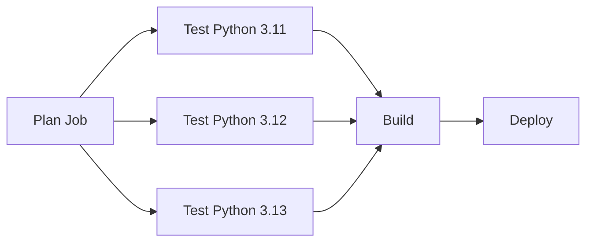
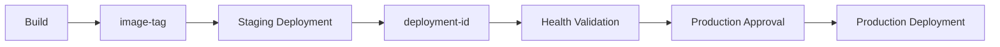

# 05- Action Inputs and Outputs

## Overview

Inputs and outputs define the public interface of a GitHub Action. They allow an action to accept configuration from a workflow and return structured results that subsequent steps or jobs can consume.

For custom actions, the core data flow is:

```text
Workflow
   ↓
with:
   ↓
Action Inputs
   ↓
Action Logic
   ↓
Action Outputs
   ↓
steps.<id>.outputs.*
   ↓
Job Outputs
   ↓
needs.<job>.outputs.*
```

A well-designed action treats inputs and outputs as an API contract. The implementation can evolve internally without forcing every consuming workflow to change.

This is especially important for reusable CI/CD platforms where the same action may be consumed by many repositories.

## Action Interface

A custom action normally exposes its interface through `action.yml`.

Example:

```yaml
name: "Python Quality Check"
description: "Run linting and quality checks"

inputs:
  python-version:
    description: "Python version used by the action"
    required: false
    default: "3.12"

  target:
    description: "Directory containing the application"
    required: false
    default: "."

  fail-on-warning:
    description: "Fail when warnings are detected"
    required: false
    default: "false"

outputs:
  status:
    description: "Overall quality-check status"

  warning-count:
    description: "Number of warnings detected"

runs:
  using: "composite"
  steps:
    - name: Run quality checks
      shell: bash
      run: ./scripts/check.sh
```

The workflow consumes the action:

```yaml
- name: Run quality checks
  id: quality
  uses: company/python-quality-action@v1
  with:
    python-version: "3.12"
    target: backend
    fail-on-warning: "true"
```

Inputs configure behavior. Outputs communicate results.

## Why Inputs and Outputs Matter

Without explicit interfaces, actions become tightly coupled to their internal implementation.

A good interface provides:

- Predictable configuration.
- Validation boundaries.
- Reusability.
- Versioning stability.
- Easier testing.
- Better documentation.
- Clear data flow between workflow components.

The design principle is similar to a backend API:

```text
HTTP API
    Request → Service → Response

GitHub Action
    Input   → Action  → Output
```

Changing internal implementation should not unnecessarily break consumers.

## Inputs

Inputs are values supplied by the workflow to an action.

Example:

```yaml
- name: Deploy
  uses: company/deploy-action@v1
  with:
    environment: staging
    image-tag: ${{ github.sha }}
```

The action declares:

```yaml
inputs:
  environment:
    description: "Deployment environment"
    required: true

  image-tag:
    description: "Immutable image tag"
    required: true
```

Inputs are appropriate for explicit action configuration.

## Required Inputs

Use `required: true` when the action cannot operate safely without the value.

Example:

```yaml
inputs:
  environment:
    description: "Deployment environment"
    required: true
```

A deployment action should generally reject an undefined environment instead of silently choosing a default.

Good:

```text
Missing environment
       ↓
Action fails
       ↓
No deployment
```

Dangerous:

```text
Missing environment
       ↓
Implicit production
       ↓
Unexpected deployment
```

## Optional Inputs

Optional inputs should have safe defaults when possible.

```yaml
inputs:
  timeout:
    description: "Deployment timeout in seconds"
    required: false
    default: "300"
```

The action can use:

```bash
TIMEOUT="${INPUT_TIMEOUT:-300}"
```

The exact environment-variable behavior depends on the action type, but action implementations should explicitly handle defaults rather than relying on implicit assumptions.

## Input Types

Action inputs are fundamentally passed as strings.

For example:

```yaml
with:
  retries: 3
  dry-run: true
```

should be treated as string-like action input values and validated or converted by the action.

Do not assume that an input automatically behaves like a native Boolean or integer in the action implementation.

Example:

```bash
RETRIES="${INPUT_RETRIES:-3}"

if ! [[ "$RETRIES" =~ ^[0-9]+$ ]]; then
  echo "retries must be an integer" >&2
  exit 1
fi
```

## Boolean Inputs

A common pattern is:

```yaml
inputs:
  dry-run:
    description: "Do not modify infrastructure"
    required: false
    default: "false"
```

Validate explicitly:

```bash
case "$INPUT_DRY_RUN" in
  true|false)
    ;;
  *)
    echo "dry-run must be true or false" >&2
    exit 1
    ;;
esac
```

Do not rely on shell truthiness.

For example, this can be misleading:

```bash
if [[ "$INPUT_DRY_RUN" ]]; then
  ...
fi
```

The string `"false"` is still non-empty.

## Enumerated Inputs

If an input has a finite set of supported values, validate it.

Example:

```yaml
inputs:
  deployment-strategy:
    description: "Deployment strategy"
    required: false
    default: "rolling"
```

Validation:

```bash
case "$INPUT_DEPLOYMENT_STRATEGY" in
  rolling|blue-green|canary)
    ;;
  *)
    echo "Unsupported deployment strategy" >&2
    exit 1
    ;;
esac
```

This prevents invalid configuration from reaching downstream systems.

## Input Validation

Validation should happen close to the action boundary.

```text
Workflow
   ↓
Input
   ↓
Validation
   ↓
Business Logic
   ↓
External System
```

Do not allow malformed input to reach:

- AWS APIs.
- Docker commands.
- Shell commands.
- Kubernetes APIs.
- Deployment systems.
- Filesystem operations.

Validation should cover:

- Required values.
- Allowed values.
- Numeric ranges.
- File paths.
- URLs.
- Resource identifiers.
- Environment names.
- Configuration formats.

## Path Inputs

For an action that operates on a repository path:

```yaml
inputs:
  target:
    description: "Directory to process"
    required: true
```

Validate:

```bash
TARGET="${INPUT_TARGET:?target is required}"

if [[ ! -d "$TARGET" ]]; then
  echo "Directory does not exist: $TARGET" >&2
  exit 1
fi
```

Avoid constructing shell commands by blindly concatenating user-controlled values.

## Shell Injection Risk

GitHub Actions inputs can ultimately originate from workflow expressions, event payloads, or manual inputs.

Unsafe:

```yaml
- name: Process input
  run: |
    ./deploy.sh "${{ github.event.pull_request.title }}"
```

The value is being inserted directly into a shell script.

A safer pattern is to pass the value through an environment variable:

```yaml
- name: Process input
  env:
    PR_TITLE: ${{ github.event.pull_request.title }}
  run: |
    python scripts/process.py "$PR_TITLE"
```

The application should still validate the value.

The principle is:

```text
Untrusted GitHub Data
        ↓
Explicit Data Boundary
        ↓
Validation
        ↓
Safe Processing
```

## Secrets as Inputs

Avoid designing actions that require secrets as ordinary command-line inputs.

Prefer:

```yaml
- name: Deploy
  uses: company/deploy-action@v1
  env:
    AWS_ROLE_ARN: ${{ secrets.AWS_ROLE_ARN }}
```

or the appropriate supported secret mechanism for the action.

Never log:

```bash
echo "$INPUT_TOKEN"
```

or:

```bash
set -x
```

around commands containing secrets.

## Inputs and Environment Variables

Inputs and environment variables solve different problems.

| Mechanism | Purpose |
|---|---|
| Action input | Public action configuration |
| Environment variable | Runtime environment/configuration |
| Secret | Sensitive configuration |
| Repository/org/environment variable | Repository/platform configuration |

For example:

```yaml
with:
  environment: staging
```

is clearer as an action input than:

```yaml
env:
  DEPLOY_ENVIRONMENT: staging
```

when `environment` is part of the action's public API.

## JavaScript Actions

JavaScript actions commonly use `@actions/core` to read inputs.

Example:

```javascript
const core = require("@actions/core");

const environment = core.getInput("environment", {
  required: true,
});

const dryRun = core.getBooleanInput("dry-run");
```

For an action declared as:

```yaml
inputs:
  environment:
    description: "Deployment environment"
    required: true

  dry-run:
    description: "Run without making changes"
    required: false
    default: "false"
```

The implementation can validate and convert values centrally.

## JavaScript Outputs

JavaScript actions can publish outputs using `@actions/core`:

```javascript
const core = require("@actions/core");

core.setOutput("status", "success");
core.setOutput("deployment-id", deploymentId);
```

The consuming workflow uses:

```yaml
- name: Deploy
  id: deploy
  uses: company/deploy-action@v1
  with:
    environment: staging

- name: Show deployment
  run: |
    echo "Status: ${{ steps.deploy.outputs.status }}"
    echo "Deployment: ${{ steps.deploy.outputs.deployment-id }}"
```

The step ID is part of the output reference.

## Composite Actions

Composite actions define inputs in `action.yml` and consume them through generated `INPUT_*` environment variables or explicit workflow expressions.

Example:

```yaml
inputs:
  python-version:
    description: "Python version"
    required: false
    default: "3.12"
```

A composite action can use:

```yaml
steps:
  - name: Display version
    shell: bash
    run: |
      echo "Python version: ${{ inputs.python-version }}"
```

Composite actions are useful for packaging reusable step sequences within a job.

## Docker Actions

Docker actions receive inputs through their configured arguments or environment mechanisms.

Example:

```yaml
runs:
  using: docker
  image: Dockerfile
  args:
    - ${{ inputs.target }}
    - ${{ inputs.severity }}
```

The entrypoint can consume:

```bash
TARGET="${1:?target is required}"
SEVERITY="${2:-medium}"
```

The action interface remains:

```text
Workflow
   ↓
action.yml
   ↓
Input
   ↓
Docker argument
   ↓
Entrypoint
```

## Outputs

Outputs communicate action results to the workflow.

Examples:

```text
status
deployment-id
image-tag
artifact-name
environment-url
warning-count
```

Outputs should represent useful control-plane information.

Good:

```yaml
outputs:
  deployment-id:
    description: "Deployment identifier"
```

Less appropriate:

```yaml
outputs:
  entire-log-file:
    description: "Complete deployment log"
```

Large data should generally be stored as an artifact rather than passed as an output.

## Output Contract

Treat outputs as an API contract.

For each output define:

- Name.
- Meaning.
- Format.
- Possible values.
- Failure behavior.
- Stability expectations.

Example:

```yaml
outputs:
  status:
    description: "Deployment status: success or failed"

  deployment-id:
    description: "Identifier returned by the deployment platform"
```

Consumers should not need to understand how the action internally calculates these values.

## Step Outputs

An action output is accessed through the ID of the action step.

```yaml
steps:
  - name: Build
    id: build
    uses: company/build-action@v1

  - name: Publish metadata
    run: |
      echo "Image: ${{ steps.build.outputs.image-tag }}"
```

The data flow is:

```text
Action
  ↓
Output
  ↓
Step ID
  ↓
steps.<id>.outputs.<name>
```

A missing step ID is a common reason for output references to fail.

## `$GITHUB_OUTPUT`

Shell-based steps can publish outputs using the supported `$GITHUB_OUTPUT` mechanism.

Example:

```yaml
- name: Determine image tag
  id: metadata
  shell: bash
  run: |
    IMAGE_TAG="${GITHUB_SHA}"
    echo "image-tag=$IMAGE_TAG" >> "$GITHUB_OUTPUT"
```

Consume it:

```yaml
- name: Build image
  run: |
    docker build \
      -t "backend:${{ steps.metadata.outputs.image-tag }}" .
```

Use `$GITHUB_OUTPUT` instead of deprecated workflow command patterns.

## Multiline Outputs

When an output contains multiline content, use the supported multiline syntax carefully.

Example:

```bash
{
  echo 'report<<EOF'
  cat report.txt
  echo 'EOF'
} >> "$GITHUB_OUTPUT"
```

However, large structured content should generally be represented as a file artifact instead of a large workflow output.

## Job Outputs

Job outputs allow one job to expose data to dependent jobs.

Example:

```yaml
jobs:
  build:
    runs-on: ubuntu-latest

    outputs:
      image-tag: ${{ steps.metadata.outputs.image-tag }}

    steps:
      - name: Generate metadata
        id: metadata
        run: |
          echo "image-tag=${GITHUB_SHA}" >> "$GITHUB_OUTPUT"

  deploy:
    needs: build
    runs-on: ubuntu-latest

    steps:
      - name: Deploy
        run: |
          echo "Deploying ${{ needs.build.outputs.image-tag }}"
```

The flow is:

```text
Step Output
    ↓
Job Output
    ↓
needs.<job>.outputs.<output>
```

## Fan-Out and Fan-In

Outputs become especially useful in dependency graphs.



A planning job may produce structured data that controls downstream execution.

## Structured JSON Outputs

JSON is useful when multiple related values need to cross a job boundary.

Example:

```bash
CONFIG='{"service":"backend-api","environment":"staging","region":"ap-south-1"}'

{
  echo 'deployment-config<<EOF'
  echo "$CONFIG"
  echo 'EOF'
} >> "$GITHUB_OUTPUT"
```

The downstream job can parse the value with `fromJSON()`:

```yaml
strategy:
  matrix: ${{ fromJSON(needs.plan.outputs.matrix) }}
```

This supports dynamic workflow behavior without hardcoding every combination.

## Dynamic Matrices

A planning job can generate a matrix:

```yaml
jobs:
  plan:
    runs-on: ubuntu-latest

    outputs:
      matrix: ${{ steps.matrix.outputs.matrix }}

    steps:
      - id: matrix
        shell: bash
        run: |
          echo 'matrix={"python":["3.11","3.12","3.13"]}' >> "$GITHUB_OUTPUT"

  test:
    needs: plan
    runs-on: ubuntu-latest

    strategy:
      matrix: ${{ fromJSON(needs.plan.outputs.matrix) }}

    steps:
      - name: Test
        run: python --version
```

The architecture becomes:

```text
Planning
   ↓
JSON Output
   ↓
fromJSON()
   ↓
Dynamic Matrix
   ↓
Parallel Jobs
```

This is useful for monorepos and systems where test targets are determined dynamically.

## Matrix Outputs

Matrix workflows require additional care when outputs represent results from multiple parallel executions.

Instead of attempting to store large result sets in outputs, consider:

```text
Matrix Job
   ↓
Per-job Result
   ↓
Artifact
   ↓
Aggregation Job
```

For small metadata, outputs can be appropriate.

For detailed reports, artifacts provide a better boundary.

## Outputs and Artifacts

Outputs and artifacts have different purposes.

| Feature | Outputs | Artifacts |
|---|---|---|
| Primary purpose | Control/data flow | File storage |
| Typical size | Small | Larger |
| Consumption | Expressions | Download |
| Example | Image tag | Test report |
| Cross-job use | Yes | Yes |
| Suitable for logs | Limited | Yes |
| Suitable for binaries | No | Yes |

Use an output for:

```text
image-tag=abc123
```

Use an artifact for:

```text
coverage.xml
security-report.json
application.tar.gz
```

## Outputs vs Caches

Caches are not a data-passing mechanism.

Use outputs for:

```text
What should the next job do?
```

Use artifacts for:

```text
What file should the next job receive?
```

Use caches for:

```text
What reusable dependency data can accelerate future executions?
```

Example:

```text
Output
→ Docker image tag

Artifact
→ Test report

Cache
→ Python package cache
```

## Outputs and Environment Variables

Environment variables generally operate within the workflow execution environment.

Outputs explicitly communicate values through the GitHub Actions dependency model.

For example:

```yaml
echo "IMAGE_TAG=$GITHUB_SHA" >> "$GITHUB_ENV"
```

updates environment state for subsequent steps in the same job.

By contrast:

```yaml
echo "image-tag=$GITHUB_SHA" >> "$GITHUB_OUTPUT"
```

creates a step output that can be referenced as:

```yaml
${{ steps.metadata.outputs.image-tag }}
```

For cross-job communication, use job outputs.

## Reusable Workflow Outputs

Reusable workflows can expose outputs to their callers.

A reusable workflow can define:

```yaml
on:
  workflow_call:
    outputs:
      image-tag:
        description: "Built image tag"
        value: ${{ jobs.build.outputs.image-tag }}
```

The caller can consume the result:

```yaml
jobs:
  build:
    uses: company/platform-workflows/.github/workflows/build.yml@v1

  deploy:
    needs: build
    runs-on: ubuntu-latest
    steps:
      - run: echo "${{ needs.build.outputs.image-tag }}"
```

The data flow is:

```text
Step Output
    ↓
Job Output
    ↓
Reusable Workflow Output
    ↓
Caller Job Output
```

## Outputs and Reusable Workflow Design

Reusable workflow outputs should expose stable business-level information.

Prefer:

```text
image-tag
artifact-name
deployment-id
```

over exposing internal implementation details such as:

```text
temporary-shell-variable
internal-directory
implementation-specific-cache-key
```

The reusable workflow should behave like a platform API.

## Output Naming

Use names that communicate meaning.

Good:

```yaml
outputs:
  image-tag:
  deployment-id:
  artifact-name:
  environment-url:
```

Avoid ambiguous names:

```yaml
outputs:
  value:
  result:
  data:
  output:
```

Explicit names reduce integration mistakes.

## Output Validation

If an output is consumed by deployment logic, validate it before using it.

For example:

```yaml
- name: Validate image tag
  env:
    IMAGE_TAG: ${{ needs.build.outputs.image-tag }}
  run: |
    if [[ -z "$IMAGE_TAG" ]]; then
      echo "image-tag is empty" >&2
      exit 1
    fi
```

A missing output should stop a deployment rather than silently producing an invalid deployment request.

## Output Security

Never intentionally expose secrets through outputs.

Avoid:

```bash
echo "token=$TOKEN" >> "$GITHUB_OUTPUT"
```

Even if GitHub attempts to mask secrets, designing outputs around sensitive values creates unnecessary exposure risk.

Prefer returning identifiers or statuses:

```text
deployment-id
status
image-tag
```

instead of credentials.

## Untrusted Data in Outputs

Outputs can contain data originating from untrusted sources.

For example:

```text
Pull Request Title
        ↓
Planning Step
        ↓
Output
        ↓
Deployment Job
```

Do not assume that an output is trustworthy merely because it crossed a job boundary.

Treat data according to its origin.

A value originating from:

- Pull request title.
- Branch name.
- Commit message.
- Issue content.
- Manual workflow input.

may require validation before it influences commands or deployment behavior.

## Safe Shell Usage

Avoid:

```yaml
run: |
  ./deploy.sh ${{ needs.plan.outputs.target }}
```

Prefer:

```yaml
env:
  TARGET: ${{ needs.plan.outputs.target }}
run: |
  ./deploy.sh "$TARGET"
```

The application or script should still validate the value.

The goal is to prevent data from being interpreted as shell syntax.

## Inputs from Manual Workflows

Manual workflows can expose inputs:

```yaml
on:
  workflow_dispatch:
    inputs:
      environment:
        description: "Deployment environment"
        required: true
        type: choice
        options:
          - staging
          - production
```

The workflow can pass the input into an action:

```yaml
- name: Deploy
  uses: company/deploy-action@v1
  with:
    environment: ${{ inputs.environment }}
```

Even constrained workflow inputs should still be validated at important security boundaries.

## Inputs and Environments

Production deployments commonly combine action inputs with GitHub environments.

```yaml
jobs:
  deploy:
    environment: production

    steps:
      - name: Deploy
        uses: company/deploy-action@v1
        with:
          environment: production
```

The environment can provide:

- Environment secrets.
- Environment variables.
- Required reviewers.
- Deployment protection.
- Deployment history.

The action should not attempt to replace these platform-level controls.

## Input and Output Flow in a Deployment Pipeline

A production deployment can look like:



The important principle is to pass small, explicit metadata between jobs while storing large outputs as artifacts.

## Practical Python Pipeline

A Python backend pipeline may look like:

```text
Pull Request
    ↓
Lint
    ↓
Unit Tests
    ↓
Integration Tests
    ↓
Build
    ↓
Image Tag Output
    ↓
Docker Build
    ↓
ECR
    ↓
Staging
    ↓
Approval
    ↓
Production
```

An action could return:

```text
image-tag
```

The build job exposes it:

```yaml
outputs:
  image-tag: ${{ steps.metadata.outputs.image-tag }}
```

The deployment job consumes:

```yaml
${{ needs.build.outputs.image-tag }}
```

This creates an explicit and auditable data flow.

## Fan-Out / Fan-In with Outputs

A more advanced pipeline can use outputs for planning and aggregation:

```text
                 ┌── Python 3.11 ──┐
Plan → Matrix ───┼── Python 3.12 ──┼──→ Aggregate → Build
                 └── Python 3.13 ──┘
```

The planning job should expose only the metadata needed to construct the matrix.

Detailed test reports should be uploaded as artifacts.

## Output Reliability

Outputs should be deterministic where possible.

For example:

```text
Build Commit SHA
      ↓
Image Tag
```

is more reliable than:

```text
Current timestamp
      ↓
Random image tag
```

when the output is intended to identify an immutable build.

Stable outputs improve:

- Reproducibility.
- Debugging.
- Deployment traceability.
- Rollback.
- Auditability.

## Outputs and Immutable Artifacts

A strong production pattern is:

```text
Source
  ↓
Build
  ↓
Immutable Artifact
  ↓
Artifact Identifier Output
  ↓
Promotion
```

For Docker:

```text
Docker Build
    ↓
ECR
    ↓
Image SHA / immutable tag
    ↓
Output
    ↓
Staging
    ↓
Production
```

The deployment workflow should promote the same artifact rather than rebuilding it for each environment.

## Outputs and Concurrency

Outputs can identify the resource being deployed:

```yaml
outputs:
  deployment-id:
    description: "Deployment identifier"
```

Concurrency should then protect the target environment:

```yaml
concurrency:
  group: production-backend
  cancel-in-progress: false
```

The combination provides:

```text
Output
→ Identify deployment

Concurrency
→ Coordinate deployment execution
```

Outputs alone do not prevent deployment races.

## Outputs and Failure Handling

An action should fail clearly when it cannot produce a required output.

For example:

```bash
if [[ -z "$IMAGE_TAG" ]]; then
  echo "Unable to determine image tag" >&2
  exit 1
fi

echo "image-tag=$IMAGE_TAG" >> "$GITHUB_OUTPUT"
```

Do not publish an empty success-looking output and allow a later deployment job to fail with a less useful error.

## `success()`, `failure()`, and Outputs

Outputs can be consumed conditionally.

Example:

```yaml
- name: Publish metadata
  if: success()
  run: |
    echo "image-tag=${GITHUB_SHA}" >> "$GITHUB_OUTPUT"
```

Failure handling can use:

```yaml
- name: Collect diagnostics
  if: failure()
  run: |
    ./scripts/collect-diagnostics.sh
```

Use `always()` carefully because it can cause steps to execute even when earlier steps fail.

Cancellation behavior also matters. Diagnostic or cleanup logic should not unintentionally create new side effects after a workflow is cancelled.

## Outputs and Cancellation

A cancelled workflow may not complete all planned steps.

Therefore, do not design a deployment system that assumes:

```text
Every output will always exist
```

Instead:

- Validate required outputs.
- Handle skipped jobs.
- Understand `needs` behavior.
- Use explicit conditions.
- Avoid destructive cleanup in cancellation-sensitive paths unless it is safe.

## Debugging Inputs

When debugging input problems, inspect non-sensitive values:

```yaml
- name: Debug configuration
  run: |
    echo "Environment: ${{ inputs.environment }}"
    echo "Target: ${{ inputs.target }}"
```

Never print secrets.

For sensitive workflows, debug presence rather than value:

```bash
if [[ -n "$TOKEN" ]]; then
  echo "Token is configured"
else
  echo "Token is missing"
fi
```

## Debugging Outputs

Check the producer first:

```text
Did the producing step run?
        ↓
Did it have an ID?
        ↓
Was $GITHUB_OUTPUT written?
        ↓
Does the output name match?
        ↓
Was the job output mapped?
        ↓
Does the consumer use needs.<job>.outputs.*?
```

Example:

```yaml
jobs:
  build:
    outputs:
      image-tag: ${{ steps.meta.outputs.image-tag }}

    steps:
      - id: meta
        run: |
          echo "image-tag=${GITHUB_SHA}" >> "$GITHUB_OUTPUT"
```

A common mistake is confusing:

```yaml
steps.meta.outputs.image-tag
```

with:

```yaml
needs.build.outputs.image-tag
```

They exist at different scopes.

## Troubleshooting Model

Use:

```text
Symptom
→ Possible Causes
→ Isolation Strategy
→ Commands / Checks
→ Root Cause
→ Corrective Action
→ Prevention
```

### Input Is Not Available

Check:

- Input declaration.
- `with:` name.
- Required/default configuration.
- Action type.
- Expression syntax.
- Input spelling.

### Output Is Empty

Check:

- Producer step executed.
- Step has an `id`.
- `$GITHUB_OUTPUT` was written.
- Output name matches `action.yml`.
- Job output maps the correct step output.
- Consumer references the correct scope.

### Job Cannot Access Another Job's Output

Check:

```yaml
needs:
  - build
```

Then reference:

```yaml
${{ needs.build.outputs.image-tag }}
```

Without the appropriate dependency, the consumer cannot use the producer's job output as intended.

### Dynamic Matrix Fails

Check:

- JSON syntax.
- Producer output.
- `fromJSON()`.
- Matrix structure.
- Job dependency.
- Empty matrix behavior.

Example diagnostic:

```bash
python -m json.tool matrix.json
```

The generated JSON must match the matrix structure expected by the workflow.

### Output Contains Unexpected Data

Check the producer for:

- Shell quoting.
- Command substitution.
- Newline handling.
- Untrusted input.
- JSON serialization.
- Accidental debug output.

Prefer explicit serialization for structured values.

## GitHub CLI Operations

GitHub CLI can help inspect workflow behavior.

List workflow runs:

```bash
gh run list
```

Inspect a run:

```bash
gh run view <run-id>
```

Inspect logs:

```bash
gh run view <run-id> --log
```

Rerun a workflow:

```bash
gh run rerun <run-id>
```

Download artifacts:

```bash
gh run download <run-id>
```

Use the CLI to determine whether the failure is in:

```text
Input
→ Action
→ Output
→ Job Dependency
→ Consumer
```

## Performance Considerations

Inputs and outputs are lightweight control-plane mechanisms.

Avoid using them to move large datasets.

Poor design:

```text
Large test report
       ↓
Output
       ↓
Multiple jobs
```

Better:

```text
Large test report
       ↓
Artifact
       ↓
Download when required
```

For structured metadata:

```text
Small JSON
       ↓
Output
       ↓
fromJSON()
```

This keeps workflow execution efficient and easier to reason about.

## Scalability Considerations

As an organization adds more repositories, action interfaces become platform contracts.

Prefer:

```text
Stable Action API
       ↓
Many Repositories
```

over repository-specific variants:

```text
Repository A → Action A
Repository B → Action B
Repository C → Action C
```

Stable inputs and outputs reduce duplication and simplify centralized CI/CD governance.

## Versioning Inputs and Outputs

Changing an input or output can be a breaking change.

For example:

```text
v1
  environment
  image-tag

v2
  target-environment
  image
```

Renaming both fields can break existing workflows.

Use versioning deliberately:

```yaml
uses: company/deploy-action@v1
```

and introduce a new major version for incompatible interface changes.

Prefer additive changes when possible.

## Backward-Compatible Evolution

Suppose an action initially exposes:

```yaml
outputs:
  deployment-id:
```

Adding:

```yaml
outputs:
  deployment-url:
```

is generally less disruptive than removing or renaming `deployment-id`.

For long-lived internal actions, document:

- Supported inputs.
- Deprecated inputs.
- Output formats.
- Compatibility guarantees.
- Version policy.

## Composite vs JavaScript vs Docker Interfaces

All custom action types can expose inputs and outputs, but implementation differs.

| Action | Input handling | Output handling | Typical use |
|---|---|---|---|
| Composite | `inputs` / expressions | `$GITHUB_OUTPUT` | Reusable steps |
| JavaScript | `@actions/core` | `core.setOutput()` | Programmatic logic |
| Docker | Arguments/environment | `$GITHUB_OUTPUT` | Custom container runtime |

The public interface should remain consistent even when the implementation changes.

## Action Design Principles

A production action should follow:

```text
Small Interface
      ↓
Strict Validation
      ↓
Deterministic Execution
      ↓
Explicit Output
      ↓
Clear Failure
```

Avoid exposing implementation details that consumers do not need.

An action should answer:

- What must the caller provide?
- What does the action guarantee?
- What does it return?
- What happens on invalid input?
- What happens on external failure?

## Production Example

A reusable deployment action might expose:

```yaml
inputs:
  environment:
    description: "Target deployment environment"
    required: true

  image-tag:
    description: "Immutable application image tag"
    required: true

  wait-for-health:
    description: "Wait for deployment health"
    required: false
    default: "true"

outputs:
  deployment-id:
    description: "Deployment identifier"

  status:
    description: "Deployment status"

  environment-url:
    description: "Application URL after deployment"
```

The consuming workflow remains simple:

```yaml
- name: Deploy backend
  id: deploy
  uses: company/ecs-deploy@v1
  with:
    environment: staging
    image-tag: ${{ needs.build.outputs.image-tag }}
    wait-for-health: "true"

- name: Report deployment
  run: |
    echo "Deployment: ${{ steps.deploy.outputs.deployment-id }}"
    echo "Status: ${{ steps.deploy.outputs.status }}"
    echo "URL: ${{ steps.deploy.outputs.environment-url }}"
```

The workflow does not need to know how ECS API calls, polling, retries, or deployment state management are implemented internally.

## Production Checklist

Before publishing an action:

- [ ] Inputs are explicitly documented.
- [ ] Required inputs are marked correctly.
- [ ] Optional inputs have safe defaults where appropriate.
- [ ] Input values are validated.
- [ ] Boolean and numeric values are parsed explicitly.
- [ ] Enumerated values are restricted.
- [ ] Paths are validated.
- [ ] Untrusted values are not directly embedded into shell commands.
- [ ] Secrets are not exposed through inputs unnecessarily.
- [ ] Secrets are never logged.
- [ ] Outputs have stable names.
- [ ] Output formats are documented.
- [ ] `$GITHUB_OUTPUT` is used for shell-generated outputs.
- [ ] Large files are stored as artifacts rather than outputs.
- [ ] Step outputs and job outputs are clearly distinguished.
- [ ] Job dependencies use `needs` correctly.
- [ ] Structured JSON is validated before `fromJSON()`.
- [ ] Empty or missing outputs fail safely.
- [ ] Action interfaces are versioned.
- [ ] Breaking changes receive an appropriate major version.
- [ ] Security boundaries are documented.
- [ ] Integration tests cover valid and invalid inputs.
- [ ] Failure paths are tested.
- [ ] Consumer workflows are tested before release.

## Interview Scenarios

### Design a Deployment Action Interface

Design an action that deploys a Docker image to ECS.

Discuss:

```text
Inputs
→ environment
→ image-tag
→ wait-for-health

Outputs
→ deployment-id
→ status
→ environment-url
```

Explain:

- Why each value is an input or output.
- Which values require validation.
- How AWS authentication is provided.
- How deployment health is determined.
- How rollback is handled.

### Pass Data Between Build and Deployment Jobs

A build job generates an immutable Docker image tag.

Design:

```text
Build Step
   ↓
Step Output
   ↓
Job Output
   ↓
needs.build.outputs.image-tag
   ↓
Deploy Action
```

Explain why the image should be built once and promoted rather than rebuilt for production.

### Dynamic Matrix

A repository supports multiple Python versions.

A planning job should generate:

```json
{
  "python": ["3.11", "3.12", "3.13"]
}
```

Explain:

- How the JSON is produced.
- How it becomes a job output.
- How `fromJSON()` consumes it.
- How matrix failures are handled.
- Where detailed test reports should be stored.

### Secure Untrusted Input

A workflow receives a pull request title and passes it into an action.

Explain:

- Why the title is untrusted.
- How direct shell interpolation can cause injection.
- How environment variables provide a safer boundary.
- Why validation is still required.

### Action API Versioning

An existing action exposes:

```text
environment
image-tag
```

and consumers depend on them.

A new implementation wants to rename them.

Discuss:

- Backward compatibility.
- Additive changes.
- Deprecation.
- Major versions.
- Migration strategy.
- Reusable workflow governance.

### Output Is Empty in Production

A deployment job receives an empty `deployment-id`.

Debug systematically:

```text
Did the action run?
      ↓
Did the action produce the output?
      ↓
Did the step have an ID?
      ↓
Was the step output mapped to the job output?
      ↓
Does the consumer declare `needs`?
      ↓
Does the consumer reference the correct output?
```

The objective is to identify the failing data-flow boundary rather than modifying the consumer blindly.

## Key Takeaways

- Treat action inputs and outputs as a stable API contract: validate inputs explicitly and expose small, meaningful outputs.
- Use `$GITHUB_OUTPUT` for supported step-output communication, job outputs with `needs` for cross-job data flow, and artifacts for large files or reports.
- Treat all externally derived input as potentially untrusted, especially when it can reach shell commands, deployment logic, credentials, or other privileged operations.
- Use structured JSON and `fromJSON()` for dynamic workflow data such as matrices, while validating the generated structure before consuming it.
- Design action interfaces for versioning and backward compatibility so reusable CI/CD components can evolve without unexpectedly breaking consuming repositories.