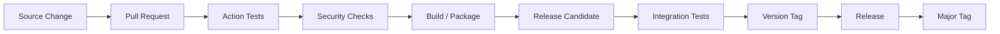
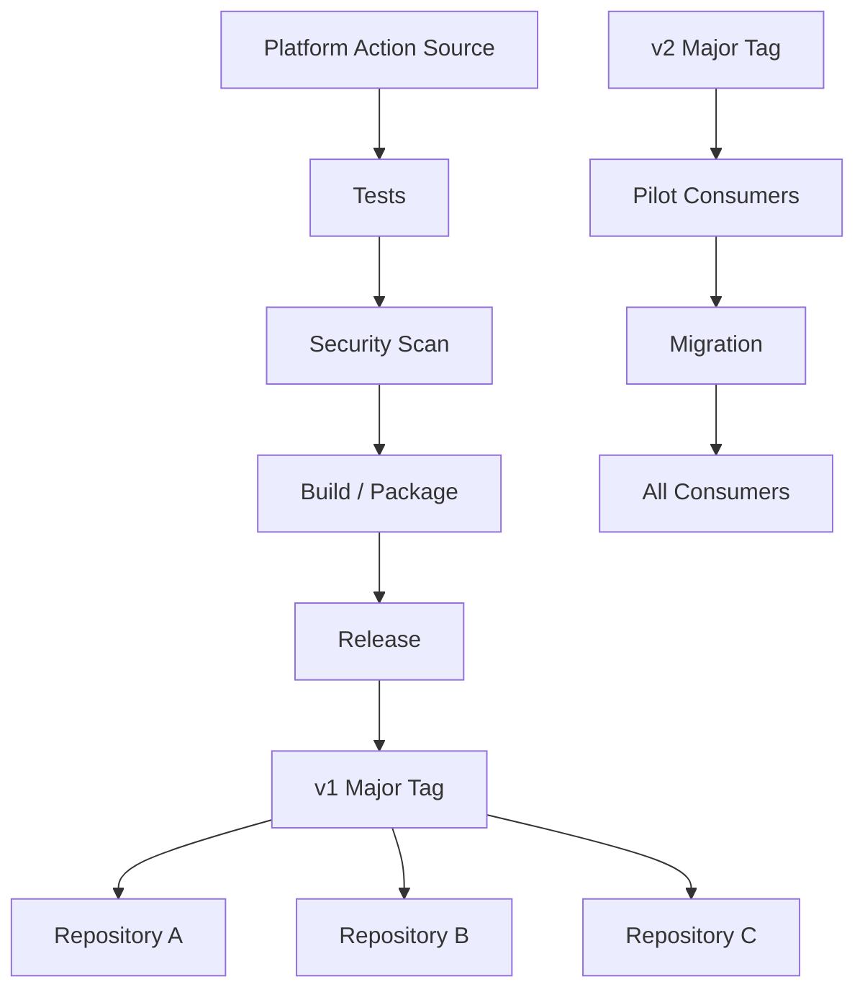

# 06- Action Versioning

## Overview

Action versioning is the mechanism used to control how GitHub Actions consumers receive changes to custom actions.

A custom action is effectively a reusable CI/CD dependency. Once multiple repositories depend on it, changing its implementation can affect production pipelines, deployment behavior, security boundaries, and developer workflows.

A production-oriented versioning model therefore needs to address:

- Release identity.
- Backward compatibility.
- Breaking changes.
- Semantic versioning.
- Git tags.
- Commit SHA pinning.
- Marketplace actions.
- Private and internal actions.
- Release promotion.
- Security.
- Rollback.
- Dependency governance.

The dependency relationship is:

```text
Consumer Workflow
       ↓
Custom Action
       ↓
Action Version
       ↓
Implementation
       ↓
Runtime / Dependencies
```

The goal is to make this relationship predictable.

## Why Action Versioning Matters

Consider a deployment action used by 80 repositories:

```yaml
- name: Deploy
  uses: company/deploy-action@v1
```

If the action implementation changes unexpectedly, all consumers may inherit the behavior.

Potential consequences include:

- Failed CI pipelines.
- Unexpected deployments.
- Changed authentication behavior.
- Changed input semantics.
- Broken output contracts.
- Different Docker behavior.
- Security regressions.
- Incompatible runtime dependencies.

Versioning creates a boundary between:

```text
Action development
```

and:

```text
Action consumption
```

## Versioning Models

Common references include:

| Reference | Stability | Update behavior | Typical use |
|---|---|---|---|
| Branch | Low | Changes continuously | Development |
| Commit SHA | High | Immutable reference | High-assurance consumption |
| Exact version tag | High | Changes only if tag is moved | Controlled releases |
| Major tag | Medium/High | Receives compatible releases | Consumer-friendly stable API |
| Mutable major tag | Controlled | Updated by maintainer | Common public-action model |

Examples:

```yaml
uses: company/action@main
```

```yaml
uses: company/action@v1
```

```yaml
uses: company/action@v1.4.2
```

```yaml
uses: company/action@<commit-sha>
```

Each provides a different balance between stability and update management.

## Branch References

Using a branch:

```yaml
uses: company/deploy-action@main
```

means the workflow follows whatever commit currently exists on `main`.

This provides automatic access to changes but reduces reproducibility.

A workflow that passed yesterday may execute different action code today without any change to the workflow itself.

This is generally inappropriate for security-sensitive production pipelines.

## Exact Version Tags

An exact version can be referenced:

```yaml
uses: company/deploy-action@v1.4.2
```

This communicates a precise release.

Advantages:

- Predictable behavior.
- Easy auditability.
- Clear dependency version.
- Easier rollback.

The remaining consideration is whether the tag itself is immutable.

A tag can technically be moved unless repository governance prevents or detects such changes.

## Major Version Tags

A common consumer-facing model is:

```yaml
uses: company/deploy-action@v1
```

while the repository also contains releases such as:

```text
v1.0.0
v1.1.0
v1.2.0
v1.3.0
```

The `v1` reference can be updated to the latest compatible `v1.x` release.

This gives consumers:

```text
Stable major-version contract
+
Automatic compatible improvements
```

The maintainer must preserve the compatibility expectations of the major version.

## Semantic Versioning

Semantic Versioning commonly follows:

```text
MAJOR.MINOR.PATCH
```

For example:

```text
v2.4.3
```

where:

```text
2 → major
4 → minor
3 → patch
```

A practical interpretation is:

| Version change | Typical meaning |
|---|---|
| Major | Breaking change |
| Minor | Backward-compatible feature |
| Patch | Backward-compatible fix |

For GitHub Actions, the action interface is part of the compatibility contract.

## What Constitutes a Breaking Change?

Breaking changes can include:

- Removing an input.
- Renaming an input.
- Changing an input's meaning.
- Removing an output.
- Changing an output format.
- Changing required permissions.
- Changing authentication requirements.
- Removing supported platforms.
- Changing expected filesystem behavior.
- Changing failure semantics.
- Requiring incompatible runtime dependencies.

For example, changing:

```yaml
inputs:
  image-tag:
```

to:

```yaml
inputs:
  image:
```

can break existing workflows.

## Non-Breaking Changes

Examples of generally compatible changes include:

- Adding an optional input with a safe default.
- Adding a new output.
- Improving error messages.
- Fixing an internal implementation bug.
- Improving performance without changing behavior.
- Updating an internal dependency without changing the action contract.

Compatibility should still be tested rather than assumed.

## Versioning the Action Interface

Treat `action.yml` as an API contract.

Example:

```yaml
inputs:
  environment:
    description: "Target deployment environment"
    required: true

  image-tag:
    description: "Immutable image tag"
    required: true

outputs:
  deployment-id:
    description: "Deployment identifier"
```

A version change should be evaluated against this interface as well as the implementation.

The important question is:

> Can existing consumers continue to use the action without modification?

If not, the change should be treated as potentially breaking.

## Inputs and Version Compatibility

Suppose version 1 exposes:

```yaml
inputs:
  environment:
    required: true
```

Adding:

```yaml
inputs:
  wait-for-health:
    required: false
    default: "true"
```

can be backward compatible because existing workflows do not need to provide the new input.

Removing:

```yaml
inputs:
  environment:
```

is breaking.

Renaming:

```yaml
environment
```

to:

```yaml
target-environment
```

is also breaking unless a compatibility layer is retained.

## Output Compatibility

Outputs are also part of the action API.

Existing:

```yaml
outputs:
  deployment-id:
```

Breaking:

```yaml
outputs:
  deployment-id:
```

is removed or its meaning changes.

Compatible:

```yaml
outputs:
  deployment-id:
  deployment-url:
```

The second output can be added while preserving the existing contract.

## Versioning Docker Actions

For Docker actions, versioning applies to more than the `action.yml`.

A release can affect:

```text
action.yml
Dockerfile
Entrypoint
Application Code
OS Packages
Python / Node Dependencies
Base Image
```

Therefore, a Docker action version should represent a tested combination of these components.

Example:

```yaml
uses: company/security-scan@v2
```

should map to a known action implementation and dependency set.

## Versioning JavaScript Actions

JavaScript actions add another dependency layer:

```text
action.yml
   ↓
package.json
   ↓
package-lock.json
   ↓
Node Runtime
   ↓
dist/
```

Changes to the bundled runtime or dependencies can affect consumers.

For production releases:

- Lock dependencies.
- Test the packaged action.
- Build the distributable output.
- Release the tested version.
- Avoid publishing source changes without validating the generated artifact.

## Versioning Composite Actions

Composite actions primarily package workflow steps.

Changes can affect:

- Input names.
- Input defaults.
- Shell behavior.
- Runner assumptions.
- Environment variables.
- Outputs.
- Commands.
- External actions invoked internally.

Composite actions therefore require the same compatibility discipline as other action types.

## Action Versioning Across Action Types

| Concern | Composite | JavaScript | Docker |
|---|---|---|---|
| `action.yml` | Yes | Yes | Yes |
| Inputs | Yes | Yes | Yes |
| Outputs | Yes | Yes | Yes |
| Runtime | Runner | Node.js | Container |
| Runtime dependencies | Runner | Node/npm | Image |
| Packaging | Repository | Bundled distribution | Docker image |
| Version contract | Action API | Action + runtime | Action + image |

The versioning strategy should remain consistent even though the implementation differs.

## Git Tags

Git tags are commonly used to represent releases.

Example:

```bash
git tag v1.2.0
git push origin v1.2.0
```

A release can then be consumed:

```yaml
uses: company/deploy-action@v1.2.0
```

Tags provide human-readable release identifiers.

For production systems, release automation should ensure that tags correspond to tested commits.

## Major Tag Maintenance

A repository may maintain:

```text
v1.2.0
v1.3.0
v1.4.0
v1
```

The `v1` tag can be updated to the latest compatible release.

Conceptually:

```text
v1
 ↓
v1.4.0
 ↓
Commit SHA
```

This creates a stable major-version interface while allowing compatible improvements.

The organization should define who is allowed to move release tags and how those changes are audited.

## Immutable References

A commit SHA provides a precise reference:

```yaml
uses: company/deploy-action@abc123...
```

This provides strong reproducibility because the reference identifies a specific commit.

A production security model may therefore prefer:

```text
Human-readable release
        +
Immutable commit
```

for example:

```text
v1.4.2
   ↓
specific commit SHA
```

## SHA Pinning

SHA pinning means referencing an action by its full commit SHA:

```yaml
uses: actions/checkout@<commit-sha>
```

or:

```yaml
uses: company/deploy-action@<commit-sha>
```

Benefits include:

- Stronger reproducibility.
- Protection against mutable tag changes.
- Easier auditability.
- More deterministic builds.

The trade-off is maintenance.

When a new secure version is released, the consuming workflow must intentionally update the SHA.

## Version Tags vs SHA Pinning

| Strategy | Reproducibility | Maintenance | Update speed |
|---|---|---|---|
| Branch | Low | Low | Automatic |
| Major tag | Medium | Low | Automatic compatible updates |
| Exact tag | High | Medium | Manual |
| SHA | Very high | Higher | Manual |

A mature organization can use different policies for different repositories or environments.

For example:

```text
Development
→ Major tags

Production
→ Approved immutable references
```

The exact policy should be governed centrally rather than decided inconsistently by individual repositories.

## Trusted Action Sources

Treat external actions as dependencies.

Before adopting an action, evaluate:

- Repository ownership.
- Source code.
- Release history.
- Required permissions.
- Secrets.
- Dependencies.
- Docker image.
- Maintenance activity.
- Security history.
- Versioning model.

Marketplace availability alone should not be treated as proof of trustworthiness.

## Third-Party Action Pinning

A workflow such as:

```yaml
- uses: third-party/action@v1
```

implicitly trusts the code represented by that reference.

For security-sensitive workflows, organizations may require:

```yaml
- uses: third-party/action@<commit-sha>
```

and maintain an approved-action policy.

This reduces the risk associated with unexpected upstream changes.

## Action Allowlisting

An organization can establish an approved action set:

```text
Approved Actions
├── actions/checkout
├── actions/setup-python
├── docker/build-push-action
└── company/deploy-action
```

Other actions may require security review.

This is particularly useful for enterprise CI/CD environments where workflows can access:

- Cloud credentials.
- Production environments.
- Internal networks.
- Repository write permissions.

## Internal Actions

Organizations often maintain internal actions for common operations:

```text
company/
├── python-quality-action
├── security-scan-action
├── docker-build-action
└── deploy-action
```

Benefits include:

- Standardization.
- Centralized security controls.
- Reduced workflow duplication.
- Consistent observability.
- Easier platform governance.

However, internal actions become platform dependencies and therefore require disciplined release management.

## Private Actions

A private action can be consumed by authorized repositories depending on repository and organization configuration.

The versioning principles remain the same:

```text
Private Action
      ↓
Release
      ↓
Version
      ↓
Consumer Repository
```

Do not assume that private actions require less versioning discipline.

An internal action used by dozens of repositories can have more operational impact than a public action.

## Cross-Repository Actions

A central platform repository might provide:

```yaml
uses: company/platform-actions/deploy@v1
```

The central action can then standardize:

- AWS authentication.
- Docker deployment.
- Security checks.
- Logging.
- Metadata.
- Deployment validation.

Versioning becomes particularly important because one release can affect many repositories.

## Action Release Lifecycle

A controlled release process can be:



Each stage should validate the action before the version becomes available to consumers.

## Release Candidates

For a significant action change, use a pre-release version:

```text
v2.0.0-rc.1
```

This allows selected repositories to validate the new behavior before the stable release.

A practical flow is:

```text
v1.x
  ↓
v2.0.0-rc.1
  ↓
Internal Consumers
  ↓
Validation
  ↓
v2.0.0
```

## Canary Adoption

For internal actions, a new version can be introduced gradually.

Example:

```text
100 repositories
       ↓
5 pilot repositories
       ↓
25 repositories
       ↓
50 repositories
       ↓
100 repositories
```

This reduces the blast radius of action changes.

Monitor:

- Workflow failure rate.
- Execution duration.
- Authentication failures.
- Deployment failures.
- Output changes.
- Consumer-specific compatibility issues.

## Rollback

Rollback should be straightforward.

If a new release is problematic:

```text
v1.5.0
   ↓
Problem detected
   ↓
Rollback
   ↓
v1.4.2
```

A consumer using an exact immutable reference can immediately return to the previous known-good commit.

A major tag can also be moved back to a known-good release when the organization's tag governance permits it.

## Action Rollback Example

Suppose:

```yaml
uses: company/deploy-action@v1
```

currently resolves to:

```text
v1.5.0
```

and `v1.5.0` introduces a production deployment issue.

A controlled rollback can restore the major tag to the previous known-good release:

```text
v1 → v1.4.2
```

The important requirement is that the rollback itself is controlled and auditable.

## Build Once, Release Once

The action release should be based on tested source.

For a JavaScript action:

```text
Source
  ↓
Install Locked Dependencies
  ↓
Build / Bundle
  ↓
Test
  ↓
Release Artifact
  ↓
Version Tag
```

For a Docker action:

```text
Source
  ↓
Docker Build
  ↓
Image Scan
  ↓
Integration Test
  ↓
Image Release
  ↓
Action Version
```

Do not produce a release from an untested working tree.

## Versioning and Artifacts

Action artifacts should correspond to the released version.

For example:

```text
Action v1.4.2
   ↓
Tested source
   ↓
Tested Docker image
   ↓
SBOM
   ↓
Provenance
```

This improves traceability.

A production incident should allow engineers to answer:

```text
Which action version executed?
Which commit produced it?
Which dependencies were included?
Which release was approved?
```

## Versioning and Security

Versioning is part of supply-chain security.

A secure release process should consider:

- Trusted source.
- Protected release branches.
- Controlled tags.
- SHA references.
- Dependency updates.
- Dependency review.
- Vulnerability scanning.
- SBOM generation.
- Artifact provenance.
- Artifact attestations.
- Release permissions.

A compromised release process can invalidate otherwise secure workflow configuration.

## Dependency Updates

Action dependencies should be updated deliberately.

For example:

```text
Action
 ↓
Dependency
 ↓
Security vulnerability
```

A dependency update may require:

- Patch release.
- Minor release.
- Major release.

Do not automatically assume every dependency update is behaviorally compatible.

Test the complete action after dependency changes.

## Runtime Updates

Changing the runtime can also affect compatibility.

Examples:

```text
Node runtime
Python runtime
Base Docker image
OS packages
```

An action that changes its runtime should validate:

- Existing inputs.
- Outputs.
- File access.
- API behavior.
- Performance.
- Platform support.
- Dependency compatibility.

Runtime changes can be operationally significant even when the public interface appears unchanged.

## Deprecation

When an input or behavior needs to be removed, prefer a deprecation path.

Example:

```text
v1
 ↓
Deprecated input
 ↓
Warning
 ↓
Migration documentation
 ↓
v2
 ↓
Input removed
```

A deprecation period gives consumers time to migrate.

For internal actions, consumer repositories can be identified and migrated centrally.

## Breaking Changes

When a breaking change is required:

1. Identify affected consumers.
2. Document the behavior change.
3. Introduce the new major version.
4. Test representative repositories.
5. Publish migration guidance.
6. Roll out gradually.
7. Monitor failures.
8. Retain the previous major version for existing consumers.

Example:

```text
v1
→ Existing contract

v2
→ New contract
```

Do not silently alter `v1` semantics to implement `v2`.

## Action Documentation

Each versioned action should document:

- Purpose.
- Supported inputs.
- Defaults.
- Outputs.
- Required permissions.
- Authentication.
- Supported runners.
- Security considerations.
- Version policy.
- Migration guidance.
- Examples.

Example:

```yaml
- name: Deploy
  uses: company/deploy-action@v1
  with:
    environment: staging
    image-tag: ${{ github.sha }}
```

Documentation should make the supported contract obvious.

## Compatibility Matrix

For mature internal actions, maintain a compatibility matrix.

| Action version | Runtime | Inputs | Outputs | Breaking changes |
|---|---|---|---|---|
| `v1` | Node.js | Stable | Stable | No |
| `v2` | Updated runtime | Expanded | Expanded | Yes |
| `v3` | New runtime | New contract | New contract | Yes |

For Docker actions, include relevant image/runtime information.

## Versioning Reusable Workflows vs Actions

Reusable workflows and custom actions have different version boundaries.

A reusable workflow can orchestrate:

```text
Jobs
 ├── Test
 ├── Build
 ├── Security
 └── Deploy
```

A custom action packages execution logic:

```text
Job
 └── Action
      └── Steps / Runtime
```

Both should be versioned, but their contracts differ.

For reusable workflows, consider:

- Workflow inputs.
- Workflow outputs.
- Secrets.
- Job structure.
- Environment behavior.
- Permissions.
- Deployment semantics.

For actions, consider:

- Inputs.
- Outputs.
- Runtime.
- Packaging.
- Execution behavior.

## Versioning and Permissions

Changing an action's required permissions can be a compatibility and security concern.

For example, an action previously requiring:

```yaml
permissions:
  contents: read
```

may later request:

```yaml
permissions:
  contents: write
```

That is a significant trust-boundary change.

Review permission changes as part of the release.

Consumers should not automatically grant broad permissions merely because a new action version requests them.

## Versioning and AWS OIDC

An action that deploys to AWS may depend on:

```yaml
permissions:
  id-token: write
  contents: read
```

A new action version might change:

- Required AWS role.
- OIDC claims.
- IAM API usage.
- Required permissions.
- Deployment behavior.

These changes should be documented and tested before release.

The action version should identify the tested deployment behavior.

## Versioning and Docker Images

For actions that build or deploy Docker images, distinguish:

```text
Action Version
```

from:

```text
Application Image Version
```

Example:

```yaml
uses: company/ecs-deploy@v2
with:
  image-tag: "abc123"
```

Here:

```text
v2
→ Deployment action version

abc123
→ Application artifact version
```

They should not be conflated.

## Versioning and Production Deployments

A production deployment pipeline can contain several independent version boundaries:

```text
Workflow Version
       ↓
Reusable Workflow Version
       ↓
Deployment Action Version
       ↓
Application Image Version
       ↓
Infrastructure Version
```

Each dependency should be identifiable.

This makes incident investigation significantly easier.

## Observability

Record action version information in CI/CD logs or deployment metadata where appropriate.

Useful metadata includes:

```text
workflow
action
action version
commit SHA
application version
environment
deployment ID
```

For example:

```text
Action: company/deploy-action
Version: v2.3.1
Application: backend-api
Image: abc123
Environment: production
Deployment: dep-8472
```

This creates a traceable relationship between pipeline execution and production state.

## Troubleshooting

Use the standard model:

```text
Symptom
→ Possible Causes
→ Isolation Strategy
→ Commands / Checks
→ Root Cause
→ Corrective Action
→ Prevention
```

### Workflow Suddenly Behaves Differently

Check:

- Action reference.
- Current commit behind the tag.
- Recent release.
- Dependency changes.
- Runtime changes.
- Consumer workflow changes.

If the workflow uses:

```yaml
uses: company/action@main
```

the action may have changed without any workflow modification.

### Major Tag Produces Unexpected Behavior

Determine:

```text
v1
 ↓
Which release?
 ↓
Which commit?
 ↓
What changed?
```

Compare the current major tag with the previous known-good release.

### SHA-Pinned Action Does Not Receive a Security Fix

A SHA-pinned reference is intentionally immutable.

Update it explicitly to the approved secure commit.

The trade-off is:

```text
More control
+
More maintenance
```

### New Version Breaks Consumers

Identify:

- Input changes.
- Output changes.
- Permission changes.
- Runtime changes.
- Filesystem changes.
- Failure behavior.
- External API changes.

Determine whether the release should have been a major version.

### Docker Action Works in One Repository but Not Another

Compare:

- Action version.
- Runner.
- Permissions.
- Secrets.
- Environment.
- Network.
- Workspace.
- Consumer workflow.

Do not assume that the action itself is the only difference.

### JavaScript Action Version Is Correct but Behavior Is Old

Check whether the released distribution was rebuilt.

For packaged JavaScript actions:

```text
Source
 ↓
Build
 ↓
dist/
 ↓
Release
```

A source-only change does not necessarily mean the packaged runtime used by consumers contains that change.

### Rollback Is Required

Prefer returning to a known-good immutable version:

```text
Current
 ↓
Failure
 ↓
Known-good release
```

Avoid making emergency source modifications directly on a production branch without establishing a reproducible release.

## GitHub CLI for Version Operations

List workflow runs:

```bash
gh run list
```

Inspect a specific run:

```bash
gh run view <run-id>
```

Inspect logs:

```bash
gh run view <run-id> --log
```

Rerun a workflow:

```bash
gh run rerun <run-id>
```

List repository releases:

```bash
gh release list
```

View a release:

```bash
gh release view v1.4.2
```

Create a release after the tested tag exists:

```bash
gh release create v1.4.2 --generate-notes
```

Use these commands as operational tooling around release management rather than treating GitHub CLI as a separate general-purpose course.

## Governance

A production organization should establish versioning standards.

Example policy:

```text
Internal Actions
    ↓
Semantic Versioning
    ↓
Protected Releases
    ↓
Approved Major Versions
    ↓
Consumer Migration Policy
```

Governance can define:

- Approved action sources.
- Required versioning scheme.
- SHA-pinning requirements.
- Release approval.
- Security review.
- Dependency scanning.
- Runtime support.
- Deprecation periods.
- Rollback procedures.

## Enterprise Action Strategy

A mature organization may maintain a central platform repository:

```text
platform-actions/
├── python-quality
├── security-scan
├── docker-build
├── aws-auth
└── deploy
```

Each action has its own release lifecycle:

```text
platform-actions
      ↓
Action Tests
      ↓
Security Review
      ↓
Versioned Release
      ↓
Consumer Repositories
```

This centralizes common CI/CD capabilities while preserving explicit dependency versions.

## Scalable Release Architecture

For many repositories:



This supports controlled evolution without forcing every repository to migrate simultaneously.

## Action Versioning Strategy

A practical production model is:

```text
Development
→ Branch / PR

Release Candidate
→ Pre-release tag

Stable Release
→ Exact semantic version

Consumer-Friendly Reference
→ Major version tag

High-Assurance Production
→ Approved immutable SHA
```

This separates developer convenience from production reproducibility.

## Common Mistakes

### Referencing `main` in Production

```yaml
uses: company/action@main
```

This makes production behavior depend on future branch changes.

### Moving Tags Without Governance

If a release tag is unexpectedly changed, consumers may execute different code under the same version identifier.

### Treating All Minor Changes as Safe

A supposedly minor change can still alter runtime behavior, permissions, or external API interactions.

Compatibility should be tested.

### Removing Inputs Without a Major Version

Existing workflows may fail immediately.

### Changing Output Semantics

Keeping the same output name while changing its meaning can be more dangerous than removing the output because consumers may continue operating with incorrect data.

### Ignoring Packaged Artifacts

JavaScript actions may execute generated distribution files rather than source files.

The release process must test the actual packaged action.

### Updating Dependencies Without Testing

Dependency upgrades can change:

- API behavior.
- Runtime requirements.
- Security posture.
- Performance.
- Transitive dependencies.

### Pinning Everything Without an Update Process

SHA pinning increases control but creates maintenance work.

A mature organization needs a process for reviewing and updating pinned dependencies.

### Assuming Internal Actions Are Automatically Safe

An internal action can have access to production credentials and private networks.

Internal trust does not eliminate the need for security review.

## Interview Scenarios

### Design a Versioning Strategy for 100 Repositories

A platform team maintains a deployment action used by 100 repositories.

Discuss:

- Major tags.
- Exact versions.
- SHA pinning.
- Backward compatibility.
- Release candidates.
- Canary adoption.
- Rollback.
- Governance.

### A New Action Version Breaks Production

A new `v2` release changes deployment behavior.

Explain how you would:

```text
Detect
 ↓
Stop further rollout
 ↓
Identify affected consumers
 ↓
Rollback
 ↓
Analyze
 ↓
Correct
 ↓
Release fixed version
 ↓
Resume migration
```

### Choose Between `v1`, `v1.4.2`, and SHA

Discuss the trade-offs between:

```yaml
uses: company/action@v1
```

```yaml
uses: company/action@v1.4.2
```

and:

```yaml
uses: company/action@<commit-sha>
```

Consider:

- Reproducibility.
- Security.
- Maintenance.
- Automatic updates.
- Rollback.
- Governance.

### Design a Breaking Change

An action currently accepts:

```text
environment
image-tag
```

Version 2 needs:

```text
target-environment
image
deployment-strategy
```

Explain:

- Why this may require a major release.
- How to deprecate the old interface.
- How to test consumers.
- How to migrate gradually.
- How to preserve rollback capability.

### Secure a Third-Party Action

A deployment workflow uses a third-party action with access to:

```text
id-token: write
contents: write
production secrets
```

Discuss:

- Whether each permission is required.
- Action source trust.
- SHA pinning.
- Dependency review.
- Release governance.
- Runner isolation.
- OIDC trust relationships.
- Blast-radius reduction.

### Design Internal Action Governance

A company wants all repositories to use a central deployment action.

Design:

```text
Central Action
      ↓
Semantic Releases
      ↓
Major Versions
      ↓
Consumer Migration
      ↓
Security Governance
      ↓
Rollback
```

Explain how you would balance standardization with repository autonomy.

## Key Takeaways

- Treat a custom GitHub Action as a versioned software dependency with a stable API contract covering inputs, outputs, runtime behavior, permissions, and external integrations.
- Use semantic versioning deliberately: compatible changes should remain within a major version, while breaking interface or behavior changes should receive a new major version.
- Choose references according to the required trade-off between update convenience and reproducibility, with immutable commit SHAs providing the strongest version determinism.
- Production action releases should be tested, security-reviewed, traceable to known source and artifacts, gradually adopted when appropriate, and easy to roll back to a known-good version.
- Enterprise CI/CD environments should govern trusted action sources, versioning, SHA pinning, dependency updates, release permissions, deprecation, and migration so shared actions can evolve without uncontrolled pipeline failures.