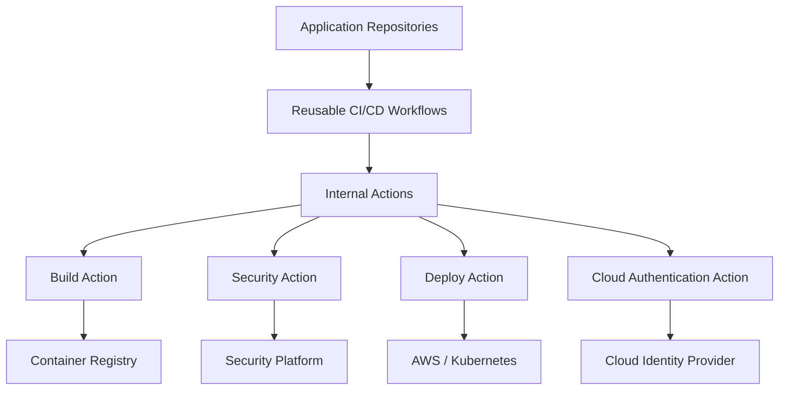
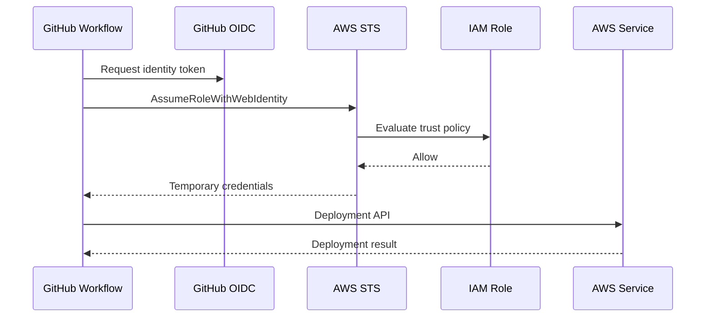
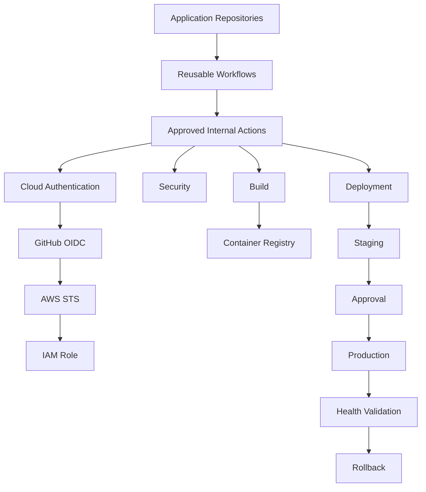

# 08- Internal and Private Actions

## Overview

Internal and private GitHub Actions allow an organization to package CI/CD logic that should not be exposed as a public Marketplace dependency.

They are useful when workflows need organization-specific behavior such as:

- Internal deployment platforms.
- Standardized security checks.
- Private package authentication.
- AWS account configuration.
- Internal Docker registries.
- Corporate compliance checks.
- Organization-wide build conventions.
- Reusable operational tooling.

The architectural distinction is important:

```text
Marketplace Action
    ↓
Public / External Dependency

Internal Action
    ↓
Organization-Controlled Dependency

Private Action
    ↓
Restricted Repository / Access Boundary
```

Internal and private actions are still executable code on GitHub Actions runners. Making an action private does not automatically make it secure.

The production design should therefore address:

- Repository access.
- Action versioning.
- Permissions.
- Secrets.
- Runner trust.
- Dependency management.
- Release management.
- Consumer discovery.
- Compatibility.
- Governance.
- Rollback.

## Internal vs Private Actions

The terms are related but represent different access models.

| Model | Typical visibility | Typical use |
|---|---|---|
| Public action | Public repository | General-purpose reusable functionality |
| Private action | Restricted repository | Sensitive organization-specific implementation |
| Internal action | Organization-visible repository | Shared internal platform capability |
| Marketplace action | Usually public | Third-party reusable functionality |

The exact availability and sharing behavior depends on the organization's GitHub configuration and repository visibility policies.

## Why Internal Actions Exist

An organization often repeats the same CI/CD behavior across many repositories.

Without a shared action:

```text
Repository A → 100 lines of deployment logic
Repository B → 100 lines of deployment logic
Repository C → 100 lines of deployment logic
Repository D → 100 lines of deployment logic
```

An internal action can centralize the implementation:

```text
Repository A ─┐
Repository B ─┤
Repository C ─┼──> Internal Action
Repository D ─┘
```

This provides a controlled abstraction for common operational behavior.

## Typical Internal Action Use Cases

### Deployment

```text
Application Repository
        ↓
Internal Deploy Action
        ↓
Deployment Platform
        ↓
AWS ECS / Kubernetes / EC2
```

### Security

```text
Repository
    ↓
Internal Security Action
    ↓
SAST / Dependency / Policy Checks
```

### Build Standardization

```text
Repository
    ↓
Internal Build Action
    ↓
Docker Buildx
    ↓
Registry
```

### Cloud Authentication

```text
GitHub Actions
    ↓
Internal AWS Authentication Action
    ↓
OIDC
    ↓
AWS STS
    ↓
IAM Role
```

## Internal Actions vs Reusable Workflows

An internal action should not be used when the actual requirement is multi-job orchestration.

| Requirement | Appropriate mechanism |
|---|---|
| Reusable sequence of steps | Composite action |
| Programmatic logic | JavaScript action |
| Specialized container runtime | Docker action |
| Multiple jobs | Reusable workflow |
| Organization-specific CI/CD operation | Internal action |
| Organization-wide pipeline orchestration | Reusable workflow |

The distinction remains:

```text
Action
→ Executes within a job

Reusable Workflow
→ Orchestrates jobs
```

For example:

```text
Reusable Deployment Workflow
    ├── Validate
    ├── Security Scan
    ├── Approval
    ├── Deploy
    └── Verify
```

while:

```text
Internal Deploy Action
    ↓
Execute deployment operation
```

## Internal Action Architecture

A typical organization-wide architecture is:



The application repository consumes standardized capabilities without implementing the internal infrastructure details itself.

## Repository Structure

A composite internal action may look like:

```text
company-actions/
└── deploy/
    ├── action.yml
    ├── scripts/
    │   ├── deploy.py
    │   └── validate.py
    └── README.md
```

A JavaScript action might look like:

```text
company-actions/
└── aws-deploy/
    ├── action.yml
    ├── package.json
    ├── src/
    │   └── main.js
    ├── dist/
    │   └── index.js
    └── README.md
```

A Docker action may contain:

```text
company-actions/
└── security-scan/
    ├── action.yml
    ├── Dockerfile
    ├── entrypoint.sh
    └── README.md
```

## `action.yml`

Every custom action requires an action definition.

Example:

```yaml
name: Company Deploy
description: Deploy an application using the internal deployment platform

inputs:
  application:
    description: Application identifier
    required: true

  environment:
    description: Target environment
    required: true

  image:
    description: Immutable container image
    required: true

runs:
  using: composite
  steps:
    - name: Deploy application
      shell: bash
      run: |
        ./scripts/deploy.sh \
          "${{ inputs.application }}" \
          "${{ inputs.environment }}" \
          "${{ inputs.image }}"
```

The action definition is the public API of the action.

## Action Interface Design

Treat internal actions like software libraries.

Define:

- Inputs.
- Outputs.
- Defaults.
- Validation.
- Error behavior.
- Compatibility guarantees.
- Supported environments.
- Required permissions.
- Authentication requirements.

Avoid exposing implementation details unnecessarily.

A good interface might be:

```yaml
with:
  application: backend-api
  environment: production
  image: 123456789.dkr.ecr.us-east-1.amazonaws.com/backend:abc123
```

rather than requiring consumers to know internal deployment API endpoints.

## Input Validation

Validate action inputs before executing privileged operations.

For example:

```bash
set -euo pipefail

case "${ENVIRONMENT}" in
  development|staging|production)
    ;;
  *)
    echo "Unsupported environment: ${ENVIRONMENT}" >&2
    exit 1
    ;;
esac
```

Validation should happen before:

- Cloud API calls.
- Deployment operations.
- Production changes.
- Credential usage.
- Resource deletion.

## Avoid Shell Injection

Do not directly interpolate untrusted values into shell source.

Risky:

```yaml
run: deploy --application ${{ inputs.application }}
```

An attacker-controlled input may alter shell interpretation.

Prefer environment variables where appropriate:

```yaml
env:
  APPLICATION: ${{ inputs.application }}
run: deploy --application "$APPLICATION"
```

The action should still validate the value.

## Outputs

Internal actions can expose structured results.

For example:

```yaml
outputs:
  deployment-id:
    description: Deployment identifier
    value: ${{ steps.deploy.outputs.deployment_id }}
```

A consumer can use:

```yaml
- name: Deploy
  id: deployment
  uses: company/deploy-action@v2
  with:
    application: backend-api
    environment: staging
    image: ${{ needs.build.outputs.image }}

- name: Print deployment ID
  run: echo "${{ steps.deployment.outputs.deployment-id }}"
```

Outputs should contain useful operational metadata without exposing secrets.

## Secrets

Avoid designing internal actions around broad secret requirements.

A poor interface might require:

```yaml
with:
  aws-access-key: ${{ secrets.AWS_ACCESS_KEY }}
  aws-secret-key: ${{ secrets.AWS_SECRET_KEY }}
```

A better AWS architecture is:

```text
GitHub Actions
      ↓
OIDC
      ↓
AWS STS
      ↓
IAM Role
      ↓
Temporary Credentials
      ↓
Internal Action
```

The action should consume the resulting temporary credentials rather than requiring long-lived credentials whenever possible.

## `GITHUB_TOKEN`

Internal actions should not assume broad `GITHUB_TOKEN` permissions.

Consumers should grant only what is required:

```yaml
permissions:
  contents: read
```

A deployment workflow might additionally require:

```yaml
permissions:
  contents: read
  id-token: write
```

If an internal action requires write permissions, document exactly why.

## Job-Level Permissions

A useful design is to isolate privileged actions.

```yaml
jobs:
  test:
    permissions:
      contents: read

    steps:
      - uses: actions/checkout@v4
      - run: pytest

  deploy:
    permissions:
      contents: read
      id-token: write

    steps:
      - uses: company/deploy-action@v2
```

This prevents the entire workflow from receiving deployment-level permissions.

## Internal Actions and AWS OIDC

An internal AWS deployment action can standardize the authentication architecture:



The IAM trust policy should restrict the identities that may assume the role.

Possible conditions include:

- Repository.
- Organization.
- Branch.
- Tag.
- Environment.

## Private Action Access

A private action is useful when implementation details should remain restricted.

Examples:

- Internal infrastructure APIs.
- Private deployment systems.
- Organization-specific credentials.
- Internal compliance logic.
- Proprietary deployment mechanisms.

The action repository should have access controls appropriate to its sensitivity.

However:

```text
Private repository
≠
Automatically trusted execution
```

The action still executes code on a runner and may interact with external systems.

## Internal Action Access Model

A typical model is:

```text
Organization
├── Application Repositories
│
├── Platform Actions
│   ├── build
│   ├── security
│   ├── deploy
│   └── cloud-auth
│
└── Reusable Workflows
```

Consumer repositories receive access to approved platform components.

## Sharing Strategy

Use a deliberate sharing model.

| Strategy | Suitable for |
|---|---|
| Repository-local action | One repository |
| Private action repository | Restricted consumers |
| Organization-internal action | Broad internal consumers |
| Reusable workflow | Shared pipeline architecture |
| Public Marketplace action | General external capability |

Do not make an action public simply because several internal repositories consume it.

## Cross-Repository Consumption

A repository may consume an action from another repository using:

```yaml
- name: Deploy
  uses: company/platform-actions/deploy@v2
  with:
    application: backend-api
    environment: staging
```

The exact repository visibility and access configuration must support the consumer relationship.

The important design principle is to make the dependency explicit and versioned.

## Internal Action Versioning

Use explicit versions:

```yaml
uses: company/platform-actions/deploy@v2
```

Avoid:

```yaml
uses: company/platform-actions/deploy@main
```

for production workflows.

A production consumer should know which action implementation it is executing.

For stronger reproducibility:

```yaml
uses: company/platform-actions/deploy@<commit-sha>
```

## Semantic Versioning

Internal actions should preferably follow semantic versioning:

```text
MAJOR.MINOR.PATCH
```

For example:

```text
v2.3.1
```

Use major versions for breaking interface changes:

```text
v1 → v2
```

Use minor versions for backward-compatible features:

```text
v2.3 → v2.4
```

Use patch versions for backward-compatible fixes:

```text
v2.3.1 → v2.3.2
```

## Major Version Tags

A common consumer experience is:

```yaml
uses: company/platform-actions/deploy@v2
```

The `v2` tag can move between compatible `v2.x` releases.

This provides:

- Automatic compatible updates.
- Simple consumer configuration.
- Centralized patch/minor adoption.

For highly controlled environments, pin the exact release or commit SHA instead.

## Versioning Policy

A production organization can define:

```text
Development
→ Major tag

Staging
→ Major or exact release

Production
→ Approved release / immutable SHA
```

The exact policy depends on the organization's security and release requirements.

## Breaking Changes

Examples of breaking action changes:

- Removing an input.
- Renaming an input.
- Changing an input's meaning.
- Removing an output.
- Changing output semantics.
- Changing authentication requirements.
- Increasing required permissions.
- Changing supported runner assumptions.
- Changing deployment behavior.

A breaking change should trigger a major version.

## Compatibility

Maintain a compatibility matrix:

| Action | Version | Supported runners | Runtime | Consumer status |
|---|---|---|---|---|
| deploy | v1 | Ubuntu | Composite | Legacy |
| deploy | v2 | Ubuntu | Composite | Supported |
| deploy | v3 | Ubuntu | Node | Migration |

This becomes especially useful when hundreds of repositories consume the action.

## Release Lifecycle

A controlled release lifecycle is:

```text
Development
    ↓
Unit Tests
    ↓
Integration Tests
    ↓
Security Scan
    ↓
Release Candidate
    ↓
Pilot Consumers
    ↓
Production Release
    ↓
Consumer Migration
```

Do not publish an action version directly to every production repository without validation.

## Testing Internal Actions

Internal actions should have their own CI pipeline.

For example:

```text
Pull Request
    ↓
Lint
    ↓
Unit Tests
    ↓
Integration Tests
    ↓
Security Scan
    ↓
Build / Package
    ↓
Consumer Test
    ↓
Release
```

Test the action independently from the application repositories that consume it.

## Consumer Testing

A high-value practice is to test the action against representative consumers.

Example:

```text
Internal Action
      ↓
Consumer Fixture
      ├── Python Service
      ├── Django Service
      ├── FastAPI Service
      └── Docker Service
```

This catches compatibility issues that unit tests alone may miss.

## Contract Testing

Treat the action interface as a contract.

Test:

- Required inputs.
- Optional inputs.
- Defaults.
- Outputs.
- Error codes.
- Failure behavior.
- Permission requirements.
- Environment assumptions.

For example:

```text
Input
  ↓
Validation
  ↓
Action
  ↓
Output
```

A contract change should be intentional and versioned.

## Composite Internal Action

A composite action can package standardized steps.

Example:

```yaml
name: Python Quality Checks
description: Run organization-standard Python quality checks

inputs:
  python-version:
    description: Python version
    required: false
    default: "3.12"

runs:
  using: composite
  steps:
    - name: Set up Python
      uses: actions/setup-python@v5
      with:
        python-version: ${{ inputs.python-version }}

    - name: Install dependencies
      shell: bash
      run: pip install -r requirements.txt

    - name: Run lint
      shell: bash
      run: ruff check .

    - name: Run tests
      shell: bash
      run: pytest
```

This is useful when many repositories follow the same Python quality process.

## JavaScript Internal Action

JavaScript actions are useful when the action needs programmatic logic.

Typical responsibilities include:

- Calling GitHub APIs.
- Calling internal APIs.
- Parsing structured responses.
- Performing validation.
- Implementing retry logic.
- Producing structured outputs.

Example interface:

```yaml
name: Deployment Metadata
description: Resolve deployment metadata from the internal platform

inputs:
  application:
    required: true
    description: Application name

outputs:
  deployment-id:
    description: Deployment identifier

runs:
  using: node20
  main: dist/index.js
```

The JavaScript implementation should be packaged appropriately so consumers do not need to install development dependencies on the runner.

## Docker Internal Action

Docker actions can encapsulate specialized runtimes.

Example:

```yaml
name: Internal Security Scanner
description: Run the organization security scanner

inputs:
  target:
    required: true
    description: Scan target

runs:
  using: docker
  image: Dockerfile
  args:
    - ${{ inputs.target }}
```

Docker actions are useful when the toolchain is difficult to reproduce directly on GitHub-hosted runners.

Trade-offs include:

- Container startup overhead.
- Linux-only constraints for many Docker actions.
- Image maintenance.
- Image supply-chain risk.
- Runner requirements.

## Internal Action Dependencies

Maintain dependencies just like application dependencies.

For JavaScript:

```text
package.json
package-lock.json
```

For Python helper tooling:

```text
requirements.txt
pyproject.toml
```

For Docker:

```text
Dockerfile
Base Image
OS Packages
Application Dependencies
```

Track security vulnerabilities and upgrade dependencies deliberately.

## Supply-Chain Security

Internal actions become part of the organization's CI/CD supply chain.

The trust chain is:

```text
Source Repository
      ↓
Action Build
      ↓
Release
      ↓
Consumer Workflow
      ↓
Runner
      ↓
Production Infrastructure
```

A compromise at the action level can affect many repositories simultaneously.

Therefore protect the action repository itself.

## Protect the Action Repository

Recommended controls include:

- Branch protection.
- Pull request review.
- CODEOWNERS.
- Required status checks.
- Restricted release permissions.
- Protected tags where appropriate.
- Dependency scanning.
- Secret scanning.
- Audit logging.
- Least-privilege GitHub permissions.

The action repository may be more security-sensitive than an individual application repository because it can affect many consumers.

## CODEOWNERS

Platform actions should generally have explicit ownership.

Example:

```text
/.github/    @company/platform-team
/action.yml @company/platform-team
/scripts/    @company/platform-team
```

The exact CODEOWNERS syntax should match the repository's ownership model.

The objective is to ensure changes to shared CI/CD infrastructure receive appropriate review.

## Protected Releases

Avoid allowing any developer to publish a production action release.

A controlled process is:

```text
Pull Request
    ↓
Review
    ↓
CI
    ↓
Approval
    ↓
Tag
    ↓
Release
```

For critical actions, release permissions should be restricted to the platform team.

## Artifact Integrity

For JavaScript actions, the published `dist/` content should correspond to reviewed source code.

A common model is:

```text
Source
  ↓
Build
  ↓
Package
  ↓
Test
  ↓
Release
```

Do not allow manually modified distribution artifacts to silently diverge from source.

## Action Build Reproducibility

A mature action release should be reproducible.

Record:

- Source commit.
- Dependency lockfile.
- Runtime version.
- Build command.
- Generated distribution.
- Release tag.

This makes incident investigation easier.

## Self-Hosted Runners

Internal actions are sometimes used because they need access to private infrastructure.

Example:

```text
GitHub Actions
      ↓
Self-Hosted Runner
      ↓
Private Network
      ↓
Internal Deployment Platform
```

This introduces additional risk.

A compromised workflow or action could potentially access:

- Internal APIs.
- Databases.
- Credentials.
- Private services.
- Network resources.

Use self-hosted runners only when the network access requirement justifies the additional trust boundary.

## Ephemeral Runners

For sensitive workloads, ephemeral runners reduce persistence between jobs.

A conceptual model is:

```text
Job
 ↓
Ephemeral Runner
 ↓
Execute
 ↓
Destroy
```

This limits persistence of:

- Workspace files.
- Credentials.
- Temporary artifacts.
- Compromised processes.

Persistent runners require stronger isolation and cleanup controls.

## Private Network Access

If an internal action needs private network access:

```text
Runner
   ↓
Private Network
   ↓
Internal Service
```

verify:

- DNS resolution.
- Firewall rules.
- Routing.
- TLS.
- Authentication.
- Network segmentation.

Do not expose an internal deployment API publicly merely to simplify GitHub Actions integration.

## Internal Action and Kubernetes

An internal deployment action can standardize Kubernetes deployments:

```text
Application
    ↓
Docker Image
    ↓
Registry
    ↓
Internal Deploy Action
    ↓
Kubernetes
    ↓
Deployment
    ↓
Health Check
```

The action should not hide critical deployment behavior.

Consumers should understand:

- Target cluster.
- Namespace.
- Image.
- Rollout strategy.
- Health validation.
- Rollback behavior.

## Internal Action and ECS

For AWS ECS:

```text
Build
 ↓
ECR
 ↓
Internal Deploy Action
 ↓
ECS Service
 ↓
Deployment Controller
 ↓
Health Validation
```

The deployment action can standardize:

- Task definition rendering.
- Image replacement.
- Deployment initiation.
- Wait logic.
- Health validation.
- Failure reporting.

## Immutable Artifact Promotion

The action should consume an immutable artifact rather than rebuilding application code.

Prefer:

```text
Build
 ↓
Image SHA
 ↓
Staging
 ↓
Approval
 ↓
Production
```

rather than:

```text
Build Staging
 ↓
Build Production
```

The deployment action should receive the artifact identity explicitly.

Example:

```yaml
- name: Deploy
  uses: company/platform-actions/deploy@v2
  with:
    application: backend-api
    environment: production
    image: 123456789.dkr.ecr.us-east-1.amazonaws.com/backend@sha256:...
```

## Concurrency

Internal deployment actions do not automatically provide deployment serialization.

The workflow should define concurrency:

```yaml
concurrency:
  group: production-backend
  cancel-in-progress: false
```

This prevents overlapping production deployment workflows from racing.

The action should also be designed to behave safely if a previous deployment partially completed.

## Idempotency

Internal actions should prefer idempotent operations.

For example:

```text
Desired State
     ↓
Compare Current State
     ↓
Apply Required Changes
```

rather than blindly issuing destructive commands on every invocation.

This improves retry behavior.

## Retry Design

Retry transient operations such as:

- Network failures.
- Temporary API failures.
- Rate limits.

Avoid blind retries for:

- Non-idempotent operations.
- Production deletion.
- Database migrations.
- Irreversible infrastructure changes.

A retry policy should distinguish transient failures from permanent failures.

## Observability

Internal actions should produce useful logs.

Include:

- Application.
- Environment.
- Action version.
- Deployment identifier.
- Artifact identifier.
- External system.
- Duration.
- Failure reason.

Avoid logging:

- Secrets.
- Tokens.
- Credentials.
- Sensitive request headers.

## Step Summaries

For operational actions, GitHub step summaries can provide concise results.

For example:

```text
Deployment
Application: backend-api
Environment: staging
Image: sha256:...
Deployment ID: 12345
Status: successful
Duration: 84s
```

This is more useful than forcing engineers to parse hundreds of raw log lines.

## Error Handling

An internal action should fail with an actionable message.

Prefer:

```text
Deployment failed:
application=backend-api
environment=production
deployment_id=12345
reason=ECS service failed health validation
```

over:

```text
Command failed with exit code 1
```

The action should preserve the original failure context without exposing sensitive information.

## Rollback

A deployment action should support a clear rollback strategy where appropriate.

For immutable Docker artifacts:

```text
Current
  ↓
Failed Deployment
  ↓
Known-Good Image
  ↓
Redeploy
  ↓
Health Validation
```

Rollback should be tested before production incidents occur.

## Action Deprecation

Internal actions eventually need retirement.

A controlled deprecation process is:

```text
Announce
   ↓
Mark Deprecated
   ↓
Publish Replacement
   ↓
Track Consumers
   ↓
Migrate
   ↓
Remove
```

Documentation should identify:

- Deprecated version.
- Replacement.
- Migration changes.
- Deadline.
- Compatibility differences.

## Consumer Inventory

For organization-wide actions, maintain an inventory of consumers.

Example:

```text
deploy@v1
├── service-a
├── service-b
├── service-c
└── service-d
```

Without consumer visibility, breaking changes become difficult to manage.

## Centralized Governance

A mature organization can establish:

```text
Platform Team
      ↓
Action Standards
      ↓
Internal Actions
      ↓
Reusable Workflows
      ↓
Application Teams
```

Standards may define:

- Naming.
- Versioning.
- Security.
- Permissions.
- Logging.
- Inputs.
- Outputs.
- Documentation.
- Testing.
- Release process.

## Action Documentation

Every internal action should document:

- Purpose.
- Usage.
- Inputs.
- Outputs.
- Required permissions.
- Required secrets.
- Supported runners.
- Supported environments.
- Authentication.
- Versioning.
- Failure behavior.
- Security considerations.
- Example workflow.

Example:

```markdown
## Inputs

| Input | Required | Description |
|---|---|---|
| application | Yes | Application identifier |
| environment | Yes | Deployment environment |
| image | Yes | Immutable image reference |

## Permissions

Requires:

- `contents: read`
- `id-token: write`

## Example

```yaml
- uses: company/platform-actions/deploy@v2
  with:
    application: backend-api
    environment: staging
    image: ${{ needs.build.outputs.image }}
```
```

## Common Mistakes

### Treating Private Actions as Automatically Secure

Private visibility reduces exposure but does not eliminate malicious or vulnerable code.

**Avoidance:** review implementation, permissions, dependencies, and release controls.

### Using `main` in Production

```yaml
uses: company/actions/deploy@main
```

The implementation can change without the consuming workflow changing.

**Avoidance:** use controlled release references or immutable SHAs.

### Giving Every Action Broad Permissions

```yaml
permissions: write-all
```

This creates unnecessary blast radius.

**Avoidance:** grant only required permissions at the narrowest practical scope.

### Passing Long-Lived Cloud Credentials

```yaml
AWS_ACCESS_KEY_ID: ${{ secrets.AWS_ACCESS_KEY_ID }}
AWS_SECRET_ACCESS_KEY: ${{ secrets.AWS_SECRET_ACCESS_KEY }}
```

**Avoidance:** use OIDC and temporary credentials where supported.

### Embedding Deployment Logic in Every Repository

This creates:

- Duplication.
- Configuration drift.
- Inconsistent security.
- Difficult upgrades.

**Avoidance:** centralize stable organization-wide behavior in internal actions or reusable workflows.

### Making One Action Responsible for Everything

A single action that performs:

```text
Build
Test
Security
Deploy
Rollback
Monitoring
```

becomes difficult to test and version.

**Avoidance:** maintain focused action responsibilities and use reusable workflows for orchestration.

### Hiding Important Deployment Behavior

Abstraction should reduce duplication, not eliminate operational visibility.

**Avoidance:** expose meaningful inputs, outputs, logs, summaries, and deployment identifiers.

## Troubleshooting

Use:

```text
Symptom
→ Possible Causes
→ Isolation Strategy
→ Commands / Checks
→ Root Cause
→ Corrective Action
→ Prevention
```

### Action Cannot Be Found

Check:

- Repository path.
- Repository visibility.
- Consumer access.
- Action directory.
- `action.yml`.
- Version/tag.
- Organization policies.

Example:

```yaml
uses: company/platform-actions/deploy@v2
```

Verify that the repository and `v2` reference are accessible to the consuming workflow.

### Permission Denied

Check:

```yaml
permissions:
  contents: read
  id-token: write
```

Then identify which operation requires the missing permission.

Do not solve the problem with broad write permissions without understanding the requirement.

### Private Action Works Locally but Not in GitHub Actions

Local testing may use credentials and network access unavailable to the runner.

Check:

- Runner type.
- Repository access.
- Network connectivity.
- Authentication.
- Required environment variables.
- Private package access.
- Internal DNS.
- Firewall rules.

### Internal Action Cannot Access Private API

Validate:

```text
Runner
 ↓
Network Route
 ↓
DNS
 ↓
TLS
 ↓
Authentication
 ↓
API
```

The action code may be correct while the runner has no network path to the internal service.

### OIDC Authentication Fails

Check:

```text
permissions.id-token
        ↓
OIDC token
        ↓
AWS IAM trust policy
        ↓
Repository / branch / environment conditions
        ↓
STS
```

Verify that the trust policy matches the actual workflow identity.

### Action Version Upgrade Breaks Consumers

Identify:

- Changed inputs.
- Removed outputs.
- Runtime changes.
- Permission changes.
- Dependency changes.
- Environment assumptions.

If the interface is incompatible, publish a new major version.

### Deployment Runs Twice

Check workflow concurrency:

```yaml
concurrency:
  group: production-backend
  cancel-in-progress: false
```

Also inspect whether multiple workflows can independently deploy the same environment.

### Action Logs Expose Sensitive Data

Search for:

- Command arguments.
- Environment dumps.
- Debug logging.
- API responses.
- Error messages.

Remove secret values from logs and avoid passing sensitive values through command-line arguments.

## GitHub CLI Operations

List workflow runs:

```bash
gh run list
```

Inspect a run:

```bash
gh run view <run-id>
```

View logs:

```bash
gh run view <run-id> --log
```

Rerun a failed workflow:

```bash
gh run rerun <run-id>
```

List repository secrets:

```bash
gh secret list
```

List environments:

```bash
gh api repos/{owner}/{repo}/environments
```

Inspect repository actions configuration where appropriate:

```bash
gh api repos/{owner}/{repo}/actions/permissions
```

The CLI should be used as an operational diagnostic tool rather than replacing normal workflow governance.

## Production Architecture

A mature internal-action platform can use:



The architecture separates:

```text
Repository
    ↓
Pipeline Orchestration
    ↓
Reusable Internal Capabilities
    ↓
Infrastructure
```

## Enterprise Failure Domains

Internal actions create shared dependencies.

A failure in a central action can affect many repositories:

```text
Internal Deploy Action
        ↓
 ┌──────┼──────┐
 ↓      ↓      ↓
Repo A Repo B Repo C
```

Therefore the action platform itself requires:

- Testing.
- Versioning.
- Monitoring.
- Rollback.
- Release controls.
- Consumer migration planning.

## Blast Radius Management

Reduce blast radius through:

- Major-version releases.
- Canary adoption.
- Consumer testing.
- Staged rollout.
- Separate production action versions.
- Immutable references.
- Limited release permissions.

For example:

```text
v2.4.0
   ↓
Platform Repository
   ↓
Pilot Consumers
   ↓
10% Adoption
   ↓
50% Adoption
   ↓
100% Adoption
```

The exact rollout strategy depends on organizational risk.

## High Availability

For critical deployment infrastructure, avoid a single untested action version becoming a universal dependency.

Maintain:

- Known-good release.
- Previous major version.
- Tested rollback.
- Release artifacts.
- Consumer compatibility information.

A deployment action should be treated as production infrastructure.

## Disaster Recovery

For critical internal actions, preserve:

- Source history.
- Release tags.
- Build configuration.
- Dependency lockfiles.
- Distribution artifacts.
- Documentation.
- Consumer inventory.
- Previous known-good versions.

If a new release fails, consumers should be able to return to a known-good implementation.

## Cost Optimization

Internal actions can reduce duplicated CI/CD work, but poorly designed actions can increase runtime.

Watch for:

- Repeated dependency installation.
- Repeated Docker downloads.
- Excessive API polling.
- Redundant security scans.
- Large container startup times.
- Unnecessary artifact transfers.

Optimize shared actions carefully because a small inefficiency can multiply across hundreds of repositories.

## Security Checklist

- [ ] Action repository access is restricted appropriately.
- [ ] Branch protection is enabled.
- [ ] CODEOWNERS protects action changes.
- [ ] Release permissions are restricted.
- [ ] Inputs are validated.
- [ ] Shell injection risks are addressed.
- [ ] Secrets are minimized.
- [ ] `GITHUB_TOKEN` permissions are minimized.
- [ ] AWS uses OIDC where appropriate.
- [ ] Dependencies are reviewed.
- [ ] Action releases are versioned.
- [ ] Production consumers avoid mutable branches.
- [ ] Self-hosted runner risks are understood.
- [ ] Private network access is controlled.
- [ ] Logs do not expose sensitive information.
- [ ] Rollback versions are retained.

## Internal Action Design Checklist

- [ ] Purpose is narrow and clearly defined.
- [ ] Inputs are explicit.
- [ ] Outputs are documented.
- [ ] Failure behavior is documented.
- [ ] Authentication is clearly defined.
- [ ] Permissions are minimal.
- [ ] Dependencies are managed.
- [ ] Tests cover the action contract.
- [ ] Consumer compatibility is tested.
- [ ] Documentation includes production examples.
- [ ] Releases follow a versioning policy.
- [ ] Breaking changes use a new major version.
- [ ] Deprecation has a migration path.
- [ ] Monitoring exists for critical actions.
- [ ] Known-good versions are retained.

## Interview Scenarios

### Design an Internal Deployment Action

An organization has 200 Python repositories deploying to AWS ECS.

Each repository currently contains duplicated deployment logic.

Design an internal action that standardizes:

```text
Docker Image
    ↓
ECR
    ↓
ECS Deployment
    ↓
Health Validation
    ↓
Rollback
```

Discuss:

- Inputs.
- Outputs.
- OIDC.
- IAM.
- Versioning.
- Concurrency.
- Environment protection.
- Testing.
- Rollback.
- Governance.

### Internal Action vs Reusable Workflow

A team wants one component to:

```text
Lint
→ Test
→ Build
→ Deploy
→ Verify
```

Explain whether this should be:

- Composite action.
- JavaScript action.
- Docker action.
- Reusable workflow.

Focus on the number of jobs, orchestration requirements, and reusable boundaries.

### Secure an Internal Action

An internal action requires AWS access.

Design:

```text
GitHub
 ↓
OIDC
 ↓
STS
 ↓
IAM
 ↓
Temporary Credentials
 ↓
AWS Service
```

Explain how you would restrict:

- Repository.
- Branch.
- Environment.
- IAM permissions.

### Breaking Change

An internal action currently accepts:

```yaml
environment: production
```

Version 2 changes the interface to:

```yaml
target-environment: production
```

Explain how you would release and migrate the action without breaking hundreds of repositories.

### Compromised Action

A vulnerability is discovered in the latest version of a shared internal action.

Design the incident response:

```text
Detect
 ↓
Stop Rollout
 ↓
Identify Consumers
 ↓
Pin Known-Good Version
 ↓
Investigate
 ↓
Rotate Exposed Credentials
 ↓
Patch
 ↓
Test
 ↓
Controlled Re-release
```

Discuss how the response changes if the action had:

```yaml
permissions:
  id-token: write
  contents: write
```

### Private Network Deployment

A deployment action must reach an internal Kubernetes API unavailable from GitHub-hosted runners.

Design a secure architecture using self-hosted or ephemeral runners.

Discuss:

- Network segmentation.
- Runner isolation.
- Credentials.
- Ephemeral execution.
- Kubernetes authentication.
- Failure handling.
- Cleanup.

### Enterprise Action Governance

An organization has hundreds of repositories and wants developers to consume only approved CI/CD capabilities.

Design:

```text
Approved Actions
      ↓
Reusable Workflows
      ↓
Internal Actions
      ↓
Application Repositories
```

Discuss:

- Allowlisting.
- Version policy.
- SHA pinning.
- Security review.
- Consumer inventory.
- Release management.
- Deprecation.
- Rollback.

## Key Takeaways

- Internal and private actions centralize organization-specific CI/CD behavior, but they should be treated as production software and part of the organization's security supply chain.
- Design actions as stable APIs with explicit inputs, outputs, permissions, authentication requirements, validation, versioning, documentation, and compatibility guarantees.
- Protect shared action repositories with code review, ownership, branch protection, controlled releases, dependency management, and least-privilege execution.
- Prefer OIDC and temporary cloud credentials, immutable artifacts, controlled versions, deployment concurrency, and isolated runners for security-sensitive production automation.
- Treat shared actions as high-blast-radius infrastructure: test releases, stage adoption, monitor consumers, retain known-good versions, and maintain tested rollback and migration paths.