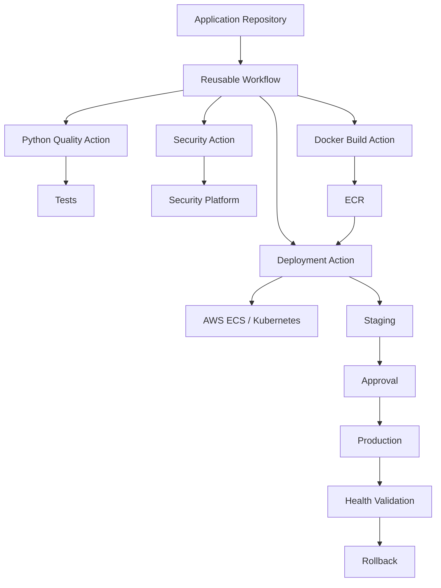

# 09- Reusable Action Design

## Overview

Reusable actions package repeatable CI/CD behavior behind a stable interface so multiple workflows and repositories can consume the same implementation.

A reusable action should be treated like a software library:

```text
Consumer Workflow
       ↓
Action Interface
       ↓
Inputs
       ↓
Implementation
       ↓
Outputs
       ↓
External Systems
```

The objective is not merely to reduce YAML duplication. A well-designed reusable action provides:

- A stable API.
- Consistent behavior.
- Centralized implementation.
- Controlled security boundaries.
- Versioned releases.
- Standardized observability.
- Easier upgrades.
- Reduced configuration drift.

The key design distinction is:

```text
Reusable Action
→ Encapsulates steps or execution logic within a job

Reusable Workflow
→ Orchestrates one or more jobs
```

For production CI/CD, reusable actions should be designed with the same discipline applied to backend libraries and platform APIs.

## Why Reusable Actions Matter

Without reusable actions, repositories often duplicate operational logic:

```text
Repository A ──> Deployment Logic
Repository B ──> Deployment Logic
Repository C ──> Deployment Logic
Repository D ──> Deployment Logic
```

Over time this creates:

- Configuration drift.
- Inconsistent security.
- Repeated bugs.
- Difficult upgrades.
- Different deployment behavior.
- Higher maintenance cost.

A reusable action centralizes the common behavior:

```text
Repository A ─┐
Repository B ─┤
Repository C ─┼──> Reusable Action
Repository D ─┘
```

## When to Create a Reusable Action

Create an action when a sequence of steps or a specific operation is:

- Repeated across workflows.
- Stable enough to expose as an interface.
- Meaningful as a standalone capability.
- Easier to test independently.
- Organization-specific.
- Difficult or undesirable to duplicate.

Examples:

- Standard Python quality checks.
- Internal deployment operation.
- Docker metadata generation.
- Security policy validation.
- AWS authentication preparation.
- Internal API integration.
- Standard test reporting.

Do not create an action merely to hide three trivial shell commands that have no meaningful reuse boundary.

## Action vs Reusable Workflow

The distinction is fundamental.

| Requirement | Action | Reusable Workflow |
|---|---|---|
| Reuse steps | Yes | Yes |
| Execute inside a job | Yes | No |
| Create multiple jobs | No | Yes |
| Control job dependencies | No | Yes |
| Matrix orchestration | Limited by caller/workflow | Yes |
| Environment promotion | Usually caller-controlled | Yes |
| Deployment pipeline | Individual operation | Complete orchestration |
| Stable step-level abstraction | Yes | Not the primary purpose |

Example action:

```yaml
- uses: company/actions/docker-build@v2
```

Example reusable workflow:

```yaml
jobs:
  ci:
    uses: company/workflows/.github/workflows/python-ci.yml@v3
```

Use the smallest abstraction that represents the actual reusable boundary.

## Three Major Action Types

GitHub Actions supports three major custom action models.

| Type | Execution model | Good fit |
|---|---|---|
| Composite | Reusable steps | Shell/tool orchestration |
| JavaScript | Node.js runtime | API and programmatic logic |
| Docker | Container | Specialized Linux runtime |

The interface should remain consistent regardless of implementation type.

## Composite Actions

Composite actions package multiple workflow steps.

Example:

```yaml
name: Python Quality
description: Run standard Python quality checks

inputs:
  python-version:
    description: Python version
    required: false
    default: "3.12"

runs:
  using: composite
  steps:
    - name: Set up Python
      uses: actions/setup-python@v5
      with:
        python-version: ${{ inputs.python-version }}

    - name: Install dependencies
      shell: bash
      run: pip install -r requirements.txt

    - name: Run lint
      shell: bash
      run: ruff check .

    - name: Run tests
      shell: bash
      run: pytest
```

The consumer sees one logical operation:

```yaml
- name: Python quality
  uses: company/actions/python-quality@v2
```

## JavaScript Actions

Use JavaScript actions when reusable behavior requires programmatic logic.

Typical use cases:

- GitHub API calls.
- Internal API calls.
- Complex validation.
- Structured data processing.
- Retry logic.
- Dynamic output generation.
- Integration with external systems.

Example interface:

```yaml
name: Deployment Metadata
description: Resolve deployment metadata

inputs:
  application:
    description: Application identifier
    required: true

outputs:
  deployment-id:
    description: Deployment identifier

runs:
  using: node20
  main: dist/index.js
```

The implementation can use:

```text
@actions/core
@actions/github
```

where appropriate.

## Docker Actions

Docker actions are useful when the action needs a specialized Linux environment.

Example:

```yaml
name: Security Scanner
description: Run the internal security scanner

inputs:
  target:
    description: Scan target
    required: true

runs:
  using: docker
  image: Dockerfile
  args:
    - ${{ inputs.target }}
```

Docker actions provide environment isolation but introduce:

- Image build complexity.
- Image maintenance.
- Startup overhead.
- Base-image security requirements.
- Container supply-chain considerations.
- Linux-oriented runtime constraints.

## `action.yml` as an API Contract

The `action.yml` file defines the action interface.

A production action should clearly define:

```yaml
name:
description:
inputs:
outputs:
runs:
```

For example:

```yaml
name: Company Deploy
description: Deploy an immutable application artifact

inputs:
  application:
    description: Application identifier
    required: true

  environment:
    description: Deployment environment
    required: true

  image:
    description: Immutable image reference
    required: true

outputs:
  deployment-id:
    description: Deployment identifier

  status:
    description: Deployment status

runs:
  using: composite
  steps:
    - name: Deploy
      shell: bash
      run: ./deploy.sh
```

Treat changes to this interface like API changes.

## Input Design

Good inputs should be:

- Explicit.
- Small in number.
- Clearly named.
- Validated.
- Documented.
- Stable.

Prefer:

```yaml
with:
  application: backend-api
  environment: staging
  image: backend@sha256:...
```

over exposing implementation details:

```yaml
with:
  deployment-api-url: ...
  deployment-request-method: ...
  internal-header: ...
```

The consumer should specify intent rather than implementation mechanics.

## Required vs Optional Inputs

Use required inputs for information the action cannot safely infer.

```yaml
inputs:
  application:
    description: Application identifier
    required: true
```

Use defaults for safe, broadly applicable behavior:

```yaml
inputs:
  timeout:
    description: Deployment timeout in seconds
    required: false
    default: "900"
```

Do not make production-critical behavior implicit merely to reduce configuration.

## Input Validation

Validate inputs before performing external operations.

Example:

```bash
set -euo pipefail

case "${ENVIRONMENT}" in
  development|staging|production)
    ;;
  *)
    echo "Unsupported environment: ${ENVIRONMENT}" >&2
    exit 1
    ;;
esac
```

Validation should happen before:

- AWS API calls.
- Kubernetes operations.
- Production deployments.
- Resource deletion.
- Credential use.

## Input Security

Never assume action inputs are trusted.

Inputs may originate from:

- Workflow configuration.
- Workflow dispatch.
- Pull request data.
- Repository variables.
- Reusable workflows.
- User-controlled values.

Avoid constructing shell source from untrusted data.

Risky:

```yaml
run: deploy --environment ${{ inputs.environment }}
```

Prefer:

```yaml
env:
  DEPLOY_ENVIRONMENT: ${{ inputs.environment }}
run: deploy --environment "$DEPLOY_ENVIRONMENT"
```

Then validate the value.

## Outputs

Outputs allow an action to return useful information to the workflow.

Example:

```yaml
outputs:
  deployment-id:
    description: Deployment identifier
    value: ${{ steps.deploy.outputs.deployment_id }}
```

Consumer:

```yaml
- name: Deploy
  id: deploy
  uses: company/actions/deploy@v2
  with:
    application: backend-api
    environment: staging
    image: ${{ needs.build.outputs.image }}

- name: Print deployment ID
  run: echo "${{ steps.deploy.outputs.deployment-id }}"
```

Good outputs are:

- Stable.
- Meaningful.
- Non-sensitive.
- Machine-readable where appropriate.

## Structured Outputs

When multiple related values are required, structured JSON can be useful.

Example:

```json
{
  "deployment_id": "deploy-12345",
  "environment": "staging",
  "image": "backend@sha256:abc123"
}
```

A consuming workflow can parse the value with `fromJSON()` when appropriate.

Avoid returning large datasets through outputs. Outputs are not a replacement for artifacts.

## Outputs vs Artifacts vs Cache

| Mechanism | Purpose | Typical data |
|---|---|---|
| Output | Small workflow metadata | IDs, paths, status |
| Artifact | Persist and transfer build/test data | Reports, packages, binaries |
| Cache | Reuse dependencies/build state | pip cache, npm cache, Docker layers |

Do not use outputs to transfer large files.

## Environment Variables

An action may need environment variables for runtime configuration.

Keep the distinction clear:

```text
Input
→ Action API

Environment Variable
→ Runtime configuration

Secret
→ Sensitive credential

Output
→ Action result
```

Do not turn every configuration value into an environment variable. Stable action behavior should be represented through explicit inputs.

## Secrets

Avoid requiring secrets unless they are genuinely necessary.

Poor design:

```yaml
with:
  aws-secret-key: ${{ secrets.AWS_SECRET_KEY }}
```

Prefer identity federation when supported:

```text
GitHub Actions
      ↓
OIDC
      ↓
AWS STS
      ↓
Temporary Credentials
      ↓
Reusable Action
```

If a secret is required:

- Document why.
- Avoid logging it.
- Minimize its scope.
- Avoid command-line exposure.
- Avoid copying it into outputs.
- Avoid persisting it in artifacts.

## GITHUB_TOKEN

An action should not assume broad repository permissions.

A consumer might define:

```yaml
permissions:
  contents: read
```

A deployment workflow may require:

```yaml
permissions:
  contents: read
  id-token: write
```

The action documentation should state required permissions explicitly.

Example:

```markdown
## Required Permissions

- `contents: read`
- `id-token: write` for AWS authentication
```

If an action requires write access, document the exact operation that needs it.

## Job-Level Permission Isolation

Separate privileged operations into their own jobs.

```yaml
jobs:
  test:
    permissions:
      contents: read

    steps:
      - uses: actions/checkout@v4
      - run: pytest

  deploy:
    permissions:
      contents: read
      id-token: write

    steps:
      - uses: company/actions/deploy@v2
```

This reduces the blast radius if a non-production action is compromised.

## Repository Structure

A reusable composite action might use:

```text
company-actions/
└── python-quality/
    ├── action.yml
    ├── scripts/
    │   ├── install.sh
    │   └── test.sh
    └── README.md
```

A JavaScript action:

```text
company-actions/
└── deployment-metadata/
    ├── action.yml
    ├── package.json
    ├── package-lock.json
    ├── src/
    │   └── main.js
    ├── dist/
    │   └── index.js
    └── README.md
```

A Docker action:

```text
company-actions/
└── security-scan/
    ├── action.yml
    ├── Dockerfile
    ├── entrypoint.sh
    └── README.md
```

## Naming

Use names that describe capabilities rather than implementation.

Prefer:

```text
deploy
docker-build
python-quality
security-scan
aws-auth
deployment-metadata
```

Avoid names tied to temporary infrastructure:

```text
ecs-blue-deploy-v1
old-security-check
new-deployment-script
```

The action name should remain valid as the implementation evolves.

## Repository Boundaries

A reusable action can live:

- Inside an application repository.
- In a dedicated platform repository.
- In a shared organizational actions repository.

For broad reuse, a dedicated platform repository often provides better ownership and governance.

Example:

```text
company/platform-actions
├── python-quality
├── docker-build
├── security-scan
└── deploy
```

The exact repository layout should match the organization's release and ownership model.

## Focused Responsibilities

A reusable action should have a clear responsibility.

Good:

```text
Docker Build Action
→ Build and optionally publish an image
```

Good:

```text
Deployment Action
→ Deploy an already-built artifact
```

Poor:

```text
Universal CI Action
→ Lint
→ Test
→ Build
→ Scan
→ Deploy
→ Notify
→ Rollback
```

Large all-purpose actions become difficult to version and test.

## Composition

Complex behavior can be composed from smaller actions.

```text
Reusable Workflow
    ├── Checkout
    ├── Python Quality Action
    ├── Security Action
    ├── Docker Build Action
    └── Deployment Action
```

This creates clear boundaries:

```text
Action
→ Focused operation

Workflow
→ Orchestration
```

## Reusable Action Interface Example

A deployment action can expose:

```yaml
- name: Deploy application
  id: deploy
  uses: company/actions/deploy@v3
  with:
    application: backend-api
    environment: production
    image: ${{ needs.build.outputs.image }}
    timeout: "900"
```

The action internally handles:

```text
Validate
   ↓
Authenticate
   ↓
Deploy
   ↓
Wait
   ↓
Health Check
   ↓
Output Deployment ID
```

The consumer does not need to know the implementation details.

## Docker Build Action

A reusable Docker build action can standardize image construction:

```yaml
name: Docker Build
description: Build an immutable application image

inputs:
  image:
    description: Image name
    required: true

  tag:
    description: Image tag
    required: true

outputs:
  image:
    description: Published image reference

runs:
  using: composite
  steps:
    - name: Build image
      shell: bash
      run: |
        docker build \
          --tag "${{ inputs.image }}:${{ inputs.tag }}" \
          .
```

For production systems, the action should also consider:

- Buildx.
- Registry authentication.
- Cache strategy.
- SBOM.
- Vulnerability scanning.
- Immutable image identifiers.

## Immutable Artifacts

Deployment actions should preferably consume immutable artifacts.

Prefer:

```text
Build
 ↓
Image Digest
 ↓
Deploy
```

over:

```text
Build
 ↓
latest
 ↓
Deploy
```

For example:

```yaml
with:
  image: 123456789.dkr.ecr.us-east-1.amazonaws.com/backend@sha256:...
```

This prevents the deployment target from silently resolving to a different image.

## AWS Deployment Action

An internal AWS deployment action can expose:

```yaml
with:
  application: backend-api
  environment: staging
  image: ${{ needs.build.outputs.image }}
```

Internally:

```text
Input Validation
      ↓
OIDC Authentication
      ↓
AWS STS
      ↓
ECS Update
      ↓
Wait for Deployment
      ↓
Health Validation
      ↓
Output Deployment ID
```

The workflow remains responsible for higher-level orchestration such as approvals and environment promotion.

## Kubernetes Deployment Action

A Kubernetes action might expose:

```yaml
with:
  application: backend-api
  namespace: production
  image: backend@sha256:...
```

Internally:

```text
Validate
   ↓
Authenticate
   ↓
Update Deployment
   ↓
Wait for Rollout
   ↓
Validate Health
   ↓
Return Status
```

The action should clearly document the cluster authentication model and required runner/network access.

## Concurrency

An action should not assume it is the only deployment process operating on a resource.

The consuming workflow should define concurrency:

```yaml
concurrency:
  group: production-backend
  cancel-in-progress: false
```

This separates responsibilities:

```text
Workflow Concurrency
→ Prevent competing workflows

Action
→ Perform deployment
```

An action can also implement idempotency at the operation level.

## Idempotency

Reusable deployment actions should prefer idempotent behavior.

For example:

```text
Desired Image
      ↓
Current Deployment
      ↓
Compare
      ↓
Apply Change Only If Required
```

This makes retries safer.

Idempotency is especially important when:

- Jobs are rerun.
- Runners fail after an API call.
- Network responses are lost.
- External APIs return transient errors.

## Retry Strategy

Retries should be limited to transient failures.

Good candidates:

- HTTP 429.
- Temporary network failures.
- Certain 5xx responses.
- Temporary registry errors.

Avoid blindly retrying:

- Authentication failures.
- Invalid configuration.
- Permission failures.
- Invalid deployment specifications.
- Destructive operations.

Use bounded retries with backoff.

## Timeouts

External operations should have explicit timeouts.

For example:

```bash
timeout 900 ./deploy.sh
```

An action that waits forever can consume a runner and block downstream deployment capacity.

The timeout should be configurable when different consumers legitimately have different deployment durations.

## Error Design

A reusable action should fail with actionable context.

Poor:

```text
Process exited with code 1
```

Better:

```text
Deployment failed:
application=backend-api
environment=staging
deployment_id=deploy-12345
reason=health validation failed
```

Do not include:

- Access tokens.
- Passwords.
- Private keys.
- Authorization headers.

## Exit Codes

For shell-based actions, ensure failures propagate correctly.

Use:

```bash
set -euo pipefail
```

when appropriate.

Avoid:

```bash
command || true
```

unless the failure is intentionally non-fatal and documented.

Suppressing failures can cause a deployment action to report success when the operation actually failed.

## Logging

Logs should provide operational context.

Useful:

```text
Starting deployment
Application: backend-api
Environment: staging
Image: backend@sha256:...
```

Avoid:

```text
AWS_SECRET_ACCESS_KEY=...
```

or dumping the entire environment.

Logging should make failures diagnosable without exposing sensitive information.

## Step Summaries

A reusable action can provide a concise GitHub step summary.

Example:

```text
Deployment Result

Application: backend-api
Environment: production
Image: sha256:abc123
Deployment ID: deploy-12345
Status: successful
Duration: 74s
```

This improves operational usability compared with raw logs alone.

## Testing Strategy

A reusable action requires multiple testing levels.

```text
Unit Tests
    ↓
Action Contract Tests
    ↓
Integration Tests
    ↓
Consumer Tests
    ↓
Production Pilot
```

### Unit Tests

Test internal logic such as:

- Input validation.
- Parsing.
- Retry decisions.
- API response handling.
- Output generation.

### Contract Tests

Validate:

- Input names.
- Required fields.
- Defaults.
- Outputs.
- Failure behavior.

### Integration Tests

Validate interaction with:

- GitHub APIs.
- AWS.
- Docker.
- Kubernetes.
- Internal deployment systems.

### Consumer Tests

Run the action against representative repositories.

For example:

```text
Python Service
Django Service
FastAPI Service
Docker Service
```

This catches compatibility problems that isolated unit tests cannot detect.

## CI Pipeline for an Internal Action

A mature action repository can use:

```text
Pull Request
   ↓
Lint
   ↓
Unit Tests
   ↓
Integration Tests
   ↓
Security Scan
   ↓
Build / Package
   ↓
Consumer Compatibility Tests
   ↓
Release
```

For a JavaScript action:

```text
Source
 ↓
npm ci
 ↓
Tests
 ↓
Build
 ↓
dist/
 ↓
Release
```

The generated `dist/` content should correspond to the reviewed source and locked dependencies.

## Dependency Management

Treat action dependencies like application dependencies.

For JavaScript:

```text
package.json
package-lock.json
```

For Docker:

```text
Dockerfile
Base Image
OS Packages
Runtime Dependencies
```

Keep dependencies:

- Pinned or lockfile-controlled where appropriate.
- Updated regularly.
- Security-scanned.
- Tested before release.

## Supply-Chain Security

A reusable action becomes a shared supply-chain component.

The trust chain is:

```text
Developer
   ↓
Action Source
   ↓
Dependencies
   ↓
Build
   ↓
Release
   ↓
Consumer Workflow
   ↓
Runner
   ↓
Production Infrastructure
```

Compromise at any stage can affect multiple repositories.

Protect the action repository accordingly.

## Repository Security

Recommended controls include:

- Branch protection.
- CODEOWNERS.
- Required pull request reviews.
- Required CI checks.
- Restricted release permissions.
- Dependency scanning.
- Secret scanning.
- Audit logging.
- Least-privilege workflow permissions.

For high-impact deployment actions, treat the repository as production infrastructure.

## CODEOWNERS

Shared actions should have explicit ownership.

Example:

```text
/action.yml @company/platform-team
/scripts/ @company/platform-team
/src/ @company/platform-team
```

The purpose is to ensure that changes to shared CI/CD infrastructure receive appropriate review.

## Action Versioning

Consumers should use controlled references.

Avoid:

```yaml
uses: company/actions/deploy@main
```

Prefer:

```yaml
uses: company/actions/deploy@v2
```

or:

```yaml
uses: company/actions/deploy@v2.4.1
```

For maximum reproducibility:

```yaml
uses: company/actions/deploy@<commit-sha>
```

## Semantic Versioning

Use:

```text
MAJOR.MINOR.PATCH
```

Examples:

```text
v1.0.0
v1.2.0
v1.2.1
```

Use a major version for incompatible interface changes.

Examples:

```text
v1 → v2
```

when:

- Inputs are removed.
- Inputs change meaning.
- Outputs are removed.
- Authentication changes incompatibly.
- Required permissions increase incompatibly.
- Supported runtime changes incompatibly.

## Major Version Tags

A major tag can provide a stable consumer interface:

```yaml
uses: company/actions/deploy@v2
```

The action maintainers can move `v2` to compatible minor and patch releases.

Organizations with stricter supply-chain controls may instead approve exact releases or immutable SHAs.

## Release Lifecycle

Use:

```text
Development
   ↓
Pull Request
   ↓
Tests
   ↓
Release Candidate
   ↓
Pilot
   ↓
Production Release
   ↓
Consumer Adoption
```

For a widely used action, avoid introducing a breaking release without migration documentation.

## Backward Compatibility

Maintain compatibility where practical.

For example, adding:

```yaml
timeout:
  required: false
  default: "900"
```

is generally easier for consumers than changing existing required inputs.

Backward-compatible evolution reduces migration effort across repositories.

## Deprecation

When an action version becomes obsolete:

```text
v1
 ↓
Deprecated
 ↓
v2
 ↓
Migration
 ↓
v1 Removal
```

Document:

- Deprecation reason.
- Replacement version.
- Migration steps.
- Compatibility differences.
- Deadline if applicable.

Track consumers so that migration is measurable.

## Documentation

Every reusable action should document:

- Purpose.
- Supported action type.
- Inputs.
- Outputs.
- Permissions.
- Secrets.
- Supported runners.
- Authentication.
- Examples.
- Versioning.
- Failure behavior.
- Security considerations.
- Compatibility.

Example:

```markdown
## Usage

```yaml
- name: Deploy
  uses: company/actions/deploy@v2
  with:
    application: backend-api
    environment: staging
    image: ${{ needs.build.outputs.image }}
```

## Required Permissions

- `contents: read`
- `id-token: write`

## Outputs

- `deployment-id`
- `status`
```

## Documentation as an API Contract

Documentation should answer:

```text
What does the action do?
What inputs does it accept?
What does it return?
What permissions does it need?
What can fail?
What versions are supported?
How is it authenticated?
```

If consumers need to inspect the implementation to understand basic usage, the interface is insufficiently documented.

## Internal vs Marketplace Dependencies

A reusable internal action may wrap a trusted Marketplace action.

For example:

```text
Application Repository
        ↓
Company Docker Action
        ↓
Approved Marketplace Docker Action
        ↓
Docker Registry
```

This centralizes:

- Version selection.
- Configuration.
- Security policy.
- Upgrade management.

However, the wrapper does not eliminate the underlying third-party dependency risk.

## Action Composition

A platform repository can expose focused actions:

```text
company/actions/
├── python-quality
├── docker-build
├── security-scan
├── aws-auth
└── deploy
```

A reusable workflow composes them:

```yaml
jobs:
  ci:
    runs-on: ubuntu-latest
    steps:
      - uses: company/actions/python-quality@v3
      - uses: company/actions/security-scan@v2
      - uses: company/actions/docker-build@v4
```

This provides reusable building blocks without creating one monolithic action.

## Backend Engineering Example

For a Django or FastAPI service:

```text
Pull Request
    ↓
Reusable CI Workflow
    ↓
Python Quality Action
    ├── setup-python
    ├── dependency installation
    ├── lint
    └── pytest
    ↓
Docker Build Action
    ↓
Security Scan Action
    ↓
ECR
    ↓
Deployment Action
```

The application repository remains responsible for application-specific configuration while the platform layer owns standardized CI/CD operations.

## PostgreSQL and Redis

An action should not hide required service dependencies when the consumer must understand them.

For integration testing:

```text
Python Application
       ↓
PostgreSQL
       ↓
Redis
       ↓
pytest
       ↓
Coverage
       ↓
Artifacts
```

Service containers remain workflow/job concerns, while a reusable test action can standardize commands executed against those services.

## Django Example

A focused action can standardize tests:

```yaml
- name: Django tests
  uses: company/actions/python-test@v2
  with:
    test-command: pytest
```

The workflow remains responsible for:

```yaml
services:
  postgres:
    image: postgres:16

  redis:
    image: redis:7
```

This keeps infrastructure configuration visible at the workflow level.

## Fan-Out and Fan-In

Reusable actions execute inside jobs, so matrix orchestration belongs to the workflow.

Example:

```yaml
strategy:
  matrix:
    python-version:
      - "3.11"
      - "3.12"
      - "3.13"
```

Each matrix job can invoke the same action:

```yaml
- uses: company/actions/python-quality@v3
  with:
    python-version: ${{ matrix.python-version }}
```

The workflow controls:

```text
Fan-Out
   ↓
Multiple Jobs
   ↓
Reusable Action
   ↓
Fan-In
```

## Environment Promotion

A reusable deployment action should perform deployment, while the workflow controls promotion:

```text
Build
 ↓
Staging
 ↓
Validation
 ↓
Approval
 ↓
Production
```

Example:

```yaml
jobs:
  deploy-staging:
    environment: staging
    steps:
      - uses: company/actions/deploy@v3
        with:
          environment: staging
          image: ${{ needs.build.outputs.image }}

  deploy-production:
    needs: deploy-staging
    environment: production
    steps:
      - uses: company/actions/deploy@v3
        with:
          environment: production
          image: ${{ needs.build.outputs.image }}
```

The same immutable image is promoted between environments.

## Concurrency and Deployment Safety

The workflow can define:

```yaml
concurrency:
  group: production-backend
  cancel-in-progress: false
```

The action performs:

```text
Validate
 ↓
Deploy
 ↓
Wait
 ↓
Health Check
```

The workflow performs:

```text
Scheduling
 ↓
Approval
 ↓
Concurrency
 ↓
Promotion
```

Keeping these responsibilities separate improves maintainability.

## Security Boundaries

A reusable action should clearly define what it can access.

```text
Workflow
   ↓
Permissions
   ↓
Action
   ↓
Credentials
   ↓
External System
```

Do not let an action implicitly depend on broad access.

For sensitive actions, document:

```text
Required:
contents: read
id-token: write

Not required:
contents: write
packages: write
pull-requests: write
```

## Self-Hosted Runners

Internal actions may require private network access.

Example:

```text
Internal Action
      ↓
Self-Hosted Runner
      ↓
Private Network
      ↓
Internal API
```

This introduces additional risk because a compromised action can potentially access the runner's network.

For sensitive workloads consider:

- Ephemeral runners.
- Network segmentation.
- Dedicated runner groups.
- Restricted credentials.
- Job isolation.
- Cleanup after execution.

## Private Network Example

A deployment action may need access to an internal Kubernetes API:

```text
GitHub Workflow
      ↓
Ephemeral Runner
      ↓
Private Network
      ↓
Kubernetes API
      ↓
Deployment
```

The action itself should not bypass network security controls.

## Performance

Reusable actions can improve performance through standardization, but poor implementation can add significant overhead.

Potential bottlenecks:

- Repeated dependency installation.
- Large Docker images.
- Slow API polling.
- Excessive retries.
- Repeated downloads.
- Unnecessary setup steps.

Measure:

```text
Action Startup
+ Dependency Setup
+ External API Time
+ Operation Time
```

Avoid optimizing based only on perceived slowness.

## Scalability

An action consumed by hundreds of repositories should avoid centralized bottlenecks.

For example, an internal action that sends every workflow through one synchronous API may become a platform bottleneck.

Prefer:

```text
Many Runners
    ↓
Scalable Internal API
    ↓
Deployment Platform
```

rather than:

```text
Many Runners
    ↓
Single Stateful Deployment Worker
```

when the underlying workload can be parallelized safely.

## Reliability

Design actions for transient infrastructure failures.

Use:

- Bounded retries.
- Exponential backoff.
- Explicit timeouts.
- Idempotent operations.
- Clear error messages.
- Safe reruns.

A reusable action should behave predictably when the runner is interrupted after an external API request has already succeeded.

## High Availability

Critical deployment actions should not depend on a single untested release.

Maintain:

- Known-good release.
- Previous major version.
- Tested fallback.
- Release artifacts.
- Consumer compatibility information.

The action itself is part of the production delivery platform.

## Disaster Recovery

Preserve:

- Source repository.
- Git history.
- Release tags.
- Dependency lockfiles.
- Build artifacts.
- Documentation.
- Configuration.
- Consumer inventory.

If a release becomes unusable, consumers should be able to return to a known-good version.

## Monitoring

Track important action-level metrics:

- Invocation count.
- Failure rate.
- Duration.
- Retry count.
- External API failures.
- Authentication failures.
- Deployment failures.
- Version adoption.

For example:

```text
deploy@v2
├── 92% successful
├── 6% transient failures
└── 2% configuration failures
```

The exact metrics should match the action's operational importance.

## Version Adoption

For widely shared actions, monitor adoption:

```text
deploy@v1 → 18 repositories
deploy@v2 → 142 repositories
deploy@v3 → 40 repositories
```

This enables controlled migration and deprecation.

## Cost Considerations

Shared actions can reduce duplicated CI/CD work, but inefficiencies multiply across consumers.

If an action adds 30 seconds to 1,000 workflows:

```text
30 seconds × 1,000
= 30,000 seconds
≈ 8.3 runner-hours
```

Optimize high-frequency shared actions carefully.

Potential improvements include:

- Dependency caching.
- Smaller Docker images.
- Reduced API polling.
- Reusing build outputs.
- Removing unnecessary setup steps.

## Common Mistakes

### Creating an Action Too Early

Not every repeated shell command needs an action.

**Problem:** unnecessary abstraction increases maintenance.

**Avoidance:** create an action when there is a stable reusable boundary.

### Building a Monolithic Action

An action that performs the entire CI/CD lifecycle becomes difficult to evolve.

**Avoidance:** keep actions focused and compose them through workflows.

### Confusing Actions with Reusable Workflows

An action cannot replace multi-job orchestration.

**Avoidance:** use reusable workflows for job-level architecture.

### Exposing Implementation Details

Requiring consumers to provide internal API URLs, command flags, or temporary infrastructure identifiers creates a brittle API.

**Avoidance:** expose business-level inputs.

### No Input Validation

Invalid input reaches production infrastructure.

**Avoidance:** validate before external operations.

### Logging Secrets

Debugging can accidentally expose credentials.

**Avoidance:** carefully control logs and never dump environments.

### Broad Permissions

An action is given:

```yaml
permissions: write-all
```

because one operation failed.

**Avoidance:** identify the exact permission required.

### Mutable Version References

```yaml
uses: company/actions/deploy@main
```

can silently change behavior.

**Avoidance:** use controlled release references or immutable SHAs.

### Breaking Consumers Without Versioning

Changing an existing input or output can break hundreds of repositories.

**Avoidance:** use semantic versioning and migration paths.

### Hiding Failures

Using:

```bash
command || true
```

can make failed operations appear successful.

**Avoidance:** only suppress errors intentionally and document why.

## Troubleshooting

Use the standard model:

```text
Symptom
→ Possible Causes
→ Isolation Strategy
→ Commands / Checks
→ Root Cause
→ Corrective Action
→ Prevention
```

### Action Cannot Be Resolved

Check:

- Repository path.
- Action directory.
- `action.yml`.
- Version reference.
- Repository visibility.
- Consumer permissions.

### Input Is Empty

Check:

- Input name.
- `with:` configuration.
- Default value.
- Consumer workflow.
- Case and spelling.

For reusable actions, the interface must remain stable.

### Output Is Missing

Check:

- Step ID.
- `$GITHUB_OUTPUT`.
- Output mapping in `action.yml`.
- Whether the producing step executed.
- Whether the action failed before setting the output.

### Action Works Locally but Fails on Runner

Check:

- Runner OS.
- Installed tools.
- Working directory.
- Environment variables.
- Network access.
- Credentials.
- File permissions.

Local development environments often contain dependencies unavailable on GitHub-hosted runners.

### AWS Authentication Fails

Check:

```text
permissions:
  id-token: write
```

Then inspect:

```text
OIDC Token
 ↓
IAM Trust Policy
 ↓
Repository / Branch / Environment
 ↓
STS
```

### Deployment Times Out

Check:

- Deployment platform state.
- Health checks.
- API polling.
- Network connectivity.
- Action timeout.
- External service latency.

Do not simply increase the timeout without identifying the bottleneck.

### Action Upgrade Breaks Consumers

Compare:

```text
Previous Version
      ↓
Inputs
Outputs
Permissions
Runtime
Dependencies
Behavior
      ↓
New Version
```

If compatibility is broken, publish a new major version.

### Concurrent Deployment

Check the consumer workflow's concurrency configuration:

```yaml
concurrency:
  group: production-backend
  cancel-in-progress: false
```

Also check whether other workflows can modify the same deployment target.

## GitHub CLI Operations

Inspect workflow runs:

```bash
gh run list
```

View a specific run:

```bash
gh run view <run-id>
```

View logs:

```bash
gh run view <run-id> --log
```

Rerun a workflow:

```bash
gh run rerun <run-id>
```

Download artifacts:

```bash
gh run download <run-id>
```

Inspect repository Actions permissions:

```bash
gh api repos/{owner}/{repo}/actions/permissions
```

List repository secrets:

```bash
gh secret list
```

These commands are useful when validating reusable action behavior from the consumer workflow side.

## Production Architecture

A mature platform can use reusable actions as building blocks:



The reusable workflow owns orchestration.

The actions own focused capabilities.

## Enterprise Action Platform

For a large organization:

```text
Platform Team
      ↓
Internal Action Standards
      ↓
Shared Action Repository
      ├── Build
      ├── Test
      ├── Security
      ├── Authentication
      └── Deployment
      ↓
Reusable Workflows
      ↓
Application Repositories
```

This architecture centralizes platform behavior while preserving application-team ownership of application code.

## Blast Radius

A shared action has a larger blast radius than repository-local workflow code.

```text
Shared Action
      ↓
 ┌────┼────┬────┐
 ↓    ↓    ↓    ↓
A     B    C    D
```

A faulty release can affect all consumers.

Therefore:

- Use staged releases.
- Maintain compatibility.
- Monitor adoption.
- Maintain rollback versions.
- Restrict release permissions.
- Test representative consumers.

## Release Rollout

A controlled rollout can be:

```text
v3.0.0
   ↓
Action Repository Tests
   ↓
Platform Test Repositories
   ↓
Pilot Consumers
   ↓
Selected Production Consumers
   ↓
General Availability
```

Do not assume a green action repository test suite proves compatibility with every consumer.

## Action Security Checklist

- [ ] Inputs are validated.
- [ ] Untrusted inputs are not interpolated directly into shell source.
- [ ] Secrets are minimized.
- [ ] Secrets never appear in outputs.
- [ ] Logs do not expose credentials.
- [ ] `GITHUB_TOKEN` permissions are minimal.
- [ ] AWS uses OIDC where appropriate.
- [ ] Dependencies are locked and reviewed.
- [ ] Action releases are protected.
- [ ] Production consumers use controlled versions.
- [ ] Self-hosted runner risks are understood.
- [ ] Private network access is restricted.
- [ ] Third-party dependencies are reviewed.
- [ ] Security scanning is part of the action CI pipeline.

## Reusable Action Design Checklist

- [ ] The action has one clear responsibility.
- [ ] The interface is documented.
- [ ] Inputs are explicit.
- [ ] Defaults are safe.
- [ ] Inputs are validated.
- [ ] Outputs are meaningful.
- [ ] Large data uses artifacts instead of outputs.
- [ ] Permissions are documented.
- [ ] Secrets are minimized.
- [ ] Failure behavior is predictable.
- [ ] Retries are bounded.
- [ ] Timeouts exist for long-running operations.
- [ ] Logs are operationally useful.
- [ ] Step summaries are used where valuable.
- [ ] Unit tests exist.
- [ ] Integration tests exist where required.
- [ ] Consumer compatibility is tested.
- [ ] Releases are versioned.
- [ ] Breaking changes use a major version.
- [ ] Deprecated versions have migration paths.

## Interview Scenarios

### Design a Reusable Action

Several Django and FastAPI repositories repeat:

```text
Python Setup
→ Dependencies
→ Ruff
→ pytest
→ Coverage
```

Design a reusable action.

Discuss:

- Composite action vs reusable workflow.
- Inputs.
- Outputs.
- Python versions.
- Caching.
- Testing.
- Versioning.
- Permissions.

### Design a Deployment Action

Design an internal action that deploys:

```text
Docker Image
 ↓
AWS ECR
 ↓
ECS
 ↓
Health Validation
```

Explain:

- Inputs.
- Outputs.
- OIDC.
- IAM.
- Concurrency.
- Idempotency.
- Retry behavior.
- Rollback.

### Action vs Reusable Workflow

A team wants a shared deployment pipeline containing:

```text
Security Scan
→ Build
→ Staging
→ Approval
→ Production
→ Verification
```

Explain why a reusable workflow is appropriate for orchestration while focused actions can implement individual operations.

### Security Review

An action requires:

```yaml
permissions:
  contents: write
  id-token: write
```

Determine how you would establish whether both permissions are necessary.

Discuss:

- Source inspection.
- API usage.
- Job isolation.
- Least privilege.
- Alternative architecture.

### Action Versioning

An action has 400 consumers and a new version changes an input name.

Design the migration strategy.

Discuss:

- Semantic versioning.
- Compatibility.
- Major version.
- Consumer inventory.
- Migration documentation.
- Staged rollout.
- Deprecation.

### Failure During Deployment

The action receives a successful response from the deployment API, but the runner crashes before the action records the result.

On retry, the deployment operation runs again.

Design an idempotent solution.

Discuss:

- Deployment identifiers.
- Desired state.
- Idempotency keys.
- Status reconciliation.
- Safe retries.

### Private Network Action

An internal deployment action requires access to a private Kubernetes cluster.

Design the runner architecture.

Discuss:

- Self-hosted vs GitHub-hosted runners.
- Ephemeral runners.
- Runner groups.
- Network segmentation.
- Credentials.
- Cleanup.
- Blast radius.

### Shared Action Compromise

A widely used internal action is compromised.

Design the incident response:

```text
Detect
 ↓
Stop Release
 ↓
Identify Consumers
 ↓
Pin Known-Good Version
 ↓
Rotate Credentials
 ↓
Investigate
 ↓
Patch
 ↓
Test
 ↓
Controlled Rollout
```

Explain how the response changes if the action had access to production AWS credentials or `id-token: write`.

## Key Takeaways

- Design reusable actions as focused software components with stable inputs, outputs, validation, documented permissions, predictable failures, and explicit versioning.
- Use actions for reusable operations within a job and reusable workflows for multi-job orchestration, promotion, approvals, concurrency, and pipeline architecture.
- Treat shared actions as high-blast-radius production infrastructure: protect their repositories, test consumer compatibility, control releases, and maintain rollback versions.
- Prefer least-privilege permissions, OIDC for cloud authentication where appropriate, immutable artifacts, safe retries, idempotent operations, and secure handling of untrusted inputs.
- A mature reusable action platform combines focused actions, reusable workflows, semantic versioning, observability, security controls, staged rollout, and clear migration paths.