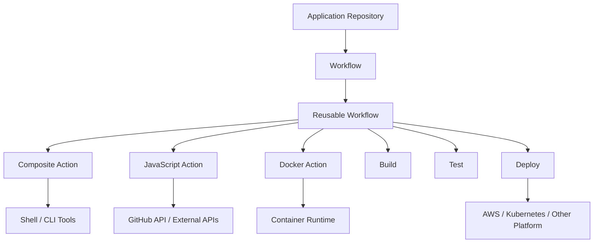

# README

## Overview

Custom Actions are the reusable execution layer of GitHub Actions.

While workflows define orchestration and reusable workflows define multi-job pipeline architecture, custom actions package repeatable implementation logic behind a stable interface.

A production-oriented GitHub Actions platform typically separates responsibilities as:

```text
Application Workflow
        │
        ▼
Reusable Workflow
        │
        ├── Quality Action
        ├── Security Action
        ├── Build Action
        ├── Authentication Action
        └── Deployment Action
```

This folder focuses on designing, implementing, versioning, testing, securing, and operating custom actions as reusable engineering components rather than treating them as collections of YAML steps.

The three major custom action types are:

| Action Type | Primary Purpose | Typical Use |
|---|---|---|
| Composite Action | Package reusable workflow steps | Shell/tool orchestration |
| JavaScript Action | Execute programmatic logic | APIs, validation, automation |
| Docker Action | Run logic inside a container | Specialized Linux tooling |

Custom actions should be designed like internal software libraries: they need clear interfaces, predictable behavior, testing, security controls, versioning, documentation, and controlled releases.

## Navigation

| # | File | Description |
|---|---|---|
| 01 | [01- Custom Actions Overview](./01-%20Custom%20Actions%20Overview.md) | GitHub Actions custom actions provide a mechanism for packaging reusable CI/CD behavior behind a consistent interface. |
| 02 | [02- Composite Actions](./02-%20Composite%20Actions.md) | Composite actions package multiple GitHub Actions steps into a reusable unit that can be invoked from a workflow job. |
| 03 | [03- JavaScript Actions](./03-%20JavaScript%20Actions.md) | JavaScript actions package reusable CI/CD logic as executable JavaScript running on a GitHub Actions runner. |
| 04 | [04- Docker Actions](./04-%20Docker%20Actions.md) | Docker actions package GitHub Actions logic inside a Docker container. |
| 05 | [05- Action Inputs and Outputs](./05-%20Action%20Inputs%20and%20Outputs.md) | Inputs and outputs define the public interface of a GitHub Action. |
| 06 | [06- Action Versioning](./06-%20Action%20Versioning.md) | Action versioning is the mechanism used to control how GitHub Actions consumers receive changes to custom actions. |
| 07 | [07- Marketplace Actions](./07-%20Marketplace%20Actions.md) | GitHub Marketplace actions provide reusable CI/CD capabilities that can be consumed directly from workflows. |
| 08 | [08- Internal and Private Actions](./08-%20Internal%20and%20Private%20Actions.md) | Internal and private GitHub Actions allow an organization to package CI/CD logic that should not be exposed as a public Marketplace dependency. |
| 09 | [09- Reusable Action Design](./09-%20Reusable%20Action%20Design.md) | Reusable actions package repeatable CI/CD behavior behind a stable interface so multiple workflows and repositories can consume the same imp... |

## Custom Actions Architecture

The relationship between workflows, reusable workflows, and actions should remain clear.



The abstraction boundaries are:

```text
Workflow
→ Defines when the pipeline runs and orchestrates jobs.

Reusable Workflow
→ Encapsulates multi-job pipeline behavior.

Custom Action
→ Encapsulates reusable execution logic within a job.
```

## Learning Path

The recommended progression is:

```text
Composite Actions
        ↓
JavaScript Actions
        ↓
Docker Actions
        ↓
Action Inputs and Outputs
        ↓
Action Versioning
        ↓
Reusable Action Design
        ↓
Testing and Security
        ↓
Production CI/CD Integration
        ↓
Enterprise Action Governance
```

The progression moves from implementation mechanics toward platform-level engineering.

## Composite Actions

Composite actions package multiple workflow steps behind one reusable action interface.

Typical structure:

```text
python-quality/
├── action.yml
├── scripts/
│   ├── install.sh
│   └── test.sh
└── README.md
```

Example consumer usage:

```yaml
- name: Python quality
  uses: company/actions/python-quality@v2
  with:
    python-version: "3.12"
```

Composite actions are appropriate when the primary requirement is reusable workflow-step orchestration.

They are particularly useful for:

- Python setup.
- Dependency installation.
- Linting.
- Testing.
- CLI-based automation.
- Standard build commands.
- Organization-specific step sequences.

## JavaScript Actions

JavaScript actions are appropriate when the action requires programmatic behavior.

Typical use cases include:

- GitHub API interaction.
- External API calls.
- Complex validation.
- Structured data processing.
- Retry logic.
- Dynamic output generation.
- Repository automation.

Typical structure:

```text
deployment-metadata/
├── action.yml
├── package.json
├── package-lock.json
├── src/
│   └── main.js
├── dist/
│   └── index.js
└── README.md
```

Important implementation components include:

```text
action.yml
    ↓
Node.js Runtime
    ↓
@actions/core
    ↓
@actions/github
    ↓
Application Logic
    ↓
Outputs
```

Dependencies should be managed and tested like dependencies in a production backend application.

## Docker Actions

Docker actions package action execution inside a container.

Typical structure:

```text
security-scan/
├── action.yml
├── Dockerfile
├── entrypoint.sh
└── README.md
```

Docker actions are useful when:

- A specialized Linux environment is required.
- The action depends on system-level tooling.
- Packaging the runtime environment provides meaningful isolation.
- The tool has complex OS-level dependencies.

Trade-offs include:

- Container startup overhead.
- Image maintenance.
- Base-image vulnerabilities.
- Dependency updates.
- Image supply-chain risks.
- Linux-oriented execution constraints.

## Action Interface

Every reusable action should expose a clear contract through `action.yml`.

The interface normally consists of:

```yaml
name:
description:
inputs:
outputs:
runs:
```

Example:

```yaml
name: Deploy Application
description: Deploy an immutable application artifact

inputs:
  application:
    description: Application identifier
    required: true

  environment:
    description: Target environment
    required: true

  image:
    description: Immutable image reference
    required: true

outputs:
  deployment-id:
    description: Deployment identifier

  status:
    description: Deployment status

runs:
  using: composite
  steps:
    - name: Deploy
      shell: bash
      run: ./deploy.sh
```

Treat this interface as an API contract.

Changing inputs, outputs, required permissions, or behavioral guarantees can affect every consumer.

## Inputs

Good action inputs should be:

- Explicit.
- Small in number.
- Meaningful.
- Validated.
- Documented.
- Stable.

Prefer:

```yaml
with:
  application: backend-api
  environment: staging
  image: backend@sha256:...
```

over exposing internal implementation details.

Inputs should describe **what the consumer wants**, not necessarily **how the action implements it**.

## Input Validation

Validate important inputs before interacting with external systems.

Example:

```bash
set -euo pipefail

case "${ENVIRONMENT}" in
  development|staging|production)
    ;;
  *)
    echo "Unsupported environment: ${ENVIRONMENT}" >&2
    exit 1
    ;;
esac
```

Validation is particularly important for:

- Deployment environments.
- Resource names.
- Image references.
- AWS resources.
- Kubernetes namespaces.
- User-controlled workflow inputs.

## Outputs

Outputs communicate action results back to the workflow.

Example:

```yaml
outputs:
  deployment-id:
    description: Deployment identifier
    value: ${{ steps.deploy.outputs.deployment_id }}
```

Consumer:

```yaml
- name: Deploy
  id: deploy
  uses: company/actions/deploy@v2
  with:
    application: backend-api
    environment: staging
    image: ${{ needs.build.outputs.image }}

- name: Display deployment ID
  run: echo "${{ steps.deploy.outputs.deployment-id }}"
```

Good outputs should be:

- Small.
- Stable.
- Useful to automation.
- Non-sensitive.

Large files and reports should use artifacts instead of outputs.

## Outputs vs Artifacts vs Cache

| Mechanism | Purpose | Example |
|---|---|---|
| Output | Small workflow metadata | Deployment ID |
| Artifact | Persist and transfer files | Coverage report |
| Cache | Reuse generated dependency/build state | pip cache |

Do not use action outputs as a file-transfer mechanism.

## Reusable Actions vs Reusable Workflows

This distinction is one of the most important concepts in this folder.

| Requirement | Custom Action | Reusable Workflow |
|---|---:|---:|
| Reuse steps | Yes | Yes |
| Run inside a job | Yes | No |
| Multiple jobs | No | Yes |
| Job dependencies | No | Yes |
| Environment promotion | Usually caller-controlled | Yes |
| Approval orchestration | No | Yes |
| Fan-out/fan-in | Caller/workflow | Yes |
| Focused operation | Yes | Not primary purpose |
| Complete CI/CD pipeline | Usually no | Yes |

A good architecture is:

```text
Reusable Workflow
    │
    ├── Python Quality Action
    ├── Security Action
    ├── Docker Build Action
    └── Deployment Action
```

Actions provide building blocks.

Reusable workflows provide orchestration.

## Action Versioning

Custom actions are shared dependencies and therefore require controlled versioning.

Typical references include:

```yaml
uses: company/actions/deploy@v2
```

or:

```yaml
uses: company/actions/deploy@v2.4.1
```

For maximum immutability:

```yaml
uses: company/actions/deploy@<commit-sha>
```

Avoid production dependence on mutable development branches such as:

```yaml
uses: company/actions/deploy@main
```

Versioning should follow semantic-versioning principles where appropriate:

```text
MAJOR.MINOR.PATCH
```

Breaking interface changes should use a new major version.

## Action Releases

A production action should have a controlled release lifecycle:

```text
Pull Request
    ↓
Tests
    ↓
Security Checks
    ↓
Release Candidate
    ↓
Consumer Validation
    ↓
Versioned Release
    ↓
Controlled Adoption
```

For high-impact actions, test the release against representative consumer repositories before broad adoption.

## Security

A reusable action is part of the CI/CD supply chain.

A compromised action can affect every repository that consumes it.

```text
Action Source
     ↓
Dependencies
     ↓
Build
     ↓
Release
     ↓
Consumer Workflow
     ↓
Runner
     ↓
Production
```

Security controls should therefore include:

- Least-privilege permissions.
- Dependency review.
- Secret protection.
- Action pinning.
- Trusted sources.
- Protected branches.
- CODEOWNERS.
- Required reviews.
- Security scanning.
- Controlled releases.

## GITHUB_TOKEN Permissions

Actions should not assume broad permissions.

Prefer explicit permissions:

```yaml
permissions:
  contents: read
```

For AWS OIDC:

```yaml
permissions:
  contents: read
  id-token: write
```

The action documentation should identify exactly which permissions are required and why.

Avoid:

```yaml
permissions: write-all
```

unless there is a documented and justified requirement.

## Secrets

Secrets should be minimized.

Do not expose credentials as ordinary action outputs.

Avoid:

```yaml
outputs:
  aws-secret:
    description: AWS secret
```

For AWS deployments, prefer:

```text
GitHub Actions
      ↓
OIDC
      ↓
AWS STS
      ↓
Temporary Credentials
      ↓
AWS API
```

This avoids long-lived AWS access keys in GitHub secrets where OIDC is applicable.

## Untrusted Input

Action inputs may ultimately originate from untrusted GitHub data.

Examples include:

- Pull request titles.
- Branch names.
- Commit messages.
- Issue content.
- Manual inputs.
- Repository-controlled configuration.

Avoid directly constructing shell commands from untrusted strings.

Risky:

```yaml
run: deploy --environment ${{ inputs.environment }}
```

Prefer:

```yaml
env:
  DEPLOY_ENVIRONMENT: ${{ inputs.environment }}

run: deploy --environment "$DEPLOY_ENVIRONMENT"
```

Then validate the value.

## Pull Requests and Security Boundaries

Be especially careful when reusable actions execute in workflows triggered by pull requests.

The important boundary is:

```text
Untrusted Repository Code
        ↓
Workflow
        ↓
Action
        ↓
Runner
        ↓
Credentials / Network
```

A reusable action does not automatically make untrusted workflow execution safe.

Actions used with self-hosted runners require additional consideration because the runner may have:

- Private network access.
- Cached credentials.
- Installed internal tooling.
- Access to internal services.

## Self-Hosted Runners

Self-hosted runners provide additional capabilities but increase the security boundary.

For sensitive workloads consider:

- Ephemeral runners.
- Dedicated runner groups.
- Network segmentation.
- Minimal credentials.
- Cleanup after execution.
- Restricted repository access.

Architecture:

```text
GitHub Workflow
      ↓
Ephemeral Runner
      ↓
Private Network
      ↓
Internal Platform
```

The action should not assume that access to a private network is harmless.

## Testing Custom Actions

A production reusable action should have multiple test layers.

```text
Unit Tests
    ↓
Contract Tests
    ↓
Integration Tests
    ↓
Consumer Compatibility Tests
    ↓
Controlled Release
```

### Unit Tests

Validate:

- Input handling.
- Parsing.
- Validation.
- Retry logic.
- Output generation.
- Error handling.

### Contract Tests

Verify:

- Input names.
- Required fields.
- Defaults.
- Outputs.
- Failure behavior.
- Permission expectations.

### Integration Tests

Validate real interactions with systems such as:

- GitHub APIs.
- AWS.
- Docker.
- Kubernetes.
- Internal deployment APIs.

### Consumer Tests

Test representative repositories such as:

```text
Django Service
FastAPI Service
Worker Service
Dockerized Service
```

This identifies compatibility problems that action-local tests may miss.

## Action CI Pipeline

A mature action repository can use:

```text
Pull Request
    ↓
Lint
    ↓
Unit Tests
    ↓
Integration Tests
    ↓
Security Scan
    ↓
Build / Package
    ↓
Consumer Compatibility Tests
    ↓
Release
```

For JavaScript actions:

```text
Source
 ↓
npm ci
 ↓
Tests
 ↓
Build
 ↓
dist/
 ↓
Release
```

The generated package should correspond to the reviewed source and dependency lockfile.

## Python, Django, and FastAPI Integration

Reusable actions are particularly useful for standardizing Python backend pipelines.

A typical service pipeline can be:

```text
Python Application
       ↓
Dependency Installation
       ↓
Lint
       ↓
Unit Tests
       ↓
PostgreSQL
       ↓
Redis
       ↓
Integration Tests
       ↓
Coverage
       ↓
Artifacts
```

For Django:

```text
Django
 ↓
pytest
 ↓
PostgreSQL
 ↓
Redis
 ↓
Coverage
```

For FastAPI:

```text
FastAPI
 ↓
pytest
 ↓
API Tests
 ↓
PostgreSQL
 ↓
Redis
```

The reusable action should standardize repeatable execution logic while keeping workflow-level infrastructure configuration visible.

## Docker Integration

Reusable actions frequently participate in Docker CI/CD.

A production pipeline can be:

```text
Pull Request
    ↓
Tests
    ↓
Security Scan
    ↓
Docker Buildx
    ↓
Docker Image
    ↓
ECR
    ↓
Staging
    ↓
Approval
    ↓
Production
```

Important considerations include:

- Multi-stage builds.
- Layer caching.
- Registry authentication.
- Immutable image references.
- Vulnerability scanning.
- SBOM generation.
- Build provenance.

Prefer immutable references:

```text
backend@sha256:<digest>
```

over mutable deployment references such as:

```text
backend:latest
```

## AWS Integration

Reusable actions can encapsulate AWS-specific operations while workflows retain orchestration responsibility.

Typical architecture:

```text
GitHub Actions
      ↓
OIDC
      ↓
AWS STS
      ↓
IAM Role
      ↓
AWS Service
```

Relevant services include:

- IAM.
- STS.
- ECR.
- S3.
- ECS.
- EC2.
- Lambda.
- CloudFormation.
- Terraform.

An AWS deployment action should document:

- Required permissions.
- IAM trust relationship.
- Required inputs.
- AWS region behavior.
- Deployment timeout.
- Health validation.
- Rollback behavior.

## Immutable Artifact Promotion

A production deployment should preferably follow:

```text
Build
  ↓
Immutable Artifact
  ↓
Staging
  ↓
Approval
  ↓
Production
```

The same artifact should be promoted instead of rebuilding for every environment.

For Docker:

```text
Build
 ↓
ECR
 ↓
Image Digest
 ↓
Staging
 ↓
Production
```

This improves reproducibility and reduces environment-specific build drift.

## Deployment Actions

A deployment action should focus on the deployment operation.

Example:

```text
Validate
   ↓
Authenticate
   ↓
Deploy
   ↓
Wait
   ↓
Health Check
   ↓
Return Deployment Result
```

The workflow should generally own:

```text
Approval
Concurrency
Promotion
Environment
Rollback orchestration
```

This separation keeps action responsibilities focused.

## Idempotency and Retries

Deployment actions should be designed for safe retries.

Consider this failure:

```text
Action
  ↓
Deployment API
  ↓
Deployment succeeds
  ↓
Runner crashes
  ↓
Action reports failure
  ↓
Workflow reruns
```

Without idempotency, the second attempt may perform an unnecessary or conflicting deployment.

Use:

- Desired-state reconciliation.
- Deployment identifiers.
- Idempotency keys where supported.
- Bounded retries.
- Status checks.

Retry transient failures such as temporary network failures or selected 5xx responses, but do not blindly retry authentication or configuration errors.

## Timeouts

External operations should have explicit timeouts.

Examples:

```bash
timeout 900 ./deploy.sh
```

or an action input:

```yaml
inputs:
  timeout:
    description: Deployment timeout in seconds
    required: false
    default: "900"
```

A timeout prevents a stuck action from consuming runner capacity indefinitely.

## Logging and Observability

Logs should provide enough context to diagnose failures.

Useful:

```text
Application: backend-api
Environment: staging
Image: backend@sha256:abc123
Deployment ID: deploy-12345
Status: deploying
```

Do not log:

```text
AWS_SECRET_ACCESS_KEY=...
Authorization: Bearer ...
```

Use step summaries when they improve operational visibility.

Example:

```text
Deployment Result

Application: backend-api
Environment: production
Image: sha256:abc123
Deployment ID: deploy-12345
Status: successful
Duration: 74s
```

## Reliability

Production actions should account for:

- Runner failures.
- Network failures.
- API rate limits.
- Temporary service failures.
- Authentication failures.
- Partial external operations.
- Workflow reruns.

Use:

```text
Bounded Retries
+
Backoff
+
Timeouts
+
Idempotency
+
Clear Errors
```

Do not hide errors simply to make the workflow appear successful.

Avoid:

```bash
command || true
```

unless the failure is intentionally non-fatal.

## Scalability

Shared actions can become platform bottlenecks when consumed by many repositories.

Avoid architectures where every action execution depends on one stateful internal service.

Prefer scalable infrastructure:

```text
Many GitHub Runners
        ↓
Scalable Internal API
        ↓
Deployment Platform
```

Measure action execution time and identify high-frequency bottlenecks such as:

- Dependency installation.
- API polling.
- Large container startup.
- Repeated downloads.
- Unnecessary setup.

## Cost Optimization

Small inefficiencies multiply when a shared action is used across hundreds or thousands of workflows.

Optimize:

- Dependency caching.
- Docker layer caching.
- API polling intervals.
- Container startup time.
- Repeated downloads.
- Unnecessary setup operations.

For example:

```text
30 seconds overhead
×
1,000 workflow executions
=
30,000 seconds
≈
8.3 runner-hours
```

Optimization should focus on high-frequency paths rather than premature micro-optimizations.

## Governance

For organization-wide actions, establish:

- Ownership.
- CODEOWNERS.
- Release permissions.
- Branch protection.
- Action allowlists.
- Dependency policy.
- Security scanning.
- Versioning policy.
- Deprecation policy.
- Consumer compatibility testing.

A shared action repository is effectively part of the organization's CI/CD platform.

## Recommended Repository Model

An organization can centralize reusable actions:

```text
company/platform-actions/
├── python-quality/
├── docker-build/
├── security-scan/
├── aws-auth/
├── deployment/
└── deployment-metadata/
```

Then reusable workflows compose them:

```text
Application Repository
        ↓
Reusable CI Workflow
        ├── python-quality
        ├── security-scan
        └── docker-build

Reusable CD Workflow
        ├── aws-auth
        └── deployment
```

This provides a clean separation between implementation and orchestration.

## Production CI/CD Architecture

A senior backend engineer should be able to assemble the complete delivery pipeline:


Custom actions provide reusable capabilities at the implementation layer.

Reusable workflows provide pipeline orchestration.

Environments provide deployment protection.

Concurrency prevents conflicting operations.

Immutable artifacts provide reproducibility.

## Troubleshooting Model

Use a consistent troubleshooting process:

```text
Symptom
   ↓
Possible Causes
   ↓
Isolation Strategy
   ↓
Commands / Checks
   ↓
Root Cause
   ↓
Corrective Action
   ↓
Prevention
```

### Action Cannot Be Loaded

Check:

- Repository path.
- Action directory.
- `action.yml`.
- Version reference.
- Repository visibility.
- Consumer permissions.

### Input Is Missing

Check:

- Input name.
- `with:` configuration.
- Default value.
- Consumer workflow.
- Action interface version.

### Output Is Missing

Check:

- Step ID.
- `$GITHUB_OUTPUT`.
- Output mapping.
- Step execution.
- Action failure before output generation.

### Action Fails Only on CI

Check:

- Runner operating system.
- Installed tools.
- Working directory.
- Environment variables.
- Network access.
- Credentials.
- File permissions.

### AWS Authentication Fails

Check:

```text
Workflow Permissions
        ↓
id-token: write
        ↓
OIDC Token
        ↓
IAM Trust Policy
        ↓
AWS STS
        ↓
Temporary Credentials
```

Verify repository, branch, environment, and audience conditions in the IAM trust policy.

### Deployment Times Out

Check:

- Deployment platform state.
- Health checks.
- API polling.
- Network connectivity.
- Action timeout.
- External service latency.

Increasing the timeout without identifying the underlying bottleneck can hide the real failure.

### Version Upgrade Breaks Consumers

Compare:

```text
Previous Version
    ↓
Inputs
Outputs
Permissions
Runtime
Dependencies
Behavior
    ↓
New Version
```

If the interface is incompatible, use a new major version and provide a migration path.

## GitHub CLI Operations

GitHub CLI is useful for operational management of Actions.

List workflow runs:

```bash
gh run list
```

Inspect a run:

```bash
gh run view <run-id>
```

View logs:

```bash
gh run view <run-id> --log
```

Rerun a workflow:

```bash
gh run rerun <run-id>
```

Download artifacts:

```bash
gh run download <run-id>
```

List repository secrets:

```bash
gh secret list
```

Inspect Actions permissions:

```bash
gh api repos/{owner}/{repo}/actions/permissions
```

The CLI should be used as an operational interface rather than as a replacement for understanding the workflow architecture.

## Common Mistakes

### Treating an Action as a Workflow

An action does not replace multi-job orchestration.

Use reusable workflows for:

- Job dependencies.
- Environment promotion.
- Approval gates.
- Fan-out/fan-in.
- Pipeline orchestration.

### Creating Monolithic Actions

Avoid an action that performs:

```text
Lint
→ Test
→ Build
→ Scan
→ Deploy
→ Rollback
→ Notify
```

Prefer focused actions composed through workflows.

### Exposing Implementation Details

Consumers should not need to provide every internal API URL, command flag, or infrastructure implementation detail.

Expose stable intent-oriented inputs.

### Skipping Input Validation

Invalid input should fail before reaching production infrastructure.

### Using Mutable References

Avoid:

```yaml
uses: company/actions/deploy@main
```

for production dependencies.

Use controlled releases or immutable SHAs.

### Broad Permissions

Do not grant permissions simply because an action failed with an authorization error.

Determine the exact API operation that requires the permission.

### Logging Sensitive Data

Never dump the environment or authentication headers into logs.

### Hiding Failures

Avoid:

```bash
command || true
```

when failure should stop the action.

### Ignoring Consumer Compatibility

A passing action test suite does not guarantee that existing repositories remain compatible.

Test representative consumers before major releases.

## Senior-Level Design Principles

A production custom action should follow these principles:

```text
Small Interface
      ↓
Clear Responsibility
      ↓
Explicit Permissions
      ↓
Validated Inputs
      ↓
Predictable Outputs
      ↓
Safe Failure Behavior
      ↓
Versioned Releases
      ↓
Consumer Compatibility
      ↓
Observable Operations
```

The most important architectural boundary is:

```text
Action
→ How one operation is performed

Reusable Workflow
→ How jobs and environments are orchestrated

Application Workflow
→ How the application consumes the platform
```

This separation prevents CI/CD abstractions from becoming tightly coupled and difficult to evolve.

## Interview Preparation

Senior-level questions should focus on engineering reasoning rather than syntax memorization.

### Design Questions

- When should you create a composite action instead of a reusable workflow?
- When is JavaScript a better action implementation than a composite action?
- When would a Docker action be justified?
- How would you design inputs and outputs for a deployment action?
- How would you version a shared action used by hundreds of repositories?
- How would you safely introduce a breaking change?
- How would you test action compatibility across multiple consumers?
- How would you prevent a compromised action from obtaining excessive permissions?
- How would you design a reusable AWS deployment action using OIDC?
- How would you make a deployment action idempotent?
- How would you handle retries after an uncertain deployment result?
- How would you support private-network deployments?
- How would you secure a self-hosted runner used by shared actions?

### Production Scenarios

A production deployment must not run twice simultaneously.

Consider:

```text
Workflow Concurrency
+
Environment Protection
+
Idempotent Deployment Action
```

Multiple Python versions must be tested.

Consider:

```text
Matrix Strategy
+
Reusable Python Testing Action
```

PostgreSQL and Redis are required for integration tests.

Consider:

```text
Service Containers
+
Reusable Test Action
+
pytest
+
Coverage Artifact
```

AWS credentials must not be stored as long-lived secrets.

Consider:

```text
GitHub Actions
→ OIDC
→ AWS STS
→ IAM Role
```

A Docker image must be promoted from staging to production without rebuilding.

Consider:

```text
Build Once
→ Immutable Image
→ Staging
→ Approval
→ Production
```

A shared action has a security vulnerability.

Consider:

```text
Identify Consumers
→ Stop Unsafe Release
→ Pin Known-Good Version
→ Rotate Credentials
→ Patch
→ Test
→ Controlled Rollout
```

## Folder Completion Criteria

The Custom Actions section should enable a senior backend engineer to:

- Understand the three custom action implementation models.
- Design stable action interfaces.
- Build composite, JavaScript, and Docker actions.
- Pass structured data through inputs and outputs.
- Validate and safely handle untrusted inputs.
- Minimize GitHub permissions.
- Use OIDC for AWS authentication where appropriate.
- Test actions at unit, integration, contract, and consumer levels.
- Version and release shared actions safely.
- Distinguish actions from reusable workflows.
- Build reusable CI/CD components for Python, Docker, and AWS systems.
- Diagnose action failures systematically.
- Design actions for reliability, scalability, and operational visibility.
- Govern organization-wide actions as production infrastructure.

## Key Takeaways

- Custom actions should encapsulate focused, reusable execution logic behind stable inputs, outputs, validation, documentation, and versioned releases.
- Composite, JavaScript, and Docker actions solve different implementation problems; reusable workflows remain the correct abstraction for multi-job orchestration and pipeline architecture.
- Treat shared actions as production supply-chain components with least-privilege permissions, secure input handling, dependency controls, testing, protected releases, and consumer compatibility checks.
- Production actions should support predictable failure handling, bounded retries, timeouts, idempotency, observability, immutable artifacts, and safe integration with Docker, AWS, and backend systems.
- A mature Custom Actions platform combines focused reusable actions with reusable workflows, controlled versioning, governance, security, operational monitoring, and disciplined release management.